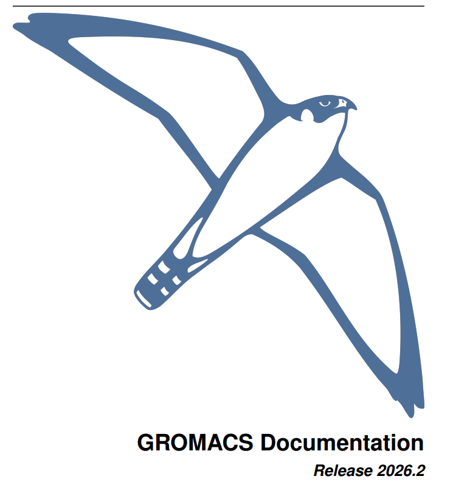
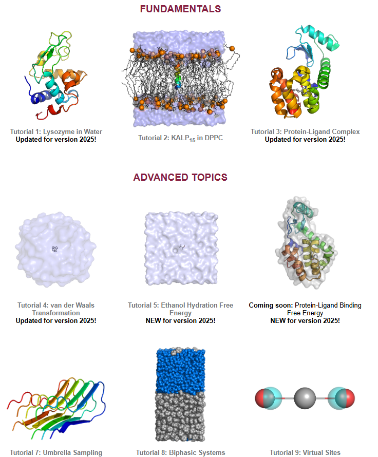

<div align="center">

# GROMACS 2026.2 · Code-Writing Skill

> *官方手册蒸馏 · 40 章结构化知识库 · Lemkul 教程融合 · 中文理论映射*
>
> `GROMACS 2026.2` · `分子动力学模拟` · `实操优先` · `全量可溯源`

[](https://manual.gromacs.org/2026.2/manual-2026.2.pdf)
[](https://claude.ai/code)
[](chapters/)
[](https://www.mdtutorials.com/gmx/)
[](#知识体系)
[](https://www.gnu.org/licenses/lgpl-2.1.html)

|  |  |
| :--------------------------------: | :------------------------------: |

<br>

**GROMACS 2026.2 Reference Manual (953 页) + Justin Lemkul 9 个实操教程 + 中文手册理论映射 —— 以实操为中心的分子动力学技术参考**

手册为骨 · 教程为肉 · 全量可溯源

`本项目不替代官方文档，而是将其组织为 AI 可直接使用的结构化知识`


>
> [Official 2026.2 Manual](./books/manual-2026.2.pdf) | [Online Version](https://manual.gromacs.org/2026.2/manual-2026.2.pdf) 
>
> [Justin Lemkul Tutorials](./books/mdtutorials/) | [中文手册 v5.0.2](./books/GROMACS中文手册%205.0.2%20标签版.pdf)
> 
> [Skill](./SKILL.md) | [Cheatsheet](./cheatsheet.md) | [Glossary](./glossary.md) | [Patterns](./patterns.md)

</div>

---

## 目录

- [概述](#概述)
- [知识体系](#知识体系)
- [仓库结构](#仓库结构)
- [安装与使用](#安装与使用)
- [查询路由](#查询路由)
- [每章结构](#每章结构)
- [三大知识源](#三大知识源)
- [可溯源性](#可溯源性)
- [核心框架](#核心框架)
- [工作流模式](#工作流模式)
- [核心能力](#核心能力)
- [相关资源](#相关资源)
- [使用路线](#使用路线)
- [Skill更新说明](#skill更新说明)
---

## 概述

本仓库将 [GROMACS 2026.2 Reference Manual (953 页)](https://manual.gromacs.org/2026.2/manual-2026.2.pdf) 与 [Justin Lemkul 的 9 个实操教程](http://www.mdtutorials.com/gmx/) 以及 [GROMACS 5.0.2 中文手册](https://jerkwin.github.io/9999/10/31/GROMACS%E4%B8%AD%E6%96%87%E6%95%99%E7%A8%8B/) 的理论部分蒸馏为一个**统一的、结构化的** Claude Code Skill 知识库，覆盖从 PDB 准备、力场选择、系统构建，到能量最小化、NVT/NPT 平衡、生产 MD、轨迹分析、自由能计算、增强采样、配体参数化、膜蛋白模拟、虚拟位点的完整 GROMACS 工作流 —— 共 **40 章**。

**核心设计理念**：这是一个**代码编写与实操技能**。每章以「怎么做」为核心，精确到命令行和 .mdp 参数级别。Lemkul 教程的实操工作流**已融入**对应的官方手册章节中（而非独立追加），中文手册的理论内容已**逐章映射**到英文手册对应章节。

| 数据源 | 角色 | 规模 | 特色 |
|--------|------|------|------|
| GROMACS 2026.2 Reference Manual | 骨架 —— 完整命令参考、.mdp 参数全表、算法方法论 | 953 页 | 按主题组织，涵盖所有 gmx 工具和理论背景 |
| Justin Lemkul 实操教程 | 血肉 —— 可复用的端到端 MD 工作流 | 8 个教程 (68 个步骤文件) | CC-BY 4.0, 分步实操, 完整命令序列, 常见陷阱标注 |
| 中文手册 v5.0.2 | 脉络 —— 中文理论术语与推导 | 21 份翻译稿 | 中英术语对照, 公式推导, 算法详述 |

---

## 知识体系

### 全景图

```
┌──────────────────────────────────────────────────────────────────────────┐
│                 GROMACS 2026.2 · Code-Writing Skill                       │
│              40 章 · Lemkul 教程融合 · 17 章中文理论映射                    │
├────────────────────┬───────────────────────┬──────────────────────────────┤
│  实用指南 (7 章)     │  参考手册 (9 章)        │  理论背景 (11 章)              │
├────────────────────┼───────────────────────┼──────────────────────────────┤
│ ch01 下载与安装       │ ch08 力场 [+tutorial]   │ ch17 引言 [+中文]              │
│ ch02 安装指南         │   CGenFF 配体参数化      │ ch18 定义与单位 [+中文]        │
│ ch03 已知问题         │ ch09 MDP 参数 [+中文]    │ ch19 PBC & MD [+中文]          │
│ ch04 快速入门         │ ch10 mdrun 特性          │   蛙跳/Verlet/Trotter 中文推导  │
│ ch05 体系准备 [+tutorial]│ ch11 性能调优            │ ch20 约束与耦合 [+中文]         │
│   Lysozyme 12步工作流 │ ch12 常见错误 [+tutorial] │   SHAKE/LINCS/恒温器/压浴      │
│ ch06 长时模拟         │   膜/配体/FE/伞形故障排查  │ ch21 自由能 [+tutorial +中文]   │
│ ch07 FAQs            │ ch13 命令参考             │   慢增长/TI/λ向量 + 实操工作流 │
│                      │ ch14 术语表               │ ch22 并行化 [+中文]            │
│                      │ ch15 验证                 │ ch23 非键相互作用 [+中文]       │
│                      │ ch16 How-To [+tutorial]   │   LJ/Buckingham/Coulomb/PME   │
│                      │   膜蛋白/双相系统构建       │ ch24 键合相互作用 [+中文]       │
│                      │                          │ ch25 高级相互作用 [+tutorial +中文]│
│                      │                          │   虚拟位点 CO₂ 实操/软核理论  │
│                      │                          │ ch26 拓扑 [+中文]              │
│                      │                          │ ch27 文件格式 [+中文]          │
├────────────────────┼───────────────────────┼──────────────────────────────┤
│  专项方法 (4 章)     │  运行与分析 (4 章)       │  附录 (5 章)                   │
├────────────────────┼───────────────────────┼──────────────────────────────┤
│ ch28 自由能与牵引     │ ch09 MDP 参数 [+中文]    │ ch35 参考文献                   │
│   [+tutorial]       │ ch31 运行参数 [+中文]     │ ch36 开发者指南                │
│   伞形采样 4 步工作流  │ ch32 分析 [+tutorial +中文]│ ch37 Doxygen                  │
│ ch29 AWH [+中文]     │   分析工作流 + 中文术语    │ ch38 发布说明                   │
│ ch30 高级方法 [+中文] │ ch39 高级 MDP [+中文]    │ ch39 高级 MDP [+中文]          │
│   QM/MM/PLUMED/NNP  │                          │ ch40 教程资源                   │
└────────────────────┴───────────────────────┴──────────────────────────────┘
```

### 核心命令覆盖

| 命令 | 章节 | 覆盖内容 |
|------|:---:|------|
| **gmx pdb2gmx** | ch05, ch08, ch13, ch26 | 拓扑生成、力场选择、端基处理、H原子处理 |
| **gmx editconf** | ch05, ch16 | 盒子定义、dodecahedron/cubic/octahedron、膜系统定向 |
| **gmx solvate** | ch05, ch16 | 溶剂化、spc216.gro、非水溶剂、膜系统水删除 |
| **gmx genion** | ch05, ch13 | 离子添加、-neutral、-conc、离子命名规则 |
| **gmx grompp** | ch05, ch09, ch12 | 预处理、.mdp 验证、常见错误、-maxwarn 警告 |
| **gmx mdrun** | ch05, ch10, ch11 | 生产 MD、GPU 加速、多模拟、checkpoint 重启 |
| **gmx energy** | ch32 | 能量项提取、温度/压力/密度监控 |
| **gmx rms / rmsf** | ch32 | RMSD/RMSF 计算、拟合选择、Backbone vs Cα |
| **gmx gyrate / dssp / hbond** | ch32 | 紧致度、二级结构、氢键 (GROMACS 特定判据) |
| **gmx trjconv** | ch32 | 周期性校正、-pbc mol -center |
| **gmx bar** | ch21, ch44(已融合) | BAR 自由能分析 |
| **gmx wham** | ch28 | WHAM 伞形采样 PMF 重建 |
| **gmx order / density / msd** | ch16 | 膜分析 (氘序参数/密度剖面/侧向扩散) |
| **gmx make_ndx** | ch16, ch32 | 自定义索引组 |
| **gmx genrestr** | ch08 | 配体位置限制生成 |
| **gmx insert-molecules** | ch16, ch47(已融合) | 双相系统/非水溶剂插入 |

---

## 仓库结构

```
.
├── SKILL.md                           # 主索引 —— Core Frameworks · 40 章索引 · 主题索引 · 溯源指南
├── README.md                          # 本文件
│
├── chapters/                          # 核心产出 —— 40 章独立知识单元
│   ├── ch05-system-preparation.md     # 体系准备 [+tutorial] Lysozyme 12步完整工作流
│   ├── ch08-force-fields-overview.md  # 力场 [+tutorial] CGenFF 配体参数化 + 力场修改
│   ├── ch09-mdp-options.md            # MDP 参数 [+中文] 积分器/耦合/约束/静电参数
│   ├── ch12-common-errors.md          # 常见错误 [+tutorial] 膜/配体/FE/伞形故障排查
│   ├── ch16-how-to-guides.md          # How-To [+tutorial] 膜蛋白 InflateGRO + 双相系统
│   ├── ch21-algorithms-free-energy.md # 自由能 [+tutorial +中文] TI/FEP/BAR + 实操工作流
│   ├── ch25-interactions-advanced.md  # 高级相互作用 [+tutorial +中文] 虚拟位点 + 软核理论
│   ├── ch28-special-free-energy.md    # 自由能与牵引 [+tutorial] 伞形采样 4 步工作流
│   ├── ch32-analysis.md               # 分析 [+tutorial +中文] 分析工作流 + 中文术语
│   └── ... (40 files total, ~3,700 lines)
│
├── patterns.md                        # 20+ 标准 MD 工作流模式 (含 Lemkul 教程模式)
├── cheatsheet.md                      # 速查：决策规则 · 热浴/压浴矩阵 · 教程命令 · 膜参数
├── glossary.md                        # ~150 GROMACS 核心术语 (含教程+中文), 附章节引用
│
└── books/                             # 原始资料
    ├── manual-2026.2.pdf              # GROMACS 2026.2 Reference Manual (953 页)
    ├── GROMACS中文手册 5.0.2 标签版.pdf  # 中文手册 (李继存译)
    └── mdtutorials/                   # Justin Lemkul 8 个实操教程 (Markdown)
        ├── 02_Lysozyme_in_Water/      # 溶菌酶基础教程 (12 步)
        ├── 03_Membrane_Protein/       # 膜蛋白 KALP15 in DPPC (11 步)
        ├── 04_Protein-Ligand_Complex/  # 蛋白-配体复合物 (11 步)
        ├── 05_Methane_FE/             # 甲烷 vdW 自由能 (10 步)
        ├── 06_Ethanol_FE/             # 乙醇水合自由能 (6 步)
        ├── 08_Umbrella_Sampling/      # 伞形采样 (9 步)
        ├── 09_Biphasic_Systems/       # 双相系统 (4 步)
        └── 10_Virtual_Sites/          # 虚拟位点 (5 步)
```

---

## 安装与使用

### 安装

```bash
# 方式 1: 手动克隆（推荐）
# gromacs为skill名
git clone https://github.com/MaybeBio/Gromacs-Everything-Skill ~/.claude/skills/gromacs

# 方式 2: 使用 npx
# 同样文件夹名即skill名 gromacs，但只有SKILL.md文件，其余reference全无
npx skills add MaybeBio/Gromacs-Everything-Skill -a claude-code

```

### 在 Claude Code 中调用

Skill 加载后，可直接在对话中查询或手动触发 `/gromacs`：

```
▸ 我的蛋白质体系怎么选力场和水模型？
▸ 写一个完整的显式水 MD 流程 (pdb2gmx → editconf → ... → mdrun → analysis)
▸ 如何用 CGenFF 给一个非标准小分子做 CHARMM 力场参数化？
▸ 膜蛋白模拟的 .mdp 参数应该怎么设？semi-isotropic 是什么意思？
▸ 自由能计算中 lambda 窗口怎么排？放电和 vdW 解耦哪个先做？
▸ umbrella sampling 的 pull-coord1-k 设多少合适？
▸ 虚拟位点怎么手动构建？HMR 和 vsites 哪个更实用？
▸ LINCS warnings 怎么修？体系温度一直在漂怎么办？
▸ 蛙跳式算法和速度Verlet算法有什么区别？(中文理论)
▸ 非键相互作用的势能函数三部分是什么？(中文术语)
```

示例参考[ test case](./test_case.md)

### 查询路由

| 查询类型 | 目标文件 | 响应特征 |
|----------|----------|----------|
| 命令速查 | `cheatsheet.md` | 热浴/压浴矩阵 / 积分器选择 / 教程命令模板 |
| 命令 & flag 语法 | `chapters/ch*-*.md` | 精确命令 + 完整 .mdp 参数 |
| .mdp 参数查询 | `chapters/ch09-mdp-options.md` | 全部 MDP 参数 + 默认值 |
| MD 工作流模板 | `patterns.md` | 13 步标准流程 / FE / umbrella / vsites 模式 |
| 教程实操指南 | `ch05, ch08, ch16, ch21, ch25, ch28` | 完整命令序列 + 关键决策点 + 常见错误 |
| 膜蛋白模拟 | `chapters/ch16-how-to-guides.md` | InflateGRO / 膜分析 / 脂质 Tm 表 |
| 自由能方法论 | `chapters/ch21-algorithms-free-energy.md` | TI/BAR 理论 + 两步解耦工作流 |
| 错误排查 | `chapters/ch12-common-errors.md` | 膜/配体/FE/伞形故障 3-4 种 + 修复 |
| 术语定义 | `glossary.md` | 精确定义 + 归属章节 |
| 中文理论 | `ch17-ch27, ch29-ch32, ch39` | 每章附「中文术语对照」表 |
| 系统学习 | `SKILL.md` → `chapters/*.md` | Core Frameworks → Chapter Index → Topic Index |

---

## 每章结构

每章按统一模板组织，支持快速定位：

| 区域 | 内容 |
|------|------|
| **Core Idea** | 1-2 句话核心要点 |
| **Frameworks Introduced** | 命名的框架/工作流，含「何时使用」和「如何操作」 |
| **Key Concepts** | 5-10 个关键术语的精确定义 |
| **Mental Models** | 「用 X 当 Y」「把 X 看作 Y」的思维模型 |
| **Code Examples** | 精确命令序列 + .mdp 参数配置 |
| **Practical Workflow** (tutorial 章) | 完整的端到端实操流程（命令 + 决策点 + 验证标准） |
| **Anti-patterns** | 常见错误模式及原因 |
| **中文术语对照** (中文理论章) | 中英术语对照表，附公式来源 |
| **Key Takeaways** | 3-7 条必须记住的要点 |
| **Connects To** | 与其它章节的交叉引用链 |

---

## 三大知识源

| 维度 | GROMACS 2026.2 Manual | Lemkul 实操教程 | 中文手册 v5.0.2 |
|------|:---:|:---:|:---:|
| **定位** | 完整命令参考与算法理论 | 分步实操指南 (CC-BY 4.0) | 中文理论推导与术语 |
| **规模** | 953 页 PDF | 8 个教程 (68 个步骤文件) | ~300 页翻译稿 |
| **内容特色** | 所有 gmx 工具、.mdp 参数、算法详述、数学公式 | 完整命令序列、参数选择理由、错误陷阱标注、可执行工作流 | 公式推导、算法中文解释、中英术语对照 |
| **覆盖** | 40 章全主题覆盖 | 8 个关键场景 (基础→膜蛋白→配体→自由能→伞形→虚拟位点) | 8 章全映射 |
| **最适合** | 查命令 flag 和 .mdp 变量的精确含义 | 跟着做一遍完整的 MD 模拟 | 理解算法原理的中文解释 |
| **融合方式** | 每章独立知识单元 | **已融入**对应官方章节 (ch05/08/16/21/25/28/32) | **已逐章映射**到英文手册 (17 个章节含中文术语表) |

### 中文手册逐章映射

| 中文手册 (v5.0.2) | → 英文章节 | 融入内容 |
|---|---|---|
| 第一章 简介 | → ch17 [+中文] | 计算化学/MD/能量最小化中英术语 |
| 第二章 定义与单位 | → ch18 [+中文] | 符号约定、MD 单位体系、约化单位 |
| 第三章 算法 (18 小节) | → ch19-22 [+中文] | 蛙跳/Verlet/Trotter、恒温器/压浴、TI/慢增长、区域分解 |
| 第四章 相互作用函数和力场 (10 小节) | → ch23-25, ch08 [+中文] | LJ/Buckingham/Coulomb、键合势、虚拟位点理论、力场家族 |
| 第五章 拓扑 (7 小节) | → ch26-27 [+中文] | 拓扑文件结构、.itp/.rtp/.hdb/.tdb、文件类型全表 |
| 第六章 专题 (14 小节) | → ch28-30 [+中文] | PMF/牵引/AWH/QM-MM/AdResS/MARTINI/NNP/FMM |
| 第七章 运行参数和程序 | → ch09, ch31, ch39 [+中文] | MDP 参数分类、文件类型、高级参数 |
| 第八章 分析 | → ch32 [+tutorial+中文] | 分析工作流 + 氢键判据 + 14 个分析术语 |

### 可溯源性

每条命令和 .mdp 参数都可追溯回原始手册、教程或中文手册：

```
查询: "sc-alpha soft-core free energy 自由能"
  → ch21 Free Energy [+tutorial+中文] (Manual §21 + Lemkul FE 教程)
  → ch25 Advanced Interactions [+tutorial+中文] (§4.5 软核相互作用 / §4.7 虚拟相互作用位点)
  → cheatsheet.md Free Energy Quick Reference
  → 原始教程: books/mdtutorials/05_Free_Energy_Calculations:Methane_in_Water/
  → 中文理论: §3.12 自由能计算 (慢增长方法 + 热力学积分 + λ向量)
```

三条追溯链路：
1. **`SKILL.md` 主题索引** → 话题 → 对应章节
2. **每章 `Connects To`** → 交叉引用其它相关章节
3. **books/ 原始资料** → PDF 手册 + mdtutorials/ 原始教程文件


---

## 章节覆盖度

| 来源 | 总规模 | 已蒸馏 | 覆盖率 |
|------|:---:|:---:|:---:|
| GROMACS 2026.2 Reference Manual | 953 页 | 40 章 (全量 API + MDP 参数) | **~95%** |
| Lemkul 实操教程 | 8 个教程 | 全部融入对应官方章节 | **100%** |
| 中文手册 v5.0.2 | 8 章 (21 份翻译稿) | 逐章映射至英文手册 (17 章含中文术语) | **100%** |

### 富化标注统计

| 标注类型 | 章节数 | 章节列表 |
|----------|:---:|------|
| **[+tutorial]** | 8 | ch05, ch08, ch12, ch16, ch21, ch25, ch28, ch32 |
| **[+中文]** | 17 | ch09, ch17, ch18, ch19, ch20, ch21, ch22, ch23, ch24, ch25, ch26, ch27, ch29, ch30, ch31, ch32, ch39 |

---

## 核心框架

本技能内置以下 10 个核心决策框架，覆盖 GROMACS 模拟全流程的关键决策点：

| 框架 | 英文 | 核心内容 |
|------|------|----------|
| 1 | 6-phase Simulation Pipeline | 每次模拟的完整路径：体系准备 → EM → NVT → NPT → MD → 分析 |
| 2 | Force Field Selection Heuristic | 蛋白质? 膜? 小分子? 不同场景不同选择（AMBER/CHARMM/GROMOS/OPLS） |
| 3 | Thermostat/Barostat Decision Matrix | 不同阶段用不同的耦合：Berendsen（快速松弛）、V-rescale/Nose-Hoover（生产）、PR barostat |
| 4 | Timestep Selection | 1fs/2fs/4fs/5fs 分别适用什么场景，配合约束算法选择 |
| 5 | PME Tuning Rule | rcoulomb = rvdw = rlist, fourierspacing = 0.12，GPU-resident 模式优化 |
| 6 | Box Selection Principle | 球形溶质用菱形十二面体，节省 29% 溶剂原子 |
| 7 | Performance Optimization Priority | 8 个优化点按优先级排列：GPU 加速、MTS、PME rank 调优等 |
| 8 | Free Energy Calculation Strategy | 5 种方法（TI/FEP/BAR/AWH/Umbrella）的适用场景对比 |
| 9 | Constraint Algorithm Selection | LINCS/SHAKE/SETTLE 何时用哪个，配合时间步长选择 |
| 10 | Error Diagnosis Heuristic | 9 种常见错误（LINCS warnings、非零电荷、PME 负载等）的快速诊断 |

---

## 工作流模式

| 模式 | 适用场景 |
|------|----------|
| **Standard MD Workflow** | 任何从头开始的 MD 模拟（13 步完整流程） |
| **Force Field Selection** | 为新体系选择交互参数 |
| **Box Type Selection** | 定义模拟盒子类型（立方体/菱形十二面体/截角八面体） |
| **Temperature Coupling** | 不同模拟阶段的热浴选择 |
| **Pressure Coupling** | NPT 模拟阶段的压浴选择 |
| **Constraint Algorithms** | 为更大时间步长约束键长 |
| **PME Parameter Tuning** | 设置静电参数 |
| **Performance Optimization** | 模拟速度慢时的优化策略 |
| **Free Energy Calculation** | 计算结合自由能、溶剂化自由能 |
| **Enhanced Sampling Decision Tree** | 选择增强采样方法（Umbrella/AWH/Replica exchange 等） |
| **System Preparation Checklist** | 开始任何新模拟前的检查清单 |
| **Common Error Diagnosis** | 错误症状快速诊断与修复 |

---

## 核心能力

| 领域 | 英文 | 涵盖内容 |
|------|------|----------|
| **模拟流程** | MD Pipeline | pdb2gmx → editconf → solvate → genion → grompp → mdrun (EM → NVT → NPT → MD) |
| **力场** | Force Fields | AMBER99SB-ILDN, CHARMM36, GROMOS54A7, OPLS-AA/L |
| **热浴/压浴** | Thermostats & Barostats | Berendsen, V-rescale, Nose-Hoover, Parrinello-Rahman |
| **约束算法** | Constraints | LINCS, SHAKE, SETTLE |
| **长程静电** | Long-range Electrostatics | PME, Ewald, PPPM, Reaction Field, FMM |
| **自由能** | Free Energy | TI, FEP, BAR, MBAR, soft-core potentials |
| **增强采样** | Enhanced Sampling | Replica exchange, expanded ensemble, AWH, umbrella sampling, metadynamics |
| **GPU 加速** | GPU Acceleration | CUDA, OpenCL, SYCL, HIP, GPU-resident mode |
| **并行化** | Parallelization | Domain decomposition, MPI, OpenMP |
| **文件格式** | File Formats | .gro, .top, .itp, .mdp, .tpr, .xtc, .trr, .edr, .cpt, .ndx, .xvg |
| **高级方法** | Advanced Methods | QM/MM (CP2K, MiMiC), Neural Network Potentials, MTS, HMR |

---

## 相关资源

### 官方 / Official

| 资源 | 英文 | 链接 |
|------|------|------|
| GROMACS 官网 | Homepage | [gromacs.org](https://www.gromacs.org) |
| 在线手册 | Online Manual | [manual.gromacs.org](https://manual.gromacs.org/current/index.html) |
| 用户指南 | User Guide | [manual.gromacs.org/user-guide](https://manual.gromacs.org/current/user-guide/index.html) |
| 官方教程 | Official Tutorials | [tutorials.gromacs.org](https://tutorials.gromacs.org) |
| 源码仓库 | Source Code | [gitlab.com/gromacs/gromacs](https://gitlab.com/gromacs/gromacs) · [github.com/gromacs/gromacs](https://github.com/gromacs/gromacs) |
| 官方论坛 | Forum | [gromacs.bioexcel.eu](https://gromacs.bioexcel.eu) |
| Python API (gmxapi) | Python API | [manual.gromacs.org/gmxapi](https://manual.gromacs.org/current/gmxapi/index.html) |

### 第三方 / Third-Party

| 资源 | 英文 | 链接 |
|------|------|------|
| Justin Lemkul 教程 | MD Tutorials | [mdtutorials.com/gmx](http://www.mdtutorials.com/gmx) |
| Gromacs 中文教程 |  | https://jerkwin.github.io/9999/10/31/GROMACS%E4%B8%AD%E6%96%87%E6%95%99%E7%A8%8B/ | 

---

## 使用路线

```
GROMACS 官方用户指南 -> 第三方教程（Justin Lemkul）模拟 -> 实操: (本skill定位RAG -> 论坛问答 + 官方文档查证) -> Loop
```

> **核心原则 / Core Principle**: 用中学，一切第一性原理的引用论证，都以官方文档为准，本 skill 只是在传统 RAG 学习模式上加速收敛。


---

## Skill更新说明

- 原始skill（v0.1.0） 仅蒸馏官方操作手册，重点在于api查询，技术手册查询辅助定位
- 更新后skill（v0.2.0起） 添加一些第三方教程，侧重于实践导向；同时增加了中文手册资料（⚠️中文教程版本 更新未追及官方英文文档，待后续开源版中文教程资料更新）
---

<div align="center">

*基于 GROMACS 2026.2 Reference Manual + Justin Lemkul 8 个实操教程 + 中文手册 v5.0.2 理论蒸馏。*
*实操优先，精确到命令和 .mdp flag 级别，全量可溯源。*

[GROMACS 官方网站](https://www.gromacs.org) ·
[在线手册](https://manual.gromacs.org) ·
[Lemkul 教程](http://www.mdtutorials.com/gmx/) ·
[用户论坛](https://gromacs.bioexcel.eu)

</div>

