## 目 录

售 辞 i  
谢 辞 iii  
1 简介与下载 1  
1.1 简介 . 1  
1.2 源代码 3  
1.3 回归测试 3  
2 安装与测试 5  
2.1 GROMACS 构建简介 5  
2.1.1 快速安装 . 5  
2.1.2 集群上的快速安装 6  
2.1.3 典型安装 . . 6  
2.1.4 构建旧版本 6  
2.2 安装条件 7  
2.2.1 平台 7  
2.2.2 编译器 7  
2.2.3 使用并行选项进行编译 8  
GPU 支持 . 8  
MPI 支持 8  
2.2.4 CMake . 8  
2.2.5 快速傅里叶变换库 9  
使用 FFTW . 9  
使用 MKL . 9  
使用 ARM 性能库 10  
2.2.6 其他可选的构建组件 10  
2.3 构建 GROMACS . 10  
2.3.1 使用 CMake 进行配置 10  
GROMACS 的安装位置 11  
使用 CMake 命令行选项 11  
SIMD 支持 12  
CMake 高级选项 13  
帮助 CMake 找到正确的库，头文件或程序 13  
CUDA GPU 加速 13  
OpenCL GPU 加速 14  
静态链接 14  
gmxapi 外部 API . 15  
可移植性方面 15  
线性代数库 15  
进行支持 MiMiC QM/MM 的构建 16  
更改 GROMACS 二进制文件和库的名称 . 16  
更改安装树结构 . 16  
2.3.2 编译和链接 17  
只构建 mdrun . 17  
2.3.3 安装 GROMACS 17  
2.3.4 安装后使用 GROMACS 17  
2.3.5 测试 GROMACS 的正确性 17  
2.3.6 测试 GROMACS 的性能 19  
2.3.7 遇到了困难? . 19  
2.4 针对某些平台的特别说明 19  
2.4.1 Windows 上的构建 19  
2.4.2 Cray 上的构建 20  
2.4.3 Solaris 上的构建 20  
2.4.4 Fujitsu PRIMEHPC 20  
2.4.5 Intel Xeon Phi 20  
2.5 测试过的平台 . 21  
2.6 基准测试 21  
2.6.1 GROMACS 5.0 基准测试 21  
2.6.2 GPU 基准测试 21  
2.6.3 相关论文 . 21  
3 用户指南 23  
3.1 入门 23  
3.1.1 流程图 23  
3.1.2 设置环境 . 23  
3.1.3 典型模拟的流程图 25  
3.1.4 重要文件 . 25  
分子拓扑文件（.top） 25  
拓扑的 #include 文件机制 . 25  
分子结构文件（.gro，.pdb） 26  
分子动力学参数文件（.mdp） 26  
索引文件（.ndx） 26  
运行输入文件（.tpr） 26  
轨迹文件（.trr，.tng 或 .xtc） 26  
3.1.5 教程资料 . 26  
3.1.6 背景阅读资料 26  
3.2 系统准备 27  
3.2.1 需要考虑的步骤 27  
3.2.2 技巧和窍门 28  
数据库文件 28  
3.3 管理长时间的模拟 28  
3.3.1 追加到输出文件 29  
3.3.2 备份文件 29  
3.3.3 延长。tpr 文件的时间 29  
3.3.4 更改 mdp 选项以重新启动模拟 29  
3.3.5 不存在检查点文件时重新启动模拟 30  
3.3.6 续跑是否精确? 30  
3.3.7 重现性 30  
3.4 常见问题（FAQ） 31  
3.4.1 有关 GROMACS 安装的问题 31  
3.4.2 有关系统准备和预处理的问题 31  
3.4.3 有关模拟方法的问题 32  
3.4.4 参数化与力场 33  
3.4.5 分析与可视化 33  
3.5 GROMACS 中的力场 33  
3.5.1 AMBER 33  
3.5.2 CHARMM . 34  
3.5.3 GROMOS 35  
3.5.4 OPLS 35  
3.6 非键截断方案 . 35  
3.6.1 非键方案功能的比较 36  
3.6.2 性能 36  
3.6.3 如何使用 Verlet 方案 37  
3.6.4 更多信息 37  
3.7 命令行参考 37  
3.7.1 命令行界面和约定 37  
处理特定类型的命令行选项 38  
3.7.2 按名称排序的命令 38  
3.7.3 按主题排序的命令 41  
分析轨迹 41  
创建拓扑与坐标 . 42  
运行模拟 42  
查看轨迹 42  
处理能量 42  
转换文件 42  
工具 43  
结构间的距离 43  
结构中的距离随时间的变化 43  
质量分布性质随时间的变化 43  
分析成键相互作用 44  
结构性质 44  
动力学性质 44  
静电性质 45  
蛋白质相关分析 . 45  
界面 45  
协方差分析 45  
简正模式 45  
3.7.4 gmx 46  
3.7.5 gmx anadock 46  
3.7.6 gmx anaeig 47  
3.7.7 gmx analyze . 50  
3.7.8 gmx angle 52  
3.7.9 gmx awh . 54  
3.7.10 gmx bar 55  
3.7.11 gmx bundle 57  
3.7.12 gmx check 58  
3.7.13 gmx chi 60  
3.7.14 gmx cluster 63  
3.7.15 gmx clustsize 66  
3.7.16 gmx confrms . 67  
3.7.17 gmx convert-tpr . 68  
3.7.18 gmx covar 69  
3.7.19 gmx current 71  
3.7.20 gmx density 72  
3.7.21 gmx densmap 74  
3.7.22 gmx densorder 76  
3.7.23 gmx dielectric 77  
3.7.24 gmx dipoles 79  
3.7.25 gmx disre 81  
3.7.26 gmx distance 82  
3.7.27 gmx do\_dssp 84  
3.7.28 gmx dos . 86  
3.7.29 gmx dump . . 87  
3.7.30 gmx dyecoupl 88  
3.7.31 gmx dyndom 90  
3.7.32 gmx editconf 91  
3.7.33 gmx eneconv 94  
3.7.34 gmx enemat 95  
3.7.35 gmx energy 97  
3.7.36 gmx filter 100  
3.7.37 gmx freevolume 101  
3.7.38 gmx gangle 103  
3.7.39 gmx genconf . 104  
3.7.40 gmx genion 106  
3.7.41 gmx genrestr 107  
3.7.42 gmx grompp . 108  
3.7.43 gmx gyrate 111  
3.7.44 gmx h2order . 112  
3.7.45 gmx hbond 113  
3.7.46 gmx helix 116  
3.7.47 gmx helixorient 117  
3.7.48 gmx help . . 119  
3.7.49 gmx hydorder 119  
3.7.50 gmx insert-molecules 120  
3.7.51 gmx lie . . 122  
3.7.52 gmx make\_edi 123  
3.7.53 gmx make\_ndx 126  
3.7.54 gmx mdmat 130  
3.7.55 gmx mdrun 131  
3.7.56 gmx mindist . 136  
3.7.57 gmx mk\_angndx 138  
3.7.58 gmx morph 138  
3.7.59 gmx msd . . 139  
3.7.60 gmx nmeig . 141  
3.7.61 gmx nmens 143  
3.7.62 gmx nmr . . 143  
3.7.63 gmx nmtraj 145  
3.7.64 gmx order 146  
3.7.65 gmx pairdist . . 147  
3.7.66 gmx pdb2gmx . . 149  
3.7.67 gmx pme\_error 152  
3.7.68 gmx polystat 153  
3.7.69 gmx potential 154  
3.7.70 gmx principal 155  
3.7.71 gmx rama 156  
3.7.72 gmx rdf 157  
3.7.73 gmx report-methods 160  
3.7.74 gmx rms 160  
3.7.75 gmx rmsdist 162  
3.7.76 gmx rmsf 164  
3.7.77 gmx rotacf . 165  
3.7.78 gmx rotmat 166  
3.7.79 gmx saltbr . 168  
3.7.80 gmx sans . . 168  
3.7.81 gmx sasa . 170  
3.7.82 gmx saxs . 172  
3.7.83 gmx select 173  
3.7.84 gmx sham 175  
3.7.85 gmx sigeps . 177  
3.7.86 gmx solvate 178  
3.7.87 gmx sorient 180  
3.7.88 gmx spatial . 182  
3.7.89 gmx spol . 183  
3.7.90 gmx tcaf . 185  
3.7.91 gmx traj . 186  
3.7.92 gmx trajectory 188  
3.7.93 gmx trjcat . 190  
3.7.94 gmx trjconv 191  
3.7.95 gmx trjorder . 195  
3.7.96 gmx tune\_pme . 196  
3.7.97 gmx vanhove 201  
3.7.98 gmx velacc . 202  
3.7.99 gmx view . 203  
3.7.100 gmx wham . . 204  
3.7.101 gmx wheel . 208  
3.7.102 gmx x2top . 209  
3.7.103 gmx xpm2ps . 211  
3.7.104 不同版本之间的命令更改 . 213  
2018 版 . 213  
2016 版 214  
5.1 版 . 214  
5.0 版 . 215  
3.7.105 专题 . 217  
选区语法和用法 . 217  
分子动力学参数（.mdp 选项） 225  
3.8.1 通用信息 . 225  
3.8.2 预处理 225  
3.8.3 运行控制 . 226  
3.8.4 Langevin 动力学 228  
3.8.5 能量最小化 . 228  
3.8.6 壳层分子动力学 228  
3.8.7 测试粒子插入 229  
3.8.8 输出控制 . 229  
3.8.9 邻区搜索 229  
3.8.10 静电 231  
3.8.11 范德华作用 . 233  
3.8.12 表格 . 235  
3.8.13 Ewald 235  
3.8.14 温度耦合 . 236  
3.8.15 压力耦合 . 237  
3.8.16 模拟退火 . 239  
3.8.17 速度产生 . 239  
3.8.18 键约束 . 240  
3.8.19 能量组排除 . 241  
3.8.20 墙 241  
3.8.21 质心牵引 . 242  
3.8.22 AWH 自适应偏置 . 246  
3.8.23 强制旋转 250  
3.8.24 NMR 精修 . 251  
3.8.25 自由能计算 . 252  
3.8.26 扩展系综计算 255  
3.8.27 非平衡 MD . 258  
3.8.28 电场 . 259  
3.8.29 混合量子/经典分子动力学 . 259  
3.8.30 计算电生理学 . 260  
3.8.31 用户自定义项 . 262  
3.8.32 移除的功能 262  
3.9 有用的 mdrun 功能 262  
3.9.1 重新运行模拟 . 262  
3.9.2 以可重现的模式运行模拟 263  
3.9.3 运行多重模拟 . 263  
运行多重模拟的示例 263  
运行副本交换模拟 . 264  
3.9.4 控制模拟的长度 . 264  
3.9.5 运行膜蛋白嵌入模拟 264  
3.10 提高 mdrun 的性能 . 265  
3.10.1 硬件的背景信息 265  
3.10.2 GROMACS 中并行化的工作目录 . 266  
3.10.3 并行化方案 267  
通过 SIMD 进行内核并行化：SSE，AVX 等 267  
通过 OpenMP 进行进程（处理器）级别的并行化 267  
通过 GPU 卸载和线程 MPI 进行节点级并行化 267  
通过 MPI 在多个节点上并行 . 268  
单独的 PME 节点 . 269  
3.10.4 在单个节点上运行 mdrun 270  
单节点 mdrun 的示例 272  
3.10.5 在多个节点上运行 mdrun . 273  
多节点 mdrun 的示例 . 274  
3.10.6 接近标度极限 274  
3.10.7 如何更好地运行 mdrun . 275  
3.10.8 使用 GPU 运行 mdrun 277  
GPU 任务类型 . 277  
减少 GPU 加速运行中的开销 279  
3.10.9 运行 OpenCL 版本的 mdrun . 279  
OpenCL 支持的已知限制 280  
3.10.10 性能检查清单 280  
GROMACS 配置 . 280  
运行设置 281  
检查并改进性能 . 281  
3.11 使用 GROMACS 时的常见错误 281  
3.11.1 使用过程中的常见错误 281  
Out of memory when allocating 分配时内存不足 281  
3.11.2 pdb2gmx 中的错误 282  
Residue ’XXX’ not found in residue topology database 残基拓扑数据库中找不到  
残基 XXX 282  
Long bonds and/or missing atoms 过长的键和/或缺失原子 . 282  
Chain identifier ’X’ was used in two non-sequential blocks 两个非相邻单元使用了  
同样的链标识符 X 282  
WARNING: atom X is missing in residue XXX Y in the pdb file 警告：pdb 文件  
中的残基 XXX Y 缺失原子 X. . 283  
Atom X in residue YYY not found in rtp entry rtp 条目中不存在残基 YYY 的原  
子 X . . . 283  
No force fields found (files with name ’forcefield.itp’ in subdirectories ending on  
’.ff’) 找不到力场文件（在以.ff 结尾的子目录中名为 forcefield.itp 的文件） 283  
3.11.3 grompp 中的错误 283  
Found a second defaults directive file 发现第二个包含默认指令的文件 283  
Invalid order for directive xxx 指令 xxx 的顺序错误 284  
Atom index n in position\_restraints out of bounds 位置限制中的原子索引 n 超出  
了范围 284  
System has non-zero total charge 系统的总电荷非零 285  
Incorrect number of parameters 参数个数不正确 285  
Number of coordinates in coordinate file does not match topology 坐标文件中的  
粒子数与拓扑文件不匹配 285  
Fatal error: No such moleculetype XXX 致命错误：没有分子类型 XXX 285  
T-Coupling group XXX has fewer than 10% of the atoms 温度耦合组 XXX 的原  
子数不到 10% 286  
The cut-off length is longer than half the shortest box vector or longer than the  
smallest box diagonal element. Increase the box size or decrease rlist 截  
断长度大于最短盒子向量长度的一半或大于最小盒子对角线的长度。增  
加盒子大小或减少 rlist 286  
Atom index (1) in bonds out of bounds 键中的原子索引 (1) 超出范围 286  
XXX non-matching atom names XXX 不匹配的原子名称 286  
The sum of the two largest charge group radii (X) is larger than rlist - rvdw/r-  
coulomb 两个最大电荷组半径 (X) 的总和大于 rlist - rvdw/rcoulomb . 287  
Invalid line in coordinate file for atom X 坐标文件中原子 X 的行无效 287  
3.11.4 mdrun 中的错误 287  
Stepsize too small，or no change in energy。步长太小，或能量没有变化。收敛到  
机器精度，但未收敛到指定的 Fmax 287  
Energy minimization has stopped because the force on at least one atom is not  
finite 能量最小化已经停止，因为至少有一个原子上的力无穷大。 287  
LINCS/SETTLE/SHAKE 警告 287  
1-4 interaction not within cut-off 1-4 相互作用不处于截断范围内 288  
模拟在运行但没有输出 . . 288  
Can not do Conjugate Gradients with constraints 带约束的系统无法使用共轭梯  
度方法 288  
Pressure scaling more than 1% 压力缩放超过 1% 288  
Range Checking error 范围检查错误 289  
X particles communicated to PME node Y are more than a cell length out of the  
domain decomposition cell of their charge group 通信到 PME 节点 Y 的  
X 个粒子超过了其电荷组的区域分解单元格的长度 289  
A charge group moved too far between two domain decomposition steps。在两个  
区域分解步骤之间电荷组移动得太远。 289  
Software inconsistency error: Some interactions seem to be assigned multiple times  
软件不一致错误：某些相互作用似乎被分配了多次 289  
There is no domain decomposition for n ranks that is compatible with the given  
box and a minimum cell size of x nm 对于 n 个进程，无法进行符合给定  
盒子大小，且最小单元格尺寸为 x nm 的区域分解 289  
术语 . . . 289  
3.12.1 压强 289  
波动 289  
3.12.2 周期性边界条件 290  
建议的工作流程 . 290  
3.12.3 控温器 291  
该怎么做 291  
不要做什么 291  
进一步阅读材料 . 291  
3.12.4 能量守恒 292  
3.12.5 平均结构 . 292  
3.12.6 爆破 . 292  
3.12.7 如何诊断一个不稳定的系统 293  
3.12.8 分子动力学 . 294  
书籍 294  
类型/系综 295  
3.12.9 力场 295  
3.12.10 约束与限制 . 295  
3.13 环境变量 296  
3.13.1 输出控制 . 296  
3.13.2 调试 296  
3.13.3 性能和运行控制 297  
3.13.4 OpenCL 管理 . 299  
3.13.5 分析与核心函数 . . 300  
3.14 浮点运算 301  
3.15 使用 GROMACS 时的安全性 . 302  
3.16 废弃 GROMACS 功能的策略 302  
操作指南 303  
4.1 初学者 . 303  
4.1.1 资源 . 303  
4.2 向力场中添加残基 . 303  
4.2.1 添加新残基 303  
4.2.2 修改力场 . 304  
4.3 水溶剂化 304  
4.4 将 3 位点水模型更改为 4 位点水模型 . 304  
4.5 非水溶剂 . 304  
4.5.1 制作非水溶剂盒子 305  
4.6 混合溶剂 305  
4.7 添加二硫键 305  
4.8 在 GROMACS 中运行膜模拟 305  
4.8.1 运行膜模拟 . 305  
4.8.2 使用 solvate 添加水 . 306  
4.8.3 外部材料 . . 306  
4.9 新分子的参数化 . 307  
4.9.1 外来物种 . 307  
4.10 平均力势 308  
4.11 单点能 308  
4.12 碳纳米管 308  
4.12.1 Robert Johnson 的提示 . . 308  
4.12.2 Andrea Minoia 的教程 . 309  
4.13 可视化软件 310  
4.13.1 拓扑键与呈现键 . . 310  
4.14 提取轨迹信息 . . 310  
4.15 用于轨迹分析的外部工具 . 310  
4.16 数据绘图 . 311  
4.16.1 软件 311  
4.17 胶束团簇化 . 311  
4.18 恒 pH 模拟 . 312  
4.19 扩散系数 . 313  
4.20 二面角主成分分析（PCA） . 313  
4.20.1 GROMACS 中 PCA 的实现 . 313  
4.21 二面限制 . 314  
4.22 距离限制 . 315  
4.23 本性动力学 . 316  
4.24 多条链 . 316  
4.24.1 完全相同的链 . 316  
4.24.2 不同的链 . 316  
4.24.3 是否需要将链分成不同的分子? . 317  
4.25 多个拓扑条目 . 317  
4.26 简正模式分析 . . 317  
4.27 聚合物 . 318  
4.28 位置限制 . 318  
4.28.1 示例 . 318  
4.29 使用 Fortran 读取 XTC 文件 . 319  
4.30 减少轨迹文件的存储空间 . 319  
4.31 副本交换分子动力学 . 320  
4.31.1 一般步骤 . . 320  
4.31.2 具体步骤 . 321  
4.31.3 理解 REMD 相关的输出 321  
4.31.4 后处理 . 322  
4.32 表格势能 322  
4.32.1 非键的表格相互作用 322  
理论 . 322  
构造表格 . 322  
使用方法 . 324  
4.32.2 成键相互作用的表格势函数 . 324  
4.33 在脚本中使用命令 . 324  
4.33.1 命令行 . 324  
4.33.2 脚本 . 324  
4.33.3 使用组名 . 325  
4.33.4 复杂示例 . . 325  
4.34 使用 VMD 插件读取非 GROMACS 原生的轨迹格式 . 325  
参考手册 327  
5.1 前言和免责声明 327  
5.1.1 引用信息 . 328  
5.1.2 GROMACS 为 自由软件 328  
5.2 简介 329  
5.2.1 计算化学与分子建模 329  
5.2.2 分子动力学模拟 . 330  
5.2.3 能量最小化与搜索方法 332  
5.3 定义与单位 333  
5.3.1 符号标记 . 333  
5.3.2 MD 单位 . 333  
5.3.3 约化单位 . 334  
5.3.4 混合精度或双精度 335  
5.4 算法 . 336  
5.4.1 周期性边界条件 336  
些有用的盒子类型 338  
截断限制 338  
5.4.2 组的概念 . 339  
5.4.3 分子动力学 339  
初始条件 341  
邻区搜索 341  
计算力 . 347  
蛙跳式积分方法 . . 348  
速度 Verlet 积分方法 349  
理解可逆积分方法：Trotter 分解 349  
多重时间步 351  
温度耦合 351  
压力耦合 355  
完整的更新算法 . 360  
输出步骤 361  
5.4.4 壳层分子动力学 361  
壳层位置的优化 . 361  
5.4.5 约束算法 . . 362  
SHAKE . 362  
SETTLE 362  
LINCS . 362  
5.4.6 模拟退火 . . 364  
5.4.7 随机动力学 365  
5.4.8 布朗动力学 365  
5.4.9 能量最小化 366  
最陡下降 366  
共轭梯度法 366  
L-BFGS 法 366  
5.4.10 简正模式分析 367  
5.4.11 自由能计算 367  
慢增长方法 367  
热力学积分 369  
5.4.12 副本交换动力学 . 369  
5.4.13 本性动力学采样 370  
5.4.14 扩展系综动力学 . 371  
5.4.15 并行 . 371  
5.4.16 区域分解 . . 371  
坐标和力的通信 . 371  
动态负载均衡 . 372  
并行中的约束 . 373  
相互作用范围 . 373  
多程序多数据 PME 并行化 . 375  
区域分解流程图 . 375  
.5 相互作用函数和力场 . 377  
5.5.1 非键相互作用 . 377  
Lennard-Jones 相互作用 . 377  
Buckingham 势 . 378  
库仑相互作用 . 379  
反应场库仑相互作用 . 379  
修正的非键相互作用 . 380  
Ewald 求和时修正的短程相互作用 381  
5.5.2 成键相互作用 381  
键伸缩 . . 382  
Morse 势键伸缩 . . 382  
立方键伸缩势 . 383  
FENE 键伸缩势 . 384  
简谐键角势 384  
余弦键角势 . 384  
受限弯曲势 . 385  
Urey-Bradley 势 . 386  
键-键交叉项 386  
键角交叉项 . 386  
四次键角势 386  
反常二面角 386  
正常二面角 . 388  
表格式成键相互作用函数 . 391  
5.5.3 限制 . 392  
位置限制 . 392  
平底位置限制 . 393  
角限制 . . 394  
二面角限制 394  
距离限制 . 394  
取向限制 397  
5.5.4 极化 . 401  
简单极化 . 401  
非简谐极化 401  
水极化 . . . 401  
Thole 极化 . 401  
5.5.5 自由能相互作用 . 402  
简谐势 . 402  
GROMOS-96 键和键角 . 402  
正常二面角 402  
表格成键相互作用 . 402  
库仑相互作用 . 402  
反应场库仑相互作用 . 403  
Lennard-Jones 相互作用 . 403  
动能 . 403  
约束 . 403  
软核相互作用 . 404  
5.5.6 方法 . 405  
排除和 1-4 相互作用。 . 405  
电荷组 . . 406  
组方案中的截断处理 . 406  
5.5.7 虚拟相互作用位点 . 407  
5.5.8 长程静电作用 . 410  
Ewald 加和 . 410  
PME . 411  
P3M-AD . 411  
优化傅里叶变换和 PME 计算 . 412  
5.5.9 长程范德华相互作用 . 412  
色散校正 . 412  
Lennard-Jones PME . 414  
5.5.10 力场 . 415  
全氢力场 . 416  
GROMOS-96 . 416  
OPLS/AA . . 417  
AMBER . 417  
CHARMM . 417  
粗粒化力场 . 417  
MARTINI . . 418  
PLUM . . 418  
拓扑 . . 418  
5.6.1 粒子类型 . . 418  
原子类型 . 419  
虚拟位点 . 419  
5.6.2 参数文件 . . 420  
原子 . 420  
非键参数 . 421  
成键参数 . 422  
5.6.3 分子定义 . . 423  
分子类型条目 . 423  
分子间相互作用 . . 423  
分子内的对相互作用 . 423  
排除 . 424  
5.6.4 约束算法 . . 424  
5.6.5 pdb2gmx 输入文件 . 425  
残基数据库 . 426  
残基-构建单元转换数据库 427  
原子重命名数据库 428  
氢原子数据库 428  
末端数据库 430  
虚拟位点数据库 431  
特殊键 . 432  
5.6.6 文件格式 . 432  
拓扑文件 . 432  
Molecule.itp 文件 . 441  
ifdef 语句 442  
用于自由能计算的拓扑 443  
约束力 . 445  
坐标文件 446  
5.6.7 力场的组织 447  
力场文件 447  
更改力场参数 447  
添加原子类型 448  
5.7 文件格式 449  
5.7.1 文件格式摘要 . 449  
参数文件 449  
结构文件 449  
拓扑文件 . 449  
运行输入文件 449  
轨迹文件 449  
能量文件 . 450  
其他文件 450  
5.7.2 文件格式详细信息 . 450  
atp . 450  
arn . 450  
cpt . . 450  
dat . 450  
dlg . 451  
edi . . 451  
edr . 451  
ene . 451  
eps . 451  
g96 . 452  
gro . 452  
hdb 453  
itp . 453  
log . . 453  
m2p 453  
map 454  
mdp 454  
mtx 455  
ndx 455  
n2t . 456  
out . 456  
pdb 456  
rtp . 457  
r2b . 458  
tdb . . 458  
tex . 458  
tng . . 458  
top . . 459  
tpr . 460  
trr . 461  
vsd . . 461  
xdr . . 461  
xpm . 461  
xtc 462  
xvg . . 464  
5.8 专题 . . 465  
5.8.1 自由能计算的实现 . 465  
5.8.2 平均力势 . . 466  
熵效应 . . 466  
5.8.3 非平衡牵引 466  
5.8.4 牵引代码 . . 466  
质心的定义 . 467  
牵引方向的定义 . . 469  
角度和二面角牵引几何的定义 . 469  
局限性 . 469  
5.8.5 AWH 自适应偏置 . 470  
AWH 方法的基础知识 . 470  
自由能更新 . 470  
对体系施加偏置 . 471  
覆盖判据 . 474  
退出初始阶段 . 474  
设置初始更新大小 . 477  
有效采样的提示 . . 477  
5.8.6 强制旋转 . 477  
固定轴旋转 . 477  
无支点各向同性势 478  
平行运动势的变体 . 480  
无支点的平行运动势 . 480  
径向运动势 . 480  
无支点的径向运动势 . 481  
二型径向运动势 . 481  
二型无支点径向运动势 481  
柔性轴势 . 483  
二型柔性轴势 . 483  
旋转组的角度：固定轴 485  
旋转组角度：柔性轴 . 486  
通过搜索能量最小值确定角度 . 486  
力矩 . . 486  
5.8.7 电场 486  
5.8.8 计算电生理学 487  
使用方法 488  
多重通道 . 490  
5.8.9 使用自由能代码计算 PMF 490  
5.8.10 移除最快的自由度 490  
氢原子的键-键角振动 . . 491  
5.8.11 粘度计算 . 492  
5.8.12 表格相互作用函数 494  
势能的三次样条插值 . 494  
用户指定的势函数 . 495  
5.8.13 混合量子经典模拟技术 . 495  
概述 495  
使用方法 496  
添加链接原子 496  
指定 QM 原子 497  
指定 QM/MM 模拟参数 497  
输出 498  
未来发展 498  
5.8.14 MiMiC 混合量子力学/分子力学模拟 498  
概述 498  
应用耦合模型 499  
软件前提条件 499  
使用方法 499  
为 GROMACS 准备输入文件 . 500  
准备 CPMD 输入文件 500  
运行 MiMiC QM/MM 模拟 501  
5.8.15 VMD 插件用于轨迹文件输入/输出 502  
5.8.16 互动式分子动力学 . 502  
模拟输入准备 502  
启动模拟 502  
从 VMD 中连接 . 503  
5.8.17 将蛋白质嵌入膜中 . 503  
运行参数和程序 504  
5.9.1 在线文档 . . 504  
5.9.2 文件类型 . 504  
5.9.3 运行参数 . 504  
分析 . 505  
5.10.1 使用组 . 505  
默认组 . . 505  
选区 507  
5.10.2 观看轨迹 . 508  
5.10.3 通用性质 . . 508  
5.10.4 径向分布函数 . 508  
5.10.5 相关函数 . 510  
相关函数的理论 . . 510  
使用 FFT 计算 ACF 511  
ACF 的特殊形式 . 511  
ACF 的一些应用 511  
5.10.6 GROMACS 中的曲线拟合 511  
指数函数加和 . 511  
误差估计 512  
两相边界的划分 . 512  
横向电流自相关函数 512  
基于压力自相关函数估计粘度 512  
5.10.7 均方位移 . 513  
5.10.8 键/距离，键角和二面角 513  
5.10.9 回旋半径和距离 . 515  
5.10.10 结构的均方根偏差 515  
5.10.11 协方差分析 516  
5.10.12 二面角主成分分析 518  
5.10.13 氢键 . 518  
5.10.14 蛋白质相关分析 519  
5.10.15 界面相关的分析 521  
5.11 些实现细节 . 523  
5.11.1 GROMACS 中的单个加和维里 523  
维里 523  
非键力的维里 523  
分子内移位（mol-shift） 525  
共价键的维里 525  
SHAKE 的维里 526  
5.11.2 优化 526  
用于水的内部循环 526  
5.12 平均值与波动 . 527  
5.12.1 平均值公式 527  
5.12.2 实现 528  
部分模拟 528  
组合两次模拟 528  
能量项加和 529  
5.13 参考文献 . 531  
记 543

本手册引用信息：https://doi.org/10.5281/zenodo.3685925

本版本源代码引用信息：https://doi.org/10.5281/zenodo.3685925

GROMACS 发布说明见网页 http://manual.gromacs.org/current/release-notes/index.html

## 1.1 简介

GROMACS 是一个通用的软件包，可用于进行分子动力学模拟。它可以根据牛顿运动方程，对具有数百到数百万个粒子的体系进行模拟。

GROMACS 主要用于生化分子，如蛋白质，脂质和核酸，这些分子都具有许多复杂的成键相互作用。由于 GROMACS 可以非常快速地计算非键相互作用（这种计算通常是模拟中最耗时的部分），因此许多研究组也将它用于非生物体系的研究，如聚合物。

GROMACS 实现了现代分子动力学中的所有常用算法，并且功能非常全，这使其能在众多分子动力学程序中脱颖而出：

• 与所有其他程序相比，GROMACS 性能极高，其代码中的算法进行了许多优化；例如，我们将维里的计算从对相互作用的最内层循环中提取出来，还使用了自己的子程序来计算平方根的倒数。对GROMACS 4.6 及更高版本，在几乎所有常见的计算平台上，最内层的循环都是利用 C 的内部函数编写的，编译器可以将这些内部函数转换为 SIMD 机器指令，从而利用指令级的并行。这些内核适用于单精度和双精度，并支持 x86 系列（和其他）处理器中所有不同种类的 SIMD。

• 从 GROMACS 4.6 开始，我们实现了出色的 GPU 加速功能，它基于 CUDA，可以用于具有NVIDIA 计算能力 >=2.0 的 GPU（例如，Fermi 或后续产品）。

• GROMACS 使用方便，拓扑和参数文件都以清晰的文本格式编写，还有大量的一致性检查。当出现错误时，程序会给出明确的错误消息。由于使用了 C 预处理程序，因此你可以在拓扑文件中使用条件语句并包含其他文件。你甚至可以将大多数文件进行压缩，GROMACS 在读取它们时会自动通过 gzip 进行解压。

• 没有使用脚本语言。所有程序都使用带有命令行选项的简单接口，这些选项可用于指定输入和输出文件。你随时可以使用 -h 选项或免费提供的电子或打印手册来获得这些选项的说明。

• 随着模拟的进行，GROMACS 会实时显示已经运行的时间，预计什么时间完成。

• 运行输入文件和轨迹文件都与硬件的字节顺序无关，因此任何版本的 GROMACS 都可以读取它们，即使编译时使用了不同的浮点精度也不影响。

• GROMACS 可以使用有损压缩来输出坐标，这样存储轨迹数据时可以节省大量空间。用户还可以选择保存的精度。

• GROMACS 提供了大量灵活的轨迹分析工具，你无需编写任何代码就可进行常规分析。分析结果以完整的 Xmgr/Grace 图形格式给出，自带了轴标签，图例等信息，可以直接使用。

• GROMACS 包含了一个基本的轨迹查看器，运行它只需要标准的 X 库。此外，一些第三方的可视化工具也可以读取 GROMACS 格式的文件。

• GROMACS 支持并行，并行时既可以使用标准的 MPI 通信协议，也可以使用我们自己开发的用于单节点工作站的“线程 MPI”。

• GROMACS 包含了几种目前最先进的算法，可以显著增大模拟的时间步长，从而能够在不牺牲精度或细节的情况下进一步提高模拟速度。

• GROMACS 程序包自带了一个全自动的拓扑构建工具，可用于蛋白质甚至是蛋白多聚体。自带的构建单元包含了 20 种标准氨基酸残基和一些修饰过的氨基酸残基，4 种核苷酸和 4 种脱氧核苷酸残基，一些糖和脂质，以及一些特殊的基团，如血红素和几种小分子。

• GROMACS 与量子化学和生物信息学/数据库的接口正在开发中。

• GROMACS 是 自由软件，使用 GNU↪http://www.gnu.org/ 最小通用公共许可↪http://www.gnu.org/licenses/lgpl-2.1.html （LGPL）2.1 版本。你可以根据自由软件基金会发布的 LGPL 条款重新分发和/或修改GROMACS，许可证可以采用 2.1 版，或任何更高的版本。

• GROMACS 是一个合适的名称。它不是任何事物的首字母缩写。

关于 GROMACS 过去，现在和未来，可以观看对 David van der Spoel 的 采访↪http://www.rce-cast.com/Podcast/rce-23-gromacs.html 。

下面这些论文讨论了 GROMACS 的发展和功能。

## 主要论文:

• Berendsen, et al. (1995) Comp. Phys. Comm. 91:43-56, DOI:10.1016/0010-4655(95)00042-E

• Lindahl, et al. (2001) J. Mol. Model. 7:306-317, DOI:10.1007/s008940100045

• van der Spoel, et al. (2005) J. Comput. Chem. 26:1701-1718, DOI:10.1002/jcc.20291

• Hess, et al. (2008) J. Chem. Theory Comput. 4:435-447, DOI:10.1093/bioinformatics/btt055

• Pronk, et al. (2013) Bioinformatics 29:845-854, DOI: 10.1093/bioinformatics/btt055

• Páll, et al. (2015) Proc. of EASC 2015 LNCS, 8759:3-27, DOI:10.1007/978-3-319-15976-8\_1, arxiv:1506.00716)

• Abraham, et al. (2015) SoftwareX 1-2:9-25, DOI:10.1016/j.softx.2015.06.001

## 其他论文:

LJ-PME:

• Wennberg et al. (2013) J. Chem. Theory Comput., 9:3527-3537, DOI:10.1021/acs.jctc.5b00726

• Wennberg et al. (2015) J. Chem. Theory Comput., 12:5737-5746, DOI:10.1021/ct400140n

Verle 截断方案：

• Páll & Hess (2013), Comp. Phys. Comm., 184:2641-2650, DOI:10.1016/j.cpc.2013.06.003, arxiv: http://www.gromacs.org/arxiv

## 1.2 源代码

$\mathrm { f t p }$ 下载：ftp://ftp.gromacs.org/pub/gromacs/gromacs-2019.6.tar.gz

$\mathrm { { h t t p } }$ 下载：http://ftp.gromacs.org/pub/gromacs/gromacs-2019.6.tar.gz

• md5sum 校验码：a9c41f5b9b11f738a6e04c2427206e09

其他版本的源代码可以到 官方网站↪http://www.gromacs.org/Downloads 下载。

## 1.3 回归测试

• 下载地址：http://gerrit.gromacs.org/download/regressiontests-2019.6.tar.gz

• md5sum 校验码：d60f1a930705248d9779f37325736af3

## 2.1 GROMACS 构建简介

以下说明适用于构建 GROMACS 2019.6。如果需要，请查看 最新安装说明↪http://www.gromacs.org/Documentation/Installation\_Instructions 。

## 2.1.1 快速安装

1. 获取最新版本的 C/C++ 编译器。

2. 检查是否安装了 CMake 3.4.3 或更高版本。

3. 下载最新版本的 GROMACS 压缩包，并解压。

4. 创建一个单独的构建目录并进入。

5. 以源代码路径为参数运行 cmake

6. 运行 make，make check 和 make install

7. source GMXRC 后即可使用 GROMACS

或者，依次执行下列命令（Linux 下需要先切换为超级用户）：

tar xfz gromacs-2019.6.tar.gz   
cd gromacs-2019.6   
mkdir build   
cd build   
cmake .. -DGMX\_BUILD\_OWN\_FFTW=ON -DREGRESSIONTEST\_DOWNLOAD=ON   
make   
make check   
sudo make install   
source /usr/local/gromacs/bin/GMXRC

上面的命令会先下载并构建必需的 FFT 库，然后构建 GROMACS。如果已经安装了 FFTW，可以删除cmake 中的第二个参数。总的来说，采用这种方法构建的 GROMACS 运行正常，而且在运行 cmake 的（安装）机器上速度良好。在另外的机器上，它可能无法运行，或运行速度较慢。如果你想使 GROMACS发挥硬件的最大性能，必须进一步阅读下面的内容。遗憾的是，硬件，库和编译器之间的相互影响会让安装变得更加复杂。

## 2.1.2 集群上的快速安装

在集群上，用户可能希望使用 MPI 跨多个节点运行 GROMACS，在这种情况下可以先采用类似上面的方式进行一次安装，再使用 MPI 封装的编译器单独构建 mdrun ，因为 mdrun 模拟引擎是 GROMACS唯一使用 MPI 的组件。如果使用默认的后缀，单独构建时只会安装单个二进制文件mdrun\_mpi。因此，将它安装到与非 MPI 版本的同一位置不会导致混淆，也是常见的做法。

## 2.1.3 典型安装

安装过程如上所述，后面还会提供更多详细信息。安装时你应该考虑使用以下CMake 选项↪11，并将将xxx 替换为适当的值：

• -DCMAKE\_C\_COMPILER=xxx: 要使用的 C99 编译器 的名称（或环境变量 CC）

• -DCMAKE\_CXX\_COMPILER=xxx: 要使用的 C++98 编译器 的名称（或环境变量 CXX）

• -DGMX\_MPI=on: 构建时启用MPI 支持 （通常与单独构建 $m d r u n _ {  8 }$ 一起使用）

• -DGMX\_GPU=on: 使用 nvcc 构建，并使用 NVIDIA CUDA GPU 加速↪13 或 OpenCL↪https://www.khronos.org/opencl/ GPU 运行

• -DGMX\_USE\_OPENCL=on: 构建时启用 OpenCL↪https://www.khronos.org/opencl/ 支持。这种情况下还必须设置 GMX\_GPU。

• -DGMX\_SIMD=xxx: 指定 GROMACS 运行节点的SIMD 支持↪12 的级别

• -DGMX\_BUILD\_MDRUN\_ONLY=on: 只构建 $m d r u n _ { \Rightarrow 1 7 }$ ，例如，用于在计算集群后端节点上运行

• -DGMX\_DOUBLE=on: 构建双精度版本的 GROMACS（较慢，通常不启用）

• -DCMAKE\_PREFIX\_PATH=xxx: 为 CMake 添加非标准位置，以搜索库，头文件或程序↪13

• -DCMAKE\_INSTALL\_PREFIX=xxx: 将 GROMACS 安 装 到非 标 准 位 $\frac { \texttt { S O } } { \texttt { E L } _ { \hookrightarrow 1 1 } }$ （默 认 为 /usr/local/gromacs）

-DBUILD\_SHARED\_LIBS=off: 不构建共享库，用于静态链接↪14

• -DGMX\_FFT\_LIBRARY=xxx: 选择FFT 支持↪9 所用的库，fftw3，mkl 或 fftpack

• -DCMAKE\_BUILD\_TYPE=Debug: 构建调试模式的 GROMACS

## 2.1.4 构建旧版本

旧版本 GROMACS 的安装说明见 GROMACS 文档页面↪http://manual.gromacs.org/documentation 。

## 2.2 安装条件

## 2.2.1 平台

GROMACS 可以在许多操作系统和机器架构下进行编译，支持的操作系统包括 Linux，Mac OS X 或Windows 的任何发行版；支持的机器架构包括 x86，AMD64/x86-64，一些 PowerPC（包括 POWER8，ARM v7，ARM V8 和 SPARC VIII）。

## 2.2.2 编译器

GROMACS 可以在具有 ANSI C99 和 C++11 编译器及其标准 C/C++ 库的任何平台上进行编译。在一个操作系统和体系架构上要达到良好性能，需要选择一个好的编译器。我们推荐 gcc，因为它是自由程序，应用广泛并且经常能够提供最佳性能。

你应该尽量使用最新版本的编译器。由于编译时需要完全支持 C++11，因此支持的编译器的最低版本为

• GNU (gcc) 4.8.1

• Intel (icc) 17.0.1

• LLVM (clang) 3.3

• Microsoft (MSVC) 2017 （使用 C++14）

其他编译器可能可行（Cray，Pathscale，老的 clang），但性能不够好。我们建议不要使用 PGI，因为其C++ 性能非常差。

不支持 xlc 编译器，并且尚未在 POWER 体系架构上编译 GROMACS-2019.6。我们建议使用 gcc 编译器，因为它正在进行广泛的测试。

除编译器本身之外，你可能还需要使用其他编译器工具链组件（例如汇编器或链接器）的最新版本，它们通常由 OS 发行版的 binutils 包提供。

对 C++11，需要编译器和 C++ 库都提供足够的支持。gcc 和 MSVC 编译器都自带了标准库，无需进一步配置。有关其他编译器的配置，见后面的说明。

在 Linux 上，Intel 和 clang 编译器都使用 libstdc++，它是 gcc 附带的默认 C++ 库。对于 GROMACS，我们要求编译器支持 libstc++4.8.1 或更高版本。要选择特定的 libstdc++ 库，请使用：

• 对于 Intel: -DGMX\_STDLIB\_CXX\_FLAGS=-gcc-name=/path/to/gcc/binary，或确保路径中的第一个是正确的 gcc 版本（例如，可以通过加载 gcc 模块）。也可以添加 -DCMAKE\_CXX\_LINK\_FLAGS="-Wl,-rpath,/path/to/gcc/lib64 -L/path/to/gcc/lib64" 以确保链接正常工作。

• 对 于 clang: -DCMAKE\_CXX\_FLAGS=--gcc-toolchain=/path/to/gcc/folder。 此 目 录 下 应 包 含include/c++。

在使用 Intel 编译器的 Windows 平台上，会使用 MSVC 标准库，并且至少需要 MSVC 2017。可以使用vcvarsall.bat 加载环境变量。

要 使 用 任 何 编 译 器 和 clang 的 libcxx 标 准 库 进 行 构 建， 请 使 用 -DGMX\_STDLIB\_CXX\_-FLAGS=-stdlib=libc++ -DGMX\_STDLIB\_LIBRARIES='-lc++abi -lc++'。

如果要在 Mac OS X 上运行，最好选择 Intel 编译器。clang 和 gcc 都可以工作，但它们的性能较低，而且都有一些不足之处。clang 3.8 现在支持 OpenMP，因此可以提供不错的性能。

对于所有的非 x86 平台，最好的选择通常是使用 gcc 或者供应商默认或推荐的编译器，并检查后面的特殊说明。

要将更新版本的 gcc 添加到 Linux 操作系统，请参阅

• Ubuntu: Ubuntu 工具链 ppa 页面↪https://launchpad.net/\~ubuntu-toolchain-r/+archive/ubuntu/test

• RHEL/CentOS: EPEL 页面↪https://fedoraproject.org/wiki/EPEL 或 RedHat 开发者工具集

## 2.2.3 使用并行选项进行编译

为获得最佳性能，需要确定你要如何使用 GROMACS，并检查你计划运行 GROMACS 的硬件。OpenMP↪http://en.wikipedia.org/wiki/OpenMP 并行通常是 GROMACS 的一个优势，但对其支持通常内置于编译器中并会自动检测。

## GPU 支持

GROMACS 对使用 CUDA 的 NVIDIA GPU 支持良好。在 Linux 上，NVIDIA CUDA↪http://www.nvidia.com/object/cuda\_home\_new.html 工具包的最低版本为 7.0，强烈建议使用最新版本。在 Windows 平台上，需要使用 Microsoft MSVC 编译器 9.0。NVIDIA GPU 至少需要具有 NVIDIA 计算能力 3.0。强烈建议使用你所用硬件支持的最新 CUDA 版本和驱动程序，但要注意在旧硬件上较新的 CUDA 版本可能导致性能下降。虽然一些 CUDA 编译器（nvcc）可能无法正式将最新版本的 gcc 作为后端编译器，但我们仍然建议你至少使用足够新的 gcc 版本来获得对 CPU 的最佳 SIMD 支持，因为 GROMACS 总会在 CPU 上运行一些代码。使用与编译 nvcc 的 C++ 编译器相同的版本来编译 GROMACS 代码是最可靠的。

为了能够使用其他加速器，GROMACS 还支持 OpenCL↪https://www.khronos.org/opencl/ 。OpenCL 的最低版本为 1.2，并且只支持 64 位实现。当前的 OpenCL 实现推荐用于基于 GCN 的 AMD GPU，在 Linux 上，我们建议使用 ROCm 运行时。Neo 驱动程序支持 Intel 集成的 GPU。NVIDIA GPU 也支持 OpenCL，但建议使用最新的 NVIDIA 驱动程序（包括 NVIDIA OpenCL 运行时）。还要注意，存在性能限制（这是 NVIDIA OpenCL 运行时所固有的）。不可能为 GROMACS 的同一版本中同时配置 CUDA 和OpenCL 支持，OpenCL 也无法同时支持 Intel 和其他供应商的 GPU。此外，需要 64 位 OpenCL 实现，因此只有 64 位平台支持 OpenCL。

## MPI 支持

GROMACS 可以使用其内置的线程 MPI 在单个工作站的多个核心上并行运行。启用此功能不需要用户进行任何操作。

如果你希望在一个网络中的多台计算机上并行运行 GROMACS，则需要

• 安装支持 MPI 1.3 标准的 MPI 库

• 编译器在编译代码时使用该库。

GROMACS 团队建议使用 OpenMPI↪http://www.open-mpi.org 1.6（或更高版本）， MPICH↪http://www.mpich.org 1.4.1（或更高版本），或硬件供应商提供的 MPI 安装。最好使用这些 MPI 库的最新版本。更专业的网络可能依赖于供应商的 MPI 库中提供的加速功能。 LAM-MPI↪http://www.lam-mpi.org 或许可以工作，但由于它已被弃用多年，因此不受支持。

例 如， 根 据 安 装 的 MPI 库， 可 以 使 用 cmake -DCMAKE\_C\_COMPILER=mpicc -DCMAKE\_CXX\_-COMPILER=mpicxx -DGMX\_MPI=on 进行构建。

## 2.2.4 CMake

GROMACS 使用 CMake 构建系统进行构建，需要的版本至少为 3.4.3。你可以使用 cmake --version来检查是否安装了 CMake，以及安装的版本。如果你需要安装 CMake，请首先检查所用平台的软件包

管理系统是否提供了合适的版本，或者访问 CMake 安装页面↪http://www.cmake.org/install/ 下载预编译的二进制文件，源代码和安装说明。GROMACS 团队建议你尽可能安装最新版本的 CMake。

## 2.2.5 快速傅里叶变换库

GROMACS 中的许多模拟都广泛使用快速傅里叶变换，因此始终需要一个软件库来执行这些变换。我们建议使用 FFTW↪http://www.fftw.org （3 或更高版本）或 Intel MKL↪https://software.intel.com/en-us/intel-mkl 。可以使用 cmake -DGMX\_FFT\_LIBRARY=<name> 来选择库，其中 <name> 可选 fftw3，mkl 或 fftpack 之一。FFTPACK 与 GROMACS 一起发布，作为备用，如果不需要优先考虑模拟性能，可以使用它。如果选择MKL，GROMACS 也会使用 MKL 的 BLAS 和 LAPACK（参见线性代数库 ）。一般来说，将 MKL与 GROMACS 配合使用没有优势，而且 FFTW 通常更快。使用 CUDA 支持 PME GPU 卸载时，还需要一个基于 GPU 的 FFT 库。基于 CUDA 的 GPU FFT 库 cuFFT 是 CUDA 工具包的一部分（所有CUDA 构建都需要），因此在使用 CUDA GPU 加速构建时不需要额外的软件组件。

## 使用 FFTW

在你的平台上，或许可以使用软件包管理系统来安装 FFTW↪http://www.fftw.org ，但这样安装可能存在兼容性问题以及显著的性能问题。特别是，GROMACS 模拟通常以“混合”浮点精度运行，适合使用单精度的 FFTW。默认的 FFTW 包通常是双精度的，并且在链接到 GROMACS 时可能没有使用好的 FFTW编译器选项。因此，GROMACS 团队建议

• 安装时允许 GROMACS 自动下载 FFTW 源代码并进行构建（使用 cmake-DGMX\_Build\_Own\_-FFTW=ON），或

• 自己从源代码构建 FFTW。

如果你自己从源代码构建 FFTW，请获取最新版本并遵循 FFTW 安装指南↪http://www.fftw.org/doc/Installation-and-Customization.html#Installation-and-Customization 。选择 FFTW 的精度（即单/浮点精度还是双精度），这要与以后 GROMACS 使用混合精度还是双精度保持一致。没有必要编译具有线程或 MPI 支持的FFTW，但那样做也没问题。在 x86 硬件上，对 FFTW-3.3.4 及更早版本，同时使用 --enable-sse2 和--enable-avx 选项进行编译。从 FFTW-3.3.5 开始，还应该添加 --enable-avx2 选项。在支持 512 宽度 AVX 的 Intel 处理器上，包括 KN1，还要添加 --enable-avx512 选项。FFTW 会为所有不同的指令集创建一个带有代码集的臃肿库，并在运行时选择受支持的速度最快的那个。对于具有 NEON SIMD 支持的 ARM 架构和 IBM Power8 及更高版本，你肯定需要 3.3.5 或更高版本，并分别使用 --enable-neon和 --enable-vsx 进行编译，以获得 SIMD 支持。如果你使用的是 Cray，那么一种使用 FFTW 接口，经特殊修改（商业）版本的 FFT，可以稍微快一些。

使用 MKL

要使用 Intel 编译器自带的 MKL，需要设置编译器环境，例如，在运行 CMake 之前，先执行 source/path/to/compilervars.sh intel64 或类似命令，并设置 -DGMX\_FFT\_Library=mkl。

如果需要进一步自定义，请使用

```batch
cmake -DGMX_FFT_LIBRARY=mkl
-DMKL_LIBRARIES="/full/path/to/libone.so;/full/path/to/libtwo.so"
-DMKL_INCLUDE_DIR="/full/path/to/mkl/include"
```

所需库的完整列表和顺序（!）可在系统的 Intel MKL 文档中找到。

## 使用 ARM 性能库

ARM 性能库为 ARM 架构提供了 FFT 变换的实现。通过提供与 FFTW 兼容的 API，GROMACS 为ARMPL 提供了初步支持。假定设置了 ARM HPC 工具链环境，其中包括 ARMPL 路径（例如可以通过加载合适的模块，如 module load Module-Prefix/arm-hpc-compiler-X.Y/armpl/X.Y），那么可以使用下面的 cmake 选项：

```shell
cmake -DGMX_FFT_LIBRARY=fftw3
-DFFTWF_LIBRARY="${ARMPL_DIR}/lib/libarmpl_lp64.so"
-DFFTWF_INCLUDE_DIR=${ARMPL_DIR}/include
```

## 2.2.6 其他可选的构建组件

• 链接 hwloc 可以提高硬件功能的运行时检测，如果检测到 hwloc，会自动启用该功能。

• 硬件优化的 BLAS 和 LAPACK 库对于一些侧重于简正模式和矩阵操作的 GROMACS 实用程序非常有用，但不会为正常模拟提供任何好处。相关配置将在线性代数库 中进行讨论。

• 内置的 GROMACS 轨迹查看器 gmx view 需要 X11 和 Motif/Lesstif 库以及头文件。你可能更喜欢使用第三方软件进行可视化，例如 VMD↪http://www.ks.uiuc.edu/Research/vmd/ 或 PyMol↪http://www.pymol.org 。

• 通过设置 -DGMX\_EXTERNAL\_TNG=yes 可以使用处理轨迹文件的外部 TNG 库，但 GROMACS 源码中已经自带了 TNG 1.7.10。

• GROMACS 使用 lmfit 库进行 Levenberg-Marquardt 曲线拟合。只支持 lmfit 7.0。GROMACS 发布中自带了该库的简化版，默认构建时会使用它。默认设置可以通过 -DGMX\_USE\_LMFIT=INTERNAL明确地启用。要使用外部 lmfit 库，请设置 -DGMX\_USE\_LMFIT=external，并根据需要调整 CMAKE\_-PREFIX\_PATH。可以使用 -DGMX\_USE\_LMFIT=none 来禁用 lmfit 支持。

• TNG 使用 zlib 来压缩某些类型的轨迹数据

• GROMACS 文档的构建是可选的，构建时需要 ImageMagick，pdflatex，bibtex，doxygen，python2.7，sphinx 1.6.1 和 pygments。

• GROMACS 实用程序输出数据文件时通常采用适合 Grace 绘图工具的格式，但将它们用于其他绘图程序也很简单。

## 2.3 构建 GROMACS

本节将介绍使用CMake 构建 GROMACS 的一般过程，但不会详细讨论如何使用 CMake。网上有许多资源，我们建议在遇到此处未涉及的问题时先搜索网络资源。下面的材料专门用于类 Unix 系统上的构建，包括 Linux 和 Mac OS X。对于其他平台，请参阅下面的特殊说明。

## 2.3.1 使用 CMake 进行配置

CMake 会在系统上运行许多测试，并尽量解决如何构建 GROMACS 的问题。如果构建所用的机器与目标机器相同，那么可以确信默认值和检测结果非常好。但是，如果要控制构建的各个方面，或者要在集群的头节点上为具有不同架构的后端节点进行编译，则需要考虑指定的一些内容。

使用 CMake 配置 GROMACS 的最佳方法是，创建另一个运行 CMake 的目录，然后进行源外构建。这个目录可以在源代码目录之外，也可以是其子目录。这也意味着你永远不会在尝试构建源代码时破坏源代码! 因此，CMake 命令行上唯一必需的参数是目录名称，其中包含用于要构建的代码的 CMakeLists.txt文件。例如，下载源代码压缩包，然后使用

tar xfz gromacs-2019.6.tgz

cd gromacs-2019.6

mkdir build-gromacs

cd build-gromacs

cmake ..

可以看到 cmake 报告了由 GROMACS 构建系统完成的一系列测试和检测结果。这些会写入 cmake 缓存，保存在 CMakeCache.txt 中。你可以手动编辑此文件，但不建议这样做，因为你可能会引入错误。你不应尝试移动或复制此文件来进行其他构建，因为其中的文件路径是固定的。如果弄错了，只需删除这个文件，然后用 cmake 重新开始。

如果在这个阶段检测到严重问题，你会看到致命错误以及关于如何解决它们的一些建议。如果你不确定如何处理，请先在网上搜索一下（大多数计算机问题都有已知的解决方案!），然后查阅 gmx-users 邮件列表。输出中也有一些警告信息，你可能愿意接受或不接受它们。使用 less 或 tee 管道 cmake 的输出也很有用。

一旦 cmake 完成，你就可以看到所选的所有设置及其信息，方法是使用其他界面

ccmake ..

实际上，在第一步中你可以直接使用 ccmake （大多数 Unix 平台上都可用），但这种情况下大多数状态消息只会显示在终端的下半部分，而不会写入标准输出。包括 Linux，Windows 和 Mac OS X 在内的大多数平台甚至都有 cmake 的原生图形用户界面，它可以为几乎任意的构建环境（包括 Visual Studio或 Xcode）创建项目文件。查看 CMake 运行说明↪http://www.cmake.org/runningcmake/ ，了解相关界面以及如何导航和更改内容的一般建议。通常你可能想要更改的设置已经显示了。你可以进行更改，然后重新配置（使用 c），这样它就可以根据你的更改进行改变并执行更多检查。可能需要进行多次配置才能得到所需的配置，特别是在需要解决错误的情况下。

当你使用 ccmake 得到所需的配置后，可以按下 g 来生成构建系统。这要求先前的配置没有改变任何其他设置（如果有改变，则需要再次使用 c 进行配置）。使用 cmake，每次没有产生错误的过程都会生成构建系统。

首次运行 cmake 之后，无法再改变编译器。如果需要更改，可以清理并重新开始。

GROMACS 的安装位置

GROMACS 安装在 CMAKE\_INSTALL\_PREFIX 指向的目录中。它可能不是源代码目录或构建目录。对此目录你需要具有写权限。因此，如果没有超级用户权限，CMAKE\_INSTALL\_PREFIX 必须在你的家目录中。即使拥有超级用户权限，你也应该只在安装阶段使用，而不能将其用于配置，构建或运行 GROMACS !

使用 CMake 命令行选项

熟悉设置和更改选项后，你可能会提前知道如何配置 GROMACS。如果这样，你可以通过调用 cmake并在命令行上一次传递各种选项来加快速度。这可以通过在调用 cmake 时使用 -DOPTION=VALUE 设置缓存变量来完成。注意，也会考虑一些环境变量，特别是像 CC 和 CXX 这样的变量。

例如，以下命令行

cmake .. -DGMX\_GPU=ON -DGMX\_MPI=ON -DCMAKE\_INSTALL\_PREFIX=/home/marydoe/programs

可用于使用 CUDA GPU，MPI 的构建并安装在自定义的位置。你甚至可以将其保存在 shell 脚本中，这样下次使用时更容易。也可以使用 ccmake 来进行，但你应该避免这种情况，因为在 ccmake 运行时无法以交互方式更改用 -D 设置的选项。

## SIMD 支持

GROMACS 对检测和使用许多现代 HPC CPU 架构的 SIMD 功能提供了广泛的支持。如果正在构建的GROMACS 会运行在相同的硬件上，那么你不需要阅读更多相关内容，除非你遇到了不明白的配置警告。默认情况下，GROMACS 构建系统会检测（配置所用的）CPU 架构支持的 SIMD 指令集，从而选择 GROMACS 支持的最佳的可用 SIMD 并行化。构建系统还会检查所用的编译器和链接器是否也支持所选的 SIMD 指令集，如果不支持会导致致命错误。

下面列出了 SIMD 的有效值，通常你应该选择列表中编号最大的适用值。在大多数情况下，选择不合适的较高数字会导致编译的二进制文件无法运行。但是，对许多处理器架构，如 Intel Skylake-X/SP 和AMD Zen，选择最高的支持值会导致性能损失。

1. None 仅用于缺少 SIMD 或 GROMACS 尚未移植的架构，以下选项均不适用。

2. SSE2 这套 SIMD 指令集于 2001 年在 Intel 处理器中引入，并于 2003 年引入 AMD 处理器。基本上，现存的所有 x86 机器都支持此指令集，因此，如果你需要支持老旧的 x86 计算机，它可能是一个不错的选择。

3. SSE4.1 自 2007 年以来所有 Intel 核心处理器都支持，但值得注意的是，AMD Magny-Cours 不支持。尽管如此，几乎所有新近的处理器都支持它，因此如果你不介意模拟速度，并且更关心在相当现代的处理器之间的可移植性，那么这个设置也可以作为一个很好的选择基准。

4. AVX\_128\_FMA AMD Bulldozer，Piledriver（以及后来的 Family 15h）处理器都支持。

5. AVX\_256 自 Sandy Bridge（2011）以来的 Intel 处理器。虽然这一选项也适用于 AMD Bulldozer和 Piledriver 处理器，但它的效率显著低于上面的 AVX\_128\_FMA 选项 - 在这种情况下，不要盲目地假定 256 优于 128。

6. AVX2\_128 AMD Zen 微架构处理器（2017）; 它将使 AVX2 具有 3 路融合乘加指令。虽然 Zen 微架构确实支持 256 位 AVX2 指令，因此也支持 AVX2\_256。但 128 位通常会更快，特别是当非键任务在 CPU 上运行时 - 因此默认为 AVX2\_128。然而，使用 GPU 卸载时，AVX2\_256 在 Zen 处理器上可以更快。

7. AVX2\_256 Intel Haswell（及更高版本）处理器（2013）支持，它还会启用 Intel 3 路融合乘加指令。

8. AVX\_512 Skylake-X 台式机和 Skylake-SP Xeon 处理器（2017 年）; 通常在具有两个 512 位融合乘加单元的高端桌面和服务器处理器上最快（例如，Core i9 和 Xeon Gold）。但是，某些桌面和服务器型号（例如 Xeon Bronze 和 Silver）只配备了一个 AVX512 FMA 单元，因此在这些处理器上AVX2\_256 更快（编译和运行时检查会尝试告知这些情况）。此外，使用 GPU 加速运行 AVX2\_256在启用了两个 512 位 FMA 单元的高端 Skylake CPU 上也可以更快。

9. AVX\_512\_KNL Knights Landing Xeon Phi 处理器

10. Sparc64\_HPC\_ACE Fujitsu 机器如 K 计算机支持。

11. IBM\_VMX Power6 和类似的 Altivec 处理器支持。

12. IBM\_VSX Power7，Power8，Power9 及更高版本支持。

13. ARM\_NEON 支持 NEON 的 32 位 ARMv7。

14. ARM\_NEON\_ASIMD 64 位 ARMv8 及更高版本。

CMake 配置系统会检查你选择的编译器是否可以用于所选的架构。mdrun 在运行时会进一步检查，因此如果有疑问，请选择你认为可能有效的最低数字，然后查看 mdrun 给出的说明。配置系统还可以解决许多常见 HPC 编译器版本中的许多已知问题。

还有一个 GMX\_SIMD=Reference 选项，这是一个特殊的类似 SIMD 的实现，用简单的 C 编写，开发人员为新的 SIMD 架构开发 GROMACS 支持时可以使用它。它并不是为成品模拟而设计的，但如果你所用的架构支持 SIMD 而 GROMACS 尚未移植到其上，你可能希望试试此选项而不是使用默认的GMX\_SIMD=None，因为当编译器中的自动向量化做得很好时，这样做性能通常会更好。成功后请发布到GROMACS 邮件列表，这样 GROMACS 可能会在几天内移植到新的 SIMD 架构上。

## CMake 高级选项

在 ccmake 默认视图中显示的选项是我们认为大多数用户可能会考虑更改的选项。还有更多可用的选项，你可以使用 t 切换到 ccmake 的高级模式进行查看。即便如此，你可能想要更改的大多数变量都有CMAKE\_ 或 GMX\_ 前缀。还有一些选项会根据其先决条件是否满足而显示或不显示。

帮助 CMake 找到正确的库，头文件或程序

如果库没有安装在默认位置，则可以使用以下变量指定其位置：

• CMAKE\_INCLUDE\_PATH 用于头文件

• CMAKE\_LIBRARY\_PATH 用于库

• CMAKE\_PREFIX\_PATH 用于头文件，库和二进制文件（例如 /usr/local）。

相应的 include，lib 或 bin 会附加到路径中。这些变量中的每一个都可以指定一个路径列表（在 Unix上，用 : 分隔）。可以将这些变量设置为环境变量，如下所示：

CMAKE\_PREFIX\_PATH=/opt/fftw:/opt/cuda cmake ..

（假定 shell 为 bash）。或者，这些变量也是 cmake 选项，因此可以将它们设置为 -DCMAKE\_PREFIX\_-PATH=/opt/fftw:/opt/cuda。

CC 和 CXX 环境变量也很有用，它们用以指示 cmake 要使用的编译器。类似地，CFLAGS/CXXFLAGS 可用于传递编译器选项，但请注意，这些选项会附加到 GROMACS 为你的构建平台和构建类型而设置的选项中。你可以使用 CMake 高级选项，如 CMAKE\_C\_FLAGS 及其相关选项来自定义其中的一些选项。

另请参阅 CMake 环境变量↪http://cmake.org/Wiki/CMake\_Useful\_Variables#Environment\_Variables 页面。

CUDA GPU 加速

如果安装了 CUDA↪http://www.nvidia.com/object/cuda\_home\_new.html 工具包，可以这样使用 cmake:

cmake .. -DGMX\_GPU=ON -DCUDA\_TOOLKIT\_ROOT\_DIR=/usr/local/cuda

（或安装的任何路径）。在某些情况下，你可能需要手动指定应该使用哪一个 C++ 编译器，例如，使用高级选项 CUDA\_HOST\_COMPILER。

默认情况下，将会为最常见的 CUDA 架构生成代码。但是，为了减少构建时间和二进制大小，我们不会为每个可能的架构生成代码，在极少数情况下（例如，Tegra 系统）可能导致默认构建无法使用某些GPU。如果发生这种情况，或者如果要删除某些架构以减少二进制文件大小和构建时间，你可以更改目标CUDA 的架构。这可以使用 GMX\_CUDA\_TARGET\_SM 或 GMX\_CUDA\_TARGET\_COMPUTE CMake 变量来完成，它使用由分号分隔的字符串，含有 CUDA（虚拟）架构名称的两位数字后缀，例如 35;50;51;52;53;60。详细信息，请参阅 nvcc man/help 的“Options for steering GPU code generation”部分，或 nvcc 手册的第 6 章。

GPU 加速已经在使用 Linux，Mac OS X 和 Windows 操作系统的 AMD64/x86-64 平台上进行了测试，但 Linux 是其中测试和支持最好的。在 POWER 8，ARM v7 和 V8 CPU 上运行的 Linux 也工作得很好。

可以使用 CLANG（3.9 或更高版本）为主机和设备编译 CUDA 代码提供实验支持。这种情况下仍然需要 CUDA 工具包（>= v7.0），但它仅用于生成 GPU 设备代码并链接到 CUDA 运行时库。clang CUDA支持简化了编译并为开发提供了便利（例如允许在 CUDA 主机代码中使用代码清理程序）。此外，使用 clang 进行 CPU 和 GPU 编译有助于避免 GNU 工具链和 CUDA 工具包之间的兼容性问题。可以使用 CMake 选项 GMX\_CLANG\_CUDA=ON 来启用 CUDA 的 clang。可以使用 GMX\_CUDA\_TARGET\_SM 来选择目标架构，虚拟架构代码始终会嵌入所有请求的架构（因此会忽略 GMX\_CUDA\_TARGET\_COMPUTE）。请注意，这主要是一个面向开发人员的特性，不建议在实际模拟时使用，因为性能可能会显著低于使用 nvcc编译的代码（并且对它的测试次数也较少）。但请注意，对于 clang 5.0，性能差距显著缩小（在撰写本文时，GPU 内核速度慢了约 20%），因此在性能不很关键的用例中可以考虑这个版本。

## OpenCL GPU 加速

GROMACS 支持 OpenCL 的主要目的在于加速 AMD 和 Intel 硬件的模拟。对于 AMD，我们的目标是分开的 GPU 和 APU（集成 CPU+GPU 芯片），而对于 Intel，我们的目标是现代工作站和移动硬件上的集成 GPU。NVIDIA GPU 上的 GROMACS OpenCL 工作正常，但性能和其他限制使其不太实用（详细信息请参见用户指南）。

要 在 启 用 OpenCL↪https://www.khronos.org/opencl/ 支 持 的 情 况 下 构 建 GROMACS， 需 要 两 个 组 件：OpenCL↪https://www.khronos.org/opencl/ 头 文 件 和 作 为 客 户 端 驱 动 程 序 加 载 器 的 封 装 库 （所 谓 的 ICD加载器）。此外，针对设备的特定于供应商的 GPU 驱动程序只有在运行时才需要。这也包含OpenCL↪https://www.khronos.org/opencl/ 编译器。由于 GPU 计算内核是在运行时根据需要编译的，因此构建 GROMACS 时不需要特定于供应商的编译器和驱动程序。前者的编译时依赖项是标准组件，因此可以从大多数 Linux 发行库获取库存版本（例如 Debian/Ubuntu 上的 opencl-headers 和ocl-icd-libopencl1）。只需确保与所需 OpenCL↪https://www.khronos.org/opencl/ 版本 1.2 兼容。或者，也可以从供应商 SDK 获得头文件和库（例如， AMD↪http://developer.amd.com/appsdk ），但必须将其安装在CMAKE\_PREFIX\_PATH 中的路径中（或通过环境变量 AMDAPPSDKROOT 或 CUDA\_PATH）。

要启用 OpenCL↪https://www.khronos.org/opencl/ 构建，必须设置以下 CMake 选项

cmake .. -DGMX\_GPU=ON -DGMX\_USE\_OPENCL=ON

要进行支持 Intel 集成 GPU 的构建，需要在 cmake 命令行中添加 -DGMX\_ OpenCL\_ NB\_CLUSTER\_Size=4，这样 GPU 内核与硬件的特性才能匹配。推荐使用 Neo 驱动程序↪https://github.com/intel/compute-runtime/releases 。在 Mac OS 上，AMD GPU 只能用于 OS 10.10.4 及更高版本；已经知道早期的 OS 版本运行不正确。默认情况下，系统上的任何 clFFT 库都会与 GROMACS 一起使用，但如果找不到任何 clfft 库，则代码将回退到 GROMACS 自带的版本。如果需要将 GROMACS 与外部库链接，请使用

cmake .. -DGMX\_GPU=ON -DGMX\_USE\_OPENCL=ON -DclFFT\_ROOT\_DIR=/path/to/your/clFFT -DGMX\_EXTERNAL\_ ↪CLFFT=TRUE

## 静态链接

安装后，动态链接的 GROMACS 可执行文件占用的磁盘空间更少，因此对我们认为已进行过重复测试并工作正常的平台，动态链接是默认设置。一般来说，这包括 Linux，Windows，MacOSX 和 BSD 系统。静态二进制文件占用更多空间，但在某些硬件和/或某些条件下它们是必需的，最常见的情况是使用MPI 库运行并行模拟时（例如 Cray）。

• 要将 GROMACS 二进制文件静态链接到内部 GROMACS 库，请设置 -DBUILD\_SHARED\_LIBS=OFF。

• 如果也要对外部（非系统）库进行静态链接，请设置 -DGMX\_PREER\_STATIC\_LIBS=ON。注意，通常cmake 会任意选择一种可行的方式，所以此选项只是指示 cmake 在静态和共享都可用时偏向静态库。如果一个外部库没有可用的静态版本，即使上述选项为 ON，也会使用共享库。另请注意，生成的二进制文件仍将动态链接到平台上的系统库，这是默认情况。要使用静态系统库，需要额外的编译器/链接器选项，例如，-static-libgcc -static-libstdc++。

• 如果要试着链接一个完全静态的二进制文件，请设置 -DGMX\_BUILD\_SHARED\_EXE=OFF。这会防止CMake 明确地设置任何动态链接选项。默认情况下，此选项还会设置 -DBUILD\_SHARED\_LIBS=OFF和 -DGMX\_PREER\_STATIC\_LIBS=ON，但上述注意事项仍适用。对于默认不是静态链接的编译器，必须指定所需的选项。在 Linux 上，通常是 CFLAGS=-static CXXFLAGS=-static。

## gmxapi 外部 API

对于动态链接构建，以及非 Windows 平台，可以通过设置 -DGMXAPI=ON 安装额外的库和头文件（默认）。构建目标 gmxapi-cppdocs 和 gmxapi-cppdocs-dev 会分别在 docs/api-user 和 docs/api-dev中生成文档。更多项目信息和用例，请参阅问题跟踪 Issue 2585↪https://redmine.gromacs.org/issues/2585 ，关联 GitHub gmxapi↪https://github.com/kassonlab/gmxapi 项 目， 或 DOI 10.1093/bioinformatics/bty484↪https://doi.org/10.1093/bioinformatics/bty484 。

gmxapi 尚未对 Windows 或静态链接进行测试，但这些用例是针对未来版本的。

## 可移植性方面

一个 GROMACS 构建通常无法移植，甚至不能在具有相同基本指令集的硬件上进行移植（如 x86）。在配置时选择不可移植的特定于硬件的优化，例如计算内核中使用的 SIMD 指令集，这会由构建系统根据构建主机的功能完成，或者在配置过程中指定到 cmake。

通常，可以通过选择 SIMD 支持的最小公共部分来确保可移植性，例如：x86 使用 SSE2，如果任何目标 CPU 架构不支持 RDTSCP 指令，请确保使用 cmake -DGMX\_USE\_RDTSCP=off。但是，在执行环境异构的情况下，如 AVX 和早期硬件混合使用，我们不鼓励尝试使用单一的 GROMACS 安装版本，因为这会导致程序在新硬件上运行缓慢（尤其是 mdrun）。构建两个完整的安装版本，并在本机上管理如何调用正确的安装（例如使用模块系统）是推荐的方法。或者，由于 GROMACS 工具目前没有充分利用SIMD 加速功能，因此可以方便地创建一个安装，其中的工具可以在不同 x86 机器之间移植，但每个架构使用单独的 mdrun 二进制文件。为此，可以首先使用最小公共 SIMD 指令集构建一个完整安装，例如，-DGMX\_SIMD=SSE2，然后为异构环境中的每个架构构建单独的 mdrun 二进制文件。通过为单独的mdrun 构建使用自定义的二进制文件和库后缀，可以将它们安装到与“通用”工具相同的位置。单独构建 mdrun 二进制文件 可以通过设置 -DGMX\_BUILD\_MDRUN\_ONLY=ON 选项来实现。

## 线性代数库

如上所述，在执行简正模式分析或协方差分析时，有时供应商提供的 BLAS 和 LAPACK 库可以提高 GROMACS 的性能。为简单起见，下面的文本仅提及 BLAS，但 LAPACK 也提供了相同的选项。默认情况下，CMake 会搜索 BLAS，如果找到就会使用它，否则使用 GROMACS 内部的 BLAS版本。并相应地设置 cmake 选项 -DGMX\_EXTERNAL\_BLAS=on。对于常规应用，内部版本完全可以胜任。如果需要指定搜索时的非标准路径，可以使用 -DCMAKE\_PREFIX\_PATH=/path/to/search。如果需要指定的库具有非标准名称（例如 Power 机器上的 ESSL 或 ARM 机器上的 ARMPL），可以设置-DGMX\_BLAS\_USER=/path/to/reach/lib/libwhatever.a。

如 果 你 使 用 Intel MKL↪https://software.intel.com/en-us/intel-mkl 的 FFT， 则 会 自 动 使 用 它 提 供 的 BLAS 和LAPACK。这可以使用 GMX\_BLAS\_USER 等选项覆盖。

在 Apple 平台上，如果可以使用 Accelerate Framework，BLAS 和 LAPACK 会自动使用它。这可以使用 GMX\_BLAS\_USER 等选项覆盖。

## 进行支持 MiMiC QM/MM 的构建

MiMiC QM/MM 接口集成需要链接到 MiMiC 通信库，它可以建立 GROMACS 和 CPMD 之间的通信通道。MiMiC 通信库可以在 这里↪https://gitlab.com/MiMiC-projects/CommLib 下载。编译并安装。如果安装在了非标准位置，请检查 MiMiC 库的安装目录是否添加到了 CMAKE\_PREFIX\_PATH。构建支持 QM/MM 的版本需要双精度版本的 GROMACS 并支持 MPI:

-DGMX\_DOUBLE=ON -DGMX\_MPI -DGMX\_MIMIC=ON

## 更改 GROMACS 二进制文件和库的名称

有时安装同一 GROMACS 程序的不同版本很方便。最常见的情况是单精度和双精度版本，以及使用和不使用 MPI 的版本。正如前面提到的，这种机制还可以用于安装针对不同 CPU 架构优化的多个 mdrun版本。

默认情况下，GROMACS 会为构建的此类程序和库添加后缀 \_d 表示双精度和/或 \_mpi 表示 MPI（除此之外不会添加其他内容）。可以使用 GMX\_DEFAULT\_SUFFIX (ON/OFF)，GMX\_BINARY\_SUFFIX （接受字符串）和 GMX\_LIBS\_SUFFIX（也接受字符串）手动控制这一点。例如，要为程序和库设置自定义后缀，可以指定：

cmake .. -DGMX\_DEFAULT\_SUFFIX=OFF -DGMX\_BINARY\_SUFFIX=\_mod -DGMX\_LIBS\_SUFFIX=\_mod

这样，所有程序和库的名称都会附加 \_mod。

## 更改安装树结构

默认情况下，安装 GROMACS 时，会使用 CMAKE\_INSTALL\_PREFIX 下的几个不同目录。其中的一些可以更改，这主要用来打包 GROMACS 用于各种发行版。下面列出了这些目录，并对其中一些做了附加说明。除非另有说明，否则可以通过编辑主 CMakeLists.txt 中的安装路径来重命名目录。

bin/ 可执行文件和一些脚本的标准位置。某些脚本的绝对安装前缀使用了硬编码，如果脚本的位置发生了变化，需要更改前缀。可以使用 CMake 变量 CMAKE\_INSTALL\_BINDIR 来更改目录的名称。

include/gromacs/ 头文件的标准安装位置。

lib/ 库的标准位置。默认值取决于系统，由 CMake 确定。可以使用 CMake 变量 CMAKE\_INSTALL\_LIBDIR更改目录的名称。

lib/pkgconfig/ 此处安装了为 pkg-config 安装的 libgromacs 库的信息。lib/ 部分地适应库的安装位置。已安装的文件包含安装前缀作为绝对路径。

share/cmake/ CMake 软件包配置文件安装在此处。

share/gromacs/ 这里存放各种数据文件和一些文档。第一部分可以使用 CMAKE\_INSTALL\_DATADIR 进行更改，第二部分可以使用 GMX\_INSTALL\_DATASUBDIR 进行更改。使用这些 CMake 变量是更改share/gromacs/top/ 安装路径的首选方法，因为这个目录的路径内置于 libgromacs 以及一些脚本中，既可以作为相对路径，也可以作为绝对路径（如果其他的失败，绝对路径可以作为备用路径）。

share/man/ 安装的手册页放在这里。

## 2.3.2 编译和链接

一旦使用 cmake 完成了配置，就可以使用 make 构建 GROMACS。预计这一操作总会成功完成，并且很少或没有警告。GROMACS 对你所选的设置进行了非常广泛的 CMake 测试，但可能仍然会有一些我们没有考虑到的情况。首先搜索网络寻找问题的解决方案，但如果你需要帮助，请发邮件到 gmx-users 咨询，请提供尽可能多的信息，如你做了什么，正在构建的系统是什么，以及出错的信息。这可能意味着在 make 的输出中向后滚动很长一段才能找到第一条错误消息!

如果你有一台有 N 个处理器的多核或多 CPU 机器，那么使用

make -j N

通常会快很多。cmake 支持的其他构建生成器系统（例如 ninja）也可以正常使用。

## 只构建 mdrun

现 在 构 建 系 统 支 持 cmake 选 项 -DGMX\_BUILD\_MDRUN\_ONLY=ON， 利 用 它 可 以 构 建 一 个 不 同 版 本 的libgromacs 和 mdrun 程序。当然，这种情况下 make install 只会安装新构建的那些程序。默认情况下，只含 mdrun 的构建会默认静态链接到 GROMACS 库，因为对于需要只含 mdrun 的构建的目标来说，这么做通常是一个好主意。

## 2.3.3 安装 GROMACS

最后，make install 会将 GROMACS 安装到 CMAKE\_INSTALL\_PREFIX 指定的目录中。如果这是一个系统目录，那么你需要具有写权限，并且你应该只在 make install 过程中使用超级用户权限，而不要在整个过程中都使用。

## 2.3.4 安装后使用 GROMACS

GROMACS 会在安装目录的 bin 子目录（例如 /usr/local/gromacs/bin/GMXRC）中安装脚本 GMXRC，你可以在 shell 中使用 source 执行它：

source /your/installation/prefix/here/bin/GMXRC

它会检测正在运行的 shell 类型，并设置好使用 GROMACS 的环境。你可能希望将此操作放入登录脚本中以便自动执行；请到网上搜索不同 shell 的操作说明。

许多 GROMACS 程序运行时需要读取安装目录的 share/gromacs 子目录中的数据。默认情况下，程序会使用 GMXRC 脚本中设置的环境变量来确定这个目录的位置，如果没有设置环境变量，程序会试着根据自己的路径来猜测目录的位置。这种做法通常很有效，除非你更改了安装树中的目录名称。如果你仍然需要更改目录名称，你可能需要设置好正确的新安装位置并重新编译或编辑 GMXRC 脚本。

## 2.3.5 测试 GROMACS 的正确性

自 2011 年以来，GROMACS 开发使用了一个自动化系统，在这个系统中，每次新的代码更改都需要针对许多平台和软件组合进行回归测试。虽然这大大提高了可靠性，但并不是所有内容都经过了测试，而且由于我们越来越依赖于尖端的编译器特性，因此系统的默认编译器可能存在错误的风险无法忽视。我们已经尽力测试并拒绝在 cmake 中使用已知存在问题的版本，但我们强烈建议你自己运行这些测试。整个测试只需要几分钟，正常完成之后你就可以确信自己安装的程序工作正常。

运行检测的最简单方法是构建 GROMACS 时使用 -DREGRESSIONTEST\_DOWNLOAD，然后运行 makecheck。GROMACS 会自动下载并运行测试。或者，你可以下载并解压 GROMACS 回归测试压 缩 包 http://gerrit.gromacs.org/download/regressiontests-2019.6.tar.gz， 并 使 用 cmake 高 级 选 项REGRESSIONTEST\_PATH 来指定解压后的路径，然后使用它进行测试。如果以上方法都不可行，请继续阅读。

回归测试也可以从官方网站 download↪../download.html 处下载。下载后，解压，按照前面所述的做法source GMXRC，然后在回归测试目录中运行 ./gmxtest.pl all。如果执行脚本时没有提供选项，脚本会给出可以使用的更多选项（例如，使用 double 选项可以测试双精度版本，或者使用 -only expanded选项只运行名称匹配 expanded 的那些测试）。

希望你能得到所有测试都已通过的报告。如果有个别测试失败，这可能预示着编译器存在错误，或者用于比较的容差太小了。还要检查脚本给出的输出文件，如果错误看起来是真实的，请试着换用不同的或更新的编译器。如果回归测试无法通过，你可以尝试向 gmx-users 邮件列表发邮件，但你应该给出所用硬件的详细描述，以及 gmx mdrun -version 的输出（其中的标题中含有一些有价值的诊断信息）。

启用 -DGMX\_BUILD\_MDRUN\_ONLY 的构建无法使用构建树中的 make check 进行测试，因为大多数测试需要完整的构建来运行如 grompp 这样的命令。要对这样的 mdrun 进行完全测试，需要将它安装到与正常构建的 GROMACS 相同的位置，按照上面的说明手动下载回归测试压缩包，source 正确的 GMXRC 并手动运行 perl 脚本。例如，在你的 GROMACS 源代码目录中执行以下操作：

```shell
mkdir build-normal
cd build-normal
cmake .. -DCMAKE_INSTALL_PREFIX=/your/installation/prefix/here
make -j 4
make install
cd ..
mkdir build-mdrun-only
cd build-mdrun-only
cmake .. -DGMX_MPI=ON -DGMX_GPU=ON -DGMX_BUILD_MDRUN_ONLY=ON -DCMAKE_INSTALL_PREFIX=/your/
↪installation/prefix/here
make -j 4
make install
cd /to/your/unpacked/regressiontests
source /your/installation/prefix/here/bin/GMXRC
./gmxtest.pl all -np 2
```

如果 mdrun 程序的后缀没有按照标准方式添加，那么可以使用 ./gmxtest.pl -mdrun 选项为测试机器指定所用的名称。你可以使用 ./gmxtest.pl -double 来测试双精度版本。你可以使用 ./gmxtest.pl-crosscompiling 来避免测试工具检查程序是否可以运行。如果运行 MPI 程序的命令名称为 srun，那么可以使用 ./gmxtest.pl -mpirun srun。

如果设置了 GMX\_MPI=ON，make check 的目标也可以运行 integration-style 测试，它们可以用 MPI 运行。要将这些工作与各种可能的 MPI 库一起使用，你可能需要设置 CMake 变量 MPIEXEC，MPIEXEC\_-NUMPROC\_FLAG，MPIEXEC\_PREFLAGS 和 MPIEXEC\_POSTFLAGS，这样 mdrun-mpi-test\_mpi 可以通过 shell命令在多个队列上运行

```shell
${MPIEXEC} ${MPIEXEC_NUMPROC_FLAG} ${NUMPROC} ${MPIEXEC_PREFLAGS} \
mdrun-mpi-test_mpi ${MPIEXEC_POSTFLAGS} -otherflags
```

SLURM 的一个典型例子是

cmake .. -DGMX\_MPI=on -DMPIEXEC=srun -DMPIEXEC\_NUMPROC\_FLAG=-n -DMPIEXEC\_PREFLAGS= -DMPIEXEC\_   
↪POSTFLAGS=

## 2.3.6 测试 GROMACS 的性能

我们正在开发一套基准测试系统，用以测试 GROMACS 的性能。在此之前，我们建议你试试一些不同的并行化选项，并尝试使用诸如 gmx tune\_pme 之类的工具。

## 2.3.7 遇到了困难?

并不是只有你才会遇到 - 编译安装可能是一项复杂的任务! 如果在安装 GROMACS 时遇到问题，那么你可以在许多地方找到帮助。建议你按照以下步骤查找解决方案：

1. 再次阅读安装说明，记下你已经正确执行的每个步骤。

2. 在 GROMACS 网 站↪http://www.gromacs.org 和 用 户 电 子 邮 件 列 表 中 搜 索 有 关 错 误 的 信 息。 将site:https://mailman-1.sys.kth.se/pipermail/gromacs.org\_gmx-users 添加到 Google 搜索文本中有助于过滤，查询到更好的结果。

3. 使用 Google 等搜索引擎搜索互联网。

4. 发送到 GROMACS 用户电子邮件列表 gmx-users 寻求帮助。一定要给出完整的描述，你已经做了什么，为什么你认为它没起作用。提供要安装的系统的详细信息。复制并粘贴你所用的命令行，以及你认为的可能有关的输出 – 当然是从出问题的第一个指示开始。特别是，请试着至少给出mdrun 日志文件中的开头部分，最好是整个文件。那些可能自愿帮助你的人没有时间和你互动，详细询问后续问题，因此如果你提供了尽可能多的信息，问题就会尽快得到解决。高质量的错误报告往往会得到快速，高质量的回答。

## 2.4 针对某些平台的特别说明

## 2.4.1 Windows 上的构建

在 Windows 上使用本机编译器进行构建方法与 Unix 非常相似，因此请先阅读上面的内容。然后，下载并解压 GROMACS 源码档案。创建一个文件夹，以便在其中执行 GROMACS 的源外构建。例如，将其放在从源代码档案解压出的文件夹中，并命名为 build-gromacs。

对于 CMake，你既可以使用 Windows 上提供的图形用户界面，也可以使用命令行 shell，做法与上述Unix 的类似。如果你从 IDE（例如 Microsoft Visual Studio）中打开一个 shell，它会为你配置好环境，但你可能需要进行调整，以得到 32 位或 64 位构建环境。后者提供的可执行文件速度最快。如果使用普通的 Windows 命令 shell，那么你需要自己设置环境来查找编译器和库，或者运行 MSVC 提供的vcvarsall.bat 批处理脚本（类似 Unix 下的 bash 脚本）。

使用图形用户界面，程序会询问你在初始配置阶段使用哪种编译器，如果使用命令行，可以使用类似Unix 的方式来设置它们。

不幸的是，-DGMX\_BUILD\_OWN\_FFTW=ON （参见使用 FFTW ）在 Windows 下无法使用，因为 FFTW不支持在 Windows 下构建。你可以通过其他方式构建 FFTW（例如 MinGW），或使用内置的 fftpack（可能很慢）或使用 MKL↪9。

构建时，你可以将生成的解决方案文件加载到例如 Visual Studio，或使用 cmake --build 命令行，以便使用正确的工具。

## 2.4.2 Cray 上的构建

在现代 Cray 机器上 GROMACS 构建大多是开箱即用的，但你可能需要设置 -DGMX\_BUILD\_SHARED\_-EXE=off 以便使用静态二进制文件，并且在编译 FFTW 时可能需要将 F77 环境变量设置为 ftn。ARMThunderX2 Cray XC50 机器的不同之处仅在于推荐的编译器是 ARM HPC 编译器（armclang）。

## 2.4.3 Solaris 上的构建

内置于 GROMACS 的处理器检测流程无法在 Solaris 上使用，因此强烈建议你构建 GROMACS 时使用 -DGMX\_HWLOC=on，并确保 hwloc 头文件和库的路径包含在 CMAKE\_PREFIX\_PATH 中。建议至少使用1.11.8 版本的 hwloc。

目前不支持 Oracle Developer Studio 编译器（并且当前无法正确编译 GROMACS，也许是因为 GRO-MACS 中实现的线程 MPI 原子不正确）。

## 2.4.4 Fujitsu PRIMEHPC

这是 K 计算机的架构，使用 Fujitsu Sparc64VIIIfx 芯片。在这个平台上，GROMACS 使用 HPC-ACE指令提高索引组内核的性能，没有加速的 Verlet 内核，具有自定义的构建工具链。由于这种特定芯片只能进行双精度 SIMD，因此默认设置是构建双精度版本的 GROMACS。由于大多数用户只需要单精度版本，我们添加了一个选项 GMX\_RELAXED\_DOUBLE\_PRECISION 以接受组内核中的单精度平方根；除非你确信每个单独的力都需要 15 位精度，否则我们强烈建议使用此选项。请注意，所有求和以及其他操作仍以双精度完成。

## 建议的配置是使用

cmake .. -DCMAKE\_TOOLCHAIN\_FILE=Toolchain-Fujitsu-Sparc64-mpi.cmake \   
-DCMAKE\_PREFIX\_PATH=/your/fftw/installation/prefix \   
-DCMAKE\_INSTALL\_PREFIX=/where/gromacs/should/be/installed   
-DGMX\_MPI=ON   
-DGMX\_BUILD\_MDRUN\_ONLY=ON   
-DGMX\_RELAXED\_DOUBLE\_PRECISION=ON   
make   
make install

## 2.4.5 Intel Xeon Phi

支持托管或自托管的 Xeon Phi 处理器。在 Knights Corner 上仅支持对称（也即是本机）模式。性能取决于系统大小的其他因素，目前性能可能不会高于 CPU。构建时，推荐的配置是

```batch
cmake .. -DCMAKE_TOOLCHAIN_FILE=Platform/XeonPhi
make
make install
```

基于 Knighs Landing 的 Xeon Phi 处理器的行为类似于标准的 x86 节点，但支持特殊的 SIMD 指令集。对这类节点进行交叉编译时，请使用 AVX\_512\_KNL SIMD。Knights Landing 处理器支持所谓的“集群模式”这种模式允许重新配置内存子系统以降低延迟。使用 quadrant 或 SNC 群集模式可以提高GROMACS 的性能。需要注意的是要正确地关联线程。特别是，MPI 进程的线程不应跨集群和 NUMA边界。除主 DRAM 内存外，Knights Landing 还有一个高带宽的堆栈内存，称为 MCDRAM。使用它可以提高性能，前提是确保 mdrun 完全在这个内存中运行；为此，建议将 MCDRAM 配置为“Flat 模式”，并将 mdrun 绑定到适当的 NUMA 节点（例如对 quadrant 集群模式使用 numactl --membind 1）。

## 2.5 测试过的平台

尽管我们最好的信念是可以在任何机器上构建和运行 GROMACS，但重要的是我们要告诉你，我们确实知道它可以运行在哪些机器上，因为我们已经测试过。我们在 Linux，Windows 和 Mac 上进行过测试，使用不同的编译器和库，以及不同的配置选项。我们的 git 源代码库中的每个提交目前都在 x86 上进行了测试，其中包含多个 gcc 版本，从 4.8.1 到 4.8.7，此外还有 Intel 编译器 16 和 18 版本，以及Clang 3.4 到 3.5 版本。为此，我们使用了各种 GNU/Linux 风格和版本，以及 Windows 的最新版本。在Windows 下，我们测试了 MSVC 2017 和 Intel 编译器 16 版。有关详细信息，你可以查看 GROMACS使用的连续集成服务器↪http://jenkins.gromacs.org ，它基于 Jenkins↪http://jenkins-ci.org 。

我们在 ARMv7，ARMV8，Cray，Fujitsu PRIMEHPC，Power8，Google Native Client 和其他环境，以及其他编译器和编译器版本上进行不定期的测试。

## 2.6 基准测试

为大致了解 GROMACS 分子动力学模拟的性能，并对一些常见硬件平台上的模拟速度进行比较，我们构建了一些典型的基准测试系统。这些基准测试都来自“现实”中的例子，即它们来自我们实验室中正在进行的研究项目或已发表的论文。

## 2.6.1 GROMACS 5.0 基准测试

见 GROMACS 5.0 基准测试报告↪http://www.gromacs.org/@api/deki/files/240/=gromacs-5.0-benchmarks.pdf

## 2.6.2 GPU 基准测试

GPU 的发展速度非常快，尽管我们经常会进行基准测试以改进性能，但我们常常没有时间来更新文档中的数据和绘图。但是，你可以在 GPU 页面↪http://www.gromacs.org/GPU\_acceleration 上找到以前的基准测试集。

## 2.6.3 相关论文

下面两篇论文详细讨论了 GROMACS 的基准测试。

• Kutzner, et al. J. Comput. Chem., 2015, 36:1990-2008, DOI:10.1002/jcc.24030

• Kutzner, et al. J. Comput. Chem., 2019, 00:1-14, DOI:10.1002/jcc.26011

## 第 3 章

## 本指南提供

• GROMACS 介绍材料

• 高效使用 GROMACS 的实用建议。

有关获取，构建和安装 GROMACS 的信息，请参阅安装指南 。算法和实现的背景知识，请参阅文档的参考手册↪327。

本手册引用信息：https://doi.org/10.5281/zenodo.3243834

本版本源代码引用信息：https://doi.org/10.5281/zenodo.3243833

## 3.1 入门

## 3.1.1 流程图

这是一个典型的 GROMACS 模拟流程图，模拟的是水盒子中的蛋白质。更详细的例子可以在入 $\yen 123$ 中找到。有时可能需要进行几次能量最小化步骤，这样就需要进行几次gmx grompp↪108-> gmx mdrun↪131循环。

在本章中，我们假定读者熟悉分子动力学，熟悉 Unix 的基本使用，包括如何使用文本编辑器，如 jot，emacs 或 vi 等。此外，我们还假定系统上已正确安装了 GROMACS 软件。当你看到这样一行

你应该在你的计算机终端上输入该行的内容。

## 3.1.2 设置环境

要检查你是否可以使用 GROMACS 软件，请输入以下命令：

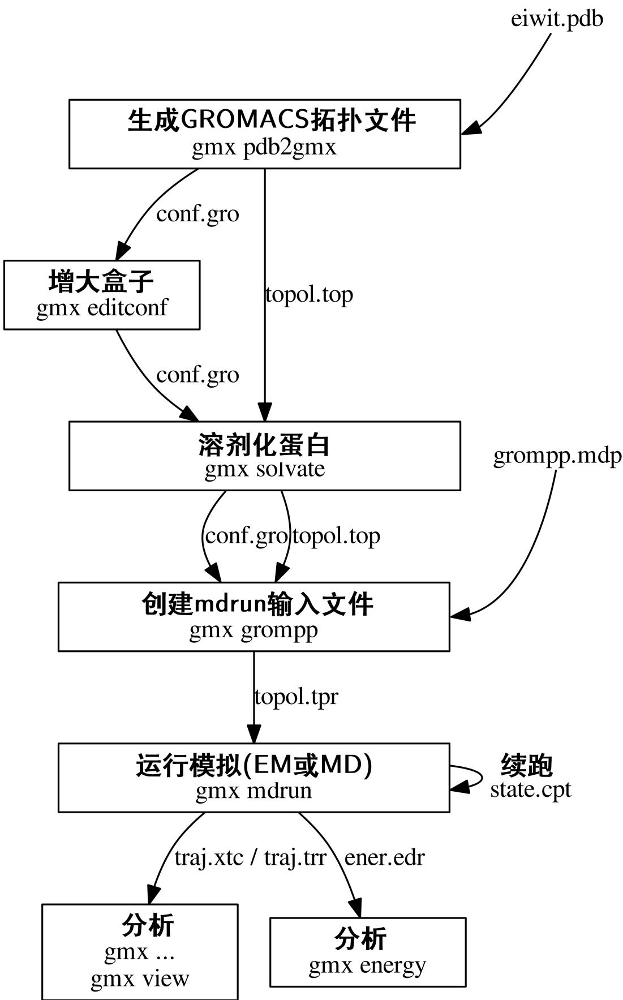

gmx -version

此命令应打印出安装的 GROMACS 的版本信息。如果返回的是

```yaml
gmx: command not found.
```

那么你必须确认 GROMACS 的安装位置。默认情况下，GROMACS 的二进制应用程序位 /usr/local/gromacs/bin。但是，你可以向机器的系统管理员咨询更多信息，然后按照安装后使用 GROMACS↪17中的建议进行操作。

## 3.1.3 典型模拟的流程图

GROMACS 的典型模拟工作流程如下↪23。

## 3.1.4 重要文件

你会在教程中遇到许多 GROMACS 文件类型，以下是一些最重要的文件类型的简要说明。

分子拓扑文件（.top）

分子拓扑文件通常由gmx pdb2gmx↪149 程序生成。gmx pdb2gmx↪149 程序可以将任何多肽或蛋白质的pdb↪456 结构文件转换为分子拓扑文件。拓扑文件完整地描述了多肽或蛋白质中的所有相互作用。

拓扑的 #include 文件机制

当在top 文件中构建系统拓扑以便用于 grompp 时，GROMACS 使用了所谓的 C 预处理器的内置版本 cpp（在 GROMACS 3 中，它实际上就是 cpp）。cpp 将下面的行

```cpp
#include "ions.itp"
```

解读为，在当前目录，GMXLIB 环境变量指定的 GROMACS share/top 目录，以及mdp↪454 文件中运行参数 的 -I 选项指定的任何目录中查找指定的文件。如果无法找到指定的文件，会给出警告信息。（注意，当指定目录名称时，应该使用 Unix 样式的正斜杠 /，而不是 Windows 式的反斜杠 \ 作为分隔符。）找到文件后，程序会将文件中的内容精确地放在相应的位置，就像你自己使用复制和粘贴操作将包含文件的内容放在主文件中一样。注意，你不应该自己进行复制粘贴，因为包含文件机制的主要目的是重用以前的文件，这样将来修改更容易，也可以防止输入错误。

此外，cpp 将如下代码：

```c
#ifdef POSRES_WATER
; Position restraint for each water oxygen
[ position_restraints ]
; i funct fcx fcy fcz
1 1 1000 1000 1000
#endif
```

解读为，测试是否定义了预处理器变量 POSRES\_WATER（即 if defined）。这可以通过几种方法完成，在top↪459 文件（或其 #include 的文件）的前面指定 #define POSRES\_WATER，为 include 运行参数的-D 选项指定类似变量，或在 cpp 命令行上指定类似选项。-D 选项的功能借用了 cpp 中的类似用法。-D后面的字符串必须完全匹配；使用 -DPOSRES 不会触发 #ifdef POSRE 或 #ifdef DPOSRES。使用这种机制，可以通过更改 $m d p _ { \hookrightarrow 4 5 4 }$ 文件来选择是否对溶剂施加位置限制，而无须修改 $t o p _ {  4 5 9 }$ 文件。注意，预处理器变量与 shell 环境变量不同。

## 分子结构文件（.gro，.pdb）

当使用gmx pdb2gmx↪149 程序生成分子拓扑时，同时会将结构文件 $( \ p d b _ { \hookrightarrow 4 5 6 }$ 文件）转换为 GROMOS 结构文件 $( \ g r o _ { \scriptscriptstyle \odot 4 5 2 }$ 文件）。 $p d b _ { \hookrightarrow 4 5 6 }$ 文件与 gromos 文件的主要区别在于其格式，此外 $g r o _ { \scriptscriptstyle \hookrightarrow 4 5 2 }$ 文件还可以包含速度。但是，如果不需要速度，你可以在所有程序中都使用 $p d b _ { \hookrightarrow 4 5 6 }$ 文件。要将多肽放置到盒子中并在其周围填充溶剂分子，可使用 $\mid g m x \ s o l v a t e _ { \scriptscriptstyle { \mathrm { < } \mathrm { 1 7 8 } } }$ 程序。首先要使用 $g m x \ e d i t c o n f _ { \hookrightarrow 9 1 }$ 程序在分子周围定义一个适当大小的盒子。gmx solvate $^ { \Rightarrow 1 7 8 }$ 可以将溶质分子（多肽）放入任何溶剂中（在这种情况下，溶剂是水）。gmx solvate↪ $^ { \circ 1 7 8 }$ 会输出一个 gromos 结构文件，包含溶剂化的多肽。gmx solvate↪ $^ { \textrm { \scriptsize + 1 7 8 } }$ 程序也可以修改分子拓扑文件（由 $g m x \ p d b \mathcal { Q } g m x _ { \ast 1 4 9 }$ 生成），将溶剂添加到拓扑中。

## 分子动力学参数文件（.mdp）

分子动力学参数 $( \ m d p _ { \hookrightarrow 4 5 4 }$ ，Molecular Dynamics Parameter）文件包含了与分子动力学模拟本身有关的所有信息，如时间步长，积分步数，温度，压力等。得到这种文件的最简单方法是修改示例 $m d p _ { \hookrightarrow 4 5 4 }$ 文件。这里有一份示例 mdp 文件 $\hookrightarrow 4 5 4 0$ 。

## 索引文件（.ndx）

有时你可能需要一个索引文件来指定受影响的原子组（如温度耦合，加速度，冻结）。通常情况下，使用默认的索引组就够了，因此在本示例中，我们不考虑使用索引文件。

## 运行输入文件（.tpr）

下一步是将分子结构 $( \ g r o _ { \scriptscriptstyle \odot 4 5 2 }$ 文件），拓扑 $( \ t o p _ { \hookrightarrow 4 5 9 }$ 文件），MD 参数 $( \ m d p _ { \hookrightarrow 4 5 4 }$ 文件）和（可选的）索引文件 $( \ n d x _ { \scriptscriptstyle { \ Q 3 4 5 5 } } )$ ）组合起来生成一个运行输入文件（扩展名为 $t p r _ { \scriptscriptstyle { \hookrightarrow } 4 6 0 } ) _ { \scriptscriptstyle { \odot } }$ 。此文件包含了 GROMACS 启动模拟所需的全部信息。 $g m x \ g r o m p p _ {  1 0 8 }$ 程序会处理所有的输入文件并生成运行输入 $t p r _ { \scriptscriptstyle { \hookrightarrow } 4 6 0 }$ 文件。

## 轨迹文件（.trr，.tng 或 .xtc）

一旦准备好了运行输入文件，我们就可以开始进行模拟了。启动模拟的程序为 $g m x \ m d r u n _ { \scriptscriptstyle \mathrm { Q 1 3 1 } }$ (或者有时为 mdrun 或 mdrun\_mpi)。通常情况下，启动模拟时 $g m x \ m d r u n _ {  1 3 1 }$ 只需要一个运行输入文件 $( \ t p r _ {  4 6 0 }$ 文件）。 $g m x \ m d r u n _ { \scriptscriptstyle \mathrm { Q 1 3 1 } }$ 的典型输出文件是轨迹文件 $( \ t r r _ { \ c \Rightarrow 4 6 1 }$ 文件），日志文件 $( \mathrm { \ } l o g _ {  4 5 3 }$ 文件），可能还有检查点文件 $( \ c p t _ { \hookrightarrow 4 5 0 }$ 文件）。

## 3.1.5 教程资料

有 一些教程↪http://www.mdtutorials.com/gmx/ 涵盖了使用 GROMACS 的各个方面。更多信息可参见简短的操作指 $\frac { + } { 1 7 } \textcircled { < } 2 3 0 3$ 章节。

## 3.1.6 背景阅读资料

• Berendsen, H.J.C., Postma, J.P.M., van Gunsteren, W.F., Hermans, J. (1981) Intermolecular Forces, chapter Interaction models for water in relation to protein hydration, pp 331-342. Dordrecht: D. Reidel Publishing Company Dordrecht

• Kabsch, W., Sander, C. (1983). Dictionary of protein secondary structure: Pattern recognition of hydrogen-bonded and geometrical features. Biopolymers 22, 2577–2637.

• Mierke, D.F., Kessler, H. (1991). Molecular dynamics with dimethyl sulfoxide as a solvent. Conformation of a cyclic hexapeptide. J. Am. Chem. Soc. 113, 9446.

• Stryer, L. (1988). Biochemistry vol. 1, p. 211. New York: Freeman, 3 edition.

## 3.2 系统准备

可以使用多种方法来准备模拟系统，并用于 GROMACS。作法往往因所考虑的科学问题的类型或所涉及的模型物理的不同而有所不同。蛋白质-配体原子级别的自由能模拟可能需要多个状态的拓扑，而粗粒化模拟可能需要处理默认设置以保证系统具有合适的高密度。

## 3.2.1 需要考虑的步骤

下面的一般性指导有助于进行一次成功的模拟。其中的具体步骤和过程可能取决于研究内容，对于某些类型的模拟，某些阶段是可选的。

1. 明确地确定要通过模拟进行研究的感兴趣的性质或现象。在弄清楚这一点之前，不要继续下去! 不要运行模拟，然后再设法弄清楚如何使用它来测试自己的假说，因为模拟可能不合适，或者没有保存所需的信息。

2. 选择合适的工具，以便能够执行模拟并观察感兴趣的性质或现象。阅读并熟悉其他研究人员关于类似系统的研究论文非常重要。工具的选择包括：

• 用于执行模拟的软件（考虑可用的力场可能会影响此决定）

• 力场描述了系统内的粒子如何相互作用。选择一个适合要研究的系统以及感兴趣的性质或现象的力场。这是一个非常重要的步骤，而且并不简单! 现在就要考虑如何分析模拟数据以观测感兴趣的性质或现象。

3. 对系统中要包括的每类分子，获取或生成其初始坐标文件。有许多不同的软件包可以构建分子结构，并将它们组装成合适的构型。

4. 根据需要将分子置于坐标文件中，生成系统的原始初始结构。分子可以特殊地放置或随机排列。处理时，可以使用一些非 GROMACS 的工具；GROMACS 自带的gmx solvate↪178，gmxinsert-molecules↪120 和gmx genconf ↪104 也能够解决常见的问题。

5. 获取或生成系统的拓扑文件，（例如）可以使用gmx pdb2gmx↪149，gmx x2top↪209，SwissParam↪http://swissparam.ch/ （CHARMM 力场）， PRODRG↪http://davapc1.bioch.dundee.ac.uk/cgi-bin/prodrg （GROMOS9643A1 力场）， Automated Topology Builder↪http://compbio.biosci.uq.edu.au/atb/ （GROMOS96 53A6 力场）， MKTOP↪http://www.aribeiro.net.br/mktop （OPLS/AA 力场），或你自己喜欢的文本编辑器以及 GROMACS 参考手册第 5 章↪377 的说明。对于 AMBER 力场，可以使用 antechamber↪http://amber.scripps.edu/antechamber/antechamber.html 或 acpype↪https://github.com/alanwilter/acpype 。

6. 指定一个模拟盒子（例如使用gmx editconf ↪91），其大小取决于你最终需要的密度，并向其中填充溶剂（例如使用gmx solvate↪178），再添加需要的抗衡离子以维持系统电中性（例如，使用gmxgrompp↪108 和gmx insert-molecules↪120）。在这些步骤中，你可能需要编辑拓扑文件以保证它与坐标文件一致。

7. 对系统进行能量最小化（使用gmx grompp↪108 和gmx mdrun↪131）。这样可以修正在系统生成过程中引入的结构异常。直接使用起始结构进行模拟可能导致成品模拟崩溃。在引入溶剂分子（或脂质双层或其他任何物种）之前，可能还需要在真空中对溶质结构进行能量最小化。你应该考虑使用柔性水模型，而不使用键约束或冻结组。你还应该仔细评估下是否需要使用位置限制和/或距离限制。

8. 为平衡模拟选择合适的模拟参数（在mdp 文件中定义）。你选择的模拟参数需要与力场导出参数的方式一致。你可能需要先使用 NVT 系综进行模拟，并对溶剂和/或溶质施加位置限制以获得基本正确的温度，然后弛豫到 NPT 系综，以保证密度正常（应该首先使用 Berendsen 方法控压，密度稳定后再换用能够产生正确系综的控压器），最后（如果需要的话）进行成品系综的模拟（例如 NVT，NVE）。如果你的系统出现爆破 问题，请考虑其页面给出的建议，例如，对溶质施加位置限制，或不使用键约束，或使用更小的积分时间步长，进行几个较缓慢的加热阶段。

9. 运行足够长时间的预平衡模拟，使得系统在目标系综中充分弛豫，以便开始运行成品模拟（使用gmx grompp↪108 和gmx mdrun↪131，然后gmx energy↪97 和 轨迹可视化工具↪http://www.gromacs.org/Documentation/How-tos/Trajectory\_Visualization ）。

10. 为成品模拟选择合适的模拟参数（在 $m d p _ { \hookrightarrow 4 5 4 }$ 文件中定义）。特别注意，不要重新产生速度。模拟参数的设置仍然需要考虑力场的参数化方式，还要考虑测量感兴趣的性质或现象的方式。

11. 运行成品模拟足够长时间，产生足够详细的数据以研究感兴趣的性质或现象（使用gmx grompp↪108和 $\mathbb { I } g m x \ m d r u n _ {  1 3 1 } \ )$ ）。

12. 对得到的轨迹和数据文件进行分析或可视化，获得感兴趣的性质或现象的信息。

有关副本交换模拟的步骤请参见 REMD 部分。

## 3.2.2 技巧和窍门

## 数据库文件

GROMACS 安装目录下的 share/top 目录中包含许多扩展名为 .dat 的纯文本帮助文件。一些命令行工具（参见命令行参考 ）引用了这些文件，每个工具都会记录它使用的文件以及它们的使用方式。

如果你需要修改这些文件（例如，要在 vdwradii.dat 中引入带有范德华半径的新原子类型），你可以将文件从安装目录复制到工作目录中，GROMACS 工具会自动加载工作目录中的文件副本，而不加载标准目录中的文件。要取消所有的标准定义，可以在工作目录中使用空文件。

## 3.3 管理长时间的模拟

分子模拟所需的时间通常会超出单个 Unix 命令行进程所允许的最大时间。因此，我们需要能够停止并重新启动模拟，停止和重启所得的结果应该和单次运行相同。当gmx mdrun↪131 停止时，会输出一个检查点文件，这个文件可用于重启模拟，就像没有中断一样。为此，检查点文件中保存了全精度的位置和速度，以及重启算法所需的状态信息，例如那些与外部热库耦合算法实现有关的信息。可以尝试使用，例如一个带有速度的gro↪452 文件进行重启。但由于gro↪452 文件的精度很低，并且所有耦合算法都无法保持其状态不变，因此这种重启不像正常的 MD 步骤那样连续。

在运行期间，gmx mdrun↪131 也会定期输出这样的检查点文件。时间间隔由gmx mdrun↪131 的 -cpt 选项指定。当gmx mdrun↪131 尝试输出连续的检查点文件时，它会首先在旧文件的名称后面加上 \_prev，这样即使在输出新的检查点文件时出现了问题，也只会失去最近的模拟信息。

可以通过几种方式终止gmx mdrun↪131 的运行：

• 超过模拟步数nsteps↪227

• 用户发出终止信号（例如，在终端上使用 Ctrl-C）

• 作业调度程序在运行超时后发出终止信号

• gmx $m d r u n _ { \substack { \scriptscriptstyle \mathrm { Q 1 3 1 } } }$ 检测到运行时间已经达到了 -maxh 指定的值（此选项可以配合作业调度程序，但如果作业可以挂起，则可能会出现问题）

• 某种灾难性的故障，如断电，磁盘已满或网络故障

要使用检查点文件重启模拟，可使用命令行，如

gmx mdrun -cpi state

上面的命令指示 mdrun 使用检查点文件（默认名称为 state.cpt）。你可以使用 -cpo 选项为输出的检查点文件指定不同的名称，如果这样的话，以后使用此检查点文件时，必须为 -cpi 选项指定相应的名称。你可以使用gmx check↪58 和gmx dump↪87 查看检查点文件的内容。

## 3.3.1 追加到输出文件

默认情况下， $g m x \ m d r u n _ { \scriptscriptstyle \mathrm { Q 1 3 1 } }$ 的输出会追加到旧的输出文件中。如果前一部分模拟以常规方式结束，会删除日志文件末尾的性能数据，写入有关运行上下文的一些新信息，并继续进行模拟。否则，mdrun 会将所有输出文件截断至检查点文件的最后输出时间，并从那里继续，就像模拟以常规方式停止在该检查点一样。

你可以使用 -noappend 选项指定不追加输出文件，这样会强制 mdrun 将每个输出都写入到单独的文件，其名称包含一个 .partXXXX 字符串用以说明文件中包含了哪些模拟部分。编号从零开始，并随模拟重启次数单调增加，但并不反映每一部分的模拟步数。simulation-part↪227 选项可用于手动设置gmx$g r o m p p _ { \Rightarrow 1 0 8 }$ 所用的这个数字，这在数据丢失时会用到，例如由于文件系统故障或用户错误而导致的数据丢失。

如果在 mdrun 写入之后修改或删除了任何输出文件，追加就会无效，因为检查点文件维护了每个文件的校验码，在再次写入之前会对其进行验证。在这种情况下，你必须还原文件，将其命名为检查点文件所需的名称，或者使用 -noappend 选项继续运行。如果原来运行时使用了 -deffnm，想要追加输出，那么继续运行时也必须使用 -deffnm。

## 3.3.2 备份文件

你应该经常备份模拟文件。集群上的网络文件系统的配置可能或多或少有些保守，这会导致系统告知gmx$m d r u n _ { \substack { \scriptscriptstyle \mathrm { Q 1 3 1 } } }$ 检查点文件已经写入了磁盘，而实际上文件仍然在内存中，因此如果在此期间发生电源故障或磁盘错误，就无法更新检查点文件。Unix 工具 rsync 可以定期将模拟输出复制到远程存储位置即使模拟正在运行也可以安全工作。如果文件系统不可靠，对提交到集群的作业的每一部分，保留其最终检查点文件的副本可能很有用。

## 3.3.3 延长。tpr 文件的时间

如果 $t p r _ { \scriptscriptstyle { \hookrightarrow } 4 6 0 }$ 文件对应的模拟已经完成并且需要进行延长，可以使用 $g m x \ c o n v e r t – t p r _ { \hookrightarrow 6 8 }$ 工具来延长运行，例如：

```batch
gmx convert-tpr -s previous.tpr -extend timetoextendby -o next.tpr
gmx mdrun -s next.tpr -cpi state.cpt
```

也可以使用 -until 和 -nsteps 选项来延长模拟时间。注意，原始的mdp↪454 文件可能产生了速度，但那是 $g m x \ g r o m p p _ {  1 0 8 }$ 的一次性操作，任何其他工具都不会再次进行此操作。

## 3.3.4 更改 mdp 选项以重新启动模拟

如果你希望更改模拟设置而不是模拟时间长度，那么你应该修改 $m d p _ { \hookrightarrow 4 5 4 }$ 文件或拓扑文件，然后使用

```batch
gmx grompp -f possibly-changed.mdp -p possibly-changed.top -c state.cpt -o new.tpr
gmx mdrun -s new.tpr -cpi state.cpt
```

指示gmx grompp↪108 将检查点文件中的全精度坐标复制到新的tpr↪460 文件中。你应该考虑tinit↪227，init-step↪227，nsteps↪227 和simulation-part↪227 选项的设置。通常不应该使用gen-vel↪239 重新产生速度，并且通常选择continuation↪240，这样在第一个积分步骤前不会再重新施加约束。

## 3.3.5 不存在检查点文件时重新启动模拟

以前可以在没有检查点文件的情况下继续模拟。由于这种方法可能不可靠或导致不合理的结果，因此现在只允许使用检查点重新启动模拟。

## 3.3.6 续跑是否精确?

如果你的计算机具有无限精度，或者你手动积分时间离散的运动方程，那么精确的续跑会给出完全相同的结果。但实际计算机的精度有限，且 MD 具有混沌性，因此，即使只有一个数位不同，轨迹也会迅速发散。这些轨迹同样有效，但最终彼此间会有很大不同。使用检查点文件续跑，使用相同编译器编译的相同代码，并且在不使用 GPU 的情况下（参见下一节）使用相同数目的处理器在相同的计算机架构上进行续跑，会得到二进制相同的结果。但是，默认情况下，实际工作负载会根据观察到的执行时间在硬件之间进行平衡。这种轨迹原则上是不可重现的，特别是，分成多次运行完成的模拟与等价的单次运行所得的结果并不完全相同，但在任何意义上都无法确定哪一个更好。

## 3.3.7 重现性

以下因素会影响模拟的重现性，从而影响模拟输出：

• 双精度的重现性“更好”。

• 核的数目，因为累加力的顺序不同。例如，在浮点运算中，(a+b)+c 不一定与 a+(b+c) 二进制相同。

• 处理器类型。即使相同的处理器系列，也可能存在细微差别。

• 编译时的优化级别。

• 运行时的优化。例如通常用于快速傅里叶变换的 FFTW 库在启动时会确定其算法的哪个版本最快，并将其用于其余的计算。由于速度估计并不是确定性的，因此结果可能会因运行而异。

• 随机数，例如用于生成速度的种子（在 GROMACS 的预处理阶段）。

• 代码中未初始化的变量（但它们本来不应该存在）

• 动态链接到不同版本的共享库（例如用于 FFT 的库）

• 动态负载均衡，由于粒子会根据经过的挂钟时间重新分配到处理器上，这可能导致 (a+b)+c !=a+(b+c) 的问题，如前所述

• 仅用于 PME 的进程数（用于并行 PME 模拟）

• MPI 归约通常无法保证操作顺序，因此浮点运算没有相关性，这意味着归约的结果取决于实际选择的顺序

• 在 GPU 上，进行诸如非键力之类的归约时求和顺序不确定，因此任何快速实现在设计上都是不可重现的。

重要的是，如果模拟不能完全重现，这是否是一个问题。答案既是肯定的，也是否定的。一般而言，重现性是科学的基石，因此它很重要。 中心极限定理↪https://en.wikipedia.org/wiki/Central\_limit\_theorem 告诉我们，在无限长模拟的情况下，所有的可观测量都会收敛到它们的平衡值。GROMACS 中的分子模拟遵循这个定理，因此，例如，系统的能量会收敛到一个有限的值，水分子的扩散系数会收敛到一个有限的值，等等。这意味着所有重要的可观察量，也就是你希望从模拟中获得的值，都是可重现的。然而，每条单独的轨迹都是不可重现的。

然而，在一些情况下，如果轨迹可以重现，也有好处。这些情况包括，开发人员正在进行调试，在轨迹中搜索罕见的事件，如果它发生了，你希望手动保存检查点文件，以便可以在不同条件下重启模拟，例如更频繁地输出模拟数据。

为了获得这种可重现的轨迹，查看上面的列表并消除可能的影响因素非常重要。此外，使用

可以消除不可重现性的所有可能来源，即相同的可执行文件 + 相同的硬件 + 相同的共享库 + 相同的运行输入文件 + 相同的命令行参数会导致可重现的结果。

## 3.4 常见问题（FAQ）

## 3.4.1 有关 GROMACS 安装的问题

## 1. 是否需要使用 MPI 编译所有实用程序?

除一个很少使用的程序 $( p m e \_ e r r o r _ { \scriptscriptstyle { \varphi 1 5 2 } } )$ ）之外，只有 $m d r u n _ { \substack { < 1 3 1 } }$ 支持 $M P I _ { \hookrightarrow 8 }$ 并行。因此，在构建主模拟引擎 $m d r u n _ { \substack { \scriptscriptstyle \mathrm { Q 1 3 1 } } }$ 时，只要使用 $- \mathrm { D G M X \_ M P I = o n }$ 选项进行编译 $\hookrightarrow 1 0$ 即可。

## 2. 是否应该使用双精度编译?

通常，只需要使用默认的混合精度模式构建 GROMACS 即可。更多详细信息，请参阅参考手册↪327第 2 节。有时，使用情况也可能取决于你的目标系统，应根据针对某些平台的特别说明 $\hookrightarrow \operatorname { \bf 1 9 }$ 来决定。

## 3.4.2 有关系统准备和预处理的问题

## 1. 执行 $\dot { { \cdot } } g m x \ s o l v a t e _ { \scriptscriptstyle { \mathrm { Q 1 7 8 } } }$ 的时候需要溶剂分子的坐标文件 $\hookrightarrow 4 4 9$ ，哪里可以找到这些坐标文件?

合适的已平衡好的溶剂盒子的坐标文件 $\hookrightarrow 4 4 9$ 可以在 \$GMXDIR/share/gromacs/top 目录中找到。默认情况下， $s o l v a t e _ { \scriptscriptstyle \mathrm { < } \mathrm { 1 7 8 } }$ 会自动搜索该目录，例如使用 -cs spc216.gro 作为参数时。用户可以按照 $s o l v a t e _ { \scriptscriptstyle \mathrm { < } \mathrm { 1 7 8 } }$ 手册页以及其他一些说明来准备其他溶剂盒子。注意，溶剂盒子需要合适的拓扑文件才能用于 $g r o m p p _ { \hookrightarrow 1 0 8 } \circ$ 一些力场含有需要的拓扑文件，可以在 \$GMXDIR/share/gromacs/top 的相应子目录中找到。

## 2. 如何避免 $s o l v a t e _ { \scriptscriptstyle \mathrm { < } \mathrm { 1 7 8 } }$ 将水放置到不需要的位置?

在溶剂化蛋白质时，水分子的放置方法通常表现良好，但在设置膜或胶束模拟时，放置水分子可能变得很困难。在这些情况下，水可能被放置到脂质的烷基链之间，导致后面的模拟出现问题 $\hookrightarrow 2 9 2 \ 0$ 你可以手动删除这些水分子（并修改拓扑 文件中水分子类型的数目），或 $\hookrightarrow 4 5 9$ 者从 \$GMXLIB 目录复制一份 vdwradii.dat 文件到当前项目的工作目录。然后增加文件中的原子范德华半径，这样可以减少插入到空隙中的水分子。建议的设置，例如在常见的 教程↪http://www.bevanlab.biochem.vt.edu/Pages/Personal/justin/gmx-tutorials/membrane\_protein/03\_solvate.html 中使用 0.375 而不是 0.15。

## 3. 如何在拓扑中对键/二面角进行多重定义?

除通常为残基定义的成键项之外，你可以添加其他成键项（例如定义一个特殊的配体时），方法是在分子 [ moleculetype ] 节段下的 [ bonds ]，[ pairs ]，[ angles ] 和 [ dihedrals ] 中添加相应的行，这些行的内容可以在 $i t p _ { \hookrightarrow 4 5 3 }$ 文件或拓扑 $\hookrightarrow 4 5 9$ 文件中找到。在计算势能时，这些额外项会累加到势能中，而不会忽略以前的项对势能的贡献。因此，重复定义时要多加小心。还要记住，这不适用于力场定义文件中 [ bondtypes ]，[ angletypes ] 或 [ dihedraltypes ] 节段下的重复项，这些节段中的重复项会覆盖前面的值。

## 4. 必须要准备一个 ${ \cdot } g r o _ { \scriptstyle 4 5 2 }$ 文件吗?

GROMACS 将 $g r o _ { \hookrightarrow 4 5 2 }$ 文件作为统一的结构文件 $\hookrightarrow 4 4 9$ 格式，所有实用程序都可以读取这种格式。绝大多数 GROMACS 例程也可以使用其他文件类型，例如 $\boldsymbol { \mathrm { I } p d b } _ {  4 5 6 }$ ，其限制是这些格式 $^ {  2 6 }$ 无法提供速度。如果你需要一种精度更高的文本格式，可以使用 $\mid g 9 6 _ { \scriptscriptstyle \odot 4 5 2 }$ 格式，程序也支持这种格式。

## 5. 如果已经通过其他方式得到了 $i t p _ { \hookrightarrow 4 5 3 }$ 文件，是否还需要运行pdb2gmx↪149?

如果已经通过其他工具准备好了所有的itp $^ { + 4 5 3 }$ 和 $t o p _ { \hookrightarrow 4 5 9 }$ 文件，就不再需要准备额外的拓扑文件了。可以使用的其他工具包括 CHARMM-GUI↪http://www.charmm-gui.org/ ， ATB （Automated TopologyBuilder）↪https://atb.uq.edu.au/ ， pmx↪http://pmx.mpibpc.mpg.de/instructions.html ，以及 PRODRG↪http://davapc1.bioch.dundee.ac.uk/cgi-bin/prodrg 。

## 6. 如何添加缺失的原子?

GROMACS 不支持构建缺失的非氢原子的坐标。如果你的系统缺少某些原子，那你必须使用外部程序添加缺失的原子，以避免缺失原子 $\hookrightarrow 2 8 3$ 错误。可用的程序包括 Chimera↪https://www.cgl.ucsf.edu/chimera/ ，以及 Modeller↪https://salilab.org/modeller/ ， Swiss PDB Viewer↪https://spdbv.vital-it.ch/ ，Maestro↪https://www.schrodinger.com/maestro 。不要运行对原子缺失的系统进行模拟，除非你精确地知道为什么它会是稳定的。

## 7. 为什么我的系统的总电荷不是整数，它应该是整数啊?

浮点数 $\hookrightarrow 3 0 1$ 无 法 以 任 意 精 度 表 示 实 数 （更 多 信 息 可 以 参 考 维 基 百 科↪https://en.wikipedia.org/wiki/Floating-point\_arithmetic ）。这意味着最终得到的总电荷与整数值可能存在微小差异，GROMACS不会对这些值进行舍入。如果系统的总电荷与整数值相差较大，例如大于 0.01，这通常意味着准备系统的过程中出了问题。

## 3.4.3 有关模拟方法的问题

## 1. 是否应该将少量离子耦合到它们自己的温度耦合浴中?

不。你要考虑温度耦合组的最少数目，控温器 $\hookrightarrow 2 9 1$ 对此有说明，更具体说明见不要做什么 $\hookrightarrow 2 9 1$ ，你还要考虑所选恒温器的实现，见参考手册 $\hookrightarrow 3 2 7$ 的说明。

2. 为什么我的 grompp 重启模拟时时间总是从零开始?你可以将 $t i n i t _ { \hookrightarrow 2 2 7 }$ 和 $\scriptstyle i n i t - s t e p _ { \varphi _ { \ Q 2 2 7 } }$ 指定为不同的值。

## 3. 有约束的情况下为什么不能进行共轭梯度最小化?

共轭梯度能量最小化方法不能使用约束，参考手册 $^ { + 3 2 7 }$ 对此有说明，一些补充信息见 维基百科↪https://en.wikipedia.org/wiki/Conjugate\_gradient\_method 。

## 4. 在能量最小化或模拟中，如何将原子保持在适当的位置?

可以使用 freeze groups 将原子组冻结在固定的位置（见参考手册 $\hookrightarrow 3 2 7$ ）。更常见的方法是使用位置限制，对原子的移动施加惩罚。可以使用genrestr 命令创建位置限制文件，以满足需要。

## 5. 如何为已完成的模拟延长模拟时间?

请参阅管理长时间的模拟↪28 一节。你可以准备一个新的 $m d p _ { \hookrightarrow 4 5 4 }$ 文件，或者使用convert- $\cdot t p r _ { \hookrightarrow 6 8 }$ 延长原始 $t p r _ { \scriptscriptstyle { \hookrightarrow } 4 6 0 }$ 文件中的模拟时间。

## 6. 如何计算单点能?

最好的方法是使用 $m d r u n _ { \substack { < 1 3 1 } }$ 的 -rerun 选项。参见重新运行模拟 $\scriptstyle \to 2 6 2$ 一节。

## 3.4.4 参数化与力场

1. 我想模拟一个分子（蛋白质，DNA 等），它与各种过渡金属离子，铁硫团簇或其他外来物种结合在一起。力场 X 中不存在这些外来物种的参数。我该怎么办?

首先，你应该考虑一下， $M D _ { \hookrightarrow 2 9 4 }$ 实际上能否很好地描述你的系统（例如可以看一些 最近的文献↪https://dx.doi.org/10.1021%2Facs.chemrev.6b00440 ）。在不考虑原子极化率或 QM 处理的情况下，许多物种是无法建模的。然后，你需要准备自己的参数集，并将新的残基添加到你选用的力场 $\hookrightarrow 2 9 5$ 中。然后，在继续进行模拟研究之前，你必须验证系统的运动是否符合物理。你还可以尝试构建一个更简单的模型，不包含复杂的额外分子，只要它仍然能够代表实验室中正确的真实对象。

## 2. 能否将一个力场中的参数应用到另一个缺少参数的力场中?

不能。在一个给定力场↪295 中参数化的分子，当它们与参数化标准不同的其他分子相互作用时，其行为可能不合理。如果你使用的力场中没有所需分子的参数，你必须根据所用力场的参数化方法自己对分子进行参数化。

## 3.4.5 分析与可视化

1. 当观看轨迹时，为什么有时会看到一些不应该存在的键?

大多数可视化软件根据一组预先定义的距离来确定原子的成键状态。因此，它们显示的成键模式可能与你在拓扑 $\hookrightarrow 4 5 9$ 文件中定义的不同。只有拓扑文件中的成键信息最关键。如果软件读取 $\overline { { \Gamma } } t p r _ { \hookrightarrow 4 6 0 }$ 文件，那么成键信息应该与你提供给 $g r o m p p _ { \Rightarrow 1 0 8 }$ 的拓扑中的一致。

2. 当使用 PBC 可视化模拟轨迹时，为什么会出现孔洞，或我的多肽为什么离开了模拟盒子?

这些孔洞和分子的移动只是分子穿过盒子边界并折叠 的结果，对模拟结果没有影响，无须担心。你可以使用 $t r j c o n v _ { \scriptscriptstyle { \Theta } + \scriptscriptstyle { 1 9 1 } }$ 命令修复可视化的显示问题，并准备用于分析的结构。

3. 为什么我的总模拟时间不是整数，它应该是整数啊?

由于计算模拟时间时使用了浮点运算↪301，所以可能存在舍入误差，但无关紧要。

## 3.5 GROMACS 中的力场

## 3.5.1 AMBER

AMBER↪http://ambermd.org/ （Assisted Model Building and Energy Refinement 模型构建和能量细化辅助工具）既可以表示一套用于模拟生物分子的分子力学力场 $\hookrightarrow 2 9 5$ ，也可以表示一套分子模拟程序。

GROMACS 4.5 以上的版本原生支持以下 AMBER 力场：

• AMBER94

• AMBER96

• AMBER99

• AMBER99SB

• AMBER99SB-ILDN

• AMBER03

• AMBERGS

有关力场的信息可以参考：

AMBER Force Fields↪http://ambermd.org/#ff - AMBER 力场的背景信息

AMBER Programs↪http://ambermd.org/#code - AMBER 分子模拟程序包的信息

• ANTECHAMBER/GAFF↪http://ambermd.org/antechamber/antechamber.html - 通用 AMBER 力场（GAFF），用于提供与 AMBER 蛋白/核酸力场兼容的小分子的参数。这种力场既可以随 AMBER 一起使用，也可以通过 antechamber 程序获得，antechamber 程序也可以单独分发。可以使用一些脚本将 AMBER 体系（例如使用 GAFF 的设置）转换到 GROMACS（ amb2gmx.pl↪https://github.com/choderalab/mmtools/blob/master/converters/amb2gmx.pl 或 acpypi.py↪https://github.com/choderalab/mmtools/blob/master/converters/acpypi.py ），但需要先安装 AMBER 才能使用它们。

较早的 GROMACS 版本需要单独安装 ffamber 端口：

• 在 GROMACS 中使用 AMBER 力场↪http://chemistry.csulb.edu/ffamber/ - 也称为 ffamber 端口，含有许多 AMBER 力场，并附有文档。

• 使用 GROMACS 的 ffamber 端口时，输入结构文件必须符合 AMBER 的残基命名约定。有问题的残基包括，末端残基（前缀为 N 和 C），赖氨酸（LYN 或 LYP），组氨酸（HID，HIE 或 HIS）和半胱氨酸（CYN 或 CYX）。请参阅 ffamber 文档↪http://chemistry.csulb.edu/ffamber/#usage 。

## 3.5.2 CHARMM

CHARMM↪http://www.charmm.org/ （Chemistry at HARvard Macromolecular Mechanics 哈佛大学分子力学化学）是一套力场和程序包，用于分子动力学↪294 模拟和分析。包括联合原子（CHARMM19）和全原子（CHARMM22，CHARMM27，CHARMM36）力场↪295。CHARMM27 力场已移植到 GROMACS，从 4.5 版本起得到正式支持。可以从 MacKerell 课题组↪http://mackerell.umaryland.edu/charmm\_ff.shtml#gromacs 获得 CHARMM36 的力场文件，该网站会定期发布 GROMACS 格式的最新 CHARMM 力场文件。

要在 GROMACS 5.0 和更高版本中使用 CHARMM36，请在mdp↪454 文件中使用以下设置：

```ini
constraints = h-bonds
cutoff-scheme = Verlet
vdwtype = cutoff
vdw-modifier = force-switch
rlist = 1.2
rvdw = 1.2
rvdw-switch = 1.0
coulombtype = PME
rcoulomb = 1.2
DispCorr = no
```

注意，色散校正应该用于脂质单层，但不能用于脂质双层。

还要注意，在脂质双层模拟中，切换距离是一个有争论的问题，它在某种程度上取决于脂质的性质。一些研究发现切换距离 0.8-1.0 nm 是合适的，另一些人认为 0.8-1.2 nm 是最好的，还有一些人认为 1.0-1.2nm 最好。在开始模拟之前，提醒用户深入调查一下所选脂质力场的文献!

使用 GROMACS 古老版本的用户可能会用到下面的脚本：

CHARMM to GROMACS - perl 脚本，旨在使用 CHARMM 力场和 GROMACS 程序进行计算（低于 4.5 的 GROMACS 版本需要使用）。（ 链接↪http://www.gromacs.org/@api/deki/files/76/=charmm\_to\_gromacs.tgz ）

## 3.5.3 GROMOS

GROMOS↪http://www.igc.ethz.ch/gromos/ 是一个通用的分子动力学计算模拟程序包，用于研究生物分子系统。它还包含自己的力场，涵盖蛋白质，核酸，糖等。它能够用于各种化学和物理系统，从玻璃和液晶，到聚合物和晶体，以及生物分子溶液。

GROMACS 支持 GROMOS 力场 43a1，43a2，45a3，53a5，53a6 和 54a7 发布中提供的所有参数。  
GROMOS 力场是联合原子力场 ，即没有显式的脂肪族（非极性）氢。

• GROMOS 53a6 - GROMACS 格式 (J. Comput. Chem. 2004 vol. 25 (13): 1656-1676).

• GROMOS 53a5 - GROMACS 格式 (J. Comput. Chem. 2004 vol. 25 (13): 1656-1676).

• GROMOS 43a1p - 43a1 的改进版，包含了 SEP（磷酸丝氨酸），TPO（磷酸苏氨酸）和 PTR（磷酸酪氨酸）（所有 PO42-形式），以及 SEPH，TPOH，PTRH（PO4H-形式）.

## 3.5.4 OPLS

OPLS（Optimized Potential for Liquid Simulations 用于液体模拟的优化势）是由 William L. Jorgensen教授发展的力场，用于凝聚相模拟，最新版本为 OPLS-AA/M↪http://zarbi.chem.yale.edu/oplsaam.html 。

这些力场的标准实现是 Jorgensen 组↪http://zarbi.chem.yale.edu/software.html 开发的 BOSS 和 MCPRO 程序。

由于没有权威网页可供参考，建议用户查阅 联合原子（OPLS-UA）↪https://doi.org/10.1021%2Fja00214a001 和全 原 子 （OPLS-AA）↪https://doi.org/10.1021%2Fja9621760 力 场 的 原 始 文 献， 以 及 Jorgensen 课 题 组 的 网站↪http://zarbi.chem.yale.edu/ 。

## 3.6 非键截断方案

GROMACS 2019.6 中的默认截断方案基于经典的缓冲 Verlet 列表。在现代 CPU 和加速器上这些实现非常高效，并且几乎支持 GROMACS 中使用的所有算法。

在 4.6 版本之前，GROMACS 始终使用基于粒子组的配对列表。这些粒子组最初是电荷组，普通截断静电算法需要它们。使用 PME（或带缓冲区的反应场）时，不再需要电荷组（在 Verlet 方案中会忽略电荷组）。在 GROMACS 4.6 及更高版本中，基于组的截断方案仍然可以使用，但 自 5.0 版本起已被废弃。它仍然可以使用主要是为了向后兼容，以支持那些尚未进行转换的算法，此外，在少数情况下，对以水为主的生物分子系统进行模拟时，使用这种方法可能更快。

如果不使用 PME，组截断方案通常应该与缓冲配对列表一起使用，以帮助避免假象。然而，可以实现这一点的组方案内核要比无缓冲的组方案内核或缓冲的 Verlet 方案内核慢得多。强烈建议使用 Verlet 方案进行各种模拟，因为更容易正确运行，也更快。特别是，GPU 加速只能使用 Verlet 方案。

Verlet 方案使用了具有精确截断值的合适的缓冲列表。缓冲区的大小由verlet-buffer-tolerance↪231选项指定，允许一定程度的漂移。通过减去截断处的值，LJ 和库仑势都偏移到了零。这就保证了能量是力的积分。但我们仍然建议在截断处保留小的力，因此可以使用 PME 或具有无穷大介电常数的反应场。

## 3.6.1 非键方案功能的比较

两种方案都支持 GROMACS 2019.6 中所有与非键相互作用无直接关系的功能。最终，Verlet 方案会支持所有的非键功能。下表给出了非键功能与这两种方案的兼容性。

表：对与非键相互作用有关的功能，组方案和 Verlet 截断方案的支持情况

<table><tr><td rowspan=1 colspan=1>功能</td><td rowspan=1 colspan=1>组方案</td><td rowspan=1 colspan=1>Verlet 方案</td></tr><tr><td rowspan=1 colspan=1>无缓冲截断方案</td><td rowspan=1 colspan=1>默认</td><td rowspan=1 colspan=1>非默认</td></tr><tr><td rowspan=1 colspan=1>精确截断</td><td rowspan=1 colspan=1>移位/切换</td><td rowspan=1 colspan=1>始终</td></tr><tr><td rowspan=1 colspan=1>势能移位相互作用</td><td rowspan=1 colspan=1>是</td><td rowspan=1 colspan=1>是</td></tr><tr><td rowspan=1 colspan=1>势能切换相互作用</td><td rowspan=1 colspan=1>是</td><td rowspan=1 colspan=1>是</td></tr><tr><td rowspan=1 colspan=1>力切换相互作用</td><td rowspan=1 colspan=1>是</td><td rowspan=1 colspan=1>是</td></tr><tr><td rowspan=1 colspan=1>切换势能</td><td rowspan=1 colspan=1>是</td><td rowspan=1 colspan=1>是</td></tr><tr><td rowspan=1 colspan=1>切换力</td><td rowspan=1 colspan=1>是</td><td rowspan=1 colspan=1>是</td></tr><tr><td rowspan=1 colspan=1>非周期系统</td><td rowspan=1 colspan=1>是</td><td rowspan=1 colspan=1>Z+墙</td></tr><tr><td rowspan=1 colspan=1>自由能微扰的非键项</td><td rowspan=1 colspan=1>是</td><td rowspan=1 colspan=1>是</td></tr><tr><td rowspan=1 colspan=1>能量组贡献</td><td rowspan=1 colspan=1>是</td><td rowspan=1 colspan=1>仅在CPU</td></tr><tr><td rowspan=1 colspan=1>能量组排除</td><td rowspan=1 colspan=1>是</td><td rowspan=1 colspan=1>否</td></tr><tr><td rowspan=1 colspan=1>OpenMP 多线程</td><td rowspan=1 colspan=1>只用于PME</td><td rowspan=1 colspan=1>所有</td></tr><tr><td rowspan=1 colspan=1>原生GPU 支持</td><td rowspan=1 colspan=1>否</td><td rowspan=1 colspan=1>是</td></tr><tr><td rowspan=1 colspan=1>库仑 PME</td><td rowspan=1 colspan=1>是</td><td rowspan=1 colspan=1>是</td></tr><tr><td rowspan=1 colspan=1>Lennard-Jones PME</td><td rowspan=1 colspan=1>是</td><td rowspan=1 colspan=1>是</td></tr><tr><td rowspan=1 colspan=1>虚拟位点</td><td rowspan=1 colspan=1>是</td><td rowspan=1 colspan=1>是</td></tr><tr><td rowspan=1 colspan=1>用户提供的表格相互作用</td><td rowspan=1 colspan=1>是</td><td rowspan=1 colspan=1>否</td></tr><tr><td rowspan=1 colspan=1>Buckingham VdW相互作用</td><td rowspan=1 colspan=1>是</td><td rowspan=1 colspan=1>否</td></tr><tr><td rowspan=1 colspan=1>rcoulomb != rvdw</td><td rowspan=1 colspan=1>是</td><td rowspan=1 colspan=1>是</td></tr><tr><td rowspan=1 colspan=1>双范围</td><td rowspan=1 colspan=1>否</td><td rowspan=1 colspan=1>否</td></tr></table>

## 3.6.2 性能

组截断方案的性能在很大程度上取决于系统的组成和缓冲的使用。对涉及水的相互作用，可以使用优化的内核，因此任何含有大量水的模拟都可以运行得非常快。但是，如果你需要缓冲正确的相互作用，那么需要添加一个考虑电荷组大小和扩散的缓冲区，并在每个时间步根据截断长度检查每个相互作用。这会导致模拟速度大大降低。对于使用新非键内核的 Verlet 方案，其性能与系统组成无关，并且始终与缓冲配对列表一起运行。通常，缓冲区大小为截断值的 0% 到 10%，因此可以通过减少或移除缓冲区来提高一些性能，但这对模拟质量而言可能不是一个好的折衷方案。

下表展示了大多数相关设置的性能比较。除非使用联合原子力场，否则任何原子模型的性能都与 tips3p（氢原子具有 LJ 相互作用）相当。模拟水中蛋白质的性能介于 tip3p 和 tips3p 之间。组方案针对涉及水的相互作用进行了优化，这类相互作用只涉及单个电荷组，包含一个具有 LJ 相互作用的粒子和 2 个或 3 个不具有 LJ 相互作用的粒子。这种用于水的内核，其速度大约是具有 LJ 和/或无电荷组的相近系统的两倍。除少于一半的粒子具有 LJ 时只计算 LJ 相互作用的一半外，Verlet 截断方案的实现没有针对特定相互作用进行其他优化。对于水盒子中分子的模拟，Verlet 方案对更多核数的标度行为比组方案好，因为它的负载更均衡。在最新的 Intel CPU 上，Verlet 方案的绝对性能超过组方案，甚至对于纯水系统也是如此。

表：GROMACS 中不同非键设置下各种水系统的模拟性能，单位为 ns/天，使用了 8 线程 MPI 进程（组方案）或 8 个 OpenMP 线程（Verlet 方案）。粒子数 3000，截断值 1.0 nm，PME 格点 0.11 nm，dt=2fs，Intel Core i7 2600(AVX)，3.4 GHz + Nvidia GTX660Ti

<table><tr><td rowspan=1 colspan=1>系统</td><td rowspan=1 colspan=1>组方案，无缓冲</td><td rowspan=1 colspan=1>组方案，缓冲</td><td rowspan=1 colspan=1>Verlet，缓冲</td><td rowspan=1 colspan=1>Verlet，缓冲，GPU</td></tr><tr><td rowspan=1 colspan=1>tip3p，电荷组</td><td rowspan=1 colspan=1>208</td><td rowspan=1 colspan=1>116</td><td rowspan=1 colspan=1>170</td><td rowspan=1 colspan=1>450</td></tr><tr><td rowspan=1 colspan=1>tips3p，电荷组</td><td rowspan=1 colspan=1>129</td><td rowspan=1 colspan=1>63</td><td rowspan=1 colspan=1>162</td><td rowspan=1 colspan=1>450</td></tr><tr><td rowspan=1 colspan=1>tips3p，无电荷组</td><td rowspan=1 colspan=1>104</td><td rowspan=1 colspan=1>75</td><td rowspan=1 colspan=1>162</td><td rowspan=1 colspan=1>450</td></tr></table>

## 3.6.3 如何使用 Verlet 方案

$c u t o f f - s c h e m e _ { \hookrightarrow 2 2 9 }$ 选项默认会启用 Verlet 方案。 $m d p _ { \hookrightarrow 4 5 4 }$ 选项verlet-buffer-tolerance↪231 的值会添加一个配对列表缓冲区，其大小针对给定的能量漂移进行调整（以 kJ/mol/ns/particle 为单位）。有效漂移通常要低得多，因为 $g m x \ g r o m p p _ { \ast 1 0 8 }$ 假定粒子速度不变。（注意，对于使用单精度的常规原子模拟，约束导致的每个粒子的漂移大约为 0.0001 kJ/mol/ns，所以漂移降低得更多没有意义。）有关选择缓冲区大小的详细信息见后文以及参考手册↪327。

对于等能量（NVE）模拟，会根据温度推断缓冲区大小，温度则根据速度计算得到（速度来自随机生成或输入构型文件）。或者，可以将 $\it { 3 e r l e t - b u f f e r - t o l e r a n c e _ {  2 3 1 } }$ 设置为-1，并通过将 $r l i s t _ { \odot \mathrm { 2 3 1 } }$ 指定为同时大于 $r c o u l o m b _ { \hookrightarrow 2 3 3 }$ 和rvdw↪234 的值来手动设置缓冲区。获得合理缓冲区大小的最简单方法是，使用NVT mdp 文件，将目标温度设置为 NVE 模拟要使用的值，然后将 $g m x \ g r o m p p _ { \ast 1 0 8 }$ 给出的缓冲区大小用于 NVE 的 $m d p _ { \hookrightarrow 4 5 4 }$ 文件。

当使用 GPU 时，gmx mdrun↪131 会自动增加 $n s t l i s t _ { \scriptscriptstyle { < 2 3 0 } }$ 的值，通常会增加到 20 或更大；同时也会增加 $r l i s t _ { \hookrightarrow 2 3 1 }$ 以保证能量漂移低于预期目标。使用 GPU 运行gmx mdrun↪131 的更多信息见这里↪277。

## 3.6.4 更多信息

有关 Verlet 截断方案和 MxN 内核的算法，实现细节的更多信息，以及详细的性能分析，请参阅以下文章：

Páll, S. and Hess, B. A flexible algorithm for calculating pair interactions on SIMD architectures. Comput. Phys. Commun. 184, 2641–2650 (2013).↪http://dx.doi.org/10.1016/j.cpc.2013.06.003

## 3.7 命令行参考

GROMACS 包括许多用于准备，运行和分析分子动力学模拟的工具。gmx 对这些工具进行了封装，因此每个工具都是 gmx 的一部分，并通过类似 gmx grompp 这样的命令进行调用。mdrun↪131 是唯一一个可以单独构建 的二进制程序；在正常的构建中，它可以使用 gmx mdrun 运行。这些工具的文档可以在下面的相应章节以及手册页上找到（例如 gmx-grompp(1)），也可以使用 gmx help command 或 gmxcommand -h 获取。

如果你安装了 MPI 版本的 GROMACS，默认情况下 gmx 的名称为 gmx\_mpi，所有工具都应该相应地进行调整。

## 3.7.1 命令行界面和约定

运行所有 GROMACS 命令时，在任何参数之前都需要指定一个选项（即，所有命令行参数的前面必须有一个以短划线开头的选项，不以短划线开头的值是前面选项的参数）。除布尔选项外，大多数选项都需要在其名称后面加上一个参数（或在某些情况下需要多个参数）。参数必须是一个单独的命令行参数，即用空格隔开，如 -f traj.xtc。如果需要为某一选项提供多个参数，应该将它们使用空格隔开。某些选项也有默认参数，即，指定不带任何参数的选项就会使用默认参数。如果根本没有指定某个选项，则会使用默认值；对于可选文件，默认情况可能是不使用该文件（参见下文）。

所有 GROMACS 命令选项都以单个短划线开头，无论它们是单字母选项还是多字母选项。但是，程序也可以识别双短划线（从 5.1 版本开始）。

除了只用于特定命令的选项外，还有一些选项由 gmx 封装器处理，因此可用于任何命令。有关这类选项的列表，请参见命令行参考↪46。这些选项无论放在命令名称之前（如 gmx -quiet grompp），还是放在命令名称之后（如 gmx grompp -quiet），都可以识别。还有一个 -hidden 选项可以与 -h 选项结合使用，用以显示针对高级/开发人员选项的帮助。

大多数分析命令可以处理原子数少于运行输入或结构文件的轨迹，但前提是轨迹由运行输入或结构文件的前 n 个原子组成。

## 处理特定类型的命令行选项

布尔选项 布尔选项的指定类似 -pbc，其否定形式的指定类似 -nopbc。也可以使用类似 -pbc no 和-pbc yes 这样的显式指定。

文件名称选项 接受文件名称的选项支持使用默认文件名称（将默认文件名称用于该选项）:

• 如果未设置所需选项，则使用默认值。

• 如果选项标记为可选，则除非设置了该选项（或其他条件使文件成为必需项），否则不会使用该文件。

• 如果设置了选项，但未提供文件名称，则使用默认值。

所有这些选项都可以接受不带扩展名的文件名称。在这种情况下会自动追加扩展名。当接受多种输入格式时，例如通用结构格式，会在目录中查找具有提供名称或默认名称的每种类型的文件。如果找不到具有可识别扩展名的文件，就会报错。对于具有多种格式的输出文件，会使用默认文件类型。

程序也可以从压缩（.Z 或 .gz）文件中读取某些文件。

枚举选项 枚举选项（enum）应使用选项指定列出的参数之一。参数可以缩写，程序会选择与列表中最短参数匹配的第一个参数。

向量选项 某些选项接受向量值。可以提供 1 或 3 个参数；当只提供一个参数时，另外两个参数使用相同的值。

选区选项 参见选区语法和用法↪217。

## 3.7.2 按名称排序的命令

1. $g m x _ { \mathrm { < } 4 6 }$ ：分子动力学模拟程序

2. $g m x \ a n a d o c k _ { \hookrightarrow 4 6 }$ ：根据 Autodock 的运行结果对结构进行聚类分析

3. $g m x \ a n a e i g _ { \scriptscriptstyle { \left( \Rightarrow a \right) } } \ : ;$ 分析特征向量/简正模式

4. $g m x \ a n a l y z e _ { \hookrightarrow 5 0 }$ ：分析数据集

5. $g m x \ a n g l e _ { \odot 5 2 } \colon$ 计算角度和二面角的分布以及相关

6. $g m x \ a w h _ { \scriptscriptstyle { \hookrightarrow } 5 4 }$ ：抽取加速权重直方图（AWH）运行的数据

7. $g m x \ b a r _ {  5 5 }$ ：使用 Bennett 接受率方法（BAR）计算自由能差的估计值

8. $g m x \ b u n d l e _ {  5 7 } \colon$ 分析轴束，例如螺旋

9. $g m x \ c h e c k _ { \scriptscriptstyle { \Theta , 5 8 } } \colon$ 检查并比较文件

10. $g m x \ c h i _ { \scriptscriptstyle { \Theta } ( \neq ) }$ ：计算 chi 和其他二面角的所有信息

11. gmx $c l u s t e r _ { \hookrightarrow 6 3 } $ ：对结构进行聚类分析

12. gmx $c l u s t s i z e _ { \hookrightarrow 6 6 }$ ：计算原子团簇的尺寸分布

13. gmx $c o n f r m s _ { \scriptscriptstyle \mathrm { Q } , \scriptscriptstyle \mathrm { G } 7 }$ ：叠合两个结构并计算 RMSD

14. gmx convert- $\cdot { t p r } _ { \odot \mathrm { 6 8 } }$ ：生成修改后的运行输出文件

15. $g m x \ c o v a r _ {  6 9 }$ ：计算并对角化协方差矩阵

16. $g m x \ c u r r e n t _ {  7 1 }$ ：计算介电常数和电流自相关函数

17. gmx $\begin{array} { r } { d e n s i t y _ { \hookrightarrow 7 2 } \colon } \end{array}$ 计算体系的密度

18. gmx $d e n s m a p _ { \scriptscriptstyle {  } 7 4 }$ ：计算二维的平面或轴径向密度映射图

19. gmx $d e n s o r d e r _ { \scriptscriptstyle { \Theta , 7 6 } } ;$ ：计算表面涨落

20. gmx $\mathrm { \it d i e l e c t r i c } _ { \mathrm { \scriptsize { c } , \mathrm { 7 7 } } }$ ：计算频率相关的介电常数

21. $g m x \ d i p o l e s _ { \scriptscriptstyle \mathrm { Q } }$ ：计算总偶极及其涨落

22. $g m x \ d i s r e _ { \scriptscriptstyle { \odot } \scriptscriptstyle { \otimes } 1 }$ ：分析距离限制

23. gmx $d i s t a n c e _ { \hookrightarrow \mathrm { 8 2 } }$ ：计算两个位置之间的距离

24. gmx $d o \_ d s s p _ { \hookrightarrow 8 4 } \colon$ 指定二级结构并计算溶剂可及表面积

25. $g m x \ d o s _ { \scriptscriptstyle { \Theta } \scriptscriptstyle { \Theta } } :$ 分析态密度及其相关性质

26. gmx $d u m p _ { \hookrightarrow 8 7 } \colon$ ：将二进制文件转换为人类可读的格式

27. gmx $d y e c o u p l _ { \hookrightarrow \mathrm { s } \mathrm { s } }$ ：从轨迹中抽取染料动力学

28. gmx $d y n d o m _ { \tt S9 0 }$ ：结构旋转的内插和外推

29. $g m x \ e d i t c o n f _ { \omega 1 }$ ：转换和操控结构文件

30. $g m x \ e n e c o n v _ { \scriptscriptstyle { \hookrightarrow } \mathrm { { 9 4 } } }$ ：转换能量文件

31. $g m x \ e n e m a t _ {  9 5 }$ ：从能量文件中提取能量矩阵

32. $g m x \ e n e r g y _ { \hookrightarrow 9 7 }$ ：将能量写入 xvg 文件并显示平均值

33. $g m x \ f l t e r _ { \mathrm { { < 1 0 0 } } }$ ：对轨迹进行频率滤波，用于制作平滑的动画

34. $g m x f r e e v o l u m e _ { \odot 1 0 1 }$ ：计算自由体积

35. gmx $\begin{array} { r l } { { g a n g l e } _ { \hookrightarrow 1 0 3 } \colon } & { { } } \end{array}$ 计算角度

36. gmx $g e n c o n f _ { \scriptscriptstyle \mathrm { Q 1 0 4 } }$ ：倍增随机取向的构象

37. $g m x \ g e n i o n _ { \scriptscriptstyle { \mathrm { < 1 0 6 } } }$ ：在能量有利位置加入单原子离子

38. $g m x \ g e n r e s t r _ { \substack { \scriptscriptstyle \mathrm { < 1 0 7 } } }$ ：生成索引组的位置限制或距离限制

39. $g m x \ g r o m p p _ {  1 0 8 }$ ：生成运行输入文件

40. $g m x \ g y r a t e _ { \odot 1 1 1 }$ ：计算回旋半径

41. $g m x h 2 o r d e r _ { \scriptscriptstyle { \mathrm { < 1 1 2 } } } \colon$ 计算水分子的取向

42. gmx $h b o n d _ { \hookrightarrow 1 1 3 } \colon$ 计算分析氢键

43. gmx $h e l i x _ { \scriptscriptstyle \mathrm { \odot 1 1 6 } } \colon$ 计算 ?? 螺旋结构的基本性质

44. gmx $h e l i x o r i e n t _ { \scriptscriptstyle { \mathrm { Q 1 1 7 } } } \colon$ ：计算螺旋内的局部螺距/弯曲/旋转/取向

45. $_ { g m x \ h e l p _ { \Rightarrow 1 1 9 } } \colon$ 显示帮助信息

46. gmx $h y d o r d e r _ { \scriptscriptstyle { \hookrightarrow } 1 1 9 }$ ：计算给定原子周围的四面体参数

47. $g m x \ i n s e r t - m o l e c u l e s _ { \scriptscriptstyle { \mathrm { < } } 1 2 0 }$ ：将分子插入已有空位

48. $g m x \ l i e _ { \substack { _ { \mathrm { < } 1 2 2 } } }$ ：根据线性组合估计自由能

49. $g m x \ m a k e \_ e d i _ { \scriptscriptstyle { \Theta } + 1 2 3 }$ ：生成本性动力学抽样的输入文件

50. gmx make\_ $n d x _ {  1 2 6 }$ ：制作索引文件

51. gmx $m d m a t _ { \omega 1 3 0 } :$ 计算残基接触映射

52. gmx $m d r u n _ { \substack { \scriptscriptstyle \mathrm { Q 1 3 1 } } }$ ：执行模拟，简正分析或能量最小化

53. gmx $m i n d i s t _ { \scriptscriptstyle { \mathrm { < 1 3 6 } } } \colon$ 计算两组间的最小距离

54. gmx $m k \_ a n g n d x _ { \scriptscriptstyle { \mathrm { Q 1 3 8 } } }$ ：生成用于 gmx angle 的索引文件

55. $g m x \ m o r p h _ { \scriptscriptstyle { \hookrightarrow 1 3 8 } }$ ：构象间的线性内插

56. $g m x \ m s d _ { \scriptscriptstyle \mathrm { \Theta ( \scriptscriptstyle { \cdot \infty } ) 3 9 } } \colon$ 计算均方位移

57. $g m x \ n m e i g _ { \scriptscriptstyle { \mathrm { - } 1 4 1 } }$ ：对角化简正模式分析的 Hessian 矩阵

58. $g m x \ n m e n s _ { \scriptscriptstyle { \mathrm { + } \mathrm { 1 4 3 } } } :$ 根据简正模式生成结构系综

59. $g m x \ n m r _ { \hookrightarrow 1 4 3 } :$ ：根据能量文件分析核磁共振性质

60. $g m x \ n m t r a j _ { \scriptscriptstyle { \mathrm { < 1 4 5 } } } \colon$ 根据本征向量生成虚拟振荡轨迹

61. $g m x \ o r d e r _ { \scriptscriptstyle { \Theta 1 4 6 } } \colon$ 计算碳链尾部每个原子的序参量

62. $g m x ~ p a i r d i s t _ { \odot 1 4 7 }$ ：计算位置索引组之间的成对距离

63. $g m x \ p d b \mathcal { Q } g m x _ { \ast 1 4 9 }$ ：将 PDB 坐标文件转换为拓扑文件以及与力场兼容的坐标文件

64. gmx $p m e \_ e r r o r _ { \hookrightarrow 1 5 2 }$ ：根据给定的输入文件估计使用 PME 的误差

65. $g m x ~ p o l y s t a t _ { \scriptscriptstyle { \hookrightarrow 1 5 3 } }$ ：计算聚合物的静态性质

66. $g m x \ p o t e n t i a l _ { \odot 1 5 4 } :$ 计算沿盒子的静电势

67. $g m x ~ p r i n c i p a l _ { \scriptscriptstyle { \hookrightarrow 1 5 5 } } \colon$ ：计算一组原子的惯性主轴

68. $g m x \ r a m a _ { \scriptscriptstyle \to 1 5 6 } :$ 计算 Ramachandran 图

69. $g m x \ r d f _ { \scriptscriptstyle { \mathrm { < } 1 5 7 } } \colon$ 计算径向分布函数

70. $g m x ~ r e p o r t - m e t h o d s _ { \scriptscriptstyle \mathrm { Q 1 6 0 } }$ ：将模拟设置的简短摘要输出到文本文件和/或标准输出

71. $g m x \ r m s _ { \scriptscriptstyle { \mathrm { Q 1 6 0 } } }$ ：计算与参考结构之间的 RMSD 及 RMSD 矩阵

72. $g m x \ r m s d i s t _ { \odot 1 6 2 }$ ：计算-2，-3 或-6 次平均的原子对距离

73. $g m x \ r m s f _ { \scriptscriptstyle { \hookrightarrow } 1 6 4 }$ ：计算原子涨落

74. $g m x \ r o t a c f _ { \odot 1 6 5 }$ ：计算分子的转动相关函数

75. $g m x \ r o t m a t _ {  1 6 6 } :$ ：计算叠合到参考结构的旋转矩阵

76. $g m x \ s a l t b r _ { \scriptscriptstyle { \mathrm { Q 1 6 8 } } } \colon$ 计算盐桥

77. $g m x \ s a n s _ { \scriptscriptstyle \mathrm { 4 } \scriptscriptstyle \mathrm { 4 } \scriptscriptstyle \mathrm { 8 } } :$ 计算小角中子散射谱

78. $g m x \ s a s a _ { \scriptscriptstyle \mathrm { < 1 7 0 } } \colon$ 计算溶剂可及表面积

79. $g m x \ s a x s _ { \scriptscriptstyle { \mathrm { < } 1 7 2 } } $ ：计算小角 X 射线散射谱

80. $g m x \ s e l e c t _ { \hookrightarrow 1 7 3 }$ ：输出选区的通用信息

81. $g m x \ s h a m _ { \scriptscriptstyle { \Theta } + 1 7 5 }$ ：根据直方图计算自由能或其他直方图

82. $g m x \ s i g e p s _ { \scriptscriptstyle { 4 7 7 } }$ ：C6/12 或 $\mathrm { C 6 / C n }$ 组合与 sigma/epsilon 组合之间的相互转换

83. $g m x \ s o l v a t e _ { \scriptscriptstyle { \mathrm { < 1 7 8 } } } \colon$ ：体系溶剂化

84. $g m x \ s o r i e n t _ { \scriptscriptstyle { \mathrm { < 1 8 0 } } } \colon$ 分析溶质周围的溶剂取向

85. gmx $\begin{array} { l } { { s p a t i a l } _ { \hookrightarrow 1 8 2 } \colon } \end{array}$ 计算空间分布函数

86. $g m x \ s p o l _ { \scriptscriptstyle { \hookrightarrow 1 8 3 } }$ ：分析溶质周围溶剂的偶极取向及极化

87. $g m x ~ t c a f _ { \scriptscriptstyle { \hookrightarrow 1 8 5 } } \colon$ ：计算液体的粘度

88. $g m x \ t r a j _ { \scriptscriptstyle { \Theta 1 8 6 } }$ ：输出轨迹文件中的坐标 x，速度 v，力 f，盒子，温度和转动能

89. $g m x ~ t r a j e c t o r y _ { \scriptscriptstyle \mathrm { Q 1 8 8 } } \colon$ ：输出选区的坐标，速度和/或力

90. $g m x \ t r j c a t _ { \ast 1 9 0 } \colon$ 连接轨迹文件

91. $g m x \ t r j c o n v _ { \scriptscriptstyle { \mathrm { Q 1 9 1 } } } \colon$ 转换和操控轨迹文件

92. $g m x ~ t r j o r d e r _ { \scriptscriptstyle { \odot } 1 9 5 }$ ：根据到参考组的距离对分子排序

93. gmx $t u n e \_ p m e _ { \scriptscriptstyle { \Theta } 1 9 6 }$ ：计算 mdrun 的运行时间与 PME 进程数的关系以优化设置

94. $g m x \ v a n h o v e _ { \odot 2 0 1 }$ ：计算 Van Hove 位移及相关函数

95. $g m x \ v e l a c c _ { \odot 2 0 2 }$ ：计算速度自相关函数

96. $g m x \ v i e w _ { \odot 2 0 3 }$ ：在 X-Windows 终端显示轨迹

97. $g m x \ w h a m _ { \odot 2 0 4 }$ ：伞形抽样后进行加权直方分析

98. $g m x \ w h e e l _ { \hookrightarrow 2 0 8 }$ ：绘制螺旋轮图

99. $g m x ~ x { \mathcal { Z } } t o p _ {  2 0 9 }$ ：根据坐标生成拓扑文件原型

100. $g m x \ x p m { \mathcal { L } } p s _ { \ast { } 2 1 1 }$ ：将 XPM（XPixelMap）矩阵转换为 postscript 或 XPM

## 3.7.3 按主题排序的命令

分析轨迹

$g m x \ g a n g l e _ { \odot 1 0 3 } :$ ：计算角度

• gmx distance ：计算两个位置之间的距离

$g m x f r e e v o l u m e _ { \odot 1 0 1 }$ ：计算自由体积

• gmx pairdist ：计算位置索引组之间的成对距离

$g m x \ r d f _ { \scriptscriptstyle { \left( 1 5 7 : 5 \right) } } .$ 计算径向分布函数

$g m x \ s a s a _ { \scriptscriptstyle \mathrm { < 1 7 0 } } \colon$ 计算溶剂可及表面积

$g m x \ s e l e c t _ { \scriptscriptstyle { \mathrm { < 1 7 3 } } } \colon$ 输出选区的通用信息

$g m x ~ t r a j e c t o r y _ { \substack { \scriptscriptstyle { \Theta , 1 8 8 } } }$ ：输出选区的坐标，速度和/或力

## 创建拓扑与坐标

$g m x \ e d i t c o n f _ { \mathrm { \omega _ { \mathrm { c p 1 } } } }$ ：编辑模拟盒子以及输出子组

$g m x ~ x { \mathcal { Z } } t o p _ {  2 0 9 }$ ：根据坐标生成拓扑文件原型

$g m x \ s o l v a t e _ { \scriptscriptstyle { \mathrm { < } } \scriptscriptstyle { \mathrm { < } } \scriptscriptstyle { \mathrm { < } } }$ ：体系溶剂化

$g m x \ i n s e r t - m o l e c u l e s _ { \scriptscriptstyle { \mathrm { < } } 1 2 0 }$ ：将分子插入已有空位

$g m x \ g e n c o n f _ { \scriptscriptstyle { \hookrightarrow 1 0 4 } }$ ：倍增随机取向的构象

$g m x \ g e n i o n _ { \scriptscriptstyle { \mathrm { < 1 0 6 } } } \colon$ 在能量有利位置加入单原子离子

$g m x \ g e n r e s t r _ { \substack { \scriptscriptstyle \mathrm { < 1 0 7 } } }$ ：生成索引组的位置限制或距离限制

$g m x \ p d b 2 g m x _ { \scriptscriptstyle { \Theta , 1 4 9 } } :$ 将 PDB 坐标文件转换为拓扑文件以及与力场兼容的坐标文件

## 运行模拟

$g m x \ g r o m p p _ { \scriptscriptstyle { \Theta , 1 0 8 } } :$ ：生成运行输入文件

$g m x \ m d r u n _ { \scriptscriptstyle \mathrm { Q 1 3 1 } }$ ：执行模拟，简正分析或能量最小化

$g m x \ c o n v e r t – t p r _ { \hookrightarrow 6 8 }$ ：生成修改后的运行输出文件

## 查看轨迹

$g m x \ n m t r a j _ { \scriptscriptstyle { \mathrm { Q 1 4 5 } } } \colon$ 根据本征向量生成虚拟振荡轨迹

$g m x \ v i e w _ { \odot 2 0 3 }$ ：在 X-Windows 终端显示轨迹

## 处理能量

$g m x \ e n e m a t _ {  9 5 }$ ：从能量文件中提取能量矩阵

$g m x \ e n e r g y _ { \scriptscriptstyle { \hookrightarrow } \mathrm { { 9 7 } } }$ ：将能量写入 xvg 文件并显示平均值

$g m x \ m d r u n _ { \scriptscriptstyle \mathrm { Q 1 3 1 } }$ ：利用-rerun 选项（重新）计算轨迹中每帧的能量

## 转换文件

$g m x \ e d i t c o n f _ { \scriptscriptstyle { \hookrightarrow , \mathrm { 9 1 } } }$ ：转换和操控结构文件

$g m x \ e n e c o n v _ { \scriptscriptstyle { \Theta , \Theta , \mathrm { 4 } } } ;$ ：转换能量文件

$g m x \ s i g e p s _ { \scriptscriptstyle { \mathrm { < } } 1 7 7 } \colon$ C6/12 或 $\mathrm { C 6 / C n }$ 组合与 sigma/epsilon 组合之间的相互转换

$\begin{array} { r l } { { g m x \ t r j c a t } _ { \ast 1 9 0 } \colon } & { { } } \end{array}$ 连接轨迹文件

$g m x \ t r j c o n v _ { \scriptscriptstyle { \Theta , } { 1 9 1 } } \colon$ 转换和操控轨迹文件

$g m x \ x p m { \mathcal { L } } p s _ { \scriptscriptstyle { \cdot } \scriptscriptstyle { + } 1 1 }$ ：将 XPM（XPixelMap）矩阵转换为 postscript 或 XPM

## 工具

$g m x \ a n a l y z e _ { \hookrightarrow 5 0 } :$ ：分析数据集

$g m x \ a w h _ { \scriptscriptstyle \odot \scriptscriptstyle \mathrm { 5 4 } } ;$ ：抽取加速权重直方图（AWH）运行的数据

$g m x \ d y n d o m _ { \scriptscriptstyle { \hookrightarrow , \mathfrak { g } } 0 } \colon$ ：结构旋转的内插和外推

$g m x \ f l t e r _ { \mathrm { { < 1 0 0 } } }$ ：对轨迹进行频率滤波，用于制作平滑的动画

$g m x \ l i e _ { \substack { \scriptscriptstyle \left( \pm 1 \geq 2 \right) } } :$ 根据线性组合估计自由能

$g m x \ m o r p h _ { \scriptscriptstyle { \hookrightarrow 1 3 8 } }$ ：构象间的线性内插

$g m x ~ p m e \_ { e r r o r _ { \odot 1 5 2 } }$ ：根据给定的输入文件估计使用 PME 的误差

$g m x \ s h a m _ { \scriptscriptstyle \mathrm { < 1 7 5 } } \colon$ 根据直方图计算自由能或其他直方图

• gmx spatial ：计算空间分布函数

$g m x \ t r a j _ { \ast 1 8 6 } \colon$ 输出轨迹文件中的坐标 x，速度 v，力 f，盒子，温度和转动能

$g m x \ t u n e \_ p m e _ { \scriptscriptstyle { \Theta } , \scriptscriptstyle { 1 9 6 } } :$ ：计算 mdrun 的运行时间与 PME 进程数的关系以优化设置

$g m x \ w h a m _ { \odot 2 0 4 } :$ ：伞形抽样后进行加权直方分析

$g m x \ c h e c k _ { \scriptscriptstyle { \Theta } \scriptscriptstyle { \Theta } 8 }$ ：检查并比较文件

$g m x \ d u m p _ {  \mathrm { s } 7 }$ ：将二进制文件转换为人类可读的格式

gmx make\_ $n d x _ {  1 2 6 }$ ：制作索引文件

$g m x ~ m k \_ a n g n d x _ { \scriptscriptstyle { \to } 1 3 8 } :$ ：生成用于 gmx angle 的索引文件

$g m x ~ t r j o r d e r _ { \scriptscriptstyle { \odot } 1 9 5 }$ ：根据到参考组的距离对分子排序

$g m x \ x p m { \mathcal { L } } p s _ { \scriptscriptstyle { \Theta , \mathrm { 2 1 1 } } } :$ ：将 $\mathrm { X P M } \ \mathrm { ( \ X P i x e l M a p ) }$ ）矩阵转换为 postscript 或 XPM

$g m x ~ r e p o r t - m e t h o d s _ { \scriptscriptstyle \mathrm { Q 1 6 0 } } :$ 将模拟设置的简短摘要输出到文本文件和/或标准输出

## 结构间的距离

$g m x \ c l u s t e r _ { \scriptscriptstyle { \varphi , 6 3 } } :$ ：对结构进行聚类分析

$g m x \ c o n f r m s _ { \scriptscriptstyle { \mathrm { Q } } , \scriptscriptstyle { \mathrm { G } } , \scriptscriptstyle { \mathrm { G } } }$ ：叠合两个结构并计算 RMSD

$g m x \ r m s _ { \scriptscriptstyle \mathrm { Q 1 6 0 } }$ ：计算与参考结构之间的 RMSD 及 RMSD 矩阵

$g m x \ r m s f _ { \scriptscriptstyle { \hookrightarrow } 1 6 4 } \colon$ 计算原子涨落

结构中的距离随时间的变化

$g m x \ m i n d i s t _ { \scriptscriptstyle { \to } 1 3 6 } :$ ：计算两组间的最小距离

$g m x \ m d m a t _ { \scriptscriptstyle { \to } 1 3 0 } :$ 计算残基接触映射

$g m x \ p o l y s t a t _ { \hookrightarrow 1 5 3 } :$ ：计算聚合物的静态性质

$g m x \ r m s d i s t _ { \odot 1 6 2 }$ ：计算-2，-3 或-6 次平均的原子对距离

质量分布性质随时间的变化

$g m x \ g y r a t e _ {  1 1 1 }$ ：计算回旋半径

$g m x \ m s d _ { \scriptscriptstyle \mathrm { \Theta ( \scriptscriptstyle { \cdot \infty } ) 3 9 } } \colon$ 计算均方位移

$g m x ~ p o l y s t a t _ { \scriptscriptstyle { \mathrm { < 1 5 3 } } } \colon$ 计算聚合物的静态性质

$g m x \ r d f _ { \scriptscriptstyle { \mathrm { < } 1 5 7 } } \colon$ 计算径向分布函数

$g m x \ r o t a c f _ { \scriptscriptstyle { \mathrm { < 1 6 5 } } } \colon$ 计算分子的转动相关函数

$g m x \ r o t m a t _ { \scriptscriptstyle { \mathrm { < 1 6 6 } } } :$ ：计算叠合到参考结构的旋转矩阵

$g m x \ s a n s _ { \scriptscriptstyle \mathrm { Q 1 6 8 } }$ ：计算小角中子散射谱

$g m x \ s a x s _ { \scriptscriptstyle { \mathrm { < } 1 7 2 } } $ ：计算小角 X 射线散射谱

$g m x \ t r a j _ { \ast 1 8 6 }$ ：输出轨迹文件中的坐标 x，速度 v，力 f，盒子，温度和转动能

$g m x \ v a n h o v e _ { \odot 2 0 1 }$ ：计算 Van Hove 位移及相关函数

## 分析成键相互作用

$g m x \ a n g l e _ { \hookrightarrow 5 2 } \colon$ 计算角度和二面角的分布以及相关

$g m x ~ m k \_ { a n g n d x _ { \scriptscriptstyle { \perp } 1 3 8 } } \colon$ ：生成用于 gmx angle 的索引文件

## 结构性质

$g m x \ a n a d o c k _ { \scriptscriptstyle { \hookrightarrow } 4 6 }$ ：根据 Autodock 的运行结果对结构进行聚类分析

$g m x \ b u n d l e _ { \scriptscriptstyle ( \to 5 7 } \colon$ 分析轴束，例如螺旋

$g m x \ c l u s t s i z e _ { \hookrightarrow 6 6 }$ ：计算原子团簇的尺寸分布

$g m x \ d i s r e _ { \hookrightarrow 8 1 }$ ：分析距离限制

$g m x \ h b o n d _ { \scriptscriptstyle \mathrm { \to 1 1 3 } } \colon$ 计算分析氢键

$g m x \ o r d e r _ { \scriptscriptstyle { \Theta , \mathrm { 1 4 6 } } } \colon$ 计算碳链尾部每个原子的序参量

$g m x ~ p r i n c i p a l _ { \odot 1 5 5 } :$ ：计算一组原子的惯性主轴

$g m x \ r d f _ { \scriptscriptstyle { \mathrm { < } 1 5 7 } } \colon$ 计算径向分布函数

$\begin{array} { r } { { g } m \boldsymbol { x } \ s a l t { } b \boldsymbol { r } _ { \scriptscriptstyle \mathrm { < 1 6 8 } } \colon \qquad } \end{array}$ 计算盐桥

$g m x \ s o r i e n t _ {  1 8 0 } :$ ：分析溶质周围的溶剂取向

$g m x \ s p o l _ { \scriptscriptstyle { \hookrightarrow 1 8 3 } }$ ：分析溶质周围溶剂的偶极取向及极化

## 动力学性质

$g m x \ b a r _ { \odot 5 5 } \colon$ 使用 Bennett 接受率方法（BAR）计算自由能差的估计值

$g m x \ c u r r e n t _ { \scriptscriptstyle { \to } \mathrm { 7 1 } }$ ：计算介电常数和电流自相关函数

$g m x \ d o s _ { \scriptscriptstyle { \Theta } \scriptscriptstyle { \Theta } } .$ 分析态密度及其相关性质

$g m x \ d y e c o u p l _ {  8 8 } ;$ ：从轨迹中抽取染料动力学

$g m x \ p r i n c i p a l _ { \odot 1 5 5 }$ ：计算一组原子的惯性主轴

$g m x ~ t c a f _ { \scriptscriptstyle { \hookrightarrow } 1 8 5 } \colon$ ：计算液体的粘度

$g m x \ t r a j _ { \ast 1 8 6 }$ ：输出轨迹文件中的坐标 x，速度 v，力 f，盒子，温度和转动能

$g m x \ v a n h o v e _ { \odot 2 0 1 }$ ：计算 Van Hove 位移及相关函数

$g m x \ v e l a c c _ { \odot 2 0 2 } \colon$ 计算速度自相关函数

## 静电性质

$g m x \ c u r r e n t _ { \scriptscriptstyle { \hookrightarrow } \scriptscriptstyle { 7 } 1 }$ ：计算介电常数和电流自相关函数

$g m x \ d i e l e c t r i c _ { \mathrm { \tiny { Q } , \tiny { ( c _ { \mathrm { \tiny { Q } } } ) } } }$ ：计算频率相关的介电常数

$g m x \ d i p o l e s _ { \scriptscriptstyle { \mathrm { Q 7 9 } } } \colon$ 计算总偶极及其涨落

$g m x \ p o t e n t i a l _ { \odot 1 5 4 } :$ 计算沿盒子的静电势

$g m x \ s p o l _ { \scriptscriptstyle { \mathrm { < 1 8 3 } } } \ ;$ ：分析溶质周围溶剂的偶极取向及极化

$g m x \ g e n i o n _ { \scriptscriptstyle { \mathrm { + } \mathrm { 1 0 6 } } } \colon$ ：在能量有利位置加入单原子离子

## 蛋白质相关分析

$g m x ~ d o \_ { \bar { s } } s p _ { \hookrightarrow 8 4 } \colon$ 指定二级结构并计算溶剂可及表面积

$g m x \ c h i _ {  6 0 }$ ：计算 chi 和其他二面角的所有信息

$g m x \ h e l i x _ { \mathrm { { \scriptsize 4 1 1 6 } } } \colon$ 计算 ?? 螺旋结构的基本性质

$g m x \ h e l i x o r i e n t _ { \mathrm { \tiny { < 1 1 7 } } }$ ：计算螺旋内的局部螺距/弯曲/旋转/取向

$g m x \ r a m a _ {  1 5 6 }$ ：计算 Ramachandran 图

$g m x \ w h e e l _ { \hookrightarrow 2 0 8 }$ ：绘制螺旋轮图

## 界面

$g m x \ b u n d l e _ { \scriptscriptstyle ( \zeta , \zeta 7 } \colon$ ：分析轴束，例如螺旋

$g m x \ d e n s i t y _ {  7 2 } \colon$ 计算体系的密度

$g m x \ d e n s m a p _ {  7 4 }$ ：计算二维的平面或轴径向密度映射图

$g m x ~ d e n s o r d e r _ { \scriptscriptstyle { \hookrightarrow \tau 6 } } :$ 计算表面涨落

$g m x h 2 o r d e r _ { \scriptscriptstyle { \mathrm { Q 1 1 2 } } } \colon$ 计算水分子的取向

$g m x \ h y d o r d e r _ { \odot 1 1 9 } :$ 计算给定原子周围的四面体参数

$g m x \ o r d e r _ { \scriptscriptstyle { \Theta 1 4 6 } } \colon$ 计算碳链尾部每个原子的序参量

$g m x \ p o t e n t i a l _ { \odot 1 5 4 } :$ 计算沿盒子的静电势

## 协方差分析

$g m x \ a n a e i g _ { \scriptscriptstyle { \left( \Rightarrow a \right) } } \ : ;$ 分析特征向量

$g m x \ c o v a r _ {  6 9 }$ ：计算并对角化协方差矩阵

$g m x \ m a k e \_ e d i _ { \scriptscriptstyle { \mathrm { < 1 2 3 } } }$ ：生成本性动力学抽样的输入文件

## 简正模式

$g m x \ a n a e i g _ { \scriptscriptstyle { \log } } .$ 分析简正模式

$g m x \ n m e i g _ { \scriptscriptstyle { \mathrm { < } 1 4 1 } }$ ：对角化简正模式分析的 Hessian 矩阵

## 3.7. 命令行参考

• gmx nmtraj ：根据本征向量生成虚拟振荡轨迹

gmx nmens ：根据简正模式生成结构系综

• gmx grompp↪108：生成运行输入文件

• gmx mdrun↪131：搜索势能极小点，计算 Hessian 矩阵

## 3.7.4 gmx

概要

gmx [-[no]h] [-[no]quiet] [-[no]version] [-[no]copyright] [-nice <int>]   
[-[no]backup]

说明

GROMACS 是一个功能齐全的程序，用于执行分子动力学模拟，即使用牛顿运动方程模拟具有数百到数百万粒子的系统的行为。它主要用于蛋白质，脂质和聚合物的研究，但也可用于研究广泛的化学和生物问题。

选项

控制选项
<table><tr><td rowspan=1 colspan=1>选项</td><td rowspan=1 colspan=1>默认值</td><td rowspan=1 colspan=1>说明</td></tr><tr><td rowspan=1 colspan=1>-[no]h</td><td rowspan=1 colspan=1>no</td><td rowspan=1 colspan=1>输出帮助信息并退出</td></tr><tr><td rowspan=1 colspan=1>-[no]quiet</td><td rowspan=1 colspan=1>no</td><td rowspan=1 colspan=1>不输出常见的启动信息或引言</td></tr><tr><td rowspan=1 colspan=1>-[no]version</td><td rowspan=1 colspan=1>no</td><td rowspan=1 colspan=1>输出扩展版本信息并退出</td></tr><tr><td rowspan=1 colspan=1>- [no]copyright</td><td rowspan=1 colspan=1>yes</td><td rowspan=1 colspan=1>启动时输出版权信息</td></tr><tr><td rowspan=1 colspan=1>-nice &lt;int&gt;</td><td rowspan=1 colspan=1>19</td><td rowspan=1 colspan=1>指定运行级别（默认取决于命令）</td></tr><tr><td rowspan=1 colspan=1>- [no] backup</td><td rowspan=1 colspan=1>yes</td><td rowspan=1 colspan=1>如果存在输出文件则将其备份</td></tr></table>

## gmx 命令

可以使用以下命令。更多详细信息，请参阅各个命令的手册页或 gmx help <command>。

## 3.7.5 gmx anadock

概要

gmx anadock [-f [<.pdb>]] [-od [<.xvg>]] [-of [<.xvg>]] [-g [<.log>]]   
[-xvg <enum>] [-[no]free] [-[no]rms] [-cutoff <real>]

说明

gmx anadock 用于分析 Autodock 程序的运行结果，并根据距离或 RMSD 对结构进行聚类分析。程序会分析对接能和自由能估计值，并打印每一聚类的能量统计数据。

也可以采用另一种方法，首先使用gmx cluster↪63 程序对结构进行聚类分析，然后按照最低能量或最低平均能量对聚类进行排序。

选项

输入文件选项
<table><tr><td>选项</td><td>默认文件</td><td>类型</td><td>说明</td></tr><tr><td>-f [&lt;.pdb&gt;]</td><td>eiwit.pdb</td><td></td><td>蛋白质数据库文件</td></tr></table>

输出文件选项
<table><tr><td rowspan=1 colspan=1>选项</td><td rowspan=1 colspan=1>默认文件</td><td rowspan=1 colspan=1>类型</td><td rowspan=1 colspan=1>说明</td></tr><tr><td rowspan=1 colspan=1>-od [&lt;.xvg&gt;]</td><td rowspan=1 colspan=1>edocked.xvg</td><td rowspan=1 colspan=1></td><td rowspan=1 colspan=1>xvgr/xmgr 文件</td></tr><tr><td rowspan=1 colspan=1>-of [&lt;.xvg&gt;]</td><td rowspan=1 colspan=1>efree.xvg</td><td rowspan=1 colspan=1></td><td rowspan=1 colspan=1>xvgr/xmgr 文件</td></tr><tr><td rowspan=1 colspan=1>-g [&lt;.1og&gt;]</td><td rowspan=1 colspan=1>anadock.log</td><td rowspan=1 colspan=1></td><td rowspan=1 colspan=1>日志文件</td></tr></table>

控制选项
<table><tr><td rowspan=1 colspan=1>选项</td><td rowspan=1 colspan=1>默认值</td><td rowspan=1 colspan=1>说明</td></tr><tr><td rowspan=1 colspan=1>-xvg&lt;enum&gt;</td><td rowspan=1 colspan=1>xmgrace</td><td rowspan=1 colspan=1>xvg 绘图格式：xmgrace，xmgr，none</td></tr><tr><td rowspan=1 colspan=1>-[no]free</td><td rowspan=1 colspan=1>no</td><td rowspan=1 colspan=1>使用 Autodock 的自由能估计值对聚类进行排序</td></tr><tr><td rowspan=1 colspan=1>-[no]rms</td><td rowspan=1 colspan=1>yes</td><td rowspan=1 colspan=1>根据 RMS 或距离进行聚类分析</td></tr><tr><td rowspan=1 colspan=1>-cutoff &lt;real&gt;</td><td rowspan=1 colspan=1>0.2</td><td rowspan=1 colspan=1>属於同一聚类的最大 RMSD/距离</td></tr></table>

## 3.7.6 gmx anaeig

概要

gmx anaeig [-v [<.trr/.cpt/...>]] [-v2 [<.trr/.cpt/...>]]   
[-f [<.xtc/.trr/...>]] [-s [<.tpr/.gro/...>]]   
[-n [<.ndx>]] [-eig [<.xvg>]] [-eig2 [<.xvg>]]   
[-comp [<.xvg>]] [-rmsf [<.xvg>]] [-proj [<.xvg>]]   
[-2d [<.xvg>]] [-3d [<.gro/.g96/...>]]   
[-filt [<.xtc/.trr/...>]] [-extr [<.xtc/.trr/...>]]   
[-over [<.xvg>]] [-inpr [<.xpm>]] [-b <time>] [-e <time>]   
[-dt <time>] [-tu <enum>] [-[no]w] [-xvg <enum>]   
[-first <int>] [-last <int>] [-skip <int>] [-max <real>]   
[-nframes <int>] [-[no]split] [-[no]entropy]   
[-temp <real>] [-nevskip <int>]

## 说明

gmx anaeig 用于分析特征向量。特征向量可以来自协方差矩阵 $( \ g m x \ c o v a r _ { \odot 6 9 } \ )$ ）或简正模式分析（gmx$n m e i g _ {  1 4 1 } ) _ { \circ }$ 。

当将轨迹投影到特征向量上时，如果存在，会将所有结构叠合到特征向量文件中的结构，否则会叠合到结构文件中的结构。如果没有提供运行输入文件，程序不会考虑周期性。大多数分析都是在从 -first到 -last 的几个特征向量上进行的，但当 -first 设置为-1 时，程序会提示你选择要分析的特征向量。

-comp: 对从 -first 到 -last 的特征向量，给出其每个原子的向量分量。

-rmsf: 对从 -first 到 -last 的特征向量，给出其每个原子的 RMS 波动（需要 -eig）。

-proj: 计算轨迹在从 -first 到 -last 特征向量上的投影。轨迹在其协方差矩阵特征向量上的投影称为主成分（pc）。检查主成分的余弦含量通常很有用，因为随机扩散的主成分为余弦，其周期数等于主成分指数的一半。可以使用gmx analyze 计算主成分的余弦含量。

-2d: 计算轨迹在 -first 和 -last 特征向量上的 2d 投影。

-3d: 计算轨迹在前三个选定的特征向量上的 3d 投影。

-filt: 对轨迹进行滤波，只显示其沿从 -first 到 -last 特征向量的运动。

-extr: 计算一条轨迹在平均结构上的两个极值投影，并在它们之间内插 -nframe 帧，或使用 -max 设定需要的极值数目。会输出 -first 特征向量，除非明确设置了 -first 和 -last，在这种情况下，所有特征向量都会写入单独的文件。当输出. $. p d b _ { \scriptscriptstyle \odot 4 5 6 }$ 文件时，如果含有两个或三个结构，会添加链标识（你可以使用 rasmol -nmrpdb 来查看这样的. $. p d b _ { \scriptscriptstyle \odot 4 5 6 }$ 文件）。

## 协方差分析的重叠计算

注意：分析时应使用相同的叠合结构

-over: 计算 -v2 文件中的特征向量，与 -v 文件中从 -first 到 -last 的特征向量之间的子空间重叠。

-inpr: 计算 -v 文件和 -v2 文件中特征向量之间的内积矩阵。除非明确设置了 -first 和 -last，否则会使用这两个文件中的所有特征向量。

如果指定了 -v 和 -v2，会给出协方差矩阵之间重叠的单个数值。注意，默认情况下，会从特征向量输入文件中的时间戳字段读取特征值，但当指定 -eig 或 -eig2 时，则会使用与其对应的特征值。计算公式为：

difference = sqrt(tr((sqrt(M1) - sqrt(M2))^2))   
normalized overlap = 1 - difference/sqrt(tr(M1) + tr(M2))   
shape overlap = 1 - sqrt(tr((sqrt(M1/tr(M1)) - sqrt(M2/tr(M2)))^2))

其中 M1 和 M2 为两个协方差矩阵，tr 为矩阵的迹。给出的数值正比于波动平方根的重叠。归一化重叠最有用，对全等矩阵，其值为 1，而当采样子空间正交时，其值为 0。

当指定 -entropy 选项时，会基于准简谐近似和 Schlitter 公式计算熵的估计值。

选项

输入文件选项
<table><tr><td colspan="1" rowspan="1">选项</td><td colspan="1" rowspan="1">默认文件</td><td colspan="1" rowspan="1">类型</td><td colspan="1" rowspan="1">说明</td></tr><tr><td colspan="1" rowspan="1">-v [&lt;.trr/.cpt/…&gt;]</td><td colspan="1" rowspan="1">eigenvec.trr</td><td colspan="1" rowspan="1"></td><td colspan="1" rowspan="1">全精度轨迹文件： $t r r _ { \scriptscriptstyle { \hookrightarrow 4 6 1 } } , c p t _ { \scriptscriptstyle { \hookrightarrow 4 5 0 } } ,$  $t n g _ { \scriptscriptstyle \odot \mathrm { 4 5 8 } }$ </td></tr><tr><td colspan="1" rowspan="1">-v2 [&lt;.trr/.cpt/…&gt;]</td><td colspan="1" rowspan="1">eigenvec2.trr</td><td colspan="1" rowspan="1">可选</td><td colspan="1" rowspan="1">全精度轨迹文件： $t r r _ { \scriptscriptstyle { < 4 6 1 } } , c p t _ { \scriptscriptstyle { < 4 5 0 } } ,$  $t n g _ { \scriptscriptstyle \mathrm { Q 3 4 5 8 } }$ </td></tr><tr><td colspan="1" rowspan="1">-f [&lt;.xtc/.trr/·…&gt;]</td><td colspan="1" rowspan="1">traj.xtc</td><td colspan="1" rowspan="1">可选</td><td colspan="1" rowspan="1">轨迹文件： $x t c _ { \scriptscriptstyle { \mathrm { < 4 6 2 } } } , t r r _ { \scriptscriptstyle { \mathrm { < 4 6 1 } } } , c p t _ { \scriptscriptstyle { \mathrm { < 4 5 0 } } } ,$  $g r o _ { \scriptscriptstyle { \Theta _ { \scriptscriptstyle  4 5 2 } } } , g \vartheta \theta _ { \scriptscriptstyle  4 5 2 } , p d b _ { \scriptscriptstyle  4 5 6 } , t n g _ { \scriptscriptstyle  4 5 8 }$ </td></tr><tr><td colspan="1" rowspan="1">-s [&lt;.tpr/.gro/…&gt;]</td><td colspan="1" rowspan="1">topol.tpr</td><td colspan="1" rowspan="1">可选</td><td colspan="1" rowspan="1"> $\frac { \zeta \pm } { \Xi } \rlap { / } { \ O } \ O \Sigma ^ { \prime } \downarrow + \mathrm { B } \equiv \varTheta \left( \mathrm { \ o b ~ } \right) : t p r _ { \circ 4 6 0 } , g r o _ { \circ 4 5 2 } ,$ g96+452，pdb456，brk，ent</td></tr><tr><td colspan="1" rowspan="1">-n [&lt;.ndx&gt;]</td><td colspan="1" rowspan="1">index.ndx</td><td colspan="1" rowspan="1">可选</td><td colspan="1" rowspan="1">索引文件</td></tr><tr><td colspan="1" rowspan="1">-eig [&lt;.xvg&gt;]</td><td colspan="1" rowspan="1">eigenval.xvg</td><td colspan="1" rowspan="1">可选</td><td colspan="1" rowspan="1">xvgr/xmgr 文件</td></tr><tr><td>-eig2 [&lt;.xvg&gt;]</td><td>eigenval2.xvg</td><td>可选</td><td>xvgr/xmgr 文件</td></tr></table>

输出文件选项
<table><tr><td rowspan=1 colspan=1>选项</td><td rowspan=1 colspan=1>默认文件</td><td rowspan=1 colspan=1>类型</td><td rowspan=1 colspan=1>说明</td></tr><tr><td rowspan=1 colspan=1>-comp [[&lt;.xvg&gt;]</td><td rowspan=1 colspan=1>eigcomp.xvg</td><td rowspan=1 colspan=1>可选</td><td rowspan=1 colspan=1>xvgr/xmgr 文件</td></tr><tr><td rowspan=1 colspan=1>-rmsf [&lt;.xvg&gt;]</td><td rowspan=1 colspan=1>eigrmsf.xvg</td><td rowspan=1 colspan=1>可选</td><td rowspan=1 colspan=1>xvgr/xmgr 文件</td></tr><tr><td rowspan=1 colspan=1>-proj[&lt;.xvg&gt;]</td><td rowspan=1 colspan=1>proj.xvg</td><td rowspan=1 colspan=1>可选</td><td rowspan=1 colspan=1>xvgr/xmgr 文件</td></tr><tr><td rowspan=1 colspan=1>-2d [&lt;.xvg&gt;]</td><td rowspan=1 colspan=1>2dproj.xvg</td><td rowspan=1 colspan=1>可选</td><td rowspan=1 colspan=1>xvgr/xmgr 文件</td></tr><tr><td rowspan=1 colspan=1>-3d [&lt;.gro/.g96/&gt;]</td><td rowspan=1 colspan=1>3dproj .pdb</td><td rowspan=1 colspan=1>可选</td><td rowspan=1 colspan=1>结构文件：gr0c→452，g96+452，pdb→456, brk，ent, esp</td></tr><tr><td rowspan=1 colspan=1>-filt [&lt;.xtc/.trr/…&gt;]</td><td rowspan=1 colspan=1>filtered.xtc</td><td rowspan=1 colspan=1>可选</td><td rowspan=1 colspan=1>轨迹文件：xtCc→462，trr→461，cptc+450，gr0→452， g96+452，pdb→456，tng↔458</td></tr><tr><td rowspan=1 colspan=1>-extr [&lt;.xtc/.trr/…&gt;]</td><td rowspan=1 colspan=1>extreme.pdb</td><td rowspan=1 colspan=1>可选</td><td rowspan=1 colspan=1>轨迹文件：xtc→462，trr→461，Cptc→450，gr0+452， g96+452，pdb+456，tng→458</td></tr><tr><td rowspan=1 colspan=1>-over [&lt;.xvg&gt;]</td><td rowspan=1 colspan=1>overlap.xvg</td><td rowspan=1 colspan=1>可选</td><td rowspan=1 colspan=1>xvgr/xmgr 文件</td></tr><tr><td rowspan=1 colspan=1>-inpr [&lt;.xpm&gt;]</td><td rowspan=1 colspan=1>inprod.xpm</td><td rowspan=1 colspan=1>可选</td><td rowspan=1 colspan=1>X PixMap 兼容的矩阵文件</td></tr></table>

控制选项
<table><tr><td rowspan=1 colspan=1>选项</td><td rowspan=1 colspan=1>默认值</td><td rowspan=1 colspan=1>说明</td></tr><tr><td rowspan=1 colspan=1>-b &lt;time&gt;</td><td rowspan=1 colspan=1>0</td><td rowspan=1 colspan=1>读入轨迹第一帧的时间，即分析的起始时间（默认单位 ps）</td></tr><tr><td rowspan=1 colspan=1>-e &lt;time&gt;</td><td rowspan=1 colspan=1>0</td><td rowspan=1 colspan=1>读入轨迹最后一帧的时间，即分析的结束时间（默认单位 ps）</td></tr><tr><td rowspan=1 colspan=1>-dt &lt;time&gt;</td><td rowspan=1 colspan=1>0</td><td rowspan=1 colspan=1>只使用时刻 t 除以 dt 的余数等于第一帧时间的帧，即分析时两帧之间的时间间隔（默认单位 ps）</td></tr><tr><td rowspan=1 colspan=1>-tu &lt;enum&gt;</td><td rowspan=1 colspan=1>Ps</td><td rowspan=1 colspan=1>时间的单位：fs，ps，ns，us，ms，s</td></tr><tr><td rowspan=1 colspan=1>-[no]w</td><td rowspan=1 colspan=1>no</td><td rowspan=1 colspan=1>查看输出的.xvg↔464，.xpmc+461，.epS+451和 $. p d b _ { \scriptscriptstyle \mathrm { Q 4 5 6 } }$ 文件</td></tr><tr><td rowspan=1 colspan=1>-xvg &lt;enum&gt;</td><td rowspan=1 colspan=1>xmgrace</td><td rowspan=1 colspan=1>xvg 绘图格式：xmgrace，xmgr，none</td></tr><tr><td rowspan=1 colspan=1>-first &lt;int&gt;</td><td rowspan=1 colspan=1>1</td><td rowspan=1 colspan=1>要分析的第一个特征向量（-1 表示手动选择）</td></tr><tr><td rowspan=1 colspan=1>-last &lt;int&gt;</td><td rowspan=1 colspan=1>-1</td><td rowspan=1 colspan=1>要分析的最后一个特征向量（-1 表示直到最后一个）</td></tr><tr><td rowspan=1 colspan=1>-skip &lt;int&gt;</td><td rowspan=1 colspan=1>1</td><td rowspan=1 colspan=1>每隔指定数目的帧分析一次，即分析帧的间隔</td></tr><tr><td rowspan=1 colspan=1>-max &lt;real&gt;</td><td rowspan=1 colspan=1>0</td><td rowspan=1 colspan=1>特征向量在平均结构上的最大投影，指定 0 时给出极值</td></tr><tr><td rowspan=1 colspan=1>-nframes &lt;int&gt;</td><td rowspan=1 colspan=1>2</td><td rowspan=1 colspan=1>输出极值的帧数</td></tr><tr><td rowspan=1 colspan=1>- [no]split</td><td rowspan=1 colspan=1>no</td><td rowspan=1 colspan=1>时间为零时拆分特征向量投影</td></tr><tr><td rowspan=1 colspan=1>-[no]entropy</td><td rowspan=1 colspan=1>no</td><td rowspan=1 colspan=1>根据准简谐公式或 Schlitter 方法计算熵。</td></tr><tr><td rowspan=1 colspan=1>-temp &lt;real&gt;</td><td rowspan=1 colspan=1>298.15</td><td rowspan=1 colspan=1>计算熵时的温度</td></tr><tr><td rowspan=1 colspan=1>-nevskip &lt;int&gt;</td><td rowspan=1 colspan=1>6</td><td rowspan=1 colspan=1>使用准简谐近似计算熵时要忽略的特征值的数目。在协方差分析之前进行转动和/或平动叠合时，会得到3 或6 个非常接近零的特征值，在计算熵时不应考虑这些特征值。</td></tr></table>

## 3.7.7 gmx analyze

概要

gmx analyze [-f [<.xvg>]] [-ac [<.xvg>]] [-msd [<.xvg>]] [-cc [<.xvg>]]   
[-dist [<.xvg>]] [-av [<.xvg>]] [-ee [<.xvg>]]   
[-fitted [<.xvg>]] [-g [<.log>]] [-[no]w] [-xvg <enum>]   
[-[no]time] [-b <real>] [-e <real>] [-n <int>] [-[no]d]   
[-bw <real>] [-errbar <enum>] [-[no]integrate]   
[-aver\_start <real>] [-[no]xydy] [-[no]regression]   
[-[no]luzar] [-temp <real>] [-fitstart <real>]   
[-fitend <real>] [-filter <real>] [-[no]power]   
[-[no]subav] [-[no]oneacf] [-acflen <int>]   
[-[no]normalize] [-P <enum>] [-fitfn <enum>]   
[-beginfit <real>] [-endfit <real>]

## 说明

gmx analyze 可以读取一个 ASCII 文本文件并分析其中的数据集。输入文件中每行的第一个数据可以是时间（见 -time 选项），后面跟着任意数目的 y 值。程序也可以读入多个数据集，它们之间以 & 符号（-n 选项）隔开；在这种情况下，对每一行，程序只会读入一个 y 值。程序会忽略所有以 # 和 @ 开头的行。所有的分析都可以用于数据集的导数（-d 选项）。

除 -av 和 -power 外，所有选项都假定数据点之间的时间间隔是相等的。

gmx analyze 总会显示每一数据集的平均值和标准差，以及第三累积量和第四累积量的相对偏差，后二者都是相对于具有相同标准差的高斯分布计算的。

选项 -ac 计算自相关函数。请确保数据点之间的时间间隔远小于自相关的时间尺度

选项 -cc 给出数据集 i 与周期为 i/2 的余弦之间的相似性。计算公式为：

2 (integral from 0 to T of y(t) cos(i pi t) dt)^2 / integral from 0 to T of y^2(t) dt

这可用于由协方差分析得到的主成分，因为随机扩散的主要成分是单纯的余弦。

选项 -msd 计算均方位移。

选项 -dist 计算分布图。

选项 -av 计算数据集的平均值。可以使用 -errbar 选项得到平均值的误差限。误差限可以表示标准偏差，误差（假设各数据点是独立的），或是通过弃去顶部和底部 5% 的点而包含 90% 数据点的区间。

选项 -ee 使用块平均估计误差。数据集被划分为多块，并计算每块的平均值。总平均值的误差根据 m 个块平均值 B\_i 之间的方差进行计算： $\mathrm { e r r o r ` 2 } = \mathrm { s u m } \ ( \mathrm { B \_ i \cdot < B > } ) \mathrm { \hat { - } 2 } \ / \ ( \mathrm { m } ^ { * } ( \mathrm { m } \mathrm { - } 1 ) )$ 。程序会给出误差与块大小的函数关系。假定自相关是两个指数函数之和，程序还会给出解析的块平均值曲线。块平均值的解析曲线为：

```lisp
f(t) = sigma * sqrt(2/T ( alpha (tau_1 ((exp(-t/tau_1) - 1) tau_1/t + 1)) +
(1-alpha) (tau_2 ((exp(-t/tau_2) - 1) tau_2/t + 1)))),
```

其中 T 为总时间。alpha，tau\_1 和 tau\_2 通过将 error^2 拟合为 f^2(t) 得到。如果实际的块平均值非常接近解析曲线，误差为 sigma \* sqrt(2/T (a tau\_1 + (1-a) tau\_2))。完整推导见 B. Hess, J. Chem.Phys. 116:209-217, 2002。

选项 -filter 给出每个数据集和所有数据集相对于滤波平均值的 RMS 高频波动。滤波器正比于 cos(pit/len)，其中 t 从-len/2 到 len/2。len 由 -filter 选项指定。此滤波器可以将周期为 len/2 和 len 的振荡分别降低为原来的 79% 和 33%。

选项 -g 使用 -fitfn 选项给出的函数对数据进行拟合。

选项 -power 使用 b t^a 对数据进行拟合，这是通过在双对数标度下进行 a t + b 线性拟合实现的。拟合时，会忽略第一个零之后或负值之后的所有点。

选项 -luzar 对 $g m x \ h b o n d _ { \scriptscriptstyle \mathrm { < 1 1 3 } }$ 的输出进行 Luzar-Chandler 动力学分析。输入文件可以直接来自 gmxhbond -ac，并应该得到与其相同的结果。

选项 -fitfn 可用于拟合不同类型的曲线，这些曲线具有分子动力学背景，主要是指数曲线。更多信息见手册。为检查拟合过程的输出，可使用 -fitted 选项将原始数据和拟合函数输出到新的数据文件中。拟合参数存放在输出文件的注释中。

## 选项

输入文件选项
<table><tr><td rowspan=1 colspan=1>选项</td><td rowspan=1 colspan=1>默认文件</td><td rowspan=1 colspan=1>类型</td><td></td></tr><tr><td rowspan=1 colspan=1>-f [&lt;.xvg&gt;]</td><td rowspan=1 colspan=1>graph.xvg</td><td rowspan=1 colspan=1>可选</td><td rowspan=1 colspan=1>xvgr/xmgr 文件</td></tr></table>

输出文件选项
<table><tr><td rowspan=1 colspan=1>选项</td><td rowspan=1 colspan=1>默认文件</td><td rowspan=1 colspan=1>类型</td><td rowspan=1 colspan=1>说明</td></tr><tr><td rowspan=1 colspan=1>-ac [&lt;.xvg&gt;]</td><td rowspan=1 colspan=1>autocorr.xvg</td><td rowspan=1 colspan=1>可选</td><td rowspan=1 colspan=1>xvgr/xmgr 文件</td></tr><tr><td rowspan=1 colspan=1>-msd [&lt;.xvg&gt;]</td><td rowspan=1 colspan=1>msd.xvg</td><td rowspan=1 colspan=1>可选</td><td rowspan=1 colspan=1>xvgr/xmgr 文件</td></tr><tr><td rowspan=1 colspan=1>-cc [&lt;.xvg&gt;]</td><td rowspan=1 colspan=1>coscont.xvg</td><td rowspan=1 colspan=1>可选</td><td rowspan=1 colspan=1>xvgr/xmgr 文件</td></tr><tr><td rowspan=1 colspan=1>-dist [&lt;.xvg&gt;]</td><td rowspan=1 colspan=1>distr.xvg</td><td rowspan=1 colspan=1>可选</td><td rowspan=1 colspan=1>xvgr/xmgr 文件</td></tr><tr><td rowspan=1 colspan=1>-av [&lt;.xvg&gt;]</td><td rowspan=1 colspan=1>average.xvg</td><td rowspan=1 colspan=1>可选</td><td rowspan=1 colspan=1>xvgr/xmgr 文件</td></tr><tr><td rowspan=1 colspan=1>-ee [&lt;.xvg&gt;]</td><td rowspan=1 colspan=1>errest.xvg</td><td rowspan=1 colspan=1>可选</td><td rowspan=1 colspan=1>xvgr/xmgr 文件</td></tr><tr><td rowspan=1 colspan=1>-fitted [&lt;.xvg&gt;]</td><td rowspan=1 colspan=1>fitted.xvg</td><td rowspan=1 colspan=1>可选</td><td rowspan=1 colspan=1>xvgr/xmgr 文件</td></tr><tr><td rowspan=1 colspan=1>-g [&lt;.1og&gt;]</td><td rowspan=1 colspan=1>fitlog.log</td><td rowspan=1 colspan=1>可选</td><td rowspan=1 colspan=1>日志文件</td></tr></table>

控制选项
<table><tr><td rowspan=1 colspan=1>选项</td><td rowspan=1 colspan=1>默认值</td><td rowspan=1 colspan=1>说明</td></tr><tr><td rowspan=1 colspan=1>-[no] w</td><td rowspan=1 colspan=1>no</td><td rowspan=1 colspan=1>查看输出的.xvg→464，.xpmc+461，.eps→451 和.pdb→456文件</td></tr><tr><td rowspan=1 colspan=1>-xvg &lt;enum&gt;</td><td rowspan=1 colspan=1>xmgrace</td><td rowspan=1 colspan=1>xvg 绘图格式：xmgrace，xmgr，none</td></tr><tr><td rowspan=1 colspan=1>-[no]time</td><td rowspan=1 colspan=1>yes</td><td rowspan=1 colspan=1>输入数据的第一列为时间</td></tr><tr><td rowspan=1 colspan=1>-b &lt;real&gt;</td><td rowspan=1 colspan=1>-1</td><td rowspan=1 colspan=1>读取数据集的起始时间</td></tr><tr><td rowspan=1 colspan=1>-e &lt;real&gt;</td><td rowspan=1 colspan=1>-1</td><td rowspan=1 colspan=1>读取数据集的终止时间</td></tr><tr><td rowspan=1 colspan=1>-n &lt;int&gt;</td><td rowspan=1 colspan=1>1</td><td rowspan=1 colspan=1>读取指定数目的数据集，彼此间以&amp;隔开</td></tr><tr><td rowspan=1 colspan=1>-[no]d</td><td rowspan=1 colspan=1>no</td><td rowspan=1 colspan=1>使用导数</td></tr><tr><td rowspan=1 colspan=1>-bw &lt;real&gt;</td><td rowspan=1 colspan=1>0.1</td><td rowspan=1 colspan=1>分布的分格宽度</td></tr></table>

## 3.7. 命令行参考

<table><tr><td rowspan=1 colspan=1>-errbar &lt;enum&gt;</td><td rowspan=1 colspan=1>none</td><td rowspan=1 colspan=1>-av 的误差限：none，stddev，error，90</td></tr><tr><td rowspan=1 colspan=1>-[no]integrate</td><td rowspan=1 colspan=1>no</td><td rowspan=1 colspan=1>使用梯形法对数据函数进行数值积分</td></tr><tr><td rowspan=1 colspan=1>-aver_start &lt;real&gt;</td><td rowspan=1 colspan=1>0</td><td rowspan=1 colspan=1>由此值开始对积分进行平均</td></tr><tr><td rowspan=1 colspan=1>- [no]xydy</td><td rowspan=1 colspan=1>no</td><td rowspan=1 colspan=1>积分时将第二个数据集视为 y 值的误差</td></tr><tr><td rowspan=1 colspan=1>-[no]regression</td><td rowspan=1 colspan=1>no</td><td rowspan=1 colspan=1>对数据进行线性回归分析。如果设定了-xydy 选项，会将第二个数据集视为 Y 值的误差限。否则，如果存在多个数据集，则会进行多元线性回归，计算能使 chi^2 = (y- A_0x_0-A_1x_1 - -A_Nx_N)^2取最小值的常数 A，其中 Y 为输入文件中的第一个数据集，x_i 为其他数据集。请阅读 -time 选项的信息。</td></tr><tr><td rowspan=1 colspan=1>-[no]luzar</td><td rowspan=1 colspan=1>no</td><td rowspan=1 colspan=1>对由gmx hbond→113生成的相关函数及其数据进Luzar-Chandler 分析。如果指定了-xydy 选项，会将第二列和第四列视为 c(t)和 n(t)的误差。</td></tr><tr><td rowspan=1 colspan=1>-temp &lt;real&gt;</td><td rowspan=1 colspan=1>298.15</td><td rowspan=1 colspan=1>进行Luzar氢键动力学分析时的温度（K）</td></tr><tr><td rowspan=1 colspan=1>-fitstart &lt;real&gt;</td><td rowspan=1 colspan=1>1</td><td rowspan=1 colspan=1>为获得 HB 断裂和形成的前向和后向速率常数，拟合相关函数时的起始时间（ps）</td></tr><tr><td rowspan=1 colspan=1>-fitend &lt;real&gt;</td><td rowspan=1 colspan=1>60</td><td rowspan=1 colspan=1>为获得 HB 断裂和形成的前向和后向速率常数，拟合相关函数时的终止时间（ps）。只能与-gem 选项一起使用</td></tr><tr><td rowspan=1 colspan=1>-filter &lt;real&gt;</td><td rowspan=1 colspan=1>0</td><td rowspan=1 colspan=1>使用此长度的余弦滤波器进行滤波，然后输出高频波动</td></tr><tr><td rowspan=1 colspan=1>-[no]power</td><td rowspan=1 colspan=1>no</td><td rowspan=1 colspan=1>将数据拟合为 b t^a</td></tr><tr><td rowspan=1 colspan=1>-[no]subav</td><td rowspan=1 colspan=1>yes</td><td rowspan=1 colspan=1>计算自相关前减去平均值</td></tr><tr><td rowspan=1 colspan=1>- [no]oneacf</td><td rowspan=1 colspan=1>no</td><td rowspan=1 colspan=1>对所有数据集计算一个ACF</td></tr><tr><td rowspan=1 colspan=1>-acflen &lt;int&gt;</td><td rowspan=1 colspan=1>-1</td><td rowspan=1 colspan=1>ACF 的长度，默认为帧数的一半</td></tr><tr><td rowspan=1 colspan=1>-[no]normalize</td><td rowspan=1 colspan=1>yes</td><td rowspan=1 colspan=1>归一化 ACF</td></tr><tr><td rowspan=1 colspan=1>-P &lt;enum&gt;</td><td rowspan=1 colspan=1>0</td><td rowspan=1 colspan=1>用于ACF的Legendre多项式的阶数（0表示不使用）：0，1，2，3</td></tr><tr><td rowspan=1 colspan=1>-fitfn &lt;enum&gt;</td><td rowspan=1 colspan=1>none</td><td rowspan=1 colspan=1>拟合函数类型：none，exp，aexp，exp_exp，exp5,exp7,exp9</td></tr><tr><td rowspan=1 colspan=1>-beginfit &lt;real&gt;</td><td rowspan=1 colspan=1>0</td><td rowspan=1 colspan=1>对相关函数进行指数拟合的起始时间</td></tr><tr><td rowspan=1 colspan=1>-endfit &lt;real&gt;</td><td rowspan=1 colspan=1>-1</td><td rowspan=1 colspan=1>对相关函数进行指数拟合的终止时间，-1表示直到结束</td></tr></table>

## 3.7.8 gmx angle

概要

gmx angle [-f [<.xtc/.trr/...>]] [-n [<.ndx>]] [-od [<.xvg>]]   
[-ov [<.xvg>]] [-of [<.xvg>]] [-ot [<.xvg>]] [-oh [<.xvg>]]   
[-oc [<.xvg>]] [-or [<.trr>]] [-b <time>] [-e <time>]   
[-dt <time>] [-[no]w] [-xvg <enum>] [-type <enum>]   
[-[no]all] [-binwidth <real>] [-[no]periodic]   
[-[no]chandler] [-[no]avercorr] [-acflen <int>]   
[-[no]normalize] [-P <enum>] [-fitfn <enum>]   
[-beginfit <real>] [-endfit <real>]

## 说明

gmx angle 用于计算多个角或二面角的角度分布。

使用 -ov 选项，可以得到一组角度的平均值与时间的函数关系。使用 -all 选项时，输出文件的第一列为角度的平均值，其余为每个角度的值。

使用 -of 选项，gmx angle 会计算反式二面角的比例（仅适用于二面角）与时间的函数关系，但这可能只适用于少数选中的二面角。

使用 -oc 选项，可以计算二面角的相关函数。

需要注意，对于角度，索引文件中必须包含原子三联对，对于二面角则必须包含原子四联对。否则，程序会崩溃。

使用 -or 选项，可生成包含所选二面角的 cos 和 sin 函数值的轨迹文件，当使用gmx covar↪69 进行主成分分析时，此轨迹文件可以作为输入。

使用 -ot 选项，可记录多重度为 3 的二面角旋转异构体之间的转变，假定输入轨迹各帧之间的时间间隔相等，可利用 -oh 选项得到转变间隔时间的直方图。

## 选项

输入文件选项
<table><tr><td rowspan=1 colspan=1>选项</td><td rowspan=1 colspan=1>默认文件</td><td rowspan=1 colspan=1>类型</td><td rowspan=1 colspan=1>说明</td></tr><tr><td rowspan=1 colspan=1>-f [&lt;.xtc/.trr/…&gt;]</td><td rowspan=1 colspan=1>traj.xtc</td><td rowspan=1 colspan=1>可选</td><td rowspan=1 colspan=1>轨迹文件：xtCc→462，trr+461，cptc+450,groc→452,g96c+452,pdb+456,tng+458</td></tr><tr><td rowspan=1 colspan=1>-n[&lt;.ndx&gt;]</td><td rowspan=1 colspan=1>angle.ndx</td><td rowspan=1 colspan=1>可选</td><td rowspan=1 colspan=1>索引文件</td></tr></table>

输出文件选项
<table><tr><td rowspan=1 colspan=1>选项</td><td rowspan=1 colspan=1>默认文件</td><td rowspan=1 colspan=1>类型</td><td rowspan=1 colspan=1>说明</td></tr><tr><td rowspan=1 colspan=1>-od [&lt;.xvg&gt;]</td><td rowspan=1 colspan=1>angdist.xvg</td><td rowspan=1 colspan=1>可选</td><td rowspan=1 colspan=1>xvgr/xmgr 文件</td></tr><tr><td rowspan=1 colspan=1>-ov [&lt;.xvg&gt;]</td><td rowspan=1 colspan=1>angaver.xvg</td><td rowspan=1 colspan=1>可选</td><td rowspan=1 colspan=1>xvgr/xmgr 文件</td></tr><tr><td rowspan=1 colspan=1>-of [&lt;.xvg&gt;]</td><td rowspan=1 colspan=1>dihfrac.xvg</td><td rowspan=1 colspan=1>可选</td><td rowspan=1 colspan=1>xvgr/xmgr 文件</td></tr><tr><td rowspan=1 colspan=1>-ot [&lt;.xvg&gt;]</td><td rowspan=1 colspan=1>dihtrans.xvg</td><td rowspan=1 colspan=1>可选</td><td rowspan=1 colspan=1>xvgr/xmgr 文件</td></tr><tr><td rowspan=1 colspan=1>-oh [&lt;.xvg&gt;]</td><td rowspan=1 colspan=1>trhisto.xvg</td><td rowspan=1 colspan=1>可选</td><td rowspan=1 colspan=1>xvgr/xmgr 文件</td></tr><tr><td rowspan=1 colspan=1>-oc [&lt;.xvg&gt;]</td><td rowspan=1 colspan=1>dihcorr.xvg</td><td rowspan=1 colspan=1>可选</td><td rowspan=1 colspan=1>xvgr/xmgr 文件</td></tr><tr><td rowspan=1 colspan=1>-or [&lt;.trr&gt;]</td><td rowspan=1 colspan=1>traj.trr</td><td rowspan=1 colspan=1>可选</td><td rowspan=1 colspan=1>便携式 xdr 格式的轨迹</td></tr></table>

控制选项
<table><tr><td rowspan=1 colspan=1>选项</td><td rowspan=1 colspan=1>默认值</td><td rowspan=2 colspan=1>说明读入轨迹第一帧的时间，即分析的起始时间（默认单位 ps）</td></tr><tr><td rowspan=1 colspan=1>-b &lt;time&gt;</td><td rowspan=1 colspan=1>0</td></tr><tr><td rowspan=1 colspan=1>-e &lt;time&gt;</td><td rowspan=1 colspan=1>0</td><td rowspan=1 colspan=1>读入轨迹最后一帧的时间，即分析的结束时间（默认单位ps)</td></tr><tr><td rowspan=1 colspan=1>-dt &lt;time&gt;</td><td rowspan=1 colspan=1>0</td><td rowspan=1 colspan=1>只使用时刻 t 除以 dt 的余数等于第一帧时间的帧，即分析时两帧之间的时间间隔（默认单位ps）</td></tr><tr><td rowspan=1 colspan=1>-[no]w</td><td rowspan=1 colspan=1>no</td><td rowspan=1 colspan=1>查看输出的.xvg→464，.xpm→461，.epS→451 和.pdb+→456 文件</td></tr></table>

## 3.7. 命令行参考

<table><tr><td rowspan=1 colspan=1>-xvgg &lt;enum&gt;</td><td rowspan=1 colspan=1>xmgrace</td><td rowspan=1 colspan=1>xvg 绘图格式：xmgrace，xmgr，none</td></tr><tr><td rowspan=1 colspan=1>-type &lt;enum&gt;</td><td rowspan=1 colspan=1>angle</td><td rowspan=1 colspan=1>要分析的角度类型：angle，dihedral，improper，ryckaert-bellemans</td></tr><tr><td rowspan=1 colspan=1>-[no]all</td><td rowspan=1 colspan=1>no</td><td rowspan=1 colspan=1>按索引文件中的出现顺序，在平均值输出文件中单独列出每个角度的值</td></tr><tr><td rowspan=1 colspan=1>-binwidth &lt;real&gt;</td><td rowspan=1 colspan=1>1</td><td rowspan=1 colspan=1>计算分布的分格宽度（单位度）</td></tr><tr><td rowspan=1 colspan=1>- [no]periodic</td><td rowspan=1 colspan=1>yes</td><td rowspan=1 colspan=1>输出二面角除以 360 度的余数，即角度处于[0, 360) 范围内</td></tr><tr><td rowspan=1 colspan=1>- [no] chandler</td><td rowspan=1 colspan=1>no</td><td rowspan=1 colspan=1>使用 Chandler 相关函数(N[trans] = 1，N[gauche]= 0 )而不是余弦相关函数。转变定义为 phi&lt;-60 或 phi &gt; 60.</td></tr><tr><td rowspan=1 colspan=1>-[no]avercorr</td><td rowspan=1 colspan=1>no</td><td rowspan=1 colspan=1>对单个角度/二面角的相关函数进行平均</td></tr><tr><td rowspan=1 colspan=1>-acflen &lt;int&gt;</td><td rowspan=1 colspan=1>-1</td><td rowspan=1 colspan=1>ACF 的长度，默认为帧数的一半</td></tr><tr><td rowspan=1 colspan=1>-[no]normalize</td><td rowspan=1 colspan=1>yes</td><td rowspan=1 colspan=1>归一化 ACF</td></tr><tr><td rowspan=1 colspan=1>-P &lt;enum&gt;</td><td rowspan=1 colspan=1>0</td><td rowspan=1 colspan=1>用于ACF 的 Legendre多项式的阶数（0表示不使用）：0，1，2，3</td></tr><tr><td rowspan=1 colspan=1>-fitfn &lt;enum&gt;</td><td rowspan=1 colspan=1>none</td><td rowspan=1 colspan=1>拟合函数类型：none，exp，aexp，exp_exp，exp5，exp7,exp9</td></tr><tr><td rowspan=1 colspan=1>-beginfit &lt;real&gt;</td><td rowspan=1 colspan=1>0</td><td rowspan=1 colspan=1>对相关函数进行指数拟合的起始时间</td></tr><tr><td rowspan=1 colspan=1>-endfit &lt;real&gt;</td><td rowspan=1 colspan=1>-1</td><td rowspan=1 colspan=1>对相关函数进行指数拟合的终止时间，-1表示直到结束</td></tr></table>

## 已知问题

• 对转变进行计数仅适用于多重度为 3 的二面角

## 3.7.9 gmx awh

概要

gmx awh [-f [<.edr>]] [-s [<.tpr>]] [-o [<.xvg>]] [-fric [<.xvg>]]   
[-b <time>] [-e <time>] [-[no]w] [-xvg <enum>] [-skip <int>]   
[-[no]more] [-[no]kt]

说明

gmx awh 用于从能量文件中提取 AWH 数据。每一时间帧每个 AWH 偏置会输出一个或两个文件。如果多于一个偏置索引，会将其追加到文件中，帧的时间也会追加。默认情况下，只输出 PMF。如果指定了-more 选项，还会输出偏置，目标和坐标分布，以及使用 sqrt(det(friction\_tensor)) 归一化的度量，使得平均值为 1。使用 -fric 选项可以将摩擦张量的所有分量都输出到另一组文件中。

选项

输入文件选项
<table><tr><td rowspan=1 colspan=1>选项</td><td rowspan=1 colspan=1>默认文件</td><td rowspan=1 colspan=1>类型</td><td rowspan=1 colspan=1>说明</td></tr><tr><td rowspan=1 colspan=1>-f [&lt;.edr&gt;]</td><td rowspan=1 colspan=1>ener.edr</td><td rowspan=1 colspan=1>可选</td><td rowspan=1 colspan=1>能量文件</td></tr><tr><td rowspan=1 colspan=1>-s [&lt;.tpr&gt;]</td><td rowspan=1 colspan=1>topol.tpr</td><td rowspan=1 colspan=1>可选</td><td rowspan=1 colspan=1>便携式 xdr 运行输入文件</td></tr></table>

输出文件选项

<table><tr><td rowspan=1 colspan=1>选项</td><td rowspan=1 colspan=1>默认文件</td><td rowspan=1 colspan=1>类型</td><td rowspan=1 colspan=1>说明</td></tr><tr><td rowspan=1 colspan=1>-0 [&lt;.xvg&gt;]</td><td rowspan=1 colspan=1>awh.xvg</td><td rowspan=1 colspan=1>可选</td><td rowspan=1 colspan=1>xvgr/xmgr 文件</td></tr><tr><td rowspan=1 colspan=1>-fric [&lt;.xvg&gt;]</td><td rowspan=1 colspan=1>friction.xvg</td><td rowspan=1 colspan=1>可选</td><td rowspan=1 colspan=1>xvgr/xmgr 文件</td></tr></table>

控制选项
<table><tr><td rowspan=1 colspan=1>选项</td><td rowspan=1 colspan=1>默认值</td><td rowspan=1 colspan=1>说明</td></tr><tr><td rowspan=1 colspan=1>-b &lt;time&gt;</td><td rowspan=1 colspan=1>0</td><td rowspan=1 colspan=1>读入轨迹第一帧的时间，即分析的起始时间（默认单位 ps）</td></tr><tr><td rowspan=1 colspan=1>-e &lt;time&gt;</td><td rowspan=1 colspan=1>0</td><td rowspan=1 colspan=1>读入轨迹最后一帧的时间，即分析的结束时间（默认单位 ps）</td></tr><tr><td rowspan=1 colspan=1>-[no]w</td><td rowspan=1 colspan=1>no</td><td rowspan=1 colspan=1>查看输出的.xvg→464，.xpmc+461，.epSc→451 和.pdb+456 文件</td></tr><tr><td rowspan=1 colspan=1>-xvg &lt;enum&gt;</td><td rowspan=1 colspan=1>xmgrace</td><td rowspan=1 colspan=1>xvg 绘图格式：xmgrace，xmgr，none</td></tr><tr><td rowspan=1 colspan=1>-skip &lt;int&gt;</td><td rowspan=1 colspan=1>0</td><td rowspan=1 colspan=1>数据点之间跳过的帧数，即输出的帧间隔</td></tr><tr><td rowspan=1 colspan=1>-[no]more</td><td rowspan=1 colspan=1>no</td><td rowspan=1 colspan=1>输出更多信息</td></tr><tr><td rowspan=1 colspan=1>-[no]kt</td><td rowspan=1 colspan=1>no</td><td rowspan=1 colspan=1>以 kT 为单位输出自由能，而不是以 kJ/mol 为单位</td></tr></table>

## 3.7.10 gmx bar

概要

gmx bar [-f [<.xvg> [...]]] [-g [<.edr> [...]]] [-o [<.xvg>]]   
[-oi [<.xvg>]] [-oh [<.xvg>]] [-[no]w] [-xvg <enum>]   
[-b <real>] [-e <real>] [-temp <real>] [-prec <int>]   
[-nbmin <int>] [-nbmax <int>] [-nbin <int>] [-[no]extp]

## 说明

gmx bar 通过 Bennett 接受率方法（BAR）计算自由能差的估计值。它也可以自动将由 BAR 得到的一系列单独的自由能进行加和，得到组合后的自由能估计值。

每个单独的 BAR 自由能差值依赖于两个不同状态下的模拟：且称为状态 A 和状态 B，它们由参数lambda 控制（参见.mdp 参数 init\_lambda）。BAR 方法可以计算状态 B 与给定状态 A 的哈密顿量差值的加权平均的比率，反之亦然。在模拟过程中，必须明确地计算与其它状态的能量差。这可以通过.mdp↪454 选项 foreign\_lambda 来实现。

输入选项 -f 需要指定多个 dhdl.xvg 文件。支持两种输入文件类型：

• 包含多于一个 y 值的文件。这些文件中应包含 dH/dlambda 和 Deltalambda 的列。lambda 的值根据图例推断：模拟使用的 lambda 根据 dH/dlambda 的图例推断，外部 lambda 的值根据 DeltaH 的图例推断。

• 只有一个 y 值的文件。对这些文件应该使用 -extp 选项，假定 y 值为 dH/dlambda，并且哈密顿量与 lambda 成线性关系。模拟使用的 lambda 值根据副标题（如果存在）推断，否则会根据子目录下文件名中的数字推断。

模拟使用的 lambda 从 dhdl.xvg 文件中包含字符串 dH 的图例解析得到，外部 lambda 值则从包含大写字母 D 和 H 的图例解析得到。温度从包含 T = 的图例解析得到。

输入选项 -g 需要指定多个.edr↪451 文件。它们可以包含能量差列表（参见.mdp↪454 选项 separate\_-dhdl\_file），或者一系列直方图（参见.mdp↪454 选项 dh\_hist\_size 和 dh\_hist\_spacing）。程序会自动从 ener.edr 文件中推断出温度和 lambda 值。

除了.mdp↪454 的 foreign\_lambda 选项外，也可以从 dH/dlambda 值外推得到能量差。这可通过 -extp选项实现，它假定系统的哈密顿量与 lambda 呈线性关系，虽然通常并非如此。

自由能估计由使用二分法的 BAR 方法确定，输出精度由 -PREC 设定。误差估计考虑了时间相关，这是通过将数据分块，并假定这些块相互独立，计算它们之间的自由能差来实现的。最终的误差估计由 5 个块的平均方差确定。可以使用 -nbmin 和 -nbmax 选项指定用于误差估计的分块编号的范围。

gmx bar 会尝试合并具有相同自身和外部 lambda 值的样本，但始终假定样本相互独立。注意，当合并具有不同采样区间的能量差/导数时，这个假定几乎肯定不正确。后续的能量通常是相关的，不同的时间间隔意味着样本间的相关度不同。

结果分为两部分：后一部分包含了最终结果，单位为 kJ/mol，以及每一部分和总体的误差估计。前一部分包含了详细的自由能差估计，以 kT 为单位的相空间重叠度（以及它们的误差估计）。输出值为：

• lam\_A: A 点的 lambda 值。

• lam\_B: B 点的 lambda 值。

• DG: 自由能的估计值。

• s\_A: B 在 A 中的相对熵估计值。

• s\_B: A 在 B 中的相对熵估计值。

• stdev: 每个样本标准偏差的估计值。

两个状态在彼此系综中的相对熵可以理解为相空间重叠的量度：lambda\_B 的工作样本在 lambda\_A 系综中的相对熵 s\_A（对 s\_B 反之亦然），是两个状态的 Boltzmann 分布之间’距离’的量度，当分布相同时，其值为零。更多信息见 Wu & Kofke, J. Chem. Phys. 123, 084109 (2005)。

每个样本标准偏差的估计，见 Bennett BAR 方法的原始论文 Bennett, J. Comp. Phys. 22, p 245 (1976)。  
其中的方程 10 给出了采样质量的估计（并非直接的实际统计误差，因为假定了样本相互独立）。

要得到相空间重叠的直观估计，可使用 -oh 选项以及 -nbin 选项输出一系列直方图。

选项

输入文件选项
<table><tr><td rowspan=1 colspan=1>选项</td><td rowspan=1 colspan=1>默认文件</td><td rowspan=1 colspan=1>类型</td><td rowspan=1 colspan=1>说明</td></tr><tr><td rowspan=1 colspan=1>-f [&lt;.xvg&gt; […]]</td><td rowspan=1 colspan=1>dhdl.xvg</td><td rowspan=1 colspan=1>可选</td><td rowspan=1 colspan=1>xvgr/xmgr 文件</td></tr><tr><td rowspan=1 colspan=1>-g [&lt;.edr&gt; […]]</td><td rowspan=1 colspan=1>ener.edr</td><td rowspan=1 colspan=1>可选</td><td rowspan=1 colspan=1>能量文件</td></tr></table>

输出文件选项
<table><tr><td rowspan=1 colspan=1>选项</td><td rowspan=1 colspan=1>默认文件</td><td rowspan=1 colspan=1>类型</td><td rowspan=1 colspan=1>说明</td></tr><tr><td rowspan=1 colspan=1>-0 [&lt;.xvg&gt;]</td><td rowspan=1 colspan=1>bar.xvg</td><td rowspan=1 colspan=1>可选</td><td rowspan=1 colspan=1>xvgr/xmgr 文件</td></tr><tr><td rowspan=1 colspan=1>-oi [&lt;.xvg&gt;]</td><td rowspan=1 colspan=1>barint.xvg</td><td rowspan=1 colspan=1>可选</td><td rowspan=1 colspan=1>xvgr/xmgr 文件</td></tr><tr><td rowspan=1 colspan=1>-oh [&lt;.xvg&gt;]</td><td rowspan=1 colspan=1>histogram.xvg</td><td rowspan=1 colspan=1>可选</td><td rowspan=1 colspan=1>xvgr/xmgr 文件</td></tr></table>

控制选项

<table><tr><td rowspan=1 colspan=1>选项</td><td rowspan=1 colspan=1>默认值</td><td rowspan=1 colspan=1>说明</td></tr><tr><td rowspan=1 colspan=1>-[no]w</td><td rowspan=1 colspan=1>no</td><td rowspan=1 colspan=1>查看输出的.xvg→464，.xpmc+461，·epsc→451 和.pdbω+456 文件</td></tr><tr><td rowspan=1 colspan=1>-xvg &lt;enum&gt;</td><td rowspan=1 colspan=1>xmgrace</td><td rowspan=1 colspan=1>xvg 绘图格式：xmgrace，xmgr，none</td></tr><tr><td rowspan=1 colspan=1>-b &lt;real&gt;</td><td rowspan=1 colspan=1>0</td><td rowspan=1 colspan=1>BAR 的起始时间</td></tr><tr><td rowspan=1 colspan=1>-e &lt;real&gt;</td><td rowspan=1 colspan=1>-1</td><td rowspan=1 colspan=1>BAR 的终止时间</td></tr><tr><td rowspan=1 colspan=1>-temp &lt;real&gt;</td><td rowspan=1 colspan=1>-1</td><td rowspan=1 colspan=1>温度（K）</td></tr><tr><td rowspan=1 colspan=1>-prec &lt;int&gt;</td><td rowspan=1 colspan=1>2</td><td rowspan=1 colspan=1>小数点后的位数</td></tr><tr><td rowspan=1 colspan=1>-nbmin &lt;int&gt;</td><td rowspan=1 colspan=1>5</td><td rowspan=1 colspan=1>用于误差估计的最小分块数</td></tr><tr><td rowspan=1 colspan=1>-nbmax &lt;int&gt;</td><td rowspan=1 colspan=1>5</td><td rowspan=1 colspan=1>用于误差估计的最大分块数</td></tr><tr><td rowspan=1 colspan=1>-nbin &lt;int&gt;</td><td rowspan=1 colspan=1>100</td><td rowspan=1 colspan=1>输出直方图的分格数</td></tr><tr><td rowspan=1 colspan=1>-[no]extp</td><td rowspan=1 colspan=1>no</td><td rowspan=1 colspan=1>是否对 dH/dl 值进行线性外推以便用作能量</td></tr></table>

## 3.7.11 gmx bundle

概要

gmx bundle [-f [<.xtc/.trr/...>]] [-s [<.tpr/.gro/...>]] [-n [<.ndx>]]  
[-ol [<.xvg>]] [-od [<.xvg>]] [-oz [<.xvg>]]  
[-ot [<.xvg>]] [-otr [<.xvg>]] [-otl [<.xvg>]]  
[-ok [<.xvg>]] [-okr [<.xvg>]] [-okl [<.xvg>]]  
[-oa [<.pdb>]] [-b <time>] [-e <time>] [-dt <time>]  
[-tu <enum>] [-xvg <enum>] [-na <int>] [-[no]z]

## 说明

gmx bundle 用于分析轴束。例如，可以分析螺旋轴组成的轴束。程序会读入两个索引组，并把它们分成-na 个部分。不同部分的质心定义了轴的顶部和底部。程序会计算以下几个量并将其输出到文件：轴的长度，轴中点相对于所有轴的平均中点的距离以及 z 方向的偏移量，轴相对于平均轴的总倾斜，径向倾斜以及侧向倾斜。

使用 -ok，-okr 和 -okl 选项可输出轴的总扭折，径向扭折和侧向扭折。这种情况下还需要一个额外的索引组用以定义扭折原子，它也会被分成 -na 个部分。扭折角定义为扭折顶部和底部向量之间的夹角。

使用 -oa 选项时，每帧中每个轴的顶点，中点（或扭折，若指定了 -ok）和底点会输出到一个.pdb 文件。其中的残基编号对应于轴的编号。使用 Rasmol 查看这个文件时，可使用 -nmrpdb 命令行选项，然后键入 set axis true 来显示参考轴。

选项

输入文件选项
<table><tr><td colspan="1" rowspan="1">选项</td><td colspan="1" rowspan="1">默认文件</td><td colspan="1" rowspan="1">类型</td><td colspan="1" rowspan="1">说明</td></tr><tr><td colspan="1" rowspan="1">-f [&lt;.xtc/.trr/·&gt;]</td><td colspan="1" rowspan="1">traj.xtc</td><td colspan="1" rowspan="1">可选</td><td colspan="1" rowspan="1">轨迹文件：xtc→462，trr→461，Cptc→450，gr0ω+452,g96+452，pdb→456，tng+458</td></tr><tr><td colspan="1" rowspan="1">-s [&lt;.tpr/.gro/…&gt;]</td><td colspan="1" rowspan="1">topol.tpr</td><td colspan="1" rowspan="1">可选</td><td colspan="1" rowspan="1">结构+质量（db）：tpr→460，grO→452，g96+452，pdb→456，brk，ent</td></tr><tr><td>-n [&lt;.ndx&gt;]</td><td>index.ndx</td><td>可选</td><td>索引文件</td></tr></table>

输出文件选项
<table><tr><td rowspan=1 colspan=1>选项</td><td rowspan=1 colspan=1>默认文件</td><td rowspan=1 colspan=1>类型</td><td rowspan=1 colspan=1>说明</td></tr><tr><td rowspan=1 colspan=1>-01 [&lt;.xvg&gt;]</td><td rowspan=1 colspan=1>bun_len.xvg</td><td rowspan=1 colspan=1>可选</td><td rowspan=1 colspan=1>xvgr/xmgr 文件</td></tr><tr><td rowspan=1 colspan=1>-od [&lt;.xvg&gt;]</td><td rowspan=1 colspan=1>bun_dist.xvg</td><td rowspan=1 colspan=1>可选</td><td rowspan=1 colspan=1>xvgr/xmgr 文件</td></tr><tr><td rowspan=1 colspan=1>-oz [&lt;.xvg&gt;]</td><td rowspan=1 colspan=1>bun_z.xvg</td><td rowspan=1 colspan=1>可选</td><td rowspan=1 colspan=1>xvgr/xmgr 文件</td></tr><tr><td rowspan=1 colspan=1>-ot [&lt;.xvg&gt;]</td><td rowspan=1 colspan=1>bun_tilt.xvg</td><td rowspan=1 colspan=1>可选</td><td rowspan=1 colspan=1>xvgr/xmgr 文件</td></tr><tr><td rowspan=1 colspan=1>-otr [&lt;.xvg&gt;]</td><td rowspan=1 colspan=1>bun_tiltr.xvg</td><td rowspan=1 colspan=1>可选</td><td rowspan=1 colspan=1>xvgr/xmgr 文件</td></tr><tr><td rowspan=1 colspan=1>-otl [&lt;.xvg&gt;]</td><td rowspan=1 colspan=1>bun_tiltl.xvg</td><td rowspan=1 colspan=1>可选</td><td rowspan=1 colspan=1>xvgr/xmgr 文件</td></tr><tr><td rowspan=1 colspan=1>-ok [&lt;.xvg&gt;]</td><td rowspan=1 colspan=1>bun_kink.xvg</td><td rowspan=1 colspan=1>可选</td><td rowspan=1 colspan=1>xvgr/xmgr 文件</td></tr><tr><td rowspan=1 colspan=1>-okr [&lt;.xvg&gt;]</td><td rowspan=1 colspan=1>bun_kinkr.xvg</td><td rowspan=1 colspan=1>可选</td><td rowspan=1 colspan=1>xvgr/xmgr 文件</td></tr><tr><td rowspan=1 colspan=1>-okl [&lt;.xvg&gt;]</td><td rowspan=1 colspan=1>bun_kinkl.xvg</td><td rowspan=1 colspan=1>可选</td><td rowspan=1 colspan=1>xvgr/xmgr 文件</td></tr><tr><td rowspan=1 colspan=1>-oa [&lt;.pdb&gt;]</td><td rowspan=1 colspan=1>axes.pdb</td><td rowspan=1 colspan=1>可选</td><td rowspan=1 colspan=1>蛋白质数据库文件</td></tr></table>

控制选项
<table><tr><td rowspan=1 colspan=1>选项</td><td rowspan=1 colspan=1>默认值</td><td rowspan=1 colspan=1>说明</td></tr><tr><td rowspan=1 colspan=1>-b &lt;time&gt;</td><td rowspan=1 colspan=1>0</td><td rowspan=1 colspan=1>读入轨迹第一帧的时间，即分析的起始时间（默认单位ps）</td></tr><tr><td rowspan=1 colspan=1>-e &lt;time&gt;</td><td rowspan=1 colspan=1>0</td><td rowspan=1 colspan=1>读入轨迹最后一帧的时间，即分析的结束时间（默认单位 ps）</td></tr><tr><td rowspan=1 colspan=1>-dt &lt;time&gt;</td><td rowspan=1 colspan=1>0</td><td rowspan=1 colspan=1>只使用时刻 t 除以 dt 的余数等于第一帧时间的帧，即分析时两帧之间的时间间隔（默认单位 ps）</td></tr><tr><td rowspan=1 colspan=1>-tu &lt;enum&gt;</td><td rowspan=1 colspan=1>ps</td><td rowspan=1 colspan=1>时间的单位：fs，ps，ns，us，ms，s</td></tr><tr><td rowspan=1 colspan=1>-xvg &lt;enum&gt;</td><td rowspan=1 colspan=1>xmgrace</td><td rowspan=1 colspan=1>xvg 绘图格式：xmgrace，xmgr，none</td></tr><tr><td rowspan=1 colspan=1>-na &lt;int&gt;</td><td rowspan=1 colspan=1>0</td><td rowspan=1 colspan=1>轴的数目</td></tr><tr><td rowspan=1 colspan=1>-[no]z</td><td rowspan=1 colspan=1>no</td><td rowspan=1 colspan=1>使用₂ 坐标轴作为参考轴，而不是使用平均轴</td></tr></table>

## 3.7.12 gmx check

概要

$$
\begin{array} { l l l l l } { { \mathrm { g m a x ~ c h e c k } } } & { { [ - \mathbf { f } } } & { { [ < < , x t c / , t r r / , . . . > ] ] } } & { { [ - \mathbf { f } \mathbf { 2 } } } & { { [ < - \mathbf { x } t c / , t r r / , . . . > ] ] } } & { { [ - \mathbf { e } \mathbf { \cdot } t > t r > . ] } } \\ & { { [ - \mathbf { s } \mathbf { 2 } } } & { { [ < \mathbf { \cdot } t p r > ] ] } } & { { [ - \mathbf { c } } } & { { [ < < , t p r / , . . . > J ] } } & { { [ - \mathbf { e } \mathbf { \cdot } [ < \mathbf { e } \mathbf { \cdot } , e d r s / ] ] } } \\ & { { [ - \mathbf { e } \mathbf { 2 } } } & { { [ < \mathbf { \cdot } e d r > J ] } } & { { [ - \mathbf { n } } } & { { [ < < \mathbf { \cdot } n d x > J ] } } & { { [ - \mathbf { n } } } & { { [ < . t e x > J ] } } \\ & { { [ - \mathbf { b o n l o } } } & { { < r e a l > ] } } & { { [ - \mathbf { b o n h i } } } & { { < r e a l > ] } } & { { [ - [ \mathbf { n o l } ] \mathbf { r u s d } ] } } & { { [ - \mathbf { t o l d } \mathbf { \cdot } < r e a l > ] } } \\ & { { [ - \mathbf { a b s t o l } } } & { { < r e a l > ] } } & { { [ - [ \mathbf { n o l a b } ] \mathbf { \Phi } [ - \mathbf { l a s t e n e r } } } & { { < s t r i n g > ] } } \end{array}
$$

说明

gmx check 读入一个轨迹文件 $( \ . t n g _ { \scriptscriptstyle \mathrm { Q } _ { 4 5 8 } } , \ . t r r _ { \scriptscriptstyle \mathrm { Q } _ { 4 6 1 } }$ 或. $. x t c _ { \scriptscriptstyle { \odot } 4 6 2 } )$ ，一个能量文件 $( \ . e d r _ {  4 5 1 } )$ ，或一个索引文件 $( \mathbf { \nabla } _ { \cdot } n d x _ { \scriptscriptstyle \mathrm { Q } _ { \scriptscriptstyle \mathrm { Q } , 4 5 5 } } )$ 并输出与其相关的有用信息。

如果指定了 -c 选项，程序会检查文件中是否包含了坐标，速度和盒子信息，用于确定是否存在紧密接触（原子间距离小于 -vdwfac 且没有键相连，即原子距离不介于 -bonlo 和 -bonhi 之间。注意所有数值都是相对于两个原子范德华半径之和而言的），盒子外面是否存在原子（可能经常发生并不是什么问题）。如果文件中包含了速度，程序会根据速度计算温度的估计值。

如果指定了索引文件，程序会对其内容进行汇总。

如果同时指定了轨迹文件和.tpr 文件（使用 -s1 选项），程序会检查 tpr 文件中定义的键长在轨迹中是否确实正确。如果不正确，这两个文件可能不匹配，原因可能出于去混洗或虚拟位点。通过这些选项，gmx check 可以快速检查这些问题。

如果同时指定了 -s1 和 -s2 选项，程序还可以对比两个运行输入（.tpr↪460）文件。当以这种方式比较运行输入文件时，会将默认的相对容差减小为 0.000001，绝对容差设置为零，以查找那些并非由于编译器优化的细微差别而导致的任何区别，当然你也可以通过选项设置任何其他容差。类似地，程序也可以对比两个轨迹文件（使用 -f2 选项），或对比两个能量文件（使用 -e2 选项）。

对于自由能模拟，来自同一运行输入文件的 A 和 B 两种状态的拓扑可以通过 -s1 和 -ab 选项进行比较。指定了 -m 选项，程序会输出一个 LaTex 文件，其内容可作为论文方法部分的粗略提纲。

选项

输入文件选项
<table><tr><td rowspan=1 colspan=1>选项</td><td rowspan=1 colspan=1>默认文件</td><td rowspan=1 colspan=1>类型</td><td rowspan=1 colspan=1>说明</td></tr><tr><td rowspan=1 colspan=1>-f [&lt;.xtc/.trr/·…&gt;]</td><td rowspan=1 colspan=1>traj.xtc</td><td rowspan=1 colspan=1>可选</td><td rowspan=1 colspan=1>轨迹文件：xtCc→462，tr→461，cpt→450，gr0→452，g96452，pdb6+456，tng→458</td></tr><tr><td rowspan=1 colspan=1>-f2 [&lt;.xtc/.trr/…&gt;]</td><td rowspan=1 colspan=1>traj.xtc</td><td rowspan=1 colspan=1>可选</td><td rowspan=1 colspan=1>轨迹文件：xtCc→462，trr→461，cptc+450，gr0→452，g964452，pdb+456，tng+458</td></tr><tr><td rowspan=1 colspan=1>-s1 [&lt;.tpr&gt;]</td><td rowspan=1 colspan=1>top1.tpr</td><td rowspan=1 colspan=1>可选</td><td rowspan=1 colspan=1>便携式 xdr 运行输入文件</td></tr><tr><td rowspan=1 colspan=1>-s2 [&lt;.tpr&gt;]</td><td rowspan=1 colspan=1>top2.tpr</td><td rowspan=1 colspan=1>可选</td><td rowspan=1 colspan=1>便携式 xdr 运行输入文件</td></tr><tr><td rowspan=1 colspan=1>-c [&lt;.tpr/.gro/…&gt;]</td><td rowspan=1 colspan=1>topol.tpr</td><td rowspan=1 colspan=1>可选</td><td rowspan=1 colspan=1>结构+质量（db）：tpr→460，gr0ω→452，g96+452，pdb456,brk,ent</td></tr><tr><td rowspan=1 colspan=1>-e [&lt;.edr&gt;]</td><td rowspan=1 colspan=1>ener.edr</td><td rowspan=1 colspan=1>可选</td><td rowspan=1 colspan=1>能量文件</td></tr><tr><td rowspan=1 colspan=1>-e2 [&lt;.edr&gt;]</td><td rowspan=1 colspan=1>ener2.edr</td><td rowspan=1 colspan=1>可选</td><td rowspan=1 colspan=1>能量文件</td></tr><tr><td rowspan=1 colspan=1>-n[&lt;.ndx&gt;]</td><td rowspan=1 colspan=1>index.ndx</td><td rowspan=1 colspan=1>可选</td><td rowspan=1 colspan=1>索引文件</td></tr></table>

输出文件选项
<table><tr><td>选项</td><td>默认文件</td><td>类型</td><td>说明</td></tr><tr><td>-m[&lt;.tex&gt;]</td><td>doc.tex</td><td>可选</td><td>LaTeX 文件</td></tr></table>

控制选项
<table><tr><td colspan="1" rowspan="1">选项</td><td colspan="1" rowspan="1">默认值</td><td colspan="1" rowspan="1">说明</td></tr><tr><td colspan="1" rowspan="1">-vdwfac &lt;real&gt;</td><td colspan="1" rowspan="1">0.8</td><td colspan="1" rowspan="1">两原子 VdW 半径之和的比例，距离超过此值时会给出警告</td></tr><tr><td colspan="1" rowspan="1">-bonlo &lt;real&gt;</td><td colspan="1" rowspan="1">0.4</td><td colspan="1" rowspan="1">成键原子 VdW 半径之和的最小比例</td></tr><tr><td colspan="1" rowspan="1">-bonhi &lt;real&gt;</td><td colspan="1" rowspan="1">0.7</td><td colspan="1" rowspan="1">成键原子 VdW 半径之和的最大比例</td></tr><tr><td colspan="1" rowspan="1">-[no]rmsd</td><td colspan="1" rowspan="1">no</td><td colspan="1" rowspan="1">输出坐标，速度和力的 RMSD</td></tr><tr><td colspan="1" rowspan="1">-tol &lt;real&gt;</td><td colspan="1" rowspan="1">0.001</td><td colspan="1" rowspan="1">相对容差 2*(a-b)/(|a|+|b|)，用于判断两个实数是否相等</td></tr><tr><td colspan="1" rowspan="1">-abstol &lt;real&gt;</td><td colspan="1" rowspan="1">0.001</td><td colspan="1" rowspan="1">绝对容差，用于两个数之和接近于零的情况</td></tr><tr><td colspan="1" rowspan="1">-[no]ab</td><td colspan="1" rowspan="1">no</td><td colspan="1" rowspan="1">比较同一文件中 A 和 B 状态的拓扑</td></tr><tr><td colspan="1" rowspan="1">-lastener &lt;string&gt;</td><td colspan="1" rowspan="1"></td><td colspan="1" rowspan="1">指定要对比的最后一个能量项（若未指定则测试所有项）。不检查此项之后的所有能量项。例如可以只对比 Pressure及其之前的能量项。</td></tr></table>

## 3.7.13 gmx chi

## 概要

gmx chi [-s [<.gro/.g96/...>]] [-f [<.xtc/.trr/...>]] [-ss [<.dat>]]   
[-o [<.xvg>]] [-p [<.pdb>]] [-jc [<.xvg>]] [-corr [<.xvg>]]   
[-g [<.log>]] [-ot [<.xvg>]] [-oh [<.xvg>]] [-rt [<.xvg>]]   
[-cp [<.xvg>]] [-b <time>] [-e <time>] [-dt <time>] [-[no]w]   
[-xvg <enum>] [-r0 <int>] [-[no]phi] [-[no]psi] [-[no]omega]   
[-[no]rama] [-[no]viol] [-[no]periodic] [-[no]all] [-[no]rad]   
[-[no]shift] [-binwidth <int>] [-core\_rotamer <real>]   
[-maxchi <enum>] [-[no]normhisto] [-[no]ramomega]   
[-bfact <real>] [-[no]chi\_prod] [-[no]HChi] [-bmax <real>]   
[-acflen <int>] [-[no]normalize] [-P <enum>] [-fitfn <enum>]   
[-beginfit <real>] [-endfit <real>]

## 说明

gmx chi 用于计算所有氨基酸主链和侧链的 phi，psi，omega 和 chi 二面角。它也可以计算二面角与时间的函数关系，以及二面角的直方图分布。分布（histo-(dihedral)(RESIDUE).xvg）会对每一类型的所有残基进行累计。

如果指定了 -corr 选项，程序会计算二面角的自相关函数 C(t) = <cos(chi(tau)) cos(chi(tau+t))>。之 所 以 使 用 余 弦 而 不 是 角 度 自 身， 是 为 了 解 决 周 期 性 的 问 题 （Van der Spoel & Berendsen(1997), Biophys. J. 72, 2032-2041） 。 程 序 会 将 每 个 残 基 的 每 个 二 面 角 输 出 到 单 独 的 文 件（corr(dihedral)(RESIDUE)(nresnr).xvg）中，同时还会输出一个包含所有残基信息的文件（-corr参数）。

使 用 -all 选 项， 程 序 会 将 每 个 残 基 的 角 度 与 时 间 的 函 数 关 系 输 出 到 单 独 的 文 件(dihedral)(RESIDUE)(nresnr).xvg。所用的单位可以是弧度或度。

程序还会输出一个日志文件（-g 选项）。其中包含

• 每种类型的残基的数目信息。

• 由 Karplus 方程得到的 NMR ^3J 耦合常数。

• 一个表格，其中包含每个残基的旋转异构体每纳秒内的转变次数，以及每个二面角的序参数 S^2。

• 一个表格，其中包含每个残基的旋转异构体的占据率。

所有旋转异构体的多重度都视为 3，除了平面基团 omega 和 chi 二面角（即芳香族化合物，Asp 和 Asn的 chi\_2; Glu 和 Gln 的 chi\_3; 以及 Arg 的 chi\_4），它们的多重度为 2。rotamer 0 表示二面角不处于每个旋转异构体的核心区域。核心区域的宽度可使用 -core\_rotamer 指定。

S^2 序参数也会输出到一个.xvg↪464 文件（-o 选项）中，作为可选，也可以将 S^2 的值作为 B 因子输出到一个. $. p d b _ { \scriptscriptstyle \mathrm { Q } , \mathrm { 4 5 6 } }$ 文件（-p 选项）中。每个时间步旋转异构体的总转变次数（-ot 选项），每个旋转异构体的转变次数（-rt 选项）和 ^3J 耦合（-jc 选项）也可以输出到. $x v g _ { \scriptscriptstyle \to 4 6 4 }$ 文件中。注意，在分析旋转异构体的转变时，假定所提供的轨迹帧之间的时间间隔是相同的。

如果指定了 -chi\_prod 选项（并且 -maxchi > 0），程序会累计旋转异构体，例如会计算 1+9(chi\_1-$1 ) + 3 ( \mathrm { c h i \_ 2 - 1 ) + ( \mathrm { c h i \_ 3 - 1 } ) }$ (若残基有三个 3 重二面角并且 -maxchi >= 3)。如前所述，任何二面角如果不处于核心区域内，则其旋转异构体取为 0。这些累计旋转异构体（从旋转异构体 0 开始）的占据率会输出到由 -cp 选项指定的文件中，如果指定了 -all 选项，旋转异构体与时间的函数关系会输出到chiproduct(RESIDUE)(nresnr).xvg 文件，其占据率会输出到 histo-chiproduct(RESIDUE)(nresnr).xvg 文件。

使用 -r 选项可以生成平均 omega 角的等值线图，它是 phi 和 psi 角的函数，也就是说，在 Ramachandran图中使用颜色编码绘制平均 omega 角。

选项

输入文件选项
<table><tr><td rowspan=1 colspan=1>选项</td><td rowspan=1 colspan=1>默认文件</td><td rowspan=1 colspan=1>类型</td><td rowspan=1 colspan=1>说明</td></tr><tr><td rowspan=1 colspan=1>-s [&lt;.gro/.g96/…&gt;]</td><td rowspan=1 colspan=1>conf.gro</td><td rowspan=1 colspan=1>可选</td><td rowspan=1 colspan=1>结构文件： $g r o _ { \scriptscriptstyle { \Theta + 4 5 2 } } , ~ g 9 6 _ { \scriptscriptstyle { \Theta + 4 5 2 } } , ~ p d b _ { \scriptscriptstyle { \Theta + 4 5 6 } } ,$ brk, ent, esp $t p r _ { \scriptscriptstyle { \hookrightarrow } 4 6 0 }$ </td></tr><tr><td rowspan=1 colspan=1>-f [&lt;.xtc/.trr/…&gt;]</td><td rowspan=1 colspan=1>traj.xtc</td><td rowspan=1 colspan=1>可选</td><td rowspan=1 colspan=1>轨迹文件：xtCc→462，trrc→461，cpt→450，gr0+452，g96452，pdb+456，tng→458</td></tr><tr><td rowspan=1 colspan=1>-ss [&lt;.dat&gt;]</td><td rowspan=1 colspan=1>ssdump.dat</td><td rowspan=1 colspan=1>可选</td><td rowspan=1 colspan=1>通用数据文件</td></tr></table>

输出文件选项
<table><tr><td rowspan=1 colspan=1>选项</td><td rowspan=1 colspan=1>默认文件</td><td rowspan=1 colspan=1>类型</td><td rowspan=1 colspan=1>说明</td></tr><tr><td rowspan=1 colspan=1>-0 [&lt;.xvg&gt;]</td><td rowspan=1 colspan=1>order.xvg</td><td rowspan=1 colspan=1>可选</td><td rowspan=1 colspan=1>xvgr/xmgr 文件</td></tr><tr><td rowspan=1 colspan=1>-p [&lt;.pdb&gt;]</td><td rowspan=1 colspan=1>order.pdb</td><td rowspan=1 colspan=1>可选</td><td rowspan=1 colspan=1>蛋白质数据库文件</td></tr><tr><td rowspan=1 colspan=1>-jc [&lt;.xvg&gt;]</td><td rowspan=1 colspan=1>Jcoupling.xvg</td><td rowspan=1 colspan=1>可选</td><td rowspan=1 colspan=1>xvgr/xmgr 文件</td></tr><tr><td rowspan=1 colspan=1>-corr [&lt;.xvg&gt;]</td><td rowspan=1 colspan=1>dihcorr.xvg</td><td rowspan=1 colspan=1>可选</td><td rowspan=1 colspan=1>xvgr/xmgr 文件</td></tr><tr><td rowspan=1 colspan=1>-g [&lt;.1og&gt;]</td><td rowspan=1 colspan=1>chi.log</td><td rowspan=1 colspan=1>可选</td><td rowspan=1 colspan=1>日志文件</td></tr><tr><td rowspan=1 colspan=1>-ot [&lt;.xvg&gt;]</td><td rowspan=1 colspan=1>dihtrans.xvg</td><td rowspan=1 colspan=1>可选</td><td rowspan=1 colspan=1>xvgr/xmgr 文件</td></tr><tr><td rowspan=1 colspan=1>-oh [&lt;.xvg&gt;]</td><td rowspan=1 colspan=1>trhisto.xvg</td><td rowspan=1 colspan=1>可选</td><td rowspan=1 colspan=1>xvgr/xmgr 文件</td></tr><tr><td rowspan=1 colspan=1>-rt [&lt;.xvg&gt;]</td><td rowspan=1 colspan=1>restrans.xvg</td><td rowspan=1 colspan=1>可选</td><td rowspan=1 colspan=1>xvgr/xmgr 文件</td></tr><tr><td rowspan=1 colspan=1>-cp [&lt;.xvg&gt;]</td><td rowspan=1 colspan=1>chiprodhisto.xvg</td><td rowspan=1 colspan=1>可选</td><td rowspan=1 colspan=1>xvgr/xmgr 文件</td></tr></table>

控制选项
<table><tr><td colspan="1" rowspan="1">选项</td><td colspan="1" rowspan="1">默认值</td><td colspan="1" rowspan="1">说明</td></tr><tr><td colspan="1" rowspan="1">-b &lt;time&gt;</td><td colspan="1" rowspan="1">0</td><td colspan="1" rowspan="1">读入轨迹第一帧的时间，即分析的起始时间（默认单位ps)</td></tr><tr><td colspan="1" rowspan="1">-e &lt;time&gt;</td><td colspan="1" rowspan="1">0</td><td colspan="1" rowspan="1">读入轨迹最后一帧的时间，即分析的结束时间（默认单位ps)</td></tr><tr><td colspan="1" rowspan="1">-dt &lt;time&gt;</td><td colspan="1" rowspan="1">0</td><td colspan="1" rowspan="1">只使用时刻 t 除以 dt 的余数等于第一帧时间的帧，即分析时两帧之间的时间间隔（默认单位 ps）</td></tr><tr><td colspan="1" rowspan="1">-[no]w</td><td colspan="1" rowspan="1">no</td><td colspan="1" rowspan="1">查看输出的.xvgω464，∴xpm+461，.ePps+451和.pdb456文件</td></tr><tr><td colspan="1" rowspan="1">-xvg &lt;enum&gt;</td><td colspan="1" rowspan="1">xmgrace</td><td colspan="1" rowspan="1">xvg 绘图格式：xmgrace，xmgr，none</td></tr><tr><td colspan="1" rowspan="1">-r0 &lt;int&gt;</td><td colspan="1" rowspan="1">1</td><td colspan="1" rowspan="1">起始残基编号</td></tr><tr><td colspan="1" rowspan="1">-[no]phi</td><td colspan="1" rowspan="1">no</td><td colspan="1" rowspan="1">输出phi 二面角</td></tr><tr><td colspan="1" rowspan="1">-[no]psi</td><td colspan="1" rowspan="1">no</td><td colspan="1" rowspan="1">输出 psi二面角</td></tr><tr><td colspan="1" rowspan="1">-[no]omega</td><td colspan="1" rowspan="1">no</td><td colspan="1" rowspan="1">输出 omega二面角（肽键）</td></tr><tr><td colspan="1" rowspan="1">-[no]rama</td><td colspan="1" rowspan="1">no</td><td colspan="1" rowspan="1">生成phi/psi 和 chi_1/chi_2的 Ramachandran 图</td></tr><tr><td colspan="1" rowspan="1">-[no]viol</td><td colspan="1" rowspan="1">no</td><td colspan="1" rowspan="1">输出一个文件，根据是否违反 Ramachandran 规则对角度指定0或1</td></tr><tr><td colspan="1" rowspan="1">-[no]periodic</td><td colspan="1" rowspan="1">yes</td><td colspan="1" rowspan="1">输出二面角除以 360 度的余数，即角度处于[0,360) 范围内</td></tr><tr><td colspan="1" rowspan="1">-[no]al1</td><td colspan="1" rowspan="1">no</td><td colspan="1" rowspan="1">为每个二面角使用单独的输出文件</td></tr><tr><td colspan="1" rowspan="1">-[no]rad</td><td colspan="1" rowspan="1">no</td><td colspan="1" rowspan="1">在角度-时间输出文件中，使用弧度而不是度作为单位</td></tr><tr><td colspan="1" rowspan="1">-[no] shift</td><td colspan="1" rowspan="1">no</td><td colspan="1" rowspan="1">根据 phi/psi 角度计算化学位移</td></tr><tr><td colspan="1" rowspan="1">-binwidth &lt;int&gt;</td><td colspan="1" rowspan="1">1</td><td colspan="1" rowspan="1">直方图的分格宽度（单位：度）</td></tr><tr><td colspan="1" rowspan="1">-core_rotamer &lt;real&gt;</td><td colspan="1" rowspan="1">0.5</td><td colspan="1" rowspan="1">只有中心的-core_rotamer*(360/multiplicity）属于每个旋转异构体（其余的分配给旋转异构体0）</td></tr><tr><td colspan="1" rowspan="1">-maxchi &lt;enum&gt;</td><td colspan="1" rowspan="1">0</td><td colspan="1" rowspan="1">计算前几个chi二面角：0，1，2，3，4，5，6</td></tr><tr><td colspan="1" rowspan="1">-[no]normhisto</td><td colspan="1" rowspan="1">yes</td><td colspan="1" rowspan="1">归一化直方图</td></tr><tr><td colspan="1" rowspan="1">-[no]ramomega</td><td colspan="1" rowspan="1">no</td><td colspan="1" rowspan="1">计算 omega 的平均值与 phi/psi 的函数关系，并输出到.xpmc+461 文件</td></tr><tr><td colspan="1" rowspan="1">-bfact &lt;real&gt;</td><td colspan="1" rowspan="1">-1</td><td colspan="1" rowspan="1">.pdbω456 文件中的B 因子值，用于那些没有计算二面角序参数的原子</td></tr><tr><td colspan="1" rowspan="1">- [no] chi_prod</td><td colspan="1" rowspan="1">no</td><td colspan="1" rowspan="1">对每个残基计算单个累计旋转异构体</td></tr><tr><td colspan="1" rowspan="1">-[no]HChi</td><td colspan="1" rowspan="1">no</td><td colspan="1" rowspan="1">包括侧链氢原子的二面角</td></tr><tr><td colspan="1" rowspan="1">-bmax &lt;real&gt;</td><td colspan="1" rowspan="1">0</td><td colspan="1" rowspan="1">构成二面角的任何原子的最大B因子，用于确定统计中需要考虑的二面角。适用于分析多个 Χ 射线结构的数据库工作。-bmax&lt;= 0 意味着没有限制</td></tr><tr><td colspan="1" rowspan="1">-acflen &lt;int&gt;</td><td colspan="1" rowspan="1">-1</td><td colspan="1" rowspan="1">ACF 的长度，默认为帧数的一半</td></tr><tr><td colspan="1" rowspan="1">-[no]normalize</td><td colspan="1" rowspan="1">yes</td><td colspan="1" rowspan="1">归一化 ACF</td></tr><tr><td colspan="1" rowspan="1">-P &lt;enum&gt;</td><td colspan="1" rowspan="1">0</td><td colspan="1" rowspan="1">用于ACF的 Legendre 多项式的阶数（0表示不使用）:0,1,2,3</td></tr><tr><td colspan="1" rowspan="1">-fitfn &lt;enum&gt;</td><td colspan="1" rowspan="1">none</td><td colspan="1" rowspan="1">拟合函数类型：none，exp，aexp，exp_exp，exp5，exp7，exp9</td></tr><tr><td colspan="1" rowspan="1">-beginfit &lt;real&gt;</td><td colspan="1" rowspan="1">0</td><td colspan="1" rowspan="1">对相关函数进行指数拟合的起始时间</td></tr><tr><td colspan="1" rowspan="1">-endfit &lt;real&gt;</td><td colspan="1" rowspan="1">-1</td><td colspan="1" rowspan="1">对相关函数进行指数拟合的终止时间，-1表示直到结束</td></tr></table>

## 已知问题

• 会产生非常非常非常多的输出文件（最大数目约为蛋白质残基数的 4 倍，如果计算自相关函数则会变为 8 倍）。通常输出几百个文件。

• 使用非标准方式计算 phi 和 psi 二面角，使用 H-N-CA-C 而不是 C(-)-N-CA-C 计算 phi，使用N-CA-C-O 而不是 N-CA-C-N(+) 计算 psi。这会导致计算结果与其他工具， $\$ 123,456$ 的输出不一致（通常差异很小）。

• -r0 选项不能正常工作

• 二重旋转异构体会输出到 chi.log，好像它们的多重度为 3，只不过第 3 个（g(+)）的概率总是 0

## 3.7.14 gmx cluster

概要

```perl
gmx cluster [-f [<.xtc/.trr/...>]] [-s [<.tpr/.gro/...>]] [-n [<.ndx>]]
[-dm [<.xpm>]] [-om [<.xpm>]] [-o [<.xpm>]] [-g [<.log>]]
[-dist [<.xvg>]] [-ev [<.xvg>]] [-conv [<.xvg>]]
[-sz [<.xvg>]] [-tr [<.xpm>]] [-ntr [<.xvg>]]
[-clid [<.xvg>]] [-cl [<.xtc/.trr/...>]]
[-clndx [<.ndx>]] [-b <time>] [-e <time>] [-dt <time>]
[-tu <enum>] [-[no]w] [-xvg <enum>] [-[no]dista]
[-nlevels <int>] [-cutoff <real>] [-[no]fit]
[-max <real>] [-skip <int>] [-[no]av] [-wcl <int>]
[-nst <int>] [-rmsmin <real>] [-method <enum>]
[-minstruct <int>] [-[no]binary] [-M <int>] [-P <int>]
[-seed <int>] [-niter <int>] [-nrandom <int>]
[-kT <real>] [-[no]pbc]
```

## 说明

gmx cluster 可以使用几种不同的方法对结构进行聚类分析。结构之间的距离可以由轨迹确定，也可以从 -dm 选项指定的.xpm↪461 矩阵文件中读取。结构间的距离可以定义为叠合后的 RMS 偏差或原子对距离的 RMS 偏差。可用的聚类分析方法如下：

single linkage（单连接）: 当一个结构到聚类中任何一个元素的距离小于 cutoff 时，就将此结构加入聚类。

Jarvis Patrick: 当一个结构和聚类中的某个结构互为相邻结构，并且它们至少具有 P 个共同的相邻结构时，就将此结构加入聚类。一个结构的相邻结构是指距其最近的 M 个结构，或距其 cutoff 之内的所有结构。

Monte Carlo（蒙特卡洛）: 使用蒙特卡洛方法重新排序 RMSD 矩阵，使相邻帧之间的 RMSD 变化尽可能小。通过这种方式，可以使从一个结构到另一个结构的变化尽量平滑，并且彼此间具有最大可能的（例如）RMSD，但中间步骤的应尽可能小。这种方法可用于可视化模拟的平均力势系综或牵引模拟。显然，用户必须仔细地准备好轨迹（例如，不能存在叠加帧）。最终结果可以通过查看.xpm↪461 矩阵文件进行直观地检查，此文件从下到上应该平滑地变化。

diagonalization（对角化）: 对角化 RMSD 矩阵。

gromos: Daura 等人介绍的算法（Angew. Chem. Int. Ed. 1999, 38, pp 236-240）。使用截断来数算相邻结构的数目，将具有最多相邻结构的结构及其所有相邻结构作为一个聚类，并从聚类池中将这个聚类

移除。然后对聚类池中剩余的结构重复以上操作。

当聚类算法（single linkage, Jarvis Patrick 和 gromos）将每个结构都精确地分配到一个聚类，并且提供了轨迹文件时，程序会将每个聚类中，相对于其他结构，或平均结构，或所有结构具有最小平均距离的结构输出到轨迹文件。当输出所有结构时，会为每个聚类使用单独编号的文件。

程序总会给出两个输出文件：

• -o: 输出一个矩阵，它的左上半部分为 RMSD 值，右下半部分为聚类的图形化描述。当 -minstruct= 1 时，若两个结构属于同一聚类，相应的图像点为黑色。当 -minstruct > 1 时，对每个聚类使用不同的颜色。

-g: 输出所用选项的信息，以及所有聚类及其成员的详细列表。

此外，程序也可以给出多个可选的输出文件：

-dist: RMSD 的分布。

-ev: RMSD 矩阵对角化的特征向量。

-sz: 聚类的大小。

• -tr: 两个聚类之间转变次数的矩阵。

-ntr: 从每个聚类或到每个聚类的总转变次数

-clid: 聚类数目与时间的函数关系

• -clndx: 将聚类对应的帧编号输出到指定的索引文件，以便用于 trjconv。

-cl: 每个聚类的平均结构（-av 选项）或中心结构，或对所选的一组聚类，将其成员输出到带编号的文件（-wcl 选项，取决于 -nst 和 -rmsmin 选项）。聚类的中心是指其中与所有其他结构的平均 RMSD 最小的结构。

选项

输入文件选项
<table><tr><td rowspan=1 colspan=1>选项</td><td rowspan=1 colspan=1>默认文件</td><td rowspan=1 colspan=1>类型</td><td rowspan=1 colspan=1>说明</td></tr><tr><td rowspan=1 colspan=1>-f [&lt;.xtc/.trr/…&gt;]</td><td rowspan=1 colspan=1>traj.xtc</td><td rowspan=1 colspan=1>可选</td><td rowspan=1 colspan=1>轨迹文件： $x t c _ { \scriptscriptstyle { \Theta , 4 6 2 } } , t r r _ { \scriptscriptstyle { \Theta 4 6 1 } } , c p t _ { \scriptscriptstyle { \Theta 4 5 0 } } ,$ gr0+452，g96+452，pdbω456，tng→458</td></tr><tr><td rowspan=1 colspan=1>-s [&lt;.tpr/.gro/…&gt;]</td><td rowspan=1 colspan=1>topol.tpr</td><td rowspan=1 colspan=1>可选</td><td rowspan=1 colspan=1>结构+质量（db）：tpr→460，grOω→452，g96452，pdb↔456，brk，ent</td></tr><tr><td rowspan=1 colspan=1>-n [&lt;.ndx&gt;]</td><td rowspan=1 colspan=1>index.ndx</td><td rowspan=1 colspan=1>可选</td><td rowspan=1 colspan=1>索引文件</td></tr><tr><td rowspan=1 colspan=1>-dm [&lt;.xpm&gt;]</td><td rowspan=1 colspan=1>rmsd.xpm</td><td rowspan=1 colspan=1>可选</td><td rowspan=1 colspan=1>X PixMap 兼容的矩阵文件</td></tr></table>

输出文件选项
<table><tr><td colspan="1" rowspan="1">选项</td><td colspan="1" rowspan="1">默认文件</td><td colspan="1" rowspan="1">类型</td><td colspan="1" rowspan="1">说明</td></tr><tr><td colspan="1" rowspan="1">-om [&lt;.xpm\</td><td colspan="1" rowspan="1">rmsd-raw.xpm</td><td colspan="1" rowspan="1">可选</td><td colspan="1" rowspan="1">X PixMap 兼容的矩阵文件</td></tr><tr><td colspan="1" rowspan="1">-0 [&lt;.xpm&gt;]</td><td colspan="1" rowspan="1">rmsd-clust.xpm</td><td colspan="1" rowspan="1">可选</td><td colspan="1" rowspan="1">X PixMap 兼容的矩阵文件</td></tr><tr><td colspan="1" rowspan="1">-g [&lt;.1og&gt;]</td><td colspan="1" rowspan="1">cluster.log</td><td colspan="1" rowspan="1">可选</td><td colspan="1" rowspan="1">日志文件</td></tr><tr><td colspan="1" rowspan="1">-dist [&lt;.xvg&gt;]</td><td colspan="1" rowspan="1">rmsd-dist.xvg</td><td colspan="1" rowspan="1">可选</td><td colspan="1" rowspan="1">xvgr/xmgr 文件</td></tr><tr><td colspan="1" rowspan="1">-ev [&lt;.xvg&gt;]</td><td colspan="1" rowspan="1">rmsd-eig.xvg</td><td colspan="1" rowspan="1">可选</td><td colspan="1" rowspan="1">xvgr/xmgr 文件</td></tr><tr><td colspan="1" rowspan="1">-conv [&lt;.xvg&gt;]</td><td colspan="1" rowspan="1">mc-conv.xvg</td><td colspan="1" rowspan="1">可选</td><td colspan="1" rowspan="1">xvgr/xmgr 文件</td></tr><tr><td colspan="1" rowspan="1">-sz [&lt;.xvg&gt;]</td><td colspan="1" rowspan="1">clust-size.xvg</td><td colspan="1" rowspan="1">可选</td><td colspan="1" rowspan="1">xvgr/xmgr 文件</td></tr><tr><td colspan="1" rowspan="1">-tr [&lt;.xpm&gt;]</td><td colspan="1" rowspan="1">clust-trans.xpm</td><td colspan="1" rowspan="1">可选</td><td colspan="1" rowspan="1">X PixMap 兼容的矩阵文件</td></tr><tr><td colspan="1" rowspan="1">-ntr [&lt;.xvg&gt;]</td><td colspan="1" rowspan="1">clust-trans.xvg</td><td colspan="1" rowspan="1">可选</td><td colspan="1" rowspan="1">xvgr/xmgr 文件</td></tr><tr><td colspan="1" rowspan="1">-clid [&lt;.xvg&gt;]</td><td colspan="1" rowspan="1">clust-id.xvg</td><td colspan="1" rowspan="1">可选</td><td colspan="1" rowspan="1">xvgr/xmgr 文件</td></tr><tr><td colspan="1" rowspan="1">-cl [&lt;.xtc/.trr/…&gt;]</td><td colspan="1" rowspan="1">clusters.pdb</td><td colspan="1" rowspan="1">可选</td><td colspan="1" rowspan="1">轨迹文件：xtc→462，trr↔+461，cptc450，grOc→452，g96452,pdb→456，tng→458</td></tr><tr><td colspan="1" rowspan="1">-clndx [&lt;.ndx&gt;]</td><td colspan="1" rowspan="1">clusters.ndx</td><td colspan="1" rowspan="1">可选</td><td colspan="1" rowspan="1">索引文件</td></tr></table>

控制选项
<table><tr><td colspan="1" rowspan="1">选项</td><td colspan="1" rowspan="1">默认值</td><td colspan="1" rowspan="1">说明</td></tr><tr><td colspan="1" rowspan="1">-b &lt;time&gt;</td><td colspan="1" rowspan="1">0</td><td colspan="1" rowspan="1">读入轨迹第一帧的时间，即分析的起始时间（默认单位 ps）</td></tr><tr><td colspan="1" rowspan="1">-e &lt;time&gt;</td><td colspan="1" rowspan="1">0</td><td colspan="1" rowspan="1">读入轨迹最后一帧的时间，即分析的结束时间（默认单位Ps)</td></tr><tr><td colspan="1" rowspan="1">-dt &lt;time&gt;</td><td colspan="1" rowspan="1">0</td><td colspan="1" rowspan="1">只使用时刻 t 除以 dt 的余数等于第一帧时间的帧，即分析时两帧之间的时间间隔（默认单位 ps）</td></tr><tr><td colspan="1" rowspan="1">-tu &lt;enum&gt;</td><td colspan="1" rowspan="1">PS</td><td colspan="1" rowspan="1">时间的单位：fs，ps，ns，us，ms，ｓ</td></tr><tr><td colspan="1" rowspan="1">-[no]w</td><td colspan="1" rowspan="1">no</td><td colspan="1" rowspan="1">查看输出的.xvug→464，.xpmc→461，.eps→451 和.pdbs→456文件</td></tr><tr><td colspan="1" rowspan="1">-xvg &lt;enum&gt;</td><td colspan="1" rowspan="1">xmgrace</td><td colspan="1" rowspan="1">xvg 绘图格式：xmgrace，xmgr，none</td></tr><tr><td colspan="1" rowspan="1">-[no]dista</td><td colspan="1" rowspan="1">no</td><td colspan="1" rowspan="1">使用距离的 RMSD 而不是 RMS 偏差</td></tr><tr><td colspan="1" rowspan="1">-nlevels &lt;int&gt;</td><td colspan="1" rowspan="1">40</td><td colspan="1" rowspan="1">离散化 RMSD 矩阵时所用的水平数</td></tr><tr><td colspan="1" rowspan="1">-cutoff &lt;real&gt;</td><td colspan="1" rowspan="1">0.1</td><td colspan="1" rowspan="1">定义两个相邻结构所用的RMSD 截断值（nm）</td></tr><tr><td colspan="1" rowspan="1">-[no]fit</td><td colspan="1" rowspan="1">yes</td><td colspan="1" rowspan="1">计算 RMSD 前使用最小二乘叠合</td></tr><tr><td colspan="1" rowspan="1">-max &lt;real&gt;</td><td colspan="1" rowspan="1">-1</td><td colspan="1" rowspan="1">RMSD 矩阵的最大水平</td></tr><tr><td colspan="1" rowspan="1">-skip &lt;int&gt;</td><td colspan="1" rowspan="1">1</td><td colspan="1" rowspan="1">每隔指定数目的帧分析一次，即分析帧的间隔</td></tr><tr><td colspan="1" rowspan="1">-[no]av</td><td colspan="1" rowspan="1">no</td><td colspan="1" rowspan="1">输出每一聚类的平均结构而不是中间结构</td></tr><tr><td colspan="1" rowspan="1">-wcl &lt;int&gt;</td><td colspan="1" rowspan="1">0</td><td colspan="1" rowspan="1">将此数目的聚类包含的结构输出到编号文件中</td></tr><tr><td colspan="1" rowspan="1">-nst &lt;int&gt;</td><td colspan="1" rowspan="1">1</td><td colspan="1" rowspan="1">一个聚类所含结构数目超过此数时，才会输出它的所有结构</td></tr><tr><td colspan="1" rowspan="1">-rmsmin &lt;real&gt;</td><td colspan="1" rowspan="1">0</td><td colspan="1" rowspan="1">输出结构与其余聚类的最小 rms 差异</td></tr><tr><td colspan="1" rowspan="1">-method &lt;enum&gt;</td><td colspan="1" rowspan="1">linkage</td><td colspan="1" rowspan="1">聚类分析方法：linkage，jarvis-patrick，monte-carlo,diagonalization， gromos</td></tr><tr><td colspan="1" rowspan="1">-minstruct &lt;int&gt;</td><td colspan="1" rowspan="1">1</td><td colspan="1" rowspan="1">.xpm.461文件中着色聚类含有的最小结构数</td></tr><tr><td colspan="1" rowspan="1">-[no]binary</td><td colspan="1" rowspan="1">no</td><td colspan="1" rowspan="1">将 RMSD 矩阵转变为0和 1 矩阵，使用的截断值由-cutoff 指定</td></tr><tr><td colspan="1" rowspan="1">-M &lt;int&gt;</td><td colspan="1" rowspan="1">10</td><td colspan="1" rowspan="1">Jarvis-Patrick 算法使用的最近相邻结构数，取 0 时使用截断值</td></tr><tr><td colspan="1" rowspan="1">-P &lt;int&gt;</td><td colspan="1" rowspan="1">3</td><td colspan="1" rowspan="1">形成聚类所需的相同最近结构数</td></tr><tr><td colspan="1" rowspan="1">-seed &lt;int&gt;</td><td colspan="1" rowspan="1">0</td><td colspan="1" rowspan="1">蒙特卡洛聚类算法的随机数种子（0表示自动生成）</td></tr><tr><td colspan="1" rowspan="1">-niter &lt;int&gt;</td><td colspan="1" rowspan="1">10000</td><td colspan="1" rowspan="1">蒙特卡洛的迭代次数</td></tr><tr><td colspan="1" rowspan="1">-nrandom &lt;int&gt;</td><td colspan="1" rowspan="1">0</td><td colspan="1" rowspan="1">蒙特卡洛的第一次迭代可以完全随机地进行，以对帧进行混洗</td></tr><tr><td colspan="1" rowspan="1">-kT &lt;real&gt;</td><td colspan="1" rowspan="1">0.001</td><td colspan="1" rowspan="1">蒙特卡洛优化使用的Boltzmann 权重因子（取0会禁用爬升步骤）</td></tr><tr><td colspan="1" rowspan="1">-[no]pbc</td><td colspan="1" rowspan="1">yes</td><td colspan="1" rowspan="1">PBC检查</td></tr></table>

## 3.7.15 gmx clustsize

概要

gmx clustsize [-f [<.xtc/.trr/...>]] [-s [<.tpr>]] [-n [<.ndx>]]  
[-o [<.xpm>]] [-ow [<.xpm>]] [-nc [<.xvg>]]  
[-mc [<.xvg>]] [-ac [<.xvg>]] [-hc [<.xvg>]]  
[-temp [<.xvg>]] [-mcn [<.ndx>]] [-b <time>] [-e <time>]  
[-dt <time>] [-tu <enum>] [-[no]w] [-xvg <enum>]  
[-cut <real>] [-[no]mol] [-[no]pbc] [-nskip <int>]  
[-nlevels <int>] [-ndf <int>] [-rgblo <vector>]  
[-rgbhi <vector>]

## 说明

gmx clustsize 用以计算气相中分子/原子团簇的尺寸分布。计算结果以.xpm↪461 文件的形式给出。团簇的总数会输出到一个.xvg↪464 文件。

如果指定 -mol 选项，计算团簇时会以分子而不是原子为基本单元，这样可以对大分子进行团簇化。在这种情况下，索引文件中仍然应当包含原子编号，否则计算会以 SEGV 终止。

当轨迹包含速度时，程序假定所有粒子都可以自由移动，并将最大团簇的温度输出到一个单独的.xvg↪464文件中。如果使用了约束，则需要校正温度。例如，使用 SHAKE 或 SETTLE 算法模拟水时，得到的温度是正常温度的 1/1.5。你可以使用 -ndf 选项来补偿这一点。请记住，计算时要移除质心的运动。

使用 -mcn 选项会输出一个索引文件，其中包含最大团簇的原子编号。

选项

输入文件选项
<table><tr><td rowspan=1 colspan=1>选项</td><td rowspan=1 colspan=1>默认文件</td><td rowspan=1 colspan=1>类型</td><td rowspan=1 colspan=1>说明</td></tr><tr><td rowspan=1 colspan=1>-f [&lt;.xtc/.trr/·…&gt;]</td><td rowspan=1 colspan=1>traj.xtc</td><td rowspan=1 colspan=1>可选</td><td rowspan=1 colspan=1>轨迹文件：xtc→462，trr→461，0cptc+450,gr0→452，g96c+452，pdb456，tng4458</td></tr><tr><td rowspan=1 colspan=1>-s [&lt;.tpr&gt;]</td><td rowspan=1 colspan=1>topol.tpr</td><td rowspan=1 colspan=1>可选</td><td rowspan=1 colspan=1>便携式 xdr 运行输入文件</td></tr><tr><td rowspan=1 colspan=1>-n [&lt;.ndx&gt;]</td><td rowspan=1 colspan=1>index.ndx</td><td rowspan=1 colspan=1>可选</td><td rowspan=1 colspan=1>索引文件</td></tr></table>

输出文件选项
<table><tr><td colspan="1" rowspan="1">选项</td><td colspan="1" rowspan="1">默认文件</td><td colspan="1" rowspan="1">类型</td><td colspan="1" rowspan="1">说明</td></tr><tr><td colspan="1" rowspan="1">-0 [&lt;.xpm&gt;]</td><td colspan="1" rowspan="1">csize.xpm</td><td colspan="1" rowspan="1">可选</td><td colspan="1" rowspan="1">X PixMap 兼容的矩阵文件</td></tr><tr><td colspan="1" rowspan="1">-ow [&lt;.xpm&gt;]</td><td colspan="1" rowspan="1">csizew.xpm</td><td colspan="1" rowspan="1">可选</td><td colspan="1" rowspan="1">X PixMap 兼容的矩阵文件</td></tr><tr><td colspan="1" rowspan="1">-nc [&lt;.xvg&gt;]</td><td colspan="1" rowspan="1">nclust.xvg</td><td colspan="1" rowspan="1">可选</td><td colspan="1" rowspan="1">xvgr/xmgr 文件</td></tr><tr><td colspan="1" rowspan="1">-mc [&lt;.xvg&gt;]</td><td colspan="1" rowspan="1">maxclust.xvg</td><td colspan="1" rowspan="1">可选</td><td colspan="1" rowspan="1">xvgr/xmgr 文件</td></tr><tr><td colspan="1" rowspan="1">-ac [&lt;.xvg&gt;]</td><td colspan="1" rowspan="1">avclust.xvg</td><td colspan="1" rowspan="1">可选</td><td colspan="1" rowspan="1">xvgr/xmgr 文件</td></tr><tr><td colspan="1" rowspan="1">-hc [&lt;.xvg&gt;]</td><td colspan="1" rowspan="1">histo-clust.xvg</td><td colspan="1" rowspan="1">可选</td><td colspan="1" rowspan="1">xvgr/xmgr 文件</td></tr><tr><td colspan="1" rowspan="1">-temp [&lt;.xvg&gt;]</td><td colspan="1" rowspan="1">temp.xvg</td><td colspan="1" rowspan="1">可选</td><td colspan="1" rowspan="1">xvgr/xmgr 文件</td></tr><tr><td colspan="1" rowspan="1">-mcn [&lt;.ndx&gt;]</td><td colspan="1" rowspan="1">maxclust.ndx</td><td colspan="1" rowspan="1">可选</td><td colspan="1" rowspan="1">索引文件</td></tr></table>

控制选项
<table><tr><td rowspan=1 colspan=1>选项</td><td rowspan=1 colspan=1>默认值</td><td rowspan=1 colspan=1>说明</td></tr><tr><td rowspan=1 colspan=1>-b &lt;time&gt;</td><td rowspan=1 colspan=1>0</td><td rowspan=1 colspan=1>读入轨迹第一帧的时间，即分析的起始时间（默认单位 ps）</td></tr><tr><td rowspan=1 colspan=1>-e &lt;time&gt;</td><td rowspan=1 colspan=1>0</td><td rowspan=1 colspan=1>读入轨迹最后一帧的时间，即分析的结束时间（默认单位 ps）</td></tr><tr><td rowspan=1 colspan=1>-dt &lt;time&gt;</td><td rowspan=1 colspan=1>0</td><td rowspan=1 colspan=1>只使用时刻 t 除以 dt 的余数等于第一帧时间的帧，即分析时两帧之间的时间间隔（默认单位 ps）</td></tr><tr><td rowspan=1 colspan=1>-tu &lt;enum&gt;</td><td rowspan=1 colspan=1>ps</td><td rowspan=1 colspan=1>时间的单位：fs，ps，ns，us，ms，s</td></tr><tr><td rowspan=1 colspan=1>-[no]w</td><td rowspan=1 colspan=1>no</td><td rowspan=1 colspan=1>查看输出的 $. x v g _ { \scriptscriptstyle { \Theta } _ {  4 6 4 } } , ~ . x p m _ { \scriptscriptstyle { \Theta } _ {  4 6 1 } } , ~ . e p s _ { \scriptscriptstyle { \Theta } _ {  4 5 1 } }$ 和 $. p d b _ { \scriptscriptstyle { \hookrightarrow } 4 5 6 }$ 文件</td></tr><tr><td rowspan=1 colspan=1>-xvg &lt;enum&gt;</td><td rowspan=1 colspan=1>xmgrace</td><td rowspan=1 colspan=1>xvg 绘图格式：xmgrace，xmgr，none</td></tr><tr><td rowspan=1 colspan=1>-cut &lt;real&gt;</td><td rowspan=1 colspan=1>0.35</td><td rowspan=1 colspan=1>一个团簇中的最大距离（nm）</td></tr><tr><td rowspan=1 colspan=1>- [no]mol</td><td rowspan=1 colspan=1>no</td><td rowspan=1 colspan=1>对分子而不是原子进行团簇分析（需要. $t p r _ { \mathrm { { \hookrightarrow 4 6 0 } } }$ 文件）</td></tr><tr><td rowspan=1 colspan=1>-[no]pbc</td><td rowspan=1 colspan=1>yes</td><td rowspan=1 colspan=1>使用周期性边界条件</td></tr><tr><td rowspan=1 colspan=1>-nskip &lt;int&gt;</td><td rowspan=1 colspan=1>0</td><td rowspan=1 colspan=1>两次输出之间跳过的帧数，即输出的帧间隔</td></tr><tr><td rowspan=1 colspan=1>-nlevels &lt;int&gt;</td><td rowspan=1 colspan=1>20</td><td rowspan=1 colspan=1> $. { \it x p m } _ { \Delta 4 6 1 }$ 输出文件中的灰度等级数</td></tr><tr><td rowspan=1 colspan=1>-ndf &lt;int&gt;</td><td rowspan=1 colspan=1>-1</td><td rowspan=1 colspan=1>计算温度时整个系统的自由度数。如果未设置，使用的值为原子数的３倍</td></tr><tr><td rowspan=1 colspan=1>-rgblo &lt;vector&gt;</td><td rowspan=1 colspan=1>１１0</td><td rowspan=1 colspan=1>团簇大小最低值的 RGB 颜色值</td></tr><tr><td rowspan=1 colspan=1>-rgbhi &lt;vector&gt;</td><td rowspan=1 colspan=1>00１</td><td rowspan=1 colspan=1>团簇大小最高值的 RGB 颜色值</td></tr></table>

## 3.7.16 gmx confrms

概要

gmx confrms [-f1 [<.tpr/.gro/...>]] [-f2 [<.gro/.g96/...>]]   
[-n1 [<.ndx>]] [-n2 [<.ndx>]] [-o [<.gro/.g96/...>]]   
[-no [<.ndx>]] [-[no]w] [-[no]one] [-[no]mw] [-[no]pbc]   
[-[no]fit] [-[no]name] [-[no]label] [-[no]bfac]

说明

gmx confrms 首先将第二个结构最小二乘叠合到第一个结构，然后计算两个结构的均方根偏差（RMSD）。两个结构的原子数不必相同，只要用于叠合的两个索引组具有相同的原子数即可。使用 -name 选项时，只使用所选组中名称匹配的原子进行叠合和 RMSD 计算。当比较蛋白质的突变体时，这个功能可能用得上。

叠合的结构会输出到一个.pdb↪456 文件中。在这个文件中，两个结构会作为单独的模型（可使用 rasmol-nmrpdb 查看）。使用 -bfac 选项时，根据原子的 RMSD 值计算的 B 因子也会输出到这个.pdb↪456 中。选项

输入文件选项
<table><tr><td rowspan=1 colspan=1>选项</td><td rowspan=1 colspan=1>默认文件</td><td rowspan=1 colspan=1>类型</td><td rowspan=1 colspan=1>说明</td></tr><tr><td rowspan=1 colspan=1>-f1 [&lt;.tpr/.gro/…&gt;]</td><td rowspan=1 colspan=1>conf1.gro</td><td rowspan=1 colspan=1>可选</td><td rowspan=1 colspan=1>结构+质量（db）：tpr△→460，grOω→452，g96c+452， pdb+456，brk,ent</td></tr><tr><td rowspan=1 colspan=1>-f2 [&lt;.gro/.g96/…&gt;]</td><td rowspan=1 colspan=1>conf2.gro</td><td rowspan=1 colspan=1>可选</td><td rowspan=1 colspan=1>结构文件： $g r o _ { \scriptscriptstyle { \Theta + 4 5 2 } } , ~ g 9 6 _ { \scriptscriptstyle { \Theta + 4 5 2 } } , ~ p d b _ { \scriptscriptstyle { \Theta + 4 5 6 } } ,$ brk,ent, esp tpr460</td></tr><tr><td rowspan=1 colspan=1>-n1 [&lt;.ndx&gt;]</td><td rowspan=1 colspan=1>fit1.ndx</td><td rowspan=1 colspan=1>可选</td><td rowspan=1 colspan=1>索引文件</td></tr><tr><td rowspan=1 colspan=1>-n2 [&lt;.ndx&gt;]</td><td rowspan=1 colspan=1>fit2.ndx</td><td rowspan=1 colspan=1>可选</td><td rowspan=1 colspan=1>索引文件</td></tr></table>

输出文件选项
<table><tr><td rowspan=1 colspan=1>选项</td><td rowspan=1 colspan=1>默认文件</td><td rowspan=1 colspan=1>类型</td><td rowspan=1 colspan=1>说明</td></tr><tr><td rowspan=1 colspan=1>-0 [&lt;.gro/.g96/…&gt;]</td><td rowspan=1 colspan=1>fit.pdb</td><td rowspan=1 colspan=1>可选</td><td rowspan=1 colspan=1>结构文件：gr0+→452，g96→452，pdb→456，brk，ent,esp</td></tr><tr><td rowspan=1 colspan=1>-no [&lt;.ndx&gt;]</td><td rowspan=1 colspan=1>match.ndx</td><td rowspan=1 colspan=1>可选</td><td rowspan=1 colspan=1>索引文件</td></tr></table>

控制选项
<table><tr><td rowspan=1 colspan=1>选项</td><td rowspan=1 colspan=1>默认值</td><td rowspan=1 colspan=1>说明</td></tr><tr><td rowspan=1 colspan=1>-[no]w</td><td rowspan=1 colspan=1>no</td><td rowspan=1 colspan=1>查看输出的 $. x v g _ { \scriptscriptstyle { \Theta ^ { } + 4 6 4 } } , \quad . x p m _ { \scriptscriptstyle { \Theta ^ { } + 4 6 1 } } , \quad . e p s _ { \scriptscriptstyle { \Theta ^ { } + 4 5 1 } }$ 和 $. p d b _ { \scriptscriptstyle { \hookrightarrow } 4 5 6 }$ 文件</td></tr><tr><td rowspan=1 colspan=1>-[no] one</td><td rowspan=1 colspan=1>no</td><td rowspan=1 colspan=1>只将叠合后的结构输出到文件</td></tr><tr><td rowspan=1 colspan=1>-[no]mw</td><td rowspan=1 colspan=1>yes</td><td rowspan=1 colspan=1>叠合和 RMSD 计算时使用质量加权</td></tr><tr><td rowspan=1 colspan=1>-[no]pbc</td><td rowspan=1 colspan=1>no</td><td rowspan=1 colspan=1>尽量将分子恢复完整</td></tr><tr><td rowspan=1 colspan=1>-[no]fit</td><td rowspan=1 colspan=1>yes</td><td rowspan=1 colspan=1>将目标结构与参考结构进行最小二乘叠合</td></tr><tr><td rowspan=1 colspan=1>-[no]name</td><td rowspan=1 colspan=1>no</td><td rowspan=1 colspan=1>叠合和 RMSD 计算时只考虑名称匹配的原子</td></tr><tr><td rowspan=1 colspan=1>-[no]label</td><td rowspan=1 colspan=1>no</td><td rowspan=1 colspan=1>添加链标识，第一个结构为 A，第二个结构为 B</td></tr><tr><td rowspan=1 colspan=1>-[no]bfac</td><td rowspan=1 colspan=1>no</td><td rowspan=1 colspan=1>根据原子的 MSD 值输出 B 因子</td></tr></table>

## 3.7.17 gmx convert-tpr

概要

$$
\begin{array} { r l } { \mathrm { g m x ~ c o n v e r t - t p r } \ [ - \mathtt { s } \ L < . \ t p r > . ] ] } & { [ - \mathtt { n } \ L < . \ n d x > J ] \ \begin{array} { l } { [ - \mathtt { o } \ L ( . \ t p r > J ] } \\ { [ - \mathtt { e x t e n d } \ < r e a l . > ] } \end{array} \rVert - \mathtt { u n t i l } \ < r e a l . \ \mathtt { l } - \mathtt { n s t e p s } \ < i n t > ] } \\ { [ - [ \mathtt { n o } ] \ z \mathrm { e x p q } ] } \end{array}
$$

说明

gmx convert-tpr 能以三种方式编辑修改运行输入文件：

1. 修改运行输入文件中的模拟步数，可使用选项 -extend，-tiltil 或 -nsteps （nsteps=-1 表示不限制步数）

2. 为原始 tpx 文件的一部分创建。tpx 文件，当想要删除。tpx 文件中的溶剂，或者创建一个例如只包含 Calpha 的。tpx 文件时，可使用这个功能。注意，你可能需要使用 -nsteps -1 （或类似的选项）才能达到目的。警告：此。tpx 文件功能不全。

3. 将指定组的电荷设置为零。当使用 LIE（线性相互作用能）方法估计自由能时，此功能很有用。

选项

输入文件选项
<table><tr><td rowspan=1 colspan=1>选项</td><td rowspan=1 colspan=1>默认文件</td><td rowspan=1 colspan=1>类型</td><td rowspan=1 colspan=1>说明</td></tr><tr><td rowspan=1 colspan=1>-s [&lt;.tpr&gt;]</td><td rowspan=1 colspan=1>topol.tpr</td><td rowspan=1 colspan=1>可选</td><td rowspan=1 colspan=1>便携式 xdr 运行输入文件</td></tr><tr><td rowspan=1 colspan=1>-n [&lt;.ndx&gt;]</td><td rowspan=1 colspan=1>index.ndx</td><td rowspan=1 colspan=1>可选</td><td rowspan=1 colspan=1>索引文件</td></tr></table>

输出文件选项
<table><tr><td rowspan=1 colspan=1>选项</td><td rowspan=1 colspan=1>默认文件</td><td rowspan=1 colspan=1>类型</td><td></td></tr><tr><td rowspan=1 colspan=1>-0 [&lt;.tpr&gt;]</td><td rowspan=1 colspan=1>tprout.tpr</td><td rowspan=1 colspan=1>可选</td><td rowspan=1 colspan=1>便携式 xdr 运行输入文件</td></tr></table>

控制选项
<table><tr><td rowspan=1 colspan=1>选项</td><td rowspan=1 colspan=1>默认值</td><td rowspan=1 colspan=1>说明</td></tr><tr><td rowspan=1 colspan=1>-extend &lt;real&gt;</td><td rowspan=1 colspan=1>0</td><td rowspan=1 colspan=1>将模拟运行时间延长指定值（ps）</td></tr><tr><td rowspan=1 colspan=1>-until &lt;real&gt;</td><td rowspan=1 colspan=1>0</td><td rowspan=1 colspan=1>将模拟运行时间延长至指定值（ps）</td></tr><tr><td rowspan=1 colspan=1>-nsteps &lt;int&gt;</td><td rowspan=1 colspan=1>0</td><td rowspan=1 colspan=1>更改模拟步数</td></tr><tr><td rowspan=1 colspan=1>-[no]zeroq</td><td rowspan=1 colspan=1>no</td><td rowspan=1 colspan=1>将一个组（来自索引）的电荷设置为零</td></tr></table>

## 3.7.18 gmx covar

概要

gmx covar [-f [<.xtc/.trr/...>]] [-s [<.tpr/.gro/...>]] [-n [<.ndx>]]   
[-o [<.xvg>]] [-v [<.trr/.cpt/...>]]   
[-av [<.gro/.g96/...>]] [-l [<.log>]] [-ascii [<.dat>]]   
[-xpm [<.xpm>]] [-xpma [<.xpm>]] [-b <time>] [-e <time>]   
[-dt <time>] [-tu <enum>] [-xvg <enum>] [-[no]fit]   
[-[no]ref] [-[no]mwa] [-last <int>] [-[no]pbc]

## 说明

gmx covar 用于计算并对角化（质量加权的）协方差矩阵。所有结构都叠合到结构文件中的结构。如果结构文件不是运行输入文件，程序不会考虑周期性。如果叠合组与分析组相同，而且分析组未使用质量加权，则叠合时也不使用质量加权。

特征向量会输出到一个轨迹文件（-v 选项指定）。如果叠合与协方差分析所用的原子相同，会首先输出用于叠合的参考结构，其对应的时刻 t=-1。输出的平均（或参考，若指定了 -ref 选项）结构对应的t=0，特征向量会写入不同的帧，以特征向量编号作为步数，特征值作为时间戳。

特征向量可使用gmx anaeig↪47 进行分析。

使用 -ascii 选项可以将整个协方差矩阵输出到一个 ASCII 文件。矩阵元素的输出顺序为：x1x1，x1y1，x1z1，x1x2，…

使用 -xpm 选项可以将整个协方差矩阵输出到一个. $. x p m _ {  4 6 1 }$ 文件。

使用 -xpma 选项可以将原子的协方差矩阵输出到一个. $. { x p m } _ {  4 6 1 }$ 文件，即输出每对原子 xx，yy 和 zz 协方差的总和。

注意，矩阵的对角化所需内存和时间至少正比于所涉及原子数的平方。因此很容易耗尽内存，在这种情况下，程序很可能会出现段错误并退出。你应该仔细考虑能否减少要分析的原子数目，这样可以降低计算成本。

选项

输入文件选项
<table><tr><td rowspan=1 colspan=1>选项</td><td rowspan=1 colspan=1>默认文件</td><td rowspan=1 colspan=1>类型</td><td rowspan=1 colspan=1>说明</td></tr><tr><td rowspan=1 colspan=1>-f [&lt;.xtc/.trr/·…&gt;]</td><td rowspan=1 colspan=1>traj.xtc</td><td rowspan=1 colspan=1>可选</td><td rowspan=1 colspan=1>轨迹文件： $x t c _ { \scriptscriptstyle { \Theta 4 6 2 } } , t r r _ { \scriptscriptstyle { \Theta 4 6 1 } } , c p t _ { \scriptscriptstyle { \Theta 4 5 0 } } ,$  $g r o _ { \scriptscriptstyle { \Theta _ { \scriptscriptstyle  4 5 2 } } } , g \vartheta \theta _ { \scriptscriptstyle  4 5 2 } , p d b _ { \scriptscriptstyle  4 5 6 } , t n g _ { \scriptscriptstyle  4 5 8 }$ </td></tr><tr><td rowspan=1 colspan=1>-s [&lt;.tpr/.gro/…&gt;]</td><td rowspan=1 colspan=1>topol.tpr</td><td rowspan=1 colspan=1>可选</td><td rowspan=1 colspan=1> $\frac { \zeta \pm } { \Xi } \hbar ^ { \prime } \rlap { / } { \bf \Sigma } + \ J \sharp \frac { \Xi } { \Xi } \left( \mathrm {  ~ d ~ b ~ } \right) : t p r _ { \circ 4 6 0 } , \ g r o _ { \circ 4 5 2 } ,$  $g 9 6 _ { \scriptscriptstyle  4 5 2 } , p d b _ { \scriptscriptstyle \odot 4 5 6 } , \mathrm { b r k , \ e n t }$ </td></tr><tr><td rowspan=1 colspan=1>-n [&lt;.ndx&gt;]</td><td rowspan=1 colspan=1>index.ndx</td><td rowspan=1 colspan=1>可选</td><td rowspan=1 colspan=1>索引文件</td></tr></table>

输出文件选项
<table><tr><td rowspan=1 colspan=1>选项</td><td rowspan=1 colspan=1>默认文件</td><td rowspan=1 colspan=1>类型</td><td rowspan=1 colspan=1>说明</td></tr><tr><td rowspan=1 colspan=1>-0 [&lt;.xvg&gt;]</td><td rowspan=1 colspan=1>eigenval.xvg</td><td rowspan=1 colspan=1>可选</td><td rowspan=1 colspan=1>xvgr/xmgr 文件</td></tr><tr><td rowspan=1 colspan=1>-v [&lt;.trr/.cpt/·…&gt;]</td><td rowspan=1 colspan=1>eigenvec.trr</td><td rowspan=1 colspan=1>可选</td><td rowspan=1 colspan=1>全精度轨迹文件： $t r r _ { \scriptscriptstyle { \Theta 4 6 1 } } , c p t _ { \scriptscriptstyle { \Theta 4 5 0 } } ,$  $t n g _ { \scriptscriptstyle \odot \mathrm { 4 5 8 } }$ </td></tr><tr><td rowspan=1 colspan=1>-av [&lt;.gro/.g96/&gt;]</td><td rowspan=1 colspan=1>average.pdb</td><td rowspan=1 colspan=1>可选</td><td rowspan=1 colspan=1>结构文件：gr0→452，g96→452， $p d b _ { \scriptscriptstyle { \hookrightarrow } 4 5 6 } ,$ brk, ent, esp</td></tr><tr><td rowspan=1 colspan=1>-1 [&lt;.1og&gt;]</td><td rowspan=1 colspan=1>covar.log</td><td rowspan=1 colspan=1>可选</td><td rowspan=1 colspan=1>日志文件</td></tr><tr><td rowspan=1 colspan=1>-ascii [&lt;.dat&gt;]</td><td rowspan=1 colspan=1>covar.dat</td><td rowspan=1 colspan=1>可选</td><td rowspan=1 colspan=1>通用数据文件</td></tr><tr><td rowspan=1 colspan=1>-xpm [&lt;.xpm&gt;]</td><td rowspan=1 colspan=1>covar.xpm</td><td rowspan=1 colspan=1>可选</td><td rowspan=1 colspan=1>X PixMap 兼容的矩阵文件</td></tr><tr><td rowspan=1 colspan=1>-xpma [&lt;.xpm&gt;]</td><td rowspan=1 colspan=1>covara.xpm</td><td rowspan=1 colspan=1>可选</td><td rowspan=1 colspan=1>X PixMap 兼容的矩阵文件</td></tr></table>

控制选项
<table><tr><td colspan="1" rowspan="1">选项</td><td colspan="1" rowspan="1">默认值</td><td colspan="1" rowspan="1">说明</td></tr><tr><td colspan="1" rowspan="1">-b &lt;time&gt;</td><td colspan="1" rowspan="1">0</td><td colspan="1" rowspan="1">读入轨迹第一帧的时间，即分析的起始时间（默认单位 ps）</td></tr><tr><td colspan="1" rowspan="1">-e &lt;time&gt;</td><td colspan="1" rowspan="1">0</td><td colspan="1" rowspan="1">读入轨迹最后一帧的时间，即分析的结束时间（默认单位 ps）</td></tr><tr><td colspan="1" rowspan="1">-dt &lt;time&gt;</td><td colspan="1" rowspan="1">0</td><td colspan="1" rowspan="1">只使用时刻t 除以 dt 的余数等于第一帧时间的帧，即分析时两帧之间的时间间隔（默认单位 ps）</td></tr><tr><td colspan="1" rowspan="1">-tu &lt;enum&gt;</td><td colspan="1" rowspan="1">Ps</td><td colspan="1" rowspan="1">时间的单位：fs，ps，ns，us，ms，s</td></tr><tr><td colspan="1" rowspan="1">-xvg &lt;enum&gt;</td><td colspan="1" rowspan="1">xmgrace</td><td colspan="1" rowspan="1">xvg 绘图格式：xmgrace，xmgr，none</td></tr><tr><td colspan="1" rowspan="1">-[no]fit</td><td colspan="1" rowspan="1">yes</td><td colspan="1" rowspan="1">叠合到参考结构</td></tr><tr><td colspan="1" rowspan="1">-[no]ref</td><td colspan="1" rowspan="1">no</td><td colspan="1" rowspan="1">使用结构文件中的构象而不是平均构象来计算偏差</td></tr><tr><td colspan="1" rowspan="1">- [no]mwa</td><td colspan="1" rowspan="1">no</td><td colspan="1" rowspan="1">质量加权的协方差分析</td></tr><tr><td colspan="1" rowspan="1">-last &lt;int&gt;</td><td colspan="1" rowspan="1">-1</td><td colspan="1" rowspan="1">输出的最后一个特征向量的编号（-1 会输出所有特征向量）</td></tr><tr><td colspan="1" rowspan="1">-[no]pbc</td><td colspan="1" rowspan="1">yes</td><td colspan="1" rowspan="1">对周期性边界条件进行修正</td></tr></table>

## 3.7.19 gmx current

概要

gmx current [-s [<.tpr/.gro/...>]] [-n [<.ndx>]] [-f [<.xtc/.trr/...>]]  
[-o [<.xvg>]] [-caf [<.xvg>]] [-dsp [<.xvg>]]  
[-md [<.xvg>]] [-mj [<.xvg>]] [-mc [<.xvg>]] [-b <time>]  
[-e <time>] [-dt <time>] [-[no]w] [-xvg <enum>]  
[-sh <int>] [-[no]nojump] [-eps <real>] [-bfit <real>]  
[-efit <real>] [-bvit <real>] [-evit <real>]  
[-temp <real>]

## 说明

gmx current 用于计算电流自相关函数，系统转动偶极矩和平动偶极矩的相关，以及由此得到的静态介电常数。为得到合理的结果，索引组必须是电中性的，总电荷为零。进一步，如果给出了速度，程序也可以根据电流自相关函数计算静态电导率。此外，可以使用 Einstein-Helfand 拟合得到静态电导率。

-caf 选项用于指定电流自相关函数的输出文件，-mc 选项用于指定偶极矩转动和平动相关的输出文件。但这一选项只适用于含有速度的轨迹。指定 -sh 和 -tr 选项可以对自相关函数进行平均和积分。由于平均是通过偏移轨迹的起始点进行的，因此可以使用 -sh 选项来修改偏移，以便能够选择不相关的起始点。当接近终点时，统计的精度会降低，因此对相关函数的积分只进行到某个点，这样才能得到可靠的值，具体的点数取决于帧的数目。计算静态介电常数时，可以使用 -tr 选项控制要考虑的积分区域。

选项 -temp 指定计算静态介电常数所需的温度。

如果模拟中使用了反应场或偶极修正 Ewald 求和（-eps=0 对应于圆罐边界条件），可以使用 -eps 选项指定周围介质的介电常数。

使用 -[no]nojump 选项可以取消坐标折叠，允许离子自由扩散。这样才能得到连续的动偶极矩以便进行Einstein-Helfand 拟合。拟合结果可用于确定带电分子系统的介电常数。然而，也可以根据折叠坐标对应的总偶极矩波动计算介电常数。但使用此选项时必须小心，因为只有在非常短的时间跨度内才能满足分子密度近似恒定且平均值收敛的近似条件。为保险起见，计算介电常数时，应使用 Einstein-Helfand方法计算其平动部分。

选项

输入文件选项
<table><tr><td rowspan=1 colspan=1>选项</td><td rowspan=1 colspan=1>默认文件</td><td rowspan=1 colspan=1>类型</td><td rowspan=1 colspan=1>说明</td></tr><tr><td rowspan=1 colspan=1>-s [&lt;.tpr/.gro/…&gt;]</td><td rowspan=1 colspan=1>topol.tpr</td><td rowspan=1 colspan=1>可选</td><td rowspan=1 colspan=1>结构+质量（db）：tpr→460，gr0ω→452，g96+452，pdb→456，brk，ent</td></tr><tr><td rowspan=1 colspan=1>-n [&lt;.ndx&gt;]</td><td rowspan=1 colspan=1>index.ndx</td><td rowspan=1 colspan=1>可选</td><td rowspan=1 colspan=1>索引文件</td></tr><tr><td rowspan=1 colspan=1>-f [&lt;.xtc/.trr/…&gt;]</td><td rowspan=1 colspan=1>traj.xtc</td><td rowspan=1 colspan=1>可选</td><td rowspan=1 colspan=1>轨迹文件：xtc→462，trr→461，cpt→450，gr0+452，g96+452，pdbc456，tng→458</td></tr></table>

输出文件选项
<table><tr><td rowspan=1 colspan=1>选项</td><td rowspan=1 colspan=1>默认文件</td><td rowspan=1 colspan=1>类型</td><td rowspan=1 colspan=1>说明</td></tr><tr><td rowspan=1 colspan=1>-0 [&lt;.xvg&gt;]</td><td rowspan=1 colspan=1>current.xvg</td><td rowspan=1 colspan=1>可选</td><td rowspan=1 colspan=1>xvgr/xmgr 文件</td></tr><tr><td rowspan=1 colspan=1>-caf [&lt;.xvg&gt;]</td><td rowspan=1 colspan=1>caf.xvg</td><td rowspan=1 colspan=1>可选</td><td rowspan=1 colspan=1>xvgr/xmgr 文件</td></tr><tr><td rowspan=1 colspan=1>-dsp [&lt;.xvg&gt;]</td><td rowspan=1 colspan=1>dsp.xvg</td><td rowspan=1 colspan=1>可选</td><td rowspan=1 colspan=1>xvgr/xmgr 文件</td></tr><tr><td rowspan=1 colspan=1>-md [&lt;.xvg&gt;]</td><td rowspan=1 colspan=1>md.xvg</td><td rowspan=1 colspan=1>可选</td><td rowspan=1 colspan=1>xvgr/xmgr 文件</td></tr><tr><td rowspan=1 colspan=1>-mj[&lt;.xvg&gt;]</td><td rowspan=1 colspan=1>mj.xg</td><td rowspan=1 colspan=1>可选</td><td rowspan=1 colspan=1>xvgr/xmgr 文件</td></tr><tr><td rowspan=1 colspan=1>-mc [&lt;.xvg&gt;]</td><td rowspan=1 colspan=1>mc.xvg</td><td rowspan=1 colspan=1>可选</td><td rowspan=1 colspan=1>xvgr/xmgr 文件</td></tr></table>

控制选项
<table><tr><td rowspan=1 colspan=1>选项</td><td rowspan=1 colspan=1>默认值</td><td rowspan=1 colspan=1>说明</td></tr><tr><td rowspan=1 colspan=1>-b &lt;time&gt;</td><td rowspan=1 colspan=1>0</td><td rowspan=1 colspan=1>读入轨迹第一帧的时间，即分析的起始时间（默认单位 ps）</td></tr><tr><td rowspan=1 colspan=1>-e &lt;time&gt;</td><td rowspan=1 colspan=1>0</td><td rowspan=1 colspan=1>读入轨迹最后一帧的时间，即分析的结束时间（默认单位 ps）</td></tr><tr><td rowspan=1 colspan=1>-dt &lt;time&gt;</td><td rowspan=1 colspan=1>0</td><td rowspan=1 colspan=1>只使用时刻 t 除以 dt 的余数等于第一帧时间的帧，即分析时两帧之间的时间间隔（默认单位 ps）</td></tr><tr><td rowspan=1 colspan=1>-[no]w</td><td rowspan=1 colspan=1>no</td><td rowspan=1 colspan=1>查看输出的.xvg→464，.xpmc→461，.eps→451 和.pdb→456文件</td></tr><tr><td rowspan=1 colspan=1>-xvg &lt;enum&gt;</td><td rowspan=1 colspan=1>xmgrace</td><td rowspan=1 colspan=1>xvg 绘图格式：xmgrace，xmgr，none</td></tr><tr><td rowspan=1 colspan=1>-sh &lt;int&gt;</td><td rowspan=1 colspan=1>1000</td><td rowspan=1 colspan=1>对相关函数和均方位移进行平均时偏移的帧数。</td></tr><tr><td rowspan=1 colspan=1>- [no]nojump</td><td rowspan=1 colspan=1>yes</td><td rowspan=1 colspan=1>移除跨过盒子的原子跳跃。</td></tr><tr><td rowspan=1 colspan=1>-eps &lt;real&gt;</td><td rowspan=1 colspan=1>0</td><td rowspan=1 colspan=1>周围介质的介电常数。值为 0 时相当于无穷大（圆罐边界条件）。</td></tr><tr><td rowspan=1 colspan=1>-bfit &lt;real&gt;</td><td rowspan=1 colspan=1>100</td><td rowspan=1 colspan=1>平动偶极矩 MSD 拟合为直线时的起始值。</td></tr><tr><td rowspan=1 colspan=1>-efit &lt;real&gt;</td><td rowspan=1 colspan=1>400</td><td rowspan=1 colspan=1>平动偶极矩 MSD 拟合为直线时的终止值。</td></tr><tr><td rowspan=1 colspan=1>-bvit &lt;real&gt;</td><td rowspan=1 colspan=1>0.5</td><td rowspan=1 colspan=1>电流自相关函数拟合为 a*t^b 时的起始值。</td></tr><tr><td rowspan=1 colspan=1>-evit &lt;real&gt;</td><td rowspan=1 colspan=1>5</td><td rowspan=1 colspan=1>电流自相关函数拟合为 a*t^b 时的终止值。</td></tr><tr><td rowspan=1 colspan=1>-temp &lt;real&gt;</td><td rowspan=1 colspan=1>300</td><td rowspan=1 colspan=1>计算介电常数 epsilon 时所用的温度。</td></tr></table>

## 3.7.20 gmx density

概要

gmx density [-f [<.xtc/.trr/...>]] [-n [<.ndx>]] [-s [<.tpr>]]   
[-ei [<.dat>]] [-o [<.xvg>]] [-b <time>] [-e <time>]   
[-dt <time>] [-[no]w] [-xvg <enum>] [-d <string>]   
[-sl <int>] [-dens <enum>] [-ng <int>] [-[no]center]   
[-[no]symm] [-[no]relative]

## 说明

gmx density 用于计算整个盒子的局部密度，需要使用索引文件。

对于 NPT 模拟的总密度，可以直接使用gmx energy↪97 得到。

使用 -center 选项可以基于绝对的盒子坐标，相对于任意组的中心进行直方图分格。如果要计算沿 Z轴方向的密度剖面，设盒子 Z 方向的长度为 bZ，当基于整个系统进行居中时，那么输出的坐标范围为-bZ/2 到 $\mathrm { b } \mathrm { Z } / 2$ 。注意，这种作法是从 GROMACS 5.0 开始的；早期版本只是在 (0, bZ) 范围内进行简单的静态分格，并将输出进行偏移。而现在程序会计算每一帧的中心，并在 (-bZ/2, bZ/2) 范围内进行分格。

指定 -symm 选项可以使输出结果关于中心对称。这会自动启用 -center 选项。使用 -relative 选项可以基于相对盒子坐标而不是绝对盒子坐标进行分格，并将最终输出结果按输出轴方向的平均盒子长度进行缩放。这可以与 -center 一起使用。

密度的单位为 kg/m^3，也可以计算数密度或电子密度。计算电子密度时，需要使用 -ei 选项提供一个文件，其中包含了每种类型原子的电子数。文件的内容类似下面：

2   
atomname = nrelectrons   
atomname = nrelectrons

第一行指明了该文件需要读取的行数。系统中每个唯一的原子名称都对应一行。每个原子的电子数会根据其原子的部分电荷进行修改。

## 双层系统的重要注意事项

最常见的使用场景之一是计算跨脂质双层的各种原子组的密度，通常以 z 轴作为法线方向。对于短时间的模拟，小的系统，固定的盒子尺寸，上面的作法很适用，但对于更一般的情况，脂质双层可能比较复杂。第一个问题是，尽管蛋白质和脂质的体积压缩率都比较低，但脂质的面积压缩率相当高。这意味着即便是完全弛豫好的系统，在模拟过程中盒子形状（厚度和每个脂质分子占据的面积）也会发生很大的波动。由于 GROMACS 将盒子置于原点和正坐标值之间，这反过来意味着由于这些波动，位于盒子中心的双层会向上/向下移动一点，并进而模糊密度剖面。解决这个问题的最简单方法（如果你需要使用压力耦合）是使用 -center 选项来计算相对于盒子中心的密度剖面。注意，即使你有一个复杂的非对称系统，带有双层以及比如说膜蛋白，你仍然可以将双层部分作为中心，这样得到的输出只是在（中心）原点参考的某一侧具有更多的值。

尽管使用居中选项会导致得到的密度剖面变得模糊，因为会压缩和扩张脂质本身。在大多数情况下，你可能希望得到这样的结果（因为它对应于宏观实验），但如果你想查看分子细节，可以使用 -relative选项来尝试消除更多体积波动带来的影响。

最后，对不受表面张力影响的大的双层系统，在系统中形成“波浪”的地方会表现出起伏波动。这是生物系统的基本性质，如果要与实验结果进行比较，你可能希望考虑这种起伏模糊效应。

## 选项

输入文件选项
<table><tr><td colspan="1" rowspan="1">选项</td><td colspan="1" rowspan="1">默认文件</td><td colspan="1" rowspan="1">类型</td><td colspan="1" rowspan="1">说明</td></tr><tr><td colspan="1" rowspan="1">-f [&lt;.xtc/.trr/…&gt;]</td><td colspan="1" rowspan="1">traj.xtc</td><td colspan="1" rowspan="1">可选</td><td colspan="1" rowspan="1">轨迹文件： $x t c _ { \scriptscriptstyle \odot , { 4 6 2 } } ,$   $t r r _ { \hookrightarrow 4 6 1 }$   $c p t _ { \scriptscriptstyle { ( + \infty ) } } ,$ gr0c452，g96452, $p d b _ { \scriptscriptstyle { \hookrightarrow } 4 5 6 } ,$   $t n g _ { \scriptscriptstyle  4 5 8 }$ </td></tr><tr><td colspan="1" rowspan="1">-n [&lt;.ndx&gt;]</td><td colspan="1" rowspan="1">index.ndx</td><td colspan="1" rowspan="1">可选</td><td colspan="1" rowspan="1">索引文件</td></tr><tr><td colspan="1" rowspan="1">-s [&lt;.tpr&gt;]</td><td colspan="1" rowspan="1">topol.tpr</td><td colspan="1" rowspan="1">可选</td><td colspan="1" rowspan="1">便携式 xdr 运行输入文件</td></tr><tr><td colspan="1" rowspan="1">-ei [&lt;.dat&gt;]</td><td colspan="1" rowspan="1">electrons.dat</td><td colspan="1" rowspan="1">可选</td><td colspan="1" rowspan="1">通用数据文件</td></tr><tr><td>-0 [&lt;.xvg&gt;]</td><td>density.xvg</td><td>可选</td><td>xvgr/xmgr 文件</td></tr></table>

输出文件选项

控制选项

<table><tr><td rowspan=1 colspan=1>选项</td><td rowspan=1 colspan=1>默认值</td><td rowspan=1 colspan=1>说明</td></tr><tr><td rowspan=1 colspan=1>-b &lt;time&gt;</td><td rowspan=1 colspan=1>0</td><td rowspan=1 colspan=1>读入轨迹第一帧的时间，即分析的起始时间（默认单位 ps）</td></tr><tr><td rowspan=1 colspan=1>-e &lt;time&gt;</td><td rowspan=1 colspan=1>0</td><td rowspan=1 colspan=1>读入轨迹最后一帧的时间，即分析的结束时间（默认单位 ps）</td></tr><tr><td rowspan=1 colspan=1>-dt &lt;time&gt;</td><td rowspan=1 colspan=1>0</td><td rowspan=1 colspan=1>只使用时刻 t 除以 dt 的余数等于第一帧时间的帧，即分析时两帧之间的时间间隔（默认单位 ps）</td></tr><tr><td rowspan=1 colspan=1>-[no]w</td><td rowspan=1 colspan=1>no</td><td rowspan=1 colspan=1>查看输出的.xvg464，.xpm÷461，.epsc→451 和.pdb↔→456文件</td></tr><tr><td rowspan=1 colspan=1>-xvg &lt;enum&gt;</td><td rowspan=1 colspan=1>xmgrace</td><td rowspan=1 colspan=1>xvg 绘图格式：xmgrace，xmgr，none</td></tr><tr><td rowspan=1 colspan=1>-d &lt;string&gt;</td><td rowspan=1 colspan=1>Z</td><td rowspan=1 colspan=1>指定膜的法线方向，X，Y或Z</td></tr><tr><td rowspan=1 colspan=1>-sl &lt;int&gt;</td><td rowspan=1 colspan=1>50</td><td rowspan=1 colspan=1>将盒子划分为指定数目的切片</td></tr><tr><td rowspan=1 colspan=1>-dens &lt;enum&gt;</td><td rowspan=1 colspan=1>mass</td><td rowspan=1 colspan=1>密度类型：mass，number，charge，electron</td></tr><tr><td rowspan=1 colspan=1>-ng &lt;int&gt;</td><td rowspan=1 colspan=1>1</td><td rowspan=1 colspan=1>要计算密度的组的数目</td></tr><tr><td rowspan=1 colspan=1>-[no]center</td><td rowspan=1 colspan=1>no</td><td rowspan=1 colspan=1>相对于（变化的）盒子中心进行分格。适用于双层</td></tr><tr><td rowspan=1 colspan=1>-[no]symm</td><td rowspan=1 colspan=1>no</td><td rowspan=1 colspan=1>使密度相对于中心沿轴方向对称。适用于双层</td></tr><tr><td rowspan=1 colspan=1>-[no]relative</td><td rowspan=1 colspan=1>no</td><td rowspan=1 colspan=1>对变化的盒子使用相对坐标，并根据平均尺寸缩放输出。</td></tr></table>

## 已知问题

• 计算电子密度时，使用了原子名称而不是原子类型。这种作法不好。

## 补充说明

gmx density是获取体系或各个组分在盒子内分布密度的一个程序。一般来说可使用类似下面的命令：

```batch
gmx density -f File.trr -n File.ndx -s File.tpr -d z -o density.xvg
```

其中-f指定要分析的轨迹文件，-n指定索引文件，使用它可以在分析时指定不同的组来分析，-s指定拓扑文件，-d z指定沿着 z 轴方向进行分析。

如果要指定分析索引组 1 的密度，可以使用命令管道：

```batch
echo 1 | gmx density -f FILE.trr -n FILE.ndx -s FILE.tpr -d z -o density_1.xvg
```

此程序不支持根据残基名称来获取密度，可通过gmx make\_ndx来获取索引组代号再通过命令管道传给gmx density实现。

## 3.7.21 gmx densmap

概要

gmx densmap [-f [<.xtc/.trr/...>]] [-s [<.tpr/.gro/...>]] [-n [<.ndx>]]   
[-od [<.dat>]] [-o [<.xpm>]] [-b <time>] [-e <time>]   
[-dt <time>] [-[no]w] [-bin <real>] [-aver <enum>]

$$
\begin{array} { l l l } { { \left[ - { \bf x m i n } ~ < r e a l > \right] } } & { { \left[ - { \bf x m a x } ~ < r e a l > \right] } } & { { \left[ - { \bf n 1 } ~ < i n t > \right] } } \\ { { \left[ - { \bf a m a x } ~ < r e a l > \right] } } & { { \left[ - { \bf x m a x } ~ < r e a l > \right] } } & { { \left[ - [ { \bf n o } ] { \bf m i r r o r } \right] ~ \left[ - [ { \bf n o } ] { \bf s u m s } \right] } } \\ { { \left[ - { \bf u n i t } ~ < e n u m > \right] } } & { { \left[ - { \bf d m i n } ~ < r e a l > \right] } } & { { \left[ - { \bf d m a x } ~ < r e a l > \right] } } \end{array}
$$

## 说明

gmx densmap 用于计算 2D 数密度图。它可以计算平面和轴向-径向密度图。输出的. $. x p m _ {  4 6 1 }$ 文件可以使用例如 xv 等程序可视化，也可以使用 xpm2ps 转换为 postscript。此外，也可以使用 -od 选项输出文本形式的. $d a t _ { \hookrightarrow 4 5 0 }$ 文件，而不是输出通常由 -o 选项指定的.xpm↪461 文件。

程序默认分析选定的一组原子在 xy 平面内的二维数密度图。可以使用 -aver 选项改变进行平均的方向。如果设定了 -xmin 和/或 -xmax，计算时只会考虑平均方向上处于限制范围之内的原子。可以使用 -bin选项设置格点间距。当 -n1 或 -n2 取非零值时，格点大小由此选项设定。计算时适当地考虑了盒子大小的波动。

如果设定了 -amax 和 -rmax 选项，会计算轴向-径向数密度图。这种情况下应提供三个组，前两个组的质心定义轴线，第三个组为待分析的组。轴向范围从-amax 到 +amax，其中心为两质心的中点，并且正方向从第一组的质心到第二组的质心。默认径向范围从 0 到 +rmax，如果指定了 -mirror 选项，则径向范围从-rmax 到 +rmax。

可以使用 -unit 选项对输出进行归一化。默认给出的是实际数密度。使用 -unit nm-2 选项可以忽略对平均或角度方向的归一化。使用 -unit count 选项可以得到每个格点单元的计数值。如果不希望输出中的刻度范围为从零到最大密度值，可以使用 -dmax 选项设置最大密度值。

选项

输入文件选项
<table><tr><td rowspan=1 colspan=1>选项</td><td rowspan=1 colspan=1>默认文件</td><td rowspan=1 colspan=1>类型</td><td rowspan=1 colspan=1>说明</td></tr><tr><td rowspan=1 colspan=1>-f [&lt;.xtc/.trr/·…&gt;]</td><td rowspan=1 colspan=1>traj.xtc</td><td rowspan=1 colspan=1>可选</td><td rowspan=1 colspan=1>轨迹文件： $x t c _ { \scriptscriptstyle { \Theta 4 6 2 } } , t r r _ { \scriptscriptstyle { \Theta 4 6 1 } } , c p t _ { \scriptscriptstyle { \Theta 4 5 0 } } ,$  $g r o _ { \scriptscriptstyle { \Theta + 4 5 2 } } , g \vartheta \theta _ { \scriptscriptstyle { \Theta + 4 5 2 } } , p d b _ { \scriptscriptstyle { \Theta + 4 5 6 } } , t n g _ { \scriptscriptstyle { \Theta + 4 5 8 } }$ </td></tr><tr><td rowspan=1 colspan=1>-s [&lt;.tpr/.gro/…&gt;]</td><td rowspan=1 colspan=1>topol.tpr</td><td rowspan=1 colspan=1>可选</td><td rowspan=1 colspan=1>结构+质量（db）：tprc→460，gr0→452，g96→452，pdb→456，brk，ent</td></tr><tr><td rowspan=1 colspan=1>-n [&lt;.ndx&gt;]</td><td rowspan=1 colspan=1>index.ndx</td><td rowspan=1 colspan=1>可选</td><td rowspan=1 colspan=1>索引文件</td></tr></table>

输出文件选项
<table><tr><td rowspan=1 colspan=1>选项</td><td rowspan=1 colspan=1>默认文件</td><td rowspan=1 colspan=1>类型</td><td rowspan=1 colspan=1>说明</td></tr><tr><td rowspan=1 colspan=1>-od [&lt;.dat&gt;]</td><td rowspan=1 colspan=1>densmap.dat</td><td rowspan=1 colspan=1>可选</td><td rowspan=1 colspan=1>通用数据文件</td></tr><tr><td rowspan=1 colspan=1>-0 [&lt;.xpm&gt;]</td><td rowspan=1 colspan=1>densmap.xpm</td><td rowspan=1 colspan=1>可选</td><td rowspan=1 colspan=1>X PixMap 兼容的矩阵文件</td></tr></table>

控制选项
<table><tr><td rowspan=1 colspan=1>选项</td><td rowspan=1 colspan=1>默认值</td><td rowspan=1 colspan=1>说明</td></tr><tr><td rowspan=1 colspan=1>-b &lt;time&gt;</td><td rowspan=1 colspan=1>0</td><td rowspan=1 colspan=1>读入轨迹第一帧的时间，即分析的起始时间（默认单位 ps）</td></tr><tr><td rowspan=1 colspan=1>-e &lt;time&gt;</td><td rowspan=1 colspan=1>0</td><td rowspan=1 colspan=1>读入轨迹最后一帧的时间，即分析的结束时间（默认单位 ps）</td></tr><tr><td rowspan=1 colspan=1>-dt &lt;time&gt;</td><td rowspan=1 colspan=1>0</td><td rowspan=1 colspan=1>只使用时刻 t 除以dt 的余数等于第一帧时间的帧，即分析时两帧之间的时间间隔（默认单位 ps）</td></tr><tr><td rowspan=1 colspan=1>-[no]w</td><td rowspan=1 colspan=1>no</td><td rowspan=1 colspan=1>查看输出的.xvg↔464， .xpmc→461，.epS→451 和.pdb→456 文件</td></tr></table>

## 3.7. 命令行参考

<table><tr><td rowspan=1 colspan=1>-bin &lt;real&gt;</td><td rowspan=1 colspan=1>0.02</td><td rowspan=1 colspan=1>格点尺寸（nm）</td></tr><tr><td rowspan=1 colspan=1>-aver &lt;enum&gt;</td><td rowspan=1 colspan=1>Z</td><td rowspan=1 colspan=1>平均的方向：z，y，x</td></tr><tr><td rowspan=1 colspan=1>-xmin &lt;real&gt;</td><td rowspan=1 colspan=1>-1</td><td rowspan=1 colspan=1>平均时的最小坐标</td></tr><tr><td rowspan=1 colspan=1>-xmax &lt;real&gt;</td><td rowspan=1 colspan=1>-1</td><td rowspan=1 colspan=1>平均时的最大坐标</td></tr><tr><td rowspan=1 colspan=1>-n1 &lt;int&gt;</td><td rowspan=1 colspan=1>0</td><td rowspan=1 colspan=1>第一个方向的格点单元数</td></tr><tr><td rowspan=1 colspan=1>-n2 &lt;int&gt;</td><td rowspan=1 colspan=1>0</td><td rowspan=1 colspan=1>第二个方向的格点单元数</td></tr><tr><td rowspan=1 colspan=1>-amax &lt;real&gt;</td><td rowspan=1 colspan=1>0</td><td rowspan=1 colspan=1>距离中心的最大轴向距离</td></tr><tr><td rowspan=1 colspan=1>-rmax &lt;real&gt;</td><td rowspan=1 colspan=1>0</td><td rowspan=1 colspan=1>距离中心的最大径向距离</td></tr><tr><td rowspan=1 colspan=1>- [no]mirror</td><td rowspan=1 colspan=1>no</td><td rowspan=1 colspan=1>在轴向轴下方添加镜像</td></tr><tr><td rowspan=1 colspan=1>-[no] sums</td><td rowspan=1 colspan=1>no</td><td rowspan=1 colspan=1>将密度总和（1D图）输出到标准输出</td></tr><tr><td rowspan=1 colspan=1>-unit &lt;enum&gt;</td><td rowspan=1 colspan=1>nm-3</td><td rowspan=1 colspan=1>输出单位：nm-3，nm-2，count</td></tr><tr><td rowspan=1 colspan=1>-dmin &lt;real&gt;</td><td rowspan=1 colspan=1>0</td><td rowspan=1 colspan=1>输出中的最小密度</td></tr><tr><td rowspan=1 colspan=1>-dmax &lt;real&gt;</td><td rowspan=1 colspan=1>0</td><td rowspan=1 colspan=1>输出中的最大密度（0表示由计算值决定）</td></tr></table>

## 3.7.22 gmx densorder

概要

gmx densorder [-s [<.tpr>]] [-f [<.xtc/.trr/...>]] [-n [<.ndx>]]   
[-o [<.dat>]] [-or [<.out> [...]]] [-og [<.xpm> [...]]]   
[-Spect [<.out> [...]]] [-b <time>] [-e <time>]   
[-dt <time>] [-[no]w] [-[no]1d] [-bw <real>]   
[-bwn <real>] [-order <int>] [-axis <string>]   
[-method <enum>] [-d1 <real>] [-d2 <real>]   
[-tblock <int>] [-nlevel <int>]

说明

gmx densorder 基于一段 MD 轨迹计算沿某一轴线的两相密度分布，并通过将其拟合为界面密度的函数曲线，得到随时间变化的 2 维表面波动。使用 -tavg 选项可以输出界面的时间平均的空间表示。

选项

输入文件选项
<table><tr><td rowspan=1 colspan=1>选项</td><td rowspan=1 colspan=1>默认文件</td><td rowspan=1 colspan=1>类型</td><td rowspan=1 colspan=1>说明</td></tr><tr><td rowspan=1 colspan=1>-s [&lt;.tpr&gt;]</td><td rowspan=1 colspan=1>topol.tpr</td><td rowspan=1 colspan=1>可选</td><td rowspan=1 colspan=1>便携式 xdr 运行输入文件</td></tr><tr><td rowspan=1 colspan=1>-f [&lt;.xtc/.trr/·…&gt;]</td><td rowspan=1 colspan=1>traj.xtc</td><td rowspan=1 colspan=1>可选</td><td rowspan=1 colspan=1>轨迹文件：xtc→462，trrω461， cpt+450,gr0ω452，g96452,pdbc+456，tng+458</td></tr><tr><td rowspan=1 colspan=1>-n [&lt;.ndx&gt;]</td><td rowspan=1 colspan=1>index.ndx</td><td rowspan=1 colspan=1>可选</td><td rowspan=1 colspan=1>索引文件</td></tr></table>

输出文件选项
<table><tr><td>选项</td><td>默认文件</td><td>类型 说明</td><td></td></tr><tr><td colspan="1" rowspan="1">-o [&lt;.dat&gt;]</td><td colspan="1" rowspan="1">Density4D.dat</td><td colspan="1" rowspan="1">可选</td><td colspan="1" rowspan="1">通用数据文件</td></tr><tr><td colspan="1" rowspan="1">-or [&lt;.out&gt; […]]</td><td colspan="1" rowspan="1">hello.out</td><td colspan="1" rowspan="1">可选</td><td colspan="1" rowspan="1">通用输出文件</td></tr><tr><td colspan="1" rowspan="1">-og [&lt;.xpm&gt; [·]]</td><td colspan="1" rowspan="1">interface.xpm</td><td colspan="1" rowspan="1">可选</td><td colspan="1" rowspan="1">X PixMap 兼容的矩阵文件</td></tr><tr><td colspan="1" rowspan="1">-Spect [&lt;.out&gt; […]]</td><td colspan="1" rowspan="1">intfspect.out</td><td colspan="1" rowspan="1">可选</td><td colspan="1" rowspan="1">通用输出文件</td></tr></table>

<table><tr><td rowspan=1 colspan=1>选项</td><td rowspan=1 colspan=1>默认值</td><td rowspan=1 colspan=1>说明</td></tr><tr><td rowspan=1 colspan=1>-b &lt;time&gt;</td><td rowspan=1 colspan=1>0</td><td rowspan=1 colspan=1>读入轨迹第一帧的时间，即分析的起始时间（默认单位 ps）</td></tr><tr><td rowspan=1 colspan=1>-e &lt;time&gt;</td><td rowspan=1 colspan=1>0</td><td rowspan=1 colspan=1>读入轨迹最后一帧的时间，即分析的结束时间（默认单位 ps）</td></tr><tr><td rowspan=1 colspan=1>-dt &lt;time&gt;</td><td rowspan=1 colspan=1>0</td><td rowspan=1 colspan=1>只使用时刻t 除以 dt 的余数等于第一帧时间的帧，即分析时两帧之间的时间间隔（默认单位 ps）</td></tr><tr><td rowspan=1 colspan=1>-[no] w</td><td rowspan=1 colspan=1>no</td><td rowspan=1 colspan=1>查看输出的.xvg→464，.xpmc+461，.epS+451 和.pdb→456 文件</td></tr><tr><td rowspan=1 colspan=1>-[no]1d</td><td rowspan=1 colspan=1>no</td><td rowspan=1 colspan=1>准1 维界面几何结构</td></tr><tr><td rowspan=1 colspan=1>-bw &lt;real&gt;</td><td rowspan=1 colspan=1>0.2</td><td rowspan=1 colspan=1>平行于界面的密度分布的分格宽度</td></tr><tr><td rowspan=1 colspan=1>-bwn &lt;real&gt;</td><td rowspan=1 colspan=1>0.05</td><td rowspan=1 colspan=1>垂直於界面的密度分布的分格宽度</td></tr><tr><td rowspan=1 colspan=1>-order &lt;int&gt;</td><td rowspan=1 colspan=1>0</td><td rowspan=1 colspan=1>高斯滤波器的阶数，ο 阶等于不使用滤波</td></tr><tr><td rowspan=1 colspan=1>-axis &lt;string&gt;</td><td rowspan=1 colspan=1>Z</td><td rowspan=1 colspan=1>轴的方向，X，Y或Z</td></tr><tr><td rowspan=1 colspan=1>-method &lt;enum&gt;</td><td rowspan=1 colspan=1>bisect</td><td rowspan=1 colspan=1>定位界面的方法：bisect，functional</td></tr><tr><td rowspan=1 colspan=1>-d1 &lt;real&gt;</td><td rowspan=1 colspan=1>0</td><td rowspan=1 colspan=1>相1的体相密度（小z值处）</td></tr><tr><td rowspan=1 colspan=1>-d2 &lt;real&gt;</td><td rowspan=1 colspan=1>1000</td><td rowspan=1 colspan=1>相2的体相密度（大z值处）</td></tr><tr><td rowspan=1 colspan=1>-tblock &lt;int&gt;</td><td rowspan=1 colspan=1>100</td><td rowspan=1 colspan=1>一个时间块平均所用的帧数</td></tr><tr><td rowspan=1 colspan=1>-nlevel &lt;int&gt;</td><td rowspan=1 colspan=1>100</td><td rowspan=1 colspan=1>2D XPixMaps 中的高度的水平数</td></tr></table>

## 3.7.23 gmx dielectric

概要

ic [-f [<.xvg>]] [-d [<.xvg>]] [-o [<.xvg>]] [-c [<.xvg>]]   
[-b <time>] [-e <time>] [-dt <time>] [-[no]w]   
[-xvg <enum>] [-[no]x1] [-eint <real>] [-bfit <real>]   
[-efit <real>] [-tail <real>] [-A <real>] [-tau1 <real>]   
[-tau2 <real>] [-eps0 <real>] [-epsRF <real>]   
[-fix <int>] [-ffn <enum>] [-nsmooth <int>]

说明

gmx dielectric 可以利用模拟得到的总偶极矩的自相关函数计算频率相关的介电常数。所需的自相关函数 ACF 可以使用gmx dipoles↪79 计算。可用的函数形式如下：

• 单参数：y = exp(-a\_1 x),

• 双参数：y = a\_2 exp(-a\_1 x),

• 三参数： $\mathrm { y = a \_ 2 \ e x p ( \mathrm { - a \_ 1 \ x ) + ( 1 - a \_ 2 ) \ e x p ( \mathrm { - a \_ 3 \ x ) } } } ,$

拟合过程的起始值可以在命令行中指定。也可以使用 -fix 选项指定想要固定的参数的编号，这样参数就可以固定为它们的起始值。

程序会生成三个输出文件，第一个文件中包含了 ACF，对 ACF 使用 1，2 或 3 个参数的指数拟合，以及组合数据/拟合的数值导数。第二个文件包含了频率相关介电常数的实部和虚部，最后一个文件给出了所谓的 Cole-Cole 图，图中的虚部是实部的函数。对于纯指数弛豫（Debye 弛豫），Cole-Cole 图应该是半圆。

## 选项

输入文件选项
<table><tr><td rowspan=1 colspan=1>选项</td><td rowspan=1 colspan=1>默认文件</td><td rowspan=1 colspan=1>类型</td><td rowspan=1 colspan=1>说明</td></tr><tr><td rowspan=1 colspan=1>-f [&lt;.xvg&gt;]</td><td rowspan=1 colspan=1>dipcorr.xvg</td><td rowspan=1 colspan=1>可选</td><td rowspan=1 colspan=1>xvgr/xmgr 文件</td></tr></table>

输出文件选项
<table><tr><td rowspan=1 colspan=1>选项</td><td rowspan=1 colspan=1>默认文件</td><td rowspan=1 colspan=1>类型</td><td rowspan=1 colspan=1>说明</td></tr><tr><td rowspan=1 colspan=1>-d [&lt;.xvg&gt;]</td><td rowspan=1 colspan=1>deriv.xvg</td><td rowspan=1 colspan=1>可选</td><td rowspan=1 colspan=1>xvgr/xmgr 文件</td></tr><tr><td rowspan=1 colspan=1>-0 [&lt;.xvg&gt;]</td><td rowspan=1 colspan=1>epsw.xvg</td><td rowspan=1 colspan=1>可选</td><td rowspan=1 colspan=1>xvgr/xmgr 文件</td></tr><tr><td rowspan=1 colspan=1>-c [&lt;.xvg&gt;]</td><td rowspan=1 colspan=1>cole.xvg</td><td rowspan=1 colspan=1>可选</td><td rowspan=1 colspan=1>xvgr/xmgr 文件</td></tr></table>

控制选项
<table><tr><td colspan="1" rowspan="1">选项</td><td colspan="1" rowspan="1">默认值</td><td colspan="1" rowspan="1">说明</td></tr><tr><td colspan="1" rowspan="1">-b &lt;time&gt;</td><td colspan="1" rowspan="1">0</td><td colspan="1" rowspan="1">读入轨迹第一帧的时间，即分析的起始时间（默认单位 ps）</td></tr><tr><td colspan="1" rowspan="1">-e &lt;time&gt;</td><td colspan="1" rowspan="1">0</td><td colspan="1" rowspan="1">读入轨迹最后一帧的时间，即分析的结束时间（默认单位 ps）</td></tr><tr><td colspan="1" rowspan="1">-dt &lt;time&gt;</td><td colspan="1" rowspan="1">0</td><td colspan="1" rowspan="1">只使用时刻t 除以 dt 的余数等于第一帧时间的帧，即分析时两帧之间的时间间隔（默认单位 ps）</td></tr><tr><td colspan="1" rowspan="1">-[no]w</td><td colspan="1" rowspan="1">no</td><td colspan="1" rowspan="1">查看输出的 $. x v g _ { \scriptscriptstyle { \Theta 4 6 4 } } , ~ . x p m _ { \scriptscriptstyle { \Theta 4 6 1 } } , ~ . e p s _ { \scriptscriptstyle { \Theta 4 5 1 } }$ 和 $. p d b _ { \scriptscriptstyle { \hookrightarrow } 4 5 6 }$ 文件</td></tr><tr><td colspan="1" rowspan="1">-xvgs &lt;enum&gt;</td><td colspan="1" rowspan="1">xmgrace</td><td colspan="1" rowspan="1">xvg 绘图格式：xmgrace，xmgr，none</td></tr><tr><td colspan="1" rowspan="1">-[no]x1</td><td colspan="1" rowspan="1">yes</td><td colspan="1" rowspan="1">使用第一列而不是第一个数据集作为 x 轴数据</td></tr><tr><td colspan="1" rowspan="1">-eint &lt;real&gt;</td><td colspan="1" rowspan="1">5</td><td colspan="1" rowspan="1">结束对数据的积分并开始进行拟合的时间</td></tr><tr><td colspan="1" rowspan="1">-bfit &lt;real&gt;</td><td colspan="1" rowspan="1">5</td><td colspan="1" rowspan="1">拟合的起始时间</td></tr><tr><td colspan="1" rowspan="1">-efit &lt;real&gt;</td><td colspan="1" rowspan="1">500</td><td colspan="1" rowspan="1">拟合的终止时间</td></tr><tr><td colspan="1" rowspan="1">-tail &lt;real&gt;</td><td colspan="1" rowspan="1">500</td><td colspan="1" rowspan="1">函数的长度，包括数据和来自拟合的拖尾</td></tr><tr><td colspan="1" rowspan="1">-A &lt;real&gt;</td><td colspan="1" rowspan="1">0.5</td><td colspan="1" rowspan="1">拟合参数A 的起始值</td></tr><tr><td colspan="1" rowspan="1">-tau1 &lt;real&gt;</td><td colspan="1" rowspan="1">10</td><td colspan="1" rowspan="1">拟合参数 taul 的起始值</td></tr><tr><td colspan="1" rowspan="1">-tau2 &lt;real&gt;</td><td colspan="1" rowspan="1">1</td><td colspan="1" rowspan="1">拟合参数 tau2 的起始值</td></tr><tr><td colspan="1" rowspan="1">-eps0 &lt;real&gt;</td><td colspan="1" rowspan="1">80</td><td colspan="1" rowspan="1">液体的 epsilon0</td></tr><tr><td colspan="1" rowspan="1">-epsRF &lt;real&gt;</td><td colspan="1" rowspan="1">78.5</td><td colspan="1" rowspan="1">模拟中使用的反应场的介电常数值。0意味着无穷大。</td></tr><tr><td colspan="1" rowspan="1">-fix &lt;int&gt;</td><td colspan="1" rowspan="1">0</td><td colspan="1" rowspan="1">将参数固定为其起始值，A（2），taul（1）或 tau2（4）</td></tr><tr><td colspan="1" rowspan="1">-ffn &lt;enum&gt;</td><td colspan="1" rowspan="1">none</td><td colspan="1" rowspan="1">拟合函数类型：none，exp，aexp，exp_exp，exp5，exp7,exp9</td></tr><tr><td colspan="1" rowspan="1">-nsmooth &lt;int&gt;</td><td colspan="1" rowspan="1">3</td><td colspan="1" rowspan="1">用於平滑的点数</td></tr></table>

## 3.7.24 gmx dipoles

概要

gmx dipoles [-en [<.edr>]] [-f [<.xtc/.trr/...>]] [-s [<.tpr>]]   
[-n [<.ndx>]] [-o [<.xvg>]] [-eps [<.xvg>]] [-a [<.xvg>]]   
[-d [<.xvg>]] [-c [<.xvg>]] [-g [<.xvg>]]   
[-adip [<.xvg>]] [-dip3d [<.xvg>]] [-cos [<.xvg>]]   
[-cmap [<.xpm>]] [-slab [<.xvg>]] [-b <time>] [-e <time>]   
[-dt <time>] [-[no]w] [-xvg <enum>] [-mu <real>]   
[-mumax <real>] [-epsilonRF <real>] [-skip <int>]   
[-temp <real>] [-corr <enum>] [-[no]pairs] [-[no]quad]   
[-ncos <int>] [-axis <string>] [-sl <int>]   
[-gkratom <int>] [-gkratom2 <int>] [-rcmax <real>]   
[-[no]phi] [-nlevels <int>] [-ndegrees <int>]   
[-acflen <int>] [-[no]normalize] [-P <enum>]   
[-fitfn <enum>] [-beginfit <real>] [-endfit <real>]

说明

gmx dipoles 用于计算模拟系统的总偶极矩及其波动。利用这些数据你可以计算其他一些性质，例如低介电介质的介电常数。对于具有净电荷的分子，会在分子的质心处减去分子的净电荷。

输出文件 Mtot.xvg 中包含了每帧的总偶极矩，总偶极矩的分量及其大小。输出文件 aver.xvg 中包含了模拟过程中的 <|mu|^2> 和 |<mu>|^2。输出文件 dipdist.xvg 中包含了模拟过程中偶极矩的分布。可以使用 -mumax 选项来指定分布图的最高值。

此外，如果指定了 -corr 选项，程序会计算偶极自相关函数。输出文件的名称可通过 -c 选项指定。相关函数可以是所有分子（mol）的平均值，每个分子的单独值（molsep），或者根据模拟盒子总偶极矩（total）计算的值。

使用 -g 选项可以计算 Kirkwood G 因子与距离的关系，以及偶极夹角余弦的平均值与距离的函数关系。图中也包括了 gOO 和 hOO，具体方法可参考 Nymand & Linse, J. Chem. Phys. 112 (2000) pp6386-6395。在同一图中，还包括了每一尺度的能量，它是偶极内积与距离三次方的比值。

示例

```batch
gmx dipoles -corr mol -P 1 -o dip_sqr -mu 2.273 -mumax 5.0
```

上面的命令会计算分子偶极矩的自相关函数，计算时使用偶极矩向量与其 t 时刻后的值之间的夹角的一阶 Legendre 多项式。此计算会使用 1001 帧。此外，还计算 -epsilonRF 无穷大（默认），温度 300 K（默认），分子平均偶极矩 2.273（SPC）条件下的介电常数。对分布函数，其最大值指定为 5.0。

选项

输入文件选项
<table><tr><td>选项</td><td>默认文件</td><td>类型</td><td>说明</td></tr><tr><td colspan="1" rowspan="1">-en [&lt;.edr&gt;]</td><td colspan="1" rowspan="1">ener.edr</td><td colspan="1" rowspan="1">可选</td><td colspan="1" rowspan="1">能量文件</td></tr><tr><td colspan="1" rowspan="1">-f [&lt;.xtc/.trr/&gt;]</td><td colspan="1" rowspan="1">traj.xtc</td><td colspan="1" rowspan="1">可选</td><td colspan="1" rowspan="1">轨迹文件：xtCc+462， $t r r _ { \hookrightarrow 4 6 1 }$ , cptcs450,gr0+452，g96+452，pdb+456，tng→458</td></tr><tr><td colspan="1" rowspan="1">-s [&lt;.tpr&gt;]</td><td colspan="1" rowspan="1">topol.tpr</td><td colspan="1" rowspan="1">可选</td><td colspan="1" rowspan="1">便携式 xdr 运行输入文件</td></tr><tr><td colspan="1" rowspan="1">-n [&lt;.ndx&gt;]</td><td colspan="1" rowspan="1">index.ndx</td><td colspan="1" rowspan="1">可选</td><td colspan="1" rowspan="1">索引文件</td></tr></table>

输出文件选项
<table><tr><td rowspan=1 colspan=1>选项</td><td rowspan=1 colspan=1>默认文件</td><td rowspan=1 colspan=1>类型</td><td rowspan=1 colspan=1>说明</td></tr><tr><td rowspan=1 colspan=1>-0 [&lt;.xvg&gt;]</td><td rowspan=1 colspan=1>Mtot.xvg</td><td rowspan=1 colspan=1>可选</td><td rowspan=1 colspan=1>xvgr/xmgr 文件</td></tr><tr><td rowspan=1 colspan=1>-eps [&lt;.xvg&gt;]</td><td rowspan=1 colspan=1>epsilon.xvg</td><td rowspan=1 colspan=1>可选</td><td rowspan=1 colspan=1>xvgr/xmgr 文件</td></tr><tr><td rowspan=1 colspan=1>-a [&lt;.xvg&gt;]</td><td rowspan=1 colspan=1>aver.xvg</td><td rowspan=1 colspan=1>可选</td><td rowspan=1 colspan=1>xvgr/xmgr 文件</td></tr><tr><td rowspan=1 colspan=1>-d [&lt;.xvg&gt;]</td><td rowspan=1 colspan=1>dipdist.xvg</td><td rowspan=1 colspan=1>可选</td><td rowspan=1 colspan=1>xvgr/xmgr 文件</td></tr><tr><td rowspan=1 colspan=1>-c [&lt;.xvg&gt;]</td><td rowspan=1 colspan=1>dipcorr.xvg</td><td rowspan=1 colspan=1>可选</td><td rowspan=1 colspan=1>xvgr/xmgr 文件</td></tr><tr><td rowspan=1 colspan=1>-g [&lt;.xvg&gt;]</td><td rowspan=1 colspan=1>gkr.xvg</td><td rowspan=1 colspan=1>可选</td><td rowspan=1 colspan=1>xvgr/xmgr 文件</td></tr><tr><td rowspan=1 colspan=1>-adip [&lt;.xvg&gt;]</td><td rowspan=1 colspan=1>adip.xvg</td><td rowspan=1 colspan=1>可选</td><td rowspan=1 colspan=1>xvgr/xmgr 文件</td></tr><tr><td rowspan=1 colspan=1>-dip3d [&lt;.xvg&gt;]</td><td rowspan=1 colspan=1>dip3d.xvg</td><td rowspan=1 colspan=1>可选</td><td rowspan=1 colspan=1>xvgr/xmgr 文件</td></tr><tr><td rowspan=1 colspan=1>-cos [&lt;.xvg&gt;]</td><td rowspan=1 colspan=1>cosaver.xvg</td><td rowspan=1 colspan=1>可选</td><td rowspan=1 colspan=1>xvgr/xmgr 文件</td></tr><tr><td rowspan=1 colspan=1>-cmap [&lt;.xpm&gt;]</td><td rowspan=1 colspan=1>cmap.xpm</td><td rowspan=1 colspan=1>可选</td><td rowspan=1 colspan=1>X PixMap 兼容的矩阵文件</td></tr><tr><td rowspan=1 colspan=1>-slab [&lt;.xvg&gt;]</td><td rowspan=1 colspan=1>slab.xvg</td><td rowspan=1 colspan=1>可选</td><td rowspan=1 colspan=1>xvgr/xmgr 文件</td></tr></table>

控制选项
<table><tr><td colspan="1" rowspan="1">选项</td><td colspan="1" rowspan="1">默认值</td><td colspan="1" rowspan="2">说明读入轨迹第一帧的时间，即分析的起始时间（默认单位ps）</td></tr><tr><td colspan="1" rowspan="1">-b &lt;time&gt;</td><td colspan="1" rowspan="1">0</td></tr><tr><td colspan="1" rowspan="1">-e &lt;time&gt;</td><td colspan="1" rowspan="1">0</td><td colspan="1" rowspan="1">读入轨迹最后一帧的时间，即分析的结束时间（默认单位ps)</td></tr><tr><td colspan="1" rowspan="1">-dt &lt;time&gt;</td><td colspan="1" rowspan="1">0</td><td colspan="1" rowspan="1">只使用时刻 t 除以 dt 的余数等于第一帧时间的帧，即分析时两帧之间的时间间隔（默认单位 ps）</td></tr><tr><td colspan="1" rowspan="1">-[no]w</td><td colspan="1" rowspan="1">no</td><td colspan="1" rowspan="1">查看输出的.xvg→464，.xpmc→461，.epsc→451和 $. p d b _ { \scriptscriptstyle \odot 4 5 6 }$ 文件</td></tr><tr><td colspan="1" rowspan="1">-xvg &lt;enum&gt;</td><td colspan="1" rowspan="1">xmgrace</td><td colspan="1" rowspan="1">xvg 绘图格式：xmgrace，xmgr，none</td></tr><tr><td colspan="1" rowspan="1">-mu &lt;real&gt;</td><td colspan="1" rowspan="1">-1</td><td colspan="1" rowspan="1">单个分子的偶极矩（单位：德拜）</td></tr><tr><td colspan="1" rowspan="1">-mumax &lt;real&gt;</td><td colspan="1" rowspan="1">5</td><td colspan="1" rowspan="1">以德拜为单位的最大偶极矩（用于直方图）</td></tr><tr><td colspan="1" rowspan="1">-epsilonRF &lt;real&gt;</td><td colspan="1" rowspan="1">0</td><td colspan="1" rowspan="1">模拟中使用的反应场的 epsilon 值，用于计算介电常数。警告：0.0代表无穷大（默认）</td></tr><tr><td colspan="1" rowspan="1">-skip &lt;int&gt;</td><td colspan="1" rowspan="1">0</td><td colspan="1" rowspan="1">输出结果中忽略的步数（但计算时使用了所有步）</td></tr><tr><td colspan="1" rowspan="1">-temp &lt;real&gt;</td><td colspan="1" rowspan="1">300</td><td colspan="1" rowspan="1">模拟的平均温度（用于计算介电常数）</td></tr><tr><td colspan="1" rowspan="1">-corr &lt;enum&gt;</td><td colspan="1" rowspan="1">none</td><td colspan="1" rowspan="1">要计算的相关函数：none，mol，molsep，total</td></tr><tr><td colspan="1" rowspan="1">-[no]pairs</td><td colspan="1" rowspan="1">yes</td><td colspan="1" rowspan="1">计算所有分子对之间的 |cos(theta)|。可能会很慢</td></tr><tr><td colspan="1" rowspan="1">-[no] quad</td><td colspan="1" rowspan="1">no</td><td colspan="1" rowspan="1">考虑四极矩</td></tr><tr><td colspan="1" rowspan="1">-ncos &lt;int&gt;</td><td colspan="1" rowspan="1">1</td><td colspan="1" rowspan="1">只能为1 或2。决定了是计算同一组中的所有分子之间的&lt;cos(theta)&gt;，还计算来自两个不同组中的分子之间的&lt;cos(theta)&gt;。使用此选项会启用-g 选项。</td></tr><tr><td colspan="1" rowspan="1">-axis &lt;string&gt;</td><td colspan="1" rowspan="1">Z</td><td colspan="1" rowspan="1">计算盒子的法线沿Χ，Y或z方向</td></tr><tr><td colspan="1" rowspan="1">-sl &lt;int&gt;</td><td colspan="1" rowspan="1">10</td><td colspan="1" rowspan="1">将盒子划分为指定数目的切片。</td></tr><tr><td colspan="1" rowspan="1">-gkratom &lt;int&gt;</td><td colspan="1" rowspan="1">0</td><td colspan="1" rowspan="1">计算距离依赖的 Kirkwood 因子时，使用分子的第n个原子（从1开始）计算分子之间的距离，而不使用电荷中心（选项为0时）</td></tr><tr><td colspan="1" rowspan="1">-gkratom2 &lt;int&gt;</td><td colspan="1" rowspan="1">0</td><td colspan="1" rowspan="1">与上一选项相同，但用于ncos=2的情况，即两组分子间的偶极相互作用</td></tr><tr><td colspan="1" rowspan="1">-rcmax &lt;real&gt;</td><td colspan="1" rowspan="1">0</td><td colspan="1" rowspan="1">偶极取向分布中使用的最大距离（用于ncos≡2 的情况）。如果为ο，会使用基于盒子长度的标准。</td></tr><tr><td colspan="1" rowspan="1">-[no]phi</td><td colspan="1" rowspan="1">no</td><td colspan="1" rowspan="1">将扭转角度输出到由-cmap 选项指定的.xpm→461文件中，扭转角度定义为两个分子的偶极向量绕分子间距离向量的旋转角度。默认给出的是偶极矩夹角的余弦值。</td></tr><tr><td colspan="1" rowspan="1">-nlevels &lt;int&gt;</td><td colspan="1" rowspan="1">20</td><td colspan="1" rowspan="1">输出颜色映射图中颜色的数目</td></tr><tr><td colspan="1" rowspan="1">-ndegrees &lt;int&gt;</td><td colspan="1" rowspan="1">90</td><td colspan="1" rowspan="1">输出颜色映射图中 y 轴的划分数（用于180度）</td></tr><tr><td colspan="1" rowspan="1">-acflen &lt;int&gt;</td><td colspan="1" rowspan="1">-1</td><td colspan="1" rowspan="1">ACF 的长度，默认为帧数的一半</td></tr><tr><td colspan="1" rowspan="1">-[no]normalize</td><td colspan="1" rowspan="1">yes</td><td colspan="1" rowspan="1">归一化 ACF</td></tr><tr><td colspan="1" rowspan="1">-P &lt;enum&gt;</td><td colspan="1" rowspan="1">0</td><td colspan="1" rowspan="1">用于ACF的Legendre多项式的阶数（O表示不使用）：0，1，2，3</td></tr><tr><td colspan="1" rowspan="1">-fitfn &lt;enum&gt;</td><td colspan="1" rowspan="1">none</td><td colspan="1" rowspan="1">拟合函数类型：none，exp，aexp，exp_exp，exp5，exp7,exp9</td></tr><tr><td colspan="1" rowspan="1">-beginfit &lt;real&gt;</td><td colspan="1" rowspan="1">0</td><td colspan="1" rowspan="1">对相关函数进行指数拟合的起始时间</td></tr><tr><td colspan="1" rowspan="1">-endfit &lt;real&gt;</td><td colspan="1" rowspan="1">-1</td><td colspan="1" rowspan="1">对相关函数进行指数拟合的终止时间，-1表示直到结束</td></tr></table>

## 3.7.25 gmx disre

概要

gmx disre [-s [<.tpr>]] [-f [<.xtc/.trr/...>]] [-n [<.ndx>]]  
[-c [<.ndx>]] [-ds [<.xvg>]] [-da [<.xvg>]] [-dn [<.xvg>]]  
[-dm [<.xvg>]] [-dr [<.xvg>]] [-l [<.log>]] [-q [<.pdb>]]  
[-x [<.xpm>]] [-b <time>] [-e <time>] [-dt <time>] [-[no]w]  
[-xvg <enum>] [-ntop <int>] [-maxdr <real>]  
[-nlevels <int>] [-[no]third]

说明

gmx disre 用于计算对距离限制的违反情况。程序总是计算瞬时违反情况而不是时间平均的违反情况，因为分析是后来根据轨迹文件完成的，使用时间平均没有意义。尽管如此，每个限制的时间平均值还是会输出到日志文件中。

要输出选中的特定限制，可以使用索引文件中的索引组标签。

当指定可选的 -q 选项时，会输出一个.pdb↪456 文件，并使用平均违反量对其着色。

当指定 -c 选项时，程序会读取一个索引文件，其中包含了轨迹中与待分析的团簇（以其他方式定义）

对应的的帧。对于这些团簇，程序会使用三次平均算法计算平均违反情况，并将其输出到日志文件中。选项

输入文件选项
<table><tr><td rowspan=1 colspan=1>选项</td><td rowspan=1 colspan=1>默认文件</td><td rowspan=1 colspan=1>类型</td><td rowspan=1 colspan=1>说明</td></tr><tr><td rowspan=1 colspan=1>-s [&lt;.tpr&gt;]</td><td rowspan=1 colspan=1>topol.tpr</td><td rowspan=1 colspan=1>可选</td><td rowspan=1 colspan=1>便携式 xdr 运行输入文件</td></tr><tr><td rowspan=1 colspan=1>-f [&lt;.xtc/.trr/…&gt;]</td><td rowspan=1 colspan=1>traj.xtc</td><td rowspan=1 colspan=1>可选</td><td rowspan=1 colspan=1>轨迹文件：xtC→462，trr→461，cpts+450，gr0→452，g96→452， pdb+456，tng→458</td></tr><tr><td rowspan=1 colspan=1>-n [&lt;.ndx&gt;]</td><td rowspan=1 colspan=1>viol.ndx</td><td rowspan=1 colspan=1>可选</td><td rowspan=1 colspan=1>索引文件</td></tr><tr><td rowspan=1 colspan=1>-c [&lt;.ndx&gt;]</td><td rowspan=1 colspan=1>clust.ndx</td><td rowspan=1 colspan=1>可选</td><td rowspan=1 colspan=1>索引文件</td></tr></table>

输出文件选项
<table><tr><td rowspan=1 colspan=1>选项</td><td rowspan=1 colspan=1>默认文件</td><td rowspan=1 colspan=1>类型</td><td rowspan=1 colspan=1>说明</td></tr><tr><td rowspan=1 colspan=1>-ds [&lt;.xvg&gt;]</td><td rowspan=1 colspan=1>drsum.xvg</td><td rowspan=1 colspan=1>可选</td><td rowspan=1 colspan=1>xvgr/xmgr 文件</td></tr><tr><td rowspan=1 colspan=1>-da [&lt;.xvg&gt;]</td><td rowspan=1 colspan=1>draver.xvg</td><td rowspan=1 colspan=1>可选</td><td rowspan=1 colspan=1>xvgr/xmgr 文件</td></tr><tr><td rowspan=1 colspan=1>-dn [&lt;.xvg&gt;]</td><td rowspan=1 colspan=1>drnum.xvg</td><td rowspan=1 colspan=1>可选</td><td rowspan=1 colspan=1>xvgr/xmgr 文件</td></tr><tr><td rowspan=1 colspan=1>-dm [&lt;.xvg&gt;]</td><td rowspan=1 colspan=1>drmax.xvg</td><td rowspan=1 colspan=1>可选</td><td rowspan=1 colspan=1>xvgr/xmgr 文件</td></tr><tr><td rowspan=1 colspan=1>-dr [&lt;.xvg&gt;]</td><td rowspan=1 colspan=1>restr.xvg</td><td rowspan=1 colspan=1>可选</td><td rowspan=1 colspan=1>xvgr/xmgr 文件</td></tr><tr><td rowspan=1 colspan=1>-1 [&lt;.1og&gt;]</td><td rowspan=1 colspan=1>disres.log</td><td rowspan=1 colspan=1>可选</td><td rowspan=1 colspan=1>日志文件</td></tr><tr><td rowspan=1 colspan=1>-q [&lt;.pdb&gt;]</td><td rowspan=1 colspan=1>viol.pdb</td><td rowspan=1 colspan=1>可选</td><td rowspan=1 colspan=1>蛋白质数据库文件</td></tr><tr><td rowspan=1 colspan=1>-x [&lt;.xpm&gt;]</td><td rowspan=1 colspan=1>matrix.xpm</td><td rowspan=1 colspan=1>可选</td><td rowspan=1 colspan=1>X PixMap 兼容的矩阵文件</td></tr></table>

控制选项
<table><tr><td rowspan=1 colspan=1>选项</td><td rowspan=1 colspan=1>默认值</td><td rowspan=1 colspan=1>说明</td></tr><tr><td rowspan=1 colspan=1>-b &lt;time&gt;</td><td rowspan=1 colspan=1>0</td><td rowspan=1 colspan=1>读入轨迹第一帧的时间，即分析的起始时间（默认单位 ps）</td></tr><tr><td rowspan=1 colspan=1>-e &lt;time&gt;</td><td rowspan=1 colspan=1>0</td><td rowspan=1 colspan=1>读入轨迹最后一帧的时间，即分析的结束时间（默认单位 ps）</td></tr><tr><td rowspan=1 colspan=1>-dt &lt;time&gt;</td><td rowspan=1 colspan=1>0</td><td rowspan=1 colspan=1>只使用时刻 t 除以 dt 的余数等于第一帧时间的帧，即分析时两帧之间的时间间隔（默认单位 ps）</td></tr><tr><td rowspan=1 colspan=1>-[no]w</td><td rowspan=1 colspan=1>no</td><td rowspan=1 colspan=1>查看输出的.xvg→464，.xpm→461，.eps→451 和.pdbω→456 文件</td></tr><tr><td rowspan=1 colspan=1>-xvg &lt;enum&gt;</td><td rowspan=1 colspan=1>xmgrace</td><td rowspan=1 colspan=1>xvg 绘图格式：xmgrace，xmgr，none</td></tr><tr><td rowspan=1 colspan=1>-ntop &lt;int&gt;</td><td rowspan=1 colspan=1>0</td><td rowspan=1 colspan=1>每一步存储在日志文件中的较大违反的次数</td></tr><tr><td rowspan=1 colspan=1>-maxdr &lt;real&gt;</td><td rowspan=1 colspan=1>0</td><td rowspan=1 colspan=1>输出矩阵中最大的距离违反。此值如果小于或等于0，将根据数据确定最大值。</td></tr><tr><td rowspan=1 colspan=1>-nlevels &lt;int&gt;</td><td rowspan=1 colspan=1>20</td><td rowspan=1 colspan=1>输出矩阵的水平数</td></tr><tr><td rowspan=1 colspan=1>-[no]third</td><td rowspan=1 colspan=1>yes</td><td rowspan=1 colspan=1>对输出矩阵使用三次反比平均或线性平均</td></tr></table>

## 3.7.26 gmx distance

## 概要

gmx distance [-f [<.xtc/.trr/...>]] [-s [<.tpr/.gro/...>]] [-n [<.ndx>]]   
[-oav [<.xvg>]] [-oall [<.xvg>]] [-oxyz [<.xvg>]]   
[-oh [<.xvg>]] [-oallstat [<.xvg>]] [-b <time>]   
[-e <time>] [-dt <time>] [-tu <enum>]   
[-fgroup <selection>] [-xvg <enum>] [-[no]rmpbc]   
[-[no]pbc] [-sf <file>] [-selrpos <enum>]   
[-seltype <enum>] [-select <selection>] [-len <real>]   
[-tol <real>] [-binw <real>]

## 说明

gmx distance 用于计算一对位置之间的距离和时间的函数关系。每个选区指定要计算的一组单独距离。  
每个选区应由位置对组成，计算的距离为位置 1-2，3-4 等之间的距离。

-oav 选项指定的输出文件中为每个选区的平均距离对时间的函数。-oall 选项指定的输出文件中为所有单独的距离对时间的函数。-oxyz 选项指定的输出文件中也是所有单独的距离对时间的函数，但包含的是距离的 x，y 和 z 分量，而不是距离的大小。-oh 选项指定的输出文件中为每个选区的距离的直方图。直方图的位置由 -len 和 -tol 指定。分格宽度由 -binw 指定。-allallst 选项指定的输出文件中为对帧进行平均的每个单独距离的平均值和标准差。

注意，gmx distance 计算的距离是固定对（1-2，3-4 等）之间的，这些固定对由单个选区指定。要计算两个选区之间的距离，包括最小值，最大值和成对距离，请使用gmx pairdist↪147。

## 选项

输入文件选项
<table><tr><td rowspan=1 colspan=1>选项</td><td rowspan=1 colspan=1>默认文件</td><td rowspan=1 colspan=1>类型</td><td rowspan=1 colspan=1>说明</td></tr><tr><td rowspan=1 colspan=1>-f [&lt;.xtc/.trr/·…&gt;]</td><td rowspan=1 colspan=1>traj.xtc</td><td rowspan=1 colspan=1>可选</td><td rowspan=1 colspan=1>输入轨迹或单个构型：xtc→462，trrc+461，cptes450，gr0+452，g96+452，pdbω+456，tng→458</td></tr><tr><td rowspan=1 colspan=1>-s [&lt;.tpr/.gro/…&gt;]</td><td rowspan=1 colspan=1>topol.tpr</td><td rowspan=1 colspan=1>可选</td><td rowspan=1 colspan=1>输入结构：tpr↔460，gr0→452，g96△452，pdb+456，brk,ent</td></tr><tr><td rowspan=1 colspan=1>-n [&lt;.ndx&gt;]</td><td rowspan=1 colspan=1>index.ndx</td><td rowspan=1 colspan=1>可选</td><td rowspan=1 colspan=1>额外的索引组</td></tr></table>

输出文件选项
<table><tr><td rowspan=1 colspan=1>选项</td><td rowspan=1 colspan=1>默认文件</td><td rowspan=1 colspan=1>类型</td><td rowspan=1 colspan=1>说明</td></tr><tr><td rowspan=1 colspan=1>-oav[&lt;.xvg&gt;]</td><td rowspan=1 colspan=1>distave.xvg</td><td rowspan=1 colspan=1>可选</td><td rowspan=1 colspan=1>平均距离对时间的函数</td></tr><tr><td rowspan=1 colspan=1>-oal1 [&lt;.xvg&gt;]</td><td rowspan=1 colspan=1>dist.xvg</td><td rowspan=1 colspan=1>可选</td><td rowspan=1 colspan=1>所有距离对时间的函数</td></tr><tr><td rowspan=1 colspan=1>-oxyz [&lt;.xvg&gt;]</td><td rowspan=1 colspan=1>distxyz.xvg</td><td rowspan=1 colspan=1>可选</td><td rowspan=1 colspan=1>距离分量对时间的函数</td></tr><tr><td rowspan=1 colspan=1>-oh [&lt;.xvg&gt;]</td><td rowspan=1 colspan=1>disthist.xvg</td><td rowspan=1 colspan=1>可选</td><td rowspan=1 colspan=1>距离的直方图</td></tr><tr><td rowspan=1 colspan=1>-oallstat [&lt;.xvg&gt;]</td><td rowspan=1 colspan=1>diststat.xvg</td><td rowspan=1 colspan=1>可选</td><td rowspan=1 colspan=1>各个距离的统计数据</td></tr></table>

控制选项
<table><tr><td>选项</td><td>默认值</td><td>说明</td></tr><tr><td colspan="1" rowspan="1">-b &lt;time&gt;</td><td colspan="1" rowspan="1">0</td><td colspan="1" rowspan="1">读入轨迹第一帧的时间，即分析的起始时间（默认单位ps)</td></tr><tr><td colspan="1" rowspan="1">-e &lt;time&gt;</td><td colspan="1" rowspan="1">0</td><td colspan="1" rowspan="1">读入轨迹最后一帧的时间，即分析的终止时间（默认单位ps</td></tr><tr><td colspan="1" rowspan="1">-dt &lt;time&gt;</td><td colspan="1" rowspan="1">0</td><td colspan="1" rowspan="1">只使用时刻t 除以 dt 的余数等于第一帧时间的帧，即分析时两帧之间的时间间隔（默认单位ps）</td></tr><tr><td colspan="1" rowspan="1">-tu &lt;enum&gt;</td><td colspan="1" rowspan="1">PS</td><td colspan="1" rowspan="1">时间的单位：fs，ps，ns，us，ms，s</td></tr><tr><td colspan="1" rowspan="1">-fgroup &lt;selection&gt;</td><td colspan="1" rowspan="1"></td><td colspan="1" rowspan="1">轨迹文件中存储的原子（如果未设置，假定为前Ν个原子）</td></tr><tr><td colspan="1" rowspan="1">-xvg &lt;enum&gt;</td><td colspan="1" rowspan="1">xmgrace</td><td colspan="1" rowspan="1">绘图格式：none，xmgrace，xmgr</td></tr><tr><td colspan="1" rowspan="1">-[no]rmpbc</td><td colspan="1" rowspan="1">yes</td><td colspan="1" rowspan="1">对每一帧的分子进行完整化</td></tr><tr><td colspan="1" rowspan="1">-[no]pbc</td><td colspan="1" rowspan="1">yes</td><td colspan="1" rowspan="1">计算距离时使用周期性边界条件</td></tr><tr><td colspan="1" rowspan="1">-sf &lt;file&gt;</td><td colspan="1" rowspan="1"></td><td colspan="1" rowspan="1">使用文件中提供的选区</td></tr><tr><td colspan="1" rowspan="1">-selrpos &lt;enum&gt;</td><td colspan="1" rowspan="1">atom</td><td colspan="1" rowspan="1">选区参考位置：atom，res_com，res_cog，mol_com，mol_cog, whole_res_com， whole_res_cog,whole_mol_com，whole_mol_cog， part_res_com,part_res_cog,part_mol_com，part_mol_cog,dyn_res_com， dyn_res_cog,dyn_mol_com,dyn_mol_cog</td></tr><tr><td colspan="1" rowspan="1">-seltype &lt;enum&gt;</td><td colspan="1" rowspan="1">atom</td><td colspan="1" rowspan="1">默认选区输出位置：atom，res_com，res_cog，mol_com，mol_cog， whole_res_com， whole_res_cog,whole_mol_com，whole_mol_cog， part_res_com,part_res_cog，part_mol_com，part_mol_cog,dyn_res_com，dyn_res_cog，dyn_mol_com,dyn_mol_cog</td></tr><tr><td colspan="1" rowspan="1">-select &lt;selection&gt;</td><td colspan="1" rowspan="1"></td><td colspan="1" rowspan="1">要计算距离的位置对</td></tr><tr><td colspan="1" rowspan="1">-len &lt;real&gt;</td><td colspan="1" rowspan="1">0.1</td><td colspan="1" rowspan="1">直方图的平均距离</td></tr><tr><td colspan="1" rowspan="1">-tol &lt;real&gt;</td><td colspan="1" rowspan="1">1</td><td colspan="1" rowspan="1">整个分布的宽度，为-len 的比例</td></tr><tr><td colspan="1" rowspan="1">-binw &lt;real&gt;</td><td colspan="1" rowspan="1">0.001</td><td colspan="1" rowspan="1">直方图的分格宽度</td></tr></table>

## 3.7.27 gmx do\_dssp

概要

gmx do\_dssp [-f [<.xtc/.trr/...>]] [-s [<.tpr/.gro/...>]] [-n [<.ndx>]]  
[-map [<.map>]] [-ssdump [<.dat>]] [-o [<.xpm>]]  
[-sc [<.xvg>]] [-a [<.xpm>]] [-ta [<.xvg>]]  
[-aa [<.xvg>]] [-b <time>] [-e <time>] [-dt <time>]  
[-tu <enum>] [-[no]w] [-xvg <enum>] [-sss <string>]  
[-ver <int>]

说明

gmx do\_dssp 读取轨迹文件，并调用第三方程序 dssp 计算每一时间帧蛋白的二级结构。如果你尚未安装 dssp 程序，请到 http://swift.cmbi.ru.nl/gv/dssp 下载安装。gmx do\_dssp 假定 dssp 可执行文件的路径为 /usr/local/bin/dssp。否则，需要设置一个环境变量 DSSP，其值为 dssp 可执行文件的完整路径，例如在 csh 中可以使用：

setenv DSSP /opt/dssp/bin/dssp。如果使用 bash，可以使用 export DSSP='/opt/dssp/bin/dssp'，也可以直接将该变量添加到 bash 的配置文件 .bashrc 中。

从 2.0.0 版本起，dssp 的语法与早期版本有所不同。如果你正在使用旧版本的 dssp，可指定 -ver 选项保证 do\_dssp 使用旧版本的语法。默认情况下，do\_dssp 使用 2.0.0 版引入的语法。此外，程序假定更新版本的 dssp（编写此文档时尚未发布）也使用与 2.0.0 版本相同的语法。

程序会将每个残基每一时间帧的二级结构信息输出到一个.xpm↪461 矩阵文件。此文件是一个文本文件，可以用文本编辑器打开查看，其中用不同字符表示蛋白质每一残基所属的二级结构，并随时间变化，同时还定义了每个字符的颜色。也可以用 xv 之类的程序可视化这个文件，还可以使用 gmx xpm2ps 命令将这个文件转换为 postscript 格式，以便插入到 LaTex 文件中。在.xpm↪461 和 postscript 文件中，蛋白的每条链以浅灰色线分隔开。程序可以统计每个二级结构类型的残基数目以及二级结构类型的总数（-sss），并将其与时间的函数输出到文件（-sc）。输出文件中包含了所有不同二级结构的残基数目，可以使用 xmgrace 的 -nxy 选项打开查看。

程序可以计算每个残基的溶剂可及表面积（SAS），包括绝对值（A^2）和相对于残基最大可及表面积的比例。残基的最大可及表面积定义为该残基在甘氨酸链中的可及表面积。注意， $g m x \ s a s a _ { \scriptscriptstyle \mathrm { < } 1 7 0 }$ 程序也可用于计算 SAS，且效率更高。

最后，这个程序可以将二级结构转存到一个特殊文件 ssdump.dat （此文件为文本文件，其中以字符表示残基的二级结构类型，如 H 代表螺旋，B 代表折叠等）中，以供 $g m x \ c h i _ { \scriptscriptstyle { \Theta } ( \zeta ) + \scriptscriptstyle { 6 } 0 }$ 程序使用。将这两个程序结合起来，就可以分析残基二面角性质与二级结构类型的函数关系。

## 选项

输入文件选项
<table><tr><td rowspan=1 colspan=1>选项</td><td rowspan=1 colspan=1>默认文件</td><td rowspan=1 colspan=1>类型</td><td rowspan=1 colspan=1>说明</td></tr><tr><td rowspan=1 colspan=1>-f [&lt;.xtc/.trr/··&gt;]</td><td rowspan=1 colspan=1>traj.xtc</td><td rowspan=1 colspan=1>可选</td><td rowspan=1 colspan=1>轨迹文件： $x t c _ { \scriptscriptstyle { \Theta 4 6 2 } } , t r r _ { \scriptscriptstyle { \Theta 4 6 1 } } , c p t _ { \scriptscriptstyle { \Theta 4 5 0 } } ,$  $g r o _ { \scriptscriptstyle { \Theta _ { \scriptscriptstyle  4 5 2 } } } , g \vartheta \theta _ { \scriptscriptstyle  4 5 2 } , p d b _ { \scriptscriptstyle  4 5 6 } , t n g _ { \scriptscriptstyle  4 5 8 }$ </td></tr><tr><td rowspan=1 colspan=1>-s [&lt;.tpr/.gro/…&gt;]</td><td rowspan=1 colspan=1>topol.tpr</td><td rowspan=1 colspan=1>可选</td><td rowspan=1 colspan=1>结构+质量（db）：tprω460，gr0ω452，g964452， pdb+456，brk，ent</td></tr><tr><td rowspan=1 colspan=1>-n [&lt;.ndx&gt;]</td><td rowspan=1 colspan=1>index.ndx</td><td rowspan=1 colspan=1>可选</td><td rowspan=1 colspan=1>索引文件</td></tr><tr><td rowspan=1 colspan=1>-map[&lt;.map&gt;]</td><td rowspan=1 colspan=1>Library</td><td rowspan=1 colspan=1>可选</td><td rowspan=1 colspan=1>指定矩阵数据映射到颜色的文件。程序输出。xpm 文件的原色库文件，如无则默认输出。</td></tr></table>

输出文件选项
<table><tr><td rowspan=1 colspan=1>选项</td><td rowspan=1 colspan=1>默认文件</td><td rowspan=1 colspan=1>类型</td><td rowspan=1 colspan=1>说明</td></tr><tr><td rowspan=1 colspan=1>-ssdump [&lt;.dat&gt;]</td><td rowspan=1 colspan=1>ssdump.dat</td><td rowspan=1 colspan=1>可选</td><td rowspan=1 colspan=1>通用数据文件</td></tr><tr><td rowspan=1 colspan=1>-0 [&lt;.xpm&gt;]</td><td rowspan=1 colspan=1>ss.xpm</td><td rowspan=1 colspan=1>可选</td><td rowspan=1 colspan=1>X PixMap 兼容的矩阵文件</td></tr><tr><td rowspan=1 colspan=1>-sc [&lt;.xvg&gt;]</td><td rowspan=1 colspan=1>scount.xvg</td><td rowspan=1 colspan=1>可选</td><td rowspan=1 colspan=1>xvgr/xmgr 文件</td></tr><tr><td rowspan=1 colspan=1>-a [&lt;.xpm&gt;]</td><td rowspan=1 colspan=1>area.xpm</td><td rowspan=1 colspan=1>可选</td><td rowspan=1 colspan=1>X PixMap 兼容的矩阵文件</td></tr><tr><td rowspan=1 colspan=1>-ta [&lt;.xvg&gt;]</td><td rowspan=1 colspan=1>totarea.xvg</td><td rowspan=1 colspan=1>可选</td><td rowspan=1 colspan=1>xvgr/xmgr 文件</td></tr><tr><td rowspan=1 colspan=1>-aa [&lt;.xvg&gt;]</td><td rowspan=1 colspan=1>averarea.xvg</td><td rowspan=1 colspan=1>可选</td><td rowspan=1 colspan=1>xvgr/xmgr 文件</td></tr></table>

控制选项
<table><tr><td rowspan=1 colspan=1>选项</td><td rowspan=1 colspan=1>默认值</td><td rowspan=1 colspan=1>说明</td></tr><tr><td rowspan=1 colspan=1>-b &lt;time&gt;</td><td rowspan=1 colspan=1>0</td><td rowspan=1 colspan=1>读入轨迹第一帧的时间，即分析的起始时间（默认单位 ps）</td></tr><tr><td rowspan=1 colspan=1>-e &lt;time&gt;</td><td rowspan=1 colspan=1>0</td><td rowspan=1 colspan=1>读入轨迹最后一帧的时间，即分析的结束时间（默认单位 ps）</td></tr><tr><td rowspan=1 colspan=1>-dt &lt;time&gt;</td><td rowspan=1 colspan=1>0</td><td rowspan=1 colspan=1>只使用时刻 t 除以 dt 的余数等于第一帧时间的帧，即分析时两帧之间的时间间隔（默认单位 ps）</td></tr><tr><td rowspan=1 colspan=1>-tu &lt;enum&gt;</td><td rowspan=1 colspan=1>PS</td><td rowspan=1 colspan=1>时间的单位：fs，ps，ns，us，ms，s</td></tr><tr><td rowspan=1 colspan=1>-[no]w</td><td rowspan=1 colspan=1>no</td><td rowspan=1 colspan=1>查看输出的.xvg464，.xpmc→461，.epS→451 和.pdb→456文件</td></tr><tr><td rowspan=1 colspan=1>-xvg &lt;enum&gt;</td><td rowspan=1 colspan=1>xmgrace</td><td rowspan=1 colspan=1>xvg 绘图格式：xmgrace，xmgr，none</td></tr><tr><td rowspan=1 colspan=1>-sss &lt;string&gt;</td><td rowspan=1 colspan=1>HEBT</td><td rowspan=1 colspan=1>对结构的二级结构类型进行计数</td></tr><tr><td rowspan=1 colspan=1>-ver &lt;int&gt;</td><td rowspan=1 colspan=1>2</td><td rowspan=1 colspan=1>DSSP 主版本号。自 2.0 版本起语法有所改变</td></tr></table>

## 3.7.28 gmx dos

概要

gmx dos [-f [<.trr/.cpt/...>]] [-s [<.tpr>]] [-n [<.ndx>]]   
[-vacf [<.xvg>]] [-mvacf [<.xvg>]] [-dos [<.xvg>]]   
[-g [<.log>]] [-b <time>] [-e <time>] [-dt <time>] [-[no]w]   
[-xvg <enum>] [-[no]v] [-[no]recip] [-[no]abs] [-[no]normdos]   
[-T <real>] [-toler <real>] [-acflen <int>] [-[no]normalize]   
[-P <enum>] [-fitfn <enum>] [-beginfit <real>]   
[-endfit <real>]

## 说明

gmx dos 根据模拟计算态密度（Density of States）。为保证计算有意义，必须以足够高的频率来保存轨迹中的速度，这样才能覆盖所有的振动。对柔性系统，保存轨迹的时间间隔大约是几个 fs。程序会将基于 DoS 的性质输出到标准输出。注意，态密度是根据质量加权的自相关计算的，默认只使用实部的平方而不使用绝对值。这意味着所得的形状与使用 gmx velacc 计算的普通振动功率谱大不相同。

选项

输入文件选项
<table><tr><td rowspan=1 colspan=1>选项</td><td rowspan=1 colspan=1>默认文件</td><td rowspan=1 colspan=1>类型</td><td rowspan=1 colspan=1>说明</td></tr><tr><td rowspan=1 colspan=1>-f [&lt;.trr/.cpt/…&gt;]</td><td rowspan=1 colspan=1>traj.trr</td><td rowspan=1 colspan=1>可选</td><td rowspan=1 colspan=1>全精度轨迹文件：trrω461，Cpt450，tng↔458</td></tr><tr><td rowspan=1 colspan=1>-s [&lt;.tpr&gt;]</td><td rowspan=1 colspan=1>topol.tpr</td><td rowspan=1 colspan=1>可选</td><td rowspan=1 colspan=1>便携式 xdr 运行输入文件</td></tr><tr><td rowspan=1 colspan=1>-n [&lt;.ndx&gt;]</td><td rowspan=1 colspan=1>index.ndx</td><td rowspan=1 colspan=1>可选</td><td rowspan=1 colspan=1>索引文件</td></tr></table>

输出文件选项
<table><tr><td colspan="1" rowspan="1">选项</td><td colspan="1" rowspan="1">默认文件</td><td colspan="1" rowspan="1">类型</td><td colspan="1" rowspan="1">说明</td></tr><tr><td colspan="1" rowspan="1">-vacf [&lt;.xvg&gt;]</td><td colspan="1" rowspan="1">vacf.xvg</td><td colspan="1" rowspan="1">可选</td><td colspan="1" rowspan="1">xvgr/xmgr 文件</td></tr><tr><td colspan="1" rowspan="1">-mvacf [&lt;.xvg&gt;]</td><td colspan="1" rowspan="1">mvacf.xvg</td><td colspan="1" rowspan="1">可选</td><td colspan="1" rowspan="1">xvgr/xmgr 文件</td></tr><tr><td colspan="1" rowspan="1">-dos [&lt;.xvg&gt;]</td><td colspan="1" rowspan="1">dos.xvg</td><td colspan="1" rowspan="1">可选</td><td colspan="1" rowspan="1">xvgr/xmgr 文件</td></tr><tr><td colspan="1" rowspan="1">-g [&lt;.1og&gt;]</td><td colspan="1" rowspan="1">dos.log</td><td colspan="1" rowspan="1">可选</td><td colspan="1" rowspan="1">日志文件</td></tr></table>

控制选项

<table><tr><td rowspan=1 colspan=1>选项</td><td rowspan=1 colspan=1>默认值</td><td rowspan=1 colspan=1>说明</td></tr><tr><td rowspan=1 colspan=1>-b &lt;time&gt;</td><td rowspan=1 colspan=1>0</td><td rowspan=1 colspan=1>读入轨迹第一帧的时间，即分析的起始时间（默认单位 ps）</td></tr><tr><td rowspan=1 colspan=1>-e &lt;time&gt;</td><td rowspan=1 colspan=1>0</td><td rowspan=1 colspan=1>读入轨迹最后一帧的时间，即分析的结束时间（默认单位ps)</td></tr><tr><td rowspan=1 colspan=1>-dt &lt;time&gt;</td><td rowspan=1 colspan=1>0</td><td rowspan=1 colspan=1>只使用时刻 t 除以 dt 的余数等于第一帧时间的帧，即分析时两帧之间的时间间隔（默认单位 ps）</td></tr><tr><td rowspan=1 colspan=1>-[no]w</td><td rowspan=1 colspan=1>no</td><td rowspan=1 colspan=1>查看输出的.xvg→464，.xpm→461，.eps△→451 和.pdbω→456文件</td></tr><tr><td rowspan=1 colspan=1>-xvgg &lt;enum&gt;</td><td rowspan=1 colspan=1>xmgrace</td><td rowspan=1 colspan=1>xvg 绘图格式：xmgrace，xmgr，none</td></tr><tr><td rowspan=1 colspan=1>-[no]v</td><td rowspan=1 colspan=1>yes</td><td rowspan=1 colspan=1>显示更多信息</td></tr><tr><td rowspan=1 colspan=1>-[no]recip</td><td rowspan=1 colspan=1>no</td><td rowspan=1 colspan=1>DoS 图的X 轴使用 cm^-1 而不是 1/ps。</td></tr><tr><td rowspan=1 colspan=1>-[no]abs</td><td rowspan=1 colspan=1>no</td><td rowspan=1 colspan=1>使用VACF 傅里叶变换的绝对值作为态密度。默认仅仅使用实部</td></tr><tr><td rowspan=1 colspan=1>-[no]normdos</td><td rowspan=1 colspan=1>no</td><td rowspan=1 colspan=1>归一化 DoS，以便使其总和等于 3N。通常并不需要这样做。</td></tr><tr><td rowspan=1 colspan=1>-T &lt;real&gt;</td><td rowspan=1 colspan=1>298.15</td><td rowspan=1 colspan=1>模拟温度</td></tr><tr><td rowspan=1 colspan=1>-toler &lt;real&gt;</td><td rowspan=1 colspan=1>1e-06</td><td rowspan=1 colspan=1>[隐藏选项] 使用二分法计算流动性时的容差</td></tr><tr><td rowspan=1 colspan=1>-acflen &lt;int&gt;</td><td rowspan=1 colspan=1>-1</td><td rowspan=1 colspan=1>ACF 的长度，默认为帧数的一半</td></tr><tr><td rowspan=1 colspan=1>-[no]normalize</td><td rowspan=1 colspan=1>yes</td><td rowspan=1 colspan=1>归一化 ACF</td></tr><tr><td rowspan=1 colspan=1>-P &lt;enum&gt;</td><td rowspan=1 colspan=1>0</td><td rowspan=1 colspan=1>用于ACF的Legendre多项式的阶数（o表示不使用）：0，1，2，3</td></tr><tr><td rowspan=1 colspan=1>-fitfn &lt;enum&gt;</td><td rowspan=1 colspan=1>none</td><td rowspan=1 colspan=1>拟合函数类型：none，exp，aexp，exp_exp，exp5，exp7,exp9</td></tr><tr><td rowspan=1 colspan=1>-beginfit &lt;real&gt;</td><td rowspan=1 colspan=1>0</td><td rowspan=1 colspan=1>对相关函数进行指数拟合的起始时间</td></tr><tr><td rowspan=1 colspan=1>-endfit &lt;real&gt;</td><td rowspan=1 colspan=1>-1</td><td rowspan=1 colspan=1>对相关函数进行指数拟合的终止时间，-1表示直到结束</td></tr></table>

## 已知问题

• 此程序运行时需要大量内存：总使用量等于原子数乘以 3 乘以帧数再乘以 4（或 8，如果使用双精度）。

## 3.7.29 gmx dump

概要

```clojure
gmx dump [-s [<.tpr>]] [-f [<.xtc/.trr/...>]] [-e [<.edr>]]
[-cp [<.cpt>]] [-p [<.top>]] [-mtx [<.mtx>]] [-om [<.mdp>]]
[-[no]nr] [-[no]param] [-[no]sys] [-[no]orgir]
```

## 说明

gmx dump 读取一个运行输入文件 $( \mathbf { \nabla } . t p r _ { \scriptscriptstyle { \hookrightarrow 4 6 0 } } )$ ，轨迹文件 $\left( \mathbf { \nabla } _ { . } t r r _ { . \mu 6 1 } / \mathbf { \nabla } _ { . } x t c _ { . \mu 6 2 } / / \mathrm { t n g } \right)$ ，能量文件 $( \ . e d r _ {  4 5 1 } )$ 或检查点文件（.cpt↪450），而后将其以可读格式输出到标准输出。如果运行出现了问题，可以使用此程序检查运行输入文件。

此程序也可以预处理拓扑以帮助发现问题。注意，目前自定义包含文件搜索目录的唯一方法是设置GMXLIB 环境变量。

## 选项

输入文件选项
<table><tr><td rowspan=1 colspan=1>选项</td><td rowspan=1 colspan=1>默认文件</td><td rowspan=1 colspan=1>类型</td><td rowspan=1 colspan=1>说明</td></tr><tr><td rowspan=1 colspan=1>-s [&lt;.tpr&gt;]</td><td rowspan=1 colspan=1>topol.tpr</td><td rowspan=1 colspan=1>可选</td><td rowspan=1 colspan=1>便携式 xdr 运行输入文件</td></tr><tr><td rowspan=1 colspan=1>-f [&lt;.xtc/.trr/…&gt;]</td><td rowspan=1 colspan=1>traj.xtc</td><td rowspan=1 colspan=1>可选</td><td rowspan=1 colspan=1>轨迹文件： $x t c _ { \scriptscriptstyle { \Theta 4 6 2 } } , t r r _ { \scriptscriptstyle { \Theta 4 6 1 } } , c p t _ { \scriptscriptstyle { \Theta 4 5 0 } } ,$  $g r o _ { \scriptscriptstyle { \Theta , \phi 4 5 2 } } , g \vartheta \theta _ { \scriptscriptstyle { \Theta + 4 5 2 } } , p d b _ { \scriptscriptstyle { \Theta + 4 5 6 } } , t n g _ { \scriptscriptstyle { \Theta + 4 5 8 } }$ </td></tr><tr><td rowspan=1 colspan=1>-e [&lt;.edr&gt;]</td><td rowspan=1 colspan=1>ener.edr</td><td rowspan=1 colspan=1>可选</td><td rowspan=1 colspan=1>能量文件</td></tr><tr><td rowspan=1 colspan=1>-cp [&lt;.cpt&gt;]</td><td rowspan=1 colspan=1>state.cpt</td><td rowspan=1 colspan=1>可选</td><td rowspan=1 colspan=1>检查点文件</td></tr><tr><td rowspan=1 colspan=1>-P [&lt;.top&gt;]</td><td rowspan=1 colspan=1>topol.top</td><td rowspan=1 colspan=1>可选</td><td rowspan=1 colspan=1>拓扑文件</td></tr><tr><td rowspan=1 colspan=1>-mtx[&lt;.mtx&gt;]</td><td rowspan=1 colspan=1>hessian.mtx</td><td rowspan=1 colspan=1>可选</td><td rowspan=1 colspan=1>Hessian 矩阵</td></tr></table>

输出文件选项
<table><tr><td rowspan=1 colspan=1>选项</td><td rowspan=1 colspan=1>默认文件</td><td rowspan=1 colspan=1>类型</td><td rowspan=2 colspan=1>说明含有 MD 参数的 grompp 输入文件</td></tr><tr><td rowspan=1 colspan=1>-om [&lt;.mdp&gt;]</td><td rowspan=1 colspan=1>grompp.mdp</td><td rowspan=1 colspan=1>可选</td></tr></table>

控制选项
<table><tr><td rowspan=1 colspan=1>选项</td><td rowspan=1 colspan=1>默认值</td><td rowspan=1 colspan=1>说明</td></tr><tr><td rowspan=1 colspan=1>- [no]nr</td><td rowspan=1 colspan=1>yes</td><td rowspan=1 colspan=1>在输出中显示索引号（忽略它们更容易进行比较，但创建的拓扑无法使用）</td></tr><tr><td rowspan=1 colspan=1>-[no]param</td><td rowspan=1 colspan=1>no</td><td rowspan=1 colspan=1>显示每一成键相互作用的参数（在比较时，与-nonr 选项结合使用更好）</td></tr><tr><td rowspan=1 colspan=1>-[no]sys</td><td rowspan=1 colspan=1>no</td><td rowspan=1 colspan=1>列出整个系统的原子和成键相互作用，而不是列出每种分子类型的原子和成键相互作用</td></tr><tr><td rowspan=1 colspan=1>-[no]orgir</td><td rowspan=1 colspan=1>no</td><td rowspan=1 colspan=1>显示来自 tpr 文件的输入参数，版本由生成文件的版本决定，而不使用当前的版本</td></tr></table>

## 已知问题

• 来自 -sys -s 选项的位置限制输出无法工作

## 3.7.30 gmx dyecoupl

概要

$$
\begin{array} { l l l l l } { { \mathrm { g m x } } } & { { \mathrm { d y e c o u p 1 } } } & { { [ - \mathbf { + } } } & { { ( < . . x t c / . ~ t r r r / . . . > ] ] } } & { { [ - \mathbf { n } } } & { { [ < . . n d x > . ] ] } } & { { [ - \mathrm { o t } } } \\ { { } } & { { [ - \mathrm { o e } } } & { { [ < . . x y g > J ] } } & { { [ - \mathrm { o } } } & { { [ < . d a t > J ] } } & { { [ - \mathrm { \bf r h i s t } } } & { { [ < . . x v g > J ] } } \end{array}
$$

[-khist [<.xvg>]] [-b <time>] [-e <time>] [-tu <enum>]   
[-[no]w] [-xvg <enum>] [-[no]pbcdist] [-[no]norm]   
[-bins <int>] [-R0 <real>]

## 说明

gmx dyecoupl 用于从轨迹文件中提取染料动力学。目前，可提取染料分子间的 R 和 kappa^2 用于(F)RET 模拟，并假定偶极耦合遵从 Foerster 方程。此外，程序还可以计算 R(t) 和 kappa^2(t)，R 和kappa^2 的直方图和平均值，以及对应 Foerster 半径 R\_0（-R0 选项）的瞬时 FRET 效率 E(t)。输入染料分子必须是完整的（参见 trjconv pbc 选项的 res，mol）。染料分子的跃迁偶极矩至少要使用一对原子进行定义，但也可以使用索引文件提供的多个原子对。距离 R 基于给定原子对的质心进行计算。如果指定了 -pbcdist 选项，程序会计算到最近的周期映像的距离，而不是盒子内的距离。但这只适用于具有 3 维周期性边界的情况。-norm 选项可用于对直方图进行（面积）归一化。

选项

输入文件选项
<table><tr><td rowspan=1 colspan=1>选项</td><td rowspan=1 colspan=1>默认文件</td><td rowspan=1 colspan=1>类型</td><td rowspan=1 colspan=1>说明</td></tr><tr><td rowspan=1 colspan=1>-f [&lt;.xtc/.trr/…&gt;]</td><td rowspan=1 colspan=1>traj.xtc</td><td rowspan=1 colspan=1>可选</td><td rowspan=1 colspan=1>轨迹文件：xtCc+462，trr→461，cpt→450，gr0c→452，g96452，1pdb+456，tng+458</td></tr><tr><td rowspan=1 colspan=1>-n [&lt;.ndx&gt;]</td><td rowspan=1 colspan=1>index.ndx</td><td rowspan=1 colspan=1>可选</td><td rowspan=1 colspan=1>索引文件</td></tr></table>

输出文件选项
<table><tr><td rowspan=1 colspan=1>选项</td><td rowspan=1 colspan=1>默认文件</td><td rowspan=1 colspan=1>类型</td><td rowspan=1 colspan=1>说明</td></tr><tr><td rowspan=1 colspan=1>-ot [&lt;.xvg&gt;]</td><td rowspan=1 colspan=1>rkappa.xvg</td><td rowspan=1 colspan=1>可选</td><td rowspan=1 colspan=1>xvgr/xmgr 文件</td></tr><tr><td rowspan=1 colspan=1>-oe [&lt;.xvg&gt;]</td><td rowspan=1 colspan=1>insteff.xvg</td><td rowspan=1 colspan=1>可选</td><td rowspan=1 colspan=1>xvgr/xmgr 文件</td></tr><tr><td rowspan=1 colspan=1>-0 [&lt;.dat&gt;]</td><td rowspan=1 colspan=1>rkappa.dat</td><td rowspan=1 colspan=1>可选</td><td rowspan=1 colspan=1>通用数据文件</td></tr><tr><td rowspan=1 colspan=1>-rhist [&lt;.xvg&gt;]</td><td rowspan=1 colspan=1>rhist.xvg</td><td rowspan=1 colspan=1>可选</td><td rowspan=1 colspan=1>xvgr/xmgr 文件</td></tr><tr><td rowspan=1 colspan=1>-khist [&lt;.xvg&gt;]</td><td rowspan=1 colspan=1>khist.xvg</td><td rowspan=1 colspan=1>可选</td><td rowspan=1 colspan=1>xvgr/xmgr 文件</td></tr></table>

控制选项
<table><tr><td rowspan=1 colspan=1>选项</td><td rowspan=1 colspan=1>默认值</td><td rowspan=1 colspan=1>说明</td></tr><tr><td rowspan=1 colspan=1>-b &lt;time&gt;</td><td rowspan=1 colspan=1>0</td><td rowspan=1 colspan=1>读入轨迹第一帧的时间，即分析的起始时间（默认单位 ps）</td></tr><tr><td rowspan=1 colspan=1>-e &lt;time&gt;</td><td rowspan=1 colspan=1>0</td><td rowspan=1 colspan=1>读入轨迹最后一帧的时间，即分析的结束时间（默认单位 ps）</td></tr><tr><td rowspan=1 colspan=1>-tu &lt;enum&gt;</td><td rowspan=1 colspan=1>PS</td><td rowspan=1 colspan=1>时间的单位：fs，ps，ns，us，ms，s</td></tr><tr><td rowspan=1 colspan=1>-[no] w</td><td rowspan=1 colspan=1>no</td><td rowspan=1 colspan=1>查看输出的.xvg↔464，.xpm→461，.eps→451 和.pdb→456文件</td></tr><tr><td rowspan=1 colspan=1>-xvg &lt;enum&gt;</td><td rowspan=1 colspan=1>xmgrace</td><td rowspan=1 colspan=1>xvg 绘图格式：xmgrace，xmgr，none</td></tr><tr><td rowspan=1 colspan=1>- [no]pbcdist</td><td rowspan=1 colspan=1>no</td><td rowspan=1 colspan=1>计算距离 R 时使用 PBC</td></tr><tr><td rowspan=1 colspan=1>-[no]norm</td><td rowspan=1 colspan=1>no</td><td rowspan=1 colspan=1>归一化直方图</td></tr><tr><td rowspan=1 colspan=1>-bins &lt;int&gt;</td><td rowspan=1 colspan=1>50</td><td rowspan=1 colspan=1>直方图的分格数</td></tr><tr><td rowspan=1 colspan=1>-RO &lt;real&gt;</td><td rowspan=1 colspan=1>-1</td><td rowspan=1 colspan=1>包含 kappa^2=2/3 的 Foerster 半径，单位 nm</td></tr></table>

## 3.7.31 gmx dyndom

概要

$$
\begin{array} { r l } { \mathrm { g m a x ~ d y n d o m } \ [ - \mathbf { f } \cdot ( \mathbf { \boldsymbol { c } } \cdot \mathbf { \boldsymbol { p } } d b > \mathbf { \boldsymbol { J } } ] ) \quad [ - \mathbf { n } \quad [ \mathbf { \boldsymbol { c } } \cdot \mathbf { \boldsymbol { n } } d \mathbf { x } > \mathbf { \boldsymbol { J } } ] \quad [ - \mathbf { \boldsymbol { o } } \mathbf { \textit { \beta } } [ \mathbf { \boldsymbol { < } } , \mathbf { x } t c / . \mathbf { \boldsymbol { t } } r r / . \mathbf { \boldsymbol { \cdot } } \ . . \mathbf { \boldsymbol { > } } ] ] } \\ { \mathrm { [ - \mathbf { f } \mathbf { \boldsymbol { i } } r s t a n g l e ~ } \mathbf { \boldsymbol { < } } r e a l > ] \quad [ - \mathbf { \boldsymbol { 1 } } \mathbf { a s t a n g l e ~ } \mathbf { \boldsymbol { < } } r e a l > ] \quad [ - \mathbf { \boldsymbol { n } } \mathbf { f } \mathbf { \boldsymbol { r } } \mathbf { a m e } \mathbf { \beta } < \boldsymbol { i } n t . \mathbf { \boldsymbol { > } } ] } \\ { \mathrm { [ - \mathbf { n } a x a n g l e ~ } \mathbf { \boldsymbol { < } } r e a l > ] \quad [ - \mathbf { t r a n s } \quad < r e a l > ] \quad [ - \mathbf { h e a d } \mathbf { \beta } < \boldsymbol { v e c t o r > } ] } \\ { \mathrm { [ - t a i 1 ~ } \mathbf { \boldsymbol { < } } v e c t o r > ] } \end{array}
$$

## 说明

gmx dyndom 读取 DynDom 程序（http://www.cmp.uea.ac.uk/dyndom/）输出的. $. p d b _ { \scriptscriptstyle \mathrm { Q 4 5 6 } }$ 文件。它会读取坐标，旋转轴的坐标以及包含分区的索引文件。此外，它将向量文件的第一个和最后一个原子作为命令行参数（-head 和 -tail 选项），并最终得到转换向量（在 DynDom 的 info 文件中给出）和旋转角度（也作为命令行参数）。如果给出了由 DynDom 确定的角度，你应该能够恢复用于生成 DynDom 输出文件的二级结构。由于数值精度有限，应该通过计算所有原子的 RMSD（使用 $g m x \ c o n f r m s _ { \scriptscriptstyle { \Theta , \phi , 7 } } \ : )$ ）而不是通过对比文件（使用diff）来进行验证。

本程序的目的是对 DynDom 发现的旋转进行插值和外推。因此，可能会产生含有过长或过短键，或存在重叠原子的非真实结构。你可能需要查看并进行能量最小化以验证结构。

选项

输入文件选项
<table><tr><td rowspan=1 colspan=1>选项</td><td rowspan=1 colspan=1>默认文件</td><td rowspan=1 colspan=1>类型</td><td rowspan=1 colspan=1>说明</td></tr><tr><td rowspan=1 colspan=1>-f [&lt;.pdb&gt;]</td><td rowspan=1 colspan=1>dyndom.pdb</td><td rowspan=1 colspan=1>可选</td><td rowspan=1 colspan=1>蛋白质数据库文件</td></tr><tr><td rowspan=1 colspan=1>-n [&lt;.ndx&gt;]</td><td rowspan=1 colspan=1>domains.ndx</td><td rowspan=1 colspan=1>可选</td><td rowspan=1 colspan=1>索引文件</td></tr></table>

输出文件选项
<table><tr><td rowspan=1 colspan=1>选项</td><td rowspan=1 colspan=1>默认文件</td><td rowspan=1 colspan=1>类型</td><td rowspan=1 colspan=1>说明</td></tr><tr><td rowspan=1 colspan=1>-o [&lt;.xtc/.trr/…&gt;]</td><td rowspan=1 colspan=1>rotated.xtc</td><td rowspan=1 colspan=1>可选</td><td rowspan=1 colspan=1>轨迹：xtc→462，trr→461，gr0→452，g964452，pdb→456，tngc+458</td></tr></table>

控制选项
<table><tr><td rowspan=1 colspan=1>选项</td><td rowspan=1 colspan=1>默认值</td><td rowspan=1 colspan=1>说明</td></tr><tr><td rowspan=1 colspan=1>-firstangle &lt;real&gt;</td><td rowspan=1 colspan=1>0</td><td rowspan=1 colspan=1>绕旋转向量的旋转角度</td></tr><tr><td rowspan=1 colspan=1>-lastangle &lt;real&gt;</td><td rowspan=1 colspan=1>0</td><td rowspan=1 colspan=1>绕旋转向量的旋转角度</td></tr><tr><td rowspan=1 colspan=1>-nframe &lt;int&gt;</td><td rowspan=1 colspan=1>11</td><td rowspan=1 colspan=1>路径上的步数</td></tr><tr><td rowspan=1 colspan=1>-maxangle &lt;real&gt;</td><td rowspan=1 colspan=1>0</td><td rowspan=1 colspan=1>DymDom 确定的绕旋转向量的旋转角度</td></tr><tr><td rowspan=1 colspan=1>-trans &lt;real&gt;</td><td rowspan=1 colspan=1>0</td><td rowspan=1 colspan=1>沿旋转向量的平移量（单位：埃）（参见 DynDom 的 info文件）</td></tr><tr><td rowspan=1 colspan=1>-head &lt;vector&gt;</td><td rowspan=1 colspan=1>00ｏ</td><td rowspan=1 colspan=1>箭头向量的第一个原子</td></tr><tr><td rowspan=1 colspan=1>-tail &lt;vector&gt;</td><td rowspan=1 colspan=1>00ｏ</td><td rowspan=1 colspan=1>箭头向量的最后一个原子</td></tr></table>

## 3.7.32 gmx editconf

概要

gmx editconf [-f [<.gro/.g96/...>]] [-n [<.ndx>]] [-bf [<.dat>]]   
[-o [<.gro/.g96/...>]] [-mead [<.pqr>]] [-[no]w]   
[-[no]ndef] [-bt <enum>] [-box <vector>]   
[-angles <vector>] [-d <real>] [-[no]c]   
[-center <vector>] [-aligncenter <vector>]   
[-align <vector>] [-translate <vector>]   
[-rotate <vector>] [-[no]princ] [-scale <vector>]   
[-density <real>] [-[no]pbc] [-resnr <int>] [-[no]grasp]   
[-rvdw <real>] [-[no]sig56] [-[no]vdwread] [-[no]atom]   
[-[no]legend] [-label <string>] [-[no]conect]

## 说明

gmx editconf 的主要功能是对系统的结构进行编辑，也可以将通用结构格式保存或转换为.gro↪452，.g96↪452 或.pdb↪456 等其他格式。

在分子动力学模拟中，通常要将系统放到一个周期性的盒子中，gmx editconf 有许多控制盒子的选项。可以使用 -box，-d 和 -angles 选项修改盒子。除非指定了 -noc 选项，否则 -box 和 -d 选项都会将系统在盒子内居中。可以使用 -center 选项将系统的几何中心从 -c 选项隐含的默认值 (x/2, y/2, z/2) 移动到其他位置。

选项 -bt 指定盒子类型：triclinic 为三斜盒子，cubic 为所有边长都相等的长方体盒子（即立方盒子），dodecahedron 代表菱形十二面体盒子（等边十二面体），octahedron 为截角八面体盒子（将两个底面重合的四面体切去方向相反的两端，同时保证所有边长相等）。后两种盒子是三斜盒子的特例。截角八面体三个盒向量的长度为两个相对的六边形之间的最短距离。与具有周期性映像距离的立方盒子相比，具有相同周期距离的菱形十二面体盒子的体积是立方盒子的 71%，而截角八面体盒子的体积是立方盒子的 77%。

对一般的三斜盒子，-box 选项需要指定盒子的三个边长，对立方盒子，菱形十二面体盒子，或截角八面体盒子，-box 选项只需要指定一个值，即盒子的边长。

-d 选项指定系统中的原子到盒子边界的最小距离。对三斜盒子会使用系统在 x，y 和 z 分方向的大小来确定距离。对立方盒子，菱形十二面体盒子或截角八面体盒子，盒子的大小被设置为系统的直径（原子间的最大距离）加上两倍的指定距离。

-angles 选项只能与 -box 选项和三斜盒子一起使用才有意义，而且不能与 -d 选项一起使用。

如果指定了 -n 或 -ndef 选项，可以从指定的索引文件中选择一个组来计算大小和几何中心，否则会使用整个系统的大小和几何中心。

可以使用 -rotate 选项旋转坐标和速度。如 -rotate 0 30 0 会将系统绕 Y 轴沿顺时针方向旋转 30 度。

可以使用 -princ 选项将系统（或系统的某一部分）的主轴与坐标轴平齐，并且最长的轴沿 x 轴方向。这可以减小盒子的体积，特别是当分子为长条形时。但要注意分子在纳秒的时间尺度内可能会发生明显的旋转，所以使用时要小心。

缩放会在任何其他操作之前进行。可以对盒子和坐标进行缩放使密度达到指定值（-density 选项）。注意，如果输入为.gro↪452 文件，这种做法可能不准确。-scale 选项的一个特殊功能是，当某一维度的缩放因子为-1 时，可得到系统关于相关平面的镜像。当三个维度的缩放因子都为-1 时，可得到系统关于坐标原点的镜像。

组的选择是在所有其他操作都完成之后进行的。在输出时，可以只输出系统中的某一个组，或某一个部分，还可以建立划分更细致的索引文件，以便进行更加细致的选择输出。

可以粗略地去除系统的周期性。当去除周期性时，输入文件最底部的盒向量必须保证正确，这非常重要，因为 gmx editconf 去除周期性的算法十分简单，只是将原子坐标直接减去盒子边长。

当输出. $. p d b _ { \scriptscriptstyle \mathrm { Q 4 5 6 } }$ 文件时，可以使用 -bf 选项添加 B 因子。B 因子可以从文件中读取，格式如下：第一行声明文件所含 B 因子数值的个数，从第二行开始，每行声明一个索引号，后面跟着 B 因子。默认情况下，B 因子会附加到每个残基上，每个残基的所有原子具有相同的数值，除非 B 因子数大于残基数或指定了 -atom 选项。显然，可以添加任何类型的数值数据而不仅仅是 B 因子。使用 -legend 选项可以生成一系列 CA 原子，其 B 因子的范围为所用数据的最小值到最大值，它们可以有效地作为查看的图例，便于可视化软件显示。

使用 -mead 选项可以生成一个特殊的.pdb↪456 文件（.pqr），它可用于 MEAD 静电程序（Poisson-Boltzmann 求解器）。使用这个选项的前提条件是输入文件必须为运行输入文件，因为这种文件中才包含了需要的参数。输出文件中的 B 因子字段为原子的范德华半径，占有率字段为原子的电荷。

-grasp 选项的作用与上一选项类似，只不过互换了电荷和半径的位置，电荷位于 B 因子字段，而半径位于占有率字段。

使用 -align 选项可以将特定组的主轴与指定的向量平齐，同时 -aligncenter 选项可以指定可选的旋转中心。

最后，使用 -label 选项，gmx editconf 可以为.pdb↪456 文件添加链标识符。如果一个文件中的不同残基属于不同的肽链，那么此选项可用于为残基指定肽链归属，这样不但有利于可视化，在使用一些程序如 Rasmol 进行分析时也很有帮助，在建立模拟体系时也更方便。

些软件包（如 GROMOS）在生成截角八面体时会使用切除立方体盒子边角的方法，为转换这种截角八面体文件，可使用：

```batch
gmx editconf -f in -rotate 0 45 35.264 -bt o -box veclen -o out
```

其中 veclen 为立方盒子的边长乘以 sqrt(3)/2。

选项

输入文件选项
<table><tr><td rowspan=1 colspan=1>选项</td><td rowspan=1 colspan=1>默认文件</td><td rowspan=1 colspan=1>类型</td><td rowspan=1 colspan=1>说明</td></tr><tr><td rowspan=1 colspan=1>-f [&lt;.gro/.g96/…&gt;]</td><td rowspan=1 colspan=1>conf.gro</td><td rowspan=1 colspan=1>可选</td><td rowspan=1 colspan=1>结构文件： $g r o _ { \scriptscriptstyle { \Theta } _ { \scriptscriptstyle { \Theta } _ { \scriptscriptstyle { \Theta } _ { 2 } } } } , g \vartheta \theta _ { \scriptscriptstyle { \Theta } _ { \scriptscriptstyle { \Theta } _ { \scriptscriptstyle { \Theta } _ { 2 } } } } , p d b _ { \scriptscriptstyle { \Theta } _ { \scriptscriptstyle { \Theta } _ { 4 5 6 } } }$  brk,ent, esp tpr460</td></tr><tr><td rowspan=1 colspan=1>-n [&lt;.ndx&gt;]</td><td rowspan=1 colspan=1>index.ndx</td><td rowspan=1 colspan=1>可选</td><td rowspan=1 colspan=1>索引文件</td></tr><tr><td rowspan=1 colspan=1>-bf [&lt;.dat&gt;]</td><td rowspan=1 colspan=1>bfact.dat</td><td rowspan=1 colspan=1>可选</td><td rowspan=1 colspan=1>通用数据文件</td></tr></table>

输出文件选项
<table><tr><td rowspan=1 colspan=1>选项</td><td rowspan=1 colspan=1>默认文件</td><td rowspan=1 colspan=1>类型</td><td rowspan=1 colspan=1>说明</td></tr><tr><td rowspan=1 colspan=1>-0 [&lt;.gro/.g96/…&gt;]</td><td rowspan=1 colspan=1>out.gro</td><td rowspan=1 colspan=1>可选</td><td rowspan=1 colspan=1>结构文件： $g r o _ { \scriptscriptstyle { \Theta + 4 5 2 } } , ~ g 9 6 _ { \scriptscriptstyle { \Theta + 4 5 2 } } , ~ p d b _ { \scriptscriptstyle { \Theta + 4 5 6 } } ,$ brk,ent,esp</td></tr><tr><td rowspan=1 colspan=1>-mead [&lt;·pqr&gt;]</td><td rowspan=1 colspan=1>mead.pqr</td><td rowspan=1 colspan=1>可选</td><td rowspan=1 colspan=1>用于 MEAD 的坐标文件</td></tr></table>

控制选项

<table><tr><td rowspan=1 colspan=1>选项</td><td rowspan=1 colspan=1>默认值</td><td rowspan=1 colspan=1>说明</td></tr><tr><td rowspan=1 colspan=1>-[no]w</td><td rowspan=1 colspan=1>no</td><td rowspan=1 colspan=1>查看输出的.xvg→464，.xpm→461，.epsc→451 和.pdbω→456文件</td></tr><tr><td rowspan=1 colspan=1>-[no]ndef</td><td rowspan=1 colspan=1>no</td><td rowspan=1 colspan=1>从默认索引组中选择输出</td></tr><tr><td rowspan=1 colspan=1>-bt &lt;enum&gt;</td><td rowspan=1 colspan=1>triclinic</td><td rowspan=1 colspan=1>用于-box 和 -d 的盒子类型：triclinic，cubic，dodecahedron, octahedron</td></tr><tr><td rowspan=1 colspan=1>-box &lt;vector&gt;</td><td rowspan=1 colspan=1>000</td><td rowspan=1 colspan=1>盒向量长度 (a, b, c)</td></tr><tr><td rowspan=1 colspan=1>-angles &lt;vector&gt;</td><td rowspan=1 colspan=1>90 90 90</td><td rowspan=1 colspan=1>盒向量之间的角度 (bc, ac, ab)</td></tr><tr><td rowspan=1 colspan=1>-d &lt;real&gt;</td><td rowspan=1 colspan=1>0</td><td rowspan=1 colspan=1>溶质分子与盒子边界间的距离</td></tr><tr><td rowspan=1 colspan=1>-[no]c</td><td rowspan=1 colspan=1>no</td><td rowspan=1 colspan=1>将分子在盒子内居中（-box和-d 选项暗含此选项）</td></tr><tr><td rowspan=1 colspan=1>-center &lt;vector&gt;</td><td rowspan=1 colspan=1>000</td><td rowspan=1 colspan=1>将几何中心移到指定的 (x, y, z)</td></tr><tr><td rowspan=1 colspan=1>-aligncenter&lt;vector&gt;</td><td rowspan=1 colspan=1>000</td><td rowspan=1 colspan=1>平齐时的旋转中心</td></tr><tr><td rowspan=1 colspan=1>-align &lt;vector&gt;</td><td rowspan=1 colspan=1>000</td><td rowspan=1 colspan=1>要平齐的目标向量</td></tr><tr><td rowspan=1 colspan=1>-translate &lt;vector&gt;</td><td rowspan=1 colspan=1>000</td><td rowspan=1 colspan=1>平移向量</td></tr><tr><td rowspan=1 colspan=1>-rotate &lt;vector&gt;</td><td rowspan=1 colspan=1>000</td><td rowspan=1 colspan=1>绕X，Y和Z轴的旋转角度（以度为单位）</td></tr><tr><td rowspan=1 colspan=1>-[no]princ</td><td rowspan=1 colspan=1>no</td><td rowspan=1 colspan=1>使分子取向沿其主轴</td></tr><tr><td rowspan=1 colspan=1>-scale &lt;vector&gt;</td><td rowspan=1 colspan=1>１１１</td><td rowspan=1 colspan=1>缩放因子</td></tr><tr><td rowspan=1 colspan=1>-density &lt;real&gt;</td><td rowspan=1 colspan=1>1000</td><td rowspan=1 colspan=1>通过缩放使输出盒子的密度为指定值（g/L）</td></tr><tr><td rowspan=1 colspan=1>-[no]pbc</td><td rowspan=1 colspan=1>no</td><td rowspan=1 colspan=1>去除周期性（再次使分子保持完整）</td></tr><tr><td rowspan=1 colspan=1>-resnr &lt;int&gt;</td><td rowspan=1 colspan=1>-1</td><td rowspan=1 colspan=1>从指定编号开始对残基进行重新编号</td></tr><tr><td rowspan=1 colspan=1>-[no]grasp</td><td rowspan=1 colspan=1>no</td><td rowspan=1 colspan=1>将原子电荷存储在B 因子字段中，将原子半径存储在占有率字段中</td></tr><tr><td rowspan=1 colspan=1>-rvdw &lt;real&gt;</td><td rowspan=1 colspan=1>0.12</td><td rowspan=1 colspan=1>默认的范德华半径（单位nm），用于数据库或拓扑文件中不存在参数的原子</td></tr><tr><td rowspan=1 colspan=1>-[no]sig56</td><td rowspan=1 colspan=1>no</td><td rowspan=1 colspan=1>使用rmin/2（范德华势最小值对应距离的一半）而不是 sigma/2（范德华半径的一半）</td></tr><tr><td rowspan=1 colspan=1>- [no]vdwread</td><td rowspan=1 colspan=1>no</td><td rowspan=1 colspan=1>从 vdwradii.dat 文件中读取范德华半径，而不是根据力场参数计算半径</td></tr><tr><td rowspan=1 colspan=1>-[no]atom</td><td rowspan=1 colspan=1>no</td><td rowspan=1 colspan=1>强制将 B 因子附加到每个原子</td></tr><tr><td rowspan=1 colspan=1>-[no]legend</td><td rowspan=1 colspan=1>no</td><td rowspan=1 colspan=1>制作B 因子图例</td></tr><tr><td rowspan=1 colspan=1>-label &lt;string&gt;</td><td rowspan=1 colspan=1>A</td><td rowspan=1 colspan=1>为所有残基添加链标识符，以便指定其肽链归属</td></tr><tr><td rowspan=1 colspan=1>-[no] conect</td><td rowspan=1 colspan=1>no</td><td rowspan=1 colspan=1>将 CONECT 记录添加到输出的.pdb→456 文件中。只有存在拓扑时才可以使用</td></tr></table>

## 已知问题

• 对于复杂的分子，去除周期性的子程序可能会崩溃，在这种情况下，你可以使用gmx trjconv↪191。

## 补充说明

在使用 gmx pdb2gmx 创建了模拟分子体系之后，可以使用 gmx editconf 为分子添加一个模拟盒子，也可以认为是将分子放进一个盒子中。这样，你就可以往盒子里面添加水分子，离子或者其他溶剂等等了。

-princ这个选项可以用来对齐分子，比如使分子沿 X 轴对齐。例如，你想将分子中的两个残基沿 Y 轴对齐，那么就在索引文件中将这俩个残基标记一下，然后使用-princ，根据提示就能对齐分子了。

## 3.7.33 gmx eneconv

概要

gmx eneconv [-f [<.edr> [...]]] [-o [<.edr>]] [-b <real>] [-e <real>]   
[-dt <real>] [-offset <real>] [-[no]settime] [-[no]sort]   
[-[no]rmdh] [-scalefac <real>] [-[no]error]

说明

如果 -f 选项指定了 多个文件：

按排序后的顺序合并多个能量文件。如果同一时刻存在两帧数据，会使用后一文件中的帧。可以使用-settime 选项指定每个文件的起始时间。输入文件来自命令行，这样你可以使用像 gmx eneconv -f\*.edr -o fixed.edr 这样的技巧。

如果 -f 选项指定了 一个文件：

读入一个能量文件，应用 -dt，-offset，-t0 和 -settime 选项后将其输出到另一个能量文件，必要时还可以转换为不同的格式（由文件扩展名确定）。

程序会首先应用 -settime 选项，然后应用 -dt/-offset 选项，最后应用 -b 和 -e 选项来选择要输出的帧。

选项

输入文件选项
<table><tr><td rowspan=1 colspan=1>选项</td><td rowspan=1 colspan=1>默认文件</td><td rowspan=1 colspan=1>类型</td><td rowspan=1 colspan=1>说明</td></tr><tr><td rowspan=1 colspan=1>-f [&lt;.edr&gt;[…]]</td><td rowspan=1 colspan=1>ener.edr</td><td rowspan=1 colspan=1>可选</td><td rowspan=1 colspan=1>能量文件</td></tr></table>

输出文件选项
<table><tr><td>选项</td><td>默认文件</td><td>类型</td><td>说明</td></tr><tr><td>-0 [&lt;.edr&gt;]</td><td>fixed.edr</td><td>可选</td><td>能量文件</td></tr></table>

控制选项
<table><tr><td colspan="1" rowspan="1">选项</td><td colspan="1" rowspan="1">默认值</td><td colspan="1" rowspan="1">说明</td></tr><tr><td colspan="1" rowspan="1">-b &lt;real&gt;</td><td colspan="1" rowspan="1">-1</td><td colspan="1" rowspan="1">读入第一帧的时间，即分析的起始时间（默认单位 ps）</td></tr><tr><td colspan="1" rowspan="1">-e &lt;real&gt;</td><td colspan="1" rowspan="1">-1</td><td colspan="1" rowspan="1">读入最后一帧的时间，即分析的结束时间（默认单位 ps）</td></tr><tr><td colspan="1" rowspan="1">-dt &lt;real&gt;</td><td colspan="1" rowspan="1">0</td><td colspan="1" rowspan="1">只输出时刻t 除以 dt 的余数等于-offset 的帧，即分析时两帧之间的时间间隔（默认单位 ps）</td></tr><tr><td colspan="1" rowspan="1">-offset &lt;real&gt;</td><td colspan="1" rowspan="1">0</td><td colspan="1" rowspan="1">-dt 选项的时间偏移量</td></tr><tr><td colspan="1" rowspan="1">-[no]settime</td><td colspan="1" rowspan="1">no</td><td colspan="1" rowspan="1">交互地设定每一输入文件在新输出文件中的起始时间</td></tr><tr><td colspan="1" rowspan="1">- [no]sort</td><td colspan="1" rowspan="1">yes</td><td colspan="1" rowspan="1">排序能量文件（不是帧）</td></tr><tr><td colspan="1" rowspan="1">- [no]rmdh</td><td colspan="1" rowspan="1">no</td><td colspan="1" rowspan="1">移除自由能的块数据</td></tr><tr><td colspan="1" rowspan="1">-scalefac &lt;real&gt;</td><td colspan="1" rowspan="1"></td><td colspan="1" rowspan="1">将能量分量乘以指定的因子</td></tr><tr><td colspan="1" rowspan="1">-[no]error</td><td colspan="1" rowspan="1">yes</td><td colspan="1" rowspan="1">文件中出现错误时终止程序</td></tr></table>

## 已知问题

• 当合并轨迹时，未能正确地更新 sigma 和 E^2（统计必需的两个量）。只有实际能量是正确的。因此，必须使用其他方式来计算统计数据。

## 补充说明

GROMACS 模拟有一个非常重要的能量输出文件，即.edr文件。gmx eneconv 就是对能量输出文件进行处理的程序。

一个模拟可以分多次进行，于是得到很多.edr文件。使用gmx eneconv的-f选项，然后把这些能量文件罗列出来，就可以对这些能量文件进行合并，并输出一个完整的能量文件。如果几个能量文件中有重复的时间帧，那么后一个读入的能量文件将覆盖前一个。也可以使用-settime选项对每一个输入文件的起始时间进行设置，以免互相覆盖。如下是一个示例：

```batch
eneconv -o fixed.edr -f *.edr
```

即对当前目录下所有.edr文件进行合并，然后输出为fixed.edr文件。

当使用-f选项读入单独一个能量文件时，可以配合其他参数对能量文件进行编辑。

## 3.7.34 gmx enemat

概要

gmx enemat [-f [<.edr>]] [-groups [<.dat>]] [-eref [<.dat>]]   
[-emat [<.xpm>]] [-etot [<.xvg>]] [-b <time>] [-e <time>]   
[-dt <time>] [-[no]w] [-xvg <enum>] [-[no]sum]   
[-skip <int>] [-[no]mean] [-nlevels <int>] [-max <real>]   
[-min <real>] [-[no]coulsr] [-[no]coul14] [-[no]ljsr]   
[-[no]lj14] [-[no]bhamsr] [-[no]free] [-temp <real>]

## 说明

gmx enemat 用于从能量文件（-f）中提取能量矩阵。使用 -groups 选项时必须指定一个文件，其中每行包含一个要使用的原子组。通过查找名称对应于原子组对名称的能量组，程序可以从能量文件中提取这些组的相互作用能的矩阵，例如，如果 -groups 文件中包含：

2   
Protein   
SOL

程序会预期能量文件中包含具有 Coul-SR:Protein-SOL 和 LJ:Protein-SOL 这类名称的能量组（尽管同时分析许多组时 gmx enemat 最有用）。不同能量类型的矩阵会分开输出，由 -[no]coul，-[no]coulr，-[no]coul14，-[no]lj，-[no]lj14，-[no]bham 和 -[no]free 选项控制。最后，可以计算每组的总相互作用能（-etot）。

可以使用以下公式计算自由能的近似值：E\_free = E\_0 + kT log(<exp((E-E\_0)/kT)>)，其中 <> 代表时间平均。可以提供一个包含参考自由能的文件，用以计算相对于某个参考状态的自由能差值。参考文件中组的名称（如残基名称）应当与 -groups 文件中使用的组名称对应，但在比较时会忽略 -groups中追加的数字（如残基编号）。

选项

输入文件选项
<table><tr><td rowspan=1 colspan=1>选项</td><td rowspan=1 colspan=1>默认文件</td><td rowspan=1 colspan=1>类型</td><td rowspan=1 colspan=1>说明</td></tr><tr><td rowspan=1 colspan=1>-f [&lt;.edr&gt;]</td><td rowspan=1 colspan=1>ener.edr</td><td rowspan=1 colspan=1>可选</td><td rowspan=1 colspan=1>能量文件</td></tr><tr><td rowspan=1 colspan=1>-groups$ [&lt;.dat&gt;]</td><td rowspan=1 colspan=1>groups.dat</td><td rowspan=1 colspan=1>可选</td><td rowspan=1 colspan=1>通用数据文件</td></tr><tr><td rowspan=1 colspan=1>-eref「[&lt;.dat&gt;]</td><td rowspan=1 colspan=1>eref.dat</td><td rowspan=1 colspan=1>可选</td><td rowspan=1 colspan=1>通用数据文件</td></tr></table>

输出文件选项
<table><tr><td rowspan=1 colspan=1>选项</td><td rowspan=1 colspan=1>默认文件</td><td rowspan=1 colspan=1>类型</td><td rowspan=1 colspan=1>说明</td></tr><tr><td rowspan=1 colspan=1>-emat [&lt;.xpm&gt;]</td><td rowspan=1 colspan=1>emat.xpm</td><td rowspan=1 colspan=1>可选</td><td rowspan=1 colspan=1>X PixMap 兼容的矩阵文件</td></tr><tr><td rowspan=1 colspan=1>-etot [&lt;.xvg&gt;]</td><td rowspan=1 colspan=1>energy.xvg</td><td rowspan=1 colspan=1>可选</td><td rowspan=1 colspan=1>xvgr/xmgr 文件</td></tr></table>

控制选项
<table><tr><td rowspan=1 colspan=1>选项</td><td rowspan=1 colspan=1>默认值</td><td rowspan=1 colspan=1>说明</td></tr><tr><td rowspan=1 colspan=1>-b &lt;time&gt;</td><td rowspan=1 colspan=1>0</td><td rowspan=1 colspan=1>读入轨迹第一帧的时间，即分析的起始时间（默认单位 ps）</td></tr><tr><td rowspan=1 colspan=1>-e &lt;time&gt;</td><td rowspan=1 colspan=1>0</td><td rowspan=1 colspan=1>读入轨迹最后一帧的时间，即分析的结束时间（默认单位 ps）</td></tr><tr><td rowspan=1 colspan=1>-dt &lt;time&gt;</td><td rowspan=1 colspan=1>0</td><td rowspan=1 colspan=1>只使用时刻t 除以 dt 的余数等于第一帧时间的帧，即分析时两帧之间的时间间隔（默认单位 ps）</td></tr><tr><td rowspan=1 colspan=1>-[no]w</td><td rowspan=1 colspan=1>no</td><td rowspan=1 colspan=1>查看输出的.xvg→464，.xpmc→461，.eps→451 和.pdbω→456 文件</td></tr><tr><td rowspan=1 colspan=1>-xvg &lt;enum&gt;</td><td rowspan=1 colspan=1>xmgrace</td><td rowspan=1 colspan=1>xvg 绘图格式：xmgrace，xmgr，none</td></tr><tr><td rowspan=1 colspan=1>-[no]sum</td><td rowspan=1 colspan=1>no</td><td rowspan=1 colspan=1>对所选的能量项进行求和，而不是全部显示出来</td></tr><tr><td rowspan=1 colspan=1>-skip &lt;int&gt;</td><td rowspan=1 colspan=1>0</td><td rowspan=1 colspan=1>数据点之间跳过的帧数，即输出的帧间隔</td></tr><tr><td rowspan=1 colspan=1>- [no]mean</td><td rowspan=1 colspan=1>yes</td><td rowspan=1 colspan=1>与-groups 同用时，抽取平均能量矩阵而不是每一时间步的矩阵</td></tr><tr><td rowspan=1 colspan=1>-nlevels &lt;int&gt;</td><td rowspan=1 colspan=1>20</td><td rowspan=1 colspan=1>矩阵颜色的水平数</td></tr><tr><td rowspan=1 colspan=1>-max &lt;real&gt;</td><td rowspan=1 colspan=1>1e+20</td><td rowspan=1 colspan=1>最大能量值</td></tr><tr><td rowspan=1 colspan=1>-min &lt;real&gt;</td><td rowspan=1 colspan=1>-1e+20</td><td rowspan=1 colspan=1>最小能量值</td></tr><tr><td rowspan=1 colspan=1>-[no]coulsr</td><td rowspan=1 colspan=1>yes</td><td rowspan=1 colspan=1>抽取短程库仑能</td></tr><tr><td rowspan=1 colspan=1>-[no]coul14</td><td rowspan=1 colspan=1>no</td><td rowspan=1 colspan=1>抽取 1-4 库仑能</td></tr><tr><td rowspan=1 colspan=1>- [no]1jsr</td><td rowspan=1 colspan=1>yes</td><td rowspan=1 colspan=1>抽取短程 Lennard-Jones 能</td></tr><tr><td rowspan=1 colspan=1>-[no]1j14</td><td rowspan=1 colspan=1>no</td><td rowspan=1 colspan=1>抽取 1-4 Lennard-Jones 能</td></tr><tr><td rowspan=1 colspan=1>-[no]bhamsr</td><td rowspan=1 colspan=1>no</td><td rowspan=1 colspan=1>抽取短程 Buckingham 能</td></tr><tr><td rowspan=1 colspan=1>-[no]free</td><td rowspan=1 colspan=1>yes</td><td rowspan=1 colspan=1>计算自由能</td></tr><tr><td rowspan=1 colspan=1>-temp &lt;real&gt;</td><td rowspan=1 colspan=1>300</td><td rowspan=1 colspan=1>自由能计算时的参考温度</td></tr></table>

## 3.7.35 gmx energy

概要

gmx energy [-f [<.edr>]] [-f2 [<.edr>]] [-s [<.tpr>]] [-o [<.xvg>]]   
[-viol [<.xvg>]] [-pairs [<.xvg>]] [-corr [<.xvg>]]   
[-vis [<.xvg>]] [-evisco [<.xvg>]] [-eviscoi [<.xvg>]]   
[-ravg [<.xvg>]] [-odh [<.xvg>]] [-b <time>] [-e <time>]   
[-[no]w] [-xvg <enum>] [-[no]fee] [-fetemp <real>]   
[-zero <real>] [-[no]sum] [-[no]dp] [-nbmin <int>]   
[-nbmax <int>] [-[no]mutot] [-[no]aver] [-nmol <int>]   
[-[no]fluct\_props] [-[no]driftcorr] [-[no]fluc]   
[-[no]orinst] [-[no]ovec] [-acflen <int>] [-[no]normalize]   
[-P <enum>] [-fitfn <enum>] [-beginfit <real>]   
[-endfit <real>]

## 说明

gmx energy 用于从能量文件中提取各种能量项。程序会提示用户以交互方式选择要提取的能量项。

程序会使用全精度计算模拟中能量的平均值，RMSD 和漂移（参见手册）。漂移是通过将数据拟合为最小二乘直线得到的。给出的总漂移是拟合的第一点和最后一点的差值。平均值的误差估计是根据 5 个块的块平均值得到的，计算平均时使用了全精度。使用 -nbmin 和 -nbmax 选项可以对多个块长度进行误差估计。注意，在大多数情况下，能量文件包含了对所有 MD 步的平均值，或者进行平均的点数比能量文件中的帧数多得多。这使得 gmx energy 的统计输出比.xvg↪464 输出文件中的更精确。如果能量文件中不存在精确平均值，上述统计数据只是单帧能量值的简单平均。

波动项给出了围绕最小二乘拟合的 RMSD。

如果选择了正确的能量项，并且指定了命令行选项 -fluct\_props，程序可以计算一些与波动相关的性质。支持计算以下性质：

<table><tr><td rowspan=1 colspan=1>性质</td><td rowspan=1 colspan=1>所需能量项</td></tr><tr><td rowspan=1 colspan=1>等压热容量C_p（NPT 模拟）</td><td rowspan=1 colspan=1>Enthalpy, Temp</td></tr><tr><td rowspan=1 colspan=1>等容热容量C_v（NVT模拟）</td><td rowspan=1 colspan=1>Etot, Temp</td></tr><tr><td rowspan=1 colspan=1>热膨胀系数（NPT模拟）</td><td rowspan=1 colspan=1>Enthalpy, Vol, Temp</td></tr><tr><td rowspan=1 colspan=1>等温压缩系数</td><td rowspan=1 colspan=1>Vo1, Temp</td></tr><tr><td rowspan=1 colspan=1>绝热体积模量</td><td rowspan=1 colspan=1>Vol, Temp</td></tr></table>

计算这些性质时，你必须使用 -nmol 选项指定分子数。 $\mathrm { C } _ { - } \mathrm { p } / \mathrm { C } _ { - } \mathrm { v }$ 的计算不包含任何量子效应修正。如果需要考虑，可以使用 $g m x \ d o s _ { \scriptscriptstyle { \Theta } , \scriptscriptstyle { \Theta } 6 }$ 程序。

可以使用 -odh 选项从 ener.edr 文件中提取并绘制自由能数据（哈密顿量差值和/或哈密顿量导数dhdl）。

使用 -fee 选项可以计算系统相对于理想气体状态的自由能差值的估计值：

Delta A = A(N,V,T) - A\_idealgas(N,V,T) = kT ln(<exp(U\_pot/kT)>)   
Delta G = G(N,p,T) - G\_idealgas(N,p,T) = kT ln(<exp(U\_pot/kT)>)

其中 k 为 Boltzmann 常数，T 由 -fetemp 指定，平均对整个系综（或轨迹中的时间）进行。注意，原则上，只有平均是对整个（Boltzmann）系综进行并使用势能时，这种作法才是正确的。也可以对熵进行估计：

```prolog
Delta S(N,V,T) = S(N,V,T) - S_idealgas(N,V,T) = (<U_pot> - Delta A)/T
Delta S(N,p,T) = S(N,p,T) - S_idealgas(N,p,T) = (<U_pot> + pV - Delta G)/T
```

如果指定了第二个能量文件（-f2），会计算自由能差值：

dF = -kT ln(<exp(-(E\_B-E\_A)/kT)>\_A) ,

其中 E\_A 和 E\_B 分别为第一个和第二个能量文件中的能量，平均对系综 A 进行。自由能差值的实时平均值会输出到 -ravg 指定的文件中。注意，能量必须基于相同的轨迹计算。

选项

输入文件选项
<table><tr><td rowspan=1 colspan=1>选项</td><td rowspan=1 colspan=1>默认文件</td><td rowspan=1 colspan=1>类型</td><td rowspan=1 colspan=1>说明</td></tr><tr><td rowspan=1 colspan=1>-f [&lt;.edr&gt;]</td><td rowspan=1 colspan=1>ener.edr</td><td rowspan=1 colspan=1>可选</td><td rowspan=1 colspan=1>能量文件</td></tr><tr><td rowspan=1 colspan=1>-f2 [&lt;.edr&gt;]</td><td rowspan=1 colspan=1>ener.edr</td><td rowspan=1 colspan=1>可选</td><td rowspan=1 colspan=1>能量文件</td></tr><tr><td rowspan=1 colspan=1>-s [&lt;.tpr&gt;]</td><td rowspan=1 colspan=1>topol.tpr</td><td rowspan=1 colspan=1>可选</td><td rowspan=1 colspan=1>便携式 xdr 运行输入文件</td></tr></table>

输出文件选项
<table><tr><td rowspan=1 colspan=1>选项</td><td rowspan=1 colspan=1>默认文件</td><td rowspan=1 colspan=1>类型</td><td rowspan=1 colspan=1>说明</td></tr><tr><td rowspan=1 colspan=1>-0 [&lt;.xvg&gt;]</td><td rowspan=1 colspan=1>energy.xvg</td><td rowspan=1 colspan=1>可选</td><td rowspan=1 colspan=1>xvgr/xmgr 文件</td></tr><tr><td rowspan=1 colspan=1>-viol [&lt;.xvg&gt;]</td><td rowspan=1 colspan=1>violaver.xvg</td><td rowspan=1 colspan=1>可选</td><td rowspan=1 colspan=1>xvgr/xmgr 文件</td></tr><tr><td rowspan=1 colspan=1>-pairs [&lt;.xvg&gt;]</td><td rowspan=1 colspan=1>pairs.xvg</td><td rowspan=1 colspan=1>可选</td><td rowspan=1 colspan=1>xvgr/xmgr 文件</td></tr><tr><td rowspan=1 colspan=1>-corr [&lt;.xvg&gt;]</td><td rowspan=1 colspan=1>enecorr.xvg</td><td rowspan=1 colspan=1>可选</td><td rowspan=1 colspan=1>xvgr/xmgr 文件</td></tr><tr><td rowspan=1 colspan=1>-vis [&lt;.xvg&gt;]</td><td rowspan=1 colspan=1>visco.xvg</td><td rowspan=1 colspan=1>可选</td><td rowspan=1 colspan=1>xvgr/xmgr 文件</td></tr><tr><td rowspan=1 colspan=1>-evisco [&lt;.xvg&gt;]</td><td rowspan=1 colspan=1>evisco.xvg</td><td rowspan=1 colspan=1>可选</td><td rowspan=1 colspan=1>xvgr/xmgr 文件</td></tr><tr><td rowspan=1 colspan=1>-eviscoi [&lt;.xvg&gt;]</td><td rowspan=1 colspan=1>eviscoi.xvg</td><td rowspan=1 colspan=1>可选</td><td rowspan=1 colspan=1>xvgr/xmgr 文件</td></tr><tr><td rowspan=1 colspan=1>-ravg [&lt;.xvg&gt;]</td><td rowspan=1 colspan=1>runavgdf.xvg</td><td rowspan=1 colspan=1>可选</td><td rowspan=1 colspan=1>xvgr/xmgr 文件</td></tr><tr><td rowspan=1 colspan=1>-odh [&lt;.xvg&gt;]</td><td rowspan=1 colspan=1>dhdl.xvg</td><td rowspan=1 colspan=1>可选</td><td rowspan=1 colspan=1>xvgr/xmgr 文件</td></tr></table>

控制选项
<table><tr><td colspan="1" rowspan="1">选项</td><td colspan="1" rowspan="1">默认值</td><td colspan="1" rowspan="1">说明</td></tr><tr><td colspan="1" rowspan="1">-b &lt;time&gt;</td><td colspan="1" rowspan="1">0</td><td colspan="1" rowspan="1">读入轨迹第一帧的时间，即分析的起始时间（默认单位 ps）</td></tr><tr><td colspan="1" rowspan="1">-e &lt;time&gt;</td><td colspan="1" rowspan="1">0</td><td colspan="1" rowspan="1">读入轨迹最后一帧的时间，即分析的结束时间（默认单位ps)</td></tr><tr><td colspan="1" rowspan="1">-[no]w</td><td colspan="1" rowspan="1">no</td><td colspan="1" rowspan="1">查看输出的.xvg→464，.xpm461，.eps→451 和.pdb→456 文件</td></tr><tr><td colspan="1" rowspan="1">-xvg &lt;enum&gt;</td><td colspan="1" rowspan="1">xmgrace</td><td colspan="1" rowspan="1">xvg 绘图格式：xmgrace，xmgr，none</td></tr><tr><td colspan="1" rowspan="1">-[no]fee</td><td colspan="1" rowspan="1">no</td><td colspan="1" rowspan="1">进行自由能估计</td></tr><tr><td colspan="1" rowspan="1">-fetemp&lt;real&gt;</td><td colspan="1" rowspan="1">300</td><td colspan="1" rowspan="1">计算自由能时的参考温度</td></tr><tr><td colspan="1" rowspan="1">-zero &lt;real&gt;</td><td colspan="1" rowspan="1">0</td><td colspan="1" rowspan="1">减去零点能</td></tr><tr><td colspan="1" rowspan="1">-[no]sum</td><td colspan="1" rowspan="1">no</td><td colspan="1" rowspan="1">对所选的能量项进行求和，而不是全部显示出来</td></tr><tr><td colspan="1" rowspan="1">- [no]dp</td><td colspan="1" rowspan="1">no</td><td colspan="1" rowspan="1">以高精度格式输出能量</td></tr><tr><td colspan="1" rowspan="1">-nbmin &lt;int&gt;</td><td colspan="1" rowspan="1">5</td><td colspan="1" rowspan="1">用于误差估计的最小块数</td></tr><tr><td colspan="1" rowspan="1">-nbmax &lt;int&gt;</td><td colspan="1" rowspan="1">5</td><td colspan="1" rowspan="1">用于误差估计的最大块数</td></tr><tr><td colspan="1" rowspan="1">-[no]mutot</td><td colspan="1" rowspan="1">no</td><td colspan="1" rowspan="1">根据分量计算总偶极矩</td></tr><tr><td colspan="1" rowspan="1">-[no]aver</td><td colspan="1" rowspan="1">no</td><td colspan="1" rowspan="1">输出能量帧中的精确平均值和 rmsd(只适用计算 1 项的情况)</td></tr><tr><td colspan="1" rowspan="1">-nmol &lt;int&gt;</td><td colspan="1" rowspan="1">1</td><td colspan="1" rowspan="1">采样的分子数：能量会除以此数</td></tr><tr><td colspan="1" rowspan="1">-[no]fluct_props</td><td colspan="1" rowspan="1">no</td><td colspan="1" rowspan="1">计算基于能量波动的性质，如热容量</td></tr><tr><td colspan="1" rowspan="1">-[no]driftcorr</td><td colspan="1" rowspan="1">no</td><td colspan="1" rowspan="1">仅用于计算波动性质。计算波动性质前减去可观测量的漂移。</td></tr><tr><td colspan="1" rowspan="1">-[no]fluc</td><td colspan="1" rowspan="1">no</td><td colspan="1" rowspan="1">计算能量波动的自相关而不是能量本身的自相关</td></tr><tr><td colspan="1" rowspan="1">-[no]orinst</td><td colspan="1" rowspan="1">no</td><td colspan="1" rowspan="1">分析瞬时取向数据</td></tr><tr><td colspan="1" rowspan="1">-[no]ovec</td><td colspan="1" rowspan="1">no</td><td colspan="1" rowspan="1">与-oten 同用时输出特征向量</td></tr><tr><td colspan="1" rowspan="1">-acflen &lt;int&gt;</td><td colspan="1" rowspan="1">-1</td><td colspan="1" rowspan="1">ACF 的长度，默认为帧数的一半</td></tr><tr><td colspan="1" rowspan="1">-[no]normalize</td><td colspan="1" rowspan="1">yes</td><td colspan="1" rowspan="1">归一化 ACF</td></tr><tr><td colspan="1" rowspan="1">-P &lt;enum&gt;</td><td colspan="1" rowspan="1">0</td><td colspan="1" rowspan="1">用于ACF的Legendre多项式的阶数（O表示不使用）：0，1，2，3</td></tr><tr><td colspan="1" rowspan="1">-fitfn &lt;enum&gt;</td><td colspan="1" rowspan="1">none</td><td colspan="1" rowspan="1">拟合函数类型：none，exp，aexp，exp_exp，exp5，exp7,exp9</td></tr><tr><td colspan="1" rowspan="1">-beginfit &lt;real&gt;</td><td colspan="1" rowspan="1">0</td><td colspan="1" rowspan="1">对相关函数进行指数拟合的起始时间</td></tr><tr><td colspan="1" rowspan="1">-endfit &lt;real&gt;</td><td colspan="1" rowspan="1">-1</td><td colspan="1" rowspan="1">对相关函数进行指数拟合的终止时间，-1表示直到结束</td></tr></table>

## 补充说明

gmx energy可提取.edr文件中的能量数据并将结果输出为.xvg文件，一般来说，命令为：

gmx energy -f edr\_file -o result.xvg

如果加上-b，-e选项，可以从具体时间段提取结果而不是全部时间。

如果要编写 bash 脚本，可以使用命令管道，比如提取温度：

```shell
echo "temperature" | gmx energy -f npt.edr -o temperature.xvg
```

常用的一些gmx energy分析项目如下：

• Potential: 体系势能

• Kinetic-En: 体系动能

• Total-Energy: 体系总能量，包括势能与动能

• Temperature: 温度

• Pressure: 体系平均压强

• Density: 体系平均密度

• Pres-XX: X 方向压强

• Pres-YY: Y 方向压强

• Pres-ZZ: Z 方向压强

• #Surf\*SurfTen: 表面或界面张力

gmx energy用于得到体系的各个能量，一般跑完 MD 之后，使用gmx energy处理ener.edr只能得到体系的各个能量项。但如果想求体系中两个不同部分在模拟过程中的相互作用能，那就要使用一些小窍门。以下是实现的一种方法：

1. 根据原来的.tpr文件建立一个新的.tpr文件，在新的.tpr文件中，使用索引文件明确定义感兴趣的组。

2. 使用gmx mdrun的-rerun选项指定原来的轨迹文件再跑一次模拟，这个过程很快。如果还想更快，可以使用gmx trjconv把水分子去掉。这一个重复的模拟也产生轨迹文件，重要的是，还会产生一个新的ener.edr文件，这个文件中包含了.tpr文件中定义的各个组能量及相互作用能（库库仑相互作用能，范德华相互作用能等）。

3. 使用gmx energy把需要的能量项提取出来

## 3.7.36 gmx filter

概要

$$
\begin{array} { l l l } { { \mathrm { g m x ~ f i l t e r } } } & { { { \mathrm { [ - } } { \mathrm { ~ } } i { \mathrm { ~ } } { \mathit { ~ } } i { \mathrm { ~ } } c { \mathrm { . ~ } } x t c { \mathrm { / . ~ } } t r r { \mathrm { / . ~ } } \ldots { \mathrm { . ~ } } { \mathrm { / } } { \mathrm { ] } } } } & { { { \mathrm { [ - } } { \mathrm { ~ } } { \mathrm { ~ } } { \mathrm { ~ } } i { \mathrm { ~ } } c { \mathrm { . ~ } } t p r { \mathrm { / . ~ } } g r o { \mathrm { / . ~ } } \ldots { \mathrm { / } } { \mathrm { ] } } } } & { { { \mathrm { [ - } } { \mathrm { ~ } } { \mathrm { ~ } } i { \mathrm { ~ } } { \mathit { ~ } } l { \mathrm { ~ } } { \mathit { ~ \cdot } } n d x { \mathrm { > } } J { \mathrm { ] } } } } \\ { { { \mathrm { [ - } } { \mathrm { ~ } } { \mathrm { ~ } } L { \mathrm { - } } x t c { \mathrm { / . ~ } } t r r r { \mathrm { / . ~ } } \ldots { \mathrm { { . ~ } } } { \mathrm { / } } J { \mathrm { ] } } } } & { { { \mathrm { [ - } } { \mathrm { ~ } } { \mathrm { ~ } } { \mathrm { ~ } } { \mathrm { ~ } } [ { \mathrm { - } } { \mathrm { ~ } } { \mathrm { ~ } } { \mathrm { ~ } } \mathrm { { ~ } } \mathrm { { ~ } } L { \mathrm { < } } { \mathrm { . ~ } } x t c { \mathrm { / . ~ } } t r r r { \mathrm { / . ~ } } \ldots { \mathrm { / } } J { \mathrm { ] } } } } \\   { \mathrm { [ - } } { \mathrm { ~ } } { \mathrm { ~ } } { \mathrm { ~ } } { \mathrm { ~ } } { \mathrm { ~ } } { \mathrm { ~ } } { \mathrm { ~ } } { \mathrm { ~ } } { \mathrm { ~ } } { \mathrm { ~ } } { \mathrm { ~ } } { \mathrm { ~ } } { \mathrm { [ - } } { \mathrm { ~ } } { \mathrm { ~ } }   \end{array}
$$

说明

gmx filter 用于对轨迹执行频率滤波。滤波器的形状为从-A 到 +A 的 cos(pi t/A) + 1，其中 A 为 -nf选项指定的值乘以输入轨迹中的时间步长。对于低通滤波，此滤波器可将周期为 A 的波动降低 85%，周期为 2A 的波动降低 50%，周期为 3A 的波动降低 17%。程序可以输出低通和高通滤波后的轨迹。

选项 -ol 指定低通滤波后轨迹的输出文件。每 -nf 输入帧输出一次。滤波器长度和输出间隔的比值保证了可以很好的抑制高频运动的混叠，这有利于制作平滑的动画。此外，由于所有输入帧在输出中的权重相等，因此对那些与坐标存在线性关系的性质，其平均值会保持不变。如果需要输出所有帧，可以使用-all 选项。

选项 -oh 指定高通滤波后轨迹的输出文件。高通滤波后的坐标会加到结构文件中的坐标上。当使用高通滤波时，请使用 -fit 选项，或确保所用轨迹已经叠合到结构文件中的坐标上了。

选项

输入文件选项
<table><tr><td colspan="1" rowspan="1">选项</td><td colspan="1" rowspan="1">默认文件</td><td colspan="1" rowspan="1">类型</td><td colspan="1" rowspan="1">说明</td></tr><tr><td colspan="1" rowspan="1">-f [&lt;.xtc/.trr/……&gt;]</td><td colspan="1" rowspan="1">traj.xtc</td><td colspan="1" rowspan="1">可选</td><td colspan="1" rowspan="1">轨迹文件：xtCc→462，trr461，cptc450,gr0c→452，g96452，pdbc+456，tng+458</td></tr><tr><td colspan="1" rowspan="1">-s [&lt;.tpr/.gro/…&gt;]</td><td colspan="1" rowspan="1">topol.tpr</td><td colspan="1" rowspan="1">可选</td><td colspan="1" rowspan="1">结构+质量（db）：tprc→460，gr0→452，g96↓452， pdb→456，brk，ent</td></tr><tr><td>-n [&lt;.ndx&gt;]</td><td>index.ndx</td><td>可选</td><td>索引文件</td></tr></table>

输出文件选项
<table><tr><td rowspan=1 colspan=1>选项</td><td rowspan=1 colspan=1>默认文件</td><td rowspan=1 colspan=1>类型</td><td rowspan=1 colspan=1>说明</td></tr><tr><td rowspan=1 colspan=1>-ol [&lt;.xtc/.trr/·…&gt;]</td><td rowspan=1 colspan=1>lowpass.xtc</td><td rowspan=1 colspan=1>可选</td><td rowspan=1 colspan=1>轨迹： $x t c _ { \scriptscriptstyle { \Theta ( 4 6 2 } ) } , t r r _ { \scriptscriptstyle { \Theta ( 4 6 1 } ) } , g r o _ { \scriptscriptstyle { \Theta ( 4 5 2 } ) } ,$  $g 9 6 _ { \scriptscriptstyle { \Theta } _ { \scriptscriptstyle { \Theta } 4 5 2 } } , p d b _ { \scriptscriptstyle { \Theta } _ { \scriptscriptstyle { \Theta } 4 5 6 } } , t n g _ { \scriptscriptstyle { \Theta } 4 5 8 }$ </td></tr><tr><td rowspan=1 colspan=1>-oh [&lt;.xtc/.trr/…&gt;]</td><td rowspan=1 colspan=1>highpass.xtc</td><td rowspan=1 colspan=1>可选</td><td rowspan=1 colspan=1>轨迹：xtc→462，trrω461，gr0↔→452， $g 9 6 _ { \scriptscriptstyle \hookrightarrow 4 5 2 } , p d b _ { \scriptscriptstyle \hookrightarrow 4 5 6 } , t n g _ { \scriptscriptstyle \hookrightarrow 4 5 8 }$ </td></tr></table>

控制选项
<table><tr><td rowspan=1 colspan=1>选项</td><td rowspan=1 colspan=1>默认值</td><td rowspan=1 colspan=1>说明</td></tr><tr><td rowspan=1 colspan=1>-b &lt;time&gt;</td><td rowspan=1 colspan=1>0</td><td rowspan=1 colspan=1>读入轨迹第一帧的时间，即分析的起始时间（默认单位 ps）</td></tr><tr><td rowspan=1 colspan=1>-e &lt;time&gt;</td><td rowspan=1 colspan=1>0</td><td rowspan=1 colspan=1>读入轨迹最后一帧的时间，即分析的结束时间（默认单位 ps）</td></tr><tr><td rowspan=1 colspan=1>-dt &lt;time&gt;</td><td rowspan=1 colspan=1>0</td><td rowspan=1 colspan=1>只使用时刻t 除以 dt 的余数等于第一帧时间的帧，即分析时两帧之间的时间间隔（默认单位 ps）</td></tr><tr><td rowspan=1 colspan=1>-[no]w</td><td rowspan=1 colspan=1>no</td><td rowspan=1 colspan=1>查看输出的.xvg→464，.xpmc→461，.eps→451 和.pdb→456文件</td></tr><tr><td rowspan=1 colspan=1>-nf &lt;int&gt;</td><td rowspan=1 colspan=1>10</td><td rowspan=1 colspan=1>设置低通滤波的滤波器长度和输出间隔</td></tr><tr><td rowspan=1 colspan=1>- [no]all</td><td rowspan=1 colspan=1>no</td><td rowspan=1 colspan=1>输出所有低通滤波后的帧</td></tr><tr><td rowspan=1 colspan=1>-[no]nojump</td><td rowspan=1 colspan=1>yes</td><td rowspan=1 colspan=1>移除越过盒子的原子跳跃</td></tr><tr><td rowspan=1 colspan=1>-[no]fit</td><td rowspan=1 colspan=1>no</td><td rowspan=1 colspan=1>将所有帧叠合到参考结构</td></tr></table>

## 3.7.37 gmx freevolume

概要

gmx freevolume [-f [<.xtc/.trr/...>]] [-s [<.tpr/.gro/...>]]   
[-n [<.ndx>]] [-o [<.xvg>]] [-b <time>] [-e <time>]   
[-dt <time>] [-tu <enum>] [-fgroup <selection>]   
[-xvg <enum>] [-[no]rmpbc] [-sf <file>]   
[-selrpos <enum>] [-select <selection>] [-radius <real>]   
[-seed <int>] [-ninsert <int>]

说明

gmx freevolume 用于计算一个盒子中的自由体积与时间的函数关系。输出为自由体积所占总体积的比例。程序会尝试将一个指定半径的探针插入模拟盒子中，如果探针与任何原子之间的距离小于两个原子的范德华半径之和，就认为该位置已被占据，即非自由的。通过使用半径为 0 的探针，可以计算出真实的自由体积。通过使用更大半径的探针，如 0.14 nm，大致对应于水分子，可计算对应于指定大小假想粒子的自由体积。但请注意，由于将原子视为硬球，这些数字是非常近似的，通常只有相对变化才有意义，例如在不同温度下进行一系列的模拟。

可以选择指定的组并将其视为非自由体积。单位体积的插入次数对获得收敛的结果非常重要。使用大约1000/nm^3 的插入次数可得到总的标准偏差，它是由轨迹的波动确定的，而不是由随机数引起的波动确定的。

所得结果非常依赖于范德华半径；我们建议使用 Bondi(1964) 给出的半径值。

一些作者喜欢使用分数自由体积（FFV），它的值为 1-1.3(1-Free Volume)。此值将输出到终端上。

选项

输入文件选项
<table><tr><td rowspan=1 colspan=1>选项</td><td rowspan=1 colspan=1>默认文件</td><td rowspan=1 colspan=1>类型</td><td rowspan=1 colspan=1>说明</td></tr><tr><td rowspan=1 colspan=1>-f [&lt;.xtc/.trr/…&gt;]</td><td rowspan=1 colspan=1>traj.xtc</td><td rowspan=1 colspan=1>可选</td><td rowspan=1 colspan=1>输入轨迹或单个构型： $x t c _ { \scriptscriptstyle { \mathrm { \tiny 4 6 2 } } } , t r r _ { \scriptscriptstyle { \mathrm { \tiny 4 6 1 } } } ,$ cptc+450，gr0+452，g96+452，pdb456，tng-+458</td></tr><tr><td rowspan=1 colspan=1>-s [&lt;.tpr/.gro/…&gt;]</td><td rowspan=1 colspan=1>topol.tpr</td><td rowspan=1 colspan=1>可选</td><td rowspan=1 colspan=1>输入结构： $t p r _ { \scriptscriptstyle { \hookrightarrow 4 6 0 } } ,$   $g r o _ { \hookrightarrow 4 5 2 }$    $g 9 6 _ { \scriptscriptstyle \odot 4 5 2 } ,$ pdb+456,brk,ent</td></tr><tr><td rowspan=1 colspan=1>-n [&lt;.ndx&gt;]</td><td rowspan=1 colspan=1>index.ndx</td><td rowspan=1 colspan=1>可选</td><td rowspan=1 colspan=1>额外的索引组</td></tr></table>

输出文件选项
<table><tr><td rowspan=1 colspan=1>选项</td><td rowspan=1 colspan=1>默认文件</td><td rowspan=1 colspan=1>类型</td><td rowspan=1 colspan=1>说明</td></tr><tr><td rowspan=1 colspan=1>-0 [&lt;.xvg&gt;]</td><td rowspan=1 colspan=1>freevolume.xvg</td><td rowspan=1 colspan=1>可选</td><td rowspan=1 colspan=1>计算的自由体积</td></tr></table>

控制选项
<table><tr><td rowspan=1 colspan=1>选项</td><td rowspan=1 colspan=1>默认值</td><td rowspan=1 colspan=1>说明</td></tr><tr><td rowspan=1 colspan=1>-b &lt;time&gt;</td><td rowspan=1 colspan=1>0</td><td rowspan=1 colspan=1>读入轨迹第一帧的时间，即分析的起始时间（默认单位ps)</td></tr><tr><td rowspan=1 colspan=1>-e &lt;time&gt;</td><td rowspan=1 colspan=1>0</td><td rowspan=1 colspan=1>读入轨迹最后一帧的时间，即分析的终止时间（默认单位ps)</td></tr><tr><td rowspan=1 colspan=1>-dt &lt;time&gt;</td><td rowspan=1 colspan=1>0</td><td rowspan=1 colspan=1>只使用时刻 t 除以 dt 的余数等于第一帧时间的帧，即分析时两帧之间的时间间隔（默认单位 ps）</td></tr><tr><td rowspan=1 colspan=1>-tu &lt;enum&gt;</td><td rowspan=1 colspan=1>PS</td><td rowspan=1 colspan=1>时间的单位：fs，ps，ns，us，ms，s</td></tr><tr><td rowspan=1 colspan=1>-fgroup &lt;selection&gt;</td><td rowspan=1 colspan=1></td><td rowspan=1 colspan=1>轨迹文件中存储的原子（如果未设置，假定为前Ν个原子）</td></tr><tr><td rowspan=1 colspan=1>-xvg &lt;enum&gt;</td><td rowspan=1 colspan=1>xmgrace</td><td rowspan=1 colspan=1>绘图格式：none，xmgrace，xmgr</td></tr><tr><td rowspan=1 colspan=1>-[no]rmpbc</td><td rowspan=1 colspan=1>yes</td><td rowspan=1 colspan=1>对每一帧的分子进行完整化</td></tr><tr><td rowspan=1 colspan=1>-sf &lt;file&gt;</td><td rowspan=1 colspan=1></td><td rowspan=1 colspan=1>使用文件中提供的选区</td></tr><tr><td rowspan=1 colspan=1>-selrpos &lt;enum&gt;</td><td rowspan=1 colspan=1>atom</td><td rowspan=1 colspan=1>选区参考位置：atom，res_com，res_cog，mol_com,mol_cog, whole_res_com， whole_res_cog,whole_mol_com，whole_mol_cog, part_res_com,part_res_cog, part_mol_com， part_mol_cog,dyn_res_com，dyn_res_cog，dyn_mol_com,dyn_mol_cog</td></tr><tr><td rowspan=1 colspan=1>-select &lt;selection&gt;</td><td rowspan=1 colspan=1></td><td rowspan=1 colspan=1>被视为排除体积一部分的原子</td></tr><tr><td rowspan=1 colspan=1>-radius &lt;real&gt;</td><td rowspan=1 colspan=1>0</td><td rowspan=1 colspan=1>插入探针的半径（单位 nm，使用ο可得到真正的自由体积）</td></tr><tr><td rowspan=1 colspan=1>-seed &lt;int&gt;</td><td rowspan=1 colspan=1>0</td><td rowspan=1 colspan=1>随机数生成器的种子（0表示自动生成）。</td></tr><tr><td rowspan=1 colspan=1>-ninsert &lt;int&gt;</td><td rowspan=1 colspan=1>1000</td><td rowspan=1 colspan=1>对轨迹中的每一帧，每立方 nm 内探针尝试插入的次数</td></tr></table>

## 3.7.38 gmx gangle

概要

gmx gangle [-f [<.xtc/.trr/...>]] [-s [<.tpr/.gro/...>]] [-n [<.ndx>]]   
[-oav [<.xvg>]] [-oall [<.xvg>]] [-oh [<.xvg>]]   
[-b <time>] [-e <time>] [-dt <time>] [-tu <enum>]   
[-fgroup <selection>] [-xvg <enum>] [-[no]rmpbc]   
[-[no]pbc] [-sf <file>] [-selrpos <enum>]   
[-seltype <enum>] [-g1 <enum>] [-g2 <enum>] [-binw <real>]   
[-group1 <selection>] [-group2 <selection>]

## 说明

gmx gangle 用于计算向量之间不同类型的角度。它支持由两个位置定义的向量，也支持由三个位置定义的平面的法线。向量还可以是 z 轴或球面的局部法线。此外，angle 和 dihedral 选项可方便地用于计算由三个/四个位置定义的键角和二面角。

角度类型通过 -g1 和 -g2 选项指定。如果 -g1 为 angle 或 dihedral，就不应该再指定 -g2。在这种情况下，-group1 应指定一个或多个选区，并且每个选区应包含位置的三联对或四联对，它们定义了要计算的角度。

如果 -g1 为 vector 或 plane，-group1 指定的选区应包含位置对（vector）或者三联对（plane）。对于向量，位置设定了向量的端点，对于平面，三个位置用于计算平面的法线。在这两种情况下，-g2 指定要使用的其他向量（见下文）。

指定 -g2 vector 或 -g2 plane 时，-group2 应指定另一组向量。-group1 和 -group2 应该指定相同数目的选区。其中的某个选项也可以只有一个选区，在这种情况下，对另一个组中的每个选区都会使用相同的选区。类似地，对 -group1 中的每个选区，-group2 中的相应选区应该指定相同数目的向量或单独一个向量。在后一种情况下，会计算这个单一向量与另一个选区中的每个向量之间的角度。

指定 -g2 sphnorm 时，-group2 中的每个选区都应指定单一的位置，即球体的中心。第二个向量对应于从中心到由 -group1 指定的位置的中点的向量。

指定 -g2 z 时，不需要指定 -group2，程序会计算第一个向量与 Z 轴正半轴之间的角度。

指定 -g2 t0 时，不需要指定 -group2，程序会根据第一帧中的向量计算角度。

有三个输出选项：-oav 指定一个 xvg 输出文件，其中包含每一帧的时间和平均角度。-all 指定所有单个角度的输出文件。-oh 指定角度直方图的输出文件。直方图分格的宽度可以使用 -binw 选项指定。对-oav 和 -oh，会计算在 -group1 中每个选区的单独平均值/直方图。

选项

输入文件选项
<table><tr><td rowspan=1 colspan=1>选项</td><td rowspan=1 colspan=1>默认文件</td><td rowspan=1 colspan=1>类型</td><td rowspan=1 colspan=1>说明</td></tr><tr><td rowspan=1 colspan=1>-f [&lt;.xtc/.trr/·…&gt;]</td><td rowspan=1 colspan=1>traj.xtc</td><td rowspan=1 colspan=1>可选</td><td rowspan=1 colspan=1>输入轨迹或单个构型：xctCc$462，trr+461cptc+450,gr0c→452，g96452,pdbc+456,tngc+458</td></tr><tr><td rowspan=1 colspan=1>-s [&lt;.tpr/.gro/…&gt;]</td><td rowspan=1 colspan=1>topol.tpr</td><td rowspan=1 colspan=1>可选</td><td rowspan=1 colspan=1>输入结构：tpr→460，grOc→452，g96+452,pdb↔456，brk,ent</td></tr><tr><td rowspan=1 colspan=1>-n [&lt;.ndx&gt;]</td><td rowspan=1 colspan=1>index.ndx</td><td rowspan=1 colspan=1>可选</td><td rowspan=1 colspan=1>额外的索引组</td></tr></table>

输出文件选项

<table><tr><td rowspan=1 colspan=1>选项</td><td rowspan=1 colspan=1>默认文件</td><td rowspan=1 colspan=1>类型</td><td rowspan=1 colspan=1>说明</td></tr><tr><td rowspan=1 colspan=1>-oav[&lt;.xvg&gt;]</td><td rowspan=1 colspan=1>angaver.xvg</td><td rowspan=1 colspan=1>可选</td><td rowspan=1 colspan=1>平均角度对时间的函数</td></tr><tr><td rowspan=1 colspan=1>-oall [&lt;.xvg&gt;]</td><td rowspan=1 colspan=1>angles.xvg</td><td rowspan=1 colspan=1>可选</td><td rowspan=1 colspan=1>所有角度对时间的函数</td></tr><tr><td rowspan=1 colspan=1>-oh [&lt;.xvg&gt;]</td><td rowspan=1 colspan=1>anghist.xvg</td><td rowspan=1 colspan=1>可选</td><td rowspan=1 colspan=1>角度的直方图</td></tr></table>

控制选项

<table><tr><td rowspan=1 colspan=1>选项</td><td rowspan=1 colspan=1>默认值</td><td rowspan=1 colspan=1>说明</td></tr><tr><td rowspan=1 colspan=1>-b &lt;time&gt;</td><td rowspan=1 colspan=1>0</td><td rowspan=1 colspan=1>读入轨迹第一帧的时间，即分析的起始时间（默认单位Ps)</td></tr><tr><td rowspan=1 colspan=1>-e &lt;time&gt;</td><td rowspan=1 colspan=1>0</td><td rowspan=1 colspan=1>读入轨迹最后一帧的时间，即分析的终止时间（默认单位ps)</td></tr><tr><td rowspan=1 colspan=1>-dt &lt;time&gt;</td><td rowspan=1 colspan=1>0</td><td rowspan=1 colspan=1>只使用时刻 t 除以 dt 的余数等于第一帧时间的帧，即分析时两帧之间的时间间隔（默认单位ps）</td></tr><tr><td rowspan=1 colspan=1>-tu &lt;enum&gt;</td><td rowspan=1 colspan=1>ps</td><td rowspan=1 colspan=1>时间的单位：fs，ps，ns，us，ms，ｓ</td></tr><tr><td rowspan=1 colspan=1>-fgroup &lt;selection&gt;</td><td rowspan=1 colspan=1></td><td rowspan=1 colspan=1>轨迹文件中存储的原子（如果未设置，假定为前Ⅳ个原子）</td></tr><tr><td rowspan=1 colspan=1>-xvg &lt;enum&gt;</td><td rowspan=1 colspan=1>xmgrace</td><td rowspan=1 colspan=1>绘图格式：none，xmgrace，xmgr</td></tr><tr><td rowspan=1 colspan=1>- [no]rmpbc</td><td rowspan=1 colspan=1>yes</td><td rowspan=1 colspan=1>对每一帧的分子进行完整化</td></tr><tr><td rowspan=1 colspan=1>-[no]pbc</td><td rowspan=1 colspan=1>yes</td><td rowspan=1 colspan=1>计算距离时使用周期性边界条件</td></tr><tr><td rowspan=1 colspan=1>-sf &lt;file&gt;</td><td rowspan=1 colspan=1></td><td rowspan=1 colspan=1>使用文件中提供的选区</td></tr><tr><td rowspan=1 colspan=1>-selrpos &lt;enum&gt;</td><td rowspan=1 colspan=1>atom</td><td rowspan=1 colspan=1>选区参考位置：atom，res_com，res_cog，mol_com，mol_cog, whole_res_com， whole_res_cog,whole_mol_com， whole_mol_cog，part_res_com,part_res_cog,part_mol_com，part_mol_cog,dyn_res_com, dyn_res_cog,dyn_mol_com,dyn_mol_cog</td></tr><tr><td rowspan=1 colspan=1>-seltype &lt;enum&gt;</td><td rowspan=1 colspan=1>atom</td><td rowspan=1 colspan=1>默认选区输出位置：atom，res_com，res_cog,mol_com，mol_cog， whole_res_com， whole_res_cog,whole_mol_com，whole_mol_cog,part_res_com,part_res_cog, part_mol_com，part_mol_cog,dyn_res_com，dyn_res_cog, dyn_mol_com,dyn_mol_cog</td></tr><tr><td rowspan=1 colspan=1>-g1 &lt;enum&gt;</td><td rowspan=1 colspan=1>angle</td><td rowspan=1 colspan=1>分析/第一个向量组的类型：angle，dihedral，vector,plane</td></tr><tr><td rowspan=1 colspan=1>-g2 &lt;enum&gt;</td><td rowspan=1 colspan=1>none</td><td rowspan=1 colspan=1>第二个向量组的类型：none，vector，plane，to，z,sphnorm</td></tr><tr><td rowspan=1 colspan=1>-binw &lt;real&gt;</td><td rowspan=1 colspan=1>1</td><td rowspan=1 colspan=1>-oh 输出文件中的分格宽度，单位为度</td></tr><tr><td rowspan=1 colspan=1>-group1 &lt;selection&gt;</td><td rowspan=1 colspan=1></td><td rowspan=1 colspan=1>第一个分析/向量选区</td></tr><tr><td rowspan=1 colspan=1>-group2 &lt;selection&gt;</td><td rowspan=1 colspan=1></td><td rowspan=1 colspan=1>第二个分析/向量选区</td></tr></table>

## 3.7.39 gmx genconf

概要

$$
{ \begin{array} { r l } { \operatorname { g m a x } \ \operatorname { g e n c o n f } } & { [ - \mathbf { f } \ ( < \cdot \ g r o / \cdot \ g \vartheta \theta / \cdot \ . . > J ) \ [ - \mathbf { t r j } \ ( < \cdot \ x t c / \cdot \ t r r / \cdot \ . . \ . > J ] \ } \\ & { [ - \mathbf { 0 } \ \ l < . \ g r o / \cdot \ g \vartheta \theta / \cdot \ . . . > J ] \quad [ - \mathbf { n b o x } \ < v e c t o r > ] \ [ - \mathbf { d i s t } \ < v e c t o r > ] } \\ & { [ - \mathbf { s e e d } \ < i n t > ] \ [ - [ \mathbf { n o } ] \mathbf { r o t } \ ] \quad [ - \mathbf { m a x r o t } \ < v e c t o r > ] } \\ & { [ - [ \mathbf { n o } ] \mathbf { r e n u m b e r } ] } \end{array} }
$$

说明

gmx genconf 可以将给定的坐标文件简单地堆叠起来，就像小孩子玩积木一样。程序会根据 用户定义的尺寸（-nbox）创建一个网格，格点间的额外空间由 -dist 指定。

如果指定了 -rot 选项，程序不会检查格点上分子之间是否存在重叠。建议输入文件中的盒子边长至少等于坐标与范德华半径之和。

如果指定了可选的轨迹文件，则不生成构象，而是会从该文件中读取构象，经过适当平移后用于构建网格。

选项

输入文件选项
<table><tr><td rowspan=1 colspan=1>选项</td><td rowspan=1 colspan=1>默认文件</td><td rowspan=1 colspan=1>类型</td><td rowspan=1 colspan=1>说明</td></tr><tr><td rowspan=1 colspan=1>-f [&lt;.gro/.g96/&gt;]</td><td rowspan=1 colspan=1>conf.gro</td><td rowspan=1 colspan=1>可选</td><td rowspan=1 colspan=1>结构文件：gr0→452，g96ω452，pdbω→456，brk,ent, esp tpr→460</td></tr><tr><td rowspan=1 colspan=1>-trj [&lt;.xtc/.trr/…&gt;]</td><td rowspan=1 colspan=1>traj.xtc</td><td rowspan=1 colspan=1>可选</td><td rowspan=1 colspan=1>轨迹文件：xtCc+462，trr→461，Cptc→450，gr0+452，g96+452，pdbc456， tng+458</td></tr></table>

输出文件选项
<table><tr><td rowspan=1 colspan=1>选项</td><td rowspan=1 colspan=1>默认文件</td><td rowspan=1 colspan=1>类型</td><td rowspan=1 colspan=1>说明</td></tr><tr><td rowspan=1 colspan=1>-0 [&lt;.gro/.g96/…&gt;]</td><td rowspan=1 colspan=1>out.gro</td><td rowspan=1 colspan=1>可选</td><td rowspan=1 colspan=1>结构文件：gr0→452，g96→452，pdb→456，brk，ent,esp</td></tr></table>

控制选项
<table><tr><td rowspan=1 colspan=1>选项</td><td rowspan=1 colspan=1>默认值</td><td rowspan=2 colspan=1>说明盒子数目。将分子像堆积木一样堆积起来，一般按从小到大的顺序定义xyz 方向上的分子数，否则会出现分子间距离较近的情况。最后分子的个数为 nx*ny*nz</td></tr><tr><td rowspan=1 colspan=1>-nbox &lt;vector&gt;</td><td rowspan=1 colspan=1>１１1</td></tr><tr><td rowspan=1 colspan=1>-dist &lt;vector&gt;</td><td rowspan=1 colspan=1>000</td><td rowspan=1 colspan=1>盒子间的距离</td></tr><tr><td rowspan=1 colspan=1>-seed &lt;int&gt;</td><td rowspan=1 colspan=1>0</td><td rowspan=1 colspan=1>随机数生成器的种子（ο表示自动生成）。</td></tr><tr><td rowspan=1 colspan=1>- [no]rot</td><td rowspan=1 colspan=1>no</td><td rowspan=1 colspan=1>随机旋转构象</td></tr><tr><td rowspan=1 colspan=1>-maxrot &lt;vector&gt;</td><td rowspan=1 colspan=1>180 180180</td><td rowspan=1 colspan=1>随机旋转的最大值</td></tr><tr><td rowspan=1 colspan=1>-[no]renumber</td><td rowspan=1 colspan=1>yes</td><td rowspan=1 colspan=1>重新编号残基</td></tr></table>

## 已知问题

• 程序应考虑格点的随机位移。

## 3.7.40 gmx genion

概要

$$
\begin{array} { l l l } { { \mathrm { g m x ~ g e n i o n } } [ - { \bf s } } & { { \cal L } < . t p r > ] [ - { \bf n } [ < . { \bf n } d x > ] ] } & { { \scriptstyle [ - _ { \bf p } } [ < . { \bf t } o p > ] ] } \\ { { \mathrm { } } } & { { \scriptstyle [ - _ { 0 } ] < . . g r o / . _ { g } g 6 / . . . > ] ] } } & { { \scriptstyle [ - _ { \bf n p } < i n t > ] } } & { { \scriptstyle [ - _ { \bf p n a m e } < s t r i n g > ] } } \\ { { \mathrm { } } } & { { \scriptstyle [ - _ { \bf p q } < i n t > ] [ - _ { \bf n n } < i n t > ] } } & { { \scriptstyle [ - _ { \bf n n a m e } < s t r i n g > ] } } & { { \scriptstyle [ - _ { \bf n q } < i n t > ] } } \\ { { \mathrm { } } } & { { \scriptstyle [ - _ { \bf r m i n } < r e a l s ] } } & { { \scriptstyle [ - _ { \bf s e e d } < i n t > ] [ - _ { \bf c o n c } < r e a l s ] } } & { { \scriptstyle [ - [ { \bf n o } ] _ { \bf n e u t r a l } ] } } \end{array}
$$

说明

gmx genion 程序可以用单原子离子随机地取代溶剂分子。溶剂分子组应该连续，且所有溶剂分子的原子数应该相同。用户应将离子添加到拓扑文件中，或使用 -p 选项自动修改拓扑文件。

在所有力场中，离子的分子类型，残基名称和原子名称都是大写字母的元素名称且不含电荷正负号。离子的分子名称应该使用 -pname 或 -nname 指定，并且拓扑文件的 [ molecule ] 节段也要相应地更新，可以手工更新，或使用 -p 选项自动更新。不要使用原子名称!

具有多种电荷态的离子会添加多重度，但不含正负号，只用于不常见的态。

对于较大的离子，如硫酸根离子，我们建议使用gmx insert-molecules↪120 插入离子。

选项

输入文件选项
<table><tr><td rowspan=1 colspan=1>选项</td><td rowspan=1 colspan=1>默认文件</td><td rowspan=1 colspan=1>类型</td><td rowspan=1 colspan=1>说明</td></tr><tr><td rowspan=1 colspan=1>-s [&lt;.tpr&gt;]</td><td rowspan=1 colspan=1>topol.tpr</td><td rowspan=1 colspan=1>可选</td><td rowspan=1 colspan=1>便携式 xdr 运行输入文件</td></tr><tr><td rowspan=1 colspan=1>-n [&lt;.ndx&gt;]</td><td rowspan=1 colspan=1>index.ndx</td><td rowspan=1 colspan=1>可选</td><td rowspan=1 colspan=1>索引文件</td></tr></table>

用于指定输入/输出文件的选项：

-p [<.top>] (topol.top) （可选） 拓扑文件

输出文件选项
<table><tr><td rowspan=1 colspan=1>选项</td><td rowspan=1 colspan=1>默认文件</td><td rowspan=1 colspan=1>类型</td><td rowspan=1 colspan=1>说明</td></tr><tr><td rowspan=1 colspan=1>-0 [&lt;.gro/.g96/…&gt;]</td><td rowspan=1 colspan=1>out.gro</td><td rowspan=1 colspan=1>可选</td><td rowspan=1 colspan=1>结构文件：gr0→452，g96→452，pdb→456，brk，ent,esp</td></tr></table>

控制选项
<table><tr><td colspan="1" rowspan="1">选项</td><td colspan="1" rowspan="1">默认值</td><td colspan="1" rowspan="1">说明</td></tr><tr><td colspan="1" rowspan="1">-np &lt;int&gt;</td><td colspan="1" rowspan="1">0</td><td colspan="1" rowspan="1">阳离子的数目</td></tr><tr><td colspan="1" rowspan="1">-pnamee &lt;string&gt;</td><td colspan="1" rowspan="1">NA</td><td colspan="1" rowspan="1">阳离子的名称</td></tr><tr><td colspan="1" rowspan="1">-pq &lt;int&gt;</td><td colspan="1" rowspan="1">1</td><td colspan="1" rowspan="1">阳离子的电荷</td></tr><tr><td colspan="1" rowspan="1">-nn &lt;int&gt;</td><td colspan="1" rowspan="1">0</td><td colspan="1" rowspan="1">阴离子的数目</td></tr><tr><td colspan="1" rowspan="1">-nname &lt;string&gt;</td><td colspan="1" rowspan="1">CL</td><td colspan="1" rowspan="1">阴离子的名称</td></tr><tr><td colspan="1" rowspan="1">-nq &lt;int&gt;</td><td colspan="1" rowspan="1">-1</td><td colspan="1" rowspan="1">阴离子的电荷</td></tr><tr><td colspan="1" rowspan="1">-rmin &lt;real&gt;</td><td colspan="1" rowspan="1">0.6</td><td colspan="1" rowspan="1">离子间的最小距离</td></tr><tr><td colspan="1" rowspan="1">-seed &lt;int&gt;</td><td colspan="1" rowspan="1">0</td><td colspan="1" rowspan="1">随机数生成器的种子（0表示自动生成）</td></tr><tr><td colspan="1" rowspan="1">-conc &lt;real&gt;</td><td colspan="1" rowspan="1">0</td><td colspan="1" rowspan="1">指定盐浓度（mol/L）。程序会添加足够多的离子以达到指定浓度。浓度是根据输入.tpr↔46o文件中的盒子体积计算的。会覆盖-np 和-nn 选项。</td></tr><tr><td colspan="1" rowspan="1">-[no]neutral</td><td colspan="1" rowspan="1">no</td><td colspan="1" rowspan="1">此选项会添加足够多的离子来中和系统，使总的净电荷为零。程序会优先添加这些抗衡离子，然后再添加那些由-np/-nn 或-conc 指定的离子。</td></tr></table>

## 已知问题

• 如果指定了盐浓度，程序不会考虑系统中已有的离子。因此，实际上你需要指定要添加的盐的数目。

补充说明

在给蛋白质添加了水环境之后，一般要在水环境中添加离子，使模拟体系更接近真实体系。如果体系中的蛋白质本身已经带了静电荷，那么就更要给体系加几个带相反电荷的离子，使体系处于电中性。

几个常用选项的说明：

• -np/-nn/-conc: 带正/负电离子的数目。假如想要得到 0.1 mol/L 的离子浓度到底要加多少离子，可以自己算一下，也可以直接使用-conc指定离子浓度。在使用-conc时，建议配合使用-neutral，以便使体系最后处于电中性。

• -pn/-nn: 指定正负离子的名称，比如NA+或者CL-。可以参看GROMACS 安装路径/share/gromacs/top/下面的力场文件中离子使用的名称，也可以使用新的离子，但要在力场中定义，或者把新离子的 itp 文件使用#include添加到体系拓扑文件中。

-seed: 随机数种子。如果发现添加的离子离蛋白太近（比如说小于 0.1 nm），那么可以指定新的种子。

命令

```batch
gmx genion -s topol.tpr -o system_ion.pdb -p system.top -np 100 -pname Na -nn 100
-nname Cl
```

会添加 100 个 Na+ 离子和 100 个 Cl 离子，输出文件为system\_ion.pdb文件。

## 3.7.41 gmx genrestr

概要

gmx genrestr [-f [<.gro/.g96/...>]] [-n [<.ndx>]] [-o [<.itp>]]   
[-of [<.ndx>]] [-fc <vector>] [-freeze <real>]   
[-[no]disre] [-disre\_dist <real>] [-disre\_frac <real>]   
[-disre\_up2 <real>] [-cutoff <real>] [-[no]constr]

说明

基于 -f 指定的文件的内容，gmx genrestr 程序可以为拓扑生成一个 #include 文件，其中包含一个原子列表编号，以及 x，y 和 z 三个方向的力常数。也可以在命令行中指定单一的各向同性的力常数，而不是指定三个分量。

警告：位置限制是分子内的相互作用，因此它们必须被包含在拓扑中正确的 [ moleculetype ] 节段内。[ position\_restraints ] 节段中的原子索引号必须处于相应分子类型的原子索引号的范围内。由于在拓扑中每个分子类型中的原子编号都是从 1 开始的，而在用于 gmx genrestr 的输入文件中也是从 1 开始连续编号的，因此 gmx genrestr 生成的文件只能用于第一个分子。你可能需要编辑得到的索引文件，删除第一个分子之后的原子对应的行，或构建一个合适的索引组作为 gmx genrestr 的输入。

可以使用 -of 选项生成一个用于冻结原子的索引文件。在这种情况下，输入文件必须是.pdb 文件。

可以使用 -disre 选项生成半个距离限制矩阵，而不是半个位置限制矩阵。该矩阵通常用于蛋白质中的Calpha 原子，这样可以维持蛋白质的整体构象而不必将其绑定到特定的位置（如使用位置限制时那样）。

选项

输入文件选项
<table><tr><td rowspan=1 colspan=1>选项</td><td rowspan=1 colspan=1>默认文件</td><td rowspan=1 colspan=1>类型</td><td rowspan=1 colspan=1>说明</td></tr><tr><td rowspan=1 colspan=1>-f [&lt;.gro/.g96/&gt;]</td><td rowspan=1 colspan=1>conf.gro</td><td rowspan=1 colspan=1>可选</td><td rowspan=1 colspan=1>结构文件：grO△→452， $g 9 6 _ { \hookrightarrow 4 5 2 }$   $p d b _ { \hookrightarrow 4 5 6 }$ brk,ent, esp tpr→460</td></tr><tr><td rowspan=1 colspan=1>-n [&lt;.ndx&gt;]</td><td rowspan=1 colspan=1>index.ndx</td><td rowspan=1 colspan=1>可选</td><td rowspan=1 colspan=1>索引文件</td></tr></table>

输出文件选项
<table><tr><td rowspan=1 colspan=1>选项</td><td rowspan=1 colspan=1>默认文件</td><td rowspan=1 colspan=1>类型</td><td rowspan=1 colspan=1>说明</td></tr><tr><td rowspan=1 colspan=1>-0 [&lt;.itp&gt;]</td><td rowspan=1 colspan=1>posre.itp</td><td rowspan=1 colspan=1>可选</td><td rowspan=1 colspan=1>用於拓扑的包含文件</td></tr><tr><td rowspan=1 colspan=1>-of [&lt;.ndx&gt;]</td><td rowspan=1 colspan=1>freeze.ndx</td><td rowspan=1 colspan=1>可选</td><td rowspan=1 colspan=1>索引文件</td></tr></table>

控制选项
<table><tr><td rowspan=1 colspan=1>选项</td><td rowspan=1 colspan=1>默认值</td><td rowspan=1 colspan=1>说明</td></tr><tr><td rowspan=1 colspan=1>-fc &lt;vector&gt;</td><td rowspan=1 colspan=1>1000 1000 1000</td><td rowspan=1 colspan=1>力常数（kJ/mol nm^2)</td></tr><tr><td rowspan=1 colspan=1>-freeze &lt;real&gt;</td><td rowspan=1 colspan=1>0</td><td rowspan=1 colspan=1>如果指定了-of选项或此选项，会输出一个索引文件，其中包含 B 因子小于指定值的所有原子的编号</td></tr><tr><td rowspan=1 colspan=1>- [no]disre</td><td rowspan=1 colspan=1>no</td><td rowspan=1 colspan=1>为索引中的所有原子生成距离限制矩阵</td></tr><tr><td rowspan=1 colspan=1>-disre_dist &lt;real&gt;</td><td rowspan=1 colspan=1>0.1</td><td rowspan=1 colspan=1>生成距离限制时实际距离的范围</td></tr><tr><td rowspan=1 colspan=1>-disre_frac &lt;real&gt;</td><td rowspan=1 colspan=1>0</td><td rowspan=1 colspan=1>用作间隔而不是固定距离的比例。如果此处指定的距离比例小于前一选项指定的距离，则使用前选项指定的距离。</td></tr><tr><td rowspan=1 colspan=1>-disre_up2 &lt;real&gt;</td><td rowspan=1 colspan=1>1</td><td rowspan=1 colspan=1>距离限制的上限之间的距离，在此距离处力将变为常数（参见手册）</td></tr><tr><td rowspan=1 colspan=1>-cutoff &lt;real&gt;</td><td rowspan=1 colspan=1>-1</td><td rowspan=1 colspan=1>仅对处于截断范围内的原子对生成距离限制（单位nm）</td></tr><tr><td rowspan=1 colspan=1>-[no]constr</td><td rowspan=1 colspan=1>no</td><td rowspan=1 colspan=1>生成约束矩阵而不是距离限制。会生成类型2的约束，并包含排除。</td></tr></table>

## 3.7.42 gmx grompp

## 概要

gmx grompp [-f [<.mdp>]] [-c [<.gro/.g96/...>]] [-r [<.gro/.g96/...>]]   
[-rb [<.gro/.g96/...>]] [-n [<.ndx>]] [-p [<.top>]]   
[-t [<.trr/.cpt/...>]] [-e [<.edr>]]   
[-ref [<.trr/.cpt/...>]] [-po [<.mdp>]] [-pp [<.top>]]   
[-o [<.tpr>]] [-imd [<.gro>]] [-[no]v] [-time <real>]   
[-[no]rmvsbds] [-maxwarn <int>] [-[no]zero] [-[no]renum]

## 说明

gmx grompp（gromacs 预处理器）读取分子的拓扑文件，检查其有效性，并将拓扑从分子描述展开成原子描述。拓扑文件中包含了分子类型和分子数目的信息，预处理器会根据需要复制每个分子。对分子类型的数目没有限制。键和键角可以转换为约束，转换时对氢原子和重原子可分开进行。然后程序读取一个坐标文件，如果需要可以由 Maxwell 分布生成速度。gmx grompp 还会读取用于 $g m x \ m d r u n _ { \scriptscriptstyle \mathrm { Q 1 3 1 } }$ 的参数（如 MD 步数，时间步长，截断等）以及其他一些参数，如 NEMD 参数，程序会校正这些参数使系统的净加速度为零。程序最终会生成一个二进制文件，它可以作为 MD 程序的唯一输入文件。

gmx grompp 使用拓扑文件中的原子名称。坐标文件中的原子名称（-c 选项）只用于检查它们是否与拓扑中的原子名称匹配，如果不匹配程序会给出警告信息。注意，原子名称与模拟无关，因为程序只会使用原子类型来生成相互作用参数。

gmx grompp 使用内置的预处理器来解决包含，宏等问题。预处理器支持以下关键字：

拓扑文件中这些语句的功能可以通过. $m d p _ { \hookrightarrow 4 5 4 }$ 文件中的下面两个选项进行调整：

define = -DVARIABLE1 -DVARIABLE2   
include = -I/home/john/doe

更多信息，可以参考 C 语言编程的教科书。指定 -pp 选项可以输出预处理后的拓扑文件，这样你就可以验证其内容。

使用位置限制时，必须使用 -r 选项提供一个包含限制坐标的文件（可以与 -c 选项指定的文件相同）。  
对自由能计算，可以使用 -rb 选项指定 B 拓扑的单独参考坐标，否则它们将与 A 拓扑的参考坐标相同。

程序可以从 -t 选项指定的轨迹中读取起始坐标。程序会读取最后一帧的坐标和速度，除非指定了 -time选项。只有当缺少这一信息时才会使用由 -c 选项指定的文件中的坐标。注意，如果.mdp↪454 文件中指定了 gen\_vel = yes，程序不会使用读入文件中的速度。可以使用 -e 选项指定能量文件，用以读取Nose-Hoover 和/或 Parrinello-Rahman 耦合变量。

gmx grompp 可用于重新启动模拟（保持连续性），只需要使用 -t 选项提供一个检查点文件即可。但是，如果只是简单地改变运行步数以延长模拟，使用 $\exists g m x \ c o n v e r t - t p r _ { \ G 6 8 }$ 比使用 gmx grompp 更方便。你只需要使用 -cpi 选项将旧的检查点文件直接提供给 $g m x \ m d r u n _ {  1 3 1 }$ 即可。如果想改变系综或输出频率等，那么建议使用 -t 为 gmx grompp 提供检查点文件，并使用 -f 提供一个新的.mdp↪454 文件。实际上，保持系综（如果可能的话）仍然需要将检查点文件传递给 $g m x \ m d r u n _ { \mathrm { { \scriptscriptstyle + 1 3 1 } } } \mathrm { { - c p i } }$ 。

默认情况下，程序会删除所有因构建虚拟位点而引入的具有恒定能量的成键相互作用。如果此恒定能量不为零，会导致总能量漂移。可以通过关闭 -rmvsbds 选项来保持所有的成键相互作用。此外，所有因构建虚拟位点而引入的距离约束都是恒定的，它们都会被删除。如果系统中仍然存在任何涉及虚拟位点的约束，会导致致命错误。

要验证运行输入文件，请注意屏幕上显示的所有警告，并在必要时加以更正。此外还要查看 mdout.mdp文件的内容；其中包含注释行以及 gmx grompp 读取的输入信息。如果有疑问，可以使用 -debug 选项启动 gmx grompp，这会输出一个名为 grompp.log 的文件，其中包含了更多信息（以及真正的调试信息）。你可以使用gmx dump 程序查看运行输入文件的内容。 $g m x \ c h e c k _ { \scriptscriptstyle { \Theta } \scriptscriptstyle { \Theta } 8 }$ 程序可用于比较两个运行输入文件的内容。

使用 -maxwarn 选项可以覆盖 gmx grompp 给出的警告，否则程序会停止输出。在某些情况下，警告无关紧要，但通常并非如此。建议用户在尝试使用此选项忽略警告之前仔细阅读并理解输出的警告消息。

选项

输入文件选项

<table><tr><td rowspan=1 colspan=1>选项</td><td rowspan=1 colspan=1>默认文件</td><td rowspan=1 colspan=1>类型</td><td rowspan=1 colspan=1>说明</td></tr><tr><td rowspan=1 colspan=1>-f [&lt;.mdp&gt;]</td><td rowspan=1 colspan=1>grompp.mdp</td><td rowspan=1 colspan=1>可选</td><td rowspan=1 colspan=1>含有 MD 参数的 grompp 输入文件</td></tr><tr><td rowspan=1 colspan=1>-c [&lt;.gro/.g96/…&gt;]</td><td rowspan=1 colspan=1>conf.gro</td><td rowspan=1 colspan=1>可选</td><td rowspan=1 colspan=1>结构文件： $g r o _ { \scriptscriptstyle { \Theta + 4 5 2 } } , ~ g 9 6 _ { \scriptscriptstyle { \Theta + 4 5 2 } } , ~ p d b _ { \scriptscriptstyle { \Theta + 4 5 6 } } ,$ brk, ent, esp tpr÷460</td></tr><tr><td rowspan=1 colspan=1>-r [&lt;.gro/.g96/…&gt;]</td><td rowspan=1 colspan=1>restraint.gro</td><td rowspan=1 colspan=1>可选</td><td rowspan=1 colspan=1>结构文件： $g r o _ { \scriptscriptstyle {  4 5 2 } } , g 9 6 _ { \scriptscriptstyle { \hookrightarrow 4 5 2 } } , p d b _ { \scriptscriptstyle { \hookrightarrow 4 5 6 } } ,$ brk, ent, esp tpr→460</td></tr><tr><td rowspan=1 colspan=1>-rb [&lt;.gro/.g96/·&gt;]</td><td rowspan=1 colspan=1>restraint.gro</td><td rowspan=1 colspan=1>可选</td><td rowspan=1 colspan=1>结构文件：gr0→452，g96c→452，pdb→456，brk, ent, esp tpr→460</td></tr><tr><td rowspan=1 colspan=1>-n [&lt;.ndx&gt;]</td><td rowspan=1 colspan=1>index.ndx</td><td rowspan=1 colspan=1>可选</td><td rowspan=1 colspan=1>索引文件</td></tr><tr><td rowspan=1 colspan=1>-p [&lt;.top&gt;]</td><td rowspan=1 colspan=1>topol.top</td><td rowspan=1 colspan=1>可选</td><td rowspan=1 colspan=1>拓扑文件</td></tr><tr><td rowspan=1 colspan=1>-t [&lt;.trr/.cpt/…&gt;]</td><td rowspan=1 colspan=1>traj.trr</td><td rowspan=1 colspan=1>可选</td><td rowspan=1 colspan=1>全精度轨迹文件： $t r r _ { \scriptscriptstyle { < 4 6 1 } } , c p t _ { \scriptscriptstyle { < 4 5 0 } } ,$ tng+458</td></tr><tr><td rowspan=1 colspan=1>-e [&lt;.edr&gt;]</td><td rowspan=1 colspan=1>ener.edr</td><td rowspan=1 colspan=1>可选</td><td rowspan=1 colspan=1>能量文件</td></tr></table>

用于指定输入/输出文件的选项：

-ref [<.trr/.cpt/…>] (rotref.trr) （可选） 全精度轨迹文件： $t r r _ { \scriptscriptstyle { \Theta 4 6 1 } } , ~ c p t _ { \scriptscriptstyle { \Theta 4 5 0 } } , ~ t n g _ { \scriptscriptstyle { \Theta 4 5 8 } }$ 输出文件选项

<table><tr><td rowspan=1 colspan=1>选项</td><td rowspan=1 colspan=1>默认文件</td><td rowspan=1 colspan=1>类型</td><td rowspan=1 colspan=1>说明</td></tr><tr><td rowspan=1 colspan=1>-po [&lt;.mdp&gt;]</td><td rowspan=1 colspan=1>mdout.mdp</td><td rowspan=1 colspan=1>可选</td><td rowspan=1 colspan=1>含有 MD 参数的 grompp 输入文件</td></tr><tr><td rowspan=1 colspan=1>-pp [&lt;.top&gt;]</td><td rowspan=1 colspan=1>processed.top</td><td rowspan=1 colspan=1>可选</td><td rowspan=1 colspan=1>拓扑文件</td></tr><tr><td rowspan=1 colspan=1>-0 [&lt;.tpr&gt;]</td><td rowspan=1 colspan=1>topol.tpr</td><td rowspan=1 colspan=1>可选</td><td rowspan=1 colspan=1>便携式 xdr 运行输入文件</td></tr><tr><td rowspan=1 colspan=1>-imd [&lt;.gro&gt;]</td><td rowspan=1 colspan=1>imdgroup·gro</td><td rowspan=1 colspan=1>可选</td><td rowspan=1 colspan=1>Gromos-87 格式的坐标文件</td></tr></table>

控制选项

<table><tr><td rowspan=1 colspan=1>选项</td><td rowspan=1 colspan=1>默认值</td><td rowspan=1 colspan=1>说明</td></tr><tr><td rowspan=1 colspan=1>-[no]v</td><td rowspan=1 colspan=1>no</td><td rowspan=1 colspan=1>显示更多信息</td></tr><tr><td rowspan=1 colspan=1>-time &lt;real&gt;</td><td rowspan=1 colspan=1>-1</td><td rowspan=1 colspan=1>使用此时刻或此时刻之后的第一帧</td></tr><tr><td rowspan=1 colspan=1>-[no]rmvsbds</td><td rowspan=1 colspan=1>yes</td><td rowspan=1 colspan=1>删除涉及虛拟位点的具有恆定能量的成键相互作用</td></tr><tr><td rowspan=1 colspan=1>-maxwarn &lt;int&gt;</td><td rowspan=1 colspan=1>0</td><td rowspan=1 colspan=1>输入处理过程中所允许的最大警告数目。不适用于正常情况，可能导致系统不稳定</td></tr><tr><td rowspan=1 colspan=1>- [no]zero</td><td rowspan=1 colspan=1>no</td><td rowspan=1 colspan=1>对没有默认参数的成键相互作用，将其参数设置为零，而不是生成错误</td></tr><tr><td rowspan=1 colspan=1>-[no]renum</td><td rowspan=1 colspan=1>yes</td><td rowspan=1 colspan=1>重新编号原子类型，以便尽量减少原子类型的数目</td></tr></table>

## 3.7.43 gmx gyrate

概要

gmx gyrate [-f [<.xtc/.trr/...>]] [-s [<.tpr/.gro/...>]] [-n [<.ndx>]]   
[-o [<.xvg>]] [-acf [<.xvg>]] [-b <time>] [-e <time>]   
[-dt <time>] [-[no]w] [-xvg <enum>] [-nmol <int>] [-[no]q]   
[-[no]p] [-[no]moi] [-nz <int>] [-acflen <int>]   
[-[no]normalize] [-P <enum>] [-fitfn <enum>]   
[-beginfit <real>] [-endfit <real>]

## 说明

gmx gyrate 用于计算分子的回旋半径，以及分子关于 x，y 和 z 轴的回旋半径，并输出它们与时间的函数关系。蛋白质的回旋半径反映了蛋白质分子的体积和形状。同一体系的回旋半径越大，说明体系越膨松。计算时会明确地使用原子质量作为权重。

轴分量对应于垂直于每个轴的半径分量的质量加权均方根，例如：

$$
\mathrm  R g ( x ) = \mathrm  { s q r t } ( ( \mathrm  { s u m } \_ i m \Omega \mathrm  { \_ i } \Omega \mathrm  { \cdot } \Omega \mathrm  { \cdot } \Omega  \mathrm  { \cdot } \Omega  \mathrm  { \cdot } \Omega  \mathrm  { \cdot } \Omega  \mathrm  { \cdot } \Omega  \mathrm  { \cdot } \Omega { \cdot } \Omega \mathrm   { \cdot } \Omega  \mathrm  { \cdot } \Omega { \cdot } \Omega \mathrm   { \cdot } \Omega \mathrm   { \cdot } \Omega \mathrm  { } { \cdot } \Omega \mathrm   { \cdot } \Omega \mathrm  { } { \cdot \Omega } \mathrm   { \cdot } \Omega \mathrm  { } { \cdot \Omega } \mathrm   { \cdot } \Omega \mathrm  { } { \cdot } \Omega \mathrm   { \cdot } \Omega \mathrm { { } { \cdot } \Omega \mathrm { { } { \cdot \Omega } \mathrm { { { \cdot } \Omega \mathrm { { } { \cdot } \Omega \mathrm { { } { \cdot \Omega } \mathrm { { { } \mathrm { { \cdot } \Omega \mathrm { { } { \cdot } \Omega \mathrm { { } \mathrm { { } { \cdot \Omega } \mathrm { { } \Omega \mathrm { { } { \cdot } \Omega \mathrm { { } \mathrm { { } { \cdot \Omega } \mathrm { { } \Omega \mathrm { { } \mathrm { { } { \cdot } \Omega \mathrm { { } \mathrm { { } \cdot \Omega } \mathrm { { } \Omega \mathrm { { } { \cdot \Omega } \mathrm { { } \mathrm { { } \Omega \mathrm { { } \mathrm { { } \cdot \Omega } \mathrm { { } \mathrm { { } \Omega \mathrm { } \mathrm { { } { \cdot \Omega } \mathrm { { } \mathrm { { } \Omega \mathrm { } \mathrm { { } \mathrm { { } \cdot \Omega } \mathrm { { } \Omega \mathrm { } \mathrm { { } \mathrm { { } \Omega \mathrm { } \mathrm { { } \mathrm { } { \cdot \Omega } \mathrm { { } \Omega \mathrm { } \mathrm { { } \mathrm { } \mathrm { { } \Omega \mathrm { } \mathrm { { } \mathrm { } \mathrm { { } \Omega \mathrm { } \mathrm { } \mathrm { { } \mathrm { } } } } } } } } } } } } } } } } } } } } } } } } } } } } } } } } } } } } } } } } } } 
$$

使用 -nmol 选项可以将分析组划分成大小相同的几个部分，以计算多个分子的回旋半径。

使用 -nz 选项可以计算沿 z 轴方向 x-y 切面内的 2D 回旋半径。

选项

输入文件选项
<table><tr><td rowspan=1 colspan=1>选项</td><td rowspan=1 colspan=1>默认文件</td><td rowspan=1 colspan=1>类型</td><td rowspan=1 colspan=1>说明</td></tr><tr><td rowspan=1 colspan=1>-f [&lt;.xtc/.trr/·…&gt;]</td><td rowspan=1 colspan=1>traj.xtc</td><td rowspan=1 colspan=1>可选</td><td rowspan=1 colspan=1>轨迹文件： $x t c _ { \scriptscriptstyle { \Theta 4 6 2 } } , t r r _ { \scriptscriptstyle { \Theta 4 6 1 } } , c p t _ { \scriptscriptstyle { \Theta 4 5 0 } } ,$  $g r o _ { \scriptscriptstyle { \Theta + 4 5 2 } } , g \vartheta \theta _ { \scriptscriptstyle { \Theta + 4 5 2 } } , p d b _ { \scriptscriptstyle { \Theta + 4 5 6 } } , t n g _ { \scriptscriptstyle { \Theta + 4 5 8 } }$ </td></tr><tr><td rowspan=1 colspan=1>-s [&lt;.tpr/.gro/…&gt;]</td><td rowspan=1 colspan=1>topol.tpr</td><td rowspan=1 colspan=1>可选</td><td rowspan=1 colspan=1>结构+质量（db）：tpr→460，grOc→452，g96→452，pdb↔456，brk，ent</td></tr><tr><td rowspan=1 colspan=1>-n [&lt;.ndx&gt;]</td><td rowspan=1 colspan=1>index.ndx</td><td rowspan=1 colspan=1>可选</td><td rowspan=1 colspan=1>索引文件</td></tr></table>

输出文件选项
<table><tr><td>选项</td><td>默认文件</td><td>类型</td><td>说明</td></tr><tr><td colspan="1" rowspan="1">-0 [&lt;.xvg&gt;]</td><td colspan="1" rowspan="1">gyrate.xvg</td><td colspan="1" rowspan="1">可选</td><td colspan="1" rowspan="1">xvgr/xmgr 文件</td></tr><tr><td colspan="1" rowspan="1">-acf [&lt;.xvg&gt;]</td><td colspan="1" rowspan="1">moi-acf.xvg</td><td colspan="1" rowspan="1">可选</td><td colspan="1" rowspan="1">xvgr/xmgr 文件</td></tr></table>

控制选项

<table><tr><td rowspan=1 colspan=1>选项</td><td rowspan=1 colspan=1>默认值</td><td rowspan=2 colspan=1>说明读入轨迹第一帧的时间，即分析的起始时间（默认单位 ps）</td></tr><tr><td rowspan=1 colspan=1>-b &lt;time&gt;</td><td rowspan=1 colspan=1>0</td></tr><tr><td rowspan=1 colspan=1>-e &lt;time&gt;</td><td rowspan=1 colspan=1>0</td><td rowspan=1 colspan=1>读入轨迹最后一帧的时间，即分析的结束时间（默认单位ps)</td></tr><tr><td rowspan=1 colspan=1>-dt &lt;time&gt;</td><td rowspan=1 colspan=1>0</td><td rowspan=1 colspan=1>只使用时刻t 除以 dt 的余数等于第一帧时间的帧，即分析时两帧之间的时间间隔（默认单位 ps）</td></tr><tr><td rowspan=1 colspan=1>-[no]w</td><td rowspan=1 colspan=1>no</td><td rowspan=1 colspan=1>查看输出的.xug→464， .xpm+461，·eps÷451 和.pdb+456 文件</td></tr><tr><td rowspan=1 colspan=1>-xvgg &lt;enum&gt;</td><td rowspan=1 colspan=1>xmgrace</td><td rowspan=1 colspan=1>xvg 绘图格式：xmgrace，xmgr，none</td></tr><tr><td rowspan=1 colspan=1>-nmol &lt;int&gt;</td><td rowspan=1 colspan=1>1</td><td rowspan=1 colspan=1>要分析的分子数</td></tr><tr><td rowspan=1 colspan=1>-[no]q</td><td rowspan=1 colspan=1>no</td><td rowspan=1 colspan=1>使用原子电荷的绝对值而不是质量作为权重因子</td></tr><tr><td rowspan=1 colspan=1>-[no]p</td><td rowspan=1 colspan=1>no</td><td rowspan=1 colspan=1>计算关于主轴的回旋半径。</td></tr><tr><td rowspan=1 colspan=1>-[no]moi</td><td rowspan=1 colspan=1>no</td><td rowspan=1 colspan=1>计算转动惯量（由主轴定义）</td></tr><tr><td rowspan=1 colspan=1>-nz &lt;int&gt;</td><td rowspan=1 colspan=1>0</td><td rowspan=1 colspan=1>计算 2D 回旋半径时沿 z 轴的切片数</td></tr><tr><td rowspan=1 colspan=1>-acflen &lt;int&gt;</td><td rowspan=1 colspan=1>-1</td><td rowspan=1 colspan=1>ACF 的长度，默认为帧数的一半</td></tr><tr><td rowspan=1 colspan=1>- [no]normalize</td><td rowspan=1 colspan=1>yes</td><td rowspan=1 colspan=1>归一化 ACF</td></tr><tr><td rowspan=1 colspan=1>-P &lt;enum&gt;</td><td rowspan=1 colspan=1>0</td><td rowspan=1 colspan=1>用于ACF的Legendre多项式的阶数（0表示不使用）：0，1，2，3</td></tr><tr><td rowspan=1 colspan=1>-fitfn &lt;enum&gt;</td><td rowspan=1 colspan=1>none</td><td rowspan=1 colspan=1>拟合函数类型：none，exp，aexp，exp_exp，exp5，exp7,exp9</td></tr><tr><td rowspan=1 colspan=1>-beginfit &lt;real&gt;</td><td rowspan=1 colspan=1>0</td><td rowspan=1 colspan=1>对相关函数进行指数拟合的起始时间</td></tr><tr><td rowspan=1 colspan=1>-endfit &lt;real&gt;</td><td rowspan=1 colspan=1>-1</td><td rowspan=1 colspan=1>对相关函数进行指数拟合的终止时间，-1表示直到结束</td></tr></table>

## 3.7.44 gmx h2order

概要

$$
\begin{array} { l l l l l l } { { \mathrm { g m x } } } & { { \mathrm { h 2 o r d e r } } } & { { [ - \mathbf { f } } } & { { [ < . \ x t c / . \ t r r / . \ . . . > ] ] } } & { { [ - \mathbf { n } } } & { { [ < . \ n d x > ] ] } } & { { [ - \mathbf { n } \cdot \ ( d . n d x > ] ] } } \\ & { { [ - \mathbf { s } } } & { { [ < . \ t p r > J ] } } & { { [ - \mathbf { o } } } & { { [ < . \ x y g > J ] } } & { { [ - \mathbf { b } } } & { { c t i m e > ] } } & { { [ - \mathbf { e } \ < t i m e > ] } } \\ & { { [ - \mathbf { d t } \ < t i m e > ] } } & { { [ - [ \mathbf { n o } ] \mathbf { u } ] } } & { { [ - \mathbf { x v g } \ < e n u m > ] } } & { { [ - \mathbf { d } \ < s t r i n g > ] } } \\ & { { [ - \mathbf { s 1 } \ < i n t > ] } } & { { } } & { { } } & { { } } \end{array}
$$

说明

gmx h2order 用于计算水分子相对于盒子法线的取向。程序可以计算水分子的偶极矩与盒子轴线间夹角的余弦的平均值。计算时会将盒子划分为多个切片，并输出每一切片的平均取向。程序会将每一时间帧中的每个水分子都归属到某一切片内，归属时基于氧原子的位置进行。如果指定了 -nm 选项，程序会计算水分子的偶极矩与从质心到氧原子的轴线之间的夹角，而不是偶极矩与盒子轴线之间的夹角。

## 选项

输入文件选项
<table><tr><td rowspan=1 colspan=1>选项</td><td rowspan=1 colspan=1>默认文件</td><td rowspan=1 colspan=1>类型</td><td rowspan=1 colspan=1>说明</td></tr><tr><td rowspan=1 colspan=1>-f [&lt;.xtc/.trr/··&gt;]</td><td rowspan=1 colspan=1>traj.xtc</td><td rowspan=1 colspan=1>可选</td><td rowspan=1 colspan=1>轨迹文件：xtCc+462，trc+461，cpts+450，grO→452，g964452， pdb4456,tng+458</td></tr><tr><td rowspan=1 colspan=1>-n [&lt;.ndx&gt;]</td><td rowspan=1 colspan=1>index.ndx</td><td rowspan=1 colspan=1>可选</td><td rowspan=1 colspan=1>索引文件</td></tr><tr><td rowspan=1 colspan=1>-nm1 [&lt;.ndx&gt;]</td><td rowspan=1 colspan=1>index.ndx</td><td rowspan=1 colspan=1>可选</td><td rowspan=1 colspan=1>索引文件</td></tr><tr><td rowspan=1 colspan=1>-s [&lt;.tpr&gt;]</td><td rowspan=1 colspan=1>topol.tpr</td><td rowspan=1 colspan=1>可选</td><td rowspan=1 colspan=1>便携式 xdr 运行输入文件</td></tr></table>

输出文件选项
<table><tr><td>选项</td><td>默认文件</td><td>类型</td><td>说明</td></tr><tr><td>-0 [&lt;.xvg&gt;]</td><td>order.xvg</td><td>可选</td><td>xvgr/xmgr 文件</td></tr></table>

控制选项
<table><tr><td rowspan=1 colspan=1>选项</td><td rowspan=1 colspan=1>默认值</td><td rowspan=1 colspan=1>说明</td></tr><tr><td rowspan=1 colspan=1>-b &lt;time&gt;</td><td rowspan=1 colspan=1>0</td><td rowspan=1 colspan=1>读入轨迹第一帧的时间，即分析的起始时间（默认单位 ps）</td></tr><tr><td rowspan=1 colspan=1>-e &lt;time&gt;</td><td rowspan=1 colspan=1>0</td><td rowspan=1 colspan=1>读入轨迹最后一帧的时间，即分析的结束时间（默认单位 ps）</td></tr><tr><td rowspan=1 colspan=1>-dt &lt;time&gt;</td><td rowspan=1 colspan=1>0</td><td rowspan=1 colspan=1>只使用时刻t 除以 dt 的余数等于第一帧时间的帧，即分析时两帧之间的时间间隔（默认单位 ps）</td></tr><tr><td rowspan=1 colspan=1>-[no]w</td><td rowspan=1 colspan=1>no</td><td rowspan=1 colspan=1>查看输出的.xvg→464，.xpmc+461，·epS+451 和.pdb→456 文件</td></tr><tr><td rowspan=1 colspan=1>-xvg &lt;enum&gt;</td><td rowspan=1 colspan=1>xmgrace</td><td rowspan=1 colspan=1>xvg 绘图格式：xmgrace，xmgr，none</td></tr><tr><td rowspan=1 colspan=1>-d &lt;string&gt;</td><td rowspan=1 colspan=1>Z</td><td rowspan=1 colspan=1>指定膜的法线方向，X，Y或Z</td></tr><tr><td rowspan=1 colspan=1>-sl &lt;int&gt;</td><td rowspan=1 colspan=1>0</td><td rowspan=1 colspan=1>计算序参数与盒子长度的函数关系，将盒子划分为指定数目的切片</td></tr></table>

## 已知问题

• 程序将整个水分子归属到某一切片时，是根据索引文件组中三个原子中的第一个原子，并假定顺序为 O，H，H。名称并不重要，但顺序很关键。如果不能满足上述要求，则将水分子归属到切片时差别很大。

## 3.7.45 gmx hbond

概要

gmx hbond [-f [<.xtc/.trr/...>]] [-s [<.tpr>]] [-n [<.ndx>]]  
[-num [<.xvg>]] [-g [<.log>]] [-ac [<.xvg>]]  
[-dist [<.xvg>]] [-ang [<.xvg>]] [-hx [<.xvg>]]  
[-hbn [<.ndx>]] [-hbm [<.xpm>]] [-don [<.xvg>]]  
[-dan [<.xvg>]] [-life [<.xvg>]] [-nhbdist [<.xvg>]]  
[-b <time>] [-e <time>] [-dt <time>] [-tu <enum>]  
[-xvg <enum>] [-a <real>] [-r <real>] [-[no]da]  
[-r2 <real>] [-abin <real>] [-rbin <real>] [-[no]nitacc]

[-[no]contact] [-shell <real>] [-fitstart <real>]   
[-fitend <real>] [-temp <real>] [-dump <int>]   
[-max\_hb <real>] [-[no]merge] [-acflen <int>]   
[-[no]normalize] [-P <enum>] [-fitfn <enum>]   
[-beginfit <real>] [-endfit <real>]

## 说明

gmx hbond 用于计算并分析氢键。氢键是基于氢-给体-受体所成角度（0 为扩展值）的截断值，以及给体-受体（或氢-受体，如果指定了 -noda 选项）之间距离的截断值共同决定的。OH 和 NH 基团作为给体，O 总是作为受体，N 默认作为受体，但也可以使用 -nitacc 选项将其更改为施体。程序会假定哑氢原子与前面的第一个非氢原子相连。

程序运行时需要指定用于分析的两个组，它们必须完全相同或彼此间无任何重叠原子。程序会分析两组之间的所有氢键。

如果指定了 -shell 选项，就需要指定一个额外的索引组，其中应该只包含一个原子。在这种情况下，计算时只会考虑以这个原子为中心，一定距离范围壳层内的原子之间的氢键。

指定 -ac 选项可以计算氢键的速率常数，计算时采用 Luzar 和 Chandler 的模型（Nature 379:55, 1996;J. Chem. Phys. 113:23, 2000）。如果指定了 -contact 选项则进行接触动力学分析，n(t) 可以定义为 t时刻不处于接触距离 r 范围内的所有氢键对（对应于 -r2 选项使用默认值 0），或者处于距离 r2 范围内的所氢键有对（对应于使用 -r2 选项指定了第二个截断值）。更多细节和定义请参考上述文献。

## 输出：

-num: 氢键数目随时间的变化。

• -ac: 对所有的氢键，所有存在函数（0 或 1）的自相关函数的平均值。

-dist: 所有氢键的距离分布。

-ang: 所有氢键的角度分布。

• -hx: n-n+i 氢键数随时间的变化，其中 n 和 n+i 代表残基编号，i 的范围为 0-6。这包括了与蛋白质螺旋相关的 n-n+3，n-n+4 和 n-n+5 氢键。

• -hbn: 所有选中的组，选中组中的给体，氢和受体，所有组中的所有氢键原子，所有涉及插入的溶剂原子。

• -hbm: 所有帧中所有氢键的存在矩阵，也包含了溶剂插入氢键的信息。顺序与 -hbn 索引文件中的完全相同。

• -dan: 每个时间帧中分析得到的给体和受体的数目。当使用 -shell 选项时特别有用。

• -nhbdist: 计算每个氢原子的氢键数，以便将结果与 Raman 光谱进行比较。

注意：-ac，-life，-hbn 和 -hbm 选项需要的内存量正比于所选组中给体的总数乘以受体的总数。

## 选项

输入文件选项
<table><tr><td colspan="1" rowspan="1">选项</td><td colspan="1" rowspan="1">默认文件</td><td colspan="1" rowspan="1">类型</td><td colspan="1" rowspan="1">说明</td></tr><tr><td colspan="1" rowspan="1">-f [&lt;.xtc/.trr/…&gt;]</td><td colspan="1" rowspan="1">traj.xtc</td><td colspan="1" rowspan="1">可选</td><td colspan="1" rowspan="1">轨迹文件：xtc→462，trr→461，cptc+450，gr0→452，g96452， pdb+456，tng↔458</td></tr><tr><td colspan="1" rowspan="1">-s [&lt;.tpr&gt;]</td><td colspan="1" rowspan="1">topol.tpr</td><td colspan="1" rowspan="1">可选</td><td colspan="1" rowspan="1">便携式 xdr 运行输入文件</td></tr><tr><td>-n [&lt;.ndx&gt;]</td><td>index.ndx</td><td>可选</td><td>索引文件</td></tr></table>

输出文件选项
<table><tr><td rowspan=1 colspan=1>选项</td><td rowspan=1 colspan=1>默认文件</td><td rowspan=1 colspan=1>类型</td><td rowspan=1 colspan=1>说明</td></tr><tr><td rowspan=1 colspan=1>-num[&lt;.xvg&gt;]</td><td rowspan=1 colspan=1>hbnum.xvg</td><td rowspan=1 colspan=1>可选</td><td rowspan=1 colspan=1>xvgr/xmgr 文件</td></tr><tr><td rowspan=1 colspan=1>-g [&lt;.1og&gt;]</td><td rowspan=1 colspan=1>hbond.log</td><td rowspan=1 colspan=1>可选</td><td rowspan=1 colspan=1>日志文件</td></tr><tr><td rowspan=1 colspan=1>-ac [&lt;.xvg&gt;]</td><td rowspan=1 colspan=1>hbac.xvg</td><td rowspan=1 colspan=1>可选</td><td rowspan=1 colspan=1>xvgr/xmgr 文件</td></tr><tr><td rowspan=1 colspan=1>-dist [&lt;.xvg&gt;]</td><td rowspan=1 colspan=1>hbdist.xvg</td><td rowspan=1 colspan=1>可选</td><td rowspan=1 colspan=1>xvgr/xmgr 文件</td></tr><tr><td rowspan=1 colspan=1>-ang [&lt;.xvg&gt;]</td><td rowspan=1 colspan=1>hbang.xvg</td><td rowspan=1 colspan=1>可选</td><td rowspan=1 colspan=1>xvgr/xmgr 文件</td></tr><tr><td rowspan=1 colspan=1>-hx [&lt;.xvg&gt;]</td><td rowspan=1 colspan=1>hbhelix.xvg</td><td rowspan=1 colspan=1>可选</td><td rowspan=1 colspan=1>xvgr/xmgr 文件</td></tr><tr><td rowspan=1 colspan=1>-hbn [&lt;.ndx&gt;]</td><td rowspan=1 colspan=1>hbond.ndx</td><td rowspan=1 colspan=1>可选</td><td rowspan=1 colspan=1>索引文件</td></tr><tr><td rowspan=1 colspan=1>-hbm [&lt;.xpm&gt;]</td><td rowspan=1 colspan=1>hbmap.xpm</td><td rowspan=1 colspan=1>可选</td><td rowspan=1 colspan=1>X PixMap 兼容的矩阵文件</td></tr><tr><td rowspan=1 colspan=1>-don [&lt;.xvg&gt;]</td><td rowspan=1 colspan=1>donor.xvg</td><td rowspan=1 colspan=1>可选</td><td rowspan=1 colspan=1>xvgr/xmgr 文件</td></tr><tr><td rowspan=1 colspan=1>-dan [&lt;.xvg&gt;]</td><td rowspan=1 colspan=1>danum.xvg</td><td rowspan=1 colspan=1>可选</td><td rowspan=1 colspan=1>xvgr/xmgr 文件</td></tr><tr><td rowspan=1 colspan=1>-life [&lt;.xvg&gt;]</td><td rowspan=1 colspan=1>hblife.xvg</td><td rowspan=1 colspan=1>可选</td><td rowspan=1 colspan=1>xvgr/xmgr 文件</td></tr><tr><td rowspan=1 colspan=1>-nhbdist [&lt;.xvg&gt;]</td><td rowspan=1 colspan=1>nhbdist.xvg</td><td rowspan=1 colspan=1>可选</td><td rowspan=1 colspan=1>xvgr/xmgr 文件</td></tr></table>

控制选项
<table><tr><td colspan="1" rowspan="1">选项</td><td colspan="1" rowspan="1">默认值</td><td colspan="1" rowspan="1">说明</td></tr><tr><td colspan="1" rowspan="1">-b &lt;time&gt;</td><td colspan="1" rowspan="1">0</td><td colspan="1" rowspan="1">读入轨迹第一帧的时间，即分析的起始时间（默认单位 ps）</td></tr><tr><td colspan="1" rowspan="1">-e &lt;time&gt;</td><td colspan="1" rowspan="1">0</td><td colspan="1" rowspan="1">读入轨迹最后一帧的时间，即分析的结束时间（默认单位ps)</td></tr><tr><td colspan="1" rowspan="1">-dt &lt;time&gt;</td><td colspan="1" rowspan="1">0</td><td colspan="1" rowspan="1">只使用时刻 t 除以 dt 的余数等于第一帧时间的帧，即分析时两帧之间的时间间隔（默认单位ps）</td></tr><tr><td colspan="1" rowspan="1">-tu &lt;enum&gt;</td><td colspan="1" rowspan="1">Ps</td><td colspan="1" rowspan="1">时间的单位：fs，ps，ns，us，ms，ｓ</td></tr><tr><td colspan="1" rowspan="1">-xvg &lt;enum&gt;</td><td colspan="1" rowspan="1">xmgrace</td><td colspan="1" rowspan="1">xvg 绘图格式：xmgrace，xmgr，none</td></tr><tr><td colspan="1" rowspan="1">-a &lt;real&gt;</td><td colspan="1" rowspan="1">30</td><td colspan="1" rowspan="1">角度截断值（氢-给体-受体，单位度）</td></tr><tr><td colspan="1" rowspan="1">-r &lt;real&gt;</td><td colspan="1" rowspan="1">0.35</td><td colspan="1" rowspan="1">距离截断值（X-受体，单位nm，见下一个选项）</td></tr><tr><td colspan="1" rowspan="1">-[no]da</td><td colspan="1" rowspan="1">yes</td><td colspan="1" rowspan="1">使用给体-受体距离（如果为yes）或氢-受体距离（如果为no)</td></tr><tr><td colspan="1" rowspan="1">-r2 &lt;real&gt;</td><td colspan="1" rowspan="1">0</td><td colspan="1" rowspan="1">第二截断距离。主要用于-contact 和-ac 选项</td></tr><tr><td colspan="1" rowspan="1">-abin &lt;real&gt;</td><td colspan="1" rowspan="1">1</td><td colspan="1" rowspan="1">角度分布的分格宽度（单位：度）</td></tr><tr><td colspan="1" rowspan="1">-rbin &lt;real&gt;</td><td colspan="1" rowspan="1">0.005</td><td colspan="1" rowspan="1">距离分布的分格宽度（单位：nm）</td></tr><tr><td colspan="1" rowspan="1">-[no]nitacc</td><td colspan="1" rowspan="1">yes</td><td colspan="1" rowspan="1">将氮原子作为受体</td></tr><tr><td colspan="1" rowspan="1">-[no]contact</td><td colspan="1" rowspan="1">no</td><td colspan="1" rowspan="1">不查找氢键，只查找截断距离内的接触</td></tr><tr><td colspan="1" rowspan="1">-shell &lt;real&gt;</td><td colspan="1" rowspan="1">-1</td><td colspan="1" rowspan="1">当&gt;0 时，只计算一个粒子周围指定距离壳层内的氢键</td></tr><tr><td colspan="1" rowspan="1">-fitstart &lt;real&gt;</td><td colspan="1" rowspan="1">1</td><td colspan="1" rowspan="1">拟合相关函数的起始时间（ps），以便得到氢键断裂和形成的前向和后向速率常数。与-gemfit 同用时，建议-fitstart 0</td></tr><tr><td colspan="1" rowspan="1">-fitend &lt;real&gt;</td><td colspan="1" rowspan="1">60</td><td colspan="1" rowspan="1">拟合相关函数的终止时间（ps），以便得到氢键断裂和形成的前向和后向速率常数（仅与-gemfit 同用）</td></tr><tr><td colspan="1" rowspan="1">-temp &lt;real&gt;</td><td colspan="1" rowspan="1">298.15</td><td colspan="1" rowspan="1">温度（K），用于计算氢键断裂和重新形成的吉布斯自由能</td></tr><tr><td colspan="1" rowspan="1">-dump &lt;int&gt;</td><td colspan="1" rowspan="1">0</td><td colspan="1" rowspan="1">将前N个氢键的ACF 输出到单独的.xvg→464文件中，用于调试</td></tr><tr><td colspan="1" rowspan="1">-max_hb &lt;real&gt;</td><td colspan="1" rowspan="1">0</td><td colspan="1" rowspan="1">归一化氢键自相关函数时所用的理论最大氢键数。在程序估计错误的情况下可指定此选项。</td></tr><tr><td colspan="1" rowspan="1">-[no]merge</td><td colspan="1" rowspan="1">yes</td><td colspan="1" rowspan="1">相同给体和受体之间的氢键，但不同氢原子作为单个氢键进行处理。主要用于ACF。</td></tr><tr><td colspan="1" rowspan="1">-acflen &lt;int&gt;</td><td colspan="1" rowspan="1">-1</td><td colspan="1" rowspan="1">ACF 的长度，默认为帧数的一半</td></tr><tr><td colspan="1" rowspan="1">- [no]normalize</td><td colspan="1" rowspan="1">yes</td><td colspan="1" rowspan="1">归一化 ACF</td></tr><tr><td colspan="1" rowspan="1">-P &lt;enum&gt;</td><td colspan="1" rowspan="1">0</td><td colspan="1" rowspan="1">用于ACF的Legendre多项式的阶数（O表示不使用）：0，1，2，3</td></tr><tr><td colspan="1" rowspan="1">-fitfn &lt;enum&gt;</td><td colspan="1" rowspan="1">none</td><td colspan="1" rowspan="1">拟合函数类型：none，exp，aexp，exp_exp，exp5，exp7，exp9</td></tr><tr><td colspan="1" rowspan="1">-beginfit &lt;real&gt;</td><td colspan="1" rowspan="1">0</td><td colspan="1" rowspan="1">对相关函数进行指数拟合的起始时间</td></tr><tr><td colspan="1" rowspan="1">-endfit &lt;real&gt;</td><td colspan="1" rowspan="1">-1</td><td colspan="1" rowspan="1">对相关函数进行指数拟合的终止时间，-1表示直到结束</td></tr></table>

## 已知问题

• 用于选择氢键的 -sel 选项不正常，因此暂时无法使用。

## 3.7.46 gmx helix

概要

```clojure
gmx helix [-s [<.tpr>]] [-n [<.ndx>]] [-f [<.xtc/.trr/...>]]
[-cz [<.gro/.g96/...>]] [-b <time>] [-e <time>]
[-dt <time>] [-[no]w] [-r0 <int>] [-[no]q] [-[no]F]
[-[no]db] [-[no]ev] [-ahxstart <int>] [-ahxend <int>]
```

说明

gmx helix 用于计算螺旋的各种性质。程序会首先检查多肽，找到最长的螺旋部分，这是通过氢键和phi/psi 角度确定的。然后会将这一段螺旋拟合为绕 z 轴的理想螺旋，并以原点居中。最后会计算螺旋的以下性质：

• 螺旋半径（radius.xvg 输出文件）。这只是所有 Calpha 原子的二维 RMS 偏差。计算方法为$\mathrm { s q r t } ( ( \mathrm { s u m \_ i } ( \mathrm { x } \hat { \mathrm { 2 } } ( \mathrm { i } ) + \mathrm { y } \hat { \mathrm { 2 } } ( \mathrm { i } ) ) ) / \mathrm { N } )$ ，其中 N 为骨架原子数。理想螺旋的半径为 0.23 nm。

• 扭转（twist.xvg 输出文件 $) _ { \circ }$ 每个残基的平均螺旋角。对 ?? 螺旋，此值为 100 度，3-10 螺旋对应的值更小，5 螺旋对应的值更大。

• 每个残基的上升距离（rise.xvg 输出文件）。每个残基的螺旋上升距离以 Calpha 原子 z 坐标之间的差值表示。对理想螺旋，此值为 0.15 nm。

• 总螺旋长度（len-ahx.xvg 输出文件）。螺旋的总长度，以 nm 为单位。此值只是平均上升距离（见上文）与螺旋残基数（见下文）的乘积。

• 螺旋偶极矩（dip-ahx.xvg 输出文件），计算时只考虑骨架原子。

• 与理想螺旋的 RMS 偏差 $\scriptstyle \left( \mathtt { r m s - a h x . x v g } \right.$ 输出文件），计算时只考虑 Calpha 原子

• 平均 $\mathrm { { C a l p h a - C a l p h a } }$ 二面角 $\mathrm { ( \ p h i - a h x . x v g { \Omega } }$ 输出文件）。

• 平均 phi 和 psi 角（phipsi.xvg 输出文件）。

• 根据 Hirst 和 Brooks 方法计算的 222 nm 处的椭圆度。

选项

输入文件选项
<table><tr><td rowspan=1 colspan=1>选项</td><td rowspan=1 colspan=1>默认文件</td><td rowspan=1 colspan=1>类型</td><td rowspan=1 colspan=1>说明</td></tr><tr><td rowspan=1 colspan=1>-s [&lt;.tpr&gt;]</td><td rowspan=1 colspan=1>topol.tpr</td><td rowspan=1 colspan=1>可选</td><td rowspan=1 colspan=1>便携式 xdr 运行输入文件</td></tr><tr><td rowspan=1 colspan=1>-n [&lt;.ndx&gt;]</td><td rowspan=1 colspan=1>index.ndx</td><td rowspan=1 colspan=1>可选</td><td rowspan=1 colspan=1>索引文件</td></tr><tr><td rowspan=1 colspan=1>-f [&lt;.xtc/.trr/·&gt;]</td><td rowspan=1 colspan=1>traj.xtc</td><td rowspan=1 colspan=1>可选</td><td rowspan=1 colspan=1>轨迹文件：xtc→462，trr→461，cptc→450，gr0+452，g96.452，pdb456， tng458</td></tr></table>

输出文件选项
<table><tr><td rowspan=1 colspan=1>选项</td><td rowspan=1 colspan=1>默认文件</td><td rowspan=1 colspan=1>类型</td><td rowspan=1 colspan=1>说明</td></tr><tr><td rowspan=1 colspan=1>-cz [&lt;.gro/.g96/…&gt;]</td><td rowspan=1 colspan=1>zconf.gro</td><td rowspan=1 colspan=1>可选</td><td rowspan=1 colspan=1>结构文件：gr0→452，g96→452，pdb456，brk，ent,esp</td></tr></table>

控制选项
<table><tr><td rowspan=1 colspan=1>选项</td><td rowspan=1 colspan=1>默认值</td><td rowspan=1 colspan=1>说明</td></tr><tr><td rowspan=1 colspan=1>-b &lt;time&gt;</td><td rowspan=1 colspan=1>0</td><td rowspan=1 colspan=1>读入轨迹第一帧的时间，即分析的起始时间（默认单位 ps）</td></tr><tr><td rowspan=1 colspan=1>-e &lt;time&gt;</td><td rowspan=1 colspan=1>0</td><td rowspan=1 colspan=1>读入轨迹最后一帧的时间，即分析的结束时间（默认单位 ps）</td></tr><tr><td rowspan=1 colspan=1>-dt &lt;time&gt;</td><td rowspan=1 colspan=1>0</td><td rowspan=1 colspan=1>只使用时刻 t 除以 dt 的余数等于第一帧时间的帧，即分析时两帧之间的时间间隔（默认单位 ps）</td></tr><tr><td rowspan=1 colspan=1>-[no]w</td><td rowspan=1 colspan=1>no</td><td rowspan=1 colspan=1>查看输出的.xvg→464，.xpmc+461，·epsc+451和. $. p d b _ { \scriptscriptstyle \odot 4 5 6 }$ 文件</td></tr><tr><td rowspan=1 colspan=1>-r0 &lt;int&gt;</td><td rowspan=1 colspan=1>1</td><td rowspan=1 colspan=1>序列中第一个残基的编号</td></tr><tr><td rowspan=1 colspan=1>-[no]q</td><td rowspan=1 colspan=1>no</td><td rowspan=1 colspan=1>每一步都检查序列的哪个部分是螺旋</td></tr><tr><td rowspan=1 colspan=1>-[no]F</td><td rowspan=1 colspan=1>yes</td><td rowspan=1 colspan=1>是否拟合到理想螺旋</td></tr><tr><td rowspan=1 colspan=1>- [no]db</td><td rowspan=1 colspan=1>no</td><td rowspan=1 colspan=1>输出调试信息</td></tr><tr><td rowspan=1 colspan=1>-[no]ev</td><td rowspan=1 colspan=1>no</td><td rowspan=1 colspan=1>输出一个新的“轨迹”文件用于ED</td></tr><tr><td rowspan=1 colspan=1>-ahxstart &lt;int&gt;</td><td rowspan=1 colspan=1>0</td><td rowspan=1 colspan=1>螺旋的第一个残基</td></tr><tr><td rowspan=1 colspan=1>-ahxend &lt;int&gt;</td><td rowspan=1 colspan=1>0</td><td rowspan=1 colspan=1>螺旋的最后一个残基</td></tr></table>

## 3.7.47 gmx helixorient

概要

gmx helixorient [-s [<.tpr>]] [-f [<.xtc/.trr/...>]] [-n [<.ndx>]]  
[-oaxis [<.dat>]] [-ocenter [<.dat>]] [-orise [<.xvg>]]  
[-oradius [<.xvg>]] [-otwist [<.xvg>]]  
[-obending [<.xvg>]] [-otilt [<.xvg>]] [-orot [<.xvg>]]  
[-b <time>] [-e <time>] [-dt <time>] [-xvg <enum>]  
[-[no]sidechain] [-[no]incremental]

## 说明

gmx helixorient 用于计算 ?? 螺旋内平均轴的坐标和方向，以及 Calpha 与（可选）一个侧链原子相对于轴的方向/向量。

作为输入，你需要指定一个索引组，其中的 Calpha 原子对应于 ?? 螺旋，且残基连续。侧链方向需要另一个原子数目相同的索引组，包含每个残基中可以代表侧链的重原子。

注意，此程序不会进行任何结构叠合。

我们需要四个 Calpha 的坐标来定义螺旋轴的局部方向。

程序会根据 Euler 旋转计算倾斜/旋转，其中螺旋轴定义为局部 x 轴，残基/Calpha 向量定义为 y 轴，z轴定义为它们的叉积。我们使用 Y-Z-X 次序的 Euler 旋转，这意味着我们 (1) 首先倾斜螺旋轴，(2) 然后使其与残基向量垂直，(3) 最后对其进行旋转。出于调试或其他目的，我们还将实际的 Euler 旋转角输出到 theta[1-3].xvg 文件。

## 选项

输入文件选项
<table><tr><td rowspan=1 colspan=1>选项</td><td rowspan=1 colspan=1>默认文件</td><td rowspan=1 colspan=1>类型</td><td rowspan=1 colspan=1>说明</td></tr><tr><td rowspan=1 colspan=1>-s [&lt;.tpr&gt;]</td><td rowspan=1 colspan=1>topol.tpr</td><td rowspan=1 colspan=1>可选</td><td rowspan=1 colspan=1>便携式 xdr 运行输入文件</td></tr><tr><td rowspan=1 colspan=1>-f [&lt;.xtc/.trr/…&gt;]</td><td rowspan=1 colspan=1>traj.xtc</td><td rowspan=1 colspan=1>可选</td><td rowspan=1 colspan=1>轨迹文件：xtCc→462，trr→461，cptc+450,gr0ω452,g96c+452 pdb+456,tng→458</td></tr><tr><td rowspan=1 colspan=1>-n [&lt;.ndx&gt;]</td><td rowspan=1 colspan=1>index.ndx</td><td rowspan=1 colspan=1>可选</td><td rowspan=1 colspan=1>索引文件</td></tr></table>

输出文件选项
<table><tr><td rowspan=1 colspan=1>选项</td><td rowspan=1 colspan=1>默认文件</td><td rowspan=1 colspan=1>类型</td><td rowspan=1 colspan=1>说明</td></tr><tr><td rowspan=1 colspan=1>-oaxis [&lt;.dat&gt;]</td><td rowspan=1 colspan=1>helixaxis.dat</td><td rowspan=1 colspan=1>可选</td><td rowspan=1 colspan=1>通用数据文件</td></tr><tr><td rowspan=1 colspan=1>-ocenter [&lt;.dat&gt;]</td><td rowspan=1 colspan=1>center.dat</td><td rowspan=1 colspan=1>可选</td><td rowspan=1 colspan=1>通用数据文件</td></tr><tr><td rowspan=1 colspan=1>-orise [&lt;.xvg&gt;]</td><td rowspan=1 colspan=1>rise.xvg</td><td rowspan=1 colspan=1>可选</td><td rowspan=1 colspan=1>xvgr/xmgr 文件</td></tr><tr><td rowspan=1 colspan=1>-oradius [&lt;.xvg&gt;]</td><td rowspan=1 colspan=1>radius.xvg</td><td rowspan=1 colspan=1>可选</td><td rowspan=1 colspan=1>xvgr/xmgr 文件</td></tr><tr><td rowspan=1 colspan=1>-otwist [&lt;.xvg&gt;]</td><td rowspan=1 colspan=1>twist.xvg</td><td rowspan=1 colspan=1>可选</td><td rowspan=1 colspan=1>xvgr/xmgr 文件</td></tr><tr><td rowspan=1 colspan=1>-obending [&lt;.xvg&gt;]</td><td rowspan=1 colspan=1>bending.xvg</td><td rowspan=1 colspan=1>可选</td><td rowspan=1 colspan=1>xvgr/xmgr 文件</td></tr><tr><td rowspan=1 colspan=1>-otilt [&lt;.xvg&gt;]</td><td rowspan=1 colspan=1>tilt.xvg</td><td rowspan=1 colspan=1>可选</td><td rowspan=1 colspan=1>xvgr/xmgr 文件</td></tr><tr><td rowspan=1 colspan=1>-orot [&lt;.xvg&gt;]</td><td rowspan=1 colspan=1>rotation.xvg</td><td rowspan=1 colspan=1>可选</td><td rowspan=1 colspan=1>xvgr/xmgr 文件</td></tr></table>

控制选项

<table><tr><td rowspan=1 colspan=1>选项</td><td rowspan=1 colspan=1>默认值</td><td rowspan=1 colspan=1>说明</td></tr><tr><td rowspan=1 colspan=1>-b &lt;time&gt;</td><td rowspan=1 colspan=1>0</td><td rowspan=1 colspan=1>读入轨迹第一帧的时间，即分析的起始时间（默认单位 ps）</td></tr><tr><td rowspan=1 colspan=1>-e &lt;time&gt;</td><td rowspan=1 colspan=1>0</td><td rowspan=1 colspan=1>读入轨迹最后一帧的时间，即分析的结束时间（默认单位ps)</td></tr><tr><td rowspan=1 colspan=1>-dt &lt;time&gt;</td><td rowspan=1 colspan=1>0</td><td rowspan=1 colspan=1>只使用时刻 t 除以 dt 的余数等于第一帧时间的帧，即分析时两帧之间的时间间隔（默认单位ps）</td></tr><tr><td rowspan=1 colspan=1>-xvg &lt;enum&gt;</td><td rowspan=1 colspan=1>xmgrace</td><td rowspan=1 colspan=1>xvg 绘图格式：xmgrace，xmgr，none</td></tr><tr><td rowspan=1 colspan=1>- [no]sidechain</td><td rowspan=1 colspan=1>no</td><td rowspan=1 colspan=1>计算侧链相对于螺旋轴的方向</td></tr><tr><td rowspan=1 colspan=1>-[no]incremental</td><td rowspan=1 colspan=1>no</td><td rowspan=1 colspan=1>计算旋转/倾斜的增量而不是总量</td></tr></table>

## 3.7.48 gmx help

## 3.7.49 gmx hydorder

概要

gmx hydorder [-f [<.xtc/.trr/...>]] [-n [<.ndx>]] [-s [<.tpr>]]   
[-o [<.xpm> [...]]] [-or [<.out> [...]]]   
[-Spect [<.out> [...]]] [-b <time>] [-e <time>]   
[-dt <time>] [-[no]w] [-d <enum>] [-bw <real>]   
[-sgang1 <real>] [-sgang2 <real>] [-tblock <int>]   
[-nlevel <int>]

## 说明

gmx hydorder 用于计算给定原子周围的四面体序参数。且可以同时计算角度和距离的序参数。更多细节请参考 P.-L. Chau and A.J. Hardwick, Mol. Phys., 93, (1998), 511-518。

gmx hydorder 计算盒子内 3d 网格中的序参数，如果盒子中存在两种相，用户可以通过指定参数-sgang1 和 -sgang2 来定义不同时刻分开两相的 2D 界面（明智地选择这些参数很重要）。

选项

输入文件选项
<table><tr><td rowspan=1 colspan=1>选项</td><td rowspan=1 colspan=1>默认文件</td><td rowspan=1 colspan=1>类型</td><td rowspan=1 colspan=1>说明</td></tr><tr><td rowspan=1 colspan=1>-f [&lt;.xtc/.trr/…&gt;]</td><td rowspan=1 colspan=1>traj.xtc</td><td rowspan=1 colspan=1>可选</td><td rowspan=1 colspan=1>轨迹文件：xtC→462，trr→461，cptc+450，gr0+452，g96+452，pdb→456，tng-458</td></tr><tr><td rowspan=1 colspan=1>-n [&lt;.ndx&gt;</td><td rowspan=1 colspan=1>index.ndx</td><td rowspan=1 colspan=1>可选</td><td rowspan=1 colspan=1>索引文件</td></tr><tr><td rowspan=1 colspan=1>-s [&lt;.tpr&gt;]</td><td rowspan=1 colspan=1>topol.tpr</td><td rowspan=1 colspan=1>可选</td><td rowspan=1 colspan=1>便携式 xdr 运行输入文件</td></tr></table>

输出文件选项
<table><tr><td rowspan=1 colspan=1>选项</td><td rowspan=1 colspan=1>默认文件</td><td rowspan=1 colspan=1>类型</td><td rowspan=1 colspan=1>说明</td></tr><tr><td rowspan=1 colspan=1>-0 [&lt;.xpm&gt;[…]]</td><td rowspan=1 colspan=1>intf.xpm</td><td rowspan=1 colspan=1>可选</td><td rowspan=1 colspan=1>X PixMap 兼容的矩阵文件</td></tr><tr><td rowspan=1 colspan=1>-or [&lt;.out&gt; []]</td><td rowspan=1 colspan=1>raw.out</td><td rowspan=1 colspan=1>可选</td><td rowspan=1 colspan=1>通用输出文件</td></tr><tr><td rowspan=1 colspan=1>-Spect [&lt;.out&gt; […]]</td><td rowspan=1 colspan=1>intfspect.out</td><td rowspan=1 colspan=1>可选</td><td rowspan=1 colspan=1>通用输出文件</td></tr></table>

控制选项
<table><tr><td rowspan=1 colspan=1>选项</td><td rowspan=1 colspan=1>默认值</td><td rowspan=1 colspan=1>说明</td></tr><tr><td rowspan=1 colspan=1>-b &lt;time&gt;</td><td rowspan=1 colspan=1>0</td><td rowspan=1 colspan=1>读入轨迹第一帧的时间，即分析的起始时间（默认单位 ps）</td></tr><tr><td rowspan=1 colspan=1>-e &lt;time&gt;</td><td rowspan=1 colspan=1>0</td><td rowspan=1 colspan=1>读入轨迹最后一帧的时间，即分析的结束时间（默认单位 ps）</td></tr><tr><td rowspan=1 colspan=1>-dt &lt;time&gt;</td><td rowspan=1 colspan=1>0</td><td rowspan=1 colspan=1>只使用时刻t 除以 dt 的余数等于第一帧时间的帧，即分析时两帧之间的时间间隔（默认单位 ps）</td></tr><tr><td rowspan=1 colspan=1>-[no]w</td><td rowspan=1 colspan=1>no</td><td rowspan=1 colspan=1>查看输出的.xvg→464，.xpm→461，.epS→451 和.pdb→456文件</td></tr><tr><td rowspan=1 colspan=1>-d &lt;enum&gt;</td><td rowspan=1 colspan=1>Z</td><td rowspan=1 colspan=1>膜的法线方向：z，x，y</td></tr><tr><td rowspan=1 colspan=1>-bw &lt;real&gt;</td><td rowspan=1 colspan=1>1</td><td rowspan=1 colspan=1>盒子网格的分格宽度</td></tr><tr><td rowspan=1 colspan=1>-sgang1 &lt;real&gt;</td><td rowspan=1 colspan=1>1</td><td rowspan=1 colspan=1>相1（体相）中的四面体角参数</td></tr><tr><td rowspan=1 colspan=1>-sgang2 &lt;real&gt;</td><td rowspan=1 colspan=1>1</td><td rowspan=1 colspan=1>相2（体相）中的四面体角参数</td></tr><tr><td rowspan=1 colspan=1>-tblock &lt;int&gt;</td><td rowspan=1 colspan=1>1</td><td rowspan=1 colspan=1>一个时间块平均所用的帧数</td></tr><tr><td rowspan=1 colspan=1>-nlevel &lt;int&gt;</td><td rowspan=1 colspan=1>100</td><td rowspan=1 colspan=1>2D XPixMaps 中的高度的水平数</td></tr></table>

## 3.7.50 gmx insert-molecules

概要

gmx insert-molecules [-f [<.gro/.g96/...>]] [-ci [<.gro/.g96/...>]]   
[-ip [<.dat>]] [-n [<.ndx>]] [-o [<.gro/.g96/...>]]   
[-replace <selection>] [-sf <file>] [-selrpos <enum>]   
[-box <vector>] [-nmol <int>] [-try <int>] [-seed <int>]   
[-radius <real>] [-scale <real>] [-dr <vector>]   
[-rot <enum>]

说明

gmx insert-molecules 可以将 -nmol 个系统的副本插入到盒子中，系统来自 -ci 选项指定的输入文件。插入的位置可以是由 -f 指定的溶质分子构型中的空位，或者是由 -box 指定的空盒子。同时指定-f 和 -box 选项等同于指定 -f 选项，但插入前会在溶质周围放置一个新盒子。程序运行时会忽略坐标文件中的任何速度。

程序也可以将分子插入到溶剂化的构型中，并用插入的原子代替溶剂原子。为此，可以使用 -replace选项指定一个可以替换的原子选区。程序假定此选区中的所有分子都由单个残基组成：此选区中与插入分子重叠的每个残基都会被移除，而不会妨碍插入。

默认情况下，插入位置是随机的（初始种子由 -seed 选项指定）。程序会不断迭代直至 -nmol 个分子插入盒子中。对某一位置，若已有的任何原子与插入分子任何原子之间的距离小于基于两个原子的范德华半径之和，则不会插入此分子。程序会读取数据文件（vdwradii.dat）中的范德华半径，并根据 -scale选项指定的值对其进行缩放。如果无法在数据文件中找到所需的半径值，相应的原子会使用 -radius 选项指定的（未缩放）距离。注意，这些半径在使用时是根据原子名称确定的，因此不同力场之间的区别很大。

程序在终止前总共会进行 -nmol \* -try 次插入尝试。如果需要填充一些小的孔洞，可以增加 -try 选项的值。可以使用 -rot 选项指定在插入尝试前是否对插入分子进行随机旋转。

或者，程序也可以只是将分子插入到 position.dat 文件（-ip 选项指定）中指定的位置。此文件应包含 3 列 $\left( \mathbf { x } , \mathbf { y } , \mathbf { z } \right)$ ，它们给出了相对于输入分子位置（-ci 选项指定）的位移。因此，如果该文件应该包含绝对位置，那么在使用 gmx insert-molecules 命令前必须把分子的中心置于 (0, 0, 0) (例如，可以使用 $g m x ~ e d i t c o n f _ { \omega \mathrm { { 1 } } } \mathrm { { - c e n t e r } } )$ 。程序会忽略该文件中以 # 开头的注释。可以使用 -dr 选项指定插入尝试中允许的最大位移。-try 和 -rot 选项以默认模式运行（见上文）。

## 选项

输入文件选项
<table><tr><td rowspan=1 colspan=1>选项</td><td rowspan=1 colspan=1>默认文件</td><td rowspan=1 colspan=1>类型</td><td rowspan=1 colspan=1>说明</td></tr><tr><td rowspan=1 colspan=1> $\begin{array} { r l } { - \underline { { \mathsf { f } } } } & { { } \left[ < . \mathsf { g r o } / . \mathsf { g } 9 6 / \cdots > \right] } \end{array}$ </td><td rowspan=1 colspan=1>protein.gro</td><td rowspan=1 colspan=1>可选</td><td rowspan=1 colspan=1>已有构型，分子会插入此构型中： $g r o _ { \scriptscriptstyle  \mathrm { 4 5 2 } } , g \vartheta \ell _ { \scriptscriptstyle  \mathrm { 4 5 2 } } , p d b _ { \scriptscriptstyle  \mathrm { 4 5 6 } } , \mathrm { b r k , \ e n t , }$ esp, $t p r _ { \scriptscriptstyle { \hookrightarrow } 4 6 0 }$ </td></tr><tr><td rowspan=1 colspan=1>-ci [&lt;.gro/.g96/&gt;]</td><td rowspan=1 colspan=1>insert.gro</td><td rowspan=1 colspan=1>可选</td><td rowspan=1 colspan=1>插入分子的构型： $g r o _ { \scriptscriptstyle { \Theta + 4 5 2 } } , g \mathcal { G } \delta _ { \scriptscriptstyle { \Theta _ { \scriptscriptstyle { \Theta _ { \scriptscriptstyle { \Theta _ { \scriptscriptstyle { \Theta 2 } } } } } } } } ,$  $p d b _ { \hookrightarrow 4 5 6 }$ , brk, ent,esp, $t p r _ { \mathrm { { c 4 6 0 } } }$ </td></tr><tr><td rowspan=1 colspan=1>-ip [&lt;.dat&gt;]</td><td rowspan=1 colspan=1>positions.dat</td><td rowspan=1 colspan=1>可选</td><td rowspan=1 colspan=1>预定义的插入尝试位置</td></tr><tr><td rowspan=1 colspan=1>-n [&lt;.ndx&gt;]</td><td rowspan=1 colspan=1>index.ndx</td><td rowspan=1 colspan=1>可选</td><td rowspan=1 colspan=1>额外的索引组</td></tr></table>

输出文件选项
<table><tr><td rowspan=1 colspan=1>选项</td><td rowspan=1 colspan=1>默认文件</td><td rowspan=1 colspan=1>类型</td><td rowspan=1 colspan=1>说明</td></tr><tr><td rowspan=1 colspan=1>-0 [&lt;.gro/.g96/…&gt;]</td><td rowspan=1 colspan=1>out.gro</td><td rowspan=1 colspan=1>可选</td><td rowspan=1 colspan=1>插入后的输出构型： $g r o _ { \scriptscriptstyle { \hookrightarrow 4 5 2 } } , g \vartheta \delta _ { \scriptscriptstyle { \hookrightarrow 4 5 2 } } ,$  $p d b _ { \hookrightarrow 4 5 6 }$ , brk,ent，esp</td></tr></table>

控制选项
<table><tr><td rowspan=1 colspan=1>选项</td><td rowspan=1 colspan=1>默认值</td><td rowspan=1 colspan=1>说明</td></tr><tr><td rowspan=1 colspan=1>-replace &lt;selection&gt;</td><td rowspan=1 colspan=1></td><td rowspan=1 colspan=1>出现重叠时可移除的原子</td></tr><tr><td rowspan=1 colspan=1>-sf &lt;file&gt;</td><td rowspan=1 colspan=1></td><td rowspan=1 colspan=1>使用文件中提供的选区</td></tr><tr><td rowspan=1 colspan=1>-selrpos &lt;enum&gt;</td><td rowspan=1 colspan=1>atom</td><td rowspan=1 colspan=1>选区参考位置：atom，res_com，res_cog，mol_com，mol_cog， whole_res_com，whole_res_cog, $\mathrm  w h o l e \mathrm  \_ m o l \mathrm  _ { - } c o m , \Phi _  \mathrm  w h o l e \_ m o l \mathrm  _ { - } c o g , \Phi _  \mathrm  p a r t \_ { - } r e s \mathrm  _ { - } c o m , \Phi _  \mathrm { - } c o m , \Phi _  \mathrm { - } c o m , \Phi _  \mathrm { - } c o m , \Phi _  \mathrm { - } c o m , \Phi _  \mathrm { - } c o m , \Phi _  \mathrm { - } c o m , \Phi _  \mathrm { - } c o m , \Phi _  \mathrm { - } c o m , \Phi _  \mathrm { - } c o m , \Phi _  \mathrm { - } c o m , \Phi _  \mathrm { - } c o m , \Phi _  \mathrm { - } c o m , \Phi _  \mathrm { - } c o m , \Phi _  \mathrm { - } c o m , \Phi _  \mathrm { - } c o m , \Phi _  \mathrm { - } c o m , \Phi _  \mathrm { - } c o m , \Phi _  \mathrm { - } c o m , \Phi _  \mathrm { - } c o m , \Phi _ \mathrm { - } c o m , \Phi _  \mathrm { - } c o m , \Phi _ \mathrm { - } c o m , \Phi _  \mathrm { - } c o m , \Phi _ \mathrm { - } c o m , \Phi _  \mathrm { - } c o m , \Phi \Phi _  \mathrm { - } c o m , \Phi _ \mathrm { - } c o m , \Phi \Phi _  \mathrm { - } c o m , \Phi _ \mathrm { - } c o m , \Phi \Phi _  \mathrm { - } c o m , \Phi \Phi _ { \mathrm - } c o m , \Phi \Phi _  \mathrm { - } c o m , \Phi \Phi _ { \mathrm - } c o m , \Phi \Phi _  \mathrm { - } c o m , \Phi \Phi _ { \mathrm - } c o m , \Phi \Phi _  \mathrm { - } c o m , \Phi \Phi _ { \mathrm - } c o m , \Phi \Phi _  \mathrm { - } c o m , \Phi \Phi _ { \mathrm - } c o m , \Phi \Phi _  \mathrm { - } c o m , \Phi \Phi _  \mathrm { - } c o m , \Phi \Phi _  \mathrm { - } c o m , \Phi \Phi _  \mathrm { - } c o m , \Phi \Phi _  \mathrm { - } c o m , \Phi \Phi _  \mathrm { - } c o m , \Phi \Phi _  \mathrm { - } c o m , \Phi \Phi _  \mathrm { - } c o m $  $\mathtt { p a r t \_ r e s \_ c o g , \mathtt { P a r t \_ m o l \_ c o m , \mathtt { P a r t \_ m o l \_ m o l \_ c o g , } } }$  $\mathrm { d y n \_ r e s \_ c o m , ~ d y n \_ r e s \_ c o g , ~ d y n \_ m o l \_ c o m , }$ dyn_mol_cog</td></tr><tr><td rowspan=1 colspan=1>-box &lt;vector&gt;</td><td rowspan=1 colspan=1>。0o</td><td rowspan=1 colspan=1>盒子尺寸（单位：nm）</td></tr><tr><td rowspan=1 colspan=1>-nmol &lt;int&gt;</td><td rowspan=1 colspan=1>0</td><td rowspan=1 colspan=1>要插入的额外分子的个数</td></tr><tr><td rowspan=1 colspan=1>-try &lt;int&gt;</td><td rowspan=1 colspan=1>10</td><td rowspan=1 colspan=1>尝试插入 -nmol 乘以 -try 次</td></tr><tr><td rowspan=1 colspan=1>-seed &lt;int&gt;</td><td rowspan=1 colspan=1>0</td><td rowspan=1 colspan=1>随机数生成器的种子（ο表示自动生成）。</td></tr><tr><td rowspan=1 colspan=1>-radius &lt;real&gt;</td><td rowspan=1 colspan=1>0.105</td><td rowspan=1 colspan=1>默认的范德华距离（单位：nm）</td></tr><tr><td rowspan=1 colspan=1>-scale &lt;real&gt;</td><td rowspan=1 colspan=1>0.57</td><td rowspan=1 colspan=1>用于数据文件 share/gromacs/top/vdwradii.dat 中范德华半径的缩放因子。对水中的蛋白质，使用默认值0.57 得到的密度接近 1000 g/1。</td></tr><tr><td rowspan=1 colspan=1>-dr &lt;vector&gt;</td><td rowspan=1 colspan=1>00o</td><td rowspan=1 colspan=1>相对于-ip 文件中的位置，在 x/y/z 方向允许的位移</td></tr><tr><td rowspan=1 colspan=1>-rot &lt;enum&gt;</td><td rowspan=1 colspan=1>xyz</td><td rowspan=1 colspan=1>随机旋转插入的分子：xyz，z，none</td></tr></table>

## 已知问题

• 对初始构型所有分子必须保持完整。

• 使用-ci选项时，重复的近邻搜索会占用大量内存，-allpair选项可以通过检查所有原子之间的距离来避免这个问题（但对大的体系计算较慢）。

## 补充说明

• -ci: 为分子特定部位添加水环境，只在研究的分子部位添加水环境，这样可以减少原子数，节省计算时间

-seed: 随机数种子，添加水分子时，各个水分子的位置是随机的，可以改变这个随机数种子使水分子重新分布

## 3.7.51 gmx lie

概要

gmx lie [-f [<.edr>]] [-o [<.xvg>]] [-b <time>] [-e <time>] [-dt <time>]   
[-[no]w] [-xvg <enum>] [-Elj <real>] [-Eqq <real>]   
[-Clj <real>] [-Cqq <real>] [-ligand <string>]

## 说明

gmx lie 根据对非键能量的分析计算自由能估计值。计算时需要一个包含 Coul-(A-B)，LJ-SR(A-B) 等能量项的能量文件。

要正确使用 gmx lie，需要进行两次模拟：一次是待研究的分子与受体结合情况下的模拟，一次是待研究分子在水中的模拟。两次模拟都需要指定 energygrps 选项，这样 Coul-SR(A-B)，LJ-SR(A-B) 等能量项才会输出到.edr 文件中。来自水中分子模拟的数据可以为-Elj 和-Eqq 提供合适的值，这是必需的。

## 选项

输入文件选项
<table><tr><td>选项</td><td>默认文件</td><td>类型</td><td>说明</td></tr><tr><td>-f [&lt;.edr&gt;]</td><td>ener.edr</td><td>可选</td><td>能量文件</td></tr></table>

输出文件选项
<table><tr><td>选项</td><td>默认文件</td><td>类型</td><td>说明</td></tr><tr><td>-0 [&lt;.xvg&gt;]</td><td>lie.xvg</td><td>可选</td><td>xvgr/xmgr 文件</td></tr></table>

控制选项
<table><tr><td colspan="1" rowspan="1">选项</td><td colspan="1" rowspan="1">默认值</td><td colspan="1" rowspan="1">说明</td></tr><tr><td colspan="1" rowspan="1">-b &lt;time&gt;</td><td colspan="1" rowspan="1">0</td><td colspan="1" rowspan="1">读入轨迹第一帧的时间，即分析的起始时间（默认单位ps）</td></tr><tr><td colspan="1" rowspan="1">-e &lt;time&gt;</td><td colspan="1" rowspan="1">0</td><td colspan="1" rowspan="1">读入轨迹最后一帧的时间，即分析的结束时间（默认单位ps)</td></tr><tr><td colspan="1" rowspan="1">-dt &lt;time&gt;</td><td colspan="1" rowspan="1">0</td><td colspan="1" rowspan="1">只使用时刻 t 除以 dt 的余数等于第一帧时间的帧，即分析时两帧之间的时间间隔（默认单位 ps）</td></tr><tr><td colspan="1" rowspan="1">-[no] w</td><td colspan="1" rowspan="1">no</td><td colspan="1" rowspan="1">查看输出的.xvg→464，.xpmc→461，.eps△→451和 $. p d b _ { \scriptscriptstyle < 4 5 6 }$ 文件</td></tr><tr><td colspan="1" rowspan="1">-xvg&lt;enum&gt;</td><td colspan="1" rowspan="1">xmgrace</td><td colspan="1" rowspan="1">xvg 绘图格式：xmgrace，xmgr，none</td></tr><tr><td colspan="1" rowspan="1">-Elj&lt;real&gt;</td><td colspan="1" rowspan="1">0</td><td colspan="1" rowspan="1">配体与溶剂间的 Lennard-Jones 相互作用</td></tr><tr><td colspan="1" rowspan="1">-Eqq1 &lt;real&gt;</td><td colspan="1" rowspan="1">0</td><td colspan="1" rowspan="1">配体与溶剂间的库仑相互作用</td></tr><tr><td colspan="1" rowspan="1">-Cljj &lt;real&gt;</td><td colspan="1" rowspan="1">0.181</td><td colspan="1" rowspan="1">LIE方程中 Lennard-Jones 能量分量的因子</td></tr><tr><td colspan="1" rowspan="1">-Cqq &lt;real&gt;</td><td colspan="1" rowspan="1">0.5</td><td colspan="1" rowspan="1">LIE 方程中的能量库仑分量的因子</td></tr><tr><td colspan="1" rowspan="1">-ligand &lt;string&gt;</td><td colspan="1" rowspan="1">none</td><td colspan="1" rowspan="1">能量文件中配体的名称</td></tr></table>

## 3.7.52 gmx make\_edi

概要

gmx make\_edi [-f [<.trr/.cpt/...>]] [-eig [<.xvg>]]   
[-s [<.tpr/.gro/...>]] [-n [<.ndx>]]   
[-tar [<.gro/.g96/...>]] [-ori [<.gro/.g96/...>]]   
[-o [<.edi>]] [-xvg <enum>] [-mon <string>]   
[-linfix <string>] [-linacc <string>] [-radfix <string>]   
[-radacc <string>] [-radcon <string>] [-flood <string>]   
[-outfrq <int>] [-slope <real>] [-linstep <string>]   
[-accdir <string>] [-radstep <real>] [-maxedsteps <int>]   
[-eqsteps <int>] [-deltaF0 <real>] [-deltaF <real>]   
[-tau <real>] [-Eflnull <real>] [-T <real>]   
[-alpha <real>] [-[no]restrain] [-[no]hessian]   
[-[no]harmonic] [-constF <string>]

## 说明

gmx make\_edi 程序可以根据来自协方差矩阵 $( \ g m x \ c o v a r _ { \odot 6 9 } )$ 或简正模式分析 $( g m x \ n m e i g _ { \scriptscriptstyle { \mathrm { \scriptsize ~  ~ 1 4 1 } } } )$ 的特征向量，生成一个本性动力学（ED）采样的输入文件供 mdrun 使用。在模拟过程中，ED 采样可用于沿（生物）大分子的集约坐标（特征向量）对位置进行改变。特别地，通过促使系统沿这些集约坐标探索新的区域，ED 采样可以提高 MD 模拟的采样效率。程序可以使用许多不同的算法（-linfix，-linacc，-radfix，-radacc，-radcon）驱使系统沿特征向量运动，维持沿某（一组）特定坐标的位置不变（-linfix），或仅仅监测位置在这些坐标上的投影（-mon）。

## 参考文献：

A. Amadei, A.B.M. Linssen, B.L. de Groot, D.M.F. van Aalten and H.J.C. Berendsen; An efficient method for sampling the essential subspace of proteins; J. Biomol. Struct. Dyn. 13:615-626 (1996)

B.L. de Groot, A. Amadei, D.M.F. van Aalten and H.J.C. Berendsen; Towards an exhaustive sampling of the configurational spaces of the two forms of the peptide hormone guanylin; J. Biomol. Struct. Dyn. 13 : 741-751 (1996)

B.L. de Groot, A.Amadei, R.M. Scheek, N.A.J. van Nuland and H.J.C. Berendsen; An extended sampling of the configurational space of HPr from E. coli Proteins; Struct. Funct. Gen. 26: 314-322 (1996)

运行时，程序会提示选择一个或多个索引组，它们与特征向量，参考结构，目标位置等对应。

-mon: 监测坐标在选定特征向量上的投影。

-linfix: 沿选定特征向量进行固定步长的线性扩张。

-linacc: 沿选定特征向量进行可接受的线性扩张。（接受在所需方向上的步进，拒绝其他的）。

-radfix: 沿选定特征向量进行固定步长的径向扩张。

-radacc: 沿选定特征向量进行可接受的径向扩张。（接受在所需方向上的步进，拒绝其他的）。注意：默认情况下，会使用初始 MD 结构作为第一次径向扩张循环的起点。如果指定了 -ori 选项，可以读入一个定义外部起点的结构文件。

-radcon: 沿选定特征向量进行可接受径向收缩，收缩指向的目标结构由 -tar 选项指定。

注意：每个特征向量只能选择一次。

-outfrq: 将投影等输出到. $x v g _ { \scriptscriptstyle \to 4 6 4 }$ 文件的频率（单位：步数）

-slope: 可接受径向扩张的最小斜率。如果半径的自发增长率（单位：nm/步）小于指定的数值，会开始一个新的扩张循环。

-maxedsteps: 在新的循环开始前，径向扩张中每个循环的最大步数。

并行实现的注意事项：由于 ED 采样具有“全局”性（集约坐标等），至少在“蛋白质”方面，从实现的角度来看，ED 采样并不太适合并行。由于并行 ED 需要一些额外的通信，因此预期运行性能会低于通常的 MD 模拟，特别是在进程数很多和/或 ED 组包含大量原子的情况下。

还要注意，如果 ED 组包含不止一个蛋白质，那么. $t p r _ { \mathrm { { \hookrightarrow 4 6 0 } } }$ 文件中 ED 组的 PBC 表示必须正确。查看一下相对于参考结构的初始 RMSD，模拟开始时就会输出这个数据；如果此数据远远高于比预期，那么某个 ED 分子可能沿盒子向量方向进行了偏移。

gmx mdrun 程序运行时所有与 ED 相关的输出（由 -eo 指定）对时间的函数都会输出到一个. $. x v g _ { \scriptscriptstyle \to 4 6 4 }$ 文件中，输出的间隔步数由 -outfrq 选项指定。

注意，如果开始时合并了多个.edi 文件，在单个模拟中就可以（在不同的分子上）施加多个 ED 约束和洪泛势能。约束的施加顺序与它们出现在. $. e d i _ { \hookrightarrow 4 5 1 }$ 文件中的顺序相同。根据. $e d i _ { \hookrightarrow 4 5 1 }$ 输入文件中的指定内容，输出文件中可能包含每个 ED 数据集的下列数据：

• 分子叠合到参考结构的 RMSD（只考虑计算 ED 约束前涉及叠合的原子）

• 位置在选定特征向量上的投影

泛洪：

使用 -flood 选项可以指定使用哪些特征向量计算洪泛势能，它会引起额外的力，将结构驱离由协方差矩阵描述的区域。如果指定了 -restrain 选项，势能会反转，这样就可以将结构保持在特定区域。

模拟的起点通常是存储在 eigvec.trr 文件中的平均结构。可以使用 -ori 选项将起点更改为构型空间中的任意位置。可以使用 -tau，-deltaF0 和 -Eflnull 选项控制洪泛的行为。Efl 为洪泛强度，会根据自适应洪泛的规则进行更新。tau 为自适应洪泛的时间常数，大的 tau 值意味着慢的自适应（即增长慢）。deltaF0 为经过 tau ps 模拟之后想要达到的洪泛强度。如果想使 Efl 保持不变，可以将 -tau 设置为零。

-alpha 选项是一个用于控制洪泛势能宽度的经验参数。测试发现，当其值为 2 时，对蛋白质洪泛的大多数标准例子都能给出不错的结果。alpha 基本上考虑了采样的不完整性，如果进行更进一步的采样，系综宽度会增加，这时可以使用 $\mathrm { \ a l p h a > 1 }$ 。对限制， $\mathrm { \ a l p h a < 1 }$ 得到的限制势的宽度更小。

洪泛模拟的重新启动：如果要重新启动一个已经崩溃的洪泛模拟，请在输出文件中找到 deltaF 和 Efl 的

值，然后手动将它们分别放入.edi↪451 文件中的 DELTA\_F0 和 EFL\_NULL 下。

选项

输入文件选项
<table><tr><td rowspan=1 colspan=1>选项</td><td rowspan=1 colspan=1>默认文件</td><td rowspan=1 colspan=1>类型</td><td rowspan=1 colspan=1>说明</td></tr><tr><td rowspan=1 colspan=1>-f [&lt;.trr/.cpt/·…&gt;]</td><td rowspan=1 colspan=1>eigenvec.trr</td><td rowspan=1 colspan=1>可选</td><td rowspan=1 colspan=1>全精度轨迹文件： $t r r _ { \scriptscriptstyle { \hookrightarrow 4 6 1 } } , c p t _ { \scriptscriptstyle { \hookrightarrow 4 5 0 } } ,$ tng+458</td></tr><tr><td rowspan=1 colspan=1>-eig [&lt;.xvg&gt;]</td><td rowspan=1 colspan=1>eigenval.xvg</td><td rowspan=1 colspan=1>可选</td><td rowspan=1 colspan=1>xvgr/xmgr 文件</td></tr><tr><td rowspan=1 colspan=1>-s [&lt;.tpr/.gro/…&gt;]</td><td rowspan=1 colspan=1>topol.tpr</td><td rowspan=1 colspan=1>可选</td><td rowspan=1 colspan=1>结构+质量（db）：tpr→460，gr0→452，g96→452，pdb+456，brk，ent</td></tr><tr><td rowspan=1 colspan=1>-n [&lt;.ndx&gt;]</td><td rowspan=1 colspan=1>index.ndx</td><td rowspan=1 colspan=1>可选</td><td rowspan=1 colspan=1>索引文件</td></tr><tr><td rowspan=1 colspan=1>-tar [&lt;.gro/.g96/…&gt;]</td><td rowspan=1 colspan=1>target.gro</td><td rowspan=1 colspan=1>可选</td><td rowspan=1 colspan=1>结构文件： $g r o _ { \scriptscriptstyle { \hookrightarrow 4 5 2 } } , g \vartheta \delta _ { \scriptscriptstyle { \hookrightarrow 4 5 2 } } ,$ pdb→456， brk，ent，esp tpr460</td></tr><tr><td rowspan=1 colspan=1>-ori [&lt;.gro/.g96/·&gt;]</td><td rowspan=1 colspan=1>origin.gro</td><td rowspan=1 colspan=1>可选</td><td rowspan=1 colspan=1>结构文件： $g r o _ { \scriptscriptstyle { \hookrightarrow 4 5 2 } } , g \vartheta \delta _ { \scriptscriptstyle { \hookrightarrow 4 5 2 } } ,$ pdbc456, brk, ent,esp tpr→460</td></tr></table>

输出文件选项
<table><tr><td>选项</td><td>默认文件</td><td>类型</td><td>说明</td></tr><tr><td>-0 [&lt;.edi&gt;]</td><td>sam.edi</td><td>可选</td><td>ED 采样输入</td></tr></table>

控制选项
<table><tr><td colspan="1" rowspan="1">选项</td><td colspan="1" rowspan="1">默认值</td><td colspan="1" rowspan="1">说明</td></tr><tr><td colspan="1" rowspan="1">-xvg&lt;enum&gt;</td><td colspan="1" rowspan="1">xmgrace</td><td colspan="1" rowspan="1">xvg 绘图格式：xmgrace，xmgr，none</td></tr><tr><td colspan="1" rowspan="1">-mon &lt;string&gt;</td><td colspan="1" rowspan="1"></td><td colspan="1" rowspan="1">用于x投影的特征向量索引（如，1，2-5，9；或1-100:10表示 1 11 21 31 …91)</td></tr><tr><td colspan="1" rowspan="1">-linfix &lt;string&gt;</td><td colspan="1" rowspan="1"></td><td colspan="1" rowspan="1">用于固定增量线性采样的特征向量索引</td></tr><tr><td colspan="1" rowspan="1">-linacc &lt;string&gt;</td><td colspan="1" rowspan="1"></td><td colspan="1" rowspan="1">用于可接受线性采样的特征向量索引</td></tr><tr><td colspan="1" rowspan="1">-radfix &lt;string&gt;</td><td colspan="1" rowspan="1"></td><td colspan="1" rowspan="1">用於固定增量径向扩张的特征向量索引</td></tr><tr><td colspan="1" rowspan="1">-radacc &lt;string&gt;</td><td colspan="1" rowspan="1"></td><td colspan="1" rowspan="1">用于可接受径向扩张的特征向量索引</td></tr><tr><td colspan="1" rowspan="1">-radcon &lt;string&gt;</td><td colspan="1" rowspan="1"></td><td colspan="1" rowspan="1">用于可接收径向收缩的特征向量索引</td></tr><tr><td colspan="1" rowspan="1">-flood &lt;string&gt;</td><td colspan="1" rowspan="1"></td><td colspan="1" rowspan="1">用於洪泛的特征向量索引</td></tr><tr><td colspan="1" rowspan="1">-outfrq &lt;int&gt;</td><td colspan="1" rowspan="1">100</td><td colspan="1" rowspan="1">.xvg4464文件的输出频率（单位：步数）</td></tr><tr><td colspan="1" rowspan="1">-slope &lt;real&gt;</td><td colspan="1" rowspan="1">0</td><td colspan="1" rowspan="1">可接受径向扩张的最小斜率</td></tr><tr><td colspan="1" rowspan="1">-linstep &lt;string&gt;</td><td colspan="1" rowspan="1"></td><td colspan="1" rowspan="1">固定增量线性采样的步长（单位：nm/步）（要放在引号中!如 "1.0 2.3 5.1 -3.1")</td></tr><tr><td colspan="1" rowspan="1">-accdir &lt;string&gt;</td><td colspan="1" rowspan="1"></td><td colspan="1" rowspan="1">可接受线性采样的方向，只考虑正负号！(要放在引号中！如"-1 +1 -1.1")</td></tr><tr><td colspan="1" rowspan="1">-radstep &lt;real&gt;</td><td colspan="1" rowspan="1">0</td><td colspan="1" rowspan="1">固定增量径向扩张的步长（nm/步）</td></tr><tr><td colspan="1" rowspan="1">-maxedsteps &lt;int&gt;</td><td colspan="1" rowspan="1">0</td><td colspan="1" rowspan="1">每个循环的最大步数</td></tr><tr><td colspan="1" rowspan="1">-eqsteps &lt;int&gt;</td><td colspan="1" rowspan="1">0</td><td colspan="1" rowspan="1">不受任何扰动时运行的步数</td></tr><tr><td colspan="1" rowspan="1">-deltaF0 &lt;real&gt;</td><td colspan="1" rowspan="1">150</td><td colspan="1" rowspan="1">洪泛的目标失稳能量</td></tr><tr><td colspan="1" rowspan="1">-deltaF &lt;real&gt;</td><td colspan="1" rowspan="1">0</td><td colspan="1" rowspan="1">起始的 deltaF 值，默认为 o，非零值仅用于重启</td></tr><tr><td colspan="1" rowspan="1">-tau &lt;real&gt;</td><td colspan="1" rowspan="1">0.1</td><td colspan="1" rowspan="1">根据 deltaFO，洪泛强度自适应的耦合常数，0意味着无穷大，即洪泛强度不变</td></tr><tr><td colspan="1" rowspan="1">-Eflnull &lt;real&gt;</td><td colspan="1" rowspan="1">0</td><td colspan="1" rowspan="1">洪泛强度的起始值。洪泛强度会根据自适应洪泛方案进行更新。要使用恒定的洪泛强度，可将-tau 指定为 0。</td></tr><tr><td colspan="1" rowspan="1">-T &lt;real&gt;</td><td colspan="1" rowspan="1">300</td><td colspan="1" rowspan="1">T 为温度，洪泛模拟需要此值</td></tr><tr><td colspan="1" rowspan="1">-alpha &lt;real&gt;</td><td colspan="1" rowspan="1">1</td><td colspan="1" rowspan="1">使用 alpha^2 缩放高斯洪泛势能的宽度</td></tr><tr><td colspan="1" rowspan="1">- [no]restrain</td><td colspan="1" rowspan="1">no</td><td colspan="1" rowspan="1">反转洪泛势能的符号，效果类似准简谐限制势</td></tr><tr><td colspan="1" rowspan="1">-[no]hessian</td><td colspan="1" rowspan="1">no</td><td colspan="1" rowspan="1">特征向量和特征值来自 Hessian 矩阵</td></tr><tr><td colspan="1" rowspan="1">-[no]harmonic</td><td colspan="1" rowspan="1">no</td><td colspan="1" rowspan="1">将特征值视为弹簧常数</td></tr><tr><td colspan="1" rowspan="1">-constF &lt;string&gt;</td><td colspan="1" rowspan="1"></td><td colspan="1" rowspan="1">恒力洪泛：手动为由-flood 选中的特征向量指定力（要放在引号内！如"1.02.3 5.1-3.1")。如果直接指定力，不需要其他洪泛参数。</td></tr></table>

## 3.7.53 gmx make\_ndx

## 概要

$$
\begin{array} { l l l } { \mathrm { g m x } } & { \mathrm { m a k e \_ n d x } } & { [ - \mathbf { f } } & { [ < \cdot , g r o \mathcal { J } , g 9 6 / \mathcal { S } , . . . > \mathcal { J } ] \quad [ - \mathbf { n } \quad [ < \cdot , n d x >  { ( . . . . \mathcal { J } \mathcal { I } ] } \quad [ - o  { ( . . . . \mathcal { I } \mathcal { I } ) }  { ( . . . . \mathcal { I } \mathcal { I } ) } ] } \\ & { [ - \mathbf { n a t o m s } < i n t > ] \quad [ - [ \mathbf { n o } ] \mathrm { t w i n } ] } \end{array}
$$

说明

几乎每个 GROMACS 程序都需要使用索引组。所有程序都可以生成默认的索引组。只有当你需要特殊索引组时，才不得不使用 gmx make\_ndx。一般情况下，整个系统会有一个默认索引组，蛋白质会有 9 个默认索引组，每个残基名称都会生成一个默认索引组。

如果未提供索引文件，gmx make\_ndx 也会生成这些默认组。借助命令中的索引编辑器，你可以选择原子，残基，链的名称及数目。如果提供了运行输入文件，你还可以选择原子类型。可以使用 NOT，AND，OR 等逻辑操作，也可以将组拆分为链，残基或原子。你还可以随意删除或重命名索引组。在编辑器中键入 h 可以获取更多详细信息。

索引编辑器和索引文件中的原子编号都是从 1 开始的。

可以使用 -twin 选项复制所有索引组，并对其施加 -natoms 选项指定的偏移，在设置计算电生理学双层膜时，这个选项非常有用。

另请参阅gmx select↪173-on 选项，它提供了创建索引组的一种替代方法。它提供了几乎所有的 gmxmake\_ndx 的功能，并且在很多情况下还提供了更多功能。

## 选项

输入文件选项
<table><tr><td rowspan=1 colspan=1>选项</td><td rowspan=1 colspan=1>默认文件</td><td rowspan=1 colspan=1>类型</td><td rowspan=1 colspan=1>说明</td></tr><tr><td rowspan=1 colspan=1>-f [&lt;.gro/.g96/…&gt;]</td><td rowspan=1 colspan=1>conf.gro</td><td rowspan=1 colspan=1>可选</td><td rowspan=1 colspan=1>结构文件：gr0→452，g96↔452，pdb→456，brk，ent，esp tpr→460</td></tr><tr><td rowspan=1 colspan=1>-n [&lt;.ndx&gt;[…]]</td><td rowspan=1 colspan=1>index.ndx</td><td rowspan=1 colspan=1>可选</td><td rowspan=1 colspan=1>索引文件</td></tr></table>

输出文件选项
<table><tr><td>选项</td><td>默认文件</td><td>类型</td><td>说明</td></tr><tr><td>-0[&lt;.ndx&gt;]</td><td>index.ndx</td><td>可选</td><td>索引文件</td></tr></table>

控制选项
<table><tr><td rowspan=1 colspan=1>选项</td><td rowspan=1 colspan=1>默认值</td><td rowspan=1 colspan=1>说明</td></tr><tr><td rowspan=1 colspan=1>-natoms &lt;int&gt;</td><td rowspan=1 colspan=1>0</td><td rowspan=1 colspan=1>设置原子数（默认从坐标或索引文件中读取）</td></tr><tr><td rowspan=1 colspan=1>- [no]twin</td><td rowspan=1 colspan=1>no</td><td rowspan=1 colspan=1>复制所有索引组，并进行-natoms 指定的偏移</td></tr></table>

## 补充说明

GROMACS 的索引文件，即 index 文件，扩展名为.ndx，可使用gmx make\_ndx程序生成。

索引文件是 GROMACS 的重要文件，使用它可以在模拟过程中为所欲为。举一个简单的例子，如果想详细了解 HIV 整合酶切割 DNA 的反应机理，使用量子力学方法模拟反应位点的反应过程，而对其他部位使用一般的分子力学方法进行模拟。于是我们就面临一个对模拟体系进行分开定义的问题。在GROMACS 中，我们可以使用索引文件来达到目的。基本思路是这样的，在索引文件中，定义一个独立的组，这个组包括反应位点附近的所有原子。在模拟的.mdp文件中，对这个组定义使用量子力学模拟。对蛋白进行量子力学模拟时，一般使用洋葱模型。所谓洋葱模型，就是对反应位点使用高水平的方法，对距离反应位点一定半径范围内的，使用低水平的方法，然后其他部分使用分子力学方法。在这种情况下，就可以在索引文件中定义高水平方法组，把需要使用高水平方法的原子放到这个组中；再定义低水平方法组，指定使用低水平方法的原子。

再举一个例子，比如说在进行 SMD（Steered Molecular Dynamics）时，要对蛋白膜上的一个原子或者残基施加作用力，那么可以建立一个索引文件，在该文件中定义一个组，把要施力的残基或者原子放到该组中。然后在相应的文件中就可以使用该组了。

gmx make\_ndx程序可用来选择原子组（要分析的某些特定原子或残基的 ID 标签）并创建索引文件。GROMACS 已经定义了一些默认的组，对普通分析可能够用了，但如果你想进行更深入的分析，如为了在模拟中固定某些特定的组，或获得某些组的特殊能量信息，则需要使用gmx make\_ndx程序来指定这些组。

运行gmx make\_ndx后，可使用r选择残基，a选择原子，name对多组进行改名，还可以使用|表示或运算，&表示与运算。下面是几个简单的例子：

• r 56: 选择 56 号残基

• r 1 36 37: 选择不连续的残基

• r 3-45: 选择 3 至 45 号残基，使用连接符指定残基标号范围

• r 3-15 | r 23-67: 选择 3 至 15，23 至 67 号残基

• r 3-15 & r 4: 选择 3 至 15 号残基的主干链原子，在索引文件中，4 号组为默认的主干链。

• r 1-36 & a C N CA: 使用包含&的命令指定只包含骨架原子的残基范围

新建索引组的默认名称（如r\_1\_36\_37）很繁琐，可以使用name命令进行修改。如name 15 Terminal可将组 15 的名称改为Terminal。修改后我们可以使用v命令查看名称是否修改成功，使用q命令保存修改并退出。

需要注意的一点就是，对gmx make\_ndx的选择，处理是由左向右依次执行的，&和|没有优先级别之分。  
如r 1-3 | r 5-9 & CA会先选择 1-3，5-9 号残基，再从中选择 CA 原子。

下面是使用示例：

启动程序后，程序列出默认的索引组

There are: 0 OTHER residues   
There are: 960 PROTEIN residues   
There are: 0 DNA residues   
Analysing Protein...

0 System : 14571 atoms   
1 Protein : 14571 atoms   
2 Protein-H 7479 atoms   
3 C-alpha : 960 atoms   
4 Backbone : 2880 atoms   
5 MainChain : 3844 atoms   
6 MainChain+Cb : 4730 atoms   
7 MainChain+H : 4744 atoms   
8 SideChain : 9827 atoms   
9 SideChain-H : 3635 atoms

```python
nr : group ! 'name' nr name 'splitch' nr Enter: list groups
'a': atom & 'del' nr 'splitres' nr 'l': list residues
't': atom type | 'keep' nr 'splitat' nr 'h': help
'r': residue 'res' nr 'chain' char
"name": group 'case': case sensitive 'q': save and quit
```

• 命令 r 1-355，显示

Found 5467 atoms with res.nr. in range 1-355

10 r\_1-355 : 5467 atoms   
0 System : 14571 atoms   
1 Protein : 14571 atoms   
2 Protein-H : 7479 atoms   
3 C-alpha : 960 atoms   
4 Backbone : 2880 atoms   
5 MainChain : 3844 atoms   
6 MainChain+Cb : 4730 atoms   
7 MainChain+H : 4744 atoms   
8 SideChain : 9827 atoms   
9 SideChain-H : 3635 atoms   
10 r\_1-355 : 5467 atoms

• 命令

name 10 SUB\_H

10 & 2

显示   
Copied index group 10 'SUB\_H'   
Copied index group 2 'Protein-H'   
Merged two groups with AND: 5467 7479 -> 2783   
11 SUB\_H\_&\_Protein-H : 2783 atoms

## • 命令 name 11 SUB\_H\_HEAVY，显示

0 System : 14571 atoms   
1 Protein : 14571 atoms   
2 Protein-H : 7479 atoms   
3 C-alpha : 960 atoms   
4 Backbone : 2880 atoms   
5 MainChain : 3844 atoms   
6 MainChain+Cb : 4730 atoms   
7 MainChain+H : 4744 atoms   
8 SideChain : 9827 atoms   
9 SideChain-H : 3635 atoms   
10 SUB\_H : 5467 atoms   
11 SUB\_H\_HEAVY : 2783 atoms   
12 SUB\_H\_BB : 1065 atoms

## • 命令 splitch 1，显示

Found 4 chains   
1: 5467 atoms (1 to 5467)   
2: 5467 atoms (5468 to 10934)   
3: 1816 atoms (10935 to 12750)   
4: 1821 atoms (12751 to 14571)

## • 命令 del 5-13，显示

0 System : 14571 atoms   
1 Protein : 14571 atoms   
2 Protein-H 7479 atoms   
3 C-alpha : 960 atoms   
4 Backbone 2880 atoms   
5 SUB\_H\_BB : 1065 atoms   
6 SUB\_J\_BB : 1065 atoms   
7 SUB\_M\_BB : 375 atoms   
8 SUB\_L\_BB : 375 atoms

## • 命令 r 886 905，显示

9 r\_886\_905 40 atoms

## • 命令 splitat 9，显示

0 System : 14571 atoms   
1 Protein : 14571 atoms   
2 Protein-H : 7479 atoms

3 C-alpha : 960 atoms   
4 Backbone : 2880 atoms   
5 SUB\_H\_BB : 1065 atoms   
6 SUB\_J\_BB : 1065 atoms   
7 SUB\_M\_BB : 375 atoms   
8 SUB\_L\_BB : 375 atoms   
9 r\_886\_905 : 40 atoms   
10 r\_886\_905\_N\_13464 : 1 atoms   
11 r\_886\_905\_H\_13465 : 1 atoms   
...   
32 r\_886\_905\_CM\_13486 : 1 atoms   
33 r\_886\_905\_HM1\_13487 : 1 atoms   
34 r\_886\_905\_HM2\_13488 : 1 atoms   
35 r\_886\_905\_HM3\_13489 : 1 atoms   
...   
45 r\_886\_905\_CG\_13770 : 1 atoms   
46 r\_886\_905\_OD1\_13771 : 1 atoms   
47 r\_886\_905\_OD2\_13772 : 1 atoms   
48 r\_886\_905\_C\_13773 : 1 atoms   
49 r\_886\_905\_O\_13774 : 1 atoms

• 命令

```batch
del 9-31 del 13 -21 del 16-17
```

显示

```yaml
0 System : 14571 atoms
1 Protein : 14571 atoms
2 Protein-H : 7479 atoms
3 C-alpha : 960 atoms
4 Backbone : 2880 atoms
5 SUB_H_BB : 1065 atoms
6 SUB_J_BB : 1065 atoms
7 SUB_M_BB : 375 atoms
8 SUB_L_BB : 375 atoms
9 r_886_905_CM_13486 : 1 atoms
10 r_886_905_HM1_13487 : 1 atoms
11 r_886_905_HM2_13488 : 1 atoms
12 r_886_905_HM3_13489 : 1 atoms
13 r_886_905_CG_13770 : 1 atoms
14 r_886_905_OD1_13771 : 1 atoms
15 r_886_905_OD2_13772 : 1 atoms
```

## 3.7.54 gmx mdmat

概要

gmx mdmat [-f [<.xtc/.trr/...>]] [-s [<.tpr/.gro/...>]] [-n [<.ndx>]]  
[-mean [<.xpm>]] [-frames [<.xpm>]] [-no [<.xvg>]]

[-b <time>] [-e <time>] [-dt <time>] [-xvg <enum>]   
[-t <real>] [-nlevels <int>]

## 说明

gmx mdmat 用于计算残基对之间的最小距离组成的距离矩阵。可以使用 -sframes 选项将这些距离矩阵存储下来，用以查看蛋白质三级结构随时间的变化。如果不明智地使用选项，生成的输出文件可能非常大。默认只输出对整个轨迹进行平均后的距离矩阵。同时，也可以输出整个轨迹中残基间不同原子的接触数。可以使用gmx xpm2ps↪211 处理输出文件，生成 PostScript(tm) 图。

选项

输入文件选项
<table><tr><td rowspan=1 colspan=1>选项</td><td rowspan=1 colspan=1>默认文件</td><td rowspan=1 colspan=1>类型</td><td rowspan=1 colspan=1>说明</td></tr><tr><td rowspan=1 colspan=1>-f [&lt;.xtc/.trr/··&gt;]</td><td rowspan=1 colspan=1>traj.xtc</td><td rowspan=1 colspan=1>可选</td><td rowspan=1 colspan=1>轨迹文件：xtc→462，trr→461，cpt450，gr0c→452，g96+452，pdb4456， ttng+458</td></tr><tr><td rowspan=1 colspan=1>-s [&lt;.tpr/.gro/…&gt;]</td><td rowspan=1 colspan=1>topol.tpr</td><td rowspan=1 colspan=1>可选</td><td rowspan=1 colspan=1>结构+质量（db）：tprω→460，gr0ω→452，g964452，pdb→456，brk，ent</td></tr><tr><td rowspan=1 colspan=1>-n [&lt;.ndx&gt;]</td><td rowspan=1 colspan=1>index.ndx</td><td rowspan=1 colspan=1>可选</td><td rowspan=1 colspan=1>索引文件</td></tr></table>

输出文件选项
<table><tr><td rowspan=1 colspan=1>选项</td><td rowspan=1 colspan=1>默认文件</td><td rowspan=1 colspan=1>类型</td><td rowspan=1 colspan=1>说明</td></tr><tr><td rowspan=1 colspan=1>-mean [&lt;.xpm&gt;]</td><td rowspan=1 colspan=1>dm.xpm</td><td rowspan=1 colspan=1>可选</td><td rowspan=1 colspan=1>X PixMap 兼容的矩阵文件</td></tr><tr><td rowspan=1 colspan=1>-frames [&lt;.xpm&gt;]</td><td rowspan=1 colspan=1>dmf.xpm</td><td rowspan=1 colspan=1>可选</td><td rowspan=1 colspan=1>X PixMap 兼容的矩阵文件</td></tr><tr><td rowspan=1 colspan=1>-no [&lt;.xvg&gt;]</td><td rowspan=1 colspan=1>num.xvg</td><td rowspan=1 colspan=1>可选</td><td rowspan=1 colspan=1>xvgr/xmgr 文件</td></tr></table>

控制选项
<table><tr><td rowspan=1 colspan=1>选项</td><td rowspan=1 colspan=1>默认值</td><td rowspan=1 colspan=1>说明</td></tr><tr><td rowspan=1 colspan=1>-b &lt;time&gt;</td><td rowspan=1 colspan=1>0</td><td rowspan=1 colspan=1>读入轨迹第一帧的时间，即分析的起始时间（默认单位 ps）</td></tr><tr><td rowspan=1 colspan=1>-e &lt;time&gt;</td><td rowspan=1 colspan=1>0</td><td rowspan=1 colspan=1>读入轨迹最后一帧的时间，即分析的结束时间（默认单位 ps）</td></tr><tr><td rowspan=1 colspan=1>-dt &lt;time&gt;</td><td rowspan=1 colspan=1>0</td><td rowspan=1 colspan=1>只使用时刻t 除以 dt 的余数等于第一帧时间的帧，即分析时两帧之间的时间间隔（默认单位 ps）</td></tr><tr><td rowspan=1 colspan=1>-xvg &lt;enum&gt;</td><td rowspan=1 colspan=1>xmgrace</td><td rowspan=1 colspan=1>xvg 绘图格式：xmgrace，xmgr，none</td></tr><tr><td rowspan=1 colspan=1>-t &lt;real&gt;</td><td rowspan=1 colspan=1>1.5</td><td rowspan=1 colspan=1>截断距离</td></tr><tr><td rowspan=1 colspan=1>-nlevels &lt;int&gt;</td><td rowspan=1 colspan=1>40</td><td rowspan=1 colspan=1>距离的离散水平数</td></tr></table>

## 3.7.55 gmx mdrun

概要

```clojure
gmx mdrun [-s [<.tpr>]] [-cpi [<.cpt>]] [-table [<.xvg>]]
[-tablep [<.xvg>]] [-tableb [<.xvg> [...]]]
[-rerun [<.xtc/.trr/...>]] [-ei [<.edi>]]
[-multidir [<dir> [...]]] [-awh [<.xvg>]]
```

[-membed [<.dat>]] [-mp [<.top>]] [-mn [<.ndx>]]   
[-o [<.trr/.cpt/...>]] [-x [<.xtc/.tng>]] [-cpo [<.cpt>]]   
[-c [<.gro/.g96/...>]] [-e [<.edr>]] [-g [<.log>]]   
[-dhdl [<.xvg>]] [-field [<.xvg>]] [-tpi [<.xvg>]]   
[-tpid [<.xvg>]] [-eo [<.xvg>]] [-devout [<.xvg>]]   
[-runav [<.xvg>]] [-px [<.xvg>]] [-pf [<.xvg>]]   
[-ro [<.xvg>]] [-ra [<.log>]] [-rs [<.log>]] [-rt [<.log>]]   
[-mtx [<.mtx>]] [-if [<.xvg>]] [-swap [<.xvg>]]   
[-deffnm <string>] [-xvg <enum>] [-dd <vector>]   
[-ddorder <enum>] [-npme <int>] [-nt <int>] [-ntmpi <int>]   
[-ntomp <int>] [-ntomp\_pme <int>] [-pin <enum>]   
[-pinoffset <int>] [-pinstride <int>] [-gpu\_id <string>]   
[-gputasks <string>] [-[no]ddcheck] [-rdd <real>]   
[-rcon <real>] [-dlb <enum>] [-dds <real>] [-gcom <int>]   
[-nb <enum>] [-nstlist <int>] [-[no]tunepme] [-pme <enum>]   
[-pmefft <enum>] [-bonded <enum>] [-[no]v] [-pforce <real>]   
[-[no]reprod] [-cpt <real>] [-[no]cpnum] [-[no]append]   
[-nsteps <int>] [-maxh <real>] [-replex <int>] [-nex <int>]   
[-reseed <int>]

## 说明

gmx mdrun 是 GROMACS 的主要计算化学引擎。显然，它用于执行分子动力学模拟，但它也可以用于执行随机动力学，能量最小化，测试粒子插入或（重新）能量计算。它还可以进行简正模式分析。在这种情况下，mdrun 可以根据单一的构象计算 Hessian 矩阵。对于常规的类似简正模式的计算，请确保提供的结构进行过适当的能量最小化。生成的矩阵可以使用 $g m x \ n m e i g _ { \ldots 1 4 1 }$ 进行对角化。

mdrun 程序会读取运行输入文件（-s 选项指定），并根据需要将拓扑分发到不同的进程。mdrun 至少会产生四个输出文件。一个单独的日志文件（-g 选项）。轨迹文件（-o 选项），包含坐标，速度和可选的力。结构文件（-c 选项），包含了最后一步的坐标和速度。能量文件（-e 选项）包含能量，温度，压力等，这些量大多也会输出到日志文件中。作为可选，坐标也可以输出到压缩轨迹文件中（-x 选项）。

只有在进行自由能计算时，才会使用 -dhdl 选项。

如何高效地并行运行 mdrun 是一个复杂的话题，用户指南中介绍了其中的许多方面。关于如何使用mdrun 的许多可用选项，你可以在那里找到实用的建议。

ED（本性动力学）采样和/或额外的洪泛势可以使用 -ei 选项启用，后面指定一个. $e d i _ { \ c \div 4 5 1 }$ 文件。. $e d i _ { \cdot }  { _ { \cdot } } e d i _ { \cdot }$ 文件可以使用 make\_edi 工具创建，或使用 WHAT IF 程序 essdyn 菜单中的选项来创建。mdrun 会产生一个.xvg↪464 输出文件，其中包含了位置，速度和力在选定特征向量上的投影。

如果在.mdp↪454 文件中指定了用户自定义的势能函数，可以使用 -table 选项将格式化的势函数表格传递给 mdrun。mdrun 会从当前目录或 GMXLIB 目录中读取该表格文件。GMXLIB 目录中有许多预格式化的表格文件，如具有普通库仑势的 6-8，6-9，6-10，6-11，6-12 Lennard-Jones 势能函数。如果存在配对相互作用，可以使用 -tablep 选项读入配对相互作用函数的单独表格。

如果拓扑中存在表格成键函数，可以使用 -tableb 选项读入其相互作用函数。对每种不同的表格相互作用类型，必须给出表格文件的名称。要使拓扑起作用，给出的文件名称必须与文件扩展名之前的字符序列匹配。这个名称序列为：下划线，后面跟着一个字母，代表键的 b，代表键角的 a 或代表二面角的 d，最后是拓扑中使用的表格编号。注意，这些选项已废弃，将来可通过 grompp 提供。

如果.mdp↪454 文件中指定了牵引，可以使用 -px 和 -pf 选项输出牵引质心的坐标和力。

最后，如果给出了适当的选项，可以测试一些试验性算法。目前正在考察的是极化。

-membed 选项的功能等同于以前的 g\_membed，即将蛋白质嵌入膜中。使用此选项指定的数据文件中，包含了许多运行所需的设置。有关膜嵌入的更多详细信息，请参阅用户指南中的文档。可以分别使用 -mn和 -mp 选项指定用于嵌入的索引文件和拓扑文件。

如果你怀疑模拟崩溃是由于原子受力过大导致的，可以试试 -pforce 选项。使用这个选项，如果原子的受力超过指定值，可以将它的坐标和力输出到标准错误输出 stderr。如果出现了无穷大的力，它也会终止运行。

包含系统完整状态的检查点文件会以固定的时间间隔（-cpt 选项指定）输出到 -cpo 指定的文件中，除非 -cpt 选项设置为-1。前一个检查点文件会备份到 state\_prev.cpt，以确保系统的最近状态始终可用，这样即便在输出检查点文件时终止模拟，也仍然会存有最近时刻的检查点文件。使用 -cpnum 选项可以保留所有的检查点文件，其输出文件名称中会附加模拟步数。通过从 -cpi 选项指定的文件中读入完整状态，模拟可以继续进行。此选项的智能之处在于，如果没有找到检查点文件，GROMACS 会假定这是一次常规运行，并从.tpr↪460 文件的第一步开始执行。默认情况下，输出将追加到现有的输出文件中。检查点文件中包含了所有输出文件的校验码，这样当某些输出文件被修改，损坏或删除时，你永远不会丢失数据。-cpi 选项有三种使用场景：

\* 不存名称匹配的文件：输出新的输出文件

\* 所有文件都存在，且名称和校验码与检查点文件中的匹配：附加文件

\* 其他情况下，不修改文件，并产生致命错误

使用 -noappend 选项会打开新的输出文件，并将模拟部分编号添加到所有输出文件的名称中。注意，在所有情况下都不会重命名或覆盖检查点文件本身，除非它的名称与 -cpo 选项指定的名称不匹配。

使用检查点时，输出会追加到先前的输出文件中，除非指定了 -noappend 选项，或者不存在任何以前的输出文件（检查点文件除外）。要追加的文件的完整性是通过验证检查点文件中存储的校验码实现的。这可以避免追加文件时造成混淆或损坏。如果先前的输出文件只存在一部分，会导致致命错误，并且不会修改旧的输出文件，也不会打开新的输出文件。追加得到的结果与单独运行的结果相同。文件内容是二进制相同的，除非使用了不同的进程数或动态负载均衡，或者 FFT 库使用了计时优化。

使用 -maxh 选项时，当运行时间超过 -maxh\*0.99 小时后，模拟会终止，并在进行下一次邻区搜索时输出检查点文件。当将 nsteps 设置为-1 时，这一选项尤其有用。你可以在 mdp 中或使用相同名称的命令行选项来指定 nsteps （尽管后者已废弃）。这种情况下模拟会无限运行下去，直至运行时间达到由-maxh 设置的限制（如果有的话），或收到信号。

当 mdrun 收到 TERM 或 INT 信号时（如按下 Ctrl+C 时），它会在下一次邻区搜索或第二次全局通信时停止，以较晚者为准。当 mdrun 收到第二个 TERM 或 INT 信号，并且不需要保证重现性时，它将在第一次全局通信时停止。在这两种情况下，所有的常规输出都会写入到文件中，并在最后一步输出检查点文件。当 mdrun 收到 ABRT 信号，或者第三次 TERM 或 INT 信号时，它会直接中止而不写出新的检查点文件。当使用 MPI 运行时，只要将信号发送到 mdrun 的一个进程就足够了，这个信号不应该发送到 mpirun 或者作为其他进程父进程的 mdrun 进程。

至少可以通过三个 IMD 选项中的一个来激活交互式分子动力学（IMD）: 使用 -imdterm 选项可以从分子查看器（如 VMD）终止模拟。使用 -imdwait 选项时，只要没有连接 IMD 客户端，mdrun 就会暂停。可以使用 -imdpull 选项打开 IMD 的远程操控功能。可以使用 -imdport 选项来改变 mdrun 的监听端口。如果使用了 IMD 操控，原子索引和力会输出到 -if 指定的文件中。

当使用 MPI 启动 mdrun 时，默认不会改变它的优先级。

选项

输入文件选项
<table><tr><td rowspan=1 colspan=1>选项</td><td rowspan=1 colspan=1>默认文件</td><td rowspan=1 colspan=1>类型</td><td rowspan=1 colspan=1>说明</td></tr><tr><td rowspan=1 colspan=1>-s [&lt;.tpr&gt;]</td><td rowspan=1 colspan=1>topol.tpr</td><td rowspan=1 colspan=1>可选</td><td rowspan=1 colspan=1>便携式 xdr 运行输入文件</td></tr><tr><td rowspan=1 colspan=1>-cpi [&lt;.cpt&gt;]</td><td rowspan=1 colspan=1>state.cpt</td><td rowspan=1 colspan=1>可选</td><td rowspan=1 colspan=1>检查点文件</td></tr><tr><td rowspan=1 colspan=1>-table [&lt;.xvg&gt;]</td><td rowspan=1 colspan=1>table.xvg</td><td rowspan=1 colspan=1>可选</td><td rowspan=1 colspan=1>xvgr/xmgr 文件</td></tr><tr><td rowspan=1 colspan=1>-tablep [&lt;.xvg&gt;]</td><td rowspan=1 colspan=1>tablep.xvg</td><td rowspan=1 colspan=1>可选</td><td rowspan=1 colspan=1>xvgr/xmgr 文件</td></tr><tr><td rowspan=1 colspan=1>-tableb [&lt;.xvg&gt;[…]</td><td rowspan=1 colspan=1>table.xvg</td><td rowspan=1 colspan=1>可选</td><td rowspan=1 colspan=1>xvgr/xmgr 文件</td></tr><tr><td rowspan=1 colspan=1>-rerun [&lt;.xtc/.trr/…&gt;]</td><td rowspan=1 colspan=1>rerun.xtc</td><td rowspan=1 colspan=1>可选</td><td rowspan=1 colspan=1>轨迹文件：xtCc→462，trr→461，Cpt→450，gr0ω452，g96ω452，pdb→456，tng→458</td></tr><tr><td rowspan=1 colspan=1>-ei [&lt;.edi&gt;]</td><td rowspan=1 colspan=1>sam.edi</td><td rowspan=1 colspan=1>可选</td><td rowspan=1 colspan=1>ED 采样输入</td></tr><tr><td rowspan=1 colspan=1>-multidir[&lt;dir&gt;[]]</td><td rowspan=1 colspan=1>rundir</td><td rowspan=1 colspan=1>可选</td><td rowspan=1 colspan=1>运行目录</td></tr><tr><td rowspan=1 colspan=1>-awh [&lt;.xvg&gt;]</td><td rowspan=1 colspan=1>awhinit.xvg</td><td rowspan=1 colspan=1>可选</td><td rowspan=1 colspan=1>xvgr/xmgr 文件</td></tr><tr><td rowspan=1 colspan=1>-membed [&lt;.dat&gt;]</td><td rowspan=1 colspan=1>membed.dat</td><td rowspan=1 colspan=1>可选</td><td rowspan=1 colspan=1>通用数据文件</td></tr><tr><td rowspan=1 colspan=1>-mp [&lt;.top&gt;]</td><td rowspan=1 colspan=1>membed.top</td><td rowspan=1 colspan=1>可选</td><td rowspan=1 colspan=1>拓扑文件</td></tr><tr><td rowspan=1 colspan=1>-mm [&lt;.ndx&gt;]</td><td rowspan=1 colspan=1>membed.ndx</td><td rowspan=1 colspan=1>可选</td><td rowspan=1 colspan=1>索引文件</td></tr></table>

输出文件选项
<table><tr><td colspan="1" rowspan="1">选项</td><td colspan="1" rowspan="1">默认文件</td><td colspan="1" rowspan="1">类型</td><td colspan="1" rowspan="1">说明</td></tr><tr><td colspan="1" rowspan="1">-0 [&lt;.trr/.cpt/…&gt;]</td><td colspan="1" rowspan="1">traj.trr</td><td colspan="1" rowspan="1">可选</td><td colspan="1" rowspan="1">全精度轨迹文件：trr→461，cptc→450，tng→458</td></tr><tr><td colspan="1" rowspan="1">-x [&lt;.xtc/.tng&gt;]</td><td colspan="1" rowspan="1">traj_comp.xtc</td><td colspan="1" rowspan="1">可选</td><td colspan="1" rowspan="1">压缩轨迹（tng 格式或便携xdr 格式）</td></tr><tr><td colspan="1" rowspan="1">-cpo [&lt;.cpt&gt;]</td><td colspan="1" rowspan="1">state.cpt</td><td colspan="1" rowspan="1">可选</td><td colspan="1" rowspan="1">检查点文件</td></tr><tr><td colspan="1" rowspan="1">-c [&lt;.gro/.g96/…&gt;]</td><td colspan="1" rowspan="1">confout.gro</td><td colspan="1" rowspan="1">可选</td><td colspan="1" rowspan="1">结构文件：gr0→452，g96→452，pdb→456，brk，ent， esp</td></tr><tr><td colspan="1" rowspan="1">-e [&lt;.edr&gt;]</td><td colspan="1" rowspan="1">ener.edr</td><td colspan="1" rowspan="1">可选</td><td colspan="1" rowspan="1">能量文件</td></tr><tr><td colspan="1" rowspan="1">-g [&lt;.1og&gt;]</td><td colspan="1" rowspan="1">md.log</td><td colspan="1" rowspan="1">可选</td><td colspan="1" rowspan="1">日志文件</td></tr><tr><td colspan="1" rowspan="1">-dhd1 [&lt;.xvg&gt;]</td><td colspan="1" rowspan="1">dhdl.xvg</td><td colspan="1" rowspan="1">可选</td><td colspan="1" rowspan="1">xvgr/xmgr 文件</td></tr><tr><td colspan="1" rowspan="1">-field [&lt;.xvg&gt;]</td><td colspan="1" rowspan="1">field.xvg</td><td colspan="1" rowspan="1">可选</td><td colspan="1" rowspan="1">xvgr/xmgr 文件</td></tr><tr><td colspan="1" rowspan="1">-tpi [&lt;.xvg&gt;]</td><td colspan="1" rowspan="1">tpi.xvg</td><td colspan="1" rowspan="1">可选</td><td colspan="1" rowspan="1">xvgr/xmgr 文件</td></tr><tr><td colspan="1" rowspan="1">-tpid [&lt;.xvg&gt;]</td><td colspan="1" rowspan="1">tpidist.xvg</td><td colspan="1" rowspan="1">可选</td><td colspan="1" rowspan="1">xvgr/xmgr 文件</td></tr><tr><td colspan="1" rowspan="1">-eo [&lt;.xvg&gt;]</td><td colspan="1" rowspan="1">edsam.xvg</td><td colspan="1" rowspan="1">可选</td><td colspan="1" rowspan="1">xvgr/xmgr 文件</td></tr><tr><td colspan="1" rowspan="1">-devout [&lt;.xvg&gt;]</td><td colspan="1" rowspan="1">deviatie.xvg</td><td colspan="1" rowspan="1">可选</td><td colspan="1" rowspan="1">xvgr/xmgr 文件</td></tr><tr><td colspan="1" rowspan="1">-runav [&lt;.xvg&gt;]</td><td colspan="1" rowspan="1">runaver.xvg</td><td colspan="1" rowspan="1">可选</td><td colspan="1" rowspan="1">xvgr/xmgr 文件</td></tr><tr><td colspan="1" rowspan="1">-px [&lt;.xvg&gt;]</td><td colspan="1" rowspan="1">pullx.xvg</td><td colspan="1" rowspan="1">可选</td><td colspan="1" rowspan="1">xvgr/xmgr 文件</td></tr><tr><td colspan="1" rowspan="1">-pf [&lt;.xvg&gt;]</td><td colspan="1" rowspan="1">pullf.xvg</td><td colspan="1" rowspan="1">可选</td><td colspan="1" rowspan="1">xvgr/xmgr 文件</td></tr><tr><td colspan="1" rowspan="1">-ro [&lt;.xvg&gt;]</td><td colspan="1" rowspan="1">rotation.xvg</td><td colspan="1" rowspan="1">可选</td><td colspan="1" rowspan="1">xvgr/xmgr 文件</td></tr><tr><td colspan="1" rowspan="1">-ra [&lt;.1og&gt;]</td><td colspan="1" rowspan="1">rotangles.log</td><td colspan="1" rowspan="1">可选</td><td colspan="1" rowspan="1">日志文件</td></tr><tr><td colspan="1" rowspan="1">-rs [&lt;.1og&gt;]</td><td colspan="1" rowspan="1">rotslabs.log</td><td colspan="1" rowspan="1">可选</td><td colspan="1" rowspan="1">日志文件</td></tr><tr><td colspan="1" rowspan="1">-rt [&lt;.1og&gt;]</td><td colspan="1" rowspan="1">rottorque.log</td><td colspan="1" rowspan="1">可选</td><td colspan="1" rowspan="1">日志文件</td></tr><tr><td colspan="1" rowspan="1">-mtx [&lt;.mtx&gt;]</td><td colspan="1" rowspan="1">nm.mtx</td><td colspan="1" rowspan="1">可选</td><td colspan="1" rowspan="1">Hessian 矩阵</td></tr><tr><td colspan="1" rowspan="1">-if [&lt;.xvg&gt;]</td><td colspan="1" rowspan="1">imdforces.xvg</td><td colspan="1" rowspan="1">可选</td><td colspan="1" rowspan="1">xvgr/xmgr 文件</td></tr><tr><td colspan="1" rowspan="1">-swap [&lt;.xvg&gt;]</td><td colspan="1" rowspan="1">swapions.xvg</td><td colspan="1" rowspan="1">可选</td><td colspan="1" rowspan="1">xvgr/xmgr 文件</td></tr></table>

控制选项
<table><tr><td colspan="1" rowspan="1">选项</td><td colspan="1" rowspan="1">默认值</td><td colspan="1" rowspan="1">说明</td></tr><tr><td colspan="1" rowspan="1">-deffnm &lt;string&gt;</td><td colspan="1" rowspan="1"></td><td colspan="1" rowspan="1">为所有文件选项指定默认的文件名称</td></tr><tr><td colspan="1" rowspan="1">-xvg &lt;enum&gt;</td><td colspan="1" rowspan="1">xmgrace</td><td colspan="1" rowspan="1">xvg 绘图格式：xmgrace，xmgr，none</td></tr><tr><td colspan="1" rowspan="1">-dd &lt;vector&gt;</td><td colspan="1" rowspan="1">00o</td><td colspan="1" rowspan="1">区域分解格点，0 表示自动优化</td></tr><tr><td colspan="1" rowspan="1">-ddorder &lt;enum&gt;</td><td colspan="1" rowspan="1">interleave</td><td colspan="1" rowspan="1">DD 进程顺序：interleave，PP_pme，cartesian</td></tr><tr><td colspan="1" rowspan="1">-npme &lt;int&gt;</td><td colspan="1" rowspan="1">-1</td><td colspan="1" rowspan="1">用于 PME 的单独进程数，-1 表示使用猜测值</td></tr><tr><td colspan="1" rowspan="1">-nt &lt;int&gt;</td><td colspan="1" rowspan="1">0</td><td colspan="1" rowspan="1">启动的总线程数（0表示使用猜测值）</td></tr><tr><td colspan="1" rowspan="1">-ntmpi &lt;int&gt;</td><td colspan="1" rowspan="1">0</td><td colspan="1" rowspan="1">启动的线程MPI的进程数（o表示使用猜测值）</td></tr><tr><td colspan="1" rowspan="1">-ntomp &lt;int&gt;</td><td colspan="1" rowspan="1">0</td><td colspan="1" rowspan="1">每个MPI进程启动的OpenMP线程数（o表示使用猜测值）</td></tr><tr><td colspan="1" rowspan="1">-ntomp_pme &lt;int&gt;</td><td colspan="1" rowspan="1">0</td><td colspan="1" rowspan="1">每个MPI进程启动的OpenMP 线程数（o表示使用-ntomp)</td></tr><tr><td colspan="1" rowspan="1">-pin &lt;enum&gt;</td><td colspan="1" rowspan="1">auto</td><td colspan="1" rowspan="1">mdrun 是否应该尝试设置线程关联：auto，on，off</td></tr><tr><td colspan="1" rowspan="1">-pinoffset &lt;int&gt;</td><td colspan="1" rowspan="1">0</td><td colspan="1" rowspan="1">mdrun 将第一个线程关联到逻辑核的起始编号，用于避免将不同mdrun 实例的线程关联到相同的核</td></tr><tr><td colspan="1" rowspan="1">-pinstride &lt;int&gt;</td><td colspan="1" rowspan="1">0</td><td colspan="1" rowspan="1">逻辑核中线程的关联距离，使用ο可以最大限度地减少每个物理核上的线程数</td></tr><tr><td colspan="1" rowspan="1">-gpu_id &lt;string&gt;</td><td colspan="1" rowspan="1"></td><td colspan="1" rowspan="1">可使用的GPU 设备的唯一 ID 列表</td></tr><tr><td colspan="1" rowspan="1">-gputasks &lt;string&gt;</td><td colspan="1" rowspan="1"></td><td colspan="1" rowspan="1">GPU设备的 ID 列表，将每个节点上的每个PP任务映射到设备</td></tr><tr><td colspan="1" rowspan="1">-[no]ddcheck</td><td colspan="1" rowspan="1">yes</td><td colspan="1" rowspan="1">使用 DD 时，检查所有成键相互作用</td></tr><tr><td colspan="1" rowspan="1">-rdd &lt;real&gt;</td><td colspan="1" rowspan="1">0</td><td colspan="1" rowspan="1">使用DD时，成键相互作用的最大距离（单位：nm），0表示根据初始坐标确定</td></tr><tr><td colspan="1" rowspan="1">-rcon &lt;real&gt;</td><td colspan="1" rowspan="1">0</td><td colspan="1" rowspan="1">P-LINCS的最大距离（单位：nm），Ｏ为估计值</td></tr><tr><td colspan="1" rowspan="1">-dlb &lt;enum&gt;</td><td colspan="1" rowspan="1">auto</td><td colspan="1" rowspan="1">动态负载均衡（使用 DD 时）：auto，no，yes</td></tr><tr><td colspan="1" rowspan="1">-dds &lt;real&gt;</td><td colspan="1" rowspan="1">0.8</td><td colspan="1" rowspan="1">处于(0,1）范围内的数，初始 DD 单元的大小会根据此数的倒数进行放大，提供动态负载均衡的边界区域，同时可以保持最小单元的大小。</td></tr><tr><td colspan="1" rowspan="1">-gcom &lt;int&gt;</td><td colspan="1" rowspan="1">-1</td><td colspan="1" rowspan="1">全局通信频率</td></tr><tr><td colspan="1" rowspan="1">-nb &lt;enum&gt;</td><td colspan="1" rowspan="1">auto</td><td colspan="1" rowspan="1">计算非键相互作用的设备：auto，cpu，gpu</td></tr><tr><td colspan="1" rowspan="1">-nstlist &lt;int&gt;</td><td colspan="1" rowspan="1">0</td><td colspan="1" rowspan="1">使用Verlet缓冲容差时指定nstlist（O表示使用猜测值）</td></tr><tr><td colspan="1" rowspan="1">-[no]tunepme</td><td colspan="1" rowspan="1">yes</td><td colspan="1" rowspan="1">优化 PP/PME 进程之间或 GPU/CPU 之间的 PME负载（只适用于Verlet 截断方案）</td></tr><tr><td colspan="1" rowspan="1">-pme &lt;enum&gt;</td><td colspan="1" rowspan="1">auto</td><td colspan="1" rowspan="1">执行 PME 计算的设备：auto，cpu，gpu</td></tr><tr><td colspan="1" rowspan="1">-pmefft &lt;enum&gt;</td><td colspan="1" rowspan="1">auto</td><td colspan="1" rowspan="1">执行 PME FFT 计算的设备：auto，cpu，gpu</td></tr><tr><td colspan="1" rowspan="1">-bonded &lt;enum&gt;</td><td colspan="1" rowspan="1">auto</td><td colspan="1" rowspan="1">执行成键计算的设备：auto，cpu，gpu</td></tr><tr><td colspan="1" rowspan="1">-[no]v</td><td colspan="1" rowspan="1">no</td><td colspan="1" rowspan="1">显示更多信息</td></tr><tr><td colspan="1" rowspan="1">-pforce &lt;real&gt;</td><td colspan="1" rowspan="1">-1</td><td colspan="1" rowspan="1">输出所有超过指定值的力（kJ/mol-nm）</td></tr><tr><td colspan="1" rowspan="1">- [no]reprod</td><td colspan="1" rowspan="1">no</td><td colspan="1" rowspan="1">尽量避免影响二进制可重复性的优化</td></tr><tr><td colspan="1" rowspan="1">-cpt &lt;real&gt;</td><td colspan="1" rowspan="1">15</td><td colspan="1" rowspan="1">保存检查点文件的时间间隔（分钟）</td></tr><tr><td colspan="1" rowspan="1">-[no] cpnum</td><td colspan="1" rowspan="1">no</td><td colspan="1" rowspan="1">保留检查点文件并对其名称进行编号</td></tr><tr><td colspan="1" rowspan="1">-[no]append</td><td colspan="1" rowspan="1">yes</td><td colspan="1" rowspan="1">从检查点文件开始继续运行时，将输出追加到先前的输出文件中，而不是将模拟部分的编号添加到所有文件名中</td></tr><tr><td colspan="1" rowspan="1">-nsteps &lt;int&gt;</td><td colspan="1" rowspan="1">-2</td><td colspan="1" rowspan="1">指定运行步数（-1：无限，-2：使用mdp选项。更小的值无效）</td></tr><tr><td colspan="1" rowspan="1">-maxh &lt;real&gt;</td><td colspan="1" rowspan="1">-1</td><td colspan="1" rowspan="1">运行时间达到指定值的99%后终止运行（单位：小时）</td></tr><tr><td colspan="1" rowspan="1">-replex &lt;int&gt;</td><td colspan="1" rowspan="1">0</td><td colspan="1" rowspan="1">尝试进行副本交換的间隔步数</td></tr><tr><td colspan="1" rowspan="1">-nex &lt;int&gt;</td><td colspan="1" rowspan="1">0</td><td colspan="1" rowspan="1">每个副本交换间隔内执行随机交换的次数（建议N^3 )。设置为零或未指定值时会使用相邻副本交换。</td></tr><tr><td colspan="1" rowspan="1">-reseed &lt;int&gt;</td><td colspan="1" rowspan="1">-1</td><td colspan="1" rowspan="1">用于副本交换的种子，-1 表示自动生成</td></tr></table>

## 3.7.56 gmx mindist

概要

```perl
gmx mindist [-f [<.xtc/.trr/...>]] [-s [<.tpr/.gro/...>]] [-n [<.ndx>]]
[-od [<.xvg>]] [-on [<.xvg>]] [-o [<.out>]]
[-ox [<.xtc/.trr/...>]] [-or [<.xvg>]] [-b <time>]
[-e <time>] [-dt <time>] [-tu <enum>] [-[no]w]
[-xvg <enum>] [-[no]matrix] [-[no]max] [-d <real>]
[-[no]group] [-[no]pi] [-[no]split] [-ng <int>]
[-[no]pbc] [-[no]respertime] [-[no]printresname]
```

## 说明

gmx mindist 用于计算一个组与多个其他组之间的距离。程序会将（各组之间任意原子对的）最小距离和给定距离内的接触数输出到两个单独的文件。使用 -group 选项时，如果另一组中的一个原子与第一组中的多个原子相接触，接触数只统计一次而不是多次。使用 -or 选项时，程序会确定到第一组中每个残基的最小距离，并给出它与残基编号的函数。

使用 -pi 选项时，程序会给出一个组与其周期映像的最小距离。这可用于检查蛋白质在模拟过程中是否可以感受到其自身的周期映像。计算时每个方向只考虑一个偏移，共计 26 个偏移。注意，使用 -s 选项指定的文件需要包含周期性信息，或者使用 .tpr 文件，或者使用带有 CRYST1 字段的 .pdb 文件。程序也会给出组内的最大距离以及三个盒向量的长度。

此外，gmx distance↪82 和gmx pairdist↪147 也可用于计算距离。

选项

输入文件选项
<table><tr><td rowspan=1 colspan=1>选项</td><td rowspan=1 colspan=1>默认文件</td><td rowspan=1 colspan=1>类型</td><td rowspan=1 colspan=1>说明</td></tr><tr><td rowspan=1 colspan=1>-f [&lt;.xtc/.trr/··&gt;]</td><td rowspan=1 colspan=1>traj.xtc</td><td rowspan=1 colspan=1>可选</td><td rowspan=1 colspan=1>轨迹文件：xtc→462，trr→461，cptc+450，gr0ω452,g964452，1pdbc→456，tng+458</td></tr><tr><td rowspan=1 colspan=1>-s [&lt;.tpr/.gro/…&gt;]</td><td rowspan=1 colspan=1>topol.tpr</td><td rowspan=1 colspan=1>可选</td><td rowspan=1 colspan=1>结构+质量（db）：tpr→460，gr0ω→452，g96→452，pdb↔456，brk，ent</td></tr><tr><td rowspan=1 colspan=1>-n [&lt;.ndx&gt;]</td><td rowspan=1 colspan=1>index.ndx</td><td rowspan=1 colspan=1>可选</td><td rowspan=1 colspan=1>索引文件</td></tr></table>

输出文件选项
<table><tr><td rowspan=1 colspan=1>选项</td><td rowspan=1 colspan=1>默认文件</td><td rowspan=1 colspan=1>类型</td><td rowspan=1 colspan=1>说明</td></tr><tr><td rowspan=1 colspan=1>-od [&lt;.xvg&gt;]</td><td rowspan=1 colspan=1>mindist.xvg</td><td rowspan=1 colspan=1>可选</td><td rowspan=1 colspan=1>xvgr/xmgr 文件</td></tr><tr><td rowspan=1 colspan=1>-on [&lt;.xvg&gt;]</td><td rowspan=1 colspan=1>numcont.xvg</td><td rowspan=1 colspan=1>可选</td><td rowspan=1 colspan=1>xvgr/xmgr 文件</td></tr><tr><td rowspan=1 colspan=1>-0 [&lt;.out&gt;]</td><td rowspan=1 colspan=1>atm-pair.out</td><td rowspan=1 colspan=1>可选</td><td rowspan=1 colspan=1>通用输出文件</td></tr><tr><td rowspan=1 colspan=1>-ox [&lt;.xtc/.trr/…&gt;]</td><td rowspan=1 colspan=1>mindist.xtc</td><td rowspan=1 colspan=1>可选</td><td rowspan=1 colspan=1>轨迹：xtCc→462，trr+461，gr0↔452，g96+452，pdb+456，tng→458</td></tr><tr><td rowspan=1 colspan=1>-or [&lt;.xvg&gt;]</td><td rowspan=1 colspan=1>mindistres.xvg</td><td rowspan=1 colspan=1>可选</td><td rowspan=1 colspan=1>xvgr/xmgr 文件</td></tr></table>

控制选项
<table><tr><td colspan="1" rowspan="1">选项</td><td colspan="1" rowspan="1">默认值</td><td colspan="1" rowspan="2">说明读入轨迹第一帧的时间，即分析的起始时间（默认单位 ps）</td></tr><tr><td colspan="1" rowspan="1">-b &lt;time&gt;</td><td colspan="1" rowspan="1">0</td></tr><tr><td colspan="1" rowspan="1">-e &lt;time&gt;</td><td colspan="1" rowspan="1">0</td><td colspan="1" rowspan="1">读入轨迹最后一帧的时间，即分析的结束时间（默认单位ps)</td></tr><tr><td colspan="1" rowspan="1">-dt &lt;time&gt;</td><td colspan="1" rowspan="1">0</td><td colspan="1" rowspan="1">只使用时刻 t 除以 dt 的余数等于第一帧时间的帧，即分析时两帧之间的时间间隔（默认单位ps）</td></tr><tr><td colspan="1" rowspan="1">-tu &lt;enum&gt;</td><td colspan="1" rowspan="1">ps</td><td colspan="1" rowspan="1">时间的单位：fs，ps，ns，us，ms，ｓ</td></tr><tr><td colspan="1" rowspan="1">-[no]w</td><td colspan="1" rowspan="1">no</td><td colspan="1" rowspan="1">查看输出的.xvg→464，.xpmc+461，.epSc→451 和.pdb+456 文件</td></tr><tr><td colspan="1" rowspan="1">-xvg &lt;enum&gt;</td><td colspan="1" rowspan="1">xmgrace</td><td colspan="1" rowspan="1">xvg 绘图格式：xmgrace，xmgr，none</td></tr><tr><td colspan="1" rowspan="1">-[no]matrix</td><td colspan="1" rowspan="1">no</td><td colspan="1" rowspan="1">计算组与组之间的距离矩阵的一半</td></tr><tr><td colspan="1" rowspan="1">-[no]max</td><td colspan="1" rowspan="1">no</td><td colspan="1" rowspan="1">计算 最大距离而不是最小距离</td></tr><tr><td colspan="1" rowspan="1">-d &lt;real&gt;</td><td colspan="1" rowspan="1">0.6</td><td colspan="1" rowspan="1">接触距离</td></tr><tr><td colspan="1" rowspan="1">- [no]group</td><td colspan="1" rowspan="1">no</td><td colspan="1" rowspan="1">计算接触数时，与第一组中多个原子的接触只统计1次</td></tr><tr><td colspan="1" rowspan="1">-[no]pi</td><td colspan="1" rowspan="1">no</td><td colspan="1" rowspan="1">计算与周期映像间的最小距离</td></tr><tr><td colspan="1" rowspan="1">-[no]split</td><td colspan="1" rowspan="1">no</td><td colspan="1" rowspan="1">在时间为零的位置划分图形</td></tr><tr><td colspan="1" rowspan="1">-ng &lt;int&gt;</td><td colspan="1" rowspan="1">1</td><td colspan="1" rowspan="1">要计算到中心组的距离时，其他组的数目</td></tr><tr><td colspan="1" rowspan="1">-[no]pbc</td><td colspan="1" rowspan="1">yes</td><td colspan="1" rowspan="1">考虑周期性边界条件</td></tr><tr><td colspan="1" rowspan="1">— [no]respertime</td><td colspan="1" rowspan="1">no</td><td colspan="1" rowspan="1">输出每个残基的距离时，输出每个时间点的距离</td></tr><tr><td>- [no]printresname</td><td>no</td><td>输出残基名称</td></tr></table>

## 3.7.57 gmx mk\_angndx

概要

```markdown
gmx mk_angndx [-s [<.tpr>]] [-n [<.ndx>]] [-type <enum>] [-[no]hyd]
[-hq <real>]
```

说明

gmx mk\_angndx 用于创建一个索引文件，以便用于计算角度分布等。它需要使用一个运行输入文件（.tpx）来获得键角，二面角等信息。

选项

输入文件选项
<table><tr><td rowspan=1 colspan=1>选项</td><td rowspan=1 colspan=1>默认文件</td><td rowspan=1 colspan=1>类型</td><td></td></tr><tr><td rowspan=1 colspan=1>-s [&lt;.tpr&gt;]</td><td rowspan=1 colspan=1>topol.tpr</td><td rowspan=1 colspan=1>可选</td><td rowspan=1 colspan=1>便携式 xdr 运行输入文件</td></tr></table>

输出文件选项

<table><tr><td>选项</td><td>默认文件</td><td>类型</td><td>说明</td></tr><tr><td>-n [&lt;.ndx&gt;]</td><td>angle.ndx</td><td>可选</td><td>索引文件</td></tr></table>

控制选项

<table><tr><td rowspan=1 colspan=1>选项</td><td rowspan=1 colspan=1>默认值</td><td rowspan=1 colspan=1>说明</td></tr><tr><td rowspan=1 colspan=1>-type &lt;enum&gt;</td><td rowspan=1 colspan=1>angle</td><td rowspan=1 colspan=1>角度类型：angle, dihedral, improper,ryckaert-bellemans</td></tr><tr><td rowspan=1 colspan=1>-[no]hyd</td><td rowspan=1 colspan=1>yes</td><td rowspan=1 colspan=1>包括质量&lt; 1.5 的原子形成的角</td></tr><tr><td rowspan=1 colspan=1>-hq &lt;real&gt;</td><td rowspan=1 colspan=1>-1</td><td rowspan=1 colspan=1>忽略质量く1.5，且原子电荷小于指定值的原子形成的角</td></tr></table>

## 3.7.58 gmx morph

概要

gmx morph [-f1 [<.gro/.g96/...>]] [-f2 [<.gro/.g96/...>]] [-n [<.ndx>]]   
[-o [<.xtc/.trr/...>]] [-or [<.xvg>]] [-[no]w]   
[-xvg <enum>] [-ninterm <int>] [-first <real>]   
[-last <real>] [-[no]fit]

说明

gmx morph 用于对构象进行线性插值以生成中间构象。当然这些构型完全不现实，但你可以试着进行验证。程序的输出采用通用轨迹的形式。中间构象的数目可以使用 -ninterm 信息指定。可以使用 -first和 -last 选项控制插值方式：0 对应于输入结构 1，而 1 对应于输入结构 2。如果指定的 -first < 0 或-last > 1，会根据输入结构 x\_1 到 x\_2 的途径进行外推。一般来说，如果总共有 N 个中间构象，那

么中间构象 x(i) 的坐标为：

$$
\mathrm { x ( i ) } = \mathrm { x } \_ 1 + ( \mathrm { f i r s t } + ( \mathrm { i } / ( \mathrm { N } - 1 ) ) ^ { * } ( \mathrm { l a s t } - \mathrm { f i r s t } ) ) ^ { * } ( \mathrm { x } \_ { 2 - \mathrm { x } \_ 1 } )
$$

最后，如果明确地进行了选择（-or 选项），程序可以计算相对于两个输入结构的 RMSD。在这种情况下，可能需要读取索引文件，以选择要计算 RMS 的组。

选项

输入文件选项
<table><tr><td rowspan=1 colspan=1>选项</td><td rowspan=1 colspan=1>默认文件</td><td rowspan=1 colspan=1>类型</td><td rowspan=1 colspan=1>说明</td></tr><tr><td rowspan=1 colspan=1>-f1 [&lt;.gro/.g96/…&gt;]</td><td rowspan=1 colspan=1>conf1.gro</td><td rowspan=1 colspan=1>可选</td><td rowspan=1 colspan=1>结构文件： $g r o _ { \scriptscriptstyle { \Theta , \phi 4 5 2 } } , g \vartheta \theta _ { \scriptscriptstyle { \Theta , \phi 4 5 2 } } , p d b _ { \scriptscriptstyle { \Theta , \phi 4 5 6 } }$  brk,ent, esp tpr→460</td></tr><tr><td rowspan=1 colspan=1>-f2 [&lt;.gro/.g96/…&gt;]</td><td rowspan=1 colspan=1>conf2.gro</td><td rowspan=1 colspan=1>可选</td><td rowspan=1 colspan=1>结构文件： $g r o _ { \scriptscriptstyle { \Theta + 4 5 2 } } , ~ g 9 6 _ { \scriptscriptstyle { \Theta + 4 5 2 } } , ~ p d b _ { \scriptscriptstyle { \Theta + 4 5 6 } } ,$ brk,ent, esp $t p r _ { \mathrm { { c 4 6 0 } } }$ </td></tr><tr><td rowspan=1 colspan=1>-n [&lt;.ndx&gt;]</td><td rowspan=1 colspan=1>index.ndx</td><td rowspan=1 colspan=1>可选</td><td rowspan=1 colspan=1>索引文件</td></tr></table>

输出文件选项
<table><tr><td rowspan=1 colspan=1>选项</td><td rowspan=1 colspan=1>默认文件</td><td rowspan=1 colspan=1>类型</td><td rowspan=1 colspan=1>说明</td></tr><tr><td rowspan=1 colspan=1>-0 [&lt;.xtc/.trr/…&gt;]</td><td rowspan=1 colspan=1>interm.xtc</td><td rowspan=1 colspan=1>可选</td><td rowspan=1 colspan=1>轨迹文件： $x t c _ { \scriptscriptstyle { \Theta 4 6 2 } } , t r r _ { \scriptscriptstyle { \Theta 4 6 1 } } , c p t _ { \scriptscriptstyle { \Theta 4 5 0 } } ,$  $g r o _ { \scriptscriptstyle { \Theta + 4 5 2 } } , g \vartheta \theta _ { \scriptscriptstyle { \Theta + 4 5 2 } } , p d b _ { \scriptscriptstyle { \Theta + 4 5 6 } } , t n g _ { \scriptscriptstyle { \Theta + 4 5 8 } }$ </td></tr><tr><td rowspan=1 colspan=1>-or [&lt;.xvg&gt;]</td><td rowspan=1 colspan=1>rms-interm.xvg</td><td rowspan=1 colspan=1>可选</td><td rowspan=1 colspan=1>xvgr/xmgr 文件</td></tr></table>

控制选项
<table><tr><td rowspan=1 colspan=1>选项</td><td rowspan=1 colspan=1>默认值</td><td rowspan=1 colspan=1>说明</td></tr><tr><td rowspan=1 colspan=1>-[no]w</td><td rowspan=1 colspan=1>no</td><td rowspan=1 colspan=1>查看输出的.xvg→464， .xpmc→461，·epsc+451 和.pdb+456 文件</td></tr><tr><td rowspan=1 colspan=1>-xvg &lt;enum&gt;</td><td rowspan=1 colspan=1>xmgrace</td><td rowspan=1 colspan=1>xvg 绘图格式：xmgrace，xmgr，none</td></tr><tr><td rowspan=1 colspan=1>-ninterm &lt;int&gt;</td><td rowspan=1 colspan=1>11</td><td rowspan=1 colspan=1>中间构象的数目</td></tr><tr><td rowspan=1 colspan=1>-first &lt;real&gt;</td><td rowspan=1 colspan=1>0</td><td rowspan=1 colspan=1>对应于第一个生成的结构（0 表示输入x_1，见上文）</td></tr><tr><td rowspan=1 colspan=1>-last &lt;real&gt;</td><td rowspan=1 colspan=1>1</td><td rowspan=1 colspan=1>对应于最后一个生成的结构（1 表示输入x_2，见上文）</td></tr><tr><td rowspan=1 colspan=1>-[no]fit</td><td rowspan=1 colspan=1>yes</td><td rowspan=1 colspan=1>插值前将第二个结构与第一个结构进行最小二乘叠合</td></tr></table>

## 3.7.59 gmx msd

概要

gmx msd [-f [<.xtc/.trr/...>]] [-s [<.tpr/.gro/...>]] [-n [<.ndx>]]   
[-o [<.xvg>]] [-mol [<.xvg>]] [-pdb [<.pdb>]] [-b <time>]   
[-e <time>] [-tu <enum>] [-[no]w] [-xvg <enum>]   
[-type <enum>] [-lateral <enum>] [-[no]ten] [-ngroup <int>]   
[-[no]mw] [-[no]rmcomm] [-tpdb <time>] [-trestart <time>]   
[-beginfit <time>] [-endfit <time>]

## 说明

gmx msd 可以根据一组初始位置来计算原子的均方位移（MSD）。这为使用爱因斯坦关系式计算扩散系数的提供了一种简便方法。计算 MSD 时，可以使用 -trestart 选项指定参考点之间的时间间隔。使用最小二乘方法将从 -beginfit 到 -endfit 之间的 MSD(t) 拟合为直线 $\left( \mathrm { D ^ { * } t + c } \right)$ ，就可以计算扩散系数（注意，t 为到参考点的时间，而不是模拟时间）。程序会给出扩散系数的误差估计。计算时将拟合区间分为两部分，分别拟合得到扩散系数，两个扩散系数的差值作为误差的估计值。

程序支持三个相互排斥的选项，用于计算不同类型的均方位移：-type，-lateral 和 -ten。使用 -ten选项可以输出每个组的完整的 MSD 张量，输出顺序为：trace xx yy zz yx zx zy。

如果指定了 -mol 选项，gmx msd 会计算单个分子的 MSD（计算时会将跨过盒子周期性边界的分子完整化）: 对每个单独的分子，计算其质心的扩散系数。所选的索引组会被划分为分子。

默认情况下，计算 MSD 时会使用质量加权平均。可以使用 -nomw 选项禁用质量加权平均。

使用 -rmcomm 选项可以删除特定组的质心运动。对于 GROMACS 生成的轨迹，通常不需要使用此选项，因为gmx mdrun↪131 通常已经移除了质心运动。如果使用此选项，请确保轨迹文件中保存了整个系统。

通过对 MSD 进行线性回归就可以得到扩散系数，与 D 的常规输出不同，时间是根据参考点的数目进行加权的，即短的时间权重更大。此外，当 -beginfit 为-1 时，拟合从 10% 处开始，当 -endfit 为-1 时，拟合到 90% 处结束。使用此选项也可以得到精确的误差估计，它是基于单个分子之间的统计获得的。注意，只要当 MSD 在 -beginfit 到 -endfit 之间完全呈线性时，得到的扩散系数和误差估计才是准确的。

可以使用 -pdb 选项输出一个. $. p d b _ { \scriptscriptstyle \mathrm { Q 4 5 6 } }$ 文件，其中包含了 -tpdb 时刻系统的坐标，而 B 因子字段为分子扩散系数的平方根。此选项暗含了 -mol 选项。

选项

输入文件选项
<table><tr><td rowspan=1 colspan=1>选项</td><td rowspan=1 colspan=1>默认文件</td><td rowspan=1 colspan=1>类型</td><td rowspan=1 colspan=1>说明</td></tr><tr><td rowspan=1 colspan=1>-f [&lt;.xtc/.trr/·…&gt;]</td><td rowspan=1 colspan=1>traj.xtc</td><td rowspan=1 colspan=1>可选</td><td rowspan=1 colspan=1>轨迹文件： $x t c _ { \scriptscriptstyle { + 4 6 2 } } , t r r _ { \scriptscriptstyle { \Theta 4 6 1 } } , c p t _ { \scriptscriptstyle { \Theta 4 5 0 } } ,$  $g r o _ { \scriptscriptstyle {  } \scriptscriptstyle { 4 } 5 2 } , g 9 6 _ { \scriptscriptstyle {  } \scriptscriptstyle { 4 } 5 2 } , p d b _ { \scriptscriptstyle {  } \scriptscriptstyle { 4 } 5 6 } , t n g _ { \scriptscriptstyle {  } \scriptscriptstyle { 4 } 5 8 }$ </td></tr><tr><td rowspan=1 colspan=1>-s [&lt;.tpr/.gro/…&gt;]</td><td rowspan=1 colspan=1>topol.tpr</td><td rowspan=1 colspan=1>可选</td><td rowspan=1 colspan=1> $\frac { \zeta \pm } { \Xi } \hbar ^ { \prime } \rlap { / } { \bf \Sigma } + \ J \sharp \frac { \Xi } { \Xi } \left( \mathrm {  ~ d ~ b ~ } \right) : t p r _ { \circ 4 6 0 } , \ g r o _ { \circ 4 5 2 } ,$ g96452，pdb→456，brk，ent</td></tr><tr><td rowspan=1 colspan=1>-n [&lt;.ndx&gt;]</td><td rowspan=1 colspan=1>index.ndx</td><td rowspan=1 colspan=1>可选</td><td rowspan=1 colspan=1>索引文件</td></tr></table>

输出文件选项
<table><tr><td rowspan=1 colspan=1>选项</td><td rowspan=1 colspan=1>默认文件</td><td rowspan=1 colspan=1>类型</td><td rowspan=1 colspan=1>说明</td></tr><tr><td rowspan=1 colspan=1>-0 [&lt;.xvg&gt;]</td><td rowspan=1 colspan=1>msd.xvg</td><td rowspan=1 colspan=1>可选</td><td rowspan=1 colspan=1>xvgr/xmgr 文件</td></tr><tr><td rowspan=1 colspan=1>-mol [&lt;.xvg&gt;]</td><td rowspan=1 colspan=1>diff_mol.xvg</td><td rowspan=1 colspan=1>可选</td><td rowspan=1 colspan=1>xvgr/xmgr 文件</td></tr><tr><td rowspan=1 colspan=1>-pdb [&lt;.pdb&gt;]</td><td rowspan=1 colspan=1>diff_mol.pdb</td><td rowspan=1 colspan=1>可选</td><td rowspan=1 colspan=1>蛋白质数据库文件</td></tr></table>

控制选项
<table><tr><td colspan="1" rowspan="1">选项</td><td colspan="1" rowspan="1">默认值</td><td colspan="1" rowspan="1">说明</td></tr><tr><td colspan="1" rowspan="1">-b &lt;time&gt;</td><td colspan="1" rowspan="1">0</td><td colspan="1" rowspan="1">读入轨迹第一帧的时间，即分析的起始时间（默认单位 ps）</td></tr><tr><td colspan="1" rowspan="1">-e &lt;time&gt;</td><td colspan="1" rowspan="1">0</td><td colspan="1" rowspan="1">读入轨迹最后一帧的时间，即分析的结束时间（默认单位ps)</td></tr><tr><td colspan="1" rowspan="1">-tu &lt;enum&gt;</td><td colspan="1" rowspan="1">ps</td><td colspan="1" rowspan="1">时间的单位：fs，ps，ns，us，ms，ｓ</td></tr><tr><td colspan="1" rowspan="1">-[no]w</td><td colspan="1" rowspan="1">no</td><td colspan="1" rowspan="1">查看输出的.xvg→464，.xpmc461，.epS→451 和.pdb+456 文件</td></tr><tr><td colspan="1" rowspan="1">-xvg &lt;enum&gt;</td><td colspan="1" rowspan="1">xmgrace</td><td colspan="1" rowspan="1">xvg 绘图格式：xmgrace，xmgr，none</td></tr><tr><td colspan="1" rowspan="1">-type &lt;enum&gt;</td><td colspan="1" rowspan="1">no</td><td colspan="1" rowspan="1">计算某一方向上的扩散系数：no，x，y，z</td></tr><tr><td colspan="1" rowspan="1">-lateral &lt;enum&gt;</td><td colspan="1" rowspan="1">no</td><td colspan="1" rowspan="1">计算横向扩散时，平面的法向：no，x，y，z</td></tr><tr><td colspan="1" rowspan="1">-[no]ten</td><td colspan="1" rowspan="1">no</td><td colspan="1" rowspan="1">计算整个张量</td></tr><tr><td colspan="1" rowspan="1">-ngroup) &lt;int&gt;</td><td colspan="1" rowspan="1">1</td><td colspan="1" rowspan="1">要计算 MSD 的组数</td></tr><tr><td colspan="1" rowspan="1">-[no]mw</td><td colspan="1" rowspan="1">yes</td><td colspan="1" rowspan="1">质量加权 MSD</td></tr><tr><td colspan="1" rowspan="1">-[no]rmcomm</td><td colspan="1" rowspan="1">no</td><td colspan="1" rowspan="1">移除质心运动</td></tr><tr><td colspan="1" rowspan="1">-tpdb &lt;time&gt;</td><td colspan="1" rowspan="1">0</td><td colspan="1" rowspan="1">用于-pdb 选项的帧（单位：ps）</td></tr><tr><td colspan="1" rowspan="1">-trestart &lt;time&gt;</td><td colspan="1" rowspan="1">10</td><td colspan="1" rowspan="1">轨迹中重新起始点之间的时间间隔（单位：Ps）</td></tr><tr><td colspan="1" rowspan="1">-beginfit &lt;time&gt;</td><td colspan="1" rowspan="1">-1</td><td colspan="1" rowspan="1">拟合 MSD 的起始时间（单位：ps），-1 表示10%</td></tr><tr><td colspan="1" rowspan="1">-endfit &lt;time&gt;</td><td colspan="1" rowspan="1">-1</td><td colspan="1" rowspan="1">拟合 MSD的结束时间（单位：ps），-1 表示 90%</td></tr></table>

## 3.7.60 gmx nmeig

概要

gmx nmeig [-f [<.mtx>]] [-s [<.tpr>]] [-of [<.xvg>]] [-ol [<.xvg>]]   
[-os [<.xvg>]] [-qc [<.xvg>]] [-v [<.trr/.cpt/...>]]   
[-xvg <enum>] [-[no]m] [-first <int>] [-last <int>]   
[-maxspec <int>] [-T <real>] [-P <real>] [-sigma <int>]   
[-scale <real>] [-linear\_toler <real>] [-[no]constr]   
[-width <real>]

## 说明

gmx nmeig 用于计算（Hessian）矩阵的特征向量/特征值，矩阵可以使用gmx mdrun↪131 计算。特征向量会输出到一个轨迹文件（-v 选项指定）。其中的第一个结构对应的时刻 t=0。特征向量作为输出文件中的帧，其序号作为步数，特征值作为时间戳。特征向量可使用gmx anaeig↪47 进行分析。使用gmxnmens 可以根据特征向量生成结构的系综。如果使用质量加权，输出之前会将生成的特征向量缩放回普通笛卡尔坐标。这种情况下，在标准的笛卡尔范数中它们不再完全正交，而在质量加权范数中它们是完全正交的。

如果使用 -qcorr 选项指定一个额外的文件，此程序也可用于计算热容和焓的量子校正。详细信息请参阅 GROMACS 手册第 1 章。计算结果包括减去给定温度下的简谐自由度。总的校正值会输出到终端屏幕上。推荐的校正方法为：

$$
\mathtt { g m a x \_ m m e i g \_ s s \_ t o p o l . t p r \_ t r \_ - f l \_ m m . m e x \_ f i r s t \_ T \_ - l a s t \_ 1 0 0 0 0 \_ T \_ 3 0 0 \_ - q c \_ f l e \_ [ \_ c o m s t r ] }
$$

如果模拟过程中对所有共价键都使用了键约束，那么应该使用 -constr 选项。否则，需要自己分析quant\_corr.xvg 文件。

为了更加灵活，程序在计算量子校正时还可以考虑虚拟位点。如果指定了 -constr 和 -qc 选项，程序还

会自动设置 -begin 和 -end 选项。

基于对简正模式频率的简谐分析，程序会计算热化学性质 S0（标准熵），Cv（恒容热容量），零点能和内能，其计算方法与流行的量子化学程序基本相同。

选项

输入文件选项
<table><tr><td rowspan=1 colspan=1>选项</td><td rowspan=1 colspan=1>默认文件</td><td rowspan=1 colspan=1>类型</td><td rowspan=1 colspan=1>说明</td></tr><tr><td rowspan=1 colspan=1>-f [&lt;.mtx&gt;]</td><td rowspan=1 colspan=1>hessian.mtx</td><td rowspan=1 colspan=1>可选</td><td rowspan=1 colspan=1>Hessian 矩阵</td></tr><tr><td rowspan=1 colspan=1>-s [&lt;.tpr&gt;]</td><td rowspan=1 colspan=1>topol.tpr</td><td rowspan=1 colspan=1>可选</td><td rowspan=1 colspan=1>便携式 xdr 运行输入文件</td></tr></table>

输出文件选项
<table><tr><td rowspan=1 colspan=1>选项</td><td rowspan=1 colspan=1>默认文件</td><td rowspan=1 colspan=1>类型</td><td rowspan=1 colspan=1>说明</td></tr><tr><td rowspan=1 colspan=1>-of [&lt;.xvg&gt;]</td><td rowspan=1 colspan=1>eigenfreq.xvg</td><td rowspan=1 colspan=1>可选</td><td rowspan=1 colspan=1>xvgr/xmgr 文件</td></tr><tr><td rowspan=1 colspan=1>-01 [&lt;.xvg&gt;]</td><td rowspan=1 colspan=1>eigenval.xvg</td><td rowspan=1 colspan=1>可选</td><td rowspan=1 colspan=1>xvgr/xmgr 文件</td></tr><tr><td rowspan=1 colspan=1>-os [&lt;.xvg&gt;]</td><td rowspan=1 colspan=1>spectrum.xvg</td><td rowspan=1 colspan=1>可选</td><td rowspan=1 colspan=1>xvgr/xmgr 文件</td></tr><tr><td rowspan=1 colspan=1>-qc [&lt;.xvg&gt;]</td><td rowspan=1 colspan=1>quant_corr.xvg</td><td rowspan=1 colspan=1>可选</td><td rowspan=1 colspan=1>xvgr/xmgr 文件</td></tr><tr><td rowspan=1 colspan=1>-v [&lt;.trr/.cpt/…&gt;]</td><td rowspan=1 colspan=1>eigenvec.trr</td><td rowspan=1 colspan=1>可选</td><td rowspan=1 colspan=1>全精度轨迹文件：trr→461，cpt→450，tng+458</td></tr></table>

控制选项
<table><tr><td rowspan=1 colspan=1>选项</td><td rowspan=1 colspan=1>默认值</td><td rowspan=1 colspan=1>说明</td></tr><tr><td rowspan=1 colspan=1>-xvg&lt;enum&gt;</td><td rowspan=1 colspan=1>xmgrace</td><td rowspan=1 colspan=1>xvg 绘图格式：xmgrace，xmgr，none</td></tr><tr><td rowspan=1 colspan=1>-[no]m</td><td rowspan=1 colspan=1>yes</td><td rowspan=1 colspan=1>对角化之前，将 Hessian 矩阵的元素除以所有涉及原子的sqrt(mass)的乘积。“简正模式”分析应该使用这种方法</td></tr><tr><td rowspan=1 colspan=1>-first &lt;int&gt;</td><td rowspan=1 colspan=1>1</td><td rowspan=1 colspan=1>输出的第一个特征向量</td></tr><tr><td rowspan=1 colspan=1>-last &lt;int&gt;</td><td rowspan=1 colspan=1>50</td><td rowspan=1 colspan=1>输出的最后一个特征向量。-1 表示输出所有的。</td></tr><tr><td rowspan=1 colspan=1>-maxspec &lt;int&gt;</td><td rowspan=1 colspan=1>4000</td><td rowspan=1 colspan=1>频谱中需要考虑的最高频率（1/cm）</td></tr><tr><td rowspan=1 colspan=1>-T &lt;real&gt;</td><td rowspan=1 colspan=1>298.15</td><td rowspan=1 colspan=1>当使用简正模式计算校正经典模拟结果时，计算熵，量子热容和焓时所用的温度</td></tr><tr><td rowspan=1 colspan=1>-P &lt;real&gt;</td><td rowspan=1 colspan=1>1</td><td rowspan=1 colspan=1>计算熵时所用的压力（单位：bar）</td></tr><tr><td rowspan=1 colspan=1>-sigma &lt;int&gt;</td><td rowspan=1 colspan=1>1</td><td rowspan=1 colspan=1>计算熵时使用的对称数。例如，水的对称数为2，NH3的为3，甲烷的为 12。</td></tr><tr><td rowspan=1 colspan=1>-scale &lt;real&gt;</td><td rowspan=1 colspan=1>1</td><td rowspan=1 colspan=1>计算热化学值之前，对频率进行缩放的因子</td></tr><tr><td rowspan=1 colspan=1>-linear_toler &lt;real&gt;</td><td rowspan=1 colspan=1>1e-05</td><td rowspan=1 colspan=1>根据转动惯量的比值Ix/Iy和Ix/Iz来确定化合物是否为线性时所用的容差。</td></tr><tr><td rowspan=1 colspan=1>-[no]constr</td><td rowspan=1 colspan=1>no</td><td rowspan=1 colspan=1>如果模拟中使用了约束而简正模式分析时未使用，计算量子校正时需要指定此选项。</td></tr><tr><td rowspan=1 colspan=1>-width &lt;real&gt;</td><td rowspan=1 colspan=1>1</td><td rowspan=1 colspan=1>生成谱图时高斯峰的宽度（sigma）(单位：1/cm)</td></tr></table>

## 3.7.61 gmx nmens

概要

$$
\begin{array} { l l l } { \mathrm { g m a x ~ n m e n s } } & { [ - \mathbf { v } } & { [ < \cdot ~ t r r r / , c p t / , \ldots > ] ] \quad [ - \mathbf { e } \shuffle [ < \cdot , x v g > ] ] \quad [ - \mathbf { s } \shuffle [ < \cdot , t p r / , g r o / \cdot \underbrace { \cdot \cdot \cdot > \mathcal { I } ] } _ { \begin{array} { l } { \displaystyle [ - \mathbf { n } \shuffle [ < \cdot , \cdot \land d x > ] ] } \\ { \displaystyle [ - \mathbf { n } \shuffle [ < \cdot , \cdot \land d x > ] ] } \end{array} } } & { [ - \mathbf { s } \shuffle [ < \cdot , t r r / \cdot \underbrace { \cdot \cdot > \mathcal { I } ] } _ { \begin{array} { l } { \displaystyle [ - \mathbf { s } \ominus \in \mathrm { e d } \setminus [ < \cdot , \cdot \land \tau r / > ] ] } \\ { \displaystyle [ - \mathbf { t e m p } \ll \mathrm { e r e a l } > ] } \end{array} } } & { [ - \mathbf { n } \bmod \cdot \mathbf { s } ] } \\ & { [ - \mathbf { l a s t } \ll \cdot \mathrm { i } \land t > ] } & { [ - \mathbf { s e a l } \ll \cdot \mathrm { i } \land t > ] \quad [ - \mathbf { n u m } < \mathrm { i } \mathit { n } t > ] \quad [ - \mathbf { f i r s t } \ll \mathrm { i } \mathit { n } t > ] } \end{array}
$$

说明

gmx nmens 用于在子空间中平均结构的周围生成一个系综，子空间由一组简正模式（特征向量）定义。程序假定特征向量是质量加权的。沿每个特征向量的位置随机地取自高斯分布，其方差为 kT 与特征值的比值。

默认情况下，特征向量从 7 开始，因为前 6 个简正模式对应于平动和转动自由度。

选项

输入文件选项
<table><tr><td rowspan=1 colspan=1>选项</td><td rowspan=1 colspan=1>默认文件</td><td rowspan=1 colspan=1>类型</td><td rowspan=1 colspan=1>说明</td></tr><tr><td rowspan=1 colspan=1>-v [&lt;.trr/.cpt/…&gt;]</td><td rowspan=1 colspan=1>eigenvec.trr</td><td rowspan=1 colspan=1>可选</td><td rowspan=1 colspan=1>全精度轨迹文件：trr→461，cpt→450，tng+458</td></tr><tr><td rowspan=1 colspan=1>-e [&lt;.xvg&gt;]</td><td rowspan=1 colspan=1>eigenval.xvg</td><td rowspan=1 colspan=1>可选</td><td rowspan=1 colspan=1>xvgr/xmgr 文件</td></tr><tr><td rowspan=1 colspan=1>-s [&lt;.tpr/.gro/…&gt;]</td><td rowspan=1 colspan=1>topol.tpr</td><td rowspan=1 colspan=1>可选</td><td rowspan=1 colspan=1>结构+质量（db）：tpr→460，grO△→452，g964452，pdbc+456,brk,ent</td></tr><tr><td rowspan=1 colspan=1>-n [&lt;.ndx&gt;]</td><td rowspan=1 colspan=1>index.ndx</td><td rowspan=1 colspan=1>可选</td><td rowspan=1 colspan=1>索引文件</td></tr></table>

输出文件选项
<table><tr><td rowspan=1 colspan=1>选项</td><td rowspan=1 colspan=1>默认文件</td><td rowspan=1 colspan=1>类型</td><td rowspan=1 colspan=1>说明</td></tr><tr><td rowspan=1 colspan=1>-0 [&lt;.xtc/.trr/…&gt;]</td><td rowspan=1 colspan=1>ensemble.xtc</td><td rowspan=1 colspan=1>可选</td><td rowspan=1 colspan=1>轨迹：xtc→462，trr461，gr0c+452,g96+452，pdb→456，tng→458</td></tr></table>

控制选项
<table><tr><td rowspan=1 colspan=1>选项</td><td rowspan=1 colspan=1>默认值</td><td rowspan=1 colspan=1>说明</td></tr><tr><td rowspan=1 colspan=1>-xvg&lt;enum&gt;</td><td rowspan=1 colspan=1>xmgrace</td><td rowspan=1 colspan=1>xvg 绘图格式：xmgrace，xmgr，none</td></tr><tr><td rowspan=1 colspan=1>-temp &lt;real&gt;</td><td rowspan=1 colspan=1>300</td><td rowspan=1 colspan=1>以 K 为单位的温度</td></tr><tr><td rowspan=1 colspan=1>-seed &lt;int&gt;</td><td rowspan=1 colspan=1>0</td><td rowspan=1 colspan=1>随机种子（0表示自动生成）</td></tr><tr><td rowspan=1 colspan=1>-num &lt;int&gt;</td><td rowspan=1 colspan=1>100</td><td rowspan=1 colspan=1>要产生的结构数</td></tr><tr><td rowspan=1 colspan=1>-first &lt;int&gt;</td><td rowspan=1 colspan=1>7</td><td rowspan=1 colspan=1>要使用的第一个特征向量（-1 表示选择）</td></tr><tr><td rowspan=1 colspan=1>-last &lt;int&gt;</td><td rowspan=1 colspan=1>-1</td><td rowspan=1 colspan=1>要使用的最后一个特征向量（-1 表示直到最后一个）</td></tr></table>

## 3.7.62 gmx nmr

概要

gmx nmr [-f [<.edr>]] [-f2 [<.edr>]] [-s [<.tpr>]] [-viol [<.xvg>]]  
[-pairs [<.xvg>]] [-ora [<.xvg>]] [-ort [<.xvg>]]  
[-oda [<.xvg>]] [-odr [<.xvg>]] [-odt [<.xvg>]]  
[-oten [<.xvg>]] [-b <time>] [-e <time>] [-[no]w]  
[-xvg <enum>] [-[no]dp] [-skip <int>] [-[no]aver]  
[-[no]orinst] [-[no]ovec]

## 说明

gmx nmr 用于从能量文件中提取距离限制数据或取向限制数据。程序会以交互方式提示用户选择所需的项。

如果指定了 -viol 选项，会输出时间平均的违反，并重新计算运行时间平均和瞬时违反的总和。此外，可以使用 -pairs 选项输出所选对之间的运行时间平均距离和瞬时距离。

选项 -ora，-ort，-oda，-odr 和 -odt 用于分析取向限制数据。前两个选项输出取向限制，后三个选项输出取向与实验值的偏差。以 a 结尾的选项输出时间平均值与限制的函数关系。以 t 结尾的选项会提示用户输入限制标签编号，并输出数据与时间的函数关系。可以使用 -odr 选项输出 RMS 偏差与限制的函数关系。如果运行时使用了时间或系综平均的取向限制，可以使用 -orinst 选项分析瞬时取向，而不是系综平均的取向，以及瞬时偏差，而不是时间和系综平均的偏差。

可以使用 -oten 选项输出每个取向限制实验的分子序张量的特征值。使用 -ovec 选项还可以输出特征向量。

选项

输入文件选项
<table><tr><td rowspan=1 colspan=1>选项</td><td rowspan=1 colspan=1>默认文件</td><td rowspan=1 colspan=1>类型</td><td rowspan=1 colspan=1>说明</td></tr><tr><td rowspan=1 colspan=1>-f [&lt;.edr&gt;]</td><td rowspan=1 colspan=1>ener.edr</td><td rowspan=1 colspan=1>可选</td><td rowspan=1 colspan=1>能量文件</td></tr><tr><td rowspan=1 colspan=1>-f2 [&lt;.edr&gt;]</td><td rowspan=1 colspan=1>ener.edr</td><td rowspan=1 colspan=1>可选</td><td rowspan=1 colspan=1>能量文件</td></tr><tr><td rowspan=1 colspan=1>-s [&lt;.tpr&gt;]</td><td rowspan=1 colspan=1>topol.tpr</td><td rowspan=1 colspan=1>可选</td><td rowspan=1 colspan=1>便携式 xdr 运行输入文件</td></tr></table>

输出文件选项
<table><tr><td rowspan=1 colspan=1>选项</td><td rowspan=1 colspan=1>默认文件</td><td rowspan=1 colspan=1>类型</td><td rowspan=1 colspan=1>说明</td></tr><tr><td rowspan=1 colspan=1>-viol [&lt;.xvg&gt;]</td><td rowspan=1 colspan=1>violaver.xvg</td><td rowspan=1 colspan=1>可选</td><td rowspan=1 colspan=1>xvgr/xmgr 文件</td></tr><tr><td rowspan=1 colspan=1>-pairs [&lt;.xvg&gt;]</td><td rowspan=1 colspan=1>pairs.xvg</td><td rowspan=1 colspan=1>可选</td><td rowspan=1 colspan=1>xvgr/xmgr 文件</td></tr><tr><td rowspan=1 colspan=1>-ora [&lt;.xvg&gt;]</td><td rowspan=1 colspan=1>orienta.xvg</td><td rowspan=1 colspan=1>可选</td><td rowspan=1 colspan=1>xvgr/xmgr 文件</td></tr><tr><td rowspan=1 colspan=1>-ort [&lt;.xvg&gt;]</td><td rowspan=1 colspan=1>orientt.xvg</td><td rowspan=1 colspan=1>可选</td><td rowspan=1 colspan=1>xvgr/xmgr 文件</td></tr><tr><td rowspan=1 colspan=1>-oda [&lt;.xvg&gt;]</td><td rowspan=1 colspan=1>orideva.xvg</td><td rowspan=1 colspan=1>可选</td><td rowspan=1 colspan=1>xvgr/xmgr 文件</td></tr><tr><td rowspan=1 colspan=1>-odr [&lt;.xvg&gt;]</td><td rowspan=1 colspan=1>oridevr.xvg</td><td rowspan=1 colspan=1>可选</td><td rowspan=1 colspan=1>xvgr/xmgr 文件</td></tr><tr><td rowspan=1 colspan=1>-odt [&lt;.xvg&gt;]</td><td rowspan=1 colspan=1>oridevt.xvg</td><td rowspan=1 colspan=1>可选</td><td rowspan=1 colspan=1>xvgr/xmgr 文件</td></tr><tr><td rowspan=1 colspan=1>-oten [&lt;.xvg&gt;]</td><td rowspan=1 colspan=1>oriten.xvg</td><td rowspan=1 colspan=1>可选</td><td rowspan=1 colspan=1>xvgr/xmgr 文件</td></tr></table>

控制选项

<table><tr><td rowspan=1 colspan=1>选项</td><td rowspan=1 colspan=1>默认值</td><td rowspan=1 colspan=1>说明</td></tr><tr><td rowspan=1 colspan=1>-b &lt;time&gt;</td><td rowspan=1 colspan=1>0</td><td rowspan=1 colspan=1>读入轨迹第一帧的时间，即分析的起始时间（默认单位ps）</td></tr><tr><td rowspan=1 colspan=1>-e &lt;time&gt;</td><td rowspan=1 colspan=1>0</td><td rowspan=1 colspan=1>读入轨迹最后一帧的时间，即分析的结束时间（默认单位 ps）</td></tr><tr><td rowspan=1 colspan=1>-[no] w</td><td rowspan=1 colspan=1>no</td><td rowspan=1 colspan=1>查看输出的 $. x v g _ { \scriptscriptstyle { \Theta 4 6 4 } } , ~ . x p m _ { \scriptscriptstyle { \Theta 4 6 1 } } , ~ . e p s _ { \scriptscriptstyle { \Theta 4 5 1 } }$ 和 $p d b _ { \hookrightarrow 4 5 6 }$ 文件</td></tr><tr><td rowspan=1 colspan=1>-xvgg &lt;enum&gt;</td><td rowspan=1 colspan=1>xmgrace</td><td rowspan=1 colspan=1>xvg 绘图格式：xmgrace，xmgr，none</td></tr><tr><td rowspan=1 colspan=1>-[no] dp</td><td rowspan=1 colspan=1>no</td><td rowspan=1 colspan=1>以高精度格式输出能量</td></tr><tr><td rowspan=1 colspan=1>-skip &lt;int&gt;</td><td rowspan=1 colspan=1>0</td><td rowspan=1 colspan=1>数据点之间跳过的帧数，即输出的帧间隔</td></tr><tr><td rowspan=1 colspan=1>-[no]aver</td><td rowspan=1 colspan=1>no</td><td rowspan=1 colspan=1>输出能量帧中的精确平均值和 rmsd（只适用计算1项的情况）</td></tr><tr><td rowspan=1 colspan=1>-[no]orinst</td><td rowspan=1 colspan=1>no</td><td rowspan=1 colspan=1>分析瞬时取向数据</td></tr><tr><td rowspan=1 colspan=1>-[no]ovec</td><td rowspan=1 colspan=1>no</td><td rowspan=1 colspan=1>与-oten 同用时输出特征向量</td></tr></table>

## 3.7.63 gmx nmtraj

概要

$$
\begin{array} { r l } { \mathrm { g m x ~ n m t r a j } \ [ - \mathbf { s } } & { [ < . \ t p r / . \ g r o / . \ . \ . \ . > J ] \quad [ - \mathbf { v } \quad [ < . \ t r r / . \ c p t / . \ . \ . \ . > J ] } \\ & { [ - \mathbf { o } \quad [ < . \ x t c / . \ t r r / . \ . \ . \ . > J ] \quad [ - \mathbf { e i g n r } \ < s t r i n g > ] } \\ & { [ - \mathbf { p h a s e s } \ < s t r i n g > ] \quad [ - \mathbf { t e m p } \ < r e a l . > ] \quad [ - \mathbf { a m p l i t u d e } \ < r e a l . > ] } \\ & { [ - \mathbf { n f r a m e s } \ < i n t > ] } \end{array}
$$

说明

gmx nmtraj 可以根据特征向量生成虚拟轨迹，该轨迹对应于围绕平均结构的简谐笛卡尔振动。通常应该使用质量加权的特征向量，但也可以使用非加权的特征向量来生成正交运动。输出帧为一个覆盖整个周期的轨迹文件，并且第一帧为平均结构。如果将轨迹输出（或转换）为 PDB 格式，可以直接使用PyMol 查看，并渲染成逼真的电影。运动振幅是根据特征值和预设温度计算的，并假定能量均分到所有模式上。为了在 PyMol 中可以清晰地显示出运动，可以指定不现实的高温来放大运动振幅。但是，要注意，对于大振幅运动，线性笛卡尔位移和质量加权二者都可以导致严重的结构变形，这只是笛卡尔简正模式模型的一个局限性。默认情况下，选择的特征向量从 7 开始，因为前 6 个简正模式对应于平动和转动自由度。

选项

输入文件选项
<table><tr><td rowspan=1 colspan=1>选项</td><td rowspan=1 colspan=1>默认文件</td><td rowspan=1 colspan=1>类型</td><td rowspan=1 colspan=1>说明</td></tr><tr><td rowspan=1 colspan=1> $\overline { { \mathbf { \Sigma } } } \mathbf { S } \mathbf { \Sigma } \left[ < . \pm \mathbf { p } \mathbf { r } / \mathbf { \Lambda } . \mathbf { g } \mathbf { r } 0 / \cdots > \right]$ </td><td rowspan=1 colspan=1>topol.tpr</td><td rowspan=1 colspan=1>可选</td><td rowspan=1 colspan=1>结构+质量 $( \mathrm { \ d b ) : \ } t p r _ { \scriptscriptstyle { \Theta 4 6 0 } } , \ g r o _ { \scriptscriptstyle { \Theta 4 5 2 } } ,$ g96+452，pdb→456，brk，ent</td></tr><tr><td rowspan=1 colspan=1> $- \mathbb { V } [ < . \pm \pm \underline { { \Upsilon } } \underline { { \Upsilon } } / . \mathsf { c p t } / \cdots > ]$ </td><td rowspan=1 colspan=1>eigenvec.trr</td><td rowspan=1 colspan=1>可选</td><td rowspan=1 colspan=1>全精度轨迹文件： $t r r _ { \scriptscriptstyle { < 4 6 1 } } , c p t _ { \scriptscriptstyle { < 4 5 0 } } ,$  $t n g _ { \scriptscriptstyle \odot \mathrm { 4 5 8 } }$ </td></tr></table>

输出文件选项
<table><tr><td rowspan=1 colspan=1>选项</td><td rowspan=1 colspan=1>默认文件</td><td rowspan=1 colspan=1>类型</td><td rowspan=1 colspan=1>说明</td></tr><tr><td rowspan=1 colspan=1>-o [&lt;.xtc/.trr/…&gt;]</td><td rowspan=1 colspan=1>nmtraj .xtc</td><td rowspan=1 colspan=1>可选</td><td rowspan=1 colspan=1>轨迹： $x t c _ { \scriptscriptstyle { \Theta ^ { 4 6 2 } } } , ~ t r r _ { \scriptscriptstyle { \Theta ^ { 4 6 1 } } } , ~ g r o _ { \scriptscriptstyle { \Theta ^ { 4 5 2 } } } , ~ g 9 \theta _ { \scriptscriptstyle { \Theta ^ { 4 5 2 } } } ,$ pdbs+456，tng458</td></tr></table>

控制选项
<table><tr><td rowspan=1 colspan=1>选项</td><td rowspan=1 colspan=1>默认值</td><td rowspan=1 colspan=1>说明</td></tr><tr><td rowspan=1 colspan=1>-eignr &lt;string&gt;</td><td rowspan=1 colspan=1>7</td><td rowspan=1 colspan=1>要使用的特征向量对应的字符（第一个为1）</td></tr><tr><td rowspan=1 colspan=1>-phases &lt;string&gt;</td><td rowspan=1 colspan=1>0.0</td><td rowspan=1 colspan=1>相位对应的字符（默认为0.0)</td></tr><tr><td rowspan=1 colspan=1>-temp &lt;real&gt;</td><td rowspan=1 colspan=1>300</td><td rowspan=1 colspan=1>温度（K）</td></tr><tr><td rowspan=1 colspan=1>-amplitude &lt;real&gt;</td><td rowspan=1 colspan=1>0.25</td><td rowspan=1 colspan=1>特征值 &lt;=0 的模式对应的振幅</td></tr><tr><td rowspan=1 colspan=1>-nframes &lt;int&gt;</td><td rowspan=1 colspan=1>30</td><td rowspan=1 colspan=1>要生成的帧数</td></tr></table>

## 3.7.64 gmx order

## 概要

gmx order [-f [<.xtc/.trr/...>]] [-n [<.ndx>]] [-nr [<.ndx>]]  
[-s [<.tpr>]] [-o [<.xvg>]] [-od [<.xvg>]] [-ob [<.pdb>]]  
[-os [<.xvg>]] [-Sg [<.xvg>]] [-Sk [<.xvg>]]  
[-Sgsl [<.xvg>]] [-Sksl [<.xvg>]] [-b <time>] [-e <time>]  
[-dt <time>] [-[no]w] [-xvg <enum>] [-d <enum>] [-sl <int>]  
[-[no]szonly] [-[no]unsat] [-[no]permolecule] [-[no]radial]  
[-[no]calcdist]

## 说明

gmx order 用于计算碳尾端每个原子的序参数。对原子 i，向量 i-1，i + 1 以及轴会一起使用。索引文件中应该只包含用于计算的组，沿相关酰基链的等价碳原子组成的每个组都应该独立地定义。索引文件中不应该包含任何通用组（如 System，Protein），以避免产生混乱（但这与四面体序参数无关，它只适用于水）。

gmx order 也可以给出序张量的所有对角线元素，还可以计算氘序参数 Scd（默认）。如果指定了-szonly 选项，程序只会给出序张量的一个分量（由 -d 选项指定），并计算每个切片的序参数。如果不指定 -szonly 选项，程序会给出序张量的所有对角元素以及氘代序参数。

程序可以计算一个原子周围的四面体序参数。且可以同时计算角度和距离的序参数。更多细节请参考P.-L. Chau and A.J. Hardwick, Mol. Phys., 93, (1998), 511-518。

## 选项

输入文件选项
<table><tr><td colspan="1" rowspan="1">选项</td><td colspan="1" rowspan="1">默认文件</td><td colspan="1" rowspan="1">类型</td><td colspan="1" rowspan="1">说明</td></tr><tr><td colspan="1" rowspan="1">-f [&lt;.xtc/.trr/…&gt;]</td><td colspan="1" rowspan="1">traj.xtc</td><td colspan="1" rowspan="1">可选</td><td colspan="1" rowspan="1">轨迹文件：xtc→462，trr→461，cptc+450，gr0c+452，g96→452，pdb+456，tng+458</td></tr><tr><td colspan="1" rowspan="1">-n [&lt;.ndx&gt;]</td><td colspan="1" rowspan="1">index.ndx</td><td colspan="1" rowspan="1">可选</td><td colspan="1" rowspan="1">索引文件</td></tr><tr><td colspan="1" rowspan="1">-nr [&lt;.ndx&gt;]</td><td colspan="1" rowspan="1">index.ndx</td><td colspan="1" rowspan="1">可选</td><td colspan="1" rowspan="1">索引文件</td></tr><tr><td colspan="1" rowspan="1">-s [&lt;.tpr&gt;]</td><td colspan="1" rowspan="1">topol.tpr</td><td colspan="1" rowspan="1">可选</td><td colspan="1" rowspan="1">便携式 xdr 运行输入文件</td></tr><tr><td colspan="1" rowspan="1">-0 [&lt;.xvg&gt;]</td><td colspan="1" rowspan="1">order.xvg</td><td colspan="1" rowspan="1">可选</td><td colspan="1" rowspan="1">xvgr/xmgr 文件</td></tr><tr><td colspan="1" rowspan="1">-od [&lt;.xvg&gt;]</td><td colspan="1" rowspan="1">deuter.xvg</td><td colspan="1" rowspan="1">可选</td><td colspan="1" rowspan="1">xvgr/xmgr 文件</td></tr><tr><td colspan="1" rowspan="1">-ob [&lt;.pdb&gt;]</td><td colspan="1" rowspan="1">eiwit.pdb</td><td colspan="1" rowspan="1">可选</td><td colspan="1" rowspan="1">蛋白质数据库文件</td></tr><tr><td colspan="1" rowspan="1">-os [&lt;.xvg&gt;]</td><td colspan="1" rowspan="1">sliced.xvg</td><td colspan="1" rowspan="1">可选</td><td colspan="1" rowspan="1">xvgr/xmgr 文件</td></tr><tr><td colspan="1" rowspan="1">-Sg [&lt;.xvg&gt;]</td><td colspan="1" rowspan="1">sg-ang.xvg</td><td colspan="1" rowspan="1">可选</td><td colspan="1" rowspan="1">xvgr/xmgr 文件</td></tr><tr><td colspan="1" rowspan="1">-Sk [&lt;.xvg&gt;]</td><td colspan="1" rowspan="1">sk-dist.xvg</td><td colspan="1" rowspan="1">可选</td><td colspan="1" rowspan="1">xvgr/xmgr 文件</td></tr><tr><td colspan="1" rowspan="1">-Sgs1 [&lt;.xvg&gt;]</td><td colspan="1" rowspan="1">sg-ang-slice.xvg</td><td colspan="1" rowspan="1">可选</td><td colspan="1" rowspan="1">xvgr/xmgr 文件</td></tr><tr><td colspan="1" rowspan="1">-Sksl [&lt;.xvg&gt;]</td><td colspan="1" rowspan="1">sk-dist-slice.xvg</td><td colspan="1" rowspan="1">可选</td><td colspan="1" rowspan="1">xvgr/xmgr 文件</td></tr></table>

输出文件选项

控制选项
<table><tr><td rowspan=1 colspan=1>选项</td><td rowspan=1 colspan=1>默认值</td><td rowspan=2 colspan=1>说明读入轨迹第一帧的时间，即分析的起始时间（默认单位ps）</td></tr><tr><td rowspan=1 colspan=1>-b &lt;time&gt;</td><td rowspan=1 colspan=1>0</td></tr><tr><td rowspan=1 colspan=1>-e &lt;time&gt;</td><td rowspan=1 colspan=1>0</td><td rowspan=1 colspan=1>读入轨迹最后一帧的时间，即分析的结束时间（默认单位ps)</td></tr><tr><td rowspan=1 colspan=1>-dt &lt;time&gt;</td><td rowspan=1 colspan=1>0</td><td rowspan=1 colspan=1>只使用时刻 t 除以 dt 的余数等于第一帧时间的帧，即分析时两帧之间的时间间隔（默认单位ps）</td></tr><tr><td rowspan=1 colspan=1>-[no]w</td><td rowspan=1 colspan=1>no</td><td rowspan=1 colspan=1>查看输出的.xvg→464，.xpm→461，.epS→451和.pdb→456文件</td></tr><tr><td rowspan=1 colspan=1>-xvg &lt;enum&gt;</td><td rowspan=1 colspan=1>xmgrace</td><td rowspan=1 colspan=1>xvg 绘图格式：xmgrace，xmgr，none</td></tr><tr><td rowspan=1 colspan=1>-d &lt;enum&gt;</td><td rowspan=1 colspan=1>Z</td><td rowspan=1 colspan=1>膜的法线方向：z，x，y</td></tr><tr><td rowspan=1 colspan=1>-sl &lt;int&gt;</td><td rowspan=1 colspan=1>1</td><td rowspan=1 colspan=1>计算序参数与盒子长度的函数关系，将盒子划分为指定数目的切片</td></tr><tr><td rowspan=1 colspan=1>-[no]szonly</td><td rowspan=1 colspan=1>no</td><td rowspan=1 colspan=1>只给出序张量的Sz 元素。（轴方向由-d 选项指定）</td></tr><tr><td rowspan=1 colspan=1>-[no]unsat</td><td rowspan=1 colspan=1>no</td><td rowspan=1 colspan=1>计算不饱和碳的序参数。注意，不能将它与常规序参数混合起来。</td></tr><tr><td rowspan=1 colspan=1>- [no]permolecule</td><td rowspan=1 colspan=1>no</td><td rowspan=1 colspan=1>计算分子平均的 Scd 序参数</td></tr><tr><td rowspan=1 colspan=1>-[no]radial</td><td rowspan=1 colspan=1>no</td><td rowspan=1 colspan=1>计算径向的膜法向</td></tr><tr><td rowspan=1 colspan=1>-[no]calcdist</td><td rowspan=1 colspan=1>no</td><td rowspan=1 colspan=1>计算到参考位置的距离</td></tr></table>

## 3.7.65 gmx pairdist

概要

gmx pairdist [-f [<.xtc/.trr/...>]] [-s [<.tpr/.gro/...>]] [-n [<.ndx>]]   
[-o [<.xvg>]] [-b <time>] [-e <time>] [-dt <time>]   
[-tu <enum>] [-fgroup <selection>] [-xvg <enum>]   
[-[no]rmpbc] [-[no]pbc] [-sf <file>] [-selrpos <enum>]   
[-seltype <enum>] [-cutoff <real>] [-type <enum>]   
[-refgrouping <enum>] [-selgrouping <enum>]   
[-ref <selection>] [-sel <selection>]

## 说明

gmx pairdist 用于计算一个参考选区（由 -ref 指定）与一个或多个其他选区（由 -sel 指定）之间的成对距离。它可用于计算最小距离（默认）或最大距离（-type max 选项）。与 -sel 指定的每个选区的距离都是单独计算的。

默认情况下，会计算全局最小/最大距离。要计算更多距离（例如，与 -ref 中每个残基的最小距离），可以使用 -refgrouping 和/或 -selgrouping 来指定应该如何对每个选区中的位置进行分组。

计算得到的距离会输出到 -o 选项指定的文件中。如果 -ref 中有 N 个组，而 -sel 中的第一个选区有M 个组，那么对第一个选区会输出 N\*M 列数据。列中包含的距离类似：r1-s1，r2-s1，…，r1-s2，r2-s2，…，其中 rn 为 -ref 中的第 n 个组，sn 为其他选区中的第 n 个组。第二个选区的距离作为单独的列排在第一个选区之后，依此类推。如果某些选区是动态的，那么在计算中只会使用被选中位置，但始终会输出相同数目的列。如果某些配对组不存在位置贡献，则会输出截断值（见下文）。

可以使用 -cutoff 选项指定计算距离的截断值。如果结果中包含超过截断值的距离，会将截断值输出到文件中。默认情况下，不会使用截断，但如果你对超过截断的值不感兴趣，或者你知道最小距离小于截断值，那么你应该指定此选项，这样程序可以使用基于格点的搜索，运行速度要快得多。

如果要计算固定位置对之间的距离，gmx distance↪82 可能更合适。

## 选项

输入文件选项
<table><tr><td rowspan=1 colspan=1>选项</td><td rowspan=1 colspan=1>默认文件</td><td rowspan=1 colspan=1>类型</td><td rowspan=1 colspan=1>说明</td></tr><tr><td rowspan=1 colspan=1>-f [&lt;.xtc/.trr/…&gt;]</td><td rowspan=1 colspan=1>traj.xtc</td><td rowspan=1 colspan=1>可选</td><td rowspan=1 colspan=1>输入轨迹或单个构型：xtCc→462，trr→461，cptc450，gr0→452，g96→452，pdb+456，tng+458</td></tr><tr><td rowspan=1 colspan=1>-s [&lt;.tpr/.gro/…&gt;]</td><td rowspan=1 colspan=1>topol.tpr</td><td rowspan=1 colspan=1>可选</td><td rowspan=1 colspan=1>输入结构：tpr→460，gr0→452，g96→452，pdb→456，brk,ent</td></tr><tr><td rowspan=1 colspan=1>-n [&lt;.ndx&gt;]</td><td rowspan=1 colspan=1>index.ndx</td><td rowspan=1 colspan=1>可选</td><td rowspan=1 colspan=1>额外的索引组</td></tr></table>

输出文件选项
<table><tr><td>选项</td><td>默认文件</td><td>类型</td><td>说明</td></tr><tr><td>-0 [&lt;.xvg&gt;]</td><td>dist.xvg</td><td>可选</td><td>距离对时间的函数</td></tr></table>

控制选项
<table><tr><td colspan="1" rowspan="1">选项</td><td colspan="1" rowspan="1">默认值</td><td colspan="1" rowspan="1">说明</td></tr><tr><td colspan="1" rowspan="1">-b &lt;time&gt;</td><td colspan="1" rowspan="1">0</td><td colspan="1" rowspan="1">读入轨迹第一帧的时间，即分析的起始时间（默认单位Ps)</td></tr><tr><td colspan="1" rowspan="1">-e &lt;time&gt;</td><td colspan="1" rowspan="1">0</td><td colspan="1" rowspan="1">读入轨迹最后一帧的时间，即分析的终止时间（默认单位ps)</td></tr><tr><td colspan="1" rowspan="1">-dt &lt;time&gt;</td><td colspan="1" rowspan="1">0</td><td colspan="1" rowspan="1">只使用时刻t 除以 dt 的余数等于第一帧时间的帧，即分析时两帧之间的时间间隔（默认单位 ps）</td></tr><tr><td colspan="1" rowspan="1">-tu &lt;enum&gt;</td><td colspan="1" rowspan="1">ps</td><td colspan="1" rowspan="1">时间的单位：fs，ps，ns，us，ms，ｓ</td></tr><tr><td colspan="1" rowspan="1">-fgroup &lt;selection&gt;</td><td colspan="1" rowspan="1"></td><td colspan="1" rowspan="1">轨迹文件中存储的原子（如果未设置，假定为前Ⅳ个原子）</td></tr><tr><td colspan="1" rowspan="1">-xvg &lt;enum&gt;</td><td colspan="1" rowspan="1">xmgrace</td><td colspan="1" rowspan="1">绘图格式：none，xmgrace，xmgr</td></tr><tr><td colspan="1" rowspan="1">-[no]rmpbc</td><td colspan="1" rowspan="1">yes</td><td colspan="1" rowspan="1">对每一帧的分子进行完整化</td></tr><tr><td colspan="1" rowspan="1">- [no]pbc</td><td colspan="1" rowspan="1">yes</td><td colspan="1" rowspan="1">计算距离时使用周期性边界条件</td></tr><tr><td colspan="1" rowspan="1">-sf &lt;file&gt;</td><td colspan="1" rowspan="1"></td><td colspan="1" rowspan="1">使用文件中提供的选区</td></tr><tr><td colspan="1" rowspan="1">-selrpos &lt;enum&gt;</td><td colspan="1" rowspan="1">atom</td><td colspan="1" rowspan="1">选区参考位置：atom，res_com，res_cog，mol_com,mol_cog， whole_res_com， whole_res_cog,whole_mol_com，whole_mol_cog，part_res_com,part_res_cog，part_mol_com，part_mol_cog,dyn_res_com, dyn_res_cog，dyn_mol_com,dyn_mol_cog</td></tr><tr><td colspan="1" rowspan="1">-seltype &lt;enum&gt;</td><td colspan="1" rowspan="1">atom</td><td colspan="1" rowspan="1">默认选区输出位置：atom，res_com，res_cog,mol_com，mol_cog,whole_res_com，whole_res_cog,whole_mol_com，whole_mol_cog，part_res_com,part_res_cog，part_mol_com，part_mol_cog,dyn_res_com，dyn_res_cog，dyn_mol_com,dyn_mol_cog</td></tr><tr><td colspan="1" rowspan="1">-cutoff &lt;real&gt;</td><td colspan="1" rowspan="1">0</td><td colspan="1" rowspan="1">要考虑的最大距离</td></tr><tr><td colspan="1" rowspan="1">-type &lt;enum&gt;</td><td colspan="1" rowspan="1">min</td><td colspan="1" rowspan="1">要计算的距离类型：min，max</td></tr><tr><td colspan="1" rowspan="1">-refgrouping &lt;enum&gt;</td><td colspan="1" rowspan="1">all</td><td colspan="1" rowspan="1">计算最小/最大距离时，将-ref 位置进行分组的方式：all, res,mol, none</td></tr><tr><td colspan="1" rowspan="1">-selgrouping &lt;enum&gt;</td><td colspan="1" rowspan="1">all</td><td colspan="1" rowspan="1">计算最小/最大距离时，将-sel 位置进行分组的方式：all, res, mol, none</td></tr><tr><td colspan="1" rowspan="1">-ref &lt;selection&gt;</td><td colspan="1" rowspan="1"></td><td colspan="1" rowspan="1">用于计算距离的参考位置</td></tr><tr><td colspan="1" rowspan="1">-sel &lt;selection&gt;</td><td colspan="1" rowspan="1"></td><td colspan="1" rowspan="1">用于计算距离的位置</td></tr></table>

## 3.7.66 gmx pdb2gmx

## 概要

gmx pdb2gmx [-f [<.gro/.g96/...>]] [-o [<.gro/.g96/...>]] [-p [<.top>]]   
[-i [<.itp>]] [-n [<.ndx>]] [-q [<.gro/.g96/...>]]   
[-chainsep <enum>] [-merge <enum>] [-ff <string>]   
[-water <enum>] [-[no]inter] [-[no]ss] [-[no]ter]   
[-[no]lys] [-[no]arg] [-[no]asp] [-[no]glu] [-[no]gln]   
[-[no]his] [-angle <real>] [-dist <real>] [-[no]una]   
[-[no]ignh] [-[no]missing] [-[no]v] [-posrefc <real>]   
[-vsite <enum>] [-[no]heavyh] [-[no]deuterate]   
[-[no]chargegrp] [-[no]cmap] [-[no]renum] [-[no]rtpres]

## 说明

gmx pdb2gmx 读入一个.pdb↪456（或.gro↪452）文件和一些数据库文件，为分子添加氢原子，并生成坐标文件和 GROMACS 格式的拓扑文件。坐标文件可以选择 GROMACS(GROMOS) 格式或. $. p d b _ { \scriptscriptstyle \mathrm { Q 4 5 6 } }$ 格式。对这些文件进行后处理就可以生成运行输入文件。

gmx pdb2gmx 查找力场时，会在当前工作目录和 GROMACS 库目录下的 <forcefield>.ff 子目录中搜寻 forcefield.itp 文件，库目录是根据可执行文件的路径推断出来的，也可以由 GMXLIB 环境变量指定。默认情况下，当找到可用的力场文件后，程序会提示你选择其中的一个力场，但也可以在命令行中使用 -ff 选项指定其中一个力场的短名称。在这种情况下，gmx pdb2gmx 只会搜寻相应的<forcefield>.ff 目录。

选择了一种力场后，程序只会读取相应力场目录下的所有文件。如果要修改或添加一个残基类型，可以将力场目录从 GROMACS 库目录复制到当前工作目录。如果想添加一个新的蛋白质残基类型，则需要修改库目录中的 residuetypes.dat 文件，或将整个库目录复制到本地目录，并将环境变量 GMXLIB 设置为新的目录。有关文件格式的详细信息，请查阅参考手册第 5 章↪377。

注意， $. p d b _ { \scriptscriptstyle \mathrm { Q 4 5 6 } }$ 文件只是一种文件格式，不一定非要包含蛋白质结构。只要 GROMACS 的数据库支持，任何类型的分子都可以使用 gmx pdb2gmx 进行转换。如果数据库不支持，你可以自己添加。

这个程序的智能程度有限，它需要读取一系列的数据库文件，这样才能添加残基之间的特殊化学键（如Cys-Cys，Heme-His 等），如果有必要，也可以手动添加这些特殊的成键。程序可以提示用户选择 LYS，ASP，GLU，CYS 或 HIS 残基的质子化状态。对于 Lys 残基，可以选择中性状态（即 NZ 上有两个质子）或质子化状态（三个质子，默认）; 对于 Asp 和 Glu 残基，可以选择非质子化状态（默认）或质子化状态；对于 His 残基，质子可以位于 ND1，或 NE2，或两者之上。默认情况下，这些选择是自动完成的。对于 His 残基，程序是基于最佳氢键构象进行选择的。氢键是根据简单的几何标准判定的，该标准由氢-给体-受体所成角度的最大值以及给体-受体的最大距离指定，而最大角度和最大距离可以分别使用-angle 和 -dist 选项设定。

如果指定了 -ter 选项，可以交互地选择蛋白质 N 端和 C 端的质子化状态。默认情况下蛋白质的两个末端是离子化的（即 NH3+ 和 COO-）。对只含一种残基的蛋白质链，有些力场支持将其设置为两性离子形式，但对于多肽链，不应该指定这些选项。AMBER 力场中蛋白质两端的残基具有独特的形式，与-ter 选项的机制不相容。如果要使用 AMBER 力场的形式，需要在 N 端或 C 端残基对应的名称前分别加上 N 或 C，并保证坐标文件的格式相同。或者，也可以使用特殊命名的末端残基（如 ACE，NME）。

处理 PDB 文件时，将不同的链分开并不是非常简单的事，因为在用户生成的 PDB 文件中链的组织方式不同，使用的标记也经常变化，有时需要合并 PDB 文件中使用 TER 标记分开的两个部分，例如，想要使用二硫键或距离限制将两条蛋白质链连接起来，或者蛋白质上结合了 HEME 基团的情况下。在这种情况下，多条链应该包含在同一个 [ moleculetype ] 定义中。为了解决这个问题，gmx pdb2gmx 可以使用两个单独的选项。首先，可以使用 -chainsep 选项选择何时开始一个新的化学链，并在适用时为链添加末端。这可以根据 PDB 文件中存在的 TER 记录，链标识符的改变，或者这两个条件中的一个或两个进行。还可以完全交互地进行选择。此外，还可以使用 -merge 选项控制在添加（或不添加）所有化学末端后，如何将多条链合并为一个分子类型。这个选项可以指定关闭（即不进行合并），或将所有非水分子的链都合并到一个分子类型中，或交互地进行选择。

gmx pdb2gmx 还会检查. $p d b _ { \hookrightarrow 4 5 6 }$ 文件中的原子占据率字段。如果任何一个原子的占据率不是 1，说明这个原子在结构中的位置没有确定得很好，程序会给出警告消息。如果一个.pdb↪456 文件不是来自 X 射线晶体衍射确定的结构，可能所有的占据率字段都是零。无论如何，在使用 gmx pdb2gmx 时用户必须首先验证输入 PDB 文件的正确性（阅读 PDB 文件作者的原始文章!）。

在处理过程中，PDB 文件中原子将根据 GROMACS 的约定进行重新排序。如果指定了 -n 选项，程序会生成一个索引文件，其中包含了以相同方式重新排序的组。这样你就可以将 GROMOS 轨迹和坐标文件转换为 GROMOS。需要注意的是，这种作法有一个限制：因为重新排序是在去除输入文件中的氢原子之后，在添加新的氢原子之前进行的。这意味着你不能使用 -ignh 选项。

$. g r o _ { \scriptscriptstyle \mathscr { O } _ { \mathscr { O } _ { \mathscr { O } _ { \mathscr { O } _ { \mathscr { 2 } } } } } }$ 和 .g96 文件格式不支持链标识符。因此，如果需要转换一个包含多条链的. $\cdot p d b _ { \hookrightarrow 4 5 6 }$ 文件，最好使用 -o 选项将结果输出为. $. p d b _ { \scriptscriptstyle \mathrm { Q 4 5 6 } }$ 文件。

使用 -vsite 选项可以移除氢原子和快速的反常二面角运动。通过将氢原子转换为虚拟位点并固定键角，即固定它们相对于相邻原子的位置，可以移除键角运动以及面外运动。此外，标准氨基酸芳环中的所有原子（即 PHE，TRP，TYR 和 HIS）都可以转换为虚拟位点，从而移除这些环中快速的反常二面角波动（但此功能已经废弃）。注意，在这种情况下，所有其他氢原子都会被转换为虚拟位点。所有被转换为虚拟位点的原子的质量会添加到重原子上。

另外，也可以指定 -heavyh 选项，这样氢原子的质量会增加为原来的 4 倍，从而可以减慢二面角的运动。这种方法也适用于水中的氢原子，用于减慢水分子的转动。在这种情况下，应当从成键（重）原子的质量中减去氢原子增加的质量，以维持系统的总质量不变。

选项

输入文件选项
<table><tr><td rowspan=1 colspan=1>选项</td><td rowspan=1 colspan=1>默认文件</td><td rowspan=1 colspan=1>类型</td><td rowspan=1 colspan=1>说明</td></tr><tr><td rowspan=1 colspan=1>-f [&lt;.gro/.g96/…&gt;]</td><td rowspan=1 colspan=1>protein.pdb</td><td rowspan=1 colspan=1>可选</td><td rowspan=1 colspan=1>结构文件：gr0ω452，g96→452，pdb→456，brk, ent， esp tpr→460</td></tr></table>

输出文件选项
<table><tr><td rowspan=1 colspan=1>选项</td><td rowspan=1 colspan=1>默认文件</td><td rowspan=1 colspan=1>类型</td><td rowspan=1 colspan=1>说明</td></tr><tr><td rowspan=1 colspan=1>-0 [&lt;.gro/.g96/…&gt;]</td><td rowspan=1 colspan=1>conf.gro</td><td rowspan=1 colspan=1>可选</td><td rowspan=1 colspan=1>结构文件：gr0c→452，g96→452，pdb→456，brk，ent, esp</td></tr><tr><td rowspan=1 colspan=1>-p [&lt;.top&gt;]</td><td rowspan=1 colspan=1>topol.top</td><td rowspan=1 colspan=1>可选</td><td rowspan=1 colspan=1>拓扑文件</td></tr><tr><td rowspan=1 colspan=1>-i [&lt;.itp&gt;]</td><td rowspan=1 colspan=1>posre.itp</td><td rowspan=1 colspan=1>可选</td><td rowspan=1 colspan=1>用於拓扑的包含文件</td></tr><tr><td rowspan=1 colspan=1>-n [&lt;.ndx&gt;]</td><td rowspan=1 colspan=1>index.ndx</td><td rowspan=1 colspan=1>可选</td><td rowspan=1 colspan=1>索引文件</td></tr><tr><td rowspan=1 colspan=1>-q [&lt;.gro/.g96/…&gt;]</td><td rowspan=1 colspan=1>clean.pdb</td><td rowspan=1 colspan=1>可选</td><td rowspan=1 colspan=1>结构文件：gr0△→452，g96→452，pdb→456，brk，ent,esp</td></tr></table>

控制选项
<table><tr><td colspan="1" rowspan="1">选项</td><td colspan="1" rowspan="1">默认值</td><td colspan="1" rowspan="1">说明</td></tr><tr><td colspan="1" rowspan="1">-chainsep &lt;enum&gt;</td><td colspan="1" rowspan="1">id_or_ter</td><td colspan="1" rowspan="1">使用哪种条件判断 PDB 文件中一条新链的开始（并添加末端）：id_or_ter，id_and_ter，ter，id,interactive</td></tr><tr><td colspan="1" rowspan="1">-merge &lt;enum&gt;</td><td colspan="1" rowspan="1">no</td><td colspan="1" rowspan="1">是否将多条链合并为单个[moleculetype]：no，all, interactive</td></tr><tr><td colspan="1" rowspan="1">-ff &lt;string&gt;</td><td colspan="1" rowspan="1">select</td><td colspan="1" rowspan="1">指定力场，默认交互式选择。使用-h 查看信息。</td></tr><tr><td colspan="1" rowspan="1">-water &lt;enum&gt;</td><td colspan="1" rowspan="1">select</td><td colspan="1" rowspan="1">指定要使用的水模型：select，none，spc，spce，tip3p，tip4p，tip5p，tips3p。指定此参数会在拓扑文件中添加水分子的拓扑信息</td></tr><tr><td colspan="1" rowspan="1">-[no]inter</td><td colspan="1" rowspan="1">no</td><td colspan="1" rowspan="1">指定此选项，接下来的 8 个选项需要交互式地进行选择</td></tr><tr><td colspan="1" rowspan="1">-[no]ss</td><td colspan="1" rowspan="1">no</td><td colspan="1" rowspan="1">交互式地选择二硫键</td></tr><tr><td colspan="1" rowspan="1">-[no]ter</td><td colspan="1" rowspan="1">no</td><td colspan="1" rowspan="1">交互式地选择末端，默认为带电荷末端（默认）</td></tr><tr><td colspan="1" rowspan="1">- [no]lys</td><td colspan="1" rowspan="1">no</td><td colspan="1" rowspan="1">交互式地选择 LYS 赖氨酸残基类型，默认为带电荷状态</td></tr><tr><td colspan="1" rowspan="1">-[no]arg</td><td colspan="1" rowspan="1">no</td><td colspan="1" rowspan="1">交互式地选择ARG 精氨酸残基类型，默认为带电荷状态</td></tr><tr><td colspan="1" rowspan="1">-[no]asp</td><td colspan="1" rowspan="1">no</td><td colspan="1" rowspan="1">交互式地选择ASP 天冬氨酸残基类型，默认为带电荷状态</td></tr><tr><td colspan="1" rowspan="1">-[no]glu</td><td colspan="1" rowspan="1">no</td><td colspan="1" rowspan="1">交互式地选择GLU 谷氨酸残基类型，默认为带电荷状态</td></tr><tr><td colspan="1" rowspan="1">-[no]gln</td><td colspan="1" rowspan="1">no</td><td colspan="1" rowspan="1">交互式地选择 GLN 谷氨酰胺残基类型，默认为带电荷状态</td></tr><tr><td colspan="1" rowspan="1">- [no]his</td><td colspan="1" rowspan="1">no</td><td colspan="1" rowspan="1">交互式地选择 HIS 组氨酸残基类型，默认根据氢键判断</td></tr><tr><td colspan="1" rowspan="1">-angle &lt;real&gt;</td><td colspan="1" rowspan="1">135</td><td colspan="1" rowspan="1">氢键判断标准中氢-给体-受体角度的最小值（单位：度）</td></tr><tr><td colspan="1" rowspan="1">-dist &lt;real&gt;</td><td colspan="1" rowspan="1">0.3</td><td colspan="1" rowspan="1">氢键判断标准中给体-受体距离的最大值（单位：nm）</td></tr><tr><td colspan="1" rowspan="1">-[no]una</td><td colspan="1" rowspan="1">no</td><td colspan="1" rowspan="1">将 phenylalanine 苯丙氨酸，tryptophane 色氨酸和tyrosine 酪氨酸中的芳香环设置为联合 CH 原子</td></tr><tr><td colspan="1" rowspan="1">-[no]ignh</td><td colspan="1" rowspan="1">no</td><td colspan="1" rowspan="1">忽略坐标文件中的氢原子，因为氢原子的命名规则不统一，有些力场可能无法识别</td></tr><tr><td colspan="1" rowspan="1">-[no]missing</td><td colspan="1" rowspan="1">no</td><td colspan="1" rowspan="1">当发现坐标文件中的原子有缺失而无法得到成键信息时继续运行。使用此选项存在危险</td></tr><tr><td colspan="1" rowspan="1">-[no]v</td><td colspan="1" rowspan="1">no</td><td colspan="1" rowspan="1">输出更多屏幕消息</td></tr><tr><td colspan="1" rowspan="1">-posrefc &lt;real&gt;</td><td colspan="1" rowspan="1">1000</td><td colspan="1" rowspan="1">指定位置限制的力常数</td></tr><tr><td colspan="1" rowspan="1">-vsite &lt;enum&gt;</td><td colspan="1" rowspan="1">none</td><td colspan="1" rowspan="1">将哪些原子转换为虚拟位点：none，hydrogens，aromatics</td></tr><tr><td colspan="1" rowspan="1">-[no]heavyh</td><td colspan="1" rowspan="1">no</td><td colspan="1" rowspan="1">增大氢原子的质量</td></tr><tr><td colspan="1" rowspan="1">-[no]deuterate</td><td colspan="1" rowspan="1">no</td><td colspan="1" rowspan="1">将氢原子的质量增大为2 amu（氘氢）</td></tr><tr><td colspan="1" rowspan="1">-[no] chargegrp</td><td colspan="1" rowspan="1">yes</td><td colspan="1" rowspan="1">使用.rtp→457 文件中的电荷组</td></tr><tr><td colspan="1" rowspan="1">-[no] cmap</td><td colspan="1" rowspan="1">yes</td><td colspan="1" rowspan="1">使用 cmap 扭转（如果.rtpω457 文件中启用）</td></tr><tr><td colspan="1" rowspan="1">- [no]renum</td><td colspan="1" rowspan="1">no</td><td colspan="1" rowspan="1">对输出的残基重新编号以保证编号连续</td></tr><tr><td colspan="1" rowspan="1">-[no]rtpres</td><td colspan="1" rowspan="1">no</td><td colspan="1" rowspan="1">使用.rtp→457 条目名称作为残基名称</td></tr></table>

## 3.7.67 gmx pme\_error

概要

gmx pme\_error [-s [<.tpr>]] [-o [<.out>]] [-so [<.tpr>]] [-beta <real>]   
[-[no]tune] [-self <real>] [-seed <int>] [-[no]v]

说明

如果使用 sPME 算法，gmx pme\_error 可用于估计静电力的误差。可以使用 -tune 选项指定划分参数，以便使误差在实空间和倒易空间两部分的分布相同。粒子自相互作用引起的那部分误差不易计算。但一个很好的近似方法是只使用一小部分粒子计算此项，这可以使用 -self 选项来指定。

选项

输入文件选项
<table><tr><td rowspan=1 colspan=1>选项</td><td rowspan=1 colspan=1>默认文件</td><td rowspan=1 colspan=1>类型</td><td rowspan=1 colspan=1>说明</td></tr><tr><td rowspan=1 colspan=1>-s [&lt;.tpr&gt;]</td><td rowspan=1 colspan=1>topol.tpr</td><td rowspan=1 colspan=1>可选</td><td rowspan=1 colspan=1>便携式 xdr 运行输入文件</td></tr></table>

输出文件选项

<table><tr><td rowspan=1 colspan=1>选项</td><td rowspan=1 colspan=1>默认文件</td><td rowspan=1 colspan=1>类型</td><td rowspan=1 colspan=1>说明</td></tr><tr><td rowspan=1 colspan=1>-0 [&lt;.out&gt;]</td><td rowspan=1 colspan=1>error.out</td><td rowspan=1 colspan=1>可选</td><td rowspan=1 colspan=1>通用输出文件</td></tr><tr><td rowspan=1 colspan=1>-so [&lt;.tpr&gt;]</td><td rowspan=1 colspan=1>tuned.tpr</td><td rowspan=1 colspan=1>可选</td><td rowspan=1 colspan=1>便携式 xdr 运行输入文件</td></tr></table>

控制选项
<table><tr><td rowspan=1 colspan=1>选项</td><td rowspan=1 colspan=1>默认值</td><td rowspan=1 colspan=1>说明</td></tr><tr><td rowspan=1 colspan=1>-beta &lt;real&gt;</td><td rowspan=1 colspan=1>-1</td><td rowspan=1 colspan=1>如果为正值，则使用此值覆盖.tpr→46o 文件中的 ewald_beta。</td></tr><tr><td rowspan=1 colspan=1>-[no]tune</td><td rowspan=1 colspan=1>no</td><td rowspan=1 colspan=1>调整划分参数，以使得误差在实空间和倒易空间之间的分布相等</td></tr><tr><td rowspan=1 colspan=1>-self &lt;real&gt;</td><td rowspan=1 colspan=1>1</td><td rowspan=1 colspan=1>如果指定值介于 0.0和1.0之间，则只使用这一比例的带电粒子来确定自相互作用误差</td></tr><tr><td rowspan=1 colspan=1>-seed &lt;int&gt;</td><td rowspan=1 colspan=1>0</td><td rowspan=1 colspan=1>当-self 的指定值介于 0.0 到 1.0 之间时，用于蒙特卡洛算法的随机数种子</td></tr><tr><td rowspan=1 colspan=1>-[no]v</td><td rowspan=1 colspan=1>no</td><td rowspan=1 colspan=1>显示更多信息</td></tr></table>

## 3.7.68 gmx polystat

概要

gmx polystat [-s [<.tpr>]] [-f [<.xtc/.trr/...>]] [-n [<.ndx>]]   
[-o [<.xvg>]] [-v [<.xvg>]] [-p [<.xvg>]] [-i [<.xvg>]]   
[-b <time>] [-e <time>] [-dt <time>] [-tu <enum>]   
[-[no]w] [-xvg <enum>] [-[no]mw] [-[no]pc]

说明

gmx polystat 用于计算聚合物的静态性质与时间的函数关系，并输出其平均值。

默认情况下，它会计算聚合物的平均末端距离和回旋半径。程序运行时需要一个索引组，并将其拆分为分子。然后使用索引组中每个分子的第一个原子和最后一个原子来确定末端距离。程序会输出总回旋半径，以及平均回旋张量的三个主分量。使用 -v 选项可以输出特征向量。使用 -pc 选项可以输出各个回旋张量的平均特征值。使用 -i 选项可以输出内部距离的均方值。

使用 -p 选项可以计算持续长度。所选索引组应由聚合物主链上连续成键的原子组成。持续长度根据索引编号差值为偶数的键所成夹角的余弦确定，不使用编号差值为奇数的键，因为直链聚合物的主链通常全是反式的，因此只能每隔一条键对齐一次。持续长度定义为平均余弦值 cos 达到 1/e 时的键数。具体数值根据 log(<cos>) 的线性插值确定。

选项

输入文件选项
<table><tr><td rowspan=1 colspan=1>选项</td><td rowspan=1 colspan=1>默认文件</td><td rowspan=1 colspan=1>类型</td><td rowspan=1 colspan=1>说明</td></tr><tr><td rowspan=1 colspan=1>-s [&lt;.tpr&gt;]</td><td rowspan=1 colspan=1>topol.tpr</td><td rowspan=1 colspan=1>可选</td><td rowspan=1 colspan=1>便携式 xdr 运行输入文件</td></tr><tr><td rowspan=1 colspan=1>-f [&lt;.xtc/.trr/·&gt;]</td><td rowspan=1 colspan=1>traj.xtc</td><td rowspan=1 colspan=1>可选</td><td rowspan=1 colspan=1>轨迹文件：xtCc→462，trr→461， cpt→450,gr0c→452，g96c452,pdbc+456,tng+458</td></tr><tr><td rowspan=1 colspan=1>-n [&lt;.ndx&gt;]</td><td rowspan=1 colspan=1>index.ndx</td><td rowspan=1 colspan=1>可选</td><td rowspan=1 colspan=1>索引文件</td></tr></table>

输出文件选项
<table><tr><td rowspan=1 colspan=1>选项</td><td rowspan=1 colspan=1>默认文件</td><td rowspan=1 colspan=1>类型</td><td rowspan=1 colspan=1>说明</td></tr><tr><td rowspan=1 colspan=1>-0 [&lt;.xvg&gt;]</td><td rowspan=1 colspan=1>polystat.xvg</td><td rowspan=1 colspan=1>可选</td><td rowspan=1 colspan=1>xvgr/xmgr 文件</td></tr><tr><td rowspan=1 colspan=1>-v [&lt;.xvg&gt;]</td><td rowspan=1 colspan=1>polyvec.xvg</td><td rowspan=1 colspan=1>可选</td><td rowspan=1 colspan=1>xvgr/xmgr 文件</td></tr><tr><td rowspan=1 colspan=1>-p [&lt;.xvg&gt;]</td><td rowspan=1 colspan=1>persist.xvg</td><td rowspan=1 colspan=1>可选</td><td rowspan=1 colspan=1>xvgr/xmgr 文件</td></tr><tr><td rowspan=1 colspan=1>-i [&lt;.xvg&gt;]</td><td rowspan=1 colspan=1>intdist.xvg</td><td rowspan=1 colspan=1>可选</td><td rowspan=1 colspan=1>xvgr/xmgr 文件</td></tr></table>

控制选项
<table><tr><td rowspan=1 colspan=1>选项</td><td rowspan=1 colspan=1>默认值</td><td rowspan=1 colspan=1>说明</td></tr><tr><td rowspan=1 colspan=1>-b &lt;time&gt;</td><td rowspan=1 colspan=1>0</td><td rowspan=1 colspan=1>读入轨迹第一帧的时间，即分析的起始时间（默认单位 ps）</td></tr><tr><td rowspan=1 colspan=1>-e &lt;time&gt;</td><td rowspan=1 colspan=1>0</td><td rowspan=1 colspan=1>读入轨迹最后一帧的时间，即分析的结束时间（默认单位 ps）</td></tr><tr><td rowspan=1 colspan=1>-dt &lt;time&gt;</td><td rowspan=1 colspan=1>0</td><td rowspan=1 colspan=1>只使用时刻t 除以 dt 的余数等于第一帧时间的帧，即分析时两帧之间的时间间隔（默认单位 ps）</td></tr><tr><td rowspan=1 colspan=1>-tu &lt;enum&gt;</td><td rowspan=1 colspan=1>PS</td><td rowspan=1 colspan=1>时间的单位：fs，ps，ns，us，ms，ｓ</td></tr><tr><td rowspan=1 colspan=1>-[no]w</td><td rowspan=1 colspan=1>no</td><td rowspan=1 colspan=1>查看输出的.xvg→464，.xpm→461，.epsc→451 和.pdb→456 文件</td></tr><tr><td rowspan=1 colspan=1>-xvg &lt;enum&gt;</td><td rowspan=1 colspan=1>xmgrace</td><td rowspan=1 colspan=1>xvg 绘图格式：xmgrace，xmgr，none</td></tr><tr><td rowspan=1 colspan=1>-[no]mw</td><td rowspan=1 colspan=1>yes</td><td rowspan=1 colspan=1>使用质量加权的回旋半径</td></tr><tr><td rowspan=1 colspan=1>-[no]pc</td><td rowspan=1 colspan=1>no</td><td rowspan=1 colspan=1>输出平均特征值</td></tr></table>

## 3.7.69 gmx potential

## 概要

gmx potential [-f [<.xtc/.trr/...>]] [-n [<.ndx>]] [-s [<.tpr>]]   
[-o [<.xvg>]] [-oc [<.xvg>]] [-of [<.xvg>]] [-b <time>]   
[-e <time>] [-dt <time>] [-[no]w] [-xvg <enum>]   
[-d <string>] [-sl <int>] [-cb <int>] [-ce <int>]   
[-tz <real>] [-[no]spherical] [-ng <int>] [-[no]correct]

## 说明

gmx potential 用于计算整个盒子的静电势。计算静电势的方法是，首先将每个切片内的电荷相加，然后将得到的电荷分布积分两次。计算时不考虑周期性边界条件。静电势的参考点取为盒子左侧的值。程序还可以球坐标中的静电势与 r 的函数关系，这是通过计算球形切片中的电荷分布并将其积分两次得到的。epsilon\_r 的值取为 1，但在许多情况下使用 2 更合适。

选项

输入文件选项
<table><tr><td colspan="1" rowspan="1">选项</td><td colspan="1" rowspan="1">默认文件</td><td colspan="1" rowspan="1">类型</td><td colspan="1" rowspan="1">说明</td></tr><tr><td colspan="1" rowspan="1">-f [&lt;.xtc/.trr/…&gt;]</td><td colspan="1" rowspan="1">traj.xtc</td><td colspan="1" rowspan="1">可选</td><td colspan="1" rowspan="1">轨迹文件：xtc→462，trr→461，cptc450,gr0ω452，g96452，pdbc+456，tng458</td></tr><tr><td colspan="1" rowspan="1">-n [&lt;.ndx&gt;]</td><td colspan="1" rowspan="1">index.ndx</td><td colspan="1" rowspan="1">可选</td><td colspan="1" rowspan="1">索引文件</td></tr><tr><td>-s [&lt;.tpr&gt;]</td><td>topol.tpr</td><td>可选</td><td>便携式 xdr 运行输入文件</td></tr></table>

输出文件选项
<table><tr><td rowspan=1 colspan=1>选项</td><td rowspan=1 colspan=1>默认文件</td><td rowspan=1 colspan=1>类型</td><td rowspan=1 colspan=1>说明</td></tr><tr><td rowspan=1 colspan=1>-0 [&lt;.xvg&gt;]</td><td rowspan=1 colspan=1>potential.xvg</td><td rowspan=1 colspan=1>可选</td><td rowspan=1 colspan=1>xvgr/xmgr 文件</td></tr><tr><td rowspan=1 colspan=1>-oc [&lt;.xvg&gt;]</td><td rowspan=1 colspan=1>charge.xvg</td><td rowspan=1 colspan=1>可选</td><td rowspan=1 colspan=1>xvgr/xmgr 文件</td></tr><tr><td rowspan=1 colspan=1>-of [&lt;.xvg&gt;]</td><td rowspan=1 colspan=1>field.xvg</td><td rowspan=1 colspan=1>可选</td><td rowspan=1 colspan=1>xvgr/xmgr 文件</td></tr></table>

控制选项
<table><tr><td rowspan=1 colspan=1>选项</td><td rowspan=1 colspan=1>默认值</td><td rowspan=1 colspan=1>说明</td></tr><tr><td rowspan=1 colspan=1>-b &lt;time&gt;</td><td rowspan=1 colspan=1>0</td><td rowspan=1 colspan=1>读入轨迹第一帧的时间，即分析的起始时间（默认单位 ps）</td></tr><tr><td rowspan=1 colspan=1>-e &lt;time&gt;</td><td rowspan=1 colspan=1>0</td><td rowspan=1 colspan=1>读入轨迹最后一帧的时间，即分析的结束时间（默认单位 ps）</td></tr><tr><td rowspan=1 colspan=1>-dt &lt;time&gt;</td><td rowspan=1 colspan=1>0</td><td rowspan=1 colspan=1>只使用时刻t 除以 dt 的余数等于第一帧时间的帧，即分析时两帧之间的时间间隔（默认单位 ps）</td></tr><tr><td rowspan=1 colspan=1>-[no]w</td><td rowspan=1 colspan=1>no</td><td rowspan=1 colspan=1>查看输出的.xvg→464，.xpmc→461，.eps→451 和.pdb→456文件</td></tr><tr><td rowspan=1 colspan=1>-xvg &lt;enum&gt;</td><td rowspan=1 colspan=1>xmgrace</td><td rowspan=1 colspan=1>xvg 绘图格式：xmgrace，xmgr，none</td></tr><tr><td rowspan=1 colspan=1>-d &lt;string&gt;</td><td rowspan=1 colspan=1>Z</td><td rowspan=1 colspan=1>指定膜的法线方向，X，Y或Z</td></tr><tr><td rowspan=1 colspan=1>-sl &lt;int&gt;</td><td rowspan=1 colspan=1>10</td><td rowspan=1 colspan=1>计算静电势与盒子长度的函数关系，将盒子划分为指定数目的切片。</td></tr><tr><td rowspan=1 colspan=1>-cb &lt;int&gt;</td><td rowspan=1 colspan=1>0</td><td rowspan=1 colspan=1>积分时忽略指定数目的前几个盒子切片</td></tr><tr><td rowspan=1 colspan=1>-ce &lt;int&gt;</td><td rowspan=1 colspan=1>0</td><td rowspan=1 colspan=1>积分时忽略指定数目的后几个盒子切片</td></tr><tr><td rowspan=1 colspan=1>-tz &lt;real&gt;</td><td rowspan=1 colspan=1>0</td><td rowspan=1 colspan=1>沿盒子方向将所有坐标平移指定的距离</td></tr><tr><td rowspan=1 colspan=1>- [no]spherical</td><td rowspan=1 colspan=1>no</td><td rowspan=1 colspan=1>在球坐标中计算</td></tr><tr><td rowspan=1 colspan=1>-ng &lt;int&gt;</td><td rowspan=1 colspan=1>1</td><td rowspan=1 colspan=1>要考虑的组的个数</td></tr><tr><td rowspan=1 colspan=1>-[no]correct</td><td rowspan=1 colspan=1>no</td><td rowspan=1 colspan=1>假定组的净电荷为零以提高精度</td></tr></table>

## 已知问题

• 积分时忽略一些切片并无必要。如果分子带电，需要指定 -correct 选项，否则得到的静电势可能线性上升。

## 3.7.70 gmx principal

概要

gmx principal [-f [<.xtc/.trr/...>]] [-s [<.tpr/.gro/...>]]  
[-n [<.ndx>]] [-a1 [<.xvg>]] [-a2 [<.xvg>]]  
[-a3 [<.xvg>]] [-om [<.xvg>]] [-b <time>] [-e <time>]  
[-dt <time>] [-tu <enum>] [-[no]w] [-xvg <enum>]  
[-[no]foo]

## 说明

gmx principal 用于计算一组原子的三个惯性主轴。注意：旧版本的 GROMACS 以一种奇怪的转置方式输出数据。从 GROMACS 5.0 开始，输出文件 paxis1.dat 中包含了每一帧的第一个（主要）主轴的x/y/z 分量，类似的，paxis2.dat 中包含了中间主轴，paxis3.dat 中包含了最小主轴的 x/y/z 分量。

选项

输入文件选项
<table><tr><td rowspan=1 colspan=1>选项</td><td rowspan=1 colspan=1>默认文件</td><td rowspan=1 colspan=1>类型</td><td rowspan=1 colspan=1>说明</td></tr><tr><td rowspan=1 colspan=1>-f [&lt;.xtc/.trr/·…&gt;]</td><td rowspan=1 colspan=1>traj.xtc</td><td rowspan=1 colspan=1>可选</td><td rowspan=1 colspan=1>轨迹文件：xtCc→462，trr→461，cptc→450，gr0→452,g96+452，1pdb+456，, tng+458</td></tr><tr><td rowspan=1 colspan=1>-s [&lt;.tpr/.gro/…&gt;]</td><td rowspan=1 colspan=1>topol.tpr</td><td rowspan=1 colspan=1>可选</td><td rowspan=1 colspan=1>结构+质量（db）：tpr→460，gr0→452，g96→452，pdb↔456，brk，ent</td></tr><tr><td rowspan=1 colspan=1>-n [&lt;.ndx&gt;]</td><td rowspan=1 colspan=1>index.ndx</td><td rowspan=1 colspan=1>可选</td><td rowspan=1 colspan=1>索引文件</td></tr></table>

输出文件选项
<table><tr><td rowspan=1 colspan=1>选项</td><td rowspan=1 colspan=1>默认文件</td><td rowspan=1 colspan=1>类型</td><td rowspan=1 colspan=1>说明</td></tr><tr><td rowspan=1 colspan=1>-a1 [&lt;.xvg&gt;]</td><td rowspan=1 colspan=1>paxis1.xvg</td><td rowspan=1 colspan=1>可选</td><td rowspan=1 colspan=1>xvgr/xmgr 文件</td></tr><tr><td rowspan=1 colspan=1>-a2 [&lt;.xvg&gt;]</td><td rowspan=1 colspan=1>paxis2.xvg</td><td rowspan=1 colspan=1>可选</td><td rowspan=1 colspan=1>xvgr/xmgr 文件</td></tr><tr><td rowspan=1 colspan=1>-a3 [&lt;.xvg&gt;]</td><td rowspan=1 colspan=1>paxis3.xvg</td><td rowspan=1 colspan=1>可选</td><td rowspan=1 colspan=1>xvgr/xmgr 文件</td></tr><tr><td rowspan=1 colspan=1>-om [&lt;.xvg&gt;]</td><td rowspan=1 colspan=1>moi.xvg</td><td rowspan=1 colspan=1>可选</td><td rowspan=1 colspan=1>xvgr/xmgr 文件</td></tr></table>

控制选项
<table><tr><td rowspan=1 colspan=1>选项</td><td rowspan=1 colspan=1>默认值</td><td rowspan=1 colspan=1>说明</td></tr><tr><td rowspan=1 colspan=1>-b &lt;time&gt;</td><td rowspan=1 colspan=1>0</td><td rowspan=1 colspan=1>读入轨迹第一帧的时间，即分析的起始时间（默认单位 ps）</td></tr><tr><td rowspan=1 colspan=1>-e &lt;time&gt;</td><td rowspan=1 colspan=1>0</td><td rowspan=1 colspan=1>读入轨迹最后一帧的时间，即分析的结束时间（默认单位 ps）</td></tr><tr><td rowspan=1 colspan=1>-dt &lt;time&gt;</td><td rowspan=1 colspan=1>0</td><td rowspan=1 colspan=1>只使用时刻 t 除以 dt 的余数等于第一帧时间的帧，即分析时两帧之间的时间间隔（默认单位 ps）</td></tr><tr><td rowspan=1 colspan=1>-tu &lt;enum&gt;</td><td rowspan=1 colspan=1>Ps</td><td rowspan=1 colspan=1>时间的单位：fs，ps，ns，us，ms，s</td></tr><tr><td rowspan=1 colspan=1>-[no] w</td><td rowspan=1 colspan=1>no</td><td rowspan=1 colspan=1>查看输出的.xvg→464，∴xpm$461，.pS+451和.pdb→456文件</td></tr><tr><td rowspan=1 colspan=1>-xvg &lt;enum&gt;</td><td rowspan=1 colspan=1>xmgrace</td><td rowspan=1 colspan=1>xvg 绘图格式：xmgrace，xmgr，none</td></tr><tr><td rowspan=1 colspan=1>-[no]foo</td><td rowspan=1 colspan=1>no</td><td rowspan=1 colspan=1>哑选项，用于避免空数组</td></tr></table>

## 3.7.71 gmx rama

概要

gmx rama [-f [<.xtc/.trr/...>]] [-s [<.tpr>]] [-o [<.xvg>]] [-b <time>]

$$
[ - { \bf e } < t i m e > ] [ - \bar { \bf d t } < t i m e > ] [ - [ { \bf n 0 } ] { \bf u } ] [ - \bar { \bf x } \bar { \bf v } { \bf g } < e n u m > ]
$$

## 说明

gmx rama 可以从拓扑文件中选择 phi/psi 二面角（Calpha 与酰胺平面的交角）的组合，并计算它们与时间的函数关系。使用简单的 Unix 工具，如 grep，你就可以选出特定残基对应的数据。

选项

输入文件选项
<table><tr><td rowspan=1 colspan=1>选项</td><td rowspan=1 colspan=1>默认文件</td><td rowspan=1 colspan=1>类型</td><td rowspan=1 colspan=1>说明</td></tr><tr><td rowspan=1 colspan=1>-f [&lt;.xtc/.trr/…&gt;]</td><td rowspan=1 colspan=1>traj.xtc</td><td rowspan=1 colspan=1>可选</td><td rowspan=1 colspan=1>轨迹文件：xtCc→462，trr→461，Cptc450,gr0c452,g96.+452，pdb456,tnge+458</td></tr><tr><td rowspan=1 colspan=1>-s [&lt;.tpr&gt;]</td><td rowspan=1 colspan=1>topol.tpr</td><td rowspan=1 colspan=1>可选</td><td rowspan=1 colspan=1>便携式 xdr 运行输入文件</td></tr></table>

输出文件选项
<table><tr><td>选项</td><td>默认文件</td><td>类型</td><td>说明</td></tr><tr><td>-0 [&lt;.xvg&gt;]</td><td>rama.xvg</td><td>可选</td><td>xvgr/xmgr 文件</td></tr></table>

控制选项
<table><tr><td rowspan=1 colspan=1>选项</td><td rowspan=1 colspan=1>默认值</td><td rowspan=1 colspan=1>说明</td></tr><tr><td rowspan=1 colspan=1>-b &lt;time&gt;</td><td rowspan=1 colspan=1>0</td><td rowspan=1 colspan=1>读入轨迹第一帧的时间，即分析的起始时间（默认单位 ps）</td></tr><tr><td rowspan=1 colspan=1>-e &lt;time&gt;</td><td rowspan=1 colspan=1>0</td><td rowspan=1 colspan=1>读入轨迹最后一帧的时间，即分析的结束时间（默认单位 ps）</td></tr><tr><td rowspan=1 colspan=1>-dt &lt;time&gt;</td><td rowspan=1 colspan=1>0</td><td rowspan=1 colspan=1>只使用时刻t 除以 dt 的余数等于第一帧时间的帧，即分析时两帧之间的时间间隔（默认单位 ps）</td></tr><tr><td rowspan=1 colspan=1>-[no]w</td><td rowspan=1 colspan=1>no</td><td rowspan=1 colspan=1>查看输出的.xvg→464，.xpmc→461，.epS↔→451 和.pdb→456 文件</td></tr><tr><td rowspan=1 colspan=1>-xvg &lt;enum&gt;</td><td rowspan=1 colspan=1>xmgrace</td><td rowspan=1 colspan=1>xvg 绘图格式：xmgrace，xmgr，none</td></tr></table>

## 补充说明

拉氏图（Ramachandran 图）是通过统计蛋白质结构残基的 ??/?? 二面角绘制的，集中分布在几个角度范围内的区域。物质都具有自发朝能量最低方向变化的特点，自然界的蛋白也是，所以拉氏标准分布图中，统计分布密集的区域，对应于蛋白能量低，稳定的构象，在这些区域中，残基侧链彼此间斥力小。模拟得到的结果如果绝大多数落在这些范围中，也可以说明具有这样的特征。但分布另一方面也和残基类型有关，侧链越小所受的斥力制约越小，在拉氏图中分布范围越广。

一 些 可 视 化 软 件 可 以 直 接 给 出 拉 氏 图。 在 VMD 中， 使 用VMD Main->Extensions->Analysis->Ramachandran Plot即可得到类似下面的拉氏图。

## 3.7.72 gmx rdf

概要

gmx rdf [-f [<.xtc/.trr/...>]] [-s [<.tpr/.gro/...>]] [-n [<.ndx>]]   
[-o [<.xvg>]] [-cn [<.xvg>]] [-b <time>] [-e <time>]   
[-dt <time>] [-tu <enum>] [-fgroup <selection>] [-xvg <enum>]   
[-[no]rmpbc] [-[no]pbc] [-sf <file>] [-selrpos <enum>]   
[-seltype <enum>] [-bin <real>] [-norm <enum>] [-[no]xy]

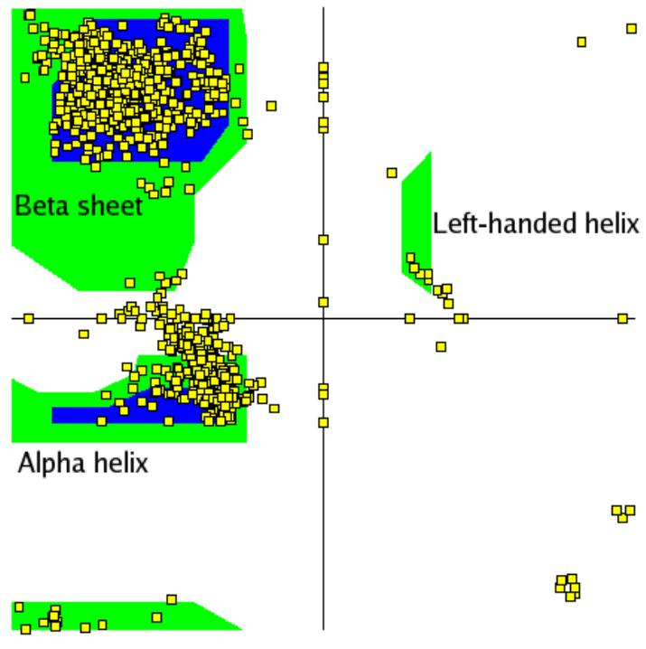  
[-[no]excl] [-cut <real>] [-rmax <real>] [-surf <enum>] [-ref <selection>] [-sel <selection>]

## 说明

gmx rdf 用于计算从一组参考位置（-ref 指定）到一组或多组位置（-sel 指定）的径向分布函数。如果要计算相对于 -ref 集合中的最近位置的 RDF，可以使用 -surf 选项：指定后，程序会根据 -surf 的值将 -ref 划分为集合，并使用每个集合中最近的位置。要计算与 z 轴平行的轴周围，处于 x - y 平面内的 RDF，可以使用 -xy 选项。

要设置计算 RDF 时使用的分格宽度和最大距离，可以使用 -bin 和 -rmax 选项。后一选项可用于减小计算成本，如果对 RDF 在默认最大距离处的信息不感兴趣的话（使用 PBC 时，默认最大距离为盒子大小的一半，不使用 PBC 时，默认最大距离为盒子大小的三倍）。

要使用拓扑文件（-s 选项）中的排除，可以指定 -excl 并确保 -ref 和 -sel 二者只选择了原子。一种更粗略的排除分子内 RDF 峰的替代方法是，将 -cut 选项设置为非零值以清除小距离处的 RDF。

RDF 的归一化因子可以使用：1) -ref 中的平均位置数（使用 -surf 时为组的数目）; 2) 分格的体积；3) 该选择的 -sel 位置的平均粒子密度。要改变归一化方法，可以使用 -norm 选项：

• rdf: 使用所有因子进行归一化。这会得到常规的 RDF。

• number\_density: 使用前两个因子。这会得到数密度与距离的函数关系。

• none: 只使用第一个因子。在这种情况下，只使用分格宽度对 RDF 进行缩放，这样得到的曲线的积分代表某一范围内的位置对的个数。

注意，排除不影响归一化：即使指定了 -excl，或 -ref 和 -sel 包含相同的选择，归一化因子仍然是N\*M，而不是 N\*(M-排除数)。

对于 -surf 选项，提供给 -ref 的选区必须对应原子，即不支持质心。此外，此选项暗含了 -nonorm，因为分格具有不规则的形状，其体积不易计算。

使用 -cn 选项可以得到 RDF 累积数（配位数），即距离 r 范围内的平均粒子数。

## 选项

输入文件选项
<table><tr><td rowspan=1 colspan=1>选项</td><td rowspan=1 colspan=1>默认文件</td><td rowspan=1 colspan=1>类型</td><td rowspan=1 colspan=1>说明</td></tr><tr><td rowspan=1 colspan=1>-f [&lt;.xtc/.trr/·…&gt;]</td><td rowspan=1 colspan=1>traj.xtc</td><td rowspan=1 colspan=1>可选</td><td rowspan=1 colspan=1>输入轨迹或单个构型：xctCc→462，trr+461 ,Cptc+450，gr0→452，g96+452，pdbc+456， tng→458</td></tr><tr><td rowspan=1 colspan=1>-s [&lt;.tpr/.gro/…&gt;]</td><td rowspan=1 colspan=1>topol.tpr</td><td rowspan=1 colspan=1>可选</td><td rowspan=1 colspan=1>输入结构：tpr→460，gr0→452，g96452,pdbc+456,brk,ent</td></tr><tr><td rowspan=1 colspan=1>-n [&lt;.ndx&gt;]</td><td rowspan=1 colspan=1>index.ndx</td><td rowspan=1 colspan=1>可选</td><td rowspan=1 colspan=1>额外的索引组</td></tr></table>

输出文件选项
<table><tr><td rowspan=1 colspan=1>选项</td><td rowspan=1 colspan=1>默认文件</td><td rowspan=1 colspan=1>类型</td><td rowspan=1 colspan=1>说明</td></tr><tr><td rowspan=1 colspan=1>-0 [&lt;.xvg&gt;]</td><td rowspan=1 colspan=1>rdf.xvg</td><td rowspan=1 colspan=1>可选</td><td rowspan=1 colspan=1>计算的 RDF</td></tr><tr><td rowspan=1 colspan=1>-cn [&lt;.xvg&gt;]</td><td rowspan=1 colspan=1>rdf_cn.xvg</td><td rowspan=1 colspan=1>可选</td><td rowspan=1 colspan=1>累积 RDF（配位数）</td></tr></table>

控制选项
<table><tr><td colspan="1" rowspan="1">选项</td><td colspan="1" rowspan="1">默认值</td><td colspan="1" rowspan="1">说明</td></tr><tr><td colspan="1" rowspan="1">-b &lt;time&gt;</td><td colspan="1" rowspan="1">0</td><td colspan="1" rowspan="1">读入轨迹第一帧的时间，即分析的起始时间（默认单位ps)</td></tr><tr><td colspan="1" rowspan="1">-e &lt;time&gt;</td><td colspan="1" rowspan="1">0</td><td colspan="1" rowspan="1">读入轨迹最后一帧的时间，即分析的终止时间（默认单位ps)</td></tr><tr><td colspan="1" rowspan="1">-dt &lt;time&gt;</td><td colspan="1" rowspan="1">0</td><td colspan="1" rowspan="1">只使用时刻 t 除以 dt 的余数等于第一帧时间的帧，即分析时两帧之间的时间间隔（默认单位 ps）</td></tr><tr><td colspan="1" rowspan="1">-tu &lt;enum&gt;</td><td colspan="1" rowspan="1">PS</td><td colspan="1" rowspan="1">时间的单位：fs，ps，ns，us，ms，s</td></tr><tr><td colspan="1" rowspan="1">-fgroup &lt;selection&gt;</td><td colspan="1" rowspan="1"></td><td colspan="1" rowspan="1">轨迹文件中存储的原子（如果未设置，假定为前N个原子）</td></tr><tr><td colspan="1" rowspan="1">-xvg &lt;enum&gt;</td><td colspan="1" rowspan="1">xmgrace</td><td colspan="1" rowspan="1">绘图格式：none，xmgrace，xmgr</td></tr><tr><td colspan="1" rowspan="1">-[no]rmpbc</td><td colspan="1" rowspan="1">yes</td><td colspan="1" rowspan="1">对每一帧的分子进行完整化</td></tr><tr><td colspan="1" rowspan="1">- [no]pbc</td><td colspan="1" rowspan="1">yes</td><td colspan="1" rowspan="1">计算距离时使用周期性边界条件</td></tr><tr><td colspan="1" rowspan="1">-sf &lt;file&gt;</td><td colspan="1" rowspan="1"></td><td colspan="1" rowspan="1">使用文件中提供的选区</td></tr><tr><td colspan="1" rowspan="1">-selrpos &lt;enum&gt;</td><td colspan="1" rowspan="1">atom</td><td colspan="1" rowspan="1">选区参考位置：atom，res_com，res_cog，mol_com，mol_cog， whole_res_com， whole_res_cog,whole_mol_com，whole_mol_cog，part_res_com,part_res_cog, part_mol_com，part_mol_cog,dyn_res_com，dyn_res_cog， dyn_mol_com,dyn_mol_cog</td></tr><tr><td colspan="1" rowspan="1">-seltype &lt;enum&gt;</td><td colspan="1" rowspan="1">atom</td><td colspan="1" rowspan="1">默认选区输出位置：atom，res_com，res_cog,mol_com，mol_cog,whole_res_com， whole_res_cog,whole_mol_com， whole_mol_cog，part_res_com,part_res_cog，part_mol_com，part_mol_cog,dyn_res_com，dyn_res_cog，dyn_mol_com,dyn_mol_cog</td></tr><tr><td colspan="1" rowspan="1">-bin &lt;real&gt;</td><td colspan="1" rowspan="1">0.002</td><td colspan="1" rowspan="1">分格宽度（单位：nm）</td></tr><tr><td colspan="1" rowspan="1">-normn &lt;enum&gt;</td><td colspan="1" rowspan="1">rdf</td><td colspan="1" rowspan="1">归一化方法：rdf，number_density，none</td></tr><tr><td colspan="1" rowspan="1">-[no]xy</td><td colspan="1" rowspan="1">no</td><td colspan="1" rowspan="1">只使用距离的 x 和y 分量</td></tr><tr><td colspan="1" rowspan="1">-[no]excl</td><td colspan="1" rowspan="1">no</td><td colspan="1" rowspan="1">使用拓扑中的排除</td></tr><tr><td colspan="1" rowspan="1">-cut &lt;real&gt;</td><td colspan="1" rowspan="1">0</td><td colspan="1" rowspan="1">要考虑的最短距离（单位：nm）</td></tr><tr><td colspan="1" rowspan="1">-rmax &lt;real&gt;</td><td colspan="1" rowspan="1">0</td><td colspan="1" rowspan="1">要计算的最大距离（单位：nm）</td></tr><tr><td colspan="1" rowspan="1">-surf &lt;enum&gt;</td><td colspan="1" rowspan="1">no</td><td colspan="1" rowspan="1">相对于参考表面的 RDF:no，mol，res</td></tr><tr><td colspan="1" rowspan="1">-ref &lt;selection&gt;</td><td colspan="1" rowspan="1"></td><td colspan="1" rowspan="1">计算 RDF 的参考选区</td></tr><tr><td colspan="1" rowspan="1">-sel &lt;selection&gt;</td><td colspan="1" rowspan="1"></td><td colspan="1" rowspan="1">计算 RDF 的选区</td></tr></table>

## 3.7.73 gmx report-methods

概要

gmx report-methods [-s [<.tpr/.gro/...>]] [-m [<.tex>]] [-o [<.out>]]

说明

gmx report-methods 用于报告由 -s 指定的运行输入文件的基本系统信息，报告结果可以直接输出到终端，如果运行时指定了 -m 选项会将报告结果输出到 LaTeX 文件，如果使用了 -o 选项会将报告结果输出到无格式的文件中。该功能之前属于gmx check↪58。

选项

输入文件选项
<table><tr><td rowspan=1 colspan=1>选项</td><td rowspan=1 colspan=1>默认文件</td><td rowspan=1 colspan=1>类型</td><td rowspan=1 colspan=1>说明</td></tr><tr><td rowspan=1 colspan=1>-s [&lt;.tpr/.gro/…&gt;]</td><td rowspan=1 colspan=1>topol.tpr</td><td rowspan=1 colspan=1>可选</td><td rowspan=1 colspan=1>用于报告的运行输入文件：tpr↔460，grO△→452，g96→452， pdb→456，brk，ent</td></tr></table>

输出文件选项
<table><tr><td rowspan=1 colspan=1>选项</td><td rowspan=1 colspan=1>默认文件</td><td rowspan=1 colspan=1>类型</td><td rowspan=1 colspan=1>说明</td></tr><tr><td rowspan=1 colspan=1>-m[&lt;.tex&gt;]</td><td rowspan=1 colspan=1>report.tex</td><td rowspan=1 colspan=1>可选</td><td rowspan=1 colspan=1>LaTeX 格式的报告输出文件</td></tr><tr><td rowspan=1 colspan=1>-0 [&lt;.out&gt;]</td><td rowspan=1 colspan=1>report.out</td><td rowspan=1 colspan=1>可选</td><td rowspan=1 colspan=1>无格式的报告输出文件</td></tr></table>

## 3.7.74 gmx rms

概要

gmx rms [-s [<.tpr/.gro/...>]] [-f [<.xtc/.trr/...>]]   
[-f2 [<.xtc/.trr/...>]] [-n [<.ndx>]] [-o [<.xvg>]]   
[-mir [<.xvg>]] [-a [<.xvg>]] [-dist [<.xvg>]] [-m [<.xpm>]]   
[-bin [<.dat>]] [-bm [<.xpm>]] [-b <time>] [-e <time>]   
[-dt <time>] [-tu <enum>] [-[no]w] [-xvg <enum>]   
[-what <enum>] [-[no]pbc] [-fit <enum>] [-prev <int>]   
[-[no]split] [-skip <int>] [-skip2 <int>] [-max <real>]

[-min <real>] [-bmax <real>] [-bmin <real>] [-[no]mw]   
[-nlevels <int>] [-ng <int>]

## 说明

gmx rms 通过计算均方根偏差（RMSD），尺寸无关的 rho 相似性参数（rho）或缩放的 rho(rhosc) 来比较两个结构，参见 Maiorov&Crippen, Proteins 22, 273(1995)。可使用 -what 选项来选择要计算的参数。

程序会将轨迹（-f 指定）中的每个结构与参考结构进行比较。参考结构取自结构文件（-s 指定）。

如果指定了 -mir 选项，程序还可以将结构与参考结构的镜像进行比较。这可以作为“显著”值的参考，详见 Maiorov & Crippen, Proteins 22, 273 (1995)。

使用 -prev 选项可以将当前帧的结构与前面指定帧中的结构进行比较。

使用 -m 选项可以生成一个.xpm 格式的矩阵，其值为轨迹中所有结构彼此之间的对比值。这个矩阵文件可使用 xv 之类的程序可视化，也可以使用gmx xpm2ps↪211 转换为 postscript 格式。

可以使用 -fit 选项控制结构之间的最小二乘叠合方式：完全叠合（旋转和平移），仅平移，或不叠合。

选项 -mw 控制是否使用质量加权。如果指定了此选项（默认），并提供了一个有效的.tpr 文件，程序会读取文件中的质量，否则会从 GMXLIB 目录下的 atommass.dat 文件中获得质量。这适用于蛋白质，但不一定适用于其他分子。对未知原子会使用默认的质量 12.011 amu（碳原子）。你可以通过指定 -debug选项并查看日志文件来检查是否如此。

如果指定了 -f2 选项，程序会从第二个轨迹文件中读取“其他结构”，并计算两条轨迹的比较矩阵。

使用 -bin 选项可以输出比较矩阵的二进制文件。

使用 -bm 选项可以得到平均键角偏差矩阵，类似于 -m 选项。比较时只会考虑对比组中原子之间的键。

选项

输入文件选项
<table><tr><td rowspan=1 colspan=1>选项</td><td rowspan=1 colspan=1>默认文件</td><td rowspan=1 colspan=1>类型</td><td rowspan=1 colspan=1>说明</td></tr><tr><td rowspan=1 colspan=1>-s [&lt;.tpr/.gro/…&gt;]</td><td rowspan=1 colspan=1>topol.tpr</td><td rowspan=1 colspan=1>可选</td><td rowspan=1 colspan=1>结构+质量（db）：tpr→460，gr0→452,g96c452，pdb+456，brk,ent</td></tr><tr><td rowspan=1 colspan=1>-f [&lt;.xtc/.trr/·…&gt;]</td><td rowspan=1 colspan=1>traj.xtc</td><td rowspan=1 colspan=1>可选</td><td rowspan=1 colspan=1>轨迹文件：xtcc462，trr→461，cptc450，gr0→452，g96+452，pdb+456，tng4458</td></tr><tr><td rowspan=1 colspan=1>-f2 [&lt;.xtc/.trr/…&gt;]</td><td rowspan=1 colspan=1>traj.xtc</td><td rowspan=1 colspan=1>可选</td><td rowspan=1 colspan=1>轨迹文件：xtCc+462，trr→461，Cpt→450，gr0→452， g96+452，pdb+456，tng4458</td></tr><tr><td rowspan=1 colspan=1>-n [&lt;.ndx&gt;]</td><td rowspan=1 colspan=1>index.ndx</td><td rowspan=1 colspan=1>可选</td><td rowspan=1 colspan=1>索引文件</td></tr></table>

输出文件选项
<table><tr><td colspan="1" rowspan="1">选项</td><td colspan="1" rowspan="1">默认文件</td><td colspan="1" rowspan="1">类型</td><td colspan="1" rowspan="1">说明</td></tr><tr><td colspan="1" rowspan="1">-0 [&lt;.xvg&gt;]</td><td colspan="1" rowspan="1">rmsd.xvg</td><td colspan="1" rowspan="1">可选</td><td colspan="1" rowspan="1">xvgr/xmgr 文件</td></tr><tr><td colspan="1" rowspan="1">-mir[&lt;.xvg&gt;]</td><td colspan="1" rowspan="1">rmsdmir.xvg</td><td colspan="1" rowspan="1">可选</td><td colspan="1" rowspan="1">xvgr/xmgr 文件</td></tr><tr><td colspan="1" rowspan="1">-a [&lt;.xvg&gt;]</td><td colspan="1" rowspan="1">avgrp.xvg</td><td colspan="1" rowspan="1">可选</td><td colspan="1" rowspan="1">xvgr/xmgr 文件</td></tr><tr><td colspan="1" rowspan="1">-dist [&lt;.xvg&gt;]</td><td colspan="1" rowspan="1">rmsd-dist.xvg</td><td colspan="1" rowspan="1">可选</td><td colspan="1" rowspan="1">xvgr/xmgr 文件</td></tr><tr><td colspan="1" rowspan="1">-m [&lt;.xpm&gt;]</td><td colspan="1" rowspan="1">rmsd.xpm</td><td colspan="1" rowspan="1">可选</td><td colspan="1" rowspan="1">X PixMap 兼容的矩阵文件</td></tr><tr><td colspan="1" rowspan="1">-bin [&lt;.dat&gt;]</td><td colspan="1" rowspan="1">rmsd.dat</td><td colspan="1" rowspan="1">可选</td><td colspan="1" rowspan="1">通用数据文件</td></tr><tr><td colspan="1" rowspan="1">-bm [&lt;.xpm&gt;]</td><td colspan="1" rowspan="1">bond.xpm</td><td colspan="1" rowspan="1">可选</td><td colspan="1" rowspan="1">X PixMap 兼容的矩阵文件</td></tr></table>

控制选项

<table><tr><td rowspan=1 colspan=1>选项</td><td rowspan=1 colspan=1>默认值</td><td rowspan=1 colspan=1>说明</td></tr><tr><td rowspan=1 colspan=1>-b &lt;time&gt;</td><td rowspan=1 colspan=1>0</td><td rowspan=1 colspan=1>读入轨迹第一帧的时间，即分析的起始时间（默认单位 ps）</td></tr><tr><td rowspan=1 colspan=1>-e &lt;time&gt;</td><td rowspan=1 colspan=1>0</td><td rowspan=1 colspan=1>读入轨迹最后一帧的时间，即分析的结束时间（默认单位ps)</td></tr><tr><td rowspan=1 colspan=1>-dt &lt;time&gt;</td><td rowspan=1 colspan=1>0</td><td rowspan=1 colspan=1>只使用时刻 t 除以 dt 的余数等于第一帧时间的帧，即分析时两帧之间的时间间隔（默认单位 ps）</td></tr><tr><td rowspan=1 colspan=1>-tu &lt;enum&gt;</td><td rowspan=1 colspan=1>pS</td><td rowspan=1 colspan=1>时间的单位：fs，ps，ns，us，ms，s</td></tr><tr><td rowspan=1 colspan=1>-[no]w</td><td rowspan=1 colspan=1>no</td><td rowspan=1 colspan=1>查看输出的.xvg→464，.xpm→461，.eps→451 和.pdb→456文件</td></tr><tr><td rowspan=1 colspan=1>-xvg &lt;enum&gt;</td><td rowspan=1 colspan=1>xmgrace</td><td rowspan=1 colspan=1>xvg 绘图格式：xmgrace，xmgr，none</td></tr><tr><td rowspan=1 colspan=1>-what &lt;enum&gt;</td><td rowspan=1 colspan=1>rmsd</td><td rowspan=1 colspan=1>结构差异类型：rmsd，rho，rhosc</td></tr><tr><td rowspan=1 colspan=1>-[no]pbc</td><td rowspan=1 colspan=1>yes</td><td rowspan=1 colspan=1>PBC 检查</td></tr><tr><td rowspan=1 colspan=1>-fit &lt;enum&gt;</td><td rowspan=1 colspan=1>rot+trans</td><td rowspan=1 colspan=1>叠合到参考结构的方式：rot+trans，translation，none</td></tr><tr><td rowspan=1 colspan=1>-prev &lt;int&gt;</td><td rowspan=1 colspan=1>0</td><td rowspan=1 colspan=1>与之前的帧进行比较</td></tr><tr><td rowspan=1 colspan=1>-[no]split</td><td rowspan=1 colspan=1>no</td><td rowspan=1 colspan=1>在时间为零的位置划分图形</td></tr><tr><td rowspan=1 colspan=1>-skip &lt;int&gt;</td><td rowspan=1 colspan=1>1</td><td rowspan=1 colspan=1>每隔指定数目的帧分析一次，即分析帧的间隔</td></tr><tr><td rowspan=1 colspan=1>-skip2 &lt;int&gt;</td><td rowspan=1 colspan=1>1</td><td rowspan=1 colspan=1>每隔指定数目的帧分析一次，即分析帧的间隔</td></tr><tr><td rowspan=1 colspan=1>-max &lt;real&gt;</td><td rowspan=1 colspan=1>-1</td><td rowspan=1 colspan=1>比较矩阵中的最大水平</td></tr><tr><td rowspan=1 colspan=1>-min &lt;real&gt;</td><td rowspan=1 colspan=1>-1</td><td rowspan=1 colspan=1>比较矩阵中的最小水平</td></tr><tr><td rowspan=1 colspan=1>-bmax &lt;real&gt;</td><td rowspan=1 colspan=1>-1</td><td rowspan=1 colspan=1>键角矩阵中的最大水平</td></tr><tr><td rowspan=1 colspan=1>-bmin &lt;real&gt;</td><td rowspan=1 colspan=1>-1</td><td rowspan=1 colspan=1>键角矩阵中的最小水平</td></tr><tr><td rowspan=1 colspan=1>-[no]mw</td><td rowspan=1 colspan=1>yes</td><td rowspan=1 colspan=1>叠合时使用质量加权</td></tr><tr><td rowspan=1 colspan=1>-nlevels &lt;int&gt;</td><td rowspan=1 colspan=1>80</td><td rowspan=1 colspan=1>矩阵中的水平数</td></tr><tr><td rowspan=1 colspan=1>-ng &lt;int&gt;</td><td rowspan=1 colspan=1>1</td><td rowspan=1 colspan=1>计算 RMS 的组数</td></tr></table>

## 3.7.75 gmx rmsdist

概要

```perl
gmx rmsdist [-f [<.xtc/.trr/...>]] [-s [<.tpr/.gro/...>]] [-n [<.ndx>]]
[-equiv [<.dat>]] [-o [<.xvg>]] [-rms [<.xpm>]]
[-scl [<.xpm>]] [-mean [<.xpm>]] [-nmr3 [<.xpm>]]
[-nmr6 [<.xpm>]] [-noe [<.dat>]] [-b <time>] [-e <time>]
[-dt <time>] [-[no]w] [-xvg <enum>] [-nlevels <int>]
[-max <real>] [-[no]sumh] [-[no]pbc]
```

## 说明

gmx rmsdist 用于计算原子距离的均方根偏差，程序的优点在于计算时不需要叠合，而gmx rms↪160 计算标准 RMSD 时则需要进行叠合。参考结构取自结构文件。t 时刻的 RMSD 定义为参考结构的原子与t 时刻结构的对应原子之间的距离差值的 RMS。

gmx rmsdist 也可用于计算 rms 距离矩阵，使用平均距离缩放的 rms 距离，以及使用 NMR 平均（1/r^3和 1/r^6 平均）的平均距离和矩阵。最后，程序可以生成一个原子对列表，其中包含所有 1/r^3 和 1/r^6平均距离小于最大距离（-max 指定，在这种情况下默认为 0.6）的原子对，默认情况下，平均是对等价氢原子（所有以 \*[123] 命名的氢原子三联对）进行的。另外，程序还可以提供等价原子的列表（-equiv选项），输出文件中每行包含一组等价原子，使用残基编号，残基名称，原子名称指定；如：

HB\* 3 SER HB1 3 SER HB2

残基名称和原子名称必须与结构文件中的名称精确匹配，包括大小写。程序没有规定如何指定非连续的原子。

选项

输入文件选项
<table><tr><td rowspan=1 colspan=1>选项</td><td rowspan=1 colspan=1>默认文件</td><td rowspan=1 colspan=1>类型</td><td rowspan=1 colspan=1>说明</td></tr><tr><td rowspan=1 colspan=1>-f [&lt;.xtc/.trr/…&gt;]</td><td rowspan=1 colspan=1>traj.xtc</td><td rowspan=1 colspan=1>可选</td><td rowspan=1 colspan=1>轨迹文件： $x t c _ { \scriptscriptstyle \odot \mathrm { 4 6 2 } }$    $t r r _ { \hookrightarrow 4 6 1 }$    $c p t _ {  4 5 0 } ,$ gr0+452，g96452，pdb→456，tng→458</td></tr><tr><td rowspan=1 colspan=1>-s [&lt;.tpr/.gro/…&gt;]</td><td rowspan=1 colspan=1>topol.tpr</td><td rowspan=1 colspan=1>可选</td><td rowspan=1 colspan=1>结构+质量（db）: $t p r _ { \scriptscriptstyle { \hookrightarrow 4 6 0 } } ,$  gr0ω452,g96c+452 , $p d b _ { \hookrightarrow 4 5 6 }$ , brk,ent</td></tr><tr><td rowspan=1 colspan=1>-n [&lt;.ndx&gt;]</td><td rowspan=1 colspan=1>index.ndx</td><td rowspan=1 colspan=1>可选</td><td rowspan=1 colspan=1>索引文件</td></tr><tr><td rowspan=1 colspan=1>-equiv [&lt;.dat&gt;]</td><td rowspan=1 colspan=1>equiv.dat</td><td rowspan=1 colspan=1>可选</td><td rowspan=1 colspan=1>通用数据文件</td></tr></table>

输出文件选项
<table><tr><td rowspan=1 colspan=1>选项</td><td rowspan=1 colspan=1>默认文件</td><td rowspan=1 colspan=1>类型</td><td rowspan=1 colspan=1>说明</td></tr><tr><td rowspan=1 colspan=1>-0 [&lt;.xvg&gt;]</td><td rowspan=1 colspan=1>distrmsd.xvg</td><td rowspan=1 colspan=1>可选</td><td rowspan=1 colspan=1>xvgr/xmgr 文件</td></tr><tr><td rowspan=1 colspan=1>-rms[&lt;.xpm&gt;]</td><td rowspan=1 colspan=1>rmsdist.xpm</td><td rowspan=1 colspan=1>可选</td><td rowspan=1 colspan=1>X PixMap 兼容的矩阵文件</td></tr><tr><td rowspan=1 colspan=1>-scl[&lt;.xpm&gt;]</td><td rowspan=1 colspan=1>rmsscale.xpm</td><td rowspan=1 colspan=1>可选</td><td rowspan=1 colspan=1>X PixMap 兼容的矩阵文件</td></tr><tr><td rowspan=1 colspan=1>-mean[&lt;.xpm&gt;]</td><td rowspan=1 colspan=1>rmsmean.xpm</td><td rowspan=1 colspan=1>可选</td><td rowspan=1 colspan=1>X PixMap 兼容的矩阵文件</td></tr><tr><td rowspan=1 colspan=1>-nmr3[&lt;.xpm&gt;]</td><td rowspan=1 colspan=1>nmr3.xpm</td><td rowspan=1 colspan=1>可选</td><td rowspan=1 colspan=1>X PixMap 兼容的矩阵文件</td></tr><tr><td rowspan=1 colspan=1>-nmr6 [&lt;.xpm&gt;]</td><td rowspan=1 colspan=1>nmr6.xpm</td><td rowspan=1 colspan=1>可选</td><td rowspan=1 colspan=1>X PixMap 兼容的矩阵文件</td></tr><tr><td rowspan=1 colspan=1>-noe[&lt;.dat&gt;]</td><td rowspan=1 colspan=1>noe.dat</td><td rowspan=1 colspan=1>可选</td><td rowspan=1 colspan=1>通用数据文件</td></tr></table>

控制选项
<table><tr><td colspan="1" rowspan="1">选项</td><td colspan="1" rowspan="1">默认值</td><td colspan="1" rowspan="2">说明读入轨迹第一帧的时间，即分析的起始时间（默认单位 ps）</td></tr><tr><td colspan="1" rowspan="1">-b &lt;time&gt;</td><td colspan="1" rowspan="1">0</td></tr><tr><td colspan="1" rowspan="1">-e &lt;time&gt;</td><td colspan="1" rowspan="1">0</td><td colspan="1" rowspan="1">读入轨迹最后一帧的时间，即分析的结束时间（默认单位 ps）</td></tr><tr><td colspan="1" rowspan="1">-dt &lt;time&gt;</td><td colspan="1" rowspan="1">0</td><td colspan="1" rowspan="1">只使用时刻 t 除以 dt 的余数等于第一帧时间的帧，即分析时两帧之间的时间间隔（默认单位ps）</td></tr><tr><td colspan="1" rowspan="1">-[no]w</td><td colspan="1" rowspan="1">no</td><td colspan="1" rowspan="1">查看输出的 $x v g _ { \scriptscriptstyle { \Theta 4 6 4 } } , ~ . x p m _ { \scriptscriptstyle { \Theta 4 6 1 } } , ~ . e p s _ { \scriptscriptstyle { \Theta 4 5 1 } }$ 和 $. p d b _ { \scriptscriptstyle { \hookrightarrow } 4 5 6 }$ 文件</td></tr><tr><td colspan="1" rowspan="1">-xvg &lt;enum&gt;</td><td colspan="1" rowspan="1">xmgrace</td><td colspan="1" rowspan="1">xvg 绘图格式：xmgrace，xmgr，none</td></tr><tr><td colspan="1" rowspan="1">-nlevels &lt;int&gt;</td><td colspan="1" rowspan="1">40</td><td colspan="1" rowspan="1">RMS 的离散水平数</td></tr><tr><td colspan="1" rowspan="1">-max &lt;real&gt;</td><td colspan="1" rowspan="1">-1</td><td colspan="1" rowspan="1">矩阵的最大水平</td></tr><tr><td colspan="1" rowspan="1">-[no] sumh</td><td colspan="1" rowspan="1">yes</td><td colspan="1" rowspan="1">对等价氢原子进行距离平均</td></tr><tr><td colspan="1" rowspan="1">-[no]pbc</td><td colspan="1" rowspan="1">yes</td><td colspan="1" rowspan="1">计算距离时使用周期性边界条件</td></tr></table>

## 3.7.76 gmx rmsf

概要

$$
\begin{array} { r l } { \mathrm { g m a x ~ \ r m s f ~ \ [ - \mathbf { f } ~ }  [ < \cdot , \ x t c / , \ t r r / , \cdot \ldots . > \middle { ] } ] \ [ - \mathbf { s } \  [ < \cdot , \ t p r / , \cdot g r o / , \cdot \ldots , > \middle { ] } ]  \ [ - \mathbf { n } \  ( \cdot , \ n d x > J ]   } \\ {  [ - \mathbf { q }   [ < \cdot , p d b > J ]    [ - \circ \mathbf { q }   ( L < \cdot , p d b > J ]    [ - \circ \mathbf { x }   L < \cdot , p d b > J ]    [ - \circ   L < \cdot , x v g > J ]    } \\ {   [ - \circ \mathbf { d }     L < \cdot , x v g > J ]  [ - \circ \mathbf { c }   [ \cdot \mathbf { c } . \cdot x v g > J ]  [ - \mathbf { d i r } \   [ \cdot \mathbf { c } . \cdot l o g > J ]    [ - \mathbf { b } \ \cdot \ t i m e > ]    } \\ {    [ - \mathbf { e }    \ < i m e > ] \  [ - \mathbf { d i } \ \cdot \mathbf { d i } m e > ] \  [ - [ \mathbf { n o } ] \mathbf { u } ] \   [ - \mathbf { x v g }  \ < e n u m s ] \   [ - [ \mathbf { n o } ] \mathbf { r e s } ]  \ } \\ {   [ - [ \mathbf { n o } ] \mathbf { a n i s o } ] \  [ - [ \mathbf { n o } ] \mathbf { f i t } ]  } \end{array}
$$

说明

gmx rmsf 用于计算轨迹（-f 选项指定）中原子位置的均方根波动（RMSF，即标准偏差），计算前可以先将构型与参考构型（-s 选项指定）进行叠合（并非必须）。

使用 -oq 选项可以将 RMSF 值转换为 B 因子值，并将其输出到. $. p d b _ { \scriptscriptstyle \mathrm { Q 4 5 6 } }$ 文件中。默认情况下，此输出文件中的坐标来自 -s 选项指定的结构文件，但也可以使用 -q 选项指定另一个. $. p d b _ { \scriptscriptstyle \mathrm { Q 4 5 6 } }$ 文件，并使用其中的坐标。程序几乎不进行错误检查，因此在这种情况下，需要你确保结构文件和. $. p d b _ { \scriptscriptstyle \mathrm { Q 4 5 6 } }$ 文件中的所有原子都完全对应。

指定 -ox 选项可以将 B 因子和平均坐标输出到轨迹文件。

使用 -od 选项可以计算相对于参考结构的均方根偏差。

如果指定了 -aniso 选项，gmx rmsf 会计算各向异性温度因子 U，还会输出平均坐标和含有 ANISOU 记录的. $. p d b _ { \scriptscriptstyle \mathrm { Q 4 5 6 } }$ 文件（对应于 -oq 或 -ox 选项）。注意，U 值与取向有关，因此在与实验数据进行比较前，请确保已经与实验坐标进行了叠合。

当为程序提供了一个. $. p d b _ { \scriptscriptstyle \mathrm { Q 4 5 6 } }$ 输入文件，并指定了 -aniso 选项时，如果. ${ . p d b } _ { \Rightarrow 4 5 6 }$ 文件中含有任何各向异性温度因子，就会生成 Uij 的相关图。

使用 -dir 选项可以对平均 MSF(3x3) 矩阵进行对角化。这可用于显示原子最大波动和最小波动的方向。

选项

输入文件选项
<table><tr><td colspan="1" rowspan="1">选项</td><td colspan="1" rowspan="1">默认文件</td><td colspan="1" rowspan="1">类型</td><td colspan="1" rowspan="1">说明</td></tr><tr><td colspan="1" rowspan="1">-f [&lt;.xtc/.trr/…&gt;]</td><td colspan="1" rowspan="1">traj.xtc</td><td colspan="1" rowspan="1">可选</td><td colspan="1" rowspan="1">轨迹文件： $x t c _ { \scriptscriptstyle { \Theta 4 6 2 } } , t r r _ { \scriptscriptstyle { \Theta 4 6 1 } } , c p t _ { \scriptscriptstyle { \Theta 4 5 0 } } ,$  $g r o _ { \scriptscriptstyle { \Theta _ { \scriptscriptstyle  4 5 2 } } } , g \vartheta \theta _ { \scriptscriptstyle  4 5 2 } , p d b _ { \scriptscriptstyle  4 5 6 } , t n g _ { \scriptscriptstyle  4 5 8 }$ </td></tr><tr><td colspan="1" rowspan="1">-s [&lt;.tpr/.gro/…&gt;]</td><td colspan="1" rowspan="1">topol.tpr</td><td colspan="1" rowspan="1">可选</td><td colspan="1" rowspan="1">结构+质量（db）：tprc→460，gr0→452，g96452，pdb→456，brk，ent</td></tr><tr><td colspan="1" rowspan="1">-n [&lt;.ndx&gt;]</td><td colspan="1" rowspan="1">index.ndx</td><td colspan="1" rowspan="1">可选</td><td colspan="1" rowspan="1">索引文件</td></tr><tr><td>-q [&lt;.pdb&gt;]</td><td>eiwit.pdb</td><td>可选</td><td>蛋白质数据库文件</td></tr></table>

输出文件选项
<table><tr><td rowspan=1 colspan=1>选项</td><td rowspan=1 colspan=1>默认文件</td><td rowspan=1 colspan=1>类型</td><td rowspan=1 colspan=1>说明</td></tr><tr><td rowspan=1 colspan=1>-oq [&lt;.pdb&gt;]</td><td rowspan=1 colspan=1>bfac.pdb</td><td rowspan=1 colspan=1>可选</td><td rowspan=1 colspan=1>蛋白质数据库文件</td></tr><tr><td rowspan=1 colspan=1>-ox [&lt;.pdb&gt;]</td><td rowspan=1 colspan=1>xaver.pdb</td><td rowspan=1 colspan=1>可选</td><td rowspan=1 colspan=1>蛋白质数据库文件</td></tr><tr><td rowspan=1 colspan=1>-0 [&lt;.xvg&gt;]</td><td rowspan=1 colspan=1>rmsf.xvg</td><td rowspan=1 colspan=1>可选</td><td rowspan=1 colspan=1>xvgr/xmgr 文件</td></tr><tr><td rowspan=1 colspan=1>-od [&lt;.xvg&gt;]</td><td rowspan=1 colspan=1>rmsdev.xvg</td><td rowspan=1 colspan=1>可选</td><td rowspan=1 colspan=1>xvgr/xmgr 文件</td></tr><tr><td rowspan=1 colspan=1>-oc [&lt;.xvg&gt;]</td><td rowspan=1 colspan=1>correl.xvg</td><td rowspan=1 colspan=1>可选</td><td rowspan=1 colspan=1>xvgr/xmgr 文件</td></tr><tr><td rowspan=1 colspan=1>-dir [&lt;.1og&gt;]</td><td rowspan=1 colspan=1>rmsf.log</td><td rowspan=1 colspan=1>可选</td><td rowspan=1 colspan=1>日志文件</td></tr></table>

控制选项
<table><tr><td rowspan=1 colspan=1>选项</td><td rowspan=1 colspan=1>默认值</td><td rowspan=1 colspan=1>说明</td></tr><tr><td rowspan=1 colspan=1>-b &lt;time&gt;</td><td rowspan=1 colspan=1>0</td><td rowspan=1 colspan=1>读入轨迹第一帧的时间，即分析的起始时间（默认单位 ps）</td></tr><tr><td rowspan=1 colspan=1>-e &lt;time&gt;</td><td rowspan=1 colspan=1>0</td><td rowspan=1 colspan=1>读入轨迹最后一帧的时间，即分析的结束时间（默认单位 ps）</td></tr><tr><td rowspan=1 colspan=1>-dt &lt;time&gt;</td><td rowspan=1 colspan=1>0</td><td rowspan=1 colspan=1>只使用时刻 t 除以 dt 的余数等于第一帧时间的帧，即分析时两帧之间的时间间隔（默认单位 ps）</td></tr><tr><td rowspan=1 colspan=1>-[no]w</td><td rowspan=1 colspan=1>no</td><td rowspan=1 colspan=1>查看输出的.xvg464，.xpm→461，.eps→451 和.pdb→456文件</td></tr><tr><td rowspan=1 colspan=1>-xvg &lt;enum&gt;</td><td rowspan=1 colspan=1>xmgrace</td><td rowspan=1 colspan=1>xvg 绘图格式：xmgrace，xmgr，none</td></tr><tr><td rowspan=1 colspan=1>-[no]res</td><td rowspan=1 colspan=1>no</td><td rowspan=1 colspan=1>计算每个残基的平均值</td></tr><tr><td rowspan=1 colspan=1>-[no]aniso</td><td rowspan=1 colspan=1>no</td><td rowspan=1 colspan=1>计算各向异性温度因子</td></tr><tr><td rowspan=1 colspan=1>-[no]fit</td><td rowspan=1 colspan=1>yes</td><td rowspan=1 colspan=1>计算 RMSF之前进行最小二乘叠合。如果不使用这个选项，必须确保参考结构和轨迹匹配。</td></tr></table>

## 3.7.77 gmx rotacf

概要

gmx rotacf [-f [<.xtc/.trr/...>]] [-s [<.tpr>]] [-n [<.ndx>]]   
[-o [<.xvg>]] [-b <time>] [-e <time>] [-dt <time>]   
[-[no]w] [-xvg <enum>] [-[no]d] [-[no]aver]   
[-acflen <int>] [-[no]normalize] [-P <enum>]   
[-fitfn <enum>] [-beginfit <real>] [-endfit <real>]

说明

gmx rotacf 用于计算分子的旋转相关函数（ACF）。必须在索引文件中给出原子三联对 (i,j,k)，由此定义两个向量 ij 和 jk。旋转 ACF 为向量 n = ij × jk 的自相关函数，即两个向量叉积的自相关函数。由于三个原子可张成一个平面，因此三个原子的顺序并不重要。作为可选，通过使用 -d 选项，并在索引文件中指定原子对 (i，j) 可以计算线性分子的旋转相关函数。

示例

```batch
gmx rotacf -P 1 -nparm 2 -fft -n index -o rotacf-x-P1 -fa expfit-x-P1 -beginfit 2.5
-endfit 20.0
```

上面的命令会使用索引文件中定义的向量间的夹角的一阶 Legendre 多项式来计算旋转相关函数。并根据 2.5 ps 到 20.0 ps 的数据，将相关函数拟合为双参数指数形式。

选项

输入文件选项
<table><tr><td rowspan=1 colspan=1>选项</td><td rowspan=1 colspan=1>默认文件</td><td rowspan=1 colspan=1>类型</td><td rowspan=1 colspan=1>说明</td></tr><tr><td rowspan=1 colspan=1>-f [&lt;.xtc/.trr/·…&gt;]</td><td rowspan=1 colspan=1>traj.xtc</td><td rowspan=1 colspan=1>可选</td><td rowspan=1 colspan=1>轨迹文件：xtCc→462，trr→461，cptc+450,gr0c452，g964452， pdb+456，tng↔458</td></tr><tr><td rowspan=1 colspan=1>-s [[&lt;.tpr&gt;]</td><td rowspan=1 colspan=1>topol.tpr</td><td rowspan=1 colspan=1>可选</td><td rowspan=1 colspan=1>便携式 xdr 运行输入文件</td></tr><tr><td rowspan=1 colspan=1>-n [&lt;.ndx&gt;]</td><td rowspan=1 colspan=1>index.ndx</td><td rowspan=1 colspan=1>可选</td><td rowspan=1 colspan=1>索引文件</td></tr></table>

输出文件选项
<table><tr><td rowspan=1 colspan=1>选项</td><td rowspan=1 colspan=1>默认文件</td><td rowspan=1 colspan=2>类型    说明</td></tr><tr><td rowspan=1 colspan=1>-0 [&lt;.xvg&gt;]</td><td rowspan=1 colspan=1>rotacf.xvg</td><td rowspan=1 colspan=1>可选</td><td rowspan=1 colspan=1>xvgr/xmgr 文件</td></tr></table>

控制选项
<table><tr><td rowspan=1 colspan=1>选项</td><td rowspan=1 colspan=1>默认值</td><td rowspan=1 colspan=1>说明</td></tr><tr><td rowspan=1 colspan=1>-b &lt;time&gt;</td><td rowspan=1 colspan=1>0</td><td rowspan=1 colspan=1>读入轨迹第一帧的时间，即分析的起始时间（默认单位ps）</td></tr><tr><td rowspan=1 colspan=1>-e &lt;time&gt;</td><td rowspan=1 colspan=1>0</td><td rowspan=1 colspan=1>读入轨迹最后一帧的时间，即分析的结束时间（默认单位ps)</td></tr><tr><td rowspan=1 colspan=1>-dt &lt;time&gt;</td><td rowspan=1 colspan=1>0</td><td rowspan=1 colspan=1>只使用时刻 t 除以 dt 的余数等于第一帧时间的帧，即分析时两帧之间的时间间隔（默认单位ps）</td></tr><tr><td rowspan=1 colspan=1>-[no]w</td><td rowspan=1 colspan=1>no</td><td rowspan=1 colspan=1>查看输出的.xvg↔464，.xpmc+461，.epSc+451 和.pdb+456 文件</td></tr><tr><td rowspan=1 colspan=1>-xvg &lt;enum&gt;</td><td rowspan=1 colspan=1>xmgrace</td><td rowspan=1 colspan=1>xvg 绘图格式：xmgrace，xmgr，none</td></tr><tr><td rowspan=1 colspan=1>-[no]d</td><td rowspan=1 colspan=1>no</td><td rowspan=1 colspan=1>计算相关函数时使用索引双联对（向量）而不是三联对（平面）</td></tr><tr><td rowspan=1 colspan=1>-[no]aver</td><td rowspan=1 colspan=1>yes</td><td rowspan=1 colspan=1>对所有分子进行平均</td></tr><tr><td rowspan=1 colspan=1>-acflen &lt;int&gt;</td><td rowspan=1 colspan=1>-1</td><td rowspan=1 colspan=1>ACF 的长度，默认为帧数的一半</td></tr><tr><td rowspan=1 colspan=1>-[no]normalize</td><td rowspan=1 colspan=1>yes</td><td rowspan=1 colspan=1>归一化 ACF</td></tr><tr><td rowspan=1 colspan=1>-P &lt;enum&gt;</td><td rowspan=1 colspan=1>0</td><td rowspan=1 colspan=1>用于ACF的Legendre多项式的阶数（0表示不使用）：0，1，2，3</td></tr><tr><td rowspan=1 colspan=1>-fitfn &lt;enum&gt;</td><td rowspan=1 colspan=1>none</td><td rowspan=1 colspan=1>拟合函数类型：none，exp，aexp，exp_exp，exp5，exp7，exp9</td></tr><tr><td rowspan=1 colspan=1>-beginfit &lt;real&gt;</td><td rowspan=1 colspan=1>0</td><td rowspan=1 colspan=1>对相关函数进行指数拟合的起始时间</td></tr><tr><td rowspan=1 colspan=1>-endfit &lt;real&gt;</td><td rowspan=1 colspan=1>-1</td><td rowspan=1 colspan=1>对相关函数进行指数拟合的终止时间，-1表示直到结束</td></tr></table>

## 3.7.78 gmx rotmat

## 概要

$$
\begin{array} { l l l } { { \mathrm { g m x ~ r o t m a t } } } & { { [ - { \bf f }  \underbrace { ( - \bf { \tau } ) \ e t c . x t c . } \ t r r { \gamma } , \ldots \ s { \cal J } ] } } & { { [ - { \bf s } \quad [ < . \ t p r / . \ g r o / . \hdots \ s { \cal J } ] } } & { { [ - { \bf n } \quad [ < . \cdot n d x > { \cal J } ] } } \\ { { \mathrm { } } } & { { [ - { \bf o } \quad [ < . \hdots v v g > { \cal J } ] } } & { { [ - { \bf b } \quad < t i m e > ] } } & { { [ - { \bf e } \quad < t i m e > ] } } \\ { { \mathrm { } } } & { { [ - [ { \bf n } { \bf o } ] { \bf u } ] } } & { { [ - { \bf x v g } \quad < e n u m > ] } } & { { [ - { \bf r e f } \quad < e n u m > ] } } \\ { { \mathrm { } } } & { { [ - [ { \bf n } { \bf o } ] \~ { \bf f i t a r y } ] } } & { { [ - [ { \bf n } { \bf o } ] { \bf n u } ] } } & { { } } \end{array} [ - { \bf e } \overbrace { { \bf \Sigma } } { \bf { \Sigma } } \overbrace { { \bf { \Sigma } } } \overbrace { { \bf { \Sigma } } } \overbrace { { \bf { \Sigma } } } \overbrace { { \bf { \Sigma } } } \overbrace { { \bf { \Sigma } } } \overbrace { { \bf { \Sigma } } } \overbrace { { \bf { \Sigma } } } \overbrace { { \bf { \Sigma } } } \overbrace { { \bf { \Sigma } } } \overbrace { { \bf { \Sigma } } } \overbrace { { \bf { \Sigma } } } \overbrace { { \bf { \Sigma } } } \overbrace { { \bf { \Sigma } } } \overbrace { { \bf { \Sigma } } } \overbrace { { \bf { \Sigma } } } \overbrace { { \bf { \Sigma } } } \overbrace { { \bf { \Sigma } } } \overbrace { { \bf { \Sigma } } } \overbrace { { \bf { \Sigma } } } \overbrace  { \bf { \Sigma } } \overbrace { { \bf { \Sigma } } } 
$$

## 说明

gmx rotmat 用于计算一个构象与参考构象进行最小二乘叠合时所需的旋转矩阵，参考构象由 -s 选项指定。叠合前会移除平动自由度。输出为三个向量，给出了参考构象 x，y 和 z 方向的新方向，例如：(zx,zy, zz) 为轨迹帧中参考 z 轴的方向。

此工具在某些情况下可能会用到，例如，确定界面处分子的取向，轨迹可能由 gmx trjconv -fitrotxy+transxy 产生，移除了 x-y 平面内的旋转。

可以使用 -ref 选项指定叠合的参考结构，而不使用 -s 选项指定文件中的结构。程序会使用与其他所有结构的 RMSD 之和最小的结构作为参考结构。由于此过程的计算成本正比于帧数的平方，因此 -skip选项可用于减少计算成本。程序可以进行完全叠合或只进行 x-y 平面内的叠合。

如果指定了 -fitxy 选项，确定旋转矩阵前会先在 x-y 平面内进行叠合。

选项

输入文件选项
<table><tr><td rowspan=1 colspan=1>选项</td><td rowspan=1 colspan=1>默认文件</td><td rowspan=1 colspan=1>类型</td><td rowspan=1 colspan=1>说明</td></tr><tr><td rowspan=1 colspan=1>-f [&lt;.xtc/.trr/··&gt;]</td><td rowspan=1 colspan=1>traj.xtc</td><td rowspan=1 colspan=1>可选</td><td rowspan=1 colspan=1>轨迹文件： $x t c _ { \hookrightarrow 4 6 2 }$    $t r r _ { \hookrightarrow 4 6 1 }$  cptc+450,gr0ω452,g96c452，pdbω456，ttng+458</td></tr><tr><td rowspan=1 colspan=1>-s [&lt;.tpr/.gro/…&gt;]</td><td rowspan=1 colspan=1>topol.tpr</td><td rowspan=1 colspan=1>可选</td><td rowspan=1 colspan=1>结构+质量（db)：tpr→460，gr0→452，g96→452，pdb↔456，brk，ent</td></tr><tr><td rowspan=1 colspan=1>-n [&lt;.ndx&gt;]</td><td rowspan=1 colspan=1>index.ndx</td><td rowspan=1 colspan=1>可选</td><td rowspan=1 colspan=1>索引文件</td></tr></table>

输出文件选项
<table><tr><td rowspan=1 colspan=1>选项</td><td rowspan=1 colspan=1>默认文件</td><td rowspan=1 colspan=1>类型</td><td></td></tr><tr><td rowspan=1 colspan=1>-0 [&lt;.xvg&gt;]</td><td rowspan=1 colspan=1>rotmat.xvg</td><td rowspan=1 colspan=1>可选</td><td rowspan=1 colspan=1>xvgr/xmgr 文件</td></tr></table>

控制选项
<table><tr><td colspan="1" rowspan="1">选项</td><td colspan="1" rowspan="1">默认值</td><td colspan="1" rowspan="1">说明</td></tr><tr><td colspan="1" rowspan="1">-b &lt;time&gt;</td><td colspan="1" rowspan="1">0</td><td colspan="1" rowspan="1">读入轨迹第一帧的时间，即分析的起始时间（默认单位 ps）</td></tr><tr><td colspan="1" rowspan="1">-e &lt;time&gt;</td><td colspan="1" rowspan="1">0</td><td colspan="1" rowspan="1">读入轨迹最后一帧的时间，即分析的结束时间（默认单位 ps）</td></tr><tr><td colspan="1" rowspan="1">-dt &lt;time&gt;</td><td colspan="1" rowspan="1">0</td><td colspan="1" rowspan="1">只使用时刻 t 除以 dt 的余数等于第一帧时间的帧，即分析时两帧之间的时间间隔（默认单位 ps）</td></tr><tr><td colspan="1" rowspan="1">-[no] w</td><td colspan="1" rowspan="1">no</td><td colspan="1" rowspan="1">查看输出的.xvg↔→464，.xpm→461，.eps451 和.pdb+→456 文件</td></tr><tr><td colspan="1" rowspan="1">-xvg &lt;enum&gt;</td><td colspan="1" rowspan="1">xmgrace</td><td colspan="1" rowspan="1">xvg 绘图格式：xmgrace，xmgr，none</td></tr><tr><td colspan="1" rowspan="1">-ref &lt;enum&gt;</td><td colspan="1" rowspan="1">none</td><td colspan="1" rowspan="1">确定最佳参考结构的方式：none，xyz，xy</td></tr><tr><td colspan="1" rowspan="1">-skip &lt;int&gt;</td><td colspan="1" rowspan="1">1</td><td colspan="1" rowspan="1">对-ref 每隔指定数目的帧使用一次</td></tr><tr><td colspan="1" rowspan="1">- [no]fitxy</td><td colspan="1" rowspan="1">no</td><td colspan="1" rowspan="1">确定旋转矩阵前先进行 x/y 旋转</td></tr><tr><td colspan="1" rowspan="1">-[no]mw</td><td colspan="1" rowspan="1">yes</td><td colspan="1" rowspan="1">叠合时使用质量加权</td></tr></table>

## 3.7.79 gmx saltbr

概要

$$
\begin{array} { l l l l l l } { { \mathrm { g m x } } } & { { \mathrm { s a l t b r } } } & { { [ - \mathbf { f } } } & { { [ < \cdot , \alpha t c / , t r r / , . . . > J ] } } & { { [ - \mathbf { s } } } & { { [ < \cdot , t p r > J ] } } & { { [ - \mathbf { b } } < t i m e > ] } & { { [ - \mathbf { e } } } & { { < t i m e > ] } } \\ { { } } & { { [ - \mathbf { d t } } } & { { < t i m e > ] } } & { { [ - \mathbf { t } } } & { { < r e a l s ] } } & { { [ - [ \mathbf { n o } ] \mathbf { s } \mathbf { e } \mathbf { p } ] } } & { { } } & { { } } \end{array}
$$

说明

gmx saltbr 用于计算所有带电组组合之间的距离与时间的函数关系。这些组可以不同方式组合一起。可指定一个最小距离（即截断），这样计算时不会考虑距离从未小于该指定距离的组。

程序会输出一些具有固定名称的文件，min-min.xvg，plus-min.xvg 和 plus-plus.xvg，如果指定了 -sep选项，还会输出每个离子对的文件。在这种情况下，文件名称格式为 sb-(Resname)(Resnr)-(Atomnr)。这种文件的数目可能非常多。

选项

输入文件选项
<table><tr><td rowspan=1 colspan=1>选项</td><td rowspan=1 colspan=1>默认文件</td><td rowspan=1 colspan=1>类型</td><td rowspan=1 colspan=1>说明</td></tr><tr><td rowspan=1 colspan=1>-f [&lt;.xtc/.trr/·…&gt;]</td><td rowspan=1 colspan=1>traj.xtc</td><td rowspan=1 colspan=1>可选</td><td rowspan=1 colspan=1>轨迹文件：xtcc→462，trr→461，Cptc→450，gr0+452，g96c+452，pdb+456，tng→458</td></tr><tr><td rowspan=1 colspan=1>-s [&lt;.tpr&gt;]</td><td rowspan=1 colspan=1>topol.tpr</td><td rowspan=1 colspan=1>可选</td><td rowspan=1 colspan=1>便携式 xdr 运行输入文件</td></tr></table>

控制选项

<table><tr><td rowspan=1 colspan=1>选项</td><td rowspan=1 colspan=1>默认值</td><td rowspan=1 colspan=1>说明</td></tr><tr><td rowspan=1 colspan=1>-b &lt;time&gt;</td><td rowspan=1 colspan=1>0</td><td rowspan=1 colspan=1>读入轨迹第一帧的时间，即分析的起始时间（默认单位 ps）</td></tr><tr><td rowspan=1 colspan=1>-e &lt;time&gt;</td><td rowspan=1 colspan=1>0</td><td rowspan=1 colspan=1>读入轨迹最后一帧的时间，即分析的结束时间（默认单位 ps）</td></tr><tr><td rowspan=1 colspan=1>-dt &lt;time&gt;</td><td rowspan=1 colspan=1>0</td><td rowspan=1 colspan=1>只使用时刻t 除以 dt 的余数等于第一帧时间的帧，即分析时两帧之间的时间间隔（默认单位ps）</td></tr><tr><td rowspan=1 colspan=1>-t &lt;real&gt;</td><td rowspan=1 colspan=1>1000</td><td rowspan=1 colspan=1>不考虑距离从未小于此指定距离的组</td></tr><tr><td rowspan=1 colspan=1>-[no]sep</td><td rowspan=1 colspan=1>no</td><td rowspan=1 colspan=1>对每个相互作用使用单独的文件（输出文件可能 非常多）</td></tr></table>

## 3.7.80 gmx sans

概要

gmx sans [-s [<.tpr>]] [-f [<.xtc/.trr/...>]] [-n [<.ndx>]]   
[-d [<.dat>]] [-pr [<.xvg>]] [-sq [<.xvg>]]   
[-prframe [<.xvg>]] [-sqframe [<.xvg>]] [-b <time>]   
[-e <time>] [-dt <time>] [-tu <enum>] [-xvg <enum>]   
[-bin <real>] [-mode <enum>] [-mcover <real>]   
[-method <enum>] [-[no]pbc] [-grid <real>] [-startq <real>]

$$
[ - \mathbf { e n d q } \ : \ : < r e a l > ] [ - \mathbf { q s t e p } \ : \ : < r e a l > ] [ - \mathbf { s e e d } \ : \ : < i n t > ]
$$

## 说明

gmx sans 使用 Debye 公式计算 SANS 谱（小角度中子衍射）。目前，使用时需要提供拓扑文件（因为需要指定每个原子的元素）。

参数：

-pr: 计算轨迹平均的归一化 g(r) 函数

-prframe: 计算每帧的归一化 g(r) 函数

-sq: 计算轨迹平均的 SANS 强度曲线

-sqframe: 计算每帧的 SANS 强度曲线

-startq: 起始 q 值，单位：1/nm

-endq: 终止 q 值，单位：1/nm

-qstep: q 值的步长

注意：当使用 Debye 直接方法时，计算成本正比于 1/2 \* N \* (N - 1)，其中 N 为待研究的组中的原子数。

警告：如果指定了 -sq 或 -pr，此工具会产生大量文件! 数目最多可达帧数的两倍!

选项

输入文件选项
<table><tr><td rowspan=1 colspan=1>选项</td><td rowspan=1 colspan=1>默认文件</td><td rowspan=1 colspan=1>类型</td><td rowspan=1 colspan=1>说明</td></tr><tr><td rowspan=1 colspan=1>-s [&lt;.tpr&gt;]</td><td rowspan=1 colspan=1>topol.tpr</td><td rowspan=1 colspan=1>可选</td><td rowspan=1 colspan=1>便携式 xdr 运行输入文件</td></tr><tr><td rowspan=1 colspan=1>-f [&lt;.xtc/.trr/…&gt;]</td><td rowspan=1 colspan=1>traj.xtc</td><td rowspan=1 colspan=1>可选</td><td rowspan=1 colspan=1>轨迹文件：xtcc+462，trr→461，cpt→450，gr0+452，g96+452，pdb456，tng→458</td></tr><tr><td rowspan=1 colspan=1>-n [&lt;.ndx&gt;]</td><td rowspan=1 colspan=1>index.ndx</td><td rowspan=1 colspan=1>可选</td><td rowspan=1 colspan=1>索引文件</td></tr><tr><td rowspan=1 colspan=1>-d [&lt;.dat&gt;]</td><td rowspan=1 colspan=1>nsfactor.dat</td><td rowspan=1 colspan=1>可选</td><td rowspan=1 colspan=1>通用数据文件</td></tr></table>

输出文件选项
<table><tr><td rowspan=1 colspan=1>选项</td><td rowspan=1 colspan=1>默认文件</td><td rowspan=1 colspan=1>类型</td><td rowspan=1 colspan=1>说明</td></tr><tr><td rowspan=1 colspan=1>-pr [&lt;.xvg&gt;]</td><td rowspan=1 colspan=1>pr.xvg</td><td rowspan=1 colspan=1>可选</td><td rowspan=1 colspan=1>xvgr/xmgr 文件</td></tr><tr><td rowspan=1 colspan=1>-sq [&lt;.xvg&gt;]</td><td rowspan=1 colspan=1>sq.xvg</td><td rowspan=1 colspan=1>可选</td><td rowspan=1 colspan=1>xvgr/xmgr 文件</td></tr><tr><td rowspan=1 colspan=1>-prframe [&lt;.xvg&gt;]</td><td rowspan=1 colspan=1>prframe.xvg</td><td rowspan=1 colspan=1>可选</td><td rowspan=1 colspan=1>xvgr/xmgr 文件</td></tr><tr><td rowspan=1 colspan=1>-sqframe [&lt;.xvg&gt;]</td><td rowspan=1 colspan=1>sqframe.xvg</td><td rowspan=1 colspan=1>可选</td><td rowspan=1 colspan=1>xvgr/xmgr 文件</td></tr></table>

控制选项
<table><tr><td colspan="1" rowspan="1">选项</td><td colspan="1" rowspan="1">默认值</td><td colspan="1" rowspan="1">说明</td></tr><tr><td colspan="1" rowspan="1">-b &lt;time&gt;</td><td colspan="1" rowspan="1">0</td><td colspan="1" rowspan="1">读入轨迹第一帧的时间，即分析的起始时间（默认单位 ps）</td></tr><tr><td colspan="1" rowspan="1">-e &lt;time&gt;</td><td colspan="1" rowspan="1">0</td><td colspan="1" rowspan="1">读入轨迹最后一帧的时间，即分析的结束时间（默认单位 ps）</td></tr><tr><td colspan="1" rowspan="1">-dt &lt;time&gt;</td><td colspan="1" rowspan="1">0</td><td colspan="1" rowspan="1">只使用时刻 t 除以 dt 的余数等于第一帧时间的帧，即分析时两帧之间的时间间隔（默认单位ps）</td></tr><tr><td colspan="1" rowspan="1">-tu &lt;enum&gt;</td><td colspan="1" rowspan="1">ps</td><td colspan="1" rowspan="1">时间的单位：fs，ps，ns，us，ms，s</td></tr><tr><td colspan="1" rowspan="1">-xvg &lt;enum&gt;</td><td colspan="1" rowspan="1">xmgrace</td><td colspan="1" rowspan="1">xvg 绘图格式：xmgrace，xmgr，none</td></tr><tr><td colspan="1" rowspan="1">-bin &lt;real&gt;</td><td colspan="1" rowspan="1">0.2</td><td colspan="1" rowspan="1">[隐藏] 分格宽度（单位：nm)</td></tr><tr><td colspan="1" rowspan="1">-mode &lt;enum&gt;</td><td colspan="1" rowspan="1">direct</td><td colspan="1" rowspan="1">计算 SANS 谱的模式：direct，mc</td></tr><tr><td colspan="1" rowspan="1">-mcover &lt;real&gt;</td><td colspan="1" rowspan="1">-1</td><td colspan="1" rowspan="1">Monte-Carlo 覆盖率，应为-1（默认值）或(0，1内的数</td></tr><tr><td colspan="1" rowspan="1">-method &lt;enum&gt;</td><td colspan="1" rowspan="1">debye</td><td colspan="1" rowspan="1">[隐藏] SANS 谱的计算方法：debye，fft</td></tr><tr><td colspan="1" rowspan="1">-[no]pbc</td><td colspan="1" rowspan="1">yes</td><td colspan="1" rowspan="1">计算距离时使用周期性边界条件</td></tr><tr><td colspan="1" rowspan="1">-grid &lt;real&gt;</td><td colspan="1" rowspan="1">0.05</td><td colspan="1" rowspan="1">[隐藏] FFT的格点间距（单位：nm）</td></tr><tr><td colspan="1" rowspan="1">-startq &lt;real&gt;</td><td colspan="1" rowspan="1">0</td><td colspan="1" rowspan="1">起始q值（单位：1/nm）</td></tr><tr><td colspan="1" rowspan="1">-endq &lt;real&gt;</td><td colspan="1" rowspan="1">2</td><td colspan="1" rowspan="1">终止q值（单位：1/nm）</td></tr><tr><td colspan="1" rowspan="1">-qstep &lt;real&gt;</td><td colspan="1" rowspan="1">0.01</td><td colspan="1" rowspan="1">q 值的步长（单位：1/nm）</td></tr><tr><td colspan="1" rowspan="1">-seed &lt;int&gt;</td><td colspan="1" rowspan="1">0</td><td colspan="1" rowspan="1">蒙特卡洛的随机种子</td></tr></table>

## 3.7.81 gmx sasa

概要

gmx sasa [-f [<.xtc/.trr/...>]] [-s [<.tpr/.gro/...>]] [-n [<.ndx>]]   
[-o [<.xvg>]] [-odg [<.xvg>]] [-or [<.xvg>]] [-oa [<.xvg>]]   
[-tv [<.xvg>]] [-q [<.pdb>]] [-b <time>] [-e <time>]   
[-dt <time>] [-tu <enum>] [-fgroup <selection>]   
[-xvg <enum>] [-[no]rmpbc] [-[no]pbc] [-sf <file>]   
[-selrpos <enum>] [-probe <real>] [-ndots <int>] [-[no]prot]   
[-dgs <real>] [-surface <selection>] [-output <selection>]

## 说明

gmx sasa 用于计算溶剂可及表面积。使用的算法可参考：Eisenhaber F, Lijnzaad P, Argos P, Sander C,& Scharf M (1995) J. Comput. Chem. 16, 273-284。如果指定了 -q 选项，程序会将 Connolly 表面输出到.pdb 文件中，其中节点以原子表示，连接最近节点的边作为 CONECT 记录。使用 -odg 选项可以估算溶剂化自由能，估算时根据每个原子每单位暴露表面积的溶剂化能进行计算。

此程序需要使用 -surface 选项来指定要计算表面积的组。系统中所有的非溶剂原子都应该包含在内。程序始终会计算该组的表面积。作为可选，-output 选项可用于指定其他选区，它应该是整个计算组的一部分。这些组的溶剂可及表面积会从整个表面积中抽取出来。

程序也可以计算整条轨迹中每个残基（-or 选项）和每个原子（-oa 选项）的表面积的平均值和标准偏差（-or 和 -oa 选项）。

使用 -tv 选项可以计算分子的总体积和密度。使用 -pbc 选项（默认）时，必须确保分子/表面组不会被PBC 分开。否则，得到的结果毫无意义。还要考虑在这种情况下正常的探针半径是否合适，或者是否要使用其他半径值，如 0。请记住，体积和密度的计算结果非常粗糙。例如，在冰 Ih 中，可以很容易地将水分子放入孔道中，这样得到的体积过小，而表面积和密度都过大。

## 选项

输入文件选项
<table><tr><td rowspan=1 colspan=1>选项</td><td rowspan=1 colspan=1>默认文件</td><td rowspan=1 colspan=1>类型</td><td rowspan=1 colspan=1>说明</td></tr><tr><td rowspan=1 colspan=1>-f [&lt;.xtc/.trr/·…&gt;]</td><td rowspan=1 colspan=1>traj.xtc</td><td rowspan=1 colspan=1>可选</td><td rowspan=1 colspan=1>输入轨迹或单个构型：xtCc+462，trr+461,cptc+450，gr0+452，g96452，pdb456，tngω458</td></tr><tr><td rowspan=1 colspan=1>-s [&lt;.tpr/.gro/…&gt;]</td><td rowspan=1 colspan=1>topol.tpr</td><td rowspan=1 colspan=1>可选</td><td rowspan=1 colspan=1>输入结构：tpr→460，gr0△+452，g96→452，pdbc456,brk,ent</td></tr><tr><td rowspan=1 colspan=1>-n [&lt;.ndx&gt;]</td><td rowspan=1 colspan=1>index.ndx</td><td rowspan=1 colspan=1>可选</td><td rowspan=1 colspan=1>额外的索引组</td></tr></table>

输出文件选项
<table><tr><td rowspan=1 colspan=1>选项</td><td rowspan=1 colspan=1>默认文件</td><td rowspan=1 colspan=1>类型</td><td rowspan=1 colspan=1>说明</td></tr><tr><td rowspan=1 colspan=1>-0 [&lt;.xvg&gt;]</td><td rowspan=1 colspan=1>area.xvg</td><td rowspan=1 colspan=1>可选</td><td rowspan=1 colspan=1>总面积与时间的函数</td></tr><tr><td rowspan=1 colspan=1>-odg [&lt;.xvg&gt;]</td><td rowspan=1 colspan=1>dgsolv.xvg</td><td rowspan=1 colspan=1>可选</td><td rowspan=1 colspan=1>溶剂化自由能估计值与时间的函数</td></tr><tr><td rowspan=1 colspan=1>-or [&lt;.xvg&gt;]</td><td rowspan=1 colspan=1>resarea.xvg</td><td rowspan=1 colspan=1>可选</td><td rowspan=1 colspan=1>每个残基的平均面积</td></tr><tr><td rowspan=1 colspan=1>-oa [&lt;.xvg&gt;]</td><td rowspan=1 colspan=1>atomarea.xvg</td><td rowspan=1 colspan=1>可选</td><td rowspan=1 colspan=1>每个原子的平均面积</td></tr><tr><td rowspan=1 colspan=1>-tv [&lt;.xvg&gt;]</td><td rowspan=1 colspan=1>volume.xvg</td><td rowspan=1 colspan=1>可选</td><td rowspan=1 colspan=1>总体积和密度与时间的函数</td></tr><tr><td rowspan=1 colspan=1>-q [&lt;.pdb&gt;]</td><td rowspan=1 colspan=1>connolly·pdb</td><td rowspan=1 colspan=1>可选</td><td rowspan=1 colspan=1>Connolly 表面的 PDB文件</td></tr></table>

控制选项
<table><tr><td rowspan=1 colspan=1>选项</td><td rowspan=1 colspan=1>默认值</td><td rowspan=1 colspan=1>说明</td></tr><tr><td rowspan=1 colspan=1>-b &lt;time&gt;</td><td rowspan=1 colspan=1>0</td><td rowspan=1 colspan=1>读入轨迹第一帧的时间，即分析的起始时间（默认单位ps)</td></tr><tr><td rowspan=1 colspan=1>-e &lt;time&gt;</td><td rowspan=1 colspan=1>0</td><td rowspan=1 colspan=1>读入轨迹最后一帧的时间，即分析的终止时间（默认单位ps )</td></tr><tr><td rowspan=1 colspan=1>-dt &lt;time&gt;</td><td rowspan=1 colspan=1>0</td><td rowspan=1 colspan=1>只使用时刻 t 除以 dt 的余数等于第一帧时间的帧，即分析时两帧之间的时间间隔（默认单位 ps）</td></tr><tr><td rowspan=1 colspan=1>-tu &lt;enum&gt;</td><td rowspan=1 colspan=1>PS</td><td rowspan=1 colspan=1>时间的单位：fs，ps，ns，us，ms，s</td></tr><tr><td rowspan=1 colspan=1>-fgroup &lt;selection&gt;</td><td rowspan=1 colspan=1></td><td rowspan=1 colspan=1>轨迹文件中存储的原子（如果未设置，假定为前Ⅳ个原子）</td></tr><tr><td rowspan=1 colspan=1>-xvg &lt;enum&gt;</td><td rowspan=1 colspan=1>xmgrace</td><td rowspan=1 colspan=1>绘图格式：none，xmgrace，xmgr</td></tr><tr><td rowspan=1 colspan=1>- [no]rmpbc</td><td rowspan=1 colspan=1>yes</td><td rowspan=1 colspan=1>对每一帧的分子进行完整化</td></tr><tr><td rowspan=1 colspan=1>-[no]pbc</td><td rowspan=1 colspan=1>yes</td><td rowspan=1 colspan=1>计算距离时使用周期性边界条件</td></tr><tr><td rowspan=1 colspan=1>-sf &lt;file&gt;</td><td rowspan=1 colspan=1></td><td rowspan=1 colspan=1>使用文件中提供的选区</td></tr><tr><td rowspan=1 colspan=1>-selrpos &lt;enum&gt;</td><td rowspan=1 colspan=1>atom</td><td rowspan=1 colspan=1>选区参考位置：atom，res_com，res_cog，mol_com，mol_cog， whole_res_com， whole_res_cog,whole_mol_com， whole_mol_cog， part_res_com,part_res_cog, part_mol_com， part_mol_cog,dyn_res_com，dyn_res_cog， dyn_mol_com,dyn_mol_cog</td></tr><tr><td rowspan=1 colspan=1>-probe &lt;real&gt;</td><td rowspan=1 colspan=1>0.14</td><td rowspan=1 colspan=1>溶剂探针的半径（单位：nm）</td></tr><tr><td rowspan=1 colspan=1>-ndots &lt;int&gt;</td><td rowspan=1 colspan=1>24</td><td rowspan=1 colspan=1>每个球面的点数，点数越多精度越高</td></tr></table>

## 3.7. 命令行参考

<table><tr><td rowspan=1 colspan=1>-[no]prot</td><td rowspan=1 colspan=1>yes</td><td rowspan=1 colspan=1>将蛋白质也输出到 Connolly 表面的.pdb456 文件</td></tr><tr><td rowspan=1 colspan=1>-dgs &lt;real&gt;</td><td rowspan=1 colspan=1>0</td><td rowspan=1 colspan=1>单位面积溶剂化自由能的默认值（kJ/mol/nm^2）</td></tr><tr><td rowspan=1 colspan=1>-surface &lt;selection&gt;</td><td rowspan=1 colspan=1></td><td rowspan=1 colspan=1>要计算表面积的选区</td></tr><tr><td rowspan=1 colspan=1>-output &lt;selection&gt;</td><td rowspan=1 colspan=1></td><td rowspan=1 colspan=1>输出选区补充说明</td></tr></table>

## 3.7.82 gmx saxs

概要

gmx saxs [-f [<.xtc/.trr/...>]] [-s [<.tpr/.gro/...>]] [-n [<.ndx>]]   
[-d [<.dat>]] [-sq [<.xvg>]] [-b <time>] [-e <time>]   
[-dt <time>] [-xvg <enum>] [-ng <int>] [-startq <real>]   
[-endq <real>] [-energy <real>]

说明

gmx saxs 根据 Cromer 方法计算指定索引组的 SAXS 结构因子。计算时需要拓扑和轨迹文件。

选项

输入文件选项
<table><tr><td rowspan=1 colspan=1>选项</td><td rowspan=1 colspan=1>默认文件</td><td rowspan=1 colspan=1>类型</td><td rowspan=1 colspan=1>说明</td></tr><tr><td rowspan=1 colspan=1>-f [&lt;.xtc/.trr/·…&gt;]</td><td rowspan=1 colspan=1>traj.xtc</td><td rowspan=1 colspan=1>可选</td><td rowspan=1 colspan=1>轨迹文件：xtcc+462，trr↔+461，cpt→450，gr0→452， g96c+452，pdb4456，tng↔458</td></tr><tr><td rowspan=1 colspan=1>-s [&lt;.tpr/.gro/…&gt;]</td><td rowspan=1 colspan=1>topol.tpr</td><td rowspan=1 colspan=1>可选</td><td rowspan=1 colspan=1>结构+质量（db）：tprω→460，grO→452，g96→452，pdb→456，brk，ent</td></tr><tr><td rowspan=1 colspan=1>-n [&lt;.ndx&gt;]</td><td rowspan=1 colspan=1>index.ndx</td><td rowspan=1 colspan=1>可选</td><td rowspan=1 colspan=1>索引文件</td></tr><tr><td rowspan=1 colspan=1>-d [&lt;.dat&gt;]</td><td rowspan=1 colspan=1>sfactor.dat</td><td rowspan=1 colspan=1>可选</td><td rowspan=1 colspan=1>通用数据文件</td></tr></table>

输出文件选项
<table><tr><td rowspan=1 colspan=1>选项</td><td rowspan=1 colspan=1>默认文件</td><td rowspan=1 colspan=2>类型    说明</td></tr><tr><td rowspan=1 colspan=1>-sq [&lt;.xvg&gt;]</td><td rowspan=1 colspan=1>sq.xvg</td><td rowspan=1 colspan=1>可选</td><td rowspan=1 colspan=1>xvgr/xmgr 文件</td></tr></table>

控制选项
<table><tr><td colspan="1" rowspan="1">选项</td><td colspan="1" rowspan="1">默认值</td><td colspan="1" rowspan="1">说明</td></tr><tr><td colspan="1" rowspan="1">-b &lt;time&gt;</td><td colspan="1" rowspan="1">0</td><td colspan="1" rowspan="1">读入轨迹第一帧的时间，即分析的起始时间（默认单位 ps）</td></tr><tr><td colspan="1" rowspan="1">-e &lt;time&gt;</td><td colspan="1" rowspan="1">0</td><td colspan="1" rowspan="1">读入轨迹最后一帧的时间，即分析的结束时间（默认单位 ps）</td></tr><tr><td colspan="1" rowspan="1">-dt &lt;time&gt;</td><td colspan="1" rowspan="1">0</td><td colspan="1" rowspan="1">只使用时刻t 除以 dt 的余数等于第一帧时间的帧，即分析时两帧之间的时间间隔（默认单位 ps）</td></tr><tr><td colspan="1" rowspan="1">-xvg&lt;enum&gt;</td><td colspan="1" rowspan="1">xmgrace</td><td colspan="1" rowspan="1">xvg 绘图格式：xmgrace，xmgr，none</td></tr><tr><td colspan="1" rowspan="1">-ng &lt;int&gt;</td><td colspan="1" rowspan="1">1</td><td colspan="1" rowspan="1">要计算 SAXS 的组数</td></tr><tr><td colspan="1" rowspan="1">-startq &lt;real&gt;</td><td colspan="1" rowspan="1">0</td><td colspan="1" rowspan="1">起始q值（单位：1/nm）</td></tr><tr><td colspan="1" rowspan="1">-endq &lt;real&gt;</td><td colspan="1" rowspan="1">60</td><td colspan="1" rowspan="1">终止q值（单位：1/nm）</td></tr><tr><td colspan="1" rowspan="1">-energy &lt;real&gt;</td><td colspan="1" rowspan="1">12</td><td colspan="1" rowspan="1">入射X射线的能量（keV）</td></tr></table>

## 3.7.83 gmx select

概要

gmx select [-f [<.xtc/.trr/...>]] [-s [<.tpr/.gro/...>]] [-n [<.ndx>]]   
[-os [<.xvg>]] [-oc [<.xvg>]] [-oi [<.dat>]]   
[-on [<.ndx>]] [-om [<.xvg>]] [-of [<.xvg>]]   
[-ofpdb [<.pdb>]] [-olt [<.xvg>]] [-b <time>] [-e <time>]   
[-dt <time>] [-tu <enum>] [-fgroup <selection>]   
[-xvg <enum>] [-[no]rmpbc] [-[no]pbc] [-sf <file>]   
[-selrpos <enum>] [-seltype <enum>] [-select <selection>]   
[-[no]norm] [-[no]cfnorm] [-resnr <enum>]   
[-pdbatoms <enum>] [-[no]cumlt]

## 说明

gmx select 用于输出与动态选区相关的基本数据。它可用于一些简单的分析，其输出也可以与其他程序和/或外部分析程序的输出组合起来，用以计算更复杂的数据。可以使用 gmx help selections 获取选区语法的详细帮助。

输出选项可以任意组合，但要注意 -om 选项只对第一个选区进行操作。还要注意，如果没有指定任何输出选项，则不会生成任何输出。

指定 -os 选项时会逐帧计算每个选区中的位置数。指定 -norm 选项时，输出值会介于 0 和 1 之间，代表相对于最大位置数的比例（例如，对于选区 resname RA and x < 5，最大位置数就是 RA 残基中的原子数）。指定 -cfnorm 选项时，（-os 文件）输出值会除以选区涵盖（全局位置数）的比例。-norm 和-cfnorm 选项可以彼此独立地指定。

指定 -oc 选项时，会输出每个选区的覆盖比例与时间的函数。

指定 -oi 选项时，会输出选中的原子/残基/分子与时间的函数。输出中，第一列为帧时间，第二列为位置数，后续列为原子/残基/分子编号。如果指定的选区数大于 1，则第二组的位置数紧邻第一组的最后一个数字输出，依此类推。

指定 -on 选项时，会将选中原子输出为索引文件，此文件与 make\_ndx 和分析工具兼容。每个选区会输出为一个选区组，对于动态选区，每帧都会输出一个组。

要得到残基编号，可以指定 -resnr 选项控制 -oi 的输出：number （默认）会输出残基在输入文件中的编号，而 index 则会按照残基在输入文件中的出现顺序，从 1 开始，为残基指定唯一编号并输出。前者更直观，但如果输入中包含多个具有相同编号的残基，得到的输出就没那么有用了。

指定 -om 选项时，会输出第一选区的掩码与时间的函数。输出中的每一行对应一帧，为每个可能被选中的原子/残基/分子指定 0 或 1。1 表示该原子/残基/分子在当前帧中被选中，0 表示未选中。

指定 -of 选项时，会输出每个位置的占据比例（即该位置被选中的帧所占的比例）。

指定 -ofpdb 选项时，会输出一个 PDB 文件，其中占据率列的值为选区中每个原子的占据比例。PDB文件中的坐标来自输入拓扑的坐标。-pdbatoms 选项可用于控制哪些原子会出现在输出的 PDB 文件中：all 会输出所有原子，maxsel 会输出所有可能被选中的原子，selected 会输出至少在一帧中被选中的

原子。

指定 -olt 选项时，会输出一个直方图，显示了选中位置数与位置持续被选中时间的函数关系。-cumlt选项可用于控制是否在直方图中包含较长间隔的子间隔。

-om，-of 和 -olt 选项只适用于动态选区。

要得到选区的坐标，可以使用gmx trajectory↪188。

选项

输入文件选项
<table><tr><td rowspan=1 colspan=1>选项</td><td rowspan=1 colspan=1>默认文件</td><td rowspan=1 colspan=1>类型</td><td rowspan=1 colspan=1>说明</td></tr><tr><td rowspan=1 colspan=1>-f [&lt;.xtc/.trr/··&gt;]</td><td rowspan=1 colspan=1>traj.xtc</td><td rowspan=1 colspan=1>可选</td><td rowspan=1 colspan=1>输入轨迹或单个构型：xtCc→462，trr+461,cpt+450，gr0+452，g96+452，pdb+456，tng→458</td></tr><tr><td rowspan=1 colspan=1>-s [&lt;.tpr/.gro/…&gt;]</td><td rowspan=1 colspan=1>topol.tpr</td><td rowspan=1 colspan=1>可选</td><td rowspan=1 colspan=1>输入结构：tpr△→460，gr0→452，g96△452，pdbc+456，brk, ent</td></tr><tr><td rowspan=1 colspan=1>-n [&lt;.ndx&gt;]</td><td rowspan=1 colspan=1>index.ndx</td><td rowspan=1 colspan=1>可选</td><td rowspan=1 colspan=1>额外的索引组</td></tr></table>

输出文件选项
<table><tr><td rowspan=1 colspan=1>选项</td><td rowspan=1 colspan=1>默认文件</td><td rowspan=1 colspan=1>类型</td><td rowspan=1 colspan=1>说明</td></tr><tr><td rowspan=1 colspan=1>-os [&lt;.xvg&gt;]</td><td rowspan=1 colspan=1>size.xvg</td><td rowspan=1 colspan=1>可选</td><td rowspan=1 colspan=1>每个选择中的位置数</td></tr><tr><td rowspan=1 colspan=1>-oc [&lt;.xvg&gt;]</td><td rowspan=1 colspan=1>cfrac.xvg</td><td rowspan=1 colspan=1>可选</td><td rowspan=1 colspan=1>每个选区的覆盖比例</td></tr><tr><td rowspan=1 colspan=1>-oi [&lt;.dat&gt;]</td><td rowspan=1 colspan=1>index.dat</td><td rowspan=1 colspan=1>可选</td><td rowspan=1 colspan=1>每个选区所选中的索引</td></tr><tr><td rowspan=1 colspan=1>-on [&lt;.ndx&gt;]</td><td rowspan=1 colspan=1>index.ndx</td><td rowspan=1 colspan=1>可选</td><td rowspan=1 colspan=1>由选区生成的索引文件</td></tr><tr><td rowspan=1 colspan=1>-om [&lt;.xvg&gt;]</td><td rowspan=1 colspan=1>mask.xvg</td><td rowspan=1 colspan=1>可选</td><td rowspan=1 colspan=1>被选中位置的掩码</td></tr><tr><td rowspan=1 colspan=1>-of [&lt;.xvg&gt;]</td><td rowspan=1 colspan=1>occupancy.xvg</td><td rowspan=1 colspan=1>可选</td><td rowspan=1 colspan=1>被选中位置的占据比例</td></tr><tr><td rowspan=1 colspan=1>-ofpdb [&lt;.pdb&gt;]</td><td rowspan=1 colspan=1>occupancy.pdb</td><td rowspan=1 colspan=1>可选</td><td rowspan=1 colspan=1>含有被选中位置占据比例的 PDB 文件</td></tr><tr><td rowspan=1 colspan=1>-olt [&lt;.xvg&gt;]</td><td rowspan=1 colspan=1>lifetime.xvg</td><td rowspan=1 colspan=1>可选</td><td rowspan=1 colspan=1>寿命直方图</td></tr></table>

控制选项
<table><tr><td colspan="1" rowspan="1">选项</td><td colspan="1" rowspan="1">默认值</td><td colspan="1" rowspan="1">说明</td></tr><tr><td colspan="1" rowspan="1">-b &lt;time&gt;</td><td colspan="1" rowspan="1">0</td><td colspan="1" rowspan="1">读入轨迹第一帧的时间，即分析的起始时间（默认单位ps)</td></tr><tr><td colspan="1" rowspan="1">-e &lt;time&gt;</td><td colspan="1" rowspan="1">0</td><td colspan="1" rowspan="1">读入轨迹最后一帧的时间，即分析的终止时间（默认单位ps)</td></tr><tr><td colspan="1" rowspan="1">-dt &lt;time&gt;</td><td colspan="1" rowspan="1">0</td><td colspan="1" rowspan="1">只使用时刻 t 除以 dt 的余数等于第一帧时间的帧，即分析时两帧之间的时间间隔（默认单位 ps）</td></tr><tr><td colspan="1" rowspan="1">-tu &lt;enum&gt;</td><td colspan="1" rowspan="1">Ps</td><td colspan="1" rowspan="1">时间的单位：fs，ps，ns，us，ms，s</td></tr><tr><td colspan="1" rowspan="1">-fgroup &lt;selection&gt;</td><td colspan="1" rowspan="1"></td><td colspan="1" rowspan="1">轨迹文件中存储的原子（如果未设置，假定为前N个原子）</td></tr><tr><td colspan="1" rowspan="1">-xvg &lt;enum&gt;</td><td colspan="1" rowspan="1">xmgrace</td><td colspan="1" rowspan="1">绘图格式：none，xmgrace，xmgr</td></tr><tr><td colspan="1" rowspan="1">- [no]rmpbc</td><td colspan="1" rowspan="1">yes</td><td colspan="1" rowspan="1">对每一帧的分子进行完整化</td></tr><tr><td colspan="1" rowspan="1">-[no]pbc</td><td colspan="1" rowspan="1">yes</td><td colspan="1" rowspan="1">计算距离时使用周期性边界条件</td></tr><tr><td colspan="1" rowspan="1">-sf &lt;file&gt;</td><td colspan="1" rowspan="1"></td><td colspan="1" rowspan="1">使用文件中提供的选区</td></tr><tr><td colspan="1" rowspan="1">-selrpos &lt;enum&gt;</td><td colspan="1" rowspan="1">atom</td><td colspan="1" rowspan="1">选区参考位置：atom，res_com，res_cog，mol_com,mol_cog, whole_res_com， whole_res_cog,whole_mol_com， whole_mol_cog，part_res_com,part_res_cog，part_mol_com，part_mol_cog,dyn_res_com，dyn_res_cog，dyn_mol_com,dyn_mol_cog</td></tr><tr><td colspan="1" rowspan="1">-seltype &lt;enum&gt;</td><td colspan="1" rowspan="1">atom</td><td colspan="1" rowspan="1">默认选区输出位置：atom，res_com，res_cog,mol_com，mol_cog, whole_res_com， whole_res_cog,whole_mol_com， whole_mol_cog， part_res_com,part_res_cog， part_mol_com，part_mol_cog,dyn_res_com， dyn_res_cog,dyn_mol_com,dyn_mol_cog</td></tr><tr><td colspan="1" rowspan="1">-select &lt;selection&gt;</td><td colspan="1" rowspan="1"></td><td colspan="1" rowspan="1">要分析的选区</td></tr><tr><td colspan="1" rowspan="1">-[no]norm</td><td colspan="1" rowspan="1">no</td><td colspan="1" rowspan="1">指定-os 选项时，用总位置数进行归一化</td></tr><tr><td colspan="1" rowspan="1">-[no]cfnorm</td><td colspan="1" rowspan="1">no</td><td colspan="1" rowspan="1">指定-os 选项时，用覆盖比例进行归一化</td></tr><tr><td colspan="1" rowspan="1">-resnr &lt;enum&gt;</td><td colspan="1" rowspan="1">number</td><td colspan="1" rowspan="1">指定-oi 和-on 选项时，残基编号的输出方式：number，index</td></tr><tr><td colspan="1" rowspan="1">-pdbatoms &lt;enum&gt;</td><td colspan="1" rowspan="1">all</td><td colspan="1" rowspan="1">指定-ofpdb 选项时，要输出的原子：all，maxsel,selected</td></tr><tr><td colspan="1" rowspan="1">-[no]cumlt</td><td colspan="1" rowspan="1">yes</td><td colspan="1" rowspan="1">指定-olt 选项时，累积时计入较长间隔的子间隔</td></tr></table>

## 3.7.84 gmx sham

概要

gmx sham [-f [<.xvg>]] [-ge [<.xvg>]] [-ene [<.xvg>]] [-dist [<.xvg>]]   
[-histo [<.xvg>]] [-bin [<.ndx>]] [-lp [<.xpm>]]   
[-ls [<.xpm>]] [-lsh [<.xpm>]] [-lss [<.xpm>]]   
[-ls3 [<.pdb>]] [-g [<.log>]] [-[no]w] [-xvg <enum>]   
[-[no]time] [-b <real>] [-e <real>] [-ttol <real>]   
[-n <int>] [-[no]d] [-[no]sham] [-tsham <real>]   
[-pmin <real>] [-dim <vector>] [-ngrid <vector>]   
[-xmin <vector>] [-xmax <vector>] [-pmax <real>]   
[-gmax <real>] [-emin <real>] [-emax <real>]   
[-nlevels <int>]

## 说明

gmx sham 用于计算多维的自由能，焓和熵。gmx sham 会读入一个或多个.xvg↪464 文件并分析数据集。gmx sham 的基本功能是利用 Boltzmann 反演多维直方图方法（-lp 选项）计算吉布斯自由能形貌图（-ls 选项），但也可计算焓（-lsh 选项）和熵（-lss 选项）的形貌图。程序可以计算用户提供的任何数据的直方图。输入文件中每行的第一个数据可以是时间（见 -time 选项），后面跟着任意数目的 y 值。当使用 & （-n 选项）隔开时，可以读入多个数据集，在这种情况下，每行只会读取一个 y 值。程序会忽略所有以 # 和 @ 开头的行。

当系综并非 Boltzmann 系综，但又需要使用自由能进行偏置时，可以使用 -ge 选项指定这个自由能的

文件。-f 指定的输入文件中每个（多维）数据点都需要一个自由能数值。

可以使用 -ene 选项指定一个能量文件。在使用 Kumar 等人的单直方图分析方法时，这些能量可用作权重函数。如果提供了温度（处于文件中的第二列），会应用实验加权方案。此外，这些值还会用于计算焓和熵。

可以使用 -dim 选项指定距离的维数。当距离为 2 维或 3 维时，两个粒子采样的圆周或表面会随距离的增加而增加。根据想要展示的内容，可以选择是否校正直方图和自由能的体积效应。对 2 维和 3 维，概率可分别使用 r 和 r^2 进行归一化。可以使用-1 来指示两个向量间的夹角（单位：度）: 使用角度的正弦进行归一化。注意，对两个向量间的夹角，使用内积或余弦是自然的，因为它可以产生相同体积的分格。

选项

输入文件选项
<table><tr><td rowspan=1 colspan=1>选项</td><td rowspan=1 colspan=1>默认文件</td><td rowspan=1 colspan=1>类型</td><td rowspan=1 colspan=1>说明</td></tr><tr><td rowspan=1 colspan=1>-f [&lt;.xvg&gt;]</td><td rowspan=1 colspan=1>graph.xvg</td><td rowspan=1 colspan=1>可选</td><td rowspan=1 colspan=1>xvgr/xmgr 文件</td></tr><tr><td rowspan=1 colspan=1>-ge [&lt;.xvg&gt;]</td><td rowspan=1 colspan=1>gibbs.xvg</td><td rowspan=1 colspan=1>可选</td><td rowspan=1 colspan=1>xvgr/xmgr 文件</td></tr><tr><td rowspan=1 colspan=1>-ene [&lt;.xvg&gt;]</td><td rowspan=1 colspan=1>esham.xvg</td><td rowspan=1 colspan=1>可选</td><td rowspan=1 colspan=1>xvgr/xmgr 文件</td></tr></table>

输出文件选项
<table><tr><td rowspan=1 colspan=1>选项</td><td rowspan=1 colspan=1>默认文件</td><td rowspan=1 colspan=1>类型</td><td rowspan=1 colspan=1>说明</td></tr><tr><td rowspan=1 colspan=1>-dist [&lt;.xvg&gt;]</td><td rowspan=1 colspan=1>ener.xvg</td><td rowspan=1 colspan=1>可选</td><td rowspan=1 colspan=1>xvgr/xmgr 文件</td></tr><tr><td rowspan=1 colspan=1>-histo [&lt;.xvg&gt;]</td><td rowspan=1 colspan=1>edist.xvg</td><td rowspan=1 colspan=1>可选</td><td rowspan=1 colspan=1>xvgr/xmgr 文件</td></tr><tr><td rowspan=1 colspan=1>-bin [&lt;.ndx&gt;]</td><td rowspan=1 colspan=1>bindex.ndx</td><td rowspan=1 colspan=1>可选</td><td rowspan=1 colspan=1>索引文件</td></tr><tr><td rowspan=1 colspan=1>-1p [&lt;.xpm&gt;]</td><td rowspan=1 colspan=1>prob.xpm</td><td rowspan=1 colspan=1>可选</td><td rowspan=1 colspan=1>X PixMap 兼容的矩阵文件</td></tr><tr><td rowspan=1 colspan=1>-1s [&lt;.xpm&gt;]</td><td rowspan=1 colspan=1>gibbs.xpm</td><td rowspan=1 colspan=1>可选</td><td rowspan=1 colspan=1>X PixMap 兼容的矩阵文件</td></tr><tr><td rowspan=1 colspan=1>-1sh [&lt;.xpm&gt;]</td><td rowspan=1 colspan=1>enthalpy.xpm</td><td rowspan=1 colspan=1>可选</td><td rowspan=1 colspan=1>X PixMap 兼容的矩阵文件</td></tr><tr><td rowspan=1 colspan=1>-lss [&lt;.xpm&gt;]</td><td rowspan=1 colspan=1>entropy.xpm</td><td rowspan=1 colspan=1>可选</td><td rowspan=1 colspan=1>X PixMap 兼容的矩阵文件</td></tr><tr><td rowspan=1 colspan=1>-1s3 [&lt;.pdb&gt;]</td><td rowspan=1 colspan=1>gibbs3.pdb</td><td rowspan=1 colspan=1>可选</td><td rowspan=1 colspan=1>蛋白质数据库文件</td></tr><tr><td rowspan=1 colspan=1>-g [&lt;.1og&gt;]</td><td rowspan=1 colspan=1>shamlog.log</td><td rowspan=1 colspan=1>可选</td><td rowspan=1 colspan=1>日志文件</td></tr></table>

控制选项
<table><tr><td colspan="1" rowspan="1">选项</td><td colspan="1" rowspan="1">默认值</td><td colspan="1" rowspan="1">说明</td></tr><tr><td colspan="1" rowspan="1">-[no] w</td><td colspan="1" rowspan="1">no</td><td colspan="1" rowspan="1">查看输出的.xvg↔464，.xpmc+461，·epS+451 和.pdb→456 文件</td></tr><tr><td colspan="1" rowspan="1">-xvg &lt;enum&gt;</td><td colspan="1" rowspan="1">xmgrace</td><td colspan="1" rowspan="1">xvg 绘图格式：xmgrace，xmgr，none</td></tr><tr><td colspan="1" rowspan="1">-[no] time</td><td colspan="1" rowspan="1">yes</td><td colspan="1" rowspan="1">输入数据的第一列为时间</td></tr><tr><td colspan="1" rowspan="1">-b &lt;real&gt;</td><td colspan="1" rowspan="1">-1</td><td colspan="1" rowspan="1">读取数据集的起始时间</td></tr><tr><td colspan="1" rowspan="1">-e &lt;real&gt;</td><td colspan="1" rowspan="1">-1</td><td colspan="1" rowspan="1">读取数据集的终止时间</td></tr><tr><td colspan="1" rowspan="1">-ttol &lt;real&gt;</td><td colspan="1" rowspan="1">0</td><td colspan="1" rowspan="1">时间的容差，合适的单位（通常为 ps）</td></tr><tr><td colspan="1" rowspan="1">-n &lt;int&gt;</td><td colspan="1" rowspan="1">1</td><td colspan="1" rowspan="1">读取的数据集的数目，不同数据集之间以只含&amp;的行进行分隔</td></tr><tr><td colspan="1" rowspan="1">-[no]d</td><td colspan="1" rowspan="1">no</td><td colspan="1" rowspan="1">使用导数</td></tr><tr><td colspan="1" rowspan="1">- [no]sham</td><td colspan="1" rowspan="1">yes</td><td colspan="1" rowspan="1">即使提供能量，也不使用能量加权</td></tr><tr><td colspan="1" rowspan="1">-tsham &lt;real&gt;</td><td colspan="1" rowspan="1">298.15</td><td colspan="1" rowspan="1">用于单直方图分析的温度</td></tr><tr><td colspan="1" rowspan="1">-pmin &lt;real&gt;</td><td colspan="1" rowspan="1">0</td><td colspan="1" rowspan="1">最小概率。小于此值的任何值都设置为零</td></tr><tr><td colspan="1" rowspan="1">-dim &lt;vector&gt;</td><td colspan="1" rowspan="1">１１1</td><td colspan="1" rowspan="1">计算距离所用的维数，用于体积校正（最多3个值，大于3的维度其值与维度3 相同)</td></tr><tr><td colspan="1" rowspan="1">-ngrid &lt;vector&gt;</td><td colspan="1" rowspan="1">32 32 32</td><td colspan="1" rowspan="1">能量形貌的分格数（最多3个值，大于3 的维度其值与维度3相同）</td></tr><tr><td colspan="1" rowspan="1">-xmin &lt;vector&gt;</td><td colspan="1" rowspan="1">00o</td><td colspan="1" rowspan="1">能量形貌图中轴的最小值（维度大于3时，见上文）</td></tr><tr><td colspan="1" rowspan="1">-xmax &lt;vector&gt;</td><td colspan="1" rowspan="1">１１１</td><td colspan="1" rowspan="1">能量形貌图中轴的最大值（维度大于3时，见上文）</td></tr><tr><td colspan="1" rowspan="1">-pmax &lt;real&gt;</td><td colspan="1" rowspan="1">0</td><td colspan="1" rowspan="1">输出概率的最大值，默认为计算值</td></tr><tr><td colspan="1" rowspan="1">-gmax &lt;real&gt;</td><td colspan="1" rowspan="1">0</td><td colspan="1" rowspan="1">输出自由能的最大值，默认为计算值</td></tr><tr><td colspan="1" rowspan="1">-emin &lt;real&gt;</td><td colspan="1" rowspan="1">0</td><td colspan="1" rowspan="1">输出焓的最小值，默认为计算值</td></tr><tr><td colspan="1" rowspan="1">-emax &lt;real&gt;</td><td colspan="1" rowspan="1">0</td><td colspan="1" rowspan="1">输出焓的最大值，默认为计算值</td></tr><tr><td colspan="1" rowspan="1">-nlevels &lt;int&gt;</td><td colspan="1" rowspan="1">25</td><td colspan="1" rowspan="1">能量形貌图的水平数</td></tr></table>

## 3.7.85 gmx sigeps

概要

gmx sigeps [-o [<.xvg>]] [-[no]w] [-xvg <enum>] [-c6 <real>]   
[-cn <real>] [-pow <int>] [-sig <real>] [-eps <real>]   
[-A <real>] [-B <real>] [-C <real>] [-qi <real>]   
[-qj <real>] [-sigfac <real>]

说明

gmx sigeps 是一个简单的工具，可以将 C6/C12 或 C6/Cn 组合转换成 sigma 和 epsilon，或者反过来。  
它还可以将势能输出到文件中。此外，它还可以将 Buckingham 势近似地转化为 Lennard-Jones 势。

选项

输出文件选项
<table><tr><td>选项</td><td>默认文件</td><td>类型</td><td>说明</td></tr><tr><td>-0 [&lt;.xvg&gt;]</td><td>potje.xvg</td><td>可选</td><td>xvgr/xmgr 文件</td></tr></table>

控制选项
<table><tr><td rowspan=1 colspan=1>选项</td><td rowspan=1 colspan=1>默认值</td><td rowspan=1 colspan=1>说明</td></tr><tr><td rowspan=1 colspan=1>-[no] w</td><td rowspan=1 colspan=1>no</td><td rowspan=1 colspan=1>查看输出的.xvgω464，.xpm461，.eps451和.pdbs456文件</td></tr><tr><td rowspan=1 colspan=1>-xvg &lt;enum&gt;</td><td rowspan=1 colspan=1>xmgrace</td><td rowspan=1 colspan=1>xvg 绘图格式：xmgrace，xmgr，none</td></tr><tr><td rowspan=1 colspan=1>-c6 &lt;real&gt;</td><td rowspan=1 colspan=1>0.001</td><td rowspan=1 colspan=1>C6</td></tr></table>

## 3.7. 命令行参考

<table><tr><td rowspan=1 colspan=1>-cn &lt;real&gt;</td><td rowspan=1 colspan=1>1e-06</td><td rowspan=1 colspan=1>排斥项常数</td></tr><tr><td rowspan=1 colspan=1>-pow &lt;int&gt;</td><td rowspan=1 colspan=1>12</td><td rowspan=1 colspan=1>排斥项的次数</td></tr><tr><td rowspan=1 colspan=1>-sig &lt;real&gt;</td><td rowspan=1 colspan=1>0.3</td><td rowspan=1 colspan=1>sigma</td></tr><tr><td rowspan=1 colspan=1>-eps &lt;real&gt;</td><td rowspan=1 colspan=1>1</td><td rowspan=1 colspan=1>epsilon</td></tr><tr><td rowspan=1 colspan=1>-A &lt;real&gt;</td><td rowspan=1 colspan=1>100000</td><td rowspan=1 colspan=1>Buckingham 势的A</td></tr><tr><td rowspan=1 colspan=1>-B &lt;real&gt;</td><td rowspan=1 colspan=1>32</td><td rowspan=1 colspan=1>Buckingham 势的B</td></tr><tr><td rowspan=1 colspan=1>-C &lt;real&gt;</td><td rowspan=1 colspan=1>0.001</td><td rowspan=1 colspan=1>Buckingham 势的C</td></tr><tr><td rowspan=1 colspan=1>-qi &lt;real&gt;</td><td rowspan=1 colspan=1>0</td><td rowspan=1 colspan=1>粒子i的电荷 qi</td></tr><tr><td rowspan=1 colspan=1>-qj &lt;real&gt;</td><td rowspan=1 colspan=1>0</td><td rowspan=1 colspan=1>粒子j的电荷 qj</td></tr><tr><td rowspan=1 colspan=1>-sigfac &lt;real&gt;</td><td rowspan=1 colspan=1>0.7</td><td rowspan=1 colspan=1>输出时，sigma 前的因子</td></tr></table>

## 3.7.86 gmx solvate

概要

$$
\begin{array} { l l l l } { { \mathrm { g m x } } } & { { \mathrm { s o l v a t e } } } & { { [ - \mathrm { c p } } } & { { [ < . { g r o / } , g \% } , { g \% } , . . . , 7 ] } & { { [ - \mathrm { c s } } } & { { [ < . g r o / } , g \theta 6 / . . . , 9 ] } \\ & { { [ - \mathrm { p } } } & { { [ < . { t o p } > \mathrm { { \bar { J } } ] } } } & { { [ - \mathrm { o } } } & { { [ < . g r o / } , g \theta 6 / . . . , > \mathrm { { \bar { J } } ] } } & { { [ - \mathrm { b o x } ~ < v e c t o r s ] } } \\ & { { [ - \mathrm { r a d i u s } } } & { { < r e a l > ] } } & { { [ - \mathrm { s c a l e } ~ < r e a l > ] } } & { { [ - \mathrm { s h e l 1 } ~ < r e a l > ] } } \\ & { { [ - \mathrm { m a x s o l } } } & { { < i n t > ] } } & { { [ - [ \mathrm { n o } ] \mathrm { v e l } ] } } & { { [ - \mathrm { n o } ] \mathrm { v e l } } } \end{array}
$$

说明

gmx solvate 有两个功能：

1) 生成一个填充满溶剂的盒子。可以通过指定 -cs 和 -box 选项来完成。或者，对具有盒子信息但不含原子的结构文件，可以通过指定 -cs 和 -cp 选项来实现。

2) 将溶质分子，如蛋白质进行溶剂化，使其处于溶剂分子的包围中。可以通过指定 -cp （溶质）和 -cs（溶剂）选项来完成。如果没有指定 -box 选项，会使用溶质坐标文件（-cp）中的盒子信息。如果希望将溶质置于盒子中心，可以使用 $\mid g m x \ e d i t c o n f _ { \hookrightarrow 9 1 }$ 命令，它有复杂的选项用于更改盒子的尺寸以及居中溶质分子。对某一位置，如果溶质分子中的任意原子与溶剂分子中的任意原子之间的距离小于这两个原子的缩放范德华半径之和，会移除盒子中的溶剂分子。程序会读取数据文件（vdwradii.dat）中的范德华半径，并根据 -scale 选项指定的值对其进行缩放。如果无法在数据文件中找到所需的半径值，相应的原子会使用 -radius 选项指定的（未缩放）距离。注意，这些半径在使用时是根据原子名称确定的，因此不同力场之间的区别很大。

默认使用的溶剂是简单点电荷水模型（SPC，Simple Point Charge），坐标文件来自 \$GMXLIB/spc216.gro。这个坐标文件也可用于其他的 3 位点水模型，因为经过短时间的平衡就可以消除这些模型之间的微小差异。程序也支持其他的溶剂以及混合溶剂。对溶剂类型的唯一限制是一个溶剂分子只能包含一种残基。程序会使用坐标文件中的残基信息，因此应保持一定程度的一致性。实践中，这意味着溶剂坐标文件中的两个连续的溶剂分子应具有不同的残基编号。溶质盒子是根据坐标文件中的坐标堆叠构建而成的。这意味着这些坐标应在周期性边界条件下进行平衡，以确保分子在堆叠界面上排列良好。可以使用-maxsol 选项指定填充的溶剂分子的最大数目，程序只会填充前 -maxsol 个溶剂分子而忽略其他本可以填充进盒子的溶剂分子。这样做可能会在盒子中形成一部分真空，并导致以后模拟时出现问题。请明智地选择盒子体积。

如果 -shell 选项的指定值大于零，程序会在溶质周围放置指定厚度（单位：nm）的水层。提示：最好

先将蛋白质置于盒子中心（使用gmx editconf ↪91）。

最后，作为可选功能，gmx solvate 还可以删除拓扑文件中一些行，这些行给出了已添加的溶剂分子数目的信息，并在坐标文件中添加包含溶剂分子总数的新行。

选项

输入文件选项
<table><tr><td rowspan=1 colspan=1>选项</td><td rowspan=1 colspan=1>默认文件</td><td rowspan=1 colspan=1>类型</td><td rowspan=1 colspan=1>说明</td></tr><tr><td rowspan=1 colspan=1>-cp [&lt;.gro/.g96/…&gt;]</td><td rowspan=1 colspan=1>protein.gro</td><td rowspan=1 colspan=1>可选</td><td rowspan=1 colspan=1>结构文件：gr0→452，g96→452，pdb→456，brk, ent, esp tpr→460</td></tr><tr><td rowspan=1 colspan=1>-cs [&lt;.gro/.g96/…&gt;]</td><td rowspan=1 colspan=1>Library</td><td rowspan=1 colspan=1>可选</td><td rowspan=1 colspan=1>结构文件：gr0ω→452， $g 9 6 _ { \hookrightarrow 4 5 2 }$ , pdb+456,brk, ent, esp tprc460</td></tr></table>

用于指定输入/输出文件的选项：

-p [<.top>] (topol.top) （可选） 拓扑文件

输出文件选项

<table><tr><td rowspan=1 colspan=1>选项</td><td rowspan=1 colspan=1>默认文件</td><td rowspan=1 colspan=1>类型</td><td rowspan=1 colspan=1>说明</td></tr><tr><td rowspan=1 colspan=1>-0 [&lt;.gro/.g96/…&gt;]</td><td rowspan=1 colspan=1>out.gro</td><td rowspan=1 colspan=1>可选</td><td rowspan=1 colspan=1>结构文件：gr0→452，g96↔→452，pdb→456，brk，ent,esp</td></tr></table>

控制选项

<table><tr><td rowspan=1 colspan=1>选项</td><td rowspan=1 colspan=1>默认值</td><td rowspan=1 colspan=1>说明</td></tr><tr><td rowspan=1 colspan=1>-box &lt;vector&gt;</td><td rowspan=1 colspan=1>00o</td><td rowspan=1 colspan=1>盒子尺寸（单位：nm）</td></tr><tr><td rowspan=1 colspan=1>-radius &lt;real&gt;</td><td rowspan=1 colspan=1>0.105</td><td rowspan=1 colspan=1>默认的范德华距离（单位：nm）</td></tr><tr><td rowspan=1 colspan=1>-scale &lt;real&gt;</td><td rowspan=1 colspan=1>0.57</td><td rowspan=1 colspan=1>用于数据文件 share/gromacs/top/vdwradii.dat 中范德华半径的缩放因子。对水中的蛋白质，使用默认值0.57 得到的密度接近 1000 g/l。</td></tr><tr><td rowspan=1 colspan=1>-shell &lt;real&gt;</td><td rowspan=1 colspan=1>0</td><td rowspan=1 colspan=1>溶质周围可选水层的厚度</td></tr><tr><td rowspan=1 colspan=1>-maxsol &lt;int&gt;</td><td rowspan=1 colspan=1>0</td><td rowspan=1 colspan=1>如果可以填充进盒子中，要添加的溶剂分子的最大数目。若为零（默认值），则忽略此选项</td></tr><tr><td rowspan=1 colspan=1>-[no]vel</td><td rowspan=1 colspan=1>no</td><td rowspan=1 colspan=1>保持输入文件中溶质和溶剂分子的速度</td></tr></table>

## 已知问题

• 初始构型中所有分子必须保持完整。

补充说明

gmx solvate可以为模拟分子添加溶剂环境。

• -cp: 带盒子参数的分子坐标文件，一般是gmx editconf的输出文件

-cs: 添加的水分子模型，如 spc216，spce，tip3p，tip4p 等

• -o: 输出坐标文件，就是添加水分子之后的分子坐标文件，默认为。gro 文件，但也可以为其他格式，如 pdb

• -p: 体系拓扑文件，gmx solvate会往里面写入添加水分子的个数。这个不要忘记，不然在进行下一步计算时，会出现坐标文件和拓扑文件中原子数不一致的错误

添加水分子后需要用 VMD 等软件查看结果，因为有时产生的构型不尽合理。若发现某一水分子出现在蛋白结构中，而此位置本来不希望有水分子存在，那么可以找出这个水分子的残基标号，进行删除，同时减少拓扑文件中水分子的数目。

## 使用范例

• -box a b c: 空盒子

• -cs slv.gro -box a b c: 以slv.gro中分子填充盒子，可以使用-maxsol N

-cp slu.gro -box a b c: 指定盒子，否则使用slu.gro的盒子

-cp slu.gro -cs slv.gro: 以 slv 填充 slu 的盒子

-cp slu.gro -cs slv.gro -shell a b: 表面填充

• -cp slu.gro -cs slv.gro -maxsol N -box a b c

## 3.7.87 gmx sorient

概要

gmx sorient [-f [<.xtc/.trr/...>]] [-s [<.tpr/.gro/...>]] [-n [<.ndx>]]   
[-o [<.xvg>]] [-no [<.xvg>]] [-ro [<.xvg>]]   
[-co [<.xvg>]] [-rc [<.xvg>]] [-b <time>] [-e <time>]   
[-dt <time>] [-[no]w] [-xvg <enum>] [-[no]com] [-[no]v23]   
[-rmin <real>] [-rmax <real>] [-cbin <real>]   
[-rbin <real>] [-[no]pbc]

说明

gmx sorient 用于分析溶质分子周围的溶剂分子的取向。它可以计算从一个或多个参考位置到每个溶剂分子的第一个原子的向量（A）与另外两个向量之间的夹角：

• theta\_1: 向量 A 与从溶剂分子的第一个原子到第二和第三个原子中点的向量之间的夹角。

• theta\_2: 向量 A 与由三个原子定义的溶剂分子平面的法线之间的夹角，或者，如果指定了 -v23选项，向量 A 与从原子 2 和到原子 3 的向量之间的夹角。

参考位置可以是一组原子或一组原子的质心。溶剂原子组中的每个溶剂分子只能包含 3 个原子。对每一帧，-o 和 -no 选项指定的文件中只会输出处于 -rmin 和 -rmax 之间的溶剂分子。

-o: rmin<=r<=rmax 范围内 cos(theta\_1) 的分布。

-no: rmin<=r<=rmax 范围内 cos(theta\_2) 的分布

-ro: <cos(theta\_1)> 和 <3cos^2(theta\_2)-1> 与距离的函数。

-co: 对处于距离 r 范围内所有溶剂分子的 cos(theta\_1) 和 3cos^2(the2\_2-1) 进行加和，得到各自与 r的函数关系。

-rc: 溶剂分子的分布与 r 的函数关系

选项

输入文件选项

<table><tr><td rowspan=1 colspan=1>选项</td><td rowspan=1 colspan=1>默认文件</td><td rowspan=1 colspan=1>类型</td><td rowspan=1 colspan=1>说明</td></tr><tr><td rowspan=1 colspan=1>-f [&lt;.xtc/.trr/…&gt;]</td><td rowspan=1 colspan=1>traj.xtc</td><td rowspan=1 colspan=1>可选</td><td rowspan=1 colspan=1>轨迹文件： $x t c _ { \scriptscriptstyle { \mathrm { + 4 6 2 } } } , t r r _ { \scriptscriptstyle { \mathrm { < 4 6 1 } } } , c p t _ { \scriptscriptstyle { \mathrm { < 4 5 0 } } } ,$  $g r o _ { \scriptscriptstyle { \Theta _ { \scriptscriptstyle  4 5 2 } } } , g \vartheta \theta _ { \scriptscriptstyle  4 5 2 } , p d b _ { \scriptscriptstyle  4 5 6 } , t n g _ { \scriptscriptstyle  4 5 8 }$ </td></tr><tr><td rowspan=1 colspan=1>-s [&lt;.tpr/.gro/…&gt;]</td><td rowspan=1 colspan=1>topol.tpr</td><td rowspan=1 colspan=1>可选</td><td rowspan=1 colspan=1>结构+质量（db）：tpr→460，gr0ω→452，g96+452，pdbω456，brk，ent</td></tr><tr><td rowspan=1 colspan=1>-n [&lt;.ndx&gt;]</td><td rowspan=1 colspan=1>index.ndx</td><td rowspan=1 colspan=1>可选</td><td rowspan=1 colspan=1>索引文件</td></tr></table>

输出文件选项
<table><tr><td rowspan=1 colspan=1>选项</td><td rowspan=1 colspan=1>默认文件</td><td rowspan=1 colspan=1>类型</td><td rowspan=1 colspan=1>说明</td></tr><tr><td rowspan=1 colspan=1>-0 [&lt;.xvg&gt;]</td><td rowspan=1 colspan=1>sori.xvg</td><td rowspan=1 colspan=1>可选</td><td rowspan=1 colspan=1>xvgr/xmgr 文件</td></tr><tr><td rowspan=1 colspan=1>-no [&lt;.xvg&gt;]</td><td rowspan=1 colspan=1>snor.xvg</td><td rowspan=1 colspan=1>可选</td><td rowspan=1 colspan=1>xvgr/xmgr 文件</td></tr><tr><td rowspan=1 colspan=1>-ro [&lt;.xvg&gt;]</td><td rowspan=1 colspan=1>sord.xvg</td><td rowspan=1 colspan=1>可选</td><td rowspan=1 colspan=1>xvgr/xmgr 文件</td></tr><tr><td rowspan=1 colspan=1>-co [&lt;.xvg&gt;]</td><td rowspan=1 colspan=1>scum.xvg</td><td rowspan=1 colspan=1>可选</td><td rowspan=1 colspan=1>xvgr/xmgr 文件</td></tr><tr><td rowspan=1 colspan=1>-rc [&lt;.xvg&gt;]</td><td rowspan=1 colspan=1>scount.xvg</td><td rowspan=1 colspan=1>可选</td><td rowspan=1 colspan=1>xvgr/xmgr 文件</td></tr></table>

控制选项
<table><tr><td rowspan=1 colspan=1>选项</td><td rowspan=1 colspan=1>默认值</td><td rowspan=1 colspan=1>说明</td></tr><tr><td rowspan=1 colspan=1>-b &lt;time&gt;</td><td rowspan=1 colspan=1>0</td><td rowspan=1 colspan=1>读入轨迹第一帧的时间，即分析的起始时间（默认单位 ps）</td></tr><tr><td rowspan=1 colspan=1>-e &lt;time&gt;</td><td rowspan=1 colspan=1>0</td><td rowspan=1 colspan=1>读入轨迹最后一帧的时间，即分析的结束时间（默认单位 ps）</td></tr><tr><td rowspan=1 colspan=1>-dt &lt;time&gt;</td><td rowspan=1 colspan=1>0</td><td rowspan=1 colspan=1>只使用时刻 t 除以 dt 的余数等于第一帧时间的帧，即分析时两帧之间的时间间隔（默认单位 ps）</td></tr><tr><td rowspan=1 colspan=1>-[no] w</td><td rowspan=1 colspan=1>no</td><td rowspan=1 colspan=1>查看输出的 $. x v g _ { \scriptscriptstyle { \Theta 4 6 4 } } , ~ . x p m _ { \scriptscriptstyle { \Theta 4 6 1 } } , ~ . e p s _ { \scriptscriptstyle { \Theta 4 5 1 } }$ 和 $. p d b _ { \scriptscriptstyle \odot 4 5 6 }$ 文件</td></tr><tr><td rowspan=1 colspan=1>-xvg &lt;enum&gt;</td><td rowspan=1 colspan=1>xmgrace</td><td rowspan=1 colspan=1>xvg 绘图格式：xmgrace，xmgr，none</td></tr><tr><td rowspan=1 colspan=1>-[no]com</td><td rowspan=1 colspan=1>no</td><td rowspan=1 colspan=1>使用质心作为参考位置</td></tr><tr><td rowspan=1 colspan=1>-[no]v23</td><td rowspan=1 colspan=1>no</td><td rowspan=1 colspan=1>使用原子 2 和３ 之间的向量</td></tr><tr><td rowspan=1 colspan=1>-rmin &lt;real&gt;</td><td rowspan=1 colspan=1>0</td><td rowspan=1 colspan=1>最小距离（单位：nm）</td></tr><tr><td rowspan=1 colspan=1>-rmax &lt;real&gt;</td><td rowspan=1 colspan=1>0.5</td><td rowspan=1 colspan=1>最大距离（单位：nm）</td></tr><tr><td rowspan=1 colspan=1>-cbin &lt;real&gt;</td><td rowspan=1 colspan=1>0.02</td><td rowspan=1 colspan=1>余弦的分格宽度</td></tr><tr><td rowspan=1 colspan=1>-rbin &lt;real&gt;</td><td rowspan=1 colspan=1>0.02</td><td rowspan=1 colspan=1>距离r的分格宽度（单位：nm）</td></tr><tr><td rowspan=1 colspan=1>- [no]pbc</td><td rowspan=1 colspan=1>no</td><td rowspan=1 colspan=1>计算质心时检查 PBC。只有当参考组包含多个分子时才需要使用此选项。</td></tr></table>

## 补充说明

此程序特别适用于计算溶质分子周围水分子的角度分布。

设溶质为单原子离子或分子质心 Ref，溶剂为水分子原子 1 为 O，原子 2 和 3 为 H，则 $\theta _ { 1 }$ 对应 Ref 至O 的向量 $\vec { A } = \vec { R } _ { R e f } - \vec { R } _ { O }$ 与 O 至两个 H 连线中点的向量 $\frac { \vec { R } _ { \mathrm { O H 2 } } + \vec { R } _ { \mathrm { O H 3 } } } { 2 }$ 之间的夹角，后一向量的方向与水分子偶极矩的方向相同。因此， $\theta _ { 1 }$ 可视为溶质分子周围水分子偶极矩的取向。 $\theta _ { 2 }$ 对应 ??⃗ 与水分子平面法线的夹角。当使用-v23选项时，则为 ??⃗ 与两个 H 连线 $\vec { R } _ { \mathrm { H 3 } } - \vec { R } _ { \mathrm { H 2 } }$ 之间的夹角。

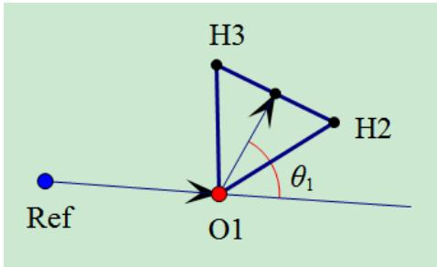

## 3.7.88 gmx spatial

概要

$$
\begin{array} { l l l l l l } { { \mathrm { g m x } } } & { { \mathrm { s p a t i a l } } } & { { \left[ - { \bf s } } & { { \cal L } < . t p r / . ~ g r o / . ~ . ~ . ~ . ~ . ~ . ~ . { \cal J } \right] } } & { { \left[ - { \bf f } . ~ { \cal \Lambda } . ~ a t c / . ~ t r r / . ~ . ~ . ~ . ~ . { \cal J } \right] } } & { { \left[ - { \bf n } . ~ { \cal L } < . n d x > { \cal J } \right] } } \\ { { } } & { { } } & { { \left[ - { \bf b } . ~ < t i m e s \right] } } & { { \left[ - { \bf e } . ~ < t i m e s \right] } } & { { \left[ - \operatorname { d t } ~ < t i m e s \right] } } & { { \left[ - \left[ { \bf n o } \right] { \bf w } \right] } } & { { \left[ - \left[ { \bf n o } \right] { \bf p b c } \right] } } \\ { { } } & { { } } & { { \left[ - \left[ { \bf n o } \right] \operatorname { d i v } \right] } } & { { \left[ - \mathrm { i g n } ~ < i n t > \right] } } & { { \left[ - \mathrm { b i n } ~ < r e a l > \right] } } & { { \left[ - \mathrm { n a b } ~ < i n t > \right] } } \end{array}
$$

## 说明

gmx spatial 用于计算空间分布函数（SDF），其输出文件为 Gaussian98 cube 格式，可使用 VMD 读取。对于含有 32,000 个原子和运行了 50 ns 的轨迹，计算 SDF 大约需要 30 分钟，其中大部分时间都用于运行两次 trjconv，因为需要使用它对系统进行正确的居中。计算时也需要很多空间（会产生轨迹文件的 3 个副本）。尽管如此，如果使用了正确的叠合选区，得到的结果非常漂亮，且含有丰富信息。程序可以处理运动范围很广的组中的 3-4 个原子（如溶液中的游离氨基酸），也可以选择稳定折叠结构的蛋白质骨架，计算溶剂分子的 SDF，得到时间平均的溶剂化壳层。这个程序也可用于计算任意笛卡尔坐标的 SDF。为此，只要忽略前面的 $g m x \ t r j c o n v _ { \scriptscriptstyle { \Theta , 1 9 1 } }$ 步骤即可。

使用方法：为得到有意义的 SDF，整个轨迹中溶质分子必须在盒子内居中，并去除其平动和转动。也就是说，统计周围分子的 SDF 时必须基于相对固定的参考坐标系。为此，可能需要使用 gmx trjconv 对轨迹进行多次处理。此外，可能还需要定义特殊的分析组，并使用 -n 选项传递给 gmx trjconv。

1. 使用 $g m x \ m a k e \_ n d x _ { \scriptscriptstyle { \mathrm { Q 1 2 6 } } }$ 创建两个组，一个包含中心分子，一个包含要统计 SDF 的原子

2. 使中心分子在盒子内居中，同时所有其他分子处于盒子内 gmx trjconv -s a.tpr -f a.tng -ob.tng -boxcenter tric -ur compact -pbc none

3. gmx trjconv -s a.tpr -f b.tng -o c.tng -fit rot+trans

4. 使用第三步得到的输出文件 c.tng 运行 gmx spatial

5. 使用 VMD 或其他软件载入得到的 grid.cube 文件，以等值面模式查看结果。

注意，对一些系统，如胶束系统，在步骤 1 和步骤 2 之间可能还需要运行 $\mathtt { g m x \ t r j c o n v \_ p b c \ c l u s t e r _ { 0 } }$

## 警告

生成的 SDF cube 文件中包含了具有非零占据的所有分格。但是，前面的 $g m x \ t r j c o n v _ { \scriptscriptstyle { \Theta , 1 9 1 } }$ 使用了 -fitrot+trans 选项，意味着系统将会在空间中进行旋转和平移（所选的组不会）。因此，返回值只在所选中心组/坐标周围的一定区域内有意义，在整个轨迹中，这些区域与平移/旋转后的系统之间存在完全重叠。请确保能满足这一条件。

## 激进选项

为减少计算所需的空间和时间，可以只输出运行gmx trjconv↪191 所需的坐标。但是，请确保 -nab 选项的指定值足够高，因为程序会根据初始坐标和 -nab 选项的值分配立方体分格所需的内存。

## 选项

输入文件选项
<table><tr><td rowspan=1 colspan=1>选项</td><td rowspan=1 colspan=1>默认文件</td><td rowspan=1 colspan=1>类型</td><td rowspan=1 colspan=1>说明</td></tr><tr><td rowspan=1 colspan=1>-s [&lt;.tpr/.gro/…&gt;]</td><td rowspan=1 colspan=1>topol.tpr</td><td rowspan=1 colspan=1>可选</td><td rowspan=1 colspan=1>结构+质量（db）：tpr→460，gr0ω→452，g96452， pdb→456，brk，ent</td></tr><tr><td rowspan=1 colspan=1>-f [&lt;.xtc/.trr/·…&gt;]</td><td rowspan=1 colspan=1>traj.xtc</td><td rowspan=1 colspan=1>可选</td><td rowspan=1 colspan=1>轨迹文件：xtCc→462，trr+461，cptc+450，gr0→452， g96452， pdb→456，tng458</td></tr><tr><td rowspan=1 colspan=1>-n [&lt;.ndx&gt;]</td><td rowspan=1 colspan=1>index.ndx</td><td rowspan=1 colspan=1>可选</td><td rowspan=1 colspan=1>索引文件</td></tr></table>

控制选项
<table><tr><td rowspan=1 colspan=1>选项</td><td rowspan=1 colspan=1>默认值</td><td rowspan=1 colspan=1>说明</td></tr><tr><td rowspan=1 colspan=1>-b &lt;time&gt;</td><td rowspan=1 colspan=1>0</td><td rowspan=1 colspan=1>读入轨迹第一帧的时间，即分析的起始时间（默认单位 ps）</td></tr><tr><td rowspan=1 colspan=1>-e &lt;time&gt;</td><td rowspan=1 colspan=1>0</td><td rowspan=1 colspan=1>读入轨迹最后一帧的时间，即分析的结束时间（默认单位 ps）</td></tr><tr><td rowspan=1 colspan=1>-dt &lt;time&gt;</td><td rowspan=1 colspan=1>0</td><td rowspan=1 colspan=1>只使用时刻 t 除以 dt 的余数等于第一帧时间的帧，即分析时两帧之间的时间间隔（默认单位 ps）</td></tr><tr><td rowspan=1 colspan=1>-[no]w</td><td rowspan=1 colspan=1>no</td><td rowspan=1 colspan=1>查看输出的.xvg→464，.xpm→461，.eps→451 和.pdb→456 文件</td></tr><tr><td rowspan=1 colspan=1>-[no]pbc</td><td rowspan=1 colspan=1>no</td><td rowspan=1 colspan=1>计算距离时使用周期性边界条件</td></tr><tr><td rowspan=1 colspan=1>-[no]div</td><td rowspan=1 colspan=1>yes</td><td rowspan=1 colspan=1>根据原子/最小立方体尺寸计算并应用分格占据的因子。指定用于可视化，不指定（-nodiv）可得到每帧的准确计数</td></tr><tr><td rowspan=1 colspan=1>-ign &lt;int&gt;</td><td rowspan=1 colspan=1>-1</td><td rowspan=1 colspan=1>不显示的外部立方体的数目（正值可能会减少边界斑点；-1可保证保外部表面可见）</td></tr><tr><td rowspan=1 colspan=1>-bin &lt;real&gt;</td><td rowspan=1 colspan=1>0.05</td><td rowspan=1 colspan=1>分格宽度（单位：nm）</td></tr><tr><td rowspan=1 colspan=1>-nab &lt;int&gt;</td><td rowspan=1 colspan=1>4</td><td rowspan=1 colspan=1>附加的分格数目，用于保证分配的内存足够大</td></tr></table>

## 已知问题

• 当分配的内存不足时，可能会出现段错误。程序通常会检测这一错误，并在出错前终止，同时给出警告消息，建议使用 -nab 选项（附加分格数）。但是，程序并不能检测到所有此类事件。如果遇到段错误，请试着增加 -nab 值再次运行程序。

• 如果得到的 SDF 等值面不够光滑，请增加轨迹的帧数，并检查 -bin 的指定值时是否合适。

• 此程序计算 SDF 的方式不够高效。如果体系含有多个中心分子类型，则每帧可使用每个中心分子进行居中，得到更多的统计结果。

## 3.7.89 gmx spol

概要

$$
\begin{array} { l } { \mathrm { g m ~ s p o l ~ \delta [ - f ~ } [ < . \boldsymbol { x } t c / , t r r / , . . . > ] ] \quad [ - s } \\ { \ [ - \circ \textit { \textbf { [ < . } x u g > J ] } \ [ - \flat \ < t i m e > ] \quad [ - \circ \textit { \textbf { < t i m e > J } } \ [ - \flat \ < t . n d x > J ] } \\ { \ [ - \flat \ < . \boldsymbol { x } \mathscr { u g } > J ] \quad [ - \flat \ < t i m e > ] \quad [ - \circ \textit { \textbf { < t i m e > J } } \ [ - \boldsymbol { \mathrm { d t } } \ < t . \textit { \textbf { < t i m e > J } } \ [ - [ \mathrm { n o } ] \ \mathrm { w } ] ] } \end{array}
$$

[-xvg <enum>] [-[no]com] [-refat <int>] [-rmin <real>]   
[-rmax <real>] [-dip <real>] [-bw <real>]

## 说明

gmx spol 用于分析溶质分子周围的偶极，特别适用于极化水模型。程序计算时需要一组参考原子或参考质心（-com 选项），以及一组溶剂原子。程序会先将溶剂原子组划分为分子。然后确定每一溶剂分子到参考组原子或其质心的最近距离。并给出这些距离的累积分布。对处于 -rmin 和 -rmax 之间的每一距离，程序会计算距离向量与溶剂分子偶极的内积。对于带有净电荷的溶剂分子（离子），程序会从每一所选离子的所有原子中均匀地减去离子的净电荷。程序会输出这些偶极分量的平均值。对极化的处理类似，并会从瞬时偶极中减去平均偶极。平均偶极的大小由 -dip 选项指定，方向由所选溶剂组中的第一个原子到第二个和第三个原子连线中点的向量定义。

## 选项

输入文件选项
<table><tr><td rowspan=1 colspan=1>选项</td><td rowspan=1 colspan=1>默认文件</td><td rowspan=1 colspan=1>类型</td><td rowspan=1 colspan=1>说明</td></tr><tr><td rowspan=1 colspan=1>-f [&lt;.xtc/.trr/·…&gt;]</td><td rowspan=1 colspan=1>traj.xtc</td><td rowspan=1 colspan=1>可选</td><td rowspan=1 colspan=1>轨迹文件：xtc→462，ttrr+461，cptc+450,gr0ω452，g964452，1pdbc+456， tng→458</td></tr><tr><td rowspan=1 colspan=1>-s [&lt;.tpr&gt;]</td><td rowspan=1 colspan=1>topol.tpr</td><td rowspan=1 colspan=1>可选</td><td rowspan=1 colspan=1>便携式 xdr 运行输入文件</td></tr><tr><td rowspan=1 colspan=1>-n [&lt;.ndx&gt;]</td><td rowspan=1 colspan=1>index.ndx</td><td rowspan=1 colspan=1>可选</td><td rowspan=1 colspan=1>索引文件</td></tr></table>

输出文件选项
<table><tr><td rowspan=1 colspan=1>选项</td><td rowspan=1 colspan=1>默认文件</td><td rowspan=1 colspan=1>类型</td><td rowspan=2 colspan=1>说明xvgr/xmgr 文件</td></tr><tr><td rowspan=1 colspan=1>-0 [&lt;.xvg&gt;]</td><td rowspan=1 colspan=1>scdist.xvg</td><td rowspan=1 colspan=1>可选</td></tr></table>

控制选项
<table><tr><td rowspan=1 colspan=1>选项</td><td rowspan=1 colspan=1>默认值</td><td rowspan=1 colspan=1>说明</td></tr><tr><td rowspan=1 colspan=1>-b &lt;time&gt;</td><td rowspan=1 colspan=1>0</td><td rowspan=1 colspan=1>读入轨迹第一帧的时间，即分析的起始时间（默认单位 ps）</td></tr><tr><td rowspan=1 colspan=1>-e &lt;time&gt;</td><td rowspan=1 colspan=1>0</td><td rowspan=1 colspan=1>读入轨迹最后一帧的时间，即分析的结束时间（默认单位 ps）</td></tr><tr><td rowspan=1 colspan=1>-dt &lt;time&gt;</td><td rowspan=1 colspan=1>0</td><td rowspan=1 colspan=1>只使用时刻 t 除以 dt 的余数等于第一帧时间的帧，即分析时两帧之间的时间间隔（默认单位 ps）</td></tr><tr><td rowspan=1 colspan=1>-[no]w</td><td rowspan=1 colspan=1>no</td><td rowspan=1 colspan=1>查看输出的.xvg→464，.xpm→461，.eps△→451 和.pdb→456 文件</td></tr><tr><td rowspan=1 colspan=1>-xvg &lt;enum&gt;</td><td rowspan=1 colspan=1>xmgrace</td><td rowspan=1 colspan=1>xvg 绘图格式：xmgrace，xmgr，none</td></tr><tr><td rowspan=1 colspan=1>-[no]com</td><td rowspan=1 colspan=1>no</td><td rowspan=1 colspan=1>使用质心作为参考位置</td></tr><tr><td rowspan=1 colspan=1>-refat &lt;int&gt;</td><td rowspan=1 colspan=1>1</td><td rowspan=1 colspan=1>溶剂分子的参考原子</td></tr><tr><td rowspan=1 colspan=1>-rmin &lt;real&gt;</td><td rowspan=1 colspan=1>0</td><td rowspan=1 colspan=1>最大距离（单位：nm）</td></tr><tr><td rowspan=1 colspan=1>-rmax &lt;real&gt;</td><td rowspan=1 colspan=1>0.32</td><td rowspan=1 colspan=1>最大距离（单位：nm）</td></tr><tr><td rowspan=1 colspan=1>-dip &lt;real&gt;</td><td rowspan=1 colspan=1>0</td><td rowspan=1 colspan=1>平均偶极（单位：D）</td></tr><tr><td rowspan=1 colspan=1>-bw &lt;real&gt;</td><td rowspan=1 colspan=1>0.01</td><td rowspan=1 colspan=1>分格宽度（单位：nm）</td></tr></table>

## 3.7.90 gmx tcaf

概要

gmx tcaf [-f [<.trr/.cpt/...>]] [-s [<.tpr/.gro/...>]] [-n [<.ndx>]]   
[-ot [<.xvg>]] [-oa [<.xvg>]] [-o [<.xvg>]] [-of [<.xvg>]]   
[-oc [<.xvg>]] [-ov [<.xvg>]] [-b <time>] [-e <time>]   
[-dt <time>] [-[no]w] [-xvg <enum>] [-[no]mol] [-[no]k34]   
[-wt <real>] [-acflen <int>] [-[no]normalize] [-P <enum>]   
[-fitfn <enum>] [-beginfit <real>] [-endfit <real>]

说明

gmx tcaf 用于计算横向电流自相关（TCAF，tranverse current autocorrelation Function）。它们可用于估算剪切粘度 ??。详细信息请参考：Palmer, Phys. Rev. E 49 (1994) pp 359-366。

程序计算横向电流时会使用 k 向量 (1,0,0) 和 (2,0,0)，它们同时也处于 y 和 z 方向；程序也会使用(1,1,0) 和 (1,-1,0) 向量，它们同时也处于另外 2 个平面（这些向量并不独立）; 程序还会使用 (1,1,1) 向量以及其他三个盒子体对角线方向（它们也不独立）。对每个 k 向量，程序会使用正弦和余弦，以及 2个垂直方向上的速度。这样总共有 $1 6 ^ { * } 2 ^ { * } 2 { = } 6 4$ 个横向电流。对每个 k 向量会计算并拟合一次自相关，这就得到了 16 个 TCAF。每个 TCAF 会拟合为 $\mathrm { \Delta f ( t ) = \exp ( - v ) ( \cosh ( W v ) + 1 / W \sinh ( W v ) ) }$ ，其中 $\mathrm { ~ v ~ } =$ -t/(2 tau)， $\mathrm { W = s q r t } ( 1 \textrm { - } 4 \tan \mathrm { \ e t a / r h o \ k \hat { \Sigma } ^ { 2 } } )$ ，这样得到了 16 个 tau 和 eta 值。拟合权重随时间指数衰减 $\exp ( - \mathrm { t } / \mathrm { w } )$ ，时间常数为 w(-wt 选项指定)，计算 TCAF 与拟合的时间为 $5 ^ { * } \mathrm { w }$ 。?? 的值应该拟合为$\mathrm { 1 - e t a ( k ) k \hat { \Omega } 2 }$ ，从中就可以估算出 k=0 时的剪切粘度。

当选用立方体盒子时，可以指定 -oc 选项，这样 TCAF 可以对所有长度相同的 k 向量进行平均。得到的 TCAF 也更准确。立方 TCAF 和拟合结果都会输出到 -oc 指定的文件，立方 eta 估计值会输出到-ov 指定的文件。

如果指定了 -mol 选项，程序会根据分子而不是原子来计算横向电流。在这种情况下，索引组应该由分子编号而不是原子编号组成。

要获得无限波长时的粘度，-ov 指定的文件中依赖于 k 的粘度应根据 $\mathrm { \ e t a ( k ) = \ e t a \_ 0 \ ( 1 - a \ k \hat { \Omega } 2 ) }$ 进行拟合。

注意：请确保坐标和速度的输出频率足够高。自相关函数起始的非指数部分对于得到好的拟合结果非常重要。

选项

输入文件选项
<table><tr><td rowspan=1 colspan=1>选项</td><td rowspan=1 colspan=1>默认文件</td><td rowspan=1 colspan=1>类型</td><td rowspan=1 colspan=1>说明</td></tr><tr><td rowspan=1 colspan=1>-f [&lt;.trr/.cpt/·…&gt;]</td><td rowspan=1 colspan=1>traj.trr</td><td rowspan=1 colspan=1>可选</td><td rowspan=1 colspan=1>全精度轨迹文件： $t r r _ { \scriptscriptstyle { \Theta 4 6 1 } } , ~ c p t _ { \scriptscriptstyle { \Theta 4 5 0 } } , ~ t n g _ { \scriptscriptstyle { \Theta 4 5 8 } }$ </td></tr><tr><td rowspan=1 colspan=1> $^ { - } \mathrm { s } [ < . \pm \mathrm { p } x / . \mathrm { g } \mathrm { r } \mathrm { o } / \cdots > ]$ </td><td rowspan=1 colspan=1>topol.tpr</td><td rowspan=1 colspan=1>可选</td><td rowspan=1 colspan=1>结构+质量（db）：tprc→460，gr0c→452，g96$452，pdbc+456,brk,ent</td></tr><tr><td rowspan=1 colspan=1>-n [&lt;.ndx&gt;]</td><td rowspan=1 colspan=1>index.ndx</td><td rowspan=1 colspan=1>可选</td><td rowspan=1 colspan=1>索引文件</td></tr></table>

输出文件选项
<table><tr><td colspan="1" rowspan="1">选项</td><td colspan="1" rowspan="1">默认文件</td><td colspan="1" rowspan="1">类型</td><td colspan="1" rowspan="1">说明</td></tr><tr><td colspan="1" rowspan="1">-ot [&lt;.xvg&gt;]</td><td colspan="1" rowspan="1">transcur.xvg</td><td colspan="1" rowspan="1">可选</td><td colspan="1" rowspan="1">xvgr/xmgr 文件</td></tr><tr><td colspan="1" rowspan="1">-oa [&lt;.xvg&gt;]</td><td colspan="1" rowspan="1">tcaf_all.xvg</td><td colspan="1" rowspan="1">可选</td><td colspan="1" rowspan="1">xvgr/xmgr 文件</td></tr><tr><td colspan="1" rowspan="1">-0 [&lt;.xvg&gt;]</td><td colspan="1" rowspan="1">tcaf.xvg</td><td colspan="1" rowspan="1">可选</td><td colspan="1" rowspan="1">xvgr/xmgr 文件</td></tr><tr><td colspan="1" rowspan="1">-of [&lt;.xvg&gt;]</td><td colspan="1" rowspan="1">tcaf_fit.xvg</td><td colspan="1" rowspan="1">可选</td><td colspan="1" rowspan="1">xvgr/xmgr 文件</td></tr><tr><td colspan="1" rowspan="1">-oc [&lt;.xvg&gt;]</td><td colspan="1" rowspan="1">tcaf_cub.xvg</td><td colspan="1" rowspan="1">可选</td><td colspan="1" rowspan="1">xvgr/xmgr 文件</td></tr><tr><td colspan="1" rowspan="1">-ov [&lt;.xvg&gt;]</td><td colspan="1" rowspan="1">visc_k.xvg</td><td colspan="1" rowspan="1">可选</td><td colspan="1" rowspan="1">xvgr/xmgr 文件</td></tr></table>

控制选项
<table><tr><td rowspan=1 colspan=1>选项</td><td rowspan=1 colspan=1>默认值</td><td rowspan=1 colspan=1>说明</td></tr><tr><td rowspan=1 colspan=1>-b &lt;time&gt;</td><td rowspan=1 colspan=1>0</td><td rowspan=1 colspan=1>读入轨迹第一帧的时间，即分析的起始时间（默认单位 ps）</td></tr><tr><td rowspan=1 colspan=1>-e &lt;time&gt;</td><td rowspan=1 colspan=1>0</td><td rowspan=1 colspan=1>读入轨迹最后一帧的时间，即分析的结束时间（默认单位ps)</td></tr><tr><td rowspan=1 colspan=1>-dt &lt;time&gt;</td><td rowspan=1 colspan=1>0</td><td rowspan=1 colspan=1>只使用时刻 t 除以 dt 的余数等于第一帧时间的帧，即分析时两帧之间的时间间隔（默认单位 ps）</td></tr><tr><td rowspan=1 colspan=1>-[no] w</td><td rowspan=1 colspan=1>no</td><td rowspan=1 colspan=1>查看输出的.xvg464，.xpm→461，.epS→451 和.pdb→456文件</td></tr><tr><td rowspan=1 colspan=1>-xvg &lt;enum&gt;</td><td rowspan=1 colspan=1>xmgrace</td><td rowspan=1 colspan=1>xvg 绘图格式：xmgrace，xmgr，none</td></tr><tr><td rowspan=1 colspan=1>-[no]mol</td><td rowspan=1 colspan=1>no</td><td rowspan=1 colspan=1>计算分子的 TCAF</td></tr><tr><td rowspan=1 colspan=1>-[no]k34</td><td rowspan=1 colspan=1>no</td><td rowspan=1 colspan=1>也使用 k=(3,0,0)和 k=(4,0,0)</td></tr><tr><td rowspan=1 colspan=1>-wt &lt;real&gt;</td><td rowspan=1 colspan=1>5</td><td rowspan=1 colspan=1>TCAF 拟合权重的指数衰减时间</td></tr><tr><td rowspan=1 colspan=1>-acflen &lt;int&gt;</td><td rowspan=1 colspan=1>-1</td><td rowspan=1 colspan=1>ACF 的长度，默认为帧数的一半</td></tr><tr><td rowspan=1 colspan=1>-[no]normalize</td><td rowspan=1 colspan=1>yes</td><td rowspan=1 colspan=1>归一化 ACF</td></tr><tr><td rowspan=1 colspan=1>-P &lt;enum&gt;</td><td rowspan=1 colspan=1>0</td><td rowspan=1 colspan=1>用于ACF的 Legendre 多项式的阶数（Ｏ表示不使用）：0，1，2,3</td></tr><tr><td rowspan=1 colspan=1>-fitfn &lt;enum&gt;</td><td rowspan=1 colspan=1>none</td><td rowspan=1 colspan=1>拟合函数类型：none，exp，aexp，exp_exp，exp5，exp7,exp9</td></tr><tr><td rowspan=1 colspan=1>-beginfit &lt;real&gt;</td><td rowspan=1 colspan=1>0</td><td rowspan=1 colspan=1>对相关函数进行指数拟合的起始时间</td></tr><tr><td rowspan=1 colspan=1>-endfit &lt;real&gt;</td><td rowspan=1 colspan=1>-1</td><td rowspan=1 colspan=1>对相关函数进行指数拟合的终止时间，-1表示直到结束</td></tr></table>

## 3.7.91 gmx traj

概要

gmx traj [-f [<.xtc/.trr/...>]] [-s [<.tpr/.gro/...>]] [-n [<.ndx>]]   
[-ox [<.xvg>]] [-oxt [<.xtc/.trr/...>]] [-ov [<.xvg>]]   
[-of [<.xvg>]] [-ob [<.xvg>]] [-ot [<.xvg>]] [-ekt [<.xvg>]]   
[-ekr [<.xvg>]] [-vd [<.xvg>]] [-cv [<.pdb>]] [-cf [<.pdb>]]   
[-av [<.xvg>]] [-af [<.xvg>]] [-b <time>] [-e <time>]   
[-dt <time>] [-tu <enum>] [-[no]w] [-xvg <enum>] [-[no]com]   
[-[no]pbc] [-[no]mol] [-[no]nojump] [-[no]x] [-[no]y]   
[-[no]z] [-ng <int>] [-[no]len] [-[no]fp] [-bin <real>]   
[-ctime <real>] [-scale <real>]

## 说明

gmx traj 用于输出坐标，速度，力和/或盒子。使用 -com 选项可以计算各个组质心的坐标，速度和力。如果指定了 -mol 选项，程序会将索引文件中的数字视为分子编号，并对每个分子使用与 -com 选项相同的过程。

如果轨迹文件中存在速度信息，使用 -ot 选项可以输出每个组的温度。注意，计算时没有对约束自由度进行修正! 此选项暗含了 -com 选项。

如果轨迹文件中存在速度信息，指定了 -ekt 和 -ekr 选项可以输出每个组的平动能和转动能。此选项暗含了 -com 选项。

使用 -cv 和 -cf 选项可以将平均速度和平均力作为温度因子输出到一个. $. p d b _ { \scriptscriptstyle \mathrm { Q 4 5 6 } }$ 文件，其中的坐标为平均坐标或 -ctime 时刻的坐标。程序会对温度因子进行缩放，使其最大值为 10。也可以使用 -scale 选项更改缩放比例。要得到某一帧的速度或力，可以将 -b 和 -e 选项都指定为所需帧的时间值。当对帧进行平均时，可能需要使用 -nojump 选项来得到正确的平均坐标。如果选择了这些选项中的任何一个，程序会将每个原子的平均力和平均速度输出到一个 $. { \it x v g } _ { \mathrm { \tiny ( 4 6 4 } }$ 文件（由 -av 或 -af 选项指定）。

使用 -vd 选项可以计算速度分布，即输出速度大小的分布。此外，文件中还会同时给出动能的分布。

关于如何输出选区的类似数据，请参阅gmx trajectory↪188。

## 选项

输入文件选项
<table><tr><td rowspan=1 colspan=1>选项</td><td rowspan=1 colspan=1>默认文件</td><td rowspan=1 colspan=1>类型</td><td rowspan=1 colspan=1>说明</td></tr><tr><td rowspan=1 colspan=1>-f [&lt;.xtc/.trr/·…&gt;]</td><td rowspan=1 colspan=1>traj.xtc</td><td rowspan=1 colspan=1>可选</td><td rowspan=1 colspan=1>轨迹文件： $x t c _ { \scriptscriptstyle { + 4 6 2 } } , t r r _ { \scriptscriptstyle { \Theta 4 6 1 } } , c p t _ { \scriptscriptstyle { \Theta 4 5 0 } } ,$  $g r o _ { \scriptscriptstyle {  } \scriptscriptstyle { 4 } 5 2 } , g 9 6 _ { \scriptscriptstyle {  } \scriptscriptstyle { 4 } 5 2 } , p d b _ { \scriptscriptstyle {  } \scriptscriptstyle { 4 } 5 6 } , t n g _ { \scriptscriptstyle {  } \scriptscriptstyle { 4 } 5 8 }$ </td></tr><tr><td rowspan=1 colspan=1>-s [&lt;.tpr/.gro/…&gt;]</td><td rowspan=1 colspan=1>topol.tpr</td><td rowspan=1 colspan=1>可选</td><td rowspan=1 colspan=1>结构+质量（db）: $t p r _ { \scriptscriptstyle { \hookrightarrow } 4 6 0 } ,$ gr0ω452, $g 9 6 _ { \hookrightarrow 4 5 2 }$    $p d b _ { \scriptscriptstyle { \hookrightarrow } 4 5 6 } ,$  brk, ent</td></tr><tr><td rowspan=1 colspan=1>-n [&lt;.ndx&gt;]</td><td rowspan=1 colspan=1>index.ndx</td><td rowspan=1 colspan=1>可选</td><td rowspan=1 colspan=1>索引文件</td></tr></table>

输出文件选项
<table><tr><td colspan="1" rowspan="1">选项</td><td colspan="1" rowspan="1">默认文件</td><td colspan="1" rowspan="1">类型</td><td colspan="1" rowspan="1">说明</td></tr><tr><td colspan="1" rowspan="1">-0x [&lt;.xvg&gt;]</td><td colspan="1" rowspan="1">coord.xvg</td><td colspan="1" rowspan="1">可选</td><td colspan="1" rowspan="1">xvgr/xmgr 文件</td></tr><tr><td colspan="1" rowspan="1">-oxt [&lt;.xtc/.trr/…&gt;]</td><td colspan="1" rowspan="1">coord.xtc</td><td colspan="1" rowspan="1">可选</td><td colspan="1" rowspan="1">轨迹文件： $x t c _ { \scriptscriptstyle { \mathrm { \tiny 4 6 2 } } } , t r r _ { \scriptscriptstyle { \mathrm { \tiny 4 6 1 } } } ,$  $c p t _ { \scriptscriptstyle { \infty , 4 5 0 } } , g r o _ { \scriptscriptstyle { \odot , 4 5 2 } } , g 9 6 _ { \scriptscriptstyle { \odot 4 5 2 } } , p d b _ { \scriptscriptstyle { \odot 4 5 6 } } ,$  $t n g _ { \scriptscriptstyle \odot 4 5 8 }$ </td></tr><tr><td colspan="1" rowspan="1">-ov [&lt;.xvg&gt;]</td><td colspan="1" rowspan="1">veloc.xvg</td><td colspan="1" rowspan="1">可选</td><td colspan="1" rowspan="1">xvgr/xmgr 文件</td></tr><tr><td colspan="1" rowspan="1">-of [&lt;.xvg&gt;]</td><td colspan="1" rowspan="1">force.xvg</td><td colspan="1" rowspan="1">可选</td><td colspan="1" rowspan="1">xvgr/xmgr 文件</td></tr><tr><td colspan="1" rowspan="1">-ob [&lt;.xvg&gt;]</td><td colspan="1" rowspan="1">box.xvg</td><td colspan="1" rowspan="1">可选</td><td colspan="1" rowspan="1">xvgr/xmgr 文件</td></tr><tr><td colspan="1" rowspan="1">-ot [&lt;.xvg&gt;]</td><td colspan="1" rowspan="1">temp.xvg</td><td colspan="1" rowspan="1">可选</td><td colspan="1" rowspan="1">xvgr/xmgr 文件</td></tr><tr><td colspan="1" rowspan="1">-ekt [&lt;.xvg&gt;]</td><td colspan="1" rowspan="1">ektrans.xvg</td><td colspan="1" rowspan="1">可选</td><td colspan="1" rowspan="1">xvgr/xmgr 文件</td></tr><tr><td colspan="1" rowspan="1">-ekr [&lt;.xvg&gt;]</td><td colspan="1" rowspan="1">ekrot.xvg</td><td colspan="1" rowspan="1">可选</td><td colspan="1" rowspan="1">xvgr/xmgr 文件</td></tr><tr><td colspan="1" rowspan="1">-vd [&lt;.xvg&gt;]</td><td colspan="1" rowspan="1">veldist.xvg</td><td colspan="1" rowspan="1">可选</td><td colspan="1" rowspan="1">xvgr/xmgr 文件</td></tr><tr><td colspan="1" rowspan="1">-cv [&lt;.pdb&gt;]</td><td colspan="1" rowspan="1">veloc.pdb</td><td colspan="1" rowspan="1">可选</td><td colspan="1" rowspan="1">蛋白质数据库文件</td></tr><tr><td colspan="1" rowspan="1">-cf [&lt;.pdb&gt;]</td><td colspan="1" rowspan="1">force.pdb</td><td colspan="1" rowspan="1">可选</td><td colspan="1" rowspan="1">蛋白质数据库文件</td></tr><tr><td colspan="1" rowspan="1">-av [&lt;.xvg&gt;]</td><td colspan="1" rowspan="1">all_veloc.xvg</td><td colspan="1" rowspan="1">可选</td><td colspan="1" rowspan="1">xvgr/xmgr 文件</td></tr><tr><td colspan="1" rowspan="1">-af [&lt;.xvg&gt;]</td><td colspan="1" rowspan="1">all_force.xvg</td><td colspan="1" rowspan="1">可选</td><td colspan="1" rowspan="1">xvgr/xmgr 文件</td></tr></table>

控制选项

<table><tr><td rowspan=1 colspan=1>选项</td><td rowspan=1 colspan=1>默认值</td><td rowspan=1 colspan=1>说明</td></tr><tr><td rowspan=1 colspan=1>-b &lt;time&gt;</td><td rowspan=1 colspan=1>0</td><td rowspan=1 colspan=1>读入轨迹第一帧的时间，即分析的起始时间（默认单位 ps）</td></tr><tr><td rowspan=1 colspan=1>-e &lt;time&gt;</td><td rowspan=1 colspan=1>0</td><td rowspan=1 colspan=1>读入轨迹最后一帧的时间，即分析的结束时间（默认单位 ps）</td></tr><tr><td rowspan=1 colspan=1>-dt &lt;time&gt;</td><td rowspan=1 colspan=1>0</td><td rowspan=1 colspan=1>只使用时刻 t 除以 dt 的余数等于第一帧时间的帧，即分析时两帧之间的时间间隔（默认单位ps）</td></tr><tr><td rowspan=1 colspan=1>-tu &lt;enum&gt;</td><td rowspan=1 colspan=1>PS</td><td rowspan=1 colspan=1>时间的单位：fs，ps，ns，us，ms，s</td></tr><tr><td rowspan=1 colspan=1>-[no]w</td><td rowspan=1 colspan=1>no</td><td rowspan=1 colspan=1>查看输出的.xvg→464，.xpmc→461，.eps→451 和.pdb→456 文件</td></tr><tr><td rowspan=1 colspan=1>-xvg &lt;enum&gt;</td><td rowspan=1 colspan=1>xmgrace</td><td rowspan=1 colspan=1>xvg 绘图格式：xmgrace，xmgr，none</td></tr><tr><td rowspan=1 colspan=1>-[no]com</td><td rowspan=1 colspan=1>no</td><td rowspan=1 colspan=1>输出每组质心的数据</td></tr><tr><td rowspan=1 colspan=1>-[no]pbc</td><td rowspan=1 colspan=1>yes</td><td rowspan=1 colspan=1>根据质心使分子保持完整</td></tr><tr><td rowspan=1 colspan=1>-[no]mol</td><td rowspan=1 colspan=1>no</td><td rowspan=1 colspan=1>索引包含了分子编号而不是原子编号</td></tr><tr><td rowspan=1 colspan=1>- [no]nojump</td><td rowspan=1 colspan=1>no</td><td rowspan=1 colspan=1>移除越过盒子的原子跳跃</td></tr><tr><td rowspan=1 colspan=1>-[no]x</td><td rowspan=1 colspan=1>yes</td><td rowspan=1 colspan=1>输出X分量</td></tr><tr><td rowspan=1 colspan=1>-[no]y</td><td rowspan=1 colspan=1>yes</td><td rowspan=1 colspan=1>输出Y分量</td></tr><tr><td rowspan=1 colspan=1>-[no]z</td><td rowspan=1 colspan=1>yes</td><td rowspan=1 colspan=1>输出Z分量</td></tr><tr><td rowspan=1 colspan=1>-ng &lt;int&gt;</td><td rowspan=1 colspan=1>1</td><td rowspan=1 colspan=1>要考虑的组的个数</td></tr><tr><td rowspan=1 colspan=1>-[no]len</td><td rowspan=1 colspan=1>no</td><td rowspan=1 colspan=1>输出向量长度</td></tr><tr><td rowspan=1 colspan=1>-[no]fp</td><td rowspan=1 colspan=1>no</td><td rowspan=1 colspan=1>全精度输出</td></tr><tr><td rowspan=1 colspan=1>-bin &lt;real&gt;</td><td rowspan=1 colspan=1>1</td><td rowspan=1 colspan=1>速度直方图的分格宽度（单位：nm/ps）</td></tr><tr><td rowspan=1 colspan=1>-ctime &lt;real&gt;</td><td rowspan=1 colspan=1>-1</td><td rowspan=1 colspan=1>输出-cv 和-cf 时使用指定时刻帧的 x，而不是平均的 x</td></tr><tr><td rowspan=1 colspan=1>-scale &lt;real&gt;</td><td rowspan=1 colspan=1>0</td><td rowspan=1 colspan=1>·pdb456 输出的缩放因子，0 表示自动缩放</td></tr></table>

## 3.7.92 gmx trajectory

概要

gmx trajectory [-f [<.xtc/.trr/...>]] [-s [<.tpr/.gro/...>]]   
[-n [<.ndx>]] [-ox [<.xvg>]] [-ov [<.xvg>]]   
[-of [<.xvg>]] [-b <time>] [-e <time>] [-dt <time>]   
[-tu <enum>] [-fgroup <selection>] [-xvg <enum>]   
[-[no]rmpbc] [-[no]pbc] [-sf <file>] [-selrpos <enum>]   
[-seltype <enum>] [-select <selection>] [-[no]x]   
[-[no]y] [-[no]z] [-[no]len]

## 说明

gmx trajectory 用于输出指定选区的坐标，速度和/或力。默认情况下，会输出所需向量的 X，Y 和 Z分量，但指定一个或多个 -len，-x，-y 和 -z 会覆盖默认设置。

对于动态选区，目前会输出选区可能选中的所有位置的对应值。

选项

输入文件选项
<table><tr><td rowspan=1 colspan=1>选项</td><td rowspan=1 colspan=1>默认文件</td><td rowspan=1 colspan=1>类型</td><td rowspan=1 colspan=1>说明</td></tr><tr><td rowspan=1 colspan=1>-f [&lt;.xtc/.trr/…&gt;]</td><td rowspan=1 colspan=1>traj.xtc</td><td rowspan=1 colspan=1>可选</td><td rowspan=1 colspan=1>输入轨迹或单个构型：xtCc→462，trr→461，cptc450，gr0→452，g96+452，pdb→456，tngω458</td></tr><tr><td rowspan=1 colspan=1>-s [&lt;.tpr/.gro/…&gt;]</td><td rowspan=1 colspan=1>topol.tpr</td><td rowspan=1 colspan=1>可选</td><td rowspan=1 colspan=1>输入结构：tpr→460，gr0△→452，g96△→452，pdb456,brk,ent</td></tr><tr><td rowspan=1 colspan=1>-n [&lt;.ndx&gt;]</td><td rowspan=1 colspan=1>index.ndx</td><td rowspan=1 colspan=1>可选</td><td rowspan=1 colspan=1>额外的索引组</td></tr></table>

输出文件选项
<table><tr><td rowspan=1 colspan=1>选项</td><td rowspan=1 colspan=1>默认文件</td><td rowspan=1 colspan=1>类型</td><td rowspan=1 colspan=1>说明</td></tr><tr><td rowspan=1 colspan=1>-ox [&lt;.xvg&gt;]</td><td rowspan=1 colspan=1>coord.xvg</td><td rowspan=1 colspan=1>可选</td><td rowspan=1 colspan=1>每个位置的坐标与时间的函数</td></tr><tr><td rowspan=1 colspan=1>-ov [&lt;.xvg&gt;]</td><td rowspan=1 colspan=1>veloc.xvg</td><td rowspan=1 colspan=1>可选</td><td rowspan=1 colspan=1>每个位置的速度与时间的函数</td></tr><tr><td rowspan=1 colspan=1>-of [&lt;.xvg&gt;]</td><td rowspan=1 colspan=1>force.xvg</td><td rowspan=1 colspan=1>可选</td><td rowspan=1 colspan=1>每个位置的力与时间的函数</td></tr></table>

控制选项
<table><tr><td colspan="1" rowspan="1">选项</td><td colspan="1" rowspan="1">默认值</td><td colspan="1" rowspan="1">说明</td></tr><tr><td colspan="1" rowspan="1">-b &lt;time&gt;</td><td colspan="1" rowspan="1">0</td><td colspan="1" rowspan="1">读入轨迹第一帧的时间，即分析的起始时间（默认单位ps)</td></tr><tr><td colspan="1" rowspan="1">-e &lt;time&gt;</td><td colspan="1" rowspan="1">0</td><td colspan="1" rowspan="1">读入轨迹最后一帧的时间，即分析的终止时间（默认单位ps)</td></tr><tr><td colspan="1" rowspan="1">-dt &lt;time&gt;</td><td colspan="1" rowspan="1">0</td><td colspan="1" rowspan="1">只使用时刻t 除以 dt 的余数等于第一帧时间的帧，即分析时两帧之间的时间间隔（默认单位 ps）</td></tr><tr><td colspan="1" rowspan="1">-tu &lt;enum&gt;</td><td colspan="1" rowspan="1">ps</td><td colspan="1" rowspan="1">时间的单位：fs，ps，ns，us，ms，s</td></tr><tr><td colspan="1" rowspan="1">-fgroup &lt;selection&gt;</td><td colspan="1" rowspan="1"></td><td colspan="1" rowspan="1">轨迹文件中存储的原子（如果未设置，假定为前Ν个原子）</td></tr><tr><td colspan="1" rowspan="1">-xvg &lt;enum&gt;</td><td colspan="1" rowspan="1">xmgrace</td><td colspan="1" rowspan="1">绘图格式：none，xmgrace，xmgr</td></tr><tr><td colspan="1" rowspan="1">-[no]rmpbc</td><td colspan="1" rowspan="1">yes</td><td colspan="1" rowspan="1">对每一帧的分子进行完整化</td></tr><tr><td colspan="1" rowspan="1">-[no]pbc</td><td colspan="1" rowspan="1">yes</td><td colspan="1" rowspan="1">计算距离时使用周期性边界条件</td></tr><tr><td colspan="1" rowspan="1">-sf &lt;file&gt;</td><td colspan="1" rowspan="1"></td><td colspan="1" rowspan="1">使用文件中提供的选区</td></tr><tr><td colspan="1" rowspan="1">-selrpos &lt;enum&gt;</td><td colspan="1" rowspan="1">atom</td><td colspan="1" rowspan="1">选区参考位置：atom，res_com，res_cog，mol_com,mol_cog， whole_res_com， whole_res_cog,whole_mol_com， whole_mol_cog，part_res_com,part_res_cog，part_mol_com，part_mol_cog,dyn_res_com， dyn_res_cog,dyn_mol_com,dyn_mol_cog</td></tr><tr><td colspan="1" rowspan="1">-seltype &lt;enum&gt;</td><td colspan="1" rowspan="1">atom</td><td colspan="1" rowspan="1">默认选区输出位置：atom，res_com，res_cog,mol_com， mol_cog， whole_res_com， whole_res_cog,whole_mol_com，whole_mol_cog，part_res_com,part_res_cog，part_mol_com， part_mol_cog,dyn_res_com， dyn_res_cog，dyn_mol_com,dyn_mol_cog</td></tr><tr><td colspan="1" rowspan="1">-select &lt;selection&gt;</td><td colspan="1" rowspan="1"></td><td colspan="1" rowspan="1">要分析的选区</td></tr><tr><td colspan="1" rowspan="1">-[no]x</td><td colspan="1" rowspan="1">yes</td><td colspan="1" rowspan="1">输出X分量</td></tr><tr><td colspan="1" rowspan="1">-[no]y</td><td colspan="1" rowspan="1">yes</td><td colspan="1" rowspan="1">输出Y分量</td></tr><tr><td colspan="1" rowspan="1">-[no]z</td><td colspan="1" rowspan="1">yes</td><td colspan="1" rowspan="1">输出乙分量</td></tr><tr><td colspan="1" rowspan="1">-[no]len</td><td colspan="1" rowspan="1">no</td><td colspan="1" rowspan="1">输出向量长度</td></tr></table>

## 3.7.93 gmx trjcat

概要

gmx trjcat [-f [<.xtc/.trr/...> [...]]] [-n [<.ndx>]] [-demux [<.xvg>]]   
[-o [<.xtc/.trr/...> [...]]] [-tu <enum>] [-xvg <enum>]   
[-b <time>] [-e <time>] [-dt <time>] [-[no]settime]   
[-[no]sort] [-[no]keeplast] [-[no]overwrite] [-[no]cat]

说明

gmx trjcat 用于按顺序将几个输入轨迹文件合并在一起。如果同一时刻的轨迹超过一帧，会使用后一文件中的那帧。可以使用 -settime 选项指定每个文件的起始时间。输入文件来自命令行，这样你可以使用像 gmx trjcat -f \*.trr -o fixed.trr 这样的技巧。使用 -cat 选项可以将几个文件简单的粘贴在一起，而不会删除具有相同时间戳的帧。

如果指定的输出文件为输入文件中的一个，需要特别注意一点。在这种情况下，输出会追加到那个特定的输入文件，这样就不需要存储双倍的数据。显然，要追加的文件必须是起始时间最小的文件，因为输出只能追加到文件末尾。

如果指定 -demux 选项，会读取 N 条轨迹，并将它们按照. $. x v g _ { \scriptscriptstyle \to 4 6 4 }$ 文件中指定的顺序输出到另外一个文件中。此选项适用于副本交换动力学模拟。 $. x v g _ { \scriptscriptstyle \to 4 6 4 }$ 文件的内容类似如下：

<table><tr><td>00 １23 4 5</td><td></td><td></td><td></td><td></td><td></td></tr><tr><td>2 1 0 2 3 5 4</td><td></td><td></td><td></td><td></td><td></td></tr></table>

第一个数字为时间，接下来的数字为轨迹编号。程序会收集与第一行数字对应的帧并输出到输出轨迹中。  
如果轨迹中的帧数与. $. { \it x v g } _ {  4 6 4 }$ 文件中的不匹配，程序会自动决定如何处理。使用此选项时要小心。

选项

输入文件选项
<table><tr><td colspan="1" rowspan="1">选项</td><td colspan="1" rowspan="1">默认文件</td><td colspan="1" rowspan="1">类型</td><td colspan="1" rowspan="1">说明</td></tr><tr><td colspan="1" rowspan="1">-f [&lt;.xtc/.trr/·…&gt;[…]]</td><td colspan="1" rowspan="1">traj.xtc</td><td colspan="1" rowspan="1">可选</td><td colspan="1" rowspan="1">轨迹文件： $x t c _ { \scriptscriptstyle { + 4 6 2 } } , t r r _ { \scriptscriptstyle { \Theta 4 6 1 } } , c p t _ { \scriptscriptstyle { \Theta 4 5 0 } } ,$ gr0+452，g96c+452，pdb+456，tng+458</td></tr><tr><td colspan="1" rowspan="1">-n [&lt;.ndx&gt;]</td><td colspan="1" rowspan="1">index.ndx</td><td colspan="1" rowspan="1">可选</td><td colspan="1" rowspan="1">索引文件</td></tr><tr><td colspan="1" rowspan="1">-demux [&lt;.xvg&gt;]</td><td colspan="1" rowspan="1">remd.xvg</td><td colspan="1" rowspan="1">可选</td><td colspan="1" rowspan="1">xvgr/xmgr 文件</td></tr></table>

输出文件选项
<table><tr><td rowspan=1 colspan=1>选项</td><td rowspan=1 colspan=1>默认文件</td><td rowspan=1 colspan=1>类型</td><td rowspan=1 colspan=1>说明</td></tr><tr><td rowspan=1 colspan=1>-0 [&lt;.xtc/.trr/·…&gt;[…]]</td><td rowspan=1 colspan=1>trajout.xtc</td><td rowspan=1 colspan=1>可选</td><td rowspan=1 colspan=1>轨迹：xtc→462，trr→461，gr0ω+452，g96c452，pdb.456， tng→458</td></tr></table>

控制选项
<table><tr><td rowspan=1 colspan=1>选项</td><td rowspan=1 colspan=1>默认值</td><td rowspan=1 colspan=1>说明</td></tr><tr><td rowspan=1 colspan=1>-tu &lt;enum&gt;</td><td rowspan=1 colspan=1>ps</td><td rowspan=1 colspan=1>时间的单位：fs，ps，ns，us，ms，s</td></tr><tr><td rowspan=1 colspan=1>-xvg &lt;enum&gt;</td><td rowspan=1 colspan=1>xmgrace</td><td rowspan=1 colspan=1>xvg 绘图格式：xmgrace，xmgr，none</td></tr><tr><td rowspan=1 colspan=1>-b &lt;time&gt;</td><td rowspan=1 colspan=1>-1</td><td rowspan=1 colspan=1>读入第一帧的时间，即起始时间（单位：Ps）</td></tr><tr><td rowspan=1 colspan=1>-e &lt;time&gt;</td><td rowspan=1 colspan=1>-1</td><td rowspan=1 colspan=1>读入最后一帧的时间，即结束时间（单位：ps）</td></tr><tr><td rowspan=1 colspan=1>-dt &lt;time&gt;</td><td rowspan=1 colspan=1>0</td><td rowspan=1 colspan=1>只输出时刻t 除以 dt 的余数等于第一帧时间的帧，即两帧之间的时间间隔（单位：Ps）</td></tr><tr><td rowspan=1 colspan=1>-[no]settime</td><td rowspan=1 colspan=1>no</td><td rowspan=1 colspan=1>交互地设定每一输入文件在新输出文件中的起始时间</td></tr><tr><td rowspan=1 colspan=1>-[no]sort</td><td rowspan=1 colspan=1>yes</td><td rowspan=1 colspan=1>自动排序输入轨迹文件（而不是帧）</td></tr><tr><td rowspan=1 colspan=1>- [no]keeplast</td><td rowspan=1 colspan=1>no</td><td rowspan=1 colspan=1>将重叠帧输出到轨迹的末尾</td></tr><tr><td rowspan=1 colspan=1>-[no]overwrite</td><td rowspan=1 colspan=1>no</td><td rowspan=1 colspan=1>追加时覆盖重叠帧</td></tr><tr><td rowspan=1 colspan=1>-[no] cat</td><td rowspan=1 colspan=1>no</td><td rowspan=1 colspan=1>不删除重叠帧</td></tr></table>

## 3.7.94 gmx trjconv

概要

gmx trjconv [-f [<.xtc/.trr/...>]] [-s [<.tpr/.gro/...>]] [-n [<.ndx>]]   
[-fr [<.ndx>]] [-sub [<.ndx>]] [-drop [<.xvg>]]   
[-o [<.xtc/.trr/...>]] [-b <time>] [-e <time>]   
[-tu <enum>] [-[no]w] [-xvg <enum>] [-skip <int>]   
[-dt <time>] [-[no]round] [-dump <time>] [-t0 <time>]   
[-timestep <time>] [-pbc <enum>] [-ur <enum>]   
[-[no]center] [-boxcenter <enum>] [-box <vector>]   
[-trans <vector>] [-shift <vector>] [-fit <enum>]   
[-ndec <int>] [-[no]vel] [-[no]force] [-trunc <time>]   
[-exec <string>] [-split <time>] [-[no]sep]   
[-nzero <int>] [-dropunder <real>] [-dropover <real>]   
[-[no]conect]

说明

gmx trjconv 可使用多种方式转换轨迹文件：

• 从一种格式转换到另一种格式

• 选择一组原子的集合

• 改变系统周期性的表示方式

• 将多聚分子保持在一起

• 将原子在盒子内居中

• 将原子叠合到参考结构

• 减少帧数

• 更改每帧的时间戳（-t0 和 -timestep 选项）

• 根据索引文件中的信息将轨迹切分为小的子轨迹。这样可以对子轨迹进行分析，例如，这些子轨迹可以来自聚类分析的结果。这种情况下需要使用 -sub 选项。处理时假定索引文件中的条目为帧编号，并会把索引文件中的每个组输出到单独的轨迹文件中。

• 选择某个量处于特定范围内的帧，这个量由 $. { \it x v g } _ { \mathrm { < 4 6 4 } }$ 文件给出。

$g m x \ t r j c a t _ { \odot 1 9 0 }$ 更适用于将多个轨迹文件合并起来。

程序支持以下输入和输出格式： $. x t c _ { \scriptscriptstyle { \odot } , \ { 4 6 2 } } , . t r r _ { \scriptscriptstyle { \odot } , \ { 4 6 1 } } , . g r o _ { \scriptscriptstyle { \odot } , \ { 4 5 2 } } , . g 9 6 _ { \scriptscriptstyle { \odot } , \ { 4 5 2 } }$ 和. $. p d b _ { \hookrightarrow 4 5 6 }$ 。文件格式由文件扩展名决定。对. $. x t c _ { \scriptscriptstyle { \cdot \cdot } 4 6 2 } , . g r o _ { \scriptscriptstyle { \cdot \cdot } 4 5 2 }$ 和. $. p d b _ { \scriptscriptstyle \mathrm { Q 4 5 6 } }$ 输入格式， $. x t c _ { \hookrightarrow 4 6 2 }$ 输出文件的精度取决于输入文件；对其他输入格式，输出文件的精度由 -ndec 选项决定。如果指定了 -ndec 选项，输出精度总是由此选项决定。所有其他格式的精度都是固定的 $_ { \mathrm { ~ \scriptsize ~ { ~ 0 ~ } ~ } \cdot } t r r _ { \scriptscriptstyle { \hookrightarrow 4 6 1 } }$ 输出文件可以是单精度或双精度，具体取决于 gmx trjconv 二进制文件的精度。注意，只有. $t r r _ { \scriptscriptstyle { \hookrightarrow 4 6 1 } } , . g r o _ { \scriptscriptstyle { \hookrightarrow 4 5 2 } }$ 和. $g 9 6 _ { \hookrightarrow 4 5 2 }$ 格式的文件支持速度。

使用 -sep 选项可以将每一帧输出到单独的.gro↪452， $g 9 6 _ { \hookrightarrow 4 5 2 }$ 或. $p d b _ { \hookrightarrow 4 5 6 }$ 文件。默认情况下，所有帧都会输出到一个文件中。合并了所有帧的. $. p d b _ { \scriptscriptstyle \mathrm { Q 4 5 6 } }$ 文件可以使用 rasmol -nmrpdb 查看。

为节省磁盘空间，可以选择部分轨迹并将其输出到一个新的轨迹文件中。例如，可以去除蛋白质水溶液轨迹中的水分子。始终要保留原始的轨迹文件! 我们建议使用可移植的. $x t c _ { \hookrightarrow 4 6 2 }$ 格式进行分析，这样可以节省磁盘空间并得到可移植的文件。

有两个选项可用于将轨迹叠合到参考结构，或者用于本性动力学分析等。第一个选项只是简单地叠合到结构文件中的参考结构。第二个选项是逐步叠合：第一时间帧叠合到结构文件中的参考结构，每个后续时间帧叠合到前一步的叠合结构。使用这种方法可以得到连续的轨迹，与使用常规叠合方法时得到的结果不同，例如，当蛋白质的构象转变很大时。

可以使用 -pbc 选项指定周期性边界条件的处理方式：

• mol: 将分子的质心至于盒子内，需要使用 -s 选项指定一个运行输入文件。

• res: 将残基的质心置于盒子内。

• atom: 将所有原子置于盒子内。

• nojump: 检查原子是否穿过了盒子边缘，是的话将它们放回来。这样所有分子都可以保持完整（如果它们在初始构型中是完整的）。注意，这样可以确保轨迹连续，但分子可能扩散出盒子。如果提供了结构文件，此过程的初始构型取自结构文件，否则会使用第一帧的构型。

cluster: 将所选索引中的所有原子团簇化，使其到团簇质心的距离最近，团簇质心会进行迭代更新。注意，实际上只有存在一个团簇时，这种方法才能给出有意义的结果。幸运的是，处理之后可以使用轨迹查看器对此进行检查。另请注意，如果分子破碎了，这个选项也不会起作用。

• whole: 只会将破碎的分子恢复完整。

对 -pbc 的 mol，res 和 atom 选项，可以使用 -ur 选项指定单位晶胞的表示方式。对于三斜盒子这三个选项会给出不同的结果，而对于长方盒子，给出的的结果相同。rect 为普通的长方体形状。tric 为三斜晶胞。compact 将所有原子置于到盒子中心最近的位置。这有利于可视化，例如截角八面体或菱形十二面体。tric 和 compact 选项所用的中心为 tric （见下文），除非使用 -boxcenter 选项指定了其他值。

可以使用 -center 选项将系统在盒子内居中。用户可以指定用于确定几何中心的组。对于 -pbc 和-center 选项，可以使用 -boxcenter 选项指定盒子中心的位置。可用的选项为：tric: 盒向量总和的一半，rect: 盒对角线的一半，zero: 原点。如果需要居中并使所有分子都处于盒子内，可以使用 -center以及 -pbc mol 选项。

可以使用 -box 选项指定新盒子的大小。此选项只适用于主要方向，因此通常只适用于长方盒子。如果只想修改某些方向，例如读取轨迹时，可以使用 -1 将某一方向保持不变。如果只调用一次 gmx trjconv，将 -pbc，-fit，-ur 和 -center 选项组合起来并非总能达到目的。这种情况下可以考虑多次调用，同时参考 GROMACS 网站的一些建议。

使用 -dt 选项可以减少输出中的帧数。这个选项依赖于输入轨迹中时间的准确性，因此如果它们不够准确，可以使用 -timestep 选项来修改时间（可以同时进行）。为制作平滑的动画，可以利用gmx filter↪100程序，它可以在使用低通频率滤波的同时减少帧数，从而降低高频运动的走样。

如果指定了 -trunc 选项，gmx trjconv 可以就地截断.trr↪461 文件，即不会复制文件。当在磁盘 I/O 过程中运行崩溃时（即磁盘已满），或者合并两个连续的轨迹但不能有重复帧时，这个选项可能会用到。

使用 -dump 选项可以从轨迹文件中抽取处于或靠近指定时刻的轨迹帧，但这个选项只有当轨迹帧之间的时间间隔均匀时才能使用。

可以使用 -drop 选项读取一个.xvg↪464 文件中的时间和值。如果指定了 -dropunder 和/或 -dropover选项，程序不会输出低于/高于相应指定值的轨迹帧。

选项

输入文件选项
<table><tr><td rowspan=1 colspan=1>选项</td><td rowspan=1 colspan=1>默认文件</td><td rowspan=1 colspan=1>类型</td><td rowspan=1 colspan=1>说明</td></tr><tr><td rowspan=1 colspan=1>-f [&lt;.xtc/.trr/·…&gt;]</td><td rowspan=1 colspan=1>traj.xtc</td><td rowspan=1 colspan=1>可选</td><td rowspan=1 colspan=1>轨迹文件：xtc→462，trr→461，cptc→450，grO÷452,g96&lt;+452，pdb+456，tng+458</td></tr><tr><td rowspan=1 colspan=1>-s [&lt;.tpr/.gro/…&gt;]</td><td rowspan=1 colspan=1>topol.tpr</td><td rowspan=1 colspan=1>可选</td><td rowspan=1 colspan=1>结构+质量（db）：tpr→460，gr0ω→452，g96→452，pdb+456，brk，ent</td></tr><tr><td rowspan=1 colspan=1>-n [&lt;.ndx&gt;]</td><td rowspan=1 colspan=1>index.ndx</td><td rowspan=1 colspan=1>可选</td><td rowspan=1 colspan=1>索引文件</td></tr><tr><td rowspan=1 colspan=1>-fr [&lt;.ndx&gt;]</td><td rowspan=1 colspan=1>frames.ndx</td><td rowspan=1 colspan=1>可选</td><td rowspan=1 colspan=1>索引文件</td></tr><tr><td rowspan=1 colspan=1>-sub [&lt;.ndx&gt;]</td><td rowspan=1 colspan=1>cluster.ndx</td><td rowspan=1 colspan=1>可选</td><td rowspan=1 colspan=1>索引文件</td></tr><tr><td rowspan=1 colspan=1>-drop [&lt;.xvg&gt;]</td><td rowspan=1 colspan=1>drop.xvg</td><td rowspan=1 colspan=1>可选</td><td rowspan=1 colspan=1>xvgr/xmgr 文件</td></tr></table>

输出文件选项
<table><tr><td rowspan=1 colspan=1>选项</td><td rowspan=1 colspan=1>默认文件</td><td rowspan=1 colspan=1>类型</td><td rowspan=1 colspan=1>说明</td></tr><tr><td rowspan=1 colspan=1>-0 [&lt;.xtc/.trr/…&gt;]</td><td rowspan=1 colspan=1>trajout.xtc</td><td rowspan=1 colspan=1>可选</td><td rowspan=1 colspan=1>轨迹：xtcc462，tr→461，gr0↔→452，g96↔452，pdb+456， ttngc+458</td></tr></table>

控制选项
<table><tr><td>选项</td><td>默认值</td><td>说明</td></tr><tr><td colspan="1" rowspan="1">-b &lt;time&gt;</td><td colspan="1" rowspan="1">0</td><td colspan="1" rowspan="1">读入轨迹第一帧的时间，即分析的起始时间（默认单位 ps）</td></tr><tr><td colspan="1" rowspan="1">-e &lt;time&gt;</td><td colspan="1" rowspan="1">0</td><td colspan="1" rowspan="1">读入轨迹最后一帧的时间，即分析的结束时间（默认单位ps)</td></tr><tr><td colspan="1" rowspan="1">-tu &lt;enum&gt;</td><td colspan="1" rowspan="1">pS</td><td colspan="1" rowspan="1">时间的单位：fs，ps，ns，us，ms，s</td></tr><tr><td colspan="1" rowspan="1">-[no] w</td><td colspan="1" rowspan="1">no</td><td colspan="1" rowspan="1">查看输出的.xvg464，.xpm→461，.ep→451和.pdb→456文件</td></tr><tr><td colspan="1" rowspan="1">-xvg &lt;enum&gt;</td><td colspan="1" rowspan="1">xmgrace</td><td colspan="1" rowspan="1">xvg 绘图格式：xmgrace，xmgr，none</td></tr><tr><td colspan="1" rowspan="1">-skip &lt;int&gt;</td><td colspan="1" rowspan="1">1</td><td colspan="1" rowspan="1">每隔指定数目的帧输出一次，即输出帧的间隔</td></tr><tr><td colspan="1" rowspan="1">-dt &lt;time&gt;</td><td colspan="1" rowspan="1">0</td><td colspan="1" rowspan="1">只输出时刻 t 除以 dt 的余数等于第一帧时间的帧，即两帧之间的时间间隔（单位：ps）</td></tr><tr><td colspan="1" rowspan="1">-[no]round</td><td colspan="1" rowspan="1">no</td><td colspan="1" rowspan="1">将时间舍入到最接近的皮秒</td></tr><tr><td colspan="1" rowspan="1">-dump &lt;time&gt;</td><td colspan="1" rowspan="1">-1</td><td colspan="1" rowspan="1">输出最接近指定时间的帧（单位：ps）</td></tr><tr><td colspan="1" rowspan="1">-t0 &lt;time&gt;</td><td colspan="1" rowspan="1">0</td><td colspan="1" rowspan="1">起始时间（单位：ps）（默认：不更改）</td></tr><tr><td colspan="1" rowspan="1">-timestep &lt;time&gt;</td><td colspan="1" rowspan="1">0</td><td colspan="1" rowspan="1">更改输入帧之间的时间步长（单位：ps）</td></tr><tr><td colspan="1" rowspan="1">-pbc &lt;enum&gt;</td><td colspan="1" rowspan="1">none</td><td colspan="1" rowspan="1">PBC处理方式（完整说明见帮助文本）：none，mol，res，atom, nojump, cluster, whole</td></tr><tr><td colspan="1" rowspan="1">-ur &lt;enum&gt;</td><td colspan="1" rowspan="1">rect</td><td colspan="1" rowspan="1">单位晶胞表示方式：rect，tric，compact</td></tr><tr><td colspan="1" rowspan="1">-[no] center</td><td colspan="1" rowspan="1">no</td><td colspan="1" rowspan="1">将原子在盒子內居中</td></tr><tr><td colspan="1" rowspan="1">-boxcenter &lt;enum&gt;</td><td colspan="1" rowspan="1">tric</td><td colspan="1" rowspan="1">-pbc 和 -center 选项使用的中心：tric，rect，zero</td></tr><tr><td colspan="1" rowspan="1">-box &lt;vector&gt;</td><td colspan="1" rowspan="1">00ｏ</td><td colspan="1" rowspan="1">新立方体盒子的大小（默认：来自输入文件）</td></tr><tr><td colspan="1" rowspan="1">-trans &lt;vector&gt;</td><td colspan="1" rowspan="1">ooo</td><td colspan="1" rowspan="1">将所有坐标平移指定值。适用于与-pbc mol -ur compact联合使用。</td></tr><tr><td colspan="1" rowspan="1">-shift &lt;vector&gt;</td><td colspan="1" rowspan="1">000</td><td colspan="1" rowspan="1">所有坐标的偏移值为帧编号与指定值的乘积</td></tr><tr><td colspan="1" rowspan="1">-fit &lt;enum&gt;</td><td colspan="1" rowspan="1">none</td><td colspan="1" rowspan="1">将分子叠合到结构文件中的参考结构，可用选项：none，rot+trans,rotxy+transxy， translation, transxy,progressive</td></tr><tr><td colspan="1" rowspan="1">-ndec &lt;int&gt;</td><td colspan="1" rowspan="1">3</td><td colspan="1" rowspan="1">.xtc 输出文件中小数的位数</td></tr><tr><td colspan="1" rowspan="1">-[no]vel</td><td colspan="1" rowspan="1">yes</td><td colspan="1" rowspan="1">如果可能，读取并输出速度</td></tr><tr><td colspan="1" rowspan="1">-[no]force</td><td colspan="1" rowspan="1">no</td><td colspan="1" rowspan="1">如果可能，读取并输出力</td></tr><tr><td colspan="1" rowspan="1">-trunc &lt;time&gt;</td><td colspan="1" rowspan="1">-1</td><td colspan="1" rowspan="1">在指定时刻后截断输入轨迹文件（单位：ps）</td></tr><tr><td colspan="1" rowspan="1">-exec &lt;string&gt;</td><td colspan="1" rowspan="1"></td><td colspan="1" rowspan="1">对每个输出帧执行指定命令，帧编号作为命令的参数</td></tr><tr><td colspan="1" rowspan="1">-split &lt;time&gt;</td><td colspan="1" rowspan="1">0</td><td colspan="1" rowspan="1">如果t 除以指定值的余数等于第一帧的时间，打开新的输出文件（单位：ps）</td></tr><tr><td colspan="1" rowspan="1">-[no] sep</td><td colspan="1" rowspan="1">no</td><td colspan="1" rowspan="1">将每一帧输出到单独的。gro，.g96 或。pdb 文件</td></tr><tr><td colspan="1" rowspan="1">-nzero &lt;int&gt;</td><td colspan="1" rowspan="1">0</td><td colspan="1" rowspan="1">如果指定了-sep 选项，文件名称编号的数字位数，会根据需要补加 0</td></tr><tr><td colspan="1" rowspan="1">-dropunder &lt;real&gt;</td><td colspan="1" rowspan="1">0</td><td colspan="1" rowspan="1">舍弃低于指定值的所有帧</td></tr><tr><td colspan="1" rowspan="1">-dropover &lt;real&gt;</td><td colspan="1" rowspan="1">0</td><td colspan="1" rowspan="1">舍弃高于指定值的所有帧</td></tr><tr><td colspan="1" rowspan="1">-[no]conect</td><td colspan="1" rowspan="1">no</td><td colspan="1" rowspan="1">输出.pdb456文件时添加连接记录。有助于可视化非标准分子，如粗粒化的分子</td></tr></table>

## 补充说明

gmx trjconv可能是最常用的后处理工具，用来处理坐标，处理周期性或者手动调整轨迹。利用它抽取特定的轨迹比较简单，但使用它处理轨迹的周期性时，一些选项不容易理解。下面对其中的一些进行说明。

-pbc mol|res|atom指定以何种方式考虑 PBC，是使分子的质心，残基的质心，还是每个原子处于盒子中。如果使用-pbc atom所有原子都处于盒子之中，这样边界上的分子看起来破碎了。如果对破碎后的分子再使用一次-pbc whole，将分子恢复完整，其效果与-pbc mol类似。

-pbc nojump可以保证分子的运动是连续的，就像体系处于真空中一样，分子连续地向各个方向扩散。在计算 MSD 这样的量的时候，需要这样考虑。但gmx msd在计算时已经考虑了这点，所以我们就无须先利用此选项对轨迹进行处理了。此选项对单个构型没有意义。

使用-pbc mol|res|atom选项时，会使相应的中心处于盒子中，而盒子的显示方法则使用-ur来控制。如果使用长方体盒子，-ur的三种选项给出的结果相同，所以无需考虑此项。如果使用了三斜盒子，-ur的三种选项给出的结果不同：-ur tric粒子处于三斜盒子中，-ur rect粒子处于长方盒子中，-urcompact粒子处于距盒子中心最近的位置，近似球形。

利用-center选项可使某组原子在盒子内居中，运行时，会提示你选择要居中的组。此选项可以和-pbcmol|res|atom一起使用，达到使某组原子居中，同时其他原子都处于盒子内的目的。

在使用-ur tric|compact，-pbc mol|res|atom|，-center选项时，都需要定义盒子的中心。默认使用的盒子中心处于盒向量的一半处。但可以使用-boxcenter改变：tric盒向量总和的一半，rect盒子对角线的一半，zero 0。

上面的这几个选项可组合使用，但不能保证一定能满足需要，有时可能需要使用gmx trjconv多次。

注意，-pbc和-fit rot两个选项不能一起使用。否则程序运行错误，给出如下信息：

PBC condition treatment does not work together with rotational fit.   
Please do the PBC condition treatment first and then run trjconv in a second step for␣   
↪the rotational fit.   
First doing the rotational fit and then doing the PBC treatment gives incorrect␣   
↪results!

这意味着凡同时涉及周期性和叠合的处理都需要分两次进行，而且必须先进行周期性处理，再进行叠合，否则结果错误。

## 3.7.95 gmx trjorder

概要

gmx trjorder [-f [<.xtc/.trr/...>]] [-s [<.tpr/.gro/...>]] [-n [<.ndx>]]   
[-o [<.xtc/.trr/...>]] [-nshell [<.xvg>]] [-b <time>]   
[-e <time>] [-dt <time>] [-xvg <enum>] [-na <int>]   
[-da <int>] [-[no]com] [-r <real>] [-[no]z]

## 说明

gmx trjorder 可以根据到参考组原子的最小距离或 z 坐标（-z 选项）对分子进行排序。使用距离排序时，需要指定一组参考原子和一组排序分子。对轨迹中的每一帧，所选分子会根据其编号为 -da 的原子与参考组中所有原子之间的最小距离进行重新排序。如果 -da 指定为 0，会使用分子的质心而不是原子。轨迹中的所有原子都会输出到输出轨迹。

对某些分析，可能会用到 gmx trjorder。例如，分析距离蛋白质最近的 n 个水分子。在这种情况下，参考组为蛋白质，排序分子组为所有水分子的原子。当得到了前 n 个水分子的索引组后，排序后的轨迹用于任何 GROMACS 程序，以便分析最近的 n 个水分子。

如果输出为. $. p d b _ { \scriptscriptstyle { \hookrightarrow } 4 5 6 }$ 文件，到参考目标的距离会存储在 B 因子字段中，以便使用诸如 Rasmol 之类的程序着色。

使用 -nshell 选项可以输出参考组周围半径为 -r 的壳层内的分子数。

选项

输入文件选项
<table><tr><td rowspan=1 colspan=1>选项</td><td rowspan=1 colspan=1>默认文件</td><td rowspan=1 colspan=1>类型</td><td rowspan=1 colspan=1>说明</td></tr><tr><td rowspan=1 colspan=1>-f [&lt;.xtc/.trr/·…&gt;]</td><td rowspan=1 colspan=1>traj.xtc</td><td rowspan=1 colspan=1>可选</td><td rowspan=1 colspan=1>轨迹文件：xtCc→462，tr→461，Cptc→450，gr0c452，g96+452， pdb+456，tng→458</td></tr><tr><td rowspan=1 colspan=1>-s [&lt;.tpr/.gro/…&gt;]</td><td rowspan=1 colspan=1>topol.tpr</td><td rowspan=1 colspan=1>可选</td><td rowspan=1 colspan=1>结构+质量（db）：tpr→460，grO→452，g96+452， pdb→456，brk，ent</td></tr><tr><td rowspan=1 colspan=1>-n [&lt;.ndx&gt;]</td><td rowspan=1 colspan=1>index.ndx</td><td rowspan=1 colspan=1>可选</td><td rowspan=1 colspan=1>索引文件</td></tr></table>

输出文件选项
<table><tr><td rowspan=1 colspan=1>选项</td><td rowspan=1 colspan=1>默认文件</td><td rowspan=1 colspan=1>类型</td><td rowspan=1 colspan=1>说明</td></tr><tr><td rowspan=1 colspan=1>-o[[&lt;.xtc/.trr/…&gt;]</td><td rowspan=1 colspan=1>ordered.xtc</td><td rowspan=1 colspan=1>可选</td><td rowspan=1 colspan=1>轨迹：xtc→462，trr→461，gr0↔→452，g96↔452，pdb.+456,tng+458</td></tr><tr><td rowspan=1 colspan=1>-nshell1[&lt;.xvg&gt;]</td><td rowspan=1 colspan=1>nshell.xvg</td><td rowspan=1 colspan=1>可选</td><td rowspan=1 colspan=1>xvgr/xmgr 文件</td></tr></table>

控制选项
<table><tr><td rowspan=1 colspan=1>选项</td><td rowspan=1 colspan=1>默认值</td><td rowspan=1 colspan=1>说明</td></tr><tr><td rowspan=1 colspan=1>-b &lt;time&gt;</td><td rowspan=1 colspan=1>0</td><td rowspan=1 colspan=1>读入轨迹第一帧的时间，即分析的起始时间（默认单位 ps）</td></tr><tr><td rowspan=1 colspan=1>-e &lt;time&gt;</td><td rowspan=1 colspan=1>0</td><td rowspan=1 colspan=1>读入轨迹最后一帧的时间，即分析的结束时间（默认单位 ps）</td></tr><tr><td rowspan=1 colspan=1>-dt &lt;time&gt;</td><td rowspan=1 colspan=1>0</td><td rowspan=1 colspan=1>只使用时刻t 除以 dt 的余数等于第一帧时间的帧，即分析时两帧之间的时间间隔（默认单位 ps）</td></tr><tr><td rowspan=1 colspan=1>-xvg &lt;enum&gt;</td><td rowspan=1 colspan=1>xmgrace</td><td rowspan=1 colspan=1>xvg 绘图格式：xmgrace，xmgr，none</td></tr><tr><td rowspan=1 colspan=1>-na &lt;int&gt;</td><td rowspan=1 colspan=1>3</td><td rowspan=1 colspan=1>分子中的原子数</td></tr><tr><td rowspan=1 colspan=1>-da &lt;int&gt;</td><td rowspan=1 colspan=1>1</td><td rowspan=1 colspan=1>计算距离时所用原子的编号，0表示使用质心</td></tr><tr><td rowspan=1 colspan=1>-[no]com</td><td rowspan=1 colspan=1>no</td><td rowspan=1 colspan=1>使用到参考组质心的距离</td></tr><tr><td rowspan=1 colspan=1>-r &lt;real&gt;</td><td rowspan=1 colspan=1>0</td><td rowspan=1 colspan=1>计算分子，如蛋白质，周围壳层内的分子数时，距离的截断值。</td></tr><tr><td rowspan=1 colspan=1>-[no]z</td><td rowspan=1 colspan=1>no</td><td rowspan=1 colspan=1>根据z 坐标排序分子</td></tr></table>

## 3.7.96 gmx tune\_pme

概要

$$
\begin{array} { r l } { \mathrm { g m a x ~ t u n e \_ p m e } } & { [ - \mathbf s \vdash \mathbf { \alpha } [ < . . . t p r > . . ] ] \quad [ - \mathbf { c p i } \shuffle [ < . . . \mathbf { p } t > . ] ] \quad [ - \mathbf { t a b l e } \shuffle [ < . . . \mathbf { x } v g > . ] ] } \\ & { [ - \mathbf { t a b l e p } \shuffle [ < . . . x v g > J ] \quad [ - \mathbf { t a b l e b } \shuffle [ < . . . v g > J ] } \\ & { [ - \mathbf { r e r u n } \shuffle [ < . . . t c / . t r r / . . . > J ] \quad [ - \mathbf { e i } \shuffle [ < . . e d i . > J ] \quad [ - \mathbf { p } \shuffle [ < . . o u t > J ] ] } \end{array}
$$

[-err [<.log>]] [-so [<.tpr>]] [-o [<.trr/.cpt/...>]]  
[-x [<.xtc/.tng>]] [-cpo [<.cpt>]]  
[-c [<.gro/.g96/...>]] [-e [<.edr>]] [-g [<.log>]]  
[-dhdl [<.xvg>]] [-field [<.xvg>]] [-tpi [<.xvg>]]  
[-tpid [<.xvg>]] [-eo [<.xvg>]] [-devout [<.xvg>]]  
[-runav [<.xvg>]] [-px [<.xvg>]] [-pf [<.xvg>]]  
[-ro [<.xvg>]] [-ra [<.log>]] [-rs [<.log>]]  
[-rt [<.log>]] [-mtx [<.mtx>]] [-swap [<.xvg>]]  
[-bo [<.trr/.cpt/...>]] [-bx [<.xtc>]] [-bcpo [<.cpt>]]  
[-bc [<.gro/.g96/...>]] [-be [<.edr>]] [-bg [<.log>]]  
[-beo [<.xvg>]] [-bdhdl [<.xvg>]] [-bfield [<.xvg>]]  
[-btpi [<.xvg>]] [-btpid [<.xvg>]] [-bdevout [<.xvg>]]  
[-brunav [<.xvg>]] [-bpx [<.xvg>]] [-bpf [<.xvg>]]  
[-bro [<.xvg>]] [-bra [<.log>]] [-brs [<.log>]]  
[-brt [<.log>]] [-bmtx [<.mtx>]] [-bdn [<.ndx>]]  
[-bswap [<.xvg>]] [-xvg <enum>] [-mdrun <string>]  
[-np <int>] [-npstring <enum>] [-ntmpi <int>] [-r <int>]  
[-max <real>] [-min <real>] [-npme <enum>] [-fix <int>]  
[-rmax <real>] [-rmin <real>] [-[no]scalevdw]  
[-ntpr <int>] [-steps <int>] [-resetstep <int>]  
[-nsteps <int>] [-[no]launch] [-[no]bench] [-[no]check]  
[-gpu\_id <string>] [-[no]append] [-[no]cpnum]  
[-deffnm <string>]

## 说明

对于给定数目 -np 或 -ntmpi 的总进程数，gmx tune\_pme 可以系统地测试不同 PME 进程数对gmxmdrun 运行时间的影响，并确定哪种设置最快。它还可以测试，能否通过将负载从 Ewald 求和的倒易空间部分转移到实空间部分来提高性能。测试时，只要将.tpr↪460 文件，gmx mdrun↪131 运行需要的选项一起传递给 gmx tune\_pme 即可。

gmx tune\_pme 需要调用gmx mdrun ，因此需要使用 -mdrun 选项指定如何调用 mdrun。取决于GROMACS 的构建方式，可能需要诸如 gmx mdrun，gmx\_d mdrun 或 mdrun\_mpi 之类的值。

可以使用 MPIRUN 环境变量指定运行 MPI 程序的启动程序（默认为 mpirun）。注意，对某些 MPI 框架，可能需要提供机器或主机文件（hostfile）。这也可以通过 MPIRUN 变量来传递，例如

export MPIRUN="/usr/local/mpirun -machinefile hosts"

注意，在这种情况下，通常需要编译和/或运行不带 MPI 支持的 gmx tune\_pme，这样它才可以调用MPIRUN 程序。

在进行实际的基准测试之前，如果指定了 -check 选项（默认），gmx tune\_pme 会进行一个快速的检查，以确定gmx mdrun↪131 使用指定的并行设置是否能正常运行。请使用你要传递给gmx mdrun↪131 的常规选项调用 gmx tune\_pme，并指定执行测试的进程数选项 -np，或线程数选项 -ntmpi。你也可以指定 -r选项对每个测试重复多次以得到更好的统计结果。

gmx tune\_pme 可以测试各种实空间/倒空间的工作负载。可以使用 -ntpr 选项控制额外输出的.tpr↪460文件的数目，每个文件分别使用更大的截断距离和更小的傅里叶格点。通常，第一个测试（编号 0）使用输入.tpr 文件的设置；最后一个测试（编号 ntpr）使用 -rmax 指定的库仑截断，同时使用略小的PME 格点。在最后一个测试中，傅里叶间距会乘以 rmax/rcoulomb。其余.tpr 文件使用的库仑半径（以及傅里叶间距）处于这两个极值之间，且间距相等。注意，如果只需要查找最佳的 PME 进程数，可以将 -ntpr 选项指定为 1; 在这种情况下输入. $t p r _ { \mathrm { { c 4 6 0 } } }$ 文件将保持不变。

运行基准测试时，默认的 1000 个时间步对大多数 MD 系统来说应该足够了。动态负载均衡大约需要100 个时间步来适应局部的负载失衡，因此默认情况下，100 步之后程序会重置时间步计数器。对于大型系统（>1M 原子）以及更高精度的测量，应该将 -resetstep 指定为更高的值。从 md.log 输出文件中的 DD 负载失衡项，你可以知道多少步之后负载已经足够均衡了。示例命令：

```batch
gmx tune_pme -np 64 -s protein.tpr -launch
```

多次调用gmx mdrun↪131 之后，详细的性能信息会输出到 perf.out 文件中。注意，在运行基准测试过程中，会产生一些临时文件（-b\* 选项），每个测试完成后程序会自动删除这些文件。

如果需要使用优化好的参数自动启动模拟，可以指定命令行选项 -launch。

程序对启用 GPU 的 mdrun 提供了基本的支持。只要指定一个包含 GPU ID 号的字符串即可，这个字符串对应于运行优化时使用的 -gpu\_id 命令行参数。这与 mdrun -gpu\_id 完全相同，但没有映射，只是声明了符合条件的 GPU 设备。gmx tune\_pme 会根据指定的 GPU 设备构造合适的 mdrun 调用命令。gmx tune\_pme 不支持 -putasks。

输入文件选项
<table><tr><td rowspan=1 colspan=1>选项</td><td rowspan=1 colspan=1>默认文件</td><td rowspan=1 colspan=1>类型</td><td rowspan=1 colspan=1>说明</td></tr><tr><td rowspan=1 colspan=1>-s [&lt;.tpr&gt;]</td><td rowspan=1 colspan=1>topol.tpr</td><td rowspan=1 colspan=1>可选</td><td rowspan=1 colspan=1>便携式 xdr 运行输入文件</td></tr><tr><td rowspan=1 colspan=1>-cpi [&lt;.cpt&gt;]</td><td rowspan=1 colspan=1>state.cpt</td><td rowspan=1 colspan=1>可选</td><td rowspan=1 colspan=1>检查点文件</td></tr><tr><td rowspan=1 colspan=1>-table [&lt;.xvg&gt;]</td><td rowspan=1 colspan=1>table.xvg</td><td rowspan=1 colspan=1>可选</td><td rowspan=1 colspan=1>xvgr/xmgr 文件</td></tr><tr><td rowspan=1 colspan=1>-tablep [&lt;.xvg&gt;]</td><td rowspan=1 colspan=1>tablep.xvg</td><td rowspan=1 colspan=1>可选</td><td rowspan=1 colspan=1>xvgr/xmgr 文件</td></tr><tr><td rowspan=1 colspan=1>-tableb [&lt;.xvg&gt;]</td><td rowspan=1 colspan=1>table.xvg</td><td rowspan=1 colspan=1>可选</td><td rowspan=1 colspan=1>xvgr/xmgr 文件</td></tr><tr><td rowspan=1 colspan=1>-rerun [&lt;.xtc/.trr/…&gt;]</td><td rowspan=1 colspan=1>rerun.xtc</td><td rowspan=1 colspan=1>可选</td><td rowspan=1 colspan=1>轨迹文件：xtCc+462，trr→461，cptc→450，gr0c452， gg96+452，pdb+456，tng→458</td></tr><tr><td rowspan=1 colspan=1>-ei [&lt;.edi&gt;]</td><td rowspan=1 colspan=1>sam.edi</td><td rowspan=1 colspan=1>可选</td><td rowspan=1 colspan=1>ED 采样输入</td></tr></table>

输出文件选项
<table><tr><td colspan="1" rowspan="1">选项</td><td colspan="1" rowspan="1">默认文件</td><td colspan="1" rowspan="1">类型</td><td colspan="1" rowspan="1">说明</td></tr><tr><td colspan="1" rowspan="1">-p [&lt;.out&gt;]</td><td colspan="1" rowspan="1">perf.out</td><td colspan="1" rowspan="1">可选</td><td colspan="1" rowspan="1">通用输出文件</td></tr><tr><td colspan="1" rowspan="1">-err [&lt;.log&gt;]</td><td colspan="1" rowspan="1">bencherr.log</td><td colspan="1" rowspan="1">可选</td><td colspan="1" rowspan="1">日志文件</td></tr><tr><td colspan="1" rowspan="1">-so [&lt;.tpr&gt;]</td><td colspan="1" rowspan="1">tuned.tpr</td><td colspan="1" rowspan="1">可选</td><td colspan="1" rowspan="1">便携式 xdr 运行输入文件</td></tr><tr><td colspan="1" rowspan="1">-0 [&lt;.trr/.cpt/…&gt;]</td><td colspan="1" rowspan="1">traj.trr</td><td colspan="1" rowspan="1">可选</td><td colspan="1" rowspan="1">全精度轨迹文件：trr→461，cptc→450，tng→458</td></tr><tr><td colspan="1" rowspan="1">-x [&lt;.xtc/.tng&gt;]</td><td colspan="1" rowspan="1">traj_comp.xtc</td><td colspan="1" rowspan="1">可选</td><td colspan="1" rowspan="1">压缩轨迹（tng 格式或便携xdr格式）</td></tr><tr><td colspan="1" rowspan="1">-cpo [&lt;.cpt&gt;]</td><td colspan="1" rowspan="1">state.cpt</td><td colspan="1" rowspan="1">可选</td><td colspan="1" rowspan="1">检查点文件</td></tr><tr><td colspan="1" rowspan="1">-c [&lt;.gro/.g96/…&gt;]</td><td colspan="1" rowspan="1">confout.gro</td><td colspan="1" rowspan="1">可选</td><td colspan="1" rowspan="1">结构文件：gr0→452，g96→452，pdbc+456,brk,ent,esp</td></tr><tr><td colspan="1" rowspan="1">-e [&lt;.edr&gt;]</td><td colspan="1" rowspan="1">ener.edr</td><td colspan="1" rowspan="1">可选</td><td colspan="1" rowspan="1">能量文件</td></tr><tr><td colspan="1" rowspan="1">-g [&lt;.10g&gt;]</td><td colspan="1" rowspan="1">md.1og</td><td colspan="1" rowspan="1">可选</td><td colspan="1" rowspan="1">日志文件</td></tr><tr><td colspan="1" rowspan="1">-dhd1 [&lt;.xvg&gt;]</td><td colspan="1" rowspan="1">dhdl.xvg</td><td colspan="1" rowspan="1">可选</td><td colspan="1" rowspan="1">xvgr/xmgr 文件</td></tr><tr><td colspan="1" rowspan="1">-field [&lt;.xvg&gt;]</td><td colspan="1" rowspan="1">field.xvg</td><td colspan="1" rowspan="1">可选</td><td colspan="1" rowspan="1">xvgr/xmgr 文件</td></tr><tr><td colspan="1" rowspan="1">-tpi [&lt;.xvg&gt;]</td><td colspan="1" rowspan="1">tpi.xvg</td><td colspan="1" rowspan="1">可选</td><td colspan="1" rowspan="1">xvgr/xmgr 文件</td></tr><tr><td colspan="1" rowspan="1">-tpid [&lt;.xvg&gt;]</td><td colspan="1" rowspan="1">tpidist.xvg</td><td colspan="1" rowspan="1">可选</td><td colspan="1" rowspan="1">xvgr/xmgr 文件</td></tr><tr><td colspan="1" rowspan="1">-eo [&lt;.xvg&gt;]</td><td colspan="1" rowspan="1">edsam.xvg</td><td colspan="1" rowspan="1">可选</td><td colspan="1" rowspan="1">xvgr/xmgr 文件</td></tr><tr><td colspan="1" rowspan="1">-devout [&lt;.xvg&gt;]</td><td colspan="1" rowspan="1">deviatie.xvg</td><td colspan="1" rowspan="1">可选</td><td colspan="1" rowspan="1">xvgr/xmgr 文件</td></tr><tr><td colspan="1" rowspan="1">-runav [&lt;.xvg&gt;]</td><td colspan="1" rowspan="1">runaver.xvg</td><td colspan="1" rowspan="1">可选</td><td colspan="1" rowspan="1">xvgr/xmgr 文件</td></tr><tr><td colspan="1" rowspan="1">-px [&lt;.xvg&gt;]</td><td colspan="1" rowspan="1">pullx.xvg</td><td colspan="1" rowspan="1">可选</td><td colspan="1" rowspan="1">xvgr/xmgr 文件</td></tr><tr><td colspan="1" rowspan="1">-pf [&lt;.xvg&gt;]</td><td colspan="1" rowspan="1">pullf.xg</td><td colspan="1" rowspan="1">可选</td><td colspan="1" rowspan="1">xvgr/xmgr 文件</td></tr><tr><td colspan="1" rowspan="1">-ro [&lt;.xvg&gt;]</td><td colspan="1" rowspan="1">rotation.xvg</td><td colspan="1" rowspan="1">可选</td><td colspan="1" rowspan="1">xvgr/xmgr 文件</td></tr><tr><td colspan="1" rowspan="1">-ra [&lt;.1og&gt;]</td><td colspan="1" rowspan="1">rotangles.log</td><td colspan="1" rowspan="1">可选</td><td colspan="1" rowspan="1">日志文件</td></tr><tr><td colspan="1" rowspan="1">-rs [&lt;.log&gt;]</td><td colspan="1" rowspan="1">rotslabs.1og</td><td colspan="1" rowspan="1">可选</td><td colspan="1" rowspan="1">日志文件</td></tr><tr><td colspan="1" rowspan="1">-rt [&lt;.10g&gt;]</td><td colspan="1" rowspan="1">rottorque.1og</td><td colspan="1" rowspan="1">可选</td><td colspan="1" rowspan="1">日志文件</td></tr><tr><td colspan="1" rowspan="1">-mtx [&lt;.mtx&gt;]</td><td colspan="1" rowspan="1">nm.mtx</td><td colspan="1" rowspan="1">可选</td><td colspan="1" rowspan="1">Hessian 矩阵</td></tr><tr><td colspan="1" rowspan="1">-swap [&lt;.xvg&gt;]</td><td colspan="1" rowspan="1">swapions.xvg</td><td colspan="1" rowspan="1">可选</td><td colspan="1" rowspan="1">xvgr/xmgr 文件</td></tr><tr><td colspan="1" rowspan="1">-bo [&lt;.trr/.cpt/…&gt;]</td><td colspan="1" rowspan="1">bench.trr</td><td colspan="1" rowspan="1">可选</td><td colspan="1" rowspan="1">全精度轨迹文件：tr^→461，cptc₂450，tngc+458</td></tr><tr><td colspan="1" rowspan="1">-bx[&lt;.xtc&gt;]</td><td colspan="1" rowspan="1">bench.xtc</td><td colspan="1" rowspan="1">可选</td><td colspan="1" rowspan="1">压缩轨迹（便携式 xdr格式）：xtc</td></tr><tr><td colspan="1" rowspan="1">-bcpo [&lt;.cpt&gt;]</td><td colspan="1" rowspan="1">bench.cpt</td><td colspan="1" rowspan="1">可选</td><td colspan="1" rowspan="1">检查点文件</td></tr><tr><td colspan="1" rowspan="1">-bc [&lt;.gro/.g96/…&gt;]</td><td colspan="1" rowspan="1">bench.gro</td><td colspan="1" rowspan="1">可选</td><td colspan="1" rowspan="1">结构文件：gr0ω→452，g96+452，pdbs4s6，brk， ent， esp</td></tr><tr><td colspan="1" rowspan="1">-be [&lt;.edr&gt;]</td><td colspan="1" rowspan="1">bench.edr</td><td colspan="1" rowspan="1">可选</td><td colspan="1" rowspan="1">能量文件</td></tr><tr><td colspan="1" rowspan="1">-bg [&lt;.10g&gt;]</td><td colspan="1" rowspan="1">bench.log</td><td colspan="1" rowspan="1">可选</td><td colspan="1" rowspan="1">日志文件</td></tr><tr><td colspan="1" rowspan="1">-beo [&lt;.xvg&gt;]</td><td colspan="1" rowspan="1">benchedo.xvg</td><td colspan="1" rowspan="1">可选</td><td colspan="1" rowspan="1">xvgr/xmgr 文件</td></tr><tr><td colspan="1" rowspan="1">-bdhd1 [&lt;.xvg&gt;]</td><td colspan="1" rowspan="1">benchdhdl.xvg</td><td colspan="1" rowspan="1">可选</td><td colspan="1" rowspan="1">xvgr/xmgr 文件</td></tr><tr><td colspan="1" rowspan="1">-bfield [&lt;.xvg&gt;]</td><td colspan="1" rowspan="1">benchfld.xvg</td><td colspan="1" rowspan="1">可选</td><td colspan="1" rowspan="1">xvgr/xmgr 文件</td></tr><tr><td colspan="1" rowspan="1">-btpi [&lt;.xvg&gt;]</td><td colspan="1" rowspan="1">benchtpi.xvg</td><td colspan="1" rowspan="1">可选</td><td colspan="1" rowspan="1">xvgr/xmgr 文件</td></tr><tr><td colspan="1" rowspan="1">-btpid [&lt;.xvg&gt;]</td><td colspan="1" rowspan="1">benchtpid.xvg</td><td colspan="1" rowspan="1">可选</td><td colspan="1" rowspan="1">xvgr/xmgr 文件</td></tr><tr><td colspan="1" rowspan="1">-bdevout [&lt;.xvg&gt;]</td><td colspan="1" rowspan="1">benchdev.xvg</td><td colspan="1" rowspan="1">可选</td><td colspan="1" rowspan="1">xvgr/xmgr 文件</td></tr><tr><td colspan="1" rowspan="1">-brunav [&lt;.xvg&gt;]</td><td colspan="1" rowspan="1">benchrnav.xvg</td><td colspan="1" rowspan="1">可选</td><td colspan="1" rowspan="1">xvgr/xmgr 文件</td></tr><tr><td colspan="1" rowspan="1">-bpx [&lt;.xvg&gt;]</td><td colspan="1" rowspan="1">benchpx.xvg</td><td colspan="1" rowspan="1">可选</td><td colspan="1" rowspan="1">xvgr/xmgr 文件</td></tr><tr><td colspan="1" rowspan="1">-bpf [&lt;.xvg&gt;]</td><td colspan="1" rowspan="1">benchpf.xvg</td><td colspan="1" rowspan="1">可选</td><td colspan="1" rowspan="1">xvgr/xmgr 文件</td></tr><tr><td colspan="1" rowspan="1">-bro [&lt;.xvg&gt;]</td><td colspan="1" rowspan="1">benchrot.xvg</td><td colspan="1" rowspan="1">可选</td><td colspan="1" rowspan="1">xvgr/xmgr 文件</td></tr><tr><td colspan="1" rowspan="1">-bra [&lt;.1og&gt;]</td><td colspan="1" rowspan="1">benchrota.log</td><td colspan="1" rowspan="1">可选</td><td colspan="1" rowspan="1">日志文件</td></tr><tr><td colspan="1" rowspan="1">-brs [&lt;.10g&gt;]</td><td colspan="1" rowspan="1">benchrots.log</td><td colspan="1" rowspan="1">可选</td><td colspan="1" rowspan="1">日志文件</td></tr><tr><td colspan="1" rowspan="1">-brt [&lt;.1og&gt;]</td><td colspan="1" rowspan="1">benchrott.log</td><td colspan="1" rowspan="1">可选</td><td colspan="1" rowspan="1">日志文件</td></tr><tr><td colspan="1" rowspan="1">-bmtx [&lt;.mtx&gt;]</td><td colspan="1" rowspan="1">benchn.mtx</td><td colspan="1" rowspan="1">可选</td><td colspan="1" rowspan="1">Hessian 矩阵</td></tr><tr><td colspan="1" rowspan="1">-bdn [&lt;.ndx&gt;]</td><td colspan="1" rowspan="1">bench.ndx</td><td colspan="1" rowspan="1">可选</td><td colspan="1" rowspan="1">索引文件</td></tr><tr><td colspan="1" rowspan="1">-bswap [&lt;.xvg&gt;]</td><td colspan="1" rowspan="1">benchswp.xvg</td><td colspan="1" rowspan="1">可选</td><td colspan="1" rowspan="1">xvgr/xmgr 文件</td></tr></table>

控制选项
<table><tr><td colspan="1" rowspan="1">选项</td><td colspan="1" rowspan="1">默认值</td><td colspan="1" rowspan="1">说明</td></tr><tr><td colspan="1" rowspan="1">-xvg &lt;enum&gt;</td><td colspan="1" rowspan="1">xmgrace</td><td colspan="1" rowspan="1">xvg 绘图格式：xmgrace，xmgr，none</td></tr><tr><td colspan="1" rowspan="1">-mdrun &lt;string&gt;</td><td colspan="1" rowspan="1"></td><td colspan="1" rowspan="1">用于运行模拟的命令，如 gmx mdrun 或mdrun_mpi</td></tr><tr><td colspan="1" rowspan="1">-np &lt;int&gt;</td><td colspan="1" rowspan="1">1</td><td colspan="1" rowspan="1">运行测试的进程数（使用单独的 PME 进程时必须&gt;2）</td></tr><tr><td colspan="1" rowspan="1">-npstring &lt;enum&gt;</td><td colspan="1" rowspan="1">np</td><td colspan="1" rowspan="1">$MPIRUN 选项的名称，用于指定要使用的进程数（np 或n；如果不使用指定none）：np，n，none</td></tr><tr><td colspan="1" rowspan="1">-ntmpi &lt;int&gt;</td><td colspan="1" rowspan="1">1</td><td colspan="1" rowspan="1">运行测试的MPI 线程数（关闭MPI 和 mpirun）</td></tr><tr><td colspan="1" rowspan="1">-r &lt;int&gt;</td><td colspan="1" rowspan="1">2</td><td colspan="1" rowspan="1">每个测试的重复次数</td></tr><tr><td colspan="1" rowspan="1">-max &lt;real&gt;</td><td colspan="1" rowspan="1">0.5</td><td colspan="1" rowspan="1">要测试的 PME 进程数的最大比例</td></tr><tr><td colspan="1" rowspan="1">-min &lt;real&gt;</td><td colspan="1" rowspan="1">0.25</td><td colspan="1" rowspan="1">要测试的 PME 进程数的最小比例</td></tr><tr><td colspan="1" rowspan="1">-npme &lt;enum&gt;</td><td colspan="1" rowspan="1">auto</td><td colspan="1" rowspan="1">处于-min 和-max 之间，对-npme 的所有可能值或合理子集进行基准测试。auto会忽略-min 和 -max，根据。tpr 文件中的 npme 推测一个值，并由此选择一个合理值：auto，all, subset</td></tr><tr><td colspan="1" rowspan="1">-fix &lt;int&gt;</td><td colspan="1" rowspan="1">-2</td><td colspan="1" rowspan="1">若指定值&gt;=-1，不改变 PME 进程的数目，而使用指定数目的 PME 进程，测试时只改变 rcoulomb 和 PME 格点间距。</td></tr><tr><td colspan="1" rowspan="1">-rmax &lt;real&gt;</td><td colspan="1" rowspan="1">0</td><td colspan="1" rowspan="1">若指定值 &gt;0，用于-ntpr &gt;1 的最大rcoulomb（增大rcoulomb 会导致傅里叶格点缩小）</td></tr><tr><td colspan="1" rowspan="1">-rmin &lt;real&gt;</td><td colspan="1" rowspan="1">0</td><td colspan="1" rowspan="1">若指定值 &gt;0，用于-ntpr &gt;1 的最小 rcoulomb</td></tr><tr><td colspan="1" rowspan="1">-[no]scalevdw</td><td colspan="1" rowspan="1">yes</td><td colspan="1" rowspan="1">同时缩放 rvdw 与rcoulomb</td></tr><tr><td colspan="1" rowspan="1">-ntpr &lt;int&gt;</td><td colspan="1" rowspan="1">0</td><td colspan="1" rowspan="1">进行基准测试的.tpr→46o 文件的数目。根据-rmin 和-rmax创建具有不同 rcoulomb 缩放因子的文件，文件数目由指定值确定。若&lt;1，会自动选择要测试的.tpr→46o 文件的数目</td></tr><tr><td colspan="1" rowspan="1">-steps &lt;int&gt;</td><td colspan="1" rowspan="1">1000</td><td colspan="1" rowspan="1">运行基准测试时，对指定的步数进行计时</td></tr><tr><td colspan="1" rowspan="1">-resetstep &lt;int&gt;</td><td colspan="1" rowspan="1">1500</td><td colspan="1" rowspan="1">开始动态负载均衡计时前平衡指定的步数（在指定步数后重置循环计数器）</td></tr><tr><td colspan="1" rowspan="1">-nsteps &lt;int&gt;</td><td colspan="1" rowspan="1">-1</td><td colspan="1" rowspan="1">如果指定值非负，在实际运行中执行指定的步数（覆盖.tpr46o 中的 nsteps，增加.cptc→450 步数）</td></tr><tr><td colspan="1" rowspan="1">-[no]launch</td><td colspan="1" rowspan="1">no</td><td colspan="1" rowspan="1">优化后启动实际模拟</td></tr><tr><td colspan="1" rowspan="1">-[no] bench</td><td colspan="1" rowspan="1">yes</td><td colspan="1" rowspan="1">运行基准测试，还是仅仅创建输入.tpr46o文件</td></tr><tr><td colspan="1" rowspan="1">-[no] check</td><td colspan="1" rowspan="1">yes</td><td colspan="1" rowspan="1">运行基准测试前，检查 mdrun 是否可以并行</td></tr><tr><td colspan="1" rowspan="1">-gpu_id &lt;string&gt;</td><td colspan="1" rowspan="1"></td><td colspan="1" rowspan="1">可以使用的 GPU 设备的唯一 ID 的列表</td></tr><tr><td colspan="1" rowspan="1">- [no]append</td><td colspan="1" rowspan="1">yes</td><td colspan="1" rowspan="1">从检查点文件开始继续运行时，将输出追加到先前的输出文件中，而不是将模拟部分的编号添加到所有文件名中</td></tr><tr><td colspan="1" rowspan="1">-[no] cpnum</td><td colspan="1" rowspan="1">no</td><td colspan="1" rowspan="1">保留检查点文件并对其名称进行编号（只用于-launch）</td></tr><tr><td colspan="1" rowspan="1">-deffnm &lt;string&gt;</td><td colspan="1" rowspan="1"></td><td colspan="1" rowspan="1">设置默认的文件名称（只用于-launch）</td></tr></table>

## 补充说明

这个命令使用时实际有两个分支，按进程运行，按线程运行：

-np 8实际会变成mpirun -np 8放到最前面，-nmpi 8直接就是-nmpi 8，然后才调节 npme 的数目变化。虽然原理上明白了，但我尝试了依然只有 gmx 2016 的 nmpi 运行成功，np 的任务，单独用 mpirun 都可以运行，gmx tune\_pme里面还是用不了。【吕康杰】

## 3.7.97 gmx vanhove

概要

gmx vanhove [-f [<.xtc/.trr/...>]] [-s [<.tpr/.gro/...>]] [-n [<.ndx>]]   
[-om [<.xpm>]] [-or [<.xvg>]] [-ot [<.xvg>]] [-b <time>]   
[-e <time>] [-dt <time>] [-[no]w] [-xvg <enum>]   
[-sqrt <real>] [-fm <int>] [-rmax <real>] [-rbin <real>]   
[-mmax <real>] [-nlevels <int>] [-nr <int>] [-fr <int>]   
[-rt <real>] [-ft <int>]

## 说明

gmx vanhove 用于计算 Van Hove 相关函数。Van Hove 相关函数 G(r, t) 为 0 时刻位于 r\_0 的粒子在 t时刻位于 r\_0+r 位置处的概率。gmx vanhove 计算 G 时不使用向量 r，而使用 r 的长度。因此，它给出了粒子在时间 t 内移动距离 r 的概率。计算时会移除对周期性边界的跨越。还会校正因各向同性或各向异性压力耦合导致的缩放。

使用 -om 选项可以输出整个矩阵与 t 和 r 的函数关系，或者与 sqrt(t) 和 r 的函数关系（-sqrt 选项）。使用 -or 选项可以输出一个或多个 t 值的 Van Hove 函数。可以使用 -nr 选项指定时间数，-fr 选项指定时间之间的间隔。分格宽度可以使用 -rbin 选项指定。程序会自动确定分格数目。

使用 -to 选项可以输出函数到一定距离（-rt 选项指定）的积分与时间的函数关系。

对所有读入的帧，所选粒子的坐标都存储在内存中。因此程序可能会占用大量内存。使用 -on 和 -to 选项时程序可能会变得很慢。这是因为计算时间正比于帧数与 -fm 或 -ft 的乘积。注意，使用 -dt 选项可以减少内存使用量和计算时间。

## 选项

输入文件选项
<table><tr><td rowspan=1 colspan=1>选项</td><td rowspan=1 colspan=1>默认文件</td><td rowspan=1 colspan=1>类型</td><td rowspan=1 colspan=1>说明</td></tr><tr><td rowspan=1 colspan=1>-f [&lt;.xtc/.trr/··&gt;]</td><td rowspan=1 colspan=1>traj.xtc</td><td rowspan=1 colspan=1>可选</td><td rowspan=1 colspan=1>轨迹文件：xtc→462，trr→461，Cptc→450，gr0c→452，g96452， pdb4456， ttngc+458</td></tr><tr><td rowspan=1 colspan=1>-s [&lt;.tpr/.gro/…&gt;]</td><td rowspan=1 colspan=1>topol.tpr</td><td rowspan=1 colspan=1>可选</td><td rowspan=1 colspan=1>结构+质量（db）：tpr→460，gr0ω→452，g96+452，pdb→456，brk，ent</td></tr><tr><td rowspan=1 colspan=1>-n [&lt;.ndx&gt;]</td><td rowspan=1 colspan=1>index.ndx</td><td rowspan=1 colspan=1>可选</td><td rowspan=1 colspan=1>索引文件</td></tr></table>

输出文件选项
<table><tr><td rowspan=1 colspan=1>选项</td><td rowspan=1 colspan=1>默认文件</td><td rowspan=1 colspan=1>类型</td><td rowspan=1 colspan=1>说明</td></tr><tr><td rowspan=1 colspan=1>-om [&lt;.xpm&gt;]</td><td rowspan=1 colspan=1>vanhove.xpm</td><td rowspan=1 colspan=1>可选</td><td rowspan=1 colspan=1>X PixMap 兼容的矩阵文件</td></tr><tr><td rowspan=1 colspan=1>-or [&lt;.xvg&gt;]</td><td rowspan=1 colspan=1>vanhove_r.xvg</td><td rowspan=1 colspan=1>可选</td><td rowspan=1 colspan=1>xvgr/xmgr 文件</td></tr><tr><td rowspan=1 colspan=1>-ot [&lt;.xvg&gt;]</td><td rowspan=1 colspan=1>vanhove_t.xvg</td><td rowspan=1 colspan=1>可选</td><td rowspan=1 colspan=1>xvgr/xmgr 文件</td></tr></table>

控制选项
<table><tr><td rowspan=1 colspan=1>选项</td><td rowspan=1 colspan=1>默认值</td><td rowspan=1 colspan=1>说明</td></tr><tr><td rowspan=1 colspan=1>-b &lt;time&gt;</td><td rowspan=1 colspan=1>0</td><td rowspan=1 colspan=1>读入轨迹第一帧的时间，即分析的起始时间（默认单位 ps）</td></tr><tr><td rowspan=1 colspan=1>-e &lt;time&gt;</td><td rowspan=1 colspan=1>0</td><td rowspan=1 colspan=1>读入轨迹最后一帧的时间，即分析的结束时间（默认单位 ps）</td></tr><tr><td rowspan=1 colspan=1>-dt &lt;time&gt;</td><td rowspan=1 colspan=1>0</td><td rowspan=1 colspan=1>只使用时刻 t 除以 dt 的余数等于第一帧时间的帧，即分析时两帧之间的时间间隔（默认单位 ps）</td></tr><tr><td rowspan=1 colspan=1>-[no] w</td><td rowspan=1 colspan=1>no</td><td rowspan=1 colspan=1>查看输出的.xvg↔→464，.xpm→461，.eps→451 和.pdb→456文件</td></tr><tr><td rowspan=1 colspan=1>-xvgg &lt;enum&gt;</td><td rowspan=1 colspan=1>xmgrace</td><td rowspan=1 colspan=1>xvg 绘图格式：xmgrace，xmgr，none</td></tr><tr><td rowspan=1 colspan=1>-sqrt &lt;real&gt;</td><td rowspan=1 colspan=1>0</td><td rowspan=1 colspan=1>矩阵轴使用 sqrt(t)，其分格间距以 sqrt(ps)为单位</td></tr><tr><td rowspan=1 colspan=1>-fm &lt;int&gt;</td><td rowspan=1 colspan=1>0</td><td rowspan=1 colspan=1>矩阵中的帧数，0表示输出所有</td></tr><tr><td rowspan=1 colspan=1>-rmax &lt;real&gt;</td><td rowspan=1 colspan=1>2</td><td rowspan=1 colspan=1>矩阵中r的最大值（单位：nm）</td></tr><tr><td rowspan=1 colspan=1>-rbin &lt;real&gt;</td><td rowspan=1 colspan=1>0.01</td><td rowspan=1 colspan=1>矩阵和-or 中的分格宽度（单位：nm）</td></tr><tr><td rowspan=1 colspan=1>-mmax &lt;real&gt;</td><td rowspan=1 colspan=1>0</td><td rowspan=1 colspan=1>矩阵中的最大密度，0 表示由计算值决定（单位：1/nm）</td></tr><tr><td rowspan=1 colspan=1>-nlevels &lt;int&gt;</td><td rowspan=1 colspan=1>81</td><td rowspan=1 colspan=1>矩阵的水平数</td></tr><tr><td rowspan=1 colspan=1>-nr &lt;int&gt;</td><td rowspan=1 colspan=1>1</td><td rowspan=1 colspan=1>-or 输出文件中的曲线数</td></tr><tr><td rowspan=1 colspan=1>-fr &lt;int&gt;</td><td rowspan=1 colspan=1>0</td><td rowspan=1 colspan=1>-or 输出文件中的帧间隔</td></tr><tr><td rowspan=1 colspan=1>-rt &lt;real&gt;</td><td rowspan=1 colspan=1>0</td><td rowspan=1 colspan=1>-ot 输出文件的积分上限（单位：nm）</td></tr><tr><td rowspan=1 colspan=1>-ft &lt;int&gt;</td><td rowspan=1 colspan=1>0</td><td rowspan=1 colspan=1>-ot 输出文件中的帧数，0 表示输出所有帧</td></tr></table>

## 3.7.98 gmx velacc

概要

gmx velacc [-f [<.trr/.cpt/...>]] [-s [<.tpr/.gro/...>]] [-n [<.ndx>]]   
[-o [<.xvg>]] [-os [<.xvg>]] [-b <time>] [-e <time>]   
[-dt <time>] [-[no]w] [-xvg <enum>] [-[no]m] [-[no]recip]   
[-[no]mol] [-acflen <int>] [-[no]normalize] [-P <enum>]   
[-fitfn <enum>] [-beginfit <real>] [-endfit <real>]

说明

gmx velacc 用于计算速度自相关函数。使用 -m 选项可以计算动量自相关函数。

使用 -mol 选项可以计算分子的速度自相关函数。在这种情况下，索引组应该由分子编号而不是原子编号组成。

使用 -os 选项还可以得到（振动）功率谱的估计，它是速度自相关函数的傅里叶变换。请确保轨迹包含

具有速度信息的帧（即原始的.mdp 文件中指定了 nstvout），并且数据采集点之间的时间间隔远远小于自相关函数的时间尺度。

## 选项

输入文件选项
<table><tr><td rowspan=1 colspan=1>选项</td><td rowspan=1 colspan=1>默认文件</td><td rowspan=1 colspan=1>类型</td><td rowspan=1 colspan=1>说明</td></tr><tr><td rowspan=1 colspan=1>-f [&lt;.trr/.cpt/…&gt;]</td><td rowspan=1 colspan=1>traj.trr</td><td rowspan=1 colspan=1>可选</td><td rowspan=1 colspan=1>全精度轨迹文件： $t r r _ { \scriptscriptstyle { \Theta 4 6 1 } } , ~ c p t _ { \scriptscriptstyle { \Theta 4 5 0 } } , ~ t n g _ { \scriptscriptstyle { \Theta 4 5 8 } }$ </td></tr><tr><td rowspan=1 colspan=1>-s [&lt;.tpr/.gro/…&gt;]</td><td rowspan=1 colspan=1>topol.tpr</td><td rowspan=1 colspan=1>可选</td><td rowspan=1 colspan=1>结构+质量（db）：tprω→460，gr0c452， $g 9 6 _ { \hookrightarrow 4 5 2 }$    $p d b _ { \hookrightarrow 4 5 6 }$ , brk,ent</td></tr><tr><td rowspan=1 colspan=1>-n [&lt;.ndx&gt;]</td><td rowspan=1 colspan=1>index.ndx</td><td rowspan=1 colspan=1>可选</td><td rowspan=1 colspan=1>索引文件</td></tr></table>

输出文件选项
<table><tr><td rowspan=1 colspan=1>选项</td><td rowspan=1 colspan=1>默认文件</td><td rowspan=1 colspan=1>类型</td><td rowspan=1 colspan=1>说明</td></tr><tr><td rowspan=1 colspan=1>-0 [&lt;.xvg&gt;]</td><td rowspan=1 colspan=1>vac.xvg</td><td rowspan=1 colspan=1>可选</td><td rowspan=1 colspan=1>xvgr/xmgr 文件</td></tr><tr><td rowspan=1 colspan=1>-os [&lt;.xvg&gt;]</td><td rowspan=1 colspan=1>spectrum.xvg</td><td rowspan=1 colspan=1>可选</td><td rowspan=1 colspan=1>xvgr/xmgr 文件</td></tr></table>

控制选项
<table><tr><td rowspan=1 colspan=1>选项</td><td rowspan=1 colspan=1>默认值</td><td rowspan=2 colspan=1>说明读入轨迹第一帧的时间，即分析的起始时间（默认单位 ps）</td></tr><tr><td rowspan=1 colspan=1>-b &lt;time&gt;</td><td rowspan=1 colspan=1>0</td></tr><tr><td rowspan=1 colspan=1>-e &lt;time&gt;</td><td rowspan=1 colspan=1>0</td><td rowspan=1 colspan=1>读入轨迹最后一帧的时间，即分析的结束时间（默认单位ps)</td></tr><tr><td rowspan=1 colspan=1>-dt &lt;time&gt;</td><td rowspan=1 colspan=1>0</td><td rowspan=1 colspan=1>只使用时刻 t 除以 dt 的余数等于第一帧时间的帧，即分析时两帧之间的时间间隔（默认单位 ps）</td></tr><tr><td rowspan=1 colspan=1>-[no]w</td><td rowspan=1 colspan=1>no</td><td rowspan=1 colspan=1>查看输出的 $x v g _ { \scriptscriptstyle { \Theta 4 6 4 } } , ~ . x p m _ { \scriptscriptstyle { \Theta 4 6 1 } } , ~ . e p s _ { \scriptscriptstyle { \Theta 4 5 1 } }$ 和 $. p d b _ { \scriptscriptstyle { \hookrightarrow } 4 5 6 }$ 文件</td></tr><tr><td rowspan=1 colspan=1>-xvg &lt;enum&gt;</td><td rowspan=1 colspan=1>xmgrace</td><td rowspan=1 colspan=1>xvg 绘图格式：xmgrace，xmgr，none</td></tr><tr><td rowspan=1 colspan=1>-[no]m</td><td rowspan=1 colspan=1>no</td><td rowspan=1 colspan=1>计算动量自相关函数</td></tr><tr><td rowspan=1 colspan=1>- [no]recip</td><td rowspan=1 colspan=1>yes</td><td rowspan=1 colspan=1>谱图中X轴以 $\mathrm { c m } \mathrm { \hat { \Omega } } { } ^ { - 1 }$ 为单位，而不是1/ps。</td></tr><tr><td rowspan=1 colspan=1>- [no]mol</td><td rowspan=1 colspan=1>no</td><td rowspan=1 colspan=1>计算分子的速度自相关函数</td></tr><tr><td rowspan=1 colspan=1>-acflen &lt;int&gt;</td><td rowspan=1 colspan=1>-1</td><td rowspan=1 colspan=1>ACF 的长度，默认为帧数的一半</td></tr><tr><td rowspan=1 colspan=1>-[no]normalize</td><td rowspan=1 colspan=1>yes</td><td rowspan=1 colspan=1>归一化 ACF</td></tr><tr><td rowspan=1 colspan=1>-P &lt;enum&gt;</td><td rowspan=1 colspan=1>0</td><td rowspan=1 colspan=1>用于ACF的Legendre多项式的阶数（O表示不使用）：0，1，2，3</td></tr><tr><td rowspan=1 colspan=1>-fitfn &lt;enum&gt;</td><td rowspan=1 colspan=1>none</td><td rowspan=1 colspan=1>拟合函数类型：none，exp，aexp，exp_exp，exp5，exp7,exp9</td></tr><tr><td rowspan=1 colspan=1>-beginfit &lt;real&gt;</td><td rowspan=1 colspan=1>0</td><td rowspan=1 colspan=1>对相关函数进行指数拟合的起始时间</td></tr><tr><td rowspan=1 colspan=1>-endfit &lt;real&gt;</td><td rowspan=1 colspan=1>-1</td><td rowspan=1 colspan=1>对相关函数进行指数拟合的终止时间，-1表示直到结束</td></tr></table>

## 3.7.99 gmx view

概要

gmx view [-f [<.xtc/.trr/...>]] [-s [<.tpr>]] [-n [<.ndx>]] [-b <time>]   
[-e <time>] [-dt <time>]

说明

gmx view 是 GROMACS 的轨迹查看器。该程序可以读取轨迹文件，运行输入文件和索引文件，并在标准 X Window 屏幕上绘制分子的 3D 结构。此程序不需要高端图形工作站，甚至可以在单色屏幕上使用。

这个程序已经实现了以下功能：分子的 3D 显示，旋转，平移和缩放，原子标签，轨迹动画，PostScript格式的硬拷贝，在 MIT-X（real X）上运行时用户可以自定义原子过滤器，打开窗口和主题，用户友好的菜单，去除周期性的选项，显示计算盒子的选项。

还可以使用一些更常见的 X 命令行选项：-bg，-fg 更改颜色，-font fontname 更改字体。

选项

输入文件选项
<table><tr><td rowspan=1 colspan=1>选项</td><td rowspan=1 colspan=1>默认文件</td><td rowspan=1 colspan=1>类型</td><td rowspan=1 colspan=1>说明</td></tr><tr><td rowspan=1 colspan=1>-f [&lt;.xtc/.trr/…&gt;]</td><td rowspan=1 colspan=1>traj.xtc</td><td rowspan=1 colspan=1>可选</td><td rowspan=1 colspan=1>轨迹文件：xtc→462，trrω+461，cpt→450，gr0+452，g96452，pdb+456，tng→458</td></tr><tr><td rowspan=1 colspan=1>-s [&lt;.tpr&gt;]</td><td rowspan=1 colspan=1>topol.tpr</td><td rowspan=1 colspan=1>可选</td><td rowspan=1 colspan=1>便携式 xdr 运行输入文件</td></tr><tr><td rowspan=1 colspan=1>-n [&lt;.ndx&gt;]</td><td rowspan=1 colspan=1>index.ndx</td><td rowspan=1 colspan=1>可选</td><td rowspan=1 colspan=1>索引文件</td></tr></table>

控制选项
<table><tr><td rowspan=1 colspan=1>选项</td><td rowspan=1 colspan=1>默认值</td><td rowspan=1 colspan=1>说明</td></tr><tr><td rowspan=1 colspan=1>-b &lt;time&gt;</td><td rowspan=1 colspan=1>0</td><td rowspan=1 colspan=1>读入轨迹第一帧的时间，即分析的起始时间（默认单位 ps）</td></tr><tr><td rowspan=1 colspan=1>-e &lt;time&gt;</td><td rowspan=1 colspan=1>0</td><td rowspan=1 colspan=1>读入轨迹最后一帧的时间，即分析的结束时间（默认单位 ps）</td></tr><tr><td rowspan=1 colspan=1>-dt &lt;time&gt;</td><td rowspan=1 colspan=1>0</td><td rowspan=1 colspan=1>只使用时刻t 除以 dt 的余数等于第一帧时间的帧，即分析时两帧之间的时间间隔（默认单位ps）</td></tr></table>

## 已知问题

• Balls 选项不可用

• 有时会无缘无故地出现核心转储错误

## 3.7.100 gmx wham

概要

gmx wham [-ix [<.dat>]] [-if [<.dat>]] [-it [<.dat>]] [-ip [<.dat>]]   
[-is [<.dat>]] [-iiact [<.dat>]] [-tab [<.dat>]]   
[-o [<.xvg>]] [-hist [<.xvg>]] [-oiact [<.xvg>]]   
[-bsres [<.xvg>]] [-bsprof [<.xvg>]] [-xvg <enum>]   
[-min <real>] [-max <real>] [-[no]auto] [-bins <int>]   
[-temp <real>] [-tol <real>] [-[no]v] [-b <real>]   
[-e <real>] [-dt <real>] [-[no]histonly] [-[no]boundsonly]

```markdown
[-[no]log] [-unit <enum>] [-zprof0 <real>] [-[no]cycl]
[-[no]sym] [-[no]ac] [-acsig <real>] [-ac-trestart <real>]
[-nBootstrap <int>] [-bs-method <enum>] [-bs-tau <real>]
[-bs-seed <int>] [-histbs-block <int>] [-[no]vbs]
```

## 说明

gmx wham 是一个用于实现加权直方图分析方法（WHAM）的分析程序。它用于分析伞形采样模拟生成的输出文件，以计算平均力势（PMF）。

gmx wham 目前尚未完全更新。它只支持第一个牵引坐标为伞形牵引坐标的牵引设置，如果需要分析多个坐标，所有的坐标都要使用相同的几何结构和维度。在大多数情况下，这不是个问题。

目前，程序支持三种输入模式。

• 指定 -it 选项，用户需要提供一个文件，其中包含伞形采样模拟的运行输入文件（.tpr 文件）的文件名称，此外，还要使用 -ix 选项提供另一个文件，其中包含 mdrun 输出的 pullx 文件的文件名称。.tpr↪460 和 pullx 文件的顺序必须对应，即第一个.tpr↪460 文件创建了第一个 pullx 文件，依此类推。

• 与上一输入模式相同，但用户使用 -if 选项提供牵引力输出文件的名称（pullf.xvg）。程序会根据牵引力计算伞形势的位置。无法用于表格形式的伞形势能。

• 指定 -ip 选项，用户需要提供（gzip 压缩的）。pdo 文件的文件名称，即 GROMACS 3.3 的伞形输出文件。如果使用了特殊的反应坐标，也可以生成自己的。pdo 文件，并使用 -ip 选项将其提供给 gmx wham。.pdo 文件的头部必须类似于以下内容：

# UMBRELLA 3.0   
# Component selection: 0 0 1   
# nSkip 1   
# Ref. Group 'TestAtom'   
# Nr. of pull groups 2   
# Group 1 'GR1' Umb. Pos. 5.0 Umb. Cons. 1000.0   
# Group 2 'GR2' Umb. Pos. 2.0 Umb. Cons. 500.0   
#####

牵引组的数目，伞形势的位置，力常数和名称（当然）可能不同。在文件头部之后，需要为每个牵引组提供一个时间列和一个数据列（即相对于伞形势中心的位移）。目前，每个。pdo 文件最多可以包含四个牵引组。

默认情况下，在 WHAM 中会使用在所有 pullx/pullf 文件中找到的所有牵引坐标。如果只想使用某些牵引坐标，可以提供一个牵引坐标选择文件（-is 选项）。选择文件必须为 tpr-files.dat 中的每个。tpr文件提供一行说明。其内容必须包含。tpr 文件中每个牵引坐标对应的一个数字（0 或 1）。在这里，1 表示 WHAM 会使用此牵引坐标，0 表示省略。示例：如果有三个。tpr 文件，每个文件包含 4 个牵引坐标，但只使用牵引坐标 1 和 2，那么 coordsel.dat 文件的内容如下：

```asm
1 1 0 0
1 1 0 0
1 1 0 0
```

默认情况下，输出文件为：

<table><tr><td>-0</td><td>PMF 输出文件</td></tr><tr><td>-hist</td><td>直方图输出文件</td></tr></table>

注意，始终要检查直方图是否充分重叠。

程序假定伞形势为简谐势，力常数从.tpr↪460 或。pdo 文件中读取。如果施加了非简谐的伞形力，可以使用 -tab 提供一个表格形式的势能函数。

## WHAM 选项

• -bins: 分析中使用的分格数

-temp: 模拟温度

• -tol: 剖面（概率）变化小于指定容差时停止迭代

-auto: 自动确定边界

-min, -max: 剖面的边界

可以使用 -b，-e 和 -dt 选项限制用于计算剖面文件的数据点。需要调整 -b 选项以确保每个伞形窗口都达到了充分平衡。

如果指定了 -log 选项（默认），程序会以能量单位输出势能剖面，否则会输出概率（-nolog 选项）。可以使用 -unit 选项指定单位。以能量单位输出时，第一个分格中的能量定义为零。如果需要将其他位置的自由能定义为零，可以使用 -zprof0 选项（适用于自展法，见下文）。

对于环形或周期性的反应坐标（二面角，无渗透梯度的通道 PMF），-cycl 选项很有帮助。gmx wham 会利用系统的周期性生成一个周期性的 PMF。程序假定反应坐标的第一个和最后一个分格是相邻的。

如果指定了 -sym 选项，在输出之前会将势能剖面关于 z=0 对称化，这对于膜系统之类的体系可能有用。

## 并行

如果可行，可以通过设置 OMP\_NUM\_THREADS 环境变量来控制 gmx wham 使用的 OpenMP 线程数。

## 自相关

使用 -ac 选项时，gmx wham 会估算每个伞形窗口的积分自相关时间（IACT）tau，并使用 1/[1+2\*tau/dt]作为相应窗口的权重。IACT 会输出到 -oiact 指定的文件中。在冗长输出模式下，所有自相关函数（ACF）都会输出到 hist\_autocorr.xvg 文件。由于在采样有限的情况下可能会严重低估 IACT，用户可以指定 -acsig 选项（高斯函数的 sigma，见 iact.xvg 中的输出），使用高斯函数沿反应坐标对 IACT进行平滑。注意，程序通过简单地积分 ACF 来估计 IACT，且只考虑大于 0.05 的 ACF。如果要使用更复杂（但可能不太稳健）的方法，如双指数拟合，来计算 IACT，可以使用gmx analyze↪50 计算 IACT，并使用 iact-in.dat 文件（-iiact 选项）将其提供给 gmx wham。在 iact-in.dat 文件中每个输入文件（.pdo 或 pullx/f 文件）对应一行，各输入文件中每个牵引坐标对应一列。

## 误差分析

可以使用自展分析来估计统计误差。请小心使用，否则可能会大大低估统计误差。自展技术的更多背景和实例可以参考 Hub, de Groot, Van der Spoel, JCTC(2010)6: 3713-3720。-Bootstrap 选项用于定义自展的数目（如 100）。程序支持四种自展方法，可以使用 -bs-method 选项选择。

• b-hist: 默认方法，将完整的直方图视为独立的数据点，通过为直方图赋予随机权重来进行自展（贝叶斯自展）。注意，沿反应坐标的每个点都必须被多个独立的直方图覆盖（例如 10 个直方图），否则会低估统计误差。

• hist: 将完整的直方图视为独立的数据点。对每个自展，从给定的 N 个直方图中随机选择 N 个直方图（允许重复，即放回采样）。为避免反应坐标上出现无数据的空隙，可以定义直方图块（-histbs-block 选项）。在这种情况下，会将给定的直方图分成块，只有各块内部的直方图才会混合。注意，每块内的直方图必须能代表所有可能的直方图，否则会低估统计误差。

• traj: 根据给定的直方图生成新的随机轨迹，这样生成的数据点符从给定直方图的分布，并具有适当的自相关。每个窗口的自相关时间（ACT）必须是已知的，因此要指定 -ac 选项或使用 -iiact选项提供 ACT。如果所有窗口的 ACT 都相同（并且已知），也可以使用 -bs-tau 选项指定它们。注意，在采样有限的情况下，即如果各个直方图在各自的位置不能代表完整的相空间，此方法可能会严重低估误差。

• traj-gauss: 与 traj 方法相同，但轨迹不是根据伞形直方图自展得到，而是来自均值和宽度都与伞形直方图相同的高斯函数。此方法得到的误差估计类似 traj 方法。

自展方法的输出：

• -bsres: 平均势能剖面和标准偏差

• -bsprof: 所有自展势能剖面文件

使用 -vbs 选项（冗长自展）可以输出每个自展使用的直方图，并且使用 traj 自展方法时还会输出直方图的累积分布函数。

选项

输入文件选项
<table><tr><td rowspan=1 colspan=1>选项</td><td rowspan=1 colspan=1>默认文件</td><td rowspan=1 colspan=1>类型</td><td rowspan=1 colspan=1>说明</td></tr><tr><td rowspan=1 colspan=1>-ix [&lt;.dat&gt;]</td><td rowspan=1 colspan=1>pullx-files.dat</td><td rowspan=1 colspan=1>可选</td><td rowspan=1 colspan=1>通用数据文件</td></tr><tr><td rowspan=1 colspan=1>-if[[&lt;.dat&gt;]</td><td rowspan=1 colspan=1>pullf-files.dat</td><td rowspan=1 colspan=1>可选</td><td rowspan=1 colspan=1>通用数据文件</td></tr><tr><td rowspan=1 colspan=1>-it[&lt;.dat&gt;]</td><td rowspan=1 colspan=1>tpr-files.dat</td><td rowspan=1 colspan=1>可选</td><td rowspan=1 colspan=1>通用数据文件</td></tr><tr><td rowspan=1 colspan=1>-ip[&lt;.dat&gt;]</td><td rowspan=1 colspan=1>pdo-files.dat</td><td rowspan=1 colspan=1>可选</td><td rowspan=1 colspan=1>通用数据文件</td></tr><tr><td rowspan=1 colspan=1>-is [&lt;.dat&gt;]</td><td rowspan=1 colspan=1>coordsel.dat</td><td rowspan=1 colspan=1>可选</td><td rowspan=1 colspan=1>通用数据文件</td></tr><tr><td rowspan=1 colspan=1>-iiact [&lt;.dat&gt;]</td><td rowspan=1 colspan=1>iact-in.dat</td><td rowspan=1 colspan=1>可选</td><td rowspan=1 colspan=1>通用数据文件</td></tr><tr><td rowspan=1 colspan=1>-tab[&lt;.dat&gt;]</td><td rowspan=1 colspan=1>umb-pot.dat</td><td rowspan=1 colspan=1>可选</td><td rowspan=1 colspan=1>通用数据文件</td></tr></table>

输出文件选项
<table><tr><td rowspan=1 colspan=1>选项</td><td rowspan=1 colspan=1>默认文件</td><td rowspan=1 colspan=1>类型</td><td rowspan=1 colspan=1>说明</td></tr><tr><td rowspan=1 colspan=1>-0 [&lt;.xvg&gt;]</td><td rowspan=1 colspan=1>profile.xvg</td><td rowspan=1 colspan=1>可选</td><td rowspan=1 colspan=1>xvgr/xmgr 文件</td></tr><tr><td rowspan=1 colspan=1>-hist [&lt;.xvg&gt;]</td><td rowspan=1 colspan=1>histo.xvg</td><td rowspan=1 colspan=1>可选</td><td rowspan=1 colspan=1>xvgr/xmgr 文件</td></tr><tr><td rowspan=1 colspan=1>-oiact [&lt;.xvg&gt;]</td><td rowspan=1 colspan=1>iact.xvg</td><td rowspan=1 colspan=1>可选</td><td rowspan=1 colspan=1>xvgr/xmgr 文件</td></tr><tr><td rowspan=1 colspan=1>-bsres [&lt;.xvg&gt;]</td><td rowspan=1 colspan=1>bsResult.xvg</td><td rowspan=1 colspan=1>可选</td><td rowspan=1 colspan=1>xvgr/xmgr 文件</td></tr><tr><td rowspan=1 colspan=1>-bsprof [&lt;.xvg&gt;]</td><td rowspan=1 colspan=1>bsProfs.xvg</td><td rowspan=1 colspan=1>可选</td><td rowspan=1 colspan=1>xvgr/xmgr 文件</td></tr></table>

控制选项

<table><tr><td rowspan=1 colspan=1>选项</td><td rowspan=1 colspan=1>默认值</td><td rowspan=1 colspan=1>说明</td></tr><tr><td rowspan=1 colspan=1>-xvg &lt;enum&gt;</td><td rowspan=1 colspan=1>xmgrace</td><td rowspan=1 colspan=1>xvg 绘图格式：xmgrace，xmgr，none</td></tr><tr><td rowspan=1 colspan=1>-min &lt;real&gt;</td><td rowspan=1 colspan=1>0</td><td rowspan=1 colspan=1>势能剖面坐标的最小值</td></tr><tr><td rowspan=1 colspan=1>-max &lt;real&gt;</td><td rowspan=1 colspan=1>0</td><td rowspan=1 colspan=1>势能剖面坐标的最大值</td></tr><tr><td rowspan=1 colspan=1>-[no] auto</td><td rowspan=1 colspan=1>yes</td><td rowspan=1 colspan=1>自动确定最小值和最大值</td></tr><tr><td rowspan=1 colspan=1>-bins &lt;int&gt;</td><td rowspan=1 colspan=1>200</td><td rowspan=1 colspan=1>势能剖面的分格数</td></tr><tr><td rowspan=1 colspan=1>-temp &lt;real&gt;</td><td rowspan=1 colspan=1>298</td><td rowspan=1 colspan=1>温度</td></tr><tr><td rowspan=1 colspan=1>-tol &lt;real&gt;</td><td rowspan=1 colspan=1>1e-06</td><td rowspan=1 colspan=1>容差</td></tr><tr><td rowspan=1 colspan=1>-[no]v</td><td rowspan=1 colspan=1>no</td><td rowspan=1 colspan=1>冗长模式</td></tr><tr><td rowspan=1 colspan=1>-b &lt;real&gt;</td><td rowspan=1 colspan=1>50</td><td rowspan=1 colspan=1>分析的起始时间（单位：ps）</td></tr><tr><td rowspan=1 colspan=1>-e &lt;real&gt;</td><td rowspan=1 colspan=1>1e+20</td><td rowspan=1 colspan=1>分析的终止时间（单位：ps）</td></tr><tr><td rowspan=1 colspan=1>-dt &lt;real&gt;</td><td rowspan=1 colspan=1>0</td><td rowspan=1 colspan=1>每 dt ps 分析一次</td></tr><tr><td rowspan=1 colspan=1>-[no]histonly</td><td rowspan=1 colspan=1>no</td><td rowspan=1 colspan=1>输出直方图后退出</td></tr><tr><td rowspan=1 colspan=1>—[no] boundsonly</td><td rowspan=1 colspan=1>no</td><td rowspan=1 colspan=1>确定最小值和最大值后退出（与-auto联用）</td></tr><tr><td rowspan=1 colspan=1>-[no]1og</td><td rowspan=1 colspan=1>yes</td><td rowspan=1 colspan=1>输出前计算势能剖面的对数</td></tr><tr><td rowspan=1 colspan=1>-unit &lt;enum&gt;</td><td rowspan=1 colspan=1>kJ</td><td rowspan=1 colspan=1>对数输出时能量的单位：kJ，kCal，kT</td></tr><tr><td rowspan=1 colspan=1>-zprofo &lt;real&gt;</td><td rowspan=1 colspan=1>0</td><td rowspan=1 colspan=1>将指定位置处的势能剖面值定义为 0.0(与 -1og 联用)</td></tr><tr><td rowspan=1 colspan=1>-[no]cycl</td><td rowspan=1 colspan=1>no</td><td rowspan=1 colspan=1>生成环形/周期性的势能剖面。假定最小值和最大值是同一点。</td></tr><tr><td rowspan=1 colspan=1>-[no]sym</td><td rowspan=1 colspan=1>no</td><td rowspan=1 colspan=1>使势能剖面关于 z=0 对称</td></tr><tr><td rowspan=1 colspan=1>-[no] ac</td><td rowspan=1 colspan=1>no</td><td rowspan=1 colspan=1>计算积分自相关时间并在 wham 中使用</td></tr><tr><td rowspan=1 colspan=1>-acsig &lt;real&gt;</td><td rowspan=1 colspan=1>0</td><td rowspan=1 colspan=1>沿反应坐标，使用指定 sigma 值的高斯函数平滑自相关时间</td></tr><tr><td rowspan=1 colspan=1>-ac-trestart &lt;real&gt;</td><td rowspan=1 colspan=1>1</td><td rowspan=1 colspan=1>计算自相关函数时，每隔指定时间重新开始计算（单位：ps)</td></tr><tr><td rowspan=1 colspan=1>-nBootstrap &lt;int&gt;</td><td rowspan=1 colspan=1>0</td><td rowspan=1 colspan=1>自展的数目（如200），用于估计统计不确定性</td></tr><tr><td rowspan=1 colspan=1>-bs-method &lt;enum&gt;</td><td rowspan=1 colspan=1>b-hist</td><td rowspan=1 colspan=1>自展方法：b-hist，hist，traj，traj-gauss</td></tr><tr><td rowspan=1 colspan=1>-bs-tau &lt;real&gt;</td><td rowspan=1 colspan=1>0</td><td rowspan=1 colspan=1>假定适用于所有直方图的自相关时间（ACT）。如果ACT 未知，使用-ac 选项。</td></tr><tr><td rowspan=1 colspan=1>-bs-seed &lt;int&gt;</td><td rowspan=1 colspan=1>-1</td><td rowspan=1 colspan=1>用于自展的随机种子。(-1 表示使用时间)</td></tr><tr><td rowspan=1 colspan=1>-histbs-block &lt;int&gt;</td><td rowspan=1 colspan=1>8</td><td rowspan=1 colspan=1>混合直方图时，只混合-histbs-block 指定块中的直方图</td></tr><tr><td rowspan=1 colspan=1>-[no]vbs</td><td rowspan=1 colspan=1>no</td><td rowspan=1 colspan=1>冗长自展模式。输出每个自展的CDF 和直方图文件。</td></tr></table>

## 3.7.101 gmx wheel

概要

gmx wheel [-f [<.dat>]] [-o [<.eps>]] [-r0 <int>] [-rot0 <real>]

[-T <string>] [-[no]nn]

## 说明

gmx wheel 用于绘制指定序列的螺旋轮示意图。输入序列来自. $d a t _ { \hookrightarrow 4 5 0 }$ 文件，其中第一行为残基总数，接下来的每行包含一个残基名称。

选项

输入文件选项
<table><tr><td rowspan=1 colspan=1>选项</td><td rowspan=1 colspan=1>默认文件</td><td rowspan=1 colspan=1>类型</td><td></td></tr><tr><td rowspan=1 colspan=1>-f [&lt;.dat&gt;]</td><td rowspan=1 colspan=1>nnnice.dat</td><td rowspan=1 colspan=1>可选</td><td rowspan=1 colspan=1>通用数据文件</td></tr></table>

输出文件选项
<table><tr><td>选项</td><td>默认文件</td><td>类型</td><td>说明</td></tr><tr><td>-0 [&lt;.eps&gt;]</td><td>plot.eps</td><td>可选</td><td>封装的 PostScript(tm)文件</td></tr></table>

控制选项
<table><tr><td rowspan=1 colspan=1>选项</td><td rowspan=1 colspan=1>默认值</td><td rowspan=1 colspan=1>说明</td></tr><tr><td rowspan=1 colspan=1>-r0 &lt;int&gt;</td><td rowspan=1 colspan=1>1</td><td rowspan=1 colspan=1>序列中第一个残基的编号</td></tr><tr><td rowspan=1 colspan=1>-rot0 &lt;real&gt;</td><td rowspan=1 colspan=1>0</td><td rowspan=1 colspan=1>旋转的初始角度（90度即可）</td></tr><tr><td rowspan=1 colspan=1>-T &lt;string&gt;</td><td rowspan=1 colspan=1></td><td rowspan=1 colspan=1>旋轮中心的文字（必须少于10个字符，否则会覆盖旋轮）</td></tr><tr><td rowspan=1 colspan=1>-[no]nn</td><td rowspan=1 colspan=1>yes</td><td rowspan=1 colspan=1>是否显示编号</td></tr></table>

## 3.7.102 gmx x2top

概要

```markdown
gmx x2top [-f [<.gro/.g96/...>]] [-o [<.top>]] [-r [<.rtp>]]
[-ff <string>] [-[no]v] [-nexcl <int>] [-[no]H14]
[-[no]alldih] [-[no]remdih] [-[no]pairs] [-name <string>]
[-[no]pbc] [-[no]pdbq] [-[no]param] [-[no]round]
[-kb <real>] [-kt <real>] [-kp <real>]
```

## 说明

gmx x2top 可以根据坐标文件生成拓扑文件的原型。当根据原子名称和成键数目定义原子的杂化状态时，程序会假定结构中包含所有的氢原子。此程序还可以创建一个. $. r t p _ { \hookrightarrow 4 5 7 }$ 条目，你可以将它添加到力场目录下的. $r t p _ { \hookrightarrow 4 5 7 }$ 数据库中。

如果指定了 -param 选项，会将所有相互作用的平衡距离，键角和力常数写入拓扑中的相应位置。平衡距离和键角来自输入坐标，力常数由命令行选项指定。目前程序支持的力场为：

G53a5: GROMOS96 53a5 力场（官方发布）

oplsaa OPLS-AA/L 全原子力场（2001 氨基酸二面体）

使用此程序时需要一个相应的 atomname2type.n2t 数据文件，它位于力场库目录中。有关文件格式的详细信息，请查阅参考手册第 5 章↪377。默认情况下，可以交互地选择力场，但也可以使用 -ff 选项在命

令行中指定上述力场的简短名称。在这种情况下，gmx x2top 会到指定的力场目录下查找相应的文件。选项

输入文件选项
<table><tr><td rowspan=1 colspan=1>选项</td><td rowspan=1 colspan=1>默认文件</td><td rowspan=1 colspan=1>类型</td><td rowspan=1 colspan=1>说明</td></tr><tr><td rowspan=1 colspan=1>-f [&lt;.gro/.g96/…&gt;]</td><td rowspan=1 colspan=1>conf.gro</td><td rowspan=1 colspan=1>可选</td><td rowspan=1 colspan=1>结构文件：gr0→452，g96→452，pdb→456，brk，ent, esp tpr→460</td></tr></table>

输出文件选项
<table><tr><td rowspan=1 colspan=1>选项</td><td rowspan=1 colspan=1>默认文件</td><td rowspan=1 colspan=1>类型</td><td rowspan=2 colspan=1>说明拓扑文件</td></tr><tr><td rowspan=1 colspan=1>-0 [&lt;.top&gt;]</td><td rowspan=1 colspan=1>out.top</td><td rowspan=1 colspan=1>可选</td></tr><tr><td rowspan=1 colspan=1>-r [&lt;.rtp&gt;]</td><td rowspan=1 colspan=1>out.rtp</td><td rowspan=1 colspan=1>可选</td><td rowspan=1 colspan=1>pdb2gmx 使用的残基类型文件</td></tr></table>

控制选项
<table><tr><td rowspan=1 colspan=1>选项</td><td rowspan=1 colspan=1>默认值</td><td rowspan=1 colspan=1>说明</td></tr><tr><td rowspan=1 colspan=1>-ff &lt;string&gt;</td><td rowspan=1 colspan=1>oplsaa</td><td rowspan=1 colspan=1>模拟使用的力场类型。select 表示交互式地进行选择。</td></tr><tr><td rowspan=1 colspan=1>-[no]v</td><td rowspan=1 colspan=1>no</td><td rowspan=1 colspan=1>在。top 文件中输出详细的生成信息。</td></tr><tr><td rowspan=1 colspan=1>-nexcl &lt;int&gt;</td><td rowspan=1 colspan=1>3</td><td rowspan=1 colspan=1>相互作用的排除数</td></tr><tr><td rowspan=1 colspan=1>-[no]H14</td><td rowspan=1 colspan=1>yes</td><td rowspan=1 colspan=1>对氢原子使用第三近邻相互作用</td></tr><tr><td rowspan=1 colspan=1>-[no]alldih</td><td rowspan=1 colspan=1>no</td><td rowspan=1 colspan=1>生成所有的正常二面角</td></tr><tr><td rowspan=1 colspan=1>-[no]remdih</td><td rowspan=1 colspan=1>no</td><td rowspan=1 colspan=1>移除同一键上的反常二面角</td></tr><tr><td rowspan=1 colspan=1>-[no]pairs</td><td rowspan=1 colspan=1>yes</td><td rowspan=1 colspan=1>在拓扑文件中输出 1-4 相互作用（原子对）</td></tr><tr><td rowspan=1 colspan=1>-name &lt;string&gt;</td><td rowspan=1 colspan=1>ICE</td><td rowspan=1 colspan=1>指定分子名称</td></tr><tr><td rowspan=1 colspan=1>-[no]pbc</td><td rowspan=1 colspan=1>yes</td><td rowspan=1 colspan=1>使用周期性边界条件。</td></tr><tr><td rowspan=1 colspan=1>-[no]pdbq</td><td rowspan=1 colspan=1>no</td><td rowspan=1 colspan=1>使用.pdbω456 文件提供的 B 因子作为原子电荷</td></tr><tr><td rowspan=1 colspan=1>-[no]param</td><td rowspan=1 colspan=1>yes</td><td rowspan=1 colspan=1>将参数输出中到拓扑中</td></tr><tr><td rowspan=1 colspan=1>-[no]round</td><td rowspan=1 colspan=1>yes</td><td rowspan=1 colspan=1>对测量值进行舍入</td></tr><tr><td rowspan=1 colspan=1>-kb &lt;real&gt;</td><td rowspan=1 colspan=1>400000</td><td rowspan=1 colspan=1>键的力常数（单位：kJ/mol/nm^2）</td></tr><tr><td rowspan=1 colspan=1>-kt &lt;real&gt;</td><td rowspan=1 colspan=1>400</td><td rowspan=1 colspan=1>键角的力常数（单位：kJ/mol/rad^2）</td></tr><tr><td rowspan=1 colspan=1>-kp &lt;real&gt;</td><td rowspan=1 colspan=1>5</td><td rowspan=1 colspan=1>二面角的力常数（单位：kJ/mol/rad^2）</td></tr></table>

## 已知问题

• 原子类型的选择方法很粗糙。没有使用化学信息

• 周期性边界条件会导致成键信息错误

• 不会生成反常二面角

• 原子到原子类型的转换表（数据目录中的 atomname2type.n2t 文件）不完整。请扩展此文件并将结果发送给 GROMACS 团队人员。

## 补充说明

理论上只要能在对应的力场中找到构型中的各个原子类型，那么gmx x2top可以支持所有 GROMACS的力场。当然输出的拓扑文件原型需要进行很多修改，因此使用此工具需要对拓扑文件足够熟悉。

## 3.7.103 gmx xpm2ps

概要

```markdown
gmx xpm2ps [-f [<.xpm>]] [-f2 [<.xpm>]] [-di [<.m2p>]] [-do [<.m2p>]]
[-o [<.eps>]] [-xpm [<.xpm>]] [-[no]w] [-[no]frame]
[-title <enum>] [-[no]yonce] [-legend <enum>]
[-diag <enum>] [-size <real>] [-bx <real>] [-by <real>]
[-rainbow <enum>] [-gradient <vector>] [-skip <int>]
[-[no]zeroline] [-legoffset <int>] [-combine <enum>]
[-cmin <real>] [-cmax <real>]
```

## 说明

gmx xpm2ps 可以将 XPixelMap 矩阵文件转换为漂亮的颜色映射图。如果提供了正确的矩阵格式，也可以显示标签和坐标轴。矩阵数据可以由其他程序生成，如gmx do\_dssp↪84，gmx rms↪160 或gmx mdmat↪130。

可以选择性地使用 -di 选项指定一个 .m2p 文件，其中包含了设定的参数。对大多数参数提供了合理的默认值。y 轴的默认设置与 x 轴相同。字体名称的默认等级为：标题 -> 图例；标题 -> （x 轴 -> y 轴-> y 刻度）-> x 刻度，例如，设置标题字体相当于设置了所有字体，设置 x 轴字体相当于设置 y 轴字体，设置 y 刻度字体相当于设置了 x 刻度字体。

如果没有提供 .m2p 文件，程序会根据命令行选项指定多数设置。其中最重要的选项是 -size，它以postscript 单位指定了整个矩阵的大小。此选项也可以使用 -bx 和 -by 选项（以及 .m2p 文件中的相应参数）覆盖，它们指定了单个矩阵元素的大小。

使用 -f2 选项可以提供第二个矩阵文件。程序会同时读取两个矩阵文件，并绘制第一个矩阵（-f 选项）的左上半部分以及第二个矩阵（-f2 选项）的右下半部分。对角线部分的值来自 -diag 选项指定的矩阵文件。将 -diag 选项指定为 none，可以不绘制对角线部分。在这种情况下，会生成一个新的颜色映射图，其中红色渐变表示负值，蓝色渐变表示正值。如果两个矩阵的颜色编码和图例标签完全相同，那么只会显示一个图例，否则会显示两个单独的图例。可以使用 -combine 选项选择其他操作对矩阵进行组合。输出值的范围会自动设置为组合矩阵的实际范围。也可以用 -cmin 和 -cmax 选项覆盖。

可以将 -title 选项指定为 none 以忽略标题，或指定为 ylabel 以便在 Y 轴标签位置显示标题（平行于 y 轴）。

可以使用 -rainbow 选项将暗淡的灰度矩阵转换为更吸引人的彩色图片。

使用 -xpm 选项可以将合并或彩虹矩阵输出到 XPixelMap 文件。

## 选项

输入文件选项
<table><tr><td rowspan=1 colspan=1>选项</td><td rowspan=1 colspan=1>默认文件</td><td rowspan=1 colspan=1>类型</td><td rowspan=1 colspan=1>说明</td></tr><tr><td rowspan=1 colspan=1>-f [&lt;.xpm&gt;]</td><td rowspan=1 colspan=1>root.xpm</td><td rowspan=1 colspan=1>可选</td><td rowspan=1 colspan=1>X PixMap 兼容的矩阵文件</td></tr><tr><td rowspan=1 colspan=1>-f2 [&lt;.xpm&gt;]</td><td rowspan=1 colspan=1>root2.xpm</td><td rowspan=1 colspan=1>可选</td><td rowspan=1 colspan=1>X PixMap 兼容的矩阵文件</td></tr><tr><td rowspan=1 colspan=1>-di [&lt;.m2p&gt;]</td><td rowspan=1 colspan=1></td><td rowspan=1 colspan=1>可选，库</td><td rowspan=1 colspan=1>mat2ps 的输入文件</td></tr></table>

输出文件选项
<table><tr><td rowspan=1 colspan=1>选项</td><td rowspan=1 colspan=1>默认文件</td><td rowspan=1 colspan=1>类型</td><td rowspan=1 colspan=1>说明</td></tr><tr><td rowspan=1 colspan=1>-do [&lt;.m2p&gt;]</td><td rowspan=1 colspan=1>out.m2p</td><td rowspan=1 colspan=1>可选</td><td rowspan=1 colspan=1>mat2ps 的输入文件</td></tr><tr><td rowspan=1 colspan=1>-0 [&lt;.eps&gt;]</td><td rowspan=1 colspan=1>plot.eps</td><td rowspan=1 colspan=1>可选</td><td rowspan=1 colspan=1>封装的 PostScript(tm)文件</td></tr><tr><td rowspan=1 colspan=1>-xpm [&lt;.xpm&gt;]</td><td rowspan=1 colspan=1>root.xpm</td><td rowspan=1 colspan=1>可选</td><td rowspan=1 colspan=1>X PixMap 兼容的矩阵文件</td></tr></table>

## 控制选项

<table><tr><td rowspan=1 colspan=1>选项</td><td rowspan=1 colspan=1>默认值</td><td rowspan=1 colspan=1>说明</td></tr><tr><td rowspan=1 colspan=1>- [no]w</td><td rowspan=1 colspan=1>no</td><td rowspan=1 colspan=1>查看输出的.xvg→464， .xpmc+461，.epSc+451 和.pdbc+456 文件</td></tr><tr><td rowspan=1 colspan=1>-[no]frame</td><td rowspan=1 colspan=1>yes</td><td rowspan=1 colspan=1>显示图框，刻度，标签，标题和图例</td></tr><tr><td rowspan=1 colspan=1>-title &lt;enum&gt;</td><td rowspan=1 colspan=1>top</td><td rowspan=1 colspan=1>显示标题的位置：top，once，ylabel，none</td></tr><tr><td rowspan=1 colspan=1>- [no]yonce</td><td rowspan=1 colspan=1>no</td><td rowspan=1 colspan=1>只显示一次 Y 轴标签</td></tr><tr><td rowspan=1 colspan=1>-legend &lt;enum&gt;</td><td rowspan=1 colspan=1>both</td><td rowspan=1 colspan=1>显示图例：both，first，second，none</td></tr><tr><td rowspan=1 colspan=1>-diag &lt;enum&gt;</td><td rowspan=1 colspan=1>first</td><td rowspan=1 colspan=1>对角元素来源：first，second，none</td></tr><tr><td rowspan=1 colspan=1>-size &lt;real&gt;</td><td rowspan=1 colspan=1>400</td><td rowspan=1 colspan=1>矩阵的水平尺寸，ps 单位</td></tr><tr><td rowspan=1 colspan=1>-bx &lt;real&gt;</td><td rowspan=1 colspan=1>0</td><td rowspan=1 colspan=1>元素x 的大小，覆盖-size 选项（若未指定-by 还会覆盖 y 的大小）</td></tr><tr><td rowspan=1 colspan=1>-by &lt;real&gt;</td><td rowspan=1 colspan=1>0</td><td rowspan=1 colspan=1>元素 y 的大小</td></tr><tr><td rowspan=1 colspan=1>-rainbow &lt;enum&gt;</td><td rowspan=1 colspan=1>no</td><td rowspan=1 colspan=1>彩虹颜色，将白色转换为何种颜色：no，blue，red</td></tr><tr><td rowspan=1 colspan=1>-gradient &lt;vector&gt;</td><td rowspan=1 colspan=1>00o</td><td rowspan=1 colspan=1>将颜色映射重新缩放为从白色 {1,1,1}到{r,g,b}的平滑渐变</td></tr><tr><td rowspan=1 colspan=1>-skip &lt;int&gt;</td><td rowspan=1 colspan=1>1</td><td rowspan=1 colspan=1>每隔指定行列输出一次</td></tr><tr><td rowspan=1 colspan=1>-[no]zeroline</td><td rowspan=1 colspan=1>no</td><td rowspan=1 colspan=1>在.xpmc46 矩阵中坐标轴标签为零的位置插入一条线</td></tr><tr><td rowspan=1 colspan=1>-legoffset &lt;int&gt;</td><td rowspan=1 colspan=1>0</td><td rowspan=1 colspan=1>忽略.xpm→461文件的前 N 种颜色对应的图例</td></tr><tr><td rowspan=1 colspan=1>-combine &lt;enum&gt;</td><td rowspan=1 colspan=1>halves</td><td rowspan=1 colspan=1>组合两个矩阵的方法：halves，add，sub，mult，div</td></tr><tr><td rowspan=1 colspan=1>-cmin &lt;real&gt;</td><td rowspan=1 colspan=1>0</td><td rowspan=1 colspan=1>组合输出的最小值</td></tr><tr><td rowspan=1 colspan=1>-cmax &lt;real&gt;</td><td rowspan=1 colspan=1>0</td><td rowspan=1 colspan=1>组合输出的最大值</td></tr></table>

## 补充说明

m2p 格式的文件中包含 xpm2ps 程序的输入选项，当查看 ps 输出时很容易理解这些选项。

```ini
; Command line options of xpm2ps override the parameters in this file
black&white = no ; Obsolete
titlefont = Times-Roman ; A PostScript Font
titlefontsize = 20 ; Font size (pt)
legend = yes ; Show the legend
legendfont = Times-Roman ; A PostScript Font
legendlabel = ; Used when there is none in the .xpm
legend2label = ; Used when merging two xpm’s
legendfontsize = 14 ; Font size (pt)
```

```ini
xbox = 2.0 ; x-size of a matrix element
ybox = 2.0 ; y-size of a matrix element
matrixspacing = 20.0 ; Space between 2 matrices
xoffset = 0.0 ; Between matrix and bounding box
yoffset = 0.0 ; Between matrix and bounding box
x-major = 20 ; Major ticks on x axis every .. frames
x-minor = 5 ; Id. Minor ticks
x-firstmajor = 0 ; First frame for major tick
x-majorat0 = no ; Major tick at first frame
x-majorticklen = 8.0 ; x-majorticklength
x-minorticklen = 4.0 ; x-minorticklength
x-label = ; Used when there is none in the .xpm
x-fontsize = 16 ; Font size (pt)
x-font = Times-Roman ; A PostScript Font
x-tickfontsize = 10 ; Font size (pt)
x-tickfont = Helvetica ; A PostScript Font
y-major = 20
y-minor = 5
y-firstmajor = 0
y-majorat0 = no
y-majorticklen = 8.0
y-minorticklen = 4.0
y-label =
y-fontsize = 16
y-font = Times-Roman
y-tickfontsize = 10
y-tickfont = Helvetica
```

## 3.7.104 不同版本之间的命令更改

自 GROMACS 5.0 开始，一些分析命令（以及其他一些命令）发生了重大变化。

其中的一个主要驱动因素是，下面提到的许多新工具现在都可以通过一个或多个命令行选项接受选区，而不是仅仅提示输入静态索引组。为了充分利用选区，命令的接口有所改变，不再支持以前的一些命令行选项，因为使用适当的选区可以达到相同的效果。有关如何使用选区的其他信息，请参阅选区语法和用法↪217。

在此过程中，我们移除了一些旧的分析命令，以便通过替代工具提供更强大的功能。对于那些已经移除或替换的命令，此页面介绍如何使用新工具执行相同的任务。对于新命令，这里给出有关可用功能的简要说明。完整说明请参阅新命令的帮助链接。

本节仅列出重大变化；添加/移除选项或修复错误等小修改通常不包括在内。

有关功能更改的更多信息，请查看发布说明↪??。

2018 版

gmx trajectory

新

gmx trajectory↪188 支持选区，可视为gmx traj↪186 的改进版。它支持输出根据选区计算出的位置的坐标，速度和/或力。

2016 版

对原子的任意一部分子集进行分析

对那些在新的分析框架中实现的工具，即便轨迹中只含有输入结构文件中原子的一部分，现在可以使用。

gmx insert-molecules

## 改进

gmx insert-molecules 增加了一个选项 -replace，这样可以将分子插入到已溶剂化的构型中，并替换任何重叠的溶剂原子。在完全溶剂化的盒子中，也可以只选择溶剂原子的一部分子集，这样可以将分子插入到溶剂的某个区域中（-replace 支持选区，也可以使用 not within 1 of ... 这样的表达式）。

gmx rdf

改进

输出 RDF 的归一化方法可以是径向数密度。

gmx genconf

## 简化

移除了 -block，-sort 和 -shuffle 选项。

5.1 版

通用

自 5.0 起不再支持符号链接。调用命令的唯一方法是 gmx <command>。

gmx pairdist

## 新

引入支持选区的gmx pairdist↪147，以替代gmx mindist↪136（gmx mindist 仍然可以使用，且保持不变）。它可以计算一对选区之间的最小/最大成对距离，每个残基的最小距离或从单个点到一组残基质心的距离。

gmx rdf

## 重写

5.1 版本的gmx rdf ↪157 已重写，以支持使用选区来指定要计算 RDF 的点。除了可以使用新的命令行选项来指定选区之外，接口大致相同。此外，还进行了以下额外更改：

• 移除了 -com 和 -rdf 选项。可以使用选区达到同样的目的：

-com 可以替换为使用 com of <selection> 作为参考选区。

-rdf 可以替换为一组合适的选区（例如 res\_com of <selection>），也可以使用 -seltype代替。

• 增加了 -rmax 选项，用于指定 RDF 的截断距离。如果其指定值明显小于盒子大小的一半，当可以使用基于格点的邻区搜索时，可以显著加快计算速度。

• 移除了 -hq 和 -fade 选项，因为它们只是简单地对原始数据进行后处理，这些步骤可以在分析完成后轻松进行。

## 5.0 版

## 通用

5.0 版引入了 gmx 封装二进制文件。为了向后兼容，此版本默认会为旧工具创建符号链接：例如，g\_order<options> 等价于 gmx order <options>，而 g\_order 只是文件系统上的一个符号链接。

g\_bond

## 替代

此工具已在 5.0 中移除。替代工具为gmx distance↪82。

可以将现有索引文件提供给gmx distance↪82，它会计算相同的距离。不同之处在于：

• -blen 和 -tol 选项的默认值不同。

• 可以使用 -binw 控制输出直方图。

• 不支持 -aver 和 -averdist 选项。但是，可以使用 -oav （对应使用 -averdist 的 -d 选项），-oall （对应不使用 -averdist 的 -d 选项），-oh （对应使用 -aver 的 -o 选项），-allstat （对应不使用 -aver 的 -l 选项）来指定计算哪些项。

你可以生成任何输出文件的组合。与 g\_bond 相比，gmx distance -oall 目前缺少输出列标签的功能。

g\_dist

## 替代

此工具已在 5.0 中移除。代替工具为gmx distance↪82（对于大多数选项）或gmx select↪173（对于 -dist或 -lt）。

如果你使用 g\_dist 计算距离时指定了 index.ndx 中的索引组 A 和 B，那么下面的 gmx distance 命令可以计算相同的距离：

gmx distance -n index.ndx -select 'com of group "A" plus com of group "B"' -oxyz -oall

-nopbc 选项替代了 -intra 选项。

对于 -dist D，可以将其替换为下面的 gmx select 选项进行相同的计算：

gmx select -n index.ndx -select 'group "B" and within D of com of group "A"' -on/-oi/-os/-olt

你可以选择最适合自己后处理需要的输出选项（-olt 取代了 g\_dist -dist -lt）

gmx distance

## 新

引入支持选区的gmx distance↪82，用于替代那些计算固定原子对（或组的质心）之间的距离的各种工具。

它结合了 g\_bond 和 g\_dist 的特性，可以计算原子对或组质心之间的一个或多个距离，并提供了其中一个工具可用的输出选项的组合。

## gmx gangle

## 新

引入支持选区的 $g m x \ g a n g l e _ {  1 0 3 }$ 以替代 g\_sgangle。除支持原子-原子向量之外，质心也可以作为向量的端点，而且还可以计算一些额外的角度类型。此命令还基本支持计算三个原子和/或质心之间的法向角度，这样它也可以替代 $\dot { \zeta } g m x \ a n g l e _ { \zeta > 2 }$ 的部分功能。

## gmx protonate

## 替代

这是一个非常古老的工具，最初是为联合原子力场编写的，在运行轨迹之后，必须使用此工具添加所有的氢原子，以便计算诸如距离限制违反之类的量。要简单地对结构进行质子化可以使用gmx pdb2gmx↪149。如果还有很大的兴趣，我们可能会在将来转向新的拓扑格式后重新引入它。

gmx freevolume

## 新

在 5.0 版本中引入此工具。它使用蒙特卡洛采样方法计算盒子内的自由体积的分数（使用给定大小的探针）。

g\_sas

## 重写

在 5.0 版本中重写了此工具，并重新命名为 $g m x \ s a s a _ { \scriptscriptstyle \mathrm { < } 1 7 0 }$ （底层的表面积计算算法仍然相同）。

新工具的主要区别在于支持选区。可以使用 -surface 选项指定要计算的（可能是动态的）选区，而不需要根据提示输入索引组。可以使用 -output 选项指定任意数目的输出组，这样可以在一次运行中计算表面积的多个部分。现在始终会计算 -surface 组的总表面积。

此工具不再自动将表面划分为疏水区域和亲水区域，并且不再支持 -f\_index 选项。可以通过为 -output指定合适的选区得到相同的结果。如果想得到与旧工具计算组 A 输出组 B 相同的结果可以使用下面的命令：

```shell
gmx sasa -surface 'group "A"' -output '"Hydrophobic" group "A" and charge {-0.2 to 0.2};
↪"Hydrophilic" group "B" and not charge {-0.2 to 0.2}; "Total" group "B"'
```

现在，只有单独指定 -odg 选项时才会计算溶剂化自由能的估计值，并会将其写入单独的文件中。

当前的新工具未实现用于位置约束文件的输出选项 -i，但如果需要也很容易添加。

## g\_sgangle

## 替代

此工具已在 5.0 中移除。可以使用gmx gangle↪103（用于计算角度）和gmx distance↪82（用于 -od，-od1，-od2）替代。

如果在运行 g\_sgangle 时指定了 index.ndx 中的索引组 A 和 B，那么可以使用下面的 gmx gangle 的命令计算相同的角度：

gmx gangle -n index.ndx -g1 vector/plane -group1 'group "A"' -g2 vector/plane -group2 'group "B  
↪"' -oav

你需要为 -g1 和 -g2 选项选择 vector 或 plane，具体取决于你指定的索引组。

如果 index.ndx 中只有一个索引组 A，并使用 g\_sgangle -z 或 -one，你可以使用：

```batch
gmx gangle -n index.ndx -g1 vector/plane -group1 'group "A"' -g2 z/t0 -oav
```

对于距离，你可以根据需要使用gmx distance 计算一个或多个距离。使用新的选区语法，支持计算组的中心或单个原子之间的距离。

genbox

此工具已拆分为gmx solvate↪178 和gmx insert-molecules↪120 两个工具。

tpbconv

此工具已重新命名为gmx convert-tpr↪68。

## 3.7.105 专题

这些专题的信息也可以在命令行中使用 gmx help topic 获取。

选区语法和用法

选区语法和用法

选区用于选择原子/分子/残基以进行后续分析。与传统的索引文件不同，选区可以是动态的，即，对轨迹中的不同帧选择不同的原子。GROMACS 手册的“分析”一节中对选区作了简短的介绍，并给出了一些建议。当你初次接触选区概念时，这些建议可以帮助你熟悉它。下面将就选区的技术细节和语法方面给出更加详细的说明。

不同分析工具需要的选区数目也不相同，对选区的解读也不一样，但大致意思仍然相同：每个选区最终都归结为一套位置（a set of position），位置可以是一些原子的原子位置，质心，或几何中心。分析工具可使用这些位置进行分析，这样处理时更加灵活。需要注意的是，某些分析工具对允许使用的选区种类可能存在限制。

## 在命令行中指定选区

如果没有在命令行中提供选区，分析工具会提示你交互式地输入选区（对大多数工具而言，在这种情况下也可以用管道提供选区）。尽管测试时这样做很方便，但当选区很复杂，或将其用于脚本时，在命令行中提供选区更为容易。

每个工具用于指定选区的命令行参数都不一样（参见每个工具的帮助文档）。你可以传递包含所有选区的单个字符串（以分号分隔），也可以传递多个字符串，每个字符串包含一个选区。注意，你需要将选区用引号引起来，以防止 shell 对它们进行转换。

如果你设置了一个选区命令行参数，但没有提供任何选区，分析工具会提示你交互式地为该参数输入选区。如果选区命令行参数是可选的，这一作法很有用，因为在这种情况下工具通常不会给出输入提示。

要使用一个文件提供选区，可在与选区参数对应的选区位置使用 -sf file.dat （例如 -select -sffile.dat）。通常情况下，-sf 参数从提供的文件中读取选区，并将它们赋值给所有已设置但尚未指定选区的选区参数。有一种特殊情况是，单独指定 -sf 而没有前置的选区参数，这时程序会把 -sf 指定的选区赋值给所有（尚未设置）的必需选区参数（即那些如果命令行没有提供选区，就会给出交互式提示的选区参数）。

要使用传统索引文件中的组（group），可以使用参数 -n 提供一个文件。组的使用方法可参见《语法》小节。如果没有提供此选项，就会生成默认组。默认组的生成逻辑与非选区工具的相同。

根据分析工具的不同，可能会有两个额外的命令行参数供使用，以控制分析工具行为：

-seltype 用于指定对每个选区要计算的默认位置类型。

-selrpos 用于指定按坐标选择原子时使用的默认位置类型。

关于这些选项的更多信息，参见《位置》小节。

支持选区的工具会将选区应用于结构/拓扑和/或轨迹文件。如果分析工具将选区同时用于二者（通常由-s 指定结构/拓扑，-f 指定轨迹），那么轨迹文件只用于获取坐标信息，所有其他信息，如原子名称和残基信息，都来自结构/拓扑文件中。如果分析工具只使用结构文件，或者只提供了结构文件对应的输入参数，那么坐标也来自结构文件。例如，要使用分析工具从 .pdb/.gro 文件中选择原子，同时为工具提供了两个选项，请（只）使用 -s 选项指定文件。如果轨迹文件与结构文件不一致，例如各自的原子名称不同，程序不会给出警告。因为程序只会检查原子数目。许多支持选区的工具还提供了 -fgroup 选项，用于指定轨迹中出现的原子索引，以处理轨迹仅包含拓扑/结构文件中的原子的一部分的情况。

## 选区语法

一套选区由一个或多个选区组成，彼此以分号分隔。每个选区定义了一套位置用于分析。每个选区也可以用一个前置字符串进行命名，以便在某些环境，如图例中使用其名称。如果未提供名称，则会自动以描述选区的字符串作为名称。

在交互式输入中，语法稍有不同：换行符也可用以分隔选区。如果需要，可使用 \ 后接换行符来续行。  
注意，上述作法只适用于真正的交互式输入，而不适用于通过其他渠道，比如管道，提供选区的情况。

可以使用变量存储选区表达式。定义变量的语法如下：

VARNAME = EXPR ;

其中 EXPR 可以是任何合法的选区表达式。定义后，在任何 EXPR 合法的地方都可以使用 VARNAME。

选区包含三种主要的表达式类型：定义原子的表达式（ATOM\_EXPR），定义位置的表达式（POS\_EXPR），以及归结为数值的（NUM\_EXPR）表达式。每个选区应是一个 POS\_EXPR 或一个 ATOM\_EXPR （后者会自动转换为位置）。基本规则如下：

• 类似于 NUM\_EXPR1 < NUM\_EXPR2 这样的表达式会求值为一个 ATOM\_EXPR，其中包含所有使比较表达式成立的原子。

• 原子表达式可以与逻辑操作结合使用，比如 not ATOM\_EXPR, ATOM\_EXPR and ATOM\_EXPR，或ATOM\_EXPR or ATOM\_EXPR。括号可用于改变求值顺序。

• ATOM\_EXPR 表达式能够以各种方式转换为 POS\_EXPR 表达式，详见《位置》小节。

• POS\_EXPR 表达式可转换为 NUM\_EXPR 表达式，其语法类似于 x of POS\_EXPR。目前仅支持单个位置，比如表达式 x of cog of ATOM\_EXPR。

某些关键词基于字符串的值，比如原子名称，来选中原子。对这些关键词，可以使用通配符（如 name"C\*"）或正则表达式（如 resname "R[AB]"）。程序会自动根据字符串猜测匹配类型：如果字符串包含除字母，数字，\* 或 ? 以外的字符，就被视为一个正则表达式。要强制使用字符串的字面内容进行匹配，可以使用 name = "C\*" 来匹配字面意义的 C\*。要强制使用其他匹配类型，可以用 ? 或 \~ 代替 =，这样就可以强制使用通配符或正则表达式进行匹配。

包含非字母数字符号的字符串应该用双引号引起来，像示例中那样。对于其他字符串，双引号是可选的，但如果字符串的值与保留关键词冲突，会导致语法错误。如果你的字符串包含大写字母，就不会发生这种情况。

使用命令行选项 -n 提供或默认生成的索引组都可以使用 group NR 或 group NAME 进行引用，其中 NR为该组从零开始计数的索引编号，NAME 为该组名称的一部分。如果整个选区都由一个索引组提供，那么关键词 group 是可选的。在交互模式下，在行首按下回车键可以查看可用组的列表。

## 指定选区中的位置

指定选区中的位置时可以使用几种方法：

1. 固定位置可用 [XX, YY, ZZ] 定义，其中 XX，YY 和 ZZ 为实数。

2. com of ATOM\_EXPR [pbc] 或 cog of ATOM\_EXPR [pbc] 可以计算 ATOM\_EXPR 的质心/几何中心。如果指定了 pbc，会以迭代方式计算中心，以处理 ATOM\_EXPR 沿周期性边界条件折叠的情况。

3. POSTYPE of ATOM\_EXPR 计算 ATOM\_EXPR 中的原子对应的指定位置。POSTYPE 可以是 atom，res\_-com，res\_cog，mol\_com 或 mol\_cog，还可使用可选的前缀 whole\_，part\_ 或 dyn\_。whole\_ 计算整个残基/分子的中心，即使它只有一部分被选中。part\_ 计算选中原子的中心，但对于同一残基/分子总是使用相同的原子。所使用的原子从选区允许的最大组中确定。dyn\_ 严格地只计算选中原子的中心。如果没有指定前缀，整个选区默认为 part\_，而其他地方则默认为 whole\_。后者通常适用于在不同工具中选中相同的分子，而前者是速度与直觉行为的折衷（求值 dyn\_ 位置会慢于part\_）。

4. 用于整个选区的 ATOM\_EXPR，其处理方式如上面的第 3 条，处理时使用命令行参数 -seltype 指定的位置类型。

基于位置选择原子的选区关键词，比如 dist from，默认使用命令行选项 -selrpos 指定的位置。可以通过在关键词前面添加 POSTYPE 限定符来改变这一行为。例如，res\_com dist from POS 会求值为残基质心的距离。在这个例子中，基于计算得到的单个距离值，一个残基中的所有原子会同时被选中或不被选中。

## 选区中的算术表达式

选区的数值表达式中支持基本的算术求值。支持的操作有加，减，负，乘，除和幂（使用 ^）。除以零或其他非法操作的结果未定义。

## 选区关键词

以下为当前可用的选区关键词。对带加号标记的关键词，可以通过 KEYWORD 小节获取额外的帮助信息，其中 KEYWORD 为该关键词的名称。

• 根据整数型性质选择原子的关键词：

atomnr   
mol (synonym for molindex)

(下页继续)

molecule (synonym for molindex)   
molindex   
resid (synonym for resnr)   
residue (synonym for resindex)   
resindex   
resnr

(在表达式中使用，或类似于 atomnr 1 to 5 7 9)

• 根据数值性质选择原子的关键词：

```tcl
beta (synonym for betafactor)
betafactor
charge
distance from POS [cutoff REAL]
distance from POS [cutoff REAL]
mass
mindistance from POS_EXPR [cutoff REAL]
mindistance from POS_EXPR [cutoff REAL]
occupancy
x
y
z
```

（在表达式中使用，或类似于 occupancy 0.5 to 1）

• 根据字符串性质选择原子的关键词：

altloc   
atomname   
atomtype   
chain   
insertcode   
name (synonym for atomname)   
pdbatomname   
pdbname (synonym for pdbatomname)   
resname   
type (synonym for atomtype)

（用法类似于 name PATTERN [PATTERN] ...

• 直接选中原子的额外关键词：

all   
insolidangle center POS span POS\_EXPR [cutoff REAL]   
none   
same KEYWORD as ATOM\_EXPR   
within REAL of POS\_EXPR

• 直接求值为位置的关键词：

(续上页)

cog of ATOM\_EXPR [pbc]   
com of ATOM\_EXPR [pbc]

（另可参见《位置》小节）

• 额外关键词：

merge POSEXPR   
POSEXPR permute P1 ... PN   
plus POSEXPR

根据原子名称选中原子：atomname，name，pdbatomname，pdbname

name   
pdbname   
atomname   
pdbatomname

这些关键词根据名称选中原子。根据 name 选中原子时使用 GROMACS 的原子命名约定。对于除 PDB以外的输入文件格式，原子名称会严格按照它们在输入文件中出现的形式进行匹配。对于 PDB 文件，处理以数字开头的 4 字符原子名称时，会先把数字移到末尾再进行匹配（例如，要匹配 PDB 文件中的3HG2，应使用 name HG23）。pdbname 只能用于 PDB 输入文件，并基于输入 PDB 文件中给出的精确名称选中原子，不会进行上述的转换。

atomname 和 pdbatomname 是以上两个关键词的同义词。

基于距离选中原子：dist，distance，mindist，mindistance，within

distance from POS [cutoff REAL]   
mindistance from POS\_EXPR [cutoff REAL]   
within REAL of POS\_EXPR

distance 和 mindistance 计算到给定位置的距离，唯一的区别是 distance 只接受单个位置，而mindistance 可接受任意数目的位置，然后计算到最近位置的距离。within 直接选中到 POS\_EXPR 的距离处于 REAL 之内的原子。

对前两个关键词，可以指定截断距离以加快求值速度：所有大于指定截断距离的返回值都等于截断值。

选中立体角内的原子：insolidangle

insolidangle center POS span POS\_EXPR [cutoff REAL]

此关键词选中从 POS （一个求值为单个位置的位置表达式）看去，处于 POS\_EXPR 中任意位置的 REAL度（默认为 5 度）之内的原子，即，在以 POS 为中心，由 POS\_EXPR 中的所有位置张成的立体角之内的原子。

技术上讲，立体角是一些小圆锥体的合集。这些小圆锥体的顶点位于 POS，轴线穿过 POS\_EXPR 中的一个点。对 POS\_EXPR 中的每一位置都有一个这样的圆锥体。如果某点处于这些圆锥体中的任意一个之内，它就处于指定立体角中，从而被选中。截断值决定了圆锥的宽度。1

合并选区：merge，plus

POSEXPR merge POSEXPR [stride INT]   
POSEXPR merge POSEXPR [merge POSEXPR ...]   
POSEXPR plus POSEXPR [plus POSEXPR ...]

基本选区关键词只能创建每个原子至多出现一次的选区。merge 和 plus 选区关键词可用于绕开这一限制。二者创建的选区可以包含了自所有给定位置表达式的位置，即使其中有重复。二者的差别在于，merge 需要两个或以上，所含位置个数相同的选区，其输出包含从各选区中依次选出的输入位置，即，其输出类似于 A1 B1 A2 B2，依此类推。大小不等的选区也可以使用 merge，只要第一个选区的大小是第二个的整数倍。stride 参数可用于明确地指定这个倍数。plus 只是简单地把位置合并在一起，还能用于大小不等的选区。这些关键词只在选区级别合法，不能用于任何子表达式。

排列选区：permute

permute P1 ... PN

默认情况下，所有选区求值的返回形式为递增排序的原子索引。可以通过在表达式后面添加 permute P1P2 ... PN 来改变这种行为。所有 Pi 应该形成数字 1 到 N 的一个排列。这个关键词对选区中每个包含N 个位置的位置块进行排列，这样位置块中的第 i 个位置会变为第 Pi 个。注意，排列的是位置而不是单个原子。如果选区的大小不是 n 的整数倍，会导致致命错误。只能对整个选区表达式进行排列，而不能对任何子表达式进行排列，即，关键词 permute 应出现在选区的最后。

根据残基编号选中原子：resid，residue，resindex，resnr

resnr   
resid   
resindex   
residue

resnr 根据输入文件中的残基编号选中原子。resid 是 resnr 的同义词，用于兼容 VMD。

resindex N 选择从输入文件开头算起的第 N 个残基。如果输入文件中存在重复的编号（例如在多个链中），这种方法可以用于唯一地标识残基。residue 是 resindex 的同义词。这样可以保证 same residueas 运行正常。

扩展选区：same

same KEYWORD as ATOM\_EXPR

关键词 same 可用于根据原子表达式的性质扩展选区中的原子。只要一个原子的给定 KEYWORD 与ATOM\_EXPR 中的任意原子匹配，这个原子就会被选中。支持求值为整数或字符串值的关键词。

1 此段第一句原文为：This keyword selects atoms that are within REAL degrees (default=5) of any position in POS\_-EXPR as seen from POS (a position expression that evaluates to a single position)。上面的翻译未必准确，容易使人误解为只有 POS\_EXPR 内的原子才会被选中。从下文的技术性解释来看，POS\_EXPR 中的原子只用于确定每个小圆锥的轴线，而落在任意一个小圆锥内的原子都会被选中。所以 POS\_EXPR 确定的并不是待选原子的范围，而是立体角的轴线位置。【陈珂】

## 选区求值和优化

逻辑求值从左向右进行并使用短路规则，即，一旦知道了某一原子被选中与否，根本不会对其余的表达式进行求值。这个特性可用于优化选区：在逻辑表达式中，你应该首先写出最严格和/或最不耗时的表达式。动态和静态表达式之间的相对顺序无关紧要：所有静态表达式只在第一帧之前求值一次，其结果将成为最左边的表达式。

优化的另一个要点是公用子表达式：它们不会被自动识别，但可通过使用变量手动进行优化。对于复杂的选区，这会对性能产生非常大的影响，尤其是当你像下面那样定义了几个索引组的时候：

rdist = distance from com of resnr 1 to 5;   
resname RES and rdist < 2;   
resname RES and rdist < 4;   
resname RES and rdist < 6;

如果不设置变量，这些距离会计算三次，尽管在每个选区中它们都是完全相同的。任何赋值给变量的内容都会成为公用子表达式，在每帧内只求值一次。目前，在某些情况下，使用变量实际上会导致轻微的性能损失，因为需要进行检查以确定表达式已经对哪些原子进行过求值，但这应该不是太大的问题。

## 选区的限制

• 某些分析程序需要的输入选区可能具有特殊的结构（例如，gmx gangle 的某些选项要求索引组由包含三或四个原子的组构成）。对于此类程序，用户需要提供合适的，总能返回需要位置的选区表达式。

• 所有选区关键词都以递增顺序选中原子，即，你可以把它们当作集合操作，在执行结束后按数值排序返回原子。例如，以下选区会以同样的顺序选中相同的原子：

resname RA RB RC   
resname RB RC RA

atomnr 10 11 12 13   
atomnr 12 13 10 11   
atomnr 10 to 13   
atomnr 13 to 10

如果需要原子/位置具有不同的顺序，你可以：

– 使用外部索引组（对于某些静态选区），

– 使用 permute 关键词来改变最终顺序，或

使用 merge 或 plus 关键词将多个不同选区组成最终选区。

• 由于技术原因，当表达式的第一个值为负数的时候，像这样

```batch
charge -1 to -0.7
```

会导致语法报错。一个变通的解决办法是写成

```css
charge {-1 to -0.7}
```

来代替。

## 3.7. 命令行参考

• 当 name 选区关键词用于 PDB 输入文件时，输出行为可能不符合直觉。当 GROMACS 读入一个PDB 文件时，会将以数字开头的 4 字符原子名称进行转换，例如，1HG2 会转换成 HG21，而后者才是 name 关键词的匹配目标。使用 pdbname 可以匹配输入 PDB 文件中本来的原子名称。

## 选区示例

以下，给出不同类型选区使用方法的示例。

• 选中所有水中的氧原子：

resname SOL and name OW

• 残基 1 到 5，残基 10 的质心：

• 距固定位置超过 1 nm 的所有原子：

not within 1 of [1.2, 3.1, 2.4]

• 属于残基 LIG 并距蛋白质 0.5 nm 以内的所有原子（使用自定义名称）:

"Close to protein" resname LIG and within 0.5 of group "Protein"

• 至少有一个原子距残基 LIG 0.5 nm 以内的所有蛋白质残基：

group "Protein" and same residue as within 0.5 of resname LIG

• 质心距残基总质心介于 2 和 4 nm 之间的所有 RES 残基：

rdist = res\_com distance from com of resname RES   
resname RES and rdist >= 2 and rdist <= 4

• 包含重复原子的选区，如 C1 C2 C2 C3 C3 C4 …C8 C9:

```batch
name "C[1-8]" merge name "C[2-9]"
```

这可用于 gmx distance 来计算 C1-C2，C2-C3 等原子之间的距离。

• 具有 C2 C1 顺序的选区：

name C1 C2 permute 2 1

这可用于 gmx gangle 以得到 C2->C1 向量而不是 C1->C2 向量。

• 由两个索引组的质心组成的选区：

com of group 1 plus com of group 2

这可用于 gmx distance 以计算两个质心间的距离。

• 沿 x 方向的固定向量（可用作 gmx gangle 的参考）:

```javascript
[0, 0, 0] plus [1, 0, 0]
```

• 以下示例解释了各种位置类型之间的差异。这个选区在每个残基选中一个位置，只要三个原子C[123] 中的任意一个满足 x < 2。这个位置为所有三个原子的质心。只使用 res\_com of 时，这是默认行为。

part\_res\_com of name C1 C2 C3 and x < 2

下面这个选区类似，但位置是整个残基的质心：

whole\_res\_com of name C1 C2 C3 and x < 2

最后，下面这个选区选中同样的残基，但位置是那些严格满足 x < 2 条件的原子的质心：

dyn\_res\_com of name C1 C2 C3 and x < 2

• 不使用 of 关键词时，默认行为会与以上所述不同，但除此以外规则是相同的：

```solidity
name C1 C2 C3 and res_com x < 2
```

就像指定了 whole\_res\_com 一样工作，并从质心满足 x < 2 的残基中选中那三个原子。使用：

name C1 C2 C3 and part\_res\_com x < 2

会基于从 C[123] 原子计算的质心来选中残基。

## 3.8 分子动力学参数（.mdp 选项）

## 3.8.1 通用信息

参数的默认值或者在括号中给出，或者是第一个列出的选项。列表中的第一个选项始终是默认选项。方括号中给出单位。选项中的短划线和下划线没有区别，可互相替换。

这里有一份示例 mdp 文件↪454。可用于启动一个常规模拟。你可以在它的基础上添加或修改，以满足自己的特定需求。

## 3.8.2 预处理

include

在拓扑中包含特定的目录，GROMACS 搜索需要的文件时会使用这些目录。格式：-I/home/john/mylib -I../otherlib

define

传递给预处理器的定义，默认不存在。可以使用任何定义，用于控制自定义拓扑文件中的选项。已有top↪459 文件默认可用的选项包括

-DFLEXIBLE: 在拓扑中使用柔性水模型而不是刚性水模型，用于简正模式分析。

-DPOSRES: 使用拓扑中的包含 posre.itp 文件，用于位置限制。

## 3.8.3 运行控制

## integrator

（尽 管 名 称 的 意 思 为 积 分 方 法， 但 此 参 数 实 际 上 包 括 了 不 属 于 时 间 积 分 的 算 法。integra $\cdot _ { O T } = s t e e p _ { \hookrightarrow 2 2 6 }$ 及其后面的所有条目都是如此）

## md

使用蛙跳式算法积分牛顿运动方程。

## md-vv

使用速度 Verlet 算法积分牛顿运动方程。对于从同一轨迹中的对应点开始的恒 NVE 模拟，此方法得到的轨迹与使用 $\scriptstyle { i n t e g r a t o r = } m d _ { \scriptscriptstyle { \hookrightarrow 2 2 6 } }$ 的蛙跳式方法得到的轨迹，在解析的角度上是等同的，但并非二进制等同。由于动能是根据整个积分步的速度计算的，因此略偏高。这种积分方法的优点是，更精确，可逆的基于 Trotter 展开的 Nose-Hoover 和 Parrinello-Rahman 耦合积分，以及（稍偏小的）整步速度输出。这些优点的代价是额外的计算量，特别是约束和并行中的额外通信。注意，对于几乎所有的成品模拟， $\scriptstyle i n t e g r a t o r = m d _ { \scriptscriptstyle \cdot \to 2 2 6 }$ 积分方法都足够精确。

## md-vv-avek

等同于integrator=md-vv↪226 的速度 Verlet 算法，但动能是integrator=md↪226 积分方法的两个半步动能的平均值，因此更精确。当与 Nose-Hoover 和/或 Parrinello-Rahman 耦合联用时，计算成本略有增加。

准确，高效的跳蛙式随机动力学积分方法。使用约束时，每个积分步需要对坐标进行两次约束。取决于力的计算成本，这可能会占用相当一部分模拟时间。一组或多组原子 $( \ t c - g r p s _ { \scriptscriptstyle { \log 3 7 } } )$ 的温度可通过 $r e f { - t _ { \hookrightarrow 2 3 7 } }$ 设置，每组的逆摩擦系数由 $t a u \_ t _ { \hookrightarrow 2 3 7 }$ 设定。忽略 $t c o u p l _ { < 2 3 6 }$ 参数。使用 $\tau d \mathbf { - } s e e d _ { \hookrightarrow 2 2 8 }$ 初始化随机数生成器。当用作恒温器时， $t a u \textmd { - } t _ { \textmd { ‰} }$ 的适当值为 2 ps，因为这样得到的摩擦低于水的内部摩擦，同时又高到足以去除多余的热量。注意：温度偏差的衰减速度是使用相同 $t a u - t _ { \hookrightarrow 2 3 7 }$ 的 Berendsen 恒温器的二倍。

用于布朗或位置 Langevin 动力学的欧拉积分方法，粒子速度为其受力与摩擦系数$( 6 d - f r i c _ { 9 2 2 8 } )$ 的比值，再加上随机热噪声 $( \mathrm { \Delta } r e f \mathrm { - } t _ { \mathrm { \hookrightarrow 2 3 7 } } ) $ 。当 $b d { - } f r i c _ { \mathrm { \tiny { < 2 2 8 } } }$ 为 0 时，每个粒子的摩擦系数为质量和 $t a u \_ t _ { \hookrightarrow 2 3 7 }$ 的比值，与 $\scriptstyle i n t e g r a t o r = s d _ { \hookrightarrow 2 2 6 }$ 积分方法类似。使用 $\tau d \ – s e e d _ { \hookrightarrow 2 2 8 }$ 初始化随机数生成器。

## steep

用于能量最小化的最陡下降算法。最大步长为 $e m s t e p _ { \hookrightarrow 2 2 8 }$ ，容差为 $e m t o l _ { \hookrightarrow 2 2 8 }$ O

## cg

用于能量最小化的共轭梯度算法，容差为 $e m t o l _ { \hookrightarrow 2 2 8 }$ 。如果每隔几步 CG 再进行一次最陡下降步骤，CG 的效率会更高，这个间隔步数由 $n s t c g s t e e p _ { \hookrightarrow 2 2 8 }$ 设定。简正模式分析之前需要进行精度非常高的能量最小化，为此应该使用双精度版本的 $\mathrm { G R O M A C S }$ 。

## l-bfgs

用于能量最小化的准牛顿算法，基于低内存需求的 Broyden-Fletcher-Goldfarb-Shanno 方法。在实践中，这种方法似乎比共轭梯度法收敛得更快，但由于必要的校正步骤，此方法（还）未并行化。

对 $t p r _ { \scriptscriptstyle { \hookrightarrow } 4 6 0 }$ 文件中的结构进行简正模式分析。应该使用双精度版本的 GROMACS。

测试粒子插入。拓扑中的最后一个分子是测试粒子。必须为 mdrun -rerun 提供一条轨迹。这条轨迹中不能包含待插入的分子。程序会对每帧轨迹进行 $n s t e p s _ { \scriptscriptstyle { \mathrm { < 2 2 7 } } }$ 次插入操作，插入时分子的位置和取向都是随机的。如果 $n s t l i s t _ { \odot 2 3 0 }$ 大于 1，会在围绕同一随机位置半径为 $r t p i _ { 9 9 2 9 }$ 的球体内进行 $n s t l i s t _ { \odot 2 3 0 }$ 次插入，并使用相同的配对列表。由于构造配对列表很耗时，因此可以使用相同的列表执行几次额外的插入操作，这对计算速度几乎没有影响。随机种子由 $\tau d \mathbf { - } s e e d _ { \hookrightarrow 2 2 8 }$ 设定。用于 Boltzmann 加权的温度由 $r e f \mathrm { - } t _ { \hookrightarrow 2 3 7 }$ 设定，它应该与原始轨迹的模拟温度相同。TPI 正确地考虑了色散校正。所有相关的量都会写入由 mdrun -tpi 指定的文件中。插入能量的分布写入由 mdrun -tpid 指定的文件中。不会生成轨迹或能量文件。并行TPI 与单节点 TPI 的结果完全相同。对于带电分子，使用精细网格的 PME 最准确，也最有效，因为对每一帧轨迹只需要计算一次系统的势能。

tpic

测试粒子插入到预定义的空腔位置。过程与 $\scriptstyle i n t e g r a t o r = t p i _ { \scriptscriptstyle \to 2 2 6 }$ 相同，不同之处在于需要从轨迹中读取一个额外的坐标作为插入位置。待插入的分子的中心应位于 $^ { 0 , 0 , 0 }$ 。GROMACS不会自动处理这一点，因为对于不同的情况，采用不同的居中方式可能更 $\# \mathbb { F } _ { \circ }$ 。另外，rtp $\dot { \tau } _ { \hookrightarrow 2 2 9 }$ 设置该位置周围的球体的半径。对每帧轨迹只进行一次邻区搜索，不使用 $n s t l i s t _ { \odot \oplus \odot }$ 。并行 $\cdot \ i n \ t e g r a t o r = \not t p i \ c _ { \scriptscriptstyle { \mathrm { Q 2 } } } \ = _ { \scriptscriptstyle { \mathrm { 2 2 } } } \ = _ { \mathrm { 2 2 } } \ =$ 与单节点 $\scriptstyle i n t e g r a t o r = t p i c _ { \scriptscriptstyle { \mathrm { Q 2 } } }$ 的结果完全相同。

mimic

启用 MiMiC QM/MM 耦合以运行混合分子动力学。请记住，需要启动使用 MiMiC 编译的CPMD。在此模式下，会忽略所有涉及积分的选项（温度耦合，压力耦合，时间步长和模拟步数），因为积分由 CPMD 进行。与力的计算相关的选项（截断值，PME 参数等）作用正常。定义 QM 原子的原子选区由 $Q M M M - g r p s _ { \scriptscriptstyle { \hookrightarrow } 2 5 9 }$ 设定

tinit

(0) [ps] 运行的起始时间（只对基于时间的积分方法有意义）

(0.001) [ps] 积分的时间步长（只对基于时间的积分方法有意义）

(0) 积分或能量最小化的最大步数，-1意味着不限制步数

init-step

(0) 起始步。运行时第 i 步对应的时刻为 $\mathbf { t } = \ t i n i t _ { \circ 2 2 7 } + \ d t _ { \circ 2 2 7 } { } ^ { * } \ \left( \ i n i t - s t e p _ { \circ 2 2 7 } + \ \mathrm { i } \right)$ 。自由能计算中的 lambda 为 $\mathrm { \ l a m b d a = \it { i n i t { - } } \it { \bar { 1 } a m b d a _ {  \mathrm { 2 5 2 } } } + \it { \ d e l t a { - } } \it { \bar { 1 } a m b d a _ {  \mathrm { 2 5 2 } } } * ( \it { i n i t { - } } \it { s t e p _ {  \mathrm { 2 2 7 } } } + \it { i } ) }$ 。此外，非平衡 MD 的参数也可以与步数有关。因此，为了准确地重新启动或重做部分模拟，可能需要将 $\ i n i t { - s t e p _ { \hookrightarrow 2 2 7 } }$ 设置为重启帧的步数。 $g m x \ c o n v e r t – t p r _ { \hookrightarrow 6 8 }$ 可以自动执行此操作。

simulation-part

(0) 模拟可以包含多个部分，每一部分都具有一个编号。此选项指定模拟部分的编号，有助于追踪逻辑上相同的模拟部分。此选项通常只用于处理文件丢失的崩溃模拟。

comm-mode

Linear   
移除质心平动速度   
Angular   
移除质心的平动和转动速度   
Linear-acceleration-correction

移除质心的平动速度。假定加速度在nstcomm 步中是线性的，并以此对质心位置进行校正。如果在nstcomm↪228 步中质心的预期加速度几乎不变，此选项很有用。例如，当使用绝对参考牵引一个组时，可能就会发生这种情况。

None  
不限制质心运动

(100) [步] 移除质心运动的频率

comm-grps

需要移除质心运动的组，默认为整个系统

## 3.8.4 Langevin 动力学

bd-fric

(0) [amu ps-1] 布朗动力学摩擦系数。当bd-fric↪228 为 0 时，每个粒子的摩擦系数为其质量$\square + a u - t _ { \hookrightarrow 2 3 7 }$ 的比值。

ld-seed

(-1) [整数] 用于初始化热噪声的随机生成器，用于随机和布朗动力学。如果 $\tau d \ – s e e d _ { \hookrightarrow 2 2 8 }$ 设置为-1，会使用伪随机种子。当在多个处理器上运行 BD 或 SD 时，每个处理器使用的种子等于ld-seed↪228加上处理器的编号。

## 3.8.5 能量最小化

emtol

(10.0) [kJ mol-1 nm-1] 当最大的力小于此值时，最小化收敛

emstep

(0.01) [nm] 初始步长大小

nstcgsteep

(1000) [步] 进行共轭梯度能量最小化时，执行 1 步最速下降的频率。

nbfgscorr

(10) L-BFGS 最小化的校正步数。数值越高（至少理论上）越精确，但速度越慢。

## 3.8.6 壳层分子动力学

当系统中存在壳层或柔性约束时，会在每个时间步对壳层的位置和柔性约束的长度进行优化，直到壳层和约束受力的 RMS 值小于 $e m t o l _ { \hookrightarrow 2 2 8 }$ ，或者达到最大迭代次数niter↪228。当最大的力小于 $e m t o l _ { \hookrightarrow 2 2 8 }$ 时，最小化会收敛。对于壳层 MD，此值最大为 1.0。

niter

(20) 优化壳层位置和柔性约束的最大迭代次数。

fcstep

(0) [ps2] 优化柔性约束的步长。应设置为 $\mathrm { m u / ( d 2 V / d q 2 ) }$ ，其中 mu 为柔性约束中两个粒子的约化质量，d2V/dq2 为势能在约束方向上的二阶导数。希望这个数字对不同的柔性约束不要相差太大，因为迭代次数进而运行时间对fcstep非常敏感。多试几个值!

## 3.8.7 测试粒子插入

rtpi

(0.05) [nm] 测试粒子的插入半径，见积分方法 $\scriptstyle i n t e g r a t o r = t p i _ { \hookrightarrow 2 2 6 }$ 和 $\scriptstyle i n t e g r a t o r = t p i c _ { \scriptscriptstyle \mathrm { Q } , 2 2 7 }$

## 3.8.8 输出控制

nstxout

(0) [步] 将坐标写入输出轨迹文件 $\left( \begin{array} { l } { { t r r _ { \scriptscriptstyle \zeta _ { 4 6 1 } } } } \end{array} \right)$ 的间隔步数，最后一步的坐标始终会写入 nstvout

(0) [步] 将速度写入输出轨迹文件 $\left( \begin{array} { l } { { t r r _ { \hookrightarrow 4 6 1 } } } \end{array} \right)$ 的间隔步数，最后一步的速度始终会写入nstfout

(0) [步] 将力写入输出轨迹文件 $\left( \begin{array} { l } { { t r r _ { \scriptscriptstyle \odot 4 6 1 } } } \end{array} \right)$ 的间隔步数，最后一步的力始终会写入 nstlog

(1000) [步] 将能量写入日志文件的间隔步数，最后一步的能量始终会写入

(100) [步] 两次能量计算之间的间隔步数，0表示从不计算。此选项仅与动力学有关。会影响并行模拟的性能，因为计算能量需要在所有进程之间进行全局通信，在高度并行化的情况下，这可能会成为计算速度的瓶颈。

nstenergy

(1000) [步] 将能量写入能量文件的间隔步数，最后一步的能量总会写入。此选项的值应该为nstcalcenergy↪229 的倍数。注意，对 MD 步数与nstcalcenergy↪229 同余的所有步，会将精确的能量总和及其波动写入能量文件中，因此 $\yen 123,456$ 时， $g m x \ e n e r g y _ { \hookrightarrow 9 7 }$ 仍然可以给出精确的能量平均值及其波动。

nstxout-compressed

(0) [步] 使用有损压缩 $\left( \begin{array} { l } { { x t c _ { \scriptscriptstyle \odot 4 6 2 } } } \end{array} \right)$ 文件输出位置坐标的间隔步数

(1000) [实数] 输出压缩轨迹文件所用的精度，1000 代表千分之一，小数点后三位精度compressed-x-grps

写入压缩轨迹文件的原子组，默认为整个系统（如果ns $: t x o u t - c o m p r e s s e d _ { \scriptscriptstyle { \Theta , 2 2 9 } } > 0 \ )$

将对应原子组的短程和非键势能写入能量文件（GPU 不支持）

## 3.8.9 邻区搜索

cutoff-scheme

Verlet

生成带有缓冲的配对列表。缓冲区大小会根据 $\ule { r l e t - b u f f e r - t o l e r a n c e } .$ 自动设置，除非将其设置为 -1，在这种情况下会使用 $r \ i \ i s \ t _ { \hookrightarrow 2 3 1 }$ 作为缓冲区大小。此选项在 $r v d w _ { \odot { 2 3 4 } }$ 等于 $r c o u l o m b _ { \hookrightarrow 2 3 3 }$ 处存在明显，精确的截断，除非使用 PME 或 Ewald，在这种情况下允许 $r c o u l o m b _ { \hookrightarrow 2 3 3 } > r v d u _ { \scriptscriptstyle \to 2 3 4 } \nonumber$ 。目前仅支持截断，反应场，PME 或 Ewald 静电和普通 $\mathrm { L J } _ { \circ }$ $g m x \ m d r u n _ { \scriptscriptstyle \mathrm { Q 1 3 1 } }$ 的一些功能尚不支持 $c u t o f f - s c h e m e = V e r l e t _ { \hookrightarrow 2 2 9 }$ 方案，但gmx grompp↪108会对此进行检查。只有 $c u t o f f - s c h e m e = V e r l e t _ {  2 2 9 }$ 支持原生 GPU 加速。使用 GPU 加速的 PME 或单独的 PME 进程时， $g m x \ m d r u n _ {  1 3 1 }$ 会通过缩放rcoulomb↪233 和格点间距来自动调整 CPU/GPU 负载均衡。可以使用 mdrun -notunepme 关闭此功能。当系统中不含水分子，或者 $c u t o f f - s c h e m e { = } g r o u p _ {  2 3 0 }$ 使用配对列表缓冲来维持能量守恒时，$c u t o f f - s c h e m e = V e r l e t _ { \hookrightarrow 2 2 9 }$ 会比 $c u t o f f - s c h e m e { = } g r o u p _ {  2 3 0 }$ 更快。

为原子组生成配对列表。这些组对应于拓扑中的电荷组。在 4.6 版之前，这是唯一的截断处理方案，自 5.1 版起已废弃。配对列表没有明确的缓冲。这样计算水的受力时效率很高，但只有明确地加入缓冲时能量才能守恒。

(10) [步]

更 新 邻 区 列 表 的 频 率。 如 果 该 值 为 0， 邻 区 列 表 只 生 成 一 次。 对 能 量 最 小 化，当 $n s t l i s t _ { \hookrightarrow 2 3 0 }$ 大于 0 时，每次计算能量都会更新配对列表。使用 $c u t o f f - s c h e m e = V e r l e t _ {  2 2 9 }$ 和 $\mathcal { V } e r l e t { - b u f f e r - t o l e r a n c e } _ {  2 3 1 }$ 时， $n s t l i s t _ { \odot \dag 2 3 0 }$ 实际上是最小值， $g m x \ m d r u n _ { \scriptscriptstyle \mathrm { Q 1 3 1 } }$ 可能会增大它的值，除非将其设置为 1。对 GPU 上的并行模拟和/或非键力计算，取 20 或 40 通常能得到最佳性能。使用 $c u t o f f - s c h e m e { = } g r o u p _ {  2 3 0 }$ 和非精确的截断， $n s t l i s t _ { \odot 2 3 0 }$ 会影响模拟的准确性，不能随意选择。

邻区列表仅构建一次，且不再更新。这主要用于真空中的模拟，在这种情况下所有粒子彼此间都存在相互作用。

未使用。

在盒子中生成格点，每 $n s t l i s t _ { \odot 2 3 0 }$ 步构建一次新的邻区列表，只有这时才检查处于相邻格点单元格中的原子。对大的系统，格点搜索比简单搜索快得多。

每 $\cdot n s t \textit { l i s } t _ { \odot 2 3 0 }$ 步 构 建 新 的 邻 区 列 表 时， 检 查 盒 子 中 的 每 个 原 子 （仅 用于 $\cdot { c u t o f f - s c h e m e } { = } g r o u p _ { \hookrightarrow 2 3 0 }$ 截断方案）。

在所有方向上使用周期性边界条件。

不使用周期性边界条件，忽略盒子。要进行无截断的模拟，可将所有截断以及 $n s t l i s t _ { \hookrightarrow 2 3 0 }$ 设置为 0。在单个 MPI 进程上，不使用截断时，将 $n s t l i s t _ { < 2 3 0 }$ 设置为零，并使用 $n s - t y p e = s i m p l e _ { \scriptscriptstyle { \Theta , 2 3 0 } }$ 可获得最佳性能。

只在 x 和 y 方向上使用周期性边界条件。仅适用于 $n s - t y p e = g r i d _ { 4 3 0 }$ ，并可与 $w a l l s _ {  2 4 1 }$ 结合使用。没有墙或只有一面墙时，系统在 z 方向是无限延伸的。因此不能使用压力耦合或 Ewald

求和方法。当使用两面墙时没有这些缺点。

periodic-molecules

分子是有限的，可以使用快速的分子 PBC

用于含有通过周期性边界条件与自身耦合的分子系统，需要较慢的 PBC 算法，并且输出中的分子没有进行完整化处理

verlet-buffer-tolerance

(0.005) [kJ mol-1 ps-1]

只适用于 $c u t o f f - s c h e m e = V e r l e t _ { \hookrightarrow 2 2 9 }$ 截断方案。此选项设置由 Verlet 缓冲引起的每个粒子配对相互作用的最大允许误差，间接地设置了 $r \mathcal { l } \ i s t _ { \hookrightarrow 2 3 1 } \circ$ 由于 $n s t l i s t _ { \hookrightarrow 2 3 0 }$ 和 Verlet 缓冲大小都是固定的（出于性能原因），不在配对列表中的粒子对在 $n s t l i s t _ { \hphantom { } 0 } \mathbf { + } \hphantom { } 2 s t _ { \hphantom { } 0 } \mathbf { - } 1$ 步内偶尔能够进入截断距离内。这会使能量发生非常小的跳跃。在等温系综中，对于给定的截断和 $r l i s t _ { \hookrightarrow 2 3 1 }$ 可以估算出这些非常小的能量跳跃。估算时假定粒子分布均匀，因此对多相系统的误差可能会略偏低。（详细信息见参考手册 ）。对于更长的配对列表寿命 $( n s t l i s t _ { \strut + 2 3 0 } - 1 ) \strut ^ { * } \ d t _ { \strut + 2 2 7 }$ ，会高估缓冲，因为忽略了粒子之间的相互作用。再加上误差互相抵消，总能量的实际漂移幅度通常要小一个到两个数量级。注意，与基于粒子对的简单列表相比，GROMACS 的配对列表设置可以将漂移降低为原来的1/10，生成缓冲大小时考虑了这一点。不使用动力学（能量最小化等）时，缓冲为截断的 5%。对NVE 模拟，会使用初始温度，除非该温度为零，在这种情况下会使用 10% 的缓冲。对 NVE 模拟通常需要降低容差，以便在纳秒时间尺度上达到适当的能量守恒。要覆盖自动缓冲设置，可使用 $\scriptstyle v e r l e t - b u f f e r - t o l e r a n c e _ { \hookrightarrow 2 3 1 } = - 1$ ，并手动设置 $r \ i \ i s \ t _ { \hookrightarrow 2 3 1 } $

rlist

(1) [nm] 短 程 邻 区 列 表 的 截 断 距 离。 使 用 $c u t o f f - s c h e m e = V e r l e t _ { \hookrightarrow 2 2 9 }$ 截 断 方 案 时， 默 认由 $\mid v e r l e t - b u f f e r - t o l e r a n c e _ { \hookrightarrow 2 3 1 }$ 选项设置，忽略 $r l i s t _ { \hookrightarrow 2 3 1 }$ 的值。

## 3.8.10 静电

coulombtype

Cut-off

简单截断，配对列表半径为 $r \ i \ i s \ t _ { \hookrightarrow 2 3 1 }$ ，库仑截断为 $r c o u l o m b _ { \hookrightarrow 2 3 3 }$ ，且 $r l i s t _ { \scriptscriptstyle { \to } 2 3 1 } > = r c o u l o m b _ { \scriptscriptstyle { \to } 2 3 3 } \mathrm { c }$ Ewald

经典的Ewald求和方法。实空间截断 $r c o u l o m b _ { \hookrightarrow 2 3 3 }$ 应等于 $r \ i \ s t _ { \hookrightarrow 2 3 1 } \circ$ 。例如，使用 $r \tau i s t _ { \hookrightarrow 2 3 1 } \mathopen { } \mathclose \bgroup  0 . 9$ $r c o u l o m b _ { \scriptscriptstyle  { ering } } = 0 . 9$ 。倒易空间使用的波矢的最大振幅由 $f o u r i e r s p a c i n g _ { \sim 2 3 5 }$ 控制。直接/倒易空间的相对精确度由 $e w a l d - r t o l _ { \hookrightarrow 2 3 5 }$ 控制。

注意：Ewald 算法的复杂度为 $\mathrm { O } ( \mathrm { N } ^ { 3 / 2 } )$ ，因此对于大的系统非常慢。包含这个算法主要用于参考，在大多数情况下，PME 方法都表现得更好。

PME

快速平滑粒子网格 Ewald（SPME）静电方法。直接空间类似于 Ewald 求和方法，而倒易部分使用 FFT 进行计算。格点大小由 $f o u r i e r s p a c i n g _ { \scriptscriptstyle { \odot \_ { 2 3 5 } } }$ 控制，插值的阶数由 $p m e - o r d e r _ { \hookrightarrow 2 3 5 }$ 控制。使用格点间距为 0.1 nm 的三次插值时，静电力的计算精度为 $2 { - } 3 ^ { * } 1 0 ^ { - 4 }$ 。由于 VDW 截断的误差大于此值，你可以尝试使用 0.15 nm 的格点间距。当并行运行时，插值的并行性能优于 FFT，因此可以尝试减小格点大小，同时增加插值。

## P3M-AD

粒子-粒子-网格算法，具有长程静电相互作用的解析导数。方法和代码与 SPME 完全相同，只是影响函数针对格点进行了优化。这使得精度略有提高。

## Reaction-Field

反应场静电方法，库仑截断为 $r c o u l o m b _ { \hookrightarrow 2 3 3 }$ ，且 $. r \bar { l } \dot { 2 } s \dot { t } _ {  2 3 1 } > = r \mathcal { V } \dot { d } \mathcal { W } _ { \hookrightarrow 2 3 4 } \mathfrak { c }$ 。超出截断区域的介电常数为 $e p s i l o n  T f _ { \hookrightarrow 2 3 3 }$ 。设置 $e p s i l o n - r f _ { \scriptscriptstyle { \hookrightarrow 2 3 3 } } = 0$ 时，介电常数无穷大。

## Generalized-Reaction-Field

广义反应场方法，库仑截断为 $r c o u l o m b _ { \hookrightarrow 2 3 3 }$ ，且 $r \mathrm { \Delta } l \dot { \mathrm { \Delta } } s \mathrm { \Delta } t _ { \mathrm { \scriptsize { + 2 3 1 } } } > = r c o u l o m b _ { \mathrm { \scriptsize {  2 3 3 } \mathrm { \scriptsize { 0 } } } }$ 。超出截断区域的介电常数为 $e p s i l o n \not { p } - r f _ { \scriptscriptstyle { \mathrm { < 2 3 3 } } 0 }$ 离子强度根据带电（即非零电荷）电荷组的数目来计算。这种势的温度通过 $r e f \mathrm { - } t _ { \hookrightarrow 2 3 7 }$ 设定。

## Reaction-Field-zero

在 GROMACS 中，使用 $c u t o f f - s c h e m e { = } g r o u p _ { { \hookrightarrow } 2 3 0 }$ 时，常规的反应场静电方法能量守恒性不好。使用 $c o u l o m b t y p e = R e a c t i o n \mathbf { - } F i e l d \mathbf { - } z e r o _ { \scriptscriptstyle { \odot \_ { 2 3 2 } } }$ 可以解决这个问题，这时会将超出截断的势能设置为零。只适用于介电常数无穷大的情况 $( \ e p s i l o n - r f _ { \hookrightarrow 2 3 3 } = 0 )$ ，因为只有这样力在截断处才会消失。 $r \ i \ i s \ t _ { \hookrightarrow 2 3 1 }$ 应比 $r c o u l o m b _ { \hookrightarrow 2 3 3 }$ 大 0.1 到 0.3 nm，以适应电荷组的大小，以及两次邻区列表更新之间的扩散。这一点，以及使用查表代替解析函数的作法，使得零反应场的计算慢于常规反应场。

## Shift

类 似 于vdwtype↪233 的 $\scriptstyle \mathcal { V } d w t y p e = S h i f t _ { \scriptscriptstyle \to 2 3 3 \circ }$ 你 可 能 希 望 使用 $c o u l o m b t y p e { = } R e a c t i o n { - } F i e l d { - } z e r o _ { \scriptscriptstyle { \to } 2 3 2 } ,$ ， 它 具 有 类 似 的 势 能 形 状， 但 具 有 物 理 意义，并且含有排除校正项，计算的能量更好。

## Encad-Shift

库仑势在整个范围内降低，使用 Encad 模拟包中的定义。

## Switch

类 似 于vdwtype↪233 的vdwtype=Switch↪233。 切 换 库 仑 势 可 导 致 严 重 的 假 象， 建 议 使用 $\mid c o u l o m b \ t y p e = R e a c t i o n \mathrm { - } F i e l d \mathrm { - } z e r o _ { \omega _ { \mathrm { + } 2 3 2 } }$ 代替。

## User

$g m x \ m d r u n _ { \scriptscriptstyle \mathrm { Q 1 3 1 } }$ 需要读取文件 table.xvg，其中包含用户定义的势能函数，包括排斥，色散和库仑相互作用。当存在配对相互作用时， $g m x \ m d r u n _ { \scriptscriptstyle \mathrm { Q 1 3 1 } }$ 还需要读取用于配对相互作用的文件 tablep.xvg。当非键和配对需要使用相同的相互作用时，用户可以为两个表格文件指定相同的文件名。这些文件应包含 7 列：x 值， $\mathrm { f \left( x \right) , \ - f ^ { \mathrm { \scriptsize ~ \prime } } \left( x \right) , \ g ( x ) , \ - g ^ { \mathrm { \scriptsize ~ \prime } } \left( x \right) }$ ，h(x)，-h'(x)，其中 f(x) 为库仑函数，g(x) 为色散函数，h(x) 为排斥函数。 $\yen 123,456,789$ 未设置为 User时，会忽略 $\mathrm { { g } , \ell - \mathrm { { g } ^ { \prime } , \ h } }$ 和 -h' 的值。对非键相互作用，x 的值应该从 0 到最大截止距离 +$\tan { \it l e } - e x t e n s i o n _ { \hookrightarrow 2 3 5 }$ ，并且间距应均匀。对于配对相互作用，会使用文件中的表格长度。对混合精度的 GROMACS，非用户自定义表格的最佳间距为 0.002 nm，对双精度则为 0.0005$\scriptstyle \mathrm { { n m } _ { \circ } } \ \mathrm { ~ x ~ = ~ 0 ~ }$ 处的函数值并不重要。更多信息见手册。

## PME-Switch

PME 与直接空间部分切换函数的组合（见上文）。 $r c o u l o m b _ { \hookrightarrow 2 3 3 }$ 可以小于 $r l i s t _ { \hookrightarrow 2 3 1 0 }$ 主要用于等能量模拟（注意，PME 与 $c u t o f f - s c h e m e = V e r l e t _ { \hookrightarrow 2 2 9 }$ 一起使用效率会更高）。

## PME-User

PME 与用户表格的组合（见上文）。 $r c o u l o m b _ { \hookrightarrow 2 3 3 }$ 可以小于 $r \ r \ l \ i s t _ { \odot \to \{ 2 3 1 \circ \} } \ g m x \ m d r u n _ { \odot 1 3 1 }$ 会从用户表格中扣除 PME 网格的贡献。由于这个扣除，用户表格应包含大约 10 位小数。

PME-User 和切换函数的组合（见上文）。对最终的粒子-粒子相互作用使用切换函数，即对用户提供的函数和 PME 网格校正部分都使用切换函数。

coulomb-modifier

Potential-shift-Verlet

使用 Potential-shift 与 Verlet 截断方案，因为它（几乎）不增加计算量；使用 None 与组截断方案。

对库仑势进行固定的移位，使其在截断处为零。这样势能就等于力的积分。注意，这不会影响力或采样。

None

使用未经修改的库仑势。与组截断方案一起使用时，这意味着没有使用精确的截断，会计算配对列表中所有配对之间的能量和力。

## rcoulomb-switch

(0) [nm] 开始切换库仑势的位置，只适用于力或势能使用切换的情况。

rcoulomb

(1) [nm] 库仑截断距离。注意，使用 PME 时， $g m x \ m d r u n _ { \scriptscriptstyle \mathrm { Q 1 3 1 } }$ 中的 PME 调整策略可能会导致此

值以及 PME 格点间距增加。

epsilon-r

(1) 相对介电常数。0 意味着无穷大。

epsilon-rf

(0) 反应场的相对介电常数。仅用于反应场静电方法。0 意味着无穷大。

## 3.8.11 范德华作用

vdwtype

Cut-off

简单截断，配对列表半径为 $r \ i \ i s \ t _ { \hookrightarrow 2 3 1 }$ ，VdW 截断为 $r v d w _ { \odot { 2 3 4 } }$ ，且 $r l i s t _ {  2 3 1 } > = r \upsilon d \upsilon _ {  2 3 4 } \nonumber$

PME

使用快速平滑粒子网格 Ewald（SPME）方法计算 VdW 相互作用。与静电类似，格点大小由fourierspacing↪235 控制，插值阶数由 $p m e - o r d e r _ { \hookrightarrow 2 3 5 }$ 控制。直接/倒易空间的相对精确度由 $e w a \downarrow d - r t o \downarrow - \downarrow j _ { < 2 3 5 }$ 控制，倒易子程序使用的特定组合规则由 $\mathcal { V } \mathcal { I } \mathcal { - } p m e \mathrm { - } c o m b \mathrm { - } r \mathcal { u } \mathcal { l } e _ {  2 3 5 }$ 设定。

Shift

此 功 能 已 废 弃， 不 推 荐 使 用， 可 替 换 为vdwtype=Cut-off↪233和vdw-modifier=Force-switch↪234。LJ（不 包 括 Buckingham） 势 能 在 整 个 范 围 内 都有所降低，相应的力在rvdw-switch 和 $( r v d u _ { \hookrightarrow 2 3 4 }$ 之间平滑地衰减到零。邻区搜索截断rlist↪231 应比 $r v d u v e _ {  2 3 4 }$ 大 0.1 至 0.3 nm，以适应电荷组的大小，以及两次邻区列表更新之间的扩散。

Switch

此 功 能 已 废 弃， 不 推 荐 使 用， 可 以 替 换 为vdwtype=Cut-off↪233和vdw-modifier=Potential-switch↪234。LJ（不包括 Buckingham）势在rvdw-switch↪234之内是正常的，之后逐渐降低，并在rvdw 处达到零。势能和力函数都是连续平滑的，但要注意所有的切换函数都会导致力的突起（增高，因为我们切换了势能）。邻区搜索截断rlist 应比rvdw 大 0.1 至 0.3 nm，以适应电荷组的大小，以及两次邻区列表更新之间的扩散。

Encad-Shift

LJ（不包括 Buckingham）势能在整个范围内降低，使用 Encad 模拟包中的定义。

## User

参见coulombtype↪231 的 user 选项。零点处的函数值并不重要。如果要使用 LJ 校正，请确保rvdw↪234 对应于用户定义函数的截断值。若coulombtype↪231 未设置为 User，会忽略 f 和-f' 列的值。

vdw-modifier

## Potential-shift-Verlet

使用 Potential-shift 与 Verlet 截断方案，因为它（几乎）不增加计算量；使用 None 与组截断方案。

Potential-shift

将范德华势偏移一个常数，使其在截断处为零。这样势能就等于力的积分。注意，这不会影响力或采样。

## None

使用未经修改的范德华势。与组截断方案一起使用时，这意味着没有使用精确的截断，会计算配对列表中所有配对之间的能量和力。

## Force-switch

在rvdw-switch↪234 和rvdw↪234 之间平滑地将力切换为零。这会在整个范围内偏移势能，并在截断处将其切换为零。请注意，这种方法比普通截断方法更耗时，并且不要求能量守恒，因为 Potential-shift 可以保证能量守恒。

Potential-switch

在rvdw-switch↪234 和rvdw↪234 之间平滑地将势能切换为零。注意，这会导致切换区域中的力出现很大的虚假值，并且计算也更耗时。只有当你使用的力场要求时，才应使用此选项。

rvdw-switch

(0) [nm] 从何处开始切换 LJ 力或势能，只适用于对力或势能使用切换的情况。

(1) [nm] LJ 或 Buckingham 势的截断距离

no  
不使用任何校正  
EnerPres  
对能量和压力进行长程色散校正  
Ener  
只对能量进行长程色散校正

## 3.8.12 表格

table-extension

(1) [nm] 非键势能查询表格超出最大截断距离后的扩展长度。该值应足够大，以考虑电荷组的大小以及两次邻区列表更新之间的扩散。不使用自定义势能时，对 1-4 相互作用查询表会使用相同的表格长度，这些相互作用总是以表格给出，与非键相互作用是否使用表格无关。table-extension↪235的值决不可能影响 $r \ i i s t _ { \odot 2 3 1 }$ ，rcoulomb↪233 或 $r v d w _ { \odot { 2 3 4 } }$ 的值。

energygrp-table

当静电和/或 VdW 使用用户表格时，可以在这里列出能量组之间的配对，这些成对的能量组可以使用单独的用户表格。两个能量组的名称会追加到表格的文件名称中，追加时按照它们在energygrps↪229 中定义的顺序，彼此间以下划线隔开。例如，如果 energygrps = Na Cl Sol，并且 energygrp-table = Na Na Na Cl，除常规的 table.xvg 外，gmx mdrun↪131 还需要读取table\_Na\_Na.xvg 和 table\_Na\_Cl.xvg。table.xvg 会用于所有其他配对能量组。

## 3.8.13 Ewald

## fourierspacing

(0.12) [nm] 对于普通 Ewald 方法，盒子尺寸和间距的比值决定了在每个（带符号）方向上使用的波矢数目的下限。对于 PME 和 P3M，该比值决定了沿每个轴使用的傅里叶空间格点数的下限。在所有情况下，每个方向上的格点数目都可以通过非零的fourier-nx↪235 等重新设置。为优化粒子-粒子相互作用计算以及 PME 网格计算之间的相对负载，了解下面的事实可能会有帮助：当库仑截断和 PME 格点间距按相同因子缩放时，静电计算的精度几乎保持不变。注意，gmx mdrun↪131中的 PME 调整策略可能会缩放此间距以及rcoulomb↪233。

fourier-nx

fourier-ny

fourier-nz

(0) 使用 Ewald 方法时，倒易空间中波矢的最大幅度。使用 PME 或 P3M 时对应格点的大小。这些值会覆盖每个方向的fourierspacing↪235 设置。选择的值最好为 2，3，5 和 7 的幂。避免使用大的素数。注意，gmx mdrun↪131 中的 PME 调整策略可能会减小这些格点大小，同时缩放rcoulomb↪233。

pme-order

(4) PME 插值的阶数。4 对应于三次插值。并行运行时，可以尝试使用 6/8/10，同时减小格点尺寸。

ewald-rtol

$( 1 0 ^ { - 5 } )$ Ewald 移位的直接空间势能在rcoulomb 处的相对强度由ewald-rtol 给出。减少此值会得到更精确的直接空间加和，但倒易空间加和时需要更多的波矢。

ewald-rtol-lj

$( 1 0 ^ { - 3 } )$ 使用 PME 计算 VdW 相互作用时，ewald-rtol-lj↪235 用于控制rvdw↪234 处色散势的相对强度，与 $e w a l d - r t o l _ { \hookrightarrow 2 3 5 }$ 控制静电势的方式类似。

lj-pme-comb-rule

(Geometric) LJ-PME 倒易部分 VdW 参数的组合规则。几何规则比 Lorentz-Berthelot 规则快得多，因此通常建议优先选择几何规则，即使力场的其余部分使用了 Lorentz-Berthelot 规则。

Geometric

使用几何组合规则

Lorentz-Berthelot  
使用 Lorentz-Berthelot 组合规则  
ewald-geometry

在所有三个维度进行 Ewald 求和。

倒易部分的加和仍然在 3D 中进行，但对 z 维度上的力和势能进行校正以得到伪 2D 求和。如果系统在 x-y 平面具有板块几何结构，你可以尝试增加盒子在 z 方向的长度（盒子的长度通常取为板块高度的 3 倍）并使用此选项。

epsilon-surface

(0) 控制 3D Ewald 求和的偶极校正。默认值为零，表示不进行校正。将此值设置为无限系统周围假想表面的相对介电常数，即可启用校正。小心，如果系统含有自由移动的电荷，就不能使用此选项。这个值不影响长程校正的板块 3DC 方法。

## 3.8.14 温度耦合

tcoupl

不使用温度耦合。

通过 Berendsen 恒温器耦合到温度为 $r e f \mathrm { - } t _ { \hookrightarrow 2 3 7 }$ 的热浴，时间常数为 $t a u - t _ { \hookrightarrow 2 3 7 }$ 。可以单独耦合多个组，这些组在tc-grps↪237 字段中指定，彼此间以空格分开。

## nose-hoover

使用 Nose-Hoover 扩展系综进行温度耦合。参考温度与耦合组的设定方法同上，但在这种情况下 $t a u \_ t _ { \scriptscriptstyle \textmd G 2 3 7 }$ 控制的是平衡时温度的波动周期，与弛豫时间略有不同。对 NVT 模拟，能量的守恒量会写入能量和日志文件。

## andersen

在每个时间步将一部分粒子的速度随机化，以此进行温度耦合。参考温度和耦合组的设定方法同上。tau-t↪237 为每个分子两次随机化之间的平均时间间隔。此方法在一定程度上会抑制粒子的动力学，但很少出现或没有遍历性问题。目前只能用于速度 Verlet，且不能使用约束。

andersen-massive

不频繁地选择时间步，将所有粒子的速度随机化，以此进行温度耦合。参考温度和耦合组的设定方法同上。 $t a u \_ t _ { \scriptscriptstyle \textmd G 2 3 7 }$ 是所有分子两次随机化之间的时间间隔。此方法在一定程度上会抑制粒子的动力学，但很少出现或没有遍历性问题。目前只能用于速度 Verlet 方法。

v-rescale

使用带有随机项的速度重新缩放方法进行温度耦合（JCP 126, 014101）。此恒温器类似于Berendsen 耦合，使用相同的 $t a u - t _ { \hookrightarrow 2 3 7 }$ 进行缩放，但随机项确保了能够生成适当的正则系综。随机种子由ld-seed↪228 设定。即使 $t a u - t _ { \scriptscriptstyle { \ Q 3 7 } } = 0 .$ .，此恒温器也能正常工作。对 NVT 模拟，能量的守恒量会写入能量和日志文件。

## nsttcouple

(-1) 温度耦合的频率。默认值 -1 表示 $n s t t c o u p l e _ { < 2 3 6 }$ 等于 $n s t l i s t _ { \odot 2 3 0 }$ ，除非 $n s t l i s t _ { < 2 3 0 } < = 0$ ，这

种情况下会使用 10。对速度 Verlet 积分方法nsttcouple↪236 设置为 1。

nh-chain-length

(10) 速度 Verlet 积分方法中链式 Nose-Hoover 恒温器的数目，蛙跳式积分方法integrator=md↪ 226只 支 持 1。 默 认 情 况 下，NH 链 变 量 的 数 据 不 会 输 出 到 $e d r _ { \hookrightarrow 4 5 1 }$ 文 件， 但 可 以 使 用print-nose-hoover-chains 选项启用此功能。

print-nose-hoover-chain-variables

不要在能量文件中存储 Nose-Hoover 链变量。

在能量文件中存储 Nose-Hoover 链的所有位置和速度。

独立地耦合到温度浴的组

tau-t

$$
( \ t c - g r p s _ { \hookrightarrow 2 3 7 }
$$

[K] 耦合参考温度 $\left( \begin{array} { l } { t c - g r p s _ { \scriptscriptstyle { \Theta , 2 3 7 } } } \end{array} \right.$ 中的每个组设置一个值）

## 3.8.15 压力耦合

pcoupl

不使用压力耦合。这意味着盒子的大小固定。

指数弛豫的压力耦合，时间常数为 $t a u \mathrm { - } p _ { \hookrightarrow 2 3 8 }$ 。盒子每nstpcoup $\boldsymbol { l e } _ {  2 3 8 }$ 步缩放一次。有人认为这不会产生正确的热力学系综，但在模拟的起始阶段这是缩放盒子的最有效方法。

Parrinello-Rahman

扩展系综压力耦合，盒向量服从运动方程。原子的运动方程也耦合到此方程。不会发生瞬时缩放。与 Nose-Hoover 温度耦合类似，时间常数 $t a u \mathrm { - } p _ { \hookrightarrow 2 3 8 }$ 为平衡时压力的波动周期。如果要在数据收集过程中施加压力缩放，这可能是更好的方法，但请注意，如果模拟开始时的压力与平衡压力不同，压力可能会出现非常大的振荡。对 NPT 系综的精确波动很重要的模拟，或者如果压力耦合时间非常短，这种方法可能不合适，因为 GROMACS 实现的某些步骤会使用前面时间步的压力计算当前时间步的压力。

## MTTK

Martyna-Tuckerman-Tobias-Klein 实 现， 只 用 于integrator=md-vv↪226或integrator=md-vv-avek↪226， 与 Parrinello-Rahman 非 常 相 似。 与 Nose-Hoover 温度耦合类似，时间常数 $t a u \_ p _ { \textmu _ { \textmu } _ { \infty } }$ 为平衡时压力的波动周期。如果要在数据收集过程中施加压力缩放，这可能是更好的方法，但请注意，如果模拟开始时的压力与平衡压力不同，压力可能会出现非常大的振荡。目前（5.1 版本）仅支持各向同性缩放，并且不能使用约束。

指定所用压力耦合的各向同性类型。每种类型都有一个或多个compressibility↪238 值和 $r e f { - p _ { \mathrm { c } } }$ ↪238

值。但 $t a u \_ p _ { \textmu _ { \textmu } _ { \textmu _ { \textmu } } }$ 只能使用一个值。

各向同性压力耦合，时间常数为 $t a u \ – p _ { \hookrightarrow 2 3 8 } $ 。compressibility↪238 和 $r e f { - p _ { \hookrightarrow 2 3 8 } }$ 各需要一个值。semiisotropic

x 和 y 方 向 的 压 力 耦 合 各 向 同 性， 与 z 方 向 上 的 不 同。 对 于 膜 模 拟 非 常 有 用。  
compress $2 6 \div 2 \dot { 2 } \dot { 5 } 9 9 9 3 8$ 和 $r e f { - p _ { \hookrightarrow 2 3 8 } }$ 各需要两个值，分别用于 $\mathrm { x } / \mathrm y$ 和 z 方向。

anisotropic

同上，但需要 6 个值，分别对应 xx，yy，zz，xy/yx，xz/zx 和 $y z / z y$ 分量。如果非对角线压缩率设置为零，长方盒子在模拟过程中将保持为长方体。请注意，各向异性缩放可能会导致模拟盒子的剧烈变形。

## surface-tension

表面张力耦合，用于平行于 xy 平面的表面。z 方向采用正常的压力耦合，而表面张力耦合到盒子的 $x / y$ 方向。 $r e f { \mathrm { - } } p _ {  2 3 8 }$ 的第一个值为参考表面张力乘以表面数目，单位 bar nm，第二个值是参考 z 压力，单位 bar。两个compressibi $ { \mathcal { U } } i  { \mathrm { ~  ~ \ell ~ } } y _ {  { \hookrightarrow } 2 3 8 }$ 的值分别为 $x / y$ 和 z 方向的压缩系数。z 方向压缩系数的值应该具有一定的准确度，因为它会影响表面张力的收敛，也可以将其设置为零，以维持盒子的高度不变。

## nstpcouple

(-1) 压力耦合的频率。默认值 -1 表示 $\cdot n s t p c o u p l e _ { \scriptscriptstyle \mathrm { Q 2 3 8 } }$ 等于 $\cdot n s t l i s t _ { \odot 2 3 0 }$ ，除非 $n s t l i s t _ { < 2 3 0 } < = 0$ ，这种情况下会使用 10。对速度 Verlet 积分方法 $n s t p c o u p l e _ { \hookrightarrow 2 3 8 }$ 设置为 1。

tau-p

(1) [ps] 压力耦合的时间常数（所有方向使用同一个值）。

compressibility

$\mathrm { [ b a r ^ { - 1 } ] }$ 压缩系数（注意：现在真的以 $\mathrm { b a r ^ { - 1 } }$ 为单位）。对于 1 atm，300 K 的水，压缩系数为 $4 . 5 \mathrm { e } { - } 5 $ $\mathrm { b a r ^ { - 1 } } _ { \mathrm { c } }$ 。所需值的数目由 $p c o u p l t y p e _ { \hookrightarrow 2 3 7 }$ 决定。

ref-p

[bar] 耦合的参考压力。所需值的数目由 $p c o u p l t y p e _ { \hookrightarrow 2 3 7 }$ 决定。

refcoord-scaling

不修改位置限制的参考坐标。注意，使用此选项时，维里和压力可能无法良好地定义，详细说明见位置限制↪392。

使用压力耦合缩放矩阵来缩放参考坐标。

使用压力耦合缩放矩阵缩放参考坐标的质心。每个参考坐标到质心的向量不进行缩放。只使用一个质心，即使有多个分子存在位置限制。在计算初始构型参考坐标的质心时，不考虑周期性边界条件。注意，使用此选项时，维里和压力可能无法良好地定义，详细说明见位置限制↪392。

## 3.8.16 模拟退火

GROMACS 中每个温度组的模拟退火可以分开控制。参考温度是一个分段线性函数，但每个组可以使用任意数目的点，并可以选择选择单一序列退火类型或周期性退火类型。实际退火是通过动态地改变参考温度来进行的，由于选择的控温算法也使用该温度，所以要记住，系统通常不会立即达到参考温度!

annealing  
每个温度组的退火类型

不进行模拟退火，只耦合到参考温度值。

single

退火点的单一序列。如果模拟时间长于最后一个退火点的时间，当退火序列到达最后的时间点后，温度将耦合到最后时间点的值并保持不变。

periodic

一旦达到最后的参考时间，退火将从第一个参考点处重新开始。此过程不断重复，直至模拟结束。

annealing-npoints

每个温度组退火参考/控制点数目的列表。对不退火的组使用 0。此项的数目应等于温度组的数目。annealing-time

每个温度组退火参考/控制点的时间列表。如果使用周期性退火，使用的退火时间会是模拟时间与最大退火时间的同余，即，如果退火时间点为 0，5，10 和 15，那么耦合将在 15 ps，30 ps，45 ps等时间点后以 0 ps 时的值重新启动。此项的数目应等于annealing-npoints↪239 中给出的数字之和。

```ignorefile
annealing-temp
```

每个温度组退火参考/控制点的温度列表。此项的数目应等于annealing-npoints↪239 中给出的数字之和。

很迷惑? 好吧，让我们举个例子。假设你有两个温度组，退火类型设置为 annealing = single periodic，每组的点数设置为 annealing-npoints = 3 4，退火时间设置为 annealing-time = 0 3 6 0 2 4 6，退火温度设置为 annealing-temp = 298 280 270 298 320 320 298。第一个组在 0 ps 时会耦合到 298K，但参考温度会在 3 ps 内线性下降至 280 K，然后在 3 ps 至 6 ps 这段时间内线性地从 280 K 降低至270 K。在此之后温度将保持 270 K 不变。第二个组在 0 ps 时耦合到 298 K，温度在 2 ps 时间内线性升高至 320 K，并保持不变直到 4 ps。在 4 ps 和 6 ps 之间，温度降低至 298 K，然后以相同的模式重新开始，即，在 6 ps 和 8 ps 之间从 298 K 线性上升至 320 K。如果不确定，请查看gmx grompp↪108 给出的汇总信息!

## 3.8.17 速度产生

gen-vel

不产生速度。使用输入结构文件中的速度值。如果输入结构文件中不存在速度，则将速度设置为零。

gmx grompp↪108 根据温度为 $g e n \mathrm { - } t e m p _ {  2 4 0 }$ 的 Maxwell 分布产生，随机种子为 $g e n { - s e e d _ { \hookrightarrow 2 4 0 } } _ { 0 }$

此选项只对integrator=md↪226 有意义。

gen-temp  
(300) [K] Maxwell 分布的温度

(-1) [整数] 用于初始化产生随机速度的随机生成器，如果gen-seed↪240 设置为 -1，会使用伪随机种子。

## 3.8.18 键约束

## constraints

控制将拓扑中的哪些键转换为刚性的完整约束。注意，典型的刚性水模型没有键，而含有专门的[settles] 指令，因此不受此关键词影响。

none  
不会将键转换为约束。

h-bonds将涉及氢原子的键转换为约束。

all-bonds  
将所有键转换为约束。

h-angles

将所有键转换为约束，并将涉及氢原子的键角转换为键约束。

将所有键转换为约束，并将所有键角转换为键约束。

```javascript
constraint-algorithm
```

选择所有非 SETTLE 完整约束的求解器。

## LINCS

线性约束求解器。使用区域分解时与并行版本的 P-LINCS 一起使用。使用lincs-order↪241设置精度，同时也设置了矩阵求逆展开中使用的矩阵数目。经过矩阵求逆校正后，算法会执行一次迭代校正以补偿因旋转导致的键伸长。这种迭代的次数可通过lincs-iter↪241 控制。每隔nstlog↪229 步，会将相对约束偏差的均方根输出到日志文件。如果某条键在一步中的旋转角度超过了lincs-warnangle↪241 设定值，会将警告输出到日志文件，同时将警告打印到标准错误输出 stderr。LINCS 不能用于耦合键角约束。

## SHAKE

SHAKE 比 LINCS 稍慢且不太稳定，但能用于键角约束。相对容差由shake-tol 设置，对“常规”MD，0.0001 是合适的值。SHAKE 不支持处于不同节点上的原子之间的约束，因此当存在电荷组之间约束时，它不能与区域分解一起使用。SHAKE 不能用于能量最小化。

continuation

此选项以前称为 unconstrained-start。

对初始构型施加约束，并重置壳层。

不对初始构型施加约束，也不重置壳层。对于精确的 MD 续算和重算很有用。

shake-tol  
(0.0001) SHAKE 的相对容差

lincs-order

(4) 约束耦合矩阵展开的最高阶数。当约束形成三角形时，对这些三角形之内的耦合会在正常的展开之上再施加一个相同阶数的附加展开。对“常规”MD 模拟，通常 4 阶就足够了，对涉及虚拟位点并使用大时间步长的模拟或 BD，需要使用 6 阶。对精确的能量最小化，可能需要使用 8 或更高的阶数。与区域分解一起使用时，单元格大小由 $\tau _ { \textit { i n c s - o r d e r } _ { \hookrightarrow 2 4 1 } + 1 }$ 个约束张成的距离决定。如果想进行超过此限制的缩放，可以减小 $\ l { l i n c s - o r d e r } _ { \ l { \to } 2 4 1 }$ 并增加 $\tau { \dot { \tau } } n c s - \dot { \tau } t e r _ { \hookrightarrow 2 4 1 }$ ，因为当 (1+lincs-iter↪241)\* lincs-order↪241 保持不变时，精度不会下降。

lincs-iter

(1) LINCS 中用于校正旋转伸长的迭代次数。对于常规模拟，一次就足够了，但对于 NVE 模拟，如果需要精确的能量守恒或精确的能量最小化，可能需要将其增加到 2。

lincs-warnangle

(30) [度] 在 LINCS 警告前键可以旋转的最大角度

morse

使用简谐势描述键

yes

使用 Morse 势描述键

## 3.8.19 能量组排除

energygrp-excl

排除所有非键相互作用的能量组对。例如：如果你有两个能量组 Protein 和 SOL，指定energygrp-excl = Protein Protein SOL SOL 则只会计算蛋白质和溶剂之间的非键相互作用。对于加快 mdrun -rerun 的能量计算，排除冻结组内部的相互作用，此选项特别有用。

## 3.8.20 墙

nwall

(0) 设置为 1 时，在 z=0 处有一面墙，设置为 2 时，在 z=z-box 处也有一面墙。墙只能与pbc↪230=xy一起使用。当设置为 2 时，可以使用压力耦合和 Ewald 求和（通常最好使用半各向同性的压力耦合，并将 x/y 压缩系数设置为 0，否则表面积会发生变化）。墙与系统的其余部分存在相互作用，相互作用强度由可选的墙原子类型wall-atomtype↪241 决定。会自动添加能量组 wall0 和 wall1$( \ n w a \mathbb { Z } \mathbb { Z } _ { \ c _ { 2 4 1 } } = 2$ 时），以监测能量组与每面墙之间的相互作用。不会进行 z 方向的质心运动移除。

## wall-atomtype

每面墙的原子在力场中的原子类型名称。通过（例如）在拓扑中定义一个特殊的墙原子类型及其组合规则，可以独立地调整每个原子类型与墙的相互作用。

wall-type

9-3

对墙后体积进行积分时使用的 LJ 势：9-3 势

10-4

对墙面进行积分时使用的 LJ 势：10-4 势

直接的 LJ 势，由与墙的 z 距离决定

table

用户自定义的势能，使用与墙的 z 距离作为索引，以类似于energygrp-table↪235 选项的方式读入，其中第一个名称来自“常规”能量组，第二个名称为 wall0 或 wall1，只使用表格中的色散和排斥列。

wall-r-linpot

(-1) [nm] 与墙的距离在此值以下时，势能线性连续，因此力是恒定的。将此选项设置为正值，有助于解决平衡时某些原子超出墙的问题。如果此值 <=0（<0 适用于 $\cdot w a \mathrm { \textnormal { l } } l - t y p e _ { \cdot 2 4 1 } = \mathrm { t a b l e } \mathrm { \textnormal { ) } }$ ，原子超出墙时会出现致命错误。

wall-density  
[nm-3] / [nm-2] 每面墙的原子数密度，适用于类型为 9-3 和 10-4 的墙

wall-ewald-zfac

(3) 第三个盒向量的缩放因子，仅用于 Ewald 求和，最小值为 2。Ewald 求和只能与 $n w a l l _ { \sc 2 4 1 } { = } 2$ 一起使用，并需要使用ewald-geometry↪236=3dc。盒子中的真空层的作用是降低周期性映像之间的不合实际的库仑相互作用。

## 3.8.21 质心牵引

注意，在适用的情况下，牵引坐标可以超过一个（使用pull-ncoords↪243 设置），并相应地存在多个相关的 $m d p _ { \hookrightarrow 4 5 4 }$ 变量。诸如pull-coord1-vec 之类的选项应理解为用于适用的牵引坐标。例如，第二个牵引坐标由 pull-coord2-vec，pull-coord2-k 等描述。

pull

no  
无质心牵引。忽略以下所有的牵引选项 $( \ m d p _ { \hookrightarrow 4 5 4 }$ 文件中如果存在这类选项，会导致警告）  
yes  
在一个或多个组上施加质心牵引，使用一个或多个牵引坐标。  
pull-cylinder-r  
(1.5) [nm] 圆柱的半径，用于pull-coord1-geometry=cylinder↪245  
pull-constr-tol  
(10-6) 约束牵引的相对约束容差  
pull-print-com  
no  
不输出任何组的质心  
yes  
输出所有牵引坐标的所有组的质心  
pull-print-ref-value

no  
不输出每个牵引坐标的参考值  
yes  
输出每个牵引坐标的参考值  
pull-print-components  
no  
只输出每个牵引坐标的距离  
yes  
输出pull-coord1-dim↪245 选中的距离和笛卡尔分量  
pull-nstxout  
(50) 所有牵引组质心的输出频率（为 0 时从不输出）  
pull-nstfout  
(50) 所有牵引组受力的输出频率（为 0 时从不输出）  
pull-pbc-ref-prev-step-com  
no  
使用参考原子（pull-group1-pbcatom↪244）处理周期性边界条件。  
yes  
使 用 上 一 步 的 质 心 作 为 参 考 来 处 理 周 期 性 边 界 条 件。 使 用 参 考 原 子  
（pull-group1-pbcatom↪244）初始化参考值，参考原子应位于组的中间。如果一个或多个  
牵引组较大，使用上一步的质心可能会很有用。  
pull-xout-average  
no  
输出所有牵引组的瞬时坐标。  
yes  
输出所有牵引组（自上次输出以来）的平均坐标。注意，一些分析工具可能需要瞬时牵引输  
出。  
pull-fout-average  
no  
输出所有牵引组的瞬时力。  
yes  
输出所有牵引组（自上次输出以来）的平均力。注意，一些分析工具可能需要瞬时牵引输出。  
pull-ngroups  
(1) 牵引组的数目，不包括绝对参考组，如果存在的话。牵引组可以在多个牵引坐标中重复使用。  
下面只给出了组 1 的牵引选项，其他组的选项只要简单增加组的索引号即可。  
pull-ncoords  
(1) 牵引坐标的数目。下面只给出坐标 1 的牵引选项，其他坐标只要简单增加坐标索引号即可。

```gitattributes
pull-group1-name
```

牵引组的名称。在索引文件或默认组中查找，以获得所涉及的原子。

pull-group1-weights

可选的相对权重，与原子的质量相乘给出质心的总权重。此项的值应为 0，表示所有原子的相对权重都为 1，或者，此项的值也可以是牵引组中的原子数。

## pull-group1-pbcatom

(0) 用于处理原子组内部周期性边界条件的参考原子（不影响原子组之间的 pbc）。只有当牵引组的直径超过最短盒向量长度的一半时，此选项才重要。为确定质心，将组中的所有原子置于其最接近pull-group1-pbcatom 的周期映像位置。此选项值为 0 表示使用最中间的一个原子（按编号顺序），这只适用于小的原子组。gmx grompp↪108 会检查从参考原子（特别选中，或未选中）到组中其他原子的最大距离是否过大。此参数不能与pull-coord1-geometry↪244= cylinder 一起使用。此选项值为 -1 时启用余弦加权，这对周期性系统中的一组分子有用，例如水的板块（参见Engin 等人的论文 J. Chem. Phys. B 2010）。

pull-coord1-type

## umbrella

使用参考组与一个或多个组之间的伞形势来牵引质心。

使用参考组与一个或多个组之间的约束来牵引质心。除使用刚性约束而不是简谐势外，该设置与 umbrella 选项完全相同。

constant-force

使 用 线 性 势 牵 引 质 心， 因 此 力 是 恒 定 的。 此 选 项 没 有 参 考 位 置， 因 此 不 会 使 用 参数pull-coord1-init↪246 和pull-coord1-rate↪246。

flat-bottom

距离超出pull-coord1-init↪246 后会施加简谐势，否则不施加任何势。

flat-bottom-high

距离小于pull-coord1-init↪246 时会施加简谐势，否则不施加任何势。

external-potential

需要由另一个模块提供外部的势能。

## pull-coord1-potential-provider

当pull-coord1-type↪244 为 external-potential 时，提供势能的外部模块的名称。

distance

沿连接两个组的向量进行牵引。可以使用pull-coord1-dim↪245 选择向量分量。

direction

沿pull-coord1-vec↪245 方向进行牵引。

## direction-periodic

与pull-coord1-geometry=direction↪244 相似，但不使用周期性边界条件对距离进行校正，允许距离超过盒子长度的一半。（只有）通过使用牵引速率连续改变参考位置，将两个组推离开的距离超过盒子长度一半时，才需要这个选项。使用这种牵引几何设置，盒子在牵引维度不能变化（例如无压力缩放），并且维里中不包括牵引力的贡献。

direction-relative

$ p u l l - c o o r d 1 - g e o m e t r y = d i r e c t i o n _ {  2 4 4 }$ 类似，但牵引向量从第三个牵引组的质心指向第四个牵引组的质心。这意味着需要为 $p u l l - c o o r d 1 - g r o u p s _ { \scriptscriptstyle { \Theta } 2 4 5 }$ 提供 4 个组。注意，牵引力会在牵引向量上产生力矩，这导致定义牵引向量的两个组受到垂直于牵引向量的力。如果希望一个牵引组在定义向量的两个组之间移动，只需要将这两个组的并集作为参考组就好了。

## cylinder

用 于 相 对 于 层 的 牵 引， 参 考 质 心 由 参 考 组 的 一 个 局 部 圆 柱 形 部 分 给 出。 牵 引 方向 $\pmb { \hbar } p u l l - c o o r d 1 - v e c _ { \infty 2 4 5 0 } \textcircled { p u l l - c o o r d 1 - g r o u p s } _ { \infty 2 4 5 }$ 设 置 了 两 个 组， 从 其 中 的 第 一 个选择一个圆柱，圆柱的轴通过第二个组的质心，沿 $p u l l - c o o r d 1 - v e c _ { \scriptscriptstyle { \mathrm { < } } 2 4 5 }$ 方向，半径为 $p u l l - c y l i n d e r - r _ { \scriptscriptstyle { \Theta ^ { } 2 4 2 } } \circ$ 当径向距离从 0 变为 $p u l l - c y l i n d e r - r _ { \scriptscriptstyle { \hookrightarrow 2 4 2 } }$ 时，原子的权重连续地减小到零（也会使用质量加权）。这种径向依赖性会导致两个牵引组上产生径向力。注意，圆柱半径应小于盒子大小的一半。对于倾斜圆柱，其半径甚至应该比盒子大小的一半还小一些，因为参考组中的原子到牵引组质心的距离同时具有径向和轴向分量。约束牵引不支持这种牵引几何。

## angle

沿由四个组定义的角进行牵引。该角度定义为两个向量之间的夹角：连接第一组质心和第二组质心的向量，连接额第三组质心和第四组质心的向量。

angle-axis

类似pull-coord1-geometry=angle↪245，但第二个向量由 $p u l l - c o o r d 1 - v e c _ { \scriptscriptstyle { \mathrm { < 2 4 5 } } }$ 给出。因此，只需要给出定义第一个向量的两个组。

dihedral

沿由六个组定义的二面角牵引。六个组定义了三个向量：连接组 1 质心到组 2 质心的向量，连接组 3 质心到组 4 质心的向量，连接组 5 质心到组 6 质心的向量。二面角定义为两个平面间的夹角：由前两个向量张成的平面和由后两个向量张成的平面。

pull-coord1-groups

与此牵引坐标作用的组的索引。所需要的组的索引数取决于牵引几何。第一个索引可以是 0，在这种情况下使用 $p u l l - c o o r d 1 - o r i g i n _ { \scriptscriptstyle { \Theta , 2 4 5 } }$ 的绝对参考。使用绝对参考时系统不再具有平移不变性，你应该考虑如何处理质心运动。

pull-coord1-dim

(Y Y Y) 选 择 此 牵 引 坐 标 作 用 的 维 度， 如 果 $p u l l - p r i n t - c o m p o n e n t s _ { \scriptscriptstyle { \cdot } \scriptscriptstyle { \cdot } \scriptscriptstyle { + } 3 } =$ $p u l l - c o o r d 1 - s t a r t = y e s _ { \scriptscriptstyle { \mathrm { < 2 4 6 } } }$ 会将这些维度写入输出文件。使用 $\cdot p u l l - c o o r d 1 - g e o m e t r y _ {  2 4 4 } =$ $p u l l - c o o r d 1 - g e o m e t r y = d i s t a n c e _ {  2 4 4 }$ 时，只有设置为 Y 的直角分量才会对距离有贡献。因此设置为 Y Y N 只会考虑 x/y 平面内的距离。对于其他牵引几何， $p u l l - c o o r d 1 - v e c _ { \scriptscriptstyle { \mathrm { < 2 4 5 } } }$ 中所有非零的项都应设置为 Y，其他维度的值只影响输出。

pull-coord1-origin

(0.0 0.0 0.0) 使用绝对参考时，牵引的参考位置。

pull-coord1-vec

(0.0 0.0 0.0) 牵引方向。gmx grompp↪108 会归一化此向量。

pull-coord1-start

不要修改pull-coord1-init↪246   
yes   
将初始构型的质心距离加到pull-coord1-init↪246

pull-coord1-init

(0.0) [nm] 或 [度] t=0 时刻的参考距离或参考角度。

pull-coord1-rate

(0)[nm/ps] 或 [度/ps] 参考位置或参考角度的变化速率。

pull-coord1-k

(0) [kJ mol-1 nm-2] 或 [kJ mol-1 nm-1] 或 [kJ mol-1 rad-2] 或 [kJ $\mathrm { m o l ^ { - 1 } \ r a d ^ { - 1 } } ]$ 力常数。对于伞形牵引，此值为简谐力常数，单位为 kJ mol-1 nm-2 （或 kJ $\mathrm { m o l ^ { - 1 } \ r a d ^ { - 2 } }$ ，当用于角度时）。对于恒力牵引，此值为线性势的力常数，因此为恒力的负值（!），单位为 $\mathrm { k J \ m o l ^ { - 1 } \ n m ^ { - 1 } }$ （或 kJ $\mathrm { m o l ^ { - 1 } \ r a d ^ { - 1 } }$ ，当用于角度时）。注意，对于角度，力常数以弧度表示（而pull-coord1-init↪246 和pull-coord1-rate↪246以度表示）。

(pull-k1) [kJ mol-1 nm-2] 或 [kJ mol-1 nm-1] 或 [kJ mol-1 rad-2] 或 [kJ mol-1 rad-1]  
与pull-coord1-k↪246 类似，但用于 B 状态。只有free-energy↪252 启用时才使用此选项。这  
种情况下力常数为 (1 - lambda) \* pull-coord1-k↪246+ lambda \* pull-coord1-kB↪246。

## 3.8.22 AWH 自适应偏置

awh

no

无偏置。

使 用 AWH 方 法 自 适 应 地 偏 置 反 应 坐 标 并 估 计 相 应 的 PMF。PMF 和 其他 AWH 数 据 会 以awh-nstout↪247 指 定 的 固 定 间 隔 输 出 到 能 量 文 件， 可 以 使用 gmx awh 工 具 提 取 这 些 数 据。 可 以 通 过 将 每 个 维 度 映 射 到 牵 引 坐 标 索引， 使 用 多 维 AWH 坐 标。 这 种 情 况 下， 对 相 关 的 牵 引 坐 标 索 引， 必 须 使用pull-coord1-type=external-potential↪244 和pull-coord1-potential-provider↪244=awh。AWH 不支持牵引几何 direction-periodic。

awh-potential

## convolved

所 施 加 的 偏 置 势 为 偏 置 函 数 与 一 组 简 谐 伞 形 势 的 卷 积 （见 后 面的awh-potential=umbrella↪246） 。 这 样 可 以 得 到 光 滑 的 势 能 和 力。 势 能 的 分 辨 率 由每个伞形势的力常数指定，参见awh1-dim1-force-constant↪249。

使 用 蒙 特 卡 洛 采 样 方 法 控 制 简 谐 势 的 位 置， 以 此 来 施 加 势 能 偏 置。 力 常 数由awh1-dim1-force-constant 指 定。 伞 的 位 置 使 用 蒙 特 卡 洛 方 法 进 行 采 样，每awh-nstsample↪247 步一次。使用单个伞形势没有任何好处。此选项主要用于比较和测试。

awh-share-multisim

如果启动 $g m x \ m d r u n _ { \scriptscriptstyle \mathrm { Q 1 3 1 } }$ 时使用了 -multidir 选项，AWH 不会在模拟过程中共享偏置。所有偏置都是独立的。

如果 $g m x \ m d r u n _ {  1 3 1 }$ 使用了 -multidir 选项，在模拟过程中，对具有 $a w h 1 - s h a r e - g r o u p _ {  2 4 8 } > 0$ 的偏置，偏置和 PMF 估计值会与具有相同 $a w h 1 - s h a r e - g r o u p _ {  2 4 8 }$ 值的偏置共享。共享时，模拟应具有相同的 AWH 设置，这样才有意义。gmx mdrun↪131 会检查模拟在技术上是否适合兼容，但用户应该检查偏置共享在物理上是否合理。

## awh-seed

(-1) 对 伞 形 势 位 置 进 行 采 样 时， 蒙 特 卡 洛 的 随 机 种 子，-1 表 示 自 动 生 成 种 子。 只 能$\square a w h – p o t e n t i a l = u m b r e l l a _ {  2 4 6 }$ 一起使用。

(100000) 将 AWH 数据输出到能量文件的间隔步数，应该是 $n s t e n e r g y _ { \scriptscriptstyle { \Theta , 2 2 9 } }$ 的倍数。

## awh-nstsample

(10) 坐标值采样之间的间隔步数。采样是更新偏置，估计 PMF 和其他 AWH 可观测量的基础。awh-nsamples-update

(10) 用于每次 AWH 更新的坐标样本的数目。以步为单位的更新间隔是 $a w h - n s t s a m p l e _ { \hookrightarrow 2 4 7 }$ 与此值的乘积。

awh-nbias

(1) 偏置的数目，每个偏置都作用于自己的坐标上。应该为每个偏置指定以下选项，尽管下面只给出了偏置编号为 1 的选项。通过将 1 替换为偏置索引就可以得到其他偏置索引对应的选项。

(10.0) [kJ mol-1] 相 应 偏 置 的 PMF 初 始 平 均 误 差 的 估 计 值。 该 值 与 给 定 的 扩 散 常数 $\dot { , } a w h 1 - d i m 1 - d i f f u s i o n _ {  2 4 9 }$ 一 起 确 定 了 初 始 偏 置 速 率。 误 差 显 然 无 法 提 前知 道。 但是，只需要 $a w h 1 - e r r o r - i n i t _ { \scriptscriptstyle { \to } 2 4 7 }$ 的粗略估计值。作为一般准则，在开始新的模拟时，使用 $a , w h 1 - e r r o r - i n i t _ { \scriptscriptstyle { \hookrightarrow 2 4 7 } }$ 的默认值。另一方面，如果有 PMF 的 先验信息（例如，当提供了PMF 的初始估计时，参见 $a w h 1 - u s e r - d a t a _ {  2 4 8 }$ 选项）， $a w h 1 - e r r o r - i n i t _ { \scriptscriptstyle { \to } 2 4 7 }$ 应反映这些信息。

## exp-linear

每个偏置都保留坐标样本的参考权重直方图。其大小设置了偏置函数和自由能估计值更新的幅度（少的样本对应于大的更新，反之亦然）。因此，其增长速率设定了最大收敛速率。默认情况下存在一个初始阶段，其过程中的直方图接近指数增长（但慢于采样率）。在随后的最终阶段，增长速率是线性的并等于采样率（由 $a w h – n s t s a m p l e _ { \scriptscriptstyle { \odot } 2 4 7 }$ 指定）。当开始新的模拟时，偏置尚未将高的自由能势垒平坦化，通常需要使用初始阶段提高收敛效率。

与awh1-growth=exp-linear↪247 类 似， 但 跳 过 初 始 阶 段。 如 果 存 在 先 验 知 识（见 ${ } _ { ; } a w h 1 - e r r o r - i n i t _ { \scriptscriptstyle { \to } 2 4 7 } \ )$ ， 从 而 不 再 需 要 初 始 阶 段， 可 以 使 用 此 选 项。 这 也 设 置 了与 $\therefore \angle C = \angle C = \angle O C O C - 6 0 \angle t = 1 8 0 ^ { \circ }$ 的兼容性。

不对直方图进行平衡。

在进入初始阶段之前（参见 $a w h 1 - g r o w t h { = } e x p - \textit { l i n e a r } _ { \to 2 4 7 } \ ,$ ），确保采样权重的直方图足够接近目标分布（具体而言，至少需要 80% 的目标区域具有小于 20% 的局部相对误差）。通常只有 $a w h 1 - s h a r e - g r o u p _ {  2 4 8 } > 0$ 且初始构型不能很好地代表目标分布时，才使用此选项。

## constant

对定义的采样区间（由 $[ \ a w h 1 - d i m 1 - s t a r t _ {  2 4 9 } , \ a w h 1 - d i m 1 - e n d _ {  2 4 9 } ]$ 指定），将偏置调整为固定（均匀）的坐标分布。

类 似 $\mp a w h 1 - t a r g e t = c o n s t a n t _ { \scriptscriptstyle \to 2 4 8 }$ ， 但 目 标 分 布 正 比 $1 / ( 1 \mathrm { ~  ~ \Omega ~ } + \mathrm { ~  ~ \omega ~ } \exp ( \mathrm { ~  ~ \Gamma ~ } \cdot \mathrm { ~  ~ \Omega ~ }$ awh $\cdot 1 - t a r g e t { = } c u t o f f _ { \scriptscriptstyle { \Theta , 2 4 8 } } ) { \rangle }$ ，其中 F 为相对于估计的全局最小值的自由能。这可以将自由能低于截断值区域中的平坦目标分布平滑地切换到自由能高于截断值区域中的Boltzmann 分布。

## boltzmann

目 标 分 布 为 Boltzmann 分 布， 具 有 缩 放 的 beta（温 度 倒 数） 因 子， 缩 放 因 子由awh1-target-beta-scaling↪248 指定。例如，值为 0.1 时采样所得的坐标分布，与将模拟温度提高为原来的 10 倍采样所得的分布相同。

local-boltzmann

相同的目标分布，使用 $a w h 1 - t a r g e t - b e t a - s c a l i n g _ { \scriptscriptstyle { \to 2 4 8 } }$ ，但向目标分布的收敛本质上是局部的，即偏置的变化率只取决于局部采样。这种局部收敛性质只与 $a w h 1 - g r o w t h = 2 i n e a r _ { \scriptscriptstyle \to 2 4 7 }$ 兼容，因为对于 $a , w h 1 - g r o w t h = e x p - l i n e a r _ {  2 4 7 }$ ，直方图在初始阶段会进行全局重新缩放。

awh1-target-beta-scaling

(0) 对于awh1-target=boltzmann↪248 和 $a w h 1 - t a r g e t = 2 o c a l - b o l t z m a n n _ {  2 4 8 }$ ，指定无单位的 beta比例因子，范围为 (0,1)。

awh1-target-cutoff

(0) [kJ mol-1] 对于 $\cdot a w h 1 - t a r g e t = c u t o f f _ { \scriptscriptstyle \odot 2 4 8 }$ ，指定截断值，其值应该 $> 0 _ { \natural }$

使用默认值初始化 PMF 和目标分布。

使用用户提供的数据初始化 PMF 和目标分布。对 $a w h - n b i a s _ { \scriptscriptstyle { \Theta , 2 4 7 } } = 1$ , $g m x \ m d r u n _ { \scriptscriptstyle \mathrm { Q 1 3 1 } }$ 需要读取运行目录下的 awhinit.xvg 文件。对于多重偏置， $g m x \ m d r u n _ { \scriptscriptstyle \mathrm { Q 1 3 1 } }$ 需要读取 awhinit1.xvg，awhinit2.xvg等文件。可以使用-awh选项更改文件名。每个输入文件的第一个 $a w h 1 { - } n d i m _ { \scriptscriptstyle { \to } 2 4 9 }$ 列应包含坐标值，这样每行可以定义坐标空间中的一个点。第 $a _ { Ḋ } w h Ḍ \mathbf { 1 } - n d i m _ { \scriptscriptstyle \to \{ 2 4 9 }  + \mathrm { ~ 1 ~ }$ 列应包含每个点的 PMF 值。目标分布所在的列可以位于 PMF（第 $a w h 1 - n d i m _ {  2 4 9 } + 2$ 列）之后，也可以与 $\dot { y } m x \ a w h _ { \scriptscriptstyle { \to } 5 4 }$ 写入的列相同。

awh1-share-group

不共享偏置。

positive

在 模 拟 内 部 和/或 模 拟 之 间 共 享 偏 置 以 及 PMF 估 计。 在 模 拟 内 部， 具 有 相同awh1-share-group↪248 索引的偏置之间会共享偏置（注意，当前代码不支持此选项）。使用awh-share-multisim=yes↪247 以及gmx mdrun↪131 的 -multidir 选项时，会在模拟之间共享偏置。共享最初可能会提高收敛性，尽管起始构型可能很关键，尤其当在许多偏置之间共享时。目前，正值组的值应从 1 开始，并且对于每个后续共享偏置增加 1。

awh1-ndim

(1) [整数] 坐标的维数，每维映射到 1 个牵引坐标。应为每个这样的维度指定以下选项。下面只给出了维度编号为 1 的选项。通过将 1 替换为维度索引就可以得到其他维度索引对应的选项。

awh1-dim1-coord-provider

pull

为该维度提供反应坐标的模块。目前 AWH 只能作用于牵引坐标。

awh1-dim1-coord-index

(1) 定义该坐标维度的牵引坐标的索引。

awh1-dim1-force-constant

(0) [kJ mol-1 nm-2] 或 [kJ mol-1 rad-2] 沿该坐标维度的（非卷积）伞形势的力常数。

awh1-dim1-start

(0.0) [nm] 或 [rad] 沿 此 维 度 的 采 样 区 间 的 起 始 值。 允 许 值 的 范 围 取 决 于 相 关 的 牵 引 几何（参 见pull-coord1-geometry↪244）。 对 于 二 面 角 牵 引 几 何，awh1-dim1-start↪249 可以 大于awh1-dim1-end↪249。这种情况下，区间会从 +period/2 环绕到-period/2。牵引几何为 direction时，当方向沿盒向量并且覆盖长度超过盒子的 95% 时，此维度是周期性的。注意，不应该在周期性维度上施加压力耦合。

awh1-dim1-end

(0.0) [nm] 或 [rad] 结束值，与awh1-dim1-start↪249 一起定义了采样区间。

awh1-dim1-diffusion

(10-5) [nm2/ps] 或 [rad2/ps] 该坐标维度上扩散系数的估计值，决定初始偏置速率。只需要粗略的估计值，除非设置为非常低的值，导致收敛缓慢，或设置为非常高的值，迫使系统远离平衡，否则不应对结果产生严重影响。如果没有明确地指定此值，程序会给出警告。

awh1-dim1-cover-diameter

(0.0) [nm] 或 [rad] 在初始阶段，围绕坐标值进行单次模拟，在将该点视为已覆盖之前需要进行采样的直径（参见awh1-growth=exp-linear↪247）。指定值 > 0 可以确保对于每一覆盖，在每个坐标值上存在该直径的连续过渡。对于独立模拟而言，这很显然，但对于多个偏置共享模拟则不是这样（awh1-share-group↪248>0）。当直径为 0 时，一旦模拟对整个区间进行了采样，就会发生覆盖，对于许多共享模拟而言，这并不能保证存在跨越自由能垒的过渡。另一方面，当直径 >= 采样区间长度时，如果单次模拟独立地采样了整个区间，就会发生覆盖。

## 3.8.23 强制旋转

这些mdp 参数可用于强制一组原子进行旋转，例如一个蛋白质亚基。参考手册 详细描述了可用于实现强制旋转的 13 种不同的势能函数。

no  
不施加强制旋转。忽略所有强制旋转选项（如果mdp↪454 文件出现有关选项，会给出警告）。  
yes  
将rot-type0↪250 选项指定的旋转势施加到rot-group0↪250 选项指定的原子组上。  
rot-ngroups  
(1) 旋转组的数目。  
rot-group0  
索引文件中的旋转组 0 的名称。  
rot-type0  
(iso) 施加到旋转组 0 的旋转势的类型。可以指定以下值：iso，iso-pf，pm，pm-pf，rm，rm-pf，  
rm2，rm2-pf，flex，flex-t，flex2 或 flex2-t。  
rot-massw0  
(no) 使用质量加权的旋转组位置。  
rot-vec0  
(1.0 0.0 0.0) 旋转向量，使用前会将其归一化。  
rot-pivot0  
(0.0 0.0 0.0) [nm] iso，pm，rm 和 rm2 势能的轴点。  
rot-rate0  
(0) [度 ps-1] 组 0 的参考旋转速率。  
rot-k0  
(0) [kJ mol-1 nm-2] 组 0 的力常数。  
rot-slab-dist0  
(1.5) [nm] 柔性轴旋转类型的板块距离。  
rot-min-gauss0  
(0.001) 要计算的力的高斯函数的最小值（截断值）（用于柔性轴势能）。  
rot-eps0  
(0.0001) [nm2] 附加常数 epsilon 的值，用于 rm2\* 和 flex2\* 势能。  
rot-fit-method0  
(rmsd) 确定旋转组的实际角度时所用的拟合方法（可用选项：rmsd，norm 或 potential）。  
rot-potfit-nsteps0  
(21) 对于 potential 拟合类型，计算旋转势能所用的绕参考角的角度位置数。  
rot-potfit-step0  
(0.25) 对于 potential 拟合类型，两个角度位置之间的距离，以度为单位。  
rot-nstrout

(100) 旋转组的角度，力矩以及旋转势能的输出频率（单位：步）。

(1000) 柔性轴势的每个板块数据，即角度，力矩和板块中心的输出频率。

## 3.8.24 NMR 精修

disre  
no  
忽略拓扑文件中的距离限制信息  
simple  
简单（每个分子）的距离限制。  
ensemble  
一个模拟盒子中分子系综的距离限制。通常，可以使用 mdrun -multidir 对多个模拟进行系  
综平均。环境变量 GMX\_DISRE\_ENSEMBLE\_SIZE 设置每个系综中系统的数目（通常等于提供给  
mdrun -multidir 的目录数）。  
disre-weighting  
equal  
将限制力平均分配到限制中的所有原子对上  
conservative  
力为限制势的导数，原子对的权重为正比于位移的负七次方。如果disre-tau↪251 为零，力是  
守恒的。  
disre-mixed  
no  
计算限制力时使用时间平均的偏离  
yes  
计算限制力时使用时间平均偏离和瞬时偏离乘积的平方根  
disre-fc  
(1000) [kJ mol-1 nm-2] 距离限制的力常数，对每个限制可以乘上一个（可能）不同的因子，因子  
在拓扑文件中相互作用的fac列中给出。  
disre-tau  
(0) [ps] 距离限制运行平均的时间常数。值为零时关闭时间平均。  
nstdisreout  
(100) [步] 将限制所涉及的所有原子对之间的运行时间平均距离和瞬时距离，写入能量文件时的间  
隔步数（可使能量文件变得非常大）  
orire  
no  
忽略拓扑文件中的取向限制信息

yes  
使用取向限制，可以使用 mdrun -multidir 进行系综平均

orire-fc

(0) [kJ mol-1] 取向限制的力常数，每个限制可以乘上一个（可能）不同的权重因子。设置为零可得到自由模拟时的取向

orire-tau

(0) [ps] 取向限制进行时间平均时间常数。值为零时关闭时间平均。

## orire-fitgrp

取向限制的叠合组。此原子组用于确定系统相对于参考取向的旋转矩阵 R 。参考取向为第一个子系统的初始构象。对于蛋白质，骨架是一种合理的选择

nstorireout

(100) [步] 将所有限制的运行时间平均取向和瞬时取向，以及分子序张量写入能量文件的间隔步数（会使能量文件变得非常大）

## 3.8.25 自由能计算

free-energy

no

只使用拓扑 A。

在拓扑 A(lambda=0) 到拓扑 B(lambda=1) 之间插值，并将哈密顿量对 lambda 的导数（由dhdl-derivatives 指定），或哈密顿量对其他 lambda 值的差值（由外部 lambda 指定）输出到能量文件和/或 dhdl.xvg 文件。这些文件可以用诸如gmx bar↪55 之类的程序进行处理。如手册所述，对势能，键长和键角的插值是线性的。 $\ Y _ { s c - a l p h a _ { \scriptscriptstyle \odot 2 5 3 } }$ 大于零时，会对LJ 和库仑相互作用使用软核势。

## expanded

启用扩展系综模拟，其中转化状态变为动力学变量，允许在不同的哈密顿量之间跳跃。请参考扩展系综的选项，它们控制了如何进行扩展系综模拟。扩展系综模拟中使用的不同哈密顿量由其他自由能选项定义。

init-lambda

(-1) lambda 的起始值（实数）。通常，此选项只能用于慢增长方法（即 $d e l t a - l a m b d a _ { \scriptscriptstyle  { \to 2 5 2 } }$ 非零的情况）。在其他情况下，应该指定init-lambda-state↪252。必须大于或等于 0。

## delta-lambda

(0) lambda 每个时间步的增量

## init-lambda-state

(-1) lambda 状 态 的 起 始 值 （整 数） 。 指 定 应 该 使 用 lambda 向 量 $( \phantom { a } c o u l - l a m b d a ) _ { \hookrightarrow 2 5 3 }$ vdw-lambdas↪253，bonded-lambdas↪253，restraint-lambdas↪253，mass-lambdas↪253，

temperature-lambdas↪253，fep-lambdas↪252） 的 哪 一 列。 这 是 一 个 从 零 开 始 的 索 引 编 号，init-lambda-state=0 表示使用第一列，依此类推。

## fep-lambdas

[数组] 零个，一个或多个 lambda 值，会计算 Delta H 的值，并将其每 $n s t d h d l _ { < 2 5 4 }$ 步一次写入dhdl.xvg 文件。值必须介于 0 和 1 之间。不同 lambda 值之间的自由能差值可以使用 $\lvert g m x \ b a r _ { \odot 5 5 }$

进行计算。 $f e p - l a m b d a s _ { \scriptscriptstyle { \Theta , 2 5 2 } }$ 与其他 lambdas 关键词不同，因为未指定的 lambda 向量的所有分量都将使用 $f e p - l a m b d a s _ { \scriptscriptstyle { \perp 2 5 2 } }$ （包括 $r e s t r a i n t - l a m b d a s _ {  2 5 3 }$ ，因此也包括牵引代码限制）。

## coul-lambdas

[数组] 零个，一个或多个 lambda 值，会计算 Delta H 的值，并将其每 $n s t d h d l _ { 9 2 5 4 }$ 步一次写入dhdl.xvg 文件。值必须介于 0 和 1 之间。只有静电相互作用由 lambda 向量的此分量控制（并且仅当 lambda=0 和 lambda=1 的状态具有不同的静电相互作用时）。

## vdw-lambdas

[数组] 零个，一个或多个 lambda 值，会计算 Delta H 的值，并将其每 $n s t d h d l _ { < 2 5 4 }$ 步一次写入dhdl.xvg 文件。值必须介于 0 和 1 之间。只有范德华相互作用由 lambda 向量的此分量控制。

## bonded-lambdas

[数组] 零个，一个或多个 lambda 值，会计算 Delta H 的值，并将其每 $n s t d h d l _ { 9 2 5 4 }$ 步一次写入dhdl.xvg 文件。值必须介于 0 和 1 之间。只有成键相互作用由 lambda 向量的此分量控制。

## restraint-lambdas

[数组] 零个，一个或多个 lambda 值，会计算 Delta H 的值，并将其每 $n s t d h d l _ { < 2 5 4 }$ 步一次写入dhdl.xvg 文件。值必须介于 0 和 1 之间。只有限制相互作用：二面角限制，牵引代码限制由lambda 向量的此分量控制。

## mass-lambdas

[数组] 零个，一个或多个 lambda 值，会计算 Delta H 的值，并将其每 $n s t d h d l _ { < 2 5 4 }$ 步一次写入dhdl.xvg 文件。值必须介于 0 和 1 之间。只有粒子质量由 lambda 向量的此分量控制。

## temperature-lambdas

[数组] 零个，一个或多个 lambda 值，会计算 Delta H 的值，并将其每 $n s t d h d l _ { 9 2 5 4 }$ 步一次写入dhdl.xvg 文件。值必须介于 0 和 1 之间。只有温度由 lambda 向量的此分量控制。注意，这些lambda 不能用于副本交换，只用于模拟回火。

## calc-lambda-neighbors

(1) 控制将计算和写出 Delta H 值的 lambda 值的数量，如果设置了 $i n i t { - l a m b d a - s t a t e } _ {  2 5 2 }$ ，此选项控制 lambda 值的数目，会计算相应的 Delta H 值并将其输出。选项为正值会将 lambda 点的数目限制为只计算到 $\displaystyle i n i t - l a m b d a - s t a t e _ { \scriptscriptstyle { \Theta , 2 5 2 } }$ 的第 n 个邻居。例如，如果 $\displaystyle i n i t - l a m b d a - s t a t e _ { \scriptscriptstyle { \Theta , 2 5 2 } }$ 为5，此参数值为 2，会计算 lambda 点 3-7 并输出能量。此值为-1 表示输出所有 lambda 点。对于普通的 BAR，如 $g m x \ b a r _ { \odot 5 5 }$ ，此值取 1 就足够了，而对于 MBAR 应该使用-1。

$$
\mathtt { s c - a l p h a }
$$

## (0) 软核势的 alpha 参数，值取 0 时对 LJ 和库仑相互作用进行线性插值

## sc-r-power

(6) 软核势方程中径向项的次数。可能的值为 6 和 48。6 更标准，是默认值。使用 48 时，sc-alpha通常应小得多（在 0.001 和 0.003 之间）。

sc-coul

(no) 是否对分子的库仑相互作用使用软核自由能相互作用变换。默认值为 no，因为在关闭范德华相互作用之前线性地关闭库仑相互作用通常更有效。注意，只有在使用 lambda 状态时才考虑，而不会用于 $c o u p l e - l a m b d a O _ {  2 5 4 } / c o u p l e - l a m b d a \mathcal { I } _ {  2 5 4 }$ ，你仍然可以通过将 $s c - a l p h a _ { < 2 5 3 }$ 设置为 0 来关闭软核相互作用。

## sc-power

## (0) 软核函数中 lambda 的次数，仅支持 1 和 2

sc-sigma

(0.3) [nm] 软核势的 sigma 值，用于那些 C6 或 C12 参数为零，或 sigma 小于sc-sigma↪253 的粒子couple-moltype

这里可以设置计算溶剂化或耦合自由能的分子类型（拓扑中定义的）。特殊选项 system 用于耦合系统中所有的分子类型。这对于平衡由（几乎）随机坐标开始的系统非常有用。必须启用free-energy↪252 选项。此分子类型中的范德华相互作用和/或电荷可以在 lambda=0 和lambda=1 之间打开或关闭，具体取决于couple-lambda0↪254 和couple-lambda1↪254 的设置。如果要对多个分子副本中的一个去耦合，你需要复制并重命名拓扑中的分子定义。

vdw-q  
在 lambda=0 时打开所有相互作用  
vdw  
在 lambda=0 时，电荷为零（无库仑相互作用）  
q  
在 lambda=0 时打开范德华相互作用；需要使用软核相互作用以避免奇点  
none  
在 lambda=0 时关闭范德华相互作用，并且电荷为零；需要使用软核相互作用以避免奇点。  
couple-lambda1  
类似于couple-lambda0↪254，但用于 lambda=1  
couple-intramol

分子类型couple-moltype↪254 的所有分子内非键相互作用都被排除，或被以显式的配对相互作用代替。以这种方式，分子的去耦合状态对应于无周期性效应的适当真空状态。

也打开/关闭分子内的范德华和库仑相互作用。用于较大分子的分配自由能，这种情况下分子内的非键相互作用可能导致分子被动力学地限制于真空构象。不会关闭 1-4 配对相互作用。

(100) dH/dlambda 和 可 能 的 Delta H 写 入 dhdl.xvg 的 频 率，0 表 示 不 输 出， 此 值 应 该为nstcalcenergy↪229 的倍数。

如果为 yes （默认值），每nstdhdl↪254 步输出一次哈密顿量对 lambda 的导数。使用gmx bar↪55（尽管使用正确的外部 lambda 设置也可以做到，但可能不够灵活）或热力学积分对线性能量差值进行内插时需要这些导数值。

在 dhdl 文件中包含总能量或势能。可用选项为 no，potential 或 total。如果待研究的状态处于不同的温度，后面进行自由能分析时需要该信息。如果所有状态都处于相同的温度，则不需要此信息。如果使用 mdrun -rerun 生成 dhdl.xvg 文件，potential 选项非常有用。当从现有的轨迹重新运行时，动能往往是不正确的，因此必须单独使用势能来计算的残余的自由能，并解析地计算

动能分量。

separate-dhdl-file

计算的自由能值（由外部 lambda 和dhdl-derivatives 指定）输出到一个单独的文件，默认文件名称为 dhdl.xvg。gmx bar↪55 可以直接使用这个文件。

自由能的值输出到能量输出文件（ener.edr，以累积块的形式，每nstenergy↪229 步一次），可使用gmx energy↪97 或直接使用gmx bar↪55 来提取。

dh-hist-size

(0) 如果为非零值，设定 Delta H 值（由外部 lambda 指定）和导数 dH/dl 值直方图的分格大小，并写入 ener.edr。计算自由能差值时，这样做可以节省磁盘空间。对每个外部 lambda 输出一个直方图，每个 dH/dl 输出两个直方图，每nstenergy↪229 步一次。注意，不正确的直方图设置（尺寸太小或分格太宽）可能会导致错误。不要使用直方图，除非你确定自己需要它。

dh-hist-spacing

(0.1) 指定直方图的分格宽度，以能量为单位。与dh-hist-size↪255 一起使用。此大小限制了自由能计算的精度。不要使用直方图，除非你确定自己需要它。

## 3.8.26 扩展系综计算

在扩展系综模拟中，两次尝试移动之间的积分步数，移动时会改变系统的哈密顿量。必须为nstcalcenergy↪229 的倍数，但可以大于或小于nstdhdl↪254。

lmc-stats

不在状态空间中进行蒙特卡洛。

使用 Metropolis 权重更新每个状态的扩展系综权重。Min{1,exp(-(beta\_new u\_new - beta\_-old u\_old)}

使用 Barker 转移判据更新每个状态 i 的扩展系综权重，定义为 exp(-beta\_new u\_new)/(exp(-beta\_new u\_new)+exp(-beta\_old u\_old))。

wang-landau

使用 Wang-Landau 算法（在状态空间，而不是能量空间）来更新扩展系综的权重。

min-variance

使用 Escobedo 等人的最小方差更新方法来更新扩展系综的权重。权重将不再是自由能，而是更强调那些需要更多采样才能给出不确定度的状态。

lmc-mc-move

不在状态空间中进行蒙特卡洛。

metropolis-transition  
随机选择一个新的状态，向上或向下，然后使用 Metropolis 判据来决定接受还是拒绝：  
Min{1,exp(-(beta\_new u\_new - beta\_old u\_old)}

barker-transition

随机选择一个新的状态，向上或向下，然后使用 Barker 转换判据来决定是接受还是拒绝：exp(-beta\_new u\_new)/(exp(-beta\_new u\_new)+exp(-beta\_old u\_old))

gibbs

使用给定坐标的状态的条件权重 (exp(-beta\_i u\_i) / sum\_k exp(beta\_i u\_i) 来决定移动到哪个状态。

metropolized-gibbs

使用给定坐标的状态的条件权重 (exp(-beta\_i u\_i) / sum\_k exp(beta\_i u\_i) 来决定移动到哪个状态，排除当前状态，然后使用拒绝步来确保细致平衡。这种方法的效率总是比 Gibbs方法高，尽管在许多情况下只是略微高一些，例如当只有最近的邻区有相当大的相空间重叠时。

lmc-seed

(-1) 在状态空间进行蒙特卡洛移动时使用的随机种子。如果 $l m c - s e e d _ { \hookrightarrow 2 5 6 }$ 设置为 -1，会使用伪随机种子。

## mc-temperature

用于接受/拒绝蒙特卡洛移动的温度。如果未指定，会使用 $r e f { - t _ { \hookrightarrow 2 3 7 } }$ 的第一组中指定的模拟温度。wl-ratio

(0.8) 要重置状态的占有率的直方图所用的截断值，自由能增量会从 delta 变为 delta \*$w l - s c a l e _ { \hookrightarrow 2 5 6 }$ 。如果我们定义 Nratio = (每个直方图的样本数)/(每个直方图的平均样本数)。$w l - r a t i o _ { \scriptscriptstyle { \hookrightarrow , 2 5 6 } }$ 为 0.8 意味着，只有当所有 Nratio> 0.8 并且同时所有 $1 / \mathrm { N r a t i o } > 0 . 8$ 时，才能认为直方图是平坦的。

wl-scale

(0.8) 每次当直方图被认为是平坦的时，自由能 Wang-Landau 增量的当前值会乘以 $w l - s c a l e _ { \scriptscriptstyle { \Theta , 2 5 6 0 } }$ 此值必须介于 0 和 1 之间。

init-wl-delta

(1.0) Wang-Landau 增量的初始值，以 kT 为单位。接近 1 kT 的某些值通常最有效，尽管当自由能差值很大时，有时取 2-3 kT 的值会更好。

## wl-oneovert

(no) 在大样本极限情况下，设置 Wang-Landau 增量以 1/(模拟时间) 进行缩放。大量证据表明，这里给出的状态空间中的标准 Wang-Landau 算法会导致自由能“燃烧”到不正确的值，且取决于初始状态。如果wl-oneovert↪256 为 yes，当增量小于 1/N 时，其中 N 为收集的样本数（因此正比于数据收集时间，因而 1/t），则将 Wang-Lambda 增量设置为 1/N，每步都减少。一旦发生这种情况，会忽略 $w l - r a t i o _ { \hookrightarrow 2 5 6 }$ ，但当达到 $\overline { { \iota } } m c \mathrm { - } w e i g h t s - e q u i l _ { \hookrightarrow 2 5 7 }$ 设置的平衡判据后，权重仍将停止更新。

lmc-repeats

(1) 控制每次迭代中执行每种蒙特卡洛交换类型的次数。在大量蒙特卡洛重复的极限情况下，所有方法都收敛到吉布斯采样。此值通常不需要与 1 不同。

lmc-gibbsdelta

(-1) 将吉布斯采样限制为选定的相邻状态数。对于吉布斯采样，对所有定义的状态进行采样有时效率较低。 $\mathcal { l } m c - g i b b s d e l t a _ { < 2 5 6 }$ 取正值意味着在上下交换时只考虑加或减 $\tau m c - g i b b s d e l t a _ { < 2 5 6 }$ 的状态。值-1 意味着考虑所有的状态。如果状态数少于 100，包括所有的状态可能并没有那么耗时。

## lmc-forced-nstart

(0) 强制在初始状态空间进行采样以生成权重。为得到合理的初始权重，此设置允许模拟将系统从初始 lambda 状态驱动到最终 lambda 状态，在每个状态进行 $\ell m c - f o r c e d - n s t a r t _ { \scriptscriptstyle { \to 2 5 7 } }$ 步，然后移动到下一个 lambda 状态。如果 $\ell m c - f o r c e d - n s t a r t _ { \scriptscriptstyle { \to } 2 5 7 }$ 足够长（可能是数千步），权重就会接近正确值。但是，在大多数情况下，简单地运行标准权重平衡算法可能更好。

nst-transition-matrix

(-1) 输出扩展系综转移矩阵的频率。负值表示在模拟结束时才会输出。

symmetrized-transition-matrix

(no) 是否对称化经验转移矩阵。在无穷大的极限情况下，矩阵是对称的，但在短的时间尺度内会因统计噪声而发散。通过使用矩阵 T $\mathrm { \ s y m = 1 / 2 \ ( T + t r a n s p o s e { ( T ) } ) }$ 强制对称化，可以消除诸如存在（小幅度的）负特征值之类的问题。

mininum-var-min

(100) 最小方差策略 $( \mathit { \iota } \mathit { l } \mathit { m c } - \mathit { s t a t } \mathit { s } _ { \hookrightarrow 2 5 5 }$ 选项）仅对大量样本有效，如果对每个状态使用的样本太少，这个策略可能会失效。mininum-var-min↪257 设定每个状态在最小方差策略激活之前允许的最小样本数。

## init-lambda-weights

用于扩展系综态的初始权重（自由能）。默认值为零权重的向量。格式类似于 $f e p - l a m b d a s _ { \scriptscriptstyle { \perp 2 5 2 } }$ 中的 lambda 向量设置，但权重可以是任何浮点数。单位为 kT。其长度必须与 lambdaxl 长度匹配。lmc-weights-equil

no  
在整个模拟过程中不断更新扩展系综权重。  
yes  
输入的扩展系综权重被视为平衡值，在整个模拟过程中不更新。  
wl-delta  
当 Wang-Landau 增量低于此值时，停止更新扩展系综权重。  
number-all-lambda  
当所有 lambda 状态的样本数都大于此值时，停止更新扩展系综权重。  
number-steps  
当步数大于此值指定的级别时，停止更新扩展系综权重。  
number-samples  
当所有 lambda 状态的总采样数大于此值指定的级别时，停止更新扩展系综权重。  
count-ratio  
当最小采样 lambda 状态和最大采样 lambda 状态的样本数之比大于该值时，停止更新扩展系  
综权重。  
imulated-tempering  
(no) 启用或关闭模拟回火。模拟回火是通过扩展系综采样实现的，并使用不同的温度代替了不同  
的哈密顿量。

sim-temp-low

(300) [K] 模拟回火的低温值。

sim-temp-high

(300) [K] 模拟回火的高温值。

## simulated-tempering-scaling

控制从 lambda 向量的temperature-lambdas↪253 部分计算中间 lambda 对应温度的方式。

## linear

使用temperature-lambdas↪253 的值对温度进行线性插值，即，如果sim-temp-low↪257=300，sim-temp-high↪258=400，则 lambda=0.5 对应的温度为 350。一组非线性的温度总可以使用不均匀间距的 lambda 实现。

## geometric

在sim-temp-low↪257 和sim-temp-high↪258 之间对温度进行几何插值。第 i 个状态的温度为sim-temp-low↪257\* (sim-temp-high↪258/ sim-temp-low↪257) 的 (i/(ntemps-1)) 次方。对恒定热容，这种方法应该给出大致相等的交换，尽管涉及蛋白质折叠的模拟具有非常高的热容峰。

## exponential

sim-temp-low↪257 和sim-temp-high↪258 之 间 对 温 度 进 行 指 数 插  
值。 第 i 个 状 态 的 温 度 为sim-temp-low↪257+ (sim-temp-high↪258-  
sim-temp-low↪257)\*((exp(temperature-lambdas↪253(i))-1)/(exp(1.0)-i))。

## 3.8.27 非平衡 MD

## acc-grps

具有恒定加速度的组，如 Protein Sol，蛋白质和溶剂组中的所有原子都具有恒定的加速度，加速度的值在accelerate↪258 中指定。

accelerate

(0) [nm ps-2] acc-grps↪258 组的加速度，对每个组需要指定 x，y 和 z 三个分量（如 0.1 0.0 0.0-0.1 0.0 0.0 表示第一组在 X 方向上具有 0.1 nm ps-2 的恒定加速度，第二组的加速度则相反）。

## freezegrps

要冻结的组（即，它们的 X，Y 和/或 Z 位置不会更新；如 Lipid SOL）。freezedim↪258 指定冻结施加的维度。为避免完全冻结的原子之间过大的相互作用力对维里和压力的虚假贡献，你需要使用能量组排除，这样做还能节省计算时间。注意，压力耦合算法不会缩放冻结原子的坐标。

## freezedim

freezegrps↪258 中的组应冻结的维度，为每个组的 X，Y 和 Z 方向指定 Y 或 N （如 Y Y N N N N意味着第一组中的粒子只能沿 Z 方向移动。第二组中的粒子可以在任何方向移动）。

## cos-acceleration

(0) [nm ps-2] 计算粘度时加速度剖面的振幅。加速度沿 X 方向，大小为cos-acceleration↪258cos(2pi z/盒子长度)。速度剖面的振幅以及粘度的倒数会输出到能量文件中。

## deform

(0 0 0 0 0 0) [nm ps-1] 盒子元素的变形速率：a(x) b(y) c(z) b(x) c(x) c(y)。在模拟的每一步，deform↪258 非零的盒子元素的计算公式为 box(ts)+(t-ts)\*deform，会根据周期性对非对角元素进行校正。坐标也会相应地进行变换。冻结的自由度也会（有目的）变换。在第一步，以及将 x 和 v写入轨迹的那些步，时间 ts 会设置为 t，这样可以确保精确地重启模拟。如果将适当的压缩系数设置为零，变形可以与半各向同性或各向异性压力耦合一起使用。对角元素可用于固体应变。非对

角元素可用于固体或液体的剪切应变。

## 3.8.28 电场

electric-field-x

electric-field-y

electric-field-z

在这里，你可以指定一个电场，并选择电场的交变性和脉冲。电场强度的一般表达式为高斯激光脉冲形式：

$$
E ( t ) = E _ { 0 } \exp \left[ - \frac { ( t - t _ { 0 } ) ^ { 2 } } { 2 \sigma ^ { 2 } } \right] \cos \left[ \omega ( t - t _ { 0 } ) \right]
$$

例 如，x 方 向 的 四 个 参 数 $\pi e l e c t r i c - f i e l d - x _ { \scriptscriptstyle \mathrm { C } , 2 5 9 }$ 的 字 段 中 设 置 （electric-field-y 和electric-field-z 类似）

electric-field-x = E0 omega t0 sigma

单位分别为 $\mathrm { \Delta V \ n m ^ { - 1 } , \ p s ^ { - 1 } , \ p s , \ p s _ { \mathrm { o } } }$

对于 sigma = 0 的特殊情况，会忽略指数项，只使用余弦项。如果还设置了 omega = 0，则会施加静电场。

更多信息参见电场↪486 以及文献 $1 4 6 _ { \odot 5 3 9 0 }$

## 3.8.29 混合量子/经典分子动力学

QMMM

no

不使用 QM/MM。

yes

进 行 QM/MM 模 拟。 可 以 在 不 同 的 QM 水 平 上 对 几 个 组 单 独 进 行 描 述。 这 些 组在QMMM-grps↪259 中指定，彼此间以空格隔开。各个组使用的从头算理论水平由QMmethod↪260和 $\boldsymbol { Q } M \boldsymbol { b } \boldsymbol { a } \boldsymbol { s } \ i \boldsymbol { s } _ { \mathrm { c } _ { 2 } \mathrm { t } 0 }$ 指定。只有使用由QMMMscheme↪259 指定的 ONIOM QM/MM 方案时，每个组才能使用不同的理论水平。

QMMM-grps

使用 QM 水平进行描述的组（也适用于 MiMiC QM/MM）

QMMMscheme

normal

常规 QM/MM。只能对一个QMMM-grps↪259 组使用从头算理论进行描述，理论的水平由QMmethod↪260 和QMbasis↪260 指定。系统的其余部分在 MM 水平进行描述。QM 和 MM子系统的相互作用如下：MM 部分的点电荷包含在 QM 部分的单电子哈密顿量中，所有Lennard-Jones 相互作用都在 MM 水平进行描述。

ONIOM

使用 Morokuma 及其合作者发展的 ONIOM 方法描述子系统之间的相互作用。可以有不止一个 $Q M M M - g r p s _ { 9 5 9 }$ ，每个组可以使用不同水平的 QM 理论（QMmethod↪260 和 $Q M 6 a s i s _ { 4 3 6 0 } )$ ）进行描述。

## QMmethod

(RHF) 用于计算 QM 原子能量和梯度的方法。可用的方法包括 AM1，PM3，RHF，UHF，DFT，B3LYP，MP2，CASSCF 和 MMVB。对于 CASSCF，活化空间中包含的电子数和轨道数由 $C A S e \mathrm { \it { l e c t r o n s } } _ { \mathrm { \it { \simeq } } 2 6 0 }$ 和CASorbitals↪260 指定。

## QMbasis

(STO-3G) 用于展开电子波函数的基组。目前只可以使用高斯基组，即 STO-3G，3-21G，3-21G\*，3-21+G\*，6-21G，6-31G，6-31G\*，6-31+G\*, 和 6-311G。

## QMcharge

(0) [整数] $Q M M M - g r p s _ { \scriptscriptstyle { \hookrightarrow } 2 5 9 }$ 的总电荷，单位 $e _ { \circ }$ 如果有不止一个 $Q M M M - g r p s _ { \scriptscriptstyle { \hookrightarrow } 2 5 9 }$ ，需要单独指定每个ONIOM 层的总电荷。

## QMmult

(1) [整数] $Q M M M - g r p s _ { 9 5 9 }$ 的自旋多重度。如果有不止一个 $\cdot Q M M M - g r p s _ { \hookrightarrow 2 5 9 }$ ，需要单独指定每个ONIOM 层的自旋多重度。

## CASorbitals

(0) [整数] 进行 CASSCF 计算时包含在活化空间中的轨道数。

## CASelectrons

(0) [整数] 进行 CASSCF 计算时包含在活化空间中的电子数。

不使用势能面跳跃。系统始终处于电子基态。

在激发态势能面上进行 QM/MM MD 模拟，在模拟过程中，如果系统遇到圆锥交叉点，强制体系 非绝热地跃到基态。此选项只能与 CASSCF 方法结合使用。

## 3.8.30 计算电生理学

这些选项用于打开和控制“计算电生理学”模拟设置中的离子/水位置交换。（详细信息见参考手册 $\hookrightarrow 3 2 7$ ）。

不启用离子/水位置交换。

X ; Y ; Z

沿所选方向进行离子/水位置交换。在膜平行于 x-y 平面的典型设置中，需要在 Z 方向上交换离子/水对，以维持腔室中所需的离子浓度。

swap-frequency

(1) 尝试交换的频率，即每隔多少个时间步，检查一次每个腔室的离子数目，并在必要时进行交换。通常情况下，没有必要在每一个时间步都进行检查。对于典型的计算电生理学设置，大约 100 的值就足够了，并且对性能的影响可以忽略不计。

## split-group0

#0 通道的膜嵌入部分的索引组的名称。这些原子的质心限定了一个腔室的边界，应该选择质心靠

split-group1#1 通道定义了另一个腔室边界的位置。

## massw-split0

(no) 是否使用质量权重来计算划分组的中心。

使用几何中心。

(no) 如上所述，但用于 #1 划分组。

solvent-group

溶剂分子的索引组的名称。

## coupl-steps

(10) 在指定数目的交换尝试步骤中，每个腔室的平均离子数。可用于防止腔室边界附近的离子（例如沿通道扩散）导致不希望发生的来回交换。

## iontypes

(1) 要控制的不同离子的类型数。这些离子类型在模拟过程中会与溶剂分子进行交换，以达到所需的参考数目。

第一种离子类型的名称。

## iontype0-in-A

(-1) 腔室 A 中需要（参考）的 0 型离子的数目。默认值-1 表示：使用 0 时刻的离子数作为参考值。iontype0-in-B

(-1) 腔室 B 中需要（参考）的 0 型离子的数目。

## bulk-offsetA

(0.0) 第一交换层相对于腔室 A 中分面的偏移量。默认情况下（即体相偏移 = 0.0），离子/水交换发生在最大距离（体相浓度）层到划分组层之间。然而，可以指定偏移量 b(-1.0 < b < +1.0)，将体相层从中间 0.0 处偏移到腔室分隔层之一（在 +/-1.0 处）。

## bulk-offsetB

(0.0) 另一交换层相对于腔室 B 中分面的偏移量。

## threshold

(1) 只有达到指定的数目差异阈值时才交换离子。

(2.0) [nm] #0 划分圆柱的半径。可以相对于划分组的中心定义两个可选的划分圆柱（以模拟通道孔）。利用这些圆柱，可以统计哪些离子通过了哪个通道。划分圆柱的定义不会影响离子/水交换是否完成。

## cyl0-up

(1.0) [nm] #0 划分圆柱向上延伸的长度。

cyl0-down

(1.0) [nm] #0 划分圆柱向下延伸的长度。   
cyl1-r   
(2.0) [nm] #1 划分圆柱的半径。   
cyl1-up   
(1.0) [nm] #1 划分圆柱向上延伸的长度。   
cyl1-down   
(1.0) [nm] #1 划分圆柱向下延伸的长度。

## 3.8.31 用户自定义项

如果修改代码，可以使用这些选项。你可以传递整数，实数以及索引组到子程序。检查 src/gromacs/mdtypes/inputrec.h 中 inputrec 的定义

## 3.8.32 移除的功能

这些功能已从 GROMACS 中移除，但为解析旧版本的 $m d p _ { \hookrightarrow 4 5 4 }$ 和tpr↪460 文件时不出现错误，GROMACS仍会解析这些选项。如果设置了这些选项，gmx grompp↪108 和gmx mdrun↪131 会给出致命错误。

```lisp
adress
(no)
implicit-solvent
(no)
```

## 3.9 有用的 mdrun 功能

本节讨论gmx mdrun↪131 的一些功能，这些功能的说明不太适合放在其他地方。

## 3.9.1 重新运行模拟

使用重新运行功能，你可以提供一个轨迹文件 traj.trr 并根据其中的坐标计算系统的物理量，计算时使用的物理模型来自 topol.tpr 文件。计算时所用的命令类似 mdrun -s topol -rerun traj.trr。所用的tpr↪460 文件可以与生成轨迹所用的不同。这可用于精确地计算输入坐标的能量或力，或者计算分子系统中一部分原子的物理量（参见gmx convert-tpr 和gmx trjconv ）。与进行 0 步模拟相比，使用

此功能进行正确的“单点”能量计算更容易。

程序会对轨迹中的每一帧进行邻区搜索，与nstlist↪230 的值无关，因为gmx mdrun↪131 不能再对结构的生成方法做任何假定。自然，因此也无法使用更新或约束算法。

通常，对于完整模拟期间输出的许多物理量，重新运行功能是无法计算的。它只是将位置作为输入（忽略可能存在的速度），并且只计算势能，体积和密度，dH/dl 项和限制信息。很明显，它无法计算动能，总能量或守恒能量，温度，维里或压力。

## 3.9.2 以可重现的模式运行模拟

通常很难运行一个主要基于浮点运算的，高效的，并行 MD 模拟，并且使其具有完全的重现性。默认情况下，gmx mdrun↪131 会根据运行情况适当改变模拟的执行方式，以优化执行性能。但是，使用 mdrun-reprod 可以启动“可重现模式”的运行方式，这样可以系统地消除运行中所有可能导致无法重现的因素；以这种模式，使用相同的输入和硬件重复调用运行会得到二进制相同的结果。但是，即便在这种模式下运行，如果使用了不同的硬件，或者不同编译器编译的版本等，结果也无法重现。这种模式通常只应在调查可能出现的问题时使用。

## 3.9.3 运行多重模拟

在许多情况下，在同一 mdrun 调用中运行许多相关的模拟是必要的，有时也很有用。运行副本交换模拟就需要这样，就像模拟时使用基于系综的距离或取向限制一样。使用这种方法，运行一系列相关的lambda 点并计算自由能，也很方便。

这一功能需要使用额外的 MPI 库配置 GROMACS ，这样才能在模拟集合中进行通信。集合中的 n 个模拟也可以使用内部 MPI 并行，因此 mpirun -np x mdrun\_mpi 中的 x 是 n 的倍数，每个模拟会使用x/n 个进程。

运行这类模拟时，有两种组织文件的方法。所有正常机制都可以用于这两种情况，包括 -deffnm。

-multidir 你必须为 n 个模拟创建 n 个目录，将所有相关的输入文件都放在目录中（例如命名为topol.tpr），并使用 mpirun -np x gmx\_mpi mdrun -s topol -multidir < 目录名 > 运行。如果多重模拟中的模拟顺序很重要，那么当将其提供给 -multidir 时，需要对它们的名称进行排序。小心那些对文件名扩展使用字典排序的 shell，例如：dir1 dir10 dir11 ... dir2 ...。通常此选项使用起来最方便。使用组截断方案的 gmx mdrun -table 只能使用这种模式。

-multi 对n个模拟，每个输入文件的名称后面必须添加从0到n-1的编号（例如topol2.tpr），然后使用mpirun -np x gmx mdrun -multi n -s input开始运行。模拟顺序由文件名称中附加的整数编号决定。

运行多重模拟的示例

```shell
mpirun -np 32 gmx_mpi mdrun -multidir a b c d
```

在 32 个进程启动 4 个模拟。输入和输出文件位于目录 a，b，c 和 d 中。

```shell
mpirun -np 32 gmx_mpi mdrun -multidir a b c d -gputasks 0000000011111111
```

启动与之前相同的多重模拟。机器有两个物理节点，每个节点两个 GPU，这样每个节点会有 16 个 MPI进程，每个模拟使用 8 个 MPI 进程。一个节点使用 16 个 MPI 进程进行 PP 计算，这些进程被映射到ID 为 0 和 1 的 GPU，即使它们来自多个模拟。它们按指示的顺序进行映射，这样每个模拟的 PP 进程使用单个 GPU。但是，按照 0101010101010101 顺序可以运行得更快。

## 运行副本交换模拟

运行多重模拟时，使用 gmx mdrun -replex n 意味着每隔指定步数尝试进行一次副本交换。副本的数目由 -multidir 选项指定，如上所述。所有运行输入文件使用的耦合参数值（如温度）都应该不同，这些参数随输入文件的顺序依次增加。副本交换的随机种子由 -reseed 指定。每次交换之后，会缩放速度并进行邻区搜索。有关 GROMACS 中副本交换功能的更多详细信息，见参考手册↪327。

## 3.9.4 控制模拟的长度

通常，最好通过mdp↪454 选项nsteps↪227 来管理 MD 模拟的长度，但有些情况下可能需要更多的控制。gmx mdrun -nsteps 100 可以覆盖mdp↪454 文件中的设置并运行 100 步。gmx mdrun -maxh 2.5 会在时间快要达到 2.5 小时时终止模拟，当使用集群队列运行时这个选项很有用（只要排队系统不会挂起模拟）。

## 3.9.5 运行膜蛋白嵌入模拟

这个模块可用于将膜蛋白嵌入到一个平衡好的脂质双层中，用户可以指定膜蛋白的位置和方向。

所用的方法最初称为 ProtSqueeze 技术（ Yesylevskyy S.O., J. Chem. Inf. Model 47(5) (2007) 1986-94↪https://dx.doi.org/10.1021/ci600553y ），后来 GROMACS 在 g\_membed 工具中实现这种方法（ Wolf et al,J. Comp. Chem. 31 (2010) 2169-2174↪http://onlinelibrary.wiley.com/doi/10.1002/jcc.21507/full ）。目前，如果指定了-membed 选项（见下文），就可以在 mdrun 中使用 g\_membed 的功能。这种使用方式不太合适，将来可能被废弃，并使用单独的程序，如 gmx membed 来完成膜蛋白的嵌入。

这种方法的主要优点在于，可以使用非常复杂的脂质双层，其中包含许多不同的组分，而且这些组分已经在先前的模拟经过了很长时间的弛豫。理论上讲，可以通过类似于gmx solvate↪178 的流程进行嵌入，但由于脂质比水分子大得多，如果我们只是简单地去除有原子发生重叠的所有脂质分子，就会导致在蛋白质和膜之间形成很大的真空层。相反，这个模块的工作原理是，首先在 xy 平面中人工收缩蛋白质，形成一个远小于原来的蛋白核，然后去除与这个蛋白核重叠的脂质，在此之后我们逐渐将蛋白质原子恢复到其初始位置，同时对系统的其余部分进行常规的动力学模拟，以使脂质适应蛋白质。

要使用膜嵌入功能，首先要建立一个脂质双层，它在 xy 平面中大小略大于你最终需要的尺寸，并确保在膜外有足够的水来容纳球状结构区域。将蛋白质放置到与脂质双层相同的坐标（和拓扑）文件中，并确保其位于双层的中间，取向和位置符合要求。

必须在控制模拟的 mdp 文件中输入第一个设置。你需要一个与蛋白质对应的能量组，并将这个组（在所有维度上）冻结，我们应该排除蛋白质内部的所有相互作用，以避免它变形时出现问题。例如：

integrator = md   
energygrps = Protein   
freezegrps = Protein   
freezedim = Y Y Y   
energygrp\_excl = Protein Protein

你还需要对实际的膜嵌入过程进行一些设置。将它们作为相似的名称和值配对输入，但在单独的文本数据文件 embed.dat 中，需要提供 -membed 选项的参数（在解释该过程时，我们参考下面的内容）。嵌入过程分为 4 个阶段：

1. 蛋白质围绕其质心的大小会进行调整，xy 平面（双层平面）的大小调整因子为 xy，z 轴（垂直于双层）方向的大小调整因子为 z。如果蛋白质的高度等于或小于膜的厚度，那么对 z 方向使用大于1.0 的大小调整因子可以防止蛋白质被脂质包裹住。

2. 与大小调整后的蛋白质有重叠的所有脂类和溶剂分子都会被去除。关闭蛋白质内部的所有相互作用，以防止使用很小的大小调整因子时可能出现的数值问题。

3. 进行一步 md，系统其余部分的原子会移动。

4. 大小调整因子按 (1-xy)/nxy 和 (1-z)/nz 进行小的调整，其中 nxy 和 nz 为需要使用的迭代次数。程序会首先调整 xy 平面的大小调整因子因子。直到 xy 平面的大小调整因子为 1.0（经过 nxy 迭代）之后，z 方向的大小调整因子才会改变。

5. 重复步骤 3 和 4，直到蛋白质再次达到其原始大小，即进行 nxy+nz 此迭代之后。嵌入后，你可能仍然需要进行一个短时间的弛豫。

可以在 embed.dat 文件中指定参数，如果省略设置，会使用默认值：

• xyinit (0.5) 开始嵌入之前，xy 平面中蛋白质的大小调整因子。

• xyend (1.0) xy 平面内最终的大小调整因子。

• zinit (1.0) 开始嵌入之前，z 方向蛋白质的大小调整因子。

• zend (1.0) z 方向最终的大小调整因子。

• nyx (1000) xy 平面内的迭代次数。

• nz (0) z 方向的迭代次数。

• rad (0.22) 探针半径，用于检查嵌入组和膜之间是否重叠。

• pieces (1) 进行分段调整大小。选择待插入组的一部分，并根据它们自身的几何中心调整其大小。

• asymmetry (no) 允许不对称插入，即不检查从上层膜和下层膜去除的脂质分子的数目。

• ndiff (0) 从下层膜（指定负数）或上层膜（指定正数）额外去除的脂质分子的数目。

maxwarn (0) 允许的嵌入警告的最大数目。

## 3.10 提高 mdrun 的性能

这里我们给出 GROMACS 所用的并行化和加速技术的一个概述。目的是帮助理解那些使得 GROMACS成为最快的分子动力学程序之一的基本机制。所提供的信息会有助于选择适当的并行化选项，运行配置以及加速选项，以实现最佳模拟性能。

GROMACS 构建系统和gmx mdrun↪131 工具有很多内置和可配置的功能，可用于检测你的硬件并非常高效地使用它们。对于很多随意和认真的使用来说，gmx mdrun 自动选择的运行设置已经足够好了。但是，为了最大限度地利用硬件，最大限度地提高科学研究的质量，请继续阅读!

## 3.10.1 硬件的背景信息

现代计算机硬件复杂而且异构，因此我们需要讨论一些背景信息，并建立一些定义。经验丰富的 HPC用户可以跳过本节。

核 实际执行指令的硬件计算单元。一个处理器中通常会有超过一个的核，常常会有很多个核。

高速缓存 一种特殊的内存，是核的局部存储器，访问速度比主内存快得多。高速缓存与主内存的关系有点类似我们的桌面与档案柜。通常每个核会有几层与其相关的缓存。

插槽 共享某种局部性的一组核，例如共享缓存。这使得在同一插槽内的核上分配计算工作比在不同插槽的核上分配计算工作更高效。现代处理器通常有多个插槽。

节点 一组共享较大级别局部性的插槽，例如无需任何网络硬件即可共享访问同一内存。普通的笔记本电脑或台式电脑就是一个节点。节点通常是用户可以请求使用的大型计算集群中的最小单元。

线程 核执行的指令流。有许多不同的编程抽象模式可以创建和管理多个线程上的计算分配，例如OpenMP，pthreads，winthreads，CUDA，OpenCL 和 OpenACC。某些硬件可以将多个软件线程映射到一个核；在 Intel x86 处理器上，这称为“超线程”，而更一般的概念通常称为 SMT，即“同时多线程”。例如，IBM Power8 每个核最多可以使用 8 个硬件线程。此功能通常可以在硬件 BIOS中启用或禁用，也可以通过 Linux 操作系统中的设置启用或禁用。GROMACS 通常可以利用这一点，不费代价便可获得适度的性能提升。在大多数情况下，默认会启用它，例如在新的 x86 处理器上默认就会启用，但在某些情况下，系统管理员可能禁用了此功能。如果出现这种情况，请询问管理员看能够为你重新启用。如果你不确定是否已启用，请检查日志文件中输出的 CPU 信息，并与网上查找到的 CPU 规格进行比较。

线程关联（绑定） 默认情况下，大多数操作系统都允许软件线程在核（或硬件线程）之间进行迁移，以自动帮助平衡工作负载。但是，如果允许这样做的话，gmx mdrun↪131 的性能可能会变差，特别是在依赖于进程内的多线程时，性能会急剧下降。为避免这种情况，gmx mdrun↪131 默认会设置其线程与各个核/硬件线程的关联性，除非用户或软件环境已经这样做（或者并不是整个节点都用于运行，即存在节点共享的可能性）。设置线程关联有时称为线程“绑定”。

MPI 占主导地位的多节点并行方案，它提供了一种标准化的语言，可以使用这种语言编写跨多个节点的程序。

秩号 在 MPI 中，秩号是多节点并行方案中使用的最小硬件分组。此分组可以由用户控制，并且可以对应于核，插槽，节点或一组节点。最佳选择取决于硬件，软件和计算任务。有时 MPI 秩号也称为MPI 进程。

GPU 一种图形处理单元，对于特定类型的计算工作负载，它通常比传统处理器更快，更高效。GPU 始终与特定节点相关联，并且通常与该节点内的特定插槽相关联。

OpenMP 许多编译器都支持的一种标准化技术，用于在多个核上共享计算工作负载。通常与 MPI 结合以实现 MPI/OpenMP 混合并行。

CUDA 由 NVIDIA 开发的专有并行计算框架和 API，定位于其加速器硬件。GROMACS 使用 CUDA为 NVIDIA 硬件提供 GPU 加速。

OpenCL 一种基于开放标准的并行计算框架，由基于 C99 的编译器和针对异构硬件和加速器硬件的编程 API 组成。GROMACS 在 AMD 设备（包括 GPU 和 APU）和 Intel 集成 GPU 上使用OpenCL 进行 GPU 加速；还支持 NVIDIA 硬件。

SIMD 一种 CPU 指令类型，通过这种指令，现代 CPU 核可以在一个周期内执行多个浮点指令。

## 3.10.2 GROMACS 中并行化的工作目录

在涉及如何充分利用硬件时， $g m x \ m d r u n _ { \scriptscriptstyle \mathrm { Q 1 3 1 } }$ 中的算法及其实现是最相关的。详细信息见参考手册 $\hookrightarrow 3 2 7 0$ 其中最重要的是

区域分解 区域分解（DD）算法将非键相互作用的（短程）部分分解到共享空间局部性的区域，从而可以使用高效的算法。每个区域处理其成员的所有粒子-粒子（PP）相互作用，并映射到单个 MPI进程。在 PP 进程中，OpenMP 线程可以共享工作负载，并且可以将一些工作转移到 GPU 上。PP进程还处理其区域成员的任何成键相互作用。一块 GPU 可以用于多个 PP 进程，但通常最高效的方式为，每块 GPU 只使用一个 PP 进程，并且该进程具有数千个粒子。当在 CPU 上完成 PP 进程工作时， $m d r u n _ { \substack { \scriptscriptstyle \mathrm { Q 1 3 1 } } }$ 会大量使用核心的 SIMD 功能。有各种命令行选项 $\hookrightarrow 2 6 8$ 来控制 DD 算法的行为。

粒子网格 Ewald 粒子网格 Ewald（PME）算法处理非键相互作用的长程部分（库仑，可能也包括Lennard-Jones）。要么全部，要么只有一部分进程可以参与长程相互作用的计算工作（通常不准确地简称为 PME 部分）。因为该算法使用了需要全局通信的 3D FFT，所以其并行效率会随着参与进程的增多而变得更糟，这可能意味着只使用一部分进程是最快的（例如，使用四分之一到二分之一的进程）。如果有单独的 PME 进程，那么其余的进程可以处理 PP 工作。否则，所有进程都会进行 PP 和 PME 工作。

## 3.10.3 并行化方案

GROMACS 以性能为导向，非常注重高效的并行化。有多种可用的并行化方案，因此在给定的硬件上，运行模拟时可以选择不同的运行配置。

## 通过 SIMD 进行内核并行化：SSE，AVX 等

GROMACS 提供的一种性能改进方式是通过使用 单指令多数据（SIMD） 指令。详细信息请参见安装指南中的SIMD 支持↪12。

在 GROMACS 中，通过使用特定于硬件的 SIMD 内核，可以将 SIMD 指令用于对并行化性能影响最大的代码部分（非键力和成键力的计算，PME 和邻区搜索）。这构成了可用的三种非键内核级别之一：参考或通用内核（慢但可用于生成测试的参考值），优化的纯 C 内核（可跨平台使用，但仍然很慢）和SIMD 内在加速内核。

SIMD 内在代码由编译器编译。从技术上讲，可以将不同级别的加速代码编译进一个二进制文件中，但这样做的话在代码的许多部分中都很难管理加速。因此，你需要为目标 CPU 的 SIMD 功能配置和编译 GROMACS。默认情况下，构建系统会检测执行编译的主机所支持的最高加速。在具有不同最高SIMD 指令集的机器上进行交叉编译，为设置目标加速，可以使用 CMake 选项 -DGMX\_SIMD。要在多台不同的机器上使用单个安装，可以使用最低的通用 SIMD 指令集编译分析工具（因为这些工具基本不依赖 SIMD 加速），但是为了获得最佳性能，应该使用目标架构的最高（最新）native SIMD 指令集对mdrun↪131 进行单独编译（GROMACS 支持）。

最近的 Intel CPU 架构在 CPU 的最大时钟频率（即速度）以及它执行的 SIMD 指令的宽度（即给定速度下的吞吐量）之间进行了权衡。特别是，Intel Skylake 和 Casade Lake 处理器（例如，Xeon SPGold/Platinum）使用更窄的 SIMD 时可以提供更好的吞吐量，因为它具有更好的时钟频率。考虑使用GMX\_SIMD=AVX2\_256 而不是 GMX\_SIMD=AVX512 来配置构建mdrun↪131，以便在 GPU 加速或高度并行的MPI 运行中获得更好的性能。

## 通过 OpenMP 进行进程（处理器）级别的并行化

GROMACS mdrun 支持 OpenMP 多线程，可用于Verlet 截断方案 的所有代码，以及组方案中的PME 代码。默认启用 OpenMP，要打开/关闭它，可以在配置时使用 CMake 变量 GMX\_OPENMP，在运行时使用 -ntomp 选项（或 OMP\_NUM\_THREADS 环境变量）。OpenMP 的实现非常高效，扩展性很好，在Intel 机器上最多可使用 12-24 个线程，在 AMD CPU 上最多可使用 6-8 个线程。

## 通过 GPU 卸载和线程 MPI 进行节点级并行化

## 使用线程 MPI 进行多线程

线程 MPI 库基于系统的线程支持实现 MPI 1.1 规范的子集。它同时支持 POSIX p 线程和 Windows 线程，从而为大多数 Unix/Linux 和 Windows 操作系统提供了极大的可移植性。作为 MPI 的替代品，线程 MPI 可以在单台机器上（即不通过网络）编译和运行mdrun↪131，而无需 MPI。此外，它不仅提供了

使用多核 CPU 计算机的快捷方式，而且在某些情况下线程 MPI 还可以使得 $m d r u n _ { \substack { \scriptscriptstyle \mathrm { Q 1 3 1 } } }$ 的运行速度略快于 MPI。

GROMACS 源代码中包含了线程 MPI，它是 4.5 版本以来的默认并行方法，实际上使得串行 $m d r u n _ { \substack { \scriptscriptstyle \mathrm { Q 1 3 1 } } }$ 被废弃了。可以使用 CMake 变量 GMX\_THREAD\_MPI 来控制使用线程 MPI 进行编译。

线程 MPI 兼容大多数 $m d r u n _ { \substack { \scriptscriptstyle \mathrm { Q 1 3 1 } } }$ 功能和并行化方案，包括 OpenMP，GPU; 但不兼容 MPI 和多重模拟运行。

默认情况下，线程 MPI 的 mdrun 会使用机器的所有可用内核，方法是启动适当数量的进程或 OpenMP线程来占用所有内核。进程数目可以使用 -nt 和 -ntmpi 选项进行控制。-nt 表示要使用的总线程数（使用Verlet 截断方案 $\hookrightarrow 3 5$ 时可以是线程 MPI 和 OpenMP 线程的混合）。

## 混合/异构加速

混合加速意味着在可用 CPU 和 GPU 之间分配计算工作，以提高模拟性能。根据Verlet 截断方案 $\cdot \mathrm { c } \cdot 3 5$ ，为了在 CPU 和 GPU 上实现高效加速，我们开发了新的非键算法。

模拟计算密集程度最高的部分，非键的力计算以及可能的 PME 和成键力的计算可以卸载到 GPU 上，并与剩余的 CPU 工作同时执行。使用 PME，反应场和普通截断静电的Verlet 截断方案 $\hookrightarrow 3 5$ 支持原生GPU 加速（不适用于组方案）。有关 GPU 内核的更多信息，请参阅安装指 $\frac { + } { 1 7 } \geq 8 0$ 。

原生 GPU 加速可以打开或关闭，方法是，在运行时使用 $m d r u n _ { \scriptscriptstyle \mathrm { Q 1 3 1 } } - \mathrm { n b }$ 选项，或者在配置时使用 CMake变量 GMX\_GPU。

为了有效地使用所有可用的计算资源，CPU 和 GPU 计算是同时进行的。当 CPU 使用 OpenMP 多线程计算成键力和 PME 长程静电的同时，GPU 计算非键力。借助区域分解，可以支持单个节点以及跨多个节点上的多个 GPU。单个 GPU 会分配给一个区域的非键工作负载，因此，使用的 GPU 数必须与模拟开始时的 MPI 进程数（或线程 MPI 的线程数）匹配。可用的 CPU 核心会在进程（或线程 MPI 线程）之间进行划分，一组带有 GPU 的核心会在各自的区域上执行计算。

使用 PME 静电时， $m d r u n _ { \substack { \scriptscriptstyle \mathrm { Q 1 3 1 } } }$ 支持自动 CPU-GPU 负载均衡，方法是将工作负载从 CPU 上完成的PME 网格计算转移到 GPU 上完成的粒子-粒子非键计算。启动时，在前 100 到 1000 个 MD 步中会执行几次迭代进行调整。这些迭代涉及缩放静电截断和 PME 格点间距，以便能提供最佳的 CPU-GPU 负载均衡。使用mdp↪454 选项rcoulomb↪233=rvdw 提供的值表示调整开始时的最小静电截断值，因此应该选择尽可能小的值（但对于实际模拟仍然合理）。Lennard-Jones 截断值 rvdw 保持固定。我们不允许将其缩放到更短的截断值，因为我们不想更改 rvdw，并且这么做对于 Verlet 截断方案来说也不会提升性能。

虽然自动 CPU-GPU 负载均衡总会尝试找到最佳的截断设置，但它无法保证始终都能平衡 CPU 和 GPU工作负载。当 CPU 线程计算成键力和 PME 的速度大于 GPU 计算非键力的速度时，即便使用尽可能短的截断，也会发生负载不均衡的情况。在这种情况下，CPU 会等待 GPU，花费的时间会写入日志文件末尾的周期和记时汇总表，标记为 $\mathbb { W } a \ i t \ G P \mathbb { U } \_ \mathbb { 1 } \circ \mathbb { c } a \mathbb { I }$ 。

## 通过 MPI 在多个节点上并行

GROMACS 中 MPI 并行化的核心是具有动态负载均衡的电中性区域的区域分解 $\hookrightarrow 2 6 6 ^ { \circ }$ 要在多台机器（例如集群的节点）上进行并行化模拟， $m d r u n _ { \substack { \scriptscriptstyle \mathrm { Q 1 3 1 } } }$ 需要使用 MPI 进行编译，这可以使用 CMake 变量GMX\_MPI 启用。

## 控制区域分解算法

本节列出了影响区域分解算法的选项，它们涉及如何将工作负载分解到可用的并行硬件。

-rdd 可用于设置电荷组间的成键相互作用所需的最大距离。非键截断距离以下的两体成键相互作用的通信，总是与非键通信一起进行的，没有其他通信成本。超出非键截断范围的粒子只有在缺少成键相互作用时才会进行通信；这意味着额外的通信成本很小，几乎与 -rdd 的值无关。通过动态负载均衡，-rdd 选项还设置区域分解单元大小的下限。默认情况下，-rdd 由 $g m x \ m d r u n _ {  1 3 1 }$ 根据初始坐标确定。所选值会在相互作用范围和通信成本之间进行平衡。

-ddcheck 默认启用。当电荷组之间的成键相互作用超出成键截断距离时， $g m x \ m d r u n _ { \scriptscriptstyle \mathrm { Q 1 3 1 } }$ 会终止并显示错误信息。对于不生成排除的配对相互作用和表格键，可以使用 -noddcheck 选项关闭此检查。

-rcon 当存在约束时，-rcon 选项也会影响单元大小的极限。通过 NC 个约束连接的粒子，其中 NC为 LINCS 阶数加 1，不应超出最小单元大小。发生这种情况时会生成错误信息，用户应更改分解或减少 LINCS 阶数，并增加 LINCS 迭代次数。默认情况 $\ F g m x \ m d r u n _ { \scriptscriptstyle  { q m p } }$ 会以保守的方式估计P-LINCS 所需的最小单元大小。在高并行化的情况下，使用 -rcon 设置 P-LINCS 所需的距离会很有用。

-dds 使用动态负载均衡时，设置单元可以使用的最小 x，y 和/或 z 缩放。 $g m x \ m d r u n _ { \scriptscriptstyle \mathrm { Q 1 3 1 } }$ 会确保单元至少按此因子缩小。此选项用于自动空间分解（不使用 -dd 时）以及确定格点脉冲数，而格点脉冲数又设置了允许的最小单元大小。在某些情况下，可能需要调整 -dds 的值，以考虑系统高或低的空间不均匀性。

## 多级并行化：MPI 和 OpenMP

CPU 开发中的多核趋势证实了多级并行化的必要性。当前的多处理器计算机可以有 2-4 个 CPU，核心数高达 64 个。由于内存和缓存子系统越来越落后于多核的演进，这就增加了非一致内存访问（NUMA）效应，它可能成为性能瓶颈。同时，所有核心共享一个网络接口。在纯 MPI 并行方案中，所有 MPI 进程都使用相同的网络接口，尽管 MPI 节点内通信通常效率很高，但节点间的通信可能会成为并行化的限制因素。对于使用 PME（通信密集型）和通过慢速网络连接的“胖”节点的高度并行模拟，情况尤其明显。多级并行旨在通过采用有效的节点内并行，通常是多线程，来解决 NUMA 和通信相关的问题。

将 OpenMP 与 MPI 相结合会产生额外的开销，尤其是运行单独的多线程 PME 节点时。根据机器架构，输入系统的大小以及其他因素，MPI+OpenMP 运行对于少量进程已经够快而且更快（例如多处理器的Intel Westmere 或 Sandy Bridge），但也可能相当慢（例如多处理器的 AMD Interlagos 机器）。然而，在高度并行的运行中，多级并行有一个更明显的优势。

## 单独的 PME 节点

在 CPU 节点上，粒子-粒子（PP）和 PME 计算是在同一过程中相继进行的。PME 需要全面的全局通信，在大多数情况下这是扩展到大量内核时的限制因素。通过指定一些只进行 PME 计算节点，可以极大地提高并行的性能。

PME 节点中也可以使用 OpenMP 多线程，并且组截断方案和 Verlet 截断方案都支持这种做法。在PME 中使用多线程在高并行化时可以提高性能。其原因在于，当使用 N>1 个线程时，通信的进程数量以及消息数量会减少 N 的一个因子。但请注意，现代通信网络可以同时处理多个消息，这样使用更多进程通信可能会有利。

低并行化时不会使用单独的 PME 节点，但在并行化较高时会自动使用（大于 16 个进程）。PME 节点的数目由 mdrun 估计。如果 PME 负载高于 PP 负载，mdrun 会自动平衡负载，但这会导致额外的（非键）计算。这避免了大部分节点的闲置；通常有 3/4 的节点是 PP 节点。但为了确保高度并行运行的最佳绝对性能，建议调整此数字，也可以使用tune\_ $_ { - p m e _ { \mathrm { < } 1 9 6 } }$ 工具自动调整。

PME 节点的数目可以通过 -npme 选项在 $m d r u n _ { \substack { < 1 3 1 } }$ 命令行中手动设置，PME 线程的数目可以在命令行中使用 -ntomp\_pme 选项指定，或者使用 GMX\_PME\_NUM\_THREADS 环境变量来指定。在具有不同核数的计算节点上运行时后一方法特别有用，因为它可以在不同节点上设置不同数目的 PME 线程。

## 3.10.4 在单个节点上运行 mdrun

$g m x \ m d r u n _ { \scriptscriptstyle \mathrm { Q 1 3 1 } }$ 可以用几种不同的方式进行配置和编译，以便在单个节点 上可以高效地运行。默认配置使用了合适的编译器，会部署多级混合并行机制，使用 CUDA，OpenMP 和硬件原生线程平台。为了方便编程，在 GROMACS 中，那些原生线程用于在单个节点上实现与节点之间使用的 MPI 方案相同的MPI 方案，但效率更高；这称为线程 MPI。从用户角度来看，真正的 MPI 和线程 MPI 看起来几乎相同，并且除非另有说明，GROMACS 所指的 MPI 进程可以是这两种类型中的任意一种。gmx mdrun↪131也可以在单个节点内使用真正的外部 MPI，但运行速度要比线程 MPI 版本慢。

默认情况下，gmx mdrun↪131 在运行时会检查可用的硬件，并尽量高效地使用整个节点。日志文件，标准输出（stdout）和标准错误（stderr）用于打印诊断信息，通知用户所做的选择以及可能的后果。

有许多命令行参数用于修改默认行为。

-nt 要使用的总线程数。默认值 0，会启动与可用核心一样多的线程。线程是否为线程 MPI 进程，和/或这些进程中的 OpenMP 线程取决于其他设置。

-ntmpi 要使用的线程 MPI 进程总数。默认值 0，会从每个 GPU（如果存在）启动一个进程，否则每个核一个进程。

-ntomp 每个进程启动的 OpenMP 线程总数。默认值 0，会在每个可用核心上启动一个线程。或者，如果设置了的话，mdrun↪131 会使用系统环境变量（如 OMP\_NUM\_THREADS）指定的值。请注意，出于效率原因，OpenMP 线程的最大数目（每个进程）限制为 64 个。虽然使用高于此数的线程好处很少，但可以使用 CMake 变量 GMX\_OPENMP\_MAX\_THREADS 来增加最大限制的数目。

-npme 如果使用，指定专用于计算 PME 长程部分的总进程数。默认值 -1，只在线程总数至少为 12 时才会使用专门用于 PME 的进程，并且会使用大约四分之一的进程用于长程部分的计算。

-ntomp\_pme 当 PME 计算中使用单独的 PME 进程时，每个单独的 PME 进程中 OpenMP 线程的总数。默认值 0，使用 -ntomp 的值。

-pin 可以设置为 auto，on 或 off，控制 $m d r u n _ { \substack { \scriptscriptstyle \mathrm { Q 1 3 1 } } }$ 是否尝试设置线程与核的关联。默认为 auto，这意味着 $m d r u n _ { \substack { \scriptscriptstyle \mathrm { Q 1 3 1 } } }$ 如果检测到节点上的所有核都用于 $m d r u n _ { \substack { \scriptscriptstyle \mathrm { Q 1 3 1 } } }$ ，那么其行为类似 on，并尝试设置关联性（除非它们已被其他选项设定）。

-pinoffset 如果 -pin on，则指定逻辑核心编号， $m d r u n _ { \substack { \scriptscriptstyle \mathrm { Q 1 3 1 } } }$ 会将第一个线程关联到该核心。当在一个节点上运行多个 $\cdot m d r u n _ { \scriptscriptstyle  { \textmu m } _ { \scriptscriptstyle \textmd { \textmu m } } }$ 实例时，使用此选项可以避免将来自不同 $m d r u n _ { \substack { \scriptscriptstyle \mathrm { Q 1 3 1 } } }$ 实例的线程关联到同一个核心。

-pinstride 如果 -pin on，则指定核的逻辑核心编号的增量， $m d r u n _ { \substack { < 1 3 1 } }$ 会将其线程关联到这些核上。当在一个节点上运行多个 $\cdot m d r u n _ { \scriptscriptstyle  {  } }$ 实例时，使用此选项可以避免将不同mdrun 实例的线程关联到同一个核上。使用默认值 0 可以最大限度地减少每个物理核的线程数，这样 $m d r u n _ { \substack { \scriptscriptstyle \mathrm { Q 1 3 1 } } }$ 可以管理特定于硬件，操作系统和配置的详细信息，这些信息与如何将逻辑核心映射到物理核心有关。

-ddorder 可以设置为 interleave，pp\_pme 或 cartesian。默认为 interleave，这意味着任何单独的PME 进程将按照 PP，PP，PME，PP，PP，PME 等顺序映射到 MPI 进程。这样做通常可以最大限度地利用可用的硬件。pp\_pme 首先映射所有 PP 进程，然后再映射所有 PME 进程。cartesian是一种特殊用途的映射，通常只用于特殊的环形网络，它们具有加速的全局通信器用于笛卡尔通信。如果没有单独的 PME 进程，此选项不起作用。

-nb 用于设置执行短程非键相互作用的设备。可以设置为 auto，cpu，gpu。默认为 auto，如果可用，则使用兼容的 $\mathrm { G P U _ { \circ } }$ 设置为 $\mathrm { { c p u } }$ 则要求不使用 $\mathrm { G P U } _ { \varsigma }$ 。设置为 gpu 则需要有一个兼容的 GPU 可用，并会使用它。

-pme 用于设置执行长程非键相互作用的设备。可以设置为 auto，cpu，gpu。默认为 auto，如果可用，则使用兼容的 GPU。设置为 gpu 则需要有一个兼容的 GPU 可用，并会使用它。GPU 上的 PME不支持多个 PME 进程，因此如果使用 GPU 进行 PME 计算，则 -npme 必须设置为 1。

-bonded 用于设置执行成键相互作用的设备，这些相互作用的计算是区域 PP 工作负载的一部分。可以设置为 auto，cpu，gpu。默认为 auto，只在可用时使用兼容的 CUDA GPU，GPU 处理短程相互作用的计算工作，CPU 处理长程相互作用的计算工作（静电或 LJ）。成键相互作用的计算工作所用的 GPU 与短程相互作用的相同，并且不能单独分配。设置为 $\tt g p u$ 则需要有一个兼容的 GPU可用，并会使用它。

-gpu\_id 一个字符串，指定可供每个节点上的进程使用的 GPU 的 ID 号。例如，12 指定 ID 为 1 和2 的 GPU（ID 由 GPU 运行时报告获知）可用于 $\dot { \cdot } m d r u n _ { \scriptscriptstyle \mathrm { Q 1 3 1 } } \circ$ 在与其他计算共享节点时，或者GROMACS 不能使用那些专门用于显示的 GPU 时，这非常有用。如果不指定此参数，mdrun↪131会使用所有的 GPU。如果存在多个 GPU，可以使用逗号隔开 ID，因此 12,13 表示 GPU 12 和13 可用于mdrun↪131。如果需要在模拟的不同节点上使用不同的 GPU，可以对不同节点上的进程设置不同的环境变量 GMX\_GPU\_ID，这样就能达到目的。在 GROMACS 2018 之前的版本中，此参数用于同时指定 GPU 可用性和 GPU 任务分配。后者现在是通过 -gputasks 参数完成的。

-gputasks 一个字符串，指定此节点上相应的 GPU 任务所使用的 GPU 的 ID 号。例如，0011 指定前两个 GPU 任务使用 GPU 0，而另外两个任务使用 GPU 1。当使用此选项时， $m d r u n _ { \substack { \scriptscriptstyle \mathrm { Q 1 3 1 } } }$ 必须知道进程的数目，以及应该在何处运行不同类型的任务，例如使用 -nb gpu，解析映射时只会考虑设置为在 GPU 上运行的任务。详细信息，请参阅将任务分配给 $G P U _ { \odot 2 7 8 \circ }$ 注意，-gpu\_id 和-putasks 不能同时使用! 在 GROMACS 2018 之前的版本中，只有单一类型的 GPU 任务（PP）才可以在任何进程上运行。现在已经对在 GPU 上运行 PME 提供了一些支持，那么对于单进程模拟，GPU 任务的数目（以及 -gputasks 字符串所预期的 GPU ID 的数目）实际上可以是 $3 _ { \circ }$ 在这种情况下，ID 仍然必须相同，因为单个进程使用多个 GPU 尚未实现。字符串中每个进程的 GPU任务的顺序为 PP 第一，PME 第二。默认情况下，具有不同类型 GPU 任务的进程的顺序是相同的，但可以使用 -ddorder 选项修改，并且在使用多个节点时可能变得相当复杂。注意，PP 任务的成键相互作用部分可以使用与短程相互作用部分相同的 GPU 运行，也可以在 CPU 上运行，通过 -bonded 选项进行控制。GPU 任务分配（无论是手动设置还是自动）会在模拟所用的第一个物理节点上的 $m d r u n _ { \substack { \scriptscriptstyle \mathrm { Q 1 3 1 } } }$ 的输出中报告。例如：

gmx mdrun -gputasks 0001 -nb gpu -pme gpu -npme 1 -ntmpi 4

会在日志文件/终端输出以下信息：

On host tcbl14 2 GPUs selected for this run.   
Mapping of GPU IDs to the 4 GPU tasks in the 4 ranks on this node:   
PP:0,PP:0,PP:0,PME:1

在这种情况下，用户设置了 3 个进程在 GPU 0 上的进行 PP 计算工作，1 个进程在 GPU 1 上进行 PME 计算。GPU 的详细索引也会输出到日志文件中。

有关 GPU 任务的更多信息，请参考GPU 任务的类型↪277。

-pmefft 选择是在 CPU 上执行，还是在 GPU 上执行 3D FFT 计算。可以设置为 auto，cpu，gpu。当PME 转移到 GPU 上时，-pmefft gpu 为默认设置，整个 PME 计算都在 GPU 上执行。但是，在某些情况下，例如，运行时使用了相对较慢或较老的 GPU 以及快速的 CPU 核心，通过在 CPU上计算 FFT，将 GPU 的一些工作转移回 CPU 可以提高性能。

## 单节点 mdrun 的示例

gmx mdrun

使用所有可用的资源启动 $m d r u n _ { \substack { \scriptscriptstyle \mathrm { Q 1 3 1 } \circ \mathrm { ~ \it ~ m d r u n } _ { \scriptscriptstyle \mathrm { Q 1 3 1 } } } }$ 会自动为线程 MPI 进程，OpenMP 线程选择一个相当高效的划分，并将工作分配到兼容的 GPU。具体细节会随硬件和运行的模拟类型而有所不同。

gmx mdrun -nt 8

使用 8 个线程启动mdrun↪131，可能是线程 MPI 或 OpenMP 线程，具体取决于硬件和运行的模拟类型。

gmx mdrun -ntmpi 2 -ntomp 4

使用总共 8 个线程启动mdrun↪131，其中 2 个线程 MPI 进程，每个进程具有 4 个 OpenMP 线程。只有在寻求最佳性能时，你才应该使用这些选项，并且必须注意，你创建的进程可以将其所有的 OpenMP 线程都运行在同一插槽上。进程数应该是插槽数的倍数，每个节点的核心数应该是每个进程的线程数的倍数。

gmx mdrun -ntmpi 4 -nb gpu -pme cpu

使用 4 个线程 MPI 进程启动 $m d r u n _ { \substack { < 1 3 1 } }$ 。使用 OpenMP 线程将可用的 CPU 核心在进程之间平均分配。力的长程部分在 CPU 上计算。当硬件上的 CPU 与 GPU 相比性能相对强大时，这可能是最佳设置。成键部分力的计算会自动分配到 GPU，因为力的长程部分是在 CPU 上计算的。

gmx mdrun -ntmpi 1 -nb gpu -pme gpu -bonded gpu

使用单个线程 MPI 进程启动mdrun↪131，会使用所有可用的 CPU 核心。所有可以在 GPU 上运行的相互作用类型都会这样做。当硬件上的 CPU 与 GPU 相比性能非常弱时，这可能是最佳设置。

```batch
gmx mdrun -ntmpi 4 -nb gpu -pme cpu -gputasks 0011
```

使用 4 个线程 MPI 进程启动mdrun↪131，并将它们映射到 ID 为 0 和 1 的 GPU。使用 OpenMP 线程将可用的 CPU 核心在进程之间平均分配，前两个进程将短程非键力的计算转移到 GPU 0，后两个进程则将其转移到 GPU 1。力的长程部分在 CPU 上计算。当硬件上的 CPU 与 GPU 相比性能相对强大时，这可能是最佳设置。

```batch
gmx mdrun -ntmpi 4 -nb gpu -pme gpu -npme 1 -gputasks 0001
```

使用 4 个线程 MPI 进程启动mdrun ，其中一个专门用于长程 PME 计算。前 3 个线程将其短程非键计算转移到 ID 为 0 的 GPU，第 4 个（PME）线程将其计算转移到 ID 为 1 的 GPU。

```batch
gmx mdrun -ntmpi 4 -nb gpu -pme gpu -npme 1 -gputasks 0011
```

与上面的例子类似，3 个进程被分配用于计算短程非键力，一个进程被分配用于计算长程力。在这种情况下，3 个短程进程中的 2 个会将其非键力计算转移到 GPU 0。ID 为 1 的 GPU 计算第 3 个短程进程的短程力，以及 PME 专用进程的长程力。此示例或上面的示例的设置是否最佳取决于各个 GPU 的功能和系统组成。

gmx mdrun -gpu\_id 12

使用 ID 为 1 和 2 的 GPU 启动mdrun↪131（例如，因为 GPU 0 专门用于显示）。这需要两个线程 MPI进程，并使用 OpenMP 线程在它们之间划分可用的 CPU 核心。

```batch
gmx mdrun -nt 6 -pin on -pinoffset 0 -pinstride 1
gmx mdrun -nt 6 -pin on -pinoffset 6 -pinstride 1
```

启动 2 个mdrun↪131 进程，每个进程总共 6 个线程，通过分配给不重叠的物理核心，使进程间的相互影响尽可能小。线程会将其关联性设置到特定的逻辑核心，分别从第 1 个和第 7 个逻辑核心开始。上面的方法很适用于具有 6 个物理内核和启用超线程的 Intel CPU。只有在限制 $m d r u n _ { \substack { \scriptscriptstyle \mathrm { Q 1 3 1 } } }$ 使用一部分核心以便与其他进程共享节点时才使用这种设置。警告：对不同的操作系统，逻辑 CPU/核心到物理核心的映射可能有所不同。在 Linux 上，可以使用 cat /proc/cpuinfo 来确定这个映射。

mpirun -np 2 gmx\_mpi mdrun

当使用外部 MPI 编译的 $g m x \ m d r u n _ { \scriptscriptstyle \mathrm { Q 1 3 1 } }$ 时，这会启动两个进程，以及硬件和 MPI 设置所允许的尽可能多的 OpenMP 线程。如果 MPI 设置仅限于一个节点，那么 $g m x \ m d r u n _ { \scriptscriptstyle \mathrm { Q 1 3 1 } }$ 会局限于该节点。

## 3.10.5 在多个节点上运行 mdrun

在多个节点上运行需要使用外部 MPI 库构建 GROMACS。默认情况下，这样的mdrun↪131 可执行文件使用gmx mdrun↪131 运行。除 -ntmpi 和 -nt 会导致致命错误，需要通过 MPI 环境控制进程数外，运行单节点mdrun↪131 的所有注意事项仍然适用。使用多个节点时，诸如 -npme 之类的设置会更为重要。将MPI 环境配置为在每个核上运行一个进程通常很好，直到接近强标度极限。到那时，需要使用 OpenMP将 MPI 进程的工作分散到多个核心上，以便继续提高绝对性能。标度极限的位置取决于处理器，是否使用 GPU，网络和模拟算法，但如果你需要最大吞吐量，可以试试 \~200 粒子/核的设置。

在这些情况下，还有其他相关的命令行参数。

-tunepme 默认为 on，使用 Verlet 方案的模拟会优化 PME 和 DD 算法的各个方面，在进程和/或 GPU之间转移负载以最大限度地提高吞吐量。一些 $m d r u n _ { \substack { \scriptscriptstyle \mathrm { Q 1 3 1 } } }$ 的功能与此不兼容，它们会忽略此选项。

-dlb 可以设置为 auto，no 或 yes。默认为 auto。为了最大限度地提高性能，需要在 MPI 进程之间进行动态负载均衡。对于粒子或相互作用密度不均匀的分子体系，此选项尤为重要。当性能损失超过某个阈值时，会激活 DLB 并在进程之间转移粒子以提高性能。如果可用，使用 -bonded gpu 有望提高 DLB 的能力，最大限度地提高性能。

-gcom 在模拟过程中，gmx mdrun↪131 必须在所有进程之间进行通信，以计算动能等量。默认情况下，只要可行就会这样做，因此受很多mdp 选项的影响。 通信阶段之间的时间间隔必须是 $n s t l i s t _ { \odot 2 3 0 }$ 的倍数，并且默认为nstcalcenergy↪229 和 $n s t l i s t _ { \odot 2 3 0 }$ 的最小值。mdrun -gcom 设置这样的通信阶段之间必须经过的步数，当使用多个进程时，这可以提高性能。注意，这意味着，例如温度耦合算法会有效地保持恒定的能量，直到下一个通信阶段。gmx mdrun↪131 会始终遵照 mdrun -gcom的设置，如有必要，可以更改nstcalcenergy↪229，nstenergy↪229，nstlog↪229，nsttcouple↪236和/或nstpcouple↪238。

注意，在有多个节点 的情况下，-tunepme 的作用更大，因为 PP 和 PME 进程的通信成本不同。这时仍然会在 PP 和 PME 进程之间转移负载，但不会改变正在使用的单独 PME 进程的数目。

还要注意，-dlb 和 -tunepme 可能会相互干扰，因此如果遇到可能由此引起的性能变化，你可能需要单独调整 PME，并使用 mdrun -notunepme -dlb yes 运行结果。

$g m x \ t u n e \_ p m e _ { \scriptscriptstyle { \Theta } + 1 9 6 }$ 实用程序可用于搜索更广泛的参数空间，包括对 $t p r _ { \scriptscriptstyle { \hookrightarrow } 4 6 0 }$ 文件进行安全的更改，以及改变 -npme。它只知道 MPI 环境创建的进程数，并且在优化过程中不会明确地管理 OpenMP 的任何方面。

## 多节点 mdrun 的示例

单节点mdrun↪131 的示例和解释仍然相关，但不能再使用 -ntmpi 来选择 MPI 进程数。

mpirun -np 16 gmx\_mpi mdrun

使用 16 个进程启动gmx mdrun↪131，由 MPI 库映射到硬件，例如，使用 MPI 主机文件中的指定。使用OpenMP 线程将自动在进程之间划分可用的核，具体取决于硬件和环境设置，如 OMP\_NUM\_THREADS。

mpirun -np 16 gmx\_mpi mdrun -npme 5

使用 16 个进程启动gmx mdrun ，如上所述，要求其中的 5 个进程专门用于 PME 计算。

```shell
mpirun -np 11 gmx_mpi mdrun -ntomp 2 -npme 6 -ntomp_pme 1
```

使用 11 个进程启动gmx mdrun ，如上所述，要求其中的 6 个进程专门用于 PME 计算，每个进程一个 OpenMP 线程。其余 5 个进程执行 PP 计算，每个进程使用 2 个 OpenMP 线程。

mpirun -np 4 gmx\_mpi mdrun -ntomp 6 -nb gpu -gputasks 00

在具有 2 个节点的机器上启动gmx mdrun↪131，总共使用 4 个进程，每个进程使用 6 个 OpenMP 线程，每个节点上的 2 个进程共享 ID 为 0 的 GPU。

mpirun -np 8 gmx\_mpi mdrun -ntomp 3 -gputasks 0000

使用与上面相同/类似的硬件，在具有 2 个节点的机器上启动gmx mdrun↪131，总共使用 8 个进程，每个进程使用 3 个 OpenMP 线程，每个节点上的 4 个进程共享 ID 为 0 的 GPU。对于同样的硬件，这种设置可能会比前面的设置更快，也可能不会。

```shell
mpirun -np 20 gmx_mpi mdrun -ntomp 4 -gputasks 00
```

使用 20 个进程启动gmx mdrun↪131，将 CPU 核心均匀地分配给每个进程，每个进程一个 OpenMP 线程。如果有 10 个节点，每个节点有一个 GPU，并且每个节点有 2 个插槽，每个插槽有 4 个核心，这种设置可能是合适的。

mpirun -np 10 gmx\_mpi mdrun -gpu\_id 1

使用 20 个进程启动gmx mdrun↪131，将 CPU 核心均匀地分配给每个进程，每个进程一个 OpenMP 线程。如果有 10 个节点，每个节点有 2 个 GPU，但每个节点上的另一个作业使用 GPU 0，这种设置可能是合适的。作业调度程序应该将两个作业的线程关联到为它们分配的核心，否则mdrun↪131 的性能会受到极大影响。

mpirun -np 20 gmx\_mpi mdrun -gpu\_id 01

使用 20 个进程启动gmx mdrun↪131。如果有 10 个节点，每个节点有 2 个 GPU，这种设置可能是合适的，但是对于节点上的所有 GPU 都可以使用的正常情况，无需指定 -gpu\_id。

## 3.10.6 接近标度极限

当每个核的原子数接近当前的标度极限，\~100 个原子/核的时候，运行 GROMACS 模拟有几个方面非常重要。

其中之一就是，在 P-LINCS 中使用 constraints = all-bonds 会为区域的大小设置一个人为的最小值。你应该重新考虑对所有键都使用约束（并记住这么做对 dt 的最大安全值可能产生的后果），或者适当地更改 lincs\_order 和 lincs\_iter。

## 3.10.7 如何更好地运行 mdrun

Wallcycle 模块用于测量gmx mdrun 的运行时性能。在每个运行的日志文件的末尾，Real cycle andtime accounting 部分会提供一个表，表格行中包含了gmx mdrun↪131 代码不同部分的运行时统计信息。该表的列给出了运行相应部分所用的进程数和线程数，整个运行期间统计的（所有线程和进程）平均的墙钟时间和周期计数。最后一列还显示了每行所代表的总运行时间的百分比。注意，gmx mdrun 定时器重置功能（-resethway 和 -resetstep）会重置性能计数器，因此有助于避免运行开始时的启动开销和性能不稳定（例如，由于负载均衡导致）。

性能影响因素包括：

• 粒子网格 Ewald 过程中的粒子-粒子计算

• 区域分解

• 区域分解通信负载

• 区域分解通信范围

• 虚拟位点约束

• 将坐标 X 发送到粒子网格 Ewald

• 邻区搜索

• 启动 GPU 操作

• 坐标通信

• 力

• 等待 + 力的通信

• 粒子网格 Ewald

• PME 重新分布坐标 X/力 F

• PME 传播

• PME 收集

• PME 3D-FFT

• PME 3D-FFT 通信

• PME 处理 Lennard-Jones

• PME 处理静电

• PME 等待粒子-粒子

• 等待 + 接收 PME 力

• 等待 GPU 非局部

• 等待 GPU 局部

• 等待 PME GPU 传播

• 等待 PME GPU 收集

• 归约 PME GPU 力

• 非键位置/力缓冲区操作

• 虚拟位点传播

• 质心牵引力

• AWH（加速权重直方图法）

• 输出轨迹

• 更新

• 约束

• 能量的通信

• 强制旋转

• 添加旋转力

• 位置交换

• 交互 MD

由于每次运行都会收集性能数据，这些数据对于评估和调整 $g m x \ m d r u n _ { \scriptscriptstyle \mathrm { Q 1 3 1 } }$ 的性能至关重要。因此，它们既有利于代码开发人员，也有利于程序用户。计数器是模拟的不同部分所耗时间/周期的平均值，因此不能直接给出单次运行期间的波动（尽管多次运行的比较仍然非常有用）。

只有当代码的相关部分在gmx mdrun↪131 运行期间被执行时，计数器才会出现在 MD 日志文件中。还有一个名为 Rest 的特殊计数器，用于指示上述任何计数器未计入的时间。因此，大量的 Rest 时间（超过百分之几）通常表示并行化效率低下（例如，串行代码），建议将其报告给开发人员。

另外一组子计数器可以提供更细粒度的性能检查。它们是：

• 区域分解重新分布

• DD 邻区搜索格点 + 排序

• DD 设置通信

• DD 生成拓扑

• DD 生成约束

• DD 处理拓扑其他

• 邻区搜索格点局部

• NS 格点非局部

• NS 搜索局部

• NS 搜索非局部

• 成键力

• 成键 FEP 力

• 限制力

• 列出的缓冲区操作

## • 非键修剪

• 非键力

• 启动非键 GPU 任务

• 启动 PME GPU 任务

• Ewald 力修正

• 非键位置缓冲区操作

• 非键力缓冲区操作

子计数器是面向开发人员的，必须在编译期间启用。更多信息，请参阅 /dev-manual/build-system。

## 3.10.8 使用 GPU 运行 mdrun

## GPU 任务类型

为更好地理解后面关于 GPU 计算短程↪277 和 $P M E _ { \mathrm { s 2 7 7 } }$ 的不同使用案例，我们先介绍下不同 GPU 任务的概念。在考虑运行模拟时，必须计算原子之间的几种不同类型的相互作用（更多信息见参考手册↪327）。因此，计算可以划分成几个不同的部分，这些部分在很大程度上彼此独立（因此可以按任何顺序计算，例如，按顺序计算或同时计算），在时间步结束时会将这些计算的信息组合起来，获得每个原子上最终的力，并将系统演化到下一个时间点。为更好地理解请参阅以下章节区域分解↪266。

对 MD 步骤所需的所有计算，GROMACS 会从最低级别（SIMD 单元，核心，插槽，加速器等）自下而上地优化每个步骤的的性能。因此，许多单独的计算单元都针对最低级别的硬件并行性进行了高度调整：SIMD 单元。此外，使用 GPU 加速器作为 协处理器时，可以 转移一些工作，也就是，使用加速器设备上的 CPU 同时/并发计算，并将结果通信给 CPU。目前，GROMACS 支持 GPU 加速器转移两项任务，短程的实空间中的非键相互作用↪277，以及PME↪277。

## 注意，在 GPU 上求解 PME 仍然只是初始版本，具有下面会进一步概述的一系列限制。

目前，我们一般支持在各种 GPU 加速器（包括 NVIDIA 和 AMD）上对使用动态修剪和不使用动态修剪的短程非键计算进行转移。这与绝大多数功能和并行化模式兼容，并可用于扩展到大型机器。

同时将短程非键和长程 PME 工作转移到 GPU 加速器是一项新功能，在功能和并行兼容性方面存在一些限制（请参阅下面的章节↪277）。

## 短程非键相互作用的 GPU 计算

与只使用 CPU 运行相比，将 GPU 用于短程非键相互作用计算所得的性能提升占据了可能提升的大部分。这种情况下，GPU 充当加速器，可以有效地并行化这个问题，从而减少计算时间。

## PME 的 GPU 加速计算

GROMACS 现在可以将 PME 计算转移到 GPU，以进一步减少 CPU 负载并改善 CPU 和 GPU 之间的使用重叠。这种情况下，在相同 GPU 上除了计算短程相互作用之外，还会求解 PME。

## 已知限制

## 请再次注意下面列出的限制!

• PME 的 GPU 卸载功能可以在使用 CUDA 的 NVIDIA 硬件或使用 OpenCL 的 AMD 硬件上使用。

• GPU 上只支持阶数为 4 的 PME。

• 只有当一个进程仅有一个 PME 任务时，PME 才可以在 GPU 上运行，即，不支持使用多个进程进行 PME 分解。

• 只支持单精度。

• 不支持电荷微扰的自由能计算，因为只能计算单个 PME 格点。

• 只支持动态积分方法（即，跳蛙式，速度 Verlet，随机动力学）

• GPU 不支持 LJ PME。

## GPU 加速的成键相互作用计算（仅限 CUDA）

GROMACS 现在可以将 PP 工作负载的成键部分转移到 CUDA 兼容的 GPU 上。它被当作 PP 工作的一部分，并要求短程非键任务也在 GPU 上运行。通常只有当 CPU 与 GPU 相比相对较弱时，这种做才有优势，可能是因为其工作负载对于可用的核来说太大。自由能计算可能就是这种情况。

## 将任务分配给 GPU

根据应在哪些硬件上执行哪些任务，可以在相同或不同的 GPU 上组合不同类型的计算，这取决于mdrun 运行时提供的信息。

可以将不同计算任务的计算分配给相同的 GPU，这意味着它们将共享同一设备上的计算资源，或者分配到不同处理单元，每个处理单元执行一个任务。

## 下面概述了可能的任务分配：

GROMACS 2018 版：

可使用两种不同类型的可分配 GPU 加速的任务：NB 和 PME。每个 PP 进程都有一个 NB任务，可以转移到 GPU。如果只有一个具有一个 PME 任务的进程（包括该进程是单纯的PME 进程），那么该任务可以转移到 GPU。这样的 PME 任务可以完全在 GPU 上运行，或者可以只在 CPU 上运行它的后几个阶段。

限制是 GPU 上的 PME 不支持 PME 区域分解，因此只能将一个 PME 任务转移到分配给单独 PME 进程的单个 GPU 上，而 NB 可以分解并转移到多个 GPU 上。

GROMACS 2019 版：

没有新的可分配的 GPU 任务可用，但任何成键相互作用的计算工作所在的 GPU 可以与 PP任务所用的短程相互作用 GPU 相同。这可以通过 -bonded 选项来更改。

## GPU 任务的性能注意事项

1) 性能均衡取决于所用 CPU 核心的速度和数目，所用 GPU 的速度和数目。

2) 如果机器具有许多慢/旧的 GPU，和/或多核的快速/现代 CPU，让 CPU 进行 PME 计算，GPU只进行 NB 计算可能更好。

3) 如果机器有快速/现代的 GPU，和/或少量核的慢/旧 CPU，GPU 执行 PME 通常更好。

4) 将成键计算卸载到 GPU 通常不会提高模拟性能，因为基于 CPU 的高效内核可以在 GPU 完成其他卸载工作之前完成成键计算。因此，当卸载 PME 时，gmx mdrun 默认会卸载非键计算。通过成键卸载可以提高性能的典型情况是：具有大量的成键计算工作（例如，纯脂质或溶剂很少大部分是聚合物的系统），每个 GPU 的 CPU 核心很少和/或很慢，或者当 CPU 进行其他计算（例如

PME，自由能）。

5) 有可能使用多个可以转移 PME 的 GPU，例如，3 个 MPI 进程每个使用一个 GPU 计算短程相互作用，而第 4 个进程使用其 GPU 计算 PME。

6) 要确定哪种方案最适合你的机器，唯一的方法就是测试和检查性能。

## 减少 GPU 加速运行中的开销

为了使 CPU 核和 GPU 协同执行，任务是在 GPU 上异步启动和执行的，而 CPU 核执行非转移力的计算（如远程 PME 静电）。异步任务启动由 GPU 设备驱动程序处理，需要 CPU 的参与。因此，调度GPU 任务的工作会产生开销，在某些情况下可能会显著延迟或干扰 CPU 的执行。

CPU 执行的延迟是由启动 GPU 任务的延迟引起的，随模拟 ns/day 的增加，开销可能会变得很大（即每步的墙钟时间更短）。 $g m x \ m d r u n _ {  1 3 1 }$ 会测量开销，并将其输出到日志文件的性能摘要部分（LaunchGPU ops）。在这一类别中，运行时百分之几的消耗是正常的，但在快速迭代和多 GPU 并行运行中，可能会有 10% 或更大的开销。通常，用户几乎无法避免此类开销，但在一些情况下，进行调整可以提高性能。在单进程运行中，默认情况下会启用 GPU 任务计时，虽然在大多数情况下其影响很小，但在快速运行中性能可能会受到影响。对于使用 CUDA 的 NVIDIA GPU，性能影响最大，而对于使用 OpenCL的 AMD 和 Intel 则影响更小。在这些情况下，如果观察到超过百分之几的 Launch GPU ops 时间，建议通过设置 GMX\_DISABLE\_GPU\_TIMING 环境变量来关闭计时。在多个进程共享一个 GPU 的并行运行中，也可以通过减少每个 GPU 启动的线程 MPI 或 MPI 进程来减少启动开销；例如，每个线程或核心一个进程常常不是最佳的。

第二类开销，即 GPU 驱动程序对 CPU 计算的干扰，是由 GPU 任务的调度和协调引起的。单独的 GPU驱动程序线程可能需要 CPU 资源，这可能会与并发运行的非转移任务发生冲突，从而可能降低 PME或成键力计算的性能。当使用带有 OpenCL 的 AMD GPU，且驱动程序版本较旧（例如 $\mathrm { f g l r x ~ 1 2 . 1 5 ~ } )$ 时，这种效果最为明显。为最大限度地减少开销，建议在启动 $g m x \ m d r u n _ { \scriptscriptstyle \mathrm { Q 1 3 1 } }$ 时不要使用 CPU 硬件线程，特别是在具有高核心计数和/或启用了超线程的 CPU 上。例如，在具有 4 核 CPU，8 个线程（通过超线程）和 AMD GPU 的机器上，试试 $\mathrm { \ g m x ~ \ m d r u n ~ \mathrm { \ g n t o m p ~ 7 ~ \mathrm { - p i n } ~ \mathrm { o n } _ { \Omega } } }$ 。这会为 GPU 任务调度留出空闲的 CPU 资源，减少对 CPU 计算的干扰。注意，将更少的资源分配给 $g m x \ m d r u n _ { \mathrm { { \hookrightarrow 1 3 1 } } } \mathrm { { C P U } }$ 计算时需要权衡，因为这么做可能会超过减少 GPU 驱动程序开销带来的好处，特别是在没有超线程且 CPU 核很少的情况下。

## 3.10.9 运行 OpenCL 版本的 mdrun

目前支持的硬件架构是：

• 基于 GCN 的 AMD GPU;

• NVIDIA GPU（至少支持 OpenCL 1.2）;

• Intel iGPU。

请确保安装了最新的驱动程序。对于 AMD GPU，建议使用面向计算的 ROCm↪https://rocm.github.io/ 堆栈；或者，也兼容 AMDGPU-PRO 堆栈；不建议使用过时且不受支持的fglrx专有驱动程序和运行时（但对于某些较旧的硬件，这可能是唯一支持的方法）。此外，还支持使用 LLVM 4.0 或更高版本的 Mesa 17.0 或更高版本。对于 NVIDIA GPU，需要使用专有驱动程序，因为开源 nouveau 驱动程序（Mesa 中提供）不支持 OpenCL。对于 Intel 的集成 GPU，建议使用 Neo 驱动程序↪https://github.com/intel/compute-runtime/releases 。更多 Intel 驱动程序的建议有待将来增加。所需的最小 OpenCL 版本为 1.2。另见已知限制↪280。

AMD GCN 架构（所有系列）的设备兼容并会定期测试；已知 NVIDIA Kepler 及更高版本（计算能力3.0）可以正常工作，但在进行成品运行之前，请务必确保 GROMACS 测试在硬件上成功通过。

OpenCL GPU 内核是在运行时编译的。因此，构建 OpenCL 程序可能需要几秒钟的时间，这会在gmxmdrun 启动过程中引入轻微的延迟。对于长时间的成品 MD 这通常不是问题，但你可能希望改进这个问题，例如首先只使用 CPU 运行很少几步（例如，见上文 -nb 选项）。

用于选择 CUDA 设备或用于定义 GPU 到 PP 进程映射的 $- \mathtt { g p u \_ i d }$ 选项（或 GMX\_GPU\_ID 环境变量）同样可以用于 OpenCL 设备。

开发人员可能会对其他一些OpenCL 管 $\mathbb { E } \mathbb { \underline { { \Psi } } } _ { \hookrightarrow 2 9 9 }$ 环境变量感兴趣。

## OpenCL 支持的已知限制

下面是当前 OpenCL 支持的一些限制，GROMACS 用户可能会感兴趣：

• 支持 Intel 集成 $\mathrm { G P U } _ { \circ }$ 不支持 Intel CPU 和 Xeon Phi。

• 由于 NVIDIA OpenCL 运行时中某些异步任务排队函数的阻塞行为，如果使用受影响的驱动程序版本，那么使用 NVIDIA GPU 时几乎没有性能提升。此问题会影响直到 349 系列的 NVIDIA 驱动程序版本，但已经修复了 352 及更高版本的驱动程序。

• 在 NVIDIA GPU 上，由于 NVIDIA OpenCL 编译器的限制，OpenCL 内核的性能远低于同等的CUDA 内核。

• PME 目前仅在 AMD 设备上受支持，因为其他供应商的设备存在已知问题。

GROMACS 开发人员感兴趣的限制：

• 对于未使用 warp/wavefronts 或 warp/wavefront 大小不是 32 的倍数的 OpenCL 设备，当前实现不兼容

## 3.10.10 性能检查清单

有许多不同方面的因素会影响 GROMACS 模拟的性能。大多数模拟需要大量的计算资源，因此优化这些资源的使用是值得的。下面的清单中提到的几个问题可能导致 2 倍的性能差异。因此，检查下清单可能很有用。

## GROMACS 配置

• 除非绝对确定，否则不要使用双精度。

•（自己）编译 FFTW 库时要使用 x86 上的正确选项（在大多数情况下，会自动配置正确的选项）。

• 在 x86 上，使用 gcc 或 icc 作为编译器（不要使用 pgi 或 Cray 编译器）。

• 在 POWER 上，使用 gcc 而不是 IBM 的 xlc。

• 使用新的编译器版本，尤其是 gcc（例如，从版本 5 到 6，编译后的代码性能有了很大的提高）。

• MPI 库： ${ \mathrm { O p e n M P I } }$ 通常性能良好，并且几乎没有问题。

• 确保你的编译器支持 OpenMP（某些版本的 Clang 不支持）。

• 如果你的 GPU 支持 CUDA 或 OpenCL，请使用它们。

– 配置时指定 $- \mathrm { D G M X \_ G P U = 0 N }$ （为 OpenCL 添加 -DGMX\_USE\_OPENCL=ON）。

– 对于 CUDA，请使用与 GPU 匹配的最新 CUDA，以利用最新的性能增强功能。

– 使用最新的 GPU 驱动程序。

– 确保 $g m x \ m d r u n _ {  1 3 1 }$ 使用的 GMX\_SIMD 与 CPU 架构匹配；如果使用的设置并不是最佳的，日

志文件会给出警告说明。但是，在 GPU 或高度并行的 MPI 运行中，AVX2 优于 AVX512 （更多信息参见核内并行化↪267）。

– 如果在集群的登录节点上编译，请确保计算节点支持 GMX\_SIMD。

## 运行设置

• 对于近似球形的溶质，使用菱形十二面体单位晶胞。

• 如 果 使 用 2 fs 的 时 间 步 长， 使 用constraints=h-bonds↪240（而 不 使用constraints=all-bonds↪240） ， 因 为 这 样 速 度 更 快， 特 别 是 使 用 GPU 时， 而 且 大 多 数力场在参数化时只约束涉及氢的键。

• 使用虚拟位点（gmx pdb2gmx -vsite h）时，可以将时间步长增加到 4 或 5 fs。

• 对于使用 PME 的大规模并行运行，你可能需要测试不同数目的 PME 进程（gmx mdrun -npme???）以获得最佳性能；gmx tune\_pme↪196 可以自动进行这种搜索。

• 对于大规模并行运行（也包括 gmx mdrun -multidir），或者网络速度较慢时，全局通信可能成为瓶颈，你可以使用 gmx mdrun -gcom 来减少全局通信（请注意，此选项确实会影响温度和压力耦合的频率）。

## 检查并改进性能

• 查看 md.log 文件的末尾，查看 MD 计算的不同部分的性能，周期计数器以及墙钟时间。程序还会输出 PP/PME 负载比，并在因负载不均衡而导致大量性能损失时给出警告。

• 当 PP/PME 非均衡性很大时，调整 PME 进程的数目和/或截断以及 PME 格点的间距。注意，即使报告的非均衡性很小，自动化的 PME 调整也可能减少了初始的非均衡性。你仍然可以通过更改mdp 参数或增加 PME 进程数来获得性能提升。

• 如果邻区搜索需要花费大量时间，请增加nstlist（使用 Verlet 截断方案，这会自动调整邻区列表的大小以进行更多非键计算来保持能量漂移不变）。

– 如果 Comm. energies 需要花费很多时间（会在日志文件中给出信息），增加 nstcalcenergy或使用 mdrun -gcom。

如 果 所 有 通 信 都 需 要 花 费 大 量 时 间， 你 可 能 使 用 的 核 过 多， 或 者 你 可 以 试 试 组 合MPI/OpenMP 并行，每个 MPI 进程运行 2 个或 4 个 OpenMP 线程。

## 3.11 使用 GROMACS 时的常见错误

GROMACS 给出的绝大多数错误信息都是描述性的，告知用户确切的错误在哪里。下面列出了一些可能遇到错误，以及有关错误问题和解决方法的更多说明。

## 3.11.1 使用过程中的常见错误

Out of memory when allocating 分配时内存不足

在计算中程序试图分配所需的内存，但由于内存不足而无法完成。

可能的解决方案：

• 减少用于分析的原子数目。

• 减少要处理的轨迹文件的长度。

• 在某些情况下，没有注意到 GROMACS 的长度单位为纳米而不是埃，用户生成的 $p d b 2 g m x _ { \scriptscriptstyle { \Theta } + 1 4 9 }$ 水盒子是他们预期大小的 $1 0 ^ { 3 }$ 倍（例如，用于 $g m x \ s o l v a t e _ { \scriptscriptstyle \mathrm { Q 1 7 8 } }$ 时）。

• 使用内存更大的计算机。

• 为计算机安装更多内存。

用户应该记住，各种计算所需的时间和/或内存随原子/组/残基数 N 或模拟长度 T 的增长率为 N，NlogN 或 $\mathrm { N ^ { 2 } }$ （或者可能更糟!），对 T 也是一样，具体取决于计算的类型。如果计算需要很长时间，考虑一下你在做什么，以及底层的算法（见参考手册 $\hookrightarrow 3 2 7$ ，手册页，或者使用程序的 -h 选项），看看是否有更好的方法以减少计算时间。

## 3.11.2 pdb2gmx 中的错误

## Residue ’XXX’ not found in residue topology database 残基拓扑数据库中找不到残基 XXX

这意味着在运行 $p d b 2 g m x _ { \scriptscriptstyle { \odot } 1 4 9 }$ 时，所选力场的残基数据库 中没有残基 XXX 的相应条目。独立分子（如甲醛）或多肽（标准或非标准）都需要残基数据库↪457 中有相应的条目。这些条目定义了残基的原子类型，连接性，成键和非键相互作用类型，使用 $\vert p d b \mathcal { Q } g m x _ { \hookrightarrow 1 4 9 }$ 构建 $t o p _ { \hookrightarrow 4 5 9 }$ 文件时必须借助于这些条目。缺失一个残基数据库 $\hookrightarrow 4 5 7$ 条目可能是因为数据库中根本不包含这个残基，或者因为残基名称不同。

对于新用户，出现此错误是因为他们正在使用自己的 $P D B _ { 9 4 5 6 }$ 文件运 $\vec { \mathrm { \Delta } } p d b \mathcal { \mathrm { \Delta } } 2 g m x _ { \mathrm {  1 4 9 } }$ ，而没有考虑文件的内容。力场 $\hookrightarrow 2 9 5$ 并不神奇，它只能处理残基数据库 $\hookrightarrow 4 5 7$ 中已经提供，或者以其他方式包含的分子或残基（构建单元）。

如果想使用 $p d b 2 g m x _ { \scriptscriptstyle { \Theta } 1 4 9 }$ 自动生成所需的拓扑，你必须确保所需的力场 $\hookrightarrow 2 9 5$ 中存在相应的 $r t p _ { \hookrightarrow 4 5 7 }$ 条目，并且其名称与所用的构建单元相同。如果你的分子名称为 HIS，那么 $p d b \mathcal { Q } g m x _ { \scriptscriptstyle { \Theta } 1 4 9 }$ 会尝试根据 $r t p _ { \hookrightarrow 4 5 7 }$ 文件中的 [ HIS ] 条目构建组氨酸，所以它会为组氨酸查找准确的原子条目，其他什么也不做。

如果你需要任意一个分子的 $t o p _ { \hookrightarrow 4 5 9 }$ ，就不能使用 $p d b \mathcal { Q } g m x _ { \scriptscriptstyle { \Theta } 1 4 9 }$ （除非你自己构建 $r t p _ { \hookrightarrow 4 5 7 }$ 条目）。你必须手动构建需要的条目，或使用其他程序（例如 $x \mathcal { 2 } t o p _ { \hookrightarrow 2 0 9 }$ 或用户提供的脚本）来构建 $t o p _ { \hookrightarrow 4 5 9 }$ 文件。

如果数据库中没有此残基的条目，获取力场参数的可能方法有：

$\overline { { \overline { { \mathcal { H } } } \overline { { \mathcal { H } } } } }$ 残基数据库 $\hookrightarrow 4 5 7$ 中对于此残基是否使用了不同的名称，如果是这样的，根据需要重命名残基，

• 自己对残基/分子进行参数化（需要很多工作，即使对专家也是如此）,

• 找到可用于分子的 $t o p _ { \scriptscriptstyle { \hookrightarrow 4 5 9 } }$ ，将其转换为 $i t p _ { \hookrightarrow 4 5 3 }$ 文件并包含在你的 $t o p _ { \scriptscriptstyle { \hookrightarrow 4 5 9 } }$ 文件中，

• 使用另一个力场 $\hookrightarrow 2 9 5$ ，其中包含所需的参数，

• 查阅原始文献，看看能否能找到与所用力场一致的残基参数。

## Long bonds and/or missing atoms 过长的键和/或缺失原子

所提供的 $p d b _ { \hookrightarrow 4 5 6 }$ 文件中可能缺失原子，导致 $p d b 2 g m x _ { \scriptscriptstyle { \Theta } 1 4 9 }$ 失败。检查 $p d b 2 g m x _ { \scriptscriptstyle { \Theta } + 1 4 9 }$ 的屏幕输出，因为其中会给出缺失原子的具体信息。然后 $\ddagger p d b _ { \Rightarrow 4 5 6 }$ 文件中添加缺失的原子，进行能量最小化保证其位置准确，或使用诸如 WHAT IF↪http://swift.cmbi.ru.nl/whatif/ 之类的程序固定侧链。

## Chain identifier $\mathbf { \vec { x } }$ was used in two non-sequential blocks 两个非相邻单元使用了同样的链标识符 X

这意味着在用于 $\dot { \overline { { \rho } } } d b \mathcal { Q } g m x _ { \perp 1 4 9 }$ 的坐标文件 $\hookrightarrow 4 4 9$ 中，X 链被拆分，这可能是由于错误地将一个分子插入到了另一个分子中。解决方法很简单：将插入的分子移动到文件中的某个位置，使得它不会再拆分另一个分子。此信息还可能意味着，两条单独的链使用了相同的链标识符。在这种情况下，将第二条链重命名为其他的唯一标识符。

WARNING: atom X is missing in residue XXX Y in the pdb file 警告：pdb 文件中的残基 XXX Y 缺失原子 X.

与前面的过长键/缺失原子错误相关，通常这个错误的含义非常明显。也就是说，根据力场 $r t p _ { \hookrightarrow 4 5 7 }$ 文件中的条目， $p d b 2 g m x _ { \scriptscriptstyle { \Theta } 1 4 9 }$ 预期残基中存在某些原子。以下几种情况可能导致这个错误：

• 缺失氢原子；错误信息可能提示 $h d b _ { \hookrightarrow 4 5 3 }$ 文件中缺少相应的条目。更可能的是，所用文件中的氢原子名称与 $r t p _ { \hookrightarrow 4 5 7 }$ 条目中的不匹配。在这种情况下，可以使用 -ignh 选项让 $: p d b \mathcal { Q } g m x _ { \scriptscriptstyle { \Theta } 1 4 9 }$ 自动添加正确的氢原子，或重命名有问题的氢原子。

• 末端残基（通常是 N 端）缺失 H 原子；这通常表明没有提供或选择正确的 -ter 选项。在使用AMBER 力场 时，问题通常是因为命名不一致。N 端和 C 端残基的名称必须分别以 N和 C 为前缀。例如，在pdb↪456 文件中 N 端丙氨酸的名称不应该是 ALA，而应该是 NALA，如ffamber↪http://ffamber.cnsm.csulb.edu/ffamber.php 说明中指定的那样。

• 提供给pdb2gmx↪149 的结构文件中只是简单地缺少原子；查 $\overline { { \overline { { \mathcal { H } } } } } p d b _ { \hookrightarrow 4 5 6 }$ 文件中的 REMARK 465 和REMARK 470 条目。这些原子必须使用外部软件建模添加。GROMACS 没有提供用于重建不完整模型的工具。

与错误信息所提示的相反，使用 -missing 选项几乎总是不合适的。-missing 选项只应该利用 $r t p _ { \hookrightarrow 4 5 7 }$ 条目，为类似氨基酸的分子生成专门的拓扑。如果你打算使用 -missing 为蛋白质或核酸生成拓扑，请不要这么做；否则你得到的拓扑可能不符合物理实际。

## Atom X in residue YYY not found in rtp entry rtp 条目中不存在残基 YYY 的原子 X

如果你使用 $\mathrm { J } p d b \mathcal { Q } g m x _ { \scriptscriptstyle { \Theta } , \scriptscriptstyle { 1 4 9 } }$ 命令生成拓扑，那么原子名称应与 $r t p _ { \hookrightarrow 4 5 7 }$ 文件中的名称匹配，此文件定义了你的结构中的构建单元。在大多数情况下，问题是由名称不匹配引起的，因此只需适当地重新命名坐标文件 $ 4 4 9$ 中的原子即可。在其他情况下，提供的结构中有些残基可能不符合力场 $ 2 9 5$ 的要求，在这种情况下，你应该检查下为什么会这样，并根据自己发现的问题做出决定，例如，使用另一个力场 $\hookrightarrow 2 9 5$ ，或手动编辑结构等。

No force fields found (files with name ’forcefield.itp’ in subdirectories ending on ’.ff’) 找不到力场文件（在以.ff 结尾的子目录中名为 forcefield.itp 的文件）

这意味着 GROMACS 的环境配置不正确，因为 $p d b 2 g m x _ { \scriptscriptstyle { \Theta } + 1 4 9 }$ 无法找到其力场信息的数据库。这可能是因为将 GROMACS 安装从一个位置移动到了另一个位置。请按照安装后使用 $G R O M A C S _ { \mathrm { s 1 7 } }$ 进行操作，或在操作之前重新安装 GROMACS。

## 3.11.3 grompp 中的错误

## Found a second defaults directive file 发现第二个包含默认指令的文件

这是由于 [ defaults ] 指令多次出现在系统的拓扑↪459 或力场↪295 文件中引起的，因为它只能出现一次。出现这种错误的一个典型原因是，在其他来源的包含拓扑 $\hookrightarrow 4 5 9$ 文件 $i t p _ { \hookrightarrow 4 5 3 }$ 中设置了第二个 [defaults ] 指令。有关拓扑文件的格式规范，见参考手册 $_ {  3 2 7 } ~ 5 . 6$ 节：

[ defaults ]   
; nbfunc comb-rule gen-pairs fudgeLJ fudgeQQ   
1 1 no 1.0 1.0

一种简单的解决方法是，注释掉（或删除）文件中第二次包含 [ defaults ] 指令的代码行，即：

;[ defaults ]   
; nbfunc comb-rule gen-pairs fudgeLJ fudgeQQ   
;1 1 no 1.0 1.0

更好的解决方法是重新思考一下你的做法。[ defaults ] 指令只应该出现在top↪459 文件的顶部，你指定力场 的地方。如果你试图混合两个力场 ，那么你就是在自找麻烦。如果一个分子 $i t p _ { \hookrightarrow 4 5 3 }$ 文件试图选择一个力场，那么生成文件的人就是在自找麻烦。

## Invalid order for directive xxx 指令 xxx 的顺序错误

.top 和。itp 文件中的指令要遵循一定的出现顺序规则，如果违反了这些规则就会出现此错误。考虑下参考手册第 5 章↪377 和/或教程中的示例和讨论。包含文件机制↪25 不能用于在任何旧的位置 #include文件，因为它们包含指令，而这些指令必须正确放置。

特别是，出现 Invalid order for directive defaults 错误是因为在拓扑↪459 或力场↪295 文件中 [defaults ] 的位置不正确；[ defaults ] 指令只能出现一次，而且必须是拓扑 中的第一个指令。[defaults ] 指令通常出现在力场↪295 文件（forcefield.itp）中，当你 #include 此文件到系统拓扑时，[ defaults ] 指令就会添加到拓扑↪459 中。

如果出现问题的指令是 [ atomtypes ] （这是此错误的最常见来源）或其他任何成键或非键的 [\*types ] 指令，通常的原因是用户增加了一些非标准物种（配体，溶剂等）并引入了新的原子类型或参数。如上所述，这些新类型和参数必须出现在任何 [ moleculetype ] 指令之前。力场 必须在定义任何分子之前完全构建完成。

## Atom index n in position\_restraints out of bounds 位置限制中的原子索引 n 超出了范围

一个常见问题是放置多个分子的位置限制文件时没有按照顺序。记住，位置限制 $i t p _ { \hookrightarrow 4 5 3 }$ 文件中的 [position\_restraints ] 只能属于包含它的 [ moleculetype ]。例如：

错误：

```cpp
#include "topol_A.itp"
#include "topol_B.itp"
#include "ligand.itp"
#ifdef POSRES
#include "posre_A.itp"
#include "posre_B.itp"
#include "ligand_posre.itp"
#endif
```

正确：

#include "topol\_A.itp"   
#ifdef POSRES   
#include "posre\_A.itp"   
#endif   
#include "topol\_B.itp"   
#ifdef POSRES   
#include "posre\_B.itp"

(下页继续)

(续上页)

```cpp
#endif
#include "ligand.itp"
#ifdef POSRES
#include "ligand_posre.itp"
#endif
```

此外，每个 [ position\_restraint ] 中的原子索引必须相对于相应的 [ moleculetype ]，而不能相对于系统（因为此时还没有解析到 [ molecules ]，也就没有“系统”这样的概念）。因此你不能盲目地使用 $\lvert _ { g e n r e s t r _ { \hookrightarrow 1 0 7 } }$ 这类工具的的输出（如 genrestr -h 警告的那样）。

## System has non-zero total charge 系统的总电荷非零

通知你可能需要添加抗衡离子来中和系统的净电荷，或者拓扑结构可能存在问题。

如果电荷并不是非常接近整数，则表明拓扑↪459 存在问题。如果使用的是pdb2gmx↪149，那么请查看下原子列表右侧的注释列，其中列出了累计的总电荷。在每个残基（和/或电荷组，如果适用的话）之后，累计值应该是整数。这有助于发现从那个残基开始总电荷偏离整数值。还要检查使用的封端原子组。

如果总电荷已经接近整数值，那么差异是由舍入误差↪301 引起的，并不是太大的问题。

PME 用户注意：在 PME 中可以使用均匀的中和背景电荷来对具有净背景电荷的系统进行补偿。然而，这可能会导致不需要的假象，特别是对于非均相系统，见论文181↪541（http://pubs.acs.org/doi/abs/10.1021/ct400626b）。无论如何，添加抗衡离子使得系统整体呈电中性是标准做法。

## Incorrect number of parameters 参数个数不正确

检查系统的拓扑↪459 文件。对其中的一个成键项，你没有提供足够数目的参数。有时，如果你在编辑文件时破坏了包含文件机制 或拓扑文件格式（见参考手册第 $5 \mathinner { \frac { \dot { \pi } } { \Psi } } _ { \hookrightarrow 3 7 7 } \ )$ ，也会发生这种情况。

Number of coordinates in coordinate file does not match topology 坐标文件中的粒子数与拓扑文件 不匹配

这个错误指出，根据 $t o p _ { \hookrightarrow 4 5 9 }$ 文件 $t o p _ { \hookrightarrow 4 5 9 }$ 提供的信息，系统中原子或粒子的总数，与坐标文件 $\hookrightarrow 4 4 9$ ，通常是 $: g r o _ { \scriptscriptstyle { \hookrightarrow } 4 5 2 } \ \not \equiv \not \backslash \underline { { { \sf p } } } d b _ { \scriptscriptstyle { \hookrightarrow } 4 5 6 }$ 文件，提供的总数不匹配。

最常见的原因很简单，用户在对系统进行溶剂化，或向其中添加其他分子后没有更新拓扑文件，或者更新时系统中的分子数目出现了输入错误。确保正在使用的拓扑文件的末尾包含类似于下面的内容，它们与所使用的坐标文件中的内容完全匹配，包括分子的数目和出现顺序：

[ molecules ]   
; Compound #mol   
Protein 1   
SOL 10189   
NA+ 10

## Fatal error: No such moleculetype XXX 致命错误：没有分子类型 XXX

$t o p _ { \hookrightarrow 4 5 9 }$ 文件末尾的 [ molecules ] 中的每类分子都必须有相应的 [ moleculetype ]，它们必须在top↪459 文件或者包含 $\to 2 5  i t p _ { \hookrightarrow 4 5 3 }$ 文件中预先定义。有关语法说明，见参考手册↪327 5.6.1 节。你的top↪459

文件没有对指定的分子进行定义。检查相关文件的内容，分子如何命名的，后面如何引用它们的。注意#ifdef 和/或 #include 语句的状态。

## T-Coupling group XXX has fewer than 10% of the atoms 温度耦合组 XXX 的原子数不到 10%

可以为模拟中的每个分子类型指定单独的控温器↪291（温度耦合组）。在进行分子动力学模拟时，许多新用户会采用这种特别糟糕的做法。这样做不是个好主意，因为你可能会引入很难预测的错误和假象。在某些情况下，最好是使用默认的 System 组将所有分子放在一个温度耦合组中。如果需要使用单独的耦合组来避免 热溶剂，冷溶质 问题，那么确保每个组的粒子数目 足够多，并且将在模拟中会一起出现的分子类型放到同一个组中。例如，对于含有抗衡离子的水中的蛋白质，可以使用 Protein 和 Non-Protein两个组。

The cut-off length is longer than half the shortest box vector or longer than the smallest box diagonal element. Increase the box size or decrease rlist 截断长度大于最短盒子向量长度的一半或大于最小盒 子对角线的长度。增加盒子大小或减少 rlist

错误信息指出了问题所在。盒子尺寸太小会使得原子与其自身相互作用（当使用周期性边界条件时），因此违反了最小映像约定。这是完全不符合实际的，并会引入严重的假象。解决方案也就是信息中给出的注意事项，或者增加模拟盒子的大小，使其在所有三个维度上的长度都至少是截断长度的两倍（还要注意，如果使用压力耦合，盒子大小会随时间变化，如果只是略微减小，仍然会违反最小映像约定），或者减少截断长度（取决于所用的力场↪295，可能无法使用这种解决方法）。

## Atom index (1) in bonds out of bounds 键中的原子索引 (1) 超出范围

这类错误如下所示：

Fatal error:   
[ file spc.itp, line 32 ]   
Atom index (1) in bonds out of bounds (1-0).   
This probably means that you have inserted topology   
section "settles" in a part belonging to a different   
molecule than you intended to. in that case move the   
"settles" section to the right molecule.

错误原因不言自明。你应该查看自己的 $t o p _ { \hookrightarrow 4 5 9 }$ 文件并检查所有 [ molecules ] 部分是否包含了与该分子有关的所有数据，而没包含其他数据。也就是说，在前一个 [ moleculetype ] 结束之前，你不能#include 另一个分子类型（itp 文件）。关于不同 [ sections ] 的顺序，见参考手册第 5 章 $\scriptstyle  3 7 7$ 中的示例。注意使用 #include包含 的任何文件的内容

如果所选力场 $\hookrightarrow 2 9 5$ 默认情况下不支持你所用的水模型，也会出现这个错误。例如，如果你试图将 SPC 水模型与AMBER 力场 $^ { c _ { 3 3 } }$ 一起使用，就会看到此错误。原因在于，在 spc.itp 中，没有使用 #ifdef 语句为任何AMBER 力场 $^ { c }  3 3$ 的原子类型进行定义。你可以自己添加需要的定义，也可以使用其他水模型。

## XXX non-matching atom names XXX 不匹配的原子名称

这个错误通常表示拓扑 文件的顺序与坐标文件 $\hookrightarrow 4 4 9$ 的顺序不匹配。运行 $\stackrel { \bullet } { \Gamma } g r o m p p _ { \hookrightarrow 1 0 8 }$ 时，程序会读取拓扑↪459，将其中的参数映射到坐标↪449 文件中的原子上。如果不匹配，就会导致此错误。要解决这个问题，请确保 [ molecules ] 指令的内容与坐标文件中原子的顺序完全匹配。

在少数情况下，此错误没有关系。也许你使用的坐标 文件中离子的名称来自旧版本（4.5 之前）的GROMACS。在这种情况下，可以让grompp↪108 重新分配名称。对于任何其他情况，出现此错误时，不

应忽略。仅仅因为可以使用 -maxwarn 选项并不意味着你应该在模拟工作中盲目地希望使用它。毫无疑问，模拟会爆破↪292。

The sum of the two largest charge group radii (X) is larger than rlist - rvdw/rcoulomb 两个最大电 荷组半径 (X) 的总和大于 rlist - rvdw/rcoulomb

此错误警告，某些设置组合会导致最长截断处的能量守恒性较差，这种情况发生在电荷组移入或移出配对列表范围时。此错误可能有两个来源：

• 你的电荷组包含了太多原子。大多数电荷组应小于 4 个原子或更少。

• 你的 $m d p _ { \hookrightarrow 4 5 4 }$ 设置与所选算法不兼容。对于切换或移位函数，rlist 必须大于最长截断值（rvdw 或rcoulomb），以便为移出邻区搜索半径的电荷组提供缓冲空间。如果设置不正确，可能会漏掉一些相互作用，导致能量守恒不佳。

在以下两种情况下会出现类似的错误 (The sum of the two largest charge group radii (X) is larger than rlist):

• 电荷组太大或 rlist 设置得太小。

• 分子在周期性边界处被打断，对周期性系统这不是问题。在这种情况下，两个最大电荷组的总和会对应于沿分子被打断的盒子向量方向的两倍。

## Invalid line in coordinate file for atom X 坐标文件中原子 X 的行无效

如果以某种方式破坏 $\overline { { \Gamma } } g r o _ { \hookrightarrow 4 5 2 }$ 文件的格式，就会出现此错误。最常见的原因是， $g r o _ { \scriptscriptstyle { \hookrightarrow } 4 5 2 }$ 文件中的第二行指定了不正确的原子数，导致 $g r o m p p _ { \Rightarrow 1 0 8 }$ 继续读取原子却读到了盒子向量。

## 3.11.4 mdrun 中的错误

Stepsize too small，or no change in energy。步长太小，或能量没有变化。收敛到机器精度，但未收敛到指定的 $\mathsf { F } _ { \mathsf { m a x } }$

这可能不是错误。它只是简单地告诉你，在能量最小化过程中，使用当前的参数，mdrun 最小化的结构已经达到了可能的极限。这并不意味着系统最小化不完全，但在某些情况下确实可能意味着最小化不完全。如果系统中存在大量的水，那么 $\mathrm { E _ { p o t } }$ 的数量级为 $- 1 0 ^ { 5 }$ 到 - ${ \cdot } 1 0 ^ { 6 }$ （同时 $\mathrm { F } _ { \mathrm { m a x } }$ 在 10 到 $1 0 0 0 \ \mathrm { k J \ m o l ^ { - 1 } }$ $\mathrm { n m ^ { - 1 } }$ 之间）通常是合理，可以使用得到的结构启动大多数 MD 模拟。最重要的结果可能是 $\mathrm { F } _ { \mathrm { m a x } }$ 的值，因为它描述了势能面的斜率，即结构离能量最小点的距离有多远。只有出于特殊的目的，例如要进行简正模式分析之类的计算，才可能需要进一步最小化。进一步的能量最小化可以通过使用不同的能量最小化方法或使用双精度的 GROMACS 来实现。

Energy minimization has stopped because the force on at least one atom is not finite 能量最小化已 经停止，因为至少有一个原子上的力无穷大。

这可能表示在输入坐标中（至少）有两个原子距离太近，并且二者之间的相互作用力的大小超过了GROMACS 精度可以表示的范围，因此无法进行最小化。有时可以通过使用软核势来最小化具有无限力的系统，它可以使用 GROMACS 自由能代码来缩小 Lennard-Jones 相互作用的大小。这种方法是一种可以接受的工作流程，可用于平衡一些粗粒化系统，如 Martini。

## LINCS/SETTLE/SHAKE 警告

有时，在运行动力学过程中， $m d r u n _ { \substack { \scriptscriptstyle \mathrm { Q 1 3 1 } } }$ 可能会将一系列与约束算法（如 LINCS，SETTLE 或 SHAKE）有关的警告输出到 $l o g _ { \scriptscriptstyle \odot 4 5 3 }$ 文件，然后突然终止执行（可能还会输出一些 $p d b _ { \hookrightarrow 4 5 6 }$ 文件）。这些约束算法通

常用于约束键长和/或键角。当一个系统爆破 （即由于力过大而爆炸）时，约束通常会首先失败。这并不一定意味着你需要排查约束算法的问题。通常情况下，这表明你的系统存在一些更根本（不符合物理实际）的错误。另请参阅如何判断不稳定的系统 中的建议。

## 1-4 interaction not within cut-off 1-4 相互作用不处于截断范围内

一些原子在移动后，其中被三条键分开的两个原子之间的距离超过了截断距离。这不是好兆头。最重要的是，不要增大截断距离! 这个错误实际上表明，有些原子的速度非常大，这通常意味着分子（的一部分）发生了爆破↪292。如果使用 LINCS 约束算法，那么可能还会出现很多 LINCS 警告。当使用 SHAKE约束算法时，这会导致 SHAKE 错误，因此在出现 1-4 not within cutoff 错误之前模拟就会停止。

系统中的粒子速度非常大的可能原因有很多。如果在模拟开始时就发生了这种情况，那么你的系统可能没有平衡好（例如，系统中有些原子间的距离过近）。试试再进行一次能量最小化能不能解决问题。否则，可能系统的温度过高，和/或时间步长过大。试着调整下这些参数，直到不再出现错误。如果仍然不能解决问题，请检查拓扑↪459 文件中参数是否合理!

## 模拟在运行但没有输出

这并不是错误，只是 mdrun 似乎占用了 CPU 时间，但还没有向输出文件中写入任何东西。出现这种情况的原因有很多：

• 模拟可能（非常）慢↪265，并且由于存在输出缓冲，因此可能需要相当长的时间才能在相应的文件中显示输出。如果你需要修复某些问题并希望尽快获得输出，那么可以将环境变量 GMX\_LOG\_BUFFER设置为 0。

• 模拟可能出现了问题，例如产生了非数值（NAN）错误（可能的原因包括除以零）。使用 NAN 进行后续计算会导致浮点异常，从而引起所有操作的速度都会成数量级地降低。

• 你可能将所有 nst\* 参数（在你的 $m d p _ { \hookrightarrow 4 5 4 }$ 文件中）都设置为 0，这样会忽略大多数输出。

• 你的磁盘可能已经没有空间了。这最终会导致 $m d r u n _ { \substack { \scriptscriptstyle \mathrm { Q 1 3 1 } } }$ 崩溃，但由于存在输出缓冲，mdrun 可能需要一段时间才能发现它无法写入文件。

## Can not do Conjugate Gradients with constraints 带约束的系统无法使用共轭梯度方法

这意味着，如果拓扑中定义了约束，就无法使用共轭梯度算法进行能量最小化。请查看参考手册↪327。

## Pressure scaling more than 1% 压力缩放超过 1%

当模拟盒子开始振荡时（由于大的压力和/或小的耦合常数），往往会出现这个错误。如果不进行干预，系统会开始共振并且最终崩溃↪292。这可能意味着，在使用压力耦合之前系统并未充分平衡。因此，进行更多/更好的平衡可以解决这个问题。

建议查看下碰撞发生前和碰撞发生过程中的系统轨迹。这可能告诉你系统/结构的某些特殊部分是否存在问题。

在某些情况下，如果系统已经充分平衡，这个错误可能意味着压力耦合常数 $t a u \_ p _ { \scriptscriptstyle  { \textmu } , \textmu }$ 太小（特别是使用Berendsen 弱耦合方法时）。增大耦合常数的值可以减缓对压力变化的响应，并可能防止共振发生。如果对尚未平衡好的系统使用 Parrinello-Rahman 压力耦合，你更有可能看到这个错误。建议首先使用更稳健的 Berendsen 方法，然后再换用其他算法。

在不存在约束和/或虚拟位点的情况下，如果使用的时间步长过大，如 5 fs，也会出现这个错误。

Range Checking error 范围检查错误

这通常意味着你的模拟发生了爆破 $ 2 9 2 ^ { \mathrm { ~ ( ~ } }$ 。可能你需要进行更好的能量最小化和/或平衡，和/或使用更好的拓扑。

X particles communicated to PME node Y are more than a cell length out of the domain decomposition cell of their charge group 通信到 PME 节点 Y 的 X 个粒子超过了其电荷组的区域分解单元 格的长度

这是 $m d r u n _ { \substack { \scriptscriptstyle \mathrm { Q 1 3 1 } } }$ 告知系统发生爆破 $\hookrightarrow 2 9 2$ 的另一种方式。如果粒子穿过了整个系统，就会导致这个致命错误。此信息表明系统的某些部分正在发生破碎（因此超出了“其电荷组的单元格”）。关于如何解决此问题的建议，请参阅爆破↪292 页面。

A charge group moved too far between two domain decomposition steps。在两个区域分解步骤之间 电荷组移动得太远。

见上面的信息。

Software inconsistency error: Some interactions seem to be assigned multiple times 软件不一致错 误：某些相互作用似乎被分配了多次

见上面的信息

There is no domain decomposition for n ranks that is compatible with the given box and a minimum cell size of x nm 对于 n 个进程，无法进行符合给定盒子大小，且最小单元格尺寸为 x nm 的区域分解

这意味着你试图运行并行计算，当 $m d r u n _ { \substack { \scriptscriptstyle \mathrm { Q 1 3 1 } } }$ 尝试划分模拟单元格时，无法进行。最小单元格尺寸由最大电荷组或成键相互作用的大小，以及 rvdw，rlist 和 rcoulomb 的最大值，键约束的其他一些影响，安全边界等控制。因此，不可能使用大量处理器运行小型模拟。所以，如果grompp↪108 警告你电荷组很大，你需要注意并重新考虑下它的大小。mdrun↪131 会在log↪453 文件中输出计算最小单元格尺寸的详细信息，因此你或许可以在那里找到错误的原因。

如果你认为自己并没有运行并行计算，请注意，自 4.5 版本起 GROMACS 默认使用基于线程的并行。要禁用默认的并行，可以为 $m d r u n _ { \substack { < 1 3 1 } }$ 指定 -ntmpi 1 命令行选项。否则，你可能正在使用启用 MPI 的GROMACS 却没有意识到这一事实。

## 3.12 术语

## 3.12.1 压强

分子动力学中的压力可以由动能和维里来计算。

## 波动

无论模拟中是否使用压力耦合，模拟盒子的压力值都会显著振荡。瞬时压力没有意义，而且没有明确定义。在皮秒时间尺度上，它通常也不能很好地表征真实压力。这种变化是完全正常的，因为压力是一种宏观性质，只能适当地测量其时间平均值，而在微观尺度上则通过压力耦合对其进行测量和/或调节。它的变化程度和速度取决于系统中的原子数，所用压力耦合的类型和耦合常数的值。典型的波动可以是数百巴。对于含 216 个水分子的盒子，标准的波动是 500-600 巴。由于波动随粒子数目的平方根而下降，因此含 21600 个水分子（100 倍大）的系统仍会具有 50-60 巴的压力波动。

## 3.12.2 周期性边界条件

分子动力学模拟使用周期性边界条件（PBC）来避免因模拟尺寸有限而引起的边界效应问题，使得系统更像一个无限大的系统，而代价是可能的周期性效应。

可视化轨迹的初学者有时会认为他们发现了问题，当

• 分子没有停留在盒子的中心，或者

• 看起来（部分）分子从盒子中扩散出来，或者

• 出现了孔洞，或者

• 出现了破碎的分子，或者

• 他们的晶胞是菱形十二面体或立方八面体，但模拟后它看起来像一个倾斜的立方体，或者

• 出现了穿过整个模拟单元的不合理成键。

这并不是问题或错误，而是你应该预期看到的。

PBC 的存在意味着，任何离开模拟盒子的原子，比如从右侧面离开，然后会从左侧面进入模拟盒子。在大蛋白质的例子中，如果你看一下模拟盒子与蛋白质突出的表面相对的面，就会发现溶剂中的孔洞。分子从盒子内的最初位置移动出去的原因（对于绝大多数模拟）是它们可以自由扩散。因此它们就这样做了。它们并不会被固定在盒子中的神奇位置。执行模拟时，盒子不以任何东西为中心。当然，分子并不是完整的。此外，任何周期性的晶胞形状都可以表示为平行六面体（也就是三斜晶胞），GROMACS 会在内部进行转换，而不考虑盒子的初始形状。

这些可视化问题可以在模拟结束后进行修复，只要选择合适的选项使用 $g m x \ t r j c o n v _ { \scriptscriptstyle { \Theta , 1 9 1 } }$ 来处理轨迹文件即可。类似地，在分析诸如原子位置的 RMSD 之类的量时，如果直接将需要调整周期性的结构与参考结构进行比较，所得结果可能不对，使用gmx trjconv↪191 的解决方法与前面所说的相同。在一些复杂的情况下，需要进行多次操作，因此需要多次调用gmx trjconv↪191。

详细信息请参阅参考手册↪336 中的相应章节。

## 建议的工作流程

使用 $g m x \ t r j c o n v _ {  1 9 1 }$ 修复周期性效果，以便进行可视化或分析可能很棘手。有时可能需要多次调用。你可能需要创建自定义索引组（例如将配体与蛋白质保持在一起）。按照下面的步骤（省略了那些不需要的）应该会得到正确的结果。你需要查阅 gmx trjconv -h 以了解每一步的详细信息。这么做是故意的– 没有神奇的咒语能让你一步完成。首先，你必须决定你想要什么。:-)

1. 首先，如果你需要完整的分子，那就让它们变得完整。

2. 如果你希望分子/粒子聚集在一起，那就把它们聚集在一起。

3. 如果你需要移除跳动，那么抽取轨迹中的第一帧作为参考，然后使用 -pbc nojump 处理轨迹。

4. 使用某些标准将系统居中。这样做系统会发生偏移，因此在此步骤之后不能再使用 -pbc nojump。

5. 也许可以使用其他 -pbc 或 -ur 选项将所有粒子都置于盒子中。

6. 将得到的轨迹叠合到某个（其他）参考结构（如果需要的话），之后不要再使用任何与 PBC 相关的选项。

对于第三点，问题是gmx trjconv↪191 使用 -s 指定的参考结构从第一帧中移除了跳动。如果参考结构（运行输入文件）不是团簇/完整的，使用 -pbc nojump 会撤消步骤 1 和 2 的操作。

## 3.12.3 控温器

控温器用于帮助模拟从正确的系综（即 NVT 或 NPT）中进行采样，具体作法是通过某种方式调节系统的温度。首先，我们需要确定温度的含义。在模拟中，“瞬时（动能）温度”通常利用能量均分定理根据系统的动能计算。换句话说，温度是根据系统的总动能计算出来的。

那么，控温器的目标是什么? 实际上，它的目标不是保持温度不变，因为那意味着总动能不变，这是愚蠢的做法，而且不是 NVT 或 NPT 的目标。相反，它是为了确保系统的平均温度是正确的。

要知道为什么会这样，想象一下房间里的一杯水。假定你可以非常仔细地观察玻璃杯某些小区域中的几个分子，并测量它们的动能。你不会期望对这么少的粒子来说，其动能会精确地保持不变；相反，你会期望，由于粒子数目很少，动能会波动。当你对越来越多的粒子进行平均时，平均值的波动会变得越来越小，因此最后当你看到整个玻璃杯时，你会说它具有“恒定的温度”。

与一杯水相比，分子动力学模拟的系统通常非常小，因此波动会更大。因此，在这种情况下，更合适的方式是将控温器的作用视为确保

(a) 系统具有正确的平均温度，以及

(b) 波动的大小正确。

有关如何应用温度耦合以及当前可使用哪些温度耦合类型的详细信息，见参考手册↪351 中的相关章节。

## 该怎么做

关于实际应用的一些的提示，它们通常都是好主意：

• 除了提供正确的平均温度外，使用的控温器最好能对温度的正确分布进行采样（例如，请参阅手册相应章节）。

• 至少：使用一个能给出正确的平均温度的控温器，并把它应用到系统中那些合适的组分上（参见不要做什么↪291 中的第一个要点）。在某些情况下，使用 tc-grps = System 可能会导致”热溶剂/冷溶质”问题，具体说明见进一步阅读材料↪291 中的第 3 篇参考文献。

## 不要做什么

关于实际应用的一些的提示，它们通常不是好主意：

• 不要为系统的每个组分使用单独的控温器。一些分子动力学控温器只在热力学极限下才有效。一个组必须足够大，使用单独的控温器才是合理的。如果你将一个控温器用于小分子，另一个用于蛋白质，另一个用于水，很可能会引入难以预测的误差和假象。尤其是，不要将溶剂中的离子与溶剂分开进行单独耦合。对于蛋白质模拟，使用 tc-grps = Protein Non-Protein 通常是最好的。

• 对于自由度较少的系统，不要使用那些只在自由度很大的极限情况下才有效的控温器。例如，不要将 Nosé-Hoover 或 Berendsen 控温器用于自由能计算的分子类型，因为在这种情况下，系统中的某个组分在终止状态下具有很少的自由度（即一种无相互作用的小分子）。

## 进一步阅读材料

1. Cheng, A. & Merz, K. M. Application of the nosé- hoover chain algorithm to the study of protein dynamics. J. Phys. Chem. 100 (5), 1927–1937 (1996).↪http://pubs.acs.org/doi/abs/10.1021/jp951968y

2. Mor, A., Ziv, G. & Levy, Y. Simulations of proteins with inhomogeneous degrees of freedom: the effect of thermostats. J. Comput. Chem. 29 (12), 1992–1998 (2008).↪http://dx.doi.org/10.1002/jcc.20951

3. Lingenheil, M., Denschlag, R., Reichold, R. & Tavan, P. The “hot-solvent/cold-solute”problem

revisited. J. Chem. Theory Comput. 4 (8), 1293–1306 (2008).↪http://pubs.acs.org/doi/abs/10.1021/ct8000365

## 3.12.4 能量守恒

原则上，分子动力学模拟应该保持总能量，总动量以及（在非周期系统中）总角动量守恒。许多算法和数值问题使得情况并非总是如此：

• 截断处理和/或长程静电处理 (参见 Van Der Spoel, D. & van Maaren, P. J. The origin of layer structure artifacts in simulations of liquid water. J. Chem. Theor. Comp. 2, 1–11 (2006).)

• 对列表的处理，

• 约束算法（参见，例如 Hess, B. P-LINCS: A parallel linear constraint solver for molecular simula-tion. J. Chem. Theor. Comp. 4, 116–122 （ 2008↪http://dx.doi.org/10.1021/ct700116n ）.）。

• 积分时间步长。

• 温度耦合↪291 和压力耦合↪289。

• 舍入误差（尤其是单精度），例如减去大数（Lippert, R. A. et al. A common, avoidable source oferror in molecular dynamics integrators. J. Chem. Phys. 126, 046101 （ 2007↪http://dx.doi.org/10.1063/1.2431176 ）.）。

• 积分算法的选择（在 GROMACS 中通常使用跳蛙式）。

• 移除质心运动：对多个组这样处理时，会违反能量守恒。

## 3.12.5 平均结构

各种 GROMACS 实用程序可以计算平均结构。据推测，这一想法来自类似于系综平均核磁共振结构这样的概念。在某些情况下，计算平均结构是有意义的（例如，在计算均方根涨落（RMSF) 的过程中，需要所有原子的平均位置）。

然而，重要的是要记住，平均结构不一定有意义。类比一下，假设我左手拿着一个球，然后换到右手，如此交替进行。球的平均位置在哪里? 介于两者之间 - 即使我总是用左手或右手拿着它。类似地，对于结构，只要存在单独的亚稳构象状态，其平均值就会变得毫无意义。这可能发生在侧链，或骨架的某些区域，甚至整个螺旋或二级结构的组分。

因此，如果你从分子动力学模拟得到了一个平均结构，并发现不合理的键长，奇怪的结构等假象，这并不一定意味着错误。它只是表明了上述情况：由模拟得出的平均结构不一定是有物理意义的结构。

## 3.12.6 爆破

爆破（Blowing Up）是一个相当专业的术语，用于描述常见的模拟失败。简而言之，它描述了一种常见的模拟失败类型，通常是由于出现了极大的相互作用力而最终导致积分步骤失败引起的。

稍微展开一下背景，我们必须清楚，分子动力学的基本原理是在非常短的，离散的时间步长内对牛顿运动方程进行数值积分，借助这些时间步，根据粒子在前一时间步的速度，位置，受力来确定下一时间步的新的速度和位置。如果在某一时间步中作用力变得太大，就会导致在到达下一时间步时粒子的速度/位置发生极大的变化。通常，这会导致一连串的错误：一个原子在某一时间步受到了很大的作用力，因此在下一时间步中它可能失控并击穿整个系统，最终超出它应在的位置，或与其他原子发生重叠，或发生其他类似的情形。这又导致下一时间步中产生了更大的作用力，更不受控的运动。依此类推。这种情况延续下去，最终，会导致模拟程序以某种方式崩溃，因为它无法处理这种情况。在有约束的模拟中，这种情况的最初征兆通常是出现一些 LINCS 或 SHAKE 警告或错误，这并非这些约束导致的，而是因为受到影响后它们最先崩溃。类似的，在使用区域分解的模拟中，你可能会看到类似粒子移动的距离超出其电荷组区域分解单元长度的信息，这也是系统潜在问题的征兆，而不是区域分解算法自身的问题。此外，有关表格或 1-4 相互作用处于表格支持距离范围外的一些警告也是如此。由于这些模拟在不同的计算机系统上不具有数值重现性，在一台计算机上模拟出现爆破，而在另外的计算机上模拟可能会稳定。

导致爆破的可能原因包括：

• 能量最小化不彻底；

• 初始构型不合理，可能存在空间冲突；

• 使用的时间步长过大（尤其是带有约束的情况下）;

• 在自由能计算中进行粒子插入时没有使用软核势；

• 使用了不合适的压力耦合算法（例如，在没有达到平衡时，Berendsen 方法能够很好地弛豫体积，但接下来需要换到更精确的压力耦合算法）;

• 使用了不合适的温度耦合，或许用在了不合适的组上；或者

• 对粒子坐标进行的位置限制与当下系统中的坐标差别太大；或者

• 系统内某处有一个水分子与其他水分子独立开来；或者

• 遇到了 $g m x \ m d r u n _ { \scriptscriptstyle \mathrm { Q 1 3 1 } }$ 中的 bug。

由于爆破通常是由于特定时间步长下作用力过大导致的，因此基本的解决方法有以下两种：

• 确保作用力不会过大；或者

• 使用更小的时间步长。

如果问题出现在模拟的开始阶段，更好的系统准备工作有助于确保力不会过大。

## 3.12.7 如何诊断一个不稳定的系统

对一个爆破的系统进行错误排查可能是一项具有挑战性的工作，尤其是对于那些没有经验的用户来说。当处理这种情况时，以下几点建议通常会有所帮助：

1. 如果崩溃发生得相当早（几个模拟步之内），将 nstxout （或 nstxout-compressed）设置为 1，收集所有可能的帧。观察得到的轨迹，看看是哪些原子/残基/分子首先变得不稳定；

2. 试着简化问题来确定原因：

• 如果你模拟的是一个溶剂构成的盒子，试着先对单个溶剂分子进行能量最小化以及模拟，看看系统的不稳定性是由分子拓扑的内在问题引起的，还是由初始构型中分子位置存在冲突引起的；

• 如果你模拟的是蛋白质-配体系统，试着将蛋白质单独放置在所需溶剂中进行模拟。如果蛋白质是稳定的，将配体分子单独放在真空中进行模拟，看看其拓扑是否能提供稳定的构型，能量等；

• 删除所用的花哨算法（LINCS/SHAKE），尤其在没有达到充分平衡的时候

3. 使用 $g m x \ e n e r g y _ { \hookrightarrow 9 7 }$ 监测系统各个能量组分的变化。例如，如果分子内的能量项出现了尖峰，可能意味着使用了不正确的成键参数。

4. 确保没有忽略错误信息 $( \mathrm { ~ i } \overrightarrow { \Xi } \mathrm { ~ \it { 1 } ~ \overrightarrow { \partial } ~ g m a ~ r ~ \it { p d b } ~ \it { 2 g m a } \it { x } _ { \mathrm { \tiny { + 1 4 9 } } } }$ 时缺失原子，运行gmx grompp↪108 时原子名称不匹配，等等），或者使用了变通方法来保证你的拓扑文件完整并能被正确解释（例如使用了 gmxgrompp -maxwarn 来忽略不能忽略的警告）;

5. 确保在mdp 文件中为你的系统和所选力场设置了合适的选项，尤其是截断的处理，合适的邻区搜索间隔（nstlist）以及温度耦合。就算系统的初始构型是合理的，设置不当也会导致物理模型崩溃。

如果使用隐式溶剂，在预平衡阶段使用比成品 MD 阶段更小的时间步长可以使能量平衡更稳定。

在几种常见的情形下经常出现不稳定性，通常是向系统中引入新物种（配体或其他分子）的时候。要确定问题的根源，就得将系统（如蛋白质-配体复合物系统）简化一下，拆开来逐步分析：

1. 蛋白质自身（在水中）能否充分进行能量最小化? 这是对蛋白质分子坐标完整性和系统准备工作的一个测试。如果失败了，说明在运行gmx pdb2gmx↪149 时可能出错了（说明见下文），或者使用gmxgenion↪106 添加离子时，有些离子的位置离蛋白质太近了（毕竟是随机加入的）。

2. 配体分子在真空中能否进行能量最小化? 这是对其拓扑的测试。如果不能，检查配体分子的参数化过程以及任何加入力场文件中的新参数。

3.（如果之前几项都成功了）配体分子在水中进行能量最小化，或直接运行一段短时间的模拟，是否成功?

还有一些问题可能来自于生物分子的拓扑自身：

1. 在运行gmx pdb2gmx↪149 时是否使用了 -missing 选项? 如果是，请不要使用该选项。重新构建缺失的坐标而不是忽略它们。

2. 是否通过改变键长而忽略了存在太长/太短键的警告? 如果是，请不要使用该选项。这说明可以存在原子缺失或形成了一些糟糕的输入结构。1

## 3.12.8 分子动力学

分子动力学（MD）是基于一些基本的物理定律与原子和/或分子的相互作用进行的计算机模拟。GROMACS 参考手册↪339 对此领域提供了很好的一般性介绍，以及与 GROMACS 使用有关的特定材料。对于任何希望使用 GROMACS 的人来说，前几章都是必读的，并不是浪费时间。

• 分 子 建 模 的 简 介 （ 幻 灯 片↪https://extras.csc.fi/chem/courses/gmx2007/Erik\_Talks/preworkshop\_tutorial\_  
introduction.pdf , 视 频↪http://tv.funet.fi/medar/showRecordingInfo.do?id=/metadata/fi/csc/courses/gromacs\_workshop\_2007/  
IntroductiontoMolecularSimulationandGromacs.xml ）- 理论框架，建模层面，局限性和可能性，系统和方法（Erik  
Lindahl）。

## 书籍

有一些教科书。

好的导论性教科书：

• A. Leach (2001) Molecular Modeling: Principles and Applications

• T. Schlick (2002) Molecular Modeling and Simulation

需要编程基础的：

• D. Rapaport (1996) The Art of Molecular Dynamics Simulation

• D. Frenkel, B. Smith (2001) Understanding Molecular Simulation

1 总得来说，LINCS/SHAKE warning 的出现还是因为体系没有平衡好。往往我们在进行了能量最小化后还是偶尔会遇到这个问题，而且一般出现在 NPT 平衡阶段（NVT 因为没有加压所以出现警告的概率较小）。在确认拓扑没有问题的前提下，可以先进行一段时间步长较小的平衡来弛豫体系，往后再进行较大时间步长的平衡。当然，也可以使用不同的压力耦合算法来实现快速弛豫体系的效果。【刘恒江】

物理视角更多的书籍：

• M. Allen, D. Tildesley (1989) Computer simulation of liquids

• H.J.C. Berendsen (2007) Simulating the Physical World: Hierarchical Modeling from Quantum Mechanics to Fluid Dynamics

## 类型/系综

• NVE - 粒子数（N），系统体积（V）和能量（E）恒定/守恒。

• NVT - 粒子数（N），系统体积（V）和温度（T）恒定/守恒。(关于 恒定温度的更多信息参见恒温器↪291)。

• NPT - 粒子数（N），系统压力（P）和温度（T）恒定/守恒。(关于 恒定压力的更多信息参见压力耦合↪289)。

## 3.12.9 力场

力场是势函数和参数化相互作用的集合，可用于研究物理系统。对其历史，功能和使用的一般性介绍超出了本指南的范围，用户可以查阅相关文献或试着从相关的 维基百科页面↪https://en.wikipedia.org/wiki/Force\_field\_(chemistry) 开始了解。

下面仅给出一些简单说明。

力场用以描述粒子（通常是原子）之间的相互作用，包含两个主要部分：

• 用于描述势能及其导数（力）的一组方程（称为势函数）。

• 这组方程中使用的参数

在一组方程中，可以使用各种不同的参数集。必须注意，方程与参数的组合应当自洽。一般来说，对参数集的一部分进行临时更改是危险的，因为对合力的各种贡献通常是相互依赖的。特别是，没有理由假定，用一种力场处理体系的一部分，而用另一种力场处理体系的另一部分，会得到任何有意义的结果。同样，也没有理由假定力场的“键强度”参数与任何实际测量的键强度有任何特定的相关性。

有三种类型的力场：

• 全原子力场：需要为体系中的每个单个原子提供参数。

• 联合原子力场：需要为除非极性氢之外的所有原子提供参数。

• 粗粒化力场：通过将几个原子视为“超级原子”来抽象地表示分子。

## 3.12.10 约束与限制

在 GROMACS 中，约束（constraints）和限制（restraints）指的是不同的模拟过程。

约束指的是，对力进行积分之后修正键长或键角（或其子集）的大小使其保持不变。GROMACS 实现了两种主要的约束算法，LINCS/P-LINCS 和 SHAKE。

限制具有多种作用，涉及哈密顿量的微扰，以使其产生的系综符合某些预定的条件。限制通常是通过对偏离预定的值的项（原子位置，分子内距离和二面角）施加能量惩罚来实现的。冻结组的使用类似。更多信息参见手册。

## 3.13 环境变量

GROMACS 程序的运行可能会受到环境变量的影响。首先，GMXRC 文件中设置的变量对于运行和编译GROMACS 必不可少。以下各节列出了其他一些有用的环境变量。通过在 shell 中将其设置为任意非空的值，大多数环境变量都可以起作用。如果需要设置其他值，请参考下面的具体要求说明。你应该查阅自己所用 shell 的文档，以了解如何为当前使用的 shell 设置环境变量，或者如何在配置文件中设置环境变量以便用于以后的 shell。注意，将环境变量导出到批处理控制系统下运行的作业中时，要求各不相同，详细信息参阅相应的本地文档。

## 3.13.1 输出控制

GMX\_CONSTRAINTVIR 打印约束维里和力维里对应的能量项。

GMX\_DUMP\_NL 邻区列表转储级别；默认为 0。

GMX\_MAXBACKUP 当尝试输出同名的新文件时，GROMACS 会自动备份旧文件的副本，此变量控制备份的最大数目，默认为 99。设置为 0 时，如果已经存在任何输出文件，则无法运行。如果设置为-1，会覆盖任何输出文件，不进行备份。

GMX\_NO\_QUOTES 如果明确设置了此变量，程序结束时不会打印有趣的名言警句。

GMX\_SUPPRESS\_DUMP 当（例如）约束算法失效导致系统崩溃时，不转储每步的文件。

GMX\_TPI\_DUMP 将相互作用能小于此环境变量设定值的所有构型转储到一个pdb↪456 文件。

GMX\_VIEW\_XPM GMX\_VIEW\_XVG，GMX\_VIEW\_EPS 和 GMX\_VIEW\_PDB 设置的命令分别用于自动查看xvg↪464，xpm↪461，eps↪451 和pdb↪456 文件类型，默认为 xv，xmgrace，ghostview 和 rasmol。设置为空可以禁用自动查看特定的文件类型。命令会被分支并在后台运行，优先级别与 GROMACS 工具相同（可能不是你想要的效果）。注意不要使用可以阻断终端的命令（如 vi），因为可能会运行多个实例。

GMX\_LOG\_BUFFER 文件 I/O 的缓冲区大小。设置为 0 时，所有文件 I/O 都不使用缓冲，因此非常慢。这对于调试来说非常方便，因为可以确保所有文件始终都是最新的。

GMX\_LOGO\_COLOR 设置gmx view↪203 徽标的显示颜色。

GMX\_PRINT\_LONGFORMAT 打印十进制数值时使用长浮点格式。

GMX\_COMPELDUMP 仅用于计算电生理学设置（见参考手册↪327）。初始结构转储到pdb↪456 文件，这样可以检查多聚体通道的 PBC 表示是否正确。

GMX\_TRAJECTORY\_IO\_VERBOSITY 默认为 1，打印帧数，例如读取轨迹文件时。设置为 0 则安静运行。

GMX\_ENABLE\_GPU\_TIMING 在日志文件中为 CUDA 启用 GPU 计时。注意，CUDA 计时在使用多个流时是不正确的，与区域分解或 GPU 上的非键和 PME 类似（这也是它们默认未启用的主要原因）。

GMX\_DISABLE\_GPU\_TIMING 在日志文件中禁用用于 OpenCL 的 GPU 计时

## 3.13.2 调试

GMX\_PRINT\_DEBUG\_LINES 设置后会打印调试信息对应的行号。

GMX\_DD\_NST\_DUMP 将当前 DD 转储到 PDB 文件的间隔步数（默认为 0）。只在区域分解期间生效，因此通常应该设为0（从不），1(每个 DD 阶段) 或 $n s t l i s t _ { < 2 3 0 }$ 的倍数。

GMX\_DD\_NST\_DUMP\_GRID 将当前 DD 格点转储到 PDB 文件的间隔步数（默认为 0）。只在区域分解期间

生效，因此通常应该设为0（从不），1(每个 DD 阶段) 或 $n s t l i s t _ { \hookrightarrow 2 3 0 }$ 的倍数。

GMX\_DD\_DEBUG 每个区域分解的通用调试触发器（默认为 0，表示关闭）。目前只检查全局-局部原子索引映射的一致性。

GMX\_DD\_NPULSE 覆盖使用的 DD 脉冲数（默认为 0，表示不覆盖）。通常为 1 或 2。

GMX\_DISABLE\_ALTERNATING\_GPU\_WAIT 禁用用于等待 PME 和非键 GPU 任务完成的专用轮询等待路径，进行重叠以减少首先到达的力。设置此变量将切换到具有固定等待顺序的通用路径。

在调试中使用了许多这样的额外环境变量，请检查代码!

## 3.13.3 性能和运行控制

GMX\_DO\_GALACTIC\_DYNAMICS 设置此环境变量可启用行星模拟（只是为了好玩），并允许在 $m d p _ { \hookrightarrow 4 5 4 }$ 文件中设置 $e p s i l o n  r _ { \hookrightarrow 2 3 3 }$ 为 -1。通常， $e p s i l o n  r _ { \hookrightarrow 2 3 3 }$ 必须大于零以防止致命错误。请参阅 网页↪http://www.gromacs.org 上行星模拟的示例输入文件。

GMX\_BONDED\_NTHREAD\_UNIFORM 每个进程的线程数，用于从均匀成键相互作用分布切换到局部成键相互作用分布；最佳值取决于系统和硬件，默认值为 4。

GMX\_CUDA\_NB\_EWALD\_TWINCUT 强 制 使 用 双 程 截 断 内 核， 使 PP-PME 负 载 均 衡 之 后 $r v d w _ { \odot { 2 3 4 } }$ 等$\mp r c o u l o m b _ { \hookrightarrow 2 3 3 } \qquad $ 。会自动切换到双程内核，因此该变量只应该用于基准测试。

GMX\_CUDA\_NB\_ANA\_EWALD 强制使用解析 Ewald 内核。只应该用于基准测试。

GMX\_CUDA\_NB\_TAB\_EWALD 强制使用表格 Ewald 内核。只应该用于基准测试。

GMX\_DISABLE\_CUDA\_TIMING 已废弃。请改用 GMX\_DISABLE\_GPU\_TIMING。

GMX\_CYCLE\_ALL 运行期间对所有代码进行计时。与线程不兼容。

GMX\_CYCLE\_BARRIER 在每次循环的启动/停止调用之前调用 MPI\_Barrier。

GMX\_DD\_ORDER\_ZYX 设置构建区域分解单元的顺序为 $\left( \mathbf { z } , \mathbf { y } , \mathbf { x } \right)$ ，而不是默认的 $\left( \mathbf { x } , \mathbf { y } , \mathbf { z } \right)$ 。

GMX\_DD\_USE\_SENDRECV2 在约束和虚拟位点通信期间，使用一对 MPI\_Sendrecv 调用而不是两个同步的非阻塞调用（默认为 0，表示关闭）。在一些 MPI 实现中可能会更快。

GMX\_DLB\_BASED\_ON\_FLOPS 基于 flop 计数进行区域分解的动态负载均衡，而不是基于测量到的时间（默认为 0，表示关闭）。这使得负载均衡可重现，非常有助于调试。该值为 1 时使用 flops; 值 $> 1$ 时会向 flops 添加 (值-1)\*5% 的噪声，以增加不均衡性和缩放。

GMX\_DLB\_MAX\_BOX\_SCALING 区域分解负载均衡步骤中允许使用的盒子缩放的最大百分比（默认为 10）

GMX\_DD\_RECORD\_LOAD 记录 DD 负载统计信息，并在运行结束时报告（默认为 1，表示打开）

GMX\_DETAILED\_PERF\_STATS 设置后，会将更详细的性能信息打印到 $l o g _ { \scriptscriptstyle \odot 4 5 3 }$ 文件。输出结果的方式类似4.5.x 版本的性能总结，因此对那些使用脚本解析 $l o g _ { \scriptscriptstyle \odot 4 5 3 }$ 文件或标准输出的人有用。

GMX\_DISABLE\_SIMD\_KERNELS 禁用与机器架构相关的 SIMD 优化（SSE2，SSE4.1，AVX 等）的非键内核，强制使用普通的 C 语言内核。

GMX\_DISABLE\_GPU\_TIMING 当时间步长较短时，对异步执行的 GPU 操作进行计时会产生不可忽略的开销。在这些情况下，禁用计时可以提高性能。

GMX\_DISABLE\_GPU\_DETECTION 设置后，禁用 GPU 检测，即使 $g m x \ m d r u n _ { \scriptscriptstyle \mathrm { Q 1 3 1 } }$ 编译时支持 $\mathrm { G P U } _ { \mathrm { c } }$

GMX\_GPU\_APPLICATION\_CLOCKS 将此变量设置为 0，ON 或 DISABLE （不区分大小写）允许禁用 CUDAGPU 应用时钟支持。

GMX\_DISRE\_ENSEMBLE\_SIZE 对距离约束系综进行平均时系统的数目。整数值。

GMX\_EMULATE\_GPU 不使用 GPU 加速函数，而是使用算法等效的 CPU 引用代码模拟 GPU 运行。由于CPU 代码很慢，因此仅用于调试。

GMX\_ENX\_NO\_FATAL 在edr 文件中遇到损坏的帧时禁用退出，允许使用所有帧直到损坏为止。

GMX\_FORCE\_UPDATE 调用 mdrun -rerun 时更新力。

GMX\_GPU\_ID 设置方式与 mdrun -gpu\_id 相同，GMX\_GPU\_ID 允许用户为不同的进程指定不同的 GPUID，有助于选择集群中不同计算节点上的不同设备。不能与 mdrun -gpu\_id 一起使用。

GMX\_GPUTASKS 设置方式与 mdrun -gputasks 相同，GMX\_GPUTASKS 允许对不同的进程，将 GPU 任务映射到 GPU 设备 ID 的方式不同，例如，MPI 运行时允许此变量对于不同进程是不同的。不能与mdrun -gputasks 一起使用。所有要求与 mdrun -gputasks 相同。

GMX\_IGNORE\_FSYNC\_FAILURE\_ENV 允许gmx mdrun↪131 继续运行，即使文件丢失。

GMX\_LJCOMB\_TOL 设置为浮点值时，覆盖力场浮点参数的默认容差 1e-5。

GMX\_MAXCONSTRWARN 如果设置为 -1，即便产生了太多 LINCS 警告，gmx mdrun↪131 也不会退出。

GMX\_NB\_GENERIC 使用通用的 C 内核。如果使用基于组的截断方案并将 GMX\_NO\_SOLV\_OPT 设置为 true，则应该设置此变量，从而禁用溶剂优化。

GMX\_NB\_MIN\_CI 在 GPU 上运行时使用的邻区列表平衡参数。对于小的模拟系统，设置目标配对列表的最小数目，可以改进多处理器的负载均衡，从而获得更好的性能。必须设置为非负整数，0 值会禁用列表拆分。默认值针对支持的 GPU 进行了优化，因此正常使用时无需改变，但对于未来的机器架构可能会有用。

GMX\_NBLISTCG 使用基于电荷组的邻区列表和内核。

GMX\_NBNXN\_CYCLE 设置后，打印详细的邻区搜索循环计数。

GMX\_NBNXN\_EWALD\_ANALYTICAL 强制使用解析 Ewald 非键内核，与 GMX\_NBNXN\_EWALD\_TABLE 互斥。

GMX\_NBNXN\_EWALD\_TABLE 强制使用表格 Ewald 非键内核，与 GMX\_NBNXN\_EWALD\_ANALYTICAL 互斥。

GMX\_NBNXN\_SIMD\_2XNN 强制使用 2x(N+N) SIMD CPU 非键内核，与 GMX\_NBNXN\_SIMD\_4XN 互斥。

GMX\_NBNXN\_SIMD\_4XN 强制使用 4xN SIMD CPU 非键内核，与 GMX\_NBNXN\_SIMD\_2XNN 互斥。

GMX\_NOOPTIMIZEDKERNELS 已废弃，请改用 GMX\_DISABLE\_SIMD\_KERNELS。

GMX\_NO\_ALLVSALL 禁用优化的 all-vs-all 内核。

GMX\_NO\_CART\_REORDER 用于初始化区域分解通信器。默认按进程排序，但可以使用此环境变量关闭。

GMX\_NO\_LJ\_COMB\_RULE 在非键内核中强制使用 LJ 参数查找，而不使用组合规则。

GMX\_NO\_INT，GMX\_NO\_TERM，GMX\_NO\_USR1 分别禁用 SIGINT，SIGTERM 和 SIGUSR1 的信号处理程序。

GMX\_NO\_NODECOMM 不使用单独的节点间和节点内通信器。

GMX\_NO\_NONBONDED 跳过非键计算；可用于估计将 GPU 加速器添加到当前硬件设置可能获得的性能增益-假设计算足够快，可以在 CPU 执行成键力和 PME 计算时完成非键计算。需要冻结粒子以阻止系统崩溃。

GMX\_PULL\_PARTICIPATE\_ALL 对何时使用单独的牵引 MPI 通信器（进程数 >= 32），禁用默认的探索方法。

GMX\_NOPREDICT 不预测壳层位置。

GMX\_NO\_SOLV\_OPT 关闭溶剂优化；如果启用了 GMX\_NB\_GENERIC 会自动进行。

GMX\_NO\_UPDATEGROUPS 关闭更新组。可能允许将小的系统分解为更多区域，代价是更新期间需要更多的通信。

GMX\_NSCELL\_NCG 每个邻区搜索格点单元的理想电荷组数目被硬编码为 10。将此环境变量设置为任何其他整数值会覆盖硬编码的值。

GMX\_PME\_NUM\_THREADS 设置 OpenMP 或 PME 线程的数目；覆盖 $g m x \ m d r u n _ {  1 3 1 }$ 的默认设置；可用于代替 -npme 命令行选项，也可用于设置非统一的每进程/节点线程数。

GMX\_PME\_P3M 使用 P3M 优化的影响函数，而不是平滑的 PME B 样条插值。

GMX\_PME\_THREAD\_DIVISION 在所有三个维度上以 x y z 格式划分 PME 线程。每个维度上的线程总和必须等于 PME 线程的总数（在 GMX\_PME\_NTHREADS 中设置）。

GMX\_PMEONEDD 如果 x 和 y 方向上区域分解单元的数目都设置为 1，则对 PME 进行一维分解。

GMX\_REQUIRE\_SHELL\_INIT 要求初始化壳层位置。

GMX\_REQUIRE\_TABLES 要求使用表格库仑和范德华相互作用。

GMX\_SCSIGMA\_MIN 软核 sigma 的最小值。注意，此值在 $m d p _ { \hookrightarrow 4 5 4 }$ 文件中使用 $s c \mathrm { - } s i g m a _ { \scriptscriptstyle { \to } 2 5 3 }$ 关键字进行设置，但此环境变量可用于重现 4.5 之前版本对于此参数的行为。

GMX\_TPIC\_MASSES 应包含多个质量，用于测试粒子插入到空腔。最后一个原子的质心用于插入空腔。

GMX\_USE\_GRAPH 对成键相互作用使用图表。

GMX\_VERLET\_BUFFER\_RES Verlet 截断方案中缓冲区大小的分辨率。默认值为 0.001，但可以使用此环境变量覆盖。

HWLOC\_XMLFILE 并不是严格意义上的 GROMACS 环境变量，但在大型机器上，如果你有大量 MPI 进程，hwloc 检测可能需要几秒钟时间。如果运行 hwloc 命令 lstopo out.xml，并将此环境变量设置为此文件的位置，hwloc 库将使用缓存的信息，这可能更快。

MPIRUN gmx tune $_ { - p m e _ { \mathrm { < } 1 9 6 } }$ 使用的 mpirun 命令。

MDRUN gmx tune\_pme↪196 使用的 $g m x \ m d r u n _ { \scriptscriptstyle \mathrm { Q 1 3 1 } }$ 命令。

GMX\_DISABLE\_DYNAMICPRUNING 禁用动态配对列表修剪。注意， $g m x \ m d r u n _ { \scriptscriptstyle \mathrm { Q 1 3 1 } }$ 仍会将 nstlist 调整为假定动态修剪时选择的最佳值。因此，为了获得良好的性能，应使用 $- \mathrm { n s t 1 i s t }$ 选项。

GMX\_NSTLIST\_DYNAMICPRUNING 覆盖 mdrun 探索式选择的动态配对列表修剪间隔。设定值应该介于修剪频率值（CPU 为 1，GPU 为 2）和 $n s t l i s t _ { \hookrightarrow 2 3 0 } - 1$ 之间。

GMX\_USE\_TREEREDUCE 对 nbnxn 力约化使用树约化。对于大量 OpenMP 线程的情况可能更快（如果内存的局部性很重要）。

## 3.13.4 OpenCL 管理

目前，有一些环境变量可用于自定义 GROMACS 使用的 OpenCL↪https://www.khronos.org/opencl/ 版本的某些方面。它们主要与 OpenCL 内核的运行时编译有关，但也用于设备选择。

GMX\_OCL\_NOGENCACHE 如果设置，则禁用 OpenCL 内核构建的缓存。缓存通常很有用，方便后面的运行重用以前运行编译过的内核。目前，在我们解决并发问题之前，始终禁用缓存。

GMX\_OCL\_GENCACHE 启用 OpenCL 二进制缓存。仅打算用于开发和（专家）测试，因为并发和高速缓存

失效的实现都不安全!

GMX\_OCL\_NOFASTGEN 如果设置，则生成并编译所有算法风格，否则只生成和编译模拟所需的风格。

GMX\_OCL\_DISABLE\_FASTMATH 防止使用 -cl-fast-relaxed-math 编译器选项。

GMX\_OCL\_DUMP\_LOG 如果定义，OpenCL 构建日志始终会写入 mdrun 日志文件。否则，只有在发生错误时，才会将构建日志写入日志文件。

GMX\_OCL\_VERBOSE 如果定义，则启用 OpenCL 内核构建的详细模式。目前仅适用于 NVIDIA GPU。有关如何获取 OpenCL 构建日志的详细信息，请参阅 GMX\_OCL\_DUMP\_LOG。

GMX\_OCL\_DUMP\_INTERM\_FILES 如果定义，会将 OpenCL 构建过程中用到的中间语言代码保存到文件中。必须关闭缓存才能使此选项生效（请参阅 GMX\_OCL\_NOGENCACHE）。

• NVIDIA GPU: PTX 代码保存在当前目录中，名称为 device\_name.ptx

• AMD GPU: 为每个构建的 OpenCL 内核创建 .IL/.ISA 文件。有关在何处创建这些文件的详细信息，请查阅 -save-temps 编译器选项的 AMD 文档。

GMX\_OCL\_DEBUG 与 OCL\_FORCE\_CPU 一起使用或与 AMD 设备一起使用。它将调试标志添加到编译器选项（-g）中。

GMX\_OCL\_NOOPT 禁用优化。将 cl-opt-disable 选项添加到编译器选项中。

GMX\_OCL\_FORCE\_CPU 强制选择 CPU 设备而不是 GPU。仅用于调试。不要指望使用此选项时 GROMACS能正常运行，这个选项只是用于简化单步执行内核并查看正在发生的情况。

GMX\_OCL\_DISABLE\_I\_PREFETCH 禁用允许测试的 i-atom 数据（类型或 LJ 参数）预取。

GMX\_OCL\_ENABLE\_I\_PREFETCH 在允许测试的 i-atom 数据（类型或 LJ 参数）预取不是默认的平台上启用此功能。

GMX\_OCL\_NB\_ANA\_EWALD 强制使用解析 Ewald 内核。与 CUDA 环境变量 GMX\_CUDA\_NB\_ANA\_EWALD 等价GMX\_OCL\_NB\_TAB\_EWALD 强制使用表格 Ewald 内核。与 CUDA 环境变量 GMX\_OCL\_NB\_TAB\_EWALD 等价

GMX\_OCL\_NB\_EWALD\_TWINCUT 强制 使 用 双 程 截 断 内 核。 与 CUDA 环境 变 量 GMX\_CUDA\_NB\_EWALD\_-TWINCUT 等价

GMX\_OCL\_FILE\_PATH 使用此参数强制 GROMACS 从自定义位置加载 OpenCL 内核。只有要覆盖GROMACS 的默认行为，或者要测试自己的内核时才使用。

GMX\_OCL\_DISABLE\_COMPATIBILITY\_CHECK 禁用硬件兼容性检查。对开发人员有用，允许在不支持的平台（如 InteliGPU）上测试 OpenCL 内核，而无需修改源代码。

## 3.13.5 分析与核心函数

GMX\_QM\_ACCURACY Gaussian 程序 L510(MC-SCF) 模块的精度。

GMX\_QM\_ORCA\_BASENAME tpr 文件的前缀，用于 Orca 计算的输入和输出文件名。

GMX\_QM\_CPMCSCF 如果设置为非零值，Gaussian QM 计算会迭代求解 CP-MCSCF 方程。

GMX\_QM\_MODIFIED\_LINKS\_DIR 修改后的 Gaussian 链接的位置。

DSSP 用于gmx do\_dssp↪84，指向 dssp 可执行程序（不只是路径，还要包含文件名称）。

GMX\_QM\_GAUSS\_DIR Gaussian 的安装目录。

GMX\_QM\_GAUSS\_EXE Gaussian 可执行文件的名称。

GMX\_DIPOLE\_SPACING gmx dipoles↪79 使用的间距。

GMX\_MAXRESRENUM 设置gmx grompp↪108 要重新编号的残基的最大数目。-1 表示重新编号所有残基。

GMX\_NO\_FFRTP\_TER\_RENAME 一些力场（如 AMBER）对于 N 端和 C 端残基使用特定的名称（NXXX 和CXXX），像rtp 条目一样，通常要重命名。设置此环境变量会禁用此类重命名。

GMX\_PATH\_GZIP gunzip 可执行文件，用于gmx wham↪204。

GMX\_FONT gmx view↪203 程序使用的 X11 字体的名称。

GMXTIMEUNIT 输出文件中使用的时间单位，可以是fs，ps，ns，us，ms，s，m 或 h 中的任何一个。

GMX\_QM\_GAUSSIAN\_MEMORY Gaussian QM 计算使用的内存。

MULTIPROT multiprot 可执行文件的名称，用于 do\_multiprot 程序。

NCPUS Gaussian QM 计算使用的 CPU 数。

GMX\_ORCA\_PATH Orca 的安装目录。

GMX\_QM\_SA\_STEP Gaussian QM 计算时模拟退火的步长。

GMX\_QM\_GROUND\_STATE 定义 Gaussian 势能面跳跃计算所用的态。

GMX\_TOTAL total 可执行文件的名称，用于 do\_shift 程序。

GMX\_ENER\_VERBOSE 让gmx energy↪97 和gmx eneconv↪94 输出更多信息。

VMD\_PLUGIN\_PATH VMD 插件的安装目录。需要能够读取只能由 VMD 插件识别的文件格式。

VMDDIR VMD 安装目录的基准路径。

GMX\_USE\_XMGR 将查看器设置为 xmgr （已废弃）而不是 xmgrace。

## 3.14 浮点运算

GROMACS 始终使用实数进行运算，通常要处理数百万的实数。在计算机中，这些实数以所谓的二进制浮点表示形式进行编码。这种表示方法有点类似科学计数法（但使用二进制而不是十进制），可以使得计算速度尽可能快。不幸的是，代数定律只是近似地适用于二进制浮点数。在某种程度上，这是因为一些简单并能以十进制精确表示的实数（如 1/5=0.2），无法以二进制浮点数精确表示，就像1/3 不能精确地以十进制表示一样。你可以通过搜索引擎找到很多与此相关的详尽讨论，如 维基↪https://en.wikipedia.org/wiki/Floating-point\_arithmetic 以及 David Goldberg 1991 的论文 What every computer scientistshould know about floating-point arithmetic （ 文 章↪https://docs.oracle.com/cd/E19957-01/806-3568/ncg\_goldberg.html ，addendum↪https://docs.oracle.com/cd/E37069\_01/html/E39019/z400228248508.html ）。Bruce Dawson 在他的博客 RandomASCII site↪https://randomascii.wordpress.com/category/floating-point/ 上写了许多关于现代浮点编程的文章，这些文章非常有价值，值得一读。

因此，对大量以二进制表示的精确十进制数进行求和，所得结果未必等于预期的代数结果或十进制结果。在对精确到小数点后两位的部分电荷进行求和时，用户可以观察到这种现象，因为有时所得的总电荷只是近似等于整数（但是，如果第一位小数出现了偏差，那就意味着拓扑存在问题）。当 GROMACS 必须在输出中表示这样的浮点数时，有时会使用科学记数法的计算机形式，也称 E 表示法。在这种表示法中，像-9.999971e-01 这样的数字实际上是-0.9999971，非常接近-1，对于计算系统的总电荷来说足够了。

让 GROMACS 基于猜测对数字进行四舍五入是不合适的，因为要进行这样的舍入必须对输入进行一些假定，而这些假定不一定真实。相反，用户需要了解工具是如何工作的。

## 3.15 使用 GROMACS 时的安全性

我们建议 GROMACS 用户在将未知来源（例如网络）的文件用于 GROMACS 时要小心。

我们无法保证程序不会出现严重错误而崩溃，这些错误可能会导致执行具有与 GROMACS 相同权限的代码，例如删除主目录中的内容。

用户自己创建的文件不会带来这些风险，但在输入错误时可能仍会出现行为异常，崩溃或消耗大量资源的情况。

从外部获得的运行输入文件应该与来自同一地方的可执行文件需要同样谨慎地对待。

## 3.16 废弃 GROMACS 功能的策略

有时，功能不再有用，无法修复或维护，或者需要改进其用户接口。开发团队很少这样做。如果没有人愿意修复，可能会在没有通知的情况下删除损坏的功能。可以工作的功能，只有在上一个主要版本中宣布了要删除和/或更改之后，才会更改。这样，用户和外部工具提供者通常有一年时间为此类更改做准备，并联系 GROMACS 开发人员以了解可能受到的影响以及如何最好地适应这些变化。有一个废弃功能的列表 可供查看。

这 里 提 供 了 一 些 简 短 的 操 作 指 南， 帮 助 用 户 开 始 进 行 模 拟。 更 多 详 细 的 教 程 可 以 在http://www.mdtutorials.com/上找到。

## 4.1 初学者

对于刚开始接触的人而言，GROMACS 和/或分子动力学模拟↪294 可能非常复杂，令人生畏。强烈建议你先阅读 GROMACS 提供的各种文档，以及自己感兴趣的领域中相关的论文。

## 4.1.1 资源

• GROMACS 参考手册 $^ { + 3 2 7 }$ - 非常详细的文档，也可以作为一份非常好的 $M D _ { \hookrightarrow 2 9 4 }$ 一般概念的介绍。

• 流程图 $\hookrightarrow 2 3$ - 典型 GROMACS MD 过程的简单流程图，模拟水盒子中的蛋白质。

• 分 子 动 力 学 模 拟 和 GROMACS 介 绍 （ 幻 灯 片↪https://extras.csc.fi/chem/courses/gmx2007/Berk\_talks/forcef.pdf ， video↪http://tv.funet.fi/medar/showRecordingInfo.do?id=/metadata/fi/csc/courses/gromacs\_workshop\_2007/IntroductiontoMolecularSimulationandGromacs\_1.xml ）- 力场，积分器，温度和压力的控制（Berk Hess）。

## 4.2 向力场中添加残基

## 4.2.1 添加新残基

如果需要向现有的力场中引入新的残基，以便可以使用 $p d b 2 g m x _ { \scriptscriptstyle { \Theta } 1 4 9 }$ 进行处理，或者需要修改现有的残基，那么需要修改几个文件。有关所需格式的说明，你必须阅读参考手册 $\hookrightarrow 3 2 7$ ，并遵循以下步骤：

1. 将残基添加到所选力场的 $r t p _ { \hookrightarrow 4 5 7 }$ 文件中。你可以复制现有残基，对其进行重命名并适当修改，或者你可以使用外部拓扑生成工具并将结果调整为 $r t p _ { \hookrightarrow 4 5 7 }$ 格式。

2. 如果你需要自动为残基添加氢原子，那么还需要在相关的 $h d b _ { \hookrightarrow 4 5 3 }$ 文件中创建一个条目。

3. 如果要引入新的原子类型，需要将它们添加到 atomtypes.atp 和 ffnonbonded.itp 文件中。

4. 如果需要任何新的成键类型，需要将它们添加到 ffbonded.itp 文件中。

5. 将残基添加到 residuetypes.dat 文件中，并指定适当的类别（蛋白质，DNA，离子等）。

6. 如果残基涉及与其他残基的特殊连接，需要更新 specbond.dat。

注意，如果你要做的只是模拟水溶液中的一些新奇配体，或者与常规蛋白质结合的一些新奇配体，那么可以生成单独的一个包含 [ moleculetype ] 的 $i t p _ { \hookrightarrow 4 5 3 }$ 文件（例如，通过修改某些参数化服务器生成的 $t o p _ { \hookrightarrow 4 5 9 }$ 文件），并使用 #include 将 $i t p _ { \hookrightarrow 4 5 3 }$ 文件插入到不含该配体的系统的 $t o p _ { \hookrightarrow 4 5 9 }$ 文件中，这种作法比上面的做法更简单。

## 4.2.2 修改力场

修改力场时，最好将已安装的力场目录的完整副本和 residuetypes.dat 文件复制到本地工作目录中：

cp -r \$GMXLIB/residuetypes.dat \$GMXLIB/amber99sb.ff .

然后，像上面那样修改这些本地副本。 $p d b \mathcal { Q } g m x _ { \scriptscriptstyle { \Theta } 1 4 9 }$ 会同时找到原始版本和修改版本，你可以从给出的列表中交互地选择修改版本，或者你可以为 $p d b \mathcal { Q } g m x _ { \scriptscriptstyle { \Theta } 1 4 9 }$ 指定 -ff 选项，这样本地版本就会覆盖系统版本。

## 4.3 水溶剂化

当使用 $s o l v a t e _ { \scriptscriptstyle \mathrm { < } \mathrm { < } \mathrm { 1 7 8 } }$ 生成溶剂盒子时，你需要为它提供一个预平衡好的合适的溶剂盒子，这样solvate↪178可以将其堆积在溶质周围，然后再进行截取以得到你需要的模拟盒子大小。使用任何三位点水模型时（例如 SPC，SPC/E 或 TIP3P）都可以指定 -cs spc216.gro，此文件位于 gromacs/share/top 目录。你也可以使用其他水模型（例如 TIP4P 和 $\mathrm { T I P 5 P } ) _ { \circ }$ 检查 GROMACS 安装目录下 /share/top 子目录的内容。溶剂化后，确保在所需温度下至少平衡 $5 { \mathrm { - } } 1 0 ~ \mathrm { p s } _ { \circ }$ 你需要在 $t o p _ { \scriptscriptstyle { \hookrightarrow 4 5 9 } }$ 文件中选择正确的水模型，可以使用 $[ p d b \mathcal { Q } g m x _ { \hookrightarrow 1 4 9 }$ 的 -water 选项来指定所需的水模型，也可以手动编辑 $t o p _ { \hookrightarrow 4 5 9 }$ 文件来添加所需的水模型。关于如何使用除水以外的溶剂，请参阅非水溶剂化 $\downarrow _ { \hookrightarrow 3 0 4 }$ 或混合溶剂↪305。

## 4.4 将 3 位点水模型更改为 4 位点水模型

如果你有一个 3 位点水模型的。gro 文件，想要在保留水坐标的同时将其更改为 4 位点水模型，只要在每个水分子后面添加一个虚拟位点即可。假定三位点水模型中的原子名称依次为OW，HW1，HW2，文件为a.gro，可以按照以下步骤进行操作：

```perl
1. cat a.gro | awk '{print $0; if($2=="HW2") printf("%8s MW %4d%8.3f%8.3f%8.3f\␣
↪n",$1,$3,$4,$5,$6)}' > b.gro
```

2. 修改b.gro文件第二行中的原子数

3. editconf -f b.gro -o c.gro

4. 使用c.gro进行短时间的能量最小化

## 4.5 非水溶剂

在 GROMACS 中可以使用水以外的溶剂。唯一的要求是，你需要一个预平衡好的盒子，其中包含你需要的任何溶剂，以及模拟该物种的合适参数。然后就可以使用 $s o l v a t e _ { \scriptscriptstyle \mathrm { < } \mathrm { < } \mathrm { < } }$ 的 -cs 选项指定溶剂盒子进行溶剂化。

你可以在 virtualchemistry↪http://virtualchemistry.org/ 找到一系列约 150 种不同的平衡好的液体，它们经过验证，可用于 GROMACS，并可以使用 $\mathrm { O P L S / A A }$ 力场和 GAFF 力场。

## 4.5.1 制作非水溶剂盒子

选择盒子密度和盒子大小。大小不一定是最终模拟盒子的大小 - 一个边长 1 nm 的立方体盒子可能就好了。生成单个溶剂分子。计算出单个分子在所选密度和大小的盒子中会占据多少体积。使用 $e d i t c o n f _ { \odot 1 }$ 在单个分子周围放一个所需大小的盒子。然后使用 $e d i t c o n f _ { \omega 1 }$ 将分子移动到稍微偏离中心的位置。然后使用 $g e n c o n f _ { \scriptscriptstyle { \mathrm { < 1 0 4 } } } \mathrm { - r o t }$ 将该盒子复制到大小和密度正确的一个大盒子中。然后使用 NVT 和周期性边界条件进行彻底平衡，以消除分子残存的有序性。现在你有了一个盒子，可以用于 $s o l v a t e _ { \scriptscriptstyle \mathrm { < } 1 7 8 }$ 的 -cs 选项，这样会复制这个盒子以使其适应实际模拟盒子的大小。

## 4.6 混合溶剂

新用户面临的一个常见问题是，如何创建混合溶剂系统（例如，具有给定浓度的尿素或二甲基亚砜水溶液）。达到此目的的最简单步骤如下：

• 根据系统的盒子大小，确定所需的共溶剂分子的数目。

• 生成共溶剂单个分子的坐标文件（即 $\tt u r e a . g r o )$ 。

• 使用 $\ " { \mathrm { J } g m x } \ i n s e r t { - m o l e c u l e s _ { \mathrm { \tiny < 1 2 0 } } }$ 的 $- \mathrm { c } \mathrm { i } \mathrm { \hbar } - \mathrm { n m o } 1$ 选项将所需数目的共溶剂分子添加到盒子中。

• 借助 $g m x \ s o l v a t e _ { \scriptscriptstyle \mathrm { < } \mathrm { 1 7 8 } }$ 或 $g m x \ i n s e r t - m o l e c u l e s _ { \scriptscriptstyle \mathrm { < } 1 2 0 }$ 程序，用水（或任何其他溶剂）填充盒子的其余部分。

• 编辑拓扑↪459 文件，#include 相应的 $i t p _ { \hookrightarrow 4 5 3 }$ 文件，并修改 [ molecules ] 指令以包含系统中的所有的物种。

## 4.7 添加二硫键

最简单的方法是使用 specbond.dat 文件和 $\vert p d b \mathcal { Q } g m x _ { \scriptscriptstyle { \Theta } , \scriptscriptstyle { 1 } 4 9 }$ 实现的机制。你可能会发现 $. p d b 2 g m x _ { \hookrightarrow 1 4 9 } - \bullet \bf { s } \space \mathrm { ~ y e s ~ }$ 很有用。硫原子需要 $ p d b \mathcal { Q } g m x _ {  1 4 9 }$ 转换后的 moleculetype 处于相同的单元中，因此调用 $\int p d b \mathcal { Q } g m x _ { \hookrightarrow 1 4 9 }$ 时，可能需要指定正确的 -chainsep 选项。参见 $p d b 2 g m x _ { \div 1 4 9 } \ – \mathrm { h }$ 。这就要求，两个硫原子处于距离 + 容差（通常为 10%）范围内，才能被识别为二硫键。如果两个硫原子的距离没有近，那么你可以：

• 编辑 specbond.dat 文件，允许形成二硫键，非常小心地进行能量最小化使键弛豫到合理的长度，或者

• 在这些硫原子之间使用大的力常数施加距离限制（但没有二硫键），运行初步的 EM 或 MD，使它们的距离接近现有的 specbond.dat 中的范围，以便为第二次调用 $p d b 2 g m x _ { \scriptscriptstyle { \odot } 1 4 9 }$ 提供合适的坐标文件。

否则，手动编辑 $t o p _ { \hookrightarrow 4 5 9 }$ 文件是唯一可行的方法。

## 4.8 在 GROMACS 中运行膜模拟

## 4.8.1 运行膜模拟

用户在模拟脂质双层时经常会遇到问题，特别是涉及蛋白质时。想要模拟膜蛋白的用户可以参考这个教程↪http://www.mdtutorials.com/gmx/membrane\_protein/index.html 。

模拟膜蛋白的一种方案包括以下步骤：

1. 选择包含蛋白质和脂质参数的力场。

2. 将蛋白质插入膜中。（例如，使用 g\_membed 将蛋白嵌入预先构建好的双层上，或者进行粗粒化自组装模拟再转换回全原子表示。）

3. 溶剂化系统，添加离子中和过量电荷并调整最终的离子浓度。

4. 能量最小化。

5. 让膜适应蛋白质。对所有蛋白质的重原子施加限制（1000 kJ/(mol nm^2)），通常运行约 5-10 nsMD。

6. 去除限制，进行平衡。

7. 运行成品 MD。

## 4.8.2 使用 solvate 添加水

当使用solvate↪178 对预先构建好的脂质膜进行溶剂化时，你可能会发现水分子会进入膜的空隙中。有几种方法可以消除这个问题，包括

• 运行一个短时间的 MD，利用脂分子的疏水效应排除这些水分子。一般来说，使用这种方法足以得到不含水的疏水相，因为水分子通常会被迅速排出，同时不会破坏膜的一般结构。如果你的设置依赖于开始时就完全不含水的疏水相，可以尝试以下建议：

• 设置gmx solvate↪178 的 -radius 选项来更改水的排除半径，

• 将 \$GMXLIB 位置的 vdwradii.dat 复制到工作目录，并对其进行编辑，增加脂分子的原子半径（建议碳原子的半径在 0.35 到 0.5 nm 之间），这样脂分子之间的空隙会大大减小，从而避免$\overline { { \int } } s o l v a t e _ { \scriptscriptstyle \mathrm { < } 1 7 8 }$ 向其中插入水分子。

• 手动编辑结构删除不需要的水分子（记得调整 $g r o _ { \scriptscriptstyle \hookrightarrow 4 5 2 }$ 文件的原子数，并考虑拓扑 $\hookrightarrow 4 5 9$ 文件的任何变化），或者

• 使用一些脚本删除不需要的水分子。

## 4.8.3 外部材料

膜 模 拟 幻 灯 片↪https://extras.csc.fi/chem/courses/gmx2007/Erik\_Talks/membrane\_simulations.pdf ， membrane simulations video↪http://tv.funet.fi/medar/showRecordingInfo.do?id=/metadata/fi/csc/courses/gromacs\_workshop\_2007/ SpeedingupSimulationsAlgorithmsApplications.xml - (Erik Lindahl)。

• GROMACS 膜蛋白模拟教程↪http://www.mdtutorials.com/gmx/membrane\_protein/index.html - 旨在展示模拟嵌入脂质双层中的蛋白质时出现的问题。

OPLS-AA 力场与 Berger 脂分子的联合使用↪http://www.pomeslab.com/files/lipidCombinationRules.pdf - 详细的动机，方法和测试。

• 不同力场膜蛋白的一些拓扑 gaff，charmm，berger - Shirley W. I. Siu, Robert Vacha, PavelJungwirth, Rainer A. Böckmann: Biomolecular simulations of membranes: Physical propertiesfrom different force fields↪https://doi.org/10.1063/1.2897760 。

• Lipidbook↪https://lipidbook.bioch.ox.ac.uk/ 是一个脂类，洗涤剂和其他分子力场参数的公共库，可用于模拟膜和膜蛋白。其说明见：J. Domański, P. Stansfeld, M.S.P. Sansom, and O. Beckstein. J. MembraneBiol. 236 (2010), 255-258. doi:10.1007/s00232-010-9296-8↪http://dx.doi.org/10.1007/s00232-010-9296-8 。

## 4.9 新分子的参数化

记住以下两条规则，就可以非常简单地解决大多数参数化问题：

• 不能混合和匹配力场。力场↪295（最好）是自洽的，一种力场的参数通常不适用于其他力场。如果你使用一种力场模拟系统的一部分，使用不同的力场模拟系统的另一个部分，而第二种力场的参数化并没有考虑第一种力场，那么你的结果可能会有问题，并且审稿人会因此产生疑问。选择一种力场，然后就使用那个力场。

• 如果你需要发展新的参数，在导出这些参数时使用的方法需要与力场其他部分最初的导出方式一致，这意味着你需要查看原始文献。不存在单一正确的方法来导出力场参数；你需要的是导出与力场的其余部分一致的参数。具体如何操作取决于要使用的力场。例如，对于 AMBER 力场，导出非标准氨基酸的参数可能涉及多种不同的量子化学计算，而导出 GROMOS 或 OPLS 参数可能涉及更多 (a) 拟合各种流体和液态属性，以及 (b) 根据经验/化学直觉/类比调整参数。一些自动化方法的建议可以参考这里↪27。

在尝试参数化新的力场或参数化现有力场的新分子之前，拥有一些 GROMACS 模拟经验很有必要。这些都是非常专业的话题，并不适合（比方说）作为本科生的研究项目，除非你喜欢耗费很多时间却只能得到一些随机的数字。你也需要对 GROMACS 参考手册的第 5 章 有非常透彻的了解。如果你觉得上面的警告还不够强烈，请阅读以下有关外来物种参数化的内容。

另一条建议：获取参数时不要比购买高级珠宝还随意。只是因为街上的那个家伙愿意以 10 美元的价格卖给你一条 钻石项链，并不意味着你就应该在那里买一条。同样地，从你从未听说过的人的网站上下载你感兴趣分子的参数不一定是最好的策略，特别是如果他们没有解释获得参数的方法的话。

对使用 PRODRG↪http://davapc1.bioch.dundee.ac.uk/cgi-bin/prodrg 拓扑而不验证其内容的预先警告：讨论这种做法不当之处的论文已经 发表↪http://pubs.acs.org/doi/abs/10.1021/ci100335w ，论文中还提及了正确导出 GROMOS 系列力场参数的一些提示。

## 4.9.1 外来物种

因此，你想要模拟蛋白质/核酸系统，但它结合了各种外来金属离子（钌?），或者存在对其功能必不可少的铁硫簇，或者其他类似的情况。但是，（不幸的是?）在你想要使用的力场中没有这些物种的参数。你该怎么办? 你向 GROMACS 用户电子邮件列表发送了电子邮件，并参考常见问题解答。

如果你真的坚持要使用分子动力学模拟它们，你需要获得它们的参数，或者从文献中获得，或者通过自己的参数化得到。但在此之前，可能需要停下来思考一下，因为有时不存在这些原子/团簇的参数是有原因的。特别是，你可以问下自己以下几个基本问题，看看发展/获取这些物种的标准参数并在分子动力学中使用它们是否合理，:

• 量子效应（即电荷转移）是否很重要? （也就是说，如果酶的活性位点中含有一个二价金属离子，并且你对研究酶的功能感兴趣，这可能是个很大的问题）。

• 对于这种类型的原子/原子团簇，我所选力场使用的标准力场参数化技术可能会失败吗? （即，例如由于 Hartree-Fock 6-31G\* 不能充分描述过渡金属）

如果对这些问题的答案都是肯定的，那么你可能需要考虑使用经典分子动力学以外的其他方法进行模拟。即便对这些问题的答案都是否定的，在自己尝试进行参数化之前，你可能需要咨询一下待研究化合物方面的专家。此外，在开始这些之前，你可能需要先试着对一些更简单的东西进行参数化。

## 4.10 平均力势

平均力势（PMF）的定义为，对给定系统的所有构型能给出平均力的势能。在 GROMACS 中可以使用几种方法计算 PMF，其中最常用的可能是使用牵引代码。使用伞形采样获取 $\mathrm { P M F }$ 可以对统计上不可能出现的状态进行采样，其步骤如下：

• 沿反应坐标生成一系列构型（来自靶向 MD 模拟，常规 MD 模拟或一些任意创建的构型）

• 使用伞形采样将这些构型限制在采样窗口内。

• 借助 $g m x \ w h a m _ { \odot 2 0 4 }$ 工具，利用 WHAM 算法重建 PMF 曲线。

更详细的教程见 伞形采样↪http://www.mdtutorials.com/gmx/umbrella/index.html 。

## 4.11 单点能

有时候，我们需要计算单个构型的能量。利用 GROMACS 计算单点能的最佳方法是使用 $m d r u n _ { \substack { \scriptscriptstyle \mathrm { Q 1 3 1 } } }$ 的-rerun 功能，它可以将 $t p r _ { \mathrm { { c 4 6 0 } } }$ 文件中的相互作用模型用于提供给 mdrun 的轨迹或坐标文件中的构型。

```batch
mdrun -s input.tpr -rerun configuration.pdb
```

注意，提供的构型必须与使用 $\vert g r o m p p _ {  1 0 8 }$ 生成 $t p r _ { \scriptscriptstyle { \hookrightarrow } 4 6 0 }$ 文件时所用的拓扑匹配。除原子名称需要注意外，提供给grompp↪108 的构型无关紧要。此功能也支持能量组（见参考 $\yen 104$ ），或者含有多个构型的轨迹（在这种情况下， $m d r u n _ { \substack { \scriptscriptstyle \mathrm { Q 1 3 1 } } }$ 默认会为每个构型执行邻区搜索，因为不能假定输入的构型是相似的）。

在输出能量之前进行一次零步数的能量最小化，或者运行一次零步数的 MD 都需要进行（可避免的）复杂的处理，这样才能保证在系统含有约束的情况下可以重启，因此不推荐使用这些方法计算单点能。

## 4.12 碳纳米管

## 4.12.1 Robert Johnson 的提示

摘自 Robert Johnson 在 gmx-users 邮件列表上的帖子。

• 绝对要保证拓扑文件中的“末端”碳原子共享一个键。

• 在用于 $g m x \ g r o m p p _ {  1 0 8 }$ 的 $m d p _ { \hookrightarrow 4 5 4 }$ 文件中使用 periodic\_molecules = yes。

• 即使拓扑正确，如果将纳米管置于错误大小的盒子中，也可能发生扭曲，因此可以使用 $\mathrm { V M D } _ { \hookrightarrow } \mathrm { h t t p } { : }$ //www.ks.uiuc.edu/Research/vmd/ 查看纳米管及其周期性映像，确保映像之间的间距正确。如果间距过小或过大，会在管中产生大量的应力，从而导致弯曲或伸缩。

• 不要沿纳米管的轴线方向施加压力耦合。事实上，在调试时，最好完全关闭压力耦合，直到你弄清楚是否会出现问题，如果出现的话，是什么问题。

• 当将特定的力场用于 $\dot { \cdot } \boldsymbol { x } \mathcal { 2 } t o p _ { \cdot \vert 2 0 9 }$ 时，会假定分子的连接性。如果是周期性的，纳米管的末端碳原子最多只与另外 2 个碳原子成键，或者如果是非周期性的，那么可以使用氢原子封端。

• 你可以使用 $x \mathcal { 2 } t o p _ { \hookrightarrow 2 0 9 }$ 的 $- p \mathrm { { b c } }$ 选项生成“无限长”的纳米管。这种情况下， $x \mathcal { 2 } t o p _ { \hookrightarrow 2 0 9 }$ 会识别出末端 C 原子实际上共享一个化学键。因此，当使用 $\vert g r o m p p _ {  1 0 8 }$ 时，就不会再出现存在单键 C 原子的错误。

## 4.12.2 Andrea Minoia 的教程

使用 GROMACS 对碳纳米管进行建模（存档见 http://www.webcitation.org/66u2xJJ3O）这篇教程中包含了使用 OPLS-AA 参数对碳纳米管进行简单模拟的所有内容。简单碳纳米管的结构很容易得到，例如，可以使用 buildCstruct↪http://chembytes.wikidot.com/buildcstruct （Python 脚本，也可以添加末端氢原子）或TubeGen 在线工具↪http://turin.nss.udel.edu/research/tubegenonline.html （只需将输出的 PDB 复制并粘贴到文件中并命名为 cnt.pdb）。

要使其能够用于 GROMACS，你可能需要进行以下操作：

• 创建目录 cnt\_oplsaa.ff

• 在此目录中，使用教程页面中的数据创建以下文件：

来自 $i t p _ { \hookrightarrow 4 5 3 }$ 一节的文件 forcefield.itp

来自 $n \mathcal { 2 } t _ { \hookrightarrow 4 5 6 }$ 一节的文件 atomnames2types.n2t

– 来自rtp↪457 一节的文件 aminoacids.rtp

• 使用自定义力场生成拓扑（cnt\_oplsaa.ff 目录必须处于运行 $g m x ~ x { \mathcal { Z } } t o p _ { \hookrightarrow 2 0 9 }$ 命令的目录下，或者必须能在 GMXLIB 路径中找到），运行 $g m x \ x { \mathcal { L } } t o p _ { \to 2 0 9 }$ 时指定 -noparam 选项，这样就不会使用命令行提供的键/键角/二面角的力常数 $( - \mathrm { k b } , \mathbf { \ell } - \mathrm { k a } , \mathbf { \ell } - \mathrm { k d } )$ ），而是使用力场文件中的值；然而这就需要进行下一步（修复二面角的函数类型）

```batch
gmx x2top -f cnt.gro -o cnt.top -ff cnt_oplsaa -name CNT -noparam
```

$g m x \ x { \mathcal { L } } t o p _ { \to 2 0 9 }$ 将二面角的函数类型设置为 1，但力场文件指定的类型为 3。因此，将拓扑文件中 [dihedrals ] 部分的函数类型 1 替换为 3。一种方便的修改方法是使用sed（但你的操作系统必须支持才行；你也可以手动检查 top 文件并确保只修改了二面角的函数类型）:

```shell
sed -i~ '/\[ dihedrals \]/,/\[ system \]/s/1 *$/3/' cnt.top
```

有了拓扑之后，就可以设置系统了。例如，进行简单的真空中的模拟（在 $\mathrm { e m . } m d p _ { \scriptscriptstyle { \to } 4 5 4 }$ 和 $\mathrm { m d . } m d p _ { \hookrightarrow 4 5 4 }$ 中使用喜欢的参数）:

放进一个稍微大一点的盒子里：

```batch
gmx editconf -f cnt.gro -o boxed.gro -bt dodecahedron -d 1
```

真空中的能量最小化：

```batch
gmx grompp -f em.mdp -c boxed.gro -p cnt.top -o em.tpr
gmx mdrun -v -deffnm em
```

真空中的 MD:

```batch
gmx grompp -f md.mdp -c em.gro -p cnt.top -o md.tpr
gmx mdrun -v -deffnm md
```

看看轨迹：

```batch
gmx trjconv -f md.xtc -s md.tpr -o md_centered.xtc -pbc mol -center
gmx trjconv -s md.tpr -f md_centered.xtc -o md_fit.xtc -fit rot+trans
```

(下页继续)

(续上页)

```batch
vmd em.gro md_fit.xtc
```

## 4.13 可视化软件

一些可用于可视化轨迹文件和/或坐标文件的程序：

VMD↪http://www.ks.uiuc.edu/Research/vmd/ - 一个分子可视化程序，可以使用三维图形和内置脚本显示，操控和分析大型生物分子系统。可以读取 GROMACS 轨迹，支持动画。

PyMOL↪http://www.pymol.org - 多功能的分子观察器，支持动画，高质量渲染，晶体和其他常见分子图形操作。默认配置无法读取 GROMACS 轨迹，需要转换为 PDB 或类似格式。使用VMD↪http://www.ks.uiuc.edu/Research/vmd/ 插件编译时，可以加载 $t r r _ { \hookrightarrow 4 6 1 }$ 和 $x t c _ {  4 6 2 }$ 文件。

Rasmol↪http://www.umass.edu/microbio/rasmol/index2.htm - 其衍生软件 Protein Explorer↪http://www.umass.edu/microbio/rasmol/ （见下文）可能更好，但 Chime 组件需要在 Windows 下运行。 Rasmol↪http://www.umass.edu/microbio/rasmol/index2.htm 可以在 Unix 上运行。

• Protein Explorer↪http://www.umass.edu/microbio/rasmol/ - RasMol↪http://www.umass.edu/microbio/rasmol/index2.htm 的衍生软件，在研究大分子结构以及结构与功能关系时，这是最容易使用，功能最强大的软件。它可以在 Windows 或 Macintosh/PPC 计算机上运行。

Chimera↪http://www.rbvi.ucsf.edu/chimera/ - 一个功能齐全，基于 Python 的可视化程序，具有各种功能，可在任何平台上使用。当前版本可以读取 GROMACS 轨迹。

• Molscript↪http://www.avatar.se/molscript/ - 一个脚本驱动的程序，支持以原理图模式和细节表示方法高质量地显示分子的三维结构。你可以从 Avatar 处免费获得学术许可证。

另外，如果在配置时找到了适当的库，那么 $g m x \ v i e w _ { \odot 2 0 3 }$ 也可以使用。

## 4.13.1 拓扑键与呈现键

记住，这些可视化工具只会读取你提供的坐标文件（除非你为 $g m x \ v i e w _ { \odot 2 0 3 }$ 提供了 $t p r _ { \mathrm { { c 4 6 0 } } }$ 文件）。因此，它们不会使用你的 $t o p _ { \hookrightarrow 4 5 9 }$ 文件或 $t p r _ { \scriptscriptstyle { \hookrightarrow } 4 6 0 }$ 文件中的拓扑信息。进行渲染时，这些程序都会基于自己的猜测显示化学键，因此如果你发现程序给出的成键信息并不总是与你的拓扑结构匹配，不要感到惊讶。

## 4.14 提取轨迹信息

有几种技术可用于在 GROMACS 轨迹 $( \mathrm { \it ~ t r r _ { \omega 4 6 1 } } , \mathrm { \it ~ x t c _ { \omega 4 6 2 } } , \mathrm { \it ~ t n g _ { \omega 4 5 8 } } \mathrm { \it ~ ) }$ 文件中查找信息。

• 使用 GROMACS 轨迹分析程序

• 使用 $g m x \ t r a j _ {  1 8 6 }$ 输出一个 $x v g _ { \scriptscriptstyle \to 4 6 4 }$ 文件，并使用外部程序读取此文件，如上所示

• 使用 gromacs/share/template/template.cpp 作为模板编写自己的 C 代码

• 使用 $y m x \ d u m p _ {  \mathrm { s } \mathrm { z } }$ 并将 shell 输出重定向到一个文件，并使用外部程序，如 MATLAB，Mathematica或其他电子表格软件读取此文件。

## 4.15 用于轨迹分析的外部工具

近年来，一些外部工具已经足够成熟，可用于分析几个模拟软件包的各种轨迹数据。以下是能够分析GROMACS 轨迹数据的已知工具的一个简短列表。

• MDTraj↪http://mdtraj.org/latest/index.html

MDAnalysis↪https://www.mdanalysis.org/

LOOS↪http://loos.sourceforge.net/

## 4.16 数据绘图

各种 GROMACS 分析程序都可以生成xvg↪464 文件。这些文本文件已经过专门格式化，可直接用于Grace。但是，对所有的 GROMACS 分析程序，在运行时你都可以通过使用 -xvg none 选项来禁用Grace 特定代码的输出。这可以避免 gnuplot 和 Excel 等工具的在绘图时出现问题（见下文）。

注意，Grace 使用一些嵌入的反斜杠代码来指示单位中的上下标，普通文本等格式。因此，Area(nm\S2\N) 中的单位为 nm 的平方。

## 4.16.1 软件

些软件包可用于绘制xvg↪464 文件中的数据：

• Grace - 所见即所得的 2D 绘图工具，用于 X Window 系统和 M\*tif。Grace 几乎可以在任何版本的类 Unix 操作系统上运行，前提是你能够解决它的库依赖关系（Lesstif 是 Motif 的一个有效免费替代品）。它也可用于其他常见的操作系统。

• gnuplot - 可移植的，命令行驱动的交互式数据和函数绘图实用程序，可用于 Unix，IBM OS/2，MS Windows，DOS，Macintosh，VMS，Atari 和许多其他平台。请记住使用：

set datafile commentschars "#@&"

以避免 gnuplot 尝试对xvg 文件中的特定 Grace 命令进行处理，或者在运行分析程序时使用-xvg none 选项。对于简单使用，请执行：

plot "file.xvg" using 1:2 with lines

这是一种能得到正确结果的非常规做法。

• MS Excel - 将文件扩展名改为。csv 并打开文件。出现提示时，选择忽略前 20 行左右并选择固定列宽，如果使用德文 MS Excel 版本，则必须将小数分隔符 , 改为 .，或使用你最喜欢的 \*nix 工具。

• Sigma Plot - 一个用于 Windows 系统的商业工具，包含一些有用的分析工具。

• R - 用于统计计算和图形的自由语言和环境，提供各种统计和图形技术：线性和非线性建模，统计检验，时间序列分析，分类，聚类等。

• SPSS - 一个商业工具（Statistical Product and Service Solutions 统计产品和服务解决方案），可以绘制和分析数据。

## 4.17 胶束团簇化

如果你得到了完全形成的单个聚集体，并且想获得聚集体或其周围溶剂分子的空间分布函数，那么这个步骤对于gmx spatial↪182 工具是必需的。

在计算诸如回旋半径和径向分布函数等性质之前，必须对胶束进行团簇化以确保它不会在周期性边界条件↪290 的边界处发生断裂。如果不进行这个步骤，得到的结果是错误的（这种错误的一个标志是，可视化轨迹看起来正常，但计算的值会出现无法解释的巨大波动）。

需要三个步骤：

• 使用trjconv↪191-pbc cluster 获得单个帧，其中所有脂质都处于单元格中。这必须是轨迹的第一帧。不能使用以前某个时间点的类似帧。

• 使用grompp↪108 根据上一步输出的帧创建一个新的 $t p r _ { \mathrm { { c 4 6 0 } } }$ 文件。

• 利用新的 $t p r _ { \mathrm { { c 4 6 0 } } }$ 文件，使用trjconv↪191-pbc nojump 生成所需的轨迹。

更明确地说，执行的命令为：

```batch
gmx trjconv -f a.xtc -o a_cluster.gro -e 0.001 -pbc cluster
gmx grompp -f a.mdp -c a_cluster.gro -o a_cluster.tpr
gmx trjconv -f a.xtc -o a_cluster.xtc -s a_cluster.tpr -pbc nojump
```

## 4.18 恒 pH 模拟

首先，检查一下你的假定。理想情况是使用恒 pH 算法来进行 MD 模拟。然而，传统的显式溶剂 MD 算法无法做到这一点，因为它们使用的是恒 H+ 算法。此外，如果使用 MM 力场，那么溶质的位点不可能发生质子化/去质子化：游离的 H+ 会四处运动，而可滴定位点的质子化状态始终保持不变。要解决这个问题必须使用非 MM 的哈密顿量，这样才能支持明确的质子转移。在任何情况下，无论使用什么样的哈密顿量，H+ 的量都不会改变。

如果要进行显式溶剂的恒 pH 模拟，最简单的方法是仍然使用常规 MD，但选择特定的 H+ 数量，并保证选择的值对体系而言足够“典型”。此外，需要使用的水分子的数目一般比常规 MD 模拟中的高几个数量级。基本上，对大多数 pH 值（甚至是 pH=4 时）都可以忽略游离的 H+ 浓度，因为其浓度比其他抗衡离子（例如 Na+，Cl-）的浓度低几个数量级。此外，如上所述，单纯的 MM 哈密顿量无法在可滴定位点之间移动质子（这一点与 EVB 不同），因此你实际上需要为分子中的每个可滴定位点选择质子化状态。

通过对初始结构进行标准的 pKa 计算，可以很好地估计出分子的初始质子化状态。这是一种常规做法，主要利用连续介质静电方法计算质子化自由能（例如，可以使用 MEAD↪http://www.teokem.lu.se/\~ulf/Methods/mead.html ， UHBD↪http://adrik.bchs.uh.edu/uhbd.html ， DelPhi↪http://wiki.c2b2.columbia.edu/honiglab\_public/index.php/Software:DelPhi ，APBS↪http://apbs.sourceforge.net/ 等程序），并使用蒙特卡罗方法对质子化状态进行采样（例如，可以使 用 REDTI↪http://www.msg.ucsf.edu/local/programs/mead/mead.html ， PETIT↪http://www.itqb.unl.pt/Research/Associated\_Lab/Molecular\_Simulation/Resources/?link=1 ）。不幸的是，由于溶质的构象会随 MD 模拟的进行而变化，并且在许多情况下存在强的质子化-构象耦合，质子化状态可能会变得不够。对此已经提出了几种解决方案，但其中的大多数或多或少都是启发式的尝试。真正令人满意的解决方案是采用恒 pH 的 MD 方法，对此最近几年已经提出了一些方法。GROMACS 用户邮件列表中对此进行过讨论（请注意，Phil Hunenberger 的方法存在严重的理论问题）。不幸的是，恒 pH 方法是最近才出现的，并且仍处于开发和/或测试阶段。希望它们在不久的将来会成为标准方法。也许有一天你可以在 GROMACS 的。mdp 文件中指定pH = 7.0，然后在 MD 运行过程中就可以看到质子化状态的变化! 在此之前，最好的解决方案可能是上面提到的：使用标准 pKa 计算获得初始质子化状态的良好估计，最后再通过 MD 快照进行检查。

Charlie Brooks 和其他人开发了恒 pH 模拟的模型，你可以使用它模拟质子从一个侧链转移到另一个侧链的过程。到目前为止，这种方法只能用于隐式溶剂（在 CHARMM 中也是如此）。

还有其他几种恒 pH 的 MD 方法，其中一些使用显式溶剂。Antonio Baptista 组开发了一种基于随机质子化状态变化的恒 pH MD 方法（J. Chem. Phys. (2002) 117:4184）。尽管该方法使用了 Poisson-Boltzmann方法来周期性地改变质子化状态，但 MM/MD 模拟使用显式溶剂进行。

他们实际上使用 GROMACS 实现了这种随机恒 pH MD 方法（J. Phys. Chem. B(2006)110: 2927），基本上就是一种断断续续的分段模拟方法，使用 bash 和 awk 脚本将 GROMACS 与 MEAD↪http://www.teokem.lu.se/\~ulf/Methods/mead.html （Don Bashford 开发的 PB 求解器）和 MCRP↪http://apo.ansto.gov.au/dspace/handle/10238/259 （使用蒙特卡罗方法对质子化状态进行采样的自研程序）组合起来。不幸的是，整个操作过程在某些地方过于混乱且难以定型，使得它不适合整合到 GROMACS 中，至少现在是这样。

Hunenberger 提出了另一种仅基于 MM/MD 的显式溶剂方法（J. Chem. Phys. (2001)114: 9706），但其理论基础似乎是错误的（J. Chem. Phys. (2002) 116:7766）。据我所知，迄今为止提出的所有其他恒 pHMD 方法实际上都使用了隐式溶剂。McCammon（J. Comput. Chem. (2004) 25:2038）和 Antosiewicz（Phys. Rev. E(2002)66: 051911）使用了隐式溶剂的随机方法，Baptista 组还提出了一种分数电荷方法（Proteins (1997) 27: 523），并使用隐式溶剂来加快计算速度。所有这些方法都依赖于某种简化的静电方法（Poisson-Boltzmann 模型，广义 Born 模型等）来执行质子化状态计算。Brooks（Proteins (2004)56:738）也提出了一种使用隐式溶剂的方法，采用了一种不同但理论含糊的方法来考虑质子化效应。

有关可解离水模型的讨论，可以参考这篇 论文↪http://dx.doi.org/10.1021/jp072530o 。

注：以上内容来自 GROMACS 用户邮件列表中的一些电子邮件，但大部分出自 Antonio Baptista。

## 4.19 扩散系数

利用 GROMACS 轨迹，你可以根据 爱因斯坦方程↪https://en.wikipedia.org/wiki/Einstein\_relation\_(kinetic\_theory) （gmxmsd）或 Green-Kubo 方程↪https://en.wikipedia.org/wiki/Green%E2%80%93Kubo\_relations （gmx velacc，gmx analyze）来计算扩散系数。gmx msd的使用非常简单，但从 4.0 版本开始gmx velacc的使用有点棘手。

要通过 Green-Kubo 方程计算粒子的扩散系数，首先使用以下命令：

```batch
gmx velacc -acflen 1001 -nonormalize -mol -n atoms.ndx -s topol.tpr
```

其中atoms.ndx应包含要计算扩散系数的粒子的原子数目。默认情况下，程序会在vac.xvg中输出线性速度自相关函数（VACF）。

然后再输入下面的命令：

gmx analyze -f vac.xvg -integrate

执行成功后会得到 VACF 的积分，单位为 $\mathrm { n m ^ { 2 } / p s }$ O

最后，如果 VACF 的积分值为 $6 \times 1 0 ^ { - 5 } \mathrm { n m ^ { 2 } / p s }$ ，将该值乘以 10-6（将 nm2 转换为 m2，同时将 ps 转换为 s）并除以 3（根据 Green-Kubo 方程），得到 $2 \times 1 0 ^ { - 1 1 } \mathrm { m ^ { 2 } / s } _ { \circ }$ 。这就是扩散常数的值。

## 4.20 二面角主成分分析（PCA）

要 创 建 二 面 角 PCA↪http://www.gromacs.org/Documentation/Terminology/Principal\_Components\_Analysis 的 索 引 文 件， 请 使用gmx mk\_angndx或手动创建索引文件。然后，你需要适当地组合gmx angle（可能需要-oc或-or选项）和gmx covar。

这里有关于二面角 PCA 使用的一些 讨论↪http://dx.doi.org/10.1002/prot.20900 和 答复↪http://www.ntu.edu.sg/home/ygmu/reply\_from\_mu\_stock\_phuong.pdf 。

## 4.20.1 GROMACS 中 PCA 的实现

首先创建一个降维的轨迹文件，使其与所选角度匹配，然后创建一个包含特征向量和特征值的伪轨迹文件。这可能不是最好的方法，但确实可行。下面的步骤 1 和 2 进行降维，步骤 3 和步骤 4 生成一种魔改过坐标文件，其维数足够大，以便能够用于gmx covar和gmx anaeig。

具体步骤如下：

1. 使用gmx mk\_angndx或文本编辑器为选定的二面角所涉及的原子生成索引文件。

2. 使用步骤 1 中的索引文件（例如angle.ndx）从轨迹中提取角度，命令如下：

```batch
gmx angle -f foo.xtc -s foo.tpr -n dangle.ndx -or dangle.trr -type dihedral
```

输出文件dangle.trr中包含了所选角度维度的模拟轨迹。

3. 创建一个名为covar.ndx的索引文件，其中必须包含一组从 1 到整数 (2\*N/3) 的原子，其中 N 为二面角的数量。例如，对于含有 5 个二面角的肽，covar.ndx的内容应为

[ foo ]   
1 2 3 4

4. 使用索引文件生成包含整数 (2\*N/3) 个原子的。gro 文件。盒子大小和原子坐标无关紧要。例如，

```batch
gmx trjconv -s foo.tpr -f dangle.trr -o resized.gro -n covar.ndx -e 0
```

5. 使用如下命令执行对角化

```batch
gmx covar -f dangle.trr -n covar.ndx -ascii -xpm -nofit -nomwa -noref -nopbc -s␣
↪resized.gro
```

输出为eigenval.xvg，eigenvec.trr，covar.log，covar.dat和covar.xpm。

6. 要获得沿某个特征向量的 PMF，请使用类似如下的命令

```batch
gmx anaeig -v eigenvec.trr -f dangle.trr -s resized.gro -first X -last X -proj␣
↪proj-1
```

其中X为特征向量的序号。要可视化结果，请使用

```batch
xmgrace proj-X.xvg
```

7. 要获得沿两个特征向量投影的自由能形貌图，请使用类似如下的命令

```batch
gmx anaeig -v eigenvec.trr -f dangle.trr -noxvgr -s resized.gro -first X -last Y␣
↪-2d 2dproj_X_Y.xvg
```

其中X和Y为特征向量的序号。

8. 要将这些数据转换为自由能形貌图，需要使用网格划分 2D 形貌并计算每个网格内的构象数。 gmxsham程序（指定-notime选项）也可用于生成自由能曲面的 2D 图。

## 4.21 二面限制

从 GROMACS 4.6 开始，二面角限制完全在拓扑中指定，删除了以前使用的 mdp 设置。具体的实现方法见手册。

假定peptip.itp中的原子编号如下

C' (n-1) = 5   
N (n) = 7   
CA (n) = 9   
C' (n) = 15   
N (n+1) = 17

在。top 文件中应该使用如下所示的内容，并将180替换为实际的二面角值，也就是你要将原子限制到的

值（以度为单位）。

```asm
#include "peptide.itp"
[ dihedral_restraints ]
; ai aj ak al type label phi dphi kfac power
; phi C'(n-1) - N - CA - C'
5 7 9 15 1 1 180 0 1 2
; psi N - CA - C' - N(n+1)
7 9 15 17 1 1 180 0 1 2
```

#include "tip3p.itp"

;其他...

确保[ dihedral\_restraints ]部分紧跟在包含蛋白拓扑（.itp 文件）的语句之后。如果。top 文件中直接含有蛋白拓扑，那么只需在该蛋白质列表之后，任何其他分子之前插入[ dihedral\_restraints ]即可。

[ dihedral\_restraints ]指令中指定的参数如下：

• type: 限制类型，只能使用1

• label: 未使用，后续版本会删除此项

• phi: 公式中的 ??0 值

• dphi: 公式中 Δ?? 的值

• kfac: 类似距离限制中的fac，力常数会乘以此系数（在。mdp 文件中指定，参见下文）。这样，即使只提供一个dihre\_fc的值，也可以通过不同的力常数来维持不同的限制。

• power: 未使用，后续版本会删除此项

## 几点说明：

1. 对于这种类型的二面角限制在 180 度附近是否稳定，手册无清楚说明。Chris Neale 发现，在包括180 度在内的整个二面角范围内，一切模拟似乎都表现正常，且符合预期。然而，必须避免实际二面角偏离受限制的二面角接近 180 度的情况。

并非所有人都同意以上说法。因此，你需要做一些测试得出自己的结论。

2. 请特别注意单位。GROMACS 手册中说明如下：请注意，在拓扑文件的输入中，角度的单位为度，力常数的单位为 kJ mol-1rad-2。

## 4.22 距离限制

通过在拓扑中设置 [ distance\_restraints ]，可以将同一 [ moleculetype ]中两个原子之间的距离限制为指定值。手册中给出了该算法的实现和基本方程。

[ distance\_restraints ]部分的一个示例如下：

[ distance\_restraints ]   
; ai aj type index type’ low up1 up2 fac   
10 16 1 0 1 0.0 0.3 0.4 1.0   
10 28 1 1 1 0.0 0.3 0.4 1.0   
10 46 1 1 1 0.0 0.3 0.4 1.0

16 22 1 2 1 0.0 0.3 0.4 2.5

上述指令指定了原子对（ai和aj）之间的距离限制。使用的项如下：

• type: 类型，只能使用1

• index: 索引。具有相同索引值的多个限制可以一起控制。上面示例中第二个和第三个限制一起考虑，而第一个和第四个限制是独立考虑的。

• type': 可以使用1或2; 使用2表示限制不会进行时间平均或系综平均（用于限制氢键）

• low: 公式中r0的值。

• up1: 公式和图中R1的值

• up2: 公式和图中R2的值

• fac: 力常数（.mdp 文件中的disre\_fc）乘以的因子。这样，即使只提供了一个dihre\_fc的值，也可以通过不同的力常数来维持不同的约束。

## 4.23 本性动力学

本性动力学提取蛋白质的相关运动，以了解对蛋白质活动最基本的运动。蛋白质中相关运动的分析可以通过gmx covar和gmx anaeig来完成。

Interactive Essential Dynamics↪http://mccammon.ucsd.edu/ied/ 提供了使用 VMD 对本性动力学进行交互可视化的示例。

## 4.24 多条链

要生成用于模拟多个不同分子的拓扑（即 PDB 中的不同链），我们首先要区分两种情况：不同链的拓扑完全相同的情况，以及不同链的拓扑不同的情况。

## 4.24.1 完全相同的链

这是简单的情况。获得单链的结构文件后使用gmx pdb2gmx生成拓扑（注意，正常情况下，此结构没有必要采用 PDB 格式）。仔细查看生成的。top 文件，在文件在底部你会看到类似如下的部分

[ molecules ]   
Protein 1

这说明此分子在前面已被命名为Protein（或其他名称）。你可以将分子数从1更改为所需的任何值。然后，将此。top 文件与另一个坐标文件（其链数对应于修改后的。top 文件）一起作为gmx grompp的输入。

你可以使用gmx editconf对链进行平移并生成副本，以便稍后拼接到单个文件中。你也可以使用gmxgenconf生成整个体系的副本。

## 4.24.2 不同的链

这比较棘手。你可以使用一种能够标识不同链的坐标文件格式，例如 PDB 格式，它可以在第 22 列中指定一个字母（作为链标识符）。gmx pdb2gmx程序可以识别不同的链标识符，并将它们作为不同的分子输出（从而得到单独的拓扑）。例如，链 A 会对应的拓扑名称为topol\_A.itp，链 B 的为topol\_B.itp，依此类推。请注意，在生成的。top 文件中，即使链实际上代表完全相同的分子（即同型二聚体蛋白质），每条链也会生成单独的拓扑。

在 GROMACS 4.5 中，gmx pdb2gmx的-chainsep选项可以控制是否以 PDB 的TER记录作为将链断开以便开始新的[ moleculartype ]部分的依据。

## 4.24.3 是否需要将链分成不同的分子?

注意，为了使用 GROMACS 进行模拟或分析，没有必要使用单独的链标识符将链划分为不同的分子。除不同部分之间不能存在成键相互作用之外，GROMACS 实际上并不关心[ moleculetype ]部分中包含的内容。你可以创建一个索引文件，其中包含指定链的残基编号。例如，如果你有一个二聚体蛋白，每条链包含 200 个氨基酸残基，链 A 可能对应于残基 1-200，链 B 对应于残基 201-400。因此，在gmxmake\_ndx提示符下，可以输入

r 1-200

选择第一链。输入

r 201-400

选择第二条链。

这样，你可以分别对每条链进行分析，而不必担心链标识符。

## 4.25 多个拓扑条目

在某些情况下，可能需要生成比标准形式更复杂的成键项。这可以通过组合多个项来实现，然后将这些项加起来形成最终所需的成键项。例如，当二面角的势函数为 Ryckaert-Bellemans 函数，但附加项无法使用 GROMACS 中标准的 n=5 形式时，可以使用这种方法。

拓扑文件中[ bonds ]，[ pairs ]，[ angles ]和[ dihedrals ]部分的条目具有加和性，每个额外是条目会累加到之前的项上。在这些地方重复某一项会导致势能项加倍（不会给出警告信息!），因此请谨慎修改。

不 要 将 此 机 制 与ffbonded.itp文 件 中 键 类 型 的 定 义 （即[ bondtypes ]，[ angletypes ]和[dihedraltypes ]）混淆；对于那些指令，最后一项会覆盖前面的项，并导致gmx grompp失败并给出警告。但 CHARMM 力场不遵循这一规则。

## 4.26 简正模式分析

运行简正模式分析是为了研究大分子（通常是蛋白质）潜在的大尺度的功能性运动。这种计算需要进行非常彻底的能量最小化并计算 Hessian 矩阵。

通常，对于最终阶段的能量最小化（使用 L-BFGS）和实际的简正模式分析，你都可以使用

• 双精度的 GROMACS

• 切换库仑和范德华相互作用；例如，截断值取 1.0 nm，从 0.8 nm 开始切换（或从 0 nm 偏移）

• rlist在 1.2 到 1.3 nm 范围内

在创建简正模式的运行输入文件时，必须使用-t选项来执行gmx grompp，这样就可以读取全精度的二进制坐标，而不是 3 位小数的十进制。gro 文件。

## 4.27 聚合物

GROMACS 非常适合对聚合物材料进行模拟。在 gmx-users 用户邮件列表上经常询问的问题之一是，如何为包含许多重复单元的聚合物创建拓扑。最简单的方法可能是为所需的力场创建。rtp 条目，然后使用gmx pdb2gmx创建拓扑。

为此，至少需要定义三种残基类型：

1.“起始”残基，定义了链的“开始”

2. 重复的（内部）残基

3.“末端”残基，定义链的“末端”

这里↪http://mailman-1.sys.kth.se/pipermail/gromacs.org\_gmx-users/2009-March/040125.html 有一个如何实现的具体示例，处理的是 OPLS-AA 力场中的聚乙烯。

些在线服务器允许用户构建某些类型的聚合物，虽然不能解决构建拓扑的问题，但对于生成材料的初始坐标还是有用的。

## 4.28 位置限制

位置限制算法用于将粒子/原子限制在固定的参考位置。因此，原子可以移动，但偏离预定位置会导致体系的能量剧增。

使用位置限制的原因有：

• 避免体系的关键部分发生剧烈的位置变化，例如在对添加的溶剂进行平衡过程中限制住蛋白质。

• 对因缺失粒子而没有恰当相互作用的区域，可使用受限制的粒子壳层将要研究的区域与外部区域隔离开（GROMACS 尚未实现）。

可以将位置限制部分添加到拓扑文件中，并在需要时利用包含文件机制将其激活。如果使用gmx pdb2gmx，使用-i选项可以将非氢原子写入posre.itp文件，然后将其包含在拓扑文件中。你可以通过在。mdp 文件中设置define = -DPOSRES选项来控制实际上是否读取上述位置限制文件。

位置限制部分必须物理上位于要限制的[ moleculetype ]中。.top 文件中不能包含全局位置限制部分。  
具体请参阅相关的错误信息。

可以使用gmx genrestr程序创建特殊的位置限制。itp 文件。例如，如果你希望仅对蛋白质的骨架原子应用位置限制，请使用gmx genrestr，选择Backbone作为输出组，并在拓扑中使用#include "backbone\_-posre.itp"。

## 4.28.1 示例

位置限制需要以下信息，这些信息要放在拓扑文件（.top 或。itp）中：

• 标识要应用的原子/粒子（在[ moleculetype ]内而不是坐标文件内）

• 函数类型

• 每个维度 (x, y, z) 上的力常数

[ moleculetype]

第一个分子

[ position\_restraints ]

; ai funct fcx fcy fcz  
1 1 1000 1000 1000 ; 限制在一个点  
2 1 1000 0 1000 ; 限制在一条线（y轴）  
2 1 1000 0 0 ; 限制在一个面（y-z平面）

[ moleculetype ]  
第二个分子

```ini
[ position_restraints ]
; ai funct fcx fcy fcz
1 1 1000 1000 1000 ; 限制在一个点
2 1 1000 0 1000 ; 限制在一条线（y轴）
2 1 1000 0 0 ; 限制在一个面（y-z平面）
```

; 请注意，原子索引ai是相对于当前[ moleculetype ]的，而不是相对于整个坐标文件的更多信息请查看手册中位置限制实现的公式

如何在分子拓扑文件中实现位置限制的

## 4.29 使用 Fortran 读取 XTC 文件

gmx-users 用户邮件列表中有很多关于使用 Fortran 程序读取。xtc 文件的问题。那里给出了两三个解决方案，可以使用的一种方法是利用 VMD 的 molfile 插件。

基本上，你需要下载 VMD 源代码并编译 molfile 插件（不需要编译 VMD 本身）。它只需要很少的依赖项（TCL 和 NETCDF），并且不需要额外的技巧。此外，这种方法不使用 xdr 库，因为插件以某种方式模拟了这个库的功能，因此我们也不需要 xdr 库。

先编译位于plugins/molfile\_plugin/f77目录中的 Fortran 测试程序，它展示了如何使用插件。这可能有点棘手，并且需要对 Makefile 进行一些处理（将f77更改为gfortran等）。针对我的情况（Ubuntu7.10），必须通过建立指向所需文件的符号链接来应对不兼容的 libstdc++。

然后编译你自己的测试程序，并试着读取 xtc 文件。实际上你还可以读取 VMD 支持的任何格式。不过，这种更改不支持输出。xtc 文件（以及其他格式）。

## 4.30 减少轨迹文件的存储空间

此建议还适用于由于（实际）内存不足而导致分析工具崩溃（或速度太慢）的情况。

首先，考虑下你输出的轨迹是否远多于需要保存的。查看。mdp 文件选项，了解。trr 文件中位置的输出频率（Nstxout）和速度的输出频率（Nstvout），是否应使用。xtc 文件（Nstxtcout）以可选的低精度更有效地存储位置信息，以及是否应该只输出体系一部分的坐标（xtc\_grps）。

你不需要保存每一帧，因为每帧与其相邻帧之间的相关性很强。如果你确定不会对溶剂坐标进行分析，就没有必要保存它们，通常它们的数目远远超过要研究的溶质。因此，如果后面分析时只需要溶质的位置数据，那么可以只将溶质组输出到。xtc 文件（xtc\_grps）中，并且保存频率（Nstxtcout）与所需要的一样高，这样做相比输出整个体系每一步位置和速度信息的。trr 文件，占用的空间要小得多。你仍然可以使用。trr 文件进行重启，因为它们是独立的。请注意，如果分析过程中需要计算自相关函数，那么保存的频率要比高于体系的特征时间。

对于 GROMACS 3.x，用户通常只希望。trr 文件能提供一个完整的包含位置和速度的帧，保存的频率只要能够保证重启即可 (同时确保能量输出频率（nstenergy) 是合适的倍数，以保证重启时有相应帧的能量），该频率通常比你希望输出数据进行分析的频率小得多。

在 GROMACS 4.x 及更高版本中，检查点文件中包含了用于重新启动模拟的位置，速度和能量的所有信息。

请注意，你也可以在执行模拟 完成后使用gmx trjconv和gmx eneconv来降低输出频率，更改文件格式和选择输出组，但最好在模拟之前（正确地!）做出这些决定。

## 4.31 副本交换分子动力学

相对于标准的分子动力学模拟，副本交换分子动力学（REMD）是一种增强采样的技术，采用的方法是在不同温度下对具有相似势能的体系进行采样。通过这种方法，体系可能会越过势能面上的能垒，从而探索新的构象空间。

实际上，REMD 模拟的设置非常简单。下面给出对指定体系运行 REMD 模拟的步骤。至于模拟是否“成功”完全取决于要解决的问题和判断成功的标准。虽然 REMD 模拟可以增加采样量，但并不能提供最终答案。这一点应该牢记在心。

一旦确定了多肽及其周围环境，就需要确定待采样温度空间的范围，使用的处理器数目以及模拟的时间长度。体系，副本数目，温度空间的范围和温度分布决定了副本之间的平均交换概率。这些值对所有副本都应该是相同的。为此，如果假定自由能空间中没有已知的瓶颈部分，预期体系的势能会随温度的增加而增加，因此副本的温度分布应服从指数分布

有充分的证据表明，对多肽/蛋白质体系，副本尝试交换的时间间隔不应小于 1 ps。这可以决定在两次交换之间，一个副本探索相应构象空间所用的平均时间，这个时间比实际的交换概率还重要。在GROMACS 的实现中，特定一对副本的交换尝试会隔次进行，因为奇数对和偶数对尝试交换会交替进行。

对低于 4.0 版本的 GROMACS，只允许每个副本使用一个处理器。要运行 REMD，任何版本的GROMACS 都必须使用 MPI 进行编译 mdrun（即不能使用线程并行），并且处理器的数目应该是副本数目的倍数。

## 4.31.1 一般步骤

1. 定义体系，例如：多肽 + 溶剂（隐式或显式）。GROMACS 4.5 及以上版本才支持隐式溶剂。

2. 根据可用的处理器数目和要采样的温度范围（实际上它们的相关性非常强），选择温度分布。使用指数分布： $T _ { i } = T _ { 0 } e ^ { k * i }$ ，其中 ?? 和 $T _ { 0 }$ 可以微调以获得合理的温度间隔保证能够进行交换。指数形式可以保证温度间隔随温度升高而增大。这是必要的，因为总能量的分布随着温度的增加而增加，因此交换概率也随之增加。保持交换概率不随温度变化。

3. 获得温度分布后，在 N 个温度下分别对体系进行平衡（每个温度使用单独的。mdp 文件）。然后根据平衡结构创建一系列（N 个）运行输入文件（.tpr），仍要使用不同的。mdp 文件生成不同的。tpr文件。如果有 N 个温度应该创建 N 个。tpr 文件，名称依次为 $\mathrm { p r e f i x \_ 0 . t p r , \dots \ p r e f i x \_ N - 1 . t p r }$ 。

4. 然后，运行短时间的 REMD 模拟以获得交换概率的估计值（大约 100 ps 就可以获得良好的估计值），如果得到的结果与所需值偏离较大，试着修改温度。典型情况下，交换概率取 0.2 到 0.3 是合适的。实际上，比交换概率本身的值更重要的是副本在给定温度下的停留时间。它的值为交换概率与交换频率的乘积。例如，交换概率为 0.2，每隔 2 ps 进行一次交换尝试，可以得出相应温度下的平均时间为 $1 0 ~ \mathrm { p s } _ { \circ }$ 另外还需要考虑的是交换方式。每次尝试时，是尝试交换所有的副本对，还是随机选择一对副本进行交换。对后一种情况，还应考虑一点，必须将副本的停留时间乘以 N-1，即交换对的数目。

5. 每个温度下的初始构象可以相同，也可以不同。如何选择取决于运行 REMD 的原因。

网上↪http://folding.bmc.uu.se/remd/ 有一个可以选择 T-REMD 温度的在线工具，它是基于溶剂化蛋白已知的能量分布计算的。输入蛋白质的原子数，水的原子数，温度范围和所需的交换概率，这个工具就会生成所需的温度。

## 4.31.2 具体步骤

1. 创建一组。mdp 文件，每个文件指定要使用的不同温度。根据索引对得到的。tpr 文件进行编号，从 0 到任意数字（例如，如果有 10 个不同的温度，则名称为prefix\_0.tpr，prefix\_1.tpr...prefix\_9.tpr）。对 GROMACS 4.0 之前的版本，每个副本只能使用一个处理器，因此要么省略gmx grompp的-np选项，要么使用-np 1。对于 GROMACS 4.0，gmx grompp时不需要使用-np选项。

2. 副本交换的间隔由mdrun选项-replex指定。计算所用的核心数必须是副本数的倍数（由-multi给出，必须等于。tpr 文件的数目，对于上面的示例，使用prefix\_0.tpr至prefix\_9.tpr，此数目为10）。如上所述，对于 4.0 版之前的 GROMACS，该倍数必须为 1。输入文件的命名对于 mdrun 的正确运行至关重要。

3. 命令行示例参见下文。运行步数是要达到所需的交换尝试周期所需的步数。可能还需要其他命令行选项，例如-o prefix

GROMACS 3.x: mpirun -np 10 mdrun -s prefix\_.tpr -np 10 -multi 10 -replex （步数）（后接输出选项） GROMACS 4.x: mpirun mdrun -s prefix\_.tpr -multi 10 -replex （步数）（后跟输出选项）

## 4.31.3 理解 REMD 相关的输出

mdrun 会将重要信息输出到md.log文件，你可以像这样提取它：

Initializing Replica Exchange   
Repl There are 6 replicas:   
Repl 0 1 2 3 4 5   
Repl T 300.0 350.0 410.0 480.0 560.0 650.0   
Repl   
Repl exchange interval: 1000   
Repl random seed: 525106   
Repl below: x=exchange, pr=probability   
Replica exchange at step 1000 time 2   
Repl 0 <-> 1 dE = 2.492e+00   
Repl ex 0 1 2 3 4 5   
Repl pr .08 .00 .13   
Replica exchange at step 2000 time 4   
Repl ex 0 1 2 3 x 4 5   
Repl pr .00 1.0

这些解释确实很简略，希望它能够提供足够的信息来帮助你理解得到的结果。

## 4.31.4 后处理

GROMACS 输出的 REMD 轨迹是系综连续的，但相对于模拟时间却不连续。如果需要后者，可以使用脚本scripts/demux.pl读取md0.log文件（必要时可以合并多个文件），生成一些输出文件。其中之一是。xvg 文件（replica\_ndx.xvg），trjcat可以使用该文件和原始轨迹文件得到连续轨迹。另一个文件（replica\_temp.xvg）包含了每个副本从原始温度开始的温度。因此，如果感兴趣的副本开始于，比方说，300 K，你可以在温度空间中跟踪它的轨迹。如果能给出每个副本的温度分布直方图可能更好，根据大多数作者的说法，这种直方图应该是平坦的。使用这种方法处理过的轨迹已经用在论文中了，可以根据 REMD 轨迹获得蛋白质的折叠动力学 Rev. Lett. 96, 238102 (2006)。（在 g\_kinetics 中实现-在GROMACS 3.3.1 或更早版本中不可用）

## 4.32 表格势能

## 4.32.1 非键的表格相互作用

理论

可以指定不同于正常 Lennard-Jones 或 Buckingham 类型的分子间相互作用函数。要实现这样的功能，可以利用表格势能，否则就要修改源代码，但更麻烦。有关表格势能的信息，请参见手册。

GROMACS 使用的非键势函数的一般形式是：

$$
V ( r ) = \frac { q _ { i } q _ { j } } { 4 \pi \epsilon _ { 0 } } f ( r ) + C _ { 6 } g ( r ) + C _ { 1 2 } h ( r )
$$

其中函数（对常规的 Lennard-Jones 势能）的定义为：

$$
f ( r ) = { \frac { 1 } { r } } \qquad g ( r ) = - { \frac { 1 } { r ^ { 6 } } } \qquad h ( r ) = { \frac { 1 } { r ^ { 1 2 } } }
$$

对于 Buckingham 势，??(??) 和 ??(??) 是相同的，但 $h ( r ) = A e ^ { - B r } ,$

参数 ??，?? 和 ?? 来自拓扑中的值。相互作用的类型是 Lennard-Jones 还是 Buckingham 由拓扑的[defaults ]指令中的nbfunc参数确定。

要利用自定义的势能，需要注意以下几点：

1. 正 确 设 置。mdp 文 件 中 的vdwtype和coulombtype。vdwtype应 设 置 为user，coulombtype可 以是user，pme-user，pme-user-switch中的任一项。

2. 包含与上述函数值的适当table.xvg文件。更多信息见下文。

3. 在 GROMACS 4.6 和 5.0 版本中，需要使用cutoff-scheme=Group，因为 Verlet 方案尚未实现用户表格势能。

## 构造表格

GROMACS 手册给出了表格势能的构造要求。表中各行的格式必须为：

$$
r , f ( r ) , - f ^ { \prime } ( r ) , g ( r ) , - g ^ { \prime } ( r ) , h ( r ) , - h ^ { \prime } ( r )
$$

表格的间距（即 r 值之间的间距）必须均匀。对于单精度 GROMACS，0.002 nm 的间距就足够了。对于双精度，请使用 0.0005 nm。对于table.xvg文件中未给出的值，GROMACS 会使用三次样条曲线方法进

行插值。r 的最大值必须大于 rc + 1，其中rc是。mdp 文件中定义的最大截断距离。可以在 GROMACS安装路径下的/share/gromacs/top子目录中找到一些示例表格。

```fortran
program gen_table
implicit none
real,parameter :: delr=0.002,rcut=1.0
real :: r
integer :: nbins,j
nbins=int( (rcut+1)/delr) + 1
do j=0,nbins
r=delr*j
write(6,*) r, 1/r, 1/(r*r), -1/r**6, -6/r**7, 1/r**9, 9/r**10
end do
end
以下 C 代码可以生成 6-12 表（table6-12.xvg）:
#include <stdio.h>
#include <math.h>
main()
FILE *fout;
double r;
fout = fopen("table_example.xvg", "w");
fprintf(fout, "#\n# Example LJ 6-12 Potential\ n#\ n");
for (r=0; r<=3; r+=0.002)
double f = 1/r;
double fprime = 1/(pow(r,2));
double g = -1/(pow(r,6));
double gprime = -6/(pow(r,7));
double h = 1/(pow(r,12));
double hprime = 12/(pow(r,13));
/* print output */
if (r<0.04)
fprintf(fout, "%12.10e %12.10e %12.10e %12.10e %12.10e %12.10e %12.
↪10e\ n", r,0.0,0.0,0.0,0.0,0.0,0.0);
else
fprintf(fout, "%12.10e %12.10e %12.10e %12.10e %12.10e %12.10e %12.
↪10e\ n", r,f,fprime,g,gprime,h,hprime);
```

```javascript
fclose(fout);
return(0);
```

请注意，当 r=0 时，表格势能的值无限大或未定义。上面的 C 代码将所有 r < 0.04 nm 的函数值都设定为零，如示例表（/share/gromacs/top/table6-12.xvg）一样，绝对必需的唯一值是 r = 0。

## 使用方法

以下示例体系中有两种粒子类型，分别为 A 和 B。拓扑中指定了两种粒子类型的非键参数（对于 LJ 势，为 A 和 C; 对于 Buckingham，为 A，B 和 C）。指定grompp（最终是mdrun）使用表格势能，请设置以下内容：

```ini
vdwtype = User
coulombtype = User
energygrps = A B
energygrp_table = A A B B
```

这样mdrun运行时需要三个文件：table.xvg（用于 AB 相互作用），table\_A\_A.xvg（用于 AA 相互作用）和table\_B\_B.xvg（用于 BB 相互作用）。如果必要，必须在运行grompp之前为 A 和 B 构建适当的索引组。

更多详细说明和一些示例，请参阅 Gareth Tribello 的文档。

## 4.32.2 成键相互作用的表格势函数

见手册。

## 4.33 在脚本中使用命令

GROMACS 程序通常是交互式的，可以在程序启动后选择索引组。

在 shell 脚本中，有两种方法可以使程序以非交互方式执行（以g\_rms为例）:

1. 命令行

2. 在脚本内

3. 使用组名

4. 复杂示例

## 4.33.1 命令行

echo 3 3 | g\_rms -flags

## 4.33.2 脚本

脚本和命令行（上面）之间没有根本区别，但是对于需要大量用户输入的情况，也可以使用以下语法：

```shell
g_rms -flags <<EOF
3
3
EOF
```

或将索引选项放在在文本文件中：

```batch
g_rms -flags < choices.txt
```

其中choices.txt内容如下：

## 4.33.3 使用组名

有时某些选择的编号可能因情况而异，因此在 GROMACS 3.3.1 及更高版本中，可以将名称明确地传递给工具。

```shell
g_energy -f ener.edr << EOF
Pot
Kin
Tot
EOF
```

程序会使用最佳匹配，例如，如果你选择Pres，程序会使用以Pres开头的第一个项。

## 4.33.4 复杂示例

如果你有更复杂的需求，可以试试 expect 工具↪http://expect.nist.gov/ ，它能够以编程的方式自动执行人与脚本的交互。

## 4.34 使用 VMD 插件读取非 GROMACS 原生的轨迹格式

如果已经安装了 VMD（版本 >=1.8.6），并且你的机器支持动态加载，那么从 4.0.7 版本开始，所有的 GROMACS 工具都可以读取 VMD 支持的任何轨迹文件格式（例如 AMBER 的 DCD 格式）。可以将VMD\_PLUGIN\_PATH环境变量设置为 VMD 安装目录下的 molfile 文件夹，如果 VMD 安装在了标准位置，也可以自动找到该文件夹 。如果这样，任何 GROMACS 工具都可以使用file.dcd而不是file.trr。

自 GROMACS 4.6 版本后，CMake 能够检测 VMD 并确定是否可以使用插件。这样就不需要在运行时设置环境变量，但是如果需要，VMDDIR和VMD\_PLUGIN\_PATH环境变量可分别指向 VMD 安装目录和/或其 molfile 文件夹。

GROMACS 和 VMD 都需要同时编译为 32 位或 64 位，而且 GROMACS 工具无法使用 VMD 插件输出文件。

## 第 5 章

参考手册

手册的这一部分涵盖了 GROMACS 的实现细节。

关于如何快速设置模拟及其简短解释说明，请参考用户指南↪23。

关于如何安装 GROMACS，请参考安装指南↪5。

如果你愿意为 GROMACS 的发展尽一份力，请先阅读开发者指南，熟悉 GROMACS 代码的开发模式。

## 5.1 前言和免责声明

GROMACS - 2019.6

## 贡献者：

Emile Apol, Rossen Apostolov, Paul Bauer, Herman J. C. Berendsen, Pär Bjelkmar, Christian Blau, Viacheslav Bolnykh, Kevin Boyd, Aldert van Buuren, Rudi van Drunen, Anton Feenstra, Gerrit Groenhof, Anca Hamuraru, Vincent Hindriksen, M. Eric Irrgang, Aleksei Iupinov, Christoph Junghans, Joe Jordan, Dimitrios Karkoulis, Peter Kasson, Jiri Kraus, Carsten Kutzner, Per Larsson, Justin A. Lemkul, Viveca Lindahl, Magnus Lundborg, Erik Marklund,Pascal Merz, Pieter Meulenhoff, Teemu Murtola, Szilárd Páll, Sander Pronk, Roland Schulz, Michael Shirts, Alexey Shvetsov, Alfons Sijbers, Peter Tieleman, Teemu Virolainen, Christian Wennberg, and Maarten Wolf.

Mark Abraham, Berk Hess, David van der Spoel, and Erik Lindahl.

© 1991 – 2000:

格罗宁根大学生物物理化学系。Nijenborgh 4,9747 AG 格罗宁根，荷兰。

© 2001 – 2019:

GROMACS 开发团队，瑞典皇家理工学院和乌普萨拉大学。

由于缺乏贡献者的时间，本手册并不完整，也没有优先考虑这一点 - 我们的首要任务是改进软件。手册还处于不断地完善中，这意味着在某些情况下手册中的信息并不完全正确。

欢迎对本手册的形式和内容发表评论，请将它们发送到下面的邮件列表（请参阅我们的 网页↪http://www.gromacs.org 或贡献），或到我们的 redmine↪http://redmine.gromacs.org 上提问。也可以在 GROMACS git源库中进行更正，并上传到 GROMACS 的 gerrit↪http://gerrit.gromacs.org 。

每当发布新版本时，我们都会对此手册进行更新，因此通常情况下，最好使用与 GROMACS 安装版本号相同的手册。

## 5.1.1 引用信息

在任何科学出版物中引用本文档时，请使用：

M.J. Abraham, D. van der Spoel, E. Lindahl, B. Hess, and the GROMACS development team, GROMACS User Manual version 2019.6,

但是，在你发表结果时，我们更希望你能引用（一些）GROMACS 的相关论文：

• Bekker et al. (1993)↪531

• Berendsen et al. (1995)↪531

• Lindahl et al. (2001)↪531

• van der Spoel at al. (2005)↪531

• Hess et al. (2008)↪531

• Pronk et al. (2013)↪531

• Pall et al. (2015)↪531

• Abraham et al. (2015)↪531

GROMACS 任何未来的发展都取决于学术研究资助，因为该软件包是作为自由软件发布的!

## 5.1.2 GROMACS 为 自由软件

整个 GROMACS 程序包所用版权为 GNU Lesser General Public License（LGPL），2.1 版。这意味着这里所说的自由其含义类似言论自由中的自由，而不仅仅是你可以免费使用它。你可以重新分发GROMACS，也可以根据自由软件基金会发布的 LGPL 条款对其进行修改；使用 2.1 版本或（根据你的选择）任何更高版本的许可都可以。详细信息，请查看源代码中的 COPYING 文件，或参阅 网页↪http://www.gnu.org/licenses/old-licenses/lgpl-2.1.html 。

我们的主页 www.gromacs.org↪http://www.gromacs.org 上提供了 GROMACS 源代码和一些二进制程序包。

祝你模拟愉快!

## 5.2 简介

## 5.2.1 计算化学与分子建模

GROMACS 是一个用于执行分子动力学模拟和能量最小化的引擎。分子动力学模拟和能量最小化是计算化学和分子建模领域众多技术之中的两种。计算化学这个名称表明了它是计算技术在化学中的应用，涉及的范围从分子的量子力学到复杂大分子聚集体的动力学。分子建模是指用近真实的原子模型描述复杂化学系统的一般过程，其目的是根据原子尺度的详细知识来理解和预测物质的宏观性质。通常，分子建模用于设计新材料，为此就需要对实际系统的物理性质进行准确的预测。

宏观物理特性可以分为

1. 静态平衡性质，如抑制剂与酶的结合常数，系统的平均势能，或液体的径向分布函数，以及

2. 动态或非平衡性质，如液体的粘度，膜中的扩散过程，相变的动力学，反应动力学或晶体缺陷的动力学。

计算方法的选择取决于要回答的问题以及该方法在当前技术水平下得到可靠结果的可行性。理想情况下，（相对论性）含时薛定谔方程能以很高的精度描述分子系统的性质，但是这种 从头算水平的方法只能处理几个原子的平衡态。因此，采用近似是必要的；系统的复杂度越高，待研究过程的时间跨度越长，计算所需的近似度就越高。到了某个阶段（远早于人们所期望的），从头算方法必须借助于所用模型的 经验参数，或被其取代。当系统的复杂度过高，基于原子间相互作用的物理原理进行模拟仍会失败时，分子模拟却完全建立在对已知结构和化学数据进行相似性分析的基础之上。定量构效关系（QSAR，Quantitative Structure-Activity Relations）方法和许多基于同源蛋白的蛋白质结构预测都属于这类方法。

宏观性质始终是分子系统某种代表性统计系综（平衡或非平衡）的系综平均值。对分子建模而言，这预示着两个重要推论：

• 仅了解单一结构，即便它对应于全局能量最小点，也是不够的。为计算宏观性质，必须在给定温度下产生有代表性的系综。但对于计算那些与自由能相关的热力学平衡性质，如相平衡，结合常数，溶解度，分子构象的相对稳定性等，这仍然不够。计算自由能和热力学势需要对分子模拟技术进行特殊的扩展。

• 原则上，分子模拟提供了体系结构和运动的原子尺度的细节，然而，这些细节却往往与感兴趣的宏观性质无关。这为简化相互作用的描述并对无关细节进行平均提供了途径。统计力学为这些简化提供了理论框架。这些方法存在一种层次等级结构，从将一组原子视为一个单元，以较少的集约坐标描述运动，对溶剂分子利用平均力势结合随机动力学进行统计平均9↪531，一直到 介观动力学。介观动力学直接描述密度而不是原子，直接描述通量（作为对热力学梯度的响应）而不是速度或加速度（作为对力的响应） $1 0 _ { \scriptscriptstyle \odot 5 3 1 }$ 。

有两种方法可用于生成一个具有代表性平衡系综：

1. 蒙特卡洛模拟

2. 分子动力学模拟。

对于非平衡系综的生成以及动态事件的分析，只有第二种方法是适用的。虽然与 MD 相比，蒙特卡洛模拟更简单（不需要计算力），但在给定的计算时间内，MC 并不能得到明显好于 MD 的统计结果。因此，MD 是一种更通用的方法。如果初始构型离平衡态很远，体系受力可能过大，MD 模拟可能失败。在这种情况下，需要先对体系进行稳健的 能量最小化。另一个进行能量最小化的原因是移除体系的所有动能：如果必须对动态模拟中的几个“快照”进行比较，能量最小化能够降低结构和势能中的热噪声，因此比较结果会更好。

## 5.2.2 分子动力学模拟

对含 ?? 个相互作用原子的体系，MD 模拟求解其牛顿运动方程：

$$
m _ { i } \frac { { \partial } ^ { 2 } { \bf r } _ { i } } { { \partial t } ^ { 2 } } = { \bf F } _ { i } , \ i = 1 \dots N .\tag{5.1}
$$

每个原子所受的力为势能函数 $V ( \mathbf { r } _ { 1 } , \mathbf { r } _ { 2 } , \ldots , \mathbf { r } _ { N } )$ 的导数的负值：

$$
\mathbf { F } _ { i } = - { \frac { \partial V } { \partial \mathbf { r } _ { i } } }\tag{5.2}
$$

模拟过程中，会在很小的时间步长内同时求解这些方程。然后让体系演化一段时间，同时确保温度和压力维持在设定值，并以一定的时间间隔将原子坐标写入输出文件中。随时间变化的坐标代表了系统的 轨迹。经过初始的一些变化之后，系统通常会达到 平衡态。通过对平衡后的轨迹进行平均，就可以从输出文件中提取出许多宏观性质。

到这里，了解一下 MD 模拟的局限性是有益的。用户应该了解这些局限性，而且始终要对已知的实验性质进行检查，以评估模拟的准确性。下面列出了 MD 所采用的近似。

## 模拟是经典的

使用牛顿运动方程自然意味着我们使用 经典力学来描述原子的运动。对于常温下的大多数原子而言，这是合适的，但也有例外。氢原子的质量非常小，质子的运动有时具有显著的量子力学特性。例如，在沿氢键传递的过程中，质子可能通过 隧穿效应越过势垒。经典动力学无法正确地处理这样的过程! 低温下的液氦是经典力学失效的另一个例子。虽然氦可能不会对我们有太大的影响，但共价键的高频振动应该会让我们担心! 当共振频率 ?? 接近或超过 $k _ { B } T / h$ 时，经典谐振子的统计力学与实际量子谐振子的统计力学有很大的不同。室温下，当 $h \nu = k _ { B } T$ 时，波数 $\sigma = 1 / \lambda = \nu / c$ ，大约为 $2 0 0 ~ \mathrm { c m ^ { - 1 } }$ 。因此，在经典模拟中，所有高于，比如说 $1 0 0 ~ \mathrm { { c m } ^ { - 1 } }$ 的频率，其表现都可能不正常。这意味着几乎所有键和键角的振动都是可疑的，甚至氢键键合基团的运动，比如平动或氢键的摆动都超出了经典极限（见 表 5.1）。我们该怎么办呢?

表 5.1: 分子及含氢键液体中的典型振动频率（波数）。300 K时 $k T / h = 2 0 0 \ \mathrm { c m } ^ { - 1 }$
<table><tr><td rowspan=1 colspan=1>键类型</td><td rowspan=1 colspan=1>振动类型</td><td rowspan=1 colspan=1>波数 $\mathrm { c m ~ } ^ { - 1 }$ </td></tr><tr><td rowspan=1 colspan=1>C-H, O-H, N-H</td><td rowspan=1 colspan=1>伸缩</td><td rowspan=1 colspan=1>3000-3500</td></tr><tr><td rowspan=1 colspan=1>C=C,C=0</td><td rowspan=1 colspan=1>伸缩</td><td rowspan=1 colspan=1>1700-2000</td></tr><tr><td rowspan=1 colspan=1>HOH</td><td rowspan=1 colspan=1>弯曲</td><td rowspan=1 colspan=1>1600</td></tr><tr><td rowspan=1 colspan=1>C-C</td><td rowspan=1 colspan=1>伸缩</td><td rowspan=1 colspan=1>1400-1600</td></tr><tr><td rowspan=1 colspan=1> $\mathrm { H _ { 2 } C X }$ </td><td rowspan=1 colspan=1>剪式，摇摆</td><td rowspan=1 colspan=1>1000-1500</td></tr><tr><td rowspan=1 colspan=1>CCC</td><td rowspan=1 colspan=1>弯曲</td><td rowspan=1 colspan=1>800-1000</td></tr><tr><td rowspan=1 colspan=1>O-H..O</td><td rowspan=1 colspan=1>摆动</td><td rowspan=1 colspan=1>400-700</td></tr><tr><td rowspan=1 colspan=1>O-H..O</td><td rowspan=1 colspan=1>伸缩</td><td rowspan=1 colspan=1>50-200</td></tr></table>

好吧，除了真正的量子动力学模拟，我们可以采取下面两种方法之一：

(a) 如果进行 MD 模拟时对键采用了谐振子近似，我们应该对总内能 $U = E _ { k i n } + E _ { p o t }$ 和比热 $C _ { V }$ (以及熵 ??，自由能 ?? 或 ??，如果要计算它们的话) 进行校正。对频率为 ?? 的一维振子，能量和比热的校正为 $1  { { \cal { I } } } _ { \hookrightarrow 5 3 1 }$ :

$$
U ^ { Q M } = U ^ { c l } + k T \left( \frac { 1 } { 2 } x - 1 + \frac { x } { e ^ { x } - 1 } \right)\tag{5.3}
$$

$$
C _ { V } ^ { Q M } = C _ { V } ^ { c l } + k \left( \frac { x ^ { 2 } e ^ { x } } { ( e ^ { x } - 1 ) ^ { 2 } } - 1 \right)\tag{5.4}
$$

其中 $x = h \nu / k T$ 。经典谐振子吸收了过多能量 (????)，而高频量子谐振子处于零点能级为 ${ \scriptstyle { \frac { 1 } { 2 } } } h \nu$ 的基态。

(b) 我们可以将键（和键角）视为运动方程中的 约束。其理由是，处于基态的量子谐振子更接近受约束的键，而不是经典的谐振子。这样做有一个很好的实际理由，当移除最高频率后，算法可以使用更大的时间步长。在实践中，相比将键视为谐振子，将其视为约束时时间步长可以取为原来的四倍 $1 2 _ { \scriptscriptstyle \mathrm { < } \mathrm { < } \mathrm { 3 1 } \scriptscriptstyle \mathrm { < } }$ GROMACS 对键和键角提供了约束选项。灵活的键角约束相当重要，它使得构形空间的运动以及覆盖更加真实 $1 \mathcal { B } _ { \hookrightarrow 5 3 1 }$ 。

## 电子处于基态

在 MD 中，我们使用 保守力场，它只是原子位置的函数。这意味着没有考虑电子的运动：当原子位置发生变化时，电子能够瞬间调整自己的运动状态（Born-Oppenheimer 近似），并仍然处于其基态。这个假定真的很好，几乎总是成立。但显然不能用于处理电子转移过程和电子激发态，也不能正确地处理化学反应。但我们暂时回避反应还有其他的原因。

## 力场是近似的

力场提供了力。实际上它们并不是模拟方法的一部分。当需要或对体系有了更多了解后，用户可以修改力场中的参数。但是，在特定程序中所能使用的力的函数形式是有限制的。GROMACS 中的力场将在第4 章进行说明。在目前的版本中，力场是成对累加的（长程库仑力除外），不能包含极化，也不包含可以微调的成键相互作用。由此还导致了下面列出的一些限制。除此之外，力场对水溶液中的生物大分子非常有用，而且相当可靠!

## 力场是成对累加的

这意味着，所有的 非键力都来自于非键对势相互作用的加和。非对势累加的相互作用中最重要的例子是通过原子极化产生的相互作用，它可以由 有效对势进行描述，但仅包含了非对势累加的平均贡献。这也意味着，成对相互作用并不纯，即，它们不适用于孤立的原子对，对那些与参数化时所基于的模型有明显差异的体系也是无效的。实际上，有效对势在实际应用中并没有那么差。但忽略极化也就意味着原子中的电子无法正确地体现介电常数。举例来说，实际液态烷烃的介电常数略大于 2，这会减小（分数）电荷之间的长程静电相互作用。因此，模拟将高估长程库仑相互作用。幸运的是，下一近似稍稍弥补了这种影响。

## 长程相互作用被截断

本版本的 GROMACS 对 Lennard-Jones 相互作用始终使用截断半径，对库仑相互作用有时也会使用截断半径。GROMACS 使用的“最小映像约定”要求，对每项成对相互作用中的每个粒子，只考虑其在周期性边界条件下的一个映像，因此截断半径不能超过盒子大小的一半。对于大型系统来说，可使用的截断半径仍然相当大，麻烦在于含有带电粒子的系统。这种情况下，可能会发生非常糟糕的事情，比如电荷会在截断边界出累积，或计算的能量完全错误! 对于这样的系统，应该考虑使用长程静电相互作用算法，如粒子网格 Ewald $1 4 \substack {  5 3 1 }$ ， $1 5 _ { \hookrightarrow 5 3 1 \odot }$

## 边界条件不自然

由于系统尺寸较小（即使含 10000 个粒子的体系也仍然很小），粒子簇与其环境（真空）之间会产生许多不需要的边界。如果要模拟体相系统，我们必须避免这种情况。因此，我们使用周期性边界条件来避免真实的相边界。但由于液体不是晶体，因此仍然存在一些不自然的情况。我们最后提及这一方面是因为它的影响最小。对大系统，其误差很小，但对于具有大量内部空间相关性的小系统，周期边界可能会增强其内部相关性。在这种情况下，要多加小心并注意测试系统尺寸的影响。当使用晶格加和方法计算长程静电相互作用时，这一点尤其重要，因为我们已经知道这样做有时会导致系统产生额外的有序性。

## 5.2.3 能量最小化与搜索方法

正如在计算化学与分子建模↪329 一节中提到的，许多情况下需要进行能量最小化。GROMACS 提供了许多进行局部能量最小化的方法，详见能量最小化↪366 一节。

（大）分子系统的势能函数是多维空间中的一个 超曲面，具有非常复杂的形貌。它有一个最低点，即 全局极小值和大量的 局部极小值。在这些点上，势能函数对所有坐标的导数都为零，并且所有的二阶导数都是非负的。二阶导数组成的矩阵称为 Hessian 矩阵，它具有非负特征值；只有对应于（孤立分子）平动和转动的集约坐标具有零特征值。局部极小点之间存在 鞍点，其 Hessian 矩阵仅有一个负的特征值。通过这些点系统可以从一个局部极小点转移到另一个局部极小点。

拥有所有局部极小点，包括全局极小点，和所有鞍点的信息，我们就可以描述相关的结构和构象，它们的自由能，以及结构转变的动力学。遗憾的是，构型空间的维数太高，局部极小点的数目太多，以至于我们不可能对构型空间进行足够的采样，从而获得完整的信息。特别是，没有一种最小化方法能保证在实际可以承受的时间范围内确定全局最小点。也存在一些不很实用的方法，速度有快有慢16↪531。然而，给定一个初始构型，可以找到它的 最近局部极小点。这里的“最近”并不总是意味着结构意义上的“最近”（即坐标差的平方和最小），而是指通过系统地沿局部梯度最陡方向往下移动所能达到的极小点。很抱歉，GROMACS 能为你做的只是找到这种最近局部极小点! 如果你想找到其他极小点，并希望在此过程中发现全局极小点，最好尝试下温度耦合 MD: 先将体系在高温下模拟一段时间，然后将其慢慢冷却至所需的温度；并不断重复这一过程! 如果存在熔点或玻璃化转变温度，更明智的做法是，先在略低于该温度的条件下模拟一段时间，再根据某些聪明的方案慢慢降温，这一过程被称为 模拟退火。由于这一过程不需要与真实的物理过程相对应，你可以尽量发挥自己的想象力来加速这一过程。一个经常使用的技巧是增加氢原子的质量（可增加到 10 左右）: 虽然这会减慢氢原子其他方面的快速运动，却几乎不会影响系统中更慢的运动，同时能够将时间步长增大为原来的 3 或 4 倍。在搜索过程中你也可以修改势能函数，例如通过移除势垒（去除二面角函数或用 软核势取代排斥势 $1 \Upsilon _ { \scriptscriptstyle \odot \scriptscriptstyle \{ 3 1 \} } )$ ），但要注意慢慢恢复为正确的势能函数。允许结构剧烈变化的最佳搜索方法是在四维空间中进行漫游 $1  { \delta _ { \scriptscriptstyle \hookrightarrow 5 3 2 } }$ ，但这超出了 GROMACS的标准功能，需要一些额外的编程工作。

有三类可行的能量最小化方法：

• 只需要计算函数值的方法，如单纯形法及其变体。每一步前进都是在以前计算结果的基础上做出的。如果有导数信息可以利用，这类方法要比那些使用导数信息的方法差。

• 使用导数信息的方法。由于在 MD 程序中，势能相对于所有坐标的偏导数（等于力的负值）都是已知的，因此由 MD 程序稍加修改而得到的这类方法非常合适。

• 还使用二阶导数信息的方法。这些方法在极小点附近的收敛性非常好：二次势函数的极小化只需要一步! 问题在于，对于含 ?? 个粒子的体系，必须对 3?? × 3?? 的矩阵进行计算，存储，求逆。除非利用额外的编码获得二阶导数，否则的话，对大多数感兴趣的系统，这类方法都不可行。还有一些动态构建 Hessian 矩阵的中间方法，但它们也有存储需求过大的问题。因此 GROMACS 没有使用这类方法。

GROMACS 提供的 最陡下降方法属于第二类方法。它只是简单地沿负梯度方向（也就是力的方向）前进，而不考虑先前已有的任何步骤。搜索过程中可以调整步长以便加快搜索速度，但搜索永远沿着能量降低的方向。这是一种简单稳健但有些蠢的方法：它的收敛速度可能相当慢，特别是处于局部极小点附近时! 收敛更快的 共轭梯度法（参见例如 $1 \vartheta _ { \scriptscriptstyle \odot \scriptscriptstyle \mathrm { 5 3 2 } }$ ）使用了前面步骤的梯度信息。一般来说，最陡下降法能够非常快地接近最近局部极小点，而共轭梯度法会能够找到 非常接近局部极小点的点，但在远离极小点时表现较差。GROMACS 也支持 L-BFGS 最小化方法，这是几乎与 共轭梯度法相当的方法，但在某些情况下其收敛速度更快。

## 5.3 定义与单位

## 5.3.1 符号标记

本文档使用以下数学排版约定：

<table><tr><td rowspan=1 colspan=1>含义</td><td rowspan=1 colspan=1>符号标记</td><td rowspan=1 colspan=1>示例</td></tr><tr><td rowspan=1 colspan=1>向量</td><td rowspan=1 colspan=1>粗斜体</td><td rowspan=1 colspan=1> $\mathbf { r } _ { i }$ </td></tr><tr><td rowspan=1 colspan=1>向量长度</td><td rowspan=1 colspan=1>斜体</td><td rowspan=1 colspan=1> $r _ { i }$ </td></tr></table>

我们用 小写下标 ??，??，?? 和 ?? 标识粒子： $\mathbf { r } _ { i }$ 为粒子 ?? 的 位置向量，并使用下面的标记方法：

$$
\mathbf { r } _ { i j } = \mathbf { r } _ { j } - \mathbf { r } _ { i }
$$

$$
r _ { i j } = | \mathbf { r } _ { i j } |\tag{5.5}
$$

粒子 ?? 上的力记为 $\mathbf { F } _ { i }$ ，且

$$
\mathbf { F } _ { i j } = \mathbb { W } \mathbb { F } \textrm { \neq } j \mathbb { X } \mathbb { \downarrow } i \not \ \not \exists j \not \in \mathbb { H } \mathbb { H } \mathbb { H } \mathbb { H }\tag{5.6}
$$

## 5.3.2 MD 单位

GROMACS 使用一套自洽的单位，以便使大多数相关分子性质的计算值接近单位 1。我们称之为 MD单位。该系统的基本单位是 nm，ps，K，电子电荷（e）和原子质量单位（u），参见 表 5.2。GROMACS中使用的数值来自 CODATA 国际 2010 年推荐的基本物理常数值（参见 NIST 主页↪http://nist.gov ）。

表 5.2: GROMACS 中使用的基本单位
<table><tr><td rowspan=1 colspan=1>物理量</td><td rowspan=1 colspan=1>符号</td><td rowspan=1 colspan=1>单位</td></tr><tr><td rowspan=1 colspan=1>长度</td><td rowspan=1 colspan=1>r</td><td rowspan=1 colspan=1> $\mathrm { n m } = 1 0 ^ { - 9 } \ m$ </td></tr><tr><td rowspan=1 colspan=1>质量</td><td rowspan=1 colspan=1>m</td><td rowspan=1 colspan=1>u（原子质量单位）=1.660538921×10-27kg</td></tr><tr><td rowspan=1 colspan=1>时间</td><td rowspan=1 colspan=1>t</td><td rowspan=1 colspan=1> $\mathrm { p s } = 1 0 ^ { - 1 2 }$ S</td></tr><tr><td rowspan=1 colspan=1>电荷</td><td rowspan=1 colspan=1>q</td><td rowspan=1 colspan=1> $e$ =基元电荷=1.602176565 $\times 1 0 ^ { - 1 9 } \ C$ </td></tr><tr><td rowspan=1 colspan=1>温度</td><td rowspan=1 colspan=1> $\mathrm { T }$ </td><td rowspan=1 colspan=1>K</td></tr></table>

与这些单位自洽的一导出单位，列于 表 5.3。

表 5.3: 导出单位请注意，在能量和日志文件中使用了额外的转换因子 $1 0 ^ { 2 8 }$ a.m.u (≈ 16.6) 来将内部的 MD 单位转换为 bar.

<table><tr><td rowspan=1 colspan=1>物理量</td><td rowspan=1 colspan=1>符号</td><td rowspan=1 colspan=1>单位</td></tr><tr><td rowspan=1 colspan=1>能量</td><td rowspan=1 colspan=1>E, V</td><td rowspan=1 colspan=1>kJ $\overline { { \mathrm { m o l } ^ { - 1 } } }$ </td></tr><tr><td rowspan=1 colspan=1>力</td><td rowspan=1 colspan=1>F</td><td rowspan=1 colspan=1>kJ $\overline { { \mathrm { m o l } ^ { - 1 } \mathrm { n m } ^ { - 1 } } }$ </td></tr><tr><td rowspan=1 colspan=1>压强</td><td rowspan=1 colspan=1> $p$ </td><td rowspan=1 colspan=1>bar</td></tr><tr><td rowspan=1 colspan=1>速度</td><td rowspan=1 colspan=1>U</td><td rowspan=1 colspan=1> $\mathrm { n m \ p s ^ { - 1 } } = 1 0 0 0 \mathrm { \ m \ s ^ { - 1 } }$ </td></tr><tr><td rowspan=1 colspan=1>偶极矩</td><td rowspan=1 colspan=1> $\mu$ </td><td rowspan=1 colspan=1>enm</td></tr><tr><td rowspan=1 colspan=1>电势</td><td rowspan=1 colspan=1> $\Phi$ </td><td rowspan=1 colspan=1>kJ mol-1 e−1 = 0.010 364 269 19 Volt</td></tr><tr><td rowspan=1 colspan=1>电场</td><td rowspan=1 colspan=1> $E$ </td><td rowspan=1 colspan=1> $\mathrm { \overline { { k J \ m o l ^ { - 1 } \ n m ^ { - 1 } \ e ^ { - 1 } = 1 . 0 3 6 4 2 6 9 1 9 \times 1 0 ^ { 7 } \ V m ^ { - 1 } } } }$ </td></tr></table>

静电转换因子 $\begin{array} { r } { f = \frac { 1 } { 4 \pi \varepsilon _ { o } } = 1 3 8 . 9 3 5 4 5 8 \mathrm { k J ~ m o l } ^ { - 1 } \mathrm { n m ~ e } ^ { - 2 } } \end{array}$ 。它将力学量与电学量联系在一起：

$$
{ \cal V } = f \frac { q ^ { 2 } } { r } \frac { \not \mathrm { u } } { \not \mathrm { x } } { \cal F } = f \frac { q ^ { 2 } } { r ^ { 2 } }\tag{5.7}
$$

电势 Φ 和电场 E 是计算能量和力时的中间量。它们不会出现在 GROMACS 中。如果在计算中使用它们，需要选择方程和相关单位。我们强烈建议遵循通常的做法，在 Φ 和 E 的计算表达式中包括因 ??

$$
\begin{array} { r } { \Phi ( \mathbf { r } ) = f \displaystyle \sum _ { j } \frac { q _ { j } } { | \mathbf { r } - \mathbf { r } _ { j } | } } \\ { \mathbf { E } ( \mathbf { r } ) = f \displaystyle \sum _ { j } q _ { j } \frac { ( \mathbf { r } - \mathbf { r } _ { j } ) } { | \mathbf { r } - \mathbf { r } _ { j } | ^ { 3 } } } \end{array}\tag{5.8}
$$

在这种定义下， $q \Phi$ 为能量， $q \mathbf { E }$ 为力。它们的单位由 表 5.3 给出，对电势大约为 10 mV。这样，距离基元电荷 1 nm 处的电势 $f \approx 1 4 0$ 单位 ≈ 1.4 V。（精确值为 1.439 964 5 V）

注意这些单位彼此之间是自洽的；改变其中的任何一个都可能导致不自洽，因此 强烈建议不要修改! 特别地，如果使用 Å 代替 nm，时间单位将变为 $0 . 1 \mathrm { p s } _ { \circ }$ 如果对能量使用 $\mathrm { k c a l \ m o l ^ { - 1 } ~ ( = 4 . 1 8 4 \ k J \ m o l ^ { - 1 } ) }$ ）代替 $\mathrm { k J \ m o l ^ { - 1 } }$ ，时间单位将变为 0.488882 ps，温度单位将变为 4.184 $\mathrm { K } _ { \circ }$ 。但在这两种情况下，计算的所有电势能都是错的，因为它们仍然以 $\mathrm { k J \ m o l ^ { - 1 } }$ 为单位，并假定长度单位为 $\mathrm { n m } _ { \mathsf { C } }$ 。尽管细心地对电荷进行重新调整仍然可能得到自洽的单位，但很明显，必须严格避免这些容易引起混淆的做法。

以 MD 单位表示时，常用物理常数的取值可能不同（参见 表 5.4）。所有的物理量都是以摩尔为单位计算的，而不是以单个分子为单位计算。Boltzmann 常数 ?? 和理想气体常数 ?? 之间没有区别：它们的值都是 $0 . 0 0 8 3 1 4 4 6 2 1 \mathrm { k J \ m o l ^ { - 1 } K ^ { - 1 } }$ 。

表 5.4: 一些物理常数的值
<table><tr><td rowspan=1 colspan=1>符号</td><td rowspan=1 colspan=1>名称</td><td rowspan=1 colspan=1>值</td></tr><tr><td rowspan=1 colspan=1> $N _ { A V }$ </td><td rowspan=1 colspan=1>阿伏加德罗常数</td><td rowspan=1 colspan=1> $\overline { { 6 . 0 2 2 1 4 1 2 9 \times 1 0 ^ { 2 3 } \mathrm { ~ m o l } ^ { - 1 } } }$ </td></tr><tr><td rowspan=1 colspan=1> $R$ </td><td rowspan=1 colspan=1>理想气体常数</td><td rowspan=1 colspan=1> $\mathrm { 8 . 3 1 4 4 6 2 1 \times 1 0 ^ { - 3 } \ k J \ m o l ^ { - 1 } \ K ^ { - 1 } }$ </td></tr><tr><td rowspan=1 colspan=1> $k _ { B }$ </td><td rowspan=1 colspan=1>Boltzmann 常数</td><td rowspan=1 colspan=1>同上</td></tr><tr><td rowspan=1 colspan=1> $h$ </td><td rowspan=1 colspan=1>普朗克常数</td><td rowspan=1 colspan=1>0.399 031 271 kJ m011 ps</td></tr><tr><td rowspan=1 colspan=1> $\hbar$ </td><td rowspan=1 colspan=1>狄拉克常数</td><td rowspan=1 colspan=1>0.063 507 799 3 kJ $\mathrm { m o l } ^ { - 1 } \ \mathrm { p s }$ </td></tr><tr><td rowspan=1 colspan=1>c</td><td rowspan=1 colspan=1>光速</td><td rowspan=1 colspan=1>299 792.458 nm ps−1</td></tr></table>

## 5.3.3 约化单位

在模拟 Lennard-Jones（LJ）系统时，使用约化单位（即设置某类原子的 $\epsilon _ { i i } = \sigma _ { i i } = m _ { i } = k _ { B } = 1 )$ 可能会有益处。这是可能的。当以约化单位指定输入时，输出也将以约化单位表示。唯一的例外是 温度，它以约化单位的 0.008 314 462 1 倍表示。这是因为在代码中使用了 Boltzmann 常数来计算温度。因此，不是 ?? 而是 $k _ { B } T$ 表示约化温度。GROMACS 温度 ?? = 1 意味着约化温度为 0.008 … 单位；如果约化温度为 1，GROMACS 温度应该为 120.272 36。

表 5.5 中给出了对应于下列 LJ 势能的约化物理量：

$$
V _ { L J } = 4 \epsilon \left[ \left( \frac { \sigma } { r } \right) ^ { 1 2 } - \left( \frac { \sigma } { r } \right) ^ { 6 } \right]\tag{5.9}
$$

表 5.5: 约化 Lennard-Jones 量
<table><tr><td rowspan=1 colspan=1>物理量</td><td rowspan=1 colspan=1>符号</td><td rowspan=1 colspan=1>与国际单位的关系</td></tr><tr><td rowspan=1 colspan=1>长度</td><td rowspan=1 colspan=1> $\mathrm { r ^ { * } }$ </td><td rowspan=1 colspan=1> $\mathrm { r } \sigma ^ { - 1 }$ </td></tr><tr><td rowspan=1 colspan=1>质量</td><td rowspan=1 colspan=1> $\mathrm { m ^ { * } }$ </td><td rowspan=1 colspan=1> $\mathrm { ~ m ~ M ^ { - 1 } }$ </td></tr><tr><td rowspan=1 colspan=1>时间</td><td rowspan=1 colspan=1> $\mathrm { t } ^ { * }$ </td><td rowspan=1 colspan=1> $\mathrm { t } \sigma ^ { - 1 } \ \sqrt { \epsilon / M }$ </td></tr><tr><td rowspan=1 colspan=1>温度</td><td rowspan=1 colspan=1> $\mathrm { T ^ { * } }$ </td><td rowspan=1 colspan=1> $\mathrm { k } _ { B } \mathrm { T } \ \epsilon ^ { - 1 }$ </td></tr><tr><td rowspan=1 colspan=1>能量</td><td rowspan=1 colspan=1> $\mathrm { E } ^ { * }$ </td><td rowspan=1 colspan=1> $\mathrm { E } \epsilon ^ { - 1 }$ </td></tr><tr><td rowspan=1 colspan=1>力</td><td rowspan=1 colspan=1> $\mathrm { F ^ { * } }$ </td><td rowspan=1 colspan=1> $\mathrm { F } \sigma \epsilon ^ { - 1 }$ </td></tr><tr><td rowspan=1 colspan=1>压强</td><td rowspan=1 colspan=1> $\mathrm { P ^ { * } }$ </td><td rowspan=1 colspan=1> $\mathrm { P } \sigma ^ { 3 } \epsilon ^ { - 1 }$ </td></tr><tr><td rowspan=1 colspan=1>速度</td><td rowspan=1 colspan=1> $\mathrm { v } ^ { \ast }$ </td><td rowspan=1 colspan=1> $\mathrm { v } \sqrt { M / \epsilon }$ </td></tr><tr><td rowspan=1 colspan=1>密度</td><td rowspan=1 colspan=1> $\rho ^ { * }$ </td><td rowspan=1 colspan=1> $\mathrm { N } \sigma ^ { 3 } \ V ^ { - 1 }$ </td></tr></table>

## 5.3.4 混合精度或双精度

编译 GROMACS 时既可以使用混合精度，也可以使用双精度。老版本 GROMACS 的文档中称混合精度为 单精度，但多年来的实现一直是选择性地使用双精度。对所有变量都使用单精度会导致精度显著降低。即便在 混合精度中，所有的状态向量，即粒子坐标，速度和力，都以单精度存储，但一些关键变量仍会使用双精度存储。一个典型的例子就是维里，它是系统中所有力的总和，这些力具有不同的符号，可正可负。此外，在代码的许多地方，通过改变求和顺序或重新调整数学表达式，我们设法避免双精度的算术运算。编译时，默认的配置使用混合精度，但通过 cmake 的 -DGMX\_DOUBLE=on 选项可以很容易地启用双精度。双精度比混合精度慢 20% 到 100%，具体数值取决于所运行机器的架构。双精度会使用更多的内存，并且运行输入文件，能量文件和全精度轨迹文件几乎是混合精度的两倍。

混合精度的能量精确到最后一位数字，力的最后一位或两位数字并不重要。维里的精度比力还差，因为相比所有原子加和项中每个元素的大小，它的值只大一个数量级（见维里和压力 $\hookrightarrow 4 1 3$ 一节）。在大多数情况下，这并不是一个真正的问题，因为维里的波动可能比平均值大两个数量级。对库仑相互作用使用截断会导致能量，力和维里产生大的误差。即便使用反应场或晶格求和方法，截断导致的误差也大于或相当于因部分使用单精度引起的误差。由于 MD 具有混沌性，具有非常相似起始条件的轨迹也会快速发散，混合精度的发散速率大于双精度。

对于大多数模拟，混合精度足够精确。在某些情况下，需要使用双精度才能获得合理的结果：

• 简正分析，其中的共轭梯度或 l-bfgs 最小化，以及 Hessian 矩阵的计算和对角化

• 长时间的能量守恒，尤其是对大的系统

## 5.4 算法

在本章中，我们首先介绍 GROMACS 中用到的一些基本概念：周期性边界条件（周期性边界条件↪336一节）和 组（组的概念↪339 一节）。MD 算法将在分子动力学↪339 节中进行说明：首先给出算法的整体形式，然后在随后的小节中进行详细说明。（简单的）EM（能量最小化）算法在能量最小化 $\hookrightarrow 3 6 6$ 一节进行描述。在此后的章节中，会对其他一些用于特殊目的动力学算法进行说明。

有几个问题是大家普遍感兴趣的。在任何情况下，都必须定义 系统，其中包含分子。而分子又是由定义了相互作用函数的粒子组成。关于分子 拓扑结构和 力场的详细描述，以及力的计算，将在相互作用函数和力场 $\hookrightarrow 3 7 7$ 一章讨论。在本章中，我们只讨论算法的其他方面，例如配对列表的生成，速度和位置的更新，与外部温度和压力的耦合，约束的保持。对 MD 模拟生成数据的 分析将在分析 $\scriptstyle  5 0 5$ 一章讨论。

## 5.4.1 周期性边界条件

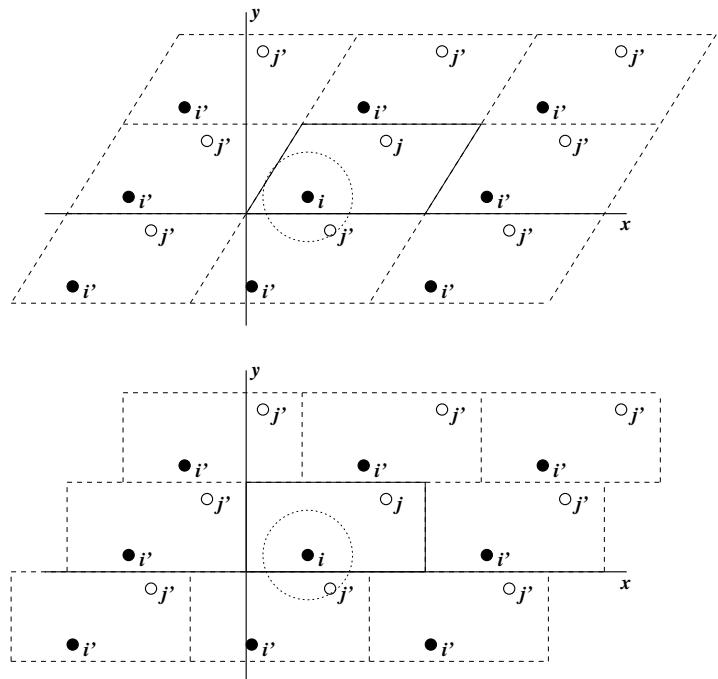  
图 5.1: 二维周期性边界条件。

对有限的系统，最大限度地减小边缘效应的经典方法是应用 周期性边界条件。将待模拟系统的原子放入一个空间填充的盒子中，盒子周围是系统自身平移后的副本（图 5.1）。因此，系统没有边界；由孤立团簇中不需要的边界导致的假象现在被周期性条件引起的假象所代替。如果系统具有晶体结构，就需要这样的边界条件（尽管运动自然会局限于周期性运动，且其波长与盒子相适应）。如果希望模拟非周期性系统，如液体或溶液，周期性自身就会导致误差。这些误差可以通过比较不同尺寸系统的模拟结果进行评估；比起由不自然的真空边界引起的误差，周期性边界引起的误差更小。

可用于空间填充的元胞有几种可能的形状。其中的一些，如 菱形十二面体和 截角八面体20↪532 比立方体更接近球形，因此更适合用于研究溶液中近似球形的大分子，因为对于给定的大分子映像之间的最小距离，填充这两种形状的盒子所需的溶剂分子较少。同时，菱形十二面体和截角八面体是 三斜晶胞的特例；而三斜晶胞是最一般的空间填充元胞，可形成所有可能的空间填充形状 $2 1 _ { \scriptscriptstyle \odot 3 2 }$ 。出于这个原因，GROMACS 的盒子是基于三斜晶胞的。

GROMACS 使用周期性边界条件，并结合了 最小映像约定：对短程非键相互作用，每个粒子只考虑其最近的一个映像。对长程静电相互作用，这有时不够精确，因此 GROMACS 还包含了晶格加和方法，如

Ewald 加和，PME 和 PPPM 等。

GROMACS 支持任何形状的三斜盒子。模拟盒子（元胞）由三个盒向量 a,b, c 定义。它们必须满足以下条件：

$$
a _ { y } = a _ { z } = b _ { z } = 0\tag{5.10}
$$

$$
a _ { x } > 0 , b _ { y } > 0 , c _ { z } > 0\tag{5.11}
$$

$$
| b _ { x } | \leq \frac { 1 } { 2 } a _ { x } , | c _ { x } | \leq \frac { 1 } { 2 } a _ { x } , | c _ { y } | \leq \frac { 1 } { 2 } b _ { y }\tag{5.12}
$$

通过旋转盒子，总可以使得等式 (5.10) 成立。不等式 (5.11) 和 (5.12) 也总可以通过增减盒向量使其成立。

即便使用三斜盒子进行模拟，为了提高效率，GROMACS 始终将粒子置于长方体空间内，对于二维系统的图示见 图 5.1。因此，从输出轨迹看，模拟似乎是在长方体盒子中进行的。 $t r j c o n v _ { \scriptscriptstyle { \hookrightarrow 1 9 1 } }$ 程序可用于转换轨迹，以不同的元胞显示轨迹。

模拟时也可以不使用周期性边界条件，但当模拟孤立的分子团簇时，使用一个很大的周期性盒子通常效率更高，这是因为快速的格点搜索只能用于周期性系统。

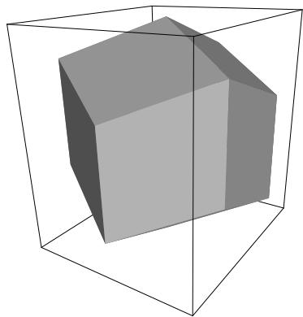  
图 5.2: 菱形十二面体（任意取向）。

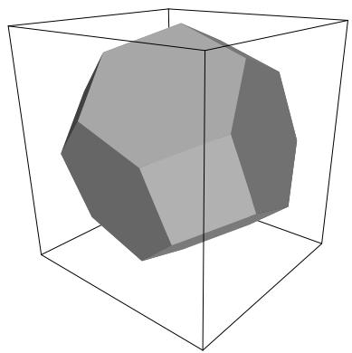  
图 5.3: 截角八面体（任意取向）。

些有用的盒子类型

表 5.6: 不同盒子类型的概述
<table><tr><td rowspan=2 colspan=1>盒子类型</td><td rowspan=2 colspan=1>映像距离</td><td rowspan=2 colspan=1>盒子体积</td><td rowspan=1 colspan=3>盒子向量</td><td rowspan=1 colspan=3>盒向量夹角</td></tr><tr><td rowspan=1 colspan=1>a</td><td rowspan=1 colspan=1>b</td><td rowspan=1 colspan=1>C</td><td rowspan=1 colspan=1> $\angle \ b c$ </td><td rowspan=1 colspan=1> $\angle \mathsf { a c }$ </td><td rowspan=1 colspan=1> $\angle \mathbf { a b }$ </td></tr><tr><td rowspan=3 colspan=1>立方</td><td rowspan=3 colspan=1> $d$ </td><td rowspan=3 colspan=1> $d ^ { 3 }$ </td><td rowspan=1 colspan=1>d</td><td rowspan=1 colspan=1>0</td><td rowspan=1 colspan=1>0</td><td rowspan=3 colspan=1> $9 0 ^ { \circ }$ </td><td rowspan=3 colspan=1> $9 0 ^ { \circ }$ </td><td rowspan=3 colspan=1> $9 0 ^ { \circ }$ </td></tr><tr><td rowspan=1 colspan=1>0</td><td rowspan=1 colspan=1> $d$ </td><td rowspan=1 colspan=1>0</td></tr><tr><td rowspan=1 colspan=1>0</td><td rowspan=1 colspan=1>0</td><td rowspan=1 colspan=1> $d$ </td></tr><tr><td rowspan=3 colspan=1>菱形十二面体(XY-正方)</td><td rowspan=3 colspan=1> $d$ </td><td rowspan=3 colspan=1> $\frac { 1 } { 2 } \sqrt { 2 } \ d ^ { 3 }$  $0 . 7 0 7 ~ d ^ { 3 }$ </td><td rowspan=1 colspan=1>d</td><td rowspan=1 colspan=1>0</td><td rowspan=1 colspan=1> $\textstyle { \frac { 1 } { 2 } } \ d$ </td><td rowspan=3 colspan=1> $6 0 ^ { \circ }$ </td><td rowspan=3 colspan=1> $6 0 ^ { \circ }$ </td><td rowspan=3 colspan=1> $6 0 ^ { \circ }$ </td></tr><tr><td rowspan=1 colspan=1>0</td><td rowspan=1 colspan=1>d</td><td rowspan=1 colspan=1> $\textstyle { \frac { 1 } { 2 } } \ d$ </td></tr><tr><td rowspan=1 colspan=1>0</td><td rowspan=1 colspan=1>0</td><td rowspan=1 colspan=1> ${ \frac { 1 } { 2 } } { \sqrt { 2 } } d$ </td></tr><tr><td rowspan=3 colspan=1>菱形十二面体(XY-六角)</td><td rowspan=3 colspan=1> $d$ </td><td rowspan=3 colspan=1> $\scriptstyle { \frac { 1 } { 2 } } { \sqrt { 2 } } \ d ^ { 3 }$  $0 . 7 0 7 ~ d ^ { 3 }$ </td><td rowspan=1 colspan=1>d</td><td rowspan=1 colspan=1> $\textit { \textbf {  } } d$ 2</td><td rowspan=1 colspan=1> $\textit { \textbf {  } } d$ </td><td rowspan=3 colspan=1>60°</td><td rowspan=3 colspan=1>60°</td><td rowspan=3 colspan=1>60°</td></tr><tr><td rowspan=1 colspan=1>0</td><td rowspan=1 colspan=1>2 $\overline { { \frac { 1 } { 2 } \sqrt { 3 } \ d } }$ </td><td rowspan=1 colspan=1> $\overline { { \frac { 1 } { 6 } \sqrt { 3 } \ d } }$ </td></tr><tr><td rowspan=1 colspan=1>0</td><td rowspan=1 colspan=1>0</td><td rowspan=1 colspan=1> $\overline { { { \frac { 1 } { 3 } } \sqrt { 6 } \ d } }$ </td></tr><tr><td rowspan=3 colspan=1>截角八面体</td><td rowspan=3 colspan=1> $d$ </td><td rowspan=3 colspan=1> $\frac { 4 } { 9 } \sqrt { 3 } \ d ^ { 3 }$  $0 . 7 7 0 \ d ^ { 3 }$ </td><td rowspan=1 colspan=1>d</td><td rowspan=1 colspan=1> $\textstyle { \frac { 1 } { 3 } } \ d$ </td><td rowspan=1 colspan=1> $- { \frac { 1 } { 3 } } \ d$ </td><td rowspan=3 colspan=1>71.53</td><td rowspan=3 colspan=1>109.47</td><td rowspan=3 colspan=1>71.53</td></tr><tr><td rowspan=1 colspan=1>0</td><td rowspan=1 colspan=1> ${ \frac { 2 } { 3 } } { \sqrt { 2 } } \ d$ </td><td rowspan=1 colspan=1> $\overline { { \frac { 1 } { 3 } \sqrt { 2 } \ d } }$ </td></tr><tr><td rowspan=1 colspan=1>0</td><td rowspan=1 colspan=1>0</td><td rowspan=1 colspan=1> ${ \overline { { \frac { 1 } { 3 } } } } { \sqrt { 6 } } \ d$ </td></tr></table>

表 5.6 列出了用于模拟溶液系统的三种最常用的盒子类型。菱形十二面体（图 5.2）是最小，最规则的空间填充元胞。12 个映像元胞中的每一个都具有相同的距离。其体积是具有相同映像距离的立方体体积的71%。当模拟溶液中球形或柔性的分子时，使用这种盒子大约可以节省 29% 的 CPU 时间。菱形十二面体有两种不同的取向可以满足方程 (5.10)，(5.11) 和 (5.12)。 $e d i t c o n f _ { \odot 1 }$ 程序生成的菱形十二面体盒子与 xy 平面的截面是正方形。之所以选择这个取向，是因为该取向下菱形十二面体盒子的前两个盒向量与 x 轴和 y 轴重合，更容易理解。另一取向适合用于模拟膜蛋白。在这种情况下，盒子与 $\mathrm { x y }$ 平面的截面为六边形，其面积比具有相同映像距离的正方形的面积小 14%。为获得最佳间距，可以改变盒子的高度 $\left( c _ { z } \right)$ 。这种盒子形状不仅可以节省 CPU 时间，还可以使蛋白质排列得更加均匀。

## 截断限制

最小映像约定意味着，用于截断非键相互作用的截断半径不能超过最短盒向量长度的一半：

$$
R _ { c } < \frac { 1 } { 2 } \operatorname* { m i n } ( \lVert \mathbf { a } \rVert , \lVert \mathbf { b } \rVert , \lVert \mathbf { c } \rVert ) ,\tag{5.13}
$$

否则会有多个映像出现在力的截断距离内。当研究溶液中的大分子（如蛋白质）时，仅考虑这个限制是不够的：原则上，单个溶剂分子不应该“看到”大分子的的两侧。这意味着，每个盒向量的长度都必须超过大分子在该向量方向上的长度 加上截断半径 $R _ { c }$ 的二倍。然而，人们经常不会严格地遵守这个限制，以便能够减小溶剂层厚度，降低计算成本。出于效率的考虑，三斜盒子截断的限制性更大。对格点搜索的额外限制很弱：

$$
R _ { c } < \operatorname* { m i n } ( a _ { x } , b _ { y } , c _ { z } )\tag{5.14}
$$

对简单搜索的额外限制更强：

$$
R _ { c } < \frac { 1 } { 2 } \operatorname* { m i n } ( a _ { x } , b _ { y } , c _ { z } )\tag{5.15}
$$

每个元胞（立方体，长方体或三斜）都被 26 个平移的映像所包围。因此一个特定的映像始终可以用指向 27 个 平移向量之一的索引来标识，并通过施加索引向量对应的平移来构建（参见计算力 $\hookrightarrow 3 4 7 \ )$ ）。限制(5.14) 确保了只需要考虑 26 个映像。

## 5.4.2 组的概念

GROMACS 的 MD 和分析程序可对用户定义的 原子组进行一些操作。组的最大数目为 256，但每个原子最多只能属于六类不同的组。这六类组如下：

## 温度耦合组

对每个温度耦合组可以单独定义温度耦合参数（参考温度，时间常数，自由度数目，参见蛙跳式积分方法 ）。例如，在大分子溶液中，相比大分子，溶剂分子（力和积分的误差使其倾向于产生更多的热效应）与热浴耦合时可以使用更短的时间常数。又如，可以维持表面的温度低于吸附分子的温度。可以定义许多不同的温度耦合组。另请参见下面的质心组。

## 冻结组

属于冻结组的原子在模拟过程中保持静止。在平衡系统的过程中这是很有用的，例如可避免放置不当的溶剂分子对蛋白质原子产生不合理的碰撞，尽管对必须要保护的原子施加约束势可以达到同样的效果。如果需要，冻结选项可仅仅用于原子的一个或两个坐标方向，从而可以将原子冻结在一个平面或一条直线上。当一个原子被部分冻结时，即使在冻结方向上，它所受的约束仍然可以使它移动。一个完全冻结的原子不能被它所受的约束所移动。可以定义多个冻结组。冻结坐标不受压力缩放的影响；在某些情况下，这可能会导致不需要的结果，特别是与约束同用时（在这种情况下，得到的压力会非常大）。因此，建议避免将冻结组与约束以及压力耦合联合使用。为了平衡系统，可以先使用冻结进行等体积模拟，然后再使用位置限制和恒压模拟。这样做可能就足够了。

## 加速组

加速组中的每个原子会施加一个加速度 $\mathbf { a } ^ { g } { } _ { \circ }$ 这相当于受到一个外力。利用这一特性可驱使系统进入非平衡状态，并实现非平衡 MD 模拟，从而获得输运性质。

## 能量监测组

在模拟过程中，会考虑所有能量监测组之间的交叉相互作用。而且会分开计算 Lennard-Jones项和 Coulomb 项。原则上，最多可以定义 256 个组，但这将会计算 256×256 项相互作用!所以最好谨慎地使用这个组。

成对的能量监测组之间的所有非键相互作用都可以排除（详细信息见“用户指南”）。来自被排除的成对能量监测组的粒子对不会放入配对列表中。当不需要计算系统内部或部分之间的相互作用时，这样做可以显著提高模拟速度。

## 质心组

GROMACS 可以移除整个系统或原子组的质心（COM）运动。移除原子组的质心运行是有用的，例如对摩擦力有限的系统（如气体系统），可以防止质心运动的发生。对温度耦合与质心运动移除使用相同的组是合理的。

## 压缩位置输出组

为了进一步减小压缩轨迹文件 $( \mathit { \ x t c } _ { \mathrm { c \to 4 6 2 } }$ 或 $t n g _ { \scriptscriptstyle  4 5 8 } ~ )$ ，可以只存储一部分粒子的轨迹。所有指定为压缩组的粒子会保存其轨迹，而其余粒子的轨迹不保存。如果未指定这样的输出组，所有原子的坐标都将保存到压缩轨迹文件中。

如何在 GROMACS 工具中使用组将在使用组 $ 5 0 5$ 一节中进行说明。

## 5.4.3 分子动力学

## MD 算法流程概览

## 1. 输入初始条件

原子位置决定的势能相互作用 ??

系统中所有原子的位置 r

系统中所有原子的速度 v

⇓

对所需计算的步数重复 2，3，4

## 2. 计算力

任一原子的受力

$$
\mathbf { F } _ { i } = - { \frac { \partial V } { \partial \mathbf { r } _ { i } } }
$$

对于非键原子对之间的相互作用力

$$
\mathbf { F } _ { i } = \textstyle \sum _ { j } \mathbf { F } _ { i j }
$$

加上原子之间的成键相互作用力（可能由 1，2，3 或 4 个原子决定），再加上限制和/或外力。

可能需要计算势能，动能和压力张量。

⇓

## 3. 更新构型

数值求解牛顿运动方程模拟原子的运动

或

$$
{ \frac { \mathrm { d } ^ { 2 } \mathbf { r } _ { i } } { \mathrm { d } t ^ { 2 } } } = { \frac { \mathbf { F } _ { i } } { m _ { i } } }
$$

$$
{ \frac { \mathrm { d } \mathbf { r } _ { i } } { \mathrm { d } t } } = \mathbf { v } _ { i } ; \ { \frac { \mathrm { d } \mathbf { v } _ { i } } { \mathrm { d } t } } = { \frac { \mathbf { F } _ { i } } { m _ { i } } }
$$

## 4. 如果需要输出单步结果

输出位置，速度，能量，温度，压力等

上面给出了 MD 的整体流程图。每此运行 MD 或 EM 都需要体系中所有相关粒子的一组初始坐标和（可选的）初始速度作为输入。本章不介绍如何获得这些参数；对于如何设置并实际运行 MD，请查看用户指 $\$ 123$ 部分中的系统准备 $_ { \odot 2 7 } \longrightarrow \oplus$ 和入 $\cdot \dot { \Pi } _ { \hookrightarrow 2 3 } \longrightarrow \dddot { \Pi }$ 。

初始条件

拓扑和力场

必须读入系统的拓扑，它包括了对力场的说明。力场和拓扑将分别在相互作用函数和力场 $\hookrightarrow 3 7 7$ 一章和拓扑 $ 4 5 9$ 一章进行说明。所有这些信息都是固定的；在运行过程中始终不变。

坐标和速度

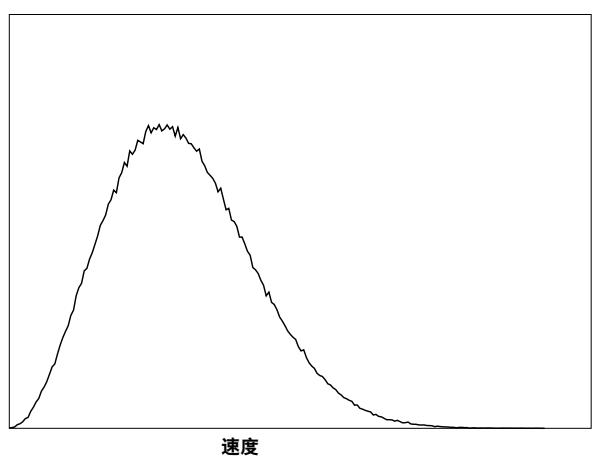  
图 5.4: 通过随机数生成的 Maxwell-Boltzmann 速度分布。

然后，在运行开始之前，需要知道盒子的大小以及所有粒子的坐标和速度。盒子的大小和形状由三个向量（九个数字） $\mathbf { b } _ { 1 } , \mathbf { b } _ { 2 } , \mathbf { b } _ { 3 }$ 决定，它们代表了周期性盒子的三个基向量。

如果从 $t = t _ { 0 }$ 开始运行，必须知道 $t = t _ { 0 }$ 时刻的坐标。如果以 $\Delta t$ 为时间步长，使用默认的 蛙跳式算法更新时间步（参见蛙跳式积分方法 $_ { \hookrightarrow 3 4 8 } \longrightarrow _ { } ^ { \# } )$ ，还需要知道 $\begin{array} { r } { t = t _ { 0 } - \frac { 1 } { 2 } \Delta t } \end{array}$ 时刻的速度。如果没有可以利用的速度，程序可以根据给定的绝对温度 ?? 生成所需要的初始原子速度 $v _ { i } , i = 1 \ldots 3 N$ ，它们服从Maxwell-Boltzmann 分布（图 5.4）

$$
p ( v _ { i } ) = { \sqrt { \frac { m _ { i } } { 2 \pi k T } } } \exp \left( - { \frac { m _ { i } v _ { i } ^ { 2 } } { 2 k T } } \right)\tag{5.16}
$$

其中 ?? 为 Boltzmann 常数（见定义与单 $\dot { \overline { { { \cal L } } } } _ { \hookrightarrow 3 3 3 } \longrightarrow \dot { \overline { { { \cal \Xi } } } } _ { \sharp } ^ { \sharp } \ \big ) _ { \langle }$ 。为此，会通过生成 12 个随机数 $R _ { k } , 0 \le R _ { k } < 1$ 并从其总和中减去 6.0 的方法来产生服从正态分布的随机数。然后再将结果乘以速度分布的标准偏差$\sqrt { k T / m _ { i } }$ 。因为由此得到的总能量不会精确地对应于所需的温度 ??，需要进行校正：首先移除质心的运动，然后再缩放所有的速度，使总能量精确地对应于温度 ?? （参见方程 (5.21)）。

## 质心运动

通常情况下，在每一步都会将质心的速度设置为零；系统（通常）不受净的合外力作用，其质心速度应保持不变。然而，在实践中，更新算法会导致质心速度发生非常缓慢的变化，并因此使得系统的总动能发生变化，特别是在使用温度耦合时。如果不消除这些变化，长时间运行后质心会有明显的运动，温度也会出现显著异常。体系的整体转动也会导致同样的问题，但只有在模拟孤立团簇时才会发生。在填满盒子的周期性系统中，整体转动会与其他自由度耦合，不会引起这样的问题。

## 邻区搜索

正如相互作用函数和力场 $\hookrightarrow 3 7 7$ 一章中所提到的，内力或者由固定（静态）列表产生，或者由动态列表产生。后者包含了任意粒子对之间的非键相互作用。在计算非键力时，将所有粒子都置于长方盒子中更方便。如 图 5.1 所示，可以将三斜盒子转换为长方盒子。所以输出坐标始终处于长方盒子中，即便模拟时使用了十二面体或三斜盒子。方程(5.10) 保证了我们可以重置粒子使其处于长方盒子中，方法是先沿盒向量 c 移动，再沿 b 移动，最后沿 a 移动。根据三个限制性方程 (5.12)，(5.13) 和 (5.14)，我们仅利用单倍盒向量的线性组合就可以找到 14 个最近的三斜盒子映像。

## 配对列表的生成

只需要对一些粒子对 ??, ?? 之间的非键配对力进行计算，在这些粒子对中，粒子 ?? 到 ?? 的最近映像之间的距离 $r _ { i j }$ 小于给定的截断半径 $R _ { c ^ { \circ } }$ 如果粒子对之间的相互作用已完全由成键相互作用所描述，即便它们满足截断条件也仍然会被排除。GROMACS 使用了一个 配对列表，其中包含那些必须计算彼此之间非键力的粒子对。配对列表中包含了粒子 ?? 及其位移向量，距离粒子 ?? 的这个特定映像 rlist 范围内的所有粒子 ??。该列表每 nstlist 步更新一次。

为创建配对列表，必须找到与给定粒子相近（即在邻区列表截断范围内）的所有粒子。这种搜索通常称为邻区搜索（NS）或配对搜索，它涉及到周期性边界条件和 映像的确定（请参见周期性边界条件 $_ {  3 3 6 } \ : - \ :$ 节）。搜索算法的复杂度为 ??(??)，虽然更简单 $O ( N ^ { 2 } )$ 算法在某些条件下仍可以使用。

## 截断方案：组与 Verlet

从 4.6 版开始，GROMACS 支持两种不同的截断方案设置：基于粒子组的原始方案和使用 Verlet 缓冲区的方案。这两种方案之间存在一些非常重要的区别，这些区别可能会影响计算结果，计算性能和某些功能的支持情况。可以使组方案（几乎）像 Verlet 方案一样工作，但这会导致性能下降。在许多模拟系统中都含有大量的水分子，这时使用组方案特别快，但在最新的 x86 处理器上，这种优势不再存在，因为可以在实现 Verlet 方案时使用更好的指令级并行。在 5.0 版本中已经不再推荐使用组方案了，在将来的版本中会删除组方案。有关选择和设置截断方案的实用细节，请参阅“用户指南”。

在组方案中，生成的邻区列表包含成对的组，每个组中至少含有一个粒子。这些组最初是电荷组（请参见电荷组↪347 一节），但在无缓冲模拟中，通过对长程静电进行适当处理，它们的唯一优势就是计算性能。当几何中心位于截断距离内时，两个组会被放入邻区列表中。在一定数目的 MD 模拟步中，会计算所有粒子对（每个电荷组一个）之间的相互作用，直到下一次更新邻区列表。这种设置很有效，因为邻区搜索只需要检查每对电荷组之间的距离，而不是粒子对之间的距离（对三位点水模型节省因子为 $3 \times 3 = 9$ 倍），而且还可以，比如说针对水分子“组”对非键力的计算内核进行优化。由于没有显式的缓冲，一些处于截断范围内的粒子对之间没有相互作用，而一些处于截断范围之外的粒子对之间有相互作用，因此组方案会导致能量漂移。其中的可能原因如下

• 粒子在两次邻区搜索步之间移动穿过了截断区域，和/或

• 对含一个以上粒子的电荷组，当粒子的几何中心处于截断距离以外/内时，粒子对会移动到截断距离以内/外。

显式地为邻区列表增加缓冲区会消除这些问题，但需要很高的计算成本。问题的严重程度取决于系统，感兴趣的性质以及截断设置。

Verlet 截断方案默认使用缓冲配对列表。它也使用粒子簇，但它们不像在组方案中那样是静态的。相反，这些粒子簇是以空间定义的，包含 4 或 8 个粒子，这为流式计算提供了方便，例如可以使用 SSE，AVX或 GPU 的 CUDA 进行高效的计算。在邻区搜索步骤中，使用 Verlet 缓冲区创建配对列表，即配对列表的截断值大于相互作用的截断值。在非键力计算内核中，只有当粒子对在特定时间步处于截断距离之内时，才会计算其相互作用。这确保了当粒子在两次配对搜索步骤中发生移动时，会计算几乎所有处于截断距离内的粒子之间的力。我们说 几乎所有的粒子，是因为 GROMACS 为提高效率使用了固定的配对列表更新频率。处于截断距离范围之外的粒子对，经过了固定步数的演化，也可能移动得足够多，以致其距离现在处于截断范围之内。这种小概率事件会导致小的能量漂移，而概率的大小取决于温度。当使用温度耦合时，给定能量漂移的容差，可以自动确定缓冲区大小。在 mdp 文件中 Verlet 方案的设置为：

```ini
cutoff-scheme = Verlet
Verlet-buffer-tolerance = 0.005
```

Verlet 缓冲的大小由后一选项决定，这里使用了默认设置：在一对原子中每个原子的能量误差为 0.005$\mathrm { k J / m o l / p s } _ { \circ }$ 。需要注意的是，在配对能量的误差会相互抵消，这对总能量漂移的影响通常至少比容差小一个数量级。此外，总能量的漂移受许多其他因素影响，通常，来自约束算法的贡献占主导地位。对等能量（NVE）模拟，缓冲大小由对应于速度（无论由何种合适的方法产生，或由输入文件提供）的温度来决定。此外，容差可以设置为–1，并手动指定缓冲：rlist > max(rcoulomb，rvdw)。得到合理缓冲大小的最简单方法是：利用 NVT 的 mdp 文件并将目标温度设定为 NVE 模拟中你希望使用的温度，然后将 grompp 打印出的缓冲大小移植到 NVE 的 mdp 文件中。

基于粒子簇实现的 Verlet 截断方案非常高效。最简单的示例是含 4 个粒子的团簇。然后基于团簇对构建配对列表。团簇对搜索比基于粒子对的搜索快得多，因为一次可以将 $4 \times 4 = 1 6$ 个粒子对放入列表中。然后，非键力计算内核一次就可以计算出许多粒子对之间的相互作用，这可以很好地映射到现代硬件上的 SIMD 或 SIMT 单元，这些单元一次可以执行多个浮点运算。对大多数系统，这些非键力计算内核要远远快于组方案使用的内核，特别是在较新的机器上。

此外，当以如下所述的方法自动确定配对缓冲区时，我们还对动态配对列表应用了修剪。配对列表可以不那么频繁地构建，但那可能会导致列表中的许多粒子对在该配对列表的整个或大部分存在周期内处于截断范围之外。这些粒子对可以通过应用团簇对内核来去除，这种内核只确定哪些团簇处于范围内。由于 GROMACS 中非键数据的规范化方式，这一内核比搜索和相互作用计算内核快一个数量级。在 GPU上，这种修剪与 CPU 上的积分过程重叠，因此在大多数情况下并不耗费时间。因此，我们可以每 4-10个积分步修剪一次，开销很小，却显著减少了相互作用内核中的团簇对数量。这一过程是自动的，除非用户手动设置配对列表的缓冲区大小。

## 能量漂移和配对列表缓冲

对于正则（NVT）系综，在配对列表的整个存在周期内，因粒子 $j$ 从列表截断 $r _ { \ell }$ 之外扩散到相互作用截断 $r _ { c }$ 之内而引起的平均能量误差，可以通过原子位移和截断处的势能形状来确定。温度为 $T$ 时，一个质量为 ?? 自由移动的粒子，在时间 ?? 内在一维方向上的位移分布为高斯分布 $G ( x )$ ，其均值为零，方差为 $\sigma ^ { 2 } = t ^ { 2 } k _ { B } T / m$ 。对两个粒子之间的距离，方差变为 $\sigma ^ { 2 } = \sigma _ { 1 2 } ^ { 2 } = t ^ { 2 } k _ { B } T ( 1 / m _ { 1 } + 1 / m _ { 2 } )$ 。请注意，实际过程中，在时间 ?? 内，粒子通常还会与其他粒子相互作用（碰撞），因此实际的位移分布要窄得多。给定非键相互作用的截断距离 $r _ { c }$ ，配对列表的截断距离 $r _ { \ell } = r _ { c } + r _ { b } , \ r _ { b }$ 为 Verlet 缓冲区大小，对类型为1，并被所有类型为 2，数密度为 $\rho _ { 2 }$ 的粒子 ?? 所包围的单个粒子 ??，经过时间 ?? 后，粒子间距从 $r _ { 0 }$ 变到$r _ { t }$ ，我们可以计算出在这段时间内因所有缺失的配对相互作用导致的平均能量误差：

$$
\langle \Delta V \rangle = \int _ { 0 } ^ { r _ { c } } \int _ { r _ { \ell } } ^ { \infty } 4 \pi r _ { 0 } ^ { 2 } \rho _ { 2 } V ( r _ { t } ) G \Big ( { \frac { r _ { t } - r _ { 0 } } { \sigma } } \Big ) d r _ { 0 } d r _ { t }\tag{5.17}
$$

为了能够解析地进行计算，我们需要做一些近似。首先我们使用 $r _ { c }$ 附近的泰勒展开替代 $V ( r _ { t } )$ ，然后我们将 $r _ { 0 }$ 的积分下限移动到 −∞，这样可以简化结果：

⟨Δ?? ⟩ ≈

$$
\int _ { - \infty } ^ { r _ { c } } \int _ { r _ { \ell } } ^ { \infty } 4 \pi r _ { 0 } ^ { 2 } \rho _ { 2 } \Big [ V ^ { \prime } ( r _ { c } ) ( r _ { t } - r _ { c } ) +
$$

$$
V ^ { \prime \prime } ( r _ { c } ) \frac { 1 } { 2 } ( r _ { t } - r _ { c } ) ^ { 2 } +
$$

$$
V ^ { \prime \prime \prime } ( r _ { c } ) \frac { 1 } { 6 } ( r _ { t } - r _ { c } ) ^ { 3 } +
$$

$$
O ( ( r _ { t } - r _ { c } ) ^ { 4 } ) \Big ] G \Big ( \frac { r _ { t } - r _ { 0 } } { \sigma } \Big ) d r _ { 0 } d r _ { t }
$$

将因子 $r _ { 0 } ^ { 2 }$ 替换为 $( r _ { \ell } + \sigma ) ^ { 2 }$ ，这会略微高估结果，但能够解析地计算积分：

⟨Δ?? ⟩≈

$$
\begin{array} { r l r } & { } & { 4 \pi ( \gamma _ { \ell } + \sigma ) ^ { 2 } \rho _ { 0 } \int _ { - \infty } ^ { \infty } \int _ { \gamma _ { \ell } } ^ { \infty } \left[ V ^ { \prime } ( \tau _ { \ell } ) ( \boldsymbol { r } _ { 1 } - \boldsymbol { r } _ { \ell } ) + \right. } \\ & { } & { \left. V ^ { \prime } ( \tau _ { \ell } ) \frac { 1 } { 2 } ( \boldsymbol { r } _ { \ell } - \boldsymbol { r } _ { \ell } ) ^ { 2 } - \right. } \\ & { } & { \left. V ^ { \prime \prime } ( \tau _ { \ell } ) \frac { 1 } { 2 } ( \boldsymbol { r } _ { \ell } - \boldsymbol { r } _ { \ell } ) \right] ^ { 2 } } \\ & { } & { \left. V ^ { \prime \prime } ( \tau _ { \ell } ) \frac { 1 } { 8 } ( \boldsymbol { r } _ { \ell } - \boldsymbol { r } _ { \ell } ) ^ { 3 } \right] \boldsymbol { C } _ { \ell } ( \tau _ { \ell } - \boldsymbol { r } _ { \ell } ) \right\} \boldsymbol { C } _ { \ell } ^ { \prime } ( \tau _ { \ell } - \boldsymbol { \ell } _ { \ell } ^ { \prime \prime } ) \boldsymbol { \beta } ( \tau _ { \ell } ) \boldsymbol { \beta } ( \tau _ { \ell } ) } \\ & { } & { \left. 4 \pi ( \tau _ { \ell } + \sigma ) ^ { 2 } \rho _ { 0 } \left\{ \frac { 1 } { 2 } \frac { V } { 2 } V ^ { \prime } ( \tau _ { \ell } ) \int _ { 1 } \gamma _ { \ell } \boldsymbol { \sigma } _ { \ell } \boldsymbol { C } _ { \ell } ^ { \prime } \left( \frac { V _ { \ell } } { \sigma } \right) - \left. ( V _ { \ell } ^ { \prime \prime } ) + \frac { 3 } { 2 } \right) V \left[ \frac { \boldsymbol { \sigma } _ { 0 } } { \sigma } \right\} \right] \right\} } \\ & { } &  \frac { 1 } { 6 } V ^ { \prime \prime } ( \tau _ { \ell } ) \left[ \tau ( \hat { \boldsymbol { r } } _ { \ell } ^ { 2 } + 2  \end{array}
$$

其中 $G ( x )$ 为具有零均值和单位方差的高斯分布， $\begin{array} { r } { E ( x ) = \frac { 1 } { 2 } \mathrm { e r f c } ( x / \sqrt { 2 } ) } \end{array}$ 。我们总是希望得到的能量误差很小，所以 $\sigma$ 比 $r _ { c }$ 和 $r _ { \ell }$ 都小，因此上面方程中所用的近似很好，因为高斯分布衰减得很快。能量误差需要对所有粒子对类型进行平均，并以粒子计数进行加权。在 GROMACS 中，我们不允许配对类型之间的错误抵消，因此我们对绝对值进行平均。为获得单位时间内的平均能量误差，需要将其除以邻区列表的存在周期 $t = ( \tt n s t 1 i s t - 1 ) \times d t$ 。此函数不能解析地反向求解，因此对给定的目标漂移，我们使用二分法来获得缓冲区大小 $r _ { b ^ { \circ } }$ 。我们还要注意到，实际的误差通常比这里估计的小很多，因为凝聚相中的粒子位移远小于自由移动粒子的位移，而上面的推导假定了粒子自由移动。

当存在（键）约束时，一些粒子的自由度将减少。这会减少能量误差。为简单起见，我们只考虑每个粒子受一个约束的情况，最重的粒子才涉及多个约束。这一简化高估了位移。受约束粒子的运动是两个粒子质心的 3D 运动与围绕质心的 2D 转动的叠加。具有 2 个自由度的粒子在任意方向上的位移不是高斯分布，而是余误差函数：

$$
{ \frac { \sqrt { \pi } } { 2 { \sqrt { 2 } } \sigma } } \operatorname { e r f c } \left( { \frac { | r | } { { \sqrt { 2 } } \sigma } } \right)\tag{5.18}
$$

其中 $\sigma ^ { 2 }$ 仍然是 $t ^ { 2 } k _ { B } T / m$ 。没有办法解析地对此分布进行积分以获得能量误差。但我们可以使用缩放和移位的高斯分布来得到其紧上界（这里不给出具体过程）。如前所述，这种高斯分布可用于计算能量误差。围绕质心的转动位移不可能大于旋转半径。考虑到这一点，我们将方程 (5.18) 中的 ?? 进行缩放（未提供细节）以获得实际位移的高估值。后一效应显著地减少了缓冲区的大小，特别是对那些具有更长邻区列表存在周期的体系，如水，因为受约束的氢原子是迄今为止最快的粒子，但它们移动的距离离它们

## 所连接的重原子不可能超过 0.1 nm。1

有一个重要的实现细节可以减少因有限的 Verlet 缓冲区列表大小引起的能量误差。上面的推导假定了粒子对列表。然而 GROMACS 实现时使用了团簇对列表以提高效率。在大多数情况下，配对列表包含由 4个粒子组成的团簇之间的配对，也称为 4 × 4 列表，但列表也可以是 4 × 8 （GPU CUDA 内核与 AVX256 位单精度内核）或 4 × 2 （SSE 双精度内核）。这意味着配对列表实际上比对应的 1 × 1 列表大得多。因此，稍微超出配对列表的截断值时，列表中仍然存在大部分粒子对。这些粒子对所占的比例可以在模拟中确定，并根据一些合理的假设进行准确地估计。这些粒子对所占的比例随配对列表范围的增加而减小，这意味着可以使用更小的缓冲区。对典型的全原子模拟，使用 0.9 nm 的截断值时，这个比例约为0.9，能量误差降低为原来的 1/10。在自动计算 Verlet 缓冲区时考虑了这种减少，这样得到的缓冲区会更小。

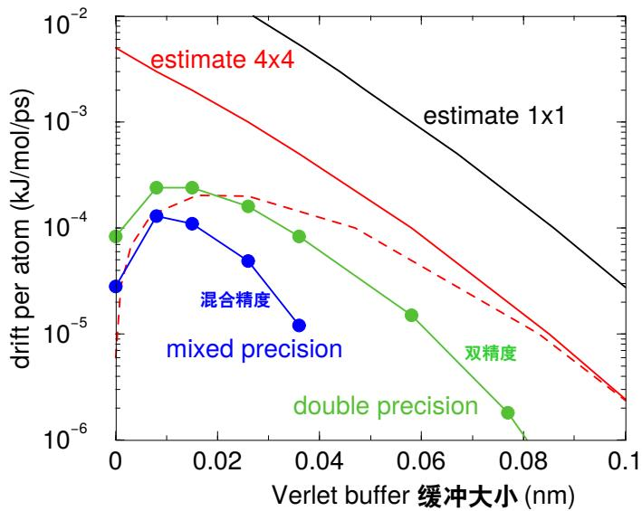  
图 5.5: 温度 300 K 时，SPC/E 水系统中每个原子的能量漂移，模拟使用的时间步长为 2 fs，配对列表的更新周期为 10 步（配对列表存在周期：18 fs）。使用了 PME 方法，ewald-rtol 设置为 10−5;该参数会影响截断处的势能形状。图中显示了因有限的 Verlet 缓冲区大小，对 1 × 1 和 4 × 4 原子对列表，不考虑和考虑（虚线）正负误差抵消时而导致的误差估计。图中还给出了使用双精度和混合精度模拟时的实际能量漂移。使用单精度时，由 SETTLE 约束算法的舍入误差引起的漂移在缓冲区很大时变为负值。注意，缓冲大小为零时，实际漂移很小，因为正的（H-H）和负的（O-H）能量误差会相互抵消。

由 图 5.5 可以看出，对于小的缓冲区，由于误差互相抵消，总能量漂移远小于配对能量误差的容差。对较大的缓冲区，误差的估计值是总能量漂移的 6 倍，或者说，缓冲区的估计值大了 0.024 nm。这是因为质子的自由移动不能超过 18 fs，只能振动。

## 截断假象与切换相互作用

采用 Verlet 方案时，会将对势进行偏移，使其在截断处为零，这样势能就等于力的积分。在组方案中，只有当势能满足在截断距离处为零的条件时，才可以保证势能等于力的积分。然而，当截断处的力不为零时，仍然可能存在能量漂移。这种影响非常小，而且往往不明显，因为其他积分误差（例如来自约束的）可能占主导地位。为了完全避免截断假象，可以将非键力在小于邻区列表截断的距离处精确地切换到零（在 GROMACS 中可使用几种方法做到这一点，参见修正的非键相互作用 $ 3 8 0$ 一节）。这样就形成了一个缓冲区，其大小等于邻区列表截断值减去相互作用的最大截断值。1

## 简单搜索

由于方程 (5.10) 和 (5.15)，连接处于截断距离 $R _ { c }$ 之内的映像的向量 $\mathbf { r } _ { i j }$ 可以通过下面的方法获得：

$$
\begin{array} { r l r } { \mathbf { r } ^ { \prime \prime \prime } = } & { } & { \mathbf { r } _ { j } - \mathbf { r } _ { i } } \\ { \mathbf { r } ^ { \prime \prime } = } & { \mathbf { r } ^ { \prime \prime \prime } - \mathbf { c } * \mathrm { r o u n d } ( r _ { z } ^ { \prime \prime \prime } / c _ { z } ) } \\ { \mathbf { r } ^ { \prime } = } & { \mathbf { r } ^ { \prime \prime } - \mathbf { b } * \mathrm { r o u n d } ( r _ { y } ^ { \prime \prime } / b _ { y } ) } \\ { \mathbf { r } _ { i j } = } & { \mathbf { r } ^ { \prime } - \mathbf { a } * \mathrm { r o u n d } ( r _ { x } ^ { \prime } / a _ { x } ) } \end{array}\tag{5.19}
$$

当需要计算三斜盒子中两粒子间的距离时，这些距离不服从方程(5.10)，需要考虑盒向量组合的许多偏移才能找到最近的映像。

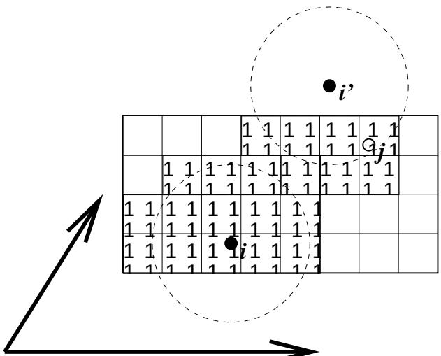  
图 5.6: 二维格点搜索。箭头为盒向量。

## 格点搜索

格点搜索示意图见 图 5.6。所有粒子都置于 NS 格点上，每一方向上的最小间距 ${ \geq } R _ { c } / 2 ,$ 。在每一盒向量方向上，粒子 ?? 有三个映像。对每个方向，映像可以是 -1，0 或 1，对应平移 -1，0 或 +1 个盒向量。对粒子 ?? 的近邻，我们不是先搜索周围的 NS 格点单元再计算映像，而是先构造映像，再搜索与 ?? 的映像对应的近邻。如 图 5.6 所示，对 ?? 的不同映像，一些格点单元的搜索次数可能会超过 1。这不是问题，因为由于最小映像约定，最多只有一个映像能够“看到”粒子 $j _ { \circ }$ 对于每个粒子，搜索的相邻单元少于125 (53) 个。因此，算法复杂度与粒子数成线性关系。尽管前因子很大，当粒子超过几百时，线性标度行为使得该算法远远优于标准的 $O ( N ^ { 2 } )$ 算法。格点搜索对长方盒子与三斜盒子同样快。因此，对于大多数蛋白质和多肽模拟，首选的盒子形状是菱形十二面体。

## 电荷组

最初引入电荷组是为了减少库仑相互作用的截断假象。使用普通截断时，当带（部分）电荷的原子移进和移出截断半径时，势和力会出现显著的跳跃。当所有化学基团的净电荷为零时，通过将净电荷为零的原子组移入和移出邻区列表可以减少这些跳跃，这些原子组称为电荷组。这种方法将截断效应从电荷-电荷水平降低到偶极-偶极水平，后者的衰减要快得多。随着全范围静电方法的出现，如粒子网格 Ewald 方法（见 $P M E _ { \scriptscriptstyle { \mathrm { < } 4 1 1 } } \stackrel { } { \_ } \frac { \mathrm { \# } } { \mathrm { \mathbb { J } } } \mathrm { \Sigma }$ ），不再需要使用电荷组来保证精度了。它甚至可能会对精度或效率产生轻微的负面影响，具体程度取决于邻区列表的创建方式和相互作用的计算方式。

但仍然有一个重要原因使用 电荷组：组截断方案的效率。在适用的情况下，邻区搜索是基于在分子拓扑中定义的电荷组进行的。如果两个电荷组原子的 几何中心之间的最近映像距离小于截断半径，配对列表中会包含两个电荷组之间的所有原子对。例如，对水系统的邻区搜索，当每个水分子被视为一个电荷组时，速度会是原来的 $3 ^ { 2 } = 9$ 倍。此外，高度优化的计算水中原子受力的循环（参见用于水的内部循环↪526 一节）只有当一个水分子中的所有原子都属于同一个电荷组时才起作用。目前，使用 邻区搜索组这个名称可能更合适，但出于历史原因还是保留了电荷组的名称。在开发新的力场时，建议使用 3 到 4个原子的电荷组以获得最佳性能。对全原子力场，这相对容易，因为可以简单地将氢原子，某些情况下的氧原子，置于与它们相连的重原子相同的电荷组中；例如： $\mathrm { C H _ { 3 } }$ $\mathrm { C H _ { 2 } }$ ，CH， $\mathrm { N H _ { 2 } }$ ，NH，OH， $\mathrm { C O _ { 2 } }$ CO。

使用 Verlet 截断方案时，忽略电荷组。

计算力

势能

当计算力时，同时会计算每个相互作用项的势能。总势能是各种贡献的加和，如 Lennard-Jones 项，Coulomb 项和成键项。也可以计算 能量监测组原子的贡献，组成能量监测组的原子可以单独定义（参见组的概念 $_ { \hookrightarrow 3 3 9 } \longrightarrow ^ { \# }$ ）。

动能和温度

对含有 ?? 个粒子的系统，可以从总动能

$$
E _ { k i n } = \frac { 1 } { 2 } \sum _ { i = 1 } ^ { N } m _ { i } v _ { i } ^ { 2 }\tag{5.20}
$$

计算绝对温度 ?? :

$$
\frac { 1 } { 2 } N _ { \mathrm { { d f } } } k T = E _ { \mathrm { { k i n } } }\tag{5.21}
$$

其中 ?? 为 Boltzmann 常数， $N _ { d f }$ 为自由度数，可通过下式计算：

$$
N _ { \mathrm { d f } } ~ = ~ 3 N - N _ { c } - N _ { \mathrm { c o m } }\tag{5.22}
$$

这里 $N _ { c }$ 是系统所受的 约束的数目。当进行分子动力学模拟时，必须移除 $N _ { \mathrm { c o m } } = 3$ 个额外的自由度，因为三个质心速度是运动常量，通常设置为零。当在真空中进行模拟时，也可以移除绕质心的转动，这种情况下 $N _ { \mathrm { { c o m } } } = 6 _ { \circ }$ 。当使用一个以上的温度耦合组时，?? 组的自由度数为：

$$
N _ { \mathrm { { d f } } } ^ { i } ~ = ~ ( 3 N ^ { i } - N _ { c } ^ { i } ) { \frac { 3 N - N _ { c } - N _ { \mathrm { { c o m } } } } { 3 N - N _ { c } } }\tag{5.23}
$$

当计算三斜系统的压力，或系统受剪切力作用时，可以将动能写为张量形式：

$$
\mathbf { E } _ { \mathrm { k i n } } = { \frac { 1 } { 2 } } \sum _ { i } ^ { N } m _ { i } \mathbf { v } _ { i } \otimes \mathbf { v } _ { i }\tag{5.24}
$$

压力与维里

压力张量 P 可以通过动能 $E _ { \mathrm { k i n } }$ 和维里 Ξ 之间的差值来计算：

$$
{ \bf P } = \frac { 2 } { V } ( { \bf E } _ { \mathrm { k i n } } - \Xi )\tag{5.25}
$$

其中 ?? 为模拟盒子的体积。在各向同性系统中，用于压力耦合的标量压力 ?? 为：

$$
P = \mathrm { t r a c e } ( \mathbf { P } ) / 3
$$

维里张量 Ξ 定义为：

$$
\boldsymbol \Xi = - \frac 1 2 \sum _ { i < j } \mathbf r _ { i j } \otimes \mathbf F _ { i j }\tag{5.26}
$$

GROMACS 计算维里的实现方法请参考维里和压力 $ 4 1 3$ 一节。

蛙跳式积分方法

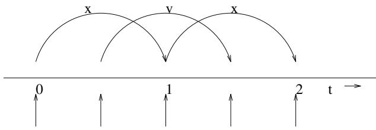  
图 5.7: 蛙跳式积分方法。该算法被称为蛙跳式是因为 r 和 v 像青

蛙一样在彼此的背上跳跃。

GROMACS 中用于积分运动方程的默认 MD 积分方法是所谓的 蛙跳式算法22 $ 5 3 2 ~ 0$ 当使用温度和/或压力耦合并需要非常精确的积分时，速度 Verlet 积分方法可能更好（参见速度 Verlet 积分方法 $_ { + 3 4 9 } )$ ）。蛙跳式算法使用了 ?? 时刻的位置 r 和 $t - { \textstyle \frac { 1 } { 2 } } \Delta t$ 时刻的速度 v，根据 ?? 时刻的位置计算出力 $\mathbf F ( t )$ ，并利用下面的方法更新更新位置和速度：

$$
\begin{array} { r l r } { \mathbf { v } ( t + \frac { 1 } { 2 } \Delta t ) } & { = } & { \mathbf { v } ( t - \frac { 1 } { 2 } \Delta t ) + \frac { \Delta t } { m } \mathbf { F } ( t ) } \\ & { } & { \mathbf { r } ( t + \Delta t ) \mathbf { \delta } = \quad \mathbf { r } ( t ) + \Delta t \mathbf { v } ( t + \frac { 1 } { 2 } \Delta t ) } \end{array}\tag{5.27}
$$

该算法的形象化说明见 图 5.7。它产生的轨迹与 Verlet 算法23 $\scriptstyle \phantom { . } \to 5 3 2$ 完全相同，Verlet 算法更新位置的方法为

$$
\mathbf { r } ( t + \Delta t ) \ = \ 2 \mathbf { r } ( t ) - \mathbf { r } ( t - \Delta t ) + { \frac { 1 } { m } } \mathbf { F } ( t ) \Delta t ^ { 2 } + O ( \Delta t ^ { 4 } )\tag{5.28}
$$

蛙跳式算法对 r 具有三阶精度，并且时间可逆。有关该算法的优点以及与其他时间积分算法的比较，请参见 $\boldsymbol { \mathcal { Z } } _ { 4 \hookrightarrow 5 3 2 }$ 。

为考虑温度耦合和压力耦合，推广以包括约束守恒，我们修改了运动方程，详细情况将在后面进行讨论。

速度 Verlet 积分方法

GROMACS 也实现了速度 Verlet 算法25 ，尽管它与所有选项的整合还没有完全实现好。在速度Verlet 方法中，利用 ?? 时刻的位置 r 和速度 v 来积分运动方程，不需要前半步时刻的速度。

$$
\begin{array} { r l r } { \displaystyle { \mathbf { v } ( t + \frac { 1 } { 2 } \Delta t ) \ = } } & { \displaystyle { \mathbf { v } ( t ) + \frac { \Delta t } { 2 m } \mathbf { F } ( t ) } } \\ { \displaystyle { \mathbf { r } ( t + \Delta t ) \ = } } & { \displaystyle { \mathbf { r } ( t ) + \Delta t \mathbf { v } ( t + \frac { 1 } { 2 } \Delta t ) } } \\ { \displaystyle { \mathbf { v } ( t + \Delta t ) \ = } } & { \displaystyle { \mathbf { v } ( t + \frac { 1 } { 2 } \Delta t ) + \frac { \Delta t } { 2 m } \mathbf { F } ( t + \Delta t ) } } \end{array}\tag{5.29}
$$

或者，相当于，

$$
\begin{array} { r l r } { \mathbf { r } ( t + \Delta t ) } & { = } & { \mathbf { r } ( t ) + \Delta t \mathbf { v } + \displaystyle \frac { { \Delta t } ^ { 2 } } { 2 m } \mathbf { F } ( t ) } \\ { \mathbf { v } ( t + \Delta t ) } & { = } & { \mathbf { v } ( t ) + \displaystyle \frac { \Delta t } { 2 m } \left[ \mathbf { F } ( t ) + \mathbf { F } ( t + \Delta t ) \right] } \end{array}\tag{5.30}
$$

不使用温度或压力耦合，并从 对应的起始点出发，蛙跳式方法和速度 Verlet 方法会给出完全相同的轨迹，很容易通过上面给出的方程验证这一点。给定一个具有 相同起始点 x(0) 和 $\mathbf { v } ( 0 )$ 的起始文件，蛙跳式方法和速度 Verlet 方法 不会给出完全相同的轨迹，因为蛙跳式方法认为速度对应于 $t = - { \textstyle \frac { 1 } { 2 } } \Delta t$ 时刻，而速度 Verlet 方法会认为速度对应于 ?? = 0 时刻。

理解可逆积分方法：Trotter 分解

为进一步理解速度 Verlet 和跳蛙式积分方法之间的关系，我们引入动力学的可逆 Trotter 公式，它也非常有助于理解 GROMACS 恒温器和恒压器的实现。

对一个耦合的一阶微分方程组，可利用演化算符使系统从 ?? = 0 演化到 ?? 时刻

$$
\begin{array} { r l } { \Gamma ( t ) = } & { { } \exp ( i L t ) \Gamma ( 0 ) } \\ { i L = } & { { } \dot { \Gamma } \cdot \nabla _ { \Gamma } , } \end{array}
$$

其中 ?? 为 Liouville 算符，Γ 为自变量（位置和速度）的多维向量。真实算符的短时间近似，在 $\Delta t = t / P$ 时刻是精确的，将它连续施加 ?? 次可将系统演变为

$$
\Gamma ( t ) = \prod _ { i = 1 } ^ { P } \exp ( i L \Delta t ) \Gamma ( 0 )\tag{5.31}
$$

对于 NVE 动力学，Liouville 算符为

$$
i L = \sum _ { i = 1 } ^ { N } \mathbf { v } _ { i } \cdot \nabla _ { \mathbf { r } _ { i } } + \sum _ { i = 1 } ^ { N } \frac { 1 } { m _ { i } } \mathbf { F } ( r _ { i } ) \cdot \nabla _ { \mathbf { v } _ { i } } .\tag{5.32}
$$

它可以分为两个算符的和

$$
\begin{array} { r l r } { i L _ { 1 } = } & { { } \displaystyle \sum _ { i = 1 } ^ { N } \frac { 1 } { m _ { i } } \mathbf { F } ( \boldsymbol { r } _ { i } ) \cdot \nabla _ { \mathbf { v } _ { i } } } & { } \\ { i L _ { 2 } = } & { { } \displaystyle \sum _ { i = 1 } ^ { N } \mathbf { v } _ { i } \cdot \nabla _ { \mathbf { r } _ { i } } } & { } \end{array}
$$

这样，真实动力学的短时间，对称，因而可逆的近似为

$$
\exp ( i L \Delta t ) = \exp ( i L _ { 2 } \frac { 1 } { 2 } \Delta t ) \exp ( i L _ { 1 } \Delta t ) \exp ( i L _ { 2 } \frac { 1 } { 2 } \Delta t ) + \mathcal { O } ( \Delta t ^ { 3 } ) .\tag{5.33}
$$

这对应于速度 Verlet 积分方法。第一个 $\scriptstyle { \frac { 1 } { 2 } } \Delta t$ 指数项对应于半个速度步，第二个 Δ?? 指数项对应于一个完整的速度步，最后一个 $\scriptstyle { \frac { 1 } { 2 } } \Delta t$ 指数项是最后的半个速度步。对于未来时刻 $t = n \Delta t$ ，上式变为

$$
\begin{array} { r l } { \exp ( i L n \Delta t ) \approx } & { { } \left( \exp ( i L _ { 2 } \frac { 1 } { 2 } \Delta t ) \exp ( i L _ { 1 } \Delta t ) \exp ( i L _ { 2 } \frac { 1 } { 2 } \Delta t ) \right) ^ { n } } \\ { \approx } & { { } \exp ( i L _ { 2 } \frac { 1 } { 2 } \Delta t ) \left( \exp ( i L _ { 1 } \Delta t ) \exp ( i L _ { 2 } \Delta t ) \right) ^ { n - 1 } } \\ { \exp ( i L _ { 1 } \Delta t ) \exp ( i L _ { 2 } \frac { 1 } { 2 } \Delta t ) } \end{array}
$$

利用这种形式我们可以很容易地看到不同类型的 Verlet 积分方法之间的区别。蛙跳式积分方法可视为使用方程 (5.33) 的 $\exp \left( i L _ { 1 } \Delta t \right)$ 项代替半步速度项启动，得到

$$
\begin{array} { r l } { \exp ( i L n \Delta t ) = } & { { } \exp \left( i L _ { 1 } \Delta t \right) \exp \left( i L _ { 2 } \Delta t \right) + \mathcal { O } ( \Delta t ^ { 3 } ) . } \end{array}\tag{5.34}
$$

这里，速度的完整步介于 $t - { \textstyle \frac { 1 } { 2 } } \Delta t$ 和 $t + { \textstyle { \frac { 1 } { 2 } } } \Delta t$ 之间，因为它是速度 Verlet 中速度半步的组合。对于未来时刻 $t = n \Delta t$ ，上式变为

$$
\begin{array} { r l } { \exp ( i L n \Delta t ) \approx } & { { } \bigg ( \exp \left( i L _ { 1 } \Delta t \right) \exp \left( i L _ { 2 } \Delta t \right) \bigg ) ^ { n } . } \end{array}\tag{5.35}
$$

虽然上式初看起来并不对称，但只要整个速度步介于 $t - { \textstyle \frac { 1 } { 2 } } \Delta t$ 和 $t + { \textstyle { \frac { 1 } { 2 } } } \Delta t$ 之间，这就是在循环中的不同地方启动速度 Verlet 的一种简单方法。

即使蛙跳式方法和速度 Verlet 方法得到的轨迹和势能完全相同，动能和温度并不一定相同。标准的速度Verlet 方法使用 ?? 时刻的速度计算动能，因而只有 ?? 时刻的温度；动能是对所有粒子的加和

$$
\begin{array} { r l r } { K E _ { \mathrm { f u l l } } ( t ) } & { = } & { \displaystyle \sum _ { i } \left( \frac { 1 } { 2 m _ { i } } { \bf v } _ { i } ( t ) \right) ^ { 2 } } \\ & { = } & { \displaystyle \sum _ { i } \frac { 1 } { 2 m _ { i } } \left( \frac { 1 } { 2 } { \bf v } _ { i } ( t - \frac { 1 } { 2 } \Delta t ) + \frac { 1 } { 2 } { \bf v } _ { i } ( t + \frac { 1 } { 2 } \Delta t ) \right) ^ { 2 } , } \end{array}
$$

平方出现于平均的 外面。标准的蛙跳式方法基于 $t + { \textstyle { \frac { 1 } { 2 } } } \Delta t$ 和 $t - { \textstyle \frac { 1 } { 2 } } \Delta t$ 时间步的平均动能来计算 ?? 时刻的动能，或对所有粒子的加和

$$
\begin{array} { r l } { K E _ { \mathrm { a v e r a g e } } ( t ) = } & { \displaystyle \sum _ { i } \frac { 1 } { 2 m _ { i } } \left( \frac { 1 } { 2 } \mathbf { v } _ { i } ( t - \frac { 1 } { 2 } \Delta t ) ^ { 2 } + \frac { 1 } { 2 } \mathbf { v } _ { i } ( t + \frac { 1 } { 2 } \Delta t ) ^ { 2 } \right) , } \end{array}\tag{5.36}
$$

其中平方处于平均的 里面。

速度 Verlet 方法的非标准形式会对动能 $\begin{array} { r } { K E ( t + \frac { 1 } { 2 } \Delta t ) } \end{array}$ 和 $\begin{array} { r } { K E ( t - \frac { 1 } { 2 } \Delta t ) } \end{array}$ 进行平均，与跳蛙式方法相同。GROMACS 现在也实现了这种方法 $( \mathrm { \it ~ J L m d p } _ { \mathrm { \scriptscriptstyle 4 3 4 } }$ 文件选项 $\scriptstyle i n t e g r a t o r = m d - v v - a \cup e k _ { \scriptscriptstyle { \Theta , 2 2 6 } } \ ) _ { \scriptscriptstyle { \Theta , \psi } }$ 。没有温度和压力耦合时，具有半步平均动能的速度 Verlet 方法和蛙跳式方法在数值精度内完全相同。然而，对于控温和控压方案，具有半步平均动能的速度 Verlet 方法和跳蛙式方法会有所不同，我们将在恒温器和恒压器部分对此进行讨论。

对 于 给 定 的 步 长， 半 步 平 均 的 动 能 和 温 度 稍 微 精 确 一 些； 比 起 整 步 动 能方 法 （使 用 $i n t e g r a t o r { = } m d { - } v \upsilon _ {  2 2 6 } ~ )$ ， 采 用 半 步 平 均 动 能 方 法 （integrator=md↪226和 $\scriptstyle i n t e g r a t o r = m d - v v - a v e k _ { \scriptscriptstyle ( k _ { \scriptscriptstyle + 2 2 6 } ) }$ 得到的平均动能的差异更接近于小步长极限情况下获得的动能。对NVE 模拟，这种差异通常不明显，因为粒子的位置和速度仍然完全相同；差别在于对模拟温度的解释方式，而不在于产生的轨迹。虽然半步平均方法得到的动能更精确，意味着当时间步长变大时动能的变化较小，但动能的噪声更大。与整步动能方法相比，半步平均动能方法得到的系统总能量（动能加势能）的 RMS 偏差更大（大多数情况下是前者的两倍）。但能量漂移仍然是完全相同的，轨迹也同样。

然而，对 $\mathrm { N V T }$ 模拟，这两种方法会有差异，正如控温部分所述，因为模拟中会调整粒子的速度，以使得模拟的动能以任何方法计算都能达到与设定温度相应的分布。在这种情况下，三种方法不会给出完全相同的结果。

因为速度和位置都定义于同一时刻 ??，速度 Verlet 方法适用于某些方法，尤其是那些严格正确的控压方法。实际上这些方法不能使用蛙跳式方法。相比蛙跳式方法，速度 Verlet 方法多耗费的时间可以忽略不计，但目前需要的通信调用是前者的两倍。在大多数情况下，特别是对于大型系统，通信速度对并行化非常重要，热力学系综之间的差异以 $1 / N$ 极限消失，当只需要 NVT 系综时，蛙跳式方法可能是首选的积分方法。对控压模拟，热力学细节非常重要，只有速度 Verlet 方法能计算真实的系综。无论是哪种情况，都可能需要采用双精度进行模拟才能得到正确的热力学细节。

## 多重时间步

其他一些模拟软件包对成键力和/或 PME 网格力使用多重时间步方法。在 GROMACS 中，我们（暂时还）没有实现这个方法，因为我们有不同的观念。键可以被约束（这也是物理量子振子的更合理近似），这允许将最小时间步长增加到更大的值。这不仅可以将计算力的次数减半，也将更新计算的次数减半。对于更大的时间步长，可以使用虚拟相互作用位点移除涉及氢原子的键角振动（参见移除最快的自由度 $ 4 9 0$ 一节），这使得最短时间步长能达到多重时间步方案中 PME 网格的更新频率。

## 温度耦合

虽然直接使用的分子动力学模拟对应于 NVE 系综（等粒子数，等体积，能量守恒的系综），但我们希望计算的大多物理量实际上对应于等温（NVT）系综，也称为正则系综。GROMACS 可以使用 Berendsen弱耦合方案26↪532，通过 Andersen 恒温器的随机化27 ↪532，扩展系综的 Nosé-Hoover 方案28↪532，29↪532，或速度重缩放方案 $3 0 _ { \scriptscriptstyle \odot 3 2 }$ 来模拟恒温过程。下面介绍每种方案的优点。

还有其他几个原因使得我们需要调控系统的温度（平衡过程中的漂移，力截断和积分误差引起的漂移，外力或摩擦力导致的热效应），但从热力学的角度来看，这样做并不是完全正确的。在某些情况下。，这样做只是掩盖了表面现象（系统温度升高），而没有从根本上解决问题（动力学与真实物理过程之间存在偏差）。对于较大的系统，使用温度控制来消除缓慢温度漂移所引起的系综平均误差和结构误差似乎可以忽略不计，但是没有进行完全全面的综合比较，在解读模拟结果时必须谨慎。

当使用温度和/或压力耦合时，总能量不再守恒。但仍存在一个守恒的能量物理量，其表达式取决于所用的温度和压力耦合算法或其组合。对所有的耦合算法，除 Andersen 温度耦合，与剪切力同用的Parrinello-Rahman 压力耦合外，都会计算守恒的能量量并将其存储在能量和日志文件中。请注意，当有外力施加到系统时，如牵引某些组时伴随着距离变化，或存在外电场，这个量不再守恒。此外，能量的守恒程度取决于模拟中所涉及的所有算法的准确性。通常，导致最大漂移的算法是约束和配对列表缓冲区，具体取决于所使用的参数。

## Berendsen 温度耦合

Berendsen 算法模拟了与给定温度 $T _ { 0 }$ 的外部热浴相连，并具有一级动力学特征的弱耦合。参阅参考文献31↪532 将它与 Nosé-Hoover 方案进行了比较。该算法的效果是，根据下式慢慢校正系统温度对 $T _ { 0 }$ 的偏差：

$$
{ \frac { \mathrm { d } T } { \mathrm { d } t } } = { \frac { T _ { 0 } - T } { \tau } }\tag{5.37}
$$

这意味着温度偏差指数衰减，其时间常数为 $\tau _ { \subset }$ 。这种耦合方法的优点是，耦合强度可以根据用户需要进行调整：出于平衡的目的，可以采用非常小的时间常数（如 0.01 ps）; 但对于可靠的平衡模拟，可采用更大的时间常数（如 0.5 ps），在这种情况下它几乎不会影响动力学的守恒性。

Berendsen 恒温器可以抑制动能的波动。这意味着它没有产生正确的正则系综，因此严格地说，采样是不正确的。误差的尺度为 $1 / N$ ，因此对于非常大的系统，除动能本身的分布外，大部分系综平均值不会受到显著影响。但是，热容量等波动性质会受到影响。后面将要介绍的速度重缩放恒温器 $3 0 _ { \scriptscriptstyle \odot 5 3 2 }$ 是一种与此类似的方法，但能产生正确的系综。

进出系统的热流受到对每个粒子的速度进行重新缩放的影响，缩放每 $n _ { \mathrm { T C } }$ 进行一次，使用一个时间相关的因子 ??:

$$
\lambda = \left[ 1 + \frac { n _ { \mathrm { T C } } \Delta t } { \tau _ { T } } \left\{ \frac { T _ { 0 } } { T ( t - \frac { 1 } { 2 } \Delta t ) } - 1 \right\} \right] ^ { 1 / 2 }\tag{5.38}
$$

参数 $\tau _ { T }$ 与温度耦合的时间常数 ?? (方程 (5.37)) 接近但并不完全相等：

$$
\tau = 2 C _ { V } \tau _ { T } / N _ { d f } k\tag{5.39}
$$

其中 $C _ { V }$ 为系统的总热容，?? 为 Boltzmann 常数， $N _ { d f }$ 为总自由度数。?? ≠ $\tau _ { T }$ 的原因在于，速度缩放引起的动能变化会部分地在动能和势能之间进行重新分配，因此温度的变化小于缩放能量。在实践中，比例 $\tau / \tau _ { T }$ 的范围从 1（气体）到 2（简谐固体）到 3（水）。当我们使用术语 温度耦合时间常数时，我们指的是参数 $\tau _ { T }$ 。注意，在实践中缩放因子 ?? 被限制在 $0 . 8 < = \lambda < = 1 . 2 5$ 的范围内，以避免当缩放过大时导致模拟崩溃。在正常使用中，?? 总是更接近 1.0。

恒温器在每一缩放步对动能的修正为：

$$
\Delta E _ { k } = ( \lambda - 1 ) ^ { 2 } E _ { k }\tag{5.40}
$$

在运行过程中这些修正的总和需要从总能量中减去以获得守恒的能量量。

## 速度重缩放温度耦合

速度重缩放恒温器 $\mathcal { B }  { \mathcal { O } } _ { \hookrightarrow 5 3 2 }$ 本质上是一个附加了随机项的 Berendsen 恒温器（见上文），它根据下面的公式对动能进行修正，以保证能够给出正确的动能分布：

$$
\mathrm { d } K = \left( K _ { 0 } - K \right) \frac { \mathrm { d } t } { \tau _ { T } } + 2 \sqrt { \frac { K K _ { 0 } } { N _ { f } } } \frac { \mathrm { d } W } { \sqrt { \tau _ { T } } } ,\tag{5.41}
$$

其中 ?? 为动能， $N _ { f }$ 为自由度数，d?? 为 Wiener 过程。除随机种子外，没有其他参数。这种恒温器能够产生正确的正则系综，并且仍然具有 Berendsen 恒温器的优点：温度偏差一阶衰减，无振荡。

## Andersen 温控器

维持恒温系综的一种简单方法是，使用 ???? ?? 积分方法，并周期性地从 Maxwell-Boltzmann 分布中重新选择粒子的速度27 ↪532。这可以通过每 $\tau _ { T } / \Delta t$ 步（andersen-massive）一次，同时将所有粒子的速度随机化（大规模碰撞），或者通过在每一时间步以小概率 $\Delta t / \tau \ ( \mathrm { a n d e r s e n } )$ 对每个粒子的速度进行随机化来实现。在这两种情况下 Δ?? 为时间步长， $\tau _ { T }$ 为特征耦合时间尺度。由于约束的操控方式，同一约束组中的所有粒子必须同时随机化。由于并行化问题，andersen 版本目前（5.0）还不能用于含有约束的系统。andersen-massive 的使用不受约束限制。这种恒温器也是目前唯一一种可以与速度 Verlet 算法一同使用的恒温器，因为它在每个时间步直接对速度进行操作。

该算法完全避免了其他恒温算法存在的一些遍历性问题，如能量不能在系统的能量解耦组分之间来回流动，像在速度缩放运动中那样。然而，它可能会通过随机化系统的相关运动来减慢系统的动力学，包括当 $\tau _ { T }$ 处于中等水平（小于 10 ps）时减慢采样速度。因此，该算法通常不能用于考察系统的动力学或输运性质32↪532.

## Nosé-Hoover 温度耦合

Berendsen 弱耦合算法可以非常高效地将系统弛豫到目标温度，但一旦系统达到平衡，维持正确的正则系综可能更为重要。可惜的是，弱耦合方案并非如此。

为了能够进行正则系综模拟，GROMACS 还支持扩展系综方法。这种方法首先由 Nosé 28 $\scriptstyle \gamma 5 3 2$ 提出，后经 $\mathrm { H o o v e r ~ } \mathcal { Q } \mathcal { G } _ { \mathrm { \tiny { < 5 3 2 } } }$ 修改。通过在运动方程中引入热容器和摩擦项，这种方法扩展了系统的哈密顿量。摩擦力正比于每个粒子的速度与摩擦参数 ?? 的乘积。这个摩擦参数（或 热浴变量）是一个完全的动力学量，有着自己的动量 $( p _ { \xi } )$ 和运动方程；其时间导数由当前动能和参考温度之间的差值来计算。

在这个公式中，整个MD 流程 $\cdot _ { \mathrm { \Delta } } . _ { \mathrm { \Delta } } . _ { \mathrm { \Delta } } \mathrm { \Delta }  3 3 9 $ 中粒子的运动方程被替换为：

$$
\frac { \mathrm { d } ^ { 2 } \mathbf { r } _ { i } } { \mathrm { d } t ^ { 2 } } = \frac { \mathbf { F } _ { i } } { m _ { i } } - \frac { p _ { \xi } } { Q } \frac { \mathrm { d } \mathbf { r } _ { i } } { \mathrm { d } t } ,\tag{5.42}
$$

其中热浴参数 ?? 的运动方程为：

$$
\frac { \mathrm { d } p _ { \xi } } { \mathrm { d } t } = \left( T - T _ { 0 } \right) .\tag{5.43}
$$

参考温度以 $T _ { 0 }$ 表示，而 $T$ 为系统当前的瞬时温度。耦合强度由常数 ?? (通常称为容器的 质量参数) 和参考温度共同决定。1

Nosé-Hoover 运动方程的守恒量并不是总能量，而是

$$
H = \sum _ { i = 1 } ^ { N } \frac { { \bf p } _ { i } } { 2 m _ { i } } + U \left( { \bf r } _ { 1 } , { \bf r } _ { 2 } , \ldots , { \bf r } _ { N } \right) + \frac { p _ { \xi } ^ { 2 } } { 2 Q } + N _ { f } k T \xi ,\tag{5.44}
$$

其中 $N _ { f }$ 为总自由度数。

依我们看，利用质量参数来描述耦合强度让人有点难以理解，特别是它还依赖于参考温度 (在一些实现中 ?? 的定义甚至还和系统的自由度数有关)。为了维持耦合强度， $Q$ 的变化必须与参考温度的变化成比例。出于这个原因，我们倾向于让 GROMACS 用户使用系统和容器之间的动能的振荡周期来 $\tau _ { T }$ 代替$Q _ { \circ }$ 它直接与 $Q$ 和 $T _ { 0 }$ 相关：

$$
Q = \frac { \tau _ { T } ^ { 2 } T _ { 0 } } { 4 \pi ^ { 2 } } .\tag{5.45}
$$

这为选择 Nosé-Hoover 的耦合强度提供了一种更直观的方法（类似于弱耦合弛豫），并且 $\tau _ { T }$ 与系统的大小和参考温度无关。

然而，要特别注意弱耦合方案和 Nosé-Hoover 算法之间的区别：使用弱耦合可以得到具有强阻尼的 指数弛豫，而 Nosé-Hoover 方法产生 振荡弛豫。Nosé-Hoover 耦合所需的实际弛豫时间比你选择的振荡周期大几倍。这些振荡（与指数弛豫相反）也意味着时间常数通常也应该是弱耦合所用弛豫时间的 4-5 倍，但你的情况也可能有所不同。

在简单的系统（如谐振子集合）中，Nosé-Hoover 动力学可能是 非遍历的，这意味着即使模拟的运行时间无限长，也只能对相空间的一部分进行采样本。为此，人们发展了 Nosé-Hoover 链方法，其中的每个Nosé-Hoover 恒温器都有自己的 Nosé-Hoover 恒温器来控制温度。当恒温器链的长度趋向无限时，可以保证动力学是遍历的。只使用几个链可以大大改进遍历性，但最近的研究表明，系统仍然是非遍历的，并且仍然不完全清楚其实际影响 $\mathcal { B } \mathcal { B } _ { \hookrightarrow 5 3 2 } \circ$ 。目前，链的默认数目为 10，但用户可以修改。在使用 Nosé-Hoover链时，方程修改为下面的形式以便包括恒温粒子链 $3 4 \substack { \odot 5 3 2 }$ :

$$
\begin{array} { r l r } { \displaystyle { \frac { \mathrm { d } ^ { 2 } \mathbf { r } _ { i } } { \mathrm { d } t ^ { 2 } } } \ = \quad } & { { } \ } & { \displaystyle { \frac { \mathbf { F } _ { i } } { m _ { i } } } - \frac { p _ { \xi _ { 1 } } } { Q _ { 1 } } \frac { \mathrm { d } \mathbf { r } _ { i } } { \mathrm { d } t } } \end{array}
$$

$$
\frac { \mathrm { d } p _ { \xi _ { 1 } } } { \mathrm { d } t } \ = \qquad ( T - T _ { 0 } ) - p _ { \xi _ { 1 } } \frac { p _ { \xi _ { 2 } } } { Q _ { 2 } }
$$

$$
\begin{array} { r l } { \frac { \mathrm { d } p _ { \xi _ { i = 2 \dots N } } } { \mathrm { d } t } \ = \ } & { { } \left( \frac { p _ { \xi _ { i - 1 } } ^ { 2 } } { Q _ { i - 1 } } - k T \right) - p _ { \xi _ { i } } \frac { p _ { \xi _ { i + 1 } } } { Q _ { i + 1 } } } \end{array}
$$

$$
\frac { \mathrm { d } p _ { \xi _ { N } } } { \mathrm { d } t } \ = \qquad \left( \frac { p _ { \xi _ { N - 1 } } ^ { 2 } } { Q _ { N - 1 } } - k T \right)
$$

Nosé-Hoover 链的守恒量为

$$
H = \sum _ { i = 1 } ^ { N } \frac { { \bf { p } } _ { i } } { 2 m _ { i } } + U \left( { \bf { r } } _ { 1 } , { \bf { r } } _ { 2 } , \ldots , { \bf { r } } _ { N } \right) + \sum _ { k = 1 } ^ { M } \frac { p _ { \xi _ { k } } ^ { 2 } } { 2 Q _ { k } ^ { \prime } } + N _ { f } k T \xi _ { 1 } + k T \sum _ { k = 2 } ^ { M } \xi _ { k }\tag{5.46}
$$

Nosé-Hoover 恒温器变量的值和速度一般不包含在输出中，因为它们会占用相当大的空间，而且对于分析模拟结果通常不重要。通过设置 $m d p _ { \hookrightarrow 4 5 4 }$ 选项可以将链中所有 Nosé-Hoover 粒子的所有位置和速度都写入 $. e d r _ { \hookrightarrow 4 5 1 }$ 文件。蛙跳式积分方法目前只能使用长度为 1 的 Nosé-Hoover 链，但在以后的版本中可能会支持更长的链。

如积分方法部分所述，对于温度耦合，在试图匹配参考温度时，速度 Verlet 方法和蛙跳式方法计算温度的方式不同。速度 Verlet（md-vv）使用了整步动能，而蛙跳式和 md-vv-avek 则使用了半步平均的动能。

通过再次考察 Trotter 分解，我们可以更好地理解这些恒温积分方法之间的差别。对 Nosé-Hoover 动力学（为简单起见，使用的链长 ?? = 1，更多细节见参考文献 $3 5 _ { \scriptscriptstyle \odot 3 2 } )$ ），将 Liouville 算子拆分为

$$
i L = i L _ { 1 } + i L _ { 2 } + i L _ { \mathrm { N H C } } ,\tag{5.47}
$$

其中

$$
\begin{array} { r l r } { i L _ { 1 } = } & { } & { \displaystyle \sum _ { i = 1 } ^ { N } \left[ \frac { \mathbf { p } _ { i } } { m _ { i } } \right] \cdot \frac { \partial } { \partial \mathbf { r } _ { i } } } \\ { i L _ { 2 } = } & { } & { \displaystyle \sum _ { i = 1 } ^ { N } \mathbf { F } _ { i } \cdot \frac { \partial } { \partial \mathbf { p } _ { i } } } \\ { i L _ { \mathrm { N H C } } = } & { } & { \displaystyle \sum _ { i = 1 } ^ { N } - \frac { p _ { \xi } } { Q } \mathbf { v } _ { i } \cdot \nabla _ { \mathbf { v } _ { i } } + \frac { p _ { \xi } } { Q } \frac { \partial } { \partial \xi } + ( T - T _ { 0 } ) \frac { \partial } { \partial p _ { \xi } } } \end{array}
$$

对于使用 Nosé-Hoover 温度控制的标准速度 Verlet 方法，上式变为

$$
\begin{array} { r l r } { \exp ( { i L \Delta t } ) } & { = } & { \exp \left( { i L _ { \mathrm { N H C } } \Delta t } / { 2 } \right) \exp \left( { i L _ { 2 } \Delta t } / { 2 } \right) } \\ & { } & { \exp \left( { i L _ { 1 } \Delta t } \right) \exp \left( { i L _ { 2 } \Delta t } / { 2 } \right) \exp \left( { i L _ { \mathrm { N H C } } \Delta t } / { 2 } \right) + \mathcal { O } ( \Delta t ^ { 3 } ) . } \end{array}
$$

对于使用 md-vv-avek 的半步平均温度控制，这种分解不适用，因为我们在第二个速度步完成之前不可能得到整步的温度。但是，我们可以通过交换分解中 NHC 和速度部分的位置来构造另一个分解，它仍然是可逆的：

$$
\begin{array} { r l } { \exp ( i L \Delta t ) = } & { \exp \left( i L _ { 2 } \Delta t / 2 \right) \exp \left( i L _ { \mathrm { N H C } } \Delta t / 2 \right) \exp \left( i L _ { 1 } \Delta t \right) } \\ & { \quad \exp \left( i L _ { \mathrm { N H C } } \Delta t / 2 \right) \exp \left( i L _ { 2 } \Delta t / 2 \right) + \mathcal { O } ( \Delta t ^ { 3 } ) } \end{array}
$$

利用这种形式我们很容易看出各种速度 Verlet 积分方法之间的差异。蛙跳式积分方法可视为使用以方程(5.48) 中 $\exp \left( i L _ { 1 } \Delta t \right)$ 之前的项启动，得到：

$$
\begin{array} { r l r } { \exp ( i L \Delta t ) = } & { } & { \exp { ( i L _ { 1 } \Delta t ) } \exp { ( i L _ { \mathrm { N H C } } \Delta t / 2 ) } } \\ & { } & { \exp { ( i L _ { 2 } \Delta t ) } \exp { ( i L _ { \mathrm { N H C } } \Delta t / 2 ) } + \mathcal { O } ( \Delta t ^ { 3 } ) } \end{array}
$$

然后使用了一些代数技巧来求解那些在实际计算之前就需要知道的量 $3 6 _ { \odot 5 3 2 }$ 。

## 组内温度耦合

在 GROMACS 中温度耦合可用于原子组，通常是蛋白质和溶剂。引入这些算法的原因在于，由于各种不同的影响，包括截断等，不同组分之间的能量交换并不完美。如果现在整个系统耦合到一个热浴，水（受到的截断噪音最大）将倾向于升温，而蛋白质会冷却。这通常会导致二者之间有 100 K 的温度差异。通过使用适当的静电方法（PME），这些差异会小得多，但仍然不能忽略不计。组内温度耦合的参数在 $. m d p _ { \hookrightarrow 4 5 4 }$ 文件中给出。最近的研究表明，蛋白质和水之间微小的温度差异实际上可能是一种假象，是因使用有限的时间步长计算温度的方式导致的，非常大的温度差异很可能是系统出现其他严重问题的迹象，应当仔细检查 $3 7 _ { \scriptscriptstyle \odot 3 3 }$ 。

应该提到一种特殊情况：可以只对系统的一部分进行温度耦合，而其他部分不进行温度耦合。这可以通过将那些不进行恒温的组的时间常数 $\tau _ { T }$ 指定为 -1 来完成。如果只对系统的一部分进行恒温，系统最终仍会收敛到 NVT 系统。实际上，关于如何最大限度地降低离散时间步长所造成的温度误差，一个建议是：如果对水使用了约束，那么只应该对水的自由度进行恒温，而不应该对蛋白质的自由度进行恒温，因为蛋白质中更高的频率模式可能导致与 真实温度有更大的偏差。这里的真实温度指的是使用小时间步长得到的温度 $\mathcal { 3 } \Upsilon _ { \hookrightarrow 5 3 3 }$ 。

## 压力耦合

与温度耦合类似，系统也可以耦合到一个 压力浴。GROMACS 既支持每步重新缩放坐标和盒向量Berendsen 算法 $\boldsymbol { \mathcal { Z } } \boldsymbol { \delta } _ { \odot 5 3 2 }$ ，扩展系综的 Parrinello-Rahman 算法 $3 8 _ { \scriptscriptstyle \hookrightarrow 5 3 3 } , \quad 3 9 _ { \scriptscriptstyle \hookrightarrow 5 3 3 }$ ，也支持速度 Verlet 的一种变体，压力控制的 Martyna-Tuckerman-Tobias-Klein（MTTK）实现方法 $3 5 _ { \hookrightarrow 3 2 ^ { \circ } }$ Parrinello-Rahman 和Berendsen 方法可以与前节所述的任何一种温度耦合方法联合使用。MTTK 只能与 Nosé-Hoover 温度控制方法一起使用。从 5.1 版本起，MTTK 只能用于无约束的系统。

## Berendsen 压力耦合

Berendsen 算法利用矩阵 $\mu$ 重新缩放坐标和盒向量，每步或每 $n _ { \mathrm { P C } }$ 步一次，系统压力向给定参考压力$\mathbf { P } _ { 0 }$ 的弛豫具有一级动力学特征

$$
\frac { \mathrm { d } \mathbf { P } } { \mathrm { d } t } = \frac { \mathbf { P } _ { 0 } - \mathbf { P } } { \tau _ { p } } .\tag{5.48}
$$

缩放矩阵 $\mu$ 由下式给出

$$
\mu _ { i j } = \delta _ { i j } - \frac { n _ { \mathrm { P C } } \Delta t } { 3 \tau _ { p } } \beta _ { i j } \{ P _ { 0 i j } - P _ { i j } ( t ) \} .\tag{5.49}
$$

这里， $\beta$ 为系统的等温压缩系数。在大多数情况下，它是一个对角矩阵，且对角线上的元素相等，其值通常是未知的，但采用一个粗略的估计值就足够了，因为 ?? 的值仅影响压力弛豫的非临界时间常数，而不影响平均压力本身。1 atm 和 300 K 时，水的 $\beta = 4 . 6 \times 1 0 ^ { - 1 0 } ~ \mathrm { { P a ^ { - 1 } } = 4 . 6 \times 1 0 ^ { - 5 } ~ \mathrm { { b a r ^ { - 1 } } } }$ ，换算成 MD单位（见定义与单位 $\ l _ { 9 3 3 3 } )$ ）为 $7 . 6 \times 1 0 ^ { - 4 } )$ 。大多数其他液体具有与此相近的值。当缩放完全各向异性时，必须旋转系统使其满足方程 (5.10)。旋转采用缩放的一阶近似，通常小于 $1 0 ^ { - 4 } ,$ 。实际的缩放矩阵 $\mu ^ { \prime }$ 为

$$
\mathrm {  { ~ \sigma ~ } } ^ { \prime } = \left( \begin{array} { c c c } { \mu _ { x x } } & { \mu _ { x y } + \mu _ { y x } } & { \mu _ { x z } + \mu _ { z x } } \\ { 0 } & { \mu _ { y y } } & { \mu _ { y z } + \mu _ { z y } } \\ { 0 } & { 0 } & { \mu _ { z z } } \end{array} \right) .\tag{5.50}
$$

速度既不缩放也不旋转。由于压力耦合会改变运动方程，因此守恒的能量量也会改变。对于一阶压力耦合，需要从总能量中减去恒压器每步对系统所做的功，才能得到守恒的能量量：

$$
- \sum _ { i , j } ( \mu _ { i j } - \delta _ { i j } ) P _ { i j } V = \sum _ { i , j } 2 ( \mu _ { i j } - \delta _ { i j } ) \Xi _ { i j }\tag{5.51}
$$

其中 $\delta _ { i j }$ 为 Kronecker 符号，Ξ 为维里。注意，因子 2 来源于维里定义 (5.26) 中的因子 $\frac { 1 } { 2 }$ 。

在 GROMACS 中，Berendsen 缩放也可以各向同性地进行，这意味着使用对角元素为 trace(P)/3 的对角矩阵代替 $\mathbf { P } _ { \circ }$ 。对于存在界面的系统，半各向同性缩放可能会有用。在这种情况下， $x / y$ 方向上进行各向同性缩放，而 ?? 方向进行独立地缩放。 $x / y$ 或 ?? 方向上的压缩系数可设置为零，这样就可以只在其他方向上进行缩放。

如果允许完全的各向异性变形并使用约束，进行缩放时必须更缓慢，或者减小时间步长以避免约束算法出现错误。值得注意的是，虽然 Berendsen 控压算法在模拟中能够得到正确的平均压力，但它并不能产生精确的 $\mathrm { N P T }$ 系综，而且目前尚不清楚这种方法可能导致的误差。

## Parrinello-Rahman 压力耦合

如果压力或体积的 涨落本身就很重要的（例如用于计算热力学性质），特别是对于小的系统，弱耦合方案可能存在一个问题，它没有很好地定义准确的系综，并不能模拟真正的 $\mathrm { N P T }$ 系综。

GROMACS 也支持使用 Parrinello-Rahman 方法的等压模拟 $3 8 _ { \hookrightarrow 5 3 3 }$ $3 9 _ { \hookrightarrow 5 3 3 } ~ $ 。这种方法类似于 Nosé-Hoover 温度耦合，理论上能给出真正的 NPT 系综。使用 Parrinello-Rahman 恒压器，由矩阵表示的盒向量服从矩阵运动方程1

$$
\frac { \mathrm { d } \mathbf { b } ^ { 2 } } { \mathrm { d } t ^ { 2 } } = V \mathbf { W } ^ { - 1 } \mathbf { b } ^ { \prime - 1 } \left( \mathbf { P } - \mathbf { P } _ { r e f } \right) .\tag{5.52}
$$

其中 ?? 代表盒子的体积，W 为决定耦合强度的矩阵参数。矩阵 P 和 $\mathrm { ~ \bf ~ P ~ } _ { r e f }$ 分别是当前压力和参考压力。与 Nosé-Hoover 耦合一样，粒子的运动方程也发生了变化。在大多数情况下，你会将 Parrinello-Rahman恒压器与 Nosé-Hoover 恒温器联合使用，但为简单起见，我们在这里只给出 Parrinello-Rahman 导致的改变。修正后的哈密顿量是守恒的：

$$
E _ { \mathrm { p o t } } + E _ { \mathrm { k i n } } + \sum _ { i } P _ { i i } V + \sum _ { i , j } { \frac { 1 } { 2 } } W _ { i j } \left( { \frac { \mathrm { d } b _ { i j } } { \mathrm { d } t } } \right) ^ { 2 }\tag{5.53}
$$

由哈密顿量得到的原子运动方程为：

$$
\begin{array} { r l r } { \displaystyle \frac { \mathrm { d } ^ { 2 } \mathbf { r } _ { i } } { \mathrm { d } t ^ { 2 } } = } & { } & { \displaystyle \frac { \mathbf { F } _ { i } } { m _ { i } } - \mathbf { M } \frac { \mathrm { d } \mathbf { r } _ { i } } { \mathrm { d } t } , } \\ { \mathbf { M } = } & { } & { \mathbf { b } ^ { - 1 } \left[ \mathbf { b } \displaystyle \frac { \mathrm { d } \mathbf { b } ^ { \prime } } { \mathrm { d } t } + \displaystyle \frac { \mathrm { d } \mathbf { b } } { \mathrm { d } t } \mathbf { b } ^ { \prime } \right] \mathbf { b } ^ { \prime - 1 } } \end{array}\tag{5.54}
$$

此附加项类似摩擦力，但应注意它是虚构的，只是用相对于盒向量的所有粒子坐标来定义 Parrinello-Rahman 运动方程引起的效应，而 GROMACS 使用正常的笛卡尔坐标来表示位置，速度和力。值得注意的是，动能也应该形式地基于相对于盒向量的速度进行计算。这可能会产生影响，例如存在恒定外部应力的情况，但目前我们只支持与固定的外部压力相耦合，并且对于任何正常模拟，与粒子速度相比，盒向量的速度都应该非常小。Gang Liu 做了一些笛卡尔坐标下的推导工作 $\ 4 0 _ { \hookrightarrow 5 3 3 }$ ，在将来的某个时候，我们会实现这些方法，同时也会支持外部应力。

（逆）质量参数矩阵 $\mathbf { W } ^ { - 1 }$ 决定了耦合的强度，以及盒子如何变形。如果 $\mathbf { W } ^ { - 1 }$ 的相应元素为零，盒子的限制条件 (5.10) 会自动满足。由于耦合强度也取决于盒子的大小，因此我们更倾向于在 GROMACS 中自动计算它。你只需在输入文件中提供近似的等温压缩系数 $\beta$ 和压力时间常数 ?? （?? 为盒矩阵元素的 $\tau _ { p }$ 最大值）:

$$
\left( \mathbf { W } ^ { - 1 } \right) _ { i j } = \frac { 4 \pi ^ { 2 } \beta _ { i j } } { 3 \tau _ { p } ^ { 2 } L } .\tag{5.55}
$$

正如 Nosé-Hoover 恒温器一样，你应该意识到 Parrinello-Rahman 的时间常数 不等于 Berendsen 压力耦合算法中使用的弛豫时间。大多数情况下，Parrinello-Rahman 耦合使用时间常数是后者的 4-5 倍。如果压力离平衡值非常远，Parrinello-Rahman 耦合可能会导致盒子产生非常大的振荡，甚至导致最终运行崩溃。在这种情况下，你必须增加时间常数，或者（更好的方法是）先使用弱耦合方案达到目标压力，等系统平衡后再切换到 Parrinello-Rahman 耦合。此外，使用蛙跳式算法时，在整个时间步之前不能得到 ?? 时刻的压力，因此必须使用上一步的压力，这使得算法不是直接可逆的，并且可能不适用于高精度的热力学计算。

## 表面张力耦合

当周期性系统中包含一个以上的相，且这些相由平行于 ???? 平面的表面所分开时，表面张力和压力的 ??分量可以耦合到压力浴。目前，这只能用于 GROMACS 中的 Berendsen 压力耦合算法。平均表面张力$\gamma ( t )$ 可以通过法向压力和侧压力之差来计算

$$
\begin{array} { r l r } { \gamma ( t ) = } & { { } \frac { 1 } { n } \displaystyle \int _ { 0 } ^ { L _ { z } } \left\{ P _ { z z } ( z , t ) - \frac { P _ { x x } ( z , t ) + P _ { y y } ( z , t ) } { 2 } \right\} \mathrm { d } z } & { } \\ { = } & { { } \frac { L _ { z } } { n } \left\{ P _ { z z } ( t ) - \frac { P _ { x x } ( t ) + P _ { y y } ( t ) } { 2 } \right\} , } \end{array}\tag{5.56}
$$

其中 $L _ { z }$ 为盒子的高度，?? 为表面的数目。z 方向上的压力通过使用 $\mu _ { z z }$ 缩放盒子的高度进行校正

$$
\Delta P _ { z z } = \frac { \Delta t } { \tau _ { p } } \{ P _ { 0 z z } - P _ { z z } ( t ) \}\tag{5.57}
$$

$$
\mu _ { z z } = 1 + \beta _ { z z } \Delta P _ { z z }\tag{5.58}
$$

除缺少 $1 / 3$ 这个因子外，法向压力耦合的校正与此类似。然后使用 ?? 方向的压力校正来得到表面张力向参考值 $\gamma _ { 0 }$ 的正确收敛。 $x / y$ 方向盒子长度的校正因子为

$$
\mu _ { x / y } = 1 + \frac { \Delta t } { 2 \tau _ { p } } \beta _ { x / y } \left( \frac { n \gamma _ { 0 } } { \mu _ { z z } L _ { z } } - \left\{ P _ { z z } ( t ) + \Delta P _ { z z } - \frac { P _ { x x } ( t ) + P _ { y y } ( t ) } { 2 } \right\} \right)\tag{5.59}
$$

相比法向压力耦合， $\beta _ { z z }$ 的值更关键。通常情况下，不正确的压缩系数只会缩放 ?? ，但使用表面张力耦 $\tau _ { p }$ 合时，它还会影响表面张力的收敛。当 $\beta _ { z z }$ 设置为零（盒子高度不变）时， $\Delta P _ { z z }$ 也会设置为零，这样才能得到正确的表面张力。

## MTTK 压力控制算法

如上一节所述，蛙跳式积分方法的一个弱点在于等压模拟，因为计算压力需要整个时间步的维里和动能。对于蛙跳式方法，这些信息直到整个时间步 完成之后才能得到。速度 Verlet 方法确实可以计算，但代价是额外的一轮全局通信，并且可以计算真正的 NPT 系综，任何积分误差。

综合了压力耦合和温度耦合的完整方程来自 Martyna 等人 $ { 3 5 } _ { \odot 5 3 2 }$ 和 Tuckerman 的 $\not {4 } \bar { 1 } _ { \hookrightarrow 5 3 3 }$ 论文，这里称为 MTTK 方程（Martyna-Tuckerman-Tobias-Klein）。为方便起见，我们引入 $\epsilon = ( 1 / 3 ) \ln ( V / V _ { 0 } )$ ，其中$V _ { 0 }$ 为参考体积。?? 的动量 $v _ { \epsilon } = p _ { \epsilon } / W = \dot { \epsilon } = \dot { V } / 3 V$ ，并定义 $\alpha = 1 + 3 / N _ { d o f }$ （见参考文献 $\ 4  { \mathrm { 1 } } _ { \odot \ 5 3 3 }$ ）等压方程为

$$
\begin{array} { r l r } { \dot { \mathbf { r } } _ { i } = } & { } & { \frac { \mathbf { p } _ { i } } { m _ { i } } + \frac { p _ { \epsilon } } { W } \mathbf { r } _ { i } } \\ { \dot { \frac { \mathbf { p } _ { i } } { m _ { i } } } = } & { } & { \frac { 1 } { m _ { i } } \mathbf { F } _ { i } - \alpha \frac { p _ { \epsilon } } { W } \frac { \mathbf { p } _ { i } } { m _ { i } } } \\ { \dot { \epsilon } = } & { } & { \frac { p _ { \epsilon } } { W } } \\ { \dot { \frac { p _ { \epsilon } } { W } } = } & { \frac { 3 V } { W } ( P _ { \mathrm { i n t } } - P ) + ( \alpha - 1 ) \left( \displaystyle \sum _ { n = 1 } ^ { N } \frac { \mathbf { p } _ { i } ^ { 2 } } { m _ { i } } \right) , } \end{array}
$$

其中

$$
P _ { \mathrm { i n t } } = \mathbf { \nabla } P _ { \mathrm { k i n } } - P _ { \mathrm { v i r } } = { \frac { 1 } { 3 V } } \left[ \sum _ { i = 1 } ^ { N } \left( { \frac { \mathbf { p } _ { i } ^ { 2 } } { 2 m _ { i } } } - \mathbf { r } _ { i } \cdot \mathbf { F } _ { i } \right) \right] .\tag{5.60}
$$

包含 ?? 的项用来保证相空间不可压缩 $\not {4 } { \cal { I } } _ { \hookrightarrow 3 3 \circ }$ 。?? 加速项可以改写为

$$
\frac { \dot { p _ { \epsilon } } } { W } = \mathrm { ~ } \frac { 3 V } { W } \left( \alpha P _ { \mathrm { k i n } } - P _ { \mathrm { v i r } } - P \right)\tag{5.61}
$$

## 5.4. 算法

在速度项中，这些方程变为

$$
\begin{array} { r l r } { \dot { \mathbf { r } } _ { i } = } & { } & { \mathbf { v } _ { i } + v _ { \mathrm { c } } \mathbf { r } _ { i } } \\ { \dot { \mathbf { v } } _ { i } = } & { } & { \frac { 1 } { m _ { i } } \mathbf { F } _ { i } - \alpha v _ { \mathrm { c } } \mathbf { v } _ { i } } \\ { \dot { \epsilon } = } & { } & { v _ { \mathrm { c } } } \\ { \dot { v _ { \epsilon } } = } & { } & { \frac { 3 V } { W } ( P _ { \mathrm { i n t } } - P ) + ( \alpha - 1 ) \left( \displaystyle \sum _ { n = 1 } ^ { N } \frac { 1 } { 2 } m _ { i } \mathbf { v } _ { i } ^ { 2 } \right) } \\ { \dot { P } _ { \mathrm { i n t } } = } & { } & { P _ { \mathrm { k i n } } - P _ { \mathrm { v i r } } = \frac { 1 } { 3 V } \left[ \displaystyle \sum _ { i = 1 } ^ { N } \left( \frac { 1 } { 2 } m _ { i } \mathbf { v } _ { i } ^ { 2 } - \mathbf { r } _ { i } \cdot \mathbf { F } _ { i } \right) \right] } \end{array}
$$

对于这些方程，守恒量为

$$
H = \sum _ { i = 1 } ^ { N } \frac { { \bf { p } } _ { i } ^ { 2 } } { 2 m _ { i } } + U \left( { \bf { r } } _ { 1 } , { \bf { r } } _ { 2 } , \ldots , { \bf { r } } _ { N } \right) + \frac { p _ { \epsilon } } { 2 W } + P V\tag{5.62}
$$

下一步是添加温度控制。添加 Nosé-Hoover 链，并将其添加到恒压器自由度，令 $\eta$ 为恒压器的 Nosé-Hoover 变量， $Q ^ { \prime }$ 为恒压器中恒温器的耦合常数，我们得到

$$
\dot { \bf r } _ { i } = \mathrm { ~ { ~ \small ~ \displaystyle ~ \frac ~ { ~ \bf ~ p ~ } { ~ } { ~ \scriptsize ~ m ~ } ~ } ~ } \frac { { \bf p } _ { i } } { m _ { i } } + \frac { p _ { \epsilon } } { W } { \bf r } _ { i }
$$

$$
\frac { \dot { p _ { \epsilon } } } { W } = \mathrm { ~ } \frac { 3 V } { W } ( \alpha P _ { \mathrm { k i n } } - P _ { \mathrm { v i r } } - P ) - \frac { p _ { \eta _ { 1 } } } { Q _ { 1 } ^ { \prime } } p _ { \epsilon }
$$

$$
\dot { \xi } _ { k } = \mathrm { ~ \qquad ~ } \frac { p _ { \xi _ { k } } } { Q _ { k } }
$$

$$
\dot { \eta } _ { k } = \qquad \frac { p _ { \eta _ { k } } } { Q _ { k } ^ { \prime } }
$$

$$
\begin{array} { r l } { \dot { p } _ { \xi _ { k } } = } & { { } G _ { k } - \frac { p _ { \xi _ { k + 1 } } } { Q _ { k + 1 } } \quad k = 1 , \dots , M - 1 } \end{array}
$$

$$
\begin{array} { r l } { \dot { p } _ { \eta _ { k } } = } & { { } G _ { k } ^ { \prime } - \frac { p _ { \eta _ { k + 1 } } } { Q _ { k + 1 } ^ { \prime } } \quad k = 1 , \dots , M - 1 } \end{array}
$$

$$
\begin{array} { r l r } { \dot { p } _ { \xi _ { M } } = } & { { } \quad } & { G _ { M } } \\ { \dot { p } _ { \eta _ { M } } = } & { { } \quad } & { G _ { M } ^ { \prime } , } \end{array}
$$

其中

$$
P _ { \mathrm { { i n t } } } = \ P _ { \mathrm { { k i n } } } - P _ { \mathrm { { v i r } } } = { \frac { 1 } { 3 V } } \left[ \sum _ { i = 1 } ^ { N } \left( { \frac { { \bf p } _ { i } ^ { 2 } } { 2 m _ { i } } } - { \bf r } _ { i } \cdot { \bf F } _ { i } \right) \right]
$$

$$
G _ { 1 } = \mathrm { ~ { ~ \small ~ \alpha ~ } ~ } \sum _ { i = 1 } ^ { N } \frac { { \bf p } _ { i } ^ { 2 } } { m _ { i } } - N _ { f } k T
$$

$$
G _ { k } = \mathrm { ~ { ~ \frac { ~ } { ~ 2 ~ } ~ } ~ } \frac { p _ { \xi _ { k - 1 } } ^ { 2 } } { 2 Q _ { k - 1 } } - k T \mathrm { ~ { ~ } } k = 2 , \ldots , M
$$

$$
G _ { 1 } ^ { \prime } = \qquad \frac { p _ { \epsilon } ^ { \ 2 } } { 2 W } - k T
$$

$$
G _ { k } ^ { \prime } = \mathrm { ~ { ~ \frac { ~ } { ~ } ~ } ~ } \frac { p _ { \eta _ { k - 1 } } ^ { 2 } } { 2 Q _ { k - 1 } ^ { \prime } } - k T ~ k = 2 , \ldots , M
$$

守恒量现在是

$$
\begin{array} { r } { { \displaystyle { \cal H } = \sum _ { i = 1 } ^ { N } \frac { { \bf p } _ { i } } { 2 m _ { i } } + U \left( { \bf r } _ { 1 } , { \bf r } _ { 2 } , \ldots , { \bf r } _ { N } \right) + \frac { p _ { \epsilon } ^ { 2 } } { 2 W } + P V + } } \\ { { \displaystyle \sum _ { k = 1 } ^ { M } \frac { p _ { \xi _ { k } } ^ { 2 } } { 2 Q _ { k } } + \sum _ { k = 1 } ^ { M } \frac { p _ { \eta _ { k } } ^ { 2 } } { 2 Q _ { k } ^ { \prime } } + N _ { f } k T \xi _ { 1 } + k T \sum _ { i = 2 } ^ { M } \xi _ { k } + k T \sum _ { k = 1 } ^ { M } \eta _ { k } } } \end{array}
$$

回到 Trotter 分解形式，对压力控制和温度控制 $ { 3 5 } _ {  { \hookrightarrow } 5 3 2 }$ ，我们得到：

$$
i L = i L _ { 1 } + i L _ { 2 } + i L _ { \epsilon , 1 } + i L _ { \epsilon , 2 } + i L _ { \mathrm { N H C - b a r o } } + i L _ { \mathrm { N H C } }\tag{5.63}
$$

其中 NHC-baro 对应于恒压器的 Nosè-Hoover 链，而 NHC 对应于粒子的 NHC,

$$
\begin{array} { r l r } { i L _ { 1 } = } & { { } \displaystyle \sum _ { i = 1 } ^ { N } \left[ \frac { { \bf p } _ { i } } { m _ { i } } + \frac { p _ { \epsilon } } { W } { \bf r } _ { i } \right] \cdot \frac { \partial } { \partial { \bf r } _ { i } } } & { \quad } \\ { i L _ { 2 } = } & { { } \displaystyle \sum _ { i = 1 } ^ { N } { \bf F } _ { i } - \alpha \frac { p _ { \epsilon } } { W } { \bf p } _ { i } \cdot \frac { \partial } { \partial { \bf p } _ { i } } } & { \quad } \\ { i L _ { \epsilon , 1 } = } & { { } \displaystyle \frac { p _ { \epsilon } } { W } \frac { \partial } { \partial \epsilon } } & { \quad } \\ { i L _ { \epsilon , 2 } = } & { { } \displaystyle G _ { \epsilon } \frac { \partial } { \partial p _ { \epsilon } } } & { \quad } \end{array}\tag{5.64}
$$

其中

$$
G _ { \epsilon } = 3 V \left( \alpha P _ { \mathrm { k i n } } - P _ { \mathrm { v i r } } - P \right)\tag{5.65}
$$

利用 Trotter 分解，我们得到

$$
\begin{array} { r l r } { \exp ( i L \Delta t ) = } & { } & { \exp \left( i L _ { \mathrm { N H C - b a r o } } \Delta t / 2 \right) \exp \left( i L _ { \mathrm { N H C } } \Delta t / 2 \right) } \\ & { } & { \exp \left( i L _ { \epsilon , 2 } \Delta t / 2 \right) \exp \left( i L _ { 2 } \Delta t / 2 \right) } \\ & { } & { \exp \left( i L _ { \epsilon , 1 } \Delta t \right) \exp \left( i L _ { 1 } \Delta t \right) } \\ & { } & { \exp \left( i L _ { 2 } \Delta t / 2 \right) \exp \left( i L _ { \epsilon , 2 } \Delta t / 2 \right) } \\ & { } & { \exp \left( i L _ { \mathrm { N H C } } \Delta t / 2 \right) \exp \left( i L _ { \mathrm { N H C - b a r o } } \Delta t / 2 \right) + \mathcal { O } ( \Delta t ^ { 3 } ) } \end{array}
$$

exp $( i L _ { 1 } \Delta t )$ 的作用来自微分方程 $\dot { \mathbf { r } } _ { i } = \mathbf { v } _ { i } + v _ { \epsilon } \mathbf { r } _ { i }$ 的解，其中 $\mathbf { v } _ { i } = \mathbf { p } _ { i } / m _ { i } , \ v _ { \epsilon }$ 为常数，初始条件为 $\mathbf { r } _ { i } ( 0 )$ 在 $t = \Delta t$ 时刻进行求解。这样可以得到

$$
\mathbf { r } _ { i } ( \Delta t ) = \mathbf { r } _ { i } ( 0 ) e ^ { v _ { \epsilon } \Delta t } + \Delta t \mathbf { v } _ { i } ( 0 ) e ^ { v _ { \epsilon } \Delta t / 2 } \frac { \sinh { ( v _ { \epsilon } \Delta t / 2 ) } } { v _ { \epsilon } \Delta t / 2 } .\tag{5.66}
$$

exp $( i L _ { 2 } \Delta t / 2 )$ 的作用来自微分方程 $\begin{array} { r } { \dot { \mathbf { v } } _ { i } = \frac { \mathbf { F } _ { i } } { m _ { i } } - \alpha v _ { \epsilon } \mathbf { v } _ { i } } \end{array}$ 的解，得到

$$
\mathbf { v } _ { i } ( \Delta t / 2 ) = \mathbf { v } _ { i } ( 0 ) e ^ { - \alpha v _ { \epsilon } \Delta t / 2 } + \frac { \Delta t } { 2 m _ { i } } \mathbf { F } _ { i } ( 0 ) e ^ { - \alpha v _ { \epsilon } \Delta t / 4 } \frac { \sinh \left( \alpha v _ { \epsilon } \Delta t / 4 \right) } { \alpha v _ { \epsilon } \Delta t / 4 } .\tag{5.67}
$$

md-vv-avek 使用完整步的动能来确定使用压力控制时的压力，但使用半步平均动能来确定温度，这可以写为 Trotter 分解

$$
\begin{array} { r l r } { \exp ( i L \Delta t ) = } & { } & { \exp { ( i L _ { \mathrm { N H C - b a r o } } \Delta t / 2 ) } \exp { \left( i L _ { \epsilon , 2 } \Delta t / 2 \right) } \exp { ( i L _ { 2 } \Delta t / 2 ) } } \\ & { } & { \exp { ( i L _ { \mathrm { N H C } } \Delta t / 2 ) } \exp { \left( i L _ { \epsilon , 1 } \Delta t \right) } \exp { \left( i L _ { 1 } \Delta t \right) } \exp { ( i L _ { \mathrm { N H C } } \Delta t / 2 ) } } \\ & { } & { \exp { \left( i L _ { 2 } \Delta t / 2 \right) } \exp { \left( i L _ { \epsilon , 2 } \Delta t / 2 \right) } \exp { \left( i L _ { \mathrm { N H C - b a r o } } \Delta t / 2 \right) } + \mathcal { O } ( \Delta t ^ { 3 } ) } \end{array}
$$

使用约束时，这些方程变得更加复杂，因为这些方程中的每一个都需要针对约束力进行迭代求解。对GROMACS 5.1 之前的版本，这些迭代约束的求解方法见如 $\angle 2 _ { \scriptscriptstyle \odot 3 3 0 }$ 从 GROMACS 5.1 开始，由于迭代过程中的数值稳定性问题，带约束的 MTTK 已被移除。

## 温度与压力耦合的非频繁计算

温度和压力控制需要进行全局通信来计算动能和维里，对大的系统，如果每一步都进行全局通信会十分耗时。我们可以重排 Trotter 分解，得到一种可逆的辛积分方法，每 ?? 步进行一次耦合而不是每步进行一次。如果耦合时间步长过大，这些新的积分方法会发散，因为辅助变量的积分不收敛。然而，在大多数情况下，长的耦合时间更合适，因为它们对动力学的干扰较小35↪532。

使用 Nosé-Hoover 温度控制时，标准的速度 Verlet 方法具有如下的 Trotter 展开

$$
\begin{array} { r l r } { \exp ( i L \Delta t ) \approx } & { } & { \exp \left( i L _ { \mathrm { N H C } } \Delta t / 2 \right) \exp \left( i L _ { \mathrm { 2 } } \Delta t / 2 \right) } \\ & { } & { \exp \left( i L _ { \mathrm { 1 } } \Delta t \right) \exp \left( i L _ { \mathrm { 2 } } \Delta t / 2 \right) \exp \left( i L _ { \mathrm { N H C } } \Delta t / 2 \right) . } \end{array}
$$

如果 Nosé-Hoover 链相对于系统的运动而言足够慢，对速度 Verlet 方法，我们可以写出一个 $n$ 步的积分方法

$$
\begin{array} { r l r } { \exp ( i L \Delta t ) \approx } & { } & { ( \exp ( i L _ { \mathrm { N H C } } ( n \Delta t / 2 ) ) [ \exp ( i L _ { 2 } \Delta t / 2 )   } \\ & { } & {   \exp ( i L _ { 1 } \Delta t ) \exp ( i L _ { 2 } \Delta t / 2 ) ] ^ { n } \exp ( i L _ { \mathrm { N H C } } ( n \Delta t / 2 ) ) . } \end{array}
$$

对于压力控制，这变为

$$
\begin{array} { r l } { \exp ( i L \Delta t ) \approx ~ } & { \exp ( i L _ { \mathrm { N H C - b a r o } } ( n \Delta t / 2 ) ) \exp ( i L _ { \mathrm { N H C } } ( n \Delta t / 2 ) ) } \\ & { ~ \exp ( i L _ { \epsilon , 2 } ( n \Delta t / 2 ) ) [ \exp ( i L _ { 2 } \Delta t / 2 )  } \\ & { ~  \exp ( i L _ { \epsilon , 1 } \Delta t ) \exp ( i L _ { 1 } \Delta t )  } \\ & { \exp ( i L _ { 2 } \Delta t / 2 ) ] ^ { n } \exp ( i L _ { \epsilon , 2 } ( n \Delta t / 2 ) ) } \\ & { \exp ( i L _ { \mathrm { N H C } } ( n \Delta t / 2 ) ) \exp ( i L _ { \mathrm { N H C - b a r o } } ( n \Delta t / 2 ) ) , } \end{array}
$$

其中对盒子体积的积分每步一次，但对辅助变量的积分每 ?? 步一次。

## 完整的更新算法

## 更新算法

给定：?? 时刻所有原子的位置 $\begin{array} { r } { { \bf r } , \ t - \frac { 1 } { 2 } \Delta t } \end{array}$ 时刻所有原子的速度 v，?? 时刻所有原子的加速度${ \bf F } / m$ （计算力时忽略所有约束）， $t - \Delta t$ 时刻总动能和维里

1。根据方程(5.38)和(5.49)计算缩放因子 ?? 和 $\mu$

2。更新并缩放速度： $\mathbf { v } ^ { \prime } = \lambda ( \mathbf { v } + \mathbf { a } \Delta t )$

$3 _ { \circ }$ 计算未约束的新坐标： $\mathbf { r } ^ { \prime } = \mathbf { r } + \mathbf { v } ^ { \prime } \Delta t$

4。对坐标施加约束算法： $\mathrm { c o n s t r a i n } ( \mathbf { r } ^ { ' } \to \mathbf { r } ^ { \prime \prime } ; \mathbf { r } )$

5。校正约束速度： $\mathbf { v } = ( \mathbf { r } ^ { \prime \prime } - \mathbf { r } ) / \Delta t$

6。缩放坐标与盒子： $\mathbf { r } = \mu \mathbf { r } ^ { \prime \prime } ; \mathbf { b } = \mu \mathbf { b }$

使用蛙跳式积分算法时，更新速度和坐标的完整算法见上图↪360。下面解释步骤 4 中的 SHAKE 算法。

GROMACS 提供了 冻结（禁止运动）选中粒子的功能，这些粒子必须定义为 冻结组。这是使用 冻结因子 $\mathbf { f } _ { g }$ 实现的，它是一个向量，对每个冻结组都不同（参见组的概念 $\hookrightarrow 3 3 9$ 一节）。此向量只包含 0 （冻结）或 1 （不冻结）。当我们考虑了这个冻结因子和外部加速度 ${ \bf a } _ { h }$ 时，速度的更新算法变为

$$
\mathbf { v } ( t + \frac { \Delta t } { 2 } ) \ = \ \mathbf { f } _ { g } \lambda \left[ \mathbf { v } ( t - \frac { \Delta t } { 2 } ) + \frac { \mathbf { F } ( t ) } { m } \Delta t + \mathbf { a } _ { h } \Delta t \right] ,\tag{5.68}
$$

其中 $g$ 和 ℎ 为组索引，每个原子都不同。

## 输出步骤

MD 运行的最重要输出是 轨迹文件，其中包含了固定间隔时刻粒子的坐标和（可选的）速度。轨迹文件包含很多帧，每帧可能包括位置，速度和/或力，以及模拟体积，积分步，积分时间等信息。如上文所述，时间的解读与所选积分方法有关。对速度 Verlet 积分方法，标记为 ?? 时刻的速度就是那个时刻的速度。对于其他积分方法（如蛙跳式，随机动力学），标记为 ?? 时刻的速度对应于 $t - { \textstyle \frac { 1 } { 2 } } \Delta t$ 时刻的速度。

由于轨迹文件很长，不要每一步都保存! 为保留所有信息，每 15 步输出一帧就足够 $\vec { \textbf { J } }$ ，因为对系统中最高频率的每一周期至少进行了 30 步，而 Shannon 采样定理指出，对有限带宽信号在最高频率的每个周期中进行两次采样就包含了所有可用的信息。但这样做仍然会产生很大的文件! 因此，如果对最高频率不感兴趣，每 $\mathrm { p s }$ 进行 10 或 20 次采样就足够了。请注意由 频闪效应导致的高频运动失真，这被称为 混叠：较高的频率相对于采样频率出现镜像，显得频率较低。

GROMACS 也可以将模拟体系中部分粒子的坐标以低精度写入特殊的压缩轨迹文件。所有其他的工具都可以读写这种格式。关于如何设置 $m d p _ { \hookrightarrow 4 5 4 }$ 文件的选项，以便使 $m d r u n _ { \substack { \scriptscriptstyle \mathrm { Q 1 3 1 } } }$ 支持这一功能，请参阅用户指南。

## 5.4.4 壳层分子动力学

GROMACS 可以使用 Dick 和 Overhauser 的壳层模型来模拟极化率 $\boldsymbol { 4 3 } _ { \odot 5 3 3 }$ 。在这种模型中，表示电子自由度的壳层粒子通过弹性势附着到原子核上。在模拟的每一步，相对于壳层位置的势能都会进行最小化（见下文）。GROMACS 中壳层模型已成功用于 $N _ { 2 } \ 4 4 \mathrm { { \hookrightarrow } } 5 3 3$ 和水 $4 5 。$ ↪533。

壳层位置的优化

壳层粒子上的力 $\mathbf { F } _ { S }$ 可分解为两部分

$$
{ \bf F } _ { S } = { \bf F } _ { b o n d } + { \bf F } _ { n b }\tag{5.69}
$$

其中 $\mathbf { F } _ { b o n d }$ 表示极化能量的分量，通常以简谐势表示， ${ \bf F } _ { n b }$ 为库仑和范德华相互作用的总和。如果我们假定 ${ \bf F } _ { n b }$ 几乎为常数，就可以解析地推导出壳层的最佳位置，即 $\mathbf { F } _ { S } = 0$ 对应的位置。如果把壳层 S 连接到原子 A，有

$$
{ \bf F } _ { b o n d } = k _ { b } \left( { \bf x } _ { S } - { \bf x } _ { A } \right) .\tag{5.70}
$$

在迭代求解过程中，设 ?? 次迭代的位置为 ${ \bf x } _ { S } ( n )$ ，则在第 ?? 次迭代时

$$
{ \bf F } _ { n b } \ = \ { \bf F } _ { S } - k _ { b } ( { \bf x } _ { S } ( n ) - { \bf x } _ { A } )\tag{5.71}
$$

壳层的最佳位置 $x _ { S } ( n + 1 )$ 符合下面的关系

$$
\mathbf { F } _ { S } - k _ { b } \left( \mathbf { x } _ { S } ( n ) - \mathbf { x } _ { A } \right) + k _ { b } \left( \mathbf { x } _ { S } ( n + 1 ) - \mathbf { x } _ { A } \right) = 0\tag{5.72}
$$

若记

$$
\Delta \mathbf { x } _ { S } = \mathbf { x } _ { S } ( n + 1 ) - \mathbf { x } _ { S } ( n )\tag{5.73}
$$

我们最终得到

$$
\Delta { \bf x } _ { S } = { \bf F } _ { S } / k _ { b }\tag{5.74}
$$

这样就得到了优化壳层位置时计算下一次尝试的算法

$$
\mathbf { x } _ { S } ( n + 1 ) \mathbf { \Omega } = \mathbf { x } _ { S } ( n ) + \mathbf { F } _ { S } / k _ { b } .\tag{5.75}
$$

5.4. 算法

## 5.4.5 约束算法

在 GROMACS 中可以使用 LINCS（默认）或传统的 SHAKE 方法施加约束。

SHAKE

SHAKE 算法 $\ 4 6 _ {  5 3 3 }$ 将一组未加约束的坐标 $\mathbf { r } { ' }$ 转变为另一组坐标 $\mathbf { r } ^ { \prime \prime }$ ，使其满足一系列距离约束条件，以坐标 r 作为参考

$$
\mathrm { S H A K E } ( \mathbf { r } ^ { \prime } \to \mathbf { r } ^ { \prime \prime } ; \mathbf { r } )\tag{5.76}
$$

算法所起的作用与求解约束运动方程中的一组拉格朗日乘子相同。SHAKE 在运行前需要指定 相对容差;它会一直运行，直至所有约束在相对容差范围内都满足。如果由于偏差太大而无法重置坐标，或者迭代次数超过了指定值，会给出错误消息。

假定运动方程必须满足 ?? 个完整约束，表述为

$$
\sigma _ { k } ( { \bf r } _ { 1 } \ldots { \bf r } _ { N } ) = 0 ; k = 1 \ldots K .\tag{5.77}
$$

例如 $( \mathbf { r } _ { 1 } - \mathbf { r } _ { 2 } ) ^ { 2 } - b ^ { 2 } = 0 { _ { \circ } }$ 。力定义为

$$
- { \frac { \partial } { \partial \mathbf { r } _ { i } } } \left( V + \sum _ { k = 1 } ^ { K } \lambda _ { k } \sigma _ { k } \right) ,\tag{5.78}
$$

其中 $\lambda _ { k }$ 为拉格朗日乘子，必须求解它们以满足约束方程。上面求和的第二部分决定了 约束力 $\mathbf { G } _ { i }$ ，它定义为

$$
\mathbf { G } _ { i } = - \sum _ { k = 1 } ^ { K } \lambda _ { k } { \frac { \partial { \boldsymbol { \sigma } } _ { k } } { \partial \mathbf { r } _ { i } } }\tag{5.79}
$$

在蛙跳式或 Verlet 算法中，由约束力引起的位移为 $( { \bf G } _ { i } / m _ { i } ) ( \Delta t ) ^ { 2 }$ 。求解拉格朗日乘子（进而计算位移）需要求解一组二阶耦合方程。这可使用 SHAKE 算法 $\langle S E T T L E _ {  3 6 2 }$ 迭代求解。

## SETTLE

超过 80% 的模拟体系算涉及刚性水分子，对这种特殊情况，我们已经实现了 SETTLE 算法 $\ 4 \ : \mathcal { I } _ { \hookrightarrow 5 3 3 }$ (约束算法 $_ {  4 2 4 } \ : \longrightarrow \overline { { \mathbb { I } } } )$ 。

对速度 Verlet，必须施加额外的一轮约束，以约束第二个半速度步的速度，并去除平行于键向量的任何速度分量。这一步骤称为 RATTLE，在 Andersen 的原始论文中有更详细的论述 $\ 4 \delta _ { \hookrightarrow 5 3 3 }$ 。

LINCS

## LINCS 算法

经过未约束的一步更新之后，LINCS 算法会将键重置为它们的正确长度 $\it 4 9 _ { \mathrm { c } }$ 。这种方法不进行迭代，因为它总是包含两个步骤。尽管 LINCS 方法基于矩阵，但并不需要进行矩阵乘法。与 SHAKE 方法相比，LINCS 方法更稳定，更快，但它只适用于键约束和孤立的键角约束，如 OH 中的质子键角。由于其稳定性，LINCS 特别适用于布朗动力学。LINCS 的两个参数会在后文的参数部分进行解释。LINCS 的并行版本 P-LINCS 将在并行中的约束 $^ { + 3 7 3 }$ 一节介绍。

LINCS 公式

考虑含 ?? 个粒子的系统，粒子位置由 3?? 个向量 r(??) 给出。分子动力学中的运动方程由牛顿定律给出：

$$
{ \frac { \mathrm { d } ^ { 2 } \mathbf { r } } { \mathrm { d } t ^ { 2 } } } = \mathbf { M } ^ { - 1 } \mathbf { F }\tag{5.80}
$$

其中 F 为 3?? 个力向量，M 为 $3 N \times 3 N$ 的对角矩阵，包含了粒子的质量。系统受 ?? 个约束，约束方程与时间无关

$$
g _ { i } ( \mathbf { r } ) = | \mathbf { r } _ { i _ { 1 } } - \mathbf { r } _ { i _ { 2 } } | - d _ { i } = 0 \qquad i = 1 , \ldots , K .\tag{5.81}
$$

在数值积分方案中，会在一个未约束的更新之后施加 LINCS，如 SHAKE 一样。该算法分两步工作（见图 5.8）。在第一步中，新键到旧键的投影设置为零。在第二步中，对因旋转导致的键伸长进行校正。第一步与第二步的计算非常相似。算法的完整推导见 $\ 4 9 _ { \hookrightarrow 5 3 3 }$ 。这里只给出了第一步的简短说明。

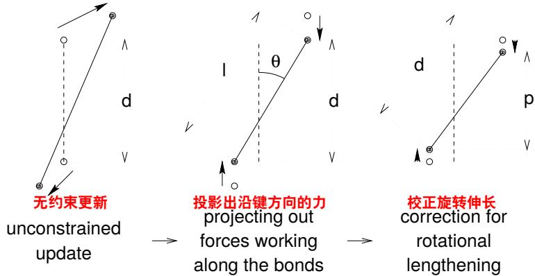  
图 5.8: 一次时间步中进行的三次位置更新。虚线代表长度为 ?? 的

旧键，实线代表新键。 $l = d \cos \theta$ $p = ( 2 d ^ { 2 } - l ^ { 2 } ) ^ { \frac { 1 } { 2 } }$

对约束方程的梯度矩阵，即下式的右半部分，使用新的记号

$$
B _ { h i } = \frac { \partial g _ { h } } { \partial r _ { i } }\tag{5.82}
$$

注意 B 为 $K \times 3 N$ 的矩阵，包含了约束的方向。下列方程显示了新的约束坐标 $\mathbf { r } _ { n + 1 }$ 与未约束坐标 $\mathbf { r } _ { n + 1 } ^ { u n c }$ 的关系

$$
\begin{array} { r } { \begin{array} { c } { \mathbf { r } _ { n + 1 } = ( \mathbf { I } - \mathbf { T } _ { n } \mathbf { B } _ { n } ) \mathbf { r } _ { n + 1 } ^ { u n c } + \mathbf { T } _ { n } \mathbf { d } = } \\ { \qquad \mathbf { r } _ { n + 1 } ^ { u n c } - \mathbf { M } ^ { - 1 } \mathbf { B } _ { n } ( \mathbf { B } _ { n } \mathbf { M } ^ { - 1 } \mathbf { B } _ { n } ^ { T } ) ^ { - 1 } ( \mathbf { B } _ { n } \mathbf { r } _ { n + 1 } ^ { u n c } - \mathbf { d } ) } \end{array} } \end{array}\tag{5.83}
$$

其中

$$
\mathbf { T } = \mathbf { M } ^ { - 1 } \mathbf { B } ^ { T } ( \mathbf { B } \mathbf { M } ^ { - 1 } \mathbf { B } ^ { T } ) ^ { - 1 }\tag{5.84}
$$

由方程 (5.80) 和 (5.81) 推导此方程的过程参见 $\ 4 9 _ { \hookrightarrow 5 3 3 }$ O

第一步并没有将实际的键长设置为规定的长度，而是设置为新键在旧键方向上的投影。为校正 ?? 的旋转，键在原先方向上的投影 $p _ { i }$ 被设置为

$$
p _ { i } = \sqrt { 2 d _ { i } ^ { 2 } - l _ { i } ^ { 2 } } ,\tag{5.85}
$$

其中 $l _ { i }$ 为第一次投影后的键长。校正后的位置为

$$
\mathbf { r } _ { n + 1 } ^ { * } = ( \mathbf { I } - \mathbf { T } _ { n } \mathbf { B } _ { n } ) \mathbf { r } _ { n + 1 } + \mathbf { T } _ { n } \mathbf { p } .\tag{5.86}
$$

5.4. 算法

旋转效应的这一校正实际上是一个迭代过程，但在 MD 过程中只进行了一次。对每个约束，经过这一步骤后，约束的相对偏差将小于 0.0001。在能量最小化中，这可能不够精确，因此迭代次数被设置为展开的阶数（见下文）。

一半的 CPU 时间被用于求解约束耦合矩阵 $\mathbf { B } _ { n } \mathbf { M } ^ { - 1 } \mathbf { B } _ { n } ^ { T }$ 的逆矩阵，而且必须每一步进行一次。这个$K \times K$ 矩阵的对角元素含有 $1 / m _ { i _ { 1 } } + 1 / m _ { i _ { 2 } }$ 。只有当两个键相连时非对角元素才不为零，而是 $\cos \phi / m _ { c }$ 其中 $m _ { c }$ 为连接两个键的原子质量， $\phi$ 为键之间的夹角。

使用幂展开方法对矩阵 T 进行求逆。为此引入 $K \times K$ 矩阵 S，其元素为矩阵 $\mathbf { B } _ { n } \mathbf { M } ^ { - 1 } \mathbf { B } _ { n } ^ { T }$ 对角元素平方根的倒数。这一矩阵可用于将耦合矩阵的对角元素变为 1:

$$
\begin{array} { r l } & { ( \mathbf { B } _ { n } \mathbf { M } ^ { - 1 } \mathbf { B } _ { n } ^ { T } ) ^ { - 1 } = \mathbf { S } \mathbf { S } ^ { - 1 } ( \mathbf { B } _ { n } \mathbf { M } ^ { - 1 } \mathbf { B } _ { n } ^ { T } ) ^ { - 1 } \mathbf { S } ^ { - 1 } \mathbf { S } } \\ & { ~ = \mathbf { S } ( \mathbf { S } \mathbf { B } _ { n } \mathbf { M } ^ { - 1 } \mathbf { B } _ { n } ^ { T } \mathbf { S } ) ^ { - 1 } \mathbf { S } = \mathbf { S } ( \mathbf { I } - \mathbf { A } _ { n } ) ^ { - 1 } \mathbf { S } } \end{array}\tag{5.87}
$$

矩阵 $\mathbf { A } _ { n }$ 为对称的稀疏矩阵，对角元素中含有零。因此可以使用一个简单的技巧来计算其逆矩阵：

$$
( \mathbf { I } - \mathbf { A } _ { n } ) ^ { - 1 } = \mathbf { I } + \mathbf { A } _ { n } + \mathbf { A } _ { n } ^ { 2 } + \mathbf { A } _ { n } ^ { 3 } + \ldots\tag{5.88}
$$

这种求逆方法只有当 $\mathbf { A } _ { n }$ 所有特征值的绝对值都小于 1 时才适用。对只含有键约束的分子，其连接度非常低，这个条件总是成立的，即便存在环状结构也是如此。对含有键角约束的分子可能会出现问题。使用额外的距离约束来约束键角会引入多个小的环状结构。这样分子的连通度变高，导致特征值变大。因此 LINCS 方法不能用于耦合键角约束。

对所有键都受约束的分子，?? 的本征值约为 $0 . 4 _ { \circ }$ 这意味着在展开方程 (5.88) 中，每增大一阶，偏差会降为原来的 0.4。但对相对孤立的约束三角形，最大特征值约为 $0 . 7 _ { \circ }$ 当使用额外的键角约束移除醇类基团中含氢的键角振动，或使用 LINCS 约束水分子时，例如使用柔性约束，会出现这样的三角形。这种三角形约束的收敛速度是其他约束的一半。因此，从 GROMACS 4 版本开始，在这类三角形的展开中添加额外的项

$$
( \mathbf { I } - \mathbf { A } _ { n } ) ^ { - 1 } \approx \mathbf { I } + \mathbf { A } _ { n } + \ldots + \mathbf { A } _ { n } ^ { N _ { i } } + \left( \mathbf { A } _ { n } ^ { * } + \ldots + \mathbf { A } _ { n } ^ { * ^ { N _ { i } } } \right) \mathbf { A } _ { n } ^ { N _ { i } }\tag{5.89}
$$

其中 $N _ { i }$ 为展开的常规阶数， $\mathbf { A } ^ { * }$ 只包含 A 中处于刚性三级耦合约束内的元素，所有其他元素都为零。使用这种方法，键角约束的精度与其他约束接近，同时确定展开所需要的一系列矩阵向量乘法只需要扩展到几个约束耦合。这一过程在 P-Lincs 论文中有说明 $5 0 _ { \circ }$ 533。

## LINCS 参数

LINCS 的精度取决于展开方程 (5.88) 中使用的矩阵数目。对 MD 计算四阶展开就足够了。对于使用大时间步长的布朗动力学，可能需要八阶展开。展开阶数是 $m d p _ { \hookrightarrow 4 5 4 }$ 文件中的一个参数。LINCS 的实现方式保证了其算法不可能崩溃。即使不可能重置约束，LINCS 也会产生一个尽可能满足约束的构型。但是，当在某一步中键的旋转超过预先设定的角度时，LINCS 会给出警告。用户可以在 $m d p _ { \hookrightarrow 4 5 4 }$ 文件中设置这一角度。

## 5.4.6 模拟退火

GROMACS 支持著名的模拟退火（SA）方法，你甚至可以将多个原子组单独地与任意数目的参考温度进行耦合，而参考温度在模拟过程中也可以发生变化。对温度耦合中的每个组，退火是通过简单地改变当前参考温度来实现的，因此实际的弛豫和耦合性质取决于你使用的恒温器类型以及耦合强度。由于参考温度会变化，因此请务必记住系统温度不会立即达到参考值 - 你必须考虑到耦合算法固有的弛豫时间。如果退火参考温度的改变快于温度弛豫，当它们之间相差过大时，模拟最终可能崩溃。

退火策略是为每个组指定一系列对应的时间和参考温度，你也可以选择只使用单个序列（退火完成后温度将耦合到最后的参考值），或者使用周期性退火，这样当退火序列完成后，会从第一个参考温度重新开始。在模拟中你可以混合并匹配两种退火类型，以及非退火组。

## 5.4.7 随机动力学

随机或速度 Langevin 动力学为牛顿运动方程增加了摩擦项和噪声项：

$$
m _ { i } { \frac { \mathrm { d } ^ { 2 } \mathbf { r } _ { i } } { \mathrm { d } t ^ { 2 } } } = - m _ { i } \gamma _ { i } { \frac { \mathrm { d } \mathbf { r } _ { i } } { \mathrm { d } t } } + \mathbf { F } _ { i } ( \mathbf { r } ) + { \overset { \circ } { \mathbf { r } } } _ { i } ,\tag{5.90}
$$

其中 $\gamma _ { i }$ 为摩擦系数，单位 $1 / \mathrm { p s } , { \bf \phi } _ { { \bf f } \mathrm { f } } ^ { \circ } ( t )$ 为噪音过程，满足 $\langle \overset { \circ } { r } _ { k } ( t ) \overset { \circ } { r } _ { \left\{ t + s \right\} } \rangle = 2 m _ { i } \gamma _ { i } k _ { B } T \delta ( s ) \delta _ { i j } \nonumber$ 。当 $1 / \gamma _ { i }$ 大于系统中存在的时间尺度时，随机动力学可视为具有随机温度耦合的分子动力学。但时间长于 $1 / \gamma _ { i }$ 的任何过程，如流体动力学都会受到抑制。由于每个自由度都独立地耦合到热浴，因此快速运动模式的平衡非常迅速。模拟真空中的系统时，SD 还存在另外一个优点，即整体平动和转动自由度的误差不会累积。当 $1 / \gamma _ { i }$ 小于系统中存在的时间尺度时，动力学与 MD 完全不同，但采样仍然正确。

在 GROMACS 中有一个简单而有效的实现。其精度相当于常规 MD 蛙跳式和速度 Verlet 积分方法。这种方法几乎完全等同于常用的离散 Langevin 方程的方法，但以脉冲方式施加摩擦力项和速度项 $5 1 _ { \substack { \scriptscriptstyle \hookrightarrow \mathrm { 5 3 3 } \mathrm { c } } }$ 具体如下

$$
\begin{array} { r l r } { \mathbf { v } ^ { \prime } } & { = } & { \mathbf { v } ( t - \displaystyle \frac { 1 } { 2 } \Delta t ) + \displaystyle \frac { 1 } { m } \mathbf { F } ( t ) \Delta t } \\ { \Delta \mathbf { v } } & { = } & { - \alpha \mathbf { v } ^ { \prime } ( t + \displaystyle \frac { 1 } { 2 } \Delta t ) + \sqrt { \frac { k _ { B } T } { m } ( 1 - \alpha ^ { 2 } ) } \mathbf { r } ^ { G } { _ i } } \\ { \mathbf { r } ( t + \Delta t ) } & { = } & { \mathbf { r } ( t ) + \left( \mathbf { v } ^ { \prime } + \displaystyle \frac { 1 } { 2 } \Delta \mathbf { v } \right) \Delta t } \end{array}\tag{5.91}
$$

$$
\begin{array} { r l r } { \mathbf { v } ( t + \frac { 1 } { 2 } \Delta t ) } & { = } & { \mathbf { v } ^ { \prime } + \Delta \mathbf { v } } \\ { \alpha } & { = } & { 1 - e ^ { - \gamma \Delta t } } \end{array}\tag{5.92}
$$

其中 $\mathbf { r } ^ { G } { _ { \mathrm { ~ \scriptsize ~ : ~ } } }$ 为服从高斯分布的噪声，其均值 $\mu = 0$ ，方差 $\sigma = 1 ,$ 。缩放首先在无摩擦与噪音的情况下更新整个时间步的速度，获得 $\mathbf { v } ^ { \prime }$ ，这完全等同于蛙跳式方法中的常规更新。然后在 $t + \Delta t$ 步以脉冲方式施加摩擦和噪声。这种方案的优点在于依赖速度的项在整个时间步中都起作用，由于力依赖于坐标和速度，这就使得方案对力进行正确积分变得简单明了，例如在约束和耗散粒子动力学（DPD，尚未实现）情况$\textsf { F } _ { \circ }$ 有约束时，坐标更新方程 (5.92) 会被分为正常的蛙跳式更新和 $\Delta \mathbf { v } _ { \mathrm { { c } } }$ 。这两个更新都完成之后，再对坐标和速度施加约束。

当使用 SD 作为恒温器时， $\gamma$ 的合适值可取 $0 . 5 ~ \mathrm { p s ^ { - 1 } }$ ，因为这样得到的摩擦低于水的内部摩擦，同时仍能提供有效的控温。

## 5.4.8 布朗动力学

在高摩擦的极限情况下，随机动力学退化为布朗动力学，也称为位置 Langevin 动力学。这适用于过阻尼系统，即惯性效应可忽略不计的系统。方程为

$$
\frac { \mathrm { d } \mathbf { r } _ { i } } { \mathrm { d } t } = \frac { 1 } { \gamma _ { i } } \mathbf { F } _ { i } ( \mathbf { r } ) + \overset { \circ } { \mathbf { r } } _ { i }\tag{5.93}
$$

其中 $\gamma _ { i }$ 为摩擦系数，单位 $\mathrm { \ a m u / p s } , \mathring { \mathbf { r } } \lbrace t \rbrace$ 为噪音过程，满足 $\langle \overset { \circ } { r } _ { k } ( t ) \overset { \circ } { r } _ { \left\{ t + s \right\} } \rangle = 2 \delta ( s ) \delta _ { i j } k _ { B } T / \gamma _ { i }$ 。在 GROMACS中，使用简单的显式方案对上式进行积分。

$$
\mathbf { r } _ { i } ( t + \Delta t ) = \mathbf { r } _ { i } ( t ) + \frac { \Delta t } { \gamma _ { i } } \mathbf { F } _ { i } ( \mathbf { r } ( t ) ) + \sqrt { 2 k _ { B } T \frac { \Delta t } { \gamma _ { i } } } \mathbf { r } ^ { G } { } _ { i } ,\tag{5.94}
$$

其中 $\mathbf { r } ^ { G } { _ { i } }$ 为服从高斯分布的噪声，其均值 $\mu = 0$ ，方差 $\sigma = 1$ 。所有粒子的摩擦系数 $\gamma _ { i }$ 可以取相同值，或 $\gamma _ { i } = m _ { i } \gamma _ { i }$ ，其中的摩擦系数 $\gamma _ { i }$ 对不同的原子组可以取不同值。由于假定系统处于过阻尼状态，因此可以使用大的时间步长。应使用 LINCS 施加约束，因为对于大的原子位移，SHAKE 方法不收敛。BD是 $m d r u n _ { \substack { \scriptscriptstyle \mathrm { Q 1 3 1 } } }$ 程序的一个选项。

## 5.4.9 能量最小化

GROMACS 中的能量最小化可以使用最陡下降，共轭梯度或 L-BFGS（有限内存的 Broyden-Fletcher-Goldfarb-Shanno 准牛顿最小化…我们更喜欢缩写）来完成。EM 只是 $m d r u n _ { \substack { \scriptscriptstyle \mathrm { Q 1 3 1 } } }$ 的一个选项。

## 最陡下降

虽然最陡下降算法并不是最有效的搜索算法，但它很稳健，并且易于实现。

定义代表所有 3?? 个坐标的向量 $\mathbf { r } _ { \mathrm { ~ o ~ } }$ 开始时，必须给出最大位移 $h _ { 0 }$ (如 0.01 nm)。

首先计算力 F 和势能。新位置的计算方法如下

$$
\mathbf { r } _ { n + 1 } = \mathbf { r } _ { n } + { \frac { \mathbf { F } _ { n } } { \operatorname* { m a x } ( | \mathbf { F } _ { n } | ) } } h _ { n } ,\tag{5.95}
$$

其中 $h _ { n }$ 为最大位移， $\mathbf { F } _ { n }$ 为力，也即势能 ?? 的负梯度。 $\operatorname* { m a x } ( | \mathbf { F } _ { n } | )$ 表示所有原子上力的大小的最大值。再次计算新位置对应的力和能量

若 $( V _ { n + 1 } < V _ { n } )$ ，则接受新位置，令 $h _ { n + 1 } = 1 . 2 h _ { n } .$

若 $( V _ { n + 1 } \geq V _ { n } )$ ，则拒绝新位置，令 $h _ { n } = 0 . 2 h _ { n }$

当力的计算次数达到了用户指定的数目（如 100），或者力（梯度）分量绝对值的最大值小于设定值 ??时，算法会终止。由于力的截断会导致计算能量时出现噪声，终止判据不应设得过高，以免算法迭代无法结束。?? 的合理值可根据简谐振子在温度 ?? 下表现出的均方根力来估计。其值为

$$
f = 2 \pi \nu { \sqrt { 2 m k T } } ,\tag{5.96}
$$

其中 ?? 为振子频率，?? 为（约化）质量，?? 为 Boltzmann 常数。对波数为 $1 0 0 ~ \mathrm { { c m } ^ { - 1 } }$ ，质量为 10 原子单位的弱振子，温度为 1 K 时 $f = 7 . 7 \ \mathrm { k J m o l ^ { - 1 } \ n m \ ^ { - 1 } }$ 。?? 的值在 1 到 10 之间是可以接受的。

## 共轭梯度法

在最小化的早期阶段，共轭梯度方法要慢于最陡下降方法，但在接近能量极小点时，共轭梯度方法更高效。这种方法的参数和终止判据与最陡下降法相同。在 GROMACS 中，共轭梯度法不能与约束一起使用，包括用于水的 SETTLE 算法 $\ 4 \ : 7 _ { \odot 5 3 3 }$ ，因为尚未实现。如果系统中存在水，必须使用柔性水模型，这可以通过 $\not \mathrm { E } m d p _ { \hookrightarrow 4 5 4 }$ 文件中指定 $\mathtt { d e f i n e \ = \ - D F L E X I B L E }$ 来实现。

这真的不算一个限制，因为只有在简正模式分析之前进行的能量最小化才需要共轭梯度的精度，而简正分析时不能使用约束。对于大多数其他目的，最陡下降足够有效。

## L-BFGS 法

原始的 BFGS 算法会逐步产生更好的逆 Hessian 矩阵的近似，并将系统移动到当前估计的最小点。这种方法需要的内存正比于粒子数的平方，因此对于像生物分子这样的大系统是不实用的。作为替代，我们使用了 Nocedal 的 L-BFGS 算法52↪533，53↪533，它通过来自前面步骤的固定数目的校正来得到近似的逆 Hessian 矩阵。这种滑动窗技术几乎与原始方法一样有效，但所需内存小得多 - 正比于粒子数和校正步数的成积。在实践中，我们发现它比共轭梯度法收敛得更快，但由于存在校正步骤，此方法尚未并行化。也需要指出，切换或移位相互作用通常会改善收敛性，因为明显的截断意味着当前坐标下的势能函数与前面步骤中用于构建逆 Hessian 矩阵近似的势能函数略有不同。

## 5.4.10 简正模式分析

GROMACS 可以进行简正模式分析 $5 \mathit { 4 } _ {  5 3 4 } 5 \mathit { 6 } _ {  5 3 4 }$ ，计算是通过对角化质量加权 Hessian 矩阵 ?? 完成的：

$$
\begin{array} { r l r } { R ^ { T } M ^ { - 1 / 2 } H M ^ { - 1 / 2 } R = } & { { } \mathrm { d i a g } ( \lambda _ { 1 } , \ldots , \lambda _ { 3 N } ) } & { } \\ { \lambda _ { i } = } & { { } } & { ( 2 \pi \omega _ { i } ) ^ { 2 } } \end{array}\tag{5.97}
$$

其中 ?? 包含了原子质量，?? 的列为特征向量， $\lambda _ { i }$ 为特征值， $\omega _ { i }$ 为相应的频率。

首先要计算 Hessian 矩阵，它是一个 $3 N \times 3 N$ 的矩阵，其中 ?? 为原子数：

$$
H _ { i j } = \begin{array} { c } { { \frac { \partial ^ { 2 } V } { \partial { x _ { i } } \partial { x _ { j } } } } } \end{array}\tag{5.98}
$$

其中 $x _ { i }$ 和 $x _ { j }$ 表示原子的 x，y 或 z 坐标。在实践中，并不使用上面的公式，而是根据得到的力，利用数值方法计算 Hessian 矩阵：

$$
\begin{array} { r l r } { H _ { i j } = } & { - \displaystyle \frac { f _ { i } ( \mathbf { x } + h \mathbf { e } _ { j } ) - f _ { i } ( \mathbf { x } - h \mathbf { e } _ { j } ) } { 2 h } } & \\ { f _ { i } = } & { - \displaystyle \frac { \partial V } { \partial x _ { i } } } \end{array}\tag{5.99}
$$

其中 $\mathbf { e } _ { j }$ 为 $j$ 方向上的单位向量。应当指出，对通常的简正模式计算，在计算 Hessian 矩阵之前必须进行完全的能量最小化。能量最小化所需的容差取决于系统的类型，但粗略的指示值为 $0 . 0 0 1 \ \mathrm { k J \ m o l ^ { - 1 } }$ 。应当使用共轭梯度法或 L-BFGS 法进行能量最小化，并使用双精度。

这些计算会涉及多个GROMACS程序。首先，应该使用 $m d r u n _ { \substack { \scriptscriptstyle \mathrm { Q 1 3 1 } } }$ 进行能量最小化。然后，使用 $m d r u n _ { \substack { < 1 3 1 } }$ 计算 Hessian 矩阵。注意，创建运行输入文件时应使用来自全精度轨迹文件中的最小化的构型，因为结构文件不够精确。 $g m x \ n m e i g _ { \ldots 1 4 1 }$ 程序可以进行对角化计算，并将简正模式按频率大小进行排序。mdrun↪131和 $y m x \ n m e i g _ { \ldots 1 4 1 }$ 都应当使用双精度版本。可以使用 $g m x \ a n a e i g _ { \scriptscriptstyle  \mathrm { 4 7 } }$ 程序分析简正模式。要生成任何温度下，任意一组简正模式的结构系综，可以使用 $y m x \ n m e n s _ { \scriptscriptstyle { \mathrm { < } } 1 4 3 }$ 程序。关于简正模式分析以及相关的主成分分析（参见协方差分析 $_ { < 5 1 6 } \longrightarrow \frac { + 4 } { \mathsf { J } } $ ）的概述可参见 $5 \gamma _ { \scriptscriptstyle \odot 5 3 4 }$ 。

## 5.4.11 自由能计算

## 慢增长方法

GROMACS 可使用多种不同的方法计算自由能，其中包括“慢增长”方法。一个示例问题可能是计算抑制剂 I 分别与酶 E，突变后的酶 E′ 结合时的自由能差值。利用计算机模拟对如此大的复合物进行对接计算是不可行的，甚至不可能在合理的计算时间内以合理的精度模拟抑制剂从酶中释放的过程。但是，如果我们考虑 图 5.9 A 中的自由能循环，可以得到：

$$
\Delta G _ { 1 } - \Delta G _ { 2 } = \Delta G _ { 3 } - \Delta G _ { 4 }\tag{5.100}
$$

如果我们对左边的项感兴趣，那可以同样精度计算右边的项。

如果我们想要计算两种抑制剂 I 和 I′ 分别与酶 E 结合时的自由能差值（图 5.9 B），我们可以再次使用方程 (5.100) 来得到所需的结果。

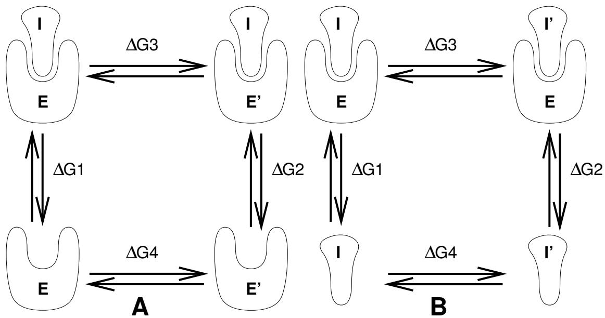  
图 5.9: 自由能循环 A: 计算抑制剂 I 分别与酶 E，E′ 结合时的自由能差值 $\Delta G _ { 1 2 }$ 。B: 计算抑制剂 I，I′ 分别与酶 E 结合时的自由能差值 $\Delta G _ { 1 2 } .$

在 GROMACS 中可以使用“慢增长”方法计算两个分子物种之间的自由能差值。这种不同分子物种之间的自由能差值没有物理意义，但可以通过热力学循环利用它们获得有意义的量。这种方法要求在模拟过程中，系统的哈密顿量缓慢地从描述一个系统（A）转变到描述另一个系统（B）。变化必须非常缓慢，以保证系统在整个过程中仍保持平衡状态。如果满足了这个要求，变化就是可逆的，并且从 B 到 A 的慢增长模拟会与从 A 到 B 的慢增长模拟得到相同的结果（但符号相反）。这是一个有用的核查方法，但用户应该意识到，正向和反向增长结果的相等并不能保证结果的正确性。

哈密顿量 ?? 所需的修改是通过将 ?? 作为 耦合参数 ?? 的函数实现的： $H = H ( p , q ; \lambda )$ 。这样 $\lambda = 0$ 描述系统 A，而 ?? = 1 描述系统 B:

$$
H ( p , q ; 0 ) = H ^ { \mathrm { A } } ( p , q ) ; ~ H ( p , q ; 1 ) = H ^ { \mathrm { B } } ( p , q ) .\tag{5.101}
$$

在 GROMACS 中，?? 依赖关系的函数形式对于各种力场贡献是不同的，对此的说明见自由能相互作$\mathbb { H } _ { \hookrightarrow 4 0 2 } \longrightarrow \ddagger$ 。

亥姆霍兹自由能 ?? 与 ??, ?? , ?? 系综的的配分函数 $Q$ 有关，这一系综是在体积和温度不变的情况下 MD模拟生成的平衡系综。通常更有用的吉布斯自由能 $G$ 与 $N , p , T$ 系综的配分函数 $\Delta$ 有关，这一系综是在压力和温度不变的情况下 MD 模拟生成的平衡系综。

$$
\begin{array} { r l r } { A ( \lambda ) = } & { } & { - k _ { B } T \ln Q } \\ { Q = } & { } & { c \displaystyle \int \int \exp [ - \beta H ( p , q ; \lambda ) ] d p d q } \\ { G ( \lambda ) = } & { } & { - k _ { B } T \ln \Delta } \\ { \Delta = } & { } & { c \displaystyle \iint \int \exp [ - \beta H ( p , q ; \lambda ) - \beta p V ] d p d q d V } \\ { G = } & { } & { A + p V , } \end{array}\tag{5.102}
$$

其中 $\beta = 1 / ( k _ { B } T ) , ~ c = ( N ! h ^ { 3 N } ) ^ { - 1 }$ 。这些相空间上的积分无法通过模拟得到，但可以将它们对 ?? 的导数作为系综平均值：

$$
\frac { d A } { d \lambda } = \frac { \int \int ( \partial H / \partial \lambda ) \exp [ - \beta H ( p , q ; \lambda ) ] d p d q } { \iint \exp [ - \beta H ( p , q ; \lambda ) ] d p d q } = \left. \frac { \partial H } { \partial \lambda } \right. _ { N V T ; \lambda } ,\tag{5.103}
$$

$N , p , T$ 系综中 $d G / d \lambda$ 的关系与此类似。A 和 B 之间的自由能差值可以通过积分对 ?? 的导数得到：

$$
A ^ { \mathrm { B } } ( V , T ) - A ^ { \mathrm { A } } ( V , T ) = \ \int _ { 0 } ^ { 1 } \left. \frac { \partial H } { \partial \lambda } \right. _ { N V T ; \lambda } d \lambda\tag{5.104}
$$

$$
G ^ { \mathrm { B } } ( p , T ) - G ^ { \mathrm { A } } ( p , T ) = \ \int _ { 0 } ^ { 1 } \left. \frac { \partial H } { \partial \lambda } \right. _ { N p T ; \lambda } d \lambda .\tag{5.105}
$$

如果要计算 $G ^ { \mathrm { B } } ( p , T ) - G ^ { \mathrm { A } } ( p , T )$ ，自然的选择是等压模拟。但是，也可以从体积不变的慢增长模拟计算。模拟从压力为 $p$ ，体积为 ?? 的体系 A 开始，到压力为 $p _ { B }$ 的系统 B 结束，并进行下面的小校正（但原则上是精确的）:

$$
G ^ { \mathrm { B } } ( p ) - G ^ { \mathrm { A } } ( p ) = A ^ { \mathrm { B } } ( V ) - A ^ { \mathrm { A } } ( V ) - \int _ { p } ^ { p ^ { \mathrm { B } } } [ V ^ { \mathrm { B } } ( p ^ { \prime } ) - V ] d p ^ { \prime }\tag{5.106}
$$

上面的公式中我们省略了常量 $T _ { \circ }$ 。这一校正大致等于 $- \textstyle { \frac { 1 } { 2 } } ( p ^ { \mathrm { { B } } } - p ) \Delta V = ( \Delta V ) ^ { 2 } / ( 2 \kappa V )$ ，其中 Δ?? 为压力 $p$ 时的体积变化，?? 为等温压缩系数。这一校正通常很小；例如，体积恒定的情况下，在 1000 个水分子的系统中凭空产生一个水分子，增加的额外压力高达 22 bar，但对亥姆霍兹自由能的校正只有-1 kJ$\mathrm { m o l ^ { - 1 } }$ 。在笛卡尔坐标系中，哈密顿量中的动能项只依赖于动量，可单独进行积分，并且实际上可以从方程中去掉。当质量不变时，动能对自由能完全没有贡献。当质量有变化时，对自由能的累积贡献为$- { \textstyle \frac { 3 } { 2 } } k _ { B } T \ln ( m ^ { \mathrm { B } } / m ^ { \mathrm { A } } )$ 。注意，这只适用于没有约束的情况。

## 热力学积分

GROMACS 也可以在一次模拟中对方程 (5.104) 或方程 (5.105) 在从 A 到 B 的整个范围内进行积分。但是，如果变化很大，采样可能不充分，用户可能更愿意在一些精心选择的 ?? 中间值上精确地确定$\langle d G / d \lambda \rangle$ 的值。这很容易通过将步长 delta\_lambda 设置为零来实现。每次模拟都可以先进行平衡，再根据 $\partial H / \partial \lambda$ 的涨落得到每个 ????/???? 值适当的误差估计。然后通过适当的数值积分方法确定总的自由能变化。

GROMACS 现在也支持利用 Bennett 接受率（BAR，Bennett’s Acceptance Ratio）方法 $5 8 _ { \scriptscriptstyle \odot 5 3 4 }$ 计算从状态 A 转变到状态 B 的 ΔG 值，使用的程序为 $g m x \ b a r _ { \odot 5 5 } ,$ 。利用相同的数据也可以使用 $\mathrm { M B A R } 5  { \mathcal { G } } _ { \odot 5 3 4 }$ 方法来计算自由能，但目前需要借助于外部 pymbar 程序包↪https://SimTK.org/home/pymbar 中的工具。

力场贡献项与 ?? 的依赖关系将在自由能相互作 $\Re _ { \hookrightarrow 4 0 2 }$ 一节中进行详细描述。

## 5.4.12 副本交换动力学

副本交换分子动力学（Replica Exchange MolecularDynamics，REMD）是一种加速采样的方法，可用于任何类型的模拟，特别适用于不同构象之间存在较高能量势垒的情况。它对同一系统处于不同温度下的多个副本进行模拟，并按一定的时间间隔随机地交换两个副本的完整状态，交换概率为：

$$
P ( 1  2 ) = \operatorname* { m i n } ( 1 , \exp [ ( { \frac { 1 } { k _ { B } T _ { 1 } } } - { \frac { 1 } { k _ { B } T _ { 2 } } } ) ( U _ { 1 } - U _ { 2 } ) ] )\tag{5.107}
$$

其中 $T _ { 1 }$ 和 $T _ { 2 }$ 为参考温度， $U _ { 1 }$ 和 $U _ { 2 }$ 分别为副本 1 和 2 的瞬时势能。交换后，使用 $( T _ { 1 } / T _ { 2 } ) ^ { \pm 0 . 5 }$ 对速度进行缩放，并在下一步进行邻区搜索。这种方法结合了最高温度的快速采样和频繁跨垒，以及所有不同温度下正确的 Boltzmann 采样 $6 0 _ { \scriptscriptstyle { \hookrightarrow 5 3 4 } } , 6 \ = I _ { \scriptscriptstyle { \odot 5 3 4 } } \circ$ 因为概率随着温差的增加而迅速下降，我们只会尝试与相邻的温度进行交换。在一步中不应该尝试对所有可能的配对副本进行交换。例如，如果交换副本 1 和2，交换副本 2 和 3 的机会不仅取决于副本 2 和 3 的能量，还取决于副本 1 的能量。在 GROMACS 中，对这个问题的解决方法是，在 奇数次尝试时试着交换所有的 奇数副本对，在 偶数次尝试时试着交换所有的 偶数副本对。如果我们有四个按温度排序的副本：0，1，2 和 3，并且每 1000 步尝试交换一次，那么将会在 1000，3000 等步尝试交换 0-1 和 2-3，在 2000，4000 等步尝试交换 1-2。

应该如何选择温度呢? 能量差可以写为：

$$
U _ { 1 } - U _ { 2 } = N _ { d f } { \frac { c } { 2 } } k _ { B } ( T _ { 1 } - T _ { 2 } )\tag{5.108}
$$

其中 $N _ { d f }$ 为一个副本的总自由度数，?? 对简谐势为 1，对蛋白质/水系统为 2 左右。如果 $T _ { 2 } = ( 1 + \epsilon ) T _ { 1 }$ 则概率变为：

$$
P ( 1  2 ) = \exp ( - \frac { \epsilon ^ { 2 } c N _ { d f } } { 2 ( 1 + \epsilon ) } ) \approx \exp ( - \epsilon ^ { 2 } \frac { c } { 2 } N _ { d f } )\tag{5.109}
$$

因此对于大小为 $e ^ { - 2 } \approx 0 . 1 3 5$ 的概率，可得到 $\epsilon \approx 2 / \sqrt { c N _ { d f } }$ 。所有键都受到约束时， $N _ { d f } \approx 2 N _ { a t o m s }$ ，因此，对于 $c = 2$ ，应选择 ?? 为 $1 / \sqrt { N _ { a t o m s } }$ 。但是，当使用压力耦合时存在一个问题。在较高的温度下，密度会降低，从而导致能量增高 $6 \mathcal { Q } _ { \scriptscriptstyle \mathrm { Q } , \scriptscriptstyle \mathrm { 5 3 4 } }$ ，这些我们也应该考虑到。GROMACS 网站提供了一个所谓的 REMD计算器，可以根据你输入的温度范围和原子数给出一组建议温度。

Okabe 等人将 REMD 扩展到等温等压系综 $6 \mathcal { B } _ { \hookrightarrow 5 3 4 }$ ，他们将交换概率修改为：

$$
P ( 1  2 ) = \operatorname* { m i n } ( 1 , \exp [ ( \frac { 1 } { k _ { B } T _ { 1 } } - \frac { 1 } { k _ { B } T _ { 2 } } ) ( U _ { 1 } - U _ { 2 } ) + ( \frac { P _ { 1 } } { k _ { B } T _ { 1 } } - \frac { P _ { 2 } } { k _ { B } T _ { 2 } } ) ( V _ { 1 } - V _ { 2 } ) ] )\tag{5.110}
$$

其中 $P _ { 1 }$ 和 $P _ { 2 }$ 为各自的参考压力， $V _ { 1 }$ 和 $V _ { 2 }$ 为模拟中各自的瞬时体积。在大多数情况下，体积的差别非常小，第二项可以忽略不计。只有当 $P _ { 1 }$ 和 $P _ { 2 }$ 之间相差很大或存在相变时，第二项才起作用。

GROMACS 还支持哈密顿量副本交换。在哈密顿量副本交换中，每个副本的哈密顿量都不同，是由模拟指定的自由能路径定义的。用来维持正确系综概率的交换概率为：

$$
P ( 1  2 ) = \operatorname* { m i n } ( 1 , \exp [ ( { \frac { 1 } { k _ { B } T _ { 1 } } } - { \frac { 1 } { k _ { B } T _ { 2 } } } ) ( ( U _ { 1 } ( x _ { 2 } ) - U _ { 1 } ( x _ { 1 } ) ) + ( U _ { 2 } ( x _ { 1 } ) - U _ { 2 } ( x _ { 2 } ) ) ) ] )\tag{5.111}
$$

单独的哈密顿量由 GROMACS 的自由能功能定义，并在不同的 ?? 值之间进行交换，?? 的值在 mdp 文件中定义。

哈密顿量和温度副本交换也可以同时进行，使用的接受判据为：

$$
P ( 1  2 ) = \operatorname* { m i n } ( 1 , \exp [ ( \frac { 1 } { k _ { B } T _ { 1 } } - \frac { 1 } { k _ { B } T _ { 2 } } ) ( \frac { U _ { 1 } ( x _ { 2 } ) - U _ { 1 } ( x _ { 1 } ) } { k _ { B } T _ { 1 } } + \frac { U _ { 2 } ( x _ { 1 } ) - U _ { 2 } ( x _ { 2 } ) } { k _ { B } T _ { 2 } } ) ] )\tag{5.112}
$$

GROMACS 还实现了 Gibbs 采样副本交换 $6 / _ { 4 } { _ { \circ } } { _ { 5 3 4 } } \circ$ 。在 Gibbs 采样副本交换中，会测试所有可能进行交换的副本对，并允许交换不相邻的副本。

Gibbs 采样副本交换不需要额外的势能计算。然而，Gibbs 采样副本交换需要额外的通信开销，因为对于某些排列，肯定会发生超过一轮的交换。在某些情况下，这种额外的通信开销可能会影响计算效率。

$m d r u n _ { \substack { \scriptscriptstyle \mathrm { Q 1 3 1 } } }$ 程序的选项包含了所有不同的副本交换方法。由于算法固有的并行性，只有安装了 MPI 版本时才能运行副本交换模拟。为了提高效率，每个副本都可以在单独的队列上运行。关于如何使用多节点功能，请参阅mdrun↪131。

## 5.4.13 本性动力学采样

蛋白质本性动力学（Essential Dynamics）的结果（见协方差分析 $\hookrightarrow 5 1 6$ 一节）可用于指导 MD 模拟。其思想是，从初始 MD 模拟（或其他来源）定义一个具有最大振幅的集约涨落。对沿一个或多个这些集约模式的那些位置，在接下来的（第二次）MD 模拟中可以使用约束，约束可以多种方式进行，达到不同的目的。例如，沿某一特定模式的位置可以保持不变，以监测在这一位置的那些坐标上的平均力（自由能梯度）。另一个应用是提高相对于常规 MD 的采样效率 $6 5 _ { \hookrightarrow 5 3 4 } , 6 6 _ { \hookrightarrow 5 3 4 }$ 。在这种情况下，与蛋白质通常采用的类扩散途径相比，对系统可及构型空间的采样更系统。

另一种增强采样的可能方法是洪泛方法。在这种方法中，将洪泛势添加到某些（集约）自由度上，以将系统驱离某些相空间区域67 ↪534。

本性动力学采样或泛洪方法的步骤如下。首先使用协方差分析 $( \ g m x \ c o v a r _ {  6 9 } \ )$ ）或简正模式分析 $( \ g m x$ $n m e i g _ { \scriptscriptstyle { \Theta } _ { \scriptscriptstyle { \Theta } 1 4 1 } } )$ 确定特征向量和特征值。然后将这些信息提供给 $m a k e \_ e d i _ { \substack { _ { \mathrm { c 1 2 3 } } } }$ ，这个命令有很多用于选择向量和设置参数的选项，请参见 $\mathrm { g m x \ m a k e \_ e d i \ \Sigma - h }$ 。最后将生成的 $e d i _ { \ c \div 4 5 1 }$ 输入文件传递给 $m d r u n _ { \substack { \scriptscriptstyle \mathrm { Q 1 3 1 } } }$ 。

## 5.4.14 扩展系综动力学

在扩展系综模拟中 $6  { \delta } _ { \odot 5 3 4 }$ ，坐标和热力学系综都被视为可供采样的构型变量。任何给定状态的概率可写为：

$$
P ( \vec { x } , k ) \propto \exp \left( - \beta _ { k } U _ { k } + g _ { k } \right) ,\tag{5.113}
$$

其中 $\begin{array} { r } { \beta _ { k } = \frac { 1 } { k _ { B } T _ { k } } } \end{array}$ 为对应于第 ?? 个热力学状态的 $\beta$ ， $g _ { k }$ 为用户指定的权重因子，对应于第 ?? 个状态。因此，这个空间是一个 混合，广义或 扩展的系综，是同时从多个热力学系综中采样得到的。 $g _ { k }$ 用于为扩展系综中的每个子系综指定特定的权重，既可以是固定的，也可以由迭代程序确定。通常选择的 $g _ { k }$ 集合对每个热力学系综会给出相等的概率，在这种情况下 $g _ { k }$ 等于无量纲的自由能，但也可以根据需要将它们设置为任意值。可以使用几种不同的算法来平衡这些权重，mdp 选项列表中对此有说明。

在 GROMACS 中，通过交替地在 ?? 和 ⃗?? 方向上进行采样对这个空间进行采样。 ⃗?? 方向上的采样由标准的分子动力学采样完成；不同热力学状态之间的采样由蒙特卡洛完成，而且支持几种不同的蒙特卡洛移动。?? 状态可以根据不同的温度来定义，也可以通过自由能 ?? 变量的选择来定义，或两者兼而有之。因此，扩展系综模拟代表了副本交换形式的系列化，单次模拟就能探索多个热力学状态。

## 5.4.15 并行

通过在多个内核上并行地运行模拟，可以减少模拟所需的 $\mathrm { C P U }$ 时间。理想情况下，我们可能希望得到线性标度：在 ?? 个核上运行的速度是单个核的 ?? 倍。在实践中，只有当核数很少时才能达到这种效果。计算的标度行为在很大程度上取决于所使用的算法。而且，不同算法对原子间相互作用的范围有不同的限制。

## 5.4.16 区域分解

由于分子模拟中的大多数相互作用都是局部的，因此区域分解是分解系统的自然方式。在区域分解中，每个进程分配一块空间区域，然后对当前处于局部区域中的粒子的运动方程进行积分。使用区域分解，你必须要做两个选择：将单元晶胞划分为区域，将力分配给区域。大多数分子模拟软件包都使用半壳层方法来分配力。但有两种方法需要的通信总是更少：第八壳层法 $6 9 _ { \hookrightarrow 5 3 4 }$ 和中点法70↪534。GROMACS 目前使用的是第八壳层法，但对某些系统或硬件架构，使用中点法可能更有优势。因此，我们将来可能会实现中点法。区域分解的大部分技术细节可以在 GROMACS 4 的论文 $\boldsymbol { { \it 5 } } _ { \hookrightarrow 5 3 1 }$ 中找到。

## 坐标和力的通信

在三斜晶胞的最一般情况下，我们用 1D，2D 或 3D 格点将空间划分成平行六面体，称之为区域分解单元。每个单元被指定到一个粒子-粒子进程。在每个 MD 步的开始，系统被分到多个进程，并在那里执行邻区搜索。分区的最小单位可以是原子，也可以是使用（已弃用）组截断方案的电荷组，或更新组。更新组是一组原子，它们在更新过程中具有依赖关系，在使用约束和/或虚拟位点时就存在这种情况。因此，不同的更新组可以独立地进行更新。目前，更新组最多只能使用两个连续约束，这是仅约束涉及氢原子的键时的情况。更新组的优点是，更新时不需要通信，这样在计算其他部分的力的同时就可以更新系统的一部分。原子组被分配到其几何中心所在的单 $\widehat { \pi } _ { \circ }$ 。在计算力之前，需要对一些来自相邻单元的坐标进行通信，而在力的计算完成之后，需要将力沿另一个方向通信。通信和力的分配基于能覆盖一个或多个单元的区域。区域设置的一个示例见 图 5.10。

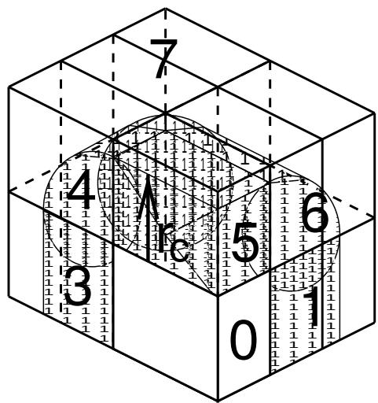  
图 5.10: 3×2×2 单元无交错的区域分解格点。区域 1 到 7 中的坐标被传送到边角单元，此单元在区域 0 中拥有自己的主粒子。 $r _ { c }$ 为截断半径。

坐标通信是通过将数据沿 ??，?? 或 ?? 的“负”方向移动到下一个相邻区域完成的。这可以在一个或多个脉冲内完成。在 图 5.10 中，?? 方向需要两个脉冲，然后 ?? 方向一个脉冲，然后 ?? 方向一个脉冲。而力的通信步骤则与此过程相反。有关确定应在哪个进程上计算哪些非键力和成键力的详情，请参考 GROMACS4 论文5↪531。

## 动态负载均衡

当不同进程的计算负荷不同（负载失衡）时，所有进程都必须等待最耗时的那个进程。我们需要避免这种情况。负载失衡可能由以下四个原因造成：

• 粒子分布不均匀

• 计算（带电/不带电，由于 GROMACS 内部的水循环导致的水/非水）相互作用所需的时间分布不均匀

• 统计涨落（只有当粒子数较少时）

• 因网络拓扑和/或机器上的其他工作干扰通信，而导致的通信时间的差异

因此，我们需要一种动态的负载均衡算法，其中每个区域分解单元的体积可以 独立地进行调整。为了达到这个目的，需要交错 2D 或 3D 区域分解格点。图 5.11 显示了 2D 中最常见的情况。由于交错，我们可能需要两次距离检查来确定一个电荷组是否需要通信：非键距离检查和成键距离检查。

默认情况下，在模拟过程中，当由于力计算失衡导致的总性能损失达到或超过 2% 时，mdrun↪131 会自动开启动态负载均衡。注意，因为在一个积分步中，力的计算只是所有工作的一部分，所以报告的力负载失衡数据可能会偏高。负载失衡会写入日志文件中，输出频率由设定的日志输出步决定，当使用 -v 选项时，也会在屏幕上输出负载失衡信息。平均负载失衡和由负载失衡导致的总性能损失会记录在日志文件的结尾处。

最小允许缩放比例是动态负载平衡的一个重要参数。默认情况下，每个维度上区域分解单元至少可以缩小为原来的 0.8。对于 3D 区域分解，这相当于允许单元的体积缩小为原来的 0.5，应当可以补偿 100%的负载失衡。这个最小允许缩放比例可以通过mdrun↪131 的 -dds 选项进行调整。

负载失衡通过在每一 MPI 进程上对 MD 步的单个区域进行计时来衡量。该区域不能包括 MPI 通信，因为对 MPI 调用进行计时的时候无法将由实际通信失衡导致的等待分开。然后会通过欠弛豫对区域体积进行缩放，缩放因子与测量时间成反比。当被测区域内的负载变化与这一区域的体积变化相关，且被测区域外的负载与区域体积无强烈依赖关系时，此过程会减少负载失衡。当只使用 CPU 进行模拟时，会测量坐标和力通信之间的负载。在使用 GPU 计算非键相互作用的模拟中，我们将 CPU 上的通信和工作以及 GPU 上的计算进行了重叠。因此，我们的测量从计算力之前的最后一次通信开始，直到 CPU 或GPU 完成，以最后完成者为准。当不使用 PME 进程时，我们会从 CPU 时间中减去 PME 中的时间，因为它包括了 MPI 调用并且 PME 负载与区域大小无关。这种方法通常很有效，除非非键负载低并且成键相互作用存在负载失衡。这时会出现两个问题。动态负载均衡可以增加更新和约束的失衡，当使用PME 时，坐标和力的重分配时间可显著增加。尽管在 CPU 上的成键相互作用存在失衡的情况下，动态负载均衡可显著提高性能，在许多情况下，一些区域会持续减小尺寸，负载失衡增加和/或 PME 坐标和力的重分配成本显著增加。自 2016.1 版本起，当测量显示动态负载均衡导致性能下降时，mdrun↪131 会禁用该功能。这意味着在大多数情况下，使用默认的自动动态负载均衡设置，用户可以获得良好的性能。

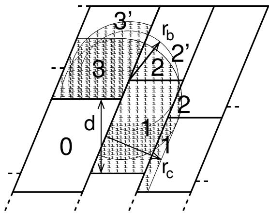  
图 5.11: 要与区域 0 进程进行通信的区域，详情见正文。 $r _ { c }$ 和 $r _ { b }$ 分别为非键截断半径和成键截断半径，?? 示例了后面单元交错边界之间的距离。

## 并行中的约束

由于使用区域分解时，分子的各个部分可以处于不同的进程上，所以键约束可以跨越单元边界。在GROMACS 中，当使用更新组时，不会发生这种情况。只要有当约束的键涉及氢原子时才会发生这种情况。由约束连接的原子都会指定到相同的区域。但是，如果没有更新组就需要一种并行约束算法。GROMACS 使用了 P-LINCS 算法 $5 0 _ { \odot 3 3 }$ ，它是 LINCS 算法的并行版本 $\phantom { } 4 \mathcal { S } _ { \hookrightarrow 5 3 3 } ( \mathbb { J } \mathbb { L } L I N C S$ 算法↪362)。P-LINCS 算法过程的示意图见 图 5.12。当分子跨越单元边界时，P-LINCS 会在单元边界上对这些分子中相邻直到（lincs\_order + 1）根键远的原子进行通信。然后，会对局部的键和经通信得到的键施加正常的 LINCS 算法。经过这个过程后，局部的键已经正确地进行了约束，尽管额外通信得到的键还没有。LINCS 的起始步需要进行一次坐标通信，每次迭代也需要一次坐标通信。力不需要进行通信。

## 相互作用范围

区域分解利用了相互作用的局域性。这意味着相互作用的范围会受到限制。默认情况下， $m d r u n _ { \substack { \scriptscriptstyle \mathrm { Q 1 3 1 } } }$ 会尝试找到相互作用范围和计算效率之间的最佳平衡。但也有可能发生这样的情况：模拟停止并显示缺少相互作用的错误消息，或者使用更短的相互作用范围时，模拟运行稍快一些。相互作用范围及其默认值见 表 5.7。

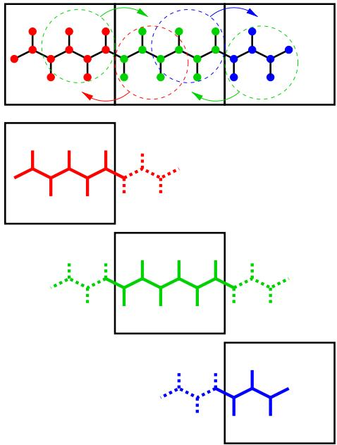  
图 5.12: P-LINCS 算法并行设置示例。一个分子被划分到三个区域分解单元，使用的矩阵展开阶数为 3。顶部显示了需要进行通信的原子坐标及其要通信到的单元。底部显示了三个单元中各自的局部约束（实线）和非局部约束（虚线）。

表 5.7: 区域分解的相互作用范围
<table><tr><td rowspan=1 colspan=1>相互作用</td><td rowspan=1 colspan=1>范围</td><td rowspan=1 colspan=1>选项</td><td rowspan=1 colspan=1>默认</td></tr><tr><td rowspan=1 colspan=1>非键</td><td rowspan=1 colspan=1> $r _ { c } { = } \mathrm { m a x } ( r _ { \mathrm { l i s t } } , r _ { \mathrm { V d W } } , r _ { \mathrm { C o u l } } )$ </td><td rowspan=1 colspan=1> $m d p _ { \hookrightarrow 4 5 4 }$ 文件</td><td rowspan=1 colspan=1></td></tr><tr><td rowspan=1 colspan=1>两体成键项</td><td rowspan=1 colspan=1> $\operatorname* { m a x } ( r _ { \mathrm { m b } } , r _ { c } )$ </td><td rowspan=1 colspan=1> $m d r u n _ { \scriptscriptstyle \mathrm { < 1 3 1 } } - \scriptscriptstyle \mathrm { \underline { { { r } d } } d }$ </td><td rowspan=1 colspan=1>初始构 $\# 4 + 1 0 \%$ </td></tr><tr><td rowspan=1 colspan=1>多体成键项</td><td rowspan=1 colspan=1> $r _ { \mathrm { m b } }$ </td><td rowspan=1 colspan=1> $m d r u n _ { \scriptscriptstyle \mathrm { < 1 3 1 } } - \scriptscriptstyle \mathrm { \underline { { { r } d } } d }$ </td><td rowspan=1 colspan=1>初始构 $\# 4 + 1 0 \%$ </td></tr><tr><td rowspan=1 colspan=1>约束</td><td rowspan=1 colspan=1> $r _ { \mathrm { c o n } }$ </td><td rowspan=1 colspan=1> $m d r u n _ { \Rightarrow 1 3 1 } - \mathtt { r c o n }$ </td><td rowspan=1 colspan=1>根据键长估计</td></tr><tr><td rowspan=1 colspan=1>虚拟位点</td><td rowspan=1 colspan=1> $r _ { \mathrm { c o n } }$ </td><td rowspan=1 colspan=1> $m d r u n _ { \Rightarrow 1 3 1 } - \mathtt { r c o n }$ </td><td rowspan=1 colspan=1>0</td></tr></table>

在大多数情况下， $m d r u n _ { \substack { \scriptscriptstyle \mathrm { Q 1 3 1 } } }$ 的默认设置不会导致模拟停止并显示缺少相互作用的错误消息。成键相互作用的范围由初始构型中成键的电荷组之间的距离再增加 10% 确定。对于约束， $r _ { \mathrm { c o n } }$ 的值由（lincs\_order$^ { + } \ 1 \ )$ 根键所能覆盖的最大距离确定，并且假定所有这些键以 120 度的角连接。实际的约束通信并不受$r _ { \mathrm { c o n } }$ 限制，而是受最小单元大小 $L _ { C }$ 限制，其下限为：

$$
L _ { C } \ge \operatorname* { m a x } ( r _ { \mathrm { m b } } , r _ { \mathrm { c o n } } )\tag{5.114}
$$

在不使用动态负载均衡的情况下，当使用压力缩放时，实际上允许系统的缩放超过这个限制。注意，对于三斜盒子， $L _ { C }$ 并不是简单地取盒子对角分量与该方向上单元数目的比值，而是三斜单元边界之间的最短距离。对于菱形十二面体盒子，此距离是沿 ?? 和 ?? 方向长度的 $\sqrt { 3 / 2 }$ 。

当 $r _ { \mathrm { m b } } > r _ { c }$ 时， $m d r u n _ { \substack { _ { \hookrightarrow 1 3 1 } } }$ 会采用一个灵巧的算法来减少通信。只是简单地通信 $r _ { \mathrm { m b } }$ 之内的所有电荷组会极大地增加通信量。因此，只有通过成键相互作用连接，且不处于局部的电荷组才需要通信。这几乎没有增加额外通信，但也导致区域分解设置的成本略有增加。在某些情况下，例如使用非常短的截断进行粗粒化模拟，可能需要手动设置 $r _ { \mathrm { m b } }$ 以降低这个成本。

## 多程序多数据 PME 并行化

静电相互作用是长程的，因此需要使用特殊的算法来避免对许多原子对进行求和。在 GROMACS 中通常使用的方法是 $\mathrm { P M E } ( \mathbb { J } _ { \mathsf { L } } ^ { \mathsf { L } } P M E _ { \simeq 4 1 1 }$ 一节)。由于使用 PME 时，所有粒子彼此之间都存在相互作用，因此需要进行全局通信。通常就是这个因素限制了区域分解的标度行为。为了减少这个问题的影响，我们提出了一种多程序多数据方法 $\boldsymbol { 5 } _ { \hookrightarrow 5 3 1 }$ 。在这个方法中，我们选择一些进程只进行 PME 网格计算，而其他被称为粒子-粒子（PP）进程的进程则用于完成其余的所有工作。对于长方体盒子，PP 进程和 PME 进程的最佳比例通常是 3:1，对菱形十二面体盒子这个比例通常是 2:1。当 PME 进程的数量减少为原来的1/4 时，通信调用的次数大约减少为原来的 $1 / 1 6 _ { \circ }$ 。换句话说，现在我们可以将进程增加到 4 倍以上。此外，对于网络中 4 或 8 核的现代机器，PME 的有效网络带宽增大为原来的四倍，因为在 PME 计算过程中，每台机器上将只有四分之一的核使用网络连接。

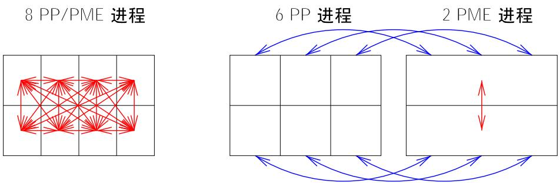  
图 5.13: 8 个进程不使用 MPMD（左），使用 MPMD（右）的示例。左边的 PME 通信（红色箭头）比右侧高得多。对于 MPMD算法，虽然需要额外的 PP-PME 坐标和力通信（蓝色箭头），但总的通信复杂性更低。

$m d r u n _ { \substack { \scriptscriptstyle \mathrm { Q 1 3 1 } } }$ 默 认 会 交 错 运 行 PP 和 PME 进 程。 如 果 机 器 中 进 程 的 编 号 不 连 续， 可 能 需 要 使$\mathtt { H m } d r u n _ { \scriptscriptstyle \mathrm { \to 1 3 1 } } \mathrm { - d d o r d e r ~ \mathtt { p p \_ p m e } ~ }$ 。对于具有真正的 3D 环路，并安装了适当的通信软件可以相应地进行进程分配的机器，应该使用 $m d r u n _ { \mathrm { \tiny \infty 1 3 1 } } - \mathrm { d d o r d e r ~ \ c a r t e s i a n } ,$ 。

为优化性能，通常应该设置截断和 PME 格点，使得 PME 负载达到总计算负载的 25% 至 33%。$g r o m p p _ { \Rightarrow 1 0 8 }$ 会在最后给出 PME 负载的估计值，并且 $m d r u n _ { \substack { \scriptscriptstyle \mathrm { Q 1 3 1 } } }$ 也会计算相同的估计值以确定要使用的 PME 进程的最佳数目。为了实现高并行化，试着调整 $m d p _ { \hookrightarrow 4 5 4 }$ 的设置来优化 PME 负载，和/或利用 $m d r u n _ { \substack { \scriptscriptstyle \mathrm { Q 1 3 1 } } }$ 的 -npme 选项来指定 PME 进程的数目都是值得的。对静电设置的更改，记住下面这点会有帮助：当对库仑截断和 PME 格点间距使用相同的因子进行缩放时，静电的精度几乎保持不变。注意，由于 PME 进程数小于 PP 进程数，因此在估算 PME 进程数的时候最好高估一点，而不是低估，这样可以减少总的等待时间。

PME 区域分解可以是沿 ?? 和/或 ?? 轴方向进行的 1D 或 2D 分解。2D 分解也称为铅笔分解，因为在高度平行化中分解区域形状类似铅笔。只有当 PP 分解沿 ?? 轴方向仅有 1 个区域时，才能使用沿 ?? 轴方向的 1D 分解。2D PME 分解沿 ?? 方向的数目必须等于 PP 分解的数目。 $m d r u n _ { \substack { \scriptscriptstyle \mathrm { Q 1 3 1 } } }$ 会根据 PME 中坐标重新分布的最小通信量，加上格点重叠和转置的通信量，来自动选择 1D 或 2D PME 分解（如果可以使用给定的所有进程）。为避免 PP 和 PME 进程之间的坐标和力的多余通信，?? 方向上的 DD 单元数最好等于 PME 进程数或其倍数。默认情况下， $m d r u n _ { \substack { \scriptscriptstyle \mathrm { Q 1 3 1 } } }$ 会考虑这个问题。

## 区域分解流程图

图 5.14 是区域分解的流程图，并显示了不同算法的所有可能通信。对于更简单的模拟，流程图也一样，只不过没有包含未使用的算法及与其相应的通信。

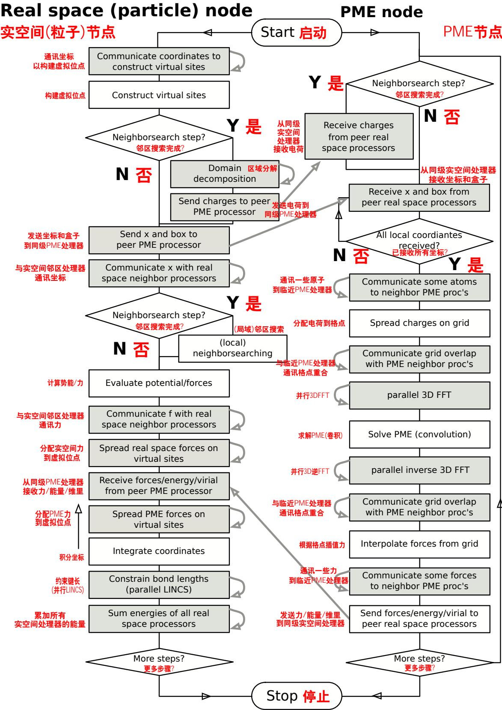  
图 5.14: 标准 MD 模拟中算法和通信（箭头）的流程图。模拟使用了虚拟位点，约束和独立的 PME 网格进程。

## 5.5 相互作用函数和力场

为了能够使用一些流行力场中采用的势能函数（参见相互作用函数和力场 $_ { \hookrightarrow 3 7 7 } \longrightarrow \oplus$ ），GROMACS 提供了一些势能函数以供选择，既包括非键相互作用，也包括二面角相互作用。我们将在适当的小节中对它们进行说明。

势能函数可细分为四个部分：

1. 非键项：Lennard-Jones 或 Buckingham，以及库仑或修正库仑。非键相互作用的计算基于邻区列表（一定半径内非键原子的列表），其中已经去除了排除项。

2. 成键项：共价键伸缩，键角弯曲，反常二面角和正常二面角。这些项的计算基于固定的列表。

3. 限制项：位置限制，键角限制，距离限制，取向限制和二面角限制，所有这些项都基于固定的列表。

4. 施加力：外部施加的力，见专题↪465 一章。

## 5.5.1 非键相互作用

GROMACS 中的非键相互作用是配对累加的：

$$
V ( { \bf r } _ { 1 } , \ldots { \bf r } _ { N } ) = \sum _ { i < j } V _ { i j } ( { \bf r } _ { i j } ) ;\tag{5.115}
$$

$$
\mathbf { F } _ { i } = - \sum _ { j } { \frac { d V _ { i j } ( r _ { i j } ) } { d r _ { i j } } } { \frac { \mathbf { r } _ { i j } } { r _ { i j } } }\tag{5.116}
$$

由于势能只取决于标量距离，因此相互作用是中心对称的，即粒子 ?? 上来自成对相互作用 $V _ { i j } ( r _ { i j } )$ 的向量分力与粒子 ?? 上的分力大小相同，方向相反。出于效率原因，计算时会对相互作用进行循环并更新两个分力，而不是每次对一个完整的非键力进行求和。非键相互作用包含排斥项，色散项和库仑项。排斥项和色散项组合起来可以取 Lennard-Jones（或 6-12 相互作用）或 Buckingham（或 exp-6 势）形式。此外，带（部分）电荷的原子之间通过库仑项相互作用。

## Lennard-Jones 相互作用

两个原子之间的 Lennard-Jones 势 $V _ { L J }$ 等于：

$$
V _ { L J } ( r _ { i j } ) = \frac { C _ { i j } ^ { ( 1 2 ) } } { { r _ { i j } } ^ { 1 2 } } - \frac { C _ { i j } ^ { ( 6 ) } } { { r _ { i j } } ^ { 6 } }\tag{5.117}
$$

其函数曲线如 图 5.15 所示。参数 $C _ { i j } ^ { ( 1 2 ) }$ 和 $C _ { i j } ^ { ( 6 ) }$ 取决于 原子类型对；因此，它们取自 LJ 参数矩阵。在Verlet 截断方案中，通过移动一个常数，可以使势能在截断距离处为零。

由此势能函数导出的力为：

$$
\mathbf { F } _ { i } ( \mathbf { r } _ { i j } ) = \left( 1 2 \ \frac { C _ { i j } ^ { ( 1 2 ) } } { r _ { i j } ^ { \ 1 3 } } - 6 \ \frac { C _ { i j } ^ { ( 6 ) } } { r _ { i j } ^ { \ 7 } } \right) \frac { \mathbf { r } _ { i j } } { r _ { i j } }\tag{5.118}
$$

LJ 势也可以写成以下形式：

$$
V _ { L J } ( { \bf r } _ { i j } ) = 4 \epsilon _ { i j } \left( \left( \frac { \sigma _ { i j } } { r _ { i j } } \right) ^ { 1 2 } - \left( \frac { \sigma _ { i j } } { r _ { i j } } \right) ^ { 6 } \right)\tag{5.119}
$$

在构造非键 LJ 参数的参数矩阵时，GROMACS 中可以使用两种不同类型的组合规则，只采用几何平均值（力场文件输入部分中的类型 1）:

$$
\begin{array} { r c l } { { C _ { i j } ^ { ( 6 ) } } } & { { = } } & { { \left( C _ { i i } ^ { ( 6 ) } C _ { j j } ^ { ( 6 ) } \right) ^ { 1 / 2 } } } \\ { { C _ { i j } ^ { ( 1 2 ) } } } & { { = } } & { { \left( C _ { i i } ^ { ( 1 2 ) } C _ { j j } ^ { ( 1 2 ) } \right) ^ { 1 / 2 } } } \end{array}\tag{5.120}
$$

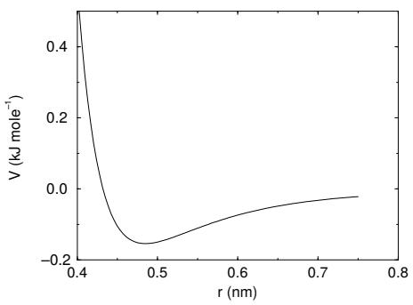  
图 5.15: Lennard-Jones 相互作用。

或者，采用 Lorentz-Berthelot 规则。此规则使用算术平均值计算 $\sigma _ { i j }$ ，使用几何平均值计算 $\epsilon _ { i j }$ (类型 2):

$$
\begin{array} { r c l } { { \sigma _ { i j } } } & { { = } } & { { \frac { 1 } { 2 } ( \sigma _ { i i } + \sigma _ { j j } ) } } \\ { { \epsilon _ { i j } } } & { { = } } & { { \left( \epsilon _ { i i } \epsilon _ { j j } \right) ^ { 1 / 2 } } } \end{array}\tag{5.121}
$$

最后，可以对两个参数都使用几何平均值（类型 3）:

$$
\begin{array} { r c l } { { \sigma _ { i j } } } & { { = } } & { { \left( \sigma _ { i i } \sigma _ { j j } \right) ^ { 1 / 2 } } } \\ { { \epsilon _ { i j } } } & { { = } } & { { \left( \epsilon _ { i i } \epsilon _ { j j } \right) ^ { 1 / 2 } } } \end{array}\tag{5.122}
$$

OPLS 力场就使用这个规则。

## Buckingham 势

与 Lennard-Jones 势相比，Buckingham 势的排斥项更柔性，也更贴近实际，但计算成本也更高。Buckingham 势的形式为：

$$
V _ { b h } ( r _ { i j } ) = A _ { i j } \exp ( - B _ { i j } r _ { i j } ) - \frac { C _ { i j } } { { r _ { i j } } ^ { 6 } }\tag{5.123}
$$

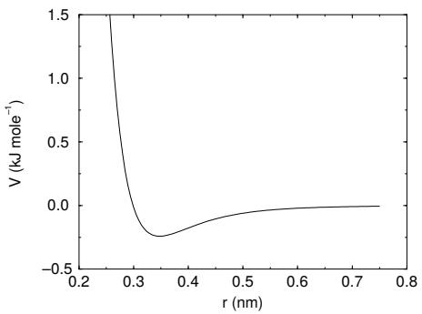  
图 5.16: Buckingham 相互作用。

势能函数图形见 图 5.16。此势能函数对应的力为：

$$
\mathbf { F } _ { i } ( r _ { i j } ) = \left[ A _ { i j } B _ { i j } \exp ( - B _ { i j } r _ { i j } ) - 6 \frac { C _ { i j } } { { r _ { i j } } ^ { 7 } } \right] \frac { \mathbf { r } _ { i j } } { { r _ { i j } } }\tag{5.124}
$$

## 库仑相互作用

两个带电粒子之间的库仑相互作用由下式给出：

$$
V _ { c } ( r _ { i j } ) = f \frac { q _ { i } q _ { j } } { { \varepsilon _ { r } r _ { i j } } }\tag{5.125}
$$

函数曲线见 图 5.17，其中 $\begin{array} { r } { f = { \frac { 1 } { 4 \pi \varepsilon _ { 0 } } } = 1 3 8 . 9 3 5 4 5 8 } \end{array}$ （见定义与单位 $\underline { { \underline { { \mathbf { \Pi } } } } } _ { 3 3 } \ - \underline { { \underline { { \mathbf { \delta } } } } } _ { \overline { { \mathbf { \delta } } } } ^ { 3 } \ )$

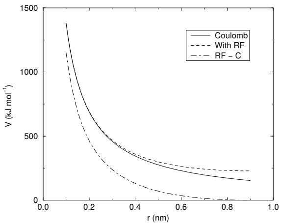  
图 5.17: 反应场与非反应场的库仑相互作用（带相等同种电荷的粒子之间）。在非反应场情况 $\varepsilon _ { r }$ 为 1， $\varepsilon _ { r f }$ 为 78， $r _ { c }$ 为 0.9 nm。除相差一个常数外，点划线与虚线完全相同。

由此势能函数导出的力为：

$$
\mathbf { F } _ { i } ( \mathbf { r } _ { i j } ) = f \frac { q _ { i } q _ { j } } { { \varepsilon _ { r } } { r _ { i j } } ^ { 2 } } \frac { \mathbf { r } _ { i j } } { r _ { i j } }\tag{5.126}
$$

使用普通库仑相互作用时要么不能截断，要么所有粒子对都处于截断范围内，因为力在截断处存在突变，而且变化很大。如果你确实想要使用截断，可以将势能移动一定的数值，以使势能等于力的积分。使用组截断方案时，这种移位仅适用于未排除的粒子对。使用 Verlet 截断方案时，移位也适用于排除对和自相互作用，这使得势能等效于 $\varepsilon _ { r f } = 1$ 的反应场（见下文）。

在 GROMACS 中，相对介电常数 $\varepsilon _ { r }$ 可在 $g r o m p p _ { \Rightarrow 1 0 8 }$ 的输入文件中设置。

## 反应场库仑相互作用

对均相系统，可假定截断半径 $r _ { c }$ 以外是介电常数为 ?? 的恒定介电环境，并以此对库仑相互作用进行校 $\varepsilon _ { r f }$ 正。此时库仑相互作用如下：

$$
V _ { c r f } \ = \ f { \frac { q _ { i } q _ { j } } { \varepsilon _ { r } r _ { i j } } } \left[ 1 + { \frac { \varepsilon _ { r f } - \varepsilon _ { r } } { 2 \varepsilon _ { r f } + \varepsilon _ { r } } } { \frac { { r _ { i j } } ^ { 3 } } { r _ { c } ^ { 3 } } } \right] - f { \frac { q _ { i } q _ { j } } { \varepsilon _ { r } r _ { c } } } { \frac { 3 \varepsilon _ { r f } } { 2 \varepsilon _ { r f } + \varepsilon _ { r } } }\tag{5.127}
$$

上式右边的常量表达式使得截断 $r _ { c }$ 处的势能为零。对于带电的截断球体，这对应于均匀背景电荷的中性化。我们可以将方程 (5.127) 简写为

$$
V _ { c r f } \ = \ f { \frac { q _ { i } q _ { j } } { \varepsilon _ { r } } } \left[ { \frac { 1 } { r _ { i j } } } + k _ { r f } \ { r _ { i j } } ^ { 2 } - c _ { r f } \right]\tag{5.128}
$$

其中

$$
k _ { r f } =  &  \frac { 1 } { r _ { c } ^ { 3 } } \frac { \varepsilon _ { r f } - \varepsilon _ { r } } { ( 2 \varepsilon _ { r f } + \varepsilon _ { r } ) }\tag{5.129}
$$

$$
c _ { r f } = ~ { \frac { 1 } { r _ { c } } } + k _ { r f } r _ { c } ^ { 2 } = { \frac { 1 } { r _ { c } } } { \frac { 3 \varepsilon _ { r f } } { ( 2 \varepsilon _ { r f } + \varepsilon _ { r } ) } }\tag{5.130}
$$

对大的 $\varepsilon _ { r f }$ ， $k _ { r f }$ 趋近于 $r _ { c } ^ { - 3 } / 2$ ，而当 $\varepsilon _ { r f } = \varepsilon _ { r }$ 时校正消失。图 5.17 绘制了校正的相互作用，很明显，它对 $r _ { i j }$ 的导数（力的负值）在截断距离处为零。这种势函数对应的力如下：

$$
\mathbf { F } _ { i } ( \mathbf { r } _ { i j } ) = f \frac { q _ { i } q _ { j } } { \varepsilon _ { r } } \left[ \frac { 1 } { { r _ { i j } } ^ { 2 } } - 2 k _ { r f } r _ { i j } \right] \frac { \mathbf { r } _ { i j } } { { r _ { i j } } }\tag{5.131}
$$

反应场修正也应该应用于所有排除的原子对，包括自身对，在这种情况下，方程 (5.127) 和 (5.131) 中不出现正常的库仑项。

Tironi 等人引入了广义反应场，其中截断半径 $r _ { c }$ 以外的连续电介质还具有离子强度 ?? $\gamma _ { 1 _ { \hookrightarrow 3 4 } }$ 。在这种情况下，我们可以利用逆 Debye 屏蔽长度 ?? 将常数 $k _ { r f }$ 和 $c _ { r f }$ 重写为：

$$
\kappa ^ { 2 } = \qquad \frac { 2 I F ^ { 2 } } { \varepsilon _ { 0 } \varepsilon _ { r f } R T } = \frac { F ^ { 2 } } { \varepsilon _ { 0 } \varepsilon _ { r f } R T } \sum _ { i = 1 } ^ { K } c _ { i } z _ { i } ^ { 2 }\tag{5.132}
$$

$$
\begin{array} { r l } { k _ { r f } = } & { { } \frac { 1 } { r _ { c } ^ { 3 } } \frac { ( \varepsilon _ { r f } - \varepsilon _ { r } ) ( 1 + \kappa r _ { c } ) + \frac 1 2 \varepsilon _ { r f } ( \kappa r _ { c } ) ^ { 2 } } { ( 2 \varepsilon _ { r f } + \varepsilon _ { r } ) ( 1 + \kappa r _ { c } ) + \varepsilon _ { r f } ( \kappa r _ { c } ) ^ { 2 } } } \end{array}
$$

$$
c _ { r f } = ~ \frac { 1 } { r _ { c } } \frac { 3 \varepsilon _ { r f } ( 1 + \kappa r _ { c } + \frac { 1 } { 2 } ( \kappa r _ { c } ) ^ { 2 } ) } { ( 2 \varepsilon _ { r f } + \varepsilon _ { r } ) ( 1 + \kappa r _ { c } ) + \varepsilon _ { r f } ( \kappa r _ { c } ) ^ { 2 } }\tag{5.133}
$$

其中 ?? 为法拉第常数，?? 为理想气体常数，?? 为绝对温度， $c _ { i }$ 为物种 ?? 的摩尔浓度， $z _ { i }$ 为物种 ?? 的电荷数，共有 ?? 种不同的物种。在离子强度为零的极限情况下 $( \kappa = 0 )$ ，方程 (5.132) 和 (5.133) 分别退化为形式简单的方程 (5.129) 和 (5.130)。

## 修正的非键相互作用

在 GROMACS 中，可以利用移位函数对非键势能函数进行修正。移位函数也称力切换函数，因为它可以将截断处的力切换为零。这样做的目的在于用连续的力替换截断的力，且使其在截断半径处具有连续的导数。使用这种力时，时间积分产生的误差更小。但请注意，对 Lennard-Jones 相互作用，这些误差通常小于其他误差，如在势能排斥部分的积分误差。对库仑相互作用，我们建议不要使用移位势，而是使用反应场或适当的长程方法，如 $\mathrm { P M E }$ 。

切换函数（将势能乘上一个函数）和移位函数（将势能或力加上一个函数）之间 没有本质区别 $ { 7 2 } _ {  { \hookrightarrow }  { 5 } 3 4 } \circ$ 切换函数是移位函数的特例，我们将它用于 力函数，它与粒子 ?? 作用于粒子 ?? 上的静电力或范德华力相关：

$$
\mathbf { F } _ { i } = c , F ( r _ { i j } ) \frac { \mathbf { r } _ { i j } } { r _ { i j } }\tag{5.134}
$$

对于纯的库仑或 Lennard-Jones 相互作用， $F ( r ) = F _ { \alpha } ( r ) = \alpha r ^ { - ( \alpha + 1 ) }$ 。切换力 $F _ { s } ( r )$ 通常可以写成：

$$
\begin{array} { c c c } { { F _ { s } ( r ) \ = \ } } & { { F _ { \alpha } ( r ) \ } } & { { r < r _ { 1 } } } \\ { { F _ { s } ( r ) \ = \ } } & { { F _ { \alpha } ( r ) + S ( r ) \ } } & { { r _ { 1 } \leq r < r _ { c } } } \\ { { F _ { s } ( r ) \ = \ } } & { { 0 \ } } & { { r _ { c } \leq r } } \end{array}\tag{5.135}
$$

当 $r _ { 1 } = 0$ 时，这就是一个传统的移位函数，否则它就起着切换函数的作用。相应的移位势函数如下：

$$
V _ { s } ( r ) = \int _ { r } ^ { \infty } ~ F _ { s } ( x ) d x\tag{5.136}
$$

GROMACS 的力切换函数 $S _ { F } ( r )$ 在边界处应当是平滑的，因此切换函数应满足以下边界条件：

$$
\begin{array} { r c l } { { S _ { F } ( r _ { 1 } ) } } & { { = } } & { { 0 } } \\ { { S _ { F } ^ { \prime } ( r _ { 1 } ) } } & { { = } } & { { 0 } } \\ { { S _ { F } ( r _ { c } ) } } & { { = } } & { { - F _ { \alpha } ( r _ { c } ) } } \\ { { S _ { F } ^ { \prime } ( r _ { c } ) } } & { { = } } & { { - F _ { \alpha } ^ { \prime } ( r _ { c } ) } } \end{array}\tag{5.137}
$$

三次多项式

$$
S _ { F } ( r ) = A ( r - r _ { 1 } ) ^ { 2 } + B ( r - r _ { 1 } ) ^ { 3 }\tag{5.138}
$$

满足这些要求。常数 A 和 B 可利用 $r _ { c }$ 处的边界条件求得

$$
\begin{array} { r c l } { { A } } & { { = } } & { { \displaystyle - \alpha \frac { ( \alpha + 4 ) r _ { c } - ( \alpha + 1 ) r _ { 1 } } { r _ { c } ^ { \alpha + 2 } ( r _ { c } - r _ { 1 } ) ^ { 2 } } } } \\ { { B } } & { { = } } & { { \displaystyle \alpha \frac { ( \alpha + 3 ) r _ { c } - ( \alpha + 1 ) r _ { 1 } } { r _ { c } ^ { \alpha + 2 } ( r _ { c } - r _ { 1 } ) ^ { 3 } } } } \end{array}\tag{5.139}
$$

因此总的力函数为：

$$
F _ { s } ( r ) = \frac { \alpha } { r ^ { \alpha + 1 } } + A ( r - r _ { 1 } ) ^ { 2 } + B ( r - r _ { 1 } ) ^ { 3 }\tag{5.140}
$$

相应的势函数如下：

$$
V _ { s } ( r ) = \frac { 1 } { r ^ { \alpha } } - \frac { A } { 3 } ( r - r _ { 1 } ) ^ { 3 } - \frac { B } { 4 } ( r - r _ { 1 } ) ^ { 4 } - C\tag{5.141}
$$

其中

$$
C = { \frac { 1 } { r _ { c } ^ { \alpha } } } - { \frac { A } { 3 } } ( r _ { c } - r _ { 1 } ) ^ { 3 } - { \frac { B } { 4 } } ( r _ { c } - r _ { 1 } ) ^ { 4 }\tag{5.142}
$$

GROMACS 势能切换函数 $S _ { V } ( r )$ 对 $r _ { 1 }$ 和 $r _ { c }$ 之间的势能进行了缩放，并具有相似的边界条件，以便能产生平滑变化的势和力：

$$
\begin{array} { r l r } { S _ { V } ( r _ { 1 } ) } & { = } & { 1 } \\ { S _ { V } ^ { \prime } ( r _ { 1 } ) } & { = } & { 0 } \\ { S _ { V } ^ { \prime \prime } ( r _ { 1 } ) } & { = } & { 0 } \\ { S _ { V } ( r _ { c } ) } & { = } & { 0 } \\ { S _ { V } ^ { \prime } ( r _ { c } ) } & { = } & { 0 } \\ { S _ { V } ^ { \prime \prime } ( r _ { c } ) } & { = } & { 0 } \end{array}\tag{5.143}
$$

具有这些性质的五次多项式为

$$
S _ { V } ( r ; r _ { 1 } , r _ { c } ) = \frac { 1 - 1 0 ( r - r _ { 1 } ) ^ { 3 } ( r _ { c } - r _ { 1 } ) ^ { 2 } + 1 5 ( r - r _ { 1 } ) ^ { 4 } ( r _ { c } - r _ { 1 } ) - 6 ( r - r _ { 1 } ) } { ( r _ { c } - r _ { 1 } ) ^ { 5 } }\tag{5.144}
$$

这一实现可以在其他几个模拟程序包中找到 $\gamma _ { \mathcal { S } _ { 5 3 5 } } ^ { \mathcal { Q } } \gamma _ { 5 _ { 5 3 5 } }$ ，但都与 CHARMM 中的实现不同 $7 6 _ { \scriptscriptstyle \odot 3 3 5 }$ 。切换势能可导致切换区域中出现虚假的很大的力，因此不建议使用这种函数对库仑相互作用进行切换72↪534，但使用这种函数对 Lennard-Jones 相互作用进切换能得到可接受的结果。

## Ewald 求和时修正的短程相互作用

当利用 Ewald 求和方法或粒子网格 Ewald 方法计算长程相互作用时，也必须对短程库仑势进行修正。这里，截断处切换到（接近）零的是势能，而不是力。在这种情况下，短程势能由下式给出：

$$
V ( r ) = f \frac { \mathrm { e r f c } ( \beta r _ { i j } ) } { r _ { i j } } q _ { i } q _ { j } ,\tag{5.145}
$$

其中 $\beta$ 参数决定了直接空间加和与倒易空间加和之间的相对权重，erfc(??) 是余误差函数。有关长程静电相互作用的更多详细信息见长程静电作 $\mathbb { H } _ { \hookrightarrow 4 1 0 }$ 一节。

## 5.5.2 成键相互作用

成键相互作用基于固定的原子列表。它们不是排除的配对相互作用，还包括 3 和 4 体相互作用。成键相互作用包括 键伸缩 (2 体)，键角 (3 体) 和 二面角 (4 体) 相互作用。一种特殊类型的二面角相互作用（称为 反常二面角）可用于将原子限制在一个平面内，或避免分子转变为手性相反的构型（镜像）。

键伸缩

简谐势

两个以共价键结合的原子 ?? 和 ?? 之间的键伸缩可利用简谐势进行描述：

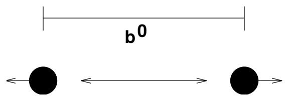  
图 5.18: 键伸缩原理（左）以及键伸缩势能（右）。

$$
V _ { b } \ ( r _ { i j } ) = \frac { 1 } { 2 } k _ { i j } ^ { b } ( r _ { i j } - b _ { i j } ) ^ { 2 }\tag{5.146}
$$

参见 图 5.18，相应的力为：

$$
\mathbf { F } _ { i } ( \mathbf { r } _ { i j } ) = k _ { i j } ^ { b } ( r _ { i j } - b _ { i j } ) \frac { \mathbf { r } _ { i j } } { r _ { i j } }\tag{5.147}
$$

四次幂势

在 GROMOS-96 力场 $\gamma \gamma _ { \scriptscriptstyle { \hookrightarrow 5 3 5 } }$ 中，为提高计算效率，共价键势为下面的形式：

$$
V _ { b } \left( r _ { i j } \right) = \frac { 1 } { 4 } k _ { i j } ^ { b } \left( { r _ { i j } } ^ { 2 } - b _ { i j } ^ { 2 } \right) ^ { 2 }\tag{5.148}
$$

相应的力为：

$$
\mathbf { F } _ { i } ( \mathbf { r } _ { i j } ) = k _ { i j } ^ { b } ( { r _ { i j } } ^ { 2 } - b _ { i j } ^ { 2 } ) ~ \mathbf { r } _ { i j }\tag{5.149}
$$

对这种形式的势函数，其力常数与通常的简谐力常数 $k ^ { b , \mathrm { h a r m } }$ 存在如下关系（键伸缩 $\hookrightarrow 3 8 2$ 一节）

$$
2 k ^ { b } b _ { i j } ^ { 2 } = k ^ { b , \mathrm { h a r m } }\tag{5.150}
$$

力常数主要来源于 $\mathrm { G R O M O S } { - } 8 7 \ 7 8 _ { \hookrightarrow 5 3 5 }$ 中使用的简谐力常数。虽然这种形式计算时效率更高（因为不需要计算平方根），但它在概念上更复杂。它还存在一个特别的缺点，由于不是简谐形式，单个键的平均能量不像正常的简谐势那样等于 $\scriptstyle { \frac { 1 } { 2 } } k T$ 。

## Morse 势键伸缩

对于某些需要非简谐键伸缩势的系统，GROMACS 提供了两个原子 i 和 j 之间的 Morse 势 $\gamma  { \boldsymbol { g } } _ { \odot 5 3 5 }$ 这种势能函数与简谐势的不同在于，它具有一个不对称的势阱，且无穷远处的力为零。函数的形式为：

$$
V _ { m o r s e } ( r _ { i j } ) = D _ { i j } [ 1 - \exp ( - \beta _ { i j } ( r _ { i j } - b _ { i j } ) ) ] ^ { 2 } ,\tag{5.151}
$$

参见 图 5.19，相应的力为：

$$
\begin{array} { r l r } { { \bf F } _ { m o r s e } ( { \bf r } _ { i j } ) } & { = } & { 2 D _ { i j } \beta _ { i j } \exp ( - \beta _ { i j } ( r _ { i j } - b _ { i j } ) ) * } \\ & { } & { [ 1 - \exp ( - \beta _ { i j } ( r _ { i j } - b _ { i j } ) ) ] \frac { { \bf r } _ { i j } } { r _ { i j } } , } \end{array}\tag{5.152}
$$

其中 $D _ { i j }$ 为势阱深度，单位为 kJ/mol， $\beta _ { i j }$ 定义了势阱的陡度 (以 $\mathrm { n m } ^ { - 1 }$ 为单位)， $b _ { i j }$ 为以 nm 为单位的平衡距离。陡度参数 $\beta _ { i j }$ 可以用原子 i 和 j 的约化质量 ?? ，基本振动频率 $\mu _ { i j }$ $\omega _ { i j }$ 和势阱深度 $D _ { i j }$ 来表示：

$$
\beta _ { i j } = { \omega _ { i j } } \sqrt { \frac { \mu _ { i j } } { 2 D _ { i j } } }\tag{5.153}
$$

因为 $\omega = \sqrt { k / \mu }$ ，可以用简谐力常数 $k _ { i j }$ 将 $\beta _ { i j }$ 改写为：

$$
\beta _ { i j } = \sqrt { \frac { k _ { i j } } { 2 D _ { i j } } }\tag{5.154}
$$

对于小偏差 $( r _ { i j } - b _ { i j } )$ ，可利用泰勒展开取 exp 项的一阶近似：

$$
\exp ( - x ) \approx 1 - x\tag{5.155}
$$

将方程 (5.154) 和方程 (5.155) 带入函数中：

$$
\begin{array} { r l r } { V _ { m o r s e } ( r _ { i j } ) } & { = } & { D _ { i j } [ 1 - \exp ( - \beta _ { i j } ( r _ { i j } - b _ { i j } ) ) ] ^ { 2 } } \\ & { = } & { D _ { i j } [ 1 - ( 1 - \sqrt { \frac { k _ { i j } } { 2 D _ { i j } } } ( r _ { i j } - b _ { i j } ) ) ] ^ { 2 } } \\ & { = } & { \frac { 1 } { 2 } k _ { i j } ( r _ { i j } - b _ { i j } ) ) ^ { 2 } } \end{array}\tag{5.156}
$$

这样我们就得到了简谐键伸缩势。

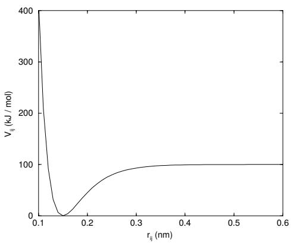  
图 5.19: Morse 势阱，平衡键长为 0.15 nm.

立方键伸缩势

另一种比 Morse 势稍微简单些的非简谐键伸缩势是在简单的简谐形式上增加一个距离的立方项：

$$
V _ { b } ~ ( r _ { i j } ) = k _ { i j } ^ { b } ( r _ { i j } - b _ { i j } ) ^ { 2 } + k _ { i j } ^ { c u b } ( r _ { i j } - b _ { i j } ) ^ { 3 }\tag{5.157}
$$

Ferguson $8 1 _ { \odot 5 3 5 }$ 开发的一个柔性水模型（基于 SPC 水模型 $8 0 _ { \scriptscriptstyle { \hookrightarrow , 5 3 5 } } )$ 中，O-H 键使用了立方键伸缩势。该模型能够给出合理的红外光谱。GROMACS 库中提供了 Ferguson 水模型（flexwat-ferguson.itp）。应该注意的是，这种势函数不对称：过度拉伸会导致能量无限降低。因此，积分的时间步长被限制为 1$\mathrm { f s } _ { \circ }$

这种势函数对应的力为：

$$
\mathbf { F } _ { i } ( \mathbf { r } _ { i j } ) = 2 k _ { i j } ^ { b } ( r _ { i j } - b _ { i j } ) \ \frac { \mathbf { r } _ { i j } } { r _ { i j } } + 3 k _ { i j } ^ { b } k _ { i j } ^ { c u b } ( r _ { i j } - b _ { i j } ) ^ { 2 } \ \frac { \mathbf { r } _ { i j } } { r _ { i j } }\tag{5.158}
$$

FENE 键伸缩势

在粗粒化的聚合物模拟中，珠子之间通常以 FENE（有限伸展非线弹性）势连接 $8 \mathcal { Q } _ { \scriptscriptstyle \mathrm { Q } \scriptscriptstyle \mathrm { Q } 3 3 5 }$

$$
V _ { \mathrm { F E N E } } ( r _ { i j } ) = - \frac { 1 } { 2 } k _ { i j } ^ { b } b _ { i j } ^ { 2 } \log \left( 1 - \frac { { r _ { i j } } ^ { 2 } } { b _ { i j } ^ { 2 } } \right)\tag{5.159}
$$

这种势能函数看起来很复杂，但力的表达式更简单：

$$
F _ { \mathrm { F E N E } } ( \mathbf { r } _ { i j } ) = - k _ { i j } ^ { b } \left( 1 - \frac { { r _ { i j } } ^ { 2 } } { b _ { i j } ^ { 2 } } \right) ^ { - 1 } \mathbf { r } _ { i j }\tag{5.160}
$$

在短距离处这种势函数渐近地变为力常数为 $k ^ { b }$ 的简谐势，而在距离为 ?? 处发散。

## 简谐键角势

三个原子 $i \textrm { - } j \textrm { - } k$ 之间的键角振动也可以用键角 $\theta _ { i j k }$ 的简谐势描述：

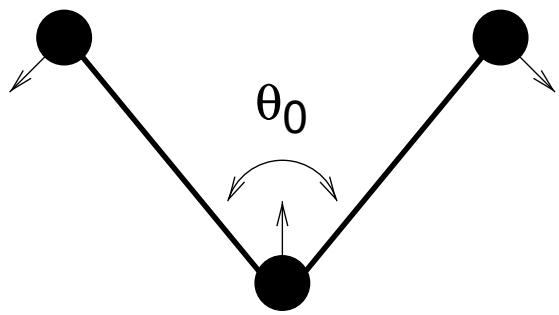  
图 5.20: 键角振动原理（左）和键角势。

$$
V _ { a } ( \theta _ { i j k } ) = \frac { 1 } { 2 } k _ { i j k } ^ { \theta } ( \theta _ { i j k } - { \theta _ { i j k } } ^ { 0 } ) ^ { 2 }\tag{5.161}
$$

由于键角的振动由简谐势描述，其形式与键伸缩相同（图 5.18）。

利用链式规则可得到力的方程：

$$
\begin{array} { l l } { \mathbf { F } _ { i } ~ = ~ { \displaystyle - \frac { d V _ { a } ( \boldsymbol \theta _ { i j k } ) } { d \mathbf { r } _ { i } } } } \\ { \mathbf { F } _ { k } ~ = ~ { \displaystyle - \frac { d V _ { a } ( \boldsymbol \theta _ { i j k } ) } { d \mathbf { r } _ { k } } } } & { \quad \nVDash \nmid \boldsymbol \theta _ { i j k } = \operatorname { a r c c o s } { \displaystyle \frac { ( \mathbf { r } _ { i j } \cdot \mathbf { r } _ { k j } ) } { r _ { i j } r _ { k j } } } } \\ { \mathbf { F } _ { j } ~ = ~ { \displaystyle - \mathbf { F } _ { i } - \mathbf { F } _ { k } } } \end{array}\tag{5.162}
$$

数字 $i , j , k$ 是共价成键原子的序列号。原子 ?? 处于中间；原子 ?? 和 ?? 位于两端（参见 图 5.20）。注意，在拓扑文件的输入中，键角以度为单位，而力常数的单位为 $\mathrm { k J / m o l / r a d ^ { 2 } }$ 。

余弦键角势

GROMOS-96 力场利用一个简化的函数描述键角振动：

$$
V _ { a } ( \theta _ { i j k } ) = \frac { 1 } { 2 } k _ { i j k } ^ { \theta } \left( \cos ( \theta _ { i j k } ) - \cos ( { \theta _ { i j k } } ^ { 0 } ) \right) ^ { 2 }\tag{5.163}
$$

其中

$$
\cos ( \theta _ { i j k } ) = \frac { { \bf r } _ { i j } \cdot { \bf r } _ { k j } } { r _ { i j } r _ { k j } }\tag{5.164}
$$

相应的力可以通过对原子位置的偏导数推导出来。这个函数中的力常数与简谐势的力常数 $k ^ { \theta , \mathrm { h a r m } }$ (简谐键角势 $_ { \hookrightarrow 3 8 4 } )$ 存在如下关系：

$$
k ^ { \theta } \sin ^ { 2 } ( { \theta _ { i j k } } ^ { 0 } ) = k ^ { \theta , \mathrm { h a r m } }\tag{5.165}
$$

在 GROMOS-96 手册中有一个更复杂的，依赖于温度的转换公式。这些公式在 0 K 时是等效的，300 K时的差异在 0.1%\~0.2% 之间。注意，在拓扑文件的输入中，键角以度为单位，力常数以 kJ/mol 为单位。

## 受限弯曲势

受限弯曲 $\left( \mathrm { R e B } \right) \ \delta \mathcal { S } _ { \hookrightarrow 5 3 5 }$ 可防止弯曲角度 ?? 达到 $1 8 0 ^ { \circ } ,$ 。这样，在进行粗粒化分子动力学模拟时，消除了计算扭转角和势而引起的数值不稳定性。

为了系统地防止弯曲角度达到 180∘，在弯曲势 (5.163) 的分母中引入了 $\sin ^ { 2 } \theta$ 因子：

$$
V _ { \mathrm { R e B } } ( \theta _ { i } ) = \frac { 1 } { 2 } k _ { \theta } \frac { ( \cos \theta _ { i } - \cos \theta _ { 0 } ) ^ { 2 } } { \sin ^ { 2 } \theta _ { i } } .\tag{5.166}
$$

图 5.21 显示了 ReB 势 (5.166) 和标准势 (5.163) 之间的比较。

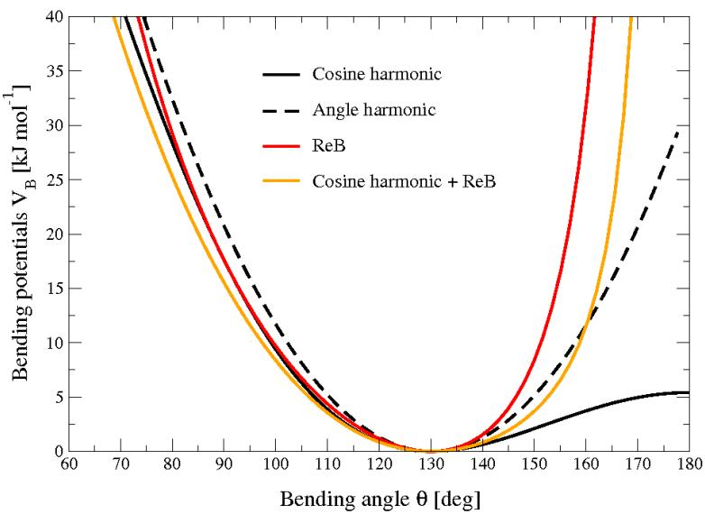  
图 5.21: 弯曲键角势：余弦简谐（黑实线），简谐角（黑虚线）和受限弯曲（红色），三者具有相同的弯曲常数 $k _ { \theta } = 8 5 \ \mathrm { k J \ m o l ^ { - 1 } }$ 和平衡键角 $\theta _ { 0 } = 1 3 0 ^ { \circ } { } _ { \mathrm { ~ } }$ 。橙色线表示余弦简谐 $( k = 5 0 \mathrm { k J \ m o l ^ { - 1 } } )$ 和受限弯曲 $( k = 2 5 \mathrm { ~ k J ~ m o l ^ { - 1 } } )$ ) 势的和，两者的 $\theta _ { 0 } = 1 3 0 ^ { \circ }$

ReB 势的壁垒在接近 180∘ 的区域非常排斥，因此，弯曲角度能够保持在一定的安全区间内，远离不稳定性。之所以在分母中选择使用 $\sin \theta _ { i }$ 的二次方项就是为了保证这种行为，并且能给出优雅的微分表达式：

$$
F _ { \mathrm { R e B } } ( \theta _ { i } ) = \frac { 2 k _ { \theta } } { \sin ^ { 4 } \theta _ { i } } ( \cos \theta _ { i } - \cos \theta _ { 0 } ) ( 1 - \cos \theta _ { i } \cos \theta _ { 0 } ) \frac { \partial \cos \theta _ { i } } { \partial \vec { r } _ { k } } .\tag{5.167}
$$

由于它的构造，受限弯曲势不能用于平衡 $\theta _ { 0 }$ 的值太接近 $0 ^ { \circ }$ 或 180∘ 的情形 (根据经验，推荐至少有 $1 0 ^ { \circ }$ 的差异)。重要的是，在初始构型中，所有的弯曲角度都必须处于安全区间内，以避免初始的不稳定性。这种弯曲势可以与任何形式的扭转势结合使用。它总是会阻止三个连续的粒子变成共线结构，因此，任何扭转势都不会出现奇点。也可以将它加入到标准的弯曲势中，以影响 $1 8 0 ^ { \circ }$ 左右的角度，但在极小点附近保持其原始形状（参见 图 5.21 中的橙色曲线）。

## Urey-Bradley 势

原子三联对 $i \textrm { - } j \textrm { - } k$ 之间的 Urey-Bradley 键角振动由角 $\theta _ { i j k }$ 的简谐势，以及原子 ?? 和 ?? 之间距离的简谐校正项来描述。虽然可以很容易地将它写成两项的简单加和，但将它作为拓扑文件中单独的一项，并在输出文件中作为单独的能量项也很方便。这种势能主要用于 CHARMM 力场 $8 4 _ {  5 3 5 }$ 其能量由下式给出：

$$
{ V _ { a } } ( \theta _ { i j k } ) = \frac { 1 } { 2 } k _ { i j k } ^ { \theta } ( \theta _ { i j k } - { \theta _ { i j k } } ^ { 0 } ) ^ { 2 } + \frac { 1 } { 2 } k _ { i j k } ^ { U B } ( r _ { i k } - r _ { i k } ^ { 0 } ) ^ { 2 }\tag{5.168}
$$

力的方程可以从简谐势 $_ {  3 8 2 } \ : - \dagger 5$ ，简谐键角势 $ 3 8 4$ 一节推导出来。

键-键交叉项

形成键 $i - j$ 和 $k - j$ 的三个粒子 ??, ??, ?? 之间的键键交叉项由下式给出 $8 5 _ { \hookrightarrow 5 3 5 }$

$$
V _ { r r ^ { \prime } } \ = \ k _ { r r ^ { \prime } } \left( \left| { \bf r } _ { i } - { \bf r } _ { j } \right| - r _ { 1 e } \right) \left( \left| { \bf r } _ { k } - { \bf r } _ { j } \right| - r _ { 2 e } \right)\tag{5.169}
$$

其中 $k _ { r r ^ { \prime } }$ 为力常数， $r _ { 1 e }$ 和 $r _ { 2 e }$ 分别是键 ?? − ?? 和键 $k - j$ 的平衡键长。粒子 ?? 受到的由这种势能引起的力为：

$$
\mathbf { F } _ { i } = - k _ { r r ^ { \prime } } \left( \left| \mathbf { r } _ { k } - \mathbf { r } _ { j } \right| - r _ { 2 e } \right) { \frac { \mathbf { r } _ { i } - \mathbf { r } _ { j } } { \left| \mathbf { r } _ { i } - \mathbf { r } _ { j } \right| } }\tag{5.170}
$$

原子 ?? 上的力可以通过交换上面方程中的 ?? 和 ?? 得到。最后，原子 $j$ 上的力可根据内力之和为零这个事实求得 $\mathbf { F } _ { j } = - \mathbf { F } _ { i } - \mathbf { F } _ { k }$ 。

键角交叉项

形成键 ?? − ?? 和 ?? − ?? 的三个粒子 $i , j ,$ ?? 之间的键-角交叉项由下式给出 $8 5 _ { \hookrightarrow 5 3 5 }$

$$
V _ { r \theta } \ = \ k _ { r \theta } \left( | \mathbf { r } _ { i } - \mathbf { r } _ { k } | - r _ { 3 e } \right) \left( \left| \mathbf { r } _ { i } - \mathbf { r } _ { j } \right| - r _ { 1 e } + \left| \mathbf { r } _ { k } - \mathbf { r } _ { j } \right| - r _ { 2 e } \right)\tag{5.171}
$$

其中 $k _ { r \theta }$ 为力常数， $r _ { 3 e }$ 为 ?? − ?? 之间的距离，其他常数的含义与方程 (5.169) 相同。原子 ?? 受到的由这种势能引起的力为：

$$
\mathbf { F } _ { i } ~ = ~ - k _ { r \theta } \left[ \left( \left| \mathbf { r } _ { i } - \mathbf { r } _ { k } \right| - r _ { 3 e } \right) { \frac { \mathbf { r } _ { i } - \mathbf { r } _ { j } } { \left| \mathbf { r } _ { i } - \mathbf { r } _ { j } \right| } } + \left( \left| \mathbf { r } _ { i } - \mathbf { r } _ { j } \right| - r _ { 1 e } + \left| \mathbf { r } _ { k } - \mathbf { r } _ { j } \right| - r _ { 2 e } \right) { \frac { \mathbf { r } _ { i } - \mathbf { r } _ { k } } { \left| \mathbf { r } _ { i } - \mathbf { r } _ { k } \right| } } \right]\tag{5.172}
$$

四次键角势

出于特殊目的，可以使用四阶多项式的键角势：

$$
V _ { q } ( \theta _ { i j k } ) ~ = ~ \sum _ { n = 0 } ^ { 4 } C _ { n } ( \theta _ { i j k } - { \theta _ { i j k } } ^ { 0 } ) ^ { n }\tag{5.173}
$$

反常二面角

反常二面角是为了维持平面基团（例如芳环）的平面性，或防止分子翻转成其镜像，见 图 5.22。

反常二面角：简谐型

最简单的反常二面角势为简谐势；曲线如 图 5.24。

$$
V _ { i d } ( \xi _ { i j k l } ) = \frac 1 2 k _ { \xi } ( \xi _ { i j k l } - \xi _ { 0 } ) ^ { 2 }\tag{5.174}
$$

此势函数是简谐的，但不连续，由于不连续点选择在离 $\xi _ { 0 } ~ 1 8 0 ^ { \circ }$ 的位置，这种不连续性永远不会引起问题。注意，在拓扑文件的输入中，键角以度为单位，而力常数的单位为 $\mathrm { k J / m o l / r a d ^ { 2 } }$ 。

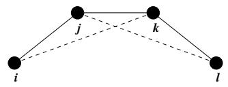  
图 5.22: 反常二面角示意。环的面外弯曲。反常二面角 ?? 定义为平面 (i, j, k) 和 (j, k, l) 之间的夹角。

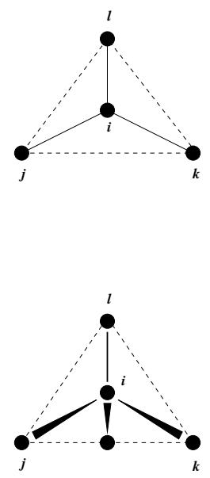  
图 5.23: 反常二面角示意。四面体偏离。反常二面角 ?? 定义为平面(i, j, k) 和 (j, k, l) 之间的夹角。

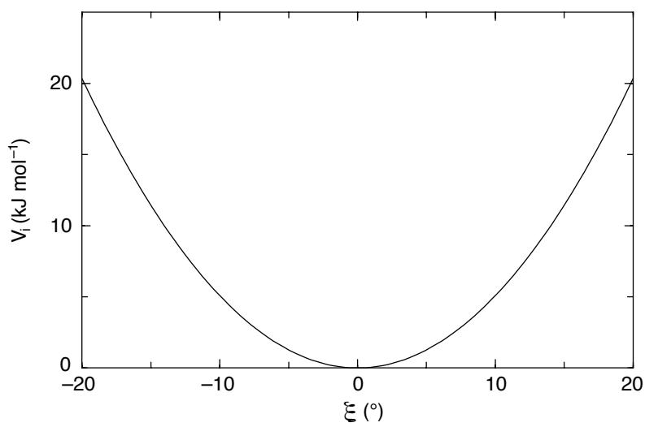  
图 5.24: 反常二面角势。

## 反常二面角：周期型

这种势函数与周期性的正常二面角相同（见下文）。将这种二面角类型（类型 4）单独分类只是为了能够在参数部分和输出中将反常二面角和正常二面角区分开来。

## 正常二面角

对于正常的二面角相互作用，可以选择 GROMOS 的周期性函数或基于 cos?? 幂的多项式展开函数（所谓的 Ryckaert-Bellemans 势）。这种选择对于是否包含二面角四个原子中的第一个和第四个原子之间的特殊相互作用有影响。对周期性的 GROMOS 势，必须包含特殊的 1-4 LJ 相互作用；对于 烷烃的Ryckaert-Bellemans 势，必须从非键列表中排除 1-4 相互作用。注意：Ryckaert-Bellemans 势也可与 1-4相互作用联合使用，如 OPLS 力场。因此，在这种情况下，不应修改由pdb2gmx↪149 生成的拓扑。

## 正常二面角：周期型

正常二面角的定义遵从 IUPAC/IUB 约定，?? 是面 ?????? 和面 ?????? 之间的夹角，0 对应于 顺式 cis 构型 (??和 ?? 位于同一侧)。GROMACS 拓扑文件中有两种二面角函数类型。标准类型 1 的行为与任何其他成键相互作用一样。对于某些力场，类型 9 很有用。当在 [ dihedraltypes ] 部分对相同原子类型定义了多个参数时，类型 9 允许将多个势能函数自动用于 [ dihedral ] 部分的单个二面角。

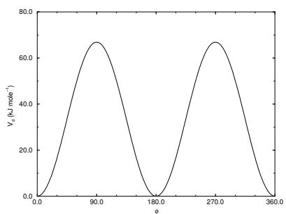  
图 5.25: 正常二面角原理（左，反式 trans 构型）和二面角势（右）。

$$
V _ { d } ( \phi _ { i j k l } ) = k _ { \phi } ( 1 + \cos ( n \phi - \phi _ { s } ) )\tag{5.175}
$$

正常二面角：Ryckaert-Bellemans 势函数

对烷烃，通常使用以下的正常二面角势（见 图 5.26）:

$$
V _ { r b } ( \phi _ { i j k l } ) = \sum _ { n = 0 } ^ { 5 } C _ { n } ( \cos ( \psi ) ) ^ { n } ,\tag{5.176}
$$

其中 $\psi = \phi - 1 8 0 ^ { \circ } ,$ o

注意：通过将每个系数 $C _ { n }$ 乘以 (−1)??，可以从一种约定转换到另一种约定。

表 表 5.8 给出了常数 ?? 的一个示例。

表 5.8: Ryckaert-Bellemans 势的常数 (kJ mol−1)
<table><tr><td rowspan=1 colspan=1> $C _ { 0 }$ </td><td rowspan=1 colspan=1>9.28</td><td rowspan=1 colspan=1> $C _ { 2 }$ </td><td rowspan=1 colspan=1> $- 1 3 . 1 2$ </td><td rowspan=1 colspan=1> $C _ { 4 }$ </td><td rowspan=1 colspan=1>26.24</td></tr><tr><td rowspan=1 colspan=1> $C _ { 1 }$ </td><td rowspan=1 colspan=1>12.16</td><td rowspan=1 colspan=1> $C _ { 3 }$ </td><td rowspan=1 colspan=1>-3.06</td><td rowspan=1 colspan=1> $C _ { 5 }$ </td><td rowspan=1 colspan=1>-31.5</td></tr></table>

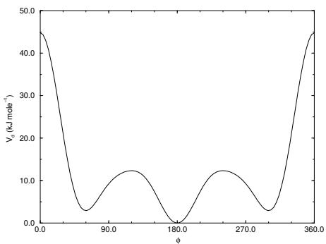  
图 5.26: Ryckaert-Bellemans 二面角势。

(注意：使用这种势函数意味着排除了二面角的第一个和最后一个原子之间的 LJ 相互作用，并且 $\psi$ 的定义遵从“聚合物惯例” $( \psi _ { t r a n s } = 0 ) )$ 。

RB 二面角函数也可用于包括傅里叶二面角（见下文）:

$$
V _ { r b } ( \phi _ { i j k l } ) \ = \ \frac { 1 } { 2 } \left[ F _ { 1 } ( 1 + \cos ( \phi ) ) + F _ { 2 } ( 1 - \cos ( 2 \phi ) ) + F _ { 3 } ( 1 + \cos ( 3 \phi ) ) + F _ { 4 } ( 1 - \cos ( 4 \phi ) ) \right] \ .\tag{5.177}
$$

由于存在等式 $\cos ( 2 \phi ) = 2 \cos ^ { 2 } ( \phi ) - 1 , \cos ( 3 \phi ) = 4 \cos ^ { 3 } ( \phi ) - 3 \cos ( \phi )$ 和 $\cos ( 4 \phi ) = 8 \cos ^ { 4 } ( \phi ) - 8 \cos ^ { 2 } ( \phi ) + 1$ 可以根据下面的方法将 OPLS 参数转换为 Ryckaert-Bellemans 参数：

$$
\begin{array} { r c l } { { C _ { 0 } } } & { { = } } & { { F _ { 2 } + \frac { 1 } { 2 } ( F _ { 1 } + F _ { 3 } ) } } \\ { { C _ { 1 } } } & { { = } } & { { \frac { 1 } { 2 } ( - F _ { 1 } + 3 F _ { 3 } ) } } \\ { { C _ { 2 } } } & { { = } } & { { - F _ { 2 } + 4 F _ { 4 } } } \\ { { C _ { 3 } } } & { { = } } & { { - 2 F _ { 3 } } } \\ { { C _ { 4 } } } & { { = } } & { { - 4 F _ { 4 } } } \\ { { C _ { 5 } } } & { { = } } & { { 0 } } \end{array}\tag{5.178}
$$

OPLS 参数遵从蛋白质约定，而 RB 参数遵从聚合物约定 (这导致了 cos(??) 奇数次幂前面的负号)。

注意：记得将文献中 OPLS 和 RB 参数的单位 kcal mol−1 转换为 GROMACS 使用的单位 $\mathbf { k J \ m o l { \bar { \mathbf { \theta } } } ^ { - 1 } }$ 。

正常二面角：傅里叶函数

OPLS 势函数为傅里叶级数的前三个 $\cdot 8 6 _ { \scriptscriptstyle \odot 5 3 5 }$ 或前四个余弦项 $8 7 _ { \odot 5 3 5 }$ 。在 GROMACS 中，使用了四项的函数为：

$$
V _ { F } ( \phi _ { i j k l } ) \ = \ \frac 1 2 \left[ C _ { 1 } ( 1 + \cos ( \phi ) ) + C _ { 2 } ( 1 - \cos ( 2 \phi ) ) + C _ { 3 } ( 1 + \cos ( 3 \phi ) ) + C _ { 4 } ( 1 - \cos ( 4 \phi ) ) \right] ,\tag{5.179}
$$

GROMACS 内部使用 Ryckaert-Bellemans 代码来计算傅里叶二面角（见上文），因为效率更高。注意：记得将文献中 OPLS 参数的单位 $k \mathrm { c a l \ m o l ^ { - 1 } }$ 转换为 GROMACS 使用的单位为 $\mathbf { k J \ m o l { \bar { \mathbf { \theta } } } ^ { - 1 } }$ O

正常二面角：受限扭转势

与受限弯曲势（参见受限弯曲势 $\begin{array} { c } { { \dot { } } } \\ { { \hookrightarrow 3 8 5 } } \end{array} .$ ）非常相似，受限扭转/二面角势为：

$$
V _ { \mathrm { R e T } } ( \phi _ { i } ) = \frac { 1 } { 2 } k _ { \phi } \frac { ( \cos \phi _ { i } - \cos \phi _ { 0 } ) ^ { 2 } } { \sin ^ { 2 } \phi _ { i } }\tag{5.180}
$$

这种势具有作为 cos?? 的函数优点 (对 sin $\mathbf { \nabla } \phi$ 求导不会出现问题)，并且能将扭转角保持在仅有的一个最小点。在这种情况下，因子 $\sin ^ { 2 } \phi$ 保证了二面角不会从 [−180∘:0] 区间移动到 [0:180∘] 区间，即函数不可能同时在 − $\cdot \phi _ { 0 }$ 和 $+ \phi _ { 0 }$ 处具有最大值，而只能取其中之一。出于这个原因，初始构型中所有二面角的角度值都必须处于所需的角度区间内，并且平衡值 $\phi _ { 0 }$ 不应太接近区间的端点 (与受限弯曲势 $ 3 8 5$ 中所讲的受限弯曲势类似，推荐至少 $1 0 ^ { \circ }$ 的差异)。

## 正常二面角：组合弯曲扭转势

当形成二面角的四个粒子共线时（这种情况不可能在原子尺度的模拟中出现，但可能在粗粒化模拟中出现），扭角及其势函数的计算会导致数值不稳定性。避免这种情况的一种方法是使用受限弯曲势（见受限弯曲势 $_ {  3 8 5 } \ : \ : \rangle$ ），以防止二面角达到 180∘。

另一种方法是忽略二面角不合理时的任何影响，通过将扭转势（以余弦形式）与相邻弯曲角的弯曲势耦合在单一的表达式中，保持二面角力和势能的计算在整个角度范围内连续：

$$
V _ { \mathrm { C B T } } ( \theta _ { i - 1 } , \theta _ { i } , \phi _ { i } ) = k _ { \phi } \sin ^ { 3 } \theta _ { i - 1 } \sin ^ { 3 } \theta _ { i } \sum _ { n = 0 } ^ { 4 } a _ { n } \cos ^ { n } \phi _ { i } .\tag{5.181}
$$

这种组合的弯曲扭转（CBT）势在论文 $8 8 _ { \hookrightarrow 5 3 5 }$ 中提出，用于聚合物熔融模拟，论文 $8 \mathcal { B } _ { \hookrightarrow 5 3 5 }$ 对此有广泛说明。

这种势函数有两个主要的优点：

• 它不仅取决于 $( i - 2 , ~ i - 1$ ，?? 和 ?? + 1 号珠子之间的) 二面角 $\phi _ { i }$ ，也取决于由三个相邻珠子定义的弯曲角 $\theta _ { i - 1 }$ 和 $\theta _ { i }$ (分别由 ?? − 2，?? − 1，??，和 ?? − 1，??，?? + 1 定义)。两个弯曲角中的任何一个接近 180∘ 时，两个 $\sin ^ { 3 } \theta$ 前因子抵消了扭转势和力。这一作法先在论文 $8 9 _ { \hookrightarrow 5 3 5 }$ 中提出，然后在论文 $9 0 _ { \scriptscriptstyle \odot 5 3 6 }$ 中进行了理论讨论。

• 它对 $\phi _ { i }$ 的依赖性通过 $\cos \phi _ { i }$ 的多项式表达，这避免了当 $\phi = 0 ^ { \circ }$ 或 $1 8 0 ^ { \circ }$ 时计算扭转力的奇异性。这两个性质使得 CBT 势在弯曲角约束较弱的 MD 模拟中表现良好，甚至对于弯曲角和扭转角受变化剧烈的拉伸/非平衡 MD 也是如此。当使用 CBT 势时，相邻的 $\theta _ { i - 1 }$ 和 $\theta _ { i }$ 的弯曲势可取任何形式，也可以完全省略这两个角弯曲项 $( \boldsymbol { \theta } _ { i - 1 }$ 和 $\theta _ { i } )$ 。图 5.27 显示了使用和不使用 $\sin ^ { 3 } \theta$ 因子（分别为蓝色和灰色曲线）时扭转势之间的差别。

另外， $V _ { C B T }$ 对笛卡尔变量的导数非常简单：

$$
\frac { \partial V _ { \mathrm { C B T } } ( \theta _ { i - 1 } , \theta _ { i } , \phi _ { i } ) } { \partial \vec { r } _ { l } } = \frac { \partial V _ { \mathrm { C B T } } } { \partial \theta _ { i - 1 } } \frac { \partial \theta _ { i - 1 } } { \partial \vec { r } _ { l } } + \frac { \partial V _ { \mathrm { C B T } } } { \partial \theta _ { i } } \frac { \partial \theta _ { i } } { \partial \vec { r } _ { l } } + \frac { \partial V _ { \mathrm { C B T } } } { \partial \phi _ { i } } \frac { \partial \phi _ { i } } { \partial \vec { r } _ { l } }\tag{5.182}
$$

CBT 基于无多重度的余弦形式，因此它只在 $0 ^ { \circ }$ 左右对称。为获得非对称的二面角分布 (例如，在[−180∘:180∘] 区间内只有一个最大值)，应该使用标准的扭转势，如简谐角势或周期性余弦势，而不是CBT 势。然而，这两种形式对于力的导数 $\left( 1 / \sin \phi \right)$ 和珠子处于直线 $( \theta _ { i }$ 或 $\theta _ { i - 1 } = 0 ^ { \circ } , 1 8 0 ^ { \circ } )$ 的情况都不方便。将非 cos?? 势与 $\sin ^ { 3 } \theta$ 因子耦合并不能提高模拟的稳定性，因为在某些情况下 ?? 和 $\phi$ 同时等于180∘。对这一步进行积分是可行的（由于扭转势的抵消），但下一步积分将是奇异的 (?? 并非 $1 8 0 ^ { \circ }$ 而 $\phi$ 非常接近 180∘)。

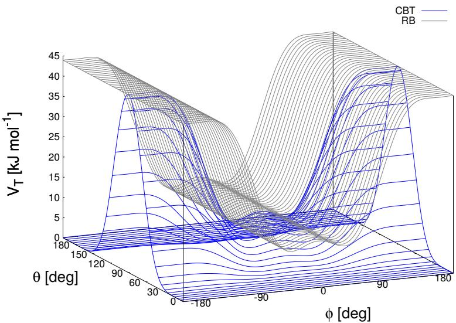  
图 5.27: 蓝色：组合弯曲扭转势的曲面图 (方程 (5.181)，其中$k = 1 0 \ \mathrm { k J \ m o l ^ { - 1 } }$ ， $a _ { 0 } = 2 . 4 1$ ， $a _ { 1 } = - 2 . 9 5$ ， $a _ { 2 } = 0 . 3 6$ ， $a _ { 3 } = 1 . 3 3 )$ 。为简单起见，弯曲角相同 $( \theta _ { 1 } = \theta _ { 2 } = \theta )$ 。灰色：相同的扭转势函数但不含 $\sin ^ { 3 } \theta$ 项（Ryckaert-Bellemans 型）。 $\phi$ 为二面角。

表格式成键相互作用函数

为了具有充分的灵活性，键，键角和二面角可以使用任何函数形式，只要用户提供相应的函数表格即可。函数形式为：

$$
\begin{array} { r l } { V _ { b } ( r _ { i j } ) = } & { { } \ k f _ { n } ^ { b } ( r _ { i j } ) } \\ { V _ { a } ( \theta _ { i j k } ) = } & { { } \ k f _ { n } ^ { a } ( \theta _ { i j k } ) } \\ { V _ { d } ( \phi _ { i j k l } ) = } & { { } \ k f _ { n } ^ { d } ( \phi _ { i j k l } ) } \end{array}\tag{5.183}
$$

其中 ?? 为以能量为单位的力常数，?? 为三次样条函数；详细说明见势能的三次样条插值 $ 4 9 4 \ : \mathrm { O }$ 对每种相互作用，都需要在拓扑中指定力常数 ?? 和表格编号 $n _ { \circ }$ 有两种不同类型的键，一种产生排除（类型 8），另一种不产生排除（类型 9）。详细信息见表 表 5.14。表格文件会提供给 $m d r u n _ { \substack { \scriptscriptstyle \mathrm { Q 1 3 1 } } }$ 程序。表格文件名称后面跟着下划线，再后面跟着一个字母，其中 b 表示键，a 表示键角，d 表示二面角，最后跟着表格编号。例如，对编号 $n = 0$ 的键，可以从文件 table\_b0.xvg 中读取表格势。可简单地通过使用不同的 ??值来提供多个表格，并将其应用于指定的键，具体说明见拓扑（表 表 5.14）。表格文件的格式固定的，三列，每列宽度任意。这三列必须包含 $x , \ f ( x ) , \ - f ^ { \prime } ( x )$ ，其中 $x$ 必须等间隔。拓扑条目的要求见 表5.14。表格的设置如下：

键：?? 是以 nm 为单位的距离。若模拟时距离超出表格长度， $m d r u n _ { \substack { \scriptscriptstyle \mathrm { Q 1 3 1 } } }$ 将退出并显示错误消息。

键角：?? 是以度为单位的角度。表格应从 0 开始直到 180 度，并包括 180 度；导数以度为单位。

二面角：?? 是以度为单位的二面角。表格应从-180 开始直到 180 度，并包括 180 度；使用 IUPAC/IUB约定，即 0 度对应顺式，导数以度为单位。

## 5.5.3 限制

可以使用一些特殊的势能函数对系统的运动施加限制，以避免模拟中出现灾难性的偏差，或用以包含了自实验数据的知识。无论哪种情况，限制实际上都不是力场的一部分，并且所用参数的可靠性也不重要。在此讨论 GROMACS 实现的限制的函数形式只是为了保持完整性。在 GROMACS 中，限制和约束所用的算法完全不同。

## 位置限制

位置限制用于将粒子限制在固定的参考位置 $\mathbf { R } _ { i \circ }$ 。在平衡过程中可以利用它们来避免系统关键部分产生剧烈的位置变化（例如，当溶剂尚未平衡时，蛋白质会受到来自溶剂分子的很大的力，这时就可以限制蛋白质中一些原子的运动）。位置限制的另一个应用是将粒子限制在围绕某个区域的壳层中，以便对此区域进行细致的模拟。壳层只是近似的，因为它缺少与壳层之外的那些缺失粒子之间的合适的相互作用。这样，限制可以维持系统内部的完整性。对于球形壳层，好的作法是让力常数随半径变化，从内边界处的零值开始增大，一直增大到外边界处的较大值。但这一功能尚未在 GROMACS 中实现。

位置限制使用下面的势能形式：

$$
V _ { p r } ( \mathbf { r } _ { i } ) = \frac { 1 } { 2 } k _ { p r } | \mathbf { r } _ { i } - \mathbf { R } _ { i } | ^ { 2 }\tag{5.184}
$$

此势能函数的图形见 图 5.28。

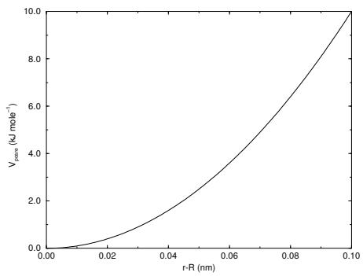  
图 5.28: 位置限制势。

不失一般性，可将势能改写为：

$$
V _ { p r } ( \mathbf { r } _ { i } ) = \frac { 1 } { 2 } \left[ k _ { p r } ^ { x } ( x _ { i } - X _ { i } ) ^ { 2 } ~ \hat { \mathbf { x } } + k _ { p r } ^ { y } ( y _ { i } - Y _ { i } ) ^ { 2 } ~ \hat { \mathbf { y } } + k _ { p r } ^ { z } ( z _ { i } - Z _ { i } ) ^ { 2 } ~ \hat { \mathbf { z } } \right]\tag{5.185}
$$

相应的力为：

$$
\begin{array} { r c l } { F _ { i } ^ { x } } & { = } & { - k _ { p r } ^ { x } \left( x _ { i } - X _ { i } \right) } \\ { F _ { i } ^ { y } } & { = } & { - k _ { p r } ^ { y } \left( y _ { i } - Y _ { i } \right) } \\ { F _ { i } ^ { z } } & { = } & { - k _ { p r } ^ { z } \left( z _ { i } - Z _ { i } \right) } \end{array}\tag{5.186}
$$

使用三个不同的力常数，就可以在每个空间方向上打开或关闭位置限制；这意味着原子可以被简谐地限制在平面或直线上。位置限制施加到特殊的固定原子列表上。这一列表通常由 $p d b \mathcal { Q } g m x _ { \scriptscriptstyle { \Theta } 1 4 9 }$ 程序生成。

请注意，位置限制使得势能取决于空间中的绝对坐标。因此，一般说来，在这种情况下，压力（和维里）无法良好地定义，因为压力是体系的自由能相对于体积的导数。如果设置了 mdp 选项 $r e f c o o r d - s c a l i n g = a l l _ { \hookrightarrow 2 3 8 }$ ，参考坐标会根据整个体系进行缩放，这种情况下压力和维里都可以良好地定义。

## 平底位置限制

平底位置限制可用于将粒子限制在模拟体积的某一部分中。在势能的平底区域内，没有力作用到受限制的粒子上，但当粒子处于势能的平底区域之外时，则会受到一个简谐力作用，这个力会驱使粒子向平底区域移动。对同一粒子可以同时施加常规的位置限制和平底位置限制 (但二者的参考位置 $\mathbf { R } _ { i }$ 必须相同)。平底位置限制使用下面的通用势能函数（图 5.29 A）:

$$
V _ { \mathrm { f b } } ( \mathbf { r } _ { i } ) = \frac { 1 } { 2 } k _ { \mathrm { f b } } [ d _ { g } ( \mathbf { r } _ { i } ; \mathbf { R } _ { i } ) - r _ { \mathrm { f b } } ] ^ { 2 } H [ d _ { g } ( \mathbf { r } _ { i } ; \mathbf { R } _ { i } ) - r _ { \mathrm { f b } } ] ,\tag{5.187}
$$

其中 $\mathbf { R } _ { i }$ 为参考位置， $r _ { \mathrm { f b } }$ 为中心到平底势的距离， $k _ { \mathrm { f b } }$ 为力常数，?? 为 Heaviside 阶跃函数。到参考位置的距离 $d _ { g } ( \mathbf { r } _ { i } ; \mathbf { R } _ { i } )$ 取决于平底势的几何构造 $g _ { \mathfrak { c } }$ 。

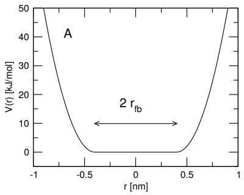

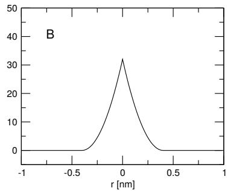  
图 5.29: 平底位置限制势。(A) 未反转，(B) 反转。

GROMACS 支持以下几种平底势的几何构造：

球 $( g = 1 )$ : 粒子被限制在给定半径的球内。所受的力指向球的中心。距离的计算方法如下：

$$
d _ { g } ( \mathbf { r } _ { i } ; \mathbf { R } _ { i } ) = | \mathbf { r } _ { i } - \mathbf { R } _ { i } |\tag{5.188}
$$

圆柱 $( g = 6 , 7 , 8 )$ : 粒子被限制在给定半径的圆柱中，圆柱的轴平行于 $x \ ( g = 6 )$ ，?? $( g = 7 )$ 或 ?? 轴$( g = 8 )$ 。为了程序能够向后兼容，设置 $g = 2$ 在代码中会被替换为 $g = 8$ ，这样旧的tpr↪460 文件和拓扑仍然可以正常使用。来自平底势的作用力指向圆柱的轴。平行于圆柱轴的力的分量为零。对于沿 ?? 轴方向放置的圆柱，距离计算方法如下：

$$
d _ { g } ( \mathbf { r } _ { i } ; \mathbf { R } _ { i } ) = \sqrt { ( x _ { i } - X _ { i } ) ^ { 2 } + ( y _ { i } - Y _ { i } ) ^ { 2 } }\tag{5.189}
$$

层 $( g = 3 , 4 , 5 )$ : 粒子被限制在层中，层由其厚度与法线定义。法线可平行于 ??，?? 或 ?? 轴。作用力平行于层的法线。距离的计算方法如下：

$$
d _ { g } ( \mathbf { r } _ { i } ; \mathbf { R } _ { i } ) = | x _ { i } - X _ { i } | , \ { \overset { \mathrm { H S } } { \operatorname { \operatorname { \operatorname { d } } } } } \ d _ { g } ( \mathbf { r } _ { i } ; \mathbf { R } _ { i } ) = | y _ { i } - Y _ { i } | , \ { \overset { \mathrm { H S } } { \operatorname { \operatorname { d } } } } \ d _ { g } ( \mathbf { r } _ { i } ; \mathbf { R } _ { i } ) = | z _ { i } - Z _ { i } | .\tag{5.190}
$$

对同一粒子可施加多个独立的，具有不同几何构造的平底位置限制。例如，沿 ?? 方向同时施加圆柱和层限制可以将粒子限制在一个圆盘中。在 ??，??，?? 三个方向施加层限制可以将粒子限制在长方体内。

此外，可以反转限制区域和未限制区域，这样得到的势能会使粒子处于由 $\mathbf { R } _ { i }$ ，?? 和 $r _ { \mathrm { f b } }$ 定义的体积之外。在拓扑中指定负值的 ?? 就可以启用此特性。可以使用下面的势能（图 5.29 B）: $r _ { \mathrm { f b } }$

$$
V _ { \mathrm { f b } } ^ { \mathrm { i n v } } ( \mathbf { r } _ { i } ) = \frac { 1 } { 2 } k _ { \mathrm { f b } } [ d _ { g } ( \mathbf { r } _ { i } ; \mathbf { R } _ { i } ) - | r _ { \mathrm { f b } } | ] ^ { 2 } H [ - ( d _ { g } ( \mathbf { r } _ { i } ; \mathbf { R } _ { i } ) - | r _ { \mathrm { f b } } | ) ] .\tag{5.191}
$$

角限制

角限制用于限制两对粒子之间，或一对粒子与 ?? 轴之间的角度。所用的函数形式类似于正常二面角。对两对原子之间的夹角：

$$
V _ { a r } ( \mathbf { r } _ { i } , \mathbf { r } _ { j } , \mathbf { r } _ { k } , \mathbf { r } _ { l } ) = k _ { a r } ( 1 - \cos ( n ( \theta - \theta _ { 0 } ) ) ) , ~ \nVDash \mathrm { i } \mathrm { f i } ~ \theta = \operatorname { a r c c o s } \left( { \frac { \mathbf { r } _ { j } - \mathbf { r } _ { i } } { | \mathbf { r } _ { j } - \mathbf { r } _ { i } | } } \cdot { \frac { \mathbf { r } _ { l } - \mathbf { r } _ { k } } { | \mathbf { r } _ { l } - \mathbf { r } _ { k } | } } \right)\tag{5.192}
$$

对于一对原子和 ?? 轴之间的夹角：

$$
V _ { a r } ( \mathbf { r } _ { i } , \mathbf { r } _ { j } ) = k _ { a r } ( 1 - \cos ( n ( \theta - \theta _ { 0 } ) ) ) , \quad \# \# \ \theta = \operatorname { a r c c o s } \left( { \frac { \mathbf { r } _ { j } - \mathbf { r } _ { i } } { | \mathbf { r } _ { j } - \mathbf { r } _ { i } | } } \cdot { \left( \begin{array} { l } { 0 } \\ { 0 } \\ { 1 } \end{array} \right) } \right)\tag{5.193}
$$

当不需要区分平行和反平行向量时，多重度 (??) 可设置为 2。平衡角度 ?? 对多重度 1 应处于 0 到 180 度之间，对多重度 2 应处于 0 到 90 度之间。

## 二面角限制

二面角限制用于限制由四个粒子定义的二面角 ??，类似反常二面角（反常二面角 $\hookrightarrow 3 8 6$ 一节）中，但使用了稍加修改的势能函数。利用

$$
\phi ^ { \prime } = \left( \phi - \phi _ { 0 } \right) \ \mathrm { M O D } \ 2 \pi\tag{5.194}
$$

其中 $\phi _ { 0 }$ 为参考角度，势能的定义为：

$$
V _ { d i h r } ( \phi ^ { \prime } ) ~ = ~ \left\{ \begin{array} { l l l } { { \frac { 1 } { 2 } k _ { d i h r } ( \phi ^ { \prime } \Delta \phi ) ^ { 2 } } } & { { \dddot { \overline { { { \Theta } } } } \quad \| \phi ^ { \prime } \| } } & { { > ~ \Delta \phi } } \\ { { } } & { { } } & { { } } \\ { { 0 } } & { { \dddot { \overline { { { \Theta } } } } \quad \| \phi ^ { \prime } \| } } & { { \leq ~ \Delta \phi } } \end{array} \right.\tag{5.195}
$$

其中 $\Delta \phi$ 为用户定义的角度， $k _ { d i h r }$ 为力常数。注意，在拓扑文件的输入中，键角以度为单位，而力常数的单位为 $\mathrm { k J / m o l / r a d ^ { 2 } }$ 。

## 距离限制

当指定的原子对之间的距离超过阈值时，距离限制会给势能增加一个惩罚项。它们通常用于对系统的运动施加来自实验的限制，如核磁共振（NMR）实验。因此，MD 可用于 NMR 数据的结构精修。在GROMACS 中有三种为原子对施加距离限制的方法：

• 简单的简谐限制：使用 [ bonds ] 类型 6(参见排除 $_ {  4 2 4 } \ : \longrightarrow \overline { { \mathbb { I } } } )$ 。

• 分段线性/简谐约束：[ bonds ] 类型 10。

• 复杂的 NMR 距离限制，可选择是否使用原子对，时间和/或系综平均。

现在详细说明后面两个选项。

当低于指定的下界或处于指定的两个上界之间时，距离限制的势能函数形式为二次；当超过最大边界时，势能为线性（见 图 5.30）。

$$
V _ { d r } ( r _ { i j } ) ~ = ~ \left\{ \begin{array} { l l } { \frac { 1 } { 2 } k _ { d r } ( r _ { i j } - r _ { 0 } ) ^ { 2 } } & { \ddagger \quad } & { r _ { i j } ~ < ~ r _ { 0 } } \\ { 0 } & { \ddagger \quad r _ { 0 } ~ \leq ~ r _ { i j } ~ < ~ r _ { 1 } } \\ { \frac { 1 } { 2 } k _ { d r } ( r _ { i j } - r _ { 1 } ) ^ { 2 } } & { \ddagger \quad r _ { 1 } ~ \leq ~ r _ { i j } ~ < ~ r _ { 2 } } \\ { \frac { 1 } { 2 } k _ { d r } ( r _ { 2 } - r _ { 1 } ) ( 2 r _ { i j } - r _ { 2 } - r _ { 1 } ) } & { \ddagger \quad r _ { 2 } ~ \leq ~ r _ { i j } } \end{array} \right.\tag{5.196}
$$

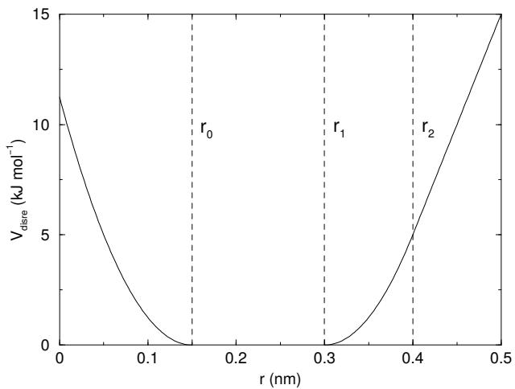  
图 5.30: 距离限制势。

相应的力为

$$
\mathbf { F } _ { i } ~ = ~ \left\{ \begin{array} { l l l l l l l } { - k _ { d r } ( r _ { i j } - r _ { 0 } ) \frac { \mathbf { r } _ { i j } } { r _ { i j } } } & { \frac { + + } { \mathbb { G } } } & { r _ { i j } } & { < } & { r _ { 0 } } \\ { 0 } & { \frac { + + } { \mathbb { G } } } & { r _ { 0 } } & { \leq } & { r _ { i j } } & { < } & { r _ { 1 } } \\ { - k _ { d r } ( r _ { i j } - r _ { 1 } ) \frac { \mathbf { r } _ { i j } } { r _ { i j } } } & { \frac { + + } { \mathbb { G } } } & { r _ { 1 } } & { \leq } & { r _ { i j } } & { < } & { r _ { 2 } } \\ { - k _ { d r } ( r _ { 2 } - r _ { 1 } ) \frac { \mathbf { r } _ { i j } } { r _ { i j } } } & { \frac { + + } { \mathbb { G } } } & { r _ { 2 } } & { \leq } & { r _ { i j } } \end{array} \right.\tag{5.197}
$$

对并非来自 NMR 数据的限制，这个函数通常足够了，并且 [ bonds ] 类型 10 可用于在原子对之间施加单独的限制，参见拓扑文件 $\hookrightarrow 4 3 2 0$ 为施加来自 NMR 测量数据的限制，可能需要更复杂的函数，这可以利用 [ distance\_restraints ] 提供，下面将对此进行说明。

时间平均

基于瞬时距离的距离限制可以极大地减弱分子内的波动。可以通过限制 时间平均的距离来解决这个问题 $9 1 _ { \substack { \scriptscriptstyle \odot \mathrm { 5 3 6 } \scriptscriptstyle \odot } }$ 。时间平均的力为：

$$
\mathbf { F } _ { i } ~ = ~ \left\{ \begin{array} { l l l l l l l } { - k _ { d r } ^ { a } ( \bar { r } _ { i j } - r _ { 0 } ) \frac { \mathbf { r } _ { i j } } { r _ { i j } } } & { \frac { + + } { \mathcal { Q } } } & { \bar { r } _ { i j } } & { < } & { r _ { 0 } } \\ { 0 } & { \frac { + + } { \mathcal { Q } } } & { r _ { 0 } } & { \le } & { \bar { r } _ { i j } } & { < } & { r _ { 1 } } \\ { - k _ { d r } ^ { a } ( \bar { r } _ { i j } - r _ { 1 } ) \frac { \mathbf { r } _ { i j } } { r _ { i j } } } & { \frac { + + } { \mathcal { Q } } } & { r _ { 1 } } & { \le } & { \bar { r } _ { i j } } & { < } & { r _ { 2 } } \\ { - k _ { d r } ^ { a } ( r _ { 2 } - r _ { 1 } ) \frac { \mathbf { r } _ { i j } } { r _ { i j } } } & { \frac { + + } { \mathcal { Q } } } & { r _ { 2 } } & { \le } & { \bar { r } _ { i j } } \end{array} \right.\tag{5.198}
$$

其中 $\bar { r } _ { i j }$ 由衰减时间为 ?? 的指数运行平均给出：

$$
\bar { r } _ { i j } = < r _ { i j } ^ { - 3 } > ^ { - 1 / 3 }\tag{5.199}
$$

力常数 $k _ { d r } ^ { a }$ 会缓慢启用，以弥补模拟开始时缺少历史数据的问题：

$$
k _ { d r } ^ { a } = k _ { d r } \left( 1 - \exp \left( - \frac { t } { \tau } \right) \right)\tag{5.200}
$$

由于时间平均，我们无法再讨论距离限制势 $\vec { \textbf { J } }$ O

采用这种方式，一个原子可以通过在两个位置之间移动来 平均地满足两个不兼容的距离限制。举例来说，氨基酸侧链会围绕其 ?? 二面角旋转，从而接近于其他各种基团。这种活动的侧链可能产生多个 NOE，这些 NOE 无法由单一结构满足。

$m d r u n _ { \substack { \scriptscriptstyle \mathrm { Q 1 3 1 } } }$ 程序计算时间平均距离的方式如下：

$$
\begin{array} { r c l } { { r ^ { - 3 } { } _ { i j } ( 0 ) } } & { { = } } & { { { r _ { i j } ( 0 ) ^ { - 3 } } } } \\ { { \overline { { { r ^ { - 3 } } } } _ { i j } ( t ) } } & { { = } } & { { \overline { { { r ^ { - 3 } } } } _ { i j } ( t - \Delta t ) \ \exp \left( - \frac { \Delta t } { \tau } \right) + r _ { i j } ( t ) ^ { - 3 } \left[ 1 - \exp \left( - \frac { \Delta t } { \tau } \right) \right] } } \end{array}\tag{5.201}
$$

当原子对处于边界之内时可能仍会受到力的作用，因为时间平均的距离可能仍然超过了界限。为防止质子被拉得太近，可以采用混合方法。在这种方法中，当瞬时距离处于边界之内时，惩罚项为零，其他情况下惩罚项为瞬时偏离与时间平均偏离乘积的平方根：

$$
\mathbf F _ { i } = \left\{ \begin{array} { l l } { \begin{array} { l l } { k _ { d r } ^ { a } \sqrt { ( r _ { i j } - r _ { 0 } ) ( \bar { r } _ { i j } - r _ { 0 } ) } \frac { \bar { r } _ { i j } } { r _ { i j } } } & { \ddagger } \\ { - k _ { d r } ^ { a } , \operatorname* { m i n } \left( \sqrt { ( r _ { i j } - r _ { 1 } ) ( \bar { r } _ { i j } - r _ { 1 } ) } , r _ { 2 } - r _ { 1 } \right) \frac { \bar { r } _ { i j } } { r _ { i j } } } & { \ddagger } \\ { 0 } & { \ddagger \nmid \mathrm { t } } \end{array} } & { r _ { i j } < r _ { 0 } \mathcal { H } \cdot \begin{array} { l l } { \bar { r } _ { i j } < r _ { 0 } } \\ { \bar { r } _ { i j } > r _ { 1 } } \end{array} } \end{array} \right. \mathrm { ~ , ~ }\tag{5.202}
$$

## 多对平均

有时无法从实验数据获知是哪些原子对产生了单个 NOE，在另外一些情况下，由于体系的对称性，可以明确地知道不止一对原子对信号有贡献，例如含有三个质子的甲基。对这样一个基团，不可能区分这些质子，因此，在计算此甲基与另一质子（或一组质子）之间的距离时，所有三个质子都要考虑在内。由于磁共振的物理本性，NOE 信号的强度与原子间距离的六次方成反比。因此，当原子对组合起来时，??个限制的固定列表可以放在一起，表现出的“距离”为：

$$
r _ { N } ( t ) = \left[ \sum _ { n = 1 } ^ { N } \bar { r } _ { n } ( t ) ^ { - 6 } \right] ^ { - 1 / 6 }\tag{5.203}
$$

对 $\bar { r } _ { n }$ ，我们可以使用 $r _ { i j }$ 或方程 (5.199)。如上所述，可以将瞬时和时间平均的距离 $r _ { N }$ 组合起来形成混合约束。随着更多的成对质子对同一 NOE 信号产生贡献，信号强度会增大，由于是倒数加和，累加的总“距离”会小于任意一个距离。

将力分配到原子对上时有两种选择。第一种是守恒分配，力定义为限制势相对于坐标的导数。当不使用时间平均时，得到的势能是守恒的。分配到原子对上的力与 $r ^ { - 6 }$ 成正比。这意味着近距离的原子对感受到的力会比远距离的原子对大得多，这可能导致分子“过于刚性”。另一种选择是等力分配。在这种情况下，每一对原子受到的力为限制势对 $r _ { N }$ 导数的 $1 / N _ { \circ }$ 这种方法的优点是可以对更多的构象进行采样，但力不是守恒的，可能导致质子局部过热。

也可以使用多个（蛋白质）分子进行 系综平均。在这种情况下，边界应当降低：

$$
\begin{array} { r l r } { r _ { 1 } } & { { } = } & { r _ { 1 } M ^ { - 1 / 6 } } \\ { r _ { 2 } } & { { } = } & { r _ { 2 } M ^ { - 1 / 6 } } \end{array}\tag{5.204}
$$

其中 ?? 为分子数。当给定适当的选项时，GROMACS 预处理器 $g r o m p p _ { \Rightarrow 1 0 8 }$ 可自动进行这些操作。这样得到的“距离”再用于计算标量力：

$$
\mathbf { F } _ { i } ~ = ~ \left\{ \begin{array} { r l r l } & { ~ 0 } & { r _ { N } < r _ { 1 } } \\ & { k _ { d r } ( r _ { N } - r _ { 1 } ) \frac { \mathbf { r } _ { i j } } { r _ { i j } } } & { r _ { 1 } \le r _ { N } < r _ { 2 } } \\ & { k _ { d r } ( r _ { 2 } - r _ { 1 } ) \frac { \mathbf { r } _ { i j } } { r _ { i j } } } & { r _ { N } \ge r _ { 2 } } \end{array} \right.\tag{5.205}
$$

其中 ?? 和 ?? 代表所有对 NOE 信号有贡献的原子对。

## 使用距离限制

在拓扑文件中可以将基于 NOE 数据的距离限制列表添加到分子定义中，如下面的示例：

<table><tr><td colspan="7">[distance_restraints ]</td></tr><tr><td>；ai</td><td>aj type</td><td>index</td><td>type&#x27;</td><td></td><td>low</td><td>up1</td><td>up2</td><td>fac</td></tr><tr><td>10</td><td>16</td><td>1</td><td>0</td><td>1</td><td>0.0</td><td>0.3</td><td>0.4</td><td>1.0</td></tr><tr><td>10</td><td>28</td><td>1</td><td>1</td><td>1</td><td>0.0</td><td>0.3</td><td>0.4</td><td>1.0</td></tr><tr><td>10</td><td>46</td><td>1</td><td>1</td><td>1</td><td>0.0</td><td>0.3</td><td>0.4</td><td></td></tr><tr><td>16</td><td>22</td><td>1</td><td>2</td><td>1</td><td>0.0</td><td>0.3</td><td>0.4</td><td>1.0 2.5</td></tr><tr><td>16</td><td>34</td><td>1</td><td>3</td><td>1</td><td>0.0</td><td>0.5</td><td>0.6</td><td>1.0</td></tr></table>

在上面的示例中，可以发现许多特性。ai 和 aj 列为要限制的粒子的原子编号。type 列总是 1。正如在距离限制↪394 一节所解释的，多个距离可能对单个 NOE 信号有所贡献。在拓扑中，这可使用 index列指定。在我们的例子中，限制 10-28 和 10-46 的索引都是 1，因此它们会被同时处理。对一起处理的那些限制的额外要求是，这几个限制必须位于连续的行中，中间不能有任何其他的限制干扰。type' 列通常为 1，但也可设置为 2，以便不对距离约束进行时间平均和系综平均；这适用于抑制氢键。列 low，up1 和 up2 的值分别对应方程 (5.196) 中的 $r _ { 0 } , \ r _ { 1 }$ 和 $r _ { 2 }$ 的值。在某些情况下，对一些限制使用不同的力常数可能有益；这可通过 fac 列进行控制。对每个限制，参数文件中的力常数会乘以 fac 列中的值。每个限制的信息都会存储在能量文件中，可以使用 $\lvert g m x \ n m r _ {  1 4 3 }$ 进行处理和绘图。

## 取向限制

本节论述在 MD 模拟中如何计算并限制向量之间的取向，这些取向可以通过一些 NMR 实验进行测量。  
这里所提出的精修方法，以及使用与不使用时间平均和系综平均对结果的影响已经发表92↪536。

理论

在 NMR 实验中，当一个分子在溶剂中的翻滚并非完全各向同性时，可以测量向量间的取向。这种取向测量的两个例子是残基偶极耦合（两个原子核之间）或化学位移各向异性。向量 $\mathbf { r } _ { i }$ 的可观测量可写为：

$$
\delta _ { i } = \frac { 2 } { 3 } \mathrm { t r } ( \mathbf { S D } _ { i } )\tag{5.206}
$$

其中 S 为无量纲的分子序张量。张量 $\mathbf { D } _ { i }$ 由下式给出：

$$
\mathbf { D } _ { i } = { \frac { c _ { i } } { \| \mathbf { r } _ { i } \| ^ { \alpha } } } \left( { \begin{array} { l l l } { 3 x x - 1 } & { 3 x y } & { 3 x z } \\ { 3 x y } & { 3 y y - 1 } & { 3 y z } \\ { 3 x z } & { 3 y z } & { 3 z z - 1 } \end{array} } \right)\tag{5.207}
$$

$$
\sharp \sharp \varphi _ { \mathbf { \varphi } } \mathbf { \varphi } _ { x } = \frac { r _ { i , x } } { | \mathbf { r } _ { i } | } , \quad y = \frac { r _ { i , y } } { | \mathbf { r } _ { i } | } , \quad z = \frac { r _ { i , z } } { | \mathbf { r } _ { i } | }\tag{5.208}
$$

对偶极耦合， $\mathbf { r } _ { i }$ 为连接两个原子核的向量， $\alpha = 3$ ，常数 $c _ { i }$ 由下式给出：

$$
c _ { i } = \frac { \mu _ { 0 } } { 4 \pi } \gamma _ { 1 } ^ { i } \gamma _ { 2 } ^ { i } \frac { \hbar } { 4 \pi }\tag{5.209}
$$

其中 $\gamma _ { 1 } ^ { i }$ 和 $\gamma _ { 2 } ^ { i }$ 为两个原子核的旋磁比。

序张量是对称的，迹为零。使用旋转矩阵 T 可以将其变换为下面的形式：

$$
\mathbf { T } ^ { T } \mathbf { S } \mathbf { T } = s \left( \begin{array} { c c c } { - \frac { 1 } { 2 } ( 1 - \eta ) } & { 0 } & { 0 } \\ { 0 } & { - \frac { 1 } { 2 } ( 1 + \eta ) } & { 0 } \\ { 0 } & { 0 } & { 1 } \end{array} \right)\tag{5.210}
$$

其中 $- 1 \leq s \leq 1 , \ 0 \leq \eta \leq 1$ 。?? 称为序参数，?? 称为序张量 S 的不对称因子。当分子在溶剂中的翻滚各向同性时，?? 为零，无法观测到取向效应，因为所有的 $\delta _ { i }$ 都为零。

计算模拟中的取向

由于下面将要解释的原因，D 矩阵是相对于分子的参考取向计算的。取向由旋转矩阵 R 定义，计算它时需要使用最小二乘方法将选定的一组原子的当前坐标叠合到参考构象。参考构象为模拟的初始构象。对稍后将要处理的系综平均，参考结构取自第一个子系统。计算的 $\mathbf { D } _ { i } ^ { c }$ 矩阵如下：

$$
{ \bf D } _ { i } ^ { c } ( t ) = { \bf R } ( t ) { \bf D } _ { i } ( t ) { \bf R } ^ { T } ( t )\tag{5.211}
$$

计算的向量 ?? 的取向为：

$$
\delta _ { i } ^ { c } ( t ) = \frac { 2 } { 3 } \mathrm { t r } ( \mathbf { S } ( t ) \mathbf { D } _ { i } ^ { c } ( t ) )\tag{5.212}
$$

序张量 $\mathbf { S } ( t )$ 通常是未知的。对它的一个合理选择是，能够使计算取向与观测取向之间的（加权）平均方差最小的张量：

$$
M S D ( t ) = \left( \sum _ { i = 1 } ^ { N } w _ { i } \right) ^ { - 1 } \sum _ { i = 1 } ^ { N } w _ { i } ( \delta _ { i } ^ { c } ( t ) - \delta _ { i } ^ { e x p } ) ^ { 2 }\tag{5.213}
$$

为正确地组合不同类型的测量， $w _ { i }$ 的单位应使得所有项都是无量纲的。这意味着 $w _ { i }$ 的单位为 $\delta _ { i }$ 单位的−2 次方。注意，使用常数因子缩放所有 $w _ { i }$ 并不会影响序张量。

## 时间平均

由于张量 $\mathbf { D } _ { i }$ 随时间快速波动，远快于实验中能观测到的，所以在模拟中应该对它们进行时间平均。然而，在模拟中，时间和分子数都是有限的。通常无法获得对分子所有取向的收敛的 $\mathbf { D } _ { i }$ 张量的平均值。如果假定分子内 $\mathbf { r } _ { i }$ 向量平均取向的收敛远快于分子的翻滚时间，这一张量可以在随分子一起旋转的坐标轴系统中进行平均，如方程 (5.211) 所示。时间平均的张量使用指数衰减记忆函数进行计算：

$$
\mathbf { D } _ { i } ^ { a } ( t ) = \frac { \displaystyle \int _ { u = t _ { 0 } } ^ { t } \mathbf { D } _ { i } ^ { c } ( u ) \exp \left( - \frac { t - u } { \tau } \right) \mathrm { d } u } { \displaystyle \int _ { u = t _ { 0 } } ^ { t } \exp \left( - \frac { t - u } { \tau } \right) \mathrm { d } u }\tag{5.214}
$$

假定序张量 S 的波动慢于 $\mathbf { D } _ { i }$ ，时间平均的取向为：

$$
\delta _ { i } ^ { a } ( t ) = \frac { 2 } { 3 } \mathrm { t r } ( \mathbf { S } ( t ) \mathbf { D } _ { i } ^ { a } ( t ) )\tag{5.215}
$$

其中序张量 $\mathbf { S } ( t )$ 使用表达式 (5.213) 进行计算，但将其中的 $\delta _ { i } ^ { c } ( t )$ 替换为 $\delta _ { i } ^ { a } ( t )$ 。

限制

可以通过施加力对计算结构进行限制，施加的力正比于计算取向与实验取向之间的差值。不使用时间平均时，合适的势能可定义为：

$$
V = \frac { 1 } { 2 } k \sum _ { i = 1 } ^ { N } w _ { i } ( \delta _ { i } ^ { c } ( t ) - \delta _ { i } ^ { e x p } ) ^ { 2 }\tag{5.216}
$$

其中 ?? 的单位为能量单位。因此限制 ?? 的有效力常数为 $k w _ { i }$ 。力是势能 ?? 的梯度的负值。作用于向量$\mathbf { r } _ { i }$ 上的力 $\mathbf { F } _ { i }$ 为：

$$
\begin{array} { r l r } { \mathbf { F } _ { i } ( t ) = } & { } & { - \frac { \mathrm { d } V } { \mathrm { d } \mathbf { r } _ { i } } } \\ & { = } & { - k w _ { i } ( \delta _ { i } ^ { c } ( t ) - \delta _ { i } ^ { e x p } ) \frac { \mathrm { d } \delta _ { i } ( t ) } { \mathrm { d } \mathbf { r } _ { i } } } \\ & { = } & { - k w _ { i } ( \delta _ { i } ^ { c } ( t ) - \delta _ { i } ^ { e x p } ) \frac { 2 c _ { i } } { \| \mathbf { r } \| ^ { 2 + \alpha } } \left( 2 \mathbf { R } ^ { T } \mathbf { S } \mathbf { R } \mathbf { r } _ { i } - \frac { 2 + \alpha } { \| \mathbf { r } \| ^ { 2 } } \mathrm { t r } ( \mathbf { R } ^ { T } \mathbf { S } \mathbf { R } \mathbf { r } _ { i } \mathbf { r } _ { i } ^ { T } ) \mathbf { r } _ { i } \right) } \\ & { = } & { - k w _ { i } ( \delta _ { i } ^ { c } ( t ) - \delta _ { i } ^ { e x p } ) \frac { 2 c _ { i } } { \| \mathbf { r } \| ^ { 2 + \alpha } } \left( 2 \mathbf { R } ^ { T } \mathbf { S } \mathbf { R } \mathbf { r } _ { i } - \frac { 2 + \alpha } { \| \mathbf { r } \| ^ { 2 } } \mathrm { t r } ( \mathbf { R } ^ { T } \mathbf { S } \mathbf { R } \mathbf { r } _ { i } \mathbf { r } _ { i } ^ { T } ) \mathbf { r } _ { i } \right) } \end{array}\tag{5.217}
$$

系综平均

系综平均可通过模拟一个含有 ?? 子系统的系统来实现，其中每个子系统都包含一组完全相同的取向限制。系统只通过取向限制势进行相互作用，这个势定义为：

$$
V = M \frac { 1 } { 2 } k \sum _ { i = 1 } ^ { N } w _ { i } \langle \delta _ { i } ^ { c } ( t ) - \delta _ { i } ^ { e x p } \rangle ^ { 2 }\tag{5.218}
$$

$m$ 中向量 $\mathbf { r } _ { i , m }$ 上的力为：

$$
\mathbf { F } _ { i , m } ( t ) = - \frac { \mathrm { d } V } { \mathrm { d } \mathbf { r } _ { i , m } } = - k w _ { i } \langle \delta _ { i } ^ { c } ( t ) - \delta _ { i } ^ { e x p } \rangle \frac { \mathrm { d } \delta _ { i , m } ^ { c } ( t ) } { \mathrm { d } \mathbf { r } _ { i , m } }\tag{5.219}
$$

时间平均

当使用时间平均时，无法定义势能。但我们仍然可以定义一个量，它可以粗略地表示限制所具有的能量：

$$
V = M \frac { 1 } { 2 } k ^ { a } \sum _ { i = 1 } ^ { N } w _ { i } \langle \delta _ { i } ^ { a } ( t ) - \delta _ { i } ^ { e x p } \rangle ^ { 2 }\tag{5.220}
$$

计算时缓慢打开力常数 $k _ { a }$ ，以弥补当时间接近初始时刻 $t _ { 0 }$ 时缺少历史数据的问题。力常数精确地正比于已累积的平均量：

$$
k ^ { a } = k \frac { 1 } { \tau } \int _ { u = t _ { 0 } } ^ { t } \exp \left( - \frac { t - u } { \tau } \right) \mathrm { d } u\tag{5.221}
$$

真正重要的是力的定义。它正比于时间平均与瞬时偏差乘积的平方根。只使用时间平均的偏差会引起较大的振荡。力的计算方法如下：

$$
\mathbf { F } _ { i , m } ( t ) = \left\{ \begin{array} { l l } { 0 } & { \begin{array} { l l } { \mp \pmb { a } , b \leq 0 } \\ { k ^ { a } w _ { i } \frac { a } { | a | } \sqrt { a , b } , \frac { \mathrm { d } \delta _ { i , m } ^ { c } ( t ) } { \mathrm { d } \mathbf { r } _ { i , m } } } & { \mp \pmb { \sharp } } \end{array} } & { \begin{array} { l } { a , b > 0 } \end{array} } \end{array} \right.\tag{5.222}
$$

$$
\begin{array} { r l } { a = } & { { } \langle \delta _ { i } ^ { a } ( t ) - \delta _ { i } ^ { e x p } \rangle } \\ { b = } & { { } \langle \delta _ { i } ^ { c } ( t ) - \delta _ { i } ^ { e x p } \rangle } \end{array}\tag{5.223}
$$

## 使用取向限制

在拓扑文件中，可以将取向限制添加到分子定义的 [ orientation\_restraints ] 部分。这里我们给出一个示例，包含了五个 N-H 残基的偶极耦合限制：

<table><tr><td rowspan="2"></td><td colspan="5">[ orientation_restraints ]</td><td colspan="5"></td></tr><tr><td></td><td></td><td></td><td></td><td></td><td>; ai aj type exp. label alpha</td><td>const.</td><td>obs.</td><td>weight</td><td></td></tr><tr><td>;</td><td></td><td></td><td></td><td></td><td></td><td>Hz</td><td>nm^3</td><td>Hz</td><td>Hz^-2</td><td></td></tr><tr><td>31</td><td>32</td><td>1</td><td>1</td><td></td><td>3</td><td>3</td><td>6.083</td><td>-6.73</td><td>1.0</td><td></td></tr><tr><td>43</td><td>44</td><td>1</td><td>1</td><td></td><td>4</td><td>3</td><td>6.083</td><td>-7.87</td><td>1.0</td><td></td></tr><tr><td>55</td><td>56</td><td>1</td><td>1</td><td></td><td>5</td><td>3</td><td>6.083</td><td>-7.13</td><td>1.0</td><td></td></tr><tr><td>65</td><td>66</td><td>1</td><td>1</td><td></td><td>6</td><td>3</td><td>6.083</td><td>-2.57</td><td>1.0</td><td></td></tr><tr><td>73</td><td>74</td><td>1</td><td>1</td><td></td><td>7</td><td>3</td><td>6.083</td><td>-2.10</td><td>1.0</td><td></td></tr></table>

可观测量的单位为 $\mathrm { H z }$ ，但也可以选择任何其他单位。ai 和 aj 列为要限制的粒子的原子编号。type 列总是 $1 _ { \circ } ~ \in \mathrm { x p }$ . 列表示实验编号，从 1 开始。对每个实验，都会优化单独的序张量 $\mathbf { S } _ { \circ }$ 。对每个限制，其标签应为大于零的唯一编号。alpha 列包含了方程 (5.207) 中用于计算取向的幂次 $\alpha _ { \circ }$ const. 列包含相同方程中使用的常数 $c _ { i ^ { \mathrm { ~ c ~ } } }$ 。这些常数的单位应该是可观测量乘以 $\mathrm { n m } ^ { \alpha }$ 。obs 列包含了可观测量，单位任意。最后一列包含了权重 $w _ { i } ;$ 其单位为可观测量单位平方的倒数。

取向限制的一些参数可以在 $g r o m p p _ {  1 0 8 }$ 所用的 $m d p _ { \hookrightarrow 4 5 4 }$ 文件中指定，关于不同力常数，平均时间以及系综平均对结果的影响，参见论文92↪536。每个限制的信息都会存储在能量文件中，可以使用 $g m x \ n m r _ { \substack { \scriptscriptstyle { \Theta } 1 \scriptscriptstyle { 4 } 3 } }$ 进行处理和绘图。

## 5.5.4 极化

GROMACS 可以处理极化，采用的方法是将壳层（Drude）粒子附着到原子和/或虚拟位点上。然后在每个时间步对壳层粒子的能量进行最小化，以维持系统处于 Born-Oppenheimer 势能面上。

## 简单极化

使用平衡距离为 0 的简谐势来实现。拓扑文件中给出的输入是极化率 ?? (GROMACS 单位)，如下所示：

```ini
[ polarization ]
; Atom i j type alpha
1 2 1 0.001
```

在上面的示例中，极化率体积为 $0 . 0 0 1 ~ \mathrm { n m ^ { 3 } }$ (或 $1 \ \mathrm { \AA ^ { 3 } } )$ 。为计算简谐力常数 $k _ { c s }$ (其中 $c s$ 代表核-壳层)，使用了以下方程 $\ 4 5 _ { \hookrightarrow 5 3 3 }$ :

$$
k _ { c s } ~ = ~ { \frac { q _ { s } ^ { 2 } } { \alpha } }\tag{5.224}
$$

其中 $q _ { s }$ 为壳层粒子上的电荷。

## 非简谐极化

Roux 和 McKerell 在开发 Drude 力场时 $g _ { \mathrm { \mathcal { S } _ { \mathrm { \hookrightarrow 5 3 6 } } } }$ ，发现一些粒子可能会过极化，于是通过在极化能量中引入一个更高阶的项来解决这个问题：

$$
\begin{array} { l l } { { V _ { p o l } \ = \displaystyle \frac { k _ { c s } } { 2 } r _ { c s } ^ { 2 } } } & { { r _ { c s } \leq \delta } } \\ { { \displaystyle \ } } & { { \displaystyle = \displaystyle \frac { k _ { c s } } { 2 } r _ { c s } ^ { 2 } + k _ { h y p } ( r _ { c s } - \delta ) ^ { 4 } } } & { { r _ { c s } > \delta } } \end{array}\tag{5.225}
$$

其中 ?? 为一个用户定义的常数，在 Drude 力场中阴离子的值设定为 $0 . 0 2 \ \mathrm { n m } 9 4 _ { \cdots 5 3 6 0 }$ 从最初引入后，它也被用于其他原子类型 $9 \mathcal { B } _ { \hookrightarrow 5 3 6 ^ { \circ } }$

[ polarization ]   
;Atom i j type alpha (nm^3) delta khyp   
1 2 2 0.001786 0.02 16.736e8

上面的力常数 $k _ { h y p }$ 对应于 $4 { \cdot } 1 0 ^ { 8 } \ \mathrm { k c a l / m o l / n m ^ { 4 } }$ ，因此有些奇怪的数字。

## 水极化

水的一种特殊势能，允许单个壳层粒子的各向异性极化 $\boldsymbol { 4 5 } _ {  5 3 3 }$ 。

## Thole 极化

基于 Thole 的早期工作 $\cdot 9 5 _ {  5 3 6 }$ ，Roux 及其合作者已经为一些分子实现了势能函数，如乙醇等 $9 6 _ { \scriptscriptstyle { \Theta } _ { 5 3 6 } } g 8 _ { \scriptscriptstyle { \Theta } _ { 5 3 6 } \scriptscriptstyle { 0 } }$ 在这些分子中，壳层粒子之间存在分子内的相互作用，但必须对这些相互作用进行屏蔽，因为完全的库仑作用太强了。两个壳层粒子 ?? 和 $j$ 之间的势能为：

$$
V _ { t h o l e } \ = \ \frac { q _ { i } q _ { j } } { r _ { i j } } \left[ 1 - \left( 1 + \frac { \bar { r } _ { i j } } { 2 } \right) \mathrm { e } ^ { - \bar { r } _ { i j } } \right]\tag{5.226}
$$

注意在 Noskov 等人的文章中98↪536，方程 1 有一个符号错误：

$$
\bar { r } _ { i j } ~ = ~ a \frac { r _ { i j } } { ( \alpha _ { i } \alpha _ { j } ) ^ { 1 / 6 } }\tag{5.227}
$$

其中 ?? 为一个（无量纲）魔数，通常取为 $2 . 6 9 8 _ { \hookrightarrow 5 3 6 } ; \alpha _ { i }$ 和 $\alpha _ { j }$ 为各个壳层粒子的极化率。

## 5.5.5 自由能相互作用

本节论述自由能计算中使用的势能对 ?? 的依赖性（见自由能计算 $\cdot _ { \scriptscriptstyle { ( 3 3 6 7 } } \ : - \ : \frac { \# } { \sf I } \ : )$ 。所有常见势能类型和约束类型都可以从状态 $\mathrm { A } ( \lambda = 0 )$ 平滑地插值到状态 $\mathrm { B } ( \lambda = 1 )$ ，反之亦然。所有成键相互作用的插值都是通过对相互作用参数的线性插值来实现的。非键相互作用可以使用线性插值或软核相互作用。

自 GROMACS 4.6 开始，?? 是一个向量，允许自由能转变的不同分量以不同速率进行。库仑，Lennard-Jones，成键和限制项都可以单独控制，如 $m d p _ { \hookrightarrow 4 5 4 }$ 选项所述。

简谐势

这里给出的例子针对键势能，在 GROMACS 中使用的是简谐势。然而，这些方程也同样适用于键角势和反常二面角势。

$$
\begin{array} { r l r } { V _ { b } = } & { { } } & { \frac { 1 } { 2 } \left[ ( 1 - \lambda ) k _ { b } ^ { A } + \lambda k _ { b } ^ { B } \right] \left[ b - ( 1 - \lambda ) b _ { 0 } ^ { A } - \lambda b _ { 0 } ^ { B } \right] ^ { 2 } } \\ { \frac { \partial V _ { b } } { \partial \lambda } = } & { { } } & { \frac { 1 } { 2 } ( k _ { b } ^ { B } - k _ { b } ^ { A } ) \left[ b - ( 1 - \lambda ) b _ { 0 } ^ { A } + \lambda b _ { 0 } ^ { B } \right] ^ { 2 } + } \\ { \quad } & { { } } & { \left( b _ { 0 } ^ { A } - b _ { 0 } ^ { B } \right) \left[ b - ( 1 - \lambda ) b _ { 0 } ^ { A } - \lambda b _ { 0 } ^ { B } \right] \left[ ( 1 - \lambda ) k _ { b } ^ { A } + \lambda k _ { b } ^ { B } \right] } \end{array}
$$

GROMOS-96 键和键角

对四次键伸缩势和基于余弦的键角势，通过对力常数和平衡位置的线性插值进行插值。这里就不给出相应的公式了。

## 正常二面角

对于正常二面角，方程稍微复杂一些：

$$
\begin{array} { r l r } & { V _ { d } = } & { \left[ ( 1 - \lambda ) k _ { d } ^ { A } + \lambda k _ { d } ^ { B } \right] \left( 1 + \cos \left[ n _ { \phi } \phi - ( 1 - \lambda ) \phi _ { s } ^ { A } - \lambda \phi _ { s } ^ { B } \right] \right) } \\ & { \frac { \partial V _ { d } } { \partial \lambda } = } & { \left( k _ { d } ^ { B } - k _ { d } ^ { A } \right) \left( 1 + \cos \left[ n _ { \phi } \phi - ( 1 - \lambda ) \phi _ { s } ^ { A } - \lambda \phi _ { s } ^ { B } \right] \right) + } \\ & { } & { \left( \phi _ { s } ^ { B } - \phi _ { s } ^ { A } \right) \left[ ( 1 - \lambda ) k _ { d } ^ { A } - \lambda k _ { d } ^ { B } \right] \sin \left[ n _ { \phi } \phi - ( 1 - \lambda ) \phi _ { s } ^ { A } - \lambda \phi _ { s } ^ { B } \right] } \end{array}
$$

注意：多重度无法参数化，因为函数在 [0, 2??] 区间内应当保持周期性。

表格成键相互作用

对表格成键相互作用，只能对力常数进行插值：

$$
\begin{array} { r l } { V = } & { { } \left( ( 1 - \lambda ) k ^ { A } + \lambda k ^ { B } \right) f } \\ { \displaystyle \frac { \partial V } { \partial \lambda } = } & { { } \qquad \left( k ^ { B } - k ^ { A } \right) f } \end{array}\tag{5.228}
$$

库仑相互作用

对两个粒子之间的库仑相互作用，其电荷随 ?? 的变化关系如下：

$$
\begin{array} { r l r } & { V _ { c } = } & { \frac { f } { \varepsilon _ { r f } r _ { i j } } \left[ ( 1 - \lambda ) q _ { i } ^ { A } q _ { j } ^ { A } + \lambda q _ { i } ^ { B } q _ { j } ^ { B } \right] } \\ & { \frac { \partial V _ { c } } { \partial \lambda } = } & { \frac { f } { \varepsilon _ { r f } r _ { i j } } \left[ - q _ { i } ^ { A } q _ { j } ^ { A } + q _ { i } ^ { B } q _ { j } ^ { B } \right] } \end{array}\tag{5.229}
$$

其中 $\begin{array} { r } { f = \frac { 1 } { 4 \pi \varepsilon _ { 0 } } = 1 3 8 . 9 3 5 } \end{array}$ 458 (见定义与单 $1 \div \frac { 1 } { 4 } \xrightarrow [ ] { } 3 3 3 \xrightarrow [ ] { } \frac { 3 5 } { 4 } )$ O

反应场库仑相互作用

对两个粒子之间的包含反应场的库仑相互作用，其电荷随 ?? 的变化关系如下：

$$
\begin{array} { r l r } & { V _ { c } = } & { f \left[ \displaystyle \frac { 1 } { r _ { i j } } + k _ { r f } { r _ { i j } } ^ { 2 } - c _ { r f } \right] \left[ ( 1 - \lambda ) q _ { i } ^ { A } q _ { j } ^ { A } + \lambda q _ { i } ^ { B } q _ { j } ^ { B } \right] } \\ & { \frac { \partial V _ { c } } { \partial \lambda } = } & { f \left[ \displaystyle \frac { 1 } { r _ { i j } } + k _ { r f } { r _ { i j } } ^ { 2 } - c _ { r f } \right] \left[ - q _ { i } ^ { A } q _ { j } ^ { A } + q _ { i } ^ { B } q _ { j } ^ { B } \right] } \end{array}\tag{5.230}
$$

注意常数 $k _ { r f }$ 和 $c _ { r f }$ 是利用介质的介电常数 $\varepsilon _ { r f }$ 进行定义的（参见反应场库仑相互作 $\yen 123,456$ ）。

Lennard-Jones 相互作用

对两个粒子之间的 Lennard-Jones 相互作用，其 原子类型随 ?? 的变化关系可写为：

$$
\begin{array} { r l r } & { V _ { L J } = } & { \frac { ( 1 - \lambda ) C _ { 1 2 } ^ { A } + \lambda C _ { 1 2 } ^ { B } } { { r _ { i j } } ^ { 1 2 } } - \frac { ( 1 - \lambda ) C _ { 6 } ^ { A } + \lambda C _ { 6 } ^ { B } } { { r _ { i j } } ^ { 6 } } } \\ & { \frac { \partial V _ { L J } } { \partial \lambda } = } & { \frac { C _ { 1 2 } ^ { B } - C _ { 1 2 } ^ { A } } { { r _ { i j } } ^ { 1 2 } } - \frac { C _ { 6 } ^ { B } - C _ { 6 } ^ { A } } { { r _ { i j } } ^ { 6 } } } \end{array}\tag{5.231}
$$

应该注意的是，从状态 A 到状态 B 的途径也可以使用 $\sigma$ 和 ?? 来表示（见方程 (5.119)）。看起来改变力场参数 ?? 和 ?? 比改变衍生参数 $C _ { 1 2 }$ 和 $C _ { 6 }$ 在物理上更合理。然而，在参数空间中这两种途径之间的差别并不大，而且自由能本身也不依赖于途径，所以我们使用上面的简单公式。

动能

当粒子的质量发生变化时，动能对自由能也有贡献 (注意，我们不能将动量 $\mathbf { p }$ 写成 m v，因为那样会导致 $\frac { \partial E _ { k } } { \partial \lambda }$ 的符号错误 $9 9 _ { \scriptscriptstyle \mathrm { C } , \mathrm { 5 3 6 } } )$ :

$$
\begin{array} { c c } { { \displaystyle E _ { k } = } } & { { { \displaystyle \frac { 1 } { 2 } \frac { { \bf p } ^ { 2 } } { ( 1 - \lambda ) m ^ { A } + \lambda m ^ { B } } } } } \\ { { \displaystyle \frac { \partial E _ { k } } { \partial \lambda } = } } & { { { \displaystyle - \frac { 1 } { 2 } \frac { { \bf p } ^ { 2 } ( m ^ { B } - m ^ { A } ) } { ( ( 1 - \lambda ) m ^ { A } + \lambda m ^ { B } ) ^ { 2 } } } } } \end{array}\tag{5.232}
$$

求导后，可以代入 $\mathbf { p } = \textrm { m } \mathbf { v }$ ，得到：

$$
\frac { \partial E _ { k } } { \partial \lambda } \ : = \ : - \frac { 1 } { 2 } { \bf v } ^ { 2 } ( m ^ { B } - m ^ { A } )\tag{5.233}
$$

约束

约束在形式上是哈密顿量的一部分，因此它们对自由能也有贡献。在 GROMACS 中可以使用 LINCS 或SHAKE 算法计算约束。对 LINCS，如果我们有 ?? = 1 … ?? 个约束方程 $g _ { k }$ ，那么

$$
g _ { k } = | \mathbf { r } _ { k } | - d _ { k }\tag{5.234}
$$

其中 $\mathbf { r } _ { k }$ 为两粒子间的位移向量， $d _ { k }$ 为两粒子间的约束距离。利用约束距离与 ?? 的依赖关系：

$$
d _ { k } = ( 1 - \lambda ) d _ { k } ^ { A } + \lambda d _ { k } ^ { B }\tag{5.235}
$$

因此约束方程对 ?? 的依赖关系为：

$$
g _ { k } = \vert \mathbf { r } _ { k } \vert - \left( ( 1 - \lambda ) d _ { k } ^ { A } + \lambda d _ { k } ^ { B } \right) .\tag{5.236}
$$

约束对哈密顿量的（零）贡献 ?? (使用拉格朗日乘子 $\lambda _ { k }$ ，它们逻辑上并不同于自由能 ??) 为：

$$
\begin{array} { r l r } { G = } & { { } } & { \displaystyle \sum _ { k } ^ { K } \lambda _ { k } g _ { k } } \\ { \displaystyle \frac { \partial G } { \partial \lambda } = } & { { } } & { \displaystyle \frac { \partial G } { \partial d _ { k } } \frac { \partial d _ { k } } { \partial \lambda } } \\ { = } & { { } - \displaystyle \sum _ { k } ^ { K } \lambda _ { k } \left( d _ { k } ^ { B } - d _ { k } ^ { A } \right) } \end{array}\tag{5.237}
$$

对 SHAKE，约束方程为

$$
g _ { k } = { \bf r } _ { k } ^ { 2 } - d _ { k } ^ { 2 }\tag{5.238}
$$

$d _ { k }$ 和以前一样，因此

$$
\frac { \partial G } { \partial \lambda } = - 2 \sum _ { k } ^ { K } \lambda _ { k } \left( d _ { k } ^ { B } - d _ { k } ^ { A } \right)\tag{5.239}
$$

软核相互作用

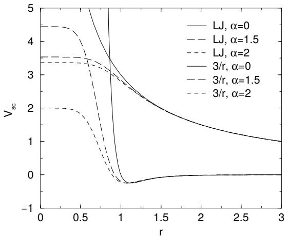  
图 5.31: ?? = 0.5 时的软核相互作用势，其中 $p = 2 , \ C _ { 6 } ^ { A } = C _ { 1 2 } ^ { A } =$ $C _ { 6 } ^ { B } = C _ { 1 2 } ^ { B } = 1$

在自由能计算中，当有粒子凭空出现或消失时，对 Lennard-Jones 势和库仑势使用方程 (5.231) 和 (5.230)所述的简单线性插值可能收敛性很差。当粒子几乎消失或接近出现时（?? 接近 0 或 1），相互作用能会变得非常弱，粒子彼此可能非常靠近，导致得到的 ???? /???? 值的波动非常大（因为简单的线性插值同时取决于势能在 ?? 两个端点的值）。

为避免这些问题，需要消除势能的奇异性。这可以通过对常规的 Lennard-Jones 势和库仑势进行“软核”修正来实现，软核势限制了 ?? 值介于 0 和 1 之间时的能量和力，但不会改变 ?? 等于 0 或 1 时的能量和力。

在 GROMACS 中，软核势 $V _ { s c }$ 是常规势能的移位势，因此势能及其导数的奇点完全不可能出现在 ?? = 0处：

$$
\begin{array} { r l r } { V _ { s c } ( r ) = } & { ( 1 - \lambda ) V ^ { A } ( r _ { A } ) + \lambda V ^ { B } ( r _ { B } ) } & \\ { r _ { A } = } & { \left( \alpha \sigma _ { A } ^ { 6 } \lambda ^ { p } + r ^ { 6 } \right) ^ { \frac { 1 } { 6 } } } & \\ { r _ { B } = } & { \left( \alpha \sigma _ { B } ^ { 6 } ( 1 - \lambda ) ^ { p } + r ^ { 6 } \right) ^ { \frac { 1 } { 6 } } } & \end{array}\tag{5.240}
$$

其中 $V ^ { A }$ 和 $V ^ { B }$ 分别为状态 $\mathrm { A } ( \lambda = 0 )$ 和状态 $\mathrm { B } ( \lambda = 1 )$ 中正常的“硬核”范德华势或静电势，?? 为软核参数（在 $m d p _ { \hookrightarrow 4 5 4 }$ 文件中利用 $\mathrm { s c \_ a l p h a }$ 进行设置）; ?? 为软核势中 ?? 的次数（使用 $\mathtt { S C \_ p o w e r }$ 进行设置），?? 为相互作用半径，其值为 $( C _ { 1 2 } / C _ { 6 } ) ^ { 1 / 6 }$ 。当 $C _ { 6 }$ 或 $C _ { 1 2 }$ 为零时，?? 是一个输入参数（由 $\mathtt { s c \_ s i g m a }$ 设置）。

对于中等大小的 ??，当 $r > \alpha ^ { 1 / 6 } \sigma$ 时， $r _ { A }$ 和 $r _ { B }$ 对相互作用的影响很小；当 ?? 很小时软核势很快变为接近常值（图 5.31）。相应的力为：

$$
F _ { s c } ( r ) = - \frac { \partial V _ { s c } ( r ) } { \partial r } = ( 1 - \lambda ) F ^ { A } ( r _ { A } ) \left( \frac { r } { r _ { A } } \right) ^ { 5 } + \lambda F ^ { B } ( r _ { B } ) \left( \frac { r } { r _ { B } } \right) ^ { 5 }\tag{5.241}
$$

其中 $F ^ { A }$ 和 $F ^ { B }$ 为“硬核”力。对自由能导数的贡献为：

$$
\begin{array} { r l r } { \displaystyle \frac { \partial V _ { s c } ( r ) } { \partial \lambda } = } & { { } V ^ { B } ( r _ { B } ) - V ^ { A } ( r _ { A } ) + ( 1 - \lambda ) \displaystyle \frac { \partial V ^ { A } ( r _ { A } ) } { \partial r _ { A } } \displaystyle \frac { \partial r _ { A } } { \partial \lambda } + \lambda \displaystyle \frac { \partial V ^ { B } ( r _ { B } ) } { \partial r _ { B } } \displaystyle \frac { \partial r _ { B } } { \partial \lambda } } & { } \\ { = } & { V ^ { B } ( r _ { B } ) - V ^ { A } ( r _ { A } ) + } & { } \\ { \displaystyle \frac { p \alpha } { 6 } \left[ \lambda F ^ { B } ( r _ { B } ) r _ { B } ^ { - 5 } \sigma _ { B } ^ { 6 } ( 1 - \lambda ) ^ { p - 1 } - ( 1 - \lambda ) F ^ { A } ( r _ { A } ) r _ { A } ^ { - 5 } \sigma _ { A } ^ { 6 } \lambda ^ { p - 1 } \right] } & { { } \quad p ( r _ { A } ) - r _ { A } ^ { B } ( r _ { B } ) } \end{array}
$$

最初的 GROMOS 对 Lennard-Jones 软核函数使用 $p = 2 \ 1 0 0 _ { \hookrightarrow 5 3 6 }$ ，但 $p = 1$ 给出的 $\partial H / \partial \lambda$ 曲线更平滑。另一个应该考虑的问题是，软核势对那些没有 Lennard-Jones 相互作用的氢原子的影响。它们的软核参数 ?? 使用 $m d p _ { \hookrightarrow 4 5 4 }$ 文件中的 ${ \mathrm { ~ s } } { \mathrm { c } } _ { - }$ sigma 选项设置。对 $p = 1$ ，当 ?? 等于 0 和/或 1 时，或者对 $p = 2$ ，当?? 接近 0 和/或 1 时，这些氢原子会使 $\partial H / \partial \lambda$ 曲线出现峰值。降低 $\mathtt { s c \_ s i g m a }$ 的值可减小这种效应，但相对于软核状态中的其他相互作用，这种作法会增加与氢原子的相互作用。

当选择软核势（设置 $\mathtt { s c \_ a l p h a } \mathtt { > } 0 \mathtt { ) }$ ），按顺序依次打开或关闭库仑和 Lennard-Jones 势时，在大多数情况下，线性地关闭库仑相互作用而不使用软核相互作用，统计噪声会更小。可将 $m d p _ { \hookrightarrow 4 5 4 }$ 选项 sc-coul 设置为 yes 来取消这种做法。请注意，只有使用 lambda 状态，而不是与 couple-lambda0/couple-lambda1一起使用时，才会考虑 $\mathtt { S C - C O u l }$ 。你仍然可以通过设置 $\mathtt { S C } \mathrm { - a l p h a = 0 }$ 来关闭软核相互作用。另外，软核相互作用势只用于 A 或 B 状态具有零相互作用势的情况。如果 A 和 B 状态都具有非零的相互作用势，则会使用前面所说的默认的线性缩放方法。当同时关闭库仑和 Lennard-Jones 相互作用时，会使用软核势，引入或删除一个氢原子， $\sigma$ 会设置为 $\mathtt { S C - s i g m a - m i n }$ ，其自身的默认值为 $\mathtt { S C - S i g m a - d e f a u l t }$ 。

最近，有人推导出了软核方法的一个新公式，与上述标准软核途径相比，在大多数情况下，它给出的统计方差更低，更均匀 $1 0 1 _ {  5 3 6 }$ ， $1 0 \mathcal { 2 } _ { \mathrm { \hookrightarrow 5 3 6 } \circ }$ 具体来说：

$$
\begin{array} { r l r } { V _ { s c } ( r ) = } & { ( 1 - \lambda ) V ^ { A } ( r _ { A } ) + \lambda V ^ { B } ( r _ { B } ) } & \\ { r _ { A } = } & { \left( \alpha \sigma _ { A } ^ { 4 8 } \lambda ^ { p } + r ^ { 4 8 } \right) ^ { \frac { 1 } { 4 8 } } } & \\ { r _ { B } = } & { \left( \alpha \sigma _ { B } ^ { 4 8 } ( 1 - \lambda ) ^ { p } + r ^ { 4 8 } \right) ^ { \frac { 1 } { 4 8 } } } \end{array}\tag{5.242}
$$

GROMACS 也实现这个 1-1-48 途径。请注意，对这种途径，软核参数 ?? 应满足 $0 . 0 0 1 < \alpha < 0 . 0 0 3$ ，而不是 $\alpha \approx 0 . 5$ 。

## 5.5.6 方法

排除和 1-4 相互作用。

一个分子链中互相邻近的原子，即那些以共价键结合，或者通过一个或两个原子相连接的原子分别称为第一相邻原子，第二相邻原子和 第三相邻原子 (见图 5.32)。由于原子 i 与原子 i+1 和 i+2 之间的相互作用主要是量子力学的，因此不能用 Lennard-Jones 势进行描述。相反，假定这些相互作用可以利用简谐键项或约束（i, i+1）和简谐角项（i, i+2）进行充分描述。因此，可以将第一和第二相邻原子（原子i+1 和 i+2）从原子 i 的 Lennard-Jones 相互作用列表中排除。原子 i+1 和 i+2 称为原子 i 的排除原子。

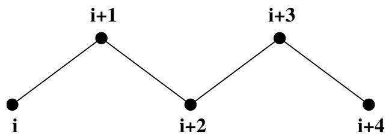  
图 5.32: 沿烷烃链的原子。

对第三相邻原子，正常的 Lennard-Jones 排斥作用有时仍然太强，这意味着当作用于分子时，分子会因内部张力发生变形或破碎。对 顺式构象中的碳-碳相互作用情况尤其如此（如 顺丁烷）。因此，对于一些这样的相互作用，其 Lennard-Jones 排斥在 GROMOS 力场中被减弱了，这是通过维持一个单独的 1-4 作用列表和正常的 Lennard-Jones 参数来实现的。在其他力场中，如 OPLS103↪536，标准的Lennard-Jones 参数减小为原来的 $1 / 2$ ，但在这种情况下也会对色散 $( r ^ { - 6 } )$ 和库仑相互作用进行相应的缩放。GROMACS 可以使用这些方法中的任何一种。

## 电荷组

原则上，MD 中计算力的复杂度为 $O ( N ^ { 2 } )$ 。因此，计算非键力（NBF）时使用了截断：只有彼此相距一定距离内的粒子才会有相互作用。这将 NBF 计算的复杂度降低为 ??(??) (通常为 100?? 到 200??)。但同时也引入了误差。在大多数情况下，误差是可以接受的，除了使用截断导致产生电荷的情况。在这种情况下，应该考虑使用 GROMACS 提供的晶格加和方法。

让我们考虑一个水分子与另一个原子的相互作用。如果在原子-原子的基础上使用简单的截断，我们可能包括了原子和氧 (电荷为 −0.82) 之间的相互作用，而没有同时包括质子的平衡电荷，结果将诱导系统中出现了一个很大的偶极矩。因此，我们必须保持原子组的总电荷为 0。这些组称为 电荷组。注意，如果对长程静电作用使用了合适的处理方法（例如粒子网格 Ewald 方法，见PME↪411 一节），就不需要将电荷组保持在一起。

## 组方案中的截断处理

GROMACS 在处理截断时非常灵活，这意味着可以设置很多参数。这些参数可以在 grompp 的输入文件中设置。影响截断相互作用的参数有两类；你可以选择在每种情况下使用哪种类型的相互作用，以及在邻区搜索中应该使用哪种截断。

对于库仑和范德华相互作用都有相应的相互作用类型选择关键词（vdwtype 和 coulombtype）和两个参数，总共有六个非键相互作用参数。有关这些参数的完整说明，请参见“用户手册”。1

在组截断方案中，由于使用了电荷组，表 5.9 中的所有相互作用函数在进行邻区搜索时，使用的半径至少要与为其函数形式指定的 $r _ { c }$ 一样大。额外半径通常为 0.25 nm（大致等于电荷组中两个原子之间的最大距离加上电荷组在邻区列表更新过程中能够扩散的距离）。

1 旧版手册额外说明：邻区搜索（NS）可使用单程或双程方法进行。由于前者只是后者的特例，我们将只讨论更一般的双程方法。在这种情况下，NS 会使用两个半径：rlist和 max(rcoulomb,rvdw)。通常每 10 个时间步或每 20 fs(参数nstlist)重新构建一次邻区列表。在邻区列表中，会存储所有落在rlist范围内的相互作用对。此外，对于没有落在rlist范围内但落在max(rcoulomb,rvdw) 范围内的粒子对，它们之间的相互作用在邻区搜索过程中也会被计算。力和能量会分开存储，在连续的 NS之间，在每个积分步都会将它们添加到短程力中。如果rlist = max(rcoulomb,rvdw)，生成邻区列表时不会计算力。维里是根据短程力与长程力的总和计算是，这意味着在非 NS 步中维里可能有稍微的不对称。当使用混合精度的 mdrun 时，维里几乎总是不对称的，因为非对角元素与加和中的每个元素相差不大。在大多数情况下，这些都不是真正的问题，因为维里的涨落可以比平均值大两个数量级。【李继存】

表 5.9: 非键相互作用不同函数形式的参数。
<table><tr><td rowspan=1 colspan=2>类型</td><td rowspan=1 colspan=1>参数</td></tr><tr><td rowspan=4 colspan=1>库仑</td><td rowspan=1 colspan=1>简单截断</td><td rowspan=1 colspan=1> $r _ { c } , \varepsilon _ { r }$ </td></tr><tr><td rowspan=1 colspan=1>反应场</td><td rowspan=1 colspan=1> $r _ { c } , \varepsilon _ { r f }$ </td></tr><tr><td rowspan=1 colspan=1>移位函数</td><td rowspan=1 colspan=1> $r _ { 1 } , r _ { c } , \varepsilon _ { r }$ </td></tr><tr><td rowspan=1 colspan=1>切换函数</td><td rowspan=1 colspan=1> $r _ { 1 } , r _ { c } , \varepsilon _ { r }$ </td></tr><tr><td rowspan=3 colspan=1>VdW</td><td rowspan=1 colspan=1>简单截断</td><td rowspan=1 colspan=1> $r _ { c }$ </td></tr><tr><td rowspan=1 colspan=1>移位函数</td><td rowspan=1 colspan=1> $r _ { 1 } , r _ { c }$ </td></tr><tr><td rowspan=1 colspan=1>切换函数</td><td rowspan=1 colspan=1> $r _ { 1 } , r _ { c }$ </td></tr></table>

## 5.5.7 虚拟相互作用位点

GROMACS 可以通过多种方式使用虚拟相互作用位点（在 GROMACS 3.3 之前的版本中称为哑原子）。我们将虚拟位点的位置 $\mathbf { r } _ { s }$ 写为其他粒子位置 $\mathbf { r } _ { i }$ 的函数： $\mathbf { r } _ { s } = f ( \mathbf { r } _ { 1 } . . \mathbf { r } _ { n } )$ 。这样就可以在力的计算中使用它们了。虚拟位点可能带有电荷或参与其他相互作用。作用在虚拟位点上的力必须以自洽的方式重新分配到具有质量的粒子上。论文 $1 0 4 _ {  5 3 6 }$ 中给出了一种较好的方法。我们可以将势能写为：

$$
V = V ( \mathbf { r } _ { s } , \mathbf { r } _ { 1 } , \ldots , \mathbf { r } _ { n } ) = V ^ { * } ( \mathbf { r } _ { 1 } , \ldots , \mathbf { r } _ { n } )\tag{5.243}
$$

作用在粒子 ?? 上的力为：

$$
\mathbf { F } _ { i } = - { \frac { \partial V ^ { * } } { \partial \mathbf { r } _ { i } } } = - { \frac { \partial V } { \partial \mathbf { r } _ { i } } } - { \frac { \partial V } { \partial \mathbf { r } _ { s } } } { \frac { \partial \mathbf { r } _ { s } } { \partial \mathbf { r } _ { i } } } = \mathbf { F } _ { i } ^ { d i r e c t } + \mathbf { F } _ { i }\tag{5.244}
$$

第一项是正常的力。第二个项是由虚拟位点引起的作用于粒子 ?? 上的力，可以写为张量形式：

$$
\mathbf { F } _ { i } = \left[ \begin{array} { l l l } { \frac { \partial x _ { s } } { \partial x _ { i } } } & { \frac { \partial y _ { s } } { \partial x _ { i } } } & { \frac { \partial z _ { s } } { \partial x _ { i } } } \\ { \frac { \partial x _ { s } } { \partial y _ { i } } } & { \frac { \partial y _ { s } } { \partial y _ { i } } } & { \frac { \partial z _ { s } } { \partial y _ { i } } } \\ { \frac { \partial x _ { s } } { \partial z _ { i } } } & { \frac { \partial y _ { s } } { \partial z _ { i } } } & { \frac { \partial z _ { s } } { \partial z _ { i } } } \end{array} \right] \mathbf { F } _ { s }\tag{5.245}
$$

其中 $\mathbf { F } _ { s }$ 为虚拟位点上的力， $x _ { s }$ $y _ { s }$ 和 $z _ { s }$ 为虚拟位点的坐标。这样，合力和合力矩都是守恒的 $1 0 4 _ {  5 3 6 }$ 当使用虚拟位点时，维里的计算（方程 (5.26)）并不简单。由于维里涉及所有原子（而不只是虚拟位点）的加和，因此在计算维里 之前，必须将虚拟位点上的力重新分配到原子上（使用方程 (5.245)）。在一些特殊情况下，原子上的力可以写为虚拟位点受力的线性组合（下面的类型 2 和类型 3），因此在重新分配力之前或之后计算维里没有区别。然而，一般情况下，应首先进行重新分配。

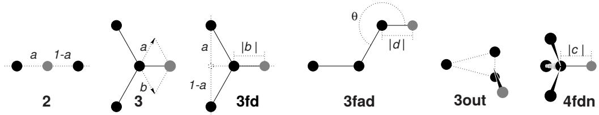  
图 5.33: GROMACS 中六种不同类型虚拟位点的构建方式。黑色圆圈为构造原子，灰色为虚拟位点。

在 GROMACS 中，从周围原子构建虚拟位点的方式共有六种，我们按构造原子的数目对其进行分类。注意，所有提到的位点类型都可以利用类型 3fd （标准化，平面内）和 3out （非标准化，平面外）进行构建。但是，涉及到的计算量按方法列表的顺序急剧增加，因此我们强烈建议使用列表中第一个适合的能够满足需要的虚拟位点类型。图 5.33 给出了 6 种可用的虚拟位点构建方式。概念上最简单的构建类型是线性组合：

$$
\mathbf { r } _ { s } = \sum _ { i = 1 } ^ { N } w _ { i } \mathbf { r } _ { i }\tag{5.246}
$$

然后使用相同的权重重新分配力：

$$
\mathbf { F } _ { i } = w _ { i } \mathbf { F } _ { s }\tag{5.247}
$$

GROMACS 支持的虚拟位点类型将在下面列出。虚拟位点中的构建原子也可以是虚拟位点自身，但前提是它们在列表中的位置更高，即虚拟位点可以利用更简单的虚拟位点“粒子”进行构建。

• 两个原子的线性组合（图 5.33 2）:

$$
w _ { i } = 1 - a \ , \ w _ { j } = a\tag{5.248}
$$

这种情况下虚拟位点位于原子线 ?? 和 ?? 的连线上。

• 三个原子的线性组合（图 5.33 3）:

$$
w _ { i } = 1 - a - b \ , w _ { j } = a \ , w _ { k } = b\tag{5.249}
$$

这种情况下虚拟位点位于另外三个粒子构成的平面中。

• 在三个原子构成的平面中，具有固定的距离（图 5.33 3fd）:

$$
\mathbf { r } _ { s } ~ = ~ \mathbf { r } _ { i } + b { \frac { \mathbf { r } _ { i j } + a \mathbf { r } _ { j k } } { | \mathbf { r } _ { i j } + a \mathbf { r } _ { j k } | } }\tag{5.250}
$$

这种情况下虚拟位点位于其他三个粒子构成的平面中， 粒子 ?? 的距离为 $| b |$ 。由虚拟位点受力引起的粒子 ??，?? 和 ?? 上的力为：

$$
\begin{array} { r l r l r } { \mathbf { F } _ { i } } & { = } & { \mathbf { F } _ { s } - \gamma ( \mathbf { F } _ { i s } - \mathbf { p } ) } & & { } \\ { \mathbf { F } _ { j } } & { = } & { ( 1 - a ) \gamma ( \mathbf { F } _ { s } - \mathbf { p } ) } & { \nparallel \nparallel } & { } \\ { \mathbf { F } _ { k } } & { = } & { a \gamma ( \mathbf { F } _ { s } - \mathbf { p } ) } & { } & { \mathbf { p } = \frac { \mathbf { r } _ { i s } \cdot \mathbf { F } _ { s } } { \mathbf { r } _ { i s } \cdot \mathbf { r } _ { i s } } \mathbf { r } _ { i s } } \end{array}\tag{5.251}
$$

• 在三个原子构成的平面中，具有固定的距离（图 5.33 3fad）:

$$
\mathbf { r } _ { s } ~ = ~ \mathbf { r } _ { i } + d \cos \theta { \frac { \mathbf { r } _ { i j } } { | \mathbf { r } _ { i j } | } } + d \sin \theta { \frac { \mathbf { r } _ { \bot } } { | \mathbf { r } _ { \bot } | } } ~ { \sharp } \sharp \# ~ \mathbf { r } _ { \bot } ~ = ~ \mathbf { r } _ { j k } - { \frac { \mathbf { r } _ { i j } \cdot \mathbf { r } _ { j k } } { \mathbf { r } _ { i j } \cdot \mathbf { r } _ { i j } } } \mathbf { r } _ { i j }\tag{5.252}
$$

在这种情况下，虚拟位点位于其他三个粒子的平面上，与粒子 ?? 的距离为 $| d |$ ，与 $\mathbf { r } _ { i j }$ 所成的角度为 $\alpha _ { \mathrm { ~ c ~ } }$ 。原子 ?? 定义了平面以及角度的方向。注意，在这种情况下必须明确指定 ?? 和 ??，而不是 ??和 ?? (另见虚拟位点 $_ {  4 1 9 }  { \stackrel {  } { - } } \frac { \# } { \Pi } )$ 。由虚拟位点受力引起的粒子 ??， $j$ 和 ?? 上的力为 $( \mathbf { r } _ { \perp }$ 的定义见方程(5.252)）:

$$
\begin{array} { r c l } { \mathbf { F } _ { i } } & { = } & { \mathbf { F } _ { s } - \mathbf { \Lambda } \frac { d \cos \theta } { | \mathbf { r } _ { i j } | } \mathbf { F } _ { 1 } + \mathbf { \Lambda } \frac { d \sin \theta } { | \mathbf { r } _ { \perp } | } \left( \frac { \mathbf { r } _ { i j } \cdot \mathbf { r } _ { j k } } { \mathbf { r } _ { i j } \cdot \mathbf { r } _ { i j } } \mathbf { F } _ { 2 } + \mathbf { F } _ { 3 } \right) } \\ { \mathbf { F } _ { j } } & { = } & { \frac { d \cos \theta } { | \mathbf { r } _ { i j } | } \mathbf { F } _ { 1 } - \mathbf { \Lambda } \frac { d \sin \theta } { | \mathbf { r } _ { \perp } | } \left( \mathbf { F } _ { 2 } + \frac { \mathbf { r } _ { i j } \cdot \mathbf { r } _ { j k } } { \mathbf { r } _ { i j } \cdot \mathbf { r } _ { i j } } \mathbf { F } _ { 2 } + \mathbf { F } _ { 3 } \right) } \\ { \mathbf { F } _ { k } } & { = } & { \frac { d \sin \theta } { | \mathbf { r } _ { \perp } | } \mathbf { F } _ { 2 } } \\ { \mathbf { H } _ { k } ^ { \prime \prime \prime } } & { = } & { \mathbf { F } _ { s } - \frac { \mathbf { r } _ { i j } \cdot \mathbf { F } _ { s } } { \mathbf { r } _ { i j } \cdot \mathbf { r } _ { i j } } \mathbf { F } _ { 2 } = \mathbf { F } _ { 1 } - \frac { \mathbf { r } _ { \perp } \cdot \mathbf { F } _ { s } } { \mathbf { r } _ { \perp } \cdot \mathbf { r } _ { \perp } } \mathbf { F } _ { 3 } = \frac { \mathbf { r } _ { i j } \cdot \mathbf { F } _ { s } } { \mathbf { r } _ { i j } \cdot \mathbf { r } _ { i j } } \mathbf { F } _ { 3 } } \end{array}\tag{5.253}
$$

• 三个原子的非线性组合，在平面外（图 5.33 3out）:

$$
\mathbf { r } _ { s } ~ = ~ \mathbf { r } _ { i } + a \mathbf { r } _ { i j } + b \mathbf { r } _ { i k } + c ( \mathbf { r } _ { i j } \times \mathbf { r } _ { i k } )\tag{5.254}
$$

构建的虚拟位点位于其他粒子构成的平面外。由虚拟位点受力引起的粒子 $i , j$ 和 ?? 上的力为：

$$
\begin{array} { r c l } { \mathbf { F } _ { j } } & { = } & { \left[ \begin{array} { c c c } { a } & { - c z _ { i k } } & { c y _ { i k } } \\ { c z _ { i k } } & { a } & { - c x _ { i k } } \\ { - c y _ { i k } } & { c x _ { i k } } & { a } \end{array} \right] \mathbf { F } _ { s } } \\ { \mathbf { F } _ { k } } & { = } & { \left[ \begin{array} { c c c } { b } & { c z _ { i j } } & { - c y _ { i j } } \\ { - c z _ { i j } } & { b } & { c x _ { i j } } \\ { c y _ { i j } } & { - c x _ { i j } } & { b } \end{array} \right] \mathbf { F } _ { s } } \\ { \mathbf { F } _ { i } } & { = } & { \mathbf { F } _ { s } - \mathbf { F } _ { j } - \mathbf { F } _ { k } } \end{array}\tag{5.255}
$$

• 由四个原子构建，具有固定的距离，见单独的 图 5.34。这种构建有点复杂，迫使我们引入这种更复杂构造的一个特别原因是之前的构建类型（4fd）可能不稳定：

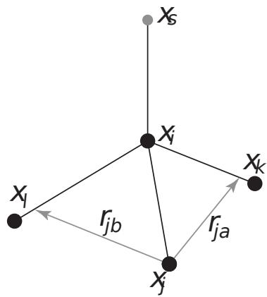  
图 5.34: 新的 4fdn 虚拟位点的构建方法，即便所有构建原子都处于同一平面内，这种虚拟位点也是稳定的。

$$
\begin{array} { r l r } { \mathbf { r } _ { j a } = } & { a \mathbf { r } _ { i k } - \mathbf { r } _ { i j } = a \left( \mathbf { x } _ { k } - \mathbf { x } _ { i } \right) - \left( \mathbf { x } _ { j } - \mathbf { x } _ { i } \right) } \\ { \mathbf { r } _ { j b } = } & { } & { b \mathbf { r } _ { i l } - \mathbf { r } _ { i j } = b \left( \mathbf { x } _ { l } - \mathbf { x } _ { i } \right) - \left( \mathbf { x } _ { j } - \mathbf { x } _ { i } \right) } \\ { \mathbf { r } _ { m } = } & { } & { \mathbf { r } _ { j a } \times \mathbf { r } _ { j b } } \\ { \mathbf { x } _ { s } = } & { } & { \mathbf { x } _ { i } + c \frac { \mathbf { r } _ { m } } { \left| \mathbf { r } _ { m } \right| } } \end{array}
$$

这种情况下虚拟位点与粒子 ?? 的距离为 |??|，?? 和 ?? 为参数。注意，为节省浮点运算时间，没有对向量 $\mathbf { r } _ { i k }$ 和 $\mathbf { r } _ { i j }$ 进行归一化。由虚拟位点受力引起的粒子 ??，??，?? 和 ?? 上的力可以通过对构建表达式进行链式规则求导计算。这种构建精确并能保持能量守恒，但确实导致了相对冗长的计算表达式，在这里我们不再给出所有的计算公式（超过 200 次浮点运算）。感兴趣的读者可以查看 vsite.c 中的源代码。幸运的是，这种虚拟位点类型通常只用于手性中心，如蛋白质中的 $C _ { \alpha }$ 原子。

新的 4fdn 构建方式在拓扑中的 type 值为 2。GROMACS 内部仍然支持以前的 4fd 类型（type 值为 1），但不应该将其用于新的模拟。作为替代，目前所有的 GROMACS 工具都会自动生成 4fdn类型。

• ?? 个原子的线性组合，相对权重为 $a _ { i ^ { \vee } }$ 。原子 ?? 的权重为：

$$
w _ { i } = a _ { i } \left( \sum _ { j = 1 } ^ { N } a _ { j } \right) ^ { - 1 }\tag{5.256}
$$

设置权重时有三个选项：

– 几何中心：等权重

– 质量中心 $a _ { i }$ 为原子 ?? 的质量。在自由能模拟中原子的质量会发生变化，这时只会使用 A 状态的质量作为权重。

– 权重中心： $a _ { i }$ 由用户定义

## 5.5.8 长程静电作用

Ewald 加和

?? 个粒子及其周期映像的总静电能由下式给出

$$
V = \frac { f } { 2 } \sum _ { n _ { x } } \sum _ { n _ { y } } \sum _ { n _ { z } * } \sum _ { i } ^ { N } \sum _ { j } ^ { N } \frac { q _ { i } q _ { j } } { \bf r } _ { i j , \bf n } .\tag{5.257}
$$

$( n _ { x } , n _ { y } , n _ { z } ) = \mathbf { n }$ 为盒子的索引向量，星号表示当 $( n _ { x } , n _ { y } , n _ { z } ) = ( 0 , 0 , 0 )$ 时应忽略 $i = j$ 的项。距离 $\mathbf { r } _ { i j } ,$ n为电荷之间的实际距离，而不是最小映像间的距离。这个加和是条件收敛的，但收敛非常慢。

首次引入时，Ewald 加和方法被用于计算晶体中周期映像的长程相 $\overrightarrow { \mathbfit { L } }$ 作用 $1 0 5 _ { \scriptscriptstyle \odot 5 3 6 }$ 。其思想是将方程(5.257) 中收敛缓慢的单个求和项转换为两个快速收敛的项和一个常数项：

$$
\begin{array} { r l r } { \boldsymbol { V } = } & { } & { V _ { \mathrm { d i r } } + V _ { \mathrm { r e c } } + V _ { 0 } } \\ { \displaystyle V _ { \mathrm { d i r } } = } & { } & { \frac { f } { 2 } \sum _ { i , j } ^ { N } \sum _ { n _ { z } } \sum _ { n _ { y } } \sum _ { n _ { z } \neq } q _ { i } q _ { j } \frac { \mathrm { e r f } ( \beta r _ { i j , \mathbf { n } } ) } { r _ { i j , \mathbf { n } } } } \\ { V _ { \mathrm { r e c } } = } & { \frac { f } { 2 \pi V } \sum _ { i , j } ^ { N } q _ { i } q _ { j } \sum _ { m _ { x } } \sum _ { m _ { y } } \sum _ { m _ { z } \neq } \frac { \exp \left( - ( \pi \mathbf { m } / \beta ) ^ { 2 } + 2 \pi i \mathbf { m } \cdot ( \mathbf { r } _ { i } - \mathbf { r } _ { j } ) \right) } { \mathbf { m ^ { 2 } } } } \\ & { } & \\ { V _ { 0 } = } & { } & { - \frac { f \beta } { \sqrt { \pi } } \sum _ { i } ^ { N } q _ { i } ^ { 2 } , } \end{array}\tag{5.258}
$$

其中 $\beta$ 参数用于确定直接空间求和 倒易空间求和之间的相对权重， $\mathbf { m } = ( m _ { x } , m _ { y } , m _ { z } )$ 。通过这种方式，我们就可以对直接空间求和使用较短的截断 (1 nm 左右)，对倒易空间求和也可以使用较短的截断（如每个方向 10 个波矢 $) _ { \circ }$ 不幸的是，倒易空间求和的计算量以 $N ^ { 2 }$ 增加 (或 $N ^ { 3 / 2 }$ ，使用稍微好一点的算法)，因此用于大的系统不太现实。

## 使用 Ewald 方法

不要使用 Ewald 方法，除非你绝对确定自己需要使用它。对几乎所有的情况，下面介绍的 PME 方法都表现得更好。如果你仍然想要使用经典的 Ewald 求和方法，请在你的 $m d p _ { \hookrightarrow 4 5 4 }$ 文件中输入以下内容，假定盒子边长 3 nm 左右：

coulombtype = Ewald   
rvdw = 0.9   
rlist = 0.9

(下页继续)

rcoulomb = 0.9   
fourierspacing = 0.6   
ewald-rtol = 1e-5

(续上页)

盒子大小与 fourierspacing 参数的比值决定了每个方向使用的波矢 $m _ { x } , m _ { y } , m _ { z }$ 的最大值。对上面示例中的 3 nm 立方盒子，每个方向将使用 11 个波矢 (从 −5 到 5)。ewald-rtol 参数为截断处静电相互作用的相对强度。减小它的值可以得到更精确的直接空间加和，但倒易空间加和的精度会更低。

## PME

Tom Darden 提出的粒子网格 Ewald 方法 $1 4 _ {  5 3 1 }$ 可以提高倒易空间求和的速度。这种方法不直接对波矢进行求和，而是使用内插方法将电荷分配到网格上。GROMACS 实现的 PME 方法使用 Cardinal B 样条插值 $1 5 _ { \hookrightarrow 5 3 1 }$ ，称为平滑 PME（SPME）。然后使用 3D FFT 算法对格点进行傅里叶变换，在 k 空间中对格点进行单次求和就可以得到倒易空间的能量。

格点上的势能可利用逆变换进行计算，通过使用内插因子就可以获得每个原子上的力。

PME 算法的复杂度为 $N \log ( N )$ ，对中等到大的系统计算速度远远高于普通 Ewald 求和方法。对非常小的系统，使用 Ewald 方法可能更好，因为无需进行格点设置和变换。PME 的并行化，请参阅 MPMDPME（多程序多数据 PME 并行化 $_ {  3 7 5 } ~ ) ~ - ^ { \pm }$ 节。

使用 Verlet 截断方案时，PME 直接空间的势能被移动了一个常数，使得截断处的势能为零。这种移位很小，并且由于系统的净电荷接近零，总的移位非常小，不像 Lennard-Jones 势那样，所有的移位都会累加起来。我们使用了移位，这样势能就是力的精确积分。

## 使用 PME

作为 GROMACS 使用粒子网格 Ewald 求和方法的示例，请在你的 $m d p _ { \hookrightarrow 4 5 4 }$ 文件中指定如下几行：

coulombtype = PME   
rvdw = 0.9   
rlist = 0.9   
rcoulomb = 0.9   
fourierspacing = 0.12   
pme-order = 4   
ewald-rtol = 1e-5

在上面的示例中，fourierspacing 参数决定了 FFT 格点的最大间距（即格点数的最小值），pme-order控制插值的阶数。使用四阶（立方）内插和上面的间距，静电能应精确到约 $5 \cdot 1 0 ^ { - 3 }$ 。由于 Lennard-Jones能量的精确度更低一些，我们甚至还可以略微增大间距。

PME 可用于压力缩放，但要注意，在一些体系中，各向异性缩放可能会导致虚假的有序结构。

## P3M-AD

在 GROMACS 中也可以使用 Hockney 和 Eastwood 发展的粒子-粒子粒子-网格方法来处理长程静电相互作用 $1 0 6 _ { \circ { \scriptscriptstyle \odot } 3 3 6 } \circ$ 尽管 P3M 方法是第一种用于分子模拟的高效长程静电方法，但在原子级别的模拟中，P3M 方法很大程度上已经被平滑 PME（SPME）方法所取代。原始的 P3M 方法存在性能缺陷，它需要3 次 3D-FFT 逆变换才能得到粒子上的力。但对 P3M 来说这并不是必需的，力可以通过对势能的解析微分得到，就像在 PME 中所做的那样。这样的方法称为 P3M-AD。P3M-AD 和 PME 唯一的区别在于，P3M 对晶格 Green 影响函数进行了优化以尽量减小误差。然而，2012 年的研究表明，可以修改 SPME的影响函数得到 P3M107 。这意味着，使用与 PME 相同的计算成本和相同的代码，只需要添加几行代码修改影响函数就可以得到 P3M-AD 误差最小化的优点。然而，对最佳参数设置，P3M-AD 误差最小化的效果不到 10%。对于隔行（也称交错）格点，P3M-AD 的精度确实有很大提高，但 GROMACS（尚）未支持此功能。

在 GROMACS 中使用 P3M 时，所用的选项与 PME 完全相同，只要选择不同的静电类型即可：

coulombtype = P3M-AD

优化傅里叶变换和 PME 计算

建议对计算静电相互作用的参数进行优化，如 PME 格点尺寸和截断半径。在启动长时间的成品模拟之前尤其要注意这一点。

gmx mdrun↪131 可以自动进行大量的 PME 优化，GROMACS 还包含了一个特殊工具gmx tune\_pme↪196，它可以自动选择 PME 节点的最佳数目。

## 5.5.9 长程范德华相互作用

色散校正

在本节中，我们推导长程校正，它是由于对 Lennard-Jones 或 Buckingham 相互作用使用截断而引起的。我们假定截断足够大，以至于可以安全地忽略排斥项，因此只需考虑色散项。由于色散相互作用的本质（我们截断了一个正比于 $- r ^ { - 6 }$ 的势能），能量和压力的校正都是负值。尽管能量的校正通常很小，计算自由能时却可能很重要，因为计算时需要考虑两个不同哈密顿量之间的差值。相反，压力的校正非常大，当需要保证压力正确时，任何情况下都不能忽略，尤其是对于任何 NPT 模拟。尽管原则上在力场参数化时可以使得压力不经校正就接近期望的实验值，但这种方法使得参数依赖于截断，因此不可取。

能量

如果我们假定超出截断距离 $r _ { c }$ 后系统变为均相，就能够解析地推导出色散相互作用对维里的长程贡献。两个粒子之间的色散能可写为：

$$
V ( r _ { i j } ) ~ = ~ - { C _ { 6 } } { r _ { i j } } ^ { - 6 }\tag{5.259}
$$

相应的力为：

$$
\mathbf { F } _ { i j } ~ = ~ - 6 C _ { 6 } r _ { i j } ^ { - 8 } \mathbf { r } _ { i j }\tag{5.260}
$$

在周期性系统中，计算总势能并不容易，因此通常会使用间断的，或光滑的截断。记使用截断时的势能和力分别为 $V _ { c }$ 和 $\mathbf { F } _ { c ^ { \vee } }$ 。对含有 ?? 个粒子，粒子密度为 $\rho = N / V$ 的系统中，色散能的长程贡献为：

$$
V _ { l r } = { \frac { 1 } { 2 } } N \rho \int _ { 0 } ^ { \infty } 4 \pi r ^ { 2 } g ( r ) \left( V ( r ) - V _ { c } ( r ) \right) \mathrm { d } r\tag{5.261}
$$

我们将利用上式对移位函数进行积分，它是 GROMACS 中范德华相互作用的最一般形式。从 0 到 $r _ { 1 }$ ，移位函数具有恒定的差值 ??，超出截断距离 $r _ { c }$ 后，移位函数为零。我们可以积分方程 (5.261)，并假定在半径为 $r _ { 1 }$ 的球体内，粒子密度等于整体密度，径向分布函数 $g ( r )$ 在超出 $r _ { 1 }$ 后为 1:

$$
\begin{array} { r l r } { V _ { l r } = } & { { } } & { { \displaystyle \frac { 1 } { 2 } N \left( \rho \int _ { 0 } ^ { r _ { 1 } } 4 \pi r ^ { 2 } g ( r ) C _ { 6 } S { \mathrm { d } } r + \rho \int _ { r _ { 1 } } ^ { r _ { c } } 4 \pi r ^ { 2 } \left( V ( r ) - V _ { c } ( r ) \right) { \mathrm { d } } r + \rho \int _ { r _ { c } } ^ { \infty } 4 \pi r ^ { 2 } V ( r ) { \mathrm { d } } r \right) } } \\ { = } & { { } } & { { \displaystyle \frac { 1 } { 2 } N \left( \left( \frac { 4 } { 3 } \pi \rho r _ { 1 } ^ { 3 } - 1 \right) C _ { 6 } S + \rho \int _ { r _ { 1 } } ^ { r _ { c } } 4 \pi r ^ { 2 } \left( V ( r ) - V _ { c } ( r ) \right) { \mathrm { d } } r - \frac { 4 } { 3 } \pi N \rho C _ { 6 } r _ { c } ^ { - 3 } \right) } } \\ { = } & { { } } & { { \displaystyle \frac { 1 } { 2 } N \left( \left( \frac { 4 } { 3 } \pi \rho r _ { 1 } ^ { 3 } - 1 \right) C _ { 6 } S + \rho \int _ { r _ { 1 } } ^ { r _ { c } } 4 \pi r ^ { 2 } \left( V ( r ) - V _ { c } ( r ) \right) { \mathrm { d } } r - \frac { 4 } { 3 } \pi N \rho C _ { 6 } r _ { c } ^ { - 3 } \right) } } \end{array}\tag{5.262}
$$

其中 −1 项为自相互作用的校正。对简单的截断，我们只需假定超出 $r _ { c }$ 后 $g ( r )$ 等于 1，这样校正可简化为 $1 0  { 8 _ { \circ , 5 3 7 } }$ :

$$
V _ { l r } =  &  { } - \frac { 2 } { 3 } \pi N \rho C _ { 6 } r _ { c } ^ { - 3 }\tag{5.263}
$$

例如，如果我们考虑一个只含水分子的盒子，模拟使用的截断半径为 0.9 nm，密度为 1 $\mathrm { g \ c m ^ { - 3 } }$ ，上面的校正值对每个水分子大约是 −0.75 kJ $\mathrm { m o l ^ { - 1 } }$ 。

对均相的混合物，我们需要定义一个 平均色散常数：

$$
\langle C _ { 6 } \rangle = \frac { 2 } { N ( N - 1 ) } \sum _ { i } ^ { N } \sum _ { j > i } ^ { N } C _ { 6 } ( i , j )\tag{5.264}
$$

GROMACS 计算此平均值时，不考虑排除原子对的贡献。

对非均相模拟系统，如脂质界面系统，若两部分的 $\langle C _ { 6 } \rangle$ 比较接近，也可以应用能量校正。

维里和压力

由两粒子 ?? 和 $j$ 之间的色散相互作用引起的系统的标量维里为：

$$
\Xi \ = \ - \frac 1 2 { \bf r } _ { i j } \cdot { \bf F } _ { i j } \ = \ 3 C _ { 6 } r _ { i j } ^ { - 6 }\tag{5.265}
$$

相应的压力由下式给出：

$$
P ~ = ~ { \frac { 2 } { 3 V } } \left( E _ { k i n } - \Xi \right)\tag{5.266}
$$

维里的长程校正为：

$$
\Xi _ { l r } = { \frac { 1 } { 2 } } N \rho \int _ { 0 } ^ { \infty } 4 \pi r ^ { 2 } g ( r ) ( \Xi - \Xi _ { c } ) \mathrm { d } r\tag{5.267}
$$

再次假定超出 $r _ { 1 }$ 后 $g ( r )$ 为 1，积分得到维里的长程贡献：

$$
\begin{array} { r l r } { \Xi _ { l r } = } & { { } \frac { 1 } { 2 } N \rho \left( \displaystyle \int _ { r _ { 1 } } ^ { r _ { c } } 4 \pi r ^ { 2 } ( \Xi - \Xi _ { c } ) \mathrm { d } r + \displaystyle \int _ { r _ { c } } ^ { \infty } 4 \pi r ^ { 2 } 3 C _ { 6 } { r _ { i j } } ^ { - 6 } \mathrm { d } r \right) } & { } \\ { = } & { { } } & { \frac { 1 } { 2 } N \rho \left( \displaystyle \int _ { r _ { 1 } } ^ { r _ { c } } 4 \pi r ^ { 2 } ( \Xi - \Xi _ { c } ) \mathrm { d } r + 4 \pi C _ { 6 } r _ { c } ^ { - 3 } \right) } \end{array}
$$

对简单截断，压力的校正值为 $1 0 8 _ { \odot 5 3 7 }$

$$
P _ { l r } = - { \frac { 4 } { 3 } } \pi C _ { 6 } \rho ^ { 2 } r _ { c } ^ { - 3 }\tag{5.268}
$$

对与前面示例相同的水盒子，每个水分子的维里校正为 $\mathrm { k J \ m o l ^ { - 1 } }$ ，对 $\mathrm { S P C }$ 水模型相应的压力校正大约是 −280 bar。

对于均相混合物，我们同样可以使用平均色散常数 $\langle C _ { 6 } \rangle$ (方程 (5.264)):

$$
P _ { l r } ~ = ~ - { \frac { 4 } { 3 } } \pi \langle C _ { 6 } \rangle \rho ^ { 2 } r _ { c } ^ { - 3 }\tag{5.269}
$$

对于非均相系统，使用方程 (5.269) 的限制与在能量的情况下相同（见能量 $\hookrightarrow 4 1 2$ 章节） $) _ { \circ }$

## Lennard-Jones PME

为了处理在截断距离之外非均相的 Lennard-Jones 势能系统，我们可以使用粒子网格 Ewald 方法，像前面讨论的静电一样。这种情况下修改的 Ewald 方程变为

$$
\begin{array} { r l r } {  { V = } } & { { } } & { V _ { \mathrm { d i r } } + V _ { \mathrm { r e c } } + V _ { 0 } } \\ { \displaystyle V _ { \mathrm { d i r } } = } & { { } } & { - \frac { 1 } { 2 } \sum _ { i , j } ^ { N } \sum _ { n _ { x } } \sum _ { n _ { y } } \sum _ { n _ { z } \neq } \frac { C _ { 6 } ^ { i j } g ( \beta r _ { i j , \mathbf { n } } ) } { r _ { i j , \mathbf { n } } \epsilon } } \\ { V _ { \mathrm { r e c } } = } & { { } \frac { \pi ^ { \frac { 3 } { 2 } } \beta ^ { 3 } } { 2 V } \sum _ { m _ { x } } \sum _ { m _ { y } } \sum _ { m _ { z } \neq } f ( \pi | \mathbf { m } | / \beta ) \times \sum _ { i , j } ^ { N } C _ { 6 } ^ { i j } \exp [ - 2 \pi i \mathbf { m } \cdot ( \mathbf { r } _ { \mathbf { i } } - \mathbf { r } _ { \mathbf { j } } ) ] } \\ { \~ } & { { } } & { V _ { 0 } = } & { - \frac { \beta ^ { 6 } } { 1 2 } \sum _ { i } ^ { N } C _ { 6 } ^ { i i } } \end{array}\tag{5.270}
$$

(5.271)

其中 $\mathbf { m } = ( m _ { x } , m _ { y } , m _ { z } )$ ，参数 $\beta$ 决定了直接空间和倒易空间之间的权重， $C _ { 6 } ^ { i j }$ 为粒子 ?? 和 ?? 的组合色散参数。星号表示当 $( n _ { x } , n _ { y } , n _ { z } ) = ( 0 , 0 , 0 )$ 时，应忽略 ?? = ?? 的项， $\mathbf { r } _ { i j , \mathbf { n } }$ 为粒子之间的真实距离。根据Essmann 的推导 $1 5 _ { \hookrightarrow 5 3 1 }$ ，上面引入的函数 ?? 和 $g$ 分别定义为

$$
\begin{array} { r l r } { f ( x ) = } & { 1 / 3 \left[ ( 1 - 2 x ^ { 2 } ) \mathrm { e x p } ( - x ^ { 2 } ) + 2 x ^ { 3 } \sqrt { \pi } \mathrm { e r f c } ( x ) \right] } & { } \\ { g ( x ) = } & { \mathrm { e x p } ( - x ^ { 2 } ) ( 1 + x ^ { 2 } + \displaystyle \frac { x ^ { 4 } } { 2 } ) . } \end{array}\tag{5.272}
$$

只要色散参数可以像静电荷一样按几何规则进行组合（方程 (5.120)），上面的方法就适用。

$$
C _ { 6 , \mathrm { g e o m } } ^ { i j } = \left( C _ { 6 } ^ { i i } C _ { 6 } ^ { j j } \right) ^ { 1 / 2 }\tag{5.273}
$$

对于 Lorentz-Berthelot 组合规则（方程 (5.121)），倒易部分的求和必须计算七次，因为色散参数的拆分如下：

$$
C _ { 6 , \mathrm { L - B } } ^ { i j } = ( \sigma _ { i } + \sigma _ { j } ) ^ { 6 } = \sum _ { n = 0 } ^ { 6 } P _ { n } \sigma _ { i } ^ { n } \sigma _ { j } ^ { ( 6 - n ) } ,\tag{5.274}
$$

$P _ { n }$ 为 Pascal 三角系数。这为倒易部分带来了不可忽略的计算量，需要七个独立的 FFT，因此这一直是以前尝试实现 LJ-PME 的限制因素。解决这个问题的一种方法是，使用几何组合规则计算势能倒易部分的近似的相互作用参数，从而得到总的相互作用：

$$
\begin{array} { r l r } { V ( r < r _ { c } ) = } & { } & { \underbrace { C _ { 6 } ^ { \mathrm { d i r } } g ( \beta r ) r ^ { - 6 } } _ { \mathrm { D i r e c t ~ s p a c e } } + \underbrace { C _ { 6 , \mathrm { g e o m } } ^ { \mathrm { r e c i p } } [ 1 - g ( \beta r ) ] r ^ { - 6 } } _ { \mathrm { R e c i p r o c a l ~ s p a c e } } } \\ { = } & { } & { C _ { 6 , \mathrm { g e o m } } ^ { \mathrm { r e c i p } } r ^ { - 6 } + \left( C _ { 6 } ^ { \mathrm { d i r } } - C _ { 6 , \mathrm { g e o m } } ^ { \mathrm { r e c i p } } \right) g ( \beta r ) r ^ { - 6 } } \\ { V ( r > r _ { c } ) = } & { } & { \underbrace { C _ { 6 , \mathrm { g e o m } } ^ { \mathrm { r e c i p } } [ 1 - g ( \beta r ) ] r ^ { - 6 } } _ { \mathrm { R e c i p r o c a l ~ s p a c e } } . } \end{array}
$$

这样可以保证哈密顿量定义良好，并显著提高模拟性能。这种近似确实引入了一些误差，但由于差异仅限于倒易空间中计算的相互作用，所以与总的相互作用能相比，影响非常小。在脂质双层的模拟中，使用 1.0 nm 的截断值，总色散能的相对误差低于 0.5%。相关的更全面讨论见 $1 0 9 _ { \scriptscriptstyle \odot 5 3 7 } \mathrm { \textcircled { 1 } }$

GROMACS 现在已经可以正确地计算这种相互作用，方法是从直接空间相互作用中减去倒易部分因使用近似势能导致的贡献：

$$
V _ { \mathrm { d i r } } = C _ { 6 } ^ { \mathrm { d i r } } r ^ { - 6 } - C _ { 6 } ^ { \mathrm { r e c i p } } [ 1 - g ( \beta r ) ] r ^ { - 6 } .\tag{5.275}
$$

当 $C _ { 6 } ^ { \mathrm { d i r } } = C _ { 6 } ^ { \mathrm { r e c i p } }$ 时，这项势能将简化为方程 (5.270) 中的表达式，总相互作用为：

$$
\begin{array} { r l r } { V ( r < r _ { c } ) = } & { { } \underbrace { C _ { 6 } ^ { \mathrm { d i r } } r ^ { - 6 } - C _ { 6 } ^ { \mathrm { r e c i p } } [ 1 - g ( \beta r ) ] r ^ { - 6 } } _ { \mathrm { D i r e c t ~ s p a c e } } + \underbrace { C _ { 6 } ^ { \mathrm { r e c i p } } [ 1 - g ( \beta r ) ] r ^ { - 6 } } _ { \mathrm { R e c i p r o c a l ~ s p a c e } } } & { } \\ { = } & { { } } & { C _ { 6 } ^ { \mathrm { d i r } } r ^ { - 6 } } \end{array}
$$

$$
\begin{array} { r l } { V ( r > r _ { c } ) = } & { { } C _ { 6 } ^ { \mathrm { r e c i p } } [ 1 - g ( \beta r ) ] r ^ { - 6 } . } \end{array}\tag{5.276}
$$

对 $C _ { 6 } ^ { \mathrm { d i r } } \neq C _ { 6 } ^ { \mathrm { r e c i p } }$ 的情况，直到截断处都会保留未修改的 LJ 力，相比于模拟中直接空间相互作用未考虑倒易空间使用近似的作法，误差小一个数量级。当采用移位范德华相互作用时，常数

$$
\left( - C _ { 6 } ^ { \mathrm { d i r } } + C _ { 6 } ^ { \mathrm { r e c i p } } [ 1 - g ( \beta r _ { c } ) ] \right) r _ { c } ^ { - 6 }\tag{5.277}
$$

会加到方程 (5.276) 中以确保势能在截断处连续。注意，当 $C _ { 6 } ^ { \mathrm { d i r } } = C _ { 6 } ^ { \mathrm { r e c i p } }$ 时，上式退化为预期的$- C _ { 6 } g ( \beta r _ { c } ) r _ { c } ^ { - 6 }$ ，与方程 (5.275) 类似。除此之外，可以利用长程色散校正对倒易空间中因使用组合规则导致的近似进行校正。对截断 LJ 势，这种校正假定粒子分布是均匀的。但由于组合规则近似的误差非常小，因此在大多数情况下都没有必要进行这种长程校正。还要注意，这种均相校正不能用于校正表面张力，它是一种非均相性质。

## 使用 LJ-PME

作为 GROMACS 中使用粒子网格 Ewald 求和方法计算 Lennard-Jones 相互作用的示例，请在你的 $m d p _ { \hookrightarrow 4 5 4 }$ 文件中指定如下几行：

vdwtype = PME   
rvdw = 0.9   
vdw-modifier = Potential-Shift   
rlist = 0.9   
rcoulomb = 0.9   
fourierspacing = 0.12   
pme-order = 4   
ewald-rtol-lj = 0.001   
lj-pme-comb-rule = geometric

如果同时启用 LJ-PME 和静电 PME，则会对它们使用相同的傅里叶格点和插值阶数，因此fourierspacing 和 pme-order 的设置对两者相同。ewald-rtol-lj 控制直接空间和倒易空间之间的划分，方式与 ewald-rtol 相同。除此之外，倒易空间使用的组合规则由 lj-pme-comb-rule 决定。如果当前的力场使用 Lorentz-Berthelot 组合规则，仍然可以设置 lj-pme-comb-rule = geometric，这样可以在较小的精度损失下获得显著的性能提升。这种近似的细节可以在上面的章节中找到。

注意，使用完全的长程色散校正意味着，与库仑 PME 一样，rvdw 现在是方法中的一个自由参数，而不必受限于力场的参数化方案。这样，为提高精度，获得最佳性能，可以对截断，间距，阶数和容差项进行优化。

当然，使用 LJ-PME 而不是 LJ 截断会增加倒易空间部分的计算和通信，因此为了在使用纯 PME 进程进行的并行模拟中获得最佳的负载均衡，应该使用更多的进程。这有可能改进 $m d r u n _ { \substack { \scriptscriptstyle \mathrm { Q 1 3 1 } } }$ 使用的自动负载均衡。

## 5.5.10 力场

一个力场由明显不同的两部分构成：

• 一组方程（称为 势函数），用于产生势能及其导数，力。这些在前一章中已有详细论述。

• 这组方程所用的参数。本手册未提供这些参数，但可以在 GROMACS 程序的数据文件中找到。

在一组方程中，可以使用各种不同的参数集。必须注意，方程与参数的组合应当自洽。一般来说，对参数集的一部分进行临时更改是危险的，因为对合力的各种贡献通常是相互依赖的。也就是说，原则上，每项更改都应该记录下来，通过与实验数据比较进行验证，并发表在同行评审的期刊上，然后才能使用。

GROMACS 2019.6 包括了几种力场，网站上还提供了其他一些力场。如果你不知道应该选择哪一种力场，我们推荐将 GROMOS-96 用于联合原子设置，将 OPLS-AA/L 用于全原子参数。话虽如此，我们还是比较详细地描述下现有的备选方案。

## 全氢力场

基于 GROMOS-87 的全氢力场几乎与正常的 GROMOS-87 力场相同，因为额外的氢原子没有 Lennard-Jones 相互作用并且电荷为零。唯一的区别在于键角项和反常二面角项。此力场只有在你需要精确的氢原子位置时才有用，例如，需要使用根据 NMR 测量得出的距离限制。当使用此力场时，请阅读前一段。

## GROMOS-96

GROMACS 支持 GROMOS-96 力场77 ↪535。它包含了 43A1，43A2（发展，改进了烷烃二面角），45A3，53A5 和 53A6 参数集的所有参数。此外还包含了所有的标准构建单元，并可以利用 $p d b 2 g m x _ { \scriptscriptstyle { \Theta } 1 4 9 }$ 程序自动构建拓扑。

GROMOS-96 力场是 GROMOS-87 力场的进一步发展。它对 GROMOS-87 力场的蛋白质和小分子进行了改进。注意，53A6 中的糖类参数确实对应于 2004 年发表的参数110↪537，与 45A4 中的不同，GROMACS 此次未包含 45A4 参数。45A4 参数集对应于这些参数的后续版本。然而，我们不建议将GROMOS-96 力场用于长链烷烃和脂类分子。GROMOS-96 力场与 GROMOS-87 力场的不同之处在于：

• 力场参数

• 成键相互作用参数与原子类型无关

• 四次键伸缩势（四次幂势↪382）

• 基于键角余弦的键角势（余弦键角势↪384）

GROMACS 和 GROMOS-96 的实现有两个不同之处，当使用这两个软件包来模拟同一系统时，这可能导致结果略有不同：

• GROMOS-96 对溶剂的邻区搜索根据溶剂分子的第一个原子进行。GROMACS 没有实现这种方法，但它与按电荷组中心进行的搜索区别非常小

• GROMOS-96 的维里是基于分子的。GROMACS 未实现这种方法，而是使用了原子维里

GROMOS-96 力场参数化时对 Lennard-Jones 使用的截断值为 1.4 nm，因此请确保使用的 Lennard-Jones 截断（rvdw）至少为 1.4。也可以使用更大的截断，因为超过 1.4 nm 后，Lennard-Jones 势能和力几乎为零。

## GROMOS-96 文件

GROMACS 可以读写 GROMOS-96 的坐标文件和轨迹文件。这些文件的扩展名为 $g 9 6 _ { \hookrightarrow 4 5 2 }$ 。这样的文件可以是 GROMOS-96 的初始/最终构型文件，坐标轨迹文件或二者的组合。该文件是固定格式的；所有浮点数的输出格式为 15.9，因此，文件可能会变得很大。按给定的顺序，GROMACS 支持以下数据块：

• 标题块：

TITLE (mandatory) 标题，必需

• 帧块：

TIMESTEP (optional) 时间步，可选  
POSITION/POSITIONRED (mandatory) 位置，必需  
VELOCITY/VELOCITYRED (optional) 速度，可选  
BOX (optional) 盒子，可选

有关数据块的完整描述，请参阅 GROMOS-96 手册 $7  { \gamma } _ { \mathrm { c } , 5 3 5 }$ 。注意，所有 GROMACS 程序都可以读取压缩（.Z）或 gzip 压缩（.gz）文件。

## OPLS/AA

## AMBER

GROMACS 原生支持以下 AMBER 力场：

• AMBER94 $1 1 1 _ { \substack { \scriptscriptstyle \odot \mathrm { 5 3 7 } } }$

• AMBER96 $1 1 \mathcal { Q } _ { \mathrm { { c } , 5 3 7 } }$

$\mathrm { A M B E R 9 9 } \boldsymbol { \mathit { 1 } } \boldsymbol { \mathit { 1 } } \boldsymbol { \mathit { 3 } } _ { \mathrm { c 5 3 7 } }$

• AMBER99SB $1 1 4 _ {  5 3 7 }$

• AMBER99SB- $\mathrm { . I L D N } \boldsymbol { 1 } \boldsymbol { 1 } \boldsymbol { 5 } _ { \scriptscriptstyle \odot \scriptscriptstyle \odot \scriptscriptstyle \mathrm { 3 7 } }$

$\mathrm { A M B E R 0 3 } \ : { \cal { 1 } } \ : { \cal { 1 } } \ : \delta _ { \hookrightarrow 5 3 7 }$

$\mathrm { A M B E R G S } \ : { \cal { 1 } } \ : { \cal { 1 } } \ : { \cal { 7 } } _ { \mathrm { \hookrightarrow 5 3 7 } }$

## CHARMM

GROMACS 支持 CHARMM 力场，该力场可用于蛋白质 $1 1 8 _ { \scriptscriptstyle { \Theta _ { 5 3 7 } } } , 1 1 9 _ { \scriptscriptstyle { \Theta _ { 5 3 7 } } }$ ，脂质 $1 2 0 _ { \hookrightarrow 5 3 7 }$ 和核酸121↪537，122↪537。其中的蛋白质参数（以及一定程度上的脂质和核酸参数）经过了全面的测试，测试时会计算势能，然后将其与利用 CHARMM 分子模拟包中的标准参数集计算的势能进行比较，还会考察蛋白质力场在 GROMACS 特定技术中的表现，如最近实现虚拟位点（支持较大的时间步长）123↪538。测试的详细信息及其结果可参看 Bjelkmar 等人的论文124↪538。核酸参数以及 HEME（血红素）参数的转换和测试由 Michel Cuendet 完成。

当在 $p d b \mathcal { Q } g m x _ { \scriptscriptstyle { \Theta } 1 4 9 }$ 中选择 CHARMM 力场时，默认选项使用 CMAP（用于扭转校正映射）。要排除CMAP，请使用 -nocmap 选项。GROMACS 中实现的 CMAP 项的基本形式为一个骨架扭转角 ?? 和 ??的函数。CMAP 项在 rtp 文件中定义，对每个支持 CMAP 的残基，其末尾处的 [ cmap ] 语句定义了CMAP。接下来的五个原子名称定义了两个扭转角。原子 1-4 定义 ??，原子 2-5 定义 $\psi _ { \varsigma }$ 。相应的原子类型会匹配到 cmap.itp 文件中的正确 CMAP 类型，其中包含了校正映射。

GROMACS 可以使用的 CHARMM36 力场可在 MacKerell 实验室网页↪http://mackerell.umaryland.edu/charmm\_ff.shtml#gromacs 上找到。

对 $p d b 2 g m x _ { \scriptscriptstyle { \Theta } + 1 4 9 }$ 不支持的枝状聚合物或其他拓扑，可以使用 TopoTools $1 2 5 _ { \hookrightarrow 5 3 8 }$ 生成 GROMACS 拓扑文件。

## 粗粒化力场

粗粒化是减少待研究系统自由度数目的一种系统方法。为此，通常以单个珠子代表整个原子组，用粗粒化力场描述珠子之间的有效相互作用。取决于参数化方法的选择，这种相互作用的函数形式可能很复杂，并且通常使用表格势能。

粗粒化模型旨在重现参考系统的某些性质。这些性质可以是全原子模型的性质，甚至可以是实验数据。根据要重现的性质，可使用不同的方法来导出粗粒化力场。以下是一份不完整的方法清单：

• 自由能守恒

单纯形方法

– MARTINI 力场（见下一节）

• 分布保留（如径向分布函数），所谓基于结构的粗粒化

（迭代）Boltzmann 反推

– 逆蒙特卡洛

• 力守恒

– 力匹配

注意，粗粒化势能依赖于状态（如，温度，密度，…），应根据待研究系统和模拟条件进行重新参数化。你可以利用，如 Versatile Object-oriented Toolkit for Coarse-Graining Applications (VOTCA) 来进行重新参数化。该软件包旨在协助进行系统的粗粒化，实现了上面提到的大多数算法，并且具有经过良好测试的 GROMACS 接口。它是开源的，更多信息可 www.votca.org↪http://www.votca.org 找到。

## MARTINI

MARTINI 力场是一组粗粒化参数集，可用于构建许多系统，包括蛋白质和膜。

PLUM

PLUM 力场 $1 2 6 _ { \hookrightarrow 5 3 8 }$ 是无溶剂蛋白质-膜模型的一个例子，其中的膜来自基于结构的粗粒化127 ↪538。可以在 code.google.com/p/plumx↪http://code.google.com/p/plumx/ 找到 GROMACS 的实现。

## 5.6 拓扑

GROMACS 运行时必须知道势能函数的各种贡献作用在哪些原子和原子组上（参见相互作用函数和力场↪377 一章）。此外，它还必须知道各种势能函数必需的参数。所有这些信息都利用 拓扑文件 $t o p _ { \hookrightarrow 4 5 9 }$ 进行说明，其中列出了每个原子的 固有属性。原子类型远多于元素种类，但力场只对生物系统中存在的原子类型，外加一些金属，离子和硅进行了参数化。成键相互作用和一些特殊的相互作用由拓扑文件中包含的固定列表确定。某些非键相互作用必须排除（第一和第二相邻原子），因为它们已经在成键相互作用中处理过了。此外，原子还具有 动态属性，如位置，速度和力。这些量严格说来并不属于分子拓扑，而是存储在坐标文件中 $g r o _ { \scriptscriptstyle \hookrightarrow 4 5 2 }$ （位置和速度）或轨迹文件 $t r r _ { \hookrightarrow 4 6 1 }$ （位置，速度，力）中。

本章介绍拓扑文件， $t o p _ { \hookrightarrow 4 5 9 }$ 文件和数据库文件的设置：各个参数代表什么，需要时如何/到哪里去更改它们。首先，会解释所有的文件格式。然后，在力场文件 $ 4 4 7$ 小节说明每个力场的文件的组织形式。

注意：如果你构建了自己的拓扑文件，我们诚挚地希望你能够将其上传到我们 网页↪http://www.gromacs.org 的拓扑存档处! 试想一下，如果在开始之前，那里就已经有你需要的拓扑文件了，你肯定会感激那些上传的人。如果你创建了新的力场，或者对标准力场进行了修改，我们同样希望你能将其上传到力场存档!

## 5.6.1 粒子类型

GROMACS 中共有三种类型的粒子，参见 表 5.10。GROMACS 中只使用常规原子和虚拟相互作用位点；壳层类型只对极化模型才是必需的，如壳层水模型 $4 5 _ { \odot 5 3 3 }$ 。

表 5.10: GROMACS 中的粒子类型
<table><tr><td rowspan=1 colspan=1>粒子</td><td rowspan=1 colspan=1>符号</td></tr><tr><td rowspan=1 colspan=1>原子</td><td rowspan=1 colspan=1>A</td></tr><tr><td rowspan=1 colspan=1>壳层</td><td rowspan=1 colspan=1>S</td></tr><tr><td rowspan=1 colspan=1>虚拟位点</td><td rowspan=1 colspan=1>V (或 D)</td></tr></table>

## 原子类型

每个力场都定义一组原子类型，它们具有特征名称或编号，以及质量（以 a.m.u 为单位）。这些原子类型的列表可以在 atomtypes.atp （atp↪450=atom type parameter file，原子类型参数）文件中找到。因此，你可以从这个文件开始更改和/或添加原子类型。下面的示例来自 gromos43a1.ff 力场。

O 15.99940 ; carbonyl oxygen (C=O)   
| OM 15.99940 ; carboxyl oxygen (CO-)   
| OA 15.99940 ; hydroxyl, sugar or ester oxygen   
OW 15.99940 ; water oxygen   
N 14.00670 ; peptide nitrogen (N or NH)   
| NT 14.00670 ; terminal nitrogen (NH2)   
NL 14.00670 terminal nitrogen (NH3)   
NR 14.00670 ; aromatic nitrogen   
NZ 14.00670 ; Arg NH (NH2)   
| NE 14.00670 ; Arg NE (NH)   
| C 12.01100 ; bare carbon   
|CH1 13.01900 ; aliphatic or sugar CH-group   
|CH2 14.02700 ; aliphatic or sugar CH2-group   
|CH3 15.03500 ; aliphatic CH3-group

注意： GROMACS 使用原子类型作为名称，而不是作为数字（像 GROMOS 那样）。

## 虚拟位点

些力场会使用虚拟相互作用位点（由其他粒子的位置构建的相互作用位点），这些位点上会存在某些相互作用（如对苯环可以再现正确的四极矩）。这些已经在虚拟相互作用位点↪407 一节中进行了说明。

要在系统中创建虚拟位点，你需要在拓扑文件中包含 [ virtualsite? ] 节段（为保持向后兼容，也可以使用老版本的名称 [ dummies? ]），其中的 ? 代表构成虚拟位点的粒子数目。对类型 2 为 2，类型 3，3fd，3fad 和 3out 为 3，类型 4fdn 为 4。类型 4fdn 取代了旧的 4fd 类型（type 值为 1），因为后者有时会不稳定。尽管程序代码内部仍然支持旧的 4fd 类型，不过最好不要在新的输入文件中使用。虚拟相互作用位点↪407 一节对不同类型进行了说明。

类型 2 的参数应如下所示：

[ virtual\_sites2 ]   
; Site from funct a   
5 1 2 1 0.7439756

类型 3 类似如下：

```json
[ virtual_sites3 ]
```

(下页继续)

(续上页)

```csv
; Site from funct a b
5 1 2 3 1 0.7439756 0.128012
```

类型 3fd 类似如下：

[ virtual\_sites3 ]   
; Site from funct a d   
5 1 2 3 2 0.5 -0.105

类型 3fad 类似如下：

[ virtual\_sites3 ]   
; Site from funct theta d   
5 1 2 3 3 120 0.5

类型 3out 类似如下：

[ virtual\_sites3 ]   
; Site from funct a b c   
5 1 2 3 4 -0.4 -0.4 6.9281

类型 4fdn 类似如下：

[ virtual\_sites4 ]   
; Site from funct a b c   
5 1 2 3 4 2 1.0 0.9 0.105

这样就构建一个虚拟位点，其编号为 5(第一列 Site)，它的位置取决于其他原子的位置。这些原子的索引号为 1 和 2，或者 1，2 和 3，或者 1，2，3 和 4(接下来的第二，三或四列 from)。构建时所遵循的规则由函数类型编号（下一列 funct）以及指定的参数（最后一，二或三列 a b . .）决定。显然，原子数目（包括虚拟位点数）取决于分子。研究一下 GROMACS 自带的 TIP4P 或 TIP5P 水模型的拓扑文件对理解上面的内容会有帮助。

注意，如果在虚拟位点和/或普通原子之间定义了任何固定的成键相互作用，grompp↪108 命令会将其移除（除非使用 -normvsbds 选项）。这种成键相互作用的移除是在生成排除之后，因为生成排除是基于“化学”的成键相互作用。

借助基本的几何参数，可以使用更通用的方法来构建虚拟位点。利用的指令是 [ virtual\_sitesn ]。所需的参数列于 表 5.14 中。下面的例子中将一组给定原子的几何中心定义为虚拟位点：

```ini
[ virtual_sitesn ]
; Site funct from
5 1 1 2 3 4
```

## 5.6.2 参数文件

原子

原子类型的 静态性质（参见 表 5.11）是根据多个位置的数据指定的。质量来源于 atomtypes.atp 文件（参见原子类型↪419 一节），电荷来源rtp↪457（rtp↪457= residue topology parameter，残基拓扑参数，参

见 $r t p _ { \hookrightarrow 4 5 7 } \longrightarrow \sharp \oplus \ G$ 文件。这意味着只对构建氨基酸，核酸的基本单元定义的电荷，对其他的构建单元，用户需要自己定义电荷。当使用 $\vert p d b \mathcal { Q } g m x _ { \hookrightarrow 1 4 9 }$ 程序生成拓扑 文件时，来自这些文件的信息会整合到一起。

表 5.11: GROMACS 中原子类型的静态性质
<table><tr><td rowspan=1 colspan=1>性质</td><td rowspan=1 colspan=1>符号</td><td rowspan=1 colspan=1>单位</td></tr><tr><td rowspan=1 colspan=1>类型</td><td rowspan=1 colspan=1></td><td rowspan=1 colspan=1></td></tr><tr><td rowspan=1 colspan=1>质量</td><td rowspan=1 colspan=1>m</td><td rowspan=1 colspan=1>a.m.u.</td></tr><tr><td rowspan=1 colspan=1>电荷</td><td rowspan=1 colspan=1>q</td><td rowspan=1 colspan=1>基元电荷</td></tr><tr><td rowspan=1 colspan=1>epsilon</td><td rowspan=1 colspan=1>E</td><td rowspan=1 colspan=1>kJ/m01</td></tr><tr><td rowspan=1 colspan=1>sigma</td><td rowspan=1 colspan=1>σ</td><td rowspan=1 colspan=1>nm</td></tr></table>

## 非键参数

非键参数包括范德华参数 V（c6 或 ??，取决于组合规则）和 W（c12 或 ??），它们列在 ffnonbonded.itp文件中，其中 ptype 为粒子类型（参见 表 5.10）。与成键参数一样，[ \*type ] 指令中的条目会应用到它们在拓扑文件中的对应部分。除了后面分子内的对相互作用↪423 一节中提到的那些参数，缺少参数会导致警告。

[ atomtypes ]   
;name at.num mass charge ptype V(c6) W(c12)   
O 8 15.99940 0.000 A 0.22617E-02 0.74158E-06   
OM 8 15.99940 0.000 A 0.22617E-02 0.74158E-06   
...   
[ nonbond\_params ]   
; i j func V(c6) W(c12)   
O O 1 0.22617E-02 0.74158E-06   
O OA 1 0.22617E-02 0.13807E-05   
..

注意，GROMACS 自带的大多数力场都包含 at.num. 列，但相同的信息在 OPLS-AA 力场中隐含在bond\_type 列。参数 V 和 W 的含义取决于拓扑文件 [ defaults ] 节段中选择的组合规则（参见拓扑文件↪432 一节）:

$$
\begin{array} { r c c c c l } { \dot { \Xi } \boxplus \bigoplus \emptyset \{ \mathrm { 1 } \} \{ \mathrm { 1 } : }  & { \mathrm { V } _ { i i } } & { = } & { C _ { i } ^ { ( 6 ) } } & { = } & { 4 \epsilon _ { i } \sigma _ { i } ^ { 6 } \quad \mathrm { [ ~ k J ~ m o l ^ { - 1 } ~ n m ^ { 6 } ~ ] } } \\ & { \mathrm { W } _ { i i } } & { = } & { C _ { i } ^ { ( 1 2 ) } } & { = } & { 4 \epsilon _ { i } \sigma _ { i } ^ { 1 2 } \quad \mathrm { [ ~ k J ~ m o l ^ { - 1 } ~ n m ^ { 1 2 } ~ ] } } \\ & & & { \mathrm { V } _ { i i } } & { = } & { \sigma _ { i } \quad \mathrm { [ ~ n m ~ ] } } \\ { \dot { \Xi } \boxplus \dot { \Xi } \boxplus \{ \mathrm { 1 } \} \{ \mathrm { 1 } : }  & { \quad } & { \quad } & { \mathrm { W } _ { i i } } & { = } & { \epsilon _ { i } \quad \mathrm { [ ~ k J ~ m o l ^ { - 1 } ~ ] } } \end{array}\tag{5.278}
$$

不同原子类型之间的一些或所有组合参数都可以在 [ nonbond\_params ] 节段列出，参数 V 和 W 的定义同上。对于没有列出的任何组合，会利用相应原子类型的参数依据组合规则进行计算：

$$
\begin{array} { r l r } { \frac { \hat { \varepsilon } \ [ \hslash \ ] } { \Xi \sharp \sharp \sharp \sharp \sharp \sharp \sharp \sharp \ : } | \mathcal { C } _ { i j } ^ { ( 6 ) } } & { = } & { \left( C _ { i } ^ { ( 6 ) } C _ { j } ^ { ( 6 ) } \right) ^ { \frac { 1 } { 2 } } } \\ & { } & { C _ { i j } ^ { ( 1 2 ) } = \left( C _ { i } ^ { ( 1 2 ) } C _ { j } ^ { ( 1 2 ) } \right) ^ { \frac { 1 } { 2 } } } \\ & { } & { \qquad \sigma _ { i j } = \frac { 1 } { 2 } ( \sigma _ { i } + \sigma _ { j } ) } \\ { \frac { \hat { \varepsilon } \ [ \hslash \ ] } { \Xi \sharp \sharp \sharp \sharp \sharp \sharp \sharp \ : } | \mathcal { I } _ { \langle i j } ^ { ( 6 ) } } & { = \frac { 1 } { \sqrt { \epsilon _ { i } \epsilon _ { j } } } } \end{array}\tag{5.279}
$$

当需要提供 ?? 和 ?? 时（规则 2 和规则 3），看起来似乎不可能使用非零的 $C ^ { ( 1 2 ) }$ 与零值的 $C ^ { ( 6 ) }$ 参数进行组合。然而，提供负值的 ?? 就可以这样做， $C ^ { ( 6 ) }$ 被设置为零，并且 $C ^ { ( 1 2 ) }$ 正常计算。这只是代表读入 ??值的一种特殊情况，没有其他含义，仅此而已。

Buckingham 势只有一种组合规则：

$$
\begin{array} { r c l } { { A _ { i j } } } & { { = } } & { { \left( A _ { i i } A _ { j j } \right) ^ { 1 / 2 } } } \\ { { B _ { i j } } } & { { = } } & { { 2 / \left( \frac { 1 } { B _ { i i } } + \frac { 1 } { B _ { j j } } \right) } } \\ { { C _ { i j } } } & { { = } } & { { \left( C _ { i i } C _ { j j } \right) ^ { 1 / 2 } } } \end{array}\tag{5.280}
$$

## 成键参数

成键参数（即键长，键角，反常和正常二面角）列在 ffbonded.itp 文件中。这个数据库中的条目分别给出了参与相互作用的原子类型，相互作用的类型以及与该相互作用有关的参数。当处理拓扑时，$g r o m p p _ { \Rightarrow 1 0 8 }$ 程序会读取这些参数，并将其应用到相关的成键参数中，例如 bondtypes 会应用到 [ bonds] 节段中的条目，其他的类似。相关的： $[ \texttt { * t y p e } ]$ 节段缺失任何成键参数都会导致致命错误。相互作用的类型列于 表 5.14。下面是从这些文件中摘录的示例：

[ bondtypes ]   
; i j func b0 kb   
C O 1 0.12300 502080.   
C OM 1 0.12500 418400.   
[ angletypes ]   
; i j k func th0 cth   
HO OA C 1 109.500 397.480   
HO OA CH1 1 109.500 397.480   
......   
[ dihedraltypes ]   
; i l func q0 cq   
NR5\* NR5 2 0.000 167.360   
NR5\* NR5\* 2 0.000 167.360   
[ dihedraltypes ]   
; j k func phi0 cp mult   
C OA 1 180.000 16.736 2   
C N 1 180.000 33.472 2   
[ dihedraltypes ]   
;   
; Ryckaert-Bellemans Dihedrals   
;   
; aj ak funct   
CP2 CP2 3 9.2789 12.156 -13.120 -3.0597 26.240 -31.495

在 ffbonded.itp 文件中，你可以添加成键参数。如果你想为新的原子类型增加参数，请确保你已经在atomtypes.atp 中定义了它们。

对大多数相互作用类型，搜索和指定成键参数时，会对所有类型名称进行精确匹配，并且只允许一组参数。此规则的例外是二面角参数。对 [ dihedraltypes ] 可以使用字母 X 作为原子类型名称的通配符，它可以用于四个位置中的一个或多个。例如，可以根据中间两个原子的类型来指定正常二面角的参数。处理时会使用匹配最精确的条目的参数，即使用通配符匹配最少的条目。注意，GROMACS 5.1.3 之前的版本使用首次匹配，这意味着，如果完全匹配项位于通配符匹配项的前面，那它将被忽略。因此，建议将通配符匹配条目放在最后，以防有人使用旧版本 GROMACS 的力场。此外，二面角类型 9 可以指定多个二面角势能，这适用于将具有不同多重度的多个项组合起来。不同的二面角势参数集应该位于 [dihedraltypes ] 节段中直接相邻的行。

## 5.6.3 分子定义

## 分子类型条目

通常对应于分子的一种组织结构是 [ moleculetype ] 条目。这一条目有两个主要目的。一个是为拓扑文件提供结构，通常对应于实际分子。这使得拓扑更易读，并且编写起来也更简单省事。第二个目的是计算效率。计算机内存中存储的系统定义与 moleculetype 定义的数目成正比。如果一个分子存在于100000 个副本中，节省的内存以 100000 计，这意味着系统通常可以放在缓存中，能极大地提高运行性能。对应于化学键的相互作用可能产生排除，只能在属于同一 moleculetype 内的原子之间进行定义。在一个 moleculetype 中允许存在多个分子，只要它们之间没有共价键连接。分子可以是无限长的，只要将其自身越过周期性边界相连接即可。当体系中存在这样的周期性分子时，需要在mdp↪454 文件中设置一个选项，告知 GROMACS 不要试图将跨越周期性边界的分子重新完整化。

## 分子间相互作用

在某些情况下，人们希望不同分子中的原子之间也存在其他的相互作用，而不仅仅是通常的非键相互作用。在有关结合的研究中，这种情况很常见。当分子共价结合时，例如，配体与蛋白质共价结合时，它们实际上等同于一个分子，应该定义在同一个 [ moleculetype ] 条目中。注意，pdb2gmx↪149 有一个选项，可以将两个或多个分子置于同一 [ moleculetype ] 条目中。当分子间不是共价结合时，使用单独的 moleculetype 定义，并在 [ intermolecular\_interactions ] 部分指定分子间的相互作用更加方便。在位于拓扑文件（见 表 5.13）末尾的这一部分中，可以使用全局原子索引来指定正常的成键相互作用。唯一的限制是不能使用可以生成排除的相互作用，也不能使用约束。

## 分子内的对相互作用

一个分子中原子对之间额外的 Lennard-Jones 和静电相互作用可以添加到分子定义的 [ pairs ] 节段中。这些相互作用的参数可以独立地进行设置，与非键相互作用的参数可以不同。在 GROMOS 力场中，[ pairs ] 仅仅用于修改 1-4 相互作用（相隔三条键的两个原子之间的相互作用）。在这些力场中，1-4相互作用并未包含在非键相互作用中（参见排除↪424 一节）。

[ pairtypes ]   
; i j func cs6 cs12 ; THESE ARE 1-4 INTERACTIONS   
O O 1 0.22617E-02 0.74158E-06   
O OM 1 0.22617E-02 0.74158E-06   
..

ffnonbonded.itp 文件中原子类型的配对相互作用参数位于 [ pairtypes ] 节段。GROMOS 力场明确地列出了所有这些相互作用的参数，但对于 OPLS 这样的力场这一节段可能是空的，因为这些力场通过统一地缩放参数来计算 1-4 相互作用。对于那些不在 [ pairtypes ] 节段出现的配对参数，只有当 forcefield 文件中 [ defaults ] 指令的 gen-pairs 设置为 yes 时才能生成（参见拓扑文件↪432节）。当 gen-pairs 设置为 no 时，grompp↪108 程序会对每个未设定参数的配对类型给出警告。

用于 1-4 相互作用的正常配对相互作用的函数类型为 1。函数类型 2 和 [ pairs\_nb ] 用于自由能模拟。在计算水合自由能时，溶质需要从溶剂中解耦。这可以通过添加一个 B 状态拓扑（参见自由能计算↪367一节）来完成，在这个状态下所有溶质的非键参数，即电荷和 LJ 参数，都设置为零。然而，A 状态和B 状态之间的自由能差并不是总的水合自由能。我们必须考虑到真空中溶质分子间的库仑和 LJ 相互作用，这些相互作用应当计入总的自由能。当溶质中的库仑和 LJ 相互作用不会改变时，第二步可以与第一步结合起来。为此，引入了配对函数类型 2，它与函数类型 1 完全相同，但 B 状态参数始终与 A 状态参数相同。当搜索 [ pairtypes ] 节段的参数时，函数类型 1 和 2 之间没有区别。配对相互作用节段 [ pairs\_nb ] 用于取代非键相互作用。它使用未缩放的电荷和非键 LJ 参数；并只使用 A 状态的参数。注意，应该为 [ pairs\_nb ] 节段中列出的所有原子对添加排除，否则这些原子对最终会出现在正常的邻区列表中。

或者，通过使用 couple-moltype，couple-lambda0，couple-lambda1 和 couple-intramol 关键字，可以不必修改拓扑而达到同样的目的。有关更多信息，请参见自由能计算↪367 一节和自由能计算的实现↪465一节。

所有这三种配对类型全都使用普通的库仑相互作用，即便是使用反应场，PME，Ewald 或移位库仑相互作用来计算非键相互作用时也是一样。类型 1 和类型 2 的能量会写入能量和日志文件，其中每对能量组都有单独的 LJ-14 和 Coulomb-14 项。[ pair\_nb ] 的能量会加到 LJ-(SR) 和 Coulomb-(SR) 项中。

## 排除

grompp 会对彼此间相邻的键数不超过一定数目的原子生成非键相互作用的排除，并在拓扑文件的 [moleculetype ] 节段中进行定义（参见拓扑文件↪432 一节）。当彼此之间通过“化学”键（[ bonds ]类型至 5，7 或 8）或约束（[ constraints ] 类型 1）连接时，粒子被认为是键合在一起的。[ bonds] 类型 5 可用于在两个原子之间创建无相互作用的连接。有一种简谐相互作用（[ bonds ] 类型 6）可以不通过化学键将原子连接起来。还有一种第二约束类型（[ constraints ] 类型 2）可以维持固定的距离，但不通过化学键连接原子。所有这些相互作用的完整列表见 表 5.14。

分子中额外的排除可以手动添加到 [ exclusions ] 节段中。每一行必须以一个原子索引号开始，后面跟着一个或多个原子索引号。第一个原子与其他原子之间的所有非键相互作用都会被排除。

当需要排除原子组内部或原子组之间的所有非键相互作用时，使用能量监测组进行排除更方便，也更有效（参见组的概念↪339 一节）。

## 5.6.4 约束算法

约束定义在 [ constraints ] 节段中。其格式为两个原子编号，后面跟着函数类型和约束距离。函数类型可以是 1 或 2。它们之间的唯一区别在于，类型 1 可产生排除，而类型 2 不产生排除（参见排除↪424一节）。距离是使用 LINCS 或 SHAKE 算法进行约束的，具体使用哪种算法可以在mdp↪454 文件中指定。在自由能计算中，通过增加第二个约束距离，这两种类型的约束都可以进行微扰（参见约束力↪445一节）。grompp↪108 程序可以自动将一些类型的键和键角（参见 表 5.14）转换为约束。 $m d p _ { \hookrightarrow 4 5 4 }$ 文件中有几个相关的选项。

我们还实现了 SETTLE 算法47 ↪533，它是 SHAKE 算法的解析解，专门用于水分子。可以在拓扑文件中选择 SETTLE。例如，SPC 水分子模型的定义：

[ moleculetype ]   
; molname nrexcl   
SOL 1   
[ atoms ]

(下页继续)

(续上页)

<table><tr><td colspan="4">[ settles]</td></tr><tr><td>；OW</td><td>funct</td><td>doh</td><td>dhh</td></tr><tr><td>1</td><td>1</td><td>0.1</td><td>0.16333</td></tr></table>

<table><tr><td>[ exclusions]</td><td></td></tr><tr><td>1 2</td><td>3</td></tr><tr><td>2</td><td>1 3</td></tr><tr><td>3 1</td><td>2</td></tr></table>

[ settles ] 指令定义了水分子的第一个原子。SETTLE 函数类型始终为 1，并且必须给出 O-H 和H-H 之间的距离。注意，SETTLE 算法也可用于 TIP3P 和 TIP4P 水分子模型128↪538。TIP3P 只不过具有不同的几何构型。TIP4P 有一个虚拟位点，但因为它是根据其他原子的位置构建的，因此不需要使用 SHAKE(也不需要 SETTLE)。

## 5.6.5 pdb2gmx 输入文件

GROMACS 的pdb2gmx 程序可以根据输入的坐标文件生成拓扑。它支持几种不同格式的坐标文件，但 $\underline { { { 1 } } } p d b _ { \hookrightarrow 4 5 6 }$ 是最常用的（因此程序命名为 $p d b 2 g m x _ { \scriptscriptstyle { \mathrm { < 1 4 9 } } } \ : )$ 。运行时， $p d b \mathcal { Q } g m x _ { \scriptscriptstyle { \Theta } 1 4 9 }$ 程序会在 GROMACS 的share/top 目录以及工作目录的子目录中搜索力场，并根据扩展名为 .ff 的目录中的 forcefield.itp文件识别力场。如果目录中存在 forcefield.doc 文件， $p d b \mathcal { Q } g m x _ { \scriptscriptstyle { \Theta } 1 4 9 }$ 会将此文件的第一行作为力场的简短描述显示给用户，以方便用户选择力场。否则，用户可以使用 $\vert p d b \mathcal { Q } g m x _ { \hookrightarrow 1 4 9 }$ 的命令行参数 -ff xxx来选择力场，表示要使用位于 xxx.ff 目录中的力场。搜索力场时，pdb2gmx↪149 会首先搜索工作目录，然后再搜索 GROMACS 的 share/top 目录，并使用找到的第一个匹配 xxx.ff 的目录。

$p d b 2 g m x _ { \scriptscriptstyle { \Theta } + 1 4 9 }$ 会读入两个通用文件：位于力场目录的原子类型文件（扩展名 $a t p _ { \hookrightarrow 4 5 0 }$ ，参见原子类型 $_ {  4 1 9 } -$ 节），以及来自工作目录或 GROMACS share/top 目录的 residuetypes.dat 文件。residuetypes.dat文件决定了哪些残基名称被视为蛋白质，DNA，RNA，水和离子。

$p d b 2 g m x _ { \scriptscriptstyle { \Theta } + 1 4 9 }$ 可以读入一个或多个数据库中不同类型分子的拓扑信息。属于同一个数据库的一组文件应具有相同的基准名称，基准名称最好能够对分子类型（如aminoacids，rna，dna）有所说明。可能的数据库文件如下：

<basename>.rtp

<basename>.r2b （可选）

<basename>.arn （可选）

<basename>.hdb （可选）

<basename>.n.tdb （可选）

<basename>.c.tdb （可选）

只有包含了构建单元拓扑信息的 $r t p _ { \hookrightarrow 4 5 7 }$ 文件是必需的。其他文件中的信息只用于具有相同基准名称的 $r t p _ { \hookrightarrow 4 5 7 }$ 文件中的构建单元。通过在工作目录中放置具有相同基准名称的额外文件，用户也可以将新的构建单元添加到力场中。默认情况下只能定义额外的构建单元，但使用 -rtpo 选项调用pdb2gmx↪149 时允许使用工作目录文件中的构建单元来代替力场中默认的构建单元。

## 残基数据库

残基数据库文件的扩展名为 ${ \mathit { r t p } } _ { \Rightarrow 4 5 7 } { \mathrm { c } }$ 最初，这个文件包含蛋白质的构建单元（氨基酸），是 GROMACS对 GROMOS rt37c4.dat 文件的解释说明。因此，残基数据库文件包含常用构建单元的信息（键，电荷，电荷组和反常二面角）。最好 不要修改这个文件，因为它是 $p d b \mathcal { Q } g m x _ { \scriptscriptstyle { \Theta } 1 4 9 }$ 的标准输入。但如果确实需要修改，请修改 $t o p _ { \hookrightarrow 4 5 9 }$ 文件（参见拓扑文件 $\underline { { \underline { { \mathbf { \Pi } } } } } _ { 4 3 2 } \ : - \frac { \mathbf { \Pi } } { \mathbf { \Pi } } \mathbf { \Pi } ^ { \dagger } \mathbf { \Pi } )$ ，或修改工作目录中的 $r t p _ { \hookrightarrow 4 5 7 }$ 文件，像前面的说明那样。直接编写包含拓扑文件 $i t p _ { \hookrightarrow 4 5 3 }$ 来定义一个新的小分子的拓扑可能更容易一些。具体作法将在Molecule.itp 文件 $ 4 4 1$ 一节说明。当向数据库中添加新的蛋白质残基时，不要忘了将残基名称添加到residuetypes.dat 文件中，这样grompp↪108， $m a k e \_ n d x _ { \scriptscriptstyle { \mathrm { Q 1 2 6 } } }$ 和分析程序才能将残基识别为蛋白质残基（参见默认组 $^ { + 5 0 5 }$ 一节）。

$r t p _ { \hookrightarrow 4 5 7 }$ 文件只用于 $p d b 2 g m x _ { \scriptscriptstyle { \perp } , \scriptscriptstyle { 1 4 9 } }$ 程序。正如前面提到的，这个程序只需要从 $r t p _ { \hookrightarrow 4 5 7 }$ 数据库中读入键，原子电荷，电荷组和反常二面角这些额外信息，因为其余信息是从坐标输入文件中读入的。一些蛋白质含有非标准残基，而且坐标文件中列出了这些非标准残基。你必须为这个“奇怪的”残基创建一个构建单元，否则你无法得到 $t o p _ {  4 5 9 }$ 文件。对坐标文件中的一些其他分子，如配体，多原子离子，结晶溶剂分子等，也需要同样做。残基数据库的创建方式如下：

```ini
[ bondedtypes ] ; mandatory
; bonds angles dihedrals impropers
1 1 1 2 ; mandatory
[ GLY ] ; mandatory
[ atoms ] ; mandatory
; name type charge chargegroup
N N -0.280 0
H H 0.280 0
CA CH2 0.000 1
C C 0.380 2
O O -0.380 2
[ bonds ] ; optional
;atom1 atom2 b0 kb
N H
N CA
CA C
C O
-C N
[ exclusions ] ; optional
;atom1 atom2
[ angles ] ; optional
;atom1 atom2 atom3 th0 cth
[ dihedrals ] ; optional
;atom1 atom2 atom3 atom4 phi0 cp mult
```

(下页继续)

(续上页)
<table><tr><td colspan="2"></td><td colspan="2">[impropers] ; optional</td><td colspan="5"></td></tr><tr><td>;atom1 atom2 atom3 atom4</td><td></td><td></td><td></td><td></td><td> $\mathtt { q 0 }$   ${ \tt c q }$ </td><td></td></tr><tr><td>N</td><td>-C</td><td></td><td>CA</td><td>H</td><td></td><td></td></tr><tr><td>-C</td><td>-ca</td><td></td><td>N</td><td>-0</td><td></td><td></td></tr><tr><td>[ZN]</td><td></td><td></td><td></td><td></td><td></td><td></td></tr><tr><td>[atoms]</td><td></td><td></td><td></td><td></td><td></td><td></td></tr><tr><td>ZN</td><td>ZN</td><td></td><td>2.000</td><td>0</td><td></td><td></td></tr></table>

文件是自由格式；唯一的限制是每行最多只能有一个条目。文件中的第一个节段为 [ bondedtypes ] 节段，后面跟着四个数字，分别代表键，键角，二面角和反常二面角的相互作用类型。文件中的残基条目包含原子和（可选的）键，键角，二面角和反常二面角。电荷组代码代表电荷组的编号。同一电荷组中的原子应该始终按顺序连续排列。当 $p d b 2 g m x _ { \scriptscriptstyle { \Theta } 1 4 9 }$ 程序使用氢数据库添加缺失的氢原子时（参见 $h d b _ { \scriptscriptstyle \to 4 5 3 } ~ ,$ ），rtp↪457 条目中定义的氢原子名称应该与氢数据库中使用的命名约定完全一致。成键相互作用中的原子名称前可以添加负号或正号，分别代表原子位于前一残基或后一残基。添加到键，键角，二面角和反常二面角的显式参数会覆盖 $i t p _ { \hookrightarrow 4 5 3 }$ 文件中的标准参数。这种做法只应该用于特殊情况。也可以为每个成键相互作用添加字符串，而不是参数。GROMOS-96 的 $r t p _ { \hookrightarrow 4 5 7 }$ 文件就是这样。这些字符串会复制到拓扑文件中，通过使用 $g r o m p p _ { \omega _ { } \mathrm { 1 0 8 } } \mathrm { C }$ 预处理器的 #define 语句，就可以用力场参数替换这些字符串。

$p d b \mathcal { Q } g m x _ { \scriptscriptstyle { \Theta } 1 4 9 }$ 程序会自动生成所有的键角。这意味着对大多数力场，[ angles ] 节段仅用于覆盖 $i t p _ { \hookrightarrow 4 5 3 }$ 参数。对 GROMOS-96 力场必须指定所有键角的相互作用编号。

$p d b 2 g m x _ { \scriptscriptstyle { \odot } 1 4 9 }$ 程序会自动为每个可旋转的键生成一个正常二面角，并倾向位于重原子上。当使用 [dihedrals ] 节段时，不会为与指定二面角对应的键生成其他二面角。可以为一条可旋转的键指定一个以上的二面角函数。对 CHARMM27 力场，使用 $p d b 2 g m x _ { \scriptscriptstyle { \Theta } 1 4 9 }$ 程序默认的 -cmap 选项可以为二面角添加校正映射。更多信息，请参考 $C H A R M M _ { \hookrightarrow 4 1 7 } \ : \propto \ :$ 。

$p d b 2 g m x _ { \scriptscriptstyle { \Theta } + 1 4 9 }$ 会将排除数设置为 3，这意味着最多 3 条键连接的原子之间的相互作用会被排除。程序会为相隔 3 条键的所有原子对生成配对相互作用（氢原子对除外）。当需要排除更多的相互作用，或不需要生成某些配对相互作用时，可以添加 [ exclusions ] 节段，后面跟着位于不同行上的原子名称对。这些原子之间的所有非键和配对相互作用都将被排除。

## 残基-构建单元转换数据库

每个力场都有自己的残基命名约定。大多数残基的命名是一致的，但有些残基，特别是那些具有不同质子化状态的残基，可能具有许多不同的名称。 $r \mathcal { Z } b _ { \hookrightarrow 4 5 8 }$ 文件可用于将标准残基名称转换为力场构建单元的名称。如果力场目录中不存在r2b↪458 文件，或有残基未列出，会假定构建单元的名称与残基名称完全相同。r2b $ 4 5 8$ 文件可包含 2 或 5 列。2 列格式为：第一列为残基名称，第二列为构建单元名称。5 列格式有 3 个附加列，分别为出现在 N 端，C 端，同时出现在两个末端的残基（单个残基分子）对应的构建单元的名称。这适用于一些力场，如 AMBER 力场。如果不存在一个或多个末端状态，应在相应列中输入短划线。

GROMACS 对残基有自己的命名约定，这个约定只通过 $r \mathcal { Q } b _ { \hookrightarrow 4 5 8 }$ 文件和 specbond.dat 文件表现出来$( \ p d b \mathcal { Q } g m x _ {  1 4 9 }$ 代码除外）。只有当将残基类型添加到 $r t p _ { \hookrightarrow 4 5 7 }$ 文件时，这个约定才变得非常重要。此约定列在 表 5.12 中。对于特殊的键，如与血红素相关的键，GROMACS 命名约定通过 specbond.dat 引入（参见特殊键 $^ { + 4 3 2 }$ 一节），如果需要，此约定随后可以利用 $r \mathcal { 2 } b _ { \hookrightarrow 4 5 8 }$ 文件进行转换。

表 5.12: GROMACS 内部的残基命名约定。
<table><tr><td rowspan=1 colspan=1>GROMACS 名称</td><td rowspan=1 colspan=1>残基</td></tr><tr><td rowspan=1 colspan=1>ARG</td><td rowspan=1 colspan=1>质子化精氨酸</td></tr><tr><td rowspan=1 colspan=1>ARGN</td><td rowspan=1 colspan=1>中性精氨酸</td></tr><tr><td rowspan=1 colspan=1>ASP</td><td rowspan=1 colspan=1>带负电荷的天冬氨酸</td></tr><tr><td rowspan=1 colspan=1>ASPH</td><td rowspan=1 colspan=1>中性天冬氨酸</td></tr><tr><td rowspan=1 colspan=1>CYS</td><td rowspan=1 colspan=1>中性半胱氨酸</td></tr><tr><td rowspan=1 colspan=1>CYS2</td><td rowspan=1 colspan=1>通过硫结合到另一个半胱氨酸或血红素的半胱氨酸</td></tr><tr><td rowspan=1 colspan=1>GLU</td><td rowspan=1 colspan=1>带负电荷的谷氨酸</td></tr><tr><td rowspan=1 colspan=1>GLUH</td><td rowspan=1 colspan=1>中性谷氨酸</td></tr><tr><td rowspan=1 colspan=1>HISD</td><td rowspan=1 colspan=1> $\mathrm { N } _ { \delta }$ 质子化的中性组氨酸</td></tr><tr><td rowspan=1 colspan=1>HISE</td><td rowspan=1 colspan=1> $\mathrm { N } _ { \epsilon }$ 质子化的中性组氨酸</td></tr><tr><td rowspan=1 colspan=1>HISH</td><td rowspan=1 colspan=1> $\mathrm { N } _ { \delta }$ 和 $\mathrm { N } _ { \epsilon }$ 质子化的带正电荷的组氨酸</td></tr><tr><td rowspan=1 colspan=1>HIS1</td><td rowspan=1 colspan=1>与血红素结合的组氨酸</td></tr><tr><td rowspan=1 colspan=1>LYSN</td><td rowspan=1 colspan=1>中性赖氨酸</td></tr><tr><td rowspan=1 colspan=1>LYS</td><td rowspan=1 colspan=1>质子化赖氨酸</td></tr><tr><td rowspan=1 colspan=1>HEME</td><td rowspan=1 colspan=1>血红素</td></tr></table>

## 原子重命名数据库

力场中使用的原子名称通常不遵循 IUPAC 或 PDB 约定。 $a r n _ {  4 5 0 }$ 数据库用于将坐标文件中的原子名称转换为力场中的原子名称。数据库中未列出的原子会保留其原有名称。该数据库文件有三列：构建单元名称，旧的原子名称，新的原子名称。残基名称支持问号通配符，用以匹配单个字符。

share/top 目录下还存在一个通用的原子重命名文件 xlateat.dat，它可以将坐标文件中常见的非标准原子名称转换为 IUPAC/PDB 约定名称。因此，在编写力场文件时，可以假定原子具有标准原子名称，除了将标准名称转换为力场名称外，不需要进一步的转换。

## 氢原子数据库

氢原子数据库存储在hdb 文件中。它包含了 $p d b \mathcal { Q } g m x _ { \scriptscriptstyle { \Theta } 1 4 9 }$ 程序如何将氢原子连接到已有原子的相关信息。在 GROMACS 3.3 版本之前的数据库中，氢原子是根据它们所连接的原子进行命名的：将连接原子名称的首字母替换为 H。从 3.3 版本开始，必须明确列出氢原子，因为以前的作法仅适用于蛋白质，因而不能推广用于其他分子。如果一个以上的氢原子连接到同一个原子，氢原子名称的末尾会添加一个数字。例如，添加两个氢原子到（天冬酰胺中的）ND2，它们将被命名为 HD21 和 HD22。这很重要，因为 $r t p _ { \hookrightarrow 4 5 7 }$ 文件（参见rtp↪457 一节）中的原子命名必须相同。氢原子数据库的格式如下：

<table><tr><td>;res</td><td colspan="5"># additions</td></tr><tr><td></td><td># H add type</td><td>H</td><td>i</td><td>J</td><td></td><td>k</td></tr><tr><td>ALA</td><td>1</td><td>1</td><td>H</td><td>N</td><td>-C</td><td>CA</td></tr><tr><td>ARG</td><td>1 4</td><td></td><td></td><td></td><td></td><td></td></tr><tr><td></td><td>1</td><td>2</td><td>H</td><td>N</td><td>CA</td><td>C</td></tr><tr><td></td><td>1</td><td>1</td><td>HE</td><td>NE</td><td>CD</td><td>CZ</td></tr><tr><td></td><td>2</td><td>3</td><td>HH1</td><td>NH1</td><td>CZ</td><td>NE</td></tr><tr><td></td><td>2</td><td>3</td><td>HH2</td><td>NH2</td><td>CZ</td><td>NE</td></tr></table>

第一行为残基名称（ALA 或 ARG）以及氢原子的类型数，这些氢原子可以根据氢原子数据库添加到残基中。后面的每行对应于一次氢原子的添加：

• 添加的氢原子数

• 添加氢原子的方法，可能的方法如下：

## 1. 单个平面氢原子，如 环或肽键

添加一个氢原子（n），置于原子 (i, j, k) 形成的平面内，位于角 (j-i-k) 的平分线上，距原子 i0.1 nm，并使得角 (n-i-j) 和 $\mathrm { ( n { - } i { - } k ) } > 9 0 ^ { \mathrm { o } }$ 。

## 2. 单个氢原子，如 羟基

添加一个氢原子（n），距原子 i 0.1 nm，并使得角 (n-i-j) 为 109.5 度，二面角 (n-i-j-k) 为反式。

## 3. 两个平面氢原子，如 乙烯 $\partial { = } C H _ { 2 } ,$ 或酰胺 - $\scriptstyle \cdot C ( = O ) N H _ { 2 }$

添加两个氢原子 (n1, n2)，距原子 i 0.1 nm，并使得角 (n1-i-j) 和 (n2-i-j) 都为 120 度，二面角 (n1-i-j-k) 为顺式，(n2-i-j-k) 为反式，这样命名符合 IUPAC 标准 $1 2 9 _ { \hookrightarrow 5 3 8 \circ }$

## 4. 两个或三个四面体氢原子，如 - $. C H _ { 3 }$

添加三个 (n1, n2, n3) 或两个 (n1, n2) 氢原子，距原子 i 0.1 nm，并使得角 (n1-i-j), (n2-i-j)和 (n3-i-j) 都为 109.47 o，二面角 (n1-i-j-k) 为反式，(n2-i-j-k) 为反式 +120 o, (n3-i-j-k) 为反式 +240 o。

## 5. 单个四面体氢原子，如 $C _ { 3 } – \mathrm { C H }$

添加一个氢原子 (??′)，距原子 i 0.1 nm，处于四面体构型中，角 (??′-i-j), (??′-i-k), (??′-i-l) 都是109.47 o。

## 6. 两个四面体氢原子，如 $C { \mathrm { - } } C H _ { 2 } { \mathrm { - } } \mathrm { C }$

添加两个氢原子 (n1, n2)，距原子 i 0.1 nm，处于四面体构型中，位于平分角 j-i-k 的平面上，并且角为 (n1-i-n2), (n1-i-j), (n1-i-k) 都为 109.47 o。

## 7. 两个水中的氢原子

根据 SPC 水模型 $8 0 _ { \scriptscriptstyle \odot 5 3 5 }$ 的几何构型，在原子 i 周围添加两个氢原子。对称轴的两个方向交替地位于三个坐标轴之间。

## 8. 三个水中的“氢”原子

根据 SPC 水模型 $8 0 _ { \hookrightarrow 5 3 5 }$ 的几何构型，在原子 i 周围添加两个氢原子。对称轴的两个方向交替地位于三个坐标轴之间。此外，在氧原子位置上添加一个额外的粒子，并将其名称的第一个字母以 M 代替。此方法适用于四位点的水模型，如 TIP4P128↪538。

## 9. 四个水中的“氢”原子

同上，但会在氧原子位置上添加两个额外的粒子，名称分别为 LP1 和 LP2。此方法适用于五位点水模型，如 TIP5P130↪538。

• 新的氢原子的名称（或其前缀，如前文天冬酰胺示例中的 HD2）。

• 三或四个控制原子 (i, j, k, l)，其中第一个始终为与氢原子连接的原子。另外两个或三个取决于所选添加方法。对于水，只有一个控制原子。

对一些非常特殊的情况，可以利用上面的方法近似地构建，并进行适当的能量最小化，这样得到的构型作为 MD 模拟的初始构型足够好。例如对仲胺氢，亚硝酰基氢（C = NH），甚至乙炔氢，都可以利用上面添加羟基氢的方法 2 近似地构建。

## 末端数据库

末端数据库存储在 aminoacids.n.tdb 和 aminoacids.c.tdb 文件中，分别对应于 N 端和 C 端。它们包含了pdb2gmx 程序需要的一些信息：如何将新原子连接到已有原子，应删除或更改哪些原子，应添加哪些成键相互作用。文件的格式如下（来自 gromos43a1.ff/aminoacids.c.tdb）:

[ None ]   
[ COO- ]   
[ [ replace ]   
C C C 12.011 0.27   
O O1 OM 15.9994 -0.635   
OXT O2 OM 15.9994 -0.635   
[ add ]   
2 8 O C CA N   
OM 15.9994 -0.635   
[ bonds ]   
C O1 gb\_5   
C O2 gb\_5   
[ angles ]   
O1 C O2 ga\_37   
CA C O1 ga\_21   
CA C O2 ga\_21   
[ dihedrals ]   
N CA C O2 gd\_20   
[ impropers ]   
C CA O2 O1 gi\_1

文件以块的形式组织起来，每块的标题指定了块的名称。这些块对应于可以添加到分子中的不同末端的类型。在上面的例子中，[ COO- ] 为第一块，对应于将末端碳原子更改为去质子化的羧基。[ None ]为第二末端类型，对应于保持分子原状的末端。块名称不能取以下的任何一种：replace，add，delete，bonds，angles，dihedrals，impropers。否则会干扰块的参数，并且可能也会让读者感到非常困惑。每个块可使用以下选项：

## • [ replace ]

将一个已有原子替换为具有不同原子类型，原子名称，电荷和/或质量的原子。此条目可用于替换同时存在于输入坐标和rtp↪457 数据库中的原子，也可用于只对输入坐标中的原子进行重命名，以使其与力场中的名称相匹配。对后一种情况，还应该提供相应的 [ add ] 节段，用于指示如何添加相同的原子，这样才能知道序列中的位置和成键。这种原子可以存在于输入坐标中并保持不变，或不存在于输入坐标中而是通过pdb2gmx↪149 程序构建。对于每个要进行在线替换的原子，应算输入以下字段：

要替换原子的名称

– 新的原子名称（可选）

– 新的原子类型

新的质量

– 新的电荷

• [ add ]

添加新的原子。对每个（组）要添加的原子，需要两行输入。第一行包含与氢原子数据库中的条目相同的字段（新原子的名称，原子数目，添加类型，控制原子，参见 $h d b _ { \scriptscriptstyle { \hookrightarrow 4 5 3 } } )$ ），但增加了两个添加类型，只用于 C 端：

1. 两个羧基氧原子，-COO−

根据规则 3 添加两个氧原子 (n1, n2)，距原子 i 0.136 nm，角 (n1-i-j)，(n2-i-j) 都是 117 度

## 2. 羧基氧原子和氢原子，-COOH

根据规则 3 添加两个氧原子 (n1, n2)，分别距原子 i 0.123 nm 和 0.125 nm，角 (n1-i-j) 为121 度，角 (n2-i-j) 为 115 度。根据规则 2 在 n2 周围添加一个氢原子 (??′)，其中 n-i-j 和n-i-j-k 分别对应于 n′ -n2-i 和 $\mathrm { n ^ { \prime } - n 2 - i - j }$ 。

此行之后，接下来的另一行指定了添加原子的细节，与替换原子的方式相同，即：

– 原子类型

– 质量

电荷

– 电荷组（可选）

如氢原子数据库（参见 $r t p _ { \scriptscriptstyle { \hookrightarrow , \tt { 4 5 7 } } } \ : - \# \ : )$ 一样，当一个以上的原子连接到一个已有原子时，原子名称的末尾会追加一个数字。注意，就像在氢原子数据库中一样，原子名称现在与控制原子位于同一行中，而在 GROMACS 3.3 版本之前它位于第二行的开头。当忽略电荷组字段时，添加的原子会与此原子所连接的原子具有相同的电荷组编号。

• [ delete ]

删除已有原子。每行一个原子名称。

添加额外的成键参数。格式与 $r t p _ { \hookrightarrow 4 5 7 }$ 文件中使用的完全相同，参见 $r t p _ { \scriptscriptstyle \mathrm { Q 4 5 7 } } \longrightarrow \# _ { \scriptscriptstyle \mathrm { l J } }$

## 虚拟位点数据库

由于不能依赖输入文件中氢的位置，我们需要一个特殊的输入文件来决定要添加的虚拟氢位点的几何构型和参数。为构建更复杂的虚拟位点（例如当保持整个芳族侧链刚性时），我们还需要侧链中所有原子平衡键长和角度的信息。这些信息在每个力场的vsd 文件中指定。与末端类似， $r t p _ { \hookrightarrow 4 5 7 }$ 文件中的每个残基类别都有一个这样的文件。

虚拟位点数据库并不是一个非常简单的信息列表。它的前几个节段指定了用于 $\mathrm { C H _ { 3 } , \ N H _ { 3 } }$ 和 $\mathrm { N H } _ { 2 }$ 基团的质量中心 (通常称为 $\mathrm { M C H _ { 3 } / M N H _ { 3 } ) }$ 。根据氢原子和重原子之间的平衡键长和键角，我们需要在这些质心之间施加略有不同的约束距离。注意，我们 不需要指定实际的参数（会自动生成），而只需要指定要使用的质量中心类型。为此，有三个节段名称 [ CH3 ]，[ NH3 ] 和 [ NH2 ]。对每个节段，我们需要三列。第一列为连接到 $2 / 3$ 氢的原子类型，第二列为连接的下一个重原子的类型，第三列为使用的质心类型。作为特例，[ NH2 ] 节段的第二列也可以指定为 planar，代表使用不同的构建方法，并且不使用质 $i \dot { \mathrm { L } } _ { \circ }$ 目前，对于 $\mathrm { N H _ { 2 } }$ 基团是否应为平面结构，一些力场的观点不一，但我们尽量保持力场默认的平衡参数不变。

虚拟位点数据库的第二部分包含芳香族侧链的原子对/三联对的明确的平衡键长和键角。目前，虚拟位点生成代码中的特定例程会读取这些条目，因此如果你要扩展它，如扩展到核酸，你还需要编写新的代码。这些节段根据氨基酸的短名称进行命名（[ PHE ]，[ TYR ]，[ TRP ]，[ HID ]，[ HIE ]，[ HIP]），只包含 2 或 3 列：原子名称，接着是指定键长（以 nm 为单位）或键角（以度为单位）的数字。注意，这些是对整个分子平衡几何构型的近似，如果分子未处于平衡状态，其单个键长/键角的值可能与的

平衡值不同。

## 特殊键

pdb2gmx 程序生成残基间的化学键时使用的主要机制为，从头到尾连接不同残基中的骨架原子进而构成大分子。在某些情况下（如二硫键，血红素基团，支化聚合物），有必要创建残基间非骨架上的化学键。specbond.dat 文件用于实现这个功能。残基必须属于相同的 [ moleculetype ]。当操控不同链之间特殊的残基间化学键时， $p d b \mathcal { Q } g m x _ { \scriptscriptstyle { \Theta } 1 4 9 }$ 程序的 -merge 和 -chainsep 选项非常有用。

specbond.dat 文件的第一行表示文件中的条目数。如果添加了新的条目，请确保增加此数字。文件中的其余行提供了创建键的说明。每行的格式如下：

resA atomA nbondsA resB atomB nbondsB length newresA newresB

## 每列分别表示：

1. resA: 参与成键的残基 A 的名称。

2. atomA: 残基 A 中成键原子的名称。

3. nbondsA: atomA 可以成键的总数。

4. resB: 参与成键的残基 B 的名称。

5. atomB: 残基 B 中成键原子的名称。

6. nbondsB: atomB 可以成键的总数。

7. length: 键的参考长度。在提供给 $p d b \mathcal { Q } g m x _ { \scriptscriptstyle { \Theta } 1 4 9 }$ 程序的坐标文件中，若 atomA 和 atomB 之间的距离不在 length ± 10% 范围内，它们之间不会成键。

8. newresA: 如果需要的话，残基 A 的新名称。有些力场使用诸如 CYS2 之类的名称来表示与二硫键或血红素相连的半胱氨酸。

9. newresB: 残基 B 的新名称，同上。

## 5.6.6 文件格式

## 拓扑文件

拓扑文件是根据 GROMACS 分子拓扑的具体说明建立的。可利用pdb2gmx 程序生成 $t o p _ {  4 5 9 }$ 文件。拓扑文件中所有可能的条目都列于 表 5.13 和 5.14。表中还列出了：所有参数的单位，哪些相互作用可用于自由能微扰计算，grompp↪108 可使用哪些成键相互作用生成排除，grompp↪108 可将哪些成键相互作用转换为约束。

表 5.13: 拓扑文件
<table><tr><td rowspan=1 colspan=6>参数</td></tr><tr><td rowspan=1 colspan=1>相互作用类型</td><td rowspan=1 colspan=1>指令</td><td rowspan=1 colspan=1> $\left( \# \mathrm { a t . } \right)$ </td><td rowspan=1 colspan=1> $\mathrm { ~ ( ~ f . t p ~ ) ~ }$ </td><td rowspan=1 colspan=1></td><td rowspan=1 colspan=1>F. E.</td></tr><tr><td rowspan=1 colspan=1>必需</td><td rowspan=1 colspan=1>defaults</td><td rowspan=1 colspan=4>非键函数类型；组合规则(cr)；生成配对 $\mathrm { ( n o / y e s ) }$ ;LJ校正因子fudgeLJO；库仑校正因子 fudgeQQ()</td></tr><tr><td rowspan=1 colspan=1>必需</td><td rowspan=1 colspan=1>atomtypes</td><td rowspan=1 colspan=4>原子类型；质量m(u)；电荷q(e)；粒子类型；V(cr)； $\mathrm { W } ^ { ( c r ) }$ </td></tr><tr><td rowspan=1 colspan=1></td><td rowspan=1 colspan=1>bondtypespairtypesangletypesdihedraltypes(*)constrainttypes</td><td rowspan=1 colspan=4>（参见表5.14 bonds指令）(参见表5.14 pairs指令）（参见表5.14angles指令）（参见表5.14 dihedrals指令）（参见表5.14 constraints指令）</td></tr><tr><td rowspan=1 colspan=1>LJBuckingham</td><td rowspan=1 colspan=1>nonbond_-paramsnonbond_-params</td><td rowspan=1 colspan=1>22</td><td rowspan=1 colspan=1>12</td><td rowspan=1 colspan=2> $\overline { { \mathrm { V } ^ { ( c r ) } : \mathrm { W } ^ { ( c r ) } } }$  $a ~ ( \mathrm { k J ~ m o l } ^ { - 1 } ) : b ~ ( \mathrm { n m } ^ { - 1 } ) ;$  $c _ { 6 } ~ ( \mathrm { k J ~ m o l } ^ { - 1 } ~ \mathrm { n m } ^ { - 6 } )$ </td></tr></table>

<table><tr><td rowspan=1 colspan=5>分子定义</td></tr><tr><td rowspan=1 colspan=1>必需</td><td rowspan=1 colspan=1>moleculetyrpe分子名称；</td><td rowspan=1 colspan=3>moleculetyrpe分子名称； $\overline { { n _ { e x } ^ { ( n r e x c l ) } } }$ </td></tr><tr><td rowspan=1 colspan=1>必需</td><td rowspan=1 colspan=1>atoms</td><td rowspan=1 colspan=1>1</td><td rowspan=1 colspan=1>原子类型；残基编号；残基名称；原子名称；电荷组编号；q (e); m (u)</td><td rowspan=1 colspan=1>类型q,m</td></tr><tr><td rowspan=1 colspan=5>分子内相互作用和几何构型的定义见表5.14</td></tr></table>

<table><tr><td rowspan=1 colspan=1>系统</td><td rowspan=1 colspan=1></td><td rowspan=1 colspan=1></td></tr><tr><td rowspan=1 colspan=1>必需</td><td rowspan=1 colspan=1>system</td><td rowspan=1 colspan=1>系统名称</td></tr><tr><td rowspan=1 colspan=1>必需</td><td rowspan=1 colspan=1>molecules</td><td rowspan=1 colspan=1>分子名称；分子数目</td></tr></table>

<table><tr><td rowspan=1 colspan=1>分子间相互作用</td><td rowspan=1 colspan=1></td></tr><tr><td rowspan=1 colspan=1>可选</td><td rowspan=1 colspan=1>intermolecular_interactions</td></tr><tr><td rowspan=1 colspan=2>表 5.14 中的一项或多项成键相互作用，涉及两个或多个原子，不能是产生排除的相互作用，不能是约束，使用全局原子编号</td></tr></table>

#at:指令所需的原子类型的数目

f.tp: 函数类型的编号

F. E.: 标识在自由能计算中哪些参数可以进行插值

(????): 组合规则决定了LJ参数的类型

(∗): 对dihedraltypes可以指定4个原子，或内部的2个原子（对反常二面角则指定外部的2个原子）

$n _ { e x } ^ { ( n r e x c l ) }$ : 排除相邻直到 $n _ { e x }$ 根键的非键相互作用

对自由能计算，在正常参数后，应在同一行添加拓扑B(?? = 1)对应的类型type，电荷??，质量??，也可以全部忽略。

表 5.14: [ moleculetype ] 指令详解
<table><tr><td rowspan=1 colspan=1>相互作用名称</td><td rowspan=1 colspan=1>拓扑文件指令</td><td rowspan=1 colspan=1>原子数目1</td><td rowspan=1 colspan=1>函数类型2</td><td rowspan=1 colspan=1>参数顺序及其单位</td><td rowspan=1 colspan=1>用于自由能计算？3</td></tr><tr><td rowspan=1 colspan=1>键 $\begin{array} { r } { V _ { b } \ ( r ) = \frac { 1 } { 2 } k _ { b } ( r - b _ { 0 } ) ^ { 2 } } \end{array}$ </td><td rowspan=1 colspan=2> $\mathrm { \ b o n d s ^ { 4 } , ^ { 5 } }$          2 $\begin{array} { r } { V _ { b } \ ( r ) = \frac { 1 } { 2 } k _ { b } ( r - b _ { 0 } ) ^ { 2 } } \end{array}$ </td><td rowspan=1 colspan=3>1                   $b _ { 0 }$        (nm); 所有 $k _ { b }$          (kJ $\mathrm { m o l ^ { - 1 } n m ^ { - 2 } } )$ </td></tr><tr><td rowspan=2 colspan=1>G96键 $\begin{array} { r } { V _ { b } \left( r \right) = \frac { 1 } { 4 } k _ { b } \stackrel { \cdot } { \left( r ^ { 2 } - b _ { 0 } ^ { 2 } \right) ^ { 2 } } } \end{array}$ </td><td rowspan=2 colspan=1> $\mathtt { b o n d s } ^ { 4 } , 5$  $\begin{array} { r } { V _ { b } \left( r \right) = \frac { 1 } { 4 } k _ { b } \stackrel { \cdot } { \left( r ^ { 2 } - b _ { 0 } ^ { 2 } \right) ^ { 2 } } } \end{array}$ </td><td rowspan=1 colspan=1>2</td><td rowspan=2 colspan=2>2                   $b _ { 0 }$        (nm); $k _ { b }$          $(kJ $\mathrm { m o l ^ { - 1 } n m ^ { - 4 } } )$ </td><td rowspan=2 colspan=1>所有</td></tr><tr><td rowspan=1 colspan=1></td></tr><tr><td rowspan=1 colspan=1>Morse 键</td><td rowspan=1 colspan=1> $\mathtt { b o n d s } ^ { 4 } , 5$  $V _ { m o r s e } ( r ) = D [ 1 - \exp ( - \beta ( r - b _ { 0 } ) ) ] ^ { 2 }$ </td><td rowspan=1 colspan=1>2</td><td rowspan=1 colspan=1>3</td><td rowspan=1 colspan=1> $b _ { 0 } \quad ( \mathrm { n m } ) ; \quad D$  $( \mathrm { k J \ m o l ^ { - 1 } } ) ; \beta$  $( \mathrm { n m } ^ { - 1 } )$ </td><td rowspan=1 colspan=1>所有</td></tr><tr><td rowspan=1 colspan=1>立方键</td><td rowspan=1 colspan=1> $\mathtt { b o n d s } ^ { 4 } , 5$  $V _ { b } \ ( r ) = C _ { 2 } ( r - b _ { 0 } ) ^ { 2 } + C _ { 3 } ( r - b _ { 0 } ) ^ { 3 }$ </td><td rowspan=1 colspan=1>2</td><td rowspan=1 colspan=1>4</td><td rowspan=1 colspan=1> $b _ { 0 }$        (nm); $C _ { i = 2 , 3 }$     (kJ $\mathrm { m o l } ^ { - 1 } \mathrm { n m } ^ { - i } )$ </td><td rowspan=1 colspan=1></td></tr><tr><td rowspan=1 colspan=1>连接</td><td rowspan=1 colspan=1> $\mathrm { \ b o n d s ^ { 4 } }$ </td><td rowspan=1 colspan=1>2</td><td rowspan=1 colspan=1>5</td><td rowspan=1 colspan=1></td><td rowspan=1 colspan=1></td></tr><tr><td rowspan=1 colspan=1>简谐势 $\begin{array} { r } { V _ { b } \ ( r ) = \frac { 1 } { 2 } k _ { b } ( r - b _ { 0 } ) ^ { 2 } } \end{array}$ </td><td rowspan=1 colspan=1>bonds</td><td rowspan=1 colspan=1>2</td><td rowspan=1 colspan=2>6                   $b _ { 0 }$        (nm); $k _ { b }$          (kJ $\mathrm { m o l ^ { - 1 } n m ^ { - 2 } } )$ </td><td rowspan=1 colspan=1>所有</td></tr><tr><td rowspan=2 colspan=1>FENE键</td><td rowspan=2 colspan=1> $\mathrm { \ b o n d s ^ { 4 } }$  $\begin{array} { r } { V _ { \mathrm { F E N E } } ( r ) \stackrel { \cdot } { = } - \frac { 1 } { 2 } k _ { b } b _ { m } ^ { 2 } \log \left( 1 - \frac { \stackrel { \cdot } { r } ^ { 2 } } { b _ { m } ^ { 2 } } \right) } \end{array}$ </td><td rowspan=1 colspan=1>2</td><td rowspan=2 colspan=2>7                   $b _ { m }$       (nm); $k _ { b }$          (kJ $\mathrm { m o l ^ { - 1 } n m ^ { - 2 } } )$ </td><td rowspan=1 colspan=1> $b _ { m }$       (nm); $k _ { b }$          (kJ $\mathrm { m o l ^ { - 1 } n m ^ { - 2 } } )$ </td></tr><tr><td rowspan=1 colspan=1></td><td></td></tr><tr><td rowspan=1 colspan=1>表格键</td><td rowspan=1 colspan=1> $\mathrm { \ b o n d s ^ { 4 } }$ </td><td rowspan=1 colspan=1>2</td><td rowspan=1 colspan=1>8</td><td rowspan=1 colspan=1>表格号（≥0)； $k \ \mathrm { ( k J \ m o l ^ { - 1 } ) }$ </td><td rowspan=2 colspan=1>k</td></tr><tr><td rowspan=1 colspan=1> $V _ { b } ( r ) = k f _ { n } ( r )$ </td><td rowspan=1 colspan=1></td><td rowspan=1 colspan=1></td><td rowspan=1 colspan=1></td><td rowspan=1 colspan=1></td></tr><tr><td rowspan=1 colspan=1>表格键6 $V _ { b } ( r ) = k f _ { n } ( r )$ </td><td rowspan=1 colspan=1>bonds</td><td rowspan=1 colspan=1>2</td><td rowspan=1 colspan=1>9</td><td rowspan=1 colspan=1>表格号（≥0)； $k \ \mathrm { ( k J \ m o l ^ { - 1 } ) }$ </td><td rowspan=1 colspan=1>k</td></tr><tr><td rowspan=1 colspan=1>约束势</td><td rowspan=1 colspan=1>bonds</td><td rowspan=1 colspan=1>2</td><td rowspan=1 colspan=1>10</td><td rowspan=1 colspan=1>low,     $\mathrm { u p } _ { 1 } , _ { 2 }$  $( \mathrm { n m } ) ; k _ { d r } \ ( \mathrm { k J }$  $\mathrm { m o l ^ { - 1 } n m ^ { - 2 } } )$ </td><td rowspan=1 colspan=1>所有</td></tr><tr><td rowspan=1 colspan=1>额外LJ或库仑</td><td rowspan=1 colspan=1> $\mathrm { p a i r s }$ </td><td rowspan=1 colspan=1>2</td><td rowspan=1 colspan=1>1</td><td rowspan=1 colspan=1> $V ^ { 7 } ; W ^ { 7 }$ </td><td rowspan=1 colspan=1>所有</td></tr><tr><td rowspan=1 colspan=1>额外LJ或库仑</td><td rowspan=1 colspan=1>pairs</td><td rowspan=1 colspan=1>2</td><td rowspan=1 colspan=1>2</td><td rowspan=1 colspan=1> $\operatorname { f u d g e Q Q } ( ) ;$  $q _ { i } ; q _ { j } ( \mathrm { e } ) , V ^ { 7 } ;$  $W ^ { 7 }$ </td><td rowspan=1 colspan=1></td></tr><tr><td rowspan=1 colspan=1>额外LJ或库仑</td><td rowspan=1 colspan=1> $\mathtt { p a i r s \_ n b }$ </td><td rowspan=1 colspan=1>2</td><td rowspan=1 colspan=1>1</td><td rowspan=1 colspan=1> $q _ { i } ; q _ { j } ( \mathrm { e } ) ; V ^ { 7 } ;$  $W ^ { 7 }$ </td><td rowspan=1 colspan=1></td></tr></table>

下页继续

表 5.14 – 续上页
<table><tr><td rowspan=1 colspan=1>相互作用名称</td><td rowspan=1 colspan=1>拓扑文件指令</td><td rowspan=1 colspan=1>原子数目1</td><td rowspan=1 colspan=1>函数类型2</td><td rowspan=1 colspan=1>参数顺序及其单位</td><td rowspan=1 colspan=1>用于自由能计算?3</td></tr><tr><td rowspan=1 colspan=1>键角 $\begin{array} { r } { V _ { a } ( \theta ) = \frac { 1 } { 2 } k _ { \theta } ( \theta - \theta _ { 0 } ) ^ { 2 } } \end{array}$ </td><td rowspan=1 colspan=1> $\mathsf { a n g l e s } ^ { 5 }$ </td><td rowspan=1 colspan=4>3                  1                   $\theta _ { 0 }$       (deg); 所有 $k _ { \theta }$          (kJ $\mathrm { m o l } ^ { - 1 } \mathrm { r a d } ^ { - 2 } )$ </td></tr><tr><td rowspan=1 colspan=1>G96键角 $\begin{array} { r } { V _ { a } ( \theta ) = \frac { 1 } { 2 } k _ { \theta } \left( \cos \theta - \cos \theta _ { 0 } \right) ^ { 2 } } \end{array}$ </td><td rowspan=1 colspan=1> $\mathsf { a n g l e s } ^ { 5 }$  $\begin{array} { r } { V _ { a } ( \theta ) = \frac { 1 } { 2 } k _ { \theta } \left( \cos \theta - \cos \theta _ { 0 } \right) ^ { 2 } } \end{array}$ </td><td rowspan=1 colspan=2>3                 2</td><td rowspan=1 colspan=1> $\begin{array} { r l } { \theta _ { 0 } } & { { } ( \deg ) ; \quad k _ { \theta } } \end{array}$  $( \mathrm { k J ~ m o l ^ { - 1 } } )$ </td><td rowspan=1 colspan=1>所有</td></tr><tr><td rowspan=1 colspan=1>键键交叉项</td><td rowspan=1 colspan=1>angles</td><td rowspan=1 colspan=1>3</td><td rowspan=1 colspan=3>3                 3                   $r _ { 1 e } , \ r _ { 2 e } \ \mathrm { ( n m ) } ;$  $k _ { r r ^ { \prime } } \mathrm { ~  ~ { ~ \gamma ~ } ~ } ( \mathrm { k J }$  $\mathrm { m o l ^ { - 1 } n m ^ { - 2 } } )$ </td></tr><tr><td rowspan=1 colspan=1>键角交叉项</td><td rowspan=1 colspan=1>angles</td><td rowspan=1 colspan=2>3                 4 $V _ { r \theta } \ = \ k _ { r \theta } \left( | \mathbf { r } _ { i } - \mathbf { r } _ { k } | - r _ { 3 e } \right) \left( \left| \mathbf { r } _ { i } - \mathbf { r } _ { j } \right| - r _ { 1 e } + \left| \mathbf { r } _ { k } - \mathbf { r } _ { j } \right| - r _ { 2 e } \right)$ </td><td rowspan=1 colspan=1> $r _ { 1 e } , \quad r _ { 2 e } , \quad r _ { 3 e }$  $( \mathrm { n m } ) ; ~ k _ { r \theta } ~ ( \mathrm { k J }$  $\mathrm { m o l ^ { - 1 } n m ^ { - 2 } } )$ </td><td rowspan=1 colspan=1></td></tr><tr><td rowspan=2 colspan=1> $\mathrm { U r e y – B r a d l e y }$ 键角</td><td rowspan=2 colspan=1> $\mathsf { a n g l e s } ^ { 5 }$  $\begin{array} { r } { V _ { a } ( \theta ) = \frac 1 2 k _ { \theta } ( \theta - \theta _ { 0 } ) ^ { 2 } + \frac 1 2 k _ { U B } ( r _ { i k } - r _ { 1 3 } ) ^ { 2 } } \end{array}$ </td><td rowspan=1 colspan=1>3</td><td rowspan=1 colspan=1>5</td><td rowspan=2 colspan=1> $\theta _ { 0 }$       (deg); $k _ { \theta }$          (kJ $\mathrm { m o l ^ { - 1 } r a d ^ { - 2 } } ) ;$  $r _ { 1 3 }$      (nm); $k _ { U B }$        (kJ $\mathrm { m o l ^ { - 1 } n m ^ { - 2 } } )$ </td><td rowspan=2 colspan=1>所有</td></tr><tr><td rowspan=1 colspan=1></td><td rowspan=1 colspan=1></td></tr><tr><td rowspan=2 colspan=1>四次键角 $\begin{array} { r } { V _ { q } ( \theta ) ~ = ~ \sum _ { n = 0 } ^ { 4 } C _ { n } ( \theta - \theta _ { 0 } ) ^ { n } } \end{array}$ </td><td rowspan=2 colspan=1>angles5 $\begin{array} { r } { V _ { q } ( \theta ) ~ = ~ \sum _ { n = 0 } ^ { 4 } C _ { n } ( \theta - \theta _ { 0 } ) ^ { n } } \end{array}$ </td><td rowspan=1 colspan=1>3</td><td rowspan=2 colspan=1>6</td><td rowspan=2 colspan=1> $\begin{array} { r l r l } { \theta _ { 0 } } & { { } } & { } & { { } \big ( \mathrm { d e g } \big ) ; } \end{array}$  $C _ { i = 0 , 1 , 2 , 3 , 4 } ^ { } ( \mathrm { k J }$  $\mathrm { m o l } ^ { - 1 } \mathrm { r a d } ^ { - i } )$ </td><td rowspan=2 colspan=1></td></tr><tr><td rowspan=1 colspan=1></td></tr><tr><td rowspan=2 colspan=1>表格键角 $V _ { a } ( \theta ) = k f _ { n } ( \theta )$ </td><td rowspan=2 colspan=1>angles</td><td rowspan=1 colspan=1>3</td><td rowspan=1 colspan=1>8</td><td rowspan=1 colspan=1>表格号（≥0)； $k \ \mathrm { ( k J \ m o l ^ { - 1 } ) }$ </td><td rowspan=2 colspan=1>k</td></tr><tr><td rowspan=1 colspan=1></td><td rowspan=1 colspan=1></td><td rowspan=1 colspan=1></td></tr><tr><td rowspan=1 colspan=1>受限弯曲势 $\begin{array} { r } { V _ { \mathrm { R e B } } ( \theta ) = \frac { 1 } { 2 } \dot { k } _ { \theta } \frac { ( \cos \theta - \cos \theta _ { 0 } ) ^ { 2 } } { \sin ^ { 2 } \theta } } \end{array}$ </td><td rowspan=1 colspan=1>angles $\begin{array} { r } { V _ { \mathrm { R e B } } ( \theta ) = \frac { 1 } { 2 } \dot { k } _ { \theta } \frac { ( \cos \theta - \cos \theta _ { 0 } ) ^ { 2 } } { \sin ^ { 2 } \theta } } \end{array}$ </td><td rowspan=1 colspan=1>3</td><td rowspan=1 colspan=1>10</td><td rowspan=1 colspan=1> $\begin{array} { r l } { \theta _ { 0 } } & { { } ( \deg ) ; \quad k _ { \theta } } \end{array}$  $\mathrm { ( k J ~ m o l ^ { - 1 } ) }$ </td><td rowspan=1 colspan=1></td></tr><tr><td rowspan=1 colspan=1>正常二面角 $V _ { d } ( \phi ) = k _ { \phi } ( 1 + \cos ( n \phi - \phi _ { s } ) )$ </td><td rowspan=1 colspan=1>dihedrals $V _ { d } ( \phi ) = k _ { \phi } ( 1 + \cos ( n \phi - \phi _ { s } ) )$ </td><td rowspan=1 colspan=2>4                 1</td><td rowspan=1 colspan=1> $\phi _ { s } ~ ( \deg ) ; ~ k _ { \phi }$  $( \mathrm { k J ~ m o l ^ { - 1 } } ) ; \mathrm { n }$ </td><td rowspan=1 colspan=1> $\phi , k$ </td></tr><tr><td rowspan=1 colspan=1>反常二面角</td><td rowspan=1 colspan=1>dihedrals</td><td rowspan=1 colspan=1>4</td><td rowspan=2 colspan=1>2</td><td rowspan=2 colspan=1> $\xi _ { 0 }$       (deg); $k _ { \xi }$          (kJ $\mathrm { m o l } ^ { - 1 } \mathrm { r a d } ^ { - 2 } )$ </td><td rowspan=2 colspan=1>所有</td></tr><tr><td rowspan=1 colspan=1> $\begin{array} { r } { V _ { i d } ( \xi ) = \frac 1 2 k _ { \xi } ( \xi - \xi _ { 0 } ) ^ { 2 } } \end{array}$ </td><td rowspan=1 colspan=1></td><td rowspan=1 colspan=1></td></tr><tr><td rowspan=1 colspan=1>Ryckaert- $\mathrm { B e l l e m a n s } =$ 面角</td><td rowspan=1 colspan=1>dihedrals</td><td rowspan=1 colspan=1>4</td><td rowspan=1 colspan=1>3</td><td rowspan=1 colspan=1> $C _ { 0 } , \quad C _ { 1 } , \quad C _ { 2 } ,$  $C _ { 3 } , C _ { 4 } , C _ { 5 } \ ( \mathrm { k J }$  $\mathrm { m o l ^ { - 1 } } )$ </td><td rowspan=1 colspan=1>所有</td></tr></table>

下页继续

表 5.14 – 续上页
<table><tr><td rowspan=1 colspan=1>相互作用名称</td><td rowspan=1 colspan=1>拓扑文件指令</td><td rowspan=1 colspan=1>原子数目1</td><td rowspan=1 colspan=1>函数类型2</td><td rowspan=1 colspan=1>参数顺序及其单位</td><td rowspan=1 colspan=1>用于自由能计 $\widehat { \Xi } ? ^ { 3 }$ </td></tr><tr><td rowspan=1 colspan=1>Vrb(φ) = ∑,</td><td rowspan=1 colspan=5> $\begin{array} { r } { V _ { r b } ( \phi ) = \sum _ { n = 0 } ^ { 5 } C _ { n } \cos ^ { n } \psi , \psi = \phi - 1 8 0 ^ { \circ } } \end{array}$ </td></tr><tr><td rowspan=1 colspan=1>周期性反常面角 $V _ { d } ( \phi ) = k _ { \phi } ( 1 + \cos ( n \phi - \phi _ { s } ) )$ </td><td rowspan=1 colspan=1>dihedrals $V _ { d } ( \phi ) = k _ { \phi } ( 1 + \cos ( n \phi - \phi _ { s } ) )$ </td><td rowspan=1 colspan=4>4                 4                  $\phi _ { s } ~ ( \deg ) ; ~ k _ { \phi }$    $\phi , k$  $( \mathrm { k J ~ m o l ^ { - 1 } } ) ; \mathrm { n }$ </td></tr><tr><td rowspan=1 colspan=1>傅里叶二面角</td><td rowspan=1 colspan=3>dihedrals      4                 5 $\begin{array} { r } { V _ { F } ( \phi ) \ = \ \frac 1 2 \left[ C _ { 1 } ( 1 + \cos \phi ) + C _ { 2 } ( 1 - \cos ( 2 \phi ) ) + C _ { 3 } ( 1 + \cos ( 3 \phi ) ) + C _ { 4 } ( 1 - \cos ( 4 \phi ) ) \right] } \end{array}$ </td><td rowspan=1 colspan=1> $C _ { 1 } , C _ { 2 } , C _ { 3 } , C _ { 4 }$  $\mathrm { ( k J ~ m o l ^ { - 1 } ) }$ </td><td rowspan=1 colspan=1>所有</td></tr><tr><td rowspan=1 colspan=1>表格二面角 $V _ { d } ( \phi ) = k f ^ { n } ( \phi )$ </td><td rowspan=1 colspan=1>dihedrals</td><td rowspan=1 colspan=1>4</td><td rowspan=1 colspan=1>8</td><td rowspan=1 colspan=2>表格号（≥0)； k $k \ \mathrm { ( k J \ m o l ^ { - 1 } ) }$ </td></tr><tr><td rowspan=1 colspan=1>正常二面角（多重） $V _ { d } ( \phi ) = k _ { \phi } ( 1 + \cos ( n \phi - \phi _ { s } ) )$ </td><td rowspan=1 colspan=1>dihedrals $V _ { d } ( \phi ) = k _ { \phi } ( 1 + \cos ( n \phi - \phi _ { s } ) )$ </td><td rowspan=1 colspan=2>4                 9</td><td rowspan=1 colspan=1> $\phi _ { s } ~ ( \deg ) ; ~ k _ { \phi }$  $( \mathrm { k J ~ m o l ^ { - 1 } } ) ; \mathrm { n }$ </td><td rowspan=1 colspan=1> $\phi , k$ </td></tr><tr><td rowspan=2 colspan=1>受限二面角 $\begin{array} { r } { V _ { \mathrm { R e T } } ( \phi ) = \frac { 1 } { 2 } \dot { k } _ { \phi } \frac { ( \cos \phi - \cos \phi _ { 0 } ) ^ { 2 } } { \sin ^ { 2 } \phi } } \end{array}$ </td><td rowspan=2 colspan=1>dihedrals $\begin{array} { r } { V _ { \mathrm { R e T } } ( \phi ) = \frac { 1 } { 2 } \dot { k } _ { \phi } \frac { ( \cos \phi - \cos \phi _ { 0 } ) ^ { 2 } } { \sin ^ { 2 } \phi } } \end{array}$ </td><td rowspan=1 colspan=1>4</td><td rowspan=2 colspan=2>10                 $\phi _ { 0 } ( \deg ) ; k _ { \phi }$  $\mathrm { ( k J ~ m o l ^ { - 1 } ) }$ </td><td rowspan=2 colspan=1></td></tr><tr><td rowspan=1 colspan=1></td></tr><tr><td rowspan=1 colspan=1>组合弯曲扭转势</td><td rowspan=1 colspan=1>dihedrals</td><td rowspan=1 colspan=1>4</td><td rowspan=1 colspan=1>11</td><td rowspan=1 colspan=1> $k _ { \phi } , \quad a _ { 0 } , \quad a _ { 1 } ,$  $a _ { 2 } , ~ a _ { 3 } , ~ a _ { 4 } ~ \mathrm { ( k J }$  $\mathrm { m o l ^ { - 1 } } )$ </td><td rowspan=1 colspan=1></td></tr><tr><td rowspan=1 colspan=1>排除</td><td rowspan=1 colspan=1>exclusions</td><td rowspan=1 colspan=1>1</td><td rowspan=1 colspan=1></td><td rowspan=1 colspan=1>个或多个原子索引号</td><td rowspan=1 colspan=1></td></tr><tr><td rowspan=1 colspan=1>约束</td><td rowspan=1 colspan=1>constraints4</td><td rowspan=1 colspan=1>2</td><td rowspan=1 colspan=1>1</td><td rowspan=1 colspan=1> $b _ { 0 } ~ ( \mathrm { n m } )$ </td><td rowspan=1 colspan=1>所有</td></tr><tr><td rowspan=1 colspan=1>约束6</td><td rowspan=1 colspan=1>constraints</td><td rowspan=1 colspan=1>2</td><td rowspan=1 colspan=1>2</td><td rowspan=1 colspan=1> $b _ { 0 } ~ ( \mathrm { n m } )$ </td><td rowspan=1 colspan=1>所有</td></tr><tr><td rowspan=1 colspan=1>SETTLE</td><td rowspan=1 colspan=1>settles</td><td rowspan=1 colspan=1>1</td><td rowspan=1 colspan=1>1</td><td rowspan=1 colspan=1> $d _ { \mathrm { O H } } \qquad \mathrm { ( n m ) } .$  $d _ { \mathrm { H H } } ~ ( \mathrm { n m } )$ </td><td rowspan=1 colspan=1></td></tr><tr><td rowspan=1 colspan=1>二体虚拟位点</td><td rowspan=1 colspan=1>virtual_-sites2</td><td rowspan=1 colspan=1>3</td><td rowspan=1 colspan=1>1</td><td rowspan=1 colspan=1> $a \ ( )$ </td><td rowspan=1 colspan=1></td></tr><tr><td rowspan=1 colspan=1>三体虚拟位点</td><td rowspan=1 colspan=1>virtual_-sites3</td><td rowspan=1 colspan=1>4</td><td rowspan=1 colspan=1>1</td><td rowspan=1 colspan=1>a, b (</td><td rowspan=1 colspan=1></td></tr><tr><td rowspan=1 colspan=1>三体虛拟位点(fd)</td><td rowspan=1 colspan=1> $\mathtt { v i r t u a l \_ i ^ { - } }$ sites3</td><td rowspan=1 colspan=1>4</td><td rowspan=1 colspan=1>2</td><td rowspan=1 colspan=1> $a \ ( ) ; d \ ( \mathrm { n m } )$ </td><td rowspan=1 colspan=1></td></tr><tr><td rowspan=1 colspan=1>三体虚拟位点(fad )</td><td rowspan=1 colspan=1>virtual_sites3</td><td rowspan=1 colspan=1>4</td><td rowspan=1 colspan=1>3</td><td rowspan=1 colspan=1> $\begin{array} { r l r l } { \theta } & { { } ( \deg ) ; \ } & { d } \end{array}$ (nm)</td><td rowspan=1 colspan=1></td></tr><tr><td rowspan=1 colspan=1>三体虚拟位点(out )</td><td rowspan=1 colspan=1>virtualsites3</td><td rowspan=1 colspan=1>4</td><td rowspan=1 colspan=1>4</td><td rowspan=1 colspan=1> $a , \quad b \quad ( ) ; \quad c$  $( \mathrm { n m } ^ { - 1 } )$ </td><td rowspan=1 colspan=1></td></tr><tr><td rowspan=1 colspan=1>四体虚拟位点(fdn)</td><td rowspan=1 colspan=1> $\mathtt { V i r t u a l \_ i \mathrm { - } }$ sites4</td><td rowspan=1 colspan=1>5</td><td rowspan=1 colspan=1>2</td><td rowspan=1 colspan=1> $a , b \ ( ) ; c \ ( \mathrm { n m } )$ </td><td rowspan=1 colspan=1></td></tr><tr><td rowspan=1 colspan=1>N体虚拟位点(COG)</td><td rowspan=1 colspan=1> $\mathtt { V i r t u a l \_ i \mathrm { - } }$ sitesn</td><td rowspan=1 colspan=1>1</td><td rowspan=1 colspan=1>1</td><td rowspan=1 colspan=1>一个或多个构建原子的索引号</td><td rowspan=1 colspan=1></td></tr></table>

下页继续

表 5.14 – 续上页
<table><tr><td rowspan=1 colspan=1>相互作用名称</td><td rowspan=1 colspan=1>拓扑文件指令</td><td rowspan=1 colspan=1>原子数目1</td><td rowspan=1 colspan=1>函数类型2</td><td rowspan=1 colspan=1>参数顺序及其单位</td><td rowspan=1 colspan=1>用于自由能计算?3</td></tr><tr><td rowspan=1 colspan=1>N体虚拟位点(COM)</td><td rowspan=1 colspan=1>virtual_-sitesn</td><td rowspan=1 colspan=1>1</td><td rowspan=1 colspan=1>2</td><td rowspan=1 colspan=1>一个或多个构建原子的索引号</td><td rowspan=1 colspan=1></td></tr><tr><td rowspan=1 colspan=1>N体虚拟位点（COw)</td><td rowspan=1 colspan=1>virtual_-sitesn</td><td rowspan=1 colspan=1>1</td><td rowspan=1 colspan=1>3</td><td rowspan=1 colspan=1>一对或多对构建原子的索引号和权重</td><td rowspan=1 colspan=1></td></tr><tr><td rowspan=1 colspan=1>位置限制</td><td rowspan=1 colspan=1>position_-restraints</td><td rowspan=1 colspan=1>1</td><td rowspan=1 colspan=1>1</td><td rowspan=1 colspan=1> $k _ { x } ,$ ky, $k _ { z }$ (kJm01-1nm−2)</td><td rowspan=1 colspan=1>所有</td></tr><tr><td rowspan=1 colspan=1>平底位置限制</td><td rowspan=1 colspan=1>position_-restraints</td><td rowspan=1 colspan=1>1</td><td rowspan=1 colspan=1>2</td><td rowspan=1 colspan=1> $^ { g , }$   r (nm),k          (kJ $\mathrm { m o l ^ { - 1 } n m ^ { - 2 } } )$ </td><td rowspan=1 colspan=1></td></tr><tr><td rowspan=1 colspan=1>距离限制</td><td rowspan=1 colspan=1>distance_-restraints</td><td rowspan=1 colspan=1>2</td><td rowspan=1 colspan=1>1</td><td rowspan=1 colspan=1>类型；标签； ${ \mathrm { l o w } } ,$      UP1,2(nm);权重()</td><td rowspan=1 colspan=1></td></tr><tr><td rowspan=1 colspan=1>二面角限制</td><td rowspan=1 colspan=1>dihedral_-restraints</td><td rowspan=1 colspan=1>4</td><td rowspan=1 colspan=1>1</td><td rowspan=1 colspan=1> $\phi _ { 0 }$       (deg); $\Delta \phi$      (deg); $k _ { \mathrm { d i h r } }$       (kJmol-1rad-2)</td><td rowspan=1 colspan=1>所有</td></tr><tr><td rowspan=1 colspan=1>取向限制</td><td rowspan=1 colspan=1>orientation_restraints</td><td rowspan=1 colspan=1>2</td><td rowspan=1 colspan=1>1</td><td rowspan=1 colspan=1>exp.；标签； $\alpha ; ~ c$ (U nmα; $\mathrm { \Gamma _ { o b s . } }$ (U);权重(U-1)</td><td rowspan=1 colspan=1></td></tr><tr><td rowspan=1 colspan=1>角度限制</td><td rowspan=1 colspan=1>angle_-restraints</td><td rowspan=1 colspan=1>4</td><td rowspan=1 colspan=1>1</td><td rowspan=1 colspan=1> $\begin{array} { r l } { \theta _ { 0 } } & { { } ( \deg ) ; \quad k _ { c } } \end{array}$  $( \mathrm { k J ~ m o l ^ { - 1 } } ) ;$ 多重度</td><td rowspan=1 colspan=1>θ, k</td></tr><tr><td rowspan=1 colspan=1>角度限制(z)</td><td rowspan=1 colspan=1>angle_-restraints_-Z</td><td rowspan=1 colspan=1>2</td><td rowspan=1 colspan=1>1</td><td rowspan=1 colspan=1> $\theta _ { 0 }$  (deg);  $k _ { c }$  $\mathrm { ( k J \ m o l ^ { - 1 } ) }$ 多重度</td><td rowspan=1 colspan=1>θ, k</td></tr></table>

文件布局说明：

• 分号;和换行符之间为注释

• 忽略 \ 后的换行符，即 \ 为续行符。

• [ 和 ] 之间为指令

• 拓扑等级（必须遵循）包含三个层次：

– 参数级别，定义了一些力场的设定（参见 表 5.13）

3 自由能计算中这种相互作用的哪些参数可以进行插值

– 分子级别，应包含一个或多个分子的定义（参见 表 5.14）

– 系统级别，只包含系统的特定信息（[ system ] 和 [ molecule ]）

• 每一条目应使用空格或制表符分隔，而不能使用逗号

• 分子中的原子应该从 1 开始连续编号

• 同一电荷组中的原子必须连续列出

• 文件只解析一次，这意味着无法处理向前引用：必须先定义项才能使用

• 可以从键生成排除，也可以手动设置

• 可以由原子类型产生成键力的类型，也可以对每条键设置

• 在同一原子上可以使用多个相同类型的成键相互作用

• 强烈建议使用描述性的注释行和空行

• 自 GROMACS 3.1.3 版本起，参数级别的所有指令可以使用多次，并且没有顺序限制，但必须先定义原子类型，然后才能在其他参数定义中使用

• 对相同的原子类型组合，如果某个相互作用的参数定义了多次，会使用最后定义的参数；自GROMACS 3.1.3 版本起，参数若存在不同值的重定义，grompp↪108 会给出警告

• 在 [ moleculetype ] 之前使用 [ atoms ]，[ bonds ]，[ pairs ]，[ angles ] 等指令没有意义，会导致警告

• 在 [ system ] 之前使用 [ molecule ] 指令没有意义，会导致警告。

• 在 [ system ] 之后唯一允许使用的指令是 [ molecules ]

• 在 [ ] 中使用未知的字符串会忽略直到下一指令的所有数据，并导致警告

下面是拓扑文件的一个示例，urea.top:

```asm
; Example topology file
;
; The force-field files to be included
#include "amber99.ff/forcefield.itp"
[ moleculetype ]
; name nrexcl
Urea 3
[ atoms ]
1 C 1 URE C 1 0.880229 12.01000 ; amber C type
2 O 1 URE O 2 -0.613359 16.00000 ; amber O type
3 N 1 URE N1 3 -0.923545 14.01000 ; amber N type
4 H 1 URE H11 4 0.395055 1.00800 ; amber H type
5 H 1 URE H12 5 0.395055 1.00800 ; amber H type
6 N 1 URE N2 6 -0.923545 14.01000 ; amber N type
7 H 1 URE H21 7 0.395055 1.00800 ; amber H type
8 H 1 URE H22 8 0.395055 1.00800 ; amber H type
```

(下页继续)

(续上页)

```asm
[ bonds ]
1 2
1 3
1 6
3 4
3 5
6 7
6 8
[ dihedrals ]
; ai aj ak al funct definition
2 1 3 4 9
2 1 3 5 9
2 1 6 7 9
2 1 6 8 9
3 1 6 7 9
3 1 6 8 9
6 1 3 4 9
6 1 3 5 9
[ dihedrals ]
3 6 1 2 4
1 4 3 5 4
1 7 6 8 4
[ position_restraints ]
; you wouldn't normally use this for a molecule like Urea,
; but we include it here for didactic purposes
; ai funct fc
1 1 1000 1000 1000 ; Restrain to a point
2 1 1000 0 1000 ; Restrain to a line (Y-axis)
3 1 1000 0 0 ; Restrain to a plane (Y-Z-plane)
[ dihedral_restraints ]
; ai aj ak al type phi dphi fc
3 6 1 2 1 180 0 10
1 4 3 5 1 180 0 10
; Include TIP3P water topology
#include "amber99/tip3p.itp"
[ system ]
Urea in Water
[ molecules ]
;molecule name nr.
Urea 1
SOL 1000
```

以下是对上面文件的解释说明。

#include ”amber99.ff/forcefield.itp”: 包含你正使用的力场的信息，包括成键和非键参数。此示例使用了 AMBER99 力场，但你进行模拟时可使用不同的力场。grompp↪108 会自动查找这个文件并复制粘贴其内容。你可以在 share/top/amber99.ff/forcefield.itp 文件中看到它的内容

```cpp
#define _FF_AMBER
#define _FF_AMBER99
[ defaults ]
; nbfunc comb-rule gen-pairs fudgeLJ fudgeQQ
1 2 yes 0.5 0.8333
#include "ffnonbonded.itp"
#include "ffbonded.itp"
```

两个 #define 语句设置了条件，这样拓扑后面的部分可以知道要使用 AMBER 99 力场。

## [ defaults ] :

• nbfunc: 非键函数类型。可以设置为1（Lennard-Jones）或 2（Buckingham）

• comb-rule: 组合规则的编号（参见非键参数↪421 一节）。

• gen-pairs: 用于配对的生成。默认为 no，即从配对类型列表中获取 1-4 相互作用参数。如果列表中不存在参数，则给出致命错误并停止运行。当设置为 yes 时，会使用 fudgeLJ 的值根据正常Lennard-Jones 参数生成配对列表中不存在的 1-4 相互作用参数

• fudgeLJ: Lennard-Jones 1-4 相互作用的修正因子，默认值为 1

• fudgeQQ: 静电 1-4 相互作用的修正因子，默认值为 1

• ?? 为 6-?? 势中排斥项的次数（只用于非键类型的 Lennard-Jones），自 GROMACS 4.5 版本起，grompp 会读取并使用 ??，当其值不等于 12 时，会使用表格相互作用函数（在旧版本中，你必须使用用户自定义的表格相互作用）。

注意，gen-pairs，fudgeLJ，fudgeQQ 和 ?? 都是可选的。只有当 gen-pairs 设置为 yes 时才会使用fudgeLJ，但始终会使用 fudgeQQ。不过，如果想指定 ??，你也需要给出其他参数的值。

后面的其他一些 #include 语句用于添加描述力场其余部分所需的大量数据。我们将跳过这些并回到urea.top。在那里我们会看到

[ moleculetype ] : 定义此top 文件中分子的名称，nrexcl为 3 表示排除不远于 3 条键的原子之间的非键相互作用。

[ atoms ] : 定义分子，其中 nr 和 type 是固定的，其余的用户可自定义。所以 atom 可以随意命名，cgnr 可大可小（如果可能，一个电荷组的总电荷应为零），电荷也可以在这里更改。

[ bonds ] : 无需说明。

[ pairs ] : LJ 和库仑的 1-4 相互作用

[ angles ] : 无需说明

[ dihedrals ] : 在此示例中，有 9 个正常二面角（函数类型为 1），3 个反常二面角（函数类型为 4），没有 Ryckaert-Bellemans 型二面角。如果要在拓扑中包含 Ryckaert-Bellemans 型二面角，请遵照下面的格式（示例为癸烷）:

<table><tr><td colspan="4">[dihedrals]</td><td colspan="5"></td></tr><tr><td>；ai</td><td>aj</td><td>ak</td><td></td><td>al funct</td><td>cO</td><td>c1</td><td>c2</td></tr><tr><td>1</td><td>2</td><td>3</td><td>4</td><td>3</td><td></td><td></td><td></td></tr><tr><td>2</td><td>3</td><td>4</td><td>5</td><td>3</td><td></td><td></td><td></td></tr></table>

在烷烃势能的最初实现方法中131↪538，没有使用 1-4 相互作用，这意味着为了使用这个特定的力场，你需要从拓扑文件的 [ pairs ] 节段中移除 1-4 相互作用。在大多数现代力场中，如 OPLS/AA 或 Amber，使用了不同的规则，Ryckaert-Bellemans 势作为余弦级数与 1-4 相互作用组合起来。

[ position\_restraints ] : 利用简谐势将选中的粒子限制在参考位置（参见位置限制↪392 一节）。  
grompp↪108 会从单独的坐标文件中读取参考位置。

[ dihedral\_restraints ] : 将选中的二面角限制在参考值。二面角限制的实现方法参见二面角限制↪394一节的说明。[ dihedral\_restraints ] 指令中指定的参数如下：

• type: 只有一个可能的值，1

• phi: 方程 (5.194) 和 (5.195) 中 $\phi _ { 0 }$ 的值。

• dphi: 方程 (5.195) 中 Δ?? 的值。

• fc: 方程 (5.195) 中的力常数 $k _ { d i h r } .$

#include ”tip3p.itp”: 包含一个已经构建好的拓扑文件（参见Molecule.itp 文件↪441 一节）。

[ system ] : 系统的标题，用户自定义

[ molecules ] : 定义系统中（亚）分子的总数，它们已经在此 $t o p _ { \hookrightarrow 4 5 9 }$ 中进行了定义。在这个示例文件中，它代表溶解在 1000 个水分子中的 1 个尿素分子。分子类型 SOL 在 tip3p.itp 文件中定义。这里的每个名称都必须对应拓扑前面的 [ moleculetype ] 中给出的名称。当提供给grompp↪108 程序时，分子类型块的顺序，每种分子的数目必须与拓扑所对应的坐标文件相匹配。分子块不需要连续，但某些工具（如genion↪106）可能只对一个特定分子类型的第一块或最后一块起作用。另外，这些块与组的定义无关（参见组的概念↪339 一节和使用组↪505 一节）。

## Molecule.itp 文件

如果你构建了一个拓扑文件并经常使用（如水分子，已经构建好了 tip3p.itp 供你使用），最好将它做成一个 molecule.itp 文件。此文件中只列出了一个特定分子的信息，你可以在多个系统中重复使用 [moleculetype ] 而无需重新调用pdb2gmx↪149 或手动复制粘贴。下面是一个例子 urea.itp:

```asm
[ moleculetype ]
; molname nrexcl
URE 3
[ atoms ]
1 C 1 URE C 1 0.880229 12.01000 ; amber C type
8 H 1 URE H22 8 0.395055 1.00800 ; amber H type
[ bonds ]
1 2
6 8
```

(下页继续)

## 5.6. 拓扑

(续上页)

[ dihedrals ]   
; ai aj ak al funct definition   
2 1 3 4 9   
6 1 3 5 9   
[ dihedrals ]   
3 6 1 2 4   
1 4 3 5 4   
1 7 6 8 4

使用 $i t p _ { \hookrightarrow 4 5 3 }$ 文件可以得到非常短的 $t o p _ { \hookrightarrow 4 5 9 }$ 文件：

```asm
; Example topology file
; The force field files to be included
#include "amber99.ff/forcefield.itp"
#include "urea.itp"
; Include TIP3P water topology
#include "amber99/tip3p.itp"
[ system ]
Urea in Water
[ molecules ]
;molecule name nr.
Urea 1
SOL 1000
```

## ifdef 语句

GROMACS 有一个非常强大的功能，你可以在 $t o p _ { \hookrightarrow 4 5 9 }$ 文件中使用 #ifdef 语句。通过使用这一语句以及与之相关的 #define 语句，像之前在 amber99.ff/forcefield.itp 文件中看到的那样，在同一个 $t o p _ {  4 5 9 }$ 文件可以为分子使用不同的参数。下面给出 TFE 的一个例子，其中的一个选项控制了原子使用哪种电荷：De Loof 等人给出的电荷 $1 \mathcal { 3 2 } _ { \hookrightarrow \mathrm { 5 3 8 } }$ 还是 Van Buuren 和 Berendsen 给出的电荷 $1 \mathcal { B } \mathcal { B } _ { \hookrightarrow 5 3 8 } ~$ 。实际上，你可以使用 C 预处理器 cpp 的大部分功能，因为 $g r o m p p _ { \Rightarrow 1 0 8 }$ 包含了类似的预处理函数用以扫描文件。使用 #ifdef 选项的方法如下：

• 在 $\dot { . } m d p _ { \hookrightarrow 4 5 4 }$ 文件（包含 $g r o m p p _ {  1 0 8 }$ 的输入参数）中使用 define = -DDeLoof 选项，或者，在 $t o p _ { \hookrightarrow 4 5 9 }$ 或 $i t p _ { \hookrightarrow 4 5 3 }$ 文件中提前使用 #define DeLoof 语句

• 将 #ifdef 语句放在 $t o p _ { \hookrightarrow 4 5 9 }$ 中，如下所示：

..   
[ atoms ]   
; nr type resnr residu atom cgnr charge mass

(下页继续)

<table><tr><td rowspan=2 colspan=5>#ifdef DeLoof; Use Charges from DeLoof1         C         1         TFE         C          1         0.74</td></tr><tr><td rowspan=1 colspan=4>1         C         1</td></tr><tr><td rowspan=1 colspan=4>2         F         1</td><td rowspan=1 colspan=1>TFE        F          1        -0.25</td></tr><tr><td rowspan=1 colspan=4>3         F         1</td><td rowspan=1 colspan=1>TFE        F          1        -0.25</td></tr><tr><td rowspan=1 colspan=4>4         F         1</td><td rowspan=1 colspan=1>TFE        F          1        -0.25</td></tr><tr><td rowspan=1 colspan=4>5      CH2         1</td><td rowspan=6 colspan=1>TFE      CH2          1         0.25TFE       OA          1        -0.65TFE       HO          1         0.41TFE         C          1         0.59</td></tr><tr><td rowspan=1 colspan=3>6       OA</td><td rowspan=1 colspan=1>1</td></tr><tr><td rowspan=1 colspan=4>7       HO         1</td></tr><tr><td rowspan=1 colspan=4>#else</td></tr><tr><td rowspan=1 colspan=4>; Use Charges from VanBuuren</td></tr><tr><td rowspan=1 colspan=2>1         C</td><td rowspan=1 colspan=1></td><td rowspan=1 colspan=1>1</td></tr><tr><td rowspan=1 colspan=2>2         F</td><td rowspan=1 colspan=2>1</td><td rowspan=1 colspan=1>TFE        F          1        -0.2</td></tr><tr><td rowspan=1 colspan=4>3         F         1</td><td rowspan=1 colspan=1>TFE        F          1        -0.2</td></tr><tr><td rowspan=1 colspan=3>4         F</td><td rowspan=1 colspan=1>1</td><td rowspan=1 colspan=1>TFE        F          1        -0.2</td></tr><tr><td rowspan=1 colspan=3>5      CH2</td><td rowspan=1 colspan=1>1</td><td rowspan=1 colspan=1>TFE      CH2</td></tr><tr><td rowspan=1 colspan=2>6        OA</td><td rowspan=3 colspan=3>6        OA         1         TFE       OA          1        -0.557       HO         1         TFE       HO           1         0.3#endif[ bonds]；ai   aj funct             cO             c16     7     1 1.000000e-01 3.138000e+051     2     1 1.360000e-01 4.184000e+051     3     1 1.360000e-01 4.184000e+051     4     1 1.360000e-01 4.184000e+051     5     1 1.530000e-01 3.347000e+055     6     1 1.430000e-01 3.347000e+05</td></tr><tr><td rowspan=1 colspan=4>1     3     1 1.360000e-01 4.184000e+05</td></tr><tr><td rowspan=1 colspan=4>1     4     1 1.360000e-01 4.184000e+05</td></tr></table>

$p d b \mathcal { Q } g m x _ { \scriptscriptstyle { \Theta } 1 4 9 }$ 使用同样的机制来实现是否使用位置限制（位置限制↪392 一节），具体作法是通过使用#include 来包含 $i t p _ { \hookrightarrow 4 5 3 }$ 文件，而此文件只有设置了特定的 #define （并且拼写正确!）时才会有意义。

## 用于自由能计算的拓扑

两个系统 A 和 B 之间的自由能差值可使用自由能计算↪367 一节所述的方法进行计算。描述系统 A 和 B的拓扑具有相同数目的分子，分子的原子数也相同。通过在 [ atoms ] 指令下添加 B 参数，可以对质量和非键相互作用进行微扰。通过向成键类型或成键相互作用添加 B 参数，可以对成键相互作用进行微扰。能够进行微扰的参数列于 表 5.13 和 5.14。相互作用的 ?? 依赖关系见自由能相互作用↪402 一节的说明。使用的成键参数（位于定义成键相互作用的行，或者通过对成键类型列表中的原子类型进行查找得到）的解释说明见 表 5.15。大多数情况下，处理方式都很直观。当成键相互作用中 A 和 B 的原子类型不完全相同，且 B 状态的参数不存在时，无论是位于行还是在成键类型中， $g r o m p p _ { \Rightarrow 1 0 8 }$ 都会使用 A 的状态参数，并给出警告。对自由能计算，拓扑 B(?? = 1) 的所有参数或者添加在同一行，或者不添加。添加时位于常规参数之后，顺序也与常规参数相同。自 GROMACS 4.6 版本起，如果 ?? 被视为向量，那么bonded-lambdas 将控制所有未明确标记为限制的成键项。限制项通过 restraint-lambdas 控制。

表 5.15: 用于自由能拓扑的成键参数，位于定义成键相互作用的行，或来自根据原子类型在成键类型中查找到的值。A 和 B 分别表示用于状态 A 和 B 的参数，+ 和− 表示拓扑中参数的（不）存在，x 表示存在没有影响。

<table><tr><td rowspan=3 colspan=1>B 状态原子类型是否与A状态的完全相同</td><td rowspan=2 colspan=2>参数行参数</td><td rowspan=1 colspan=4>成键类型参数</td><td rowspan=3 colspan=1>信息</td></tr><tr><td rowspan=1 colspan=2>A原子类型</td><td rowspan=1 colspan=2>B原子类型</td></tr><tr><td rowspan=1 colspan=1>A</td><td rowspan=1 colspan=1>B</td><td rowspan=1 colspan=1>A</td><td rowspan=1 colspan=1>B</td><td rowspan=1 colspan=1>A</td><td rowspan=1 colspan=1>B</td></tr><tr><td rowspan=1 colspan=1>是</td><td rowspan=1 colspan=1>+AB +A</td><td rowspan=1 colspan=1>− +B −--</td><td rowspan=1 colspan=1>xx− +AB+A</td><td rowspan=1 colspan=1>xx --+B</td><td rowspan=1 colspan=1></td><td rowspan=1 colspan=1></td><td rowspan=1 colspan=1>错误</td></tr><tr><td rowspan=1 colspan=1>否</td><td rowspan=1 colspan=1>+AB +A</td><td rowspan=1 colspan=1>− +B −—一</td><td rowspan=1 colspan=1>x x  一+AB+A+A +A</td><td rowspan=1 colspan=1>xx --+Bxx</td><td rowspan=1 colspan=1>xxx−- +B+</td><td rowspan=1 colspan=1>x x x---+B</td><td rowspan=1 colspan=1>警告错误警告警告</td></tr></table>

下面是一个拓扑文件的示例，200 个丙醇分子转变为 200 个戊烷分子，使用了 GROMOS-96 力场。

```asm
; Include force field parameters
#include "gromos43a1.ff/forcefield.itp"
[ moleculetype ]
; Name nrexcl
PropPent 3
[ atoms ]
; nr type resnr residue atom cgnr charge mass typeB chargeB massB
1 H 1 PROP PH 1 0.398 1.008 CH3 0.0 15.035
2 OA 1 PROP PO 1 -0.548 15.9994 CH2 0.0 14.027
3 CH2 1 PROP PC1 1 0.150 14.027 CH2 0.0 14.027
4 CH2 1 PROP PC2 2 0.000 14.027
5 CH3 1 PROP PC3 2 0.000 15.035
[ bonds ]
; ai aj funct par_A par_B
1 2 2 gb_1 gb_26
2 3 2 gb_17 gb_26
3 4 2 gb_26 gb_26
4 5 2 gb_26
[ pairs ]
; ai aj funct
1 4 1
2 5 1
[ angles ]
; ai aj ak funct par_A par_B
1 2 3 2 ga_11 ga_14
2 3 4 2 ga_14 ga_14
3 4 5 2 ga_14 ga_14
```

[ dihedrals ]   
; ai aj ak al funct par\_A par\_B   
1 2 3 4 1 gd\_12 gd\_17   
2 3 4 5 1 gd\_17 gd\_17   
[ system ]   
; Name   
Propanol to Pentane   
[ molecules ]   
; Compound #mols   
PropPent 200

(续上页)

未微扰的 PC2 和 PC3 原子不需要知道 B 状态的参数，因为所用的 B 参数将从 A 参数中复制。原子间不微扰的成键相互作用不需要指定 B 参数，如示例拓扑中的最后一条键。使用 OPLS/AA 力场的拓扑根本不需要成键参数，因为 A 和 B 参数都是由原子类型决定的。涉及一个或两个微扰原子的非键相互作用会使用自由能微扰的函数形式。两个非微扰原子之间的非键相互作用使用正常的函数形式。这意味着，例如，只对粒子的电荷进行微扰时，当 ?? 不等于 0 或 1，其 Lennard-Jones 相互作用也会受到影响。

注意，此拓扑文件使用了 GROMOS-96 力场，其中成键相互作用不是由原子类型决定的。成键相互作用的字符串由 C 预处理器转换而来。力场参数文件包含了如下类似的内容：

```c
#define gb_26 0.1530 7.1500e+06
#define gd_17 0.000 5.86 3
```

## 约束力

一个分子中两个原子之间的约束力，可以使用自由能微扰代码进行计算。计算时在两个原子之间添加约束，约束在 A 和 B 拓扑中具有不同的长度。当 B 长度比 A 大 1 nm，并且 ?? 保持为零时，哈密顿量对?? 的导数就是约束力。对分子之间的约束，可以使用牵引代码，参见牵引代码↪466 一节。通过将两个甲烷分子组合成一个“分子”来计算水中的两个甲烷分子相距 0.7 nm 时的约束力。注意，GROMACS 中“分子”的定义不一定对应于分子的化学定义。在 GROMACS 中，一个“分子”可定义为希望同时考虑的任何一组原子。添加的约束函数的类型为 2，意味着它不会用于生成排除（参见排除↪424 一节）。请注意，约束自由能项包含在导数项中，具体说来是包含在 bonded-lambdas 中。然而，改变约束引起的自由能 未包含在用于 BAR 和 MBAR 的势能差值中，因为这需要重新计算每个约束分量的能量。我们计划在以后的版本中实现此功能。

; Include force-field parameters   
#include "gromos43a1.ff/forcefield.itp"   
[ moleculetype ]   
; Name nrexcl   
Methanes 1   
[ atoms ]   
; nr type resnr residu atom cgnr charge mass

(下页继续)

## 5.6. 拓扑

(续上页)

## 坐标文件

扩展名为gro↪452 的文件包含了 GROMOS-87 格式的分子结构。下面是一个示例：

```csv
MD of 2 waters, reformat step, PA aug-91
6
1WATER OW1 1 0.126 1.624 1.679 0.1227 -0.0580 0.0434
1WATER HW2 2 0.190 1.661 1.747 0.8085 0.3191 -0.7791
1WATER HW3 3 0.177 1.568 1.613 -0.9045 -2.6469 1.3180
2WATER OW1 4 1.275 0.053 0.622 0.2519 0.3140 -0.1734
2WATER HW2 5 1.337 0.002 0.680 -1.0641 -1.1349 0.0257
2WATER HW3 6 1.326 0.120 0.568 1.9427 -0.8216 -0.0244
1.82060 1.82060 1.82060
```

格式是固定的，即，所有列都处于固定的位置。如果你想在自己的程序中读取这样的文件，但不想使用GROMACS 库，可以使用以下格式：

C 语言格式： "%5d%5s%5s%5d%8.3f%8.3f%8.3f%8.4f%8.4f%8.4f"

或更准确一点，包含标题等内容，应该像这样：

```csv
"%s\n", Title
"%5d\n", natoms
for (i=0; (i<natoms); i++) {
"%5d%-5s%5s%5d%8.3f%8.3f%8.3f%8.4f%8.4f%8.4f\n",
residuenr,residuename,atomname,atomnr,x,y,z,vx,vy,vz
}
"%10.5f%10.5f%10.5f%10.5f%10.5f%10.5f%10.5f%10.5f%10.5f\n",
box[X][X],box[Y][Y],box[Z][Z],
box[X][Y],box[X][Z],box[Y][X],box[Y][Z],box[Z][X],box[Z][Y]
```

Fortran 语言格式： (i5,2a5,i5,3f8.3,3f8.4)

因此，confin.gro 是 GROMACS 坐标文件，几乎与 GROMOS-87 文件相同（对 GROMOS 用户，当

使用 ntx=7 时二者相同）。唯一的区别是，GROMACS 对盒子使用了张量，而不是向量。

## 5.6.7 力场的组织

力场文件

GROMACS 默认提供了许多力场，并根据通过 \$GMXLIB/share/gromacs/top 的子目录和/或工作目录中是否存在 <name>.ff 目录进行检验。 $p d b 2 g m x _ { \scriptscriptstyle { \Theta } 1 4 9 }$ 会打印出力场文件的位置信息，这样当你在一个或另一个位置进行了修改后，可以很容易地知道调用了哪个版本的力场。GROMACS 包含了以下力场：

• AMBER03 蛋白质，核酸 AMBER94 (Duan et al., J. Comp. Chem. 24, 1999-2012, 2003)

• AMBER94 力场（Cornell et al., JACS 117, 5179-5197, 1995）

• AMBER96 蛋白质，核酸 AMBER94 (Kollman et al., Acc. Chem. Res. 29, 461-469, 1996)

• AMBER99 蛋白质，核酸 AMBER94 (Wang et al., J. Comp. Chem. 21, 1049-1074, 2000)

• AMBER99SB 蛋白质，核酸 AMBER94 (Hornak et al., Proteins 65, 712-725, 2006)

• AMBER99SB-ILDN 蛋白质，核酸 AMBER94 (Lindorff-Larsen et al., Proteins 78, 1950-58, 2010)

• AMBERGS 力场（Garcia & Sanbonmatsu, PNAS 99, 2782-2787, 2002）

• CHARMM27 全原子力场（CHARM22 外加蛋白质 CMAP）

• GROMOS96 43a1 力场

• GROMOS96 43a2 力场（改进了烷烃二面角）

• GROMOS96 45a3 力场（Schuler JCC 2001 22 1205）

• GROMOS96 53a5 力场（JCC 2004 vol 25 pag 1656）

• GROMOS96 53a6 力场（JCC 2004 vol 25 pag 1656）

• GROMOS96 54a7 力场 (Eur. Biophys. J. (2011), 40, 843-856, DOI: 10.1007/s00249-011-0700-9)

• OPLS-AA/L 全原子力场（2001 年版本的氨基酸二面角）

力场使用 #include 语句包含在拓扑文件的开头，后面跟着 <name>.ff/forcefield.itp。此语句用于包含力场文件，反过来，被包含的力场文件也可能包括其他力场文件。所有力场都以相同的方式进行组织。力场的一个示例 amber99.ff/forcefield.itp 见拓扑文件↪432 一节。

对每个力场，有几个文件只供pdb2gmx↪149 使用。它们是：残基数据库 $( \mathit { r t p } _ { \Rightarrow 4 5 7 } )$ ，氢原子数据库 $( \ h d b _ { \scriptscriptstyle \ Q 4 5 3 } )$ 两个末端数据库（.n.tdb 和 .c.tdb），只包含质量的原子类型数据库 $( \ a t p _ {  4 5 0 } \ )$ 。其他可选的文件见pdb2gmx 输入文件一节的说明。

## 更改力场参数

如果你想更改一个分子中少量的成键相互作用参数，最容易的方法是，直接 $\not \equiv \mathrm { } t o p _ { \hookrightarrow 4 5 9 }$ 文件 [moleculetype ] 节段下面的成键相互作用的定义之后输入新的参数（参见拓扑文件 $\hookrightarrow 4 3 2$ 一节的格式和单位说明）。如果想更改某种相互作用在所有实例中的参数，可以更改力场文件，或者在包含力场文件之后添加一个新的 [??? types] 节段。如果一种相互作用的参数被定义了多次，会使用最后定义的参数。自 GROMACS 3.1.3 版本起，当使用不同的值重新定义参数时会给出警告。不建议更改原子类型的Lennard-Jones 参数，因为在 GROMOS 力场中，一些原子类型组合的 Lennard-Jones 参数并不是根据标准组合规则产生的。这些组合（以及可能遵循组合规则的其他组合）在 [ nonbond\_params ] 一节段进行定义，更改原子类型的 Lennard-Jones 参数对这些组合没有影响。

## 添加原子类型

自 GROMACS 3.1.3 版本起，在包含正常力场之后，可以使用额外的 [ atomtypes ] 节段添加原子类型。在新原子类型的定义之后，可以定义额外的非键参数和配对参数。在 3.1.3 之前版本的 GROMACS中，新的原子类型需要添加到力场文件的 [ atomtypes ] 节段，因为在最后的 [ atomtypes ] 节段之上的所有非键参数都会使用标准的组合规则进行覆盖。

## 5.7 文件格式

## 5.7.1 文件格式摘要

参数文件

$m d p _ { \hookrightarrow 4 5 4 }$ 运行参数， $g m x \ g r o m p p _ {  1 0 8 }$ 和 $\lg m x \ c o n v e r t - t p r _ { \ G 6 8 }$ 的输入文件

$m { \mathcal { Z } } p _ { \hookrightarrow 4 5 3 } \ g m x \ x p m { \mathcal { Z } } p s _ { \hookrightarrow 2 1 1 }$ 的输入文件

结构文件

$g r o _ { \scriptscriptstyle { \hookrightarrow } 4 5 2 }$ GROMACS 格式

$g 9 6 _ { \hookrightarrow 4 5 2 }$ GROMOS-96 格式

$p d b _ { \hookrightarrow 4 5 6 }$ BrookHaven 蛋白质数据库格式

结构 + 质量 $( \mathbf { \ d b } ) : \mathit { t p r } _ {  4 6 0 } , \mathit { g r o } _ {  4 5 2 } , \mathit { g } 9 6 _ {  4 5 2 }$ ，或 $p d b _ { \hookrightarrow 4 5 6 }$ ，用于分析工具的结构和质量输入。当使用gro 或 pdb 时，将从质量数据库中读取近似质量。

拓扑文件

$\scriptstyle t o p _ { \hookrightarrow 4 5 9 }$ 系统拓扑（ascii 文本）

$i t p _ { \hookrightarrow 4 5 3 }$ 可引用拓扑（ascii 文本）

$r t p _ {  4 5 7 }$ 残基拓扑（ascii 文本）

$n d x _ {  4 5 5 }$ 索引文件（ascii 文本）

$n 2 t _ {  4 5 6 }$ 原子命名定义（ascii 文本）

$a t p _ { \hookrightarrow 4 5 0 }$ 原子类型库（ascii 文本）

$r \mathcal { 2 } b _ { \hookrightarrow 4 5 8 }$ 残基到构建单元映射（ascii 文本）

$a r n _ { \scriptscriptstyle  { ering } }$ 原子重命名数据库（ascii 文本）

$h d b _ { \scriptscriptstyle { \hookrightarrow } 4 5 3 }$ 氢原子数据库（ascii 文本）

$v s d _ { \scriptscriptstyle \odot 4 6 1 }$ 虚拟位点数据库（ascii 文本）

$t d b _ { \hookrightarrow 4 5 8 }$ 末端数据库（ascii 文本）

运行输入文件

$t p r _ { \hookrightarrow 4 6 0 }$ 系统拓扑，参数，坐标和速度（二进制，便携式）

轨迹文件

$t n g _ { \scriptscriptstyle  4 5 8 }$ 任意类型的数据（压缩，便携，任意精度）

$t r r _ { \hookrightarrow 4 6 1 }$ x，v 和 f（二进制，全精度，便携式）

$x t c _ { \hookrightarrow 4 6 2 }$ 只含 x（压缩，便携，任意精度）

$g r o _ { \scriptscriptstyle { \hookrightarrow } 4 5 2 }$ x 和 v（ascii 文本，任意精度）

$g 9 6 _ { \hookrightarrow 4 5 2 }$ 只含 x（ascii 文本，固定高精度）

$p d b _ { \scriptscriptstyle \to 4 5 6 }$ 只含 x（ascii 文本，降低精度）

全精度数据格式： $t n g _ { \scriptscriptstyle { \Theta + 4 5 8 } } \ \overline { { { \sharp } } } \ddot { \chi } t r r _ { \scriptscriptstyle { \Theta + 4 6 1 } }$

通用轨迹格式： $t n g _ { \scriptscriptstyle { \infty , 4 5 8 } } , x t c _ { \scriptscriptstyle { \infty , 4 6 2 } } , t r r _ { \scriptscriptstyle { \infty , 4 6 1 } } , g r o _ { \scriptscriptstyle { \infty , 4 5 2 } } , g \vartheta \theta _ { \scriptscriptstyle { \infty , 4 5 2 } }$ ，或pdb↪456

能量文件

$e n e _ { \scriptscriptstyle \mathrm { Q 4 5 1 } }$ 能量，温度，压力，盒子大小，密度和维里（二进制）

$e d r _ { \scriptscriptstyle { \hookrightarrow } 4 5 1 }$ 能量，温度，压力，盒子大小，密度和维里（二进制，便携式）

通用能量格式： $e d r _ { \hookrightarrow 4 5 1 }$ 或 $e n e _ { \hookrightarrow 4 5 1 }$

其他文件

$d a t _ { \hookrightarrow 4 5 0 }$ 通用，更常用于输入

$e d i _ {  4 5 1 }$ 用于 $g m x \ m d r u n _ { \scriptscriptstyle \mathrm { Q 1 3 1 } }$ 的本性动力学约束输入文件

$e p s _ { \scriptscriptstyle {  } 4 5 1 }$ 封装 Postscript

$l o g _ { \scriptscriptstyle \odot 4 5 3 }$ 日志文件

$m a p _ { \hookrightarrow 4 5 4 }$ 用于 $g m x ~ d o \_ d s s p _ { \hookrightarrow 8 4 }$ 的颜色映射输入文件

$m t x _ { \hookrightarrow 4 5 5 }$ 二进制矩阵数据

$o u t _ { \scriptscriptstyle \mathrm { ( \textmu ) 4 5 6 } }$ 通用，更常用于输出

$t e x _ { \hookrightarrow 4 5 8 }$ LaTeX 输入文件

$x p m _ {  4 6 1 }$ ascii 矩阵数据，可使用 $g m x \ x p m { \mathcal { L } } p s _ { \scriptscriptstyle { \cdot } \scriptscriptstyle { + } 1 1 }$ 转换为 $e p s _ { \hookrightarrow 4 5 1 }$

xvg↪464 xvgr 输入文件

## 5.7.2 文件格式详细信息

atp

atp 文件包含与原子类型有关的一般信息，如原子序数，原子质量（以原子质量单位为单位）。

arn

arn 文件可以将原子的名称从力场名称重命名为 IUPAC/PDB 定义的名称，这样更容易进行可视化和识别。

cpt

cpt 文件扩展名代表便携式检查点文件。模拟的完整状态存储在检查点文件中，包括扩展恒温器/恒压器变量，随机数状态以及 NMR 的时间平均数据。如果使用了区域分解，检查点文件中还会存储一些区域分解设置的信息。

另见 $. g m x \ m d r u n _ { \odot 1 3 1 }$ O

dat

具有dat扩展名的文件包含通用的输入或输出数据。由于无法对所有数据文件格式进行分类，GROMACS具有一种名为 dat 的通用文件格式，没有限定任何格式。

dlg 文件格式用作gmx view↪203 轨迹查看器的输入。这些文件不应由最终用户更改。

样本

grid 39 18 {   
group "Bond Options" 1 1 16 9 {   
radiobuttons { " Thin Bonds" " Fat Bonds" " Very Fat Bonds" " Spheres" }   
"bonds" "Ok" " F" "help bonds"   
}   
group "Other Options" 18 1 20 13 {   
checkbox " Show Hydrogens" "" "" "FALSE" "help opts"   
checkbox " Draw plus for atoms" "" "" "TRUE" "help opts"   
checkbox " Show Box" "" "" "TRUE" "help opts"   
checkbox " Remove PBC" "" "" "FALSE" "help opts"   
checkbox " Depth Cueing" "" "TRUE" "help opts"   
edittext "Skip frames: " "" "" "0" "help opts"   
}   
simple 1 15 37 2 {   
defbutton "Ok" "Ok" "Ok" "Ok" "help bonds"   
}   
}

edi

具有 edi 扩展名的文件包含的信息可用于gmx mdrun↪131 运行使用本性动力学约束的分子动力学。以前可以通过 WHAT IF↪http://swift.cmbi.ru.nl/whatif/ 程序提供的选项生成这种文件。

edr

edr 文件扩展名代表便携式能量文件。文件使用 xdr 协议存储能量。

另见gmx energy↪97。

ene

ene 文件扩展名代表二进制能量文件。它保存了gmx mdrun↪131 运行期间生成能量。

这种文件可以转换为便携式能量文件（跨硬件平台的可移植性），只要使用gmx eneconv↪94 程序将其转换为edr↪451 文件即可。

另见gmx energy↪97。

eps 文件格式不是特殊的 GROMACS 格式，只是标准 PostScript(tm) 的一种变体。由gmx xpm2ps↪211程序生成的示例 eps 文件如下。它显示了多肽的二级结构随时间的变化。

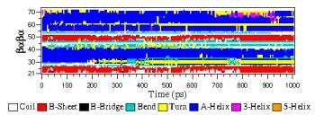

g96

具有 g96 扩展名的文件可以是 GROMOS-96 格式的初始/最终构型文件，或坐标轨迹文件，或二者的组合。此文件是固定格式的，所有浮点数的输出格式都是 15.9 （文件可能会变得非常大）。按给定的顺序，GROMACS 支持以下数据块：

• 标题块：

– TITLE （必需）

• 帧块：

– TIMESTEP （可选）  
– POSITION/POSITIONRED （必需）  
VELOCITY/VELOCITYRED （可选）  
– BOX （可选）

有关块的完整说明，请参阅 GROMOS-96 手册。

注意，所有 GROMACS 程序都可以读取压缩或 gzip 压缩文件。

gro

具有 gro 扩展名的文件包含 Gromos87 格式的分子结构。只要简单地连接起来，就可以将 gro 文件作为轨迹。程序会尝试从每帧的标题字符串中读取时间值，时间值应位于 t= 之后，如下面的示例所示。

示例如下：

```csv
MD of 2 waters, t= 0.0
6
1WATER OW1 1 0.126 1.624 1.679 0.1227 -0.0580 0.0434
1WATER HW2 2 0.190 1.661 1.747 0.8085 0.3191 -0.7791
1WATER HW3 3 0.177 1.568 1.613 -0.9045 -2.6469 1.3180
2WATER OW1 4 1.275 0.053 0.622 0.2519 0.3140 -0.1734
2WATER HW2 5 1.337 0.002 0.680 -1.0641 -1.1349 0.0257
2WATER HW3 6 1.326 0.120 0.568 1.9427 -0.8216 -0.0244
1.82060 1.82060 1.82060
```

文本行包含以下信息（从上到下）:

• 标题字符串（自由格式的字符串，t = 后可以是以 ps 为单位的时间）

• 原子个数（自由格式的整数）

• 每个原子一行（固定格式，见下文）

• 盒向量（自由格式，空格分开的实数），值： $\mathrm { v 1 ( x ) \ v 2 ( y ) \ v 3 ( z ) \ v 1 ( y ) \ v 1 ( z ) \ v 2 ( x ) \ v 2 ( z ) \ v 3 ( x ) \ v 3 ( y ) }$ 最后 6 个值可以省略（会被设置为零）。GROMACS 只支持 $\scriptstyle \mathrm { v 1 ( y ) = v 1 ( z ) = v 2 ( z ) = 0 }$ 的盒子。

这种格式是固定的，即所有列都处于固定位置。作为可选（现在只适用于 trjconv），gro 文件中小数的位数可以是任意的，这种情况下会有 n+5 位，带有 n 位小数（速度有 n+1 位小数），而默认的格式是 8

位其中 3 位为小数（速度的小数位数为 4）。在读取时，会根据小数点之间的距离（n+5）推断数据的精度。文本列包含以下信息（从左到右）:

• 残基编号（5 位，整数）

• 残基名称（5 个字符）

• 原子名称（5 个字符）

• 原子编号（5 位，整数）

• 位置（以 nm 为单位，x y z 三列，默认每个 8 位，包含 3 位小数）

• 速度 (以 nm/ps(或 km/s) 为单位，x y z 三列，默认每个 8 位，包含 4 位小数)

注意，单独的分子或离子（如水或 Cl-）被视为残基。如果你想在自己的程序中输出这样的文件，但不想使用 GROMACS 库，可以使用以下格式：

C 格式 "%5d%-5s%5s%5d%8.3f%8.3f%8.3f%8.4f%8.4f%8.4f"

Fortran 格式 (i5,2a5,i5,3f8.3,3f8.4)

Pascal 格式 留给用户做练习吧。

注意，这是用于输出的格式，如上面的示例所示，字段之间可能没有空格，因此无法使用相同格式的 C语言语句进行读取。

hdb

hdb 文件扩展名代表氢原子数据库。当使用gmx pdb2gmx↪149 程序构建原本就缺失的氢原子，或由 -ignh选项删除的氢原子时，需要这样一个文件。

itp

itp 文件扩展名代表包含拓扑。这些文件可包含在拓扑文件中（扩展名为top↪459）。

log

日志文件由某些 GROMACS 程序生成，通常采用人类可读的格式。可以使用 more logfile 命令查看。

m2p

m2p 文件格式包含用于gmx xpm2ps↪211 程序的输入选项。如果查看一下gmx xpm2ps↪211 给出的PostScript(tm) 输出，就很容易理解所有的这些选项。

```ini
; Command line options of xpm2ps override the parameters in this file
black&white = no ; Obsolete
titlefont = Times-Roman ; A PostScript Font
titlefontsize = 20 ; Font size (pt)
legend = yes ; Show the legend
legendfont = Times-Roman ; A PostScript Font
legendlabel = ; Used when there is none in the .xpm
legend2label = ; Used when merging two xpm's
legendfontsize = 14 ; Font size (pt)
xbox = 2.0 ; x-size of a matrix element
ybox = 2.0 ; y-size of a matrix element
```

(下页继续)

(续上页)  
```ini
matrixspacing = 20.0 ; Space between 2 matrices
xoffset = 0.0 ; Between matrix and bounding box
yoffset = 0.0 ; Between matrix and bounding box
x-major = 20 ; Major ticks on x axis every .. frames
x-minor = 5 ; Id. Minor ticks
x-firstmajor = 0 ; First frame for major tick
x-majorat0 = no ; Major tick at first frame
x-majorticklen = 8.0 ; x-majorticklength
x-minorticklen = 4.0 ; x-minorticklength
x-label = ; Used when there is none in the .xpm
x-fontsize = 16 ; Font size (pt)
x-font = Times-Roman ; A PostScript Font
x-tickfontsize = 10 ; Font size (pt)
x-tickfont = Helvetica ; A PostScript Font
y-major = 20
y-minor = 5
y-firstmajor = 0
y-majorat0 = no
y-majorticklen = 8.0
y-minorticklen = 4.0
y-label =
y-fontsize = 16
y-font = Times-Roman
y-tickfontsize = 10
y-tickfont = Helvetica
```

## map

这类文件将矩阵数据映射到 RGB 值，用于gmx do\_dssp↪84 程序。

它的格式如下：第一行：指定颜色映射的元素数目。接下来的每一行：第一个字符为蛋白二级结构类型的编码。然后是用于绘图图例的字符串，然后是 R（红色）G（绿色）和 B（蓝色）值。

在下面的示例中，颜色为（按出现顺序）: 白色，红色，黑色，青色，黄色，蓝色，品红色，橙色。

<table><tr><td colspan="4">8</td></tr><tr><td></td><td>Coil</td><td>1.0 1.0</td><td>1.0</td></tr><tr><td>E</td><td>B-Sheet</td><td>1.0 0.0</td><td>0.0</td></tr><tr><td>B</td><td>B-Bridge</td><td>0.0 0.0</td><td>0.0</td></tr><tr><td>S</td><td>Bend</td><td>0.0 0.8</td><td>0.8</td></tr><tr><td>T</td><td>Turn</td><td>1.0 1.0</td><td>0.0</td></tr><tr><td>H</td><td>A-Helix</td><td>0.0 0.0</td><td>1.0</td></tr><tr><td>G</td><td>3-Helix</td><td>1.0 0.0</td><td>1.0</td></tr><tr><td>I</td><td>5-Helix</td><td>1.0 0.6</td><td>0.0</td></tr></table>

## mdp

有关选项的详细说明，请参阅用户指南。

下面是一个示例 mdp 文件。选项的顺序并不重要，但如果同一选项输入了两次，会使用最后一次的设置 $( \ g m x \ g r o m p p _ { \sim 1 0 8 }$ 在覆盖前面的值时会给出注意信息）。等号左侧选项中的破折号和下划线没有区别。

示例选项的值用于模拟水盒子中的蛋白质，运行 1 纳秒 MD。

注意：所选参数（如短程截断值）取决于所使用的力场。

```ini
integrator = md
dt = 0.002
nsteps = 500000
nstlog = 5000
nstenergy = 5000
nstxout-compressed = 5000
continuation = yes
constraints = all-bonds
constraint-algorithm = lincs
cutoff-scheme = Verlet
coulombtype = PME
rcoulomb = 1.0
vdwtype = Cut-off
rvdw = 1.0
DispCorr = EnerPres
tcoupl = V-rescale
tc-grps = Protein SOL
tau-t = 0.1 0.1
ref-t = 300 300
pcoupl = Parrinello-Rahman
tau-p = 2.0
compressibility = 4.5e-5
ref-p = 1.0
```  
使用此输入文件，gmx grompp↪108 会生成一个包含注释的文件，默认名称为 mdout.mdp。这个文件会包含上述选项，以及未明确设置的所有其他选项，并给出了它们的默认值。

## mtx

具有 mtx 扩展名的文件包含了矩阵。文件格式与 $t r r _ { \hookrightarrow 4 6 1 }$ 格式相同。目前，这种文件格式仅用于 Hessian矩阵，这种矩阵由 $g m x \ m d r u n _ { \scriptscriptstyle \mathrm { Q 1 3 1 } }$ 生成，并由 $g m x \ n m e i g _ { \ldots 1 4 1 }$ 读取。

## ndx

GROMACS 索引文件（通常称为 index.ndx）包含了一些用户可定义的原子集合。大多数分析程序，图形程序（ $_ { g m x \ v i e w _ { \odot 2 0 3 } } \ )$ ）和预处理器 $( \ g m x \ g r o m p p _ {  1 0 8 } )$ ）都可以读取这种文件。如果没有提供索引文件，这些程序中的大多数都会创建默认的索引组，因此只有需要特殊组时才需要创建索引文件。

首先，将组的名称写在方括号之间。下面的原子编号可以延续任意多行。原子编号从 1 开始。

下面是一个示例文件：

示例中有两个组，总共 9 个原子。第一个组 Oxygen 有 3 个原子。第二个组 Hydrogen 有 6 个原子。  
可以使用gmx make\_ndx↪126 工具生成索引文件。

n2t

这种 GROMACS 文件可用于将结构文件中的原子名称初步转换为相应的原子类型。这主要用于gmxx2top↪209 程序，但用户应该知道，此文件中的信息非常有限。

下面是一个示例文件（share/top/gromos53a5.ff/atomname2type.n2t）:

H H 0.408 1.008 1 O 0.1   
O OA -0.674 15.9994 2 C 0.14 H 0.1   
C CH3 0.000 15.035 1 C 0.15   
C CH0 0.266 12.011 4 C 0.15 C 0.15 C 0.15 O 0.14

文件格式的简短说明如下：

• 第 1 列：原子的元素符号/原子名称中的第一个字符。

• 第 2 列：要指定的原子类型。

• 第 3 列：要指定的电荷。

• 第 4 列：原子的质量。

• 第 5 列：与该原子成键的其他原子的数目 N。后面的字段数与此数字相关；对每个成键原子，指定其元素符号以及其键长的参考距离。

• 第 6 列以后：与待指定参数的原子（第 1 列）相连的 N 个连接（第 5 列）的元素符号和参考键长。参考键长与此文件中指定值的容差为 +/- 10%。对超出此容差的任何键，程序都会将其识别为未与待指定参数的原子相连。

## out

具有 out 扩展名的文件包含了通用的输出信息。由于无法对所有数据文件格式进行分类，GROMACS具有一种名为 out 的通用文件格式，没有限定任何格式。

## pdb

具有pdb↪456 扩展名的文件为蛋白质数据库文件格式的分子结构文件。蛋白质数据库文件格式描述了一个分子结构中原子的位置。坐标来自 ATOM 和 HETATM 记录，直到文件结束或遇到 ENDMDL 记录。GROMACS程序可以读取和输出 CRYST1 记录中模拟盒子的信息。pdb 格式也可以用作轨迹格式：可以读取一个文件中由 ENDMDL 分隔的几个结构，也可以用此格式输出多个结构。

示例

pdb 文件应如下所示：

<table><tr><td>ATOM</td><td>1</td><td>H1</td><td>LYS</td><td>1</td><td>14.260</td><td>6.590</td><td>34.480</td><td>1.000.00</td><td></td></tr><tr><td>ATOM</td><td>2</td><td>H2</td><td>LYS</td><td>1</td><td>13.760</td><td>5.000</td><td>34.340</td><td>1.00</td><td>0.00</td></tr><tr><td>ATOM</td><td>3</td><td>N</td><td>LYS</td><td>1</td><td>14.090</td><td>5.850</td><td>33.800</td><td>1.00</td><td>0.00</td></tr><tr><td>ATOM</td><td>4</td><td>H3</td><td>LYS</td><td>1</td><td>14.920</td><td>5.560</td><td>33.270</td><td>1.00</td><td>0.00</td></tr><tr><td>..</td><td></td><td></td><td></td><td></td><td></td><td></td><td></td><td></td><td></td></tr><tr><td>.·.</td><td></td><td></td><td></td><td></td><td></td><td></td><td></td><td></td><td></td></tr></table>

rtp

rtp 文件扩展名代表残基拓扑文件。gmx pdb2gmx↪149 需要这种文件来创建蛋白的 GROMACS 拓扑，蛋白一般包含在pdb 文件中。这种文件包含了 4 种成键相互作用的默认相互作用类型以及残基条目，残基条目中包含了原子，以及可能的键，键角，二面角和反常二面角。可以为键，键角，二面角和反常二面角添加参数，这些参数会覆盖itp↪453 文件中的标准参数。这种做法只应该用于特殊情况。可以为每个成键相互作用添加字符串而不是参数，这个字符串会被复制到top↪459 文件中，GROMOS96 力场就使用了这种方式。

gmx pdb2gmx↪149 会自动生成所有的键角，这意味着 [ angles ] 字段仅用于覆盖itp↪453 参数。

gmx pdb2gmx↪149 程序会自动为每个可旋转的键生成一个正常二面角，并倾向位于重原子上。当使用 [dihedrals ] 字段时，不会为与指定二面角对应的键生成其他二面角。可以为一条可旋转的键指定一个以上的二面角。

gmx pdb2gmx↪149 会将排除数设置为 3，这意味着最多 3 条键连接的原子之间的相互作用会被排除。程序会为相隔 3 条键的所有原子对生成配对相互作用（氢原子对除外）。当需要排除更多的相互作用，或不需要生成某些配对相互作用时，可以添加 [ exclusions ] 字段，后面跟着位于不同行上的原子名称对。这些原子之间的所有非键和配对相互作用都将被排除。

下面是一个示例：

[ bondedtypes ] ; mandatory   
; bonds angles dihedrals impropers   
1 1 1 2 ; mandatory   
[ GLY ] ; mandatory   
[ atoms ] ; mandatory   
; name type charge chargegroup   
N N -0.280 0   
H H 0.280 0   
CA CH2 0.000 1   
C C 0.380 2   
O O -0.380 2   
[ bonds ] ; optional   
;atom1 atom2 b0 kb   
N H   
N CA   
CA C   
C O   
-C N

(续上页)

```ini
[ exclusions ] ; optional
;atom1 atom2
[ angles ] ; optional
;atom1 atom2 atom3 th0 cth
[ dihedrals ] ; optional
;atom1 atom2 atom3 atom4 phi0 cp mult
[ impropers ] ; optional
;atom1 atom2 atom3 atom4 q0 cq
N -C CA H
-C -CA N -O
[ ZN ]
[ atoms ]
ZN ZN 2.000 0
```

r2b

r2b 文件可以转换残基的残基名称，这些残基在不同力场中可能具有不同的名称，或者根据它们的质子化状态而具有不同的名称。

tdb

tdb 文件包含了氨基酸末端的信息，这些末端可用于对多肽链进行封端。

tex

我们使用 LaTeX 进行 文档处理。虽然输入并不是那么用户友好，但与 word 相比有一些优势。

• LaTeX 很了解格式，可能比你知道的还多。

• 输入很清晰，你总是知道自己在做什么

• 它可以用于任何文档，从信件到毕业论文。

• 更多…

tng

具有 .tng 扩展名的文件可以包含与模拟轨迹相关的所有类型的数据。例如，它可能包含坐标，速度，力和/或能量。各种mdp↪454 文件选项可用于控制 $g m x \ m d r u n _ { \scriptscriptstyle \mathrm { Q 1 3 1 } }$ 输出哪些数据，输出数据是否压缩，以及压缩率多大。此文件采用便携式二进制格式，可以使用gmx dump↪87 读取。

gmx dump↪87-f traj.tng

或者，如果你的阅读速度不是很快，可以使用：

```batch
gmx dump -f traj.tng | less
```

你也可以使用以下方法快速查看文件内容（帧数等）:

gmx check↪58-f traj.tng

top

top 文件扩展名代表拓扑。它是一个 ascii 文本文件，gmx grompp↪108 可以读取这种文件，进行处理，并创建一个二进制拓扑（tpr↪460 文件）。

下面是一个示例文件：

Example topology file   
;   
[ defaults ]   
; nbfunc comb-rule gen-pairs fudgeLJ fudgeQQ   
1 1 no 1.0 1.0   
The force field files to be included   
#include "rt41c5.itp"   
[ moleculetype ]   
; name nrexcl   
Urea 3   
[ atoms ]   
; nr type resnr residu atom cgnr charge   
1 C 1 UREA C1 1 0.683   
2 O 1 UREA O2 1 -0.683   
3 NT 1 UREA N3 2 -0.622   
4 H 1 UREA H4 2 0.346   
5 H 1 UREA H5 2 0.276   
6 NT 1 UREA N6 3 -0.622   
7 H 1 UREA H7 3 0.346   
8 H 1 UREA H8 3 0.276   
[ bonds ]   
; ai aj funct c0 c1   
3 4 1 1.000000e-01 3.744680e+05   
3 5 1 1.000000e-01 3.744680e+05   
6 7 1 1.000000e-01 3.744680e+05   
6 8 1 1.000000e-01 3.744680e+05   
1 2 1 1.230000e-01 5.020800e+05   
1 3 1 1.330000e-01 3.765600e+05   
1 6 1 1.330000e-01 3.765600e+05   
[ pairs ]   
; ai aj funct c0 c1   
2 4 1 0.000000e+00 0.000000e+00   
2 5 1 0.000000e+00 0.000000e+00   
2 7 1 0.000000e+00 0.000000e+00   
2 8 1 0.000000e+00 0.000000e+00   
3 7 1 0.000000e+00 0.000000e+00

(续上页)

<table><tr><td rowspan=1 colspan=8>3     8     1 0.000000e+00 0.000000e+004     6     1 0.000000e+00 0.000000e+005     6     1 0.000000e+00 0.000000e+00[angles]；ai   aj   ak funct             cO             c11     3     4     1 1.200000e+02 2.928800e+021     3     5     1 1.200000e+02 2.928800e+024     3     5     1 1.200000e+02 3.347200e+021     6     7     1 1.200000e+02 2.928800e+021     6     8     1 1.200000e+02 2.928800e+027     6     8     1 1.200000e+02 3.347200e+02</td></tr><tr><td rowspan=1 colspan=8>2     1     3     1 1.215000e+02 5.020800e+02</td></tr><tr><td rowspan=1 colspan=8>2      1      6     1 1.215000e+02 5.020800e+023      1      6     1 1.170000e+02 5.020800e+02[ dihedrals]</td></tr><tr><td rowspan=1 colspan=2>；ai   aj</td><td rowspan=1 colspan=1>ak</td><td rowspan=1 colspan=3>al funct             cO             c1</td><td rowspan=1 colspan=1>c2</td><td rowspan=1 colspan=1></td></tr><tr><td rowspan=1 colspan=2>2     1</td><td rowspan=1 colspan=1>3</td><td rowspan=1 colspan=3>4     1 1.800000e+02 3.347200e+01 2.000000e+00</td><td rowspan=20 colspan=2>4     1 1.800000e+02 3.347200e+01 2.000000e+004     1 1.800000e+02 3.347200e+01 2.000000e+005     1 1.800000e+02 3.347200e+01 2.000000e+005     1 1.800000e+02 3.347200e+01 2.000000e+007     1 1.800000e+02 3.347200e+01 2.000000e+007     1 1.800000e+02 3.347200e+01 2.000000e+008     1 1.800000e+02 3.347200e+01 2.000000e+008     1 1.800000e+02 3.347200e+01 2.000000e+00al funct             cO             c11     2 0.000000e+00 1.673600e+021     2 0.000000e+00 1.673600e+022     2 0.000000e+00 1.673600e+02</td></tr><tr><td rowspan=1 colspan=1>6</td><td rowspan=1 colspan=1>1</td><td rowspan=1 colspan=1>3</td><td rowspan=1 colspan=3>4     1 1.800000e+02 3.347200e+01 2.000000e+00</td><td rowspan=1 colspan=1>2.000000e+00</td></tr><tr><td rowspan=1 colspan=2>2     1</td><td rowspan=1 colspan=1>3</td><td rowspan=1 colspan=3>5     1 1.800000e+02 3.347200e+01 2.000000e+00</td><td rowspan=1 colspan=1>2.000000e+00</td></tr><tr><td rowspan=1 colspan=1>6</td><td rowspan=1 colspan=1>1</td><td rowspan=1 colspan=1>3</td><td rowspan=1 colspan=3>5     1 1.800000e+02 3.347200e+01 2.000000e+00</td><td rowspan=1 colspan=1>2.000000e+00</td></tr><tr><td rowspan=1 colspan=1>2</td><td rowspan=1 colspan=1>1</td><td rowspan=1 colspan=1>6</td><td rowspan=1 colspan=3>7     1 1.800000e+02 3.347200e+01 2.000000e+00</td><td rowspan=1 colspan=1>2.000000e+00</td></tr><tr><td rowspan=1 colspan=1>3</td><td rowspan=1 colspan=1>1</td><td rowspan=1 colspan=1>6</td><td rowspan=1 colspan=3>7     1 1.800000e+02 3.347200e+01 2.000000e+00</td><td rowspan=1 colspan=1>2.000000e+00</td></tr><tr><td rowspan=1 colspan=2>2     1</td><td rowspan=1 colspan=1>6</td><td></td><td rowspan=1 colspan=2>8     1 1.800000e+02 3.347200e+01 2.000000e+00</td><td rowspan=1 colspan=1>2.000000e+00</td></tr><tr><td rowspan=1 colspan=2>3     1</td><td rowspan=1 colspan=2>6</td><td rowspan=1 colspan=1>8</td><td rowspan=1 colspan=1>3.347200e+01</td><td rowspan=1 colspan=1>2.000000e+00</td></tr><tr><td rowspan=1 colspan=5></td><td rowspan=2 colspan=3></td></tr><tr><td rowspan=1 colspan=2>[ dihedrals]</td><td></td><td></td><td></td></tr><tr><td rowspan=1 colspan=2>ai   aj</td><td rowspan=1 colspan=4>ak   al funct             cO             c1</td><td rowspan=1 colspan=1></td></tr><tr><td rowspan=1 colspan=2>3     4</td><td rowspan=1 colspan=2>5</td><td rowspan=1 colspan=2>1     2 0.000000e+00 1.673600e+02</td><td rowspan=1 colspan=1></td></tr><tr><td rowspan=1 colspan=2>6     7</td><td rowspan=1 colspan=2>8</td><td rowspan=1 colspan=2>1     2 0.000000e+00 1.673600e+02</td><td rowspan=1 colspan=1></td></tr><tr><td rowspan=1 colspan=2>1     3</td><td rowspan=1 colspan=2>6</td><td rowspan=1 colspan=2>2     2 0.000000e+00 1.673600e+02</td></tr><tr><td rowspan=1 colspan=2>;Include SPC</td><td rowspan=1 colspan=2>water</td><td rowspan=1 colspan=2></td></tr><tr><td rowspan=1 colspan=2>#include &quot;spc.itp&quot;[system]</td><td rowspan=1 colspan=2></td><td></td><td></td></tr><tr><td rowspan=1 colspan=2>Urea in Water</td><td rowspan=1 colspan=2></td><td></td><td></td></tr><tr><td rowspan=1 colspan=2>[molecules]</td><td rowspan=1 colspan=2></td><td></td><td></td></tr><tr><td rowspan=1 colspan=2>Urea    1</td><td rowspan=1 colspan=2></td><td></td><td></td></tr><tr><td rowspan=1 colspan=2>SOL     1000</td><td rowspan=1 colspan=1></td><td></td><td></td><td></td></tr></table>

## tpr

tpr 文件扩展名代表便携式二进制运行输入文件。这类文件包含了模拟的初始结构，分子拓扑和所有的模拟参数。因为此文件为二进制格式，所以无法使用普通编辑器读取。要读取便携式二进制运行输入文件，可以使用：

gmx dump↪87-s topol.tpr

或者，如果你的阅读速度不是很快，可以使用：

gmx dump -s topol.tpr | less

你还可以使用以下方法比较两个 tpr 文件：

gmx check↪58-s1 top1 -s2 top2 | less

trr

具有 trr 扩展名的文件包含了模拟的轨迹。在这个文件中，包含了所有的坐标，速度，力和能量，输出方式由 GROMACS 的 mdp 文件决定。此文件为便携式二进制格式，可以使用gmx dump 读取：

```batch
gmx dump -f traj.trr
```

或者，如果你的阅读速度不是很快，可以使用：

```batch
gmx dump -f traj.trr | less
```

你也可以使用以下方法快速查看文件内容（帧数等）:

gmx check↪58-f traj.trr

vsd

vsd 文件包含了在一个力场中，如何为多个不同的分子设置虚拟位点的信息。

xdr

GROMACS 使用 XDR 文件格式在内部存储坐标文件等内容。

## xpm

GROMACS xpm 文件格式与 XPixMap 格式兼容，用于存储矩阵数据。因此可以使用 XV 等程序直接查看 GROMACS xpm 文件。或者，也可以将其导入 GIMP 并缩放到 300 DPI，对字体和图形使用强抗锯齿效果。xpm 文件中的第一个矩阵数据文本行对应于矩阵的最后一行。除 XPixMap 格式外，GROMACS xpm 文件可能包含额外的字段。当使用gmx xpm2ps↪211 将 xpm 文件转换为 EPS 文件时，会使用这些字段中的信息。可选的额外字段为：

• 在 gv\_xpm 声明之前：title，legend，x-label, y-label 和 type，这些字段后面都要跟着一个字符串。legend 字段指定图例标题。type 字段后面必须跟着 "continuous" 或 "discrete"，它决定了在 EPS 文件中使用哪种类型的图例，默认为连续型。

• xpm 颜色映射条目后面可以跟着一个字符串，该字符串为相应颜色的标签。

• 在颜色映射和矩阵数据之间，可以出现 x-axis 和/或 y-axis 字段，它们指定相应轴的刻度标记。

下面的 GROMACS xpm 示例文件包含了所有额外字段。附加字段中的 C 注释分隔符和冒号是可选的。

/\* XPM \*/   
/\* This matrix is generated by g\_rms. \*/   
/\* title: "Backbone RMSD matrix" \*/   
/\* legend: "RMSD (nm)" \*/   
/\* x-label: "Time (ps)" \*/

(下页继续)

(续上页)

```c
/* y-label: "Time (ps)" */
/* type: "Continuous" */
static char * gv_xpm[] = {
"13 13 6 1",
"A c #FFFFFF " /* "0" */,
"B c #CCCCCC " /* "0.0399" */,
"C c #999999 " /* "0.0798" */,
"D c #666666 " /* "0.12" */,
"E c #333333 " /* "0.16" */,
"F c #000000 " /* "0.2" */,
/* x-axis: 0 40 80 120 160 200 240 280 320 360 400 440 480 */
/* y-axis: 0 40 80 120 160 200 240 280 320 360 400 440 480 */
"FEDDDDCCCCCBA",
"FEDDDCCCCBBAB",
"FEDDDCCCCBABC",
"FDDDDCCCCABBC",
"EDDCCCCBACCCC",
"EDCCCCBABCCCC",
"EDCCCBABCCCCC",
"EDCCBABCCCCCD",
"EDCCABCCCDDDD",
"ECCACCCCCDDDD",
"ECACCCCCDDDDD",
"DACCDDDDDDEEE",
"ADEEEEEEEFFFF"
```

## xtc

xtc 格式为轨迹的便携式格式。它使用 xdr 例程来读写数据，这些数据是为 Unix NFS 系统创建的。输出轨迹时使用了精度降低的算法，该算法工作方式如下：坐标（以 nm 为单位）乘上一个缩放因子，通常为 1000，因此得到的坐标以 pm 为单位。将得到的值四舍五入为整数值。然后使用其他一些技巧，例如，在序列中的接近的原子通常也会在空间上接近（如水分子）。为此，对 xdr 库进行了扩展，添加了一个特殊的例程来编写 3-D 浮点坐标。该例程最初由 Frans van Hoesel 编写，作为 Europort 项目的一部分。它的更新版本可以通过 此链接↪https://github.com/Pappulab/xdrf 获得。

所有数据都使用对 xdr 例程的调用来存储。具体格式如下：

int magic 整数 一个神奇的数字，对于当前的文件版本，其值为 1995。

int natoms 整数 轨迹中的原子数。

int step 整数 模拟步数。

float time 浮点数 模拟时间。

float box[3][3] 浮点数 模拟盒子存储为三个基向量的集合，以便可以用于三斜 PBC。对于长方体盒子，盒子边长存储在矩阵的对角线上。

3dfcoord x[natoms] 坐标本身以较低的精度存储。请注意，当原子数小于 9 时，不会使用降低精度的算法。

## 在 C 程序中使用 xtc

要读写这些文件，可以使用以下 C 例程：

```c
/* All functions return 1 if successful, 0 otherwise */
extern int open_xtc(XDR *xd,char *filename,char *mode);
/* Open a file for xdr I/O */
extern void close_xtc(XDR *xd);
/* Close the file for xdr I/O */
extern int read_first_xtc(XDR *xd,char *filename,
int *natoms,int *step,real *time,
matrix box,rvec **x,real *prec);
/* Open xtc file, read xtc file first time, allocate memory for x */
extern int read_next_xtc(XDR *xd,
int *natoms,int *step,real *time,
matrix box,rvec *x,real *prec);
/* Read subsequent frames */
extern int write_xtc(XDR *xd,
int natoms,int step,real time,
matrix box,rvec *x,real prec);
/* Write a frame to xtc file */
```

要使用库函数，请在文件中包含 "gromacs/fileio/xtcio.h"，并在链接时指定 -lgmx.\$(CPU)。

## 在 FORTRAN 程序中使用 xtc

要在 FORTRAN 程序中读写这些文件，请使用对 readxtc 和 writextc 的调用，如以下示例程序所示。该示例程序读取一个 xtc 文件并将其复制到新文件中：

```fortran
program testxtc
parameter (maxatom=10000,maxx=3*maxatom)
integer xd,xd2,natoms,step,ret,i
real time,box(9),x(maxx)
call xdrfopen(xd,"test.xtc","r",ret)
print *,'opened test.xtc, ret=',ret
call xdrfopen(xd2,"testout.xtc","w",ret)
print *,'opened testout.xtc, ret=',ret
call readxtc(xd,natoms,step,time,box,x,prec,ret)
if ( ret .eq. 1 ) then
call writextc(xd2,natoms,step,time,box,x,prec,ret)
else
```

(下页继续)

print \*,'Error reading xtc'   
endif   
stop   
end  
要链接你的程序，请在链接器命令行上指定 -L\$(GMXHOME)/lib/\$(CPU) -lxtcf。

xvg

几乎所有 GROMACS 分析工具的输出都可以直接作为 Grace 的输入，这个程序以前称为 Xmgr。我们使用 Grace，因为它非常灵活，而且它也是自由软件。它可以输出 PostScript(tm)，这种文件非常适合包含在如 LaTeX 之类的文档中，也适用于其他文字处理程序。

使用 GROMACS 数据的 Grace 示例如下所示：

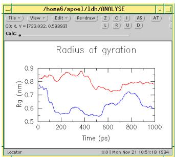

## 5.8 专题

本节介绍一些更专业的主题，涉及如何使用 GROMACS 处理一些特定的科学问题。

## 5.8.1 自由能计算的实现

计算自由能时，必须指定两个条件；终止状态，以及连接终止状态的途径。指定终止状态的方式有两种。最直接的方法是在拓扑文件中指定终止状态。大多数势能形式既支持 ?? 状态也支持 ?? 状态。每当指定两个状态时，?? 状态对应于初始自由能状态，而 ?? 状态对应于最终的状态。

在 某 些 情 况 下， 也 可 以 只 通 过mdp 文 件 来 定 义 终 止 状 态， 而 无 须 改 变 拓 扑， 方 法 是 使用 couple-moltype，couple-lambda0，couple-lambda1， 和 couple-intramol 等mdp↪454 关 键 词。couple-moltype 中选定的任何分子类型会自动具有一个 ?? 状态 (以及重新定义的 ?? 状态)，这个状态是根据 couple-lambda 关键词隐式地构建的。couple-lambda0 和 couple-lambda1 定义了出现在 ?? 状态（couple-lambda0）和 ?? 状态（couple-lambda1）中的非键参数。可用的选项是 q，vdw 和vdw-q，分别表示库仑参数，范德华参数或二者的参数，这些参数在相应状态中可以打开。

一旦定义了终止状态，就必须定义终止状态之间的途径。途径只需要在。mdp 文件中定义。从 4.6 版本开始，?? 是一个向量，它的库仑分量，范德华分量，成键分量，约束分量和质量分量都可以独立调整。这样就可以在同一模拟中线性地关闭库仑项，然后使用软核势关闭范德华项。对于副本交换或扩展系综模拟，这尤其有用。因为在这两种模拟中为提高采样效果，在同一模拟中对相互作用从有到无的所有途径进行采样非常重要。

fep-lambdas 是 ?? 的默认数组，其值的范围从 0 到 1。如果未指定，所有其他 lambda 数组都会使用此数组中的值。以前使用单个 ?? 变量控制途径的作法，现在可以通过只使用 fep-lambdas 定义途径的方法来实现。

例如，如果你想首先改变库仑项，然后是范德华项，同时以与范德华项相同的速率改变成键项，但在整个模拟的前三分之二改变限制项，那么你可以使用下面的 ?? 向量：

coul-lambdas = 0.0 0.2 0.5 1.0 1.0 1.0 1.0 1.0 1.0 1.0   
vdw-lambdas = 0.0 0.0 0.0 0.0 0.4 0.5 0.6 0.7 0.8 1.0   
bonded-lambdas = 0.0 0.0 0.0 0.0 0.4 0.5 0.6 0.7 0.8 1.0   
restraint-lambdas = 0.0 0.0 0.1 0.2 0.3 0.5 0.7 1.0 1.0 1.0

这等价于：

fep-lambdas = 0.0 0.0 0.0 0.0 0.4 0.5 0.6 0.7 0.8 1.0   
coul-lambdas = 0.0 0.2 0.5 1.0 1.0 1.0 1.0 1.0 1.0 1.0   
restraint-lambdas = 0.0 0.0 0.1 0.2 0.3 0.5 0.7 1.0 1.0 1.0

在这种情况下，fep-lambda 数组作为默认填充到成键与范德华相互作用的 ?? 数组中。通常，最好明确地列出所有数组，以确保赋值正确。

如果你只想打开从 ?? 到 ?? 的限制，那么可以使用下面的设置：

restraint-lambdas = 0.0 0.1 0.2 0.4 0.6 1.0

这样 ?? 向量的所有其他分量都将保持 ?? 状态的值。

使用热力学积分计算与 ?? 对应的自由能时，TI 方程变为向量方程：

$$
\Delta F = \int \langle \nabla H \rangle \cdot d \vec { \lambda }\tag{5.281}
$$

或使用有限差分：

$$
\Delta F \approx \int \sum \langle \nabla H \rangle \cdot \Delta \lambda\tag{5.282}
$$

外部的 pymbar 脚本↪https://SimTK.org/home/pymbar 可以根据 GROMACS 输出的 dhdl.xvg 文件自动计算上面的积分。

## 5.8.2 平均力势

平均力势（PMF）是通过积分构型系综中的平均力而得到的势能。在 GROMACS 中，有几种不同的方法可用于计算平均力。每种方法都有其局限性，如下所述。

• 牵引代码：用于分子或分子组质心之间。

• AWH 代码：目前作用于牵引代码提供的坐标上。

• 使用简谐键或约束的自由能代码：单个原子之间。

• 位置限制的自由能代码：改变相对固定的原子组的构象。

• 有限情况下的牵引代码：原子组之间，它们是较大分子的一部分，其中的键使用了 SHAKE 或LINCS 约束。如果牵引组相对较大，可以使用牵引代码。

下面两节将更详细地讨论牵引代码和自由代码。

## 熵效应

当两个原子之间或两个组的质量中心之间的距离受到约束或限制时，由于两个组的旋转，PMF 会含有单纯由熵引起的贡献 $1 3 4 _ {  5 3 8 } { \mathrm { ~ } } _ { \mathrm { ~ } }$ 。对于由两个无相互作用的质量组成的系统，平均力势为：

$$
V _ { p m f } ( r ) = - ( n _ { c } - 1 ) k _ { B } T \log ( r )\tag{5.283}
$$

其中 $n _ { c }$ 为约束作用的维数 (即对正常的约束 $n _ { c } = 3$ ，仅在 ?? 方向受约束时 $n _ { c } = 1 )$ 。是否需要校正这一贡献取决于 PMF 应代表什么。当你想要将底物牵引到蛋白质中时，这个熵对应的项确实对底物进入蛋白质的功有贡献。但当计算溶剂中两个溶质之间的 PMF 以便用于无溶剂的模拟时，应该去除熵的贡献。注意，这一项可能很显著；300 K 时，若距离减半，贡献为 3.5 kJmol−1。

## 5.8.3 非平衡牵引

当连续改变两个组之间的距离时，会对体系做功，这意味着系统不再处于平衡状态。尽管在非常慢牵引的极限情况下，系统会再次处于平衡状态，但对于许多系统而言，这种极限情况在合理的计算时间内无法达到。然而，使用 Jarzynski 关系135 可以从很多非平衡模拟计算出两个距离之间平衡的自由能变化 $\Delta G$ :

$$
\Delta G _ { A B } = - k _ { B } T \log \left. e ^ { - \beta W _ { A B } } \right. _ { A }\tag{5.284}
$$

其中 $W _ { A B }$ 为强制系统沿某路径从状态 A 到达状态 B 所需的功，角括号表示对初始状态 A 的正则系综进行平均， $\beta = 1 / k _ { B } T$ 。

## 5.8.4 牵引代码

牵引代码 $\hookrightarrow 4 6 6$ 可以在一对或多对原子组的质心之间施加力或约束。每个牵引的反应坐标称为“坐标”，它通常作用于两个牵引组，但有时会更多。一个牵引组可以是一个或多个牵引坐标的一部分。此外，坐标还可以作用于单个组或空间中的绝对参考位置。两个组之间的距离可以根据 1，2 或 3 个维度来计算，

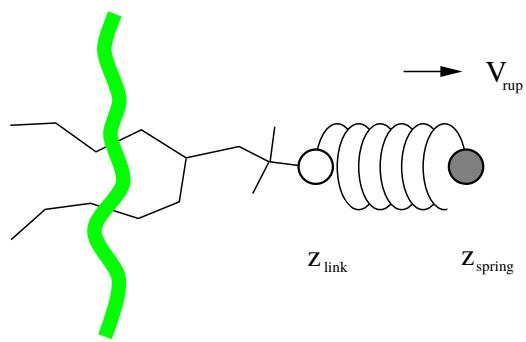  
图 5.35: 使用伞形牵引将脂分子拉出脂质双层的示意图。 $V _ { r u p }$ 为弹簧的收缩速度， $Z _ { l i n k }$ 为弹簧附着的原子， $Z _ { s p r i n g }$ 为弹簧的位置。

或者沿用户定义的向量来计算。参考距离可以是恒定的，也可以随时间线性变化。通常，所有的原子都根据其质量进行加权，但也可以使用额外的加权因子。

GROMACS 支持几种不同的牵引类型，即牵引力施加的方式。对于所有的牵引类型，参考距离可以是恒定的，也可以随时间线性变化。

1. 伞形牵引：在两个组的质量中心之间施加简谐势。因此，力与位移成正比。

2. 约束牵引：约束两个组质量中心之间的距离。约束力可以写入到文件中。此方法使用 SHAKE 算法，但如果仅有两个组受到约束，只需要 1 次迭代就可以得到精确结果。

3. 恒力牵引：在两个组的质量中心之间施加恒定的力。因此，势能是线性的。在这种情况下，牵引速率没有参考距离。

4. 平底牵引：类似伞形牵引，但当坐标值低于 $( \mathrm { \ p u l 1 - c o o r d ? - t y p e ~ = ~ f l a t - b o t t o m ~ } )$ 或高于（pull-coord?-type = flat-bottom-high）参考值时，势能和力都为零。这种方式适用于某些情况，如限制两个分子之间的距离处于某个区间内。

另外，存在不同类型的反应坐标，即所谓的牵引几何。它们可以使用 $m d p _ { \hookrightarrow 4 5 4 }$ 选项 pull-coord?-geometry进行设置。

## 质心的定义

在 GROMACS 中，有三种方式可以定义一组原子的质心。标准方式是“普通”质心，可能带有额外的权重因子。在周期性边界条件下，无法唯一地定义一组原子的质心。因此，会使用参考原子。为确定质心，对于组中所有的其他原子，会使用离参考原子最近的周期映像。这样就可以唯一地定义质心。默认情况下，会使用中间的原子（根据拓扑中的顺序）作为参考原子，但用户也可以选择使用任何其他原子，如果它更靠近原子组中心的话。

当牵引组较大时，如脂质双层，可以使用 pull-pbc-ref-prev-step-com 来避免质心的潜在较大移动，以防牵引组中的原子移动太多以致参考原子离预期质心太远。启用此选项后，将使用上一步的质心，而不是参考原子的位置来确定参考位置。第一步仍然使用参考原子的位置。对于大的牵引组，重要的是选择接近预期质心的参考原子，即不要使用 $\mathrm { p u l l - g r o u p ? - p b c a t o m ~ = ~ 0 ~ }$ 。

对于分层系统，如脂质双层，可能需要计算脂分子的 PMF，它是脂分子到整个双层的距离的函数。在这种情况下，整个双层可以作为参考组，但也可以为 PMF 定义更局域的反应坐标。 $m d p _ { \hookrightarrow 4 5 4 }$ 选项pull-coord?-geometry = cylinder 并不使用参考组中的所有原子，而仅仅使用那些动态地位于圆柱内的原子。圆柱的半径为 pull-cylinder-r，围绕着通过牵引组的牵引向量。这仅适用于在一维中定义的距离，并且圆柱的长轴沿定义距离的方向。为了避免牵引力出现跳跃，每个原子的贡献会根据其距离进行加权（除质量加权外）:

$$
\begin{array} { r l r } { w ( r < r _ { \mathrm { c y l } } ) = } & { { } 1 - 2 \left( \displaystyle \frac { r } { r _ { \mathrm { c y l } } } \right) ^ { 2 } + \left( \displaystyle \frac { r } { r _ { \mathrm { c y l } } } \right) ^ { 4 } } & { } \\ { w ( r \geq r _ { \mathrm { c y l } } ) = } & { { } 0 } \end{array}\tag{5.285}
$$

请注意，权重的径向依赖性会导致圆柱组和其他牵引组都受到径向力的作用。这不是想要的结果，但无法避免。为了最大限度地减小这种影响，圆柱半径应该选得足够大的。在这种情况下，有效质量是具有均匀权重圆柱质量的 0.47 倍，并且等于 0.79 倍半径的均匀圆柱的质量。

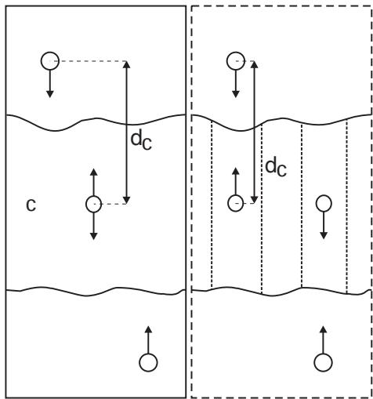  
图 5.36: 普通质心参考组与用于界面系统的圆柱参考组之间的比

$$
d _ { c }
$$

对处于周期性系统中的一组分子，可能无法明确定义普通参考组。例如，对于在 ?? 和 ?? 方向周期性相连，但在 ?? 方向具有两个液-气界面的水板块。在这样的设置中，水分子可以从液体中蒸发，并穿过蒸汽，通过周期性边界，到达另一个界面。这种系统本质上是周期性的，无法正确地定义沿 ?? 方向的“普通”质心。一个合适的解决方法是对参考组中的所有原子使用一个余弦形权重剖面。此剖面是单位晶胞中具有单个周期的余弦。其相位经过了优化，使得能够给出权重的最大总和，包括质量权重。当所有原子都处于单位晶胞长度一半的范围之内时，这种方法提供了唯一并连续的参考位置，该参考位置几乎等同于普通的质心位置。详情见参考文献136↪538。

当计算过程中使用相对权重 $w _ { i }$ 时，无论是输入中提供的权重，还是因圆柱几何或余弦加权引入的权重，都需要对权重进行缩放以保证动量守恒：

$$
{ w _ { i } ^ { \prime } } = w _ { i } \sum _ { j = 1 } ^ { N } { w _ { j } m _ { j } } \Bigg / \sum _ { j = 1 } ^ { N } w _ { j } ^ { 2 } m _ { j }\tag{5.286}
$$

其中 $m _ { j }$ 为组中原子 $j$ 的质量。计算约束力所需的组的质量为：

$$
M = \sum _ { i = 1 } ^ { N } w _ { i } ^ { \prime } m _ { i }\tag{5.287}
$$

加权质心的定义为：

$$
\mathbf { r } _ { c o m } = \sum _ { i = 1 } ^ { N } w _ { i } ^ { \prime } m _ { i } \mathbf { r } _ { i } \Bigg / M\tag{5.288}
$$

根据质心，可计算作用在每个组上的 AFM，约束或伞形力 $\mathbf { F } _ { c o m }$ 。作用于一组原子质心上的力会根据下式重新分配到原子上：

$$
\mathbf { F } _ { i } = \frac { w _ { i } ^ { \prime } m _ { i } } { M } \mathbf { F } _ { c o m }\tag{5.289}
$$

## 牵引方向的定义

最常见的设置是沿两个牵引组之间的向量方向进行牵引，这种牵引方式对应于 pull-coord?-geometry= distance 设置。此外，你可能希望沿某个特定的向量方向进行牵引，这可以通过设置 pull-coord?$\mathtt { - g e o m e t r y } \ = \ \mathtt { d i r e c t i o n }$ 来实现。但这可能导致系统中产生不需要的扭矩力，除非牵引方向相对于参考组（几乎）固定，例如，沿 z 方向牵引 $\mathrm { { x } / \mathrm { { y } } }$ 方向嵌入膜中的膜蛋白。如果参考组的取向不固定，你可能应该使用 $\mathrm { p u l l - c o o r d 2 - g e o m e t r y ~ = ~ d i r e c t i o n - r e l a t i v e }$ ，参见 图 5.37。由于这种情况下势能与定义取向的两个额外组的坐标有关，因此这两个组会受到扭转力矩。

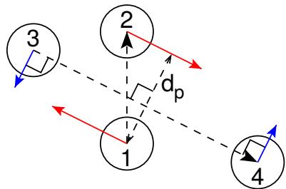  
图 5.37: direction-relative 牵引几何结构的设置。“正常”牵引组是 1 和 2。组 3 和组 4 定义牵引方向，从而定义了正常牵引力的方向（红色）。这导致组 3 和 4 受到反作用力（蓝色），它们垂直于牵引方向。其大小为“正常”牵引力乘以 $d _ { p }$ 与组 3 和组 4 之间距离的比值。

## 角度和二面角牵引几何的定义

pull-coord?-geometry = angle 需要四个牵引组。与具有两个牵引组的几何结构类似，每两个连续的组 ?? 和 ?? + 1 定义了一个连接它们质心的向量。这两个向量之间的夹角定义为角度。例如， $m d p _ { \hookrightarrow 4 5 4 }$ 选项 pull-coord?-groups = 1 2 2 4 定义了从组 1 质心到组 2 质心的向量，从组 2 质心到组 4 质心的向量，以及这两个向量之间的夹角。夹角的取值范围为闭区间 [0,180] 度。对于 pull-coord?-geometry$\mathrm { \Omega = \ a n g l e { - } a x i s }$ ，夹角是相对于参考轴定义的，而参考轴由 pull-coord?-vec 给出，在这种情况下只需要指定两个索引组。二面角几何结构需要六个牵引组。其设置方式与上述说明类似，但需要定义三个向量。二面角定义为前两个向量张成的平面与后两个向量张成的平面之间的夹角。等效地说，二面角可以看作第一个和第三个向量之间的夹角，当将这两个向量都投影到垂直于第二个向量（轴向量）的平面上时。例如，考虑涉及四个索引组的二面角：1，5，8，9。这里， $m d p _ { \hookrightarrow 4 5 4 }$ 选项 pull-coord?-groups = 81 1 5 5 9 指定了定义二面角的三个向量：第一个向量是从组 8 到组 1 的质心距离向量，第二个向量是从组 1 到组 5 的质心距离向量，第三个向量是从组 5 到组 9 的质心距离向量。二面角的取值范围为(-180,180] 度，并且具有周期性边界。

## 局限性

存在一个理论局限性：严格来说，只能计算某些组之间的约束力，这些组没有通过约束连接到系统的其余部分。如果一个组包含分子的一部分，而分子的键长受到约束，那么应该同时迭代牵引约束算法和LINCS 或 SHAKE 键约束算法。GROMACS 还不支持这种处理方法。这意味着，若模拟时在 $m d p _ { \hookrightarrow 4 5 4 }$ 文件中使用了 constraints = all-bonds 选项，严格来说，牵引仅限于整个分子或分子组。在某些情况下，使用自由能代码可以避免这种限制，参见使用自由能代码计算 $P M F _ { \hookrightarrow \ / { 4 9 0 } } \stackrel { \textstyle \textstyle \longrightarrow \# } { \longrightarrow }$ 。在实践中，当牵引组包含大量原子和/或牵引力较小时，因未对两种约束算法进行迭代而引起的误差可以忽略不计。在这种情况下，与键长相比，牵引组的约束校正位移较小。

## 5.8.5 AWH 自适应偏置

加速权重直方图（AWH，Accelerated Weight Histogram）方法 $1 \mathcal { B } \Upsilon _ { \hookrightarrow 5 3 8 }$ 通过添加自适应确定的偏置势来计算沿反应坐标的 PMF。而 AWH 则是利用依赖于历史的势能“填充”系统的自由能极小值，将沿反应坐标的自由能势垒平坦化。其思想类似于其他自适应偏置势方法，如 Wang-Landau 方法 $1 \mathcal { B } \mathcal { B } _ { \hookrightarrow 5 3 8 }$ ，局部抬升方法139 以及元动力学方法 $1 4 0 _ { \scriptscriptstyle { \mathrm { < 5 3 8 } } } ~ \mathrm { A W H }$ 的初始采样阶段使得该方法对输入参数的选择具有稳健性。此外，还可以自由选择沿反应坐标的目标分布。

## AWH 方法的基础知识

AWH 作用于 参考坐标 ??，而不是直接对反应坐标 ??(??) 进行偏置。反应坐标 $\xi ( x )$ 通过简谐势与 ?? 进行耦合。

$$
Q ( \xi , \lambda ) = \frac { 1 } { 2 } \beta k ( \xi - \lambda ) ^ { 2 } ,\tag{5.290}
$$

这样对于大的力常数 $k , ~ \xi \approx \lambda _ { \circ }$ 请注意这里使用了无量纲的能量，以便与以前发表的论文兼容。能量单位可以通过乘上 $k _ { B } T = 1 / \beta$ 得到。在模拟中，?? 在用户定义的采样区间 ?? 中进行采样。对多维反应坐标??，采样区间是笛卡尔积 $I = \Pi _ { \mu } I _ { \mu }$ （矩形区域）。原子坐标和 ?? 之间通过扩展系综 $6  { 8 _ { \odot 5 3 4 } }$ 相联系

$$
P ( x , \lambda ) = \frac { 1 } { \mathcal { Z } } e ^ { g ( \lambda ) - Q ( \xi ( x ) , \lambda ) - V ( x ) } ,\tag{5.291}
$$

其中 $g ( \lambda )$ 是一个偏置函数（自由变量），而 $V ( x )$ 是系统的无偏势能。通过明智地选择 $g ( \lambda )$ ，可以将沿?? 的分布调整为预定义的任意 目标分布 $\rho ( \lambda )$ （通常选为平坦的常数分布）。这很明显，因为

$$
P ( \lambda ) = \int P ( x , \lambda ) d x = \frac { 1 } { \mathcal { Z } } e ^ { g ( \lambda ) } \int e ^ { - Q ( \xi ( x ) , \lambda ) - V ( x ) } d x \equiv \frac { 1 } { \mathcal { Z } } e ^ { g ( \lambda ) - F ( \lambda ) } ,\tag{5.292}
$$

其中 $F ( \lambda )$ 为自由能

$$
F ( \lambda ) = - \ln \int e ^ { - Q ( \xi ( x ) , \lambda ) - V ( x ) } d x .\tag{5.293}
$$

$F ( \lambda )$ 是 $\mathrm { P M F }$ 与由简谐势定义的高斯的卷积，它是PMF的平滑值。方程(5.292)说明要得到 $P ( \lambda ) = \rho ( \lambda )$ 必须精确地计算 $F ( \lambda )$ 。因此，AWH 自适应地计算 $F ( \lambda )$ ，并同时将 $P ( \lambda )$ 收敛到 $\rho ( \lambda )$ 。

## 自由能更新

AWH 使用自由能的估计值 $F _ { 0 } ( \lambda )$ 进行初始化。在固定的时间间隔内，使用在各个更新之间收集的数据对原来的估计值进行更新。在 ?? 次更新时，施加的偏置 $g _ { n } ( \lambda )$ 为当前自由能估计值 $F _ { n } ( \lambda )$ 和目标分布$\rho _ { n } ( \lambda )$ 的函数，

$$
g _ { n } ( \lambda ) = \ln \rho _ { n } ( \lambda ) + F _ { n } ( \lambda ) ,\tag{5.294}
$$

这与方程 (5.292) 一致。请注意，在模拟过程中也可以更新目标分布（参见目标分布的选择 $\hookrightarrow 4 7 4$ 一节中的示例） $) _ { \circ }$ 将 $g = g _ { n }$ 代回方程 (5.292) 得到简单的自由能更新

$$
\Delta F _ { n } ( \lambda ) = F ( \lambda ) - F _ { n } ( \lambda ) = - \ln \frac { P _ { n } ( \lambda ) } { \rho _ { n } ( \lambda ) } ,\tag{5.295}
$$

假定 $P _ { n } ( \lambda )$ 能够精确地测量，就可以得到更好的自由能估计值 $F _ { n + 1 } = F _ { n } + \Delta F _ { n }$ 。AWH 通过定期计算条件分布来估计 $P _ { n } ( \lambda )$ 。

$$
\omega _ { n } ( \lambda | x ) \equiv P _ { n } ( \lambda | x ) = \frac { e ^ { g _ { n } ( \lambda ) - Q ( \xi ( x ) , \lambda ) } } { \sum _ { \lambda ^ { \prime } } e ^ { g _ { n } ( \lambda ^ { \prime } ) - Q ( \xi ( x ) , \lambda ^ { \prime } ) } } .\tag{5.296}
$$

对这些概率权重进行累加，得 $\begin{array} { r } { \sum _ { t } \omega ( \lambda | x ( t ) ) \sim P _ { n } ( \lambda ) } \end{array}$ ，其中使用了关系式 $\begin{array} { r } { \int P _ { n } ( \lambda | x ) P _ { n } ( x ) d x = P _ { n } ( \lambda ) \circ } \end{array}$ 因此 $\omega _ { n } ( \lambda | x )$ 权重是 AWH 方法的样本。由于实际使用时采样量有限，更新方案 (5.295) 得到的结果噪声非常大。AWH 施加的自由能更新方案具有相同的形式，但可以重复施加有限的，局部的采样。

$$
\Delta F _ { n } = - \ln \frac { W _ { n } ( \lambda ) + \sum _ { t } \omega _ { n } ( \lambda | x ( t ) ) } { W _ { n } ( \lambda ) + \sum _ { t } \rho _ { n } ( \lambda ) ) } .\tag{5.297}
$$

这里 $W _ { n } ( \lambda )$ 为代表先前采样的 参考权重直方图。忽略初始阶段（参见初始阶段 $\omega _ { 4 7 1 } \ - \frac { \ d { + } } { \ d { \Pi } } )$ $W ( \lambda )$ 的更新为

$$
W _ { n + 1 } ( \lambda ) = W _ { n } ( \lambda ) + \sum _ { t } \rho _ { n } ( \lambda ) .\tag{5.298}
$$

因此，权重直方图等于样本的目标“理想”历史。关于自由能更新，有两件重要的事情需要注意。首先，采样会远离过度采样的，当前的局部区域。根据方程 (5.294)，对满足 $\omega _ { n } ( \lambda ) > \rho _ { n } ( \lambda )$ 和 $\Delta F _ { n } ( \lambda ) < 0$ 的 ?? 值，意味着 $\Delta g _ { n } ( \lambda ) < 0$ (假定 $\Delta \rho _ { n } \equiv 0 )$ 。因此，在更新之后，采样 ?? 的概率会降低（参见方程(5.292)）。其次，直方图的归一化因子 $\begin{array} { r } { N _ { n } = \sum _ { \lambda } W _ { n } ( \lambda ) } \end{array}$ 决定了更新大小 $| \Delta F ( \lambda ) |$ 。例如，对于单次采样$\omega ( \lambda | x )$ ，更新的形状近似为宽度为 $\sigma = 1 / \sqrt { \beta k }$ ，高度为 $\propto 1 / N _ { n }$ 的高斯函数 $1 \mathcal { B } \mathcal { Y } _ { \odot 5 3 8 }$

$$
| \Delta F _ { n } ( \lambda ) | \propto \frac { 1 } { N _ { n } } e ^ { - \frac { 1 } { 2 } \beta k ( \xi ( x ) - \lambda ) ^ { 2 } } .\tag{5.299}
$$

因此，随着 $W ( \lambda )$ 样本的增加和 $N _ { n }$ 的增长，更新会变得越来越小，从而自由能慢慢收敛。

请注意，用户感兴趣的量不是 $F ( \lambda )$ 而是 PMF Φ(??)。Φ(??) 通过实时地重新加权样本 $\xi ( t )$ 计算出来 $1 \mathcal { 3 } \mathcal { Y } _ { \scriptscriptstyle \mathrm { Q 5 3 8 } } ( \mathcal { \ G } )$ 请参见重新加权和组合偏置数据 $\yen 476$ ，它与 $F ( \lambda )$ 具有相同的收敛速度，参见 图 5.38。PMF会写入输出文件中（参见使用方法↪476 一节）。

## 对体系施加偏置

偏置势可以通过两种方式施加到系统上。一种方法是施加以 ??(??) 为中心的简谐势，它来自条件分布$\omega _ { n } ( \lambda | x ( t ) ) = P _ { n } ( \lambda | x ( t ) )$ 的（无拒绝）蒙特卡洛采样，参见方程 (5.296)。这种方法也称为吉布斯采样或独立采样。另一种方法，也就是默认方法，施加了下面的 卷积偏置势，

$$
U _ { n } ( \xi ) = - \ln \int e ^ { g _ { n } ( \lambda ) - Q ( \xi , \lambda ) } d \lambda .\tag{5.300}
$$

这两种方法在某种意义上是等价的，因为它们会给出相同的有偏概率 $P _ { n } ( x )$ (方程 (5.291))，但这两种方法对应的动力学明显不同。方法的选择不会影响 AWH 算法的内部，只影响 AWH 返回给 MD 引擎的力和势能。

## 初始阶段

开始时，当偏置势远离最佳值时，采样将高度相关。在这种情况下，让 $W ( \lambda )$ 按照 (5.298) 规定的方式累加样本，会导致自由能更新大小衰减过快。这促使我们将模拟分成 初始阶段和 最终阶段。前者的权重直方图增长策略更严格，更稳健，而后者的权重直方图以采样率（方程 (5.298)）线性增长。AWH 的初始阶段受到著名的 Wang-Landau 算法 $1 \mathcal { 3 }  { \delta _ { \odot \ 5 3 8 } }$ 的启发，尽管细节上有所不同。

在初始阶段，更新大小保持不变 (通过保持 $N _ { n }$ 为常数)，直到检测到跨越采样区间的过渡，即“覆盖”。有关覆盖的定义，请参见下面的方程 (5.301)。发生覆盖后， $N _ { n }$ 将根据恒定的“增长因子”?? 按比例放

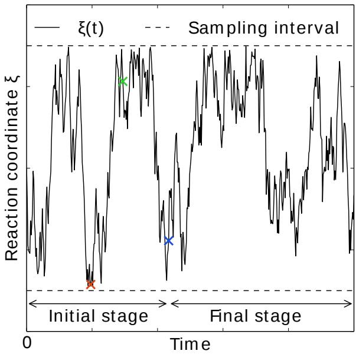  
图 5.38: 双阱势中布朗粒子 AWH 的时间演化。反应坐标 ??(??) 在初始阶段多次穿过采样区间，然后退出并进入最终阶段。在最终阶段，?? 的动力学变得越来越分散。

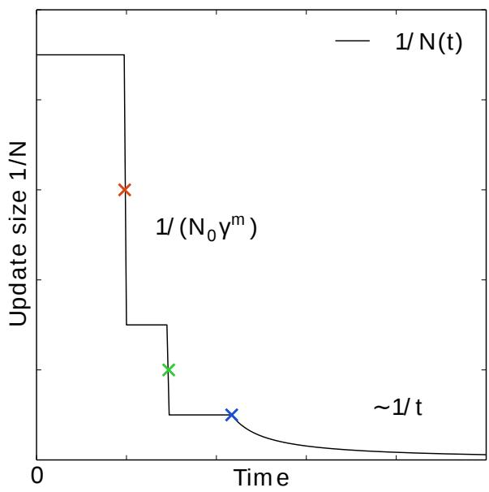  
图 5.39: 在最终阶段，?? 的动力学变得越来越分散。覆盖的时间以 × 表示，具有不同颜色的标记。在这些时刻，自由能更新大小$\sim 1 / N$ ，其中 ?? 为权重直方图的大小，通过对 ?? 使用因子 $\gamma = 3$ 进行缩放。

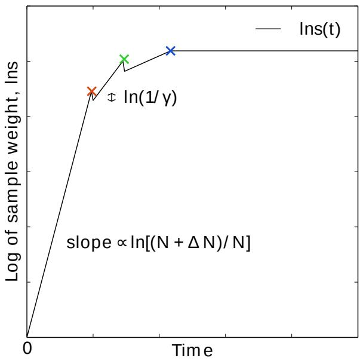  
图 5.40: 在最终阶段，?? 以采样率增长，因此 $1 / N \sim 1 / t _ { \odot }$ 。最终阶段的退出是实时决定的，退出时确保了最终阶段所收集数据的有效样本权重 ?? 超过初始阶段数据的值 (注意绘制的是 ln??(?? )).

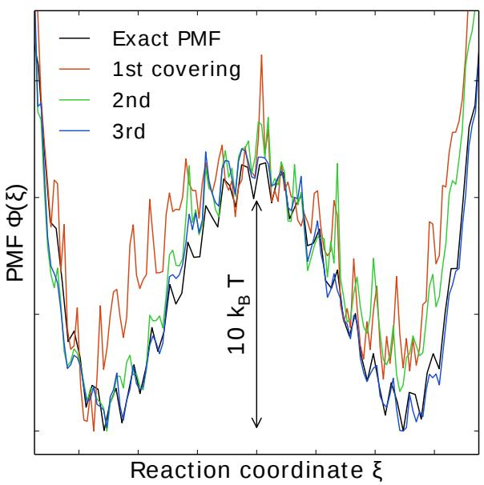  
图 5.41: 从模拟中提取的 PMF 估计值（右下）在退出初始阶段后可以相当准确地给出全局自由能差值。

大，我们后验地选择 $\gamma = 3 _ { \circ }$ 因此，在初始阶段 $N _ { n }$ 动态地设置为 $N _ { n } = \gamma ^ { m } N _ { 0 }$ ，其中 $m$ 为覆盖的数目。  
由于更新大小的尺度为 1/?? (方程 (5.299))，这将导致初始阶段的更新大小接近指数衰减，见 图 5.38。

更新大小直接决定了变化率 $F _ { n } ( \lambda )$ ，因此，根据方程 (5.294)，也决定了偏置函数的变化率 $g _ { n } ( \lambda )$ 。这样，开始时，当 $N _ { n }$ 较小并且更新较大时，波动恒定的偏置势会沿反应坐标驱动系统。如果 $N _ { 0 }$ 设置得足够小，因为更新步长大，第一次过渡通常会很快，并且很快给出自由能的第一个粗略估计。第二个过渡，根据 $N _ { 1 } = \gamma N _ { 0 }$ 进一步细化这个估计。这样，我们并不是使用较小的初始更新步长非常小心地填充自由能的极小值，而是使用各种更新步长来回多次扫描采样区间，请参见 图 5.38。通过这样方式，初始阶段还可以使 AWH 对 $N _ { 0 }$ 的选择具有稳健性。

## 覆盖判据

对多维反应坐标 $\lambda = ( \lambda _ { \mu } )$ 的一般情况，当所有维度都被覆盖后，采样区间 ?? 会被认为是已覆盖的。如果一维采样区间 $I _ { \mu }$ 中的所有点 $\lambda _ { \mu }$ 都被“访问”过，则认为维度 ?? 已被覆盖。最后，一个点 $\lambda _ { \mu } \in I _ { \mu }$ 已被访问意味着，至少有一个点 $\lambda ^ { * } \in I$ 满足 $\lambda _ { \mu } ^ { \ast } = \lambda _ { \mu }$ ，而且自上次覆盖已经累加了对应于多维高斯分布峰值的概率权重

$$
\Delta W ( \lambda ^ { * } ) \geq w _ { \mathrm { p e a k } } \equiv \prod _ { \mu } { \frac { \Delta \lambda _ { \mu } } { \sqrt { 2 \pi } \sigma _ { k } } } .\tag{5.301}
$$

这里， $\Delta \lambda _ { \mu }$ 为离散 $I _ { \mu }$ 的点间距， $\sigma _ { k } = 1 / \sqrt { \beta k _ { \mu } }$ 为高斯宽度 (其中 $k _ { \mu }$ 为力常数)。

## 退出初始阶段

一段时间之后，主要的自由能势垒在很大程度上已被收敛的偏置势平坦化，直方图 $W ( \lambda )$ 应该以实际采样率增长，这时需要退出初始阶段 $1 4 1 _ { \hookrightarrow 5 3 9 \circ }$ 。有多种合理的（后验式）方法来确定何时进行这种转变。一种方法是假定权重直方图中的样本数 $N _ { n }$ 绝不应该超过实际收集的样本数，当不满足此条件时就退出初始阶段 $1 3  { \gamma _ { \scriptscriptstyle \odot \colon \ m > 3 8 \circ } }$ 在初始阶段，?? 接近指数增长，而收集的样本数呈线性增长，因此最终必然会满足退出条件。在这里，基于观察，我们施加了一个退出判据，“人为”地保持 ?? 恒定，同时继续收集样本，这相当于缩小了旧样本相对于新样本的相对权重。类似地，随后对 ?? 按因子 $\gamma$ 进行放大，对应于增大旧数据的权重。简单地说，退出判据是这样的：在初始阶段 之后收集的样本的权重总是大于或等于在初始阶段 期间收集的样本的权重，见 图 5.38。这与缩小早期的噪声数据一致。

下面将详细说明初始阶段的退出判据。在覆盖阶段的开始，?? 刚刚根据 $\gamma$ 进行了缩放并且保持不变。因此，相对于前一覆盖阶段的最后一个样本，这个阶段的第一个样本的权重为 $s = 1 / \gamma$ 。我们假定每次更新收集了 $\Delta N$ 个样本并添加到 $W _ { \textrm { c } }$ 。要保持 ?? 不变，在每次更新后 ?? 需要缩小为原来的 $N / ( N + \Delta N ) _ { \mathfrak { c } }$ 等价地，这意味着新数据相对于旧数据的放大因子为前面因子的倒数。因此，经过 $\Delta n$ 次更新后，新样本的相对权重为 $s = ( 1 / \gamma ) [ ( N _ { n } + \Delta N ) / N _ { n } ] ^ { \Delta n }$ 。现在假定覆盖发生在此时。要继续下一个覆盖阶段，需要使用 $\gamma$ 缩放 ??，这个缩放因子对应于将 ?? 再乘以 $1 / \gamma$ 。如果此时 $s \geq \gamma$ ，则重新缩放后 $s \geq 1 ;$ 即，总体而言，新样本相对于旧样本的相对权重仍在快速增长。如果结果相反， $s < \gamma$ ，这就意味着要退出初始阶段，然后初始阶段结束，从现在起 ?? 只是简单地以采样率增长（参见方程 (5.298)）。要真正确保在退出之前 $s \geq 1$ 保持不变，以便退出后的样本至少具有较旧样本的样本权重，要使用足够数量的更新对最后一个覆盖阶段行扩展。

## 目标分布的选择

传统上，选择的目标分布 $\rho ( \lambda )$ 为均匀分布

$$
\rho _ { \mathrm { c o n s t } } ( \lambda ) = \mathrm { c o n s t . }\tag{5.302}
$$

这一选择以用户定义的采样区间 ?? 完全抹平了 $F ( \lambda ) _ { \mathfrak { c } }$ 。通常， $\rho ( \lambda ) = 0 , \lambda \notin I _ { \circ }$ 在某些情况下，其他选择可能更好。例如，在多维情况下，矩形采样区间可能会包含自由能非常高的区域，例如，那些存在原子

碰撞的地方。要排除这些区域，可以使用以下自由能的函数来指定 $\rho ( \lambda )$

$$
\rho _ { \mathrm { c u t } } ( \lambda ) \propto \frac { 1 } { 1 + e ^ { F ( \lambda ) - F _ { \mathrm { c u t } } } } ,\tag{5.303}
$$

其中 $F _ { \mathrm { c u t } }$ 为一个自由能截断值 (相对于 $\mathrm { m i n } _ { \lambda } F ( \lambda ) )$ 。这样， $F ( \lambda ) > F _ { \mathrm { c u t } }$ 的采样区间对应的区域会以指数方式被抑制（以平滑的方式）。或者，可以避免自由能非常高的区域，同时通过将 Boltzmann 分布的$\beta = 1 / k _ { B } T$ 乘以一个因子 $0 < s _ { \beta } < 1$ 来平坦化更缓和的自由能势垒。

$$
\rho _ { \mathrm { B o l t z } } ( \lambda ) \propto e ^ { - s _ { \beta } F ( \lambda ) } ,\tag{5.304}
$$

参数 $s _ { \beta }$ 决定了自由能形貌的平坦化程度； $s _ { \beta }$ 越小越平坦。请注意， $\rho _ { \mathrm { c u t } } ( \lambda )$ 和 $\rho _ { \mathrm { B o l t z } } ( \lambda )$ 二者都取决于$F ( \lambda )$ ，它需要用当前的最佳估计值 $F _ { n } ( \lambda )$ 来代替。因此，目标分布也会更新（与方程 (5.294) 一致）。实际上，另一种方法也可以获得 $\rho _ { \mathrm { B o l t z } } ( \lambda )$ ，就是将其作为 AWH 的限制目标分布，这特别体现在权重直方图 $W ( \lambda )$ 和目标分布 $\rho$ 的更新方式以及它们之间的相互耦合。这可以得到偏置势的演变，非常类似于良好回火的元动力学 $1 4 \mathcal { Q } _ { \mathrm { \hookrightarrow 5 3 9 } }$ ，详细信息见 $1 3  { \gamma _ { \odot 5 3 8 } }$ 。由于良好回火的元动力学很流行也很成功，这是一个值得考虑的特殊情况。在这种情况下 $\rho$ 是参考权重直方图的函数

$$
\rho _ { \mathrm { B o l t z , l o c } } ( \lambda ) \propto W ( \lambda ) ,\tag{5.305}
$$

权重直方图的更新修正为（参见方程 (5.298)）

$$
W _ { n + 1 } ( \lambda ) = W _ { n } ( \lambda ) + s _ { \beta } \sum _ { t } \omega ( \lambda | x ( t ) ) .\tag{5.306}
$$

因此，这里的权重直方图等于样本的真实历史，但按 $s _ { \beta }$ 进行了缩放。这个目标分布被称为 局部Boltzmann，因为 ?? 仅在进行了采样的局部进行了修正。我们看到，当 $s _ { \beta }$ ≈ 0 时，直方图基本上不会增长，自由能更新的步长将保持不变（如元动力学的原始公式中那样）。因此，自由能估计不会收敛，而是继续围绕正确值波动。这展示了对目标的这种特殊选择，其目标分布和收敛性之间的内在耦合。此外请注意，当使用 $\rho = \rho _ { \mathrm { B o l t z , l o c } }$ 时没有初始阶段（初始阶段 $\cdot 4 7 1$ 一节）。在初始阶段使用的权重直方图重新缩放是全局操作，它与仅取决于采样历史局部的 $\rho _ { \mathrm { B o l t z , l o c } }$ 不兼容。

最后，可以使用任意的概率权重来调节目标分布。

$$
\rho ( \lambda ) = \rho _ { 0 } ( \lambda ) w _ { \mathrm { u s e r } } ( \lambda ) .\tag{5.307}
$$

其中 $w _ { \mathrm { u s e r } } ( \lambda )$ 由用户数据给出，原则上 $\rho _ { 0 } ( \lambda )$ 可以是上面提到的任何一个目标分布。

## 多个独立或共享偏置

可以在一次模拟中施加多个独立的偏置势。只有当偏置坐标 $\xi ^ { ( 1 ) }$ $\xi ^ { ( 2 ) }$ ，… 基本上相互独立地演化时，这种做法才有意义。一个典型例子就是对蛋白质的每个单体施加独立的偏置。此外，多个 AWH 模拟可以并行，每个模拟具有（一组）独立的偏置。

如果定义的采样区间相对于反应坐标的扩散时间较大，按照初始阶段（初始阶段 $\cdot { \hookrightarrow } 4 7 1$ 一节）的要求多次遍历采样区间所需要的模拟时间可能超出所及。在这些情况下，将工作并行化并拥有一组共享单个偏置势的多个“步行器” $\xi ^ { ( i ) } ( t )$ 可能更好。要做到这一点，可以从相同共享组的所有 $\xi ^ { ( i ) }$ 中收集样本，然后汇集到单个直方图中，并更新共同的自由能估计。同一模拟内的各个步行器之间和/或多个模拟之间可以共享样本。但是，目前的代码仅支持模拟之间的共享，模拟中的所有偏置都是独立的。

请注意，当试图通过使用偏置共享步行器来缩短模拟时间时，必须小心确保模拟仍然足够长，以便能正确地探索并平衡采样区间的所有区域。首先，在开始细化自由能之前，一个组中的步行器应该是去相关的，并大致遵从目标分布。这可以通过，比如在增长之前“平衡”共享的权重直方图来实现；例如，$W ( \lambda ) / N \approx \rho ( \lambda )$ 具有一定的容差。

此外，还应一般化初始阶段的“覆盖”或过渡判据，以检测采样区间何时被集中遍历过。一种替代方法是使用与单个步行器相同的判据（但现在有更多的样本），参见方程 (5.301)。然而，与单步行器情况相反，这并不能确保在采样区间内发生任何实际的转换；原则上，所有步行器都可以只进行非常局域地采样，但仍然覆盖整个区间。正如使用标准的伞形采样过程一样，实际模拟中对接近 ?? 值的区域进行采样时，只是对相空间的未相连区域进行采样，自由能可能看起来收敛了。一个有助于避免此类问题的更严格判据是：在一次模拟将沿维度 $\mu$ 的点 $\lambda _ { \mu }$ 标识为已访问之前，将此信息与其他步行器共享，对距此点一定直径 $D _ { \mathrm { c o v e r } }$ 内的所有点（即满足方程 (5.301)）也同样处理。增加 $D _ { \mathrm { c o v e r } }$ 可以提高稳健性，但可能会减慢收敛速度。在 $D _ { \mathrm { c o v e r } }$ 取其最大值也就是采样区间长度的情况下，当至少有一个步行器独立地穿过采样区间时，即认为此采样区间已被覆盖。

## 重新加权和组合偏置数据

在模拟完成后，通常人们可能希望计算无偏 PMF $\Phi ( u )$ ，它是另一个变量 $u ( x )$ 的函数。 $\Phi ( u )$ 可以使用偏置 $\xi$ 的数据进行估计，方法是使用偏置势 $U _ { n ( t ) }$ 对轨迹进行重新加权（“无偏”），参见方程 (5.300)。本质就是将偏置数据沿 ?? 进行分格，并通过将样本权重 $u ( t )$ 除以 $e ^ { - U _ { n ( t ) } ( \xi ( t ) ) }$ 来消除 $U _ { n ( t ) }$ 的影响，

$$
\hat { \Phi } ( u ) = - \ln \sum _ { t } 1 _ { u } ( u ( t ) ) e ^ { U _ { n ( t ) } ( \xi ( t ) } \mathcal { Z } _ { n ( t ) } .\tag{5.308}
$$

其中的指标函数 $1 _ { u }$ 标识了分格过程：若 $u ^ { \prime }$ 落入 ?? 标识的格子中 $\begin{array} { r } { \mathrm { 1 } _ { u } ( u ^ { \prime } ) = 1 } \end{array}$ ，否则为 $0 _ { \circ }$ 。归一化因子$\begin{array} { r } { \mathcal { Z } _ { n } = \int e ^ { - \Phi ( \xi ) - U _ { n } ( \xi ) } d \xi } \end{array}$ 为扩展系综的配分函数。可以看到， ${ \mathcal { Z } } _ { n }$ 依赖于 $\Phi ( \xi )$ ，也就是（有偏）反应坐标?? 的 PMF(由 AWH 模拟计算，并输出到文件)。由于初始阶段的偏置势变化很快，建议在重新加权过程中仅使用最终阶段的数据。如果要包括初始阶段的数据，为保持一致性，应使用初始阶段通过重复重新缩放直方图而得到的样本权重。这样，在任何情况下，初始阶段的样本相对于最终阶段的都会大幅缩小。注意，方程 (5.308) 也可用于组合来自多个模拟的数据（通过对轨迹集合添加另一个加和项）。此外，当多个独立的 AWH 偏差产生了一组 PMF 估计 $\{ \hat { \Phi } ^ { ( i ) } ( \xi ) \}$ 后，可以通过自洽指数平均获得组合的最佳估计Φ(??) ̂ 。关于此过程的更多细节以及方程 (5.308) 的推导（表示方法略有不同）请参见 $1 4 \mathcal { 3 } _ { \hookrightarrow 5 3 9 }$ 。

## 摩擦度量

在 AWH 模拟过程中，会计算时间积分的力相关函数，

$$
\eta _ { \mu \nu } ( \lambda ) = \beta \int _ { 0 } ^ { \infty } \frac { \langle \delta \mathcal { F } _ { \mu } ( x ( t ) , \lambda ) \delta \mathcal { F } _ { \nu } ( x ( 0 ) , \lambda ) \omega ( \lambda | x ( t ) ) \omega ( \lambda | x ( 0 ) ) \rangle } { \langle \omega ^ { 2 } ( \lambda | x ) \rangle } d t .\tag{5.309}
$$

其中 $\mathcal { F } _ { \mu } ( \boldsymbol { x } , \lambda ) = k _ { \mu } ( \xi _ { \mu } ( \boldsymbol { x } ) - \lambda _ { \mu } )$ 为沿维度 $\mu$ 的力，来自中心处于 ?? 的简谐势， $\delta { \mathcal F } _ { \mu } ( x , \lambda ) = { \mathcal F } _ { \mu } ( x , \lambda ) -$ $\langle \mathcal { F } _ { \mu } ( x , \lambda ) \rangle$ 为力的偏差。因子 $\omega ( \lambda | x ( t ) )$ )，见方程 (5.296)，重新加权了样本。 $\eta _ { \mu \nu } ( \lambda )$ 为摩擦张量 $1 4 4 \text{‰}$ 其矩阵元与局部扩散系数成反比。每一 ?? 的采样（无）效率由下式给出

$$
\eta ^ { \frac { 1 } { 2 } } ( \lambda ) = \sqrt { \operatorname* { d e t } { \eta _ { \mu \nu } ( \lambda ) } } .\tag{5.310}
$$

$\eta ^ { \frac { 1 } { 2 } } ( \lambda )$ 值较大时预示着慢的动态过程和长的相关时间，可能需要更多的采样。

## 使用方法

AWH 将数据存储在能量文件 $( \ e d r _ { \ c _ { 4 5 1 } } )$ 中，输出频率由用户设定。数据 - PMF，卷积偏差，?? 和 ?? 坐标的分布，等等。- 在模拟完成后可以使用 $g m x \ a w h _ { \scriptscriptstyle { \hookrightarrow } \scriptscriptstyle { 5 } \scriptscriptstyle { 4 } }$ 工具提取。此外，反应坐标 ??(??) 的轨迹会输出到牵引输出文件 pullx.xvg。日志文件 $( \mathrm { \it { l o g } _ { \mathrm {  4 5 3 } } } )$ 中也包含信息；检查以 awh 开头的消息，它们会告诉你有关覆盖和潜在的采样问题。

## 设置初始更新大小

权重直方图大小的初始值 ?? 设置了初始更新的大小（以及偏置的变化率）。若 ?? 保持不变，如初始阶段一样，对于沿反应坐标的扩散系数 ?? 恒定的简单模型系统，自由能的平均方差为 $\varepsilon ^ { 2 } \sim 1 / ( N D ) ~ \mathit { 1 3 7 } _ { \hookrightarrow 5 3 8 }$ 这是一个粗略的估计，AWH 用它来初始化 ??，但使用考虑一个更有意义的量，

$$
\frac { 1 } { N _ { 0 } } = \frac { 1 } { N _ { 0 } ( \varepsilon _ { 0 } , D ) } \sim D \varepsilon _ { 0 } ^ { 2 } .\tag{5.311}
$$

本质上，这告诉我们，较慢的系统 (?? 较小) 需要更多的样本 $( N _ { 0 }$ 较大) 才能在给定采样率下达到相同的精度 $( \varepsilon _ { 0 } )$ 。相反，对于给定扩散的系统，如何选择初始偏置速率取决于初始精度有多好。初始误差 $\varepsilon _ { \mathrm { 0 } }$ 和扩散系数 ?? 都只需要进行粗略估计或猜测即可。典型情况下，只需要调整 ?? 参数，并使用 $\varepsilon _ { \mathrm { 0 } }$ 的默认值。为提高收敛性，选择的 ?? 应尽可能大（同时能维持系统稳定），这样初始偏置更新更大，初始转换更快。选择的 ?? 太小会导致初始收敛缓慢。最好是先进行一次短时间的测试模拟，并在第一次覆盖后检查 $\mathrm { P M F }$ 估计的最大自由能差。如果得到的值远远大于要跨越的自由能势垒的预期高度，那么对系统的牵引很可能过大，应该减小 $D _ { c }$ 。另一方面，只有在使用相当精确的 PMF 猜测值作为输入启动 AWH 模拟时，才能对 $\varepsilon _ { 0 }$ 进行调整。

## 有效采样的提示

力常数 ?? 应大于 PMF 形貌的曲率。否则，反应坐标 ?? 和参考坐标 ?? 的分布会显著不同，日志文件中也会给出警告。可以选择时间步长能支持的最大的 $k _ { \circ }$ 这将会增加离散化采样区间 ?? 中的点数。但一般而言，不应显著影响模拟的性能，因为在 AWH 更新的实现中只有在自由能更新时才访问采样点。

与任何方法一样，反应坐标的选择至关重要。如果单个反应坐标不够，识别出第二个反应坐标并对二维形貌进行采样可能会有帮助。在这种情况下，可能需要使用具有自由能截断的目标分布（参见方程(5.303)），以避免对自由能非常高的不感兴趣区域进行采样。对于反应坐标维度比 3 或 4 更高的情况，获得精确的自由能通常是不可行的。

检测 ??(??) 跨越采样区间的转换速率也是可取的。要获得可靠的统计（例如当按照重新加权和组合偏置数据 $\div 4 7 6$ 一节所述的方法重新加权轨迹时），通常希望在退出初始阶段后至少观察到几次转换。此外，如果反应坐标的动力学突然改变，可能预示着存在问题，例如反应坐标选择不当。

难以采样的区域也可以通过计算采样区间中的摩擦张量 $\eta _ { \mu \nu } ( \lambda )$ 进行检测，请参阅摩擦度量 $\hookrightarrow 4 7 6$ 一节。  
$\eta _ { \mu \nu } ( \lambda )$ 以及表征采样效率的量 $\eta ^ { \frac { 1 } { 2 } } ( \lambda )$ （方程 (5.310)）会写入能量文件，并可以使用 $g m x \ a w h _ { \scriptscriptstyle { \hookrightarrow } 5 4 }$ 提取。  
$\eta ^ { \frac { 1 } { 2 } } ( \lambda )$ 中的高峰值预示着对区域需要更长的时间才能对其进行正确采样。

## 5.8.6 强制旋转

这个模块可用于强制一组原子进行旋转，例如蛋白质亚基的旋转。可以使用各种不同的旋转势能，其中的复杂旋转势能可以在模拟过程中灵活地调整旋转亚基以及局部旋转轴。一个示例应用见论文 $1 4 5 _ { \hookrightarrow 5 3 9 0 }$

## 固定轴旋转

## 具有各向同性势的固定轴

在固定轴方法中（参见 图 5.42 B），对含 ?? 个原子，其位置为 $\mathbf { x } _ { i }$ 的一组原子（记为“旋转组”），作用于其上的力矩是通过旋转一组参考原子的位置 - 通常是它们的初始位置 $\mathbf { y } _ { i } ^ { 0 }$ - 施加的，旋转以恒定的角速度 $\omega$ 绕着由方向向量 v̂ 和支点 u 定义的轴线进行。为此，利用“虚拟弹簧”势能将每个位置为 $\mathbf { x } _ { i }$ 的原子附着到它的移动参考位置 $\mathbf { y } _ { i } = \Omega ( t ) ( \mathbf { y } _ { i } ^ { 0 } - \mathbf { u } )$ 上，其中 $\Omega ( t )$ 是描述绕轴旋转的矩阵。在最简单的情况下，利用简谐势来描述“弹簧”,

$$
V ^ { \mathrm { i s o } } = \frac { k } { 2 } \sum _ { i = 1 } ^ { N } w _ { i } \left[ \Omega ( t ) ( \mathbf { y } _ { i } ^ { 0 } - \mathbf { u } ) - ( \mathbf { x } _ { i } - \mathbf { u } ) \right] ^ { 2 }\tag{5.312}
$$

## 5.8. 专题

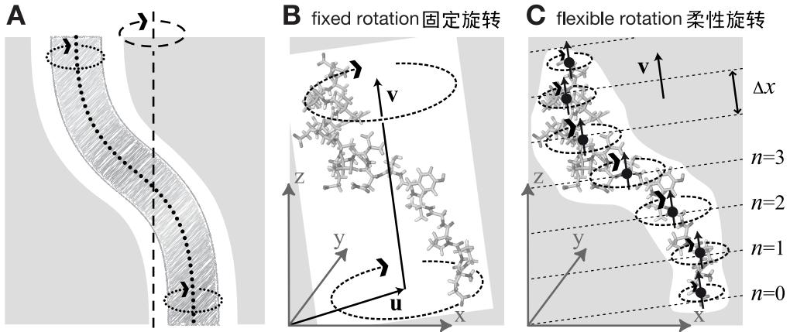

图 5.42: 固定轴旋转和柔性轴旋转的比较。A: 当使用固定旋转轴（虚线）时，旋转白色管状腔内的示意形状会产生假象。说得更真实一点，形状会像轴承（灰色）内部的柔性管道清洁器（虚线）一样旋转。B: 围绕轴 v 的固定旋转，支点由向量 u 指定。C: 将旋转片段细分为板块，每个板块具有单独的旋转轴 (↑) 和支点 (•)，以提高灵活性。索引为 ?? 和 ?? + 1 的两个板块之间的距离为 $\Delta x$

而且具有可选的质量加权前因子 $w _ { i } = N m _ { i } / M$ ，其中总质量 $\begin{array} { r } { M = \sum _ { i = 1 } ^ { N } m _ { i } } \end{array}$ 。旋转矩阵 Ω(??) 为

$$
\Omega ( t ) = \left( \begin{array} { c c c } { \cos \omega t + v _ { x } ^ { 2 } \xi } & { v _ { x } v _ { y } \xi - v _ { z } \sin \omega t } & { v _ { x } v _ { z } \xi + v _ { y } \sin \omega t } \\ { v _ { x } v _ { y } \xi + v _ { z } \sin \omega t } & { \cos \omega t + v _ { y } ^ { 2 } \xi } & { v _ { y } v _ { z } \xi - v _ { x } \sin \omega t } \\ { v _ { x } v _ { z } \xi - v _ { y } \sin \omega t } & { v _ { y } v _ { z } \xi + v _ { x } \sin \omega t } & { \cos \omega t + v _ { z } ^ { 2 } \xi } \end{array} \right)\tag{5.313}
$$

其中 $v _ { x } , \ v _ { y }$ ，和 $v _ { z }$ 为归一化旋转向量 v̂ 的分量， $\xi = 1 - \cos ( \omega t )$ 。如图 5.43 A 所示，对单个原子 ??，旋转矩阵 Ω(??) 作用于 ?? = $t _ { 0 }$ 时刻原子 $j$ 的初始参考位置 ${ \bf y } _ { j } ^ { 0 } = { \bf x } _ { j } ( t _ { 0 } )$ 。在稍后的 ?? 时刻，参考位置已旋转并离开其初始位置（沿蓝色虚线），从而产生力

$$
\mathbf { F } _ { j } ^ { \mathrm { i s o } } = - \nabla _ { j } V ^ { \mathrm { i s o } } = k w _ { j } \left[ \Omega ( t ) ( \mathbf { y } _ { j } ^ { 0 } - \mathbf { u } ) - ( \mathbf { x } _ { j } - \mathbf { u } ) \right]\tag{5.314}
$$

这个力指向参考位置。

## 无支点各向同性势

该势能不使用固定的支点向量 u，而是使用旋转组的质心 $\mathbf { x } _ { c }$ 作为旋转轴的支点，

$$
\mathbf { x } _ { c } = \frac { 1 } { M } \sum _ { i = 1 } ^ { N } m _ { i } \mathbf { x } _ { i } , \mathbf { y } _ { c } ^ { 0 } = \frac { 1 } { M } \sum _ { i = 1 } ^ { N } m _ { i } \mathbf { y } _ { i } ^ { 0 } ,\tag{5.315}
$$

这就得到了“无支点”的各向同性势

$$
V ^ { \mathrm { i s o - p f } } = \frac { k } { 2 } \sum _ { i = 1 } ^ { N } w _ { i } \left[ \Omega ( t ) ( \mathbf { y } _ { i } ^ { 0 } - \mathbf { y } _ { c } ^ { 0 } ) - ( \mathbf { x } _ { i } - \mathbf { x } _ { c } ) \right] ^ { 2 } ,\tag{5.316}
$$

相应的力为

$$
\mathbf { F } _ { j } ^ { \mathrm { i s o - p f } } = k w _ { j } \left[ \Omega ( t ) ( \mathbf { y } _ { j } ^ { 0 } - \mathbf { y } _ { c } ^ { 0 } ) - ( \mathbf { x } _ { j } - \mathbf { x } _ { c } ) \right] .\tag{5.317}
$$

如果不使用质量加权，支点 $\mathbf { x } _ { c }$ 为组的几何中心。

A V iso  
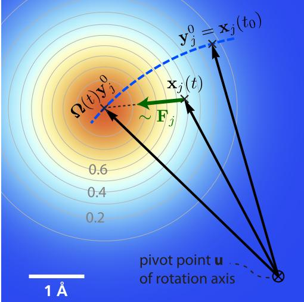  
B

V rm, V flex  
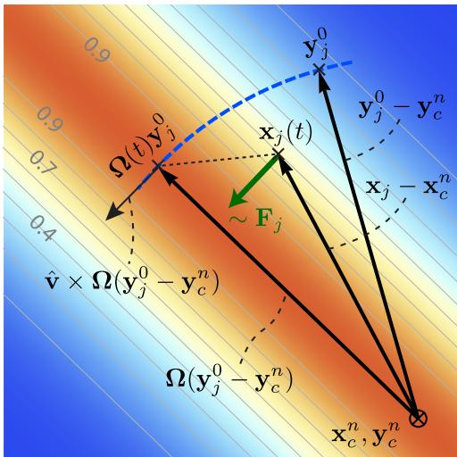

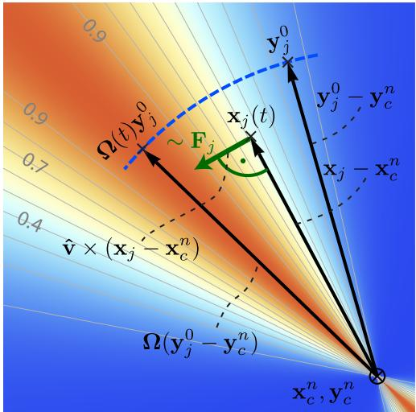  
V rm2, V flex2 (  = 0 nm2)

D  
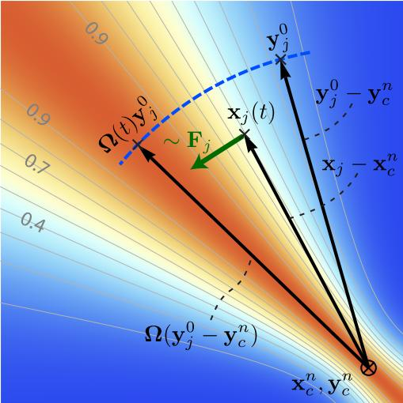  
V rm2, V flex2 (  = 0.01 nm2 )  
图 5.43: 不同的旋转势以及符号定义。对位于 $\mathbf { x } _ { j } ( t )$ 的原子显示了所有的四个势能函数 ?? （彩色编码）。A: 各向同性势 $V ^ { \mathrm { i s o } }$ ，B: 径向运动势 $V ^ { \mathrm { { r m } } }$ 和柔性势 ??flex，C-D: 二型径向运动势 $V ^ { \mathrm { { r m 2 } } }$ 和二型柔性势 $V ^ { \mathrm { f l e x 2 } }$ ，其中 $\epsilon ^ { \prime } { = } 0 \ \mathrm { n m ^ { 2 } \ ( C ) }$ , $\epsilon ^ { \prime } { = } 0 . 0 1 \ \mathrm { n m ^ { 2 } }$ (D)。旋转轴垂直于平面并标记为 ⊗。浅灰色等值线表示 $\mathbf { x } _ { j }$ 平面内的 Boltzmann因子，其中 $T = 3 0 0 ~ \mathrm { K }$ ， $k { = } 2 0 0 \ \mathrm { k J / ( m o l \cdot n m ^ { 2 } ) }$ 。绿色箭头显示了作用于原子 $j$ 上的力 $\mathbf { F } _ { j }$ 的方向；蓝色虚线表示参考位置的运动。

## 平行运动势的变体

由各向同性势产生的力（方程。(5.312) 和 (5.316)）还含有平行于旋转轴的分量，从而限制了沿整个旋转组轴线 $( \vec { \sf x } \mathrm { ! } \ V ^ { \mathrm { i s o } } )$ 或旋转组内部轴线 (对 $V ^ { \mathrm { i s o - p f } } )$ 的运动。

如果不愿意限制沿轴线的运动，可以使用我们实现的“平行运动”的一种变体形式，它消除了势能平行于旋转轴的所有分量。这种方通过将参考位置和实际位置之间的距离向量

$$
\mathbf { r } _ { i } = \Omega ( t ) ( \mathbf { y } _ { i } ^ { 0 } - \mathbf { u } ) - ( \mathbf { x } _ { i } - \mathbf { u } )\tag{5.318}
$$

投影到垂直于旋转向量的平面上，

$$
\mathbf { r } _ { i } ^ { \perp } : = \mathbf { r } _ { i } - ( \mathbf { r } _ { i } \cdot \hat { \mathbf { v } } ) \hat { \mathbf { v } }\tag{5.319}
$$

得到

$$
\begin{array} { r l r } { V ^ { \mathrm { p m } } = } & { } & { \displaystyle \frac { k } { 2 } \sum _ { i = 1 } ^ { N } w _ { i } ( { \bf r } _ { i } ^ { \perp } ) ^ { 2 } } \\ { = } & { } & { \displaystyle \frac { k } { 2 } \sum _ { i = 1 } ^ { N } w _ { i } \left\{ \Omega ( t ) ( { \bf y } _ { i } ^ { 0 } - { \bf u } ) - ( { \bf x } _ { i } - { \bf u } ) \right. } \\ & { } & { \displaystyle \left. - \left\{ \left[ \Omega ( t ) ( { \bf y } _ { i } ^ { 0 } - { \bf u } ) - ( { \bf x } _ { i } - { \bf u } ) \right] \cdot \hat { \bf v } \right\} \hat { \bf v } \right\} ^ { 2 } } \end{array}
$$

同样的

$$
\mathbf { F } _ { j } ^ { \mathrm { p m } } = k w _ { j } \mathbf { r } _ { j } ^ { \perp }\tag{5.320}
$$

无支点的平行运动势

将方程 (5.320) 中的固定支点 u 替换为质心 $\mathbf { x _ { c } }$ 就得到了平行运动势的无支点变体形式。对

$$
{ \bf s } _ { i } = \Omega ( t ) ( { \bf y } _ { i } ^ { 0 } - { \bf y } _ { c } ^ { 0 } ) - ( { \bf x } _ { i } - { \bf x } _ { c } )\tag{5.321}
$$

各自的势能和力为

$$
V ^ { \mathrm { p m - p f } } = \quad \frac { k } { 2 } \sum _ { i = 1 } ^ { N } w _ { i } ( \mathbf { s } _ { i } ^ { \perp } ) ^ { 2 }\tag{5.322}
$$

$$
\begin{array} { r l } { \mathbf { F } _ { j } ^ { \mathrm { p m - p f } } = } & { { } k w _ { j } \mathbf { s } _ { j } ^ { \scriptscriptstyle \perp } } \end{array}\tag{5.323}
$$

径向运动势

在上述变体形式中，旋转势能的最小点或者位于参考位置 $\mathbf { y } _ { i }$ 的单个点上（对于各向同性势），或者位于通过 $\mathbf { y } _ { i }$ 平行于旋转轴的一条线上（对于平行运动势）。结果，径向力限制了原子的径向运动。接下来的两类旋转势， $V ^ { \mathrm { { r m } } }$ 和 $V ^ { \mathrm { { r m 2 } } }$ 大大减小甚至消除了这种影响。第一类变体势 $V ^ { \mathrm { { r m } } }$ (图 5.43 B) 消除了平行于连接参考原子和旋转轴的向量的力的所有分量，

$$
V ^ { \mathrm { r m } } = \frac { k } { 2 } \sum _ { i = 1 } ^ { N } w _ { i } \left[ \mathbf { p } _ { i } \cdot \left( \mathbf { x } _ { i } - \mathbf { u } \right) \right] ^ { 2 } ,\tag{5.324}
$$

其中

$$
{ \bf p } _ { i } = \frac { \hat { \bf v } \times \Omega ( t ) ( { \bf y } _ { i } ^ { 0 } - { \bf u } ) } { \lVert \hat { \bf v } \times \Omega ( t ) ( { \bf y } _ { i } ^ { 0 } - { \bf u } ) \rVert } \mathrm { ~ . ~ }\tag{5.325}
$$

该变体只取决于距离 $\mathbf { p } _ { i } \cdot \left( \mathbf { x } _ { i } - \mathbf { u } \right)$ ，这一距离是原子 ?? 到由 v̂ 和 $\Omega ( t ) ( \mathbf { y } _ { i } ^ { 0 } - \mathbf { u } )$ 张成的平面的距离。由此产生的力为

$$
\mathbf { F } _ { j } ^ { \mathrm { r m } } = - k w _ { j } \left[ \mathbf { p } _ { j } \cdot ( \mathbf { x } _ { j } - \mathbf { u } ) \right] \mathbf { p } _ { j } .\tag{5.326}
$$

无支点的径向运动势

类似于无支点的各向同性势，我们可以得到上述势能的无支点形式。对

$$
\mathbf { q } _ { i } = \frac { \hat { \mathbf { v } } \times \Omega ( t ) ( \mathbf { y } _ { i } ^ { 0 } - \mathbf { y } _ { c } ^ { 0 } ) } { \lVert \hat { \mathbf { v } } \times \Omega ( t ) ( \mathbf { y } _ { i } ^ { 0 } - \mathbf { y } _ { c } ^ { 0 } ) \rVert } ,\tag{5.327}
$$

这种径向运动势的无支点变体形式，势能和力为

$$
V ^ { \mathrm { r m - p f } } = \quad \frac { k } { 2 } \sum _ { i = 1 } ^ { N } w _ { i } \left[ \mathbf { q } _ { i } \cdot ( \mathbf { x } _ { i } - \mathbf { x } _ { c } ) \right] ^ { 2 } ,\tag{5.328}
$$

$$
\mathbf { F } _ { j } ^ { \mathrm { r m - p f } } = - k w _ { j } \left[ \mathbf { q } _ { j } \cdot ( \mathbf { x } _ { j } - \mathbf { x } _ { c } ) \right] \mathbf { q } _ { j } + k \frac { m _ { j } } { M } \sum _ { i = 1 } ^ { N } w _ { i } \left[ \mathbf { q } _ { i } \cdot ( \mathbf { x } _ { i } - \mathbf { x } _ { c } ) \right] \mathbf { q } _ { i } .\tag{5.329}
$$

## 二型径向运动势

如图 5.43 B 所示，由 $V ^ { \mathrm { { r m } } }$ 产生的力仍然包含小的二阶径向分量。在大多数情况下，这种扰动可以容忍；如果不能容忍，可以使用备选的势能函数 $V ^ { \mathrm { { r m 2 } } }$ ，它完全消除了径向部分对力的贡献，如图 5.43 C所示，

$$
V ^ { \mathrm { r m 2 } } = \frac { k } { 2 } \sum _ { i = 1 } ^ { N } w _ { i } \frac { \left[ ( \hat { \mathbf { v } } \times ( \mathbf { x } _ { i } - \mathbf { u } ) ) \cdot \boldsymbol { \Omega } ( t ) ( \mathbf { y } _ { i } ^ { 0 } - \mathbf { u } ) \right] ^ { 2 } } { \| \hat { \mathbf { v } } \times ( \mathbf { x } _ { i } - \mathbf { u } ) \| ^ { 2 } + \epsilon ^ { \prime } } ,\tag{5.330}
$$

其中引入了小参数 $\epsilon ^ { \prime }$ 以避免奇异性。对 $\epsilon ^ { \prime } { = } 0 \ \mathrm { n m ^ { 2 } }$ ，等势能平面由 $\mathbf x _ { i } - \mathbf u$ 和 v̂ 张成，得到的力垂直于$\mathbf x _ { i } - \mathbf u$ ，因此不会收缩或扩展远离旋转轴或朝向旋转轴运行的结构部分。

在方程 (5.330) 的分母中使用一个小的正数 $\epsilon ^ { \prime }$ (例如 $\epsilon ^ { \prime } { = } 0 . 0 1 ~ \mathrm { n m ^ { 2 } }$ ，图 5.43 D) 会得到一个定义良好的势能函数，并且连续的力也接近旋转轴，但 $\epsilon ^ { \prime } { = } 0 \ \mathrm { n m ^ { 2 } }$ 时（图 5.43 C）情况并非如此。对

$$
\begin{array} { r l r } { \mathbf { r } _ { i } = } & { } & { \Omega ( t ) ( \mathbf { y } _ { i } ^ { 0 } - \mathbf { u } ) } \\ { \mathbf { s } _ { i } = } & { } & { \frac { \hat { \mathbf { v } } \times ( \mathbf { x } _ { i } - \mathbf { u } ) } { \Vert \hat { \mathbf { v } } \times ( \mathbf { x } _ { i } - \mathbf { u } ) \Vert } \equiv \Psi _ { i } \ \hat { \mathbf { v } } \times ( \mathbf { x } _ { i } - \mathbf { u } ) } \\ { \Psi _ { i } ^ { * } = } & { } & { \frac { 1 } { \Vert \hat { \mathbf { v } } \times ( \mathbf { x } _ { i } - \mathbf { u } ) \Vert ^ { 2 } + \epsilon ^ { \prime } } } \end{array}\tag{5.331}
$$

作用在原子 ?? 上的力为

$$
\mathbf { F } _ { j } ^ { \mathrm { r m 2 } } = - k \left\{ w _ { j } ( \mathbf { s } _ { j } \cdot \mathbf { r } _ { j } ) \left[ \frac { \Psi _ { j } ^ { * } } { \Psi _ { j } } \mathbf { r } _ { j } - \frac { \Psi _ { j } ^ { * 2 } } { \Psi _ { j } ^ { 3 } } ( \mathbf { s } _ { j } \cdot \mathbf { r } _ { j } ) \mathbf { s } _ { j } \right] \right\} \times \hat { \mathbf { v } } .\tag{5.332}
$$

## 二型无支点径向运动势

上述势能函数的无支点变体形式为

$$
V ^ { \mathrm { r m 2 - p f } } = \frac { k } { 2 } \sum _ { i = 1 } ^ { N } w _ { i } \frac { \left[ ( \hat { \mathbf { v } } \times ( \mathbf { x } _ { i } - \mathbf { x } _ { c } ) ) \cdot \boldsymbol { \Omega } ( t ) ( \mathbf { y } _ { i } ^ { 0 } - \mathbf { y } _ { c } ) \right] ^ { 2 } } { \| \hat { \mathbf { v } } \times ( \mathbf { x } _ { i } - \mathbf { x } _ { c } ) \| ^ { 2 } + \epsilon ^ { \prime } } .\tag{5.333}
$$

对

$$
\begin{array} { r l r } { \mathbf { r } _ { i } = } & { } & { \Omega ( t ) ( \mathbf { y } _ { i } ^ { 0 } - \mathbf { y } _ { c } ) } \\ { \mathbf { s } _ { i } = } & { \frac { \hat { \mathbf { v } } \times \left( \mathbf { x } _ { i } - \mathbf { x } _ { c } \right) } { \left\| \hat { \mathbf { v } } \times \left( \mathbf { x } _ { i } - \mathbf { x } _ { c } \right) \right\| } \equiv \Psi _ { i } \hat { \mathbf { v } } \times ( \mathbf { x } _ { i } - \mathbf { x } _ { c } ) } \\ { \Psi _ { i } ^ { * } = } & { } & { \frac { 1 } { \left\| \hat { \mathbf { v } } \times ( \mathbf { x } _ { i } - \mathbf { x } _ { c } ) \right\| ^ { 2 } + \epsilon ^ { \prime } } } \end{array}\tag{5.334}
$$

作用在原子 $j$ 上的力为

$$
\begin{array} { r l r } { \mathrm { \bf ~ F } _ { j } ^ { \mathrm { r m 2 - p f } } = } & { } & { - k \left\{ w _ { j } ( { \bf s } _ { j } \cdot { \bf r } _ { j } ) \left[ \frac { \Psi _ { j } ^ { * } } { \Psi _ { j } } { \bf r } _ { j } - \frac { \Psi _ { j } ^ { * 2 } } { \Psi _ { j } ^ { 3 } } ( { \bf s } _ { j } \cdot { \bf r } _ { j } ) { \bf s } _ { j } \right] \right\} \times \hat { \bf v } } \\ & { } & { + k \frac { m _ { j } } { M } \left\{ \displaystyle \sum _ { i = 1 } ^ { N } w _ { i } ( { \bf s } _ { i } \cdot { \bf r } _ { i } ) \left[ \frac { \Psi _ { i } ^ { * } } { \Psi _ { i } } { \bf r } _ { i } - \frac { \Psi _ { i } ^ { * 2 } } { \Psi _ { i } ^ { 3 } } ( { \bf s } _ { i } \cdot { \bf r } _ { i } ) { \bf s } _ { i } \right] \right\} \times \hat { \bf v } . } \end{array}
$$

## 柔性轴旋转

如 图 5.42 所示，固定轴旋转方案的刚体行为对许多应用而言是一个缺点。特别地，当平衡原子的位置直接依赖于参考位置时，旋转组的变形会被抑制。为避免这个限制，现在将方程 (5.328) 和 (5.333) 推广到的“柔性轴”，如图 5.42 C 所示。具体实现方法是，将旋转组划分为一系列等间距的板块，每个板块垂直于旋转向量，并对每个板块施加单独的旋转势能。图 5.42 C 中的点线表示板块的平分面，大的黑点表示板块的中心。

为避免势能和力的不连续性，我们定义了“软板块”，根据每个板块 ?? 对总势能函数 $V ^ { \mathrm { f l e x } }$ 的贡献进行加权，加权时使用高斯函数

$$
g _ { n } ( \mathbf { x } _ { i } ) = \Gamma \exp \left( - \frac { \beta _ { n } ^ { 2 } ( \mathbf { x } _ { i } ) } { 2 \sigma ^ { 2 } } \right) ,\tag{5.335}
$$

高斯函数的中心位于第 ?? 个板块的中分面 $\mathrm { { \perp } } { \circ }$ 这里的 $\sigma$ 为高斯函数的宽度， $\Delta x$ 为相邻板块间的距离，

$$
\beta _ { n } ( \mathbf { x } _ { i } ) : = \mathbf { x } _ { i } \cdot \hat { \mathbf { v } } - n \Delta x .\tag{5.336}
$$

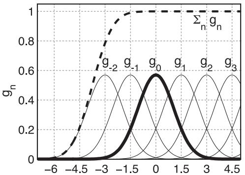  
orthogonal distance to slab 0 midplane (nm)

图 5.44: 中心位于 $n \Delta x$ 的高斯函数 ?? ，其中板块间距 $g _ { n }$ $\Delta x = 1 . 5$ nm, ?? $\geq - 2$ 。高斯函数 $g _ { 0 }$ 以粗线突出显示；虚线表示所示高斯函数的总和。

最方便的选择是 $\sigma = 0 . 7 \Delta x$ ，并且

$$
1 / \Gamma = \sum _ { n \in Z } \exp \left( - \frac { ( n - \frac { 1 } { 4 } ) ^ { 2 } } { 2 \cdot 0 . 7 ^ { 2 } } \right) \approx 1 . 7 5 4 6 4 ,\tag{5.337}
$$

这样得到的总和几乎是不变的，基本上与 $\mathbf { x } _ { i }$ 无关（图 5.44 中虚线所示），即，

$$
\sum _ { n \in Z } g _ { n } ( \mathbf { x } _ { i } ) = 1 + \epsilon ( \mathbf { x } _ { i } ) ,\tag{5.338}
$$

其中 $| \epsilon ( \mathbf { x } _ { i } ) | < 1 . 3 \cdot 1 0 ^ { - 4 } \circ$ 这一选择还意味着，各板块对力的单独贡献加起来等于 1，因此不再需要进一步的归一化。

对每个板块中心 $\mathbf { x } _ { c } ^ { n }$ ，每个原子的贡献来自其高斯加权（也可选择使用质量加权）的位置向量 $g _ { n } ( \mathbf { x } _ { i } ) \mathbf { x } _ { i } .$ 瞬时板块中心 $\mathbf { x } _ { c } ^ { n }$ 根据当前位置 $\mathbf { x } _ { i }$ 进行计算

$$
\mathbf { x } _ { c } ^ { n } = \frac { \sum _ { i = 1 } ^ { N } g _ { n } ( \mathbf { x } _ { i } ) m _ { i } \mathbf { x } _ { i } } { \sum _ { i = 1 } ^ { N } g _ { n } ( \mathbf { x } _ { i } ) m _ { i } } ,\tag{5.339}
$$

而参考中心 $\mathbf { y } _ { c } ^ { n }$ 根据参考位置 $\mathbf { y } _ { i } ^ { 0 }$ 进行计算

$$
{ \bf y } _ { c } ^ { n } = \frac { \sum _ { i = 1 } ^ { N } g _ { n } ( { \bf y } _ { i } ^ { 0 } ) m _ { i } { \bf y } _ { i } ^ { 0 } } { \sum _ { i = 1 } ^ { N } g _ { n } ( { \bf y } _ { i } ^ { 0 } ) m _ { i } } .\tag{5.340}
$$

由于 $g _ { n }$ 衰减很快，每个板块基本上只涉及距其中心 ≈ 3Δ?? 范围内的原子的贡献。

## 柔性轴势

我们考虑两种柔性轴的变体形式。在第一种变体中，将高斯加权的板块划分过程应用到径向运动势中（方程 (5.328)/图 5.43 B），得到板块 ?? 的贡献

$$
V ^ { n } = \frac { k } { 2 } \sum _ { i = 1 } ^ { N } w _ { i } g _ { n } ( \mathbf { x } _ { i } ) \left[ \mathbf { q } _ { i } ^ { n } \cdot ( \mathbf { x } _ { i } - \mathbf { x } _ { c } ^ { n } ) \right] ^ { 2 } ,\tag{5.341}
$$

总的势能函数

$$
V ^ { \mathrm { f l e x } } = \sum _ { n } V ^ { n } .\tag{5.342}
$$

注意，方程 (5.328) 中使用的全局质心 $\mathbf { x } _ { c }$ 现在被替换为 $\mathbf { x } _ { c } ^ { n }$ ，板块的质心。对

$$
\begin{array} { r l r } { \mathbf { q } _ { i } ^ { n } = } & { { } } & { \hat { \mathbf { v } } \times \boldsymbol { \Omega } ( t ) ( \mathbf { y } _ { i } ^ { 0 } - \mathbf { y } _ { c } ^ { n } ) } \\ & { { } } & { \| \hat { \mathbf { v } } \times \boldsymbol { \Omega } ( t ) ( \mathbf { y } _ { i } ^ { 0 } - \mathbf { y } _ { c } ^ { n } ) \| } \\ { b _ { i } ^ { n } = } & { { } } & { \mathbf { q } _ { i } ^ { n } \cdot ( \mathbf { x } _ { i } - \mathbf { x } _ { c } ^ { n } ) , } \end{array}\tag{5.343}
$$

作用在原子 ?? 上的力为

$$
\begin{array} { r l r } { \mathbf { F } _ { j } ^ { \mathrm { f l e x } } = } & { } & { - k w _ { j } \displaystyle \sum _ { n } g _ { n } ( \mathbf { x } _ { j } ) b _ { j } ^ { n } \left\{ \mathbf { q } _ { j } ^ { n } - b _ { j } ^ { n } \frac { \beta _ { n } ( \mathbf { x } _ { j } ) } { 2 \sigma ^ { 2 } } \hat { \mathbf { v } } \right\} } \\ & { } & { + k { m _ { j } } \displaystyle \sum _ { n } \frac { g _ { n } ( \mathbf { x } _ { j } ) } { \sum _ { h } g _ { n } ( \mathbf { x } _ { h } ) } \sum _ { i = 1 } ^ { N } { w _ { i } g _ { n } ( \mathbf { x } _ { i } ) b _ { i } ^ { n } \left\{ \mathbf { q } _ { i } ^ { n } - \frac { \beta _ { n } ( \mathbf { x } _ { j } ) } { \sigma ^ { 2 } } \left[ \mathbf { q } _ { i } ^ { n } \cdot ( \mathbf { x } _ { j } - \mathbf { x } _ { c } ^ { n } ) \right] \hat { \mathbf { v } } \right\} } . } \end{array}
$$

注意，对如上定义的 $V ^ { \mathrm { f l e x } }$ ，板块在空间中是固定的，参考中心 $\mathbf { y } _ { c } ^ { n }$ 也一样。如果在模拟过程中，旋转组在 v 方向移动得过远，它可能会进入一个区域，在这个区域中由于缺少邻近的参考位置而无法定义参考板块的中心，这样就无法对势能进行计算。因此，对这种势能，我们给出了一个略加修改的版本。具体做法是将板块 $n = 0$ 的中分面附着到旋转组的质心，这样得到的板块会与旋转组一起移动，从而避免了前面所说的问题。这是通过从位置中减去组的质心 $\mathbf { x } _ { c }$ 来实现的，

$$
\tilde { \mathbf { x } } _ { i } = \mathbf { x } _ { i } - \mathbf { x } _ { c } , \qquad \tilde { \mathbf { y } } _ { i } ^ { 0 } = \mathbf { y } _ { i } ^ { 0 } - \mathbf { y } _ { c } ^ { 0 }\tag{5.344}
$$

这样

$$
V ^ { \mathrm { f l e x - t } } = \ \frac { k } { 2 } \sum _ { n } \sum _ { i = 1 } ^ { N } w _ { i } g _ { n } ( \tilde { \mathbf { x } } _ { i } ) \left[ \frac { \hat { \mathbf { v } } \times \boldsymbol { \Omega } ( t ) ( \tilde { \mathbf { y } } _ { i } ^ { 0 } - \tilde { \mathbf { y } } _ { c } ^ { n } ) } { \lVert \hat { \mathbf { v } } \times \boldsymbol { \Omega } ( t ) ( \tilde { \mathbf { y } } _ { i } ^ { 0 } - \tilde { \mathbf { y } } _ { c } ^ { n } ) \rVert } \cdot ( \tilde { \mathbf { x } } _ { i } - \tilde { \mathbf { x } } _ { c } ^ { n } ) \right] ^ { 2 } .\tag{5.345}
$$

为了简化力的推导，并提高效率，这里假设 $\mathbf { x } _ { c }$ 为常量，因此 $\partial \mathbf { x } _ { c } / \partial x = \partial \mathbf { x } _ { c } / \partial y = \partial \mathbf { x } _ { c } / \partial z = 0 ,$ 。这样得到的力误差很小 (数量级为 $O ( 1 / N )$ ，如果使用质量加权数量级为 $O ( m _ { j } / M ) )$ ，因此可以忽略。利用这一假定，力 $\mathbf { F } ^ { \mathrm { f l e x - t } }$ 与方程 (5.344) 具有相同的形式。

## 二型柔性轴势

第二种变体是将势 $V ^ { \mathrm { { r m 2 } } }$ （方程 (5.333)）用于划分的板块，得到无径向力贡献的柔性轴势（图 5.43 C）

$$
V ^ { \mathrm { f l e x 2 } } = \frac { k } { 2 } \sum _ { i = 1 } ^ { N } \sum _ { n } w _ { i } g _ { n } ( \mathbf { x } _ { i } ) \frac { \big [ ( \hat { \mathbf { v } } \times ( \mathbf { x } _ { i } - \mathbf { x } _ { c } ^ { n } ) ) \cdot \boldsymbol { \Omega } ( t ) ( \mathbf { y } _ { i } ^ { 0 } - \mathbf { y } _ { c } ^ { n } ) \big ] ^ { 2 } } { \| \hat { \mathbf { v } } \times ( \mathbf { x } _ { i } - \mathbf { x } _ { c } ^ { n } ) \| ^ { 2 } + \epsilon ^ { \prime } }\tag{5.346}
$$

对

$$
\begin{array} { r l r } { \mathbf { r } _ { i } ^ { n } = } & { } & { \Omega ( t ) ( \mathbf { y } _ { i } ^ { 0 } - \mathbf { y } _ { c } ^ { n } ) } \\ { \mathbf { s } _ { i } ^ { n } = } & { } & { \frac { \hat { \mathbf { v } } \times \left( \mathbf { x } _ { i } - \mathbf { x } _ { c } ^ { n } \right) } { \left\| \hat { \mathbf { v } } \times \left( \mathbf { x } _ { i } - \mathbf { x } _ { c } ^ { n } \right) \right\| } \equiv ~ \psi _ { i } ~ \hat { \mathbf { v } } \times ( \mathbf { x } _ { i } - \mathbf { x } _ { c } ^ { n } ) } \\ { \psi _ { i } ^ { * } = } & { } & { \frac { 1 } { \left\| \hat { \mathbf { v } } \times \left( \mathbf { x } _ { i } - \mathbf { x } _ { c } ^ { n } \right) \right\| ^ { 2 } + \epsilon ^ { \prime } } } \\ { \mathbf { W } _ { j } ^ { n } = } & { } & { \frac { g _ { n } ( \mathbf { x } _ { j } ) ~ m _ { j } } { \sum _ { h } g _ { n } ( \mathbf { x } _ { h } ) ~ m _ { h } } } \\ { \mathbf { S } ^ { n } = } & { } & { \frac { N } { \sum _ { i = 1 } ^ { N } \left( g _ { n } ( \mathbf { x } _ { i } ) ~ \mathbf { s } ^ { n } \right) } } \\ { \mathbf { S } ^ { n } = } & { } & { \frac { N } { \left\| \hat { \mathbf { v } } \times \left( \mathbf { x } _ { i } - \mathbf { x } _ { i } ^ { n } \right) \right\| } \left[ \frac { \psi _ { i } ^ { n } } { \psi _ { i } } \mathbf { r } _ { i } ^ { n } - \frac { \psi _ { i } ^ { n } } { \psi _ { i } ^ { n } } ( \mathbf { s } _ { i } ^ { n } \cdot \mathbf { r } _ { i } ^ { n } ) \mathbf { s } _ { i } ^ { n } \right] } \end{array}\tag{5.347}
$$

作用在原子 $j$ 上的力为

$$
\begin{array} { r l r } { \mathbf { F } _ { j } ^ { \mathrm { f l e x 2 } } = } & { - k } & { \left\{ \displaystyle \sum _ { n } w _ { j } g _ { n } ( \mathbf { x } _ { j } ) \ ( \mathbf { s } _ { j } ^ { n } \cdot \mathbf { r } _ { j } ^ { n } ) \ \left[ \frac { \psi _ { j } ^ { * } } { \psi _ { j } } \mathbf { r } _ { j } ^ { n } - \frac { \psi _ { j } ^ { * 2 } } { \psi _ { j } ^ { 3 } } ( \mathbf { s } _ { j } ^ { n } \cdot \mathbf { r } _ { j } ^ { n } ) \ \mathbf { s } _ { j } ^ { n } \right] \right\} \times \hat { \mathbf { v } } } \\ & { } & { + k \left\{ \displaystyle \sum _ { n } W _ { j } ^ { n } \mathbf { S } ^ { n } \right\} \times \hat { \mathbf { v } } - k \left\{ \displaystyle \sum _ { n } W _ { j } ^ { n } \ \frac { \beta _ { n } ( \mathbf { x } _ { j } ) } { \sigma ^ { 2 } } \frac { 1 } { \psi _ { j } } \ \mathbf { s } _ { j } ^ { n } \cdot \mathbf { S } ^ { n } \right\} \hat { \mathbf { v } } } \\ & { } & { + \displaystyle \frac { k } { 2 } \left\{ \sum _ { n } w _ { j } g _ { n } ( \mathbf { x } _ { j } ) \frac { \beta _ { n } ( \mathbf { x } _ { j } ) } { \sigma ^ { 2 } } \frac { \psi _ { j } ^ { * } } { \psi _ { j } ^ { 2 } } ( \mathbf { s } _ { j } ^ { n } \cdot \mathbf { r } _ { j } ^ { n } ) ^ { 2 } \right\} \hat { \mathbf { v } } . } \end{array}
$$

应用变换 (5.344) 可得到二型柔性势“耐平动”的形式， $V ^ { \mathrm { f l e x 2 - t } } \circ$ 同样，假定 $\partial \mathbf { x } _ { c } / \partial x , \ \partial \mathbf { x } _ { c } / \partial y , \ \partial \mathbf { x } _ { c } / \partial z$ 很小，得到 $V ^ { \mathrm { f l e x 2 - t } }$ 和 $\mathbf { F } ^ { \mathrm { f l e x 2 - t } }$ 的方程类似于 $V ^ { \mathrm { f l e x 2 } }$ 和 $\mathbf { F } ^ { \mathrm { f l e x 2 } }$ 。

## 使用方法

要应用强制旋转，可通过 $m d p _ { \hookrightarrow 4 5 4 }$ 输入文件中的 rot-group0，rot-group1 等索引组定义受到旋转势作用的粒子 $i _ { \circ }$ 。参考位置 $\mathbf { y } _ { i } ^ { 0 }$ 从提供给 $g r o m p p _ {  1 0 8 }$ 的一个特殊 $t r r _ { \hookrightarrow 4 6 1 }$ 文件中读取。如果找不到这样的文件，会使用 $\mathbf { x } _ { i } ( t = 0 )$ 作为参考位置并写 $\lambda t r r _ { \hookrightarrow 4 6 1 }$ ，以便它们可用于后续设置。势能的所有参数，如 ??， $\epsilon ^ { \prime }$ 等（表 5.16）由 $m d p _ { \hookrightarrow 4 5 4 }$ 中的参数提供；rot-type 选择势能的类型。选项 rot-massw 选择是否使用质量加权平均。对柔性势，截断值 ${ g _ { n } ^ { \mathrm { m i n } } }$ (通常 $g _ { n } ^ { \mathrm { m i n } } = 0 . 0 0 1 )$ 可确保只计算对 ?? 和 F 有显著贡献的部分，即忽略那些 $g _ { n } ( \mathbf { x } ) < g _ { n } ^ { \mathrm { m i n } }$ 的项。表 5.17 总结了写入到附加输出文件中的一些量，如下所述。

表 5.16: 各种旋转势所用的参数。x 表示对给定的势能实际使用的参数
<table><tr><td rowspan=1 colspan=3>参数</td><td rowspan=1 colspan=1> $k$ </td><td rowspan=1 colspan=1>√$</td><td rowspan=1 colspan=1>u</td><td rowspan=1 colspan=1>ω</td><td rowspan=1 colspan=1> $\epsilon ^ { \prime }$ </td><td rowspan=1 colspan=1> $\Delta x$ </td><td rowspan=1 colspan=1> ${ g _ { n } ^ { \mathrm { m i n } } }$ </td></tr><tr><td rowspan=1 colspan=3> $m d p _ { \hookrightarrow 4 5 4 }$ 输入中的变量名</td><td rowspan=1 colspan=1>k</td><td rowspan=1 colspan=1>vec</td><td rowspan=1 colspan=1>pivot</td><td rowspan=1 colspan=1>rate</td><td rowspan=1 colspan=1>eps</td><td rowspan=1 colspan=1>slab-dist</td><td rowspan=1 colspan=1>min-gauss</td></tr><tr><td rowspan=1 colspan=3>单位</td><td rowspan=1 colspan=1> $\scriptstyle { \frac { \mathrm { k J } } { \mathrm { m o l } \cdot \mathrm { n m } ^ { 2 } } }$ </td><td rowspan=1 colspan=1>-</td><td rowspan=1 colspan=1>nm</td><td rowspan=1 colspan=1> $ { { \mathrm { ~  ~ \circ ~ } } } /  { { \mathsf { p s } } }$ </td><td rowspan=1 colspan=1> $\mathsf { n m ^ { 2 } }$ </td><td rowspan=1 colspan=1>nm</td><td rowspan=1 colspan=1>-</td></tr><tr><td rowspan=1 colspan=2>固定轴势能：</td><td rowspan=1 colspan=8>方程</td></tr><tr><td rowspan=1 colspan=1>各向同性</td><td rowspan=1 colspan=1>$Viso</td><td rowspan=1 colspan=1>(5.312)</td><td rowspan=1 colspan=1>X</td><td rowspan=1 colspan=1>x</td><td rowspan=1 colspan=1>X</td><td rowspan=1 colspan=1>X</td><td rowspan=1 colspan=1></td><td rowspan=1 colspan=1></td><td rowspan=1 colspan=1></td></tr><tr><td rowspan=1 colspan=1>无支点</td><td rowspan=1 colspan=1>Viso−pf</td><td rowspan=1 colspan=1>(5.316)</td><td rowspan=1 colspan=1>X</td><td rowspan=1 colspan=1>X</td><td rowspan=1 colspan=1>-</td><td rowspan=1 colspan=1>X</td><td rowspan=1 colspan=1></td><td rowspan=1 colspan=1></td><td rowspan=1 colspan=1></td></tr><tr><td rowspan=1 colspan=1>平行运动</td><td rowspan=1 colspan=1>Vpm</td><td rowspan=1 colspan=1>(5.320)</td><td rowspan=1 colspan=1>x</td><td rowspan=1 colspan=1>X</td><td rowspan=1 colspan=1>X</td><td rowspan=1 colspan=1>X</td><td rowspan=1 colspan=1></td><td rowspan=1 colspan=1></td><td rowspan=1 colspan=1></td></tr><tr><td rowspan=1 colspan=1>无支点</td><td rowspan=1 colspan=1>Vpm−pf</td><td rowspan=1 colspan=1>(5.322)</td><td rowspan=1 colspan=1>X</td><td rowspan=1 colspan=1>X</td><td rowspan=1 colspan=1>-</td><td rowspan=1 colspan=1>X</td><td rowspan=1 colspan=1></td><td rowspan=1 colspan=1>-</td><td rowspan=1 colspan=1></td></tr><tr><td rowspan=1 colspan=1>径向运动</td><td rowspan=1 colspan=1>vrm</td><td rowspan=1 colspan=1>(5.324)</td><td rowspan=1 colspan=1>X</td><td rowspan=1 colspan=1>X</td><td rowspan=1 colspan=1>X</td><td rowspan=1 colspan=1>X</td><td rowspan=1 colspan=1></td><td rowspan=1 colspan=1>-</td><td rowspan=1 colspan=1>一</td></tr><tr><td rowspan=1 colspan=1>无支点</td><td rowspan=1 colspan=1>Vrm−pf</td><td rowspan=1 colspan=1>(5.328)</td><td rowspan=1 colspan=1>X</td><td rowspan=1 colspan=1>X</td><td rowspan=1 colspan=1>-</td><td rowspan=1 colspan=1>X</td><td rowspan=1 colspan=1></td><td rowspan=1 colspan=1></td><td rowspan=1 colspan=1></td></tr><tr><td rowspan=1 colspan=1>二型径向运动</td><td rowspan=1 colspan=1>Vrm2</td><td rowspan=1 colspan=1>(5.330)</td><td rowspan=1 colspan=1>X</td><td rowspan=1 colspan=1>X</td><td rowspan=1 colspan=1>X</td><td rowspan=1 colspan=1>X</td><td rowspan=1 colspan=1>X</td><td rowspan=1 colspan=1></td><td rowspan=1 colspan=1></td></tr><tr><td rowspan=1 colspan=1>无支点</td><td rowspan=1 colspan=1>Vrm2−pf</td><td rowspan=1 colspan=1>(5.333)</td><td rowspan=1 colspan=1>x</td><td rowspan=1 colspan=1>x</td><td rowspan=1 colspan=1>-</td><td rowspan=1 colspan=1>X</td><td rowspan=1 colspan=1>X</td><td rowspan=1 colspan=1>-</td><td rowspan=1 colspan=1></td></tr><tr><td rowspan=1 colspan=2>柔性轴势：</td><td rowspan=1 colspan=8>方程</td></tr><tr><td rowspan=1 colspan=1>柔性</td><td rowspan=1 colspan=1>y f</td><td rowspan=1 colspan=1>(5.342)</td><td rowspan=1 colspan=1>x</td><td rowspan=1 colspan=1>X</td><td rowspan=1 colspan=1></td><td rowspan=1 colspan=1>X</td><td rowspan=1 colspan=1>/</td><td rowspan=1 colspan=1>X</td><td rowspan=1 colspan=1>X</td></tr><tr><td rowspan=1 colspan=1>—耐平动</td><td rowspan=1 colspan=1>(fx−</td><td rowspan=1 colspan=1>(5.345)</td><td rowspan=1 colspan=1>X</td><td rowspan=1 colspan=1>X</td><td rowspan=1 colspan=1></td><td rowspan=1 colspan=1>X</td><td rowspan=1 colspan=1></td><td rowspan=1 colspan=1>X</td><td rowspan=1 colspan=1>X</td></tr><tr><td rowspan=1 colspan=1>二型柔性</td><td rowspan=1 colspan=1>flex22</td><td rowspan=1 colspan=1>(5.346)</td><td rowspan=1 colspan=1>x</td><td rowspan=1 colspan=1>x</td><td rowspan=1 colspan=1>-</td><td rowspan=1 colspan=1>X</td><td rowspan=1 colspan=1>X</td><td rowspan=1 colspan=1>X</td><td rowspan=1 colspan=1>x</td></tr><tr><td rowspan=1 colspan=1>-耐平动</td><td rowspan=1 colspan=1>(cf2</td><td rowspan=1 colspan=1>/</td><td rowspan=1 colspan=1>X</td><td rowspan=1 colspan=1>X</td><td rowspan=1 colspan=1>-</td><td rowspan=1 colspan=1>X</td><td rowspan=1 colspan=1>X</td><td rowspan=1 colspan=1>X</td><td rowspan=1 colspan=1>X</td></tr></table>

表 5.17: 强制旋转模拟过程中记录在输出文件中的量。所有板块的数据每 nstsout 步输出一次，其他旋转数据每 nstrout 步输出一次。
<table><tr><td rowspan=1 colspan=1>量</td><td rowspan=1 colspan=1>单位</td><td rowspan=1 colspan=1>方程</td><td rowspan=1 colspan=1>输出文件</td><td rowspan=1 colspan=1>固定</td><td rowspan=1 colspan=1>柔性</td></tr><tr><td rowspan=1 colspan=1>V(t)</td><td rowspan=1 colspan=1>kJ/mo1</td><td rowspan=1 colspan=1>表5.16</td><td rowspan=1 colspan=1>rotation</td><td rowspan=1 colspan=1>x</td><td rowspan=1 colspan=1>x</td></tr><tr><td rowspan=1 colspan=1> $\theta _ { \mathrm { r e f } } ( t )$ </td><td rowspan=1 colspan=1>度</td><td rowspan=1 colspan=1> $\theta _ { \mathrm { r e f } } ( t ) = \omega t$ </td><td rowspan=1 colspan=1>rotation</td><td rowspan=1 colspan=1>X</td><td rowspan=1 colspan=1>X</td></tr><tr><td rowspan=1 colspan=1> $\theta _ { \mathrm { a v } } ( t )$ </td><td rowspan=1 colspan=1>度</td><td rowspan=1 colspan=1>(5.348)</td><td rowspan=1 colspan=1>rotation</td><td rowspan=1 colspan=1>x</td><td rowspan=1 colspan=1>-</td></tr><tr><td rowspan=1 colspan=1> $\theta _ { \mathrm { f i t } } ( t ) , \theta _ { \mathrm { f i t } } ( t , n )$ </td><td rowspan=1 colspan=1>度</td><td rowspan=1 colspan=1>(5.350)</td><td rowspan=1 colspan=1>rotangles</td><td rowspan=1 colspan=1>-</td><td rowspan=1 colspan=1>x</td></tr><tr><td rowspan=1 colspan=1> ${ \bf y } _ { 0 } ( n ) , { \bf x } _ { 0 } ( t , n )$ </td><td rowspan=1 colspan=1>nm</td><td rowspan=1 colspan=1>(5.339),(5.340)</td><td rowspan=1 colspan=1>rotslabs</td><td rowspan=1 colspan=1>-</td><td rowspan=1 colspan=1>x</td></tr><tr><td rowspan=1 colspan=1>τ(t)</td><td rowspan=1 colspan=1>kJ/mo1</td><td rowspan=1 colspan=1>(5.351)</td><td rowspan=1 colspan=1>rotation</td><td rowspan=1 colspan=1>x</td><td rowspan=1 colspan=1>-</td></tr><tr><td rowspan=1 colspan=1>τ(t, n)</td><td rowspan=1 colspan=1>kJ/mo1</td><td rowspan=1 colspan=1>(5.351)</td><td rowspan=1 colspan=1>rottorque</td><td rowspan=1 colspan=1>-</td><td rowspan=1 colspan=1>x</td></tr></table>

旋转组的角度：固定轴

对固定轴旋转，旋转组相对于参考组的平均角度 $\theta _ { \mathrm { a v } } ( t )$ ，是通过所有旋转组原子到其参考位置的角度偏差来确定的，并对角度偏差使用距离加权，

$$
\theta _ { \mathrm { { a v } } } = \sum _ { i = 1 } ^ { N } r _ { i } \theta _ { i } \Bigg / \sum _ { i = 1 } ^ { N } r _ { i } .\tag{5.348}
$$

这里， $r _ { i }$ 为参考位置到旋转轴的距离，偏差角度 $\theta _ { i }$ 由原子位置决定，将其投影到垂直于旋转轴并通过支点 u 的平面上 (参见方程 (5.319) 中 ⟂ 的定义),

$$
\cos \theta _ { i } = \frac { ( \mathbf { y } _ { i } - \mathbf { u } ) ^ { \perp } \cdot ( \mathbf { x } _ { i } - \mathbf { u } ) ^ { \perp } } { \| ( \mathbf { y } _ { i } - \mathbf { u } ) ^ { \perp } \cdot ( \mathbf { x } _ { i } - \mathbf { u } ) ^ { \perp } \| } \mathrm { ~ . ~ }\tag{5.349}
$$

如果实际结构的旋转超前参考，可选择 $\theta _ { \mathrm { a v } }$ 的符号使得 $\theta _ { \mathrm { a v } } > 0 _ { \mathfrak { c } }$

旋转组角度：柔性轴

对于柔性轴旋转，会提供两个输出，整个旋转组的角度，以及板块中各片段的单独角度。确定整个旋转组的角度时，会使用 RMSD 匹配将 $\mathbf { x } _ { i }$ 匹配到 ?? = 0 时刻的参考位置 $\mathbf { y } _ { i } ^ { 0 }$ ，得到的 $\theta _ { \mathrm { f i t } }$ 是参考为达到最佳匹配必须绕 v̂ 旋转的角度。

$$
\begin{array} { r } { \mathrm { R M S D } ( \mathbf { x } _ { i } , \Omega ( \theta _ { \mathrm { f i t } } ) \mathbf { y } _ { i } ^ { 0 } ) \stackrel { ! } { = } \operatorname* { m i n } . } \end{array}\tag{5.350}
$$

要确定每个板块 $n$ 的局部角度，会使用板块 ?? 的高斯函数对参考位置和实际位置进行加权，方程 (5.350)计算的 $\theta _ { \mathrm { f i t } } ( t , n )$ 来自高斯加权的位置。

对于所有的角度，都可以使用 $m d p _ { \hookrightarrow 4 5 4 }$ 输入选项 rot-fit-method 控制是否进行正常的 RMSD 匹配，或者是否在匹配时将每个位置 $\mathbf { x } _ { i }$ 置于距旋转轴相同的距离作为其参考对应 $\mathbf { y } _ { i } ^ { 0 }$ 。在后一种情况下，RMSD只测量了角度差异，不包含径向差异。

## 通过搜索能量最小值确定角度

作为替代方法，对 $\mathtt { r o t \mathrm { - } f i t \mathrm { - } m e t h o d } ~ = ~ \mathtt { p o t e n t i a l }$ ，旋转组的角度取为旋转势能最小时对应的角度。因此，需要对围绕当前参考角度的一系列角度计算其对应的旋转势能。在这种情况下，rotangles.log 输出文件包含了所选角度对应的旋转势能值，rotation.xvg 列出了最小势能对应的角度。

力矩

对固定轴旋转，旋转势能对应的力矩 (??) 如下计算

$$
\mathbf { \pi } ( t ) = \sum _ { i = 1 } ^ { N } \mathbf { r } _ { i } ( t ) \times \mathbf { f } _ { i } ^ { \perp } ( t ) ,\tag{5.351}
$$

其中 $\mathbf { r } _ { i } ( t )$ 为旋转轴到 ${ \bf x } _ { i } ( t )$ 的距离向量，f⟂?? (??) 为垂直于 $\mathbf { r } _ { i } ( t )$ 和 v̂ 的力分量。对于柔性轴旋转，会使用板块的局部旋转轴和高斯加权的位置来计算每个板块的力矩 $n ^ { \scriptscriptstyle \textsf { C } }$ 。

## 5.8.7 电场

可以施加脉冲电场和振荡电场，其方程为：

$$
E ( t ) = E _ { 0 } \exp \left[ - \frac { ( t - t _ { 0 } ) ^ { 2 } } { 2 \sigma ^ { 2 } } \right] \cos \left[ \omega ( t - t _ { 0 } ) \right]\tag{5.352}
$$

其中 $E _ { 0 }$ 为场强，角频率 $\omega = 2 \pi c / \lambda$ $t _ { 0 }$ 为场强峰值所在的时刻， $\sigma$ 为脉冲宽度。一些参数值对应于特殊的电场： $\sigma = 0$ （非脉冲场）， $\omega = 0$ （静态场）。详细信息见 $\small \ e l e c t r i c { c - f i e l d - x _ { \odot } } { 2 5 9 }$ 。

这种模拟激光脉冲曾用于融冰的模拟 $1 4 6 _ {  5 3 9 } \mathrm { ~ c ~ }$ 。脉冲电场的形状见 图 $5 . 4 5 _ { \circ }$ 在上述论文的支撑材料中，分析了周期性边界条件下施加的电场对系统的影响。结果说明，PBC 下的有效电场大于施加的电场，其比值取决于盒子大小和盒子中分子的介电性质。对于具有静态介电特性的系统，可以对此系数进行校正。但对于介质随时间变化的系统，如在模拟过程中可以打开和关闭孔穴的膜蛋白，这种施加电场的方式没有用。在这种情况下，可以使用下一节（计算电生理学↪487）描述的计算电生理学方法。

当在 $g r o m p p _ { \scriptscriptstyle { \Theta 1 0 8 } } m d p _ { \scriptscriptstyle { \Theta 4 5 4 } }$ 文件中指定下列选项时，就会施加电场。你可以按顺序指定 $E _ { 0 } , \ \omega , \ t _ { 0 }$ 和 $\sigma$

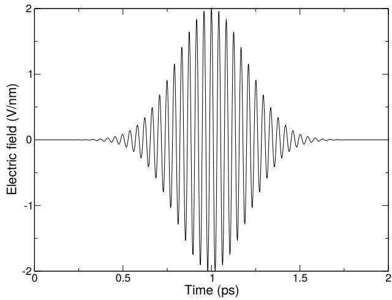  
图 5.45: GROMACS 中的模拟激光脉冲。

这样就可以产生沿 X 方向的恒定电场，其强度 $E _ { 0 } = 0 . 0 4 ~ \mathrm { V / n m }$ 。相反，

electric-field-x = 2.0 150 5 0

会产生振荡电场，其强度 $E _ { 0 } = 2 ~ \mathrm { V / n m }$ ，频率 $\omega = 1 5 0 / \mathrm { p s }$ ，峰值时刻 $t _ { 0 } = 5 ~ \mathrm { p s }$ 最后

electric-field-x = 2.0 150 5 1

会产生脉冲振荡电场，其强度 $E _ { 0 } = 2 ~ \mathrm { V / n m }$ ，频率 $\omega = 1 5 0 / \mathrm { p s }$ ，峰值时刻 $t _ { 0 } = 5 ~ \mathrm { p s }$ ，脉冲宽度 $\sigma = 1$ ps 更多信息参见文献 $1 4 6 _ { \odot 5 3 9 } $ 。请注意，输入文件的格式已经更改，与以前版本中未加说明的的格式不同。通过 $g m x \ m d r u n _ { \scriptscriptstyle \mathrm { Q 1 3 1 } }$ 的 $- \pm \mathrm { 1 6 1 d }$ 选项可以得到类似 图 5.45 的图。

## 5.8.8 计算电生理学

计算电生理学（CompEL）方法 $1 4 7 _ { \odot 5 3 9 }$ 可用于模拟通过膜通道的离子通量，这些离子通量是由跨膜电位或离子浓度梯度驱动的。就像在真实的细胞中一样，CompEL 通过维持跨膜电荷的一个小的不平衡性$\Delta q$ 来建立跨膜电位。不平衡的电荷与膜电容一起决定了电位差 $\Delta U$

$$
\Delta U = \Delta q / C _ { m e m b r a n e }\tag{5.353}
$$

跨膜电场与浓度梯度由 $m d p _ { \hookrightarrow 4 5 4 }$ 选项控制，允许用户设置膜两侧的参考离子数。如果离子的实际数目与参考数目不同，并且这种情况持续的时间超过了用户指定的时间间隔，程序会交换腔室之间的一些离子/水对，直到离子数目恢复参考数目。除了计算通道电导和离子选择性，CompEL 模拟也可用于确定通道的反转电位，它是电生理学实验中获得的重要表征参数。

设置 CompEL 时，模拟系统被划分为两个腔室 A 和 B，其中的离子浓度是独立的，互不相关。构建体系的最好方法是使用两个双层系统，每个双层都包含一个（或多个）感兴趣的通道/孔（图 5.46 A， $\mathrm { ~ B ~ } ) _ { \circ }$ 如果通道轴的指向相同，这样就可以在正电位和负电位的情况下同时观察通道通量，这对一些研究，如通道整流非常重要。

使用 $g m x \ p o t e n t i a l _ { \ldots 1 5 4 }$ 工具可以很容易地计算跨膜电位差 $\Delta U _ { \circ }$ 这样，在模拟的每个时间段都可以精确地知道沿 ?? 轴或孔隙轴方向的电位降（图 5.46 C）。在模拟过程中，对穿过通道的电荷为 $q _ { i }$ 的离子 $n _ { i }$ 其类型和数目都会写入 swapions.xvg 输出文件中。利用此文件，可以确定每个时间段 $\Delta t$ 内平均的通

A  
B  
C  
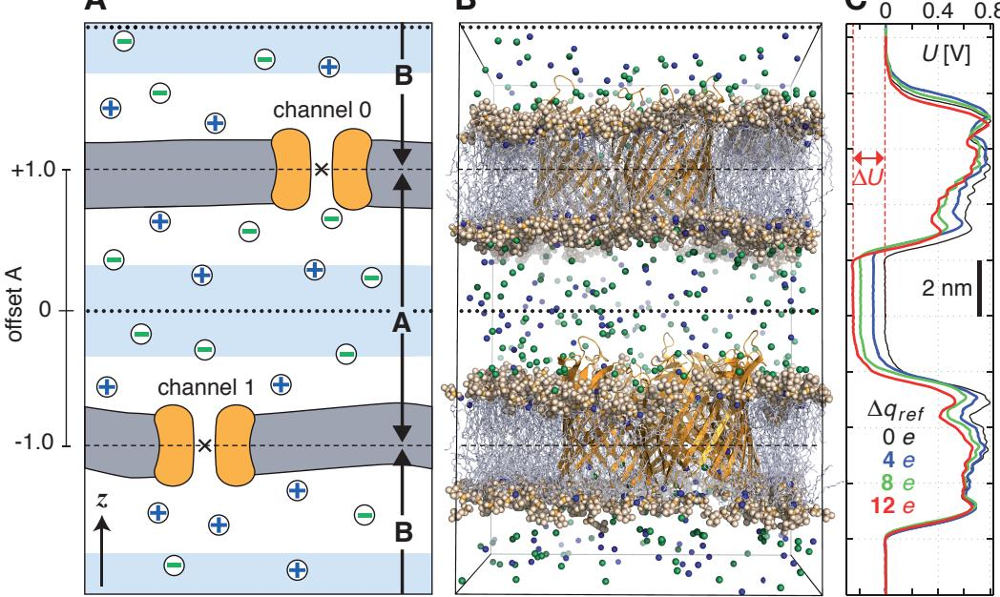  
图 5.46: 用于 CompEL 模拟的典型双膜设置（A，B）。根据需要，会在黑色虚线周围的两个浅蓝色区域之间进行离子/水分子交换（A）。图（C）显示了腔室之间因选定的电荷不平衡 $\Delta q _ { r e f }$ 而产生的电位差 Δ??.

道电导 ??:

$$
G = \frac { \sum _ { i } n _ { i } q _ { i } } { \Delta t \Delta U } .\tag{5.354}
$$

离子选择性可通过不同种类离子数目通量的比值来计算。要获得最佳结果，需要对多个重叠时间段内的值进行平均。

反转电位的计算最好是利用一系列小的模拟，每个模拟使用较小但强度变化的离子不平衡性来产生给定的跨膜浓度梯度。例如，如果一个腔室含有 1 M 浓度的盐，另一个腔室的浓度为 0.1 M，其余部分保持电中性，可以使用 $\Delta q = 0 e , \ \Delta q = 2 e , \ \Delta q = 4 e$ 的一系列模拟。对获得的零电流附近的所有 ??-?? 对，利用电流电压关系进行线性拟合就可以得到 $U _ { r e v }$ 。

## 使用方法

可利用如下的mdp↪454 选项控制 CompEL 计算：

swapcoords = Z ; Swap positions 互换位置: no, X, Y, Z   
swap-frequency 互换频率 = 100 ; Swap attempt frequency

如果膜位于 ???? 平面内，请选择 Z (图 5.46)。这样两侧腔室之间的离子进行交换时取决于它们的 ?? 位置。swap-frequency 决定了尝试交换的频繁程度。进行交换时需要在并行进程之间通信划分组，离子和可能的溶剂分子的位置信息，因此如果交换频率过高会降低模拟速度。md.log 文件末尾的循环和时间统计表中有 Position swapping 项，它给出了花费在交换模块中的运行时间。

split-group0 = channel0 ; Defines compartment boundary 定义腔室边界   
split-group1 = channel1 ; Defines other compartment boundary 定义另一边界

(下页继续)

(续上页)

massw-split0 = no ; use mass-weighted center? 使用质量加权中心?  
massw-split1 = no

split-group0 和 split-group1 为两个索引组，用于定义两个腔室之间的边界，通常是通道的中心。如果 massw-split0 或 massw-split1 设置为 yes，会使用每个索引组的质心作为边界，此处为 ?? 方向的质心。否则，将使用几何中心 (图 5.46 A 中的 ×)。如果像这里一样，选择一个膜通道作为划分组，其中心将定义腔室之间的分界面（图中的水平虚线）。所有索引组都必须在索引文件中定义。

如果为了恢复需要的离子数目，必须将一个腔室中的离子与另一个腔室中的水分子进行交换，那么会首先交换那些与腔室定义边界（水平虚线）具有最大距离的分子。取决于离子浓度，这有效地导致了浅蓝色区域之间的分子交换。如果通道在 ?? 方向上非常不对称，并且延伸到其中一个交换区域中，可以使用bulk-offset 参数来偏移互换交换平面。其值为 0.0 表示没有偏移，?? 值 −1.0 < ?? < 0 将互换交换平面移到靠近较低的膜，0 < ?? < 1.0 则移到接近较高的膜。图 5.46 A（左）示意了 A 腔室。

```ini
solvent-group = SOL ; Group containing the solvent molecules 溶剂分子组
iontypes = 3 ; Number of different ion types to control 要控制的离子类型的数目
iontype0-name = NA ; Group name of the ion type 离子类型的索引组名称
iontype0-in-A = 51 ; Reference count of ions of type 0 in A A 中离子类型 0 的数目
iontype0-in-B = 35 ; Reference count of ions of type 0 in B B 中离子类型 0 的数目
iontype1-name = K
iontype1-in-A = 10
iontype1-in-B = 38
iontype2-name = CL
iontype2-in-A = -1
iontype2-in-B = -1
```

必须使用 solvent-group 来设定溶剂分子组的名称，其中的溶剂分子可作为离子交换的待选分子。计算电生理学方法中可控制的不同离子种类的数目由 iontypes 参数给定，而 iontype0-name 给出了该离子种类所含原子的索引组的名称。腔室 A 和 B 中，每种粒子的参考数目可以分别用 iontype0-in-A 和iontype0-in-B 选项设置。显然，iontype0-in-A 和 iontype0-in-B 的总和应等于由 iontype0-name定义的组中的离子数目。参考数目 -1 表示使用模拟开始时找到的离子数目作为参考数目。

coupl-steps = 10 ; Average over these many swap steps 多少次互换后进行平均   
threshold = 1 ; Do not swap if < threshold 互换的阈值

如果 coupl-steps 设置为 1，那么离子互换与否由瞬时离子分布决定。couple-steps > 1 时则根据选定次数的尝试步骤过程中离子分布的时间平均值决定。这可适用于一些情况，例如，当离子在腔室边界附近扩散时，会导致大量无效的离子互换。threshold 为 1 意味着进行交换时腔室中的平均离子数与设定值至少相差 1。更高的阈值将导致更大的容许差异。离子将互换直至达到设定的数目 ± 阈值。

cyl0-r = 5.0 ; Split cylinder 0 radius (nm) 圆柱 0 的半径  
cyl0-up = 0.75 ; Split cylinder 0 upper extension (nm) 圆柱 0 的上边界  
cyl0-down = 0.75 ; Split cylinder 0 lower extension (nm) 圆柱 0 的下边界  
cyl1-r = 5.0 ; same for other channel 其他通道相同  
cyl1-up = 0.75  
cyl1-down = 0.75

圆柱体选项用于定义通道孔隙周围的虚拟几何圆柱体，用以跟踪通过每个通道的每种类型的离子的数目。对离子进行计数的依据是通道圆柱半径，上下延伸的定义，圆柱是相对于各自划分组的位置定义的。这不会影响实际的通量或交换，却会提供每个通道的离子渗透数。注意，只有当一个离子在互换步骤中被检测到处于定义的划分圆柱 内部时，才能认为离子通过了特定通道。如果 swap-frequency 太高，特定的离子可能在一个交换步骤中被检测到处于腔室 A，在下一交换步骤中却被检测到处于腔室 B，因此就无法清楚地确定离子到底是通过了哪个通道。

用于 CompEL 模拟的双层系统可以很容易地使用下述方法创建：利用 $g m x ~ e d i t c o n f _ {  9 1 } \mathrm { - t r a n s 1 a t e } ~ 0 ~ 0$ ${ < } 1 _ { - } z { > }$ 命令在膜的法线方向 (通常为 ??) 上重复现有的膜/通道 MD 系统，其中 $\perp _ { - } z$ 为重复方向的盒子长度。如果已经为单层系统的通道定义了索引组，那么使用gmx make\_ndx↪126-n index.ndx -twin 就可以得到双层系统的索引组。

为抑制膜沿交换方向的大幅波动，采用伞形牵引（见牵引代码↪466 一节）在每个通道和/或双层中心之间施加简谐势（仅作用于交换维度）可能会有帮助。

## 多重通道

如果划分组包含的分子数大于 1，必须选择所有分子相互之间的正确的 PBC 映像，这样才能正确地确定通道中心。GROMACS 假设 $t p r _ { \mathrm { { c 4 6 0 } } }$ 文件中初始结构的 PBC 表示是正确的。设置下面的环境变量可检查情况是否如此：

• GMX\_COMPELDUMP: 将完整化后的初始结构输出到 $p d b _ { \hookrightarrow 4 5 6 }$ 文件。

## 5.8.9 使用自由能代码计算 PMF

自由能耦合参数方法（参见自由能计算 $_ { 9 3 6 7 } \ : - \frac { \# } { \mathsf { I } } \ : )$ 提供了几种计算平均力势的方法。通过使用简谐势或约束连接两个原子，可以计算它们之间的平均力势。为此，有一些特殊的势能函数可以避免产生额外的排除，参见排除↪424 一节。当状态 B 中的最小位置或约束长度比状态 A 中的大 1 nm 时，限制力或约束力为 $\partial H / \partial \lambda$ 。通过设置 $m d p _ { \hookrightarrow 4 5 4 }$ 文件中的 delta-lambda 可以改变原子间的距离，它是 ?? 和时间的函数。得到的结果应当与使用牵引代码中的伞形采样和约束牵引所得的结果完全相同（尽管由于实现方法不同在数值上不可能完全相同）。与牵引代码不同，自由能代码也可以处理通过约束连接的原子。

也可以利用位置限制来计算平均力势。采用位置限制时，原子通过简谐势连接到空间中的某一位置（参见位置限制 $_ { \odot 3 9 2 } \ - \frac { + + } { | \mathbf { \vec { J } } } \ )$ 。这些位置可以作为耦合参数 ?? 的函数。A 状态和 B 状态的位置可分别利用 $g r o m p p _ { \Rightarrow 1 0 8 }$ 的 -r 和 -rb 选项进行设置。可以使用这种方法进行靶向 MD; 注意，我们并不鼓励对蛋白质使用靶向 MD。将这些构象作为状态 A 和 B 的位置限制坐标，就可以迫使蛋白质从一种构象转变到另一种构象。然后可以从 0 到 1 缓慢地改变 ?? 的值。这种方法的主要缺点在于，蛋白质的构象自由度受到位置限制的严重制约，而与从状态 A 到 B 状态的变化无关。此外，蛋白质由状态 A 到状态 B 的强制转变几乎处于一条直线上，而真实的路径可能大不相同。更适合这种方法的一个例子是固体系统或限制于墙之间的液体。对这种系统，你可能想要测量改变到边界或墙之间的距离时所需要的力。由于边界（或墙）已经需要固定，因此位置限制并不会限制系统的采样。

## 5.8.10 移除最快的自由度

MD 模拟可以使用的最大时间步长由模拟系统中的最小振动周期决定。键伸缩振动处于量子力学基态，因此使用约束而不是简谐势进行描述更好。

对其余的自由度，最小振动周期（模拟所得）为 13 fs，涉及氢原子的键-键角振动。作为一种大致规则，使用 Verlet（蛙跳式）积分方案时，在简谐振子的每个振荡周期内至少需要执行 5 次数值积分步骤，才能使积分达到合理的精度，相应的最大时间步长约为 3 fs。忽略这些周期为 13 fs 的非常快速的振动，接下来的最短周期约为 20 fs，可以使用的最大时间步长约为 4 fs。

移除氢原子键-键角自由度最好的方法是将它们定义为虚拟相互作用位点而不是普通的原子。常规原子通过键，键角和二面角连接到分子上，而虚拟位点的位置则根据预先定义好的方式，由三个邻近重原子的位置计算得到（另见虚拟相互作用位点↪407 一节）。对于水，羟基，巯基或胺基中的氢原子，不能移除其自由度，因为需要保持旋转自由度不变。因此，唯一可减慢这些快速运动的其他方法是增加氢原子的质量，但同时也需要增加与氢原子相连的重原子的质量。这会增大水分子，羟基，巯基或胺基的转动惯量，但不会影响系统的平衡性质，也不会对动力学性质产生太大影响。这些构造方法将在氢原子的键-键角振动↪491 一节进行说明，以前的论文中对此有详细讨论148↪539。

使用虚拟位点并同时修改的质量后，下一瓶颈很可能来自反常二面角（用于维持分子基团的平面性或手性）和肽的二面角。不可能在更改肽的二面角的同时而不影响蛋白质的物理行为。维持平面性的反常二面角主要用于处理芳香族残基。这些残基中的键，键角和二面角也可以替换为稍复杂些的虚拟位点。

本节描述的所有修改都可以使用 GROMACS 拓扑创建工具 ${ \cdot } p d b \mathcal { Q } g m x _ { \scriptscriptstyle { \perp } \scriptscriptstyle { 4 } 9 }$ 来完成。其中有单独的选项用以增加氢原子的质量，虚拟化所有氢原子，或者也可以虚拟化标准残基中的芳环。注意，当所有氢原子都被虚拟化后，那些处于芳香族残基内部的氢原子也会被虚拟化，即，对芳香族残基中氢原子的处理各不相同，取决于芳香残基的处理。进一步注意，芳环的虚拟化已弃用，不再建议使用。

处理拓扑文件时， $g r o m p p _ {  1 0 8 }$ 会直接从力场参数（键长和键角）推断出氢原子虚拟位点的构建参数。对芳香族残基，这些构建方法基于力场中其几何构型的键长和键角，但这些参数是直接写入pdb2gmx↪149源码中的，因为对整个芳香族基团的构建非常复杂。

氢原子的键-键角振动

构建虚拟位点

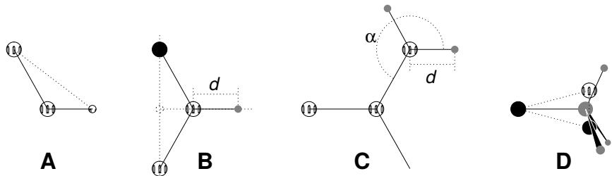

图 5.47: 氢原子不同类型的虚拟位点的构建方式。黑点为用于构建虚拟位点的原子，灰点为虚拟位点。氢原子比重原子小。A: 固定的键角，注意这种情况下氢原子并不是虚拟位点；B: 在三个原子的平面内，距离固定；C: 在三个原子的平面内，键角和距离固定；D: 胺基的构建方法 $\left( - \mathrm { N H _ { 2 } } \ \overline { { \sharp } } \tilde { \chi } \ - \mathrm { N H _ { 3 } ^ { + } } \right)$ ，详见正文。

将氢原子定义为虚拟位点的目的是去除所有来自它们的高频自由度。在某些情况下，不应去除氢原子的所有自由度，例如对羟基或胺基应保留氢原子的旋转自由度。应该注意，构建虚拟位点时不能引入不需要的相关，例如构建原子之间的键-键角振动可能会转变为氢原子的键长振动。此外，根据定义虚拟位点是没有质量的，因此为了保持系统的总质量不变，对每个被视为虚拟位点的氢原子，其质量应当添加到与其相连的重原子上。

考虑到这些，蛋白质中的氢原子可以自然地分为几类，每一类都需要不同的构建方法（另见 图 5.47）。

• 羟基（-OH）或巯基（-SH）氢原子：羟基中唯一可约束的内部自由度为 C-O-H 键角的弯曲。通过定义具有适当长度的额外键可以固定此键角，见图 图 5.47 A。这样做可以去除高频的键角弯曲运动，但保留了二面角的旋转自由度。巯基也是如此。注意，在这些情况下，氢原子并不视为虚拟位点。

• 单个胺基或酰胺（-NH-）和芳族（-CH-）氢原子：由于重原子之间具有柔性的键角，不能利用键向量的线性组合来构建这些氢原子的位置。相反，可将氢原子置于与其成键的重原子相距固定距离的位置，位于通过成键重原子与一个点的直线上，这个点处于两个第二成键原子的连线上，参见图 5.47 B。

• 平面胺基 $\left( - N H _ { 2 } \right)$ 氢原子：用于单个酰胺氢原子的方法不太适合平面胺基，因为找不到两个合适的重原子来定义氢原子的方向。相反，氢原子被置于距氮原子固定距离的位置，与碳原子成固定的键角，处于其他重原子之一定义的平面内，参见 图 5.47 C。

• 胺基 (伞形 - $\cdot N H _ { 2 }$ 或 - $. N H _ { 3 } ^ { + } )$ 氢原子：对具有旋转自由度的胺基氢原子不能根据与它们连接的重原子来构建虚拟位点，因为这样做胺基会丧失旋转自由度。为了在去除氢原子键-键角自由度的同时保留旋转自由度，可构造两个“哑质点”，它们的总质量，(绕 C-N 键旋转的) 转动惯量和质心与胺基相同。这些哑质点与任何其他原子都没有相互作用，它们会彼此相连，并与碳原子连接从而形成刚性三角形。从这三个粒子，可根据两个碳原子的向量及其外积的线性组合来构建氮原子和氢原子的位置，这样得到的胺基具有完整的旋转自由度，但不含其他内部自由度。见 图 5.47 D。

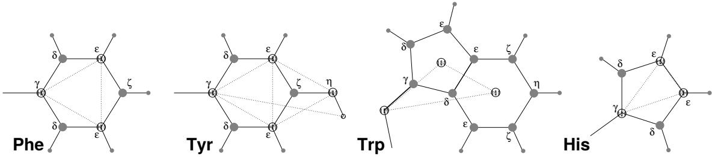  
图 5.48: 芳香族残基不同类型虚拟位点的构建方式。黑点为用于构建虚拟位点的原子，灰点为虚拟位点。氢原子比重原子小。A: 苯丙氨酸；B: 酪氨酸（注意羟基氢原子并不是虚拟位点）; C: 色氨酸；D: 组氨酸。

## 芳香基团的面外振动

芳香族残基侧链的平面构造完全适合于虚拟位点的构建，它们具有完美的平面基团，并且没有具有固有不稳定性的约束，而这些约束是维持正常原子处于平面内所必需的。构建的基本方法是定义三个原子或哑质点，利用三者之间的约束来固定几何构型，并将其余原子作为简单的虚拟位点类型（参见虚拟相互作用位 $\succsim _ { \hookrightarrow \ o 4 0 7 } -$ 节）。每种芳香族残基都需要不同的方法：

• 苯丙氨酸： $\mathrm { C } _ { \gamma } , \ \mathrm { C } _ { \epsilon 1 } , \ \mathrm { C } _ { \epsilon 2 }$ 作为正常原子，但每个的质量为苯基总质量的三分之一。见 图 5.47 A。

• 酪氨酸：对苯环的处理方式与苯丙氨酸相同。另外，在 $\mathrm { C } _ { \epsilon 1 } , \mathrm { ~ C } _ { \epsilon 2 }$ ，和 $\mathrm { O } _ { \eta }$ 之间定义约束。原先的反常二面角可将两个三角形 (一个用于苯环，一个与 $\mathrm { O } _ { \eta }$ 有关) 维持在平面内，但由于这种构建方式的转动惯量较大，因此构建更加稳定。羟基中的键-键角使用 $\mathrm { C } _ { \gamma }$ 和 $\mathrm { H } _ { \eta }$ 之间的约束进行约束。注意，氢原子并不视为虚拟位点。见 图 5.47 B。

• 色氨酸：将 $\mathrm { C } _ { \beta }$ 视为正常原子，在每个环的质心处创建两个哑质点，每个哑质点的质量等于相应环的总质量 $( \mathrm { C } _ { \delta 2 }$ 和 $\mathrm { C } _ { \epsilon 2 }$ 对每个环的贡献为 $1 / 2 )$ 。这样做可以使得整体质心和转动惯量几乎（但不完全）等于原本的大小。见 图 5.47 C。

• 组氨酸：将 $\mathrm { ~ C ~ } _ { \gamma } , ~ \mathrm { ~ C ~ } _ { \epsilon 1 }$ 和 $\mathrm { N } _ { \epsilon 2 }$ 视为正常原子，但其质量会重新分配，以保持环的质心不变。见 图5.47 D。

## 5.8.11 粘度计算

剪切粘度是液体的一种性质，实验上很容易测定。它在力场参数化时也很有用，因为它是动力学性质，而用于力场参数化的大多数其他性质都是热力学性质。粘度也是一种重要的性质，因为它会影响液体中

溶剂化分子构象的变化速率。

利用爱因斯坦关系式可以从平衡模拟计算粘度：

$$
\eta = \frac { 1 } { 2 } \frac { V } { k _ { B } T } \operatorname* { l i m } _ { t \to \infty } \frac { \mathrm { d } } { \mathrm { d } t } \left. \left( \int _ { t _ { 0 } } ^ { t _ { 0 } + t } P _ { x z } ( t ^ { \prime } ) \mathrm { d } t ^ { \prime } \right) ^ { 2 } \right. _ { t _ { 0 } }\tag{5.355}
$$

这可以利用gmx energy↪97 完成。这种方法收敛非常慢 $1 4 9 _ { \hookrightarrow 5 3 9 }$ ，因此要精确地确定粘度时，即便纳秒尺度的模拟可能也不够长。此外，计算结果也非常依赖于静电的处理方法。使用（短的）截断会导致压力的非对角元素出现很大噪声，可能使计算的粘度值增大一个数量级。

GROMACS 还支持一种确定粘度的非平衡方法 $1 4 9 _ { \hookrightarrow 5 3 9 0 }$ 这种方法基于以下事实，通过外力输入系统的能量会通过粘性摩擦而耗散掉。所产生的热量可通过耦合到一个热浴去除。对牛顿液体，施加一个小的力会导致速度梯度，符从的方程如下：

$$
a _ { x } ( z ) + \frac { \eta } { \rho } \frac { \partial ^ { 2 } v _ { x } ( z ) } { \partial z ^ { 2 } } = 0\tag{5.356}
$$

这里我们在 ?? 方向施加了一个加速度 $a _ { x } ( z )$ ，它是 ?? 坐标的函数。GROMACS 使用的加速度剖面为：

$$
a _ { x } ( z ) = A \cos \left( \frac { 2 \pi z } { l _ { z } } \right)\tag{5.357}
$$

其中 $l _ { z }$ 为盒子的高度。产生的速度剖面为：

$$
v _ { x } ( z ) = V \cos \left( \frac { 2 \pi z } { l _ { z } } \right)\tag{5.358}
$$

$$
V = A \frac { \rho } { \eta } \left( \frac { l _ { z } } { 2 \pi } \right) ^ { 2 }\tag{5.359}
$$

可以利用 ?? 和 ?? 来计算粘度：

$$
\eta = \frac { A } { V } \rho \left( \frac { l _ { z } } { 2 \pi } \right) ^ { 2 }\tag{5.360}
$$

在模拟中 ?? 定义为：

$$
V = \frac { \displaystyle \sum _ { i = 1 } ^ { N } m _ { i } v _ { i , x } 2 \cos \left( \frac { 2 \pi z } { l _ { z } } \right) } { \displaystyle \sum _ { i = 1 } ^ { N } m _ { i } }\tag{5.361}
$$

产生的速度剖面并不与热浴耦合。此外，计算体系动能时会排除速度剖面。你可能希望使用尽可能大的?? 以获得好的统计结果。但剪切速率不能太高，以免系统偏离平衡态太远。当余弦为零时，剪切速率最大：

$$
\mathrm { s h } _ { \mathrm { m a x } } = \operatorname* { m a x } _ { z } \left| \frac { \partial v _ { x } ( z ) } { \partial z } \right| = A \frac { \rho } { \eta } \frac { l _ { z } } { 2 \pi }\tag{5.362}
$$

对 $\eta = 1 0 ^ { - 3 } \ [ \mathrm { k g \ m ^ { - 1 } \ s ^ { - 1 } } ] , \rho = 1 0 ^ { 3 } [ \mathrm { k g \ m ^ { - 3 } } ] \ \mathrm { a n d } \ l _ { z } = 2 \pi [ \mathrm { n m } ]$ 的模拟， $\mathrm { \ s h } _ { \operatorname* { m a x } } = 1 [ \mathrm { p s } \ \mathrm { n m } ^ { - 1 } ]$ ??。此剪切速率应小于系统中最大相关时间的倒数。对大多数液体，转动相关时间最大，约 10 $\mathrm { p s } _ { \circ }$ 在这种情况下，??应该小于 0.1 $[ \mathrm { n m ~ p s ^ { - 2 } ~ } ] _ { \circ }$ 。若剪切速率太高，观察到的粘度会太低。因为 ?? 与盒子高度的平方成正比，盒子最好沿 ?? 方向上延伸。通常，100 ps 的模拟就足以获得精确的粘度值。

由粘性摩擦产生的热量会通过耦合到热浴移除。由于这种耦合并不是瞬时的，液体的实际温度会略低于观察到的温度。Berendsen 推导了这种温度偏差 $3 { { I } _ { \odot 3 2 } }$ ，它与剪切速率的关系为：

$$
T _ { s } = \frac { \eta \tau } { 2 \rho C _ { v } } \mathrm { s h } _ { \operatorname* { m a x } } ^ { 2 }\tag{5.363}
$$

其中?? 为Berendsen恒温器的耦合时间， $C _ { v }$ 为热容。使用上面例子中的值， $\tau = 1 0 ^ { - 1 3 } [ \mathrm { s } ] \mathrm { a n d } C _ { v } = 2 { \cdot } 1 0 ^ { 3 } [ \mathrm { J }$ $\mathrm { k g ^ { - 1 } K ^ { - 1 } } ]$ ，我们可以得到 $T _ { s } = 2 5 [ \mathrm { K \ p s ^ { - 2 } } ] \mathrm { s h _ { m a x } ^ { 2 } }$ 。如果希望剪切速率小于 $1 / 1 0 [ \mathrm { p s } ^ { - 1 } ]$ $T _ { s }$ 小于 0.25 [K]，可忽略不计。

注意，当从平衡当状态开始时，系统必须建立速度剖面。这一过程需要的时间与液体的相关时间在同一数量级。

根据方程 (5.360) 得到的两个量 ?? ，1/?? 及其平均值和涨落会写入能量文件。

## 5.8.12 表格相互作用函数

## 势能的三次样条插值

在 GROMACS 的某些内部循环中，计算势能和力的时候会使用查表方法。并使用三次样条算法对表格进行插值。对静电，色散和排斥相互作用会使用单独的表格，但为了提高缓存性能，这些表格已被合并到单一的数组中。对 $x _ { i } \leq x < x _ { i + 1 }$ 的三次样条插值如下：

$$
V _ { s } ( x ) = A _ { 0 } + A _ { 1 } \epsilon + A _ { 2 } \epsilon ^ { 2 } + A _ { 3 } \epsilon ^ { 3 }\tag{5.364}
$$

其中，表格间距 ℎ 与分数 ?? 由下式给出：

$$
\begin{array} { r l } { h = } & { { } \ x _ { i + 1 } - x _ { i } } \\ { \epsilon = } & { { } ( x - x _ { i } ) / h } \end{array}\tag{5.365}
$$

因此 $0 \leq \epsilon < 1$ 。由此，我们可以计算导数以确定力：

$$
- V _ { s } ^ { \prime } ( x ) ~ = ~ - { \frac { \mathrm { d } V _ { s } ( x ) } { \mathrm { d } \epsilon } } { \frac { \mathrm { d } \epsilon } { \mathrm { d } x } } ~ = ~ - ( A _ { 1 } + 2 A _ { 2 } \epsilon + 3 A _ { 3 } \epsilon ^ { 2 } ) / h\tag{5.366}
$$

四个系数可以由四个条件确定： $V _ { s }$ 和 $- V _ { s } ^ { \prime }$ 在每个区间的两端应精确地等于势能 ?? 与力 $- V ^ { \prime }$ 。这样得到每个区间上的误差：

$$
\begin{array} { r l r } { | V _ { s } - V | _ { m a x } = } & { { } } & { V ^ { \prime \prime \prime } \frac { h ^ { 4 } } { 3 8 4 } + O ( h ^ { 5 } ) } \\ { | V _ { s } ^ { \prime } - V ^ { \prime } | _ { m a x } = } & { { } } & { V ^ { \prime \prime \prime } \frac { h ^ { 3 } } { 7 2 \sqrt { 3 } } + O ( h ^ { 4 } ) } \\ { | V _ { s } ^ { \prime \prime } - V ^ { \prime \prime } | _ { m a x } = } & { { } } & { V ^ { \prime \prime \prime } \frac { h ^ { 2 } } { 1 2 } + O ( h ^ { 3 } ) } \end{array}\tag{5.367}
$$

?? 和 $V ^ { \prime }$ 是连续的，而 $V ^ { \prime \prime }$ 一阶导数不连续。对混合精度和双精度版本的 GROMACS，每纳米的点数分别为 500 和 2000。这意味着势能与力的误差通常小于混合精度的精确度。

GROMACS 会存储 $A _ { 0 } , \ A _ { 1 } , \ A _ { 2 }$ 和 $A _ { 3 }$ 。计算力的子程序会获得一个包含这四个参数与缩放因子的表格，缩放因子 ?? 等于每 nm 的点数。(注意，ℎ 的单位为 $s ^ { - 1 } )$ 。算法的大致过程如下：

1. 计算距离向量 $( \mathbf { r } _ { i j } )$ 和距离 $\mathrm { r } _ { i j }$

2. 将 $\mathrm { r } _ { i j }$ 乘上 ??，截断为整数值 $n _ { 0 }$ 获得表格中的索引号

3. 计算小数部分 $( \epsilon = s \mathrm { r } _ { i j } - n _ { 0 } )$ 与 $\epsilon ^ { 2 }$

4. 插值计算势能 ?? 和标量力 $f$

5. 将 ?? 乘上 $\mathbf { r } _ { i j }$ ，得到向量力 F

注意，查表比计算最简单的 Lennard-Jones 和库仑相互作用要慢得多。但是，它比 PPPM 方法中使用的移位库仑函数快得多。最后，修改一个势能的表格（并获得其图形表示）要比修改 MD 程序中的内部循环容易得多。

## 用户指定的势函数

你也可以使用自己的势能函数而无需编辑 GROMACS 源代码。势能函数应符合以下方程

$$
V ( r _ { i j } ) ~ = ~ { \frac { q _ { i } q _ { j } } { 4 \pi \epsilon _ { 0 } } } f ( r _ { i j } ) + C _ { 6 } g ( r _ { i j } ) + C _ { 1 2 } h ( r _ { i j } )\tag{5.368}
$$

其中 ??，?? 和 ℎ 是用户自定义的函数。注意，如果 $g ( r )$ 代表正常的色散相互作用， $g ( r )$ 应 $< 0 _ { \circ } \mathrm { \ C _ { 6 } , \ C _ { 1 2 } }$ 和电荷从拓扑中读取。还要注意，组合规则只能用于 Lennard-Jones 和 Buckingham 势能函数，你的表格应该与二进制拓扑中的参数匹配。

如果在mdp↪454 文件中添加以下内容：

```ini
rlist = 1.0
coulombtype = User
rcoulomb = 1.0
vdwtype = User
rvdw = 1.0
```

$m d r u n _ { \substack { \scriptscriptstyle \mathrm { Q 1 3 1 } } }$ 会读取一个非键相互作用的表格文件，若设置了 energygrp-table 则会读取多个表格文件（见下文）。可以使用 $m d r u n _ { \substack { \scriptscriptstyle \mathrm { Q 1 3 1 } } }$ 选项 -table 设置文件的名称。表格文件应按以下顺序包含 7 列用于查表的数据：??，??(??)，−??′(??)，??(??)， $- g ^ { \prime } ( x )$ ，ℎ(??)，−ℎ′(??)。?? 的范围应该从 0 到 $r _ { c } + 1$ (可以更改 $m d p _ { \hookrightarrow 4 5 4 }$ 文件中 table\_extension 的值)。你可以使用自己喜欢的表格间距；对标准表格，混合精度和双精度版本的 GROMACS 使用的间距分别为 0.002 和 0.0005 nm。在这种情况下， $r _ { c }$ 表示两个截断值 rvdw 和rcoulomb 的最大值（见上文）。这些变量不需要相同（也不需要是 1.0）。一些用作势能的函数在 $x = 0$ 处存在奇点，但由于原子之间的距离通常不会小于 0.1 nm，因此 $x = 0$ 的势能函数值无关紧要。最后，还可以将标准的库仑势与修改的 LJ 势组合起来（反之亦然）。然后指定，例如 coulombtype = Cut-off或 coulombtype = PME，vdwtype = User 即可。但表格文件必须始终包含 7 列，并且所有列中必须为有意义的数据（即不能为零）。你可以在 GMXLIB 目录中找到一些已经创建好的表格文件，它们可用于6-8，6-9，6-10，6-11 和 6-12 类型的 Lennard-Jones 势，并与正常的库仑相互作用组合在一起。

如果想对不同原子组使用不同的函数形式，可利用能量组进行设置。利用 $m d p _ { \hookrightarrow 4 5 4 }$ 的 energygrp-table选项可以将不同的表格用于不同的能量组对之间的非键相互作用（详见“用户指南”）。具有不同相互作用势的原子应放入不同的能量组中。对未列在 energygrp-table 中的能量组对，会使用正常的用户表格。当需要在几种原子类型之间使用不同的函数形式时，这样做更容易。

## 5.8.13 混合量子经典模拟技术

在分子力学（MM）力场中，电子的影响是利用经验参数来描述的，这些参数是基于实验数据或高水平的量子化学计算结果得到的。这些参数对给定共价结构的基态是有效的，而 MM 近似对于基态过程通常足够精确，在这些过程中系统中原子间整体的成键连接性都保持不变。然而，对于那些成键连接会发生变化的过程，如化学反应，或涉及多个电子态的过程，如光化学转换，不能再忽略电子，因此需要利用量子力学描述系统，或者至少需要对系统中发生反应的那部分使用量子力学进行描述。

模拟溶液或酶中化学反应的一种方法是将量子力学（QM）和分子力学（MM）结合起来。系统的反应部分使用量子力学处理，而其余部分使用力场建模。目前的 GROMACS 版本提供了几个流行的量子化学程序包的接口（MOPAC $1 5 0 _ { \odot 5 3 9 }$ $\mathrm { G A M E S S  – U K } \boldsymbol { 1 } 5 \boldsymbol { 1 } _ { \hookrightarrow 5 3 9 }$ $\mathrm { G a u s s i a n } 1 5 \mathcal { Q } _ { \hookrightarrow 5 3 9 }$ 以及 $\mathrm { C P M D } \ : 1 5 \mathcal { 3 } _ { \hookrightarrow 5 3 9 } \ : \bigr )$ ）。

两个子系统之间的 GROMACS 相互作用可以使用 Field 等人的方法来处理 $1 5 4 _ {  5 3 9 }$ ，也可以使用Morokuma 及其合作者的 ONIOM 方法来处理 $1 5 5 _ { \scriptscriptstyle { \hookrightarrow 5 3 9 } } , 1 5 6 _ { \scriptscriptstyle { \hookrightarrow 5 3 9 } \circ }$

## 概述

在本版本的 GROMACS 中可使用两种方法描述 QM 和 MM 子系统之间的相互作用：

1. 电子嵌入：QM 子系统的哈密顿量包含了 QM 区域的电子与 MM 原子之间，以及 QM 原子核与MM 原子之间的静电相互作用：

$$
H ^ { Q M / M M } = H _ { e } ^ { Q M } - \sum _ { i } ^ { n } \sum _ { J } ^ { M } \frac { e ^ { 2 } Q _ { J } } { 4 \pi \epsilon _ { 0 } r _ { i J } } + \sum _ { A } ^ { N } \sum _ { J } ^ { M } \frac { e ^ { 2 } Z _ { A } Q _ { J } } { 4 \pi \epsilon _ { 0 } R _ { A J } } ,
$$

其中 ?? 和 ?? 分别为 QM 区域中的电子数和原子核数，?? 为带电荷的 MM 原子的数目。上式右边的第一项为孤立 QM 系统原本的电子哈密顿量。第一个双重加和项为 QM 电子与 MM 原子之间的总静电相互作用。第二个双重加和项为 QM 原子核与 MM 原子之间的总静电相互作用。QM 原子与 MM 原子之间的成键相互作用在 MM 水平以适当的力场项进行描述。连接两个子系统之间的化学键使用氢原子封端，以保证 QM 区域的价层完整。只出现于 QM 区域中的这类原子上的力会分配到成键的两个原子上。封端原子通常称为链接原子。

2. ONIOM: 在 ONIOM 方法中，首先会在需要的从头算理论水平下计算孤立 QM 子系统的能量和梯度。随后，会使用分子力学力场方法计算包括 QM 区域在内的整个系统的能量和梯度，并将其加到前一步计算得到的孤立 QM 子系统的能量和梯度上。最后，因为对 QM 区域内的相互作用考虑了两次，所以需要进行校正。校正时会使用分子力学对孤立的 QM 子系统进行计算，并从上一步的结果中减去所得的能量和梯度。总的 QM/MM 能量计算的表达式如下（梯度类似）:

$$
E _ { t o t } = E _ { I } ^ { Q M } + E _ { I + I I } ^ { M M } - E _ { I } ^ { M M } ,
$$

下标 I 和 II 分别代表 QM 和 MM 子系统。上标代表了计算能量的理论水平。ONIOM 方案的优点在于，它并不仅限于两层 QM/MM 描述，可以很容易地推广到多层，而且每层使用的理论水平都可以不同。

## 使用方法

要使用 GROMACS 中的 QM/MM 功能，需要：

1. 必要时在 QM/MM 边界引入链接原子；

2. 指定要在 QM 水平处理哪些原子；

3. 指定 QM 水平，基组，QM/MM 接口的类型等。

## 添加链接原子

在连接 QM 和 MM 子系统的键上引入链接原子。在 GROMACS 中链接原子具有特殊的原子类型，称为LA。在 QM 计算中，这种原子类型被视为氢原子，在力场计算中，这种原子类型则被视为虚拟位点。链接原子（如果有的话）是系统的一部分，但它们与任何其他原子都没有相互作用，作用于它们上的 QM力会分配到成键的两个原子上。因此，在拓扑中链接原子（LA）被定义为虚拟位点原子：

[ virtual\_sites2 ]   
LA QMatom MMatom 1 0.65

关于虚拟位点的处理细节，请参阅虚拟位 $\operatorname { \frac { 5 } { \cdots } } _ { \substack { \odot \colon \pm 1 9 } } - \operatorname { \frac { \mp \hbar } { \operatorname { \Pi } } }$ 。在模拟的每一步，都会替换链接原子。

此外，键本身也替换为约束：

[ constraints ]   
QMatom MMatom 2 0.153

注意，因为在我们的系统中，QM/MM 键是碳碳键（0.153 nm），所以我们使用的约束长度为 0.153 nm，哑位置为 0.65。后者为理想 C-H 键长和理想 C-C 键长之比。采用这一比例，链接原子始终距 QMatom

0.1 nm，与碳氢键长度一致。如果 QM 和 MM 子系统通过不同类型的键连接，那么需要使用与对应的键类型相匹配的不同约束和哑位置。

## 指定 QM 原子

需要在 QM 理论水平上处理的原子，包括链接原子，要添加到索引文件中。此外，在拓扑文件中，QM区域中原子之间的化学键要定义连接键（键类型为 5）:

[ bonds ]   
QMatom1 QMatom2 5   
QMatom2 QMatom3 5

## 指定 QM/MM 模拟参数

在mdp↪454 文件中，以下参数控制 QM/MM 模拟。

QMMM = no

如果设置 yes，则进行 QM/MM 模拟。几个原子组可以分别使用不同的 QM 水平进行描述。这些组在 QMMM-grps 字段中指定，彼此间以空格隔开。各个组使用的从头算的理论水平在 QMmethod和 QMbasis 字段指定。只有 ONIOM QM/MM 方案才支持使用不同的理论水平描述不同的组，这一方案由 QMMMscheme 指定。

QMMM-grps =

## 在 QM 水平描述的组

QMMMscheme = normal

可用选项是 normal 和 ONION。用于选择 QM/MM 接口。normal 意味着 QM 子系统电子化地嵌入MM 子系统中。只能对一个 QMMM-grps 使用从头算理论的 QMmethod 方法和 QMbasis 基组进行处理。系统的其余部分在 MM 水平进行描述。QM 和 MM 子系统的相互作用如下：MM 部分的点电荷包含在 QM 部分的单电子哈密顿量中，所有 Lennard-Jones 相互作用都在 MM 水平进行描述。如果选择 ONIOM，则使用 Morokuma 及其合作者发展的 ONIOM 方法描述子系统之间的相互作用。可以有不止一个 QMMM-grps，每个使用的 QM 理论水平（QMmethod 和 QMbasis）都可以不同。

QMmethod =

用于计算 QM 原子能量和梯度的方法。可用的方法包括 AM1，PM3，RHF，UHF，DFT，B3LYP，MP2，CASSCF，MMVB 和 CPMD。对于CASSCF，活化空间包含的电子数和轨道数由 CASelectrons 和CASorbitals 指定。对 CPMD，平面波截断由 planewavecutoff 关键词指定。

QMbasis =

用于展开电子波函数的高斯基组。目前只可使用高斯基组，即STO-3G，3-21G，3-21G\*，3-21+G\*，6-21G，6-31G，6-31G\*，6-31+G\* 和 6-311G。CPMD 使用平面波展开，而不使用以原子为中心的基函数，planewavecutoff 关键字控制平面波展开。

QMcharge =

QMMM-grps 的总电荷，单位为 e 。如果有多个 QM MM-grps，需要单独指定每个 ONION 层的总电荷。

QMmult =

QMMM-grps 的自旋多重度。如果有多个 QMMM-grps，则需要单独指定每个 ONIOM 层的自旋多重

度。

CASorbitals =

执行 CASSCF 计算时活化空间包含的轨道数。

CASelectrons

执行 CASSCF 计算时活化空间包含的电子数。

SH = no

如果设置为 yes，则在激发态势能面上进行 QM/MM MD 模拟，在模拟过程中，如果体系遇到圆锥交叉点，强制体系非绝热地跳跃到基态。此选项只能与 CASSCF 方法结合使用。

## 输出

QM 计算的能量和梯度会加到 GROMACS 计算的能量和梯度中。在 $e d r _ { \hookrightarrow 4 5 1 }$ 文件中会有总 QM 能量的选择项。

## 未来发展

为提高 QM/MM 接口的准确性，目前正在开发一些功能。其中一个有用的功能是在 QM 计算中使用离域化的 MM 电荷。使用这种模糊电荷的最大好处在于，库仑势在原子间距离上具有有限值。在点电荷表示中，靠近 QM 区域的部分带电的 MM 原子倾向于“过度极化”QM 系统，这会导致计算中的假象。

此外还需要一个过渡态优化器。

## 5.8.14 MiMiC 混合量子力学/分子力学模拟

本节描述如何耦合到新型的 QM/MM 接口。计算化学中的多尺度建模（MiMiC）接口将 GROMACS和 CPMD QM 代码↪http://cpmd.org/ 结合了起来。有关 GROMACS 中其他 QM/MM 实现的信息，请参阅混合量子经典模拟技术↪495 一节。在 QM/MM 方法中，通常将系统的一小部分（例如，可以发生化学反应的酶的活性位点）在 QM 理论水平上进行处理（因为我们在描述某些过程时无法忽略电子自由度，例如，化学反应），而系统的其余部分（蛋白质的其余部分，溶剂等）使用经典力场（MM）进行描述。

## 概述

Mimic 实现了 U. Roethlisberger 课题组开发的 QM/MM 耦合方案 $1 8 0 _ { \odot 5 4 1 }$ 。这种方案将经典系统的静电相互作用嵌入到量子哈密顿量中。总的 QM/MM 能量为子系统贡献的加和：

$$
E _ { t o t } = E _ { Q M } + E _ { M M } + E _ { Q M / M M }
$$

QM 贡献由 CPMD 计算，而 MM 部分由 GROMACS 处理，交叉项由 MiMiC 接口处理。交叉项，即同时涉及 QM 区域原子和 MM 区域原子的项，包括成键和非键相互作用。

成键相互作用来自用于描述 MM 部分的力场。每当有化学键跨过 QM/MM 边界时，就必须采取额外的措施进行正确处理。否则，被切断的键中的 QM 原子就会留下一个不饱和的电子轨道，从而导致不合理的系统行为。因此，悬空键必须用另一个 QM 原子封端。CPMD 中可以使用两种不同的方法对键进行封端：

1. 氢封端 - 最简单的方法，用氢原子封闭键，限制其相对位置

2. 链接原子赝势 - 这种方法使用开发的 ad-hoc 赝势来封闭键。这个赝势可以代表真实的原子，因此不需要对键进行约束。

与标准力场一样，对 $E _ { Q M / M M }$ 的非键贡献可以分为范德华力和静电两部分。第一部分贡献来自 MM 力场。非键相互作用的第二部分由 MiMiC 通过静电嵌入方法处理。这会添加额外的项到系统的哈密顿量中：

$$
E _ { Q M / M M } ^ { e s } = - \sum _ { a } ^ { N _ { m m } } Q _ { a } \int \rho ( \mathbf { r } ) \frac { r _ { c , a } ^ { 4 } - | \mathbf { R _ { a } } - \mathbf { r } | ^ { 4 } } { r _ { c , a } ^ { 5 } - | \mathbf { R _ { a } } - \mathbf { r } | ^ { 5 } } d \mathbf { r } + \sum _ { a } ^ { N _ { m m } } \sum _ { n } ^ { N _ { q m } } Q _ { a } Z _ { n } \frac { r _ { c , a } ^ { 4 } - | \mathbf { R _ { a } } - \mathbf { R _ { n } } | ^ { 4 } } { r _ { c , a } ^ { 5 } - | \mathbf { R _ { a } } - \mathbf { R _ { n } } | ^ { 5 } } d \mathbf { r } ,
$$

其中 $N _ { m m }$ 为 MM 原子的数目， $N _ { q m }$ 为 QM 原子的数目， $r _ { c , a }$ 为 MM 原子的共价半径。上式的第一项对应于 QM 区域的电子密度 $\rho ( \mathbf { r } )$ 和 MM 原子之间的阻尼库仑相互作用。由于 CPMD 利用平面波基组来展开电子波函数，因此需要使用阻尼。与局域化基组不同，平面波是离域的，这可能会引起所谓的电子溢出问题：带正电的 MM 原子可能会人为地导致电子云过极化，这是因为不存在量子力学效应（例如Pauli 排斥），而这种效应通常会防止出现过极化（在完全量子系统中）。上述方程中阻尼库仑势的函数形式来自 $1 8 0 _ { \odot 5 4 1 }$

由于计算上述方程第一项中的积分可能极其耗时，MiMiC 还实现了分级静电嵌入方案，用以减少在电子格点上计算 $N _ { m m }$ 个积分所需的巨大计算量。在该方案中，根据与 QM 区域的距离将 MM 原子分为两个壳层：近程组和远程组。对于近程壳层中的 MM 原子，利用上面的方程计算 QM/MM 相互作用。与此相反，对涉及远程壳层 MM 原子的相互作用则使用 QM 静电势的多极展开来计算。更多细节请参见论文 $1 8 0 _ { \odot 5 4 1 } \mathrm { ~ c ~ }$

## 应用耦合模型

与大多数 QM/MM 接口不同，MiMiC 在不同部分的代码之间使用了松散耦合。这意味着，MiMiC 不是将两部分代码编译成一个单独的二进制文件，而是将 CPMD 和 GROMACS 分别构建成单独的可执行文件。然后，用户将为两部分代码准备输入并同时运行它们。每部分代码都使用单独的 MPI 进程池运行，并通过 MPI 的客户端-服务器机制传送必要的数据（例如，坐标，能量和力）。在 MiMiC 框架内，CPMD 充当服务器，而 GROMACS 成为客户端。

## 软件前提条件

1. GROMACS 版本 2019+。较新的主要版本可能支持多个版本的 MiMiC。

2. CPMD 版本 4.1+。

## 使用方法

进行支持 MiMiC QM/MM 的构建 $\hookrightarrow 1 6$ 之后，要运行 MiMiC QM/MM 模拟，需要执行：

1. 获取并编译支持 MiMic 的 CPMD。

2. 使用 GROMACS 进行正常的经典平衡。

3. 创建一个索引组，指定 GROMACS 中的 QM 原子。请记住，这个组中还应该包括与 QM 区域中的原子结合的链接原子，因为必须在量子水平上对它们进行处理。

4. 根据以下建议为 CPMD 和 GROMACS 准备输入。

5. 同时运行 CPMD 和 GROMACS，将它们作为单个批处理作业中的两个独立实例。

## 为 GROMACS 准备输入文件

为了进行 MiMiC 模拟，需要在mdp↪454 文件中添加两个选项：

1. integrator=mimic↪227，用于在 GROMACS 中启用 MiMiC 流程。

2. QMMM-grps=<name\_of\_qm\_index\_group>，指定由 CPMD 处理的所有原子。

由于会使用 CPMD 执行 MD 积分，因此只有与力的计算和输出相关的mdp 选项才需要指定。

设置好mdp↪454 文件后，就可以像往常一样运行grompp↪108。grompp↪108 会将所有 QM 原子的电荷都设置为零，以避免重复计算库仑相互作用。此外，它会更新非键排除列表以排除 QM 原子之间的 LJ 相互作用（因为它们会由 CPMD 计算）。最后，它会移除 QM 原子之间的键（如果存在的话）。我们建议使用 gmx grompp -pp <preprocessed\_topology\_file> 来输出预处理后的拓扑文件，因为它可以自动为CPMD 准备输入。

## 准备 CPMD 输入文件

本节仅介绍 CPMD 中与 MiMiC 相关的输入，关于 DFT 相关选项的配置，请参阅 CPMD 手册↪http://www.cpmd.org/downloadable-files/no-authentication/manual\_v4\_0\_1.pdf 。准备好 GROMACS 的输入并获得预处理的拓扑文件之后，只需运行 MiMiC 发行版中提供的 Python 预处理器脚本，即可获得 CPMD 输入文件中与 MiMiC 相关的部分。脚本的使用方法很简单：

prepare-qmmm.py <index\_file> <gro\_file> <preprocessed\_topology\_file> <qm\_group\_name>

请注意，对于 MiMiC，力场中包含每种原子类型的元素编号至关重要! 如果未提供，预处理器会失败，并给出以下错误：

It looks like the forcefield that you are using has no information about the element number.   
The element number is needed to run QM/MM simulations.

给定了所有相关信息，脚本会输出 CPMD 输入中与 MiMiC 相关的部分。以下是示例输出，其中包含对关键词的简短说明，这些关键词可以在 CPMD 输入的这一部分中找到。

&MIMIC   
PATHS   
1   
<some\_absolute\_path>   
BOX   
35.77988547402689 35.77988547402689 35.77988547402689   
OVERLAPS   
3   
2 13 1 1   
2 14 1 2   
2 15 1 3   
&END   
&ATOMS   
O   
1   
17.23430225802002 17.76342557295923 18.576007806615877   
H

(下页继续)

(续上页)

```csv
2
18.557110545368047 19.086233860307257 18.727185896598506
17.57445296048094 16.705178943080806 17.06422690678956
&END
Suggested QM box size [12.661165036045407, 13.71941166592383, 13.00131573850633]
```

&MIMIC 部分包含 MiMiC 设置：

PATHS 表示模拟中涉及的 MM 客户端代码的数目，以及各自文件夹的绝对路径。请记住，此路径必须指向要在其中运行 GROMACS 的文件夹，否则会导致 CPMD 出现死锁! 下一行包含 MM 代码的数目（本例中为 1），接下来的 ?? 行包含这些代码各自工作目录的路径

BOX 表示整个模拟盒子的大小，单位为 Bohr，格式为 X Y Z。

OVERLAPS - 设置 GROMACS 中将由 CPMD 处理的原子的数目和 ID。格式如下：

```xml
<code_id> <atom_id_in_code> <host_code_id> <atom_id_in_that_code>
```

CPMD 主机代码的 ID 始终为 ID 1。因此，在 QM/MM 模拟中 GROMACS 的代码 ID 为 2。

（可选）LONG-RANGE COUPLING - 为距离 QM 盒子一定距离外的原子启用更快的多极耦合

（可选）CUTOFF DISTANCE - 下一行包含显式库仑耦合的截断值（默认为 20 Bohr，如果存在LONG-RANGE COUPLING 的话）

（可选）MULTIPOLE ORDER - 下一行包含多极展开的截断阶数（默认值为 2，最大值为 20）。

CPMD 输入文件的 &ATOMS 部分包含系统中的所有 QM 原子，并具有默认的 CPMD 格式。请参阅CPMD 手册↪http://www.cpmd.org/downloadable-files/no-authentication/manual\_v4\_0\_1.pdf 并根据需要对其进行调整（需要为每个原子种类设置正确的赝势）。

最后，预处理器建议 QM 盒子的大小，其中包含电子密度。建议值并不是最终值 - 用户可能需要进一步调整。

## 运行 MiMiC QM/MM 模拟

为了运行模拟，需要在一个作业中同时运行 GROMACS 和 CPMD。对于绝大多数排队系统来说，很容易做到这一点。例如，对于 SLURM 排队系统，可以在一个作业中使用两个作业步骤。下面是 slurm 作业的示例脚本，运行 242 个节点，为 GROMACS 分配 2 个节点，为 CPMD 分配 240 个节点（两部分代码都在同一个文件夹中启动）:

```shell
#!/bin/bash -x
#SBATCH --nodes=242
#SBATCH --output=mpi-out.%j
#SBATCH --error=mpi-err.%j
#SBATCH --time=00:25:00
#SBATCH --partition=batch
# *** start of job script ***
srun -N2 --ntasks-per-node=6 --cpus-per-task=4 -r0 gmx_mpi_d mdrun -deffnm mimic -ntomp 4 &
srun -N240 --ntasks-per-node=6 --cpus-per-task=4 -r2 cpmd.x benchmark.inp <path_to_pp_folder> >
↪ benchmark-240-4.out &
```

(下页继续)

(续上页)

wait

## 已知问题

3.xx 版本之前的 OpenMPI 存在错误，导致完全无法使用 MiMiC - 请使用更新的版本或其他 MPI 发行版。

使用 IntelMPI，CPMD 和 GROMACS 之间的通信在某些情况下可能会导致死锁。如果发生这种情况，设置与 IntelMPI 相关的环境变量可能会有帮助：

export FI\_OFI\_RXM\_USE\_SRX=1

## 5.8.15 VMD 插件用于轨迹文件输入/输出

GROMACS 工具可以使用已经安装的 VMD↪http://www.ks.uiuc.edu/Research/vmd/ 插件来读写非 GROMACS原生格式的轨迹文件。例如，你可以直接将 AMBER DCD 格式的轨迹文件提供给 GROMACS 工具。

要使用这个功能，VMD 的版本不能低于 1.8，还需要你的系统提供 dlopen 函数，这样程序运行时才能够确定存在哪些插件，以及构建 GROMACS 时构建了共享库。CMake 会在你的路径下查找 vmd 可执行文件，根据查找到的路径，或者在配置或运行时的环境变量 VMDDIR 来定位插件。或者，运行时可使用 VMD\_PLUGIN\_PATH 来指定插件的路径。请注意，这些插件是二进制格式的，必须与其所在机器的架构匹配。

## 5.8.16 互动式分子动力学

GROMACS 支持交互式分子动力学（IMD）协议，该协议由 VMD↪http://www.ks.uiuc.edu/Research/vmd/ 实现，可用于控制 NAMD 中正在运行的模拟。IMD 允许从 VMD 客户端检测正在运行 GROMACS模拟。此外，用户可以使用鼠标或力反馈设备拉扯原子，残基或片段，以这种方式与模拟进行互动。关于 GROMACS 的实现以及示例性的 GROMACS IMD 系统的更多信息，可在 此网页↪http://www.mpibpc.mpg.de/grubmueller/interactivemd 找到。

## 模拟输入准备

GROMACS 实现的 IMD 只允许与正在运行的模拟的一部分进行传输和交互，例如，在没有传输或拉扯水分子的情况下。使用mdp↪454 选项 IMD-group 指定组。如果 IMD-group 为空，IMD 协议会被禁用，且无法通过mdrun↪131 的开关启用。要与整个系统进行互动，IMD-group 可以设置为 System。当使用grompp↪108 时，会输出一个用作 VMD 输入的gro↪452 文件（grompp↪108 的 -imd 开关选项）。

## 启动模拟

VMD 和 GROMACS 之间的通信通过 TCP 套接字实现，因此可控制本地机器或远程集群上运行的mdrun↪131。可使用mdrun↪131 的 -imdport 选项指定连接端口，默认为 8888。如果提供的端口号为 0或更小，GROMACS 会自动分配一个空闲端口用于 IMD。

gmx mdrun 客户端每 ?? 步接收一次 VMD 中施加的力，并将新位置发送给客户端。VMD 允许以交互方式增加或降低通信频率。默认情况下，即使没有连接 IMD 客户端，模拟也会启动并运行。这种行为可利用gmx mdrun↪131 的 -imdwait 开关选项进行更改。启动后，每当客户端断开连接，积分会停止，直至客户端重新连接。使用 -imdterm 选项时，可以通过按下 VMD 中的停止按钮来终止模拟。默认禁用了此功能。最后，为了与模拟进行互动（即从 VMD 中拉扯）必须使用 -imdpull 选项。因此，当-imdwait，-imdterm 或 -imdpull 全未设置时，只能监测模拟，而不能从 VMD 客户端影响模拟。然而，由于 IMD 协议不需要验证，因此不建议在那些可从不安全环境直接访问的主机上运行模拟。TCP的 secure shell 转发可用于连接到那些无法从交互主机直接访问的运行模拟。请注意， $g m x \ m d r u n _ { \scriptscriptstyle \mathrm { Q 1 3 1 } }$ 的IMD 命令行信息默认是隐藏的，只有使用 $g m x \ m d r u n _ { \mathrm { \tiny ~ \cdot ~ 1 3 1 } } \mathrm { - h \ - h i d d e n }$ 才能显示在帮助文本中。

## 从 VMD 中连接

在 VMD 中，首先必须加载与 IMD 组对应的结构 $( \ F i l e  N e w \ M o l e c u l e ) _ { \odot }$ 。然后必须使用 IMD 连接窗口（Extensions → Simulation → IMD Connect (NAMD)）。在 IMD 连接窗口中，必须指定主机名和端口，然后按下 Connect 按钮。Detach Sim 允许在不终止模拟的情况下断开连接，而 Stop Sim 会在下一次邻区搜索前终止模拟（若 -imdterm 启用）。

时间步长传输速率允许调整模拟和 IMD 客户端之间的通信频率。接收到新的帧时，设置保持速率可每?? 帧加载到 VMD 中一次，而不是丢弃它们。显示的能量单位为国际单位，与来自 NAMD 模拟的不同。

## 5.8.17 将蛋白质嵌入膜中

GROMACS 可以将蛋白质嵌入预平衡好的脂质双层中，使用的方法对脂质分子的扰动最小。这种方法最初称为 ProtSqueeze 技术 $1 5 \gamma _ { \odot 5 3 9 }$ ，后来在 g\_membed 工具中实现 $1 5 8 _ { \odot 5 3 9 }$ 。目前，mdrun 中提供了g\_membed 功能，说明见用户指南，

这种方法的工作原理是，首先在 ???? 平面人为地收缩蛋白质，接着移除与收缩后的蛋白核心有重叠的脂质分子。然后逐渐将蛋白质原子的大小恢复到初始构型，对系统其余的部分使用正常的动力学，因此脂质分子会逐渐适应蛋白质。根据需要可以进一步移除其他脂质分子。

## 5.9 运行参数和程序

## 5.9.1 在线文档

我们为所有程序都安装了标准的 Unix 手册页。在主机的 GROMACS 二进制目录中，如果你使用source 命令运行了 GMXRC 脚本，这些手册页应该已经出现在你的 MANPATH 环境变量中了，而且你应该能够通过键入如 man gmx-grompp 之类的命令进行查看。你也可以在命令行中使用 -h 选项（如gmx$g r o m p p _ { \hookrightarrow 1 0 8 } \mathrm { - h } ~ )$ 来查看同样的信息，还可以使用 gmx help grompp 这样的命令。所有程序的列表可使$\mathbb { H } g m x \ h e l p _ { \to 1 1 9 }$ 获得。

## 5.9.2 文件类型

不同文件类型的信息见文件格式↪449。

如果配置脚本能够在系统上找到 XDR 库，GROMACS 1.6 或更高版本可以读取任何架构上 XDR 格式的 GROMACS 文件。它们在 Unix 系统下总是存在的，因为 NFS 支持需要它们。

## 5.9.3 运行参数

$m d p _ { \hookrightarrow 4 5 4 }$ 参数的说明可以在本地 GROMACS 安装，或见这 $\yen 123$ 找到。

## 5.10 分析

本章将讨论分析轨迹的各种不同方法。并给出相应分析程序的名称。与这些程序相关的输入和输出的具体信息可以在工具文档 $^ { \circ }  3 8$ 中找到。输出文件通常采用 Grace/Xmgr 图形格式。

首先，在使用组 $\hookrightarrow 5 0 5$ 一节解释分析中使用的组的概念。在选区 $\hookrightarrow 5 0 7$ 一节解释一个新的概念，动态选区，目前只有一些工具支持这一功能。然后，介绍不同的分析工具。

## 5.10.1 使用组

在算法 $\hookrightarrow 3 3 6$ 一章，我们解释了如何在 $m d r u n _ { \substack { \scriptscriptstyle \mathrm { Q 1 3 1 } } }$ 中使用 原子组 (参见组的概念 ${ } _ {  3 3 9 } \ - { \overline { { \mathbb { J } } } } )$ 。对大多数分析程序，你也必须选择原子组。虽然大多数程序都可以生成一些默认的索引组，但这些程序始终都可以从索引文件中读入组。让我们考虑一个具体的例子，模拟 A 组分和 B 组分的二元混合物。当我们要计算A 相对于 B 的径向分布函数（RDF） $g _ { A B } ( r )$ 时，我们必须计算：

$$
4 \pi r ^ { 2 } g _ { A B } ( r ) \ = \ V \sum _ { i \in A } ^ { N _ { A } } \sum _ { j \in B } ^ { N _ { B } } { P ( r ) }\tag{5.369}
$$

其中 ?? 为体积， $P ( r )$ 为距离 A 原子 ?? 处发现 B 原子的概率。

通过让用户在一个简单的文件中定义组 A 和组 B 的 原子编号，我们就能以最通用的方式计算 $g _ { A B }$ ，而不必在 RDF 程序中对粒子类型做任何假定。

因此，组可以包含一系列 原子编号，但在某些情况下也可以包含 分子编号。我们还可以利用 原子编号三联对指定一系列键角，原子编号四联对指定一系列二面角，原子编号对指定一系列键或（分子中的）向量。适当的时候，需要为分析程序指定索引文件的类型。有几个程序可以帮你创建这样的索引文件 $\mathtt { \Gamma _ { \mathtt { + 4 5 5 } } \mathrm { i n d e x . n d x } }$ ，在创建时它们使用你输入的构型或拓扑。要创建包含一系列 原子编号的索引文件 (如$g _ { A B }$ 的例子)，可以使用gmx make\_ ${ _ { - n d x _ { \scriptscriptstyle \mathrm {  \Omega } }  } } _ { \scriptscriptstyle \mathrm {  \mathrm { \Omega } } }$ 或 $y m x \ s e l e c t _ { \hookrightarrow 1 7 3 }$ 。要创建键角或二面角的索引文件，可以使用 $g m x ~ m k \_ { a n g n d x _ { \scriptscriptstyle  1 3 8 } }$ 。当然，你也可以手工创建这些索引文件。索引文件的一般格式如下：

[ Oxygen ]   
1 4 7   
[ Hydrogen ]   
2 3 5 6   
8 9

首先，组的名称写在方括号内。下面的原子编号可以延续任意多行。原子编号从 1 开始。

每个支持使用组的工具都会列出可供选择的所有组。用户可使用组的编号或名称进行选择。实际上，如果一个组的名称的前几个字母就可以将其与其他组区分开，那么使用这几个字母就足够了。可以利用Unix shell 的功能在命令行中选择组名称，而不是以通常的交互方式进行选择。具体方法请查看我们的主页↪http://www.gromacs.org 。

默认组

如果没有为分析工具或 $g r o m p p _ { \Rightarrow 1 0 8 }$ 提供索引文件，会生成一些默认组以供选择：

System

系统中的所有原子

Protein  
所有的蛋白质原子  
Protein-H  
除氢原子外的所有蛋白质原子  
C-alpha  
$\mathrm { C } _ { \alpha }$ 原子  
Backbone  
蛋白质骨架原子：N， $\mathrm { C } _ { \alpha }$ 和 C  
MainChain  
蛋白质主链上的原子：N， $\mathrm { C } _ { \alpha }$ ，C 和 O，包括 C 端的氧原子  
MainChain+Cb  
蛋白质主链上的原子，包括 $\mathrm { C } _ { \beta }$   
MainChain+H  
蛋白质主链上的原子，包括骨架酰胺氢原子，N 端氢原子  
SideChain  
蛋白质侧链上的原子，即除 N， $\mathrm { C } _ { \alpha }$ ，C，O，骨架酰胺氢原子，C 端氧原子，N 端氢原子外的所有  
原子  
SideChain-H  
除氢原子外，蛋白质侧链上的原子  
Prot-Masses  
除哑质量 (用于构建 $\mathrm { N H _ { 3 } }$ 基团和色氨酸侧链的虚拟位点) 外的蛋白质原子，参见虚拟位点↪419  
节；只有当这个组与 Protein 组不同时才会包含它  
Non-Protein  
所有的非蛋白质原子  
DNA  
所有的 DNA 原子  
RNA  
所有的 RNA 原子  
Water  
水分子（名称如 SOL，WAT，HOH 等）。参见 residuetypes.dat 文件中的完整列表  
non-Water  
不属于 Water 组的任何原子  
Ion  
与 residuetypes.dat 中离子条目匹配的任何名称

Water\_and\_Ions

Water 组和 Ions 组的组合

molecule\_name

所有不能识别为蛋白质，DNA 或 RNA 的残基/分子；会为每个残基/分子名称创建一个组

Other

不属于蛋白质，DNA，RNA 的所有原子。

不会创建空的组。大多数组只含有蛋白质原子。如果一个原子的残基名称出现在 residuetypes.dat 文件中，并列为 Protein，那么这个原子就会被视为蛋白质原子。决定 DNA 原子，RNA 原子等的方法类似。如果需要修改这些分类，可以将文件从库文件目录复制到工作目录中，并编辑本地副本。

选区

gmx select↪173

目前，一些分析工具支持一个扩展概念，动态选区。它与传统的索引组存在三个主要区别：

• 使用文本指定选区，而不是从文件中读入固定的原子索引。选区使用的语法类似 VMD。选区文本可以交互地输入，也可以在命令行中提供，还可以从文件读入。

• 选区并不局限于原子，还可以指定待分析的对象，如一组原子的质心位置。有些工具可能不支持那些无法归结为单个原子的选区，例如，如果它们需要的信息，如原子名称或类型之类，只对单个原子可用的情况下，就无法支持。

• 选区可以是动态的，即，对不同的轨迹帧归结为不同的原子。这样就可以只对满足某些几何条件的那部分系统进行分析。

作为动态选区的一个简单例子，resname ABC and within 2 of resname DEF 将选择残基名称为 ABC，且距离残基 DEF 中任何一个原子都不超过 2 nm 的所有原子。

支持选区的工具也可以使用传统的索引文件，做法类似于以前的工具：为工具提供一个ndx 文件，并通过组编号或组名称直接从索引文件中选择一个组作为选区。索引组也可以作为更复杂选区的一部分。

开始时，你可以使用单个结构运行gmx select↪173，利用交互的提示尝试不同的选区。该工具提供了一些输出选项，其中的 -on 和 -ofpdb 可以将选中的原子分别写入索引文件和pdb 文件中。这些选项无法测试归结为质心位置的选区，但可以测试其他选区并检查结果。

对任何支持选区的工具，如果要了解可以使用的选区的详细语法和各个关键词，可以在交互提示下键入help，也可以使用gmx help↪119 选区命令。帮助分为多个子主题，每个都可以使用诸如 help syntax/gmx help selections syntax 之类的命令查看。一些单独的选区关键词还有自己的扩展帮助，可通过像 help keywords within 这样的命令查看。

目前的交互提示没有提供太多的编辑功能。如果需要，你可以在 rlwrap 下运行程序。

对那些尚不支持选区语法的工具，可以使用 $g m x \ s e l e c t _ { \scriptscriptstyle { \vec { \imath } \vec { \imath } \vec { \imath } } 3 } \ – \ o \ n$ 生成静态索引组并传递给工具。但是，这种作法只能使用那些完全支持动态选区的工具所提供的灵活性中的一小部分（只有前面三项中的第一项）。

也可以编写自己的分析工具来利用这些选区的灵活性：具体的例子请参看安装目录下 share/gromacs/template 目录中的 template.cpp 文件。

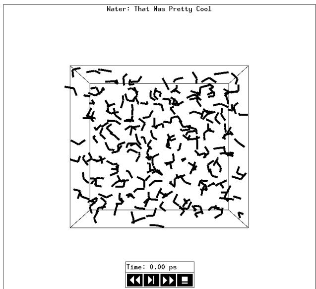  
图 5.49: 显示水盒子的gmx $v i e w _ { \hookrightarrow 2 0 3 }$ 窗口

## 5.10.2 观看轨迹

$$
g m x \ v i e w _ { \odot 2 0 3 }
$$

在进行分析之前，首先观看一下你的轨迹通常可以获得很多信息。GROMACS 附带一个简单的轨迹查看器 $g m x \ v i e w _ { \odot 2 0 3 } ;$ 这个查看器的优点在于它不需要使用 OpenGL，而有些机器，如超级计算机通常不支持OpenGL。你也可以利用查看器生成 EPS 格式的轨迹（见 图 5.49）。如果你想要一个更快功能更多的查看器，有一些程序可以读取 GROMACS 格式的轨迹，请查看我们的 主页↪http://www.gromacs.org 上更新的链接。

## 5.10.3 通用性质

gmx energy↪97，gmx traj↪186

如果需要分析部分或全部的 能量和其他性质，如 总压力，压力张量，密度，盒子体积和 盒子尺寸，请使用gmx energy↪97 程序。运行这个程序后，你可以从能量列表中进行选择，如势能，动能或总能量，也可以选择对能量有单独贡献的部分，如 Lennard-Jones 或二面角能量。

质心速度定义为

$$
{ \mathbf { v } } _ { c o m } = \frac { 1 } { M } \sum _ { i = 1 } ^ { N } m _ { i } { \mathbf { v } } _ { i }\tag{5.370}
$$

其中 $\begin{array} { r } { M = \sum _ { i = 1 } ^ { N } m _ { i } } \end{array}$ 为系统的总质量。可以利用 $g m x \ t r a j _ { \scriptscriptstyle \mathrm { \to 1 8 6 } } \mathrm { - c o m \ - o v }$ 命令实时监测质心。但是，我们建议模拟时在每一步都移除质心的速度（参见算法 $\hookrightarrow 3 3 6$ 一章）!

## 5.10.4 径向分布函数

$$
g m x \ r d f _ { \scriptscriptstyle { \mathrm { < } 1 5 7 } }
$$

?? 类型粒子与 ?? 类型粒子之间的 径向分布函数 (RDF) 或配对相关函数 $g _ { A B } ( r )$ 定义为：

$$
\begin{array} { r c l } { g _ { A B } ( r ) } & { = } & { \displaystyle \frac { \langle \rho _ { B } ( r ) \rangle } { \langle \rho _ { B } \rangle _ { l o c a l } } } \\ & { = } & { \displaystyle \frac { 1 } { \langle \rho _ { B } \rangle _ { l o c a l } } \frac { 1 } { N _ { A } } \sum _ { i \in A } ^ { N _ { A } } { \sum _ { j \in B } ^ { N _ { B } } \frac { \delta ( { r } _ { i j } - r ) } { 4 \pi r ^ { 2 } } } } \end{array}\tag{5.371}
$$

其中 $\langle \rho _ { B } ( r ) \rangle$ 为 ?? 类型粒子周围距离 ?? 处 ?? 类型粒子的密度， $\langle \rho _ { B } \rangle _ { l o c a l }$ 为所有以 ?? 粒子为中心，半径$r _ { m a x }$ 的壳层内 ?? 粒子的平均密度（参见 图 5.50 C）。

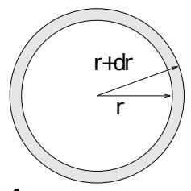  
A

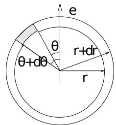

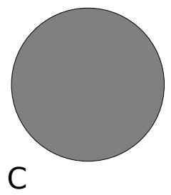

B  
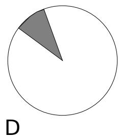  
图 5.50: $g m x \ r d f _ { \scriptscriptstyle { \hookrightarrow } 1 5 7 }$ 中切片的定义： $\mathrm { A } . \ g _ { A B } ( r )$ . B. $g _ { A B } ( r , \theta )$ 。切片为灰色。C。归一化 $\langle \rho _ { B } \rangle _ { l o c a l } . \mathrm { ~ D ~ }$ 。归一化 $\langle \rho _ { B } \rangle _ { l o c a l , \theta \circ }$ 。归一化体积为灰色。

通常 $r _ { m a x }$ 的值取为盒子长度的一半。计算时也会对时间进行平均。具体计算时，分析程序 $g m x \ r d f _ { \scriptscriptstyle { \odot } \scriptscriptstyle { 1 5 } \scriptscriptstyle { 7 } }$ 会将系统划分为球形切片 (从 ?? 到 ?? + ????，见 图 5.50 A)，并生成一个直方图而不是 ?? 函数。SPC 水模型 $8 0 _ { \scriptscriptstyle \odot 5 3 5 }$ 氧-氧 RDF 的一个例子见 图 5.51。

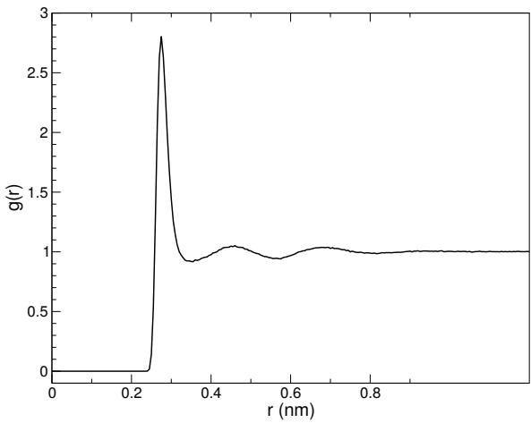  
图 5.51: SPC 水模型氧-氧 $\mathrm { R D F } ~ g _ { O O } ( r )$

也可以使用 $y m x \ r d f _ { \scriptscriptstyle { \mathrm { Q 1 5 7 } } }$ 计算角度相关的 $\mathrm { R D F } ~ g _ { A B } ( r , \theta )$ ，其中角度 ?? 相对于特定的实验室坐标轴 e 进行

定义，参见 图 5.50 B.

$$
g _ { A B } ( r , \theta ) = \frac { 1 } { \langle \rho _ { B } \rangle _ { l o c a l , \theta } } \frac { 1 } { N _ { A } } \sum _ { i \in A } ^ { N _ { A } } \sum _ { j \in B } ^ { N _ { B } } \frac { \delta ( r _ { i j } - r ) \delta ( \theta _ { i j } - \theta ) } { 2 \pi r ^ { 2 } \sin ( \theta ) }\tag{5.372}
$$

$$
\cos ( \theta _ { i j } ) = { \frac { \mathbf { r } _ { i j } \cdot \mathbf { e } } { \| r _ { i j } \| \ \| e \| } }\tag{5.373}
$$

$g _ { A B } ( r , \theta )$ 在分析各向异性系统时很有用。注意，在这种情况下，归一化常数 $\langle \rho _ { B } \rangle _ { l o c a l , \theta }$ 为所有从 ?? 到$\theta + d \theta$ 的角度切片的平均密度，距离一直到 $r _ { m a x }$ ，因此它和角度相关，参见 图 5.50 D.

## 5.10.5 相关函数

相关函数的理论

文献 $1 0 8 _ { \odot 5 3 7 }$ 对相关函数的理论作了很好的论述。我们在这里只介绍 GROMACS 代码中相关函数的各种实现细节。性质 ??(??) 的自相关函数（ACF） $C _ { f } ( t )$ 定义为

$$
C _ { f } ( t ) \ = \ \langle f ( \xi ) f ( \xi + t ) \rangle _ { \xi }\tag{5.374}
$$

其中，等号右侧的符号表示对 ?? 进行平均，即对不同的时间起点进行平均。也可以计算两种性质 $f ( t )$ 和$g ( t )$ 的互相关函数

$$
C _ { f g } ( t ) \ = \ \langle f ( \xi ) g ( \xi + t ) \rangle _ { \xi }\tag{5.375}
$$

但是，GROMACS 中不存在计算这一函数的标准方法（注意：你可以使用 xmgr 程序来计算互相关）。相关函数对时间的积分为相关时间 $\tau _ { f } \colon$

$$
\tau _ { f } ~ = ~ \int _ { 0 } ^ { \infty } C _ { f } ( t ) \mathrm { d } t\tag{5.376}
$$

实际计算时，相关函数是根据时间间隔为 $\Delta t$ 的离散数据点计算的，因此 MD 模拟的 ACF 为：

$$
C _ { f } ( j \Delta t ) ~ = ~ \frac { 1 } { N - j } \sum _ { i = 0 } ^ { N - 1 - j } f ( i \Delta t ) f ( ( i + j ) \Delta t )\tag{5.377}
$$

其中 ?? 为计算时所有可用时间帧的数目。由此得到的 ACF 显然只存在于具有相同时间间隔 $\Delta t$ 的时间点。对于许多应用，由于必须知道 ACF 的短时间行为（如前 10 ps），这通常意味着我们保存数据的时间间隔必须远短于感兴趣的时间尺度。方程 (5.377) 隐含的另一点是，原则上不可能以相同精度计算所有时间点上的 ACF，因为计算 $C _ { f } ( \Delta t )$ 时我们可以使用 $N - 1$ 个数据点，而计算 $C _ { f } ( ( N - 1 ) \Delta t )$ 时只有 1 个数据点可以使用。但是，如果只计算长度为 $M \Delta t$ 的 ACF，其中 $M \leq N / 2$ ，我们就能以相同的统计精度计算所有的点：

$$
C _ { f } ( j \Delta t ) ~ = ~ \frac { 1 } { M } \sum _ { i = 0 } ^ { N - 1 - M } f ( i \Delta t ) f ( ( i + j ) \Delta t )\tag{5.378}
$$

当然这里的 $j < M , \ M$ 有时称为相关函数的时滞。当决定这样做时，对非常短的时间间隔 $( j < < M )$ ,我们故意不使用所有的点，但这使得我们更容易解读结果。当从模拟轨迹计算 ACF 时，不可忽视的另一方面是，时间起点 ?? (方程 (5.374)) 通常不是统计独立的，这可能导致结果存在偏差。可以使用块平均方法对此进行测试。在这种方法中，计算时只包含间距至少为时滞长度的时间起点，例如，使用 ?? 个间距为 $M \Delta t$ 的时间起点 (其中 $k M \leq N )$ :

$$
C _ { f } ( j \Delta t ) ~ = ~ \frac { 1 } { k } \sum _ { i = 0 } ^ { k - 1 } f ( i M \Delta t ) f ( ( i M + j ) \Delta t )\tag{5.379}
$$

然而，以这种方式，需要很长时间的模拟才能得到高精度的结果，因为对 ACF 有贡献的点要少很多。

使用 FFT 计算 ACF

根据方程 (5.377) 计算 ACF 的代价正比于 $N ^ { 2 }$ ，计算量很可观。然而，通过使用快速傅里叶变换进行卷积可以改进 ACF 的计算代价 $1 0 8 _ { \scriptscriptstyle \odot 5 3 7 }$ 。

ACF 的特殊形式

ACF 有一些重要的变体形式，例如，向量 p 的 ACF:

$$
C _ { \bf p } ( t ) \ = \ \int _ { 0 } ^ { \infty } P _ { n } ( \cos \angle ( { \bf p } ( \xi ) , { \bf p } ( \xi + t ) ) \mathrm { d } \xi\tag{5.380}
$$

其中 $P _ { n } ( x )$ 为 ?? 阶 Legendre 多项式 $_ { \mathrm { ~ o ~ } } ^ { \mathrm { ~ 1 ~ } }$ 这种相关时间实际上可以从 NMR 或其他弛豫实验获得。GROMACS 可以使用一阶和二阶 Legendre 多项式计算相关（方程 (5.380)）。这种方法也可用于旋转自相关 $( \ g m x \ r o t a c f _ { \scriptscriptstyle { \hookrightarrow 1 6 5 } } \ )$ 和偶极自相关 $( g m x \ d i p o l e s _ { \scriptscriptstyle  { ering } } )$ 。

为研究扭转角的动力学，我们可以定义二面角的自相关函数 $1 5 9 _ { \hookrightarrow 5 4 0 }$

$$
C ( t ) \ = \ \left. \cos ( \theta ( \tau ) - \theta ( \tau + t ) ) \right. _ { \tau }\tag{5.381}
$$

注意，这不是两个函数的乘积，像通常的相关函数那样，但可以将它重写成两个乘积加和的形式：

$$
C ( t ) \ = \ \left. \cos ( \theta ( \tau ) ) \cos ( \theta ( \tau + t ) ) + \sin ( \theta ( \tau ) ) \sin ( \theta ( \tau + t ) ) \right. _ { \tau }\tag{5.382}
$$

ACF 的一些应用

$g m x \ v e l a c c _ { \odot 2 0 2 }$ 程序可以计算 速度自相关函数。

$$
C _ { \mathbf { v } } ( \tau ) ~ = ~ \langle \mathbf { v } _ { i } ( \tau ) \cdot \mathbf { v } _ { i } ( 0 ) \rangle _ { i \in A }\tag{5.383}
$$

可以利用 Green-Kubo 关系计算自扩散系数 $1 0 8 _ { \hookrightarrow 5 3 7 }$

$$
D _ { A } \ = \ \frac { 1 } { 3 } \int _ { 0 } ^ { \infty } \langle \mathbf { v } _ { i } ( t ) \cdot \mathbf { v } _ { i } ( 0 ) \rangle _ { i \in A } \ d t\tag{5.384}
$$

它只不过是速度自相关函数的积分。人们普遍认为，速度 ACF 的收敛速度比均方位移（见均方位移 $^ { \cdot } {  } 5 1 3$ 一节）快，尽管后者也可用于计算扩散系数。然而，Allen 和 Tildesley108↪537 警告我们，速度 ACF 的长时间贡献不能忽略，因此计算时必须小心。

另一个重要的物理量是偶极相关时间。?? 类型粒子的 偶极相关函数可以利用 $\lg m x \ d i p o l e s _ { \scriptscriptstyle \mathrm { Q 7 9 } }$ 计算，其公式为：

$$
C _ { \mu } ( \tau ) ~ = ~ \langle { \bf \epsilon } _ { i } ( \tau ) \cdot { \bf \epsilon } _ { i } ( 0 ) \rangle _ { i \in A }\tag{5.385}
$$

其中 $\mathbf { \omega } _ { i } = \sum _ { j \in i } \mathbf { r } _ { j } q _ { j }$ 。偶极相关时间可以使用方程 (5.376) 计算。对它的一些应用见（???）。

液体的粘度与压力张量 P 的相关时间有关 $1 6 0 _ { \hookrightarrow 5 4 0 }$ $1 6 1 _ { \hookrightarrow 5 4 0 \circ } g m x e n e r g y _ { \hookrightarrow 9 7 }$ 可以计算粘度，但计算结果并不是很准确 $1 4 9 _ { \hookrightarrow 5 3 9 }$ ，实际上计算值并没有收敛。

## 5.10.6 GROMACS 中的曲线拟合

指数函数加和

有时，将曲线拟合为解析函数很有用，例如，在自相关函数带有拖尾噪声的情况下。然而 GROMACS 不是一个通用的曲线拟合工具，因此它仅支持有限数目的一些函数形式。表 5.18 列出了可用函数类型以及

$$
^ 1 P _ { 0 } ( x ) = 1 , P _ { 1 } ( x ) = x , P _ { 2 } ( x ) = ( 3 x ^ { 2 } - 1 ) / 2
$$

相应的命令行选项。拟合曲线时使用 lmfit 包 $1 6 \mathcal { Q } _ { \mathrm { \hookrightarrow 5 4 0 } }$ 中实现的 Levenberg-Marquardt 算法 (GROMACS中包含了一个简单版本，其中实现了误差加权拟合)。

表 5.18: 计算自相关函数的（大多数）分析工具所支持的拟合函数  
形式概览。备注列给出了输出参数的性质
<table><tr><td rowspan=1 colspan=1>命令行选项</td><td rowspan=1 colspan=1>函数形式 f (t)</td><td rowspan=1 colspan=1>备注</td></tr><tr><td rowspan=1 colspan=1>exp</td><td rowspan=1 colspan=1> $e ^ { - t / a _ { 0 } }$ </td><td rowspan=1 colspan=1></td></tr><tr><td rowspan=1 colspan=1>aexp</td><td rowspan=1 colspan=1> $a _ { 1 } e ^ { - t / a _ { 0 } }$ </td><td rowspan=1 colspan=1></td></tr><tr><td rowspan=1 colspan=1> $\mathsf { e x p \_ e x p }$ </td><td rowspan=1 colspan=1> $a _ { 1 } e ^ { - t / a _ { 0 } } + ( 1 - a _ { 1 } ) e ^ { - t / a _ { 2 } }$ </td><td rowspan=1 colspan=1> $a _ { 2 } \geq a _ { 0 } \geq 0$ </td></tr><tr><td rowspan=1 colspan=1> $\boldsymbol { \mathrm { e x p 5 } }$ </td><td rowspan=1 colspan=1> $a _ { 1 } e ^ { - t / a _ { 0 } } + a _ { 3 } e ^ { - t / a _ { 2 } } + a _ { 4 }$ </td><td rowspan=1 colspan=1> $a _ { 2 } \geq a _ { 0 } \geq 0$ </td></tr><tr><td rowspan=1 colspan=1> $\mathrm { e x p 7 }$ </td><td rowspan=1 colspan=1> $a _ { 1 } e ^ { - t / a _ { 0 } } + a _ { 3 } e ^ { - t / a _ { 2 } } + a _ { 5 } e ^ { - t / a _ { 4 } } + a _ { 6 }$ </td><td rowspan=1 colspan=1> $a _ { 4 } \geq a _ { 2 } \geq a _ { 0 } \geq 0$ </td></tr><tr><td rowspan=1 colspan=1> $\mathtt { e x p 9 }$ </td><td rowspan=1 colspan=1> $a _ { 1 } e ^ { - t / a _ { 0 } } + a _ { 3 } e ^ { - t / a _ { 2 } } + a _ { 5 } e ^ { - t / a _ { 4 } } + a _ { 7 } e ^ { - t / a _ { 6 } } + a _ { 8 }$ </td><td rowspan=1 colspan=1> $a _ { 6 } \geq a _ { 4 } \geq a _ { 2 } \geq a _ { 0 } \geq 0$ </td></tr></table>

## 误差估计

GROMACS 内部实现了更多函数拟合形式，即估计时间相关数据误差的函数，它由 Hess 提出 $1 4 9 _ { \hookrightarrow 5 3 9 }$

$$
\varepsilon ^ { 2 } ( t ) = \alpha \tau _ { 1 } \left( 1 + \frac { \tau _ { 1 } } { t } \left( e ^ { - t / \tau _ { 1 } } - 1 \right) \right) + ( 1 - \alpha ) \tau _ { 2 } \left( 1 + \frac { \tau _ { 2 } } { t } \left( e ^ { - t / \tau _ { 2 } } - 1 \right) \right)\tag{5.386}
$$

其中 $\tau _ { 1 }$ 和 $\tau _ { 2 }$ 为时间常数 $( \tau _ { 2 } \geq \tau _ { 1 } )$ ，?? 通常接近于 1(在拟合中会强制 $0 \leq \alpha \leq 1 )$ 。gmx analyze↪50 使用这一函数进行误差估计

$$
\operatorname* { l i m } _ { t \to \infty } \varepsilon ( t ) = \sigma \sqrt { \frac { 2 ( \alpha \tau _ { 1 } + ( 1 - \alpha ) \tau _ { 2 } ) } { T } }\tag{5.387}
$$

其中 $\sigma$ 为数据集的标准偏差，而 ?? 为总模拟时间 $1 4 9 _ { \hookrightarrow 5 3 9 }$ 0

## 两相边界的划分

为确定界面的位置和宽度，Steen-Sæthre 等人使用下面的函数拟合密度剖面。

$$
f ( x ) = \frac { a _ { 0 } + a _ { 1 } } { 2 } - \frac { a _ { 0 } - a _ { 1 } } { 2 } \mathrm { e r f } \left( \frac { x - a _ { 2 } } { a _ { 3 } ^ { 2 } } \right)\tag{5.388}
$$

其中 $a _ { 0 }$ 和 $a _ { 1 }$ 为不同相的密度，?? 为垂直于界面的坐标， $a _ { 2 }$ 为界面的位置， $a _ { 3 }$ 为界面的宽度 $1 6 3 _ { \hookrightarrow 5 4 0 } \circ$ gmx densorder↪76 中实现了这种方法。

## 横向电流自相关函数

为了获得横向电流自相关函数（可用于计算粘度 $1 6 4 _ {  5 4 0 } \ )$ ），可以使用下面的函数进行拟合：

$$
f ( x ) ~ = ~ e ^ { - \nu } \left( \cosh ( \omega \nu ) + \frac { \sinh ( \omega \nu ) } { \omega } \right)\tag{5.389}
$$

其中 $\nu = x / ( 2 a _ { 0 } ) , \ \omega = \sqrt { 1 - a _ { 1 \circ } } \ g m x \ t c a f _ {  1 8 5 }$ 中实现了这一拟合。

## 基于压力自相关函数估计粘度

众所周知，从模拟轨迹计算粘度性质非常困难 $1 4 9 _ { \hookrightarrow 5 3 9 } , 1 6 5 _ { \hookrightarrow 5 4 0 0 }$ 原则上可以通过积分压力自相关函数来确定粘度 $1 6 0 _ { \hookrightarrow 5 4 0 }$ ，然而这种方法常常会因 ACF 的拖尾噪声而难以实施。一种解决方法是将 ACF 拟合为下面的函数 $1 6 6 _ { \div 5 4 0 }$ :

$$
f ( t ) / f ( 0 ) = ( 1 - C ) \mathrm { c o s } ( \omega t ) e ^ { - ( t / \tau _ { f } ) ^ { \beta _ { f } } } + C e ^ { - ( t / \tau _ { s } ) ^ { \beta _ { s } } }\tag{5.390}
$$

其中 $\omega$ 为快速压力振荡的频率（主要来自分子模拟中的成键力），?? 和 $\tau _ { f }$ $\beta _ { f }$ 分别为伸缩指数近似下快弛豫的时间常数和指数。 $\tau _ { s }$ 和 $\beta _ { s }$ 为慢弛豫对应的值，?? 为指前因子，决定快慢弛豫之间的比例。拟合后，函数 $f ( t )$ 的积分可用于计算粘度：

$$
\eta = \frac { V } { k _ { B } T } \int _ { 0 } ^ { \infty } f ( t ) d t\tag{5.391}
$$

这一方程已被用于基于压力张量的不同元素来计算体积和剪切粘度 $1 6 \% _ { \odot 5 4 0 ^ { \circ } }$ O

## 5.10.7 均方位移

gmx msd↪139

为确定 ?? 类型粒子的自扩散系数 $D _ { A }$ ，可以使用爱因斯坦关系式 $1 0 8 _ { \odot 5 3 7 }$

$$
\operatorname* { l i m } _ { t \to \infty } \langle \| { \mathbf { r } } _ { i } ( t ) - { \mathbf { r } } _ { i } ( 0 ) \| ^ { 2 } \rangle _ { i \in A } = 6 D _ { A } t\tag{5.392}
$$

可使用 $g m x \ m s d _ { \odot \mathrm { 1 3 9 } }$ 程序计算 均方位移和 $D _ { A } .$ 。计算时通常使用一个包含原子编号的索引文件，并对这些原子的 MSD 进行平均。对含有多个原子的分子， $\mathbf { r } _ { i }$ 可取为分子的质心位置。在这种情况下，需要使用包含分子编号的索引文件。然而，结果几乎与原子平均的结果相同。 $g m x \ m s d _ { \odot } \ l _ { \mathrm { 1 3 9 } }$ 程序也可用于计算一维或二维的扩散。这有助于研究界面上的横向扩散。

SPC 水模型均方位移的一个例子见 图 5.52。

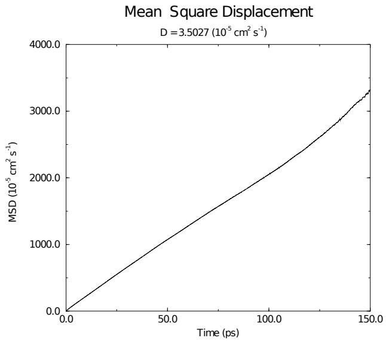  
图 5.52: SPC 水模型的均方位移。

## 5.10.8 键/距离，键角和二面角

gmx distance↪82，gmx angle↪52，gmx gangle↪103

为监测分子中特定的 键，或者更一般的说，点之间的距离，可以使用gmx distance 程序，它可以计算距离随时间的变化，以及距离的分布。使用传统的索引文件时，索引组里面应该包含原子编号对，例如：

程序也支持选区，前两个位置定义了第一个距离，第二对位置定义了第二个距离，依此类推。你可以使用下面的选区语句计算所有残基中 CA 和 CB 原子间的距离（假定每个残基或者同时含有这个两类原子，或者不含有二者中的任何一类）:

name CA CB

也可以使用选区计算更一般的距离。例如，要计算两个残基质心间的距离，可以使用：

com of resname AAA plus com of resname BBB

gmx angle 程序可以计算 键角和 二面角的时间分布。还可以给出了平均键角或二面角。计算时索引文件中需要包含原子编号三联对或四联对：

对于二面角，你可以使用“生化惯例”（?? = 0 ≡ ?????? 顺式）或“聚合物惯例”（?? = 0 ≡ ?????????? 反式），参见 图 5.53。

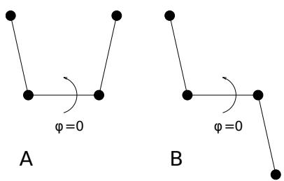  
图 5.53: 不同的二面角惯例：A. “生化惯例”。B. “聚合物惯例”.

$g m x \ g a n g l e _ {  1 0 3 }$ 程序计算角度时可以支持动态选区。此工具也可以计算角度和二面角，但并不支持gmx$a n g l e _ { \hookrightarrow 5 2 }$ 的所有选项，例如自相关或其他时间序列分析。此外，它支持两个向量之间的夹角，向量与平面，两个平面（分别由 2 或 3 个点定义），向量/平面与 ?? 轴，或向量/平面与球体（由单个位置确定）法线之间的角度。程序还可以计算向量/平面与其在第一帧中的位置之间的角度。对于平面，gmx gangle↪103使用垂直于平面的法线向量。各种定义见 图 5.54 A，B，C)。

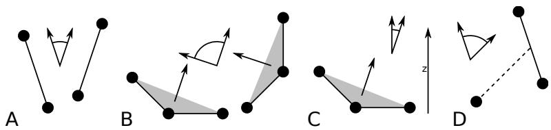  
图 5.54: gmx gangle↪103 的角度选项：A。两个向量间的夹角。B。两个平面间的夹角。C。向量与 ?? 轴间的夹角。D。向量与球体法线间的夹角。还支持其他组合：平面和向量可以互换使用。

## 5.10.9 回旋半径和距离

gmx gyrate↪111，gmx distance↪82, gmx mindist↪136，gmx mdmat↪130, gmx pairdist↪147，gmx xpm2ps↪211

要粗略地测量结构的密实程度，可以使用 $g m x \ g y r a t e _ {  1 1 1 }$ 程序计算 回旋半径：

$$
R _ { g } \ = \ \left( \frac { \sum _ { i } \| { \bf r } _ { i } \| ^ { 2 } m _ { i } } { \sum _ { i } m _ { i } } \right) ^ { \frac { 1 } { 2 } }\tag{5.393}
$$

其中 $m _ { i }$ 为原子 ?? 的质量， $\mathbf { r } _ { i }$ 为原子 ?? 相对于分子质心的位置。回旋半径特别适用于表征聚合物溶液和蛋白质。该程序还可以给出相对于坐标轴（也可以选择主轴）的回旋半径，计算时只对垂直于每个轴的半径分量进行相加，如

$$
R _ { g , x } \ = \ \left( \frac { \sum _ { i } \left( r _ { i , y } ^ { 2 } + r _ { i , z } ^ { 2 } \right) m _ { i } } { \sum _ { i } m _ { i } } \right) ^ { \frac 1 2 }\tag{5.394}
$$

有时，你可能对两个原子之间的 距离或两组原子（如盐桥中的蛋白质侧链）之间的 最小距离感兴趣。要计算某些组之间的距离，可采用下面的方法：

• 要计算两个组的 几何中心之间的距离，可以使用 $g m x \ d i s t a n c e _ { \hookrightarrow 8 2 }$ 程序，参见键/距离，键角和二面角 $\hookrightarrow 5 1 3$ 一节的说明。

• 要计算不同时刻两组原子之间的 最小距离，可以使用gmx mindist↪136。它同时还可以计算这些组之间在特定半径 $r _ { m a x }$ 范围内的 接触数。

$g m x ~ p a i r d i s t _ { \odot 1 4 7 }$ 的功能等同于 $\dot { { ' } } g m x \ m i n d i s t _ { { \mathrm { { - } 1 3 6 } } }$ ，但支持选区语法。

• 要监测（蛋白质）分子中 氨基酸残基之间的最小距离，可以使用 $g m x \ m d m a t _ {  1 3 0 }$ 程序。两个残基$\mathrm { A } _ { i }$ 和 $\mathrm { A } _ { j }$ 之间的最小距离定义为任何一对原子 $( \mathrm { i } \in \mathrm { A } _ { i } , \mathrm { j } \in \mathrm { A } _ { j } )$ 之间的距离的最小值。程序输出一个所有残基之间最小距离的对称矩阵。你可以使用诸如 xv 之类的程序可视化这个矩阵。如果要查看坐标轴和图例，或者要打印矩阵，你可以使用 $x p m \mathcal { Q } p s _ { \scriptscriptstyle { \Theta } , \scriptscriptstyle { \Theta } }$ 将其转换为 Postscript 图片，如 图5.55。

• 绘制不同时刻的距离矩阵，就可以分析结构的变化和其他一些信息，如盐桥的形成。

## 5.10.10 结构的均方根偏差

$$
g m x ~ r m s _ { \scriptscriptstyle  { 1 6 0 } } , ~ g m x ~ r m s d i s t _ { \scriptscriptstyle  { 1 6 2 } }
$$

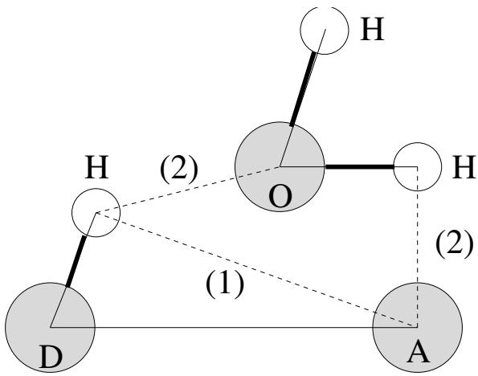  
图 5.57: 水插入氢键。(1) 两个残基之间的正常氢键。(2) 通过一个水分子形成的氢键桥。

• 对所有氢键存在函数（0 或 1）的所有自相关函数进行平均，计算得到的氢键寿命：

$$
C ( \tau ) ~ = ~ \langle s _ { i } ( t ) ~ s _ { i } ( t + \tau ) \rangle\tag{5.407}
$$

• 对 ?? 时刻的氢键 ??， $s _ { i } ( t ) = \{ 0 , 1 \}$ 。??(??) 的积分给出了氢键平均寿命 $\tau _ { H B }$ 的粗略估计：

$$
\tau _ { H B } ~ = ~ \int _ { 0 } ^ { \infty } C ( \tau ) d \tau\tag{5.408}
$$

• 程序会输出积分和完整的自相关函数 $C ( \tau )$ ，因此可以进行更加复杂的分析（如多指数拟合）以便得到 $\tau _ { H B }$ 的更佳估计值。更完整的分析可以参考文献 $1 7 3 _ { \hookrightarrow 5 4 0 } ;$ 一个更花哨的选项是氢键动力学的Luzar 和 Chandler 分析 $1 7 \mathit { 4 } _ {  \mathrm { 5 4 0 } } , \quad 1 7 5 _ {  \mathrm { 5 4 0 } }$ 。

• 生成维数为 #H-bonds×#frames 的氢键存在映射图。顺序与索引文件（见下文）中的完全相同，但进行了反转，这意味着索引文件中的最后一个原子编号三联对与存在映射图的第一行对应。

• 输出索引组，其中包含分析组，这些组中的所有给体-氢原子对和受体原子，分析组之间涉及氢键的给体-氢-受体三联对，所有参与及插入的溶剂原子。

## 5.10.14 蛋白质相关分析

$$
g m x ~ d o \_ d s s p _ { \scriptscriptstyle {  } 8 4 } , ~ g m x ~ r a m a _ { \scriptscriptstyle { \ < 1 5 6 } } , ~ g m x ~ w h e e l _ { \scriptscriptstyle { \ < 2 0 8 } }
$$

要分析蛋白质的结构变化，可以计算回旋半径或最小残基距离（见回旋半径和距离 $_ { 9 5 1 5 } \ : - \frac { \# } { \mathsf { J } } \ : \bigr )$ ）随时间的变化，或计算 RMSD（见结构的均方根偏差 $. _ { \textrm { c s t } } - \frac { + \dagger } { \mathsf { I } } ~ ) ,$ 。

你也可以查看模拟过程中蛋白质 二级结构元素的变化。为此，你可以使用 $g m x ~ d o \_ d s s p _ { \hookrightarrow 8 4 }$ 程序，它是商业程序 $\mathrm { D S S P } 1 7 6 _ { \hookrightarrow 5 4 0 }$ 的接口。更多信息请参阅 DSSP 手册。 $g m x ~ d o \_ { \substack { d s s p _ { \hookrightarrow 8 4 } } }$ 程序的一个典型输出见 图5.58。

另一个重要的蛋白质分析是所谓的 Ramachandran 图（拉氏图）。它是将蛋白质结构投影到蛋白骨架的两个二面角 $\phi$ 和 $\psi$ 得到的，见 图 5.59:

你可以使用 $g m x \ r a m a _ { \scriptscriptstyle { \to } 1 5 6 }$ 程序计算拉氏图。图 5.60 是一个典型的输出。

研究 ?? 螺旋时，多肽的 螺旋轮投影很有用，可用于查看多肽是否具有两亲性。你可以使用 $g m x \ w h e e l _ { \hookrightarrow 2 0 8 }$ 程序获得这样的投影图。图 5.61 给出了两个示例。

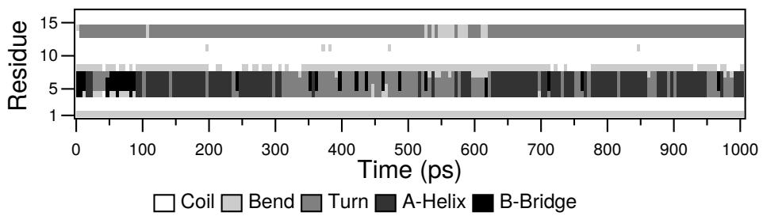  
图 5.58: 多肽二级结构元素的时间演化分析。

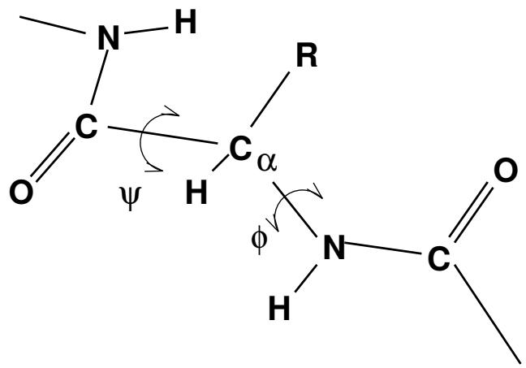  
图 5.59: 蛋白质骨架的二面角 ?? 和 ?? 的定义。

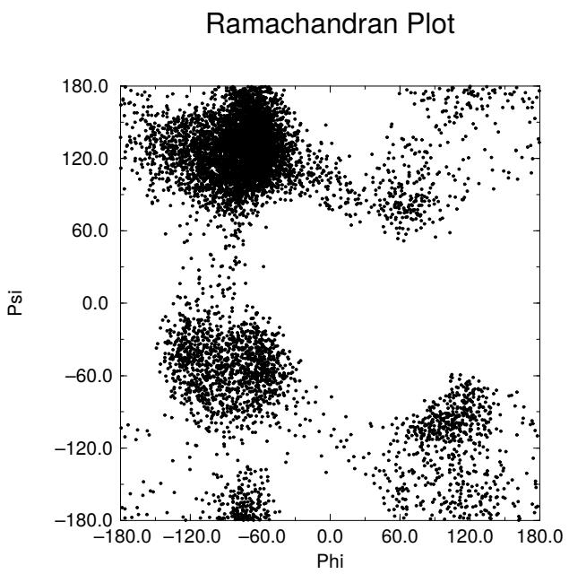  
图 5.60: 一个小蛋白质的拉氏图。

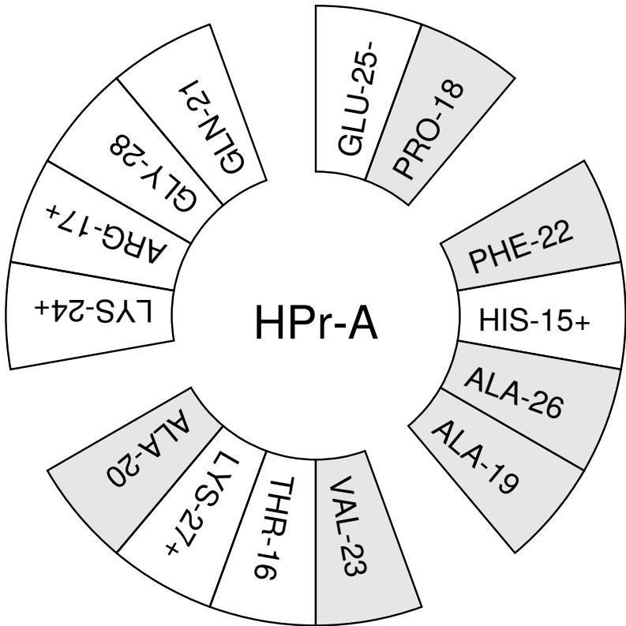  
图 5.61: HPr 多肽 N 端螺旋的螺旋轮投影。

## 5.10.15 界面相关的分析

$$
g m x ~ o r d e r _ { < 1 4 6 } , ~ g m x ~ d e n s i t y _ {  7 2 } , ~ g m x ~ p o t e n t i a l _ { < 1 5 4 } , ~ g m x ~ t r a j _ { < 1 8 6 }
$$

如果模拟分子的尾部具有长的碳链，计算它们的平均取向可能有助于分析。序参数有几种不同的形式，其中的大多数是相关的。 $g m x ~ o r d e r _ { \hookrightarrow 1 4 6 }$ 程序可使用下面的方程计算序参数：

$$
S _ { z } = \frac { 3 } { 2 } \langle \cos ^ { 2 } \theta _ { z } \rangle - \frac { 1 } { 2 }\tag{5.409}
$$

其中 $\theta _ { z }$ 为模拟盒子的 ?? 轴与待研究的分子轴之间的夹角。后者定义为从 $\mathrm { C } _ { n - 1 }$ 到 $\mathrm { C } _ { n + 1 }$ 的向量。序参数$S _ { x }$ 和 $S _ { y }$ 的定义方式类似。尖括号意味着要对时间和分子进行平均。序参数可以在 1（沿界面法向完全有序）和 −1/2 （完全垂直于界面法向）之间变化，其值为零意味着取向具有各向同性。

此程序有两个功能。它可以分别计算每个 $\mathrm { C H _ { 2 } }$ 片段，相对于任何一个坐标轴的序参数，或者也可以将盒子划分为切片，并计算一个切片中每个片段序参数的平均值。第一种方法可用于说明分子从头到尾是如何排列的，第二种方法给出了排列沿盒子某一方向的变化。

通过计算一条轨迹的电荷密度 $\rho ( z )$ 的双重积分，可以得到穿过界面的静电势 (??):

$$
\psi ( z ) - \psi ( - \infty ) = - \int _ { - \infty } ^ { z } d z ^ { \prime } \int _ { - \infty } ^ { z ^ { \prime } } \rho ( z ^ { \prime \prime } ) d z ^ { \prime \prime } / \epsilon _ { 0 }\tag{5.410}
$$

其中位置 $z = - \infty$ 在体相中足够远，相应的场强为零。使用这种方法，可以将总的势能“划分”为分别来自脂质和水分子的贡献。 $g m x \ p o t e n t i a l _ { \scriptscriptstyle { \mathrm { < 1 5 4 } } }$ 程序将盒子划分为切片，并将每个切片中原子的所有电荷相加。然后程序会积分电荷密度得到电场，再积分电场得到势能。电荷密度，电场和势能会写入 xvgr 输入文件中。

gmx traj 是一个非常简单的分析程序。它的功能是输出所选原子的坐标，速度或力。它也可以计算一个或多个分子的质心，并将质心坐标输出到三个文件中。这个分析功能自身可能并不是一个非常有用，但获得所选分子或原子的坐标便于进一步的分析，而且也不仅仅对界面系统是这样。

$g m x \ d e n s i t y _ {  7 2 }$ 程序可以计算原子组的质量密度，并给出密度沿盒子轴向的分布图。这有助于查看穿过界面的组或原子的分布。

## 5.11 一些实现细节

在本章中，我们将介绍一些实现细节。这些内容远远称不上完备，但我们认为有必要澄清一些事情，否则将难以理解。

## 5.11.1 GROMACS 中的单个加和维里

维里 Ξ 可以写成全张量形式：

$$
\boldsymbol \Xi \ = \ - \frac 1 2 \ \sum _ { i < j } ^ { N } \ \mathbf { r } _ { i j } \otimes \mathbf { F } _ { i j }\tag{5.411}
$$

其中 $\otimes$ 表示两个向量的 直积 $\circ ^ { 1 }$ 当在 MD 程序的内循环中计算直积时，需要 9 次乘法运算和 9 次加法运算。2

这里将展示如何将维里计算从内循环中提取出来 $1 7 \%$ ↪540。

维里

在具有周期性边界条件的系统中，必须考虑维里的周期性：

$$
\boldsymbol \Xi \ = \ - \frac 1 2 \ \sum _ { i < j } ^ { N } \ \mathbf { r } _ { i j } ^ { n } \otimes \mathbf { F } _ { i j }\tag{5.412}
$$

其中 $\mathbf { r } _ { i j } ^ { n }$ 表示从原子 $j$ 到原子 ?? 的 最近映像的距离向量。在这个定义中，我们为原子 ?? 的位置向量 $\mathbf { r } _ { i }$ 增加了一个 移位向量 $\delta _ { i ^ { \varsigma } }$ 。因此，差向量等于：

$$
\mathbf { r } _ { i j } ^ { n } \ = \ \mathbf { r } _ { i } + \delta _ { i } - \mathbf { r } _ { j }\tag{5.413}
$$

或者简写为：

$$
\mathbf { r } _ { i j } ^ { n } \ = \ \mathbf { r } _ { i } ^ { n } - \mathbf { r } _ { j }\tag{5.414}
$$

在三斜系统中，?? 有 27 种可能的映像；当使用截角八面体时，有 15 个可能的映像。

非键力的维里

这里给出了 非键力子程序中单个加和维里的推导。对于 GROMACS，以下几点我们需要特殊考虑：

• 在计算短程相互作用时，我们使用 最小映像约定，并且只考虑每个邻居的最近映像，特别地，我们从不考虑粒子与其任何周期映像之间的相互作用。这意味着，对于下面的所有方程，?? ≠ ??。

• 通常，可以将 ?? 或 $j$ 粒子移位到相邻的单元格以获得最近的相互作用 (移位 $\delta _ { i j } )$ 。然而，按照最小映像约定，处于中心单元格的粒子最多可以有 27 种不同的移位，对于典型的（非常短程的）生物分子相互作用，每个粒子通常只涉及几种不同的移位，更不用说每种相互作用只能出现一个移位。

• 对于 GROMACS 的非键相互作用，我们使用这一点来将每个 ?? 粒子的邻区列表划分为多个单独的列表，其中每个列表对于 ?? 粒子都具有固定的移位 $\delta _ { i \circ }$ 。我们可以将其表示为移位的加和 (对移位使用索引 ??)，约束条件是每个粒子的相互作用只能对加和中的一项有贡献，并且移位不再依赖于 ??粒子。对于任何加和项，如果它不含有对 ?? 的复杂依赖关系，这意味着总和可以简单地转化为对 ??和/或 $j$ 的加和。

1 (u ⊗ $\mathbf { v } ) ^ { \alpha \beta } = \mathbf { u } _ { \alpha } \mathbf { v } _ { \beta }$

2 Lennard-Jones 和库仑力的计算大约需要 50 次浮点运算。

• 为了简化其中的一些求和项，我们将对 $j < i$ 的加和项替换为对所有粒子的双重加和 (记住 $i \neq j )$ 并将其除以 2。

根据维里的上述定义，我们得到

$$
\begin{array} { r l r } & { \frac { 1 } { 2 } \sum _ { j \in \mathcal { I } _ { j } \setminus j \in \mathcal { I } _ { j } } ^ { \infty } } & { \frac { 1 } { 2 } \sum _ { j \in \mathcal { I } _ { j } \setminus j \in \mathcal { I } _ { j } } ^ { \infty } } \\ & { = } & { \frac { 1 } { 2 } \sum _ { j \in \mathcal { I } _ { j } \setminus j \in \mathcal { I } _ { j } } ^ { \infty } \frac { 1 } { \rho } \sum _ { \theta \in \mathcal { I } _ { j } \setminus j \in \mathcal { I } _ { j } } ^ { \infty } } \\ & { } & { \times \frac { 1 } { 2 } \sum _ { j \in \mathcal { I } _ { j } \setminus j \in \mathcal { I } _ { j } } ^ { \infty } \frac { 1 } { \rho } \sum _ { \theta \in \mathcal { I } _ { j } \setminus j \in \mathcal { I } _ { j } } ^ { \infty } } \\ & { = } & { \frac { 1 } { 2 } \sum _ { j \in \mathcal { I } _ { j } \setminus j \in \mathcal { I } _ { j } } ^ { \infty } \frac { 1 } { \rho } \sum _ { \theta \in \mathcal { I } _ { j } \setminus j \in \mathcal { I } _ { j } } ^ { \infty } } \\ & { } & { \times \frac { 1 } { 2 } \sum _ { j \in \mathcal { I } _ { j } \setminus j \in \mathcal { I } _ { j } \setminus j \in \mathcal { I } _ { j } \setminus j \cup \mathcal { I } _ { j } } ^ { \infty } } \\ & { = } & { \frac { 1 } { 2 } \sum _ { j \in \mathcal { I } _ { j } \setminus j \in \mathcal { I } _ { j } \setminus j \in \mathcal { I } _ { j } \setminus j \cup \mathcal { I } _ { j } } ^ { \infty } } \\ & { } & { \times \frac { 1 } { 2 } \sum _ { j \in \mathcal { I } _ { j } \setminus j \in \mathcal { I } _ { j } \setminus j \in \mathcal { I } _ { j } \setminus j \cup \mathcal { I } _ { j } } ^ { \infty } } \\ & { = } &  \frac { 1 } { 2 } \sum _  j \in \mathcal { I } _ { j } \setminus j \in \mathcal { I } _  \end{array}
$$

在倒数第二步中，我们利用了每个移位向量本身与粒子 ?? 坐标无关的性质，因此可以将每个移位向量对应的所有力相加（在非键内核中），然后在内核之外再对不同移位向量进行一次加和。我们还使用了

$$
\begin{array} { r l } { \mathbf { F } _ { i } ~ = ~ } & { { } \displaystyle \sum _ { j = 1 } ^ { N } \mathbf { F } _ { i j } } \\ { \mathbf { F } _ { j } ~ = ~ } & { { } \displaystyle \sum _ { i = 1 } ^ { N } \mathbf { F } _ { j i } } \end{array}\tag{5.415}
$$

这是 $j$ 对 ?? 的总作用力。因为我们使用了牛顿第三定律：

$$
\mathbf { F } _ { i j } ~ = ~ - \mathbf { F } _ { j i }\tag{5.416}
$$

在实现中，我们必须将包含移位 $\delta _ { i }$ 的项加倍。类似地，在一些地方，我们会将依赖于移位的力对所有移位进行加和，得出每一相互作用或每一粒子的总力。

这样就将总维里 Ξ 分解为两项，对粒子的单个加和 $\Xi _ { 0 }$ ，以及描述粒子移位影响的 $\Xi _ { 1 }$ ，只有后者需要对不同移位向量进行加和。

分子内移位（mol-shift）

对成键力和 SHAKE，可以制作 分子移位列表，其中存储了周期性。我们简单地使用一个数组 mshift，其中存储了每个原子在 shiftvec 数组中的索引。

生成此列表的算法可以从图论推导出来，将分子中的每个粒子视为图中的节点，将键视为图的边。

1. 用双向图表示键和原子

2. 令所有原子为白色

3. 将其中一个白色原子变为黑色 (原子 ??) 并将其置于中心的盒子

4. 对 ?? 的每个相邻原子，如果当前为白色，则将其变为灰色

5. 选择其中一个灰色原子 (原子 ??)，相对于它的所有黑色相邻原子，给予正确的周期性，并将其变为黑色

6. 对 ?? 的每个相邻原子，如果当前为白色，则将其变为灰色

7. 如果还有任何灰色原子，则转到步骤 5

8. 如果还有任何白色原子，则转到步骤 3使用这个算法我们可以

• 优化成键力计算以及 SHAKE

• 再次使用单个加和方法从成键力计算维里

找到键的双向图表示。

共价键的维里

由于共价键力对维里有贡献，我们有：

$$
\begin{array} { r l r } { \boldsymbol { b } } & { = } & { \| \mathbf { r } _ { i j } ^ { n } \| } \\ { V _ { b } } & { = } & { \frac { 1 } { 2 } k _ { b } ( b - b _ { 0 } ) ^ { 2 } } \\ { \mathbf { F } _ { i } } & { = } & { - \nabla V _ { b } } \\ & { = } & { k _ { b } ( b - b _ { 0 } ) \frac { \mathbf { r } _ { i j } ^ { n } } { b } } \\ { \mathbf { F } _ { j } } & { = } & { - \mathbf { F } _ { i } } \end{array}\tag{5.417}
$$

共价键对维里的贡献为：

$$
\begin{array} { r l r } { \Xi _ { b } = } & { - \cfrac { 1 } { 2 } ( \mathbf r _ { i } ^ { n } \otimes \mathbf F _ { i } + \mathbf r _ { j } \otimes \mathbf F _ { j } ) } & \\ & { = } & { - \cfrac { 1 } { 2 } \mathbf r _ { i j } ^ { n } \otimes \mathbf F _ { i } } \end{array}\tag{5.418}
$$

## SHAKE 的维里

SHAKE 对维里有着重要贡献。为满足约束条件，会向受 SHAKE 的粒子施加作用力 G。如果这个力不是来自算法（如标准 SHAKE），则可以在之后计算（当使用 蛙跳式算法时）:

$$
\begin{array} { r l r } { \Delta \mathbf { r } _ { i } } & { = } & { \mathbf { r } _ { i } ( t + \Delta t ) - [ \mathbf { r } _ { i } ( t ) + \mathbf { v } _ { i } ( t - \frac { \Delta t } { 2 } ) \Delta t + \frac { \mathbf { F } _ { i } } { m _ { i } } \Delta t ^ { 2 } ] } \\ & { } & \\ { \mathbf { G } _ { i } } & { = } & { \cfrac { m _ { i } \Delta \mathbf { r } _ { i } } { \Delta t ^ { 2 } i } } \end{array}\tag{5.419}
$$

在一般情况下，这对我们没有帮助。只有当不需要周期性时（如在刚性水中），才可以使用上面的公式，否则我们必须在 SHAKE 的内部循环中增加维里计算。

当 适用时，可以使用单个加和方法计算维里：

$$
\boldsymbol \Xi \ = \ - \frac { 1 } { 2 } \sum _ { i } ^ { N _ { c } } \ \mathbf { r } _ { i } \otimes \mathbf { F } _ { i }\tag{5.420}
$$

其中 $N _ { c }$ 为受约束原子的数目。

## 5.11.2 优化

在这里，我们描述 GROMACS 中使用的一些算法优化，但不包括并行性。

## 用于水的内部循环

GROMACS 使用特殊的内部循环来计算水分子与其他原子的非键相互作用，使用另一组循环计算水分子之间的相互作用。这些高度优化的循环用于两种类型的水模型。对于类似 SPC 的三位点模型 $8 0 _ { \hookrightarrow 5 3 5 }$ 即

1. 分子中有三个原子。

2. 整个分子属于单个电荷组。

3. 第一个原子具有 Lennard-Jones(Lennard-Jones 相互作用 $\hookrightarrow 3 7 7 \ \longrightarrow \overleftarrow { \boldsymbol { \mathsf { I } } } \ \overline { { \mathsf { I } } } \ \overline { { \mathsf { I } } } \ \overline { { \mathsf { I } } }$ 和库仑（库仑相互作用 $_ { \odot 3 7 9 } -$ 节）相互作用。

4. 第二个原子和第三个原子只具有库仑相互作用，且电荷相等。

这些循环也适用于 $\mathrm { S P C / E ~ } \ : 1 7 8 _ { \hookrightarrow 5 4 1 }$ 和 $\mathrm { T I P 3 P } \ : 1 \mathcal { Z } \delta _ { \hookrightarrow 5 3 8 }$ 水模型。对于类似 TIP4P 的四位点水模型 $1 2 8 _ { \scriptscriptstyle \odot 5 3 8 } ;$

1. 分子中有四个原子。

2. 整个分子属于单个电荷组。

3. 第一个原子只具有 Lennard-Jones(Lennard-Jones 相互作用↪377 一节) 相互作用。

4. 第二个原子和第三个原子只具有库仑（库仑相互作 $\mathbb { H } _ { \hookrightarrow 3 7 9 } \longrightarrow \# \ )$ 相互作用，且电荷相同。

5. 第四个原子只具有库仑相互作用。

这些实现方式的优点在于，在单个循环中有更多的浮点运算，这意味着一些编译器可以更好地调度代码。然而，事实证明，即使是一些最先进的编译器也存在调度问题，这意味着需要手动调整才能获得最佳性能。这可能包括消除公共子表达式或移动代码。

## 5.12 平均值与波动

## 5.12.1 平均值公式

注意：本节取自文献 $1 7 9 _ { \hookrightarrow 5 4 1 }$

当分析 MD 轨迹时，需要计算平均值 ⟨??⟩ 及其波动

$$
\langle ( \Delta x ) ^ { 2 } \rangle ^ { \frac { 1 } { 2 } } = \langle [ x - \langle x \rangle ] ^ { 2 } \rangle ^ { \frac { 1 } { 2 } }\tag{5.421}
$$

它们对应于物理量 ??。 $N _ { x }$ 个值 $\{ x _ { i } \}$ 的方差 $\sigma _ { x }$ ，可以利用下式计算：

$$
\sigma _ { x } \ = \ \sum _ { i = 1 } ^ { N _ { x } } x _ { i } ^ { 2 } \ - \ { \frac { 1 } { N _ { x } } } \left( \sum _ { i = 1 } ^ { N _ { x } } x _ { i } \right) ^ { 2 }\tag{5.422}
$$

遗憾的是，这个公式在数值上不是很精确，特别是当 $\sigma _ { x } ^ { \frac { 1 } { 2 } }$ 的值比 $x _ { i }$ 小的时候。下面（等效）的表达式在数值上更精确

$$
\sigma _ { x } ~ = ~ \sum _ { i = 1 } ^ { N _ { x } } [ x _ { i } - \langle { x } \rangle ] ^ { 2 }\tag{5.423}
$$

其中

$$
\langle x \rangle ~ = ~ { \frac { 1 } { N _ { x } } } \sum _ { i = 1 } ^ { N _ { x } } x _ { i }\tag{5.424}
$$

使用方程 (5.422) 和 (5.424) 进行计算时，必须遍历 $x _ { i }$ 序列两次，第一次确定 ⟨??⟩，第二次计算 $\sigma _ { x }$ ，而使用 (5.421) 只需要按顺序扫描 $\{ x _ { i } \}$ 一次。但是，可以将方程 (5.422) 改写为另一种形式，其中包含部分加和，这样就可以使用顺序更新算法。定义部分加和

$$
X _ { n , m } \ = \ \sum _ { i = n } ^ { m } x _ { i }\tag{5.425}
$$

和部分方差

$$
\sigma _ { n , m } ~ = ~ \sum _ { i = n } ^ { m } \left[ x _ { i } - { \frac { X _ { n , m } } { m - n + 1 } } \right] ^ { 2 }\tag{5.426}
$$

可以证明

$$
X _ { n , m + k } \ = \ X _ { n , m } + X _ { m + 1 , m + k }\tag{5.427}
$$

以及

$$
\begin{array} { r l } { \sigma _ { n , m + k } = } & { \sigma _ { n , m } + \sigma _ { m + 1 , m + k } + \bigg [ \cfrac { X _ { n , m } } { m - n + 1 } - \cfrac { X _ { n , m + k } } { m + k - n + 1 } \bigg ] ^ { 2 } * } \\ & { \cfrac { ( m - n + 1 ) ( m + k - n + 1 ) } { k } } \end{array}
$$

对 $n = 1$ ，可以发现

$$
\sigma _ { 1 , m + k } ~ = ~ \sigma _ { 1 , m } + \sigma _ { m + 1 , m + k } ~ + ~ \biggl [ ~ \frac { X _ { 1 , m } } { m } - \frac { X _ { 1 , m + k } } { m + k } ~ \biggr ] ^ { 2 } ~ \frac { m ( m + k ) } { k }\tag{5.428}
$$

对 ?? = 1，?? = 1 方程 (5.428) 变为

$$
\begin{array} { r l r } { \sigma _ { 1 , m + 1 } = } & { { } \sigma _ { 1 , m } + \left[ \cfrac { X _ { 1 , m } } { m } - \cfrac { X _ { 1 , m + 1 } } { m + 1 } \right] ^ { 2 } m ( m + 1 ) } \\ { ~ } & { { } ~ } & { } \\ { ~ } & { = } & { \sigma _ { 1 , m } + \cfrac { \left[ \hphantom { - } X _ { 1 , m } - m x _ { m + 1 } \right] ^ { 2 } } { m ( m + 1 ) } } \end{array}\tag{5.429}
$$

其中我们利用了关系

$$
X _ { 1 , m + 1 } \ = \ X _ { 1 , m } + x _ { m + 1 }\tag{5.430}
$$

利用方程 (5.429) 和 (5.430)，平均值

$$
\langle x \rangle ~ = ~ { \frac { X _ { 1 , N _ { x } } } { N _ { x } } }\tag{5.431}
$$

波动

$$
\left. ( \Delta x ) ^ { 2 } \right. ^ { \frac { 1 } { 2 } } = \left[ \frac { \sigma _ { 1 , N _ { x } } } { N _ { x } } \right] ^ { \frac { 1 } { 2 } }\tag{5.432}
$$

只需扫描一次数据就可以得到。

## 5.12.2 实现

在 GROMACS 中，瞬时能量 $E ( m )$ 连同 $\sigma _ { 1 , m }$ 以及 $X _ { 1 , m }$ 一起存储在能量文件 $\scriptstyle  4 5 1$ 中。虽然步数从 0 开始计数，但能量和波动的步数是从 1 开始计数的。这意味着，实现时使用的就是这里给出的方程。我们在本节给出有些冗长的推导，是为了以后检查代码和公式时更方便。

## 部分模拟

这种情况并不少见，模拟的第一部分，例如 100ps，被用于平衡。但是， $l o g$ 文件 $\hookrightarrow 4 5 3$ 中给出的平均值和波动是基于整个模拟过程计算的。在这种情况下，平衡时间，现在作为模拟的一部分，可能会使平均值和波动无效，因为这些数字现在由趋于平衡的最初漂移所主导。

使用方程 (5.427) 和 (5.428)，部分轨迹的平均值和标准差计算方法如下：

$$
\begin{array} { r l r } { X _ { m + 1 , m + k } = } & { { } } & { X _ { 1 , m + k } - X _ { 1 , m } } \\ { \sigma _ { m + 1 , m + k } = } & { { } \sigma _ { 1 , m + k } - \sigma _ { 1 , m } - \bigg [ \cfrac { X _ { 1 , m } } { m } - \cfrac { X _ { 1 , m + k } } { m + k } \bigg ] ^ { 2 } \ \frac { m ( m + k ) } { k } } & { } \end{array}\tag{5.433}
$$

或者，更一般地 (满足 $p \geq 1$ 且 $q \geq p )$

$$
\begin{array} { r l r } { X _ { p , q } = } & { { } } & { X _ { 1 , q } - X _ { 1 , p - 1 } } \\ { \sigma _ { p , q } = } & { { } \sigma _ { 1 , q } - \sigma _ { 1 , p - 1 } - \bigg [ \cfrac { X _ { 1 , p - 1 } } { p - 1 } - \cfrac { X _ { 1 , q } } { q } \bigg ] ^ { 2 } } & { \cfrac { ( p - 1 ) q } { q - p + 1 } } \end{array}\tag{5.434}
$$

注意，上面算法的实现并不是非常简单，因为没有存储模拟中每一时间步的能量。因此，我们必须使用方程 (5.429) 和 (5.430)，根据 $p$ 时刻的信息来获得 $X _ { 1 , p - 1 }$ 和 $\sigma _ { 1 , p - 1 }$ :

$$
\begin{array} { r l r } { X _ { 1 , p - 1 } = } & { { } } & { X _ { 1 , p } - x _ { p } } \\ { \sigma _ { 1 , p - 1 } = } & { { } \sigma _ { 1 , p } - \frac { [ \ X _ { 1 , p - 1 } - ( p - 1 ) x _ { p } \ ] ^ { 2 } } { ( p - 1 ) p } } \end{array}\tag{5.435}
$$

组合两次模拟

另一个经常出现的问题是，必须将两次模拟的波动组合起来。考虑下面的例子：我们有两次模拟，进行了 ?? 步的（A）和进行了 ?? 步的（B），其中第二次模拟是第一次模拟的延续。但是，第二次模拟从 1开始编号，而不是从 ?? + 1 开始编号。对部分加和这没有问题，我们必须加上来自 A 的 $X _ { 1 , n } ^ { A }$

$$
X _ { 1 , n + m } ^ { A B } ~ = ~ X _ { 1 , n } ^ { A } + X _ { 1 , m } ^ { B }\tag{5.436}
$$

当我们想根据两次的数据计算部分方差时，必须进行一个校正 $\Delta \sigma$

$$
\sigma _ { 1 , n + m } ^ { A B } ~ = ~ \sigma _ { 1 , n } ^ { A } + \sigma _ { 1 , m } ^ { B } + \Delta \sigma\tag{5.437}
$$

如果我们定义 $x _ { i } ^ { A B }$ 为组合并重新编号后的数据点，有：

$$
\sigma _ { 1 , n + m } ^ { A B } ~ = ~ \sum _ { i = 1 } ^ { n + m } \left[ x _ { i } ^ { A B } - \frac { X _ { 1 , n + m } ^ { A B } } { n + m } \right] ^ { 2 }\tag{5.438}
$$

因此

$$
\sum _ { i = 1 } ^ { n + m } \left[ x _ { i } ^ { A B } - \frac { X _ { 1 , n + m } ^ { A B } } { n + m } \right] ^ { 2 } ~ = ~ \sum _ { i = 1 } ^ { n } \left[ x _ { i } ^ { A } - \frac { X _ { 1 , n } ^ { A } } { n } \right] ^ { 2 } + \sum _ { i = 1 } ^ { m } \left[ x _ { i } ^ { B } - \frac { X _ { 1 , m } ^ { B } } { m } \right] ^ { 2 } + \Delta \sigma\tag{5.439}
$$

或

$$
\begin{array} { r l r } { \displaystyle \sum _ { i = 1 } ^ { n + m } \left[ ( x _ { i } ^ { A B } ) ^ { 2 } - 2 x _ { i } ^ { A B } \frac { X _ { 1 , n + m } ^ { A B } } { n + m } + \left( \frac { X _ { 1 , n + m } ^ { A B } } { n + m } \right) ^ { 2 } \right] - } & { } & \\ { \displaystyle \sum _ { i = 1 } ^ { n } \left[ ( x _ { i } ^ { A } ) ^ { 2 } - 2 x _ { i } ^ { A } \frac { X _ { 1 , n } ^ { A } } { n } + \left( \frac { X _ { 1 , n } ^ { A } } { n } \right) ^ { 2 } \right] - } & { } & \\ { \displaystyle \sum _ { i = 1 } ^ { m } \left[ ( x _ { i } ^ { B } ) ^ { 2 } - 2 x _ { i } ^ { B } \frac { X _ { 1 , m } ^ { B } } { m } + \left( \frac { X _ { 1 , m } ^ { B } } { m } \right) ^ { 2 } \right] = } & { \Delta \sigma } \end{array}
$$

所有的 $x _ { i } ^ { 2 }$ 项都消失了，并且每一项都与加和指标 ?? 无关，可以简化为：

$$
\begin{array} { r l } { \displaystyle \frac { \left( X _ { 1 , n + m } ^ { A B } \right) ^ { 2 } } { n + m } - \frac { \left( X _ { 1 , n } ^ { A } \right) ^ { 2 } } { n } - \frac { \left( X _ { 1 , m } ^ { B } \right) ^ { 2 } } { m } - } & { } \\ { \displaystyle 2 \frac { X _ { 1 , n + m } ^ { A B } } { n + m } \sum _ { i = 1 } ^ { n + m } { x _ { i } ^ { A B } + 2 \frac { X _ { 1 , n } ^ { A } } { n } \sum _ { i = 1 } ^ { n } { x _ { i } ^ { A } } + 2 \frac { X _ { 1 , m } ^ { B } } { m } \sum _ { i = 1 } ^ { m } { x _ { i } ^ { B } } } = } & { \Delta \sigma } \end{array}
$$

替换第二行的三个部分加和，并使用方程 (5.436)，得到：

$$
\Delta \sigma ~ = ~ { \frac { \left( m X _ { 1 , n } ^ { A } - n X _ { 1 , m } ^ { B } \right) ^ { 2 } } { n m ( n + m ) } }\tag{5.440}
$$

如果我们通过令 ?? = 1 来检查上面的公式，就会回到方程 (5.429)。

能量项加和

gmx energy 程序也可以将能量项合并为一个，例如势能 + 动能 = 总能。对部分平均值很容易，如果我们有 $S$ 个能量组分，那么

$$
X _ { m , n } ^ { S } \ = \ \sum _ { i = m } ^ { n } \sum _ { s = 1 } ^ { S } x _ { i } ^ { s } \ = \ \sum _ { s = 1 } ^ { S } \sum _ { i = m } ^ { n } x _ { i } ^ { s } \ = \ \sum _ { s = 1 } ^ { S } X _ { m , n } ^ { s }\tag{5.441}
$$

对于波动，再次变得复杂起来，例如考虑一下势能和动能的波动互相抵消的情况。不过，我们仍然可以使用与前面相同的方法：

$$
\sigma _ { m , n } ^ { S } ~ = ~ \sum _ { s = 1 } ^ { S } \sigma _ { m , n } ^ { s } + \Delta \sigma\tag{5.442}
$$

如果代入方程 (5.426):

$$
\displaystyle { \sum _ { i = m } ^ { n } \left[ \left( \sum _ { s = 1 } ^ { S } x _ { i } ^ { s } \right) - \frac { X _ { m , n } ^ { S } } { m - n + 1 } \right] ^ { 2 } } \ = \ \sum _ { s = 1 } ^ { S } \sum _ { i = m } ^ { n } \left[ ( x _ { i } ^ { s } ) - \frac { X _ { m , n } ^ { s } } { m - n + 1 } \right] ^ { 2 } + \Delta \sigma\tag{5.443}
$$

展开得到：

$$
\begin{array} { c c l } { { } } & { { } } &  { \displaystyle { \sum _ { i = m } ^ { n } \left[ \sum _ { s = 1 } ^ { S } ( x _ { i } ^ { s } ) ^ { 2 } + \left( \frac { X _ { m , n } ^ { S } } { m - n + 1 } \right) ^ { 2 } - 2 \left( \frac { X _ { m , n } ^ { S } } { m - n + 1 } \sum _ { s = 1 } ^ { S } x _ { i } ^ { s } + \sum _ { s = 1 } ^ { S } \sum _ { s ^ { \prime } = s + 1 } ^ { S } x _ { i } ^ { s } x _ { i } ^ { s ^ { \prime } } \right) \right] } } \\ { { - } } & { { } } &  { \displaystyle { \sum _ { s = 1 } ^ { S } \sum _ { i = m } ^ { n } \left[ ( x _ { i } ^ { s } ) ^ { 2 } - 2 \frac { X _ { m , n } ^ { s } } { m - n + 1 } x _ { i } ^ { s } + \left( \frac { X _ { m , n } ^ { s } } { m - n + 1 } \right) ^ { 2 } \right] = \Delta \sigma } } \end{array}
$$

含 $( x _ { i } ^ { s } ) ^ { 2 }$ 的项互相抵消了，这样我们就可以化简为：

$$
\begin{array} { r } { \cfrac { \left( X _ { m , n } ^ { S } \right) ^ { 2 } } { m - n + 1 } - 2 \cfrac { X _ { m , n } ^ { S } } { m - n + 1 } \csum _ { i = m } ^ { n } \csum _ { s = 1 } ^ { S } x _ { i } ^ { s } - 2 \cfrac { n } { i = m } \csum _ { s = 1 } ^ { n } \csum _ { s ^ { \prime } = s + 1 } ^ { S } x _ { i } ^ { s } x _ { i } ^ { s ^ { \prime } } - } \\ { \cfrac { S } { s = 1 } \csum _ { i = m } ^ { n } \left[ - 2 \cfrac { X _ { m , n } ^ { s } } { m - n + 1 } x _ { i } ^ { s } + \left( \cfrac { X _ { m , n } ^ { s } } { m - n + 1 } \right) ^ { 2 } \right] = \Delta \sigma } \end{array}
$$

或

$$
- \frac { \left( X _ { m , n } ^ { S } \right) ^ { 2 } } { m - n + 1 } - 2 \sum _ { i = m } ^ { n } \sum _ { s = 1 } ^ { S } \sum _ { s ^ { \prime } = s + 1 } ^ { S } x _ { i } ^ { s } x _ { i } ^ { s ^ { \prime } } + \sum _ { s = 1 } ^ { S } \frac { \left( X _ { m , n } ^ { s } \right) ^ { 2 } } { m - n + 1 } \ = \ \Delta \sigma\tag{5.444}
$$

如果使用方程 (5.441) 展开第一项，我们得到：

$$
- \frac { \left( \sum _ { s = 1 } ^ { S } X _ { m , n } ^ { s } \right) ^ { 2 } } { m - n + 1 } - 2 \sum _ { i = m } ^ { n } \sum _ { s = 1 } ^ { S } \sum _ { s ^ { \prime } = s + 1 } ^ { S } x _ { i } ^ { s } x _ { i } ^ { s ^ { \prime } } + \sum _ { s = 1 } ^ { S } \frac { \left( X _ { m , n } ^ { s } \right) ^ { 2 } } { m - n + 1 } = \Delta \sigma\tag{5.445}
$$

可以重写为：

$$
- 2 \left[ \sum _ { s = 1 } ^ { S } \sum _ { s ^ { \prime } = s + 1 } ^ { S } X _ { m , n } ^ { s } X _ { m , n } ^ { s ^ { \prime } } + \sum _ { i = m } ^ { n } \sum _ { s = 1 } ^ { S } \sum _ { s ^ { \prime } = s + 1 } ^ { S } x _ { i } ^ { s } x _ { i } ^ { s ^ { \prime } } \right] \ = \ \Delta \sigma\tag{5.446}
$$

或

$$
- 2 \left[ \sum _ { s = 1 } ^ { S } X _ { m , n } ^ { s } \sum _ { s ^ { \prime } = s + 1 } ^ { S } X _ { m , n } ^ { s ^ { \prime } } + \sum _ { s = 1 } ^ { S } \sum _ { i = m } ^ { n } x _ { i } ^ { s } \sum _ { s ^ { \prime } = s + 1 } ^ { S } x _ { i } ^ { s ^ { \prime } } \right] \ = \ \Delta \sigma\tag{5.447}
$$

这给出

$$
- 2 \sum _ { s = 1 } ^ { S } \left[ X _ { m , n } ^ { s } \sum _ { s ^ { \prime } = s + 1 } ^ { S } \sum _ { i = m } ^ { n } x _ { i } ^ { s ^ { \prime } } + \sum _ { i = m } ^ { n } x _ { i } ^ { s } \sum _ { s ^ { \prime } = s + 1 } ^ { S } x _ { i } ^ { s ^ { \prime } } \right] \ = \ \Delta \sigma\tag{5.448}
$$

由于我们需要根据所有的数据点 ?? 进行计算，通常这是不可能的。然后我们可以估算 $\sigma _ { m , n } ^ { S }$ ，只使用可用的数据点，并使用方程 (5.443) 的左半部分。尽管可以使用模拟中的所有时间步来计算平均值，但波动的精度却受保存能量的频率的限制。由于使用诸如 xmgr 之类的程序很容易计算这一量，GROMACS 没有内置这一功能。

## 5.13 参考文献

1 H. Bekker, H.J.C. Berendsen, E.J. Dijkstra, S. Achterop, R. van Drunen, D. van der Spoel, A. Sijbers, and H. Keegstra et al., “Gromacs: A parallel computer for molecular dynamics simulations”; pp. 252– 256 in Physics computing 92. Edited by R.A. de Groot and J. Nadrchal. World Scientific, Singapore, 1993.

2 H.J.C. Berendsen, D. van der Spoel, and R. van Drunen, “GROMACS: A message-passing parallel molecular dynamics implementation,”Comp. Phys. Comm., 91 43–56 (1995).

3 E. Lindahl, B. Hess, and D. van der Spoel, “GROMACS 3.0: A package for molecular simulation and trajectory analysis,”J. Mol. Mod., 7 306–317 (2001).

4 D. van der Spoel, E. Lindahl, B. Hess, G. Groenhof, A.E. Mark, and H.J.C. Berendsen, “GROMACS: Fast, Flexible and Free,”J. Comp. Chem., 26 1701–1718 (2005).

5 B. Hess, C. Kutzner, D. van der Spoel, and E. Lindahl,“GROMACS 4: Algorithms for Highly Efficient, Load-Balanced, and Scalable Molecular Simulation,”J. Chem. Theory Comput., 4 [3] 435–447 (2008).

6 S. Pronk, S. Páll, R. Schulz, P. Larsson, P. Bjelkmar, R. Apostolov, M.R. Shirts, and J.C. Smith et al., “GROMACS 4.5: A high-throughput and highly parallel open source molecular simulation toolkit,” Bioinformatics, 29 [7] 845–854 (2013).

7 S. Páll, M.J. Abraham, C. Kutzner, B. Hess, and E. Lindahl,“Tackling exascale software challenges in molecular dynamics simulations with GROMACS”; pp. 3–27 in Solving software challenges for exascale. Edited by S. Markidis and E. Laure. Springer International Publishing Switzerland, London, 2015.

8 M.J. Abraham, T. Murtola, R. Schulz, S. Páll, J.C. Smith, B. Hess, and E. Lindahl, “GROMACS: High performance molecular simulations through multi-level parallelism from laptops to supercomputers,” SoftwareX, 1–2 19–25 (2015).

9 W.F. van Gunsteren and H.J.C. Berendsen, “Computer simulation of molecular dynamics: Methodology, applications, and perspectives in chemistry,”Angew. Chem. Int. Ed. Engl., 29 992–1023 (1990).

10 J.G.E.M. Fraaije, “Dynamic density functional theory for microphase separation kinetics of block copolymer melts,”J. Chem. Phys., 99 9202–9212 (1993).

11 D.A. McQuarrie, Statistical mechanics. Harper & Row, New York, 1976.

12 W.F. van Gunsteren and H.J.C. Berendsen,“Algorithms for macromolecular dynamics and constraint dynamics,”Mol. Phys., 34 1311–1327 (1977).

13 W.F. van Gunsteren and M. Karplus, “Effect of constraints on the dynamics of macromolecules,” Macromolecules, 15 1528–1544 (1982).

14 T. Darden, D. York, and L. Pedersen, “Particle mesh Ewald: An N•log(N) method for Ewald sums in large systems,”J. Chem. Phys., 98 10089–10092 (1993).

15 U. Essmann, L. Perera, M.L. Berkowitz, T. Darden, H. Lee, and L.G. Pedersen, “A smooth particle mesh ewald potential,”J. Chem. Phys., 103 8577–8592 (1995).

16 S. Geman and D. Geman, “Stochastic relaxation, Gibbs distributions and the Bayesian restoration of images,”IEEE Trans. Patt. Anal. Mach. Int., 6 721 (1984).

17 M. Nilges, G.M. Clore, and A.M. Gronenborn, “Determination of three-dimensional structures of proteins from interproton distance data by dynamical simulated annealing from a random array of

atoms,”FEBS Lett., 239 129–136 (1988).

18 R.C. van Schaik, H.J.C. Berendsen, A.E. Torda, and W.F. van Gunsteren, “A structure refinement method based on molecular dynamics in 4 spatial dimensions,”J. Mol. Biol., 234 751–762 (1993).

19 K. Zimmerman,“All purpose molecular mechanics simulator and energy minimizer,”J. Comp. Chem., 12 310–319 (1991).

20 D.J. Adams, E.M. Adams, and G.J. Hills, “The computer simulation of polar liquids,”Mol. Phys., 38 387–400 (1979).

21 H. Bekker, E.J. Dijkstra, M.K.R. Renardus, and H.J.C. Berendsen, “An efficient, box shape independent non-bonded force and virial algorithm for molecular dynamics,”Mol. Sim., 14 137–152 (1995).

22 R.W. Hockney, S.P. Goel, and J. Eastwood, “Quiet High Resolution Computer Models of a Plasma,” J. Comp. Phys., 14 148–158 (1974).

23 L. Verlet., “Computer experiments on classical fluids. I. Thermodynamical properties of Lennard-Jones molecules,”Phys. Rev., 159 98–103 (1967).

24 H.J.C. Berendsen and W.F. van Gunsteren, “Practical algorithms for dynamics simulations”; in 1986.

25 W.C. Swope, H.C. Andersen, P.H. Berens, and K.R. Wilson, “A computer-simulation method for the calculation of equilibrium-constants for the formation of physical clusters of molecules: Application to small water clusters,”J. Chem. Phys., 76 637–649 (1982).

26 H.J.C. Berendsen, J.P.M. Postma, A. DiNola, and J.R. Haak, “Molecular dynamics with coupling to an external bath,”J. Chem. Phys., 81 3684–3690 (1984).

27 H.C. Andersen,“Molecular dynamics simulations at constant pressure and/or temperature,”J. Chem. Phys., 72 2384 (1980).

28 S. Nosé, “A molecular dynamics method for simulations in the canonical ensemble,”Mol. Phys., 52 255–268 (1984).

29 W.G. Hoover, “Canonical dynamics: Equilibrium phase-space distributions,”Phys. Rev. A, 31 1695–1697 (1985).

30 G. Bussi, D. Donadio, and M. Parrinello, “Canonical sampling through velocity rescaling,”J. Chem. Phys., 126 014101 (2007).

31 H.J.C. Berendsen, “Transport properties computed by linear response through weak coupling to a bath”; pp. 139–155 in Computer simulations in material science. Edited by M. Meyer and V. Pontikis. Kluwer, 1991.

32 J.E. Basconi and M.R. Shirts,“Effects of temperature control algorithms on transport properties and kinetics in molecular dynamics simulations,”J. Chem. Theory Comput., 9 [7] 2887–2899 (2013).

33 B. Cooke and S.J. Schmidler, “Preserving the Boltzmann ensemble in replica-exchange molecular dynamics,”J. Chem. Phys., 129 164112 (2008).

34 G.J. Martyna, M.L. Klein, and M.E. Tuckerman, “Nosé-Hoover chains: The canonical ensemble via continuous dynamics,”J. Chem. Phys., 97 2635–2643 (1992).

35 G.J. Martyna, M.E. Tuckerman, D.J. Tobias, and M.L. Klein, “Explicit reversible integrators for extended systems dynamics,”Mol. Phys., 87 1117–1157 (1996).

36 B.L. Holian, A.F. Voter, and R. Ravelo,“Thermostatted molecular dynamics: How to avoid the Toda demon hidden in Nosé-Hoover dynamics,”Phys. Rev. E, 52 [3] 2338–2347 (1995).

37 M.P. Eastwood, K.A. Stafford, R.A. Lippert, M.Ø. Jensen, P. Maragakis, C. Predescu, R.O. Dror, and D.E. Shaw, “Equipartition and the calculation of temperature in biomolecular simulations,”J. Chem. Theory Comput., 6 [7] 2045-2058 (2010).

38 M. Parrinello and A. Rahman,“Polymorphic transitions in single crystals: A new molecular dynamics method,”J. Appl. Phys., 52 7182–7190 (1981).

39 S. Nosé and M.L. Klein, “Constant pressure molecular dynamics for molecular systems,”Mol. Phys., 50 1055–1076 (1983).

40 G. Liu, “Dynamical equations for the period vectors in a periodic system under constant external stress,”Can. J. Phys., 93 974–978 (2015).

41 M.E. Tuckerman, J. Alejandre, R. López-Rendón, A.L. Jochim, and G.J. Martyna, “A Liouvilleoperator derived measure-preserving integrator for molecular dynamics simulations in the isothermalisobaric ensemble,”J. Phys. A., 59 5629–5651 (2006).

42 T.-Q. Yu, J. Alejandre, R. Lopez-Rendon, G.J. Martyna, and M.E. Tuckerman, “Measure-preserving integrators for molecular dynamics in the isothermal-isobaric ensemble derived from the liouville operator,”Chem. Phys., 370 294–305 (2010).

43 B.G. Dick and A.W. Overhauser, “Theory of the dielectric constants of alkali halide crystals,”Phys. Rev., 112 90–103 (1958).

44 P.C. Jordan, P.J. van Maaren, J. Mavri, D. van der Spoel, and H.J.C. Berendsen, “Towards phase transferable potential functions: Methodology and application to nitrogen,”J. Chem. Phys., 103 2272– 2285 (1995).

45 P.J. van Maaren and D. van der Spoel, “Molecular dynamics simulations of a water with a novel shell-model potential,”J. Phys. Chem. B., 105 2618–2626 (2001).

46 J.P. Ryckaert, G. Ciccotti, and H.J.C. Berendsen, “Numerical integration of the cartesian equations of motion of a system with constraints; molecular dynamics of n-alkanes,”J. Comp. Phys., 23 327–341 (1977).

47 S. Miyamoto and P.A. Kollman, “SETTLE: An analytical version of the SHAKE and RATTLE algorithms for rigid water models,”J. Comp. Chem., 13 952–962 (1992).

48 H.C. Andersen, “RATTLE: A ‘Velocity’version of the SHAKE algorithm for molecular dynamics calculations,”J. Comp. Phys., 52 24–34 (1983).

49 B. Hess, H. Bekker, H.J.C. Berendsen, and J.G.E.M. Fraaije, “LINCS: A linear constraint solver for molecular simulations,”J. Comp. Chem., 18 1463–1472 (1997).

50 B. Hess, “P-LINCS: A parallel linear constraint solver for molecular simulation,”J. Chem. Theory Comput., 4 116–122 (2007).

51 N. Goga, A.J. Rzepiela, A.H. de Vries, S.J. Marrink, and H.J.C. Berendsen, “Efficient algorithms for Langevin and DPD dynamics,”J. Chem. Theory Comput., 8 3637–3649 (2012).

52 R.H. Byrd, P. Lu, and J. Nocedal,“A limited memory algorithm for bound constrained optimization,” SIAM J. Scientif. Statistic. Comput., 16 1190–1208 (1995).

53 C. Zhu, R.H. Byrd, and J. Nocedal, “L-BFGS-B: Algorithm 778: L-BFGS-B, FORTRAN routines

for large scale bound constrained optimization,”ACM Trans. Math. Softw., 23 550–560 (1997).

54 M. Levitt, C. Sander, and P.S. Stern, “The normal modes of a protein: Native bovine pancreatic trypsin inhibitor,”Int. J. Quant. Chem: Quant. Biol. Symp., 10 181–199 (1983).

55 N. Go, T. Noguti, and T. Nishikawa, ̄ “Dynamics of a small globular protein in terms of low-frequency vibrational modes,”Proc. Natl. Acad. Sci. USA, 80 3696–3700 (1983).

56 B. Brooks and M. Karplus, “Harmonic dynamics of proteins: Normal modes and fluctuations in bovine pancreatic trypsin inhibitor,”Proc. Natl. Acad. Sci. USA, 80 6571–6575 (1983).

57 S. Hayward and N. Go,̄ “Collective variable description of native protein dynamics,”Annu. Rev. Phys. Chem., 46 223–250 (1995).

58 C.H. Bennett, “Efficient Estimation of Free Energy Differences from Monte Carlo Data,”J. Comp. Phys., 22 245–268 (1976).

59 M.R. Shirts and J.D. Chodera, “Statistically optimal analysis of multiple equilibrium simulations,” J. Chem. Phys., 129 124105 (2008).

60 K. Hukushima and K. Nemoto, “Exchange Monte Carlo Method and Application to Spin Glass Simulations,”J. Phys. Soc. Jpn., 65 1604–1608 (1996).

61 Y. Sugita and Y. Okamoto, “Replica-exchange molecular dynamics method for protein folding,” Chem. Phys. Lett., 314 141–151 (1999).

62 M. Seibert, A. Patriksson, B. Hess, and D. van der Spoel, “Reproducible polypeptide folding and structure prediction using molecular dynamics simulations,”J. Mol. Biol., 354 173–183 (2005).

63 T. Okabe, M. Kawata, Y. Okamoto, and M. Mikami, “Replica-exchange Monte Carlo method for the isobaric-isothermal ensemble,”Chem. Phys. Lett., 335 435–439 (2001).

64 J.D. Chodera and M.R. Shirts, “Replica exchange and expanded ensemble simulations as gibbs sampling: Simple improvements for enhanced mixing,”J. Chem. Phys., 135 194110 (2011).

65 B.L. de Groot, A. Amadei, D.M.F. van Aalten, and H.J.C. Berendsen, “Towards an exhaustive sampling of the configurational spaces of the two forms of the peptide hormone guanylin,”J. Biomol. Str. Dyn., 13 [5] 741–751 (1996).

B.L. de Groot, A.Amadei, R.M. Scheek, N.A.J. van Nuland and H.J.C. Berendsen; An extended sampling of the configurational space of HPr from E. coli Proteins: Struct. Funct. Gen. 26: 314-322 (1996)

67 O.E. Lange, L.V. Schafer, and H. Grubmuller,“Flooding in GROMACS: Accelerated barrier crossings in molecular dynamics,”J. Comp. Chem., 27 1693–1702 (2006).

68 A.P. Lyubartsev, A.A. Martsinovski, S.V. Shevkunov, and P.N. Vorontsov-Velyaminov, “New approach to Monte Carlo calculation of the free energy: Method of expanded ensembles,”J. Chem. Phys., 96 1776–1783 (1992).

69 S.Y. Liem, D. Brown, and J.H.R. Clarke, “Molecular dynamics simulations on distributed memory machines,”Comput. Phys. Commun., 67 [2] 261–267 (1991).

70 K.J. Bowers, R.O. Dror, and D.E. Shaw, “The midpoint method for parallelization of particle simulations,”J. Chem. Phys., 124 [18] 184109–184109 (2006).

71 I.G. Tironi, R. Sperb, P.E. Smith, and W.F. van Gunsteren, “A generalized reaction field method for molecular dynamics simulations,”J. Chem. Phys., 102 5451–5459 (1995).

72 D. van der Spoel and P.J. van Maaren, “The origin of layer structure artifacts in simulations of liquid water,”J. Chem. Theory Comput., 2 1–11 (2006).

73 I. Ohmine, H. Tanaka, and P.G. Wolynes, “Large local energy fluctuations in water. II. Cooperative motions and fluctuations,”J. Chem. Phys., 89 5852–5860 (1988).

74 D.B. Kitchen, F. Hirata, J.D. Westbrook, R. Levy, D. Kofke, and M. Yarmush, “Conserving energy during molecular dynamics simulations of water, proteins, and proteins in water,”J. Comp. Chem., 11 1169–1180 (1990).

75 J. Guenot and P.A. Kollman, “Conformational and energetic effects of truncating nonbonded interactions in an aqueous protein dynamics simulation,”J. Comp. Chem., 14 295–311 (1993).

76 P.J. Steinbach and B.R. Brooks, “New spherical-cutoff methods for long-range forces in macromolecular simulation,”J. Comp. Chem., 15 667–683 (1994).

77 W.F. van Gunsteren, S.R. Billeter, A.A. Eising, P.H. Hünenberger, P. Krüger, A.E. Mark, W.R.P. Scott, and I.G. Tironi, Biomolecular simulation: The GROMOS96 manual and user guide. Hochschulverlag AG an der ETH Zürich, Zürich, Switzerland, 1996.

78 W.F. van Gunsteren and H.J.C. Berendsen, Gromos-87 manual. Biomos BV, Nijenborgh 4, 9747 AG Groningen, The Netherlands, 1987.

79 P.M. Morse, “Diatomic molecules according to the wave mechanics. II. vibrational levels.”Phys. Rev., 34 57–64 (1929).

80 H.J.C. Berendsen, J.P.M. Postma, W.F. van Gunsteren, and J. Hermans, “Interaction models for water in relation to protein hydration”; pp. 331–342 in Intermolecular forces. Edited by B. Pullman. D. Reidel Publishing Company, Dordrecht, 1981.

81 D.M. Ferguson, “Parametrization and evaluation of a flexible water model,”J. Comp. Chem., 16 501–511 (1995).

82 H.R. Warner Jr.,“Kinetic theory and rheology of dilute suspensions of finitely extendible dumbbells,” Ind. Eng. Chem. Fundam., 11 [3] 379–387 (1972).

83 M. Bulacu, N. Goga, W. Zhao, G. Rossi, L. Monticelli, X. Periole, D. Tieleman, and S. Marrink, “Improved angle potentials for coarse-grained molecular dynamics simulations,”J. Chem. Phys., 123 [11] (2005).

84 B.R. Brooks, R.E. Bruccoleri, B.D. Olafson, D.J. States, S. Swaminathan, and M. Karplus, “CHARMM: A program for macromolecular energy, minimization, and dynamics calculation,”J. Comp. Chem., 4 187–217 (1983).

85 C.P. Lawrence and J.L. Skinner, “Flexible TIP4P model for molecular dynamics simulation of liquid water,”Chem. Phys. Lett., 372 842–847 (2003).

86 W.L. Jorgensen, D.S. Maxwell, and J. Tirado-Rives, “Development and testing of the oPLS all-atom force field on conformational energetics and properties of organic liquids,”J. Am. Chem. Soc., 118 11225–11236 (1996).

87 M.J. Robertson, J. Tirado-Rives, and W.L. Jorgensen, “Improved peptide and protein torsional energetics with the oPLS-aA force field,”J. Chem. Theory Comput., 11 3499–3509 (2015).

88 M. Bulacu and E. van der Giessen,“Effect of bending and torsion rigidity on self-diffusion in polymer melts: A molecular-dynamics study,”JCTC, 9 [8] 3282–3292 (2013).

89 R.A. Scott and H. Scheraga, “Conformational analysis of macromolecules,”J. Chem. Phys., 44 3054–3069 (1966).

90 L. Pauling, The nature of chemical bond. Cornell University Press, Ithaca; New York, 1960.

91 A.E. Torda, R.M. Scheek, and W.F. van Gunsteren,“Time-dependent distance restraints in molecular dynamics simulations,”Chem. Phys. Lett., 157 289–294 (1989).

92 B. Hess and R.M. Scheek, “Orientation restraints in molecular dynamics simulations using time and ensemble averaging,”J. Magn. Reson., 164 19–27 (2003).

93 P.E.M. Lopes, J. Huang, J. Shim, Y. Luo, H. Li, B. Roux, and J. MacKerell Alexander D.,“Polarizable force field for peptides and proteins based on the classical drude oscillator,”J. Chem. Theory Comput, 9 5430–5449 (2013).

94 H. Yu, T.W. Whitfield, E. Harder, G. Lamoureux, I. Vorobyov, V.M. Anisimov, A.D. MacKerell, Jr., and B. Roux,“Simulating Monovalent and Divalent Ions in Aqueous Solution Using a Drude Polarizable Force Field,”J. Chem. Theory Comput., 6 774–786 (2010).

95 B.T. Thole,“Molecular polarizabilities with a modified dipole interaction,”Chem. Phys., 59 341–345 (1981).

96 G. Lamoureux and B. Roux, “Modeling induced polarization with classical drude oscillators: Theory and molecular dynamics simulation algorithm,”J. Chem. Phys., 119 3025–3039 (2003).

97 G. Lamoureux, A.D. MacKerell, and B. Roux,“A simple polarizable model of water based on classical drude oscillators,”J. Chem. Phys., 119 5185–5197 (2003).

98 S.Y. Noskov, G. Lamoureux, and B. Roux, “Molecular dynamics study of hydration in ethanol-water mixtures using a polarizable force field,”J. Phys. Chem. B., 109 6705–6713 (2005).

99 W.F. van Gunsteren and A.E. Mark, “Validation of molecular dynamics simulations,”J. Chem. Phys., 108 6109–6116 (1998).

100 T.C. Beutler, A.E. Mark, R.C. van Schaik, P.R. Greber, and W.F. van Gunsteren, “Avoiding singularities and numerical instabilities in free energy calculations based on molecular simulations,” Chem. Phys. Lett., 222 529–539 (1994).

101 T.T. Pham and M.R. Shirts, “Identifying low variance pathways for free energy calculations of molecular transformations in solution phase,”J. Chem. Phys., 135 034114 (2011).

102 T.T. Pham and M.R. Shirts,“Optimal pairwise and non-pairwise alchemical pathways for free energy calculations of molecular transformation in solution phase,”J. Chem. Phys., 136 124120 (2012).

103 W.L. Jorgensen and J. Tirado-Rives, “The OPLS potential functions for proteins. energy minimizations for crystals of cyclic peptides and crambin,”J. Am. Chem. Soc., 110 1657–1666 (1988).

104 H.J.C. Berendsen and W.F. van Gunsteren, “Molecular dynamics simulations: Techniques and approaches”; pp. 475–500 in Molecular liquids-dynamics and interactions. Edited by A.J.B. et al. Reidel, Dordrecht, The Netherlands, 1984.

105 P.P. Ewald, “Die Berechnung optischer und elektrostatischer Gitterpotentiale,”Ann. Phys., 64 253–287 (1921).

106 R.W. Hockney and J.W. Eastwood, Computer simulation using particles. McGraw-Hill, New York, 1981.

107 V. Ballenegger, J.J. Cerdà, and C. Holm, “How to convert SPME to P3M: Influence functions and error estimates,”J. Chem. Theory Comput., 8 [3] 936–947 (2012).

108 M.P. Allen and D.J. Tildesley, Computer simulations of liquids. Oxford Science Publications, Oxford, 1987.

109 C.L. Wennberg, T. Murtola, B. Hess, and E. Lindahl, “Lennard-Jones Lattice Summation in Bilayer Simulations Has Critical Effects on Surface Tension and Lipid Properties,”J. Chem. Theory Comput., 9 3527–3537 (2013).

110 C. Oostenbrink, A. Villa, A.E. Mark, and W.F. Van Gunsteren,“A biomolecular force field based on the free enthalpy of hydration and solvation: The GROMOS force-field parameter sets 53A5 and 53A6,” Journal of Computational Chemistry, 25 [13] 1656–1676 (2004).

111 W.D. Cornell, P. Cieplak, C.I. Bayly, I.R. Gould, K.R. Merz Jr., D.M. Ferguson, D.C. Spellmeyer, and T. Fox et al., “A Second Generation Force Field for the Simulation of Proteins, Nucleic Acids, and Organic Molecules,”J. Am. Chem. Soc., 117 [19] 5179–5197 (1995).

112 P.A. Kollman, “Advances and Continuing Challenges in Achieving Realistic and Predictive Simulations of the Properties of Organic and Biological Molecules,”Acc. Chem. Res., 29 [10] 461–469 (1996).

113 J. Wang, P. Cieplak, and P.A. Kollman,“How Well Does a Restrained Electrostatic Potential (RESP) Model Perform in Calculating Conformational Energies of Organic and Biological Molecules?”J. Comp. Chem., 21 [12] 1049–1074 (2000).

114 V. Hornak, R. Abel, A. Okur, B. Strockbine, A. Roitberg, and C. Simmerling, “Comparison of Multiple Amber Force Fields and Development of Improved Protein Backbone Parameters,”PROTEINS: Struct. Funct. Gen., 65 712–725 (2006).

115 K. Lindorff-Larsen, S. Piana, K. Palmo, P. Maragakis, J.L. Klepeis, R.O. Dorr, and D.E. Shaw, “Improved side-chain torsion potentials for the AMBER ff99SB protein force field,”PROTEINS: Struct. Funct. Gen., 78 1950–1958 (2010).

116 Y. Duan, C. Wu, S. Chowdhury, M.C. Lee, G. Xiong, W. Zhang, R. Yang, and P. Cieplak et al., “A Point-Charge Force Field for Molecular Mechanics Simulations of Proteins Based on Condensed-Phase Quantum Mechanical Calculations,”J. Comp. Chem., 24 [16] 1999–2012 (2003).

117 A.E. García and K.Y. Sanbonmatsu, “??-Helical stabilization by side chain shielding of backbone hydrogen bonds,”Proc. Natl. Acad. Sci. USA, 99 [5] 2782–2787 (2002).

118 J. MacKerell A. D., M. Feig, and C.L. Brooks III,“Extending the treatment of backbone energetics in protein force fields: Limitations of gas-phase quantum mechanics in reproducing protein conformational distributions in molecular dynamics simulations,”J. Comp. Chem., 25 [11] 1400–15 (2004).

119 A.D. MacKerell, D. Bashford, Bellott, R.L. Dunbrack, J.D. Evanseck, M.J. Field, S. Fischer, and J. Gao et al., “All-atom empirical potential for molecular modeling and dynamics studies of proteins,”J. Phys. Chem. B., 102 [18] 3586–3616 (1998).

120 S.E. Feller and A.D. MacKerell, “An improved empirical potential energy function for molecular simulations of phospholipids,”J. Phys. Chem. B., 104 [31] 7510–7515 (2000).

121 N. Foloppe and A.D. MacKerell, “All-atom empirical force field for nucleic acids: I. Parameter optimization based on small molecule and condensed phase macromolecular target data,”J. Comp. Chem., 21 [2] 86–104 (2000).

122 A.D. MacKerell and N.K. Banavali, “All-atom empirical force field for nucleic acids: II. application to molecular dynamics simulations of DNA and RNA in solution,”J. Comp. Chem., 21 [2] 105–120 (2000).

123 P. Larsson and E. Lindahl,“A High-Performance Parallel-Generalized Born Implementation Enabled by Tabulated Interaction Rescaling,”J. Comp. Chem., 31 [14] 2593–2600 (2010).

124 P. Bjelkmar, P. Larsson, M.A. Cuendet, B. Hess, and E. Lindahl,“Implementation of the CHARMM force field in GROMACS: Analysis of protein stability effects from correction maps, virtual interaction sites, and water models,”J. Chem. Theory Comput., 6 459–466 (2010).

125 A. Kohlmeyer and J. Vermaas, TopoTools: Release 1.6 with CHARMM export in topogromacs, (2016).

126 T. Bereau, Z.-J. Wang, and M. Deserno, Solvent-free coarse-grained model for unbiased high-resolution protein-lipid interactions, (n.d.).

127 Z.-J. Wang and M. Deserno, “A systematically coarse-grained solvent-free model for quantitative phospholipid bilayer simulations,”J. Phys. Chem. B., 114 [34] 11207–11220 (2010).

128 W.L. Jorgensen, J. Chandrasekhar, J.D. Madura, R.W. Impey, and M.L. Klein, “Comparison of simple potential functions for simulating liquid water,”J. Chem. Phys., 79 926–935 (1983).

129 IUPAC-IUB Commission on Biochemical Nomenclature,“Abbreviations and Symbols for the Description of the Conformation of Polypeptide Chains. Tentative Rules (1969),”Biochemistry, 9 3471–3478 (1970).

130 M.W. Mahoney and W.L. Jorgensen, “A five-site model for liquid water and the reproduction of the density anomaly by rigid, nonpolarizable potential functions,”J. Chem. Phys., 112 8910–8922 (2000).

131 J.P. Ryckaert and A. Bellemans, “Molecular dynamics of liquid alkanes,”Far. Disc. Chem. Soc., 66 95–106 (1978).

132 H. de Loof, L. Nilsson, and R. Rigler, “Molecular dynamics simulations of galanin in aqueous and nonaqueous solution,”J. Am. Chem. Soc., 114 4028–4035 (1992).

133 A.R. van Buuren and H.J.C. Berendsen, “Molecular Dynamics simulation of the stability of a 22 residue alpha-helix in water and 30% trifluoroethanol,”Biopolymers, 33 1159–1166 (1993).

134 R.M. Neumann, “Entropic approach to Brownian Movement,”Am. J. Phys., 48 354–357 (1980).

135 C. Jarzynski, “Nonequilibrium equality for free energy differences,”Phys. Rev. Lett., 78 [14] 2690–2693 ().

136 M.S. O. Engin A. Villa and B. Hess, “Driving forces for adsorption of amphiphilic peptides to air-water interface,”J. Phys. Chem. B., (2010).

137 V. Lindahl, J. Lidmar, and B. Hess,“Accelerated weight histogram method for exploring free energy landscapes,”The Journal of chemical physics, 141 [4] 044110 (2014).

138 F. Wang and D. Landau, “Efficient, multiple-range random walk algorithm to calculate the density of states,”Physical review letters, 86 [10] 2050 (2001).

139 T. Huber, A.E. Torda, and W.F. van Gunsteren, “Local elevation: A method for improving the searching properties of molecular dynamics simulation,”Journal of computer-aided molecular design, 8 [6] 695–708 (1994).

140 A. Laio and M. Parrinello, “Escaping free-energy minima,”Proceedings of the National Academy of

Sciences, 99 [20] 12562–12566 (2002).

141 R. Belardinelli and V. Pereyra, “Fast algorithm to calculate density of states,”Physical Review E, 75 [4] 046701 (2007).

142 A. Barducci, G. Bussi, and M. Parrinello, “Well-tempered metadynamics: A smoothly converging and tunable free-energy method,”Physical review letters, 100 [2] 020603 (2008).

143 V. Lindahl, A. Villa, and B. Hess, “Sequence dependency of canonical base pair opening in the dNA double helix,”PLoS computational biology, 13 [4] e1005463 (2017).

144 D.A. Sivak and G.E. Crooks, “Thermodynamic metrics and optimal paths,”Physical review letters, 108 [19] 190602 (2012).

145 C. Kutzner, J. Czub, and H. Grubmüller, “Keep it flexible: Driving macromolecular rotary motions in atomistic simulations with GROMACS,”J. Chem. Theory Comput., 7 1381–1393 (2011).

146 C. Caleman and D. van der Spoel, “Picosecond Melting of Ice by an Infrared Laser Pulse - A simulation study,”Angew. Chem., Int. Ed. Engl., 47 1417–1420 (2008).

147 C. Kutzner, H. Grubmüller, B.L. de Groot, and U. Zachariae, “Computational electrophysiology: The molecular dynamics of ion channel permeation and selectivity in atomistic detail,”Biophys. J., 101 809–817 (2011).

148 K.A. Feenstra, B. Hess, and H.J.C. Berendsen, “Improving efficiency of large time-scale molecular dynamics simulations of hydrogen-rich systems,”J. Comp. Chem., 20 786–798 (1999).

149 B. Hess, “Determining the shear viscosity of model liquids from molecular dynamics,”J. Chem. Phys., 116 209–217 (2002).

150 M.J.S. Dewar, “Development and status of MINDO/3 and MNDO,”J. Mol. Struct., 100 41 (1983).

151 M.F. Guest, R.J. Harrison, J.H. van Lenthe, and L.C.H. van Corler, “Computational chemistry on the FPS-X64 scientific computers - Experience on single- and multi-processor systems,”Theor. Chim. Act., 71 117 (1987).

152 M.J. Frisch, G.W. Trucks, H.B. Schlegel, G.E. Scuseria, M.A. Robb, J.R. Cheeseman, J.A. Montgomery Jr., and T. Vreven et al., Gaussian 03, Revision C.02, (n.d.).

153 R. Car and M. Parrinello, “Unified approach for molecular dynamics and density-functional theory,” Phys. Rev. Lett., 55 2471–2474 (1985).

154 M. Field, P.A. Bash, and M. Karplus, “A combined quantum mechanical and molecular mechanical potential for molecular dynamics simulation,”J. Comp. Chem., 11 700 (1990).

155 F. Maseras and K. Morokuma, “IMOMM: A New Ab Initio + Molecular Mechanics Geometry Optimization Scheme of Equilibrium Structures and Transition States,”J. Comp. Chem., 16 1170–1179 (1995).

156 M. Svensson, S. Humbel, R.D.J. Froes, T. Matsubara, S. Sieber, and K. Morokuma, “ONIOM a multilayered integrated MO + MM method for geometry optimizations and single point energy predictions. a test for Diels-Alder reactions and Pt(P(t-Bu)3)2 + H2 oxidative addition,”J. Phys. Chem., 100 19357 (1996).

157 S. Yesylevskyy, “ProtSqueeze: Simple and effective automated tool for setting up membrane protein simulations,”J. Chem. Inf. Model., 47 1986–1994 (2007).

158 M. Wolf, M. Hoefling, C. Aponte-Santamaría, H. Grubmüller, and G. Groenhof, “g\_membed: Efficient insertion of a membrane protein into an equilibrated lipid bilayer with minimal perturbation,” J. Comp. Chem., 31 2169–2174 (2010).

159 D. van der Spoel and H.J.C. Berendsen,“Molecular dynamics simulations of Leu-enkephalin in water and DMSO,”Biophys. J., 72 2032–2041 (1997).

160 P.E. Smith and W.F. van Gunsteren, “The Viscosity of SPC and SPC/E Water,”Chem. Phys. Lett., 215 315–318 (1993).

161 S. Balasubramanian, C.J. Mundy, and M.L. Klein, “Shear viscosity of polar fluids: Molecular dynamics calculations of water,”J. Chem. Phys., 105 11190–11195 (1996).

162 J. Wuttke, Lmfit, (2013).

163 B. Steen-Sæthre, A.C. Hoffmann, and D. van der Spoel, “Order parameters and algorithmic approaches for detection and demarcation of interfaces in hydrate-fluid and ice-fluid systems,”J. Chem. Theor. Comput., 10 5606–5615 (2014).

164 B.J. Palmer, “Transverse-current autocorrelation-function calculations of the shear viscosity for molecular liquids.”Phys. Rev. E, 49 359–366 (1994).

165 E.J.W. Wensink, A.C. Hoffmann, P.J. van Maaren, and D. van der Spoel, “Dynamic properties of water/alcohol mixtures studied by computer simulation,”J. Chem. Phys., 119 7308–7317 (2003).

166 G.-J. Guo, Y.-G. Zhang, K. Refson, and Y.-J. Zhao, “Viscosity and stress autocorrelation function in supercooled water: A molecular dynamics study,”Mol. Phys., 100 2617–2627 (2002).

167 G.S. Fanourgakis, J.S. Medina, and R. Prosmiti, “Determining the bulk viscosity of rigid water models,”J. Phys. Chem. A, 116 2564–2570 (2012).

168 D. van der Spoel, H.J. Vogel, and H.J.C. Berendsen, “Molecular dynamics simulations of N-terminal peptides from a nucleotide binding protein,”PROTEINS: Struct. Funct. Gen., 24 450–466 (1996).

169 A. Amadei, A.B.M. Linssen, and H.J.C. Berendsen, “Essential dynamics of proteins,”PROTEINS: Struct. Funct. Gen., 17 412–425 (1993).

170 B. Hess, “Convergence of sampling in protein simulations,”Phys. Rev. E, 65 031910 (2002).

171 B. Hess, “Similarities between principal components of protein dynamics and random diffusion,” Phys. Rev. E, 62 8438–8448 (2000).

172 Y. Mu, P.H. Nguyen, and G. Stock, “Energy landscape of a small peptide revelaed by dihedral angle principal component analysis,”PROTEINS: Struct. Funct. Gen., 58 45–52 (2005).

173 D. van der Spoel, P.J. van Maaren, P. Larsson, and N. Timneanu, “Thermodynamics of hydrogen bonding in hydrophilic and hydrophobic media,”J. Phys. Chem. B., 110 4393–4398 (2006).

174 A. Luzar and D. Chandler, “Hydrogen-bond kinetics in liquid water,”Nature, 379 55–57 (1996).

175 A. Luzar, “Resolving the hydrogen bond dynamics conundrum,”J. Chem. Phys., 113 10663–10675 (2000).

176 W. Kabsch and C. Sander, “Dictionary of protein secondary structure: Pattern recognition of hydrogen-bonded and geometrical features,”Biopolymers, 22 2577–2637 (1983).

177 H. Bekker, H.J.C. Berendsen, E.J. Dijkstra, S. Achterop, R. v. Drunen, D. v. d. Spoel, A. Sijbers, and H. Keegstra et al., “Gromacs Method of Virial Calculation Using a Single Sum”; pp. 257–261 in

Physics computing 92. Edited by R.A. de Groot and J. Nadrchal. World Scientific, Singapore, 1993.

178 H.J.C. Berendsen, J.R. Grigera, and T.P. Straatsma,“The missing term in effective pair potentials,” J. Phys. Chem., 91 6269–6271 (1987).

179 W.F. van Gunsteren and H.J.C. Berendsen, Molecular dynamics of simple systems, (1994).

180 A. Laio, J. VandeVondele, U. Rothlisberger, A Hamiltonian electrostatic coupling scheme for hybrid Car-Parrinello molecular dynamics simulations, (2002).

181 Hub, J. S., de Groot, B. L., Grubmüller, H., Groenhof, G.,“Quantifying artifacts in Ewald simulations of inhomogeneous systems with a net charge,”J. Chem. Theory Comput., 10, 381–390 (2014).